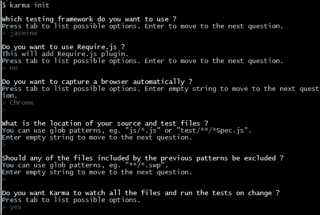
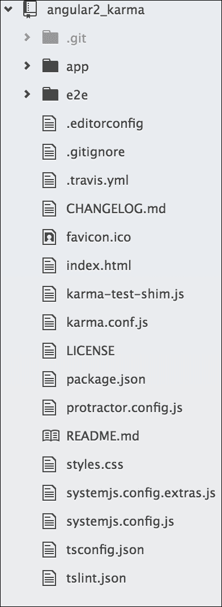
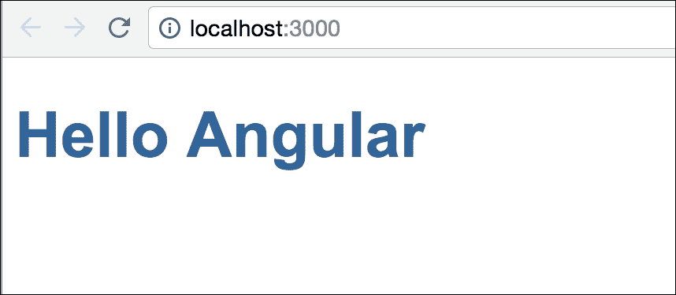
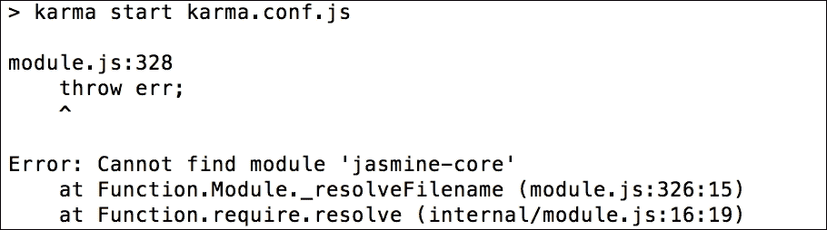

# 第三章。Karma 的方式

多亏了 Karma，JavaScript 测试已经进入主流，Karma 使得测试 JavaScript 变得无缝。Angular 是围绕测试创建的。

在本章中，我们将了解一些关于 Karma 的内容，包括以下内容：

+   Karma 的起源

+   为什么以及 Karma 如何与 Angular 项目协同工作

+   使用 Angular 项目进行 Karma 配置和实现

+   **Travis CI** 概述

# Karma 的诞生

当选择一个新的工具时，了解它的来源和为什么被构建是很重要的。本节将为我们提供 Karma 起源的背景。

## Karma 的差异

Karma 是由 Vojta Jína 创建的。该项目最初被称为 **Testacular**。在 Vojtech Jína 的论文中，他讨论了 Karma 的设计、目的和实现。

在他的论文（*JavasScript Test Runner*，[`github.com/karma-runner/karma/raw/master/thesis.pdf`](https://github.com/karma-runner/karma/raw/master/thesis.pdf)）中，他这样描述 Karma：

> *“...一个帮助 Web 应用程序开发者通过简化自动化测试并使其更快来提高生产力和效率的测试运行器。实际上，我有一个更高的抱负，这篇论文只是其中的一部分——我想推广测试驱动开发（TDD）作为“唯一”的 Web 应用程序开发方式，因为我相信这是开发高质量软件最有效的方式。”*

Karma 具有在真实浏览器上轻松自动运行 JavaScript 单元测试的能力。传统上，测试是通过手动启动浏览器并不断点击刷新按钮来检查结果的。这种方法很笨拙，并且往往导致开发者限制编写的测试数量。

使用 Karma，开发者几乎可以在任何标准测试框架中编写测试，选择要运行的浏览器，设置要监控变化的文件，然后！我们就有了持续自动测试。我们只需简单地检查输出窗口以查看失败的或通过的测试。

## 结合 Karma 和 Angular 的重要性

Karma 是为 AngularJS 构建的。在 Karma 之前，基于 Web 的 JavaScript 开发者缺乏自动化测试工具。

记住，Karma 是一个测试运行器，而不是测试框架。它的任务是运行测试并报告哪些测试会通过或失败。这有什么帮助？测试框架是您编写测试的地方。除了做这件事，您还需要专注于轻松运行测试并查看结果。Karma 可以轻松地在多个不同的浏览器上运行测试。它还有一些其他功能，如文件监控，这些将在本书的后面部分详细讨论。

# 安装 Karma

是时候开始使用 Karma 了。安装和应用程序不断变化。以下指南旨在简明扼要；您可以访问 Karma 网站 [`karma-runner.github.io/`](http://karma-runner.github.io/) 并在那里找到最新的说明。

本节的主要重点将是本书中使用的特定配置，而不是深入的安装指南。

## 安装先决条件

要安装 Karma，我们需要在我们的计算机上安装 Node.js。Node.js 在 Google 的 V8 引擎上运行，并允许 JavaScript 在多个操作系统上运行。

开发者可以使用 **NPM**（**Node 包管理器**）发布节点应用程序和模块。NPM 允许开发者快速将应用程序和模块集成到他们的应用程序中。

Karma 通过 `npm` 包运行和安装；因此，在我们可以使用或安装 Karma 之前，我们需要 Node.js。要安装 Node.js，请访问 [`nodejs.org/`](http://nodejs.org/) 并遵循安装说明。

一旦我们安装了 Node.js，让我们在命令提示符中输入以下命令来安装 Karma：

```js
$ npm install karma -g

```

上述命令使用 `npm` 通过 `-g` 全局安装 Karma。这意味着我们可以在命令提示符中简单地输入以下内容来使用 Karma：

```js
$ karma --version

```

默认情况下，安装 Karma 将安装 `karma-chrome-launcher` 和 `karma-jasmine` 作为依赖项。请确保这些模块也全局安装。

# 配置 Karma

Karma 配备了自动创建配置文件的方式。要使用自动方式，请输入以下命令：

```js
$ karma init

```

这里是选择的一些选项示例：



## 自定义 Karma 的配置

以下说明描述了为使 Karma 在项目中运行所需的特定配置。自定义包括测试框架（Jasmine）、用于测试的浏览器（Chrome）以及要测试的文件。要自定义配置，打开 `karma.conf.js` 并执行以下步骤：

1.  使用以下代码确保启用的框架为 `jasmine`：

    ```js
            frameworks: ['jasmine'], 

    ```

1.  配置 `test` 目录。请注意，以下定义需要包括需要运行的测试以及任何潜在的依赖项。将存放我们测试的目录是 `/test/unit/`：

    ```js
            files: [ 
                'test/unit/**/*.js' 
            ], 

    ```

1.  将测试浏览器设置为 Chrome，如下所示。然后它将在每次测试后初始化并运行一个弹出窗口：

    ```js
            browsers: ['Chrome'], 

    ```

## 确认 Karma 的安装和配置

要确认 Karma 的安装和配置，请执行以下步骤：

1.  运行以下命令以确认 Karma 无错误启动：

    ```js
            $ karma start

    ```

1.  输出应该是这样的：

    ```js
            $ INFO [karma]: Karma v0.12.16 server started at 
            http://localhost:9876/

    ```

1.  此外，输出还应声明没有找到测试文件：

    ```js
            $ WARN [watcher]: Pattern "test/unit/**/*.js" does not
            match any file.

    ```

    输出应该这样做，并伴随一个失败的测试消息：

    ```js
            $ Chrome 35.0.1916 (Windows 7): Executed 0 of 0 ERROR
            (0.016 secs / 0 secs)

    ```

    ### 注意

    一个需要注意的重要点是，我们需要在系统上全局安装 `jasmine-core`，否则 Karma 将无法成功运行。

这是预期的，因为没有创建任何测试。如果 Karma 启动，请继续到下一步，我们将看到以下输出的 Chrome 浏览器：


## 常见的安装/配置问题

如果缺少 Jasmine 或 Chrome 启动器，请执行以下步骤：

1.  运行测试时，可能会出现错误，表示**缺少 Jasmine 或 Chrome Launcher**。如果你遇到这个错误，请输入以下命令来安装缺少的依赖项：

    ```js
            $ npm install karma-jasmine -g
            $ npm install karma-chrome-launcher -g

    ```

1.  重试测试并确认错误已被解决。

    在某些情况下，你可能无法使用`-g`命令全局安装`npm_modules`。这通常是由于你的计算机上的权限问题。以下是你需要做的来提供权限（sudo/administrator）：

    1.  解决方案是在你的项目文件夹中直接安装 Karma。使用不带`-g`的相同命令来完成此操作：

        ```js
                        $ npm install karma

        ```

    1.  使用相对路径运行 Karma：

        ```js
                        $ ./node_modules/karma/bin/karma --version

        ```

现在 Karma 已安装并运行，是时候开始使用了。

# 使用 Karma 进行测试

在本节中，我们将创建一个测试来确认 Karma 按预期工作。为此，执行以下步骤：

1.  创建测试目录。在 Karma 配置中，测试定义在以下目录：

    ```js
            files: [ 
                   'test/unit/**/*.js' 
               ], 

    ```

1.  继续创建`test/unit`目录。

1.  在`test/unit`目录中创建一个新的`firstTest.js`文件。

1.  按如下方式编写第一个测试：

    ```js
            describe('when testing karma', function (){ 
              it('should report a successful test', function (){ 
                expect(true).toBeTruthy(); 
                  }); 
            }); 

    ```

前面的测试使用了 Jasmine 函数，并具有以下属性：

+   `describe`：这提供了一个简短的字符串描述测试套件，将要测试的内容。

+   `it`：这提供了一个简短的字符串，表示特定的断言，即测试规范

+   `expect`：这提供了一种断言值的方法

+   `toBeTruthy`：这是期望的几个属性之一，可以用来进行断言

此测试除了确认通过测试的输出外，没有其他实际价值。

嘭！让我们检查我们的控制台窗口，看看 Karma 是否已执行我们的测试。并且我们的命令行应该像这样：

```js
$ INFO [watcher]: Added file "./test/unit/firstTest.js"

```

此输出意味着 Karma 自动识别到已添加新文件。下一个输出应该是这样的：

```js
$ Chrome 35.0.1916 (Windows 7): Executed 1 of 1 SUCCESS (0.02 secs 
    / 0.015 secs)

```

这意味着我们的测试已经通过！

# 确认 Karma 安装

现在，Karma 的初始设置和配置已完成。以下是步骤回顾：

1.  我们通过`npm`命令安装了 Karma。

1.  我们通过`karma init`命令初始化了一个默认配置。

1.  接下来，我们使用 Jasmine 和`test/unit`测试目录配置了 Karma。

1.  我们启动了 Karma 并确认它可以与 Chrome 一起打开。

1.  然后，我们在`test/unit`测试目录中添加了一个 Jasmine 测试，`firstTest.js`。

1.  Karma 识别到`firstTest.js`已被添加到测试目录。

1.  最后，Karma 执行了我们的`firstTest.js`并报告了我们的输出。

通过几个步骤，我们能够看到 Karma 正在运行并自动执行测试。从 TDD 的角度来看，我们可以专注于将测试从失败转换为通过，而不需要付出太多努力。无需刷新浏览器；只需检查命令输出窗口。保持 Karma 运行，所有我们的测试和文件将自动添加并运行。

在接下来的章节中，我们将看到如何使用 TDD 方法应用 Karma。如果你对 Karma 感到满意并想继续到 Protractor，请跳到下一章。

# 使用 Karma 与 Angular

在这里，我们将通过 TDD 方法来介绍 Angular 组件。到本章结束时，我们应该能够做到以下几点：

+   对使用 Karma 及其配置有信心

+   理解 Jasmine 测试的基本组件

+   开始理解 TDD 方法在 Angular 应用程序中的集成

## 获取 Angular

Angular 的安装不能通过 Bower 进行；就像 Angular1 一样，它必须通过 npm 安装。启动 Angular 应用程序不像 Angular1 那样简单，因为 Angular 不使用纯 JavaScript。它使用 TypeScript 或 ES6（ES2015），这两种都需要在运行之前编译成纯 JavaScript。

我们相信大多数开发者已经了解 Angular 的变化以及其编译方式。快速回顾一下——在我们的 Angular 示例项目中，我们将使用 TypeScript，尽管有使用 ES6 的选项。我们将使用 node/npm tsc 模块将 TypeScript 编译成纯 JavaScript；node/npm 也将是我们的 CLI 工具，用于构建/启动项目并运行测试。

需要基本了解 node/npm 模块，特别是 npm 命令的工作方式。

### Angular 项目

我们将不会演示如何安装 Angular 以及如何从头开始构建项目，因为 Angular 文档网站已经很好地展示了这一点。因此，我们将从 Angular 团队提供的示例中获取一个简单的 Angular 项目，并更新它以适应我们的实现。

我们将从 Angular GitHub 仓库克隆`quickstart`项目，并从那个项目开始。希望我们所有人都已经全局安装了`git`，除了 node/npm。

```js
$ git clone https://github.com/angular/quickstart.git angular-
    karma

```

这将把项目复制到本地作为`angular-karma`，文件夹结构将如图所示：



让我们继续进行并准备运行：

```js
$ cd angular-karma
$ npm install

```

下面是一些准备示例项目的步骤。`npm install`命令将安装项目根目录中`package.json`文件定义的项目依赖所需的模块。

然后，我们将使用`npm start`运行项目；这个脚本定义在`package.json`中，用于在本地服务器上运行项目。

让我们编译并运行项目：

```js
$ npm start

```

如果所有必需的依赖项都已安装，此命令将编译 TypeScript 到纯 JavaScript，并在本地服务器上运行项目。

项目将在浏览器中启动，外观如下：



如果这个示例项目运行成功，那么我们就可以进入下一步，在那里我们将添加测试规范，这将包括 Karma，并使用 Karma 运行器运行这些测试。

### 准备工作

由于我们克隆了示例 `quickstart` 项目，该项目已经集成了并配置了 Karma。为了学习目的，我们希望在现有项目中集成 Karma。

要这样做，我们必须从项目根目录中删除现有的 `karma.conf.js` 文件。此外，我们还将从 `node_modules` 中删除 Karma、Jasmine 和相关模块。

有趣的是，我们不必手动操作，可以轻松地使用一个简单的命令创建基本的 Karma 配置文件。并且使用这个命令时，它将询问一些基本问题，就像我们在本章前面的部分所看到的那样。

## 设置 Karma

在 Angular 项目中设置 Karma，首要任务是创建一个位于项目根目录的 `karma.conf.js` 文件。这个文件基本上包含了一些键值对形式的配置。

有趣的是，我们不必手动操作，可以轻松地使用一个简单的命令创建基本的 Karma 配置文件。并且使用这个命令时，它将询问一些基本问题，就像我们在本章前面的部分所看到的那样：

```js
$ karma init

```

使用默认答案。在当前目录中创建 `karma.conf.js` 后，打开配置。可能需要更改一些配置，主要是 Karma 要使用的文件定义。

在 `files` 部分使用以下定义，它定义了运行测试所需的文件：

```js
files: [ 
        // System.js for module loading 
      'node_modules/systemjs/dist/system.src.js', 

      // Polyfills 
      'node_modules/core-js/client/shim.js', 
      'node_modules/reflect-metadata/Reflect.js', 

      // zone.js 
      'node_modules/zone.js/dist/zone.js', 
      'node_modules/zone.js/dist/long-stack-trace-zone.js', 
      'node_modules/zone.js/dist/proxy.js', 
      'node_modules/zone.js/dist/sync-test.js', 
      'node_modules/zone.js/dist/jasmine-patch.js', 
      'node_modules/zone.js/dist/async-test.js', 
      'node_modules/zone.js/dist/fake-async-test.js', 

// RxJs 
      { pattern: 'node_modules/rxjs/**/*.js', included: false,
      watched: false },      { pattern: 'node_modules/rxjs
      /**/*.js.map', included: false,        watched: false }, 

// Angular itself 
      { pattern: 'node_modules/@angular/**/*.js', included: 
      false,        watched: false }, 

{ pattern: 'systemjs.config.js', included: false, watched: false }, 
      { pattern: 'systemjs.config.extras.js', included: false,   
      watched: false }, 
      'karma-test-shim.js', 

          {pattern: 'app/**/*.js', included: false, watched: true} 
    ] 

```

### 注意

在这里，通过模式，我们传递了两个选项，`included` 和 `watched`。`included` 指的是我们是否想要包含带有 `<script>` 标签的文件；在这里，我们将通过 SystemJS 添加它，所以这被传递为 `false`。而 `watched` 指的是在文件更改期间是否需要监视这个文件。我们将其设置为 `true`，因为我们想监视更改。

好像添加了很多文件，但这些是基本文件，是运行测试所必需的。

让我们更仔细地看看这些文件。在第一部分，这些主要是库文件，包括作为模块加载器的 SystemJS、作为同步处理器的 zonejs、作为响应式库的 RxJS 以及 Angular 库本身。

重要的是，第二部分中有一个新文件 `karma-test-shim.js`，我们需要将其与 Karma 一起作为测试套件中的模块加载器使用，即使用 SystemJS 加载 Karma 测试运行器中的模块。我们将在本节稍后查看该文件。

然后，这就是我们的应用程序源文件；我们将在同一目录中放置测试/规范文件，这样它们将加载所有我们的模块文件，包括它们的测试/规范文件。

除了文件之外，我们可能还需要根据需求更改一些更多的配置点，如下所示：

+   `plugins`：这是必需的，因为 Karma 将使用这些 `npm` 模块来执行。如果我们计划使用更多的 `npm` 模块，我们需要在这里添加它们；例如，如果我们计划使用 PhantomJS 作为我们的浏览器，我们需要在列表中添加 `'karma-phantomjs-launcher'`：

    ```js
            plugins: [ 
    'karma-jasmine', 
    'karma-chrome-launcher' 
       ] 

    ```

+   `frameworks`：目前不需要更改，因为默认情况下它选择 Jasmine；然而，如果我们计划使用其他框架，如 Mocha，则需要更新它。在这种情况下，以下选项应该更新：

    ```js
            frameworks: ['jasmine'], 

    ```

+   `browsers`：当我们需要同时在多个浏览器中运行测试时，这很有用，而且大多数时候，我们可能需要在 PhantomJS 中运行测试，因此我们可以添加多个浏览器，如下所示：

    ```js
            browsers: ['Chrome', 'PhantomJS'] 

    ```

到目前为止，这些是我们需要在 `karma.conf.js` 文件中进行的更改。

让我们看看我们的 `karma.conf.js` 文件，看看它看起来是什么样子：

```js
module.exports = function(config) { 

  config.set({ 
    basePath: '', 
    frameworks: ['jasmine'], 
    plugins: [ 
      require('karma-jasmine'), 
      require('karma-chrome-launcher') 
    ], 

    files: [ 
      // System.js for module loading 
      'node_modules/systemjs/dist/system.src.js', 

      // Polyfills 
      'node_modules/core-js/client/shim.js', 
      'node_modules/reflect-metadata/Reflect.js', 

      // zone.js 
      'node_modules/zone.js/dist/zone.js', 
      'node_modules/zone.js/dist/long-stack-trace-zone.js', 
      'node_modules/zone.js/dist/proxy.js', 
      'node_modules/zone.js/dist/sync-test.js', 
      'node_modules/zone.js/dist/jasmine-patch.js', 
      'node_modules/zone.js/dist/async-test.js', 
      'node_modules/zone.js/dist/fake-async-test.js', 

      // RxJs 
      { pattern: 'node_modules/rxjs/**/*.js', included: false,
      watched: false },     
      { pattern: 'node_modules/rxjs/**/*.js.map', included: 
      false,        watched: false }, 

      // Paths loaded via module imports: 
      // Angular itself 
      { pattern: 'node_modules/@angular/**/*.js', included: 
      false,        watched: false },
      { pattern: 'node_modules/@angular/**/*.js.map', included: 
      false, watched: false },
      { pattern: 'systemjs.config.js', included: false, 
      watched:        false },
      { pattern: 'systemjs.config.extras.js', included: false,
      watched: false },

      'karma-test-shim.js', 

      { pattern: 'app/**/*.js', included: false, watched: true } 
    ], 

    port: 9876, 
    colors: true, 
    autoWatch: true, 
    browsers: ['Chrome'], 
    singleRun: false 
  }) 
}
```

我们在文件列表中添加的另一个重要文件是 `karma-test-shim.js`；正如我们之前提到的，它是我们使用 Karma 与 SystemJS（模块加载器）所需的；我们已经从 Angular 快速启动项目中复制了该文件，并且根据项目结构，这可能需要做出一些更改。

让我们看看我们的 `karma.conf.js` 文件：

```js
Error.stackTraceLimit = 0; // "No stacktrace"" is usually best for app testing. 

jasmine.DEFAULT_TIMEOUT_INTERVAL = 1000; 

var builtPath = '/base/app/'; 

__karma__.loaded = function () { }; 

function isJsFile(path) { 
  return path.slice(-3) == '.js'; 
} 

function isSpecFile(path) { 
  return /\.spec\.(.*\.)?js$/.test(path); 
} 

function isBuiltFile(path) { 
  return isJsFile(path) && (path.substr(0, builtPath.length) == 
  builtPath); 
} 

var allSpecFiles = Object.keys(window.__karma__.files) 
  .filter(isSpecFile) 
  .filter(isBuiltFile); 

System.config({ 
  baseURL: 'base', 
  // Extend usual application package list with test folder 
  packages: { 'testing': { main: 'index.js', defaultExtension: 'js' 
  } }, 

  // Assume npm: is set in `paths` in systemjs.config 
  // Map the angular testing umd bundles 
  map: { 
    '@angular/core/testing':      
'npm:@angular/core/bundles/core-testing.umd.js',    
'@angular/common/testing':      
'npm:@angular/common/bundles/common-testing.umd.js',    
'@angular/compiler/testing':      
'npm:@angular/compiler/bundles/compiler-testing.umd.js',    
'@angular/platform-browser/testing':      
'npm:@angular/platform-browser/bundles/     
platform-browser-testing.umd.js',    
'@angular/platform-browser-dynamic/testing':      'npm:@angular/platform-browser-dynamic/bundles    
 /platform-browser-dynamic-testing.umd.js',    
'@angular/http/testing':      
'npm:@angular/http/bundles/http-testing.umd.js',    
'@angular/router/testing':      
'npm:@angular/router/bundles/router-testing.umd.js',    
'@angular/forms/testing':      
'npm:@angular/forms/bundles/forms-testing.umd.js', 
  }, 
}); 

System.import('systemjs.config.js') 
  .then(importSystemJsExtras) 
  .then(initTestBed) 
  .then(initTesting); 

/** Optional SystemJS configuration extras. Keep going w/o it */ 
function importSystemJsExtras(){ 
  return System.import('systemjs.config.extras.js') 
  .catch(function(reason) { 
    console.log( 
      'Warning: System.import could not load the optional        "systemjs.config.extras.js". Did you omit it by accident?        Continuing without it.' 
    ); 
    console.log(reason); 
  }); 
} 

function initTestBed(){ 
  return Promise.all([ 
    System.import('@angular/core/testing'), 
    System.import('@angular/platform-browser-dynamic/testing') 
  ]) 

  .then(function (providers) { 
    var coreTesting    = providers[0]; 
    var browserTesting = providers[1]; 

    coreTesting.TestBed.initTestEnvironment( 
      browserTesting.BrowserDynamicTestingModule, 
      browserTesting.platformBrowserDynamicTesting()); 
  }) 
} 

// Import all spec files and start karma 
function initTesting () { 
  return Promise.all( 
    allSpecFiles.map(function (moduleName) { 
      return System.import(moduleName); 
    }) 
  ) 
  .then(__karma__.start, __karma__.error); 
} 

```

### 测试 Karma 运行器

Karma 的初始设置几乎完成；我们将运行我们的测试并看看进展如何。在运行之前，我们还需要做一件事--我们必须在 `npm` 脚本中添加 `karma` 任务，以便通过 `npm` 命令运行。为此，我们将在 `package.json` 文件的脚本部分添加一个名为 `test` 的任务：

```js
"scripts": { 
     "test": "karma start karma.conf.js" 
  } 

```

添加此片段后，我们可以通过 `npm` 运行测试，使用 `npm test`，这与 `karma start` 的工作方式相同：

```js
$ npm test

```

所以，最终，我们准备通过 Karma 运行我们的测试。然而，哎呀，我们遇到了一些错误！缺少了运行测试所需的 `jasmine-core` 模块；实际上，可能还有更多模块缺失。

出现错误的输出如下：



是的，我们确实缺少了模块，这些实际上是我们的测试套件中的开发依赖项。在下一节中，我们将了解更多关于它们的信息。

### 缺少依赖项

虽然我们正在为 Angular 构建一个基本的测试套件，但我们仍然缺少一些必需的 npm 模块，这些是测试套件的开发依赖项，如下所示：

+   `jasmine-core`：这表示 Jasmine 是我们的测试框架

+   `karma`：这是我们的测试套件的 Karma 测试运行器

+   `karma-chrome-launcher`：这是从 Karma 启动 Chrome 所必需的，因为我们已在 `karma.config` 中定义 Chrome 为我们的浏览器

+   `karma-jasmine`：这是 Karma 对 Jasmine 的适配器

只要这些是依赖项，我们就应该安装这些模块，并将它们包含在 `package.json` 中。

我们可以像这里显示的那样一起安装所有这些模块：

```js
$ npm install jasmine-core karma karma-chrome-launcher karma-
    jasmine --save-dev

```

在成功安装所有必需的依赖项后，看起来我们的配置过程已经完成，我们准备再次运行 `test`：

```js
$ npm test

```

命令输出应该显示如下：

```js
$ Chrome 39.0.2623 (Mac OS X 10.10.5): Executed 0 of 0 ERROR 
    (0.003 secs / 0 secs) 

```

就这些了。Karma 现在正在运行第一个 Angular 应用程序。

# 使用 Angular 和 Karma 进行测试

使用 Karma 进行的第一次测试的目的是创建一个动态待办事项列表。这次演练将遵循我们在第一章中讨论的 TDD 步骤，*测试驱动开发简介*：先测试，然后运行，然后改进。这将使我们能够获得更多使用 Angular 应用程序进行 TDD 的经验。

## 一个开发待办事项列表

在我们开始测试之前，让我们通过一个开发待办事项列表来集中关注需要开发的内容。这将使我们能够组织我们的思想。

这是待办事项列表：

+   **维护项目列表**：示例列表包括测试、执行和重构

+   **向列表中添加一个项目**：在添加项目后，示例列表是测试、执行、重构和重复

+   **从列表中删除一个项目**：在添加和删除项目后，示例列表是测试、执行和重构

## 测试项目列表

第一项开发任务是提供在组件上拥有项目列表的能力。接下来的几个步骤将引导我们通过 TDD 生命周期添加第一个功能。

### 先测试

确定从哪里开始通常是最难的部分。最好的方法是记住三个**A**（**组装**、**动作**和**断言**）并从基本的 Jasmine 模板格式开始。执行此操作的代码如下：

```js
describe('Title of the test suite', () => { 
    beforeEach(() => { 
        // .... 
    }); 

    it('Title of the test spec', () => { 
        // .... 
    }); 
}); 

```

让我们看看解释：

+   `describe`: 这定义了我们正在测试的主要功能。字符串将以可读的术语解释功能，然后函数将跟随测试。

+   `beforeEach`: 这是一步组装步骤。在这个步骤中定义的函数将在每个断言之前执行。最好在这个函数中在每个测试之前放置所需的测试设置。

+   `it`: 这是一步动作和断言步骤。在`it`部分，我们将执行正在测试的动作，然后进行一些断言。动作步骤不需要进入`it`函数。根据测试，它可能更适合在`beforeEach`函数中。

### 三个 A - 组装、动作和断言

现在模板已经准备好了，我们可以开始将这些部分拼凑起来。我们还将遵循三个 A 的咒语。

以下是组装部分的两个部分。

在第一部分，我们使用以下代码初始化组件并执行类的构造函数：

```js
import { async, ComponentFixture, TestBed } from '@angular/core/testing'; 

import { AppComponent } from './app.component'; 

beforeEach(async(() => { 
   TestBed.configureTestingModule({ 
      declarations: [ AppComponent ] 
    }) 
    .compileComponents(); 
  })); 

beforeEach(() => { 
    fixture = TestBed.createComponent(AppComponent); 
    comp = fixture.componentInstance; 
}); 
... 

```

在这里，我们导入了某些 Angular 测试 API，例如`async`和`Testbed`。在这里，`async`用于加载所需的模块以引导应用程序进行测试套件，而`TestBed`是编写 Angular API 单元测试的主要 API。它有一些服务用于在测试套件中创建、编译和初始化组件。

我们还没有定义`AppComponent`组件，但我们在得到失败的测试后将会这样做。

第二部分讨论了`AppComponent`对象。`AppComponent`对象将包含其`this`变量上的项目列表。将以下代码添加到`beforeEach`中，以获取组件对象：

```js
// comp will hold the component object  
let comp: AppComponent; 
let fixture: ComponentFixture<AppComponent>; 
beforeEach(() => { 
    fixture = TestBed.createComponent(AppComponent); 
    comp = fixture.componentInstance; 
}); 

```

在断言中，又有两个部分：

第一个断言是确保 `AppComponent` 对象有一个名为 `items` 的变量定义，包含三个项目。`items` 变量将用于存储所有项目的列表：

```js
it('Should define a list object', () => { 
        expect(com.items).toBeDefined(); 
    }); 

```

第二个和第三个断言将用于确认列表中的数据是否正确：

```js
//Second test 
it('Should have 3 items in list', () => { 
        expect(com.items.length).toBe(3); 
    }); 

//Third test 
it('List items should be as expected', () => { 
        expect(com.items).toEqual(['test','execute','refactor']); 
    }); 

```

就这些；第一个是 test，第二个是 execute，第三个是 refactor。

### 让它运行

TDD 生命周期的下一步是让应用程序运行，并修复代码以便测试通过。记住，通过以下步骤考虑可以添加的最小组件，以使测试通过：

1.  通过输入以下命令运行 Karma 测试：

    ```js
    $ npm start
    $ npm test

    ```

1.  如果我们遇到 `TypeError: app_component_1.AppComponent is not a constructor` 错误，那么它可能是因为以下原因：

    +   前面的错误信息表明 `AppComponent` 对象尚未定义。由于错误信息告诉我们需要什么，这是一个完美的开始点。

1.  将 `AppComponent` 类添加到 `app.component.ts` 文件中，如下所示：

    ```js
            export class AppComponent { };
    ```

1.  再次从 `npm` 控制台运行 `start` 和 `test` 命令。现在我们应该看到一个新错误。**错误**：`The expected undefined to be defined as follow`

    +   新的错误信息再次清晰。我们还可以看到代码现在已经通过了以下断言点：

        ```js
                       expect(com.items).toBeDefined();
        ```

    +   由于对象中没有项目，我们需要添加一个。按照以下方式更新 `app/app.component.ts` 文件：

        ```js
                      export class AppComponent { 
                          items:Array<string>; 
                      }; 

        ```

1.  让我们从 npm 控制台再次运行 `start` 和 `test` 命令。现在我们应该看到三个测试中的一个通过！这意味着我们已经成功使用 TDD 和 Karma 通过了第一个测试。现在，我们需要修复其他三个。

    +   下一个错误是：`expected 0 to equal 3`

    +   错误输出再次准确地描述了需要发生的事情。我们只需要初始化数组，包含元素 test、execute 和 run。让我们转到 `app/app.component.ts` 并将数据添加到数组初始化中：

        ```js
                    export class AppComponent { 
                        items:Array<string>; 
                        constructor() { 
                            this.items = ['test','execute','refactor']; 
                        } 
                    }; 

        ```

1.  再次从 npm 控制台运行 `start` 和 `test` 命令。太棒了！输出是绿色的，表示所有测试都已通过。此步骤的结果组件和类代码如下：

    ```js
            import {Component} from '@angular/core'; 

            @Component({ 
                // ...  
            }) 

            export class AppComponent { 
                items:Array<string>; 
                constructor() { 
                    this.items = ['test','execute','refactor']; 
                } 
            }; 

    ```

现在 *让它运行* 步骤已经完成，我们可以继续下一步，让它变得更好。

### 让它变得更好

到目前为止，没有直接需要重构的或已在开发待办事项列表中识别出的内容。审查开发待办事项列表显示，可以勾掉一项：

+   **查看待办事项列表项的列表**：示例列表包括 test、execute 和 refactor

+   **向待办事项列表添加一项**：在我们添加项目后，示例列表将包括 test、execute、refactor 和新项目

接下来是添加新项目到列表的要求。我们将再次遵循 TDD 节奏：先测试，然后运行，最后改进。

## 向组件类添加一个函数

下一个任务是给类添加添加项目到对象的能力。这需要向对象添加一个方法。本指南将遵循我们之前遵循的相同 TDD 步骤。

### 先进行测试

而不是创建一个新文件并复制一些组装步骤，以下测试将被插入到最后一个`it`方法下。原因是将使用相同的模块和控制器：

```js
describe('Title of the test suite', () => { 
    let app:AppComponent; 

    beforeEach(() => { 
        // .... 
    }); 

    it('Title of the test spec', () => { 
        // .... 
    }); 

    describe('Testing add method', () => { 

    beforeEach(() => { 
        // .... 
    }); 

    it('Title of the test spec', () => { 
        // .... 
    }); 
   }); 
}); 

```

### 三个 A - 组装、行动和断言

现在模板已经准备好了，我们可以使用 3A 咒语来填补空白：

+   **组装**：由于组件和对象将继承，因此不需要初始化或设置。

+   **行动**：在这里，我们需要使用新项目对`add`方法进行操作。我们将`act`函数放入`beforeEach`函数中。这允许我们在添加更多测试时/如果需要重复相同的步骤：

    ```js
            beforeEach(() => { 
                 com.add('new-item') 
            }); 

    ```

+   **断言**：在这里，应该向列表中添加一个项目，然后需要确认数组中的最后一个项目符合预期：

    ```js
            it('Should have 4 items in list', () => { 
                 expect(com.items.length).toBe(4); 
            }); 
            it('Should add a new item at the end of list', () => { 
                var lastIndexOfList = com.items.length - 1; 
                expect(com.items[lastIndexOfList]).toEqual('new-item'); 
            }); 

    ```

### 让它运行

TDD 生命周期中的下一步是让它运行。记住，考虑可以添加的最小组件以使测试通过，如下所示：

+   通过输入以下命令确保 Karma 在我们的控制台中运行：

    ```js
    $ npm start
    $ npm test

    ```

+   第一个错误将声明`TypeError: undefined is not a function`。

    这个错误指的是以下代码行：

    ```js
            app.add('new-item'); 

    ```

    错误告诉我们`add`方法尚未定义。需要将`add`函数添加到`app/app.component.ts`代码中。类已经定义，因此需要将`add`函数放在类中：

    ```js
            add() { 
                    this.items.push('new-item'); 
            }; 

    ```

    注意`add`函数不包含任何逻辑。已经添加了最小的组件以使测试满足错误信息。

+   查看控制台窗口以获取下一个错误。

成功！现在所有五个测试都已通过。

为了使测试通过，添加的代码如下：

```js
import {Component} from '@angular/core'; 

@Component({ 
    selector: 'my-app', 
    template: `<h3>MY Items</h3><ul><li *ngFor="let item of items">{{ 
    item }}</li></ul>` 
}) 

export class AppComponent { 
    items:Array<string>; 
    constructor() { 
        this.items = ['test','execute','refactor']; 
    } 
    add() { 
        this.items.push('new-item'); 
    } 
}; 

```

### 让它变得更好

我们需要重构的主要问题是`add`函数尚未完全实现。它包含一个硬编码的值，一旦我们向`add`函数发送不同的项目，测试就会失败。

保持 Karma 运行，以便在做出更改时继续通过测试。当前`add`方法的主要问题如下：

+   它不接受任何参数

+   它没有将参数推送到列表中，而是使用硬编码的值

现在的`add`函数应该看起来如下：

```js
        add(item) { 
            this.items.push(item); 
        }; 

```

再次从`npm`控制台运行`start`和`test`命令。确认 Karma 输出仍然显示`SUCCESS`：

```js
$ Chrome 49.0.2623 (Mac OS X 10.10.5): Executed 5 of 5 SUCCESS
    (0.016 secs / 0.002 secs)

```

# 配置 Karma 与 Travis CI

**持续集成**（**CI**）是一种开发实践，其中开发人员需要将代码集成到共享仓库中。它在与代码库中的任何更改发生时在自动构建过程中运行，并执行测试。这可以在代码推送到生产之前检测到错误。有许多 CI 服务，包括 Travis CI、Jenkins CI、Circle CI 等。

在本节中，我们将看到如何将 Karma 与 Travis 集成。

## Travis CI

Travis CI 是一个流行的托管持续集成平台，它与 GitHub 项目/存储库集成，可以自动在代码库的任何分支或甚至每个 pull request 的更改时运行测试。只需在项目根目录中放置一个包含有关项目配置信息的`.travis.yml`文件，就可以轻松地获得集成系统。

因此，我们可能会问，为什么是 Travis？还有其他一些 CI 服务。如果我们将 Travis 与其他 CI 服务进行比较，它相对于其他服务有一些优势：

+   它是一个托管服务；无需托管、安装和配置

+   它是免费且开源的

+   它为每个分支都有独立的测试代码，因此很容易为单个分支运行测试

## 配置 Travis

如我们所说，我们将在项目目录中有一个`.travis.yml`文件，其中包含一些配置和关于我们项目的信息。

这里是 YAML 文件中的基本配置看起来像什么：

+   **指定语言**：我们在这里使用了 Node.js：

    ```js
            language: node_js 
            node_js: 
                -  "4" 

    ```

+   **命令或脚本**：这是在每次构建前后必需的；如所示，此脚本将在每次运行构建之前设置`git`用户名：

    ```js
            before_script: 
                -  git config - -global user.name jquerygeek  

    ```

在前面的示例中，我们通过 karma 将配置传递给在真实浏览器（Firefox）中运行构建过程，默认使用虚拟屏幕，这已经使用 PhantomJS 无头浏览器运行了该过程。这可能很有用，只要 Travis 支持 PhantomJS 之外的实时浏览器：

```js
        before_script: 
            -  export DISPLAY=:99.0 
            - sh -e /etc/init.d/xvfb start  

```

+   **通知**：这是设置电子邮件和聊天通知所必需的。在这里，我们将`email`设置为`false`，因为我们不希望收到关于构建的过度电子邮件通知：

    ```js
            notifications: 
                email: false  

    ```

## 使用 Karma 设置测试

如前所述，我们猜测我们的项目根目录中有一个`package.json`文件，其中包含 npm 包；如果没有，让我们在那里创建一个`package.json`文件并添加这些配置片段。这里，第一个是 Karma 的依赖项，第二个是为`npm test`设置所需的参数，因为 Travis 将运行此命令来触发我们的测试。这些将告诉 Travis 如何运行我们的测试：

```js
  'devDependencies': { 
      'karma': '~0.12' 
  }, 

  'scripts': { 
      'test': 'karma start  - -single-run - -browsers PhantomJS ' 
  } 

```

我们最初的设置和配置已经准备好进行测试。我们定义了 Karma 依赖项，因为 Travis 将为每个套件运行`nmp install`，并将采取添加 Karma 的必要步骤。在运行测试时，它将调用`npm test`，我们定义了该测试任务将如何运行测试。在这里，我们已将默认浏览器设置为 PhantomJS，以便测试与其一起运行。然而，如果我们需要使用不同的浏览器运行测试，我们应该在`.travis.yml`文件中使用`before_script`命令定义这一点，就像我们之前为 Firefox 所做的那样。

在那种情况下，`npm test`将不会使用自定义浏览器运行测试；为此，我们必须使用浏览器名称进行自定义调用，如下所示：

```js
karma start - -browsers Firefox - -single-run 

```

# 自测问题

以下自我测试问题将帮助你进一步测试你使用 AngularJS 和 Karma 进行 TDD 的知识：

Q1. 你如何使用 Karma 创建一个配置文件？

1.  `karma config`

1.  `karma init`

1.  `karma -config karma.conf.js`

Q2. Jasmine 测试方法，名为`before`，在每次测试之前执行。

1.  正确

1.  错误

Q3. Bower 用于安装 Karma。

1.  正确

1.  错误

Q4. 3A 代表以下哪一个？

1.  一群超级英雄

1.  组装、行动和断言

1.  接受、批准和行动

# 摘要

在本章中，我们讨论了 Karma 如何变得重要。我们看到了如何安装、配置和运行 Karma。最后，我们通过一个使用 Karma 进行 TDD 的 Angular 示例项目进行了演示。

在下一章中，我们将学习使用 Protractor 进行端到端测试。
