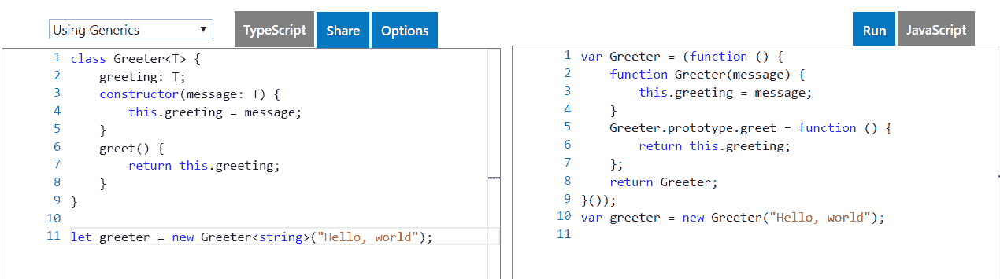
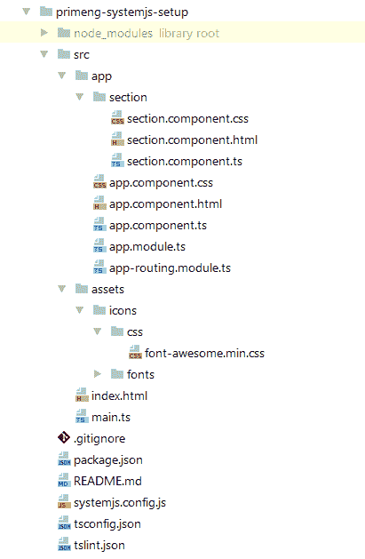
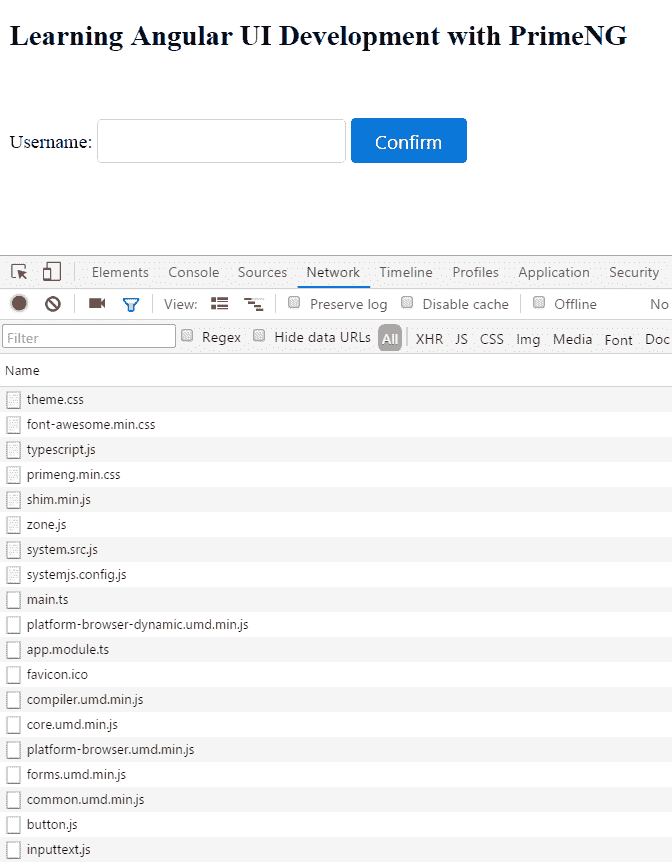
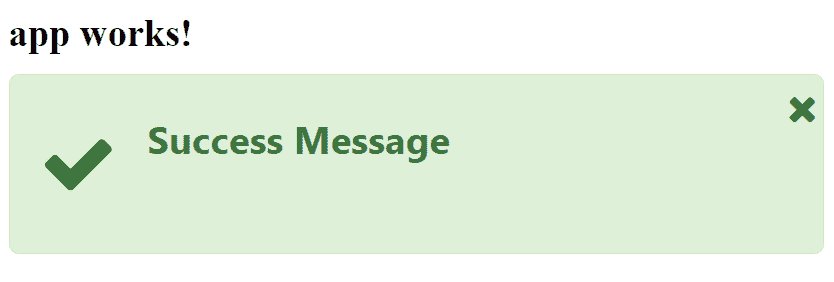

# 第一章：开始使用 Angular 和 PrimeNG

本书假定读者具有一些 TypeScript 和 Angular 2 的基本知识。无论如何，我们希望向读者概述本书中使用的最重要的 TypeScript 和 Angular 关键概念。我们将总结 TypeScript 和 Angular 的特性，并以可理解、简单但深入解释的方式呈现它们。撰写本书时，当前的 TypeScript 和 Angular 版本分别为 2.3.x 和 4.2.x。读者还将首次接触 PrimeNG UI 库，并通过三种不同的方式获得项目设置经验。在本章结束时，读者将能够运行第一个基于 Angular 和 PrimeNG 的 Web 应用程序。

在本章中，我们将涵盖以下主题：

+   TypeScript 基础知识

+   高级类型、装饰器和编译器选项

+   Angular 速查表-关键概念概述

+   Angular 的模块化和生命周期钩子

+   使用 SystemJS 运行 PrimeNG

+   使用 Webpack 设置 PrimeNG 项目

+   使用 Angular CLI 设置 PrimeNG 项目

# TypeScript 基础知识

Angular 2 及更高版本使用了 ECMAScript 2015/2016 和 TypeScript 的功能。新的 ECMAScript 标准针对现代浏览器，并有助于编写更强大、干净和简洁的代码。您还可以在任何其他不太现代的浏览器中使用这些功能，例如`core-js`（[`github.com/zloirock/core-js`](https://github.com/zloirock/core-js)）等 Polyfills。但是，为什么我们需要使用 TypeScript 呢？

TypeScript（[`www.typescriptlang.org`](http://www.typescriptlang.org)）是由微软开发的一种带类型的语言，也是 JavaScript 的超集。可以说 TypeScript 是一种带有可选静态类型的高级 JavaScript。TypeScript 代码不会被浏览器处理，而是需要通过 TypeScript 编译器将其转换为 JavaScript。这种转换被称为*编译*或*转译*。TypeScript 编译器将`.ts`文件转译为`.js`文件。TypeScript 的主要优点如下：

+   类型有助于在开发过程中找到并修复许多错误。这意味着在运行时会有更少的错误。

+   许多现代 ECMAScript 功能都被原生支持。根据路线图，预计会有更多功能被支持（[`github.com/Microsoft/TypeScript/wiki/Roadmap`](https://github.com/Microsoft/TypeScript/wiki/Roadmap)）。

+   出色的工具和 IDE 支持使编码成为一种愉悦。

+   维护和重构 TypeScript 应用比使用无类型的 JavaScript 编写的应用更容易。

+   开发人员喜欢 TypeScript，因为它支持面向对象的编程模式，如接口、类、枚举、泛型等。

+   最后但并非最不重要的是，Angular 2+和 PrimeNG 都是用 TypeScript 编写的。

还要记住以下几点很重要：

+   TypeScript 语言规范表示，*<q>每个 JavaScript 程序也是一个 TypeScript 程序</q>*。因此，从 JavaScript 迁移到 TypeScript 代码很容易。

+   即使报告了任何错误，TypeScript 编译器也会生成输出。在下一节*高级类型、装饰器和编译器选项*中，我们将看到如何在出现错误时禁止生成 JavaScript。

学习 TypeScript 语言的最佳方法是什么？TypeScript 官方主页上有一本官方手册，与最新发布的版本保持一致。可以通过 TypeScript playground（[`www.typescriptlang.org/play`](http://www.typescriptlang.org/play)）进行实践学习，该工具可以即时编译在浏览器中输入的 TypeScript 代码，并将其与生成的 JavaScript 代码并排显示：



或者，您可以在命令行中输入以下命令全局安装 TypeScript。

```ts
npm install -g typescript

```

全局安装意味着 TypeScript 编译器`tsc`可以在任何项目中被访问和使用。需要安装 Node.js 和 npm。Node.js 是 JavaScript 运行时环境（[`nodejs.org`](https://nodejs.org)）。npm 是包管理器。它随 Node.js 一起发布，但也可以单独安装。之后，您可以通过输入以下命令将一个或多个`.ts`文件转译为`.js`文件：

```ts
tsc some.ts another.ts

```

这将生成两个文件，`some.js`和`another.js`。

# 基本类型

TypeScript 公开了基本类型，以及一些额外的类型。让我们通过这些例子来探索类型系统。

+   `Boolean`：该类型是原始的 JavaScript 布尔值：

```ts
let success: boolean = true;

```

+   `Number`：该类型是原始的 JavaScript 数字：

```ts
let count: number = 20;

```

+   `String`：该类型是原始的 JavaScript 字符串：

```ts
let message: string = "Hello world";

```

+   `Array`：该类型是一个值的数组。有两种等价的表示法：

```ts
let ages: number[] = [31, 20, 65];
let ages: Array<number> = [31, 20, 65];

```

+   `Tuple`：该类型表示值的异构数组。`Tuple`可以存储不同类型的多个字段：

```ts
let x: [string, number];
x = ["age", 40];    // ok
x = [40, "age"] ;   // error

```

+   `Any`：该类型是*任何*类型。在编写应用程序时需要描述不知道的变量类型时非常有用。您可以将任意类型的值赋给`any`类型的变量。反过来，`any`类型的值可以赋给任意类型的变量：

```ts
let some: any = "some";
some = 10000;
some = false;

let success: boolean = some;
let count: number = some;
let message: string = some;

```

+   `Void`：该类型表示没有`any`类型。这种类型通常用作函数的返回类型：

```ts
function doSomething(): void {
  // do something
}

```

+   `Nullable`：这些类型表示两种特定类型，`null`和`undefined`，它们是每种类型的有效值。这意味着它们可以分配给任何其他类型。这并不总是理想的。TypeScript 提供了一种通过将编译器选项`strictNullChecks`设置为`true`来更改此默认行为的可能性。现在，您必须显式使用联合类型（稍后解释）包含`Nullable`类型，否则将会出错：

```ts
let x: string = "foo";
x = null;    // error
let y: string | null = "foo";
y = null;    // ok

```

有时，您可能希望告诉编译器，您比它更了解类型，它应该信任您。例如，想象一种情况，您通过 HTTP 接收数据，并且确切地知道接收到的数据的结构。当然，编译器不知道这样的结构。在这种情况下，您希望在将数据分配给变量时关闭类型检查。这可以通过所谓的**类型断言**来实现。类型断言类似于其他语言中的类型转换，但不检查数据。您可以使用*尖括号*或`as`语法来实现。

```ts
let element = <HTMLCanvasElement> document.getElementById('canvas');
let element = document.getElementById('canvas') as HTMLCanvasElement;

```

# 接口、类和枚举

*接口*是一种将特定结构/形状命名的方式，以便我们以后可以引用它作为一种类型。它在我们的代码中定义了一个合同。接口以关键字`interface`开头。让我们举个例子：

```ts
interface Person {
  name: string
  children?: number
  isMarried(): boolean
  (): void
}

```

指定的接口`Person`具有以下内容：

+   类型为`string`的`name`属性。

+   类型为`number`的可选属性`children`。可选属性由问号表示，可以省略。

+   返回`boolean`值的`isMarried`方法。

+   返回空值的匿名（未命名）方法。

Typescript 允许您使用`[index: type]`语法来指定基于`string`或`number`类型的键/值对集合。接口非常适合这样的数据结构。例如，考虑以下语法：

```ts
interface Dictionary {
  [index: number]: string
}

```

接口仅在编译时由 TypeScript 编译器使用，然后被移除。接口不会出现在最终的 JavaScript 输出中。通常，在输出中不会出现类型。您可以在前面提到的 TypeScript playground 中看到这一点！[](assets/5f81e48d-5e0e-447b-8782-272b7fb9a4aa.png)

除了接口，还有描述对象的*类*。类充当实例化特定对象的模板。TypeScript 类的语法几乎与 ECMAScript 2015 中的原生类完全相同，并带有一些方便的附加功能。在 TypeScript 中，您可以使用`public`、`private`、`protected`和`readonly`访问修饰符：

```ts
class Dog {
 private name: string;    // can only be accessed within this class
 readonly owner: string = "Max";    // can not be modified
 constructor(name: string) {this.name = name;}
 protected sayBark() { }
}

let dog = new Dog("Sam");
dog.sayBark();  // compiler error because method 'sayBark' is protected and
                // only accessible within class 'Dog' and its subclasses.

```

省略修饰符的成员默认为`public`。如果使用`static`关键字声明属性或方法，则无需创建实例即可访问它们。

类可以是抽象的，这意味着它可能不能直接实例化。抽象类以关键字`abstract`开头。类可以实现一个接口，也可以扩展另一个类。我们可以使用`implements`和`extends`关键字分别实现这一点。如果一个类实现了某个接口，它必须采用该接口的所有属性；否则，您将收到有关缺少属性的错误：

```ts
interface Animal {
  name: string;
}

class Dog implements Animal {
  name: string;
  // do specific things
}

class Sheepdog extends Dog {
  // do specific things }

```

包含构造函数的派生类必须调用`super()`。`super()`调用在基类上执行构造函数。

可以使用修饰符声明`constructor`参数。结果，一个成员将在一个地方被创建和初始化：

```ts
class Dog {
  constructor(private name: string) { }

  // you can now access the property name by this.name
}

```

在 Angular 中，当我们将服务注入到组件中时，经常会使用这种简化的语法。Angular 的服务通常在组件的构造函数中使用`private`修饰符声明。

这里要提到的最后一个基本类型是*枚举*。枚举允许我们定义一组命名常量。枚举成员与数字值相关联（从 0 开始）：

```ts
enum Color {
  Red,
  Green,
  Blue }

var color = Color.Red;    // color has value 0

```

# 函数

函数签名中的参数和返回值也可以进行类型化。类型保护您免受 JavaScript 错误的影响，因为编译器会在构建时及时警告您使用错误类型：

```ts
function add(x: number, y: number): number {
  return x + y;
}

```

*函数类型*是声明函数类型的一种方式。要显式声明函数类型，您应该使用关键字`var`或`let`，一个变量名，一个冒号，一个参数列表，一个 fat 箭头`=>`，和函数的返回类型：

```ts
var fetchName: (division: Division, customer: Customer) => string;

```

现在，您必须提供此声明的实现：

```ts
fetchName = function (division: Division, customer: Customer): string {
  // do something
}

```

这种技术对于回调特别有用。想象一个根据某些标准过滤数组的过滤函数。一个确切的标准可以封装在传入的回调函数中，作为谓词：

```ts
function filter(arr: number[], callback: (item: number) => boolean): number[] {
  let result: number[] = [];
  for (let i = 0; i < arr.length; i++) {
    if (callback(arr[i])) {
      result.push(arr[i]);
    }
  }
  return result;
}

```

可能的函数调用与特定回调可以如下所示：

```ts
let result = filter([1, 2, 3, 4], (item: number) => item > 3);

```

在 TypeScript 中，假定每个函数参数都是必需的。有两种方法可以将参数标记为可选的（可选参数在调用函数时可以省略）。

+   在参数名称后使用问号：

```ts
function doSomething(param1: string, param2?: string) {
 // ... }

```

+   使用参数的默认值（ECMAScript 2015 功能），当没有提供值时会应用默认值：

```ts
function doSomething(param1: string, param2 = "some value") {
 // ... }

```

现在，您可以只使用一个值调用此函数。

```ts
doSomething("just one value");

```

# 泛型

在 TypeScript 中，您可以像其他编程语言一样定义通用函数、接口和类。通用函数在尖括号中列出类型参数：

```ts
function reverseAndMerge<T>(arr1: T[], arr2: T[]): T[] {
  return arr1.reverse().concat(arr2.reverse());
}

let arr1: number[] = [1, 2, 3];
let arr2: number[] = [4, 5, 6];
let arr = reverseAndMerge(arr1, arr2);

```

这样的通用函数也可以使用通用接口来定义。`reverseAndMerge`的函数签名与以下通用接口兼容：

```ts
interface GenericArrayFn<T> {
  (arr1: T[], arr2: T[]): T[];
}

let arr: GenericArrayFn<number> = reverseAndMerge;

```

请注意，尖括号中的通用类型参数列表跟随函数和接口的名称。对于类也是如此：

```ts
class GenericValue<T> {
  constructor(private value: T) { }
  increment: (x: T) => T;
  decrement: (x: T) => T;
}

let genericValue = new GenericValue<number>(5);
genericValue.increment = function (x) {return ++x;};
genericValue.decrement = function (x) {return --x;};

```

# 模块

ECMAScript 2015 引入了内置模块。模块的特性如下：

+   每个模块都在自己的文件中定义。

+   模块中定义的函数或变量在外部是不可见的，除非你明确导出它们。

+   您可以在任何变量、函数或类声明前放置`export`关键字来从模块中导出它。

+   您可以使用`import`关键字来使用导出的变量、函数或类声明。

+   模块是单例的。即使多次导入，模块的实例也只有一个。

以下列出了一些导出的可能性：

```ts
// export data
export let color: string = "red";

// export function
export function sum(num1: number, num2: number) {
  return num1 + num1;
}

// export class
export class Rectangle {
  constructor(private length: number, private width: number) { }
}

```

您可以声明一个变量、函数或类，并稍后导出它。您还可以使用`as`关键字来重命名导出。新名称是用于导入的名称：

```ts
class Rectangle {
  constructor(private height: number, private width: number) { }
}

export {Rectangle as rect};

```

一旦您有了带有导出的模块，您可以使用`import`关键字在另一个模块中访问其功能：

```ts
import {sum} from "./lib.js";
import {Rect, Circle} from "./lib.js";

let sum = sum(1, 2);
let rect = new Rect(10, 20);

```

有一种特殊情况允许您将整个模块作为单个对象导入。所有导出的变量、函数和类都作为该对象的属性可用：

```ts
import * as lib from "./lib.js";

let sum = lib.sum(1, 2);

```

导入可以使用`as`关键字重命名，并在新名称下使用：

```ts
import {sum as add} from "./lib.js";

let sum = add(1, 2);

```

# 高级类型、装饰器和编译器选项

TypeScript 具有更多类型和高级构造，例如装饰器和类型定义文件。本章概述了高级主题，并展示了如何自定义编译器配置。

# 联合类型和类型别名

*联合类型*描述了可以是多种类型之一的值。竖线`|`用作值可以具有的每种类型的分隔符。例如，`number | string`是一个可以是数字或字符串的值的类型。对于这样的值，我们只能访问联合中所有类型的公共成员。以下代码有效，因为`length`属性存在于字符串和数组中：

```ts
var value: string | string[] = 'some';
let length = value.length;

```

下一个代码片段出现错误，因为`model`属性在`Bike`类型上不存在：

```ts
interface Bike {
  gears: number;
}

interface Car {
  gears: number;
  model: string;
}

var transport: Bike | Car = {gears: 1};
transport.model = "Audi";    // compiler error

```

*类型别名*用作现有类型或类型组合的替代名称。它不创建新类型。类型别名以`type`关键字开头。

```ts
type PrimitiveArray = Array<string|number|boolean>;
type Callback = () => number;
type PrimitiveArrayOrCallback = PrimitiveArray | Callback;

```

类型别名可用于提高代码可读性，例如，在函数参数列表中。

```ts
function doSomething(n: PrimitiveArrayOrCallback): number {
  ...
}

```

类型别名也可以是通用的，并创建棘手的类型，这些类型无法使用接口创建。

# 类型推断

*类型推断*在类型没有明确提供时使用。例如在以下语句中：

```ts
var x = "hello";
var y = 99;

```

这些没有显式类型注释。TypeScript 可以推断出`x`是一个字符串，`y`是一个数字。正如你所看到的，如果编译器能够推断出类型，那么类型可以被省略。TypeScript 不断改进类型推断。当数组中存在多种类型的元素时，它会尝试猜测最佳公共类型。变量`animal`的类型是`Dog[]`，其中`Sheepdog extends Dog`：

```ts
let animal = [new Dog(), new Sheepdog()];

```

下一个数组的最佳公共类型是`(Dog | Fish)[]`，因为类`Fish`没有扩展到任何其他类：

```ts
class Fish {
  kind: string;
}

let animal = [new Dog(), new Sheepdog(), new Fish()];

```

类型推断也用于函数。在下一个示例中，编译器可以推断出函数的参数类型（`string`）和返回值类型（`boolean`）：

```ts
let isEmpty: (param: string) => boolean;
isEmpty = function(x) {return x === null || x.length === 0};

```

# 装饰器

*装饰器*在 ECMAScript 2016 中提出（[`github.com/wycats/javascript-decorators`](https://github.com/wycats/javascript-decorators)）。它们类似于 Java 注解--它们还向类声明、方法、属性和函数的参数添加元数据，但它们更加强大。它们为它们的目标添加了新的行为。使用装饰器，我们可以在目标执行之前、之后或周围运行任意代码，就像面向方面的编程一样，甚至用新定义替换目标。在 TypeScript 中，您可以装饰构造函数、方法、属性和参数。每个装饰器都以`@`字符开头，后面跟着装饰器的名称。

它是如何在底层工作的，以其目标作为参数？让我们实现一个具有日志功能的经典示例。我们想要实现一个方法装饰器`@log`。方法装饰器接受三个参数：定义方法的类的实例，属性的键和属性描述符（[`developer.mozilla.org/en/docs/Web/JavaScript/Reference/Global_Objects/Object/defineProperty`](https://developer.mozilla.org/en/docs/Web/JavaScript/Reference/Global_Objects/Object/defineProperty)）。

如果方法装饰器返回一个值，它将被用作此方法的新属性描述符：

```ts
const log = (target: Object, key: string | symbol, descriptor: PropertyDescriptor) => {
  // save a reference to the original method
  var originalMethod = descriptor.value;
  // replace the original function
 descriptor.value = function(...args: any[]) {
    console.log("Arguments: ", args.join(", "));
    const result = originalMethod.apply(target, args);
    console.log("Result: ", result);
    return result;
  }
 return descriptor;
}

class Rectangle {
  @log
  area(height: number, width: number) {
    return height * width;
  }
}

let rect = new Rectangle();
let area = rect.area(2, 3);

```

这个装饰器记录接收到的参数和返回值。装饰器也可以组合和定制参数。例如，您可以编写以下内容：

```ts
class Rectangle {
  @log("debug")
  @persist("localStorage")
  area(height: number, width: number) {
    return height * width;
  }
}

```

Angular 提供了不同类型的装饰器，用于依赖注入或在编译时添加元数据信息：

+   类装饰器，如`@NgModule`，`@Component`和`@Injectable`

+   属性装饰器，如`@Input`和`@Output`

+   方法装饰器，如`@HostListener`

+   参数装饰器，如`@Inject`

TypeScript 编译器能够为装饰器发出一些设计时类型元数据。要访问这些信息，我们必须安装一个名为`reflect-metadata`的 Polyfill：

```ts
npm install reflect-metadata --save

```

现在我们可以访问，例如，在`target`对象上的属性（`key`）的类型如下：

```ts
let typeOfKey = Reflect.getMetadata("design:type", target, key);

```

请参阅官方 TypeScript 文档，了解有关装饰器和反射元数据 API 的更多信息（[`www.typescriptlang.org/docs/handbook/decorators.html`](http://www.typescriptlang.org/docs/handbook/decorators.html)）。在 TypeScript 中，Angular 应用程序，通过将编译器选项`emitDecoratorMetadata`和`experimentalDecorators`设置为`true`来启用装饰器（编译器选项稍后描述）。

# 类型定义文件

用原生 JavaScript 编写的 JavaScript 程序没有任何类型信息。如果您将 JavaScript 库（如 jQuery 或 Lodash）添加到基于 TypeScript 的应用程序中并尝试使用它，TypeScript 编译器可能找不到任何类型信息，并通过编译错误警告您。编译时安全性、类型检查和上下文感知的代码完成都会丢失。这就是*类型定义文件*发挥作用的地方。

类型定义文件为静态类型的 JavaScript 代码提供类型信息。类型定义文件以`.d.ts`结尾，只包含 TypeScript 未发出的定义。`declare`关键字用于向 JavaScript 代码添加类型，该代码存在于某个地方。让我们举个例子。TypeScript 附带了描述 ECMAScript API 的`lib.d.ts`库。这个类型定义文件会被 TypeScript 编译器自动使用。以下声明在此文件中定义，但没有实现细节：

```ts
declare function parseInt(s: string, radix?: number): number;

```

现在，当您在代码中使用`parseInt`函数时，TypeScript 编译器会确保您的代码使用正确的类型，并且在编写代码时，IDE 会显示上下文敏感的提示。类型定义文件可以通过输入以下命令作为依赖项安装在`node_modules/@types`目录下：

```ts
npm install @types/<library name> --save-dev

```

jQuery 库的一个具体例子是：

```ts
npm install @types/jquery --save-dev

```

在 Angular 中，所有类型定义文件都与 Angular npm 包捆绑在一起，位于`node_modules/@angular`目录下。无需像我们为 jQuery 那样单独安装这些文件。TypeScript 会自动找到它们。

大多数情况下，您的编译目标是 ES5（生成的 JavaScript 版本，得到广泛支持），但希望通过添加 Polyfills 来使用一些 ES6（ECMAScript 2015）功能。在这种情况下，您必须告诉编译器它应该在`lib.es6.d.ts`或`lib.es2015.d.ts`文件中查找扩展定义。这可以通过在编译器选项中设置以下内容来实现：

```ts
"lib": ["es2015", "dom"]

```

# 编译器选项

通常，在新的 TypeScript 项目中的第一步是添加一个 `tsconfig.json` 文件。该文件定义了项目和编译器的设置，例如要包含在编译中的文件和库，输出结构，模块代码生成等。`tsconfig.json` 中用于 Angular 2+ 项目的典型配置如下：

```ts
{
  "compilerOptions": {
    "target": "es5",
    "module": "es2015",
    "moduleResolution": "node",
    "noImplicitAny": true,
    "sourceMap": true,
    "emitDecoratorMetadata": true,
    "experimentalDecorators": true,
    "outDir": "dist",
    "lib": ["es2015", "dom"]
  },
  "types": ["node"],
  "exclude": ["node_modules", "dist"]
}

```

所列的编译器设置如下所述。所有选项的完整列表可在 TypeScript 文档页面上找到（[`www.typescriptlang.org/docs/handbook/compiler-options.html`](https://www.typescriptlang.org/docs/handbook/compiler-options.html)）。

| **选项** | **类型** | **默认** | **描述** |
| --- | --- | --- | --- |
| `target` | `string` | `ES3` | 这指定了 ECMAScript 的目标版本：`ES3`, `ES5`, `ES2015`, `ES2016`, 和 `ES2017`。 |
| `module` | `string` | `ES6` if target is "ES6" and `CommonJS` otherwise | 这指定了模块代码生成的格式：`None`, `CommonJS`, `AMD`, `System`, `UMD`, `ES6`, 或 `ES2015`。 |
| `moduleResolution` | `string` | `Classic` if module is "AMD," `System`, `ES6`, and `Node` otherwise | 这确定了模块的解析方式。要么是 `Node` 用于 Node.js 风格的解析，要么是 `Classic`。 |
| `noImplicitAny` | `boolean` | `false` | 这会在具有隐含的 `any` 类型的表达式和声明上引发错误。 |
| `sourceMap` | `boolean` | `false` | 这会生成相应的 `.map` 文件。如果你想要调试原始文件，这是很有用的。 |
| `emitDecoratorMetadata` | `boolean` | `false` | 这会为源代码中装饰的声明发出设计类型元数据。如果你想要开发带有 Angular 的 Web 应用程序，你必须将这个值设置为 `true`。 |
| `experimentalDecorators` | `boolean` | `false` | 这启用了对 ECMAScript 装饰器的实验性支持。如果你想要开发带有 Angular 的 Web 应用程序，你必须将这个值设置为 `true`。 |
| `outDir` | `string` | - | 这是编译文件的输出目录。 |
| `lib` | `string[]` | 更多信息请参考文档。 | 这是要包含在编译中的库文件列表。更多信息请参考文档。 |
| `types` | `string[]` | - | 这是要包含的类型定义名称列表。 |
| `exclude` | `string[]` | - | 这是编译时排除的（子）目录列表。 |

你可以通过将 `--noEmitOnError` 选项设置为 `true` 来阻止编译器在出错时发出 JavaScript。

# Angular 速查表 - 关键概念概述

Angular 2 引入了完全新的概念来构建 Web 应用程序。新的 Angular 平台是复杂的。不可能详细解释众多的 Angular 特性。相反，我们将集中讨论最重要的关键概念，如依赖注入、组件及其之间的通信、内置指令、服务、模板语法、表单和路由。

# 组件、服务和依赖注入

通常，您通过使用 Angular 特定的标记和组件类来组合 HTML 模板来编写 Angular 应用程序。**组件**只是一个使用 `@Component` 注释的 TypeScript 类。`@Component` 装饰器用于定义相关的元数据。它期望一个具有以下最常用属性的对象：

+   `selector`：这是表示该组件的 HTML 标签的名称

+   `template`：这是包含 HTML/Angular 标记的内联定义模板，用于视图

+   `templateUrl`：这是模板所在的外部文件的路径

+   `styles`：内联定义的样式，应用于该组件的视图

+   `styleUrls`：外部文件路径数组，其中包含要应用于该组件视图的样式

+   `providers`：可用于该组件及其子级的提供者数组

+   `exportAs`：这是组件实例在模板中导出的名称

+   `changeDetection`：这是该组件使用的变更检测策略

+   `encapsulation`：这是该组件使用的样式封装策略

组件类通过属性和方法的 API 与视图进行交互。组件类应该将复杂的任务委托给业务逻辑所在的服务。**服务**只是 Angular 实例化然后注入到组件中的类。如果在根组件级别注册服务，它们将作为单例并在多个组件之间共享数据。在下一节中，*Angular 模块化和生命周期钩子*，我们将看到如何注册服务。以下示例演示了如何使用组件和服务。我们将编写一个名为 `ProductService` 的服务类，然后在 `ProductComponent` 的构造函数中指定一个类型为 `ProductService` 的参数。Angular 将自动将该服务注入到组件中：

```ts
import {Injectable, Component} from '@angular/core';

@Injectable()
export class ProductService {
  products: Product[];

  getProducts(): Array<Product> {
    // retrieve products from somewhere...
    return products;
  }
}

@Component({
  selector: 'product-count',
  template: `<h2 class="count">Found {{products.length}} products</h2>`,
  styles: [`
    h2.count {
      height: 80px;
      width: 400px;
    }
  `]
})
export default class ProductComponent {
  products: Product[] = [];

  constructor(productService: ProductService) {
    this.products = productService.getProducts();
  }
}

```

请注意，我们将`@Injectable()`装饰器应用到了服务类上。这对于发出 Angular 需要将其他依赖项注入到此服务中的元数据是必要的。即使您不将其他服务注入到您的服务中，使用`@Injectable`也是一种良好的编程风格。

了解`providers`数组中的项是什么样子是很好的。一个项是一个带有`provide`属性（用于依赖注入的符号）和`useClass`、`useFactory`或`useValue`中的一个的对象，提供实现细节：

```ts
{provide: MyService, useClass: MyMockService}
{provide: MyService, useFactory: () => {return new MyMockService()}}
{provide: MyValue, useValue: 50}

```

# 模板和绑定

模板告诉 Angular 如何渲染组件的视图。模板是具有特定 Angular 模板语法的 HTML 片段，例如插值、属性、属性和事件绑定、内置指令和管道等。我们将为您快速概述模板语法，从插值开始。**插值**用于在双大括号中评估表达式。然后将评估的表达式转换为字符串。表达式可以包含任何数学计算、组件的属性和方法等：

```ts
<p>Selected car is {{currentCar.model}}</p>

```

Angular 在每次变更检测周期之后评估模板表达式。变更检测周期由许多异步活动触发，例如 HTTP 响应、键盘和鼠标事件等。下一个基本模板语法与各种绑定相关。*属性绑定*将元素属性设置为组件属性值。元素属性在方括号中定义：

```ts

<button [disabled]="formValid">Submit</button>

```

在这里，`imageUrl`和`formValid`是组件的属性。请注意，这是*单向*绑定，因为数据流只在一个方向上，从组件的属性到目标元素属性。*属性绑定*允许我们设置属性。当没有元素属性可绑定时，使用这种绑定。属性绑定也使用方括号。属性名称本身以`attr.`为前缀，例如，考虑用于 Web 可访问性的 ARIA 属性：

```ts
<button [attr.aria-expanded]="expanded" [attr.aria-controls]="controls">
  Click me
</button>

```

用户交互导致元素到组件的数据流。在 Angular 中，我们可以通过*事件绑定*来监听特定的键盘、鼠标和触摸事件。事件绑定语法由左侧括号中的目标事件名称和右侧的带引号的模板语句组成。特别是，您可以调用组件的方法。在下一个代码片段中，`onSave()`方法在点击时被调用：

```ts
<button (click)="onSave()">Save</button>

```

该方法（通常是模板语句）接收一个参数--一个名为`$event`的事件对象。对于本机 HTML 元素和事件，`$event`是一个 DOM 事件对象：

```ts
<input [value]="name" (input)="name=$event.target.value">

```

双向绑定也是可能的。`[(value)]`语法将属性绑定的括号与事件绑定的括号结合在一起。Angular 的指令`NgModel`最适合用于本机或自定义输入元素的双向绑定。考虑以下示例：

```ts
<input [(ngModel)]="username">

```

等同于：

```ts
<input [value]="username" (input)="username=$event.target.value">

```

简而言之，双向绑定是指当用户进行更改时，属性同时显示和更新。*模板引用变量*是方便的模板语法的另一个例子。您可以在任何 DOM 元素上使用井号（`#`）声明一个变量，并在模板中的任何位置引用此变量。下一个示例显示了在`input`元素上声明的`username`变量。这个引用变量在按钮上被使用--它用于获取`onclick`处理程序的输入值：

```ts
<input #username>
<button (click)="submit(username.value)">Ok</button>

```

模板引用变量也可以设置为指令。一个典型的例子是`NgForm`指令，它提供了关于`form`元素的有用细节。例如，如果表单无效（必填字段未填写等），您可以禁用提交按钮：

```ts
<form #someForm="ngForm">
  <input name="name" required [(ngModel)]="name">
  ...
  <button type="submit" [disabled]="!someForm.form.valid">Ok</button>
</form>

```

最后，还有*管道*运算符（`|`）。它用于转换表达式的结果。管道运算符将左侧表达式的结果传递给右侧的管道函数。例如，管道`date`根据指定的格式格式化 JavaScript `Date`对象（[`angular.io/docs/ts/latest/api/common/index/DatePipe-pipe.html`](https://angular.io/docs/ts/latest/api/common/index/DatePipe-pipe.html)）：

```ts
Release date: {{releaseDate | date: 'longDate'}}
// Output: "August 30, 2017"

```

也可以应用多个链接的管道。

# 内置指令

Angular 有很多内置指令：`ngIf`、`ngFor`、`ngSwitch`、`ngClass`和`ngStyle`。前三个指令被称为*结构指令*，用于转换 DOM 的结构。结构指令以星号（`*`）开头。最后两个指令动态地操作 CSS 类和样式。让我们在示例中解释这些指令。

`ngIf`指令根据表达式的布尔结果在 DOM 中添加和删除元素。在下一个代码片段中，当`show`属性计算为`false`时，`<h2>ngIf</h2>`被移除，否则重新创建：

```ts
<div *ngIf="show">
  <h2>ngIf</h2>
</div>

```

Angular 4 引入了一个新的`else`子句，其引用名称为`ng-template`定义的模板。当`ngIf`条件求值为`false`时，`ng-template`中的内容将显示出来：

```ts
<div *ngIf="showAngular; else showWorld">
  Hello Angular
</div>
<ng-template #showWorld>
  Hello World
</ng-template>

```

`ngFor`通过对数组进行迭代来输出元素列表。在下一个代码片段中，我们对`people`数组进行迭代，并将每个项目存储在名为`person`的模板变量中。然后可以在模板中访问此变量：

```ts
<ui>
  <li *ngFor="let person of people">
    {{person.name}}
  </li>
</ui>

```

`ngSwitch`根据条件有条件地交换内容。在下一个代码片段中，`ngSwitch`绑定到`choice`属性。如果`ngSwitchCase`匹配此属性的值，则显示相应的 HTML 元素。如果没有匹配项，则显示与`ngSwitchDefault`关联的元素：

```ts
<div [ngSwitch]="choice">
  <h2 *ngSwitchCase="'one'">One</h3>
  <h2 *ngSwitchCase="'two'">Two</h3>
  <h2 *ngSwitchDefault>Many</h3>
</div>

```

`ngClass`在元素上添加和删除 CSS 类。指令应接收一个带有类名作为键和表达式作为值的对象，这些表达式求值为`true`或`false`。如果值为`true`，则将关联的类添加到元素中。否则，如果为`false`，则从元素中删除类：

```ts
<div [ngClass]="{selected: isSelected, disabled: isDisabled}">

```

`ngStyle`在元素上添加和删除内联样式。指令应接收一个带有样式名称作为键和表达式作为值的对象，这些表达式求值为样式值。键可以有一个可选的`.<unit>`后缀（例如，`top.px`）：

```ts
<div [ngStyle]="{'color': 'red', 'font-weight': 'bold', 'border-top': borderTop}">

```

为了能够在模板中使用内置指令，您必须从`@angular/common`导入`CommonModule`并将其添加到应用程序的根模块中。Angular 的模块将在下一章中进行解释。

# 组件之间的通信

组件可以以松散耦合的方式相互通信。Angular 组件可以共享数据的各种方式，包括以下方式：

+   使用`@Input()`从父组件向子组件传递数据

+   使用`@Output()`从子组件向父组件传递数据

+   使用服务进行数据共享

+   调用`ViewChild`，`ViewChildren`，`ContentChild`和`ContentChildren`

+   使用本地变量与子组件交互

我们只描述前三种方式。组件可以声明输入和输出属性。要将数据从父组件传递到子组件，父组件将值绑定到子组件的输入属性。子组件的输入属性应该用`@Input()`装饰。让我们创建`TodoChildComponent`：

```ts
@Component({
  selector: 'todo-child',
  template: `<h2>{{todo.title}}</h2>`
})
export class TodoChildComponent {
  @Input() todo: Todo;
}

```

现在，父组件可以在其模板中使用`todo-child`并将父组件的`todo`对象绑定到子组件的`todo`属性。子组件的属性像往常一样用方括号暴露出来：

```ts
<todo-child [todo]="todo"></todo-child>

```

如果组件需要将数据传递给其父组件，它会通过输出属性发出自定义事件。父组件可以创建一个监听器来监听特定组件的事件。让我们看看它的实现。子组件`ConfirmationChildComponent`暴露了一个带有`@Output()`装饰的`EventEmitter`属性，以便在用户点击按钮时发出事件：

```ts
@Component({
  selector: 'confirmation-child',
  template: `
    <button (click)="accept(true)">Ok</button>
    <button (click)="accept(false)">Cancel</button>
  `
})
export class ConfirmationChildComponent {
  @Output() onAccept = new EventEmitter<boolean>();

  accept(accepted: boolean) {
    this.onAccept.emit(accepted);
  }
}

```

父组件订阅事件处理程序到该事件属性，并对发出的事件做出反应：

```ts
@Component({
  selector: 'confirmation-parent',
  template: `
    Accepted: {{accepted}}
    <confirmation-child (onAccept)="onAccept($event)"></confirmation-child>
  `
})
export class ConfirmationParentComponent {
  accepted: boolean = false;

  onAccept(accepted: boolean) {
    this.accepted = accepted;
  }
}

```

通过服务可以实现双向通信。Angular 利用 RxJS 库（[`github.com/Reactive-Extensions/RxJS`](https://github.com/Reactive-Extensions/RxJS)）在应用程序的各个部分之间以及应用程序与远程后端之间进行异步和基于事件的通信。异步和基于事件的通信中的关键概念是“观察者”和“可观察对象”。它们提供了一种推送式通知的通用机制，也称为观察者设计模式。“可观察对象”表示发送通知的对象，“观察者”表示接收通知的对象。

Angular 在各处实现了这种设计模式。例如，Angular 的`Http`服务返回一个`Observable`对象：

```ts
constructor(private http: Http) {}

getCars(): Obvervable<Car[]> {
  return this.http.get("../data/cars.json")
    .map(response => response.json().data as Car[]);
}

```

在组件间通信的情况下，可以使用`Subject`类的一个实例。这个类同时继承了`Observable`和`Observer`。这意味着它充当了一个消息总线。让我们实现`TodoService`，它允许我们发出和接收`Todo`对象：

```ts
@Injectable()
export class TodoService {
  private subject = new Subject();

  toggle(todo: Todo) {
    this.subject.next(todo);
  }

  subscribe(onNext, onError, onComplete) {
    this.subject.subscribe(onNext, onError, onComplete);
  }
}

```

组件可以以以下方式使用此服务：

```ts
export class TodoComponent {
  constructor(private todosService: TodosService) {}

  toggle(todo: Todo) {
    this.todosService.toggle(todo);
  }
}

export class TodosComponent {
  constructor(private todosService: TodosService) {
    todosService.subscribe(
      function(todo: Todo) { // TodoComponent sent todo object },
      function(e: Error) { // error occurs },
      function() { // completed }
    );
  }
}

```

# 表格

表单是每个 Web 应用程序中的主要构建块。Angular 提供了两种构建表单的方法：*模板驱动表单*和*响应式表单*。本节为您提供了模板驱动表单的简要概述。

当您需要在组件类中以编程方式创建动态表单时，响应式表单是合适的。请参考官方的 Angular 文档来学习响应式表单（[`angular.io/docs/ts/latest/guide/reactive-forms.html`](https://angular.io/docs/ts/latest/guide/reactive-forms.html)）。

我们已经提到了两个指令：`NgForm`和`NgModel`。第一个指令创建一个`FormGroup`实例，并将其绑定到一个表单，以便跟踪聚合表单值和验证状态。第二个指令创建一个`FormControl`实例，并将其绑定到相应的`form`元素。`FormControl`实例跟踪`form`元素的值和状态。每个输入元素都应该有一个`name`属性，这是必需的，以便通过您分配给`name`属性的名称将`FormControl`注册到`FormGroup`下。如何处理这些跟踪的数据？您可以将`NgForm`和`NgModel`指令导出到本地模板变量，例如`#f="ngForm"`和`#i="ngModel"`。在这里，`f`和`i`是本地模板变量，让您访问`FormGroup`和`FormControl`的值和状态。这是可能的，因为`FormGroup`和`FormControl`的属性在指令本身上被复制。有了这些知识，您现在可以检查整个表单或特定的`form`元素：

+   是否有效（`valid`和`invalid`属性）

+   已被访问（`touched`和`untouched`属性）

+   有一些改变的值（`dirty`和`pristine`属性）

下一个例子说明了基本概念：

```ts
<form #f="ngForm" (ngSubmit)="onSubmit(f)" novalidate>
  <label for="name">Name</label>
  <input type="text" id=name" name="name" required
         [(ngModel)]="name" #i="ngModel"> 
  <div [hidden]="i.valid || i.pristine">
    Name is required
  </div>
  <button>Submit</button>
</form>

// Output values and states
Input value: {{i.value}}
Is input valid? {{i.valid}}
Input visited? {{i.touched}}
Input value changed? {{i.dirty}}
Form input values: {{f.value | json}}
Is form valid? {{f.valid}}
Form visited? {{f.touched}}
Form input values changed? {{f.dirty}}

```

`NgModel`指令还会更新相应的`form`元素，使用特定的 CSS 类来反映元素的状态。根据当前状态，以下类将被添加/移除：

| **状态** | **如果为真的类** | **如果为假的类** |
| --- | --- | --- |
| 元素已被访问 | `ng-touched` | `ng-untouched` |
| 元素的值已更改 | `ng-dirty` | `ng-pristine` |
| 元素的值是有效的 | `ng-valid` | `ng-invalid` |

这对于样式很方便。例如，在验证错误的情况下，您可以在输入元素周围设置红色边框：

```ts
input.ng-dirty.ng-invalid {
  border: solid 1px red;
}

```

# 路由

Angular 的`router`模块允许您在单页应用程序中配置导航，而无需完整的页面重新加载。路由器可以在特殊标记`<router-outlet>`中显示不同的视图（已编译的组件模板）。在导航期间，一个视图将被另一个视图替换。简单的路由配置如下所示：

```ts
const router: Routes = [
  {path: '', redirectTo: 'home', pathMatch: 'full'},
  {path: 'home', component: HomeComponent},
  {path: 'books', component: BooksComponent}
];

```

当您导航到 Web 上下文根时，您将被重定向到`/home`。作为对此的反应，`HomeComponent`的视图将显示在`<router-outlet>`中。显然，直接导航到`/home`会显示相同的视图。导航到`/books`会显示`BooksComponent`的视图。此类路由器配置应转换为 Angular 模块，使用`RouterModule.forRoot`：

```ts
const routes:  ModuleWithProviders  =  RouterModule.forRoot(router);

```

然后将其导入根模块类。除了根模块外，Angular 应用程序还可以包括许多特性或延迟加载的模块。这些单独的模块可以具有自己的路由器配置，应将其转换为使用`RouterModule.forChild(router)`的 Angular 模块。下一节“Angular 模块化和生命周期挂钩”将详细讨论模块。Angular 提供了两种实现客户端导航的策略：

+   `HashLocationStrategy`：此策略在基本 URL 后添加一个哈希标记（`#`）。此标记后的所有内容表示浏览器 URL 的哈希片段。哈希片段标识路由。例如，`http://somehost.de:8080/#/books`。更改路由不会导致服务器端请求。相反，Angular 应用程序会导航到新的路由和视图。此策略适用于所有浏览器。

+   `PathLocationStrategy`：此策略基于**History API**，仅在支持 HTML5 的浏览器中有效。这是默认的位置策略。

详细信息将在此处提及。如果要使用`HashLocationStrategy`，必须从`'@angular/common'`导入`LocationStrategy`和`HashLocationStrategy`两个类，并按以下方式配置提供者：

```ts
providers: [{provide: LocationStrategy, useClass: HashLocationStrategy}]

```

提供者在下一节“Angular 模块化和生命周期挂钩”中进行了描述。`PathLocationStrategy`类需要对整个应用程序的基本 URL 进行配置。最佳做法是从`'@angular/common'`导入`APP_BASE_HREF`常量，并将其用作提供者以配置基本 URL：

```ts
providers: [{provide: APP_BASE_HREF, useValue: '/'}]

```

如何触发导航？有两种方法可以实现，一种是使用具有`routerLink`属性的链接，该属性指定由路由（路径）和可选参数组成的数组：

```ts
<a [routerLink]="['/']">Home</a>
<a [routerLink]="['/books']">Books</a>

<router-outlet></router-outlet>

```

或者通过在 Angular 的`Router`服务上调用`navigate`方法来以编程方式实现：

```ts
import {Router} from '@angular/router';

...

export class HomeComponent {

  constructor(private router: Router) { }

  gotoBooks() {
    this.router.navigate(['/books']);
  }
}

```

您还可以向路由传递参数。参数的占位符以冒号（`:`）开头：

```ts
const router: Routes = [
  ...
  {path: 'books/:id', component: BookComponent}
];

```

现在，当以真实参数导航到一本书，例如以编程方式`this.router.navigate(['/books/2'])`，可以通过`ActivatedRoute`访问真实参数：

```ts
import {ActivatedRoute} from '@angular/router';

...

export class BooksComponent {
  book: string;

  constructor(private route: ActivatedRoute) {
    this.book = route.snapshot.params['id'];
  }
}

```

路由出口也可以被命名：

```ts
<router-outlet name="author"></router-outlet>

```

相关配置应包含具有路由出口名称的`outlet`属性：

```ts
{path: 'author', component: AuthorComponent, outlet: 'author'}

```

# Angular 模块化和生命周期钩子

Angular 模块化与 NgModule 提供了一种很好的方式来组织 Web 应用程序中的代码。许多第三方库，如 PrimeNG、Angular Material、Ionic，都是作为 NgModule 分发的。*生命周期钩子*允许我们在组件级别在定义良好的时间执行自定义逻辑。本节详细介绍了这些主要概念。

# 模块和引导

Angular 模块使得将组件、指令、服务、管道等等整合成功能块成为可能。Angular 的代码是模块化的。每个模块都有自己的功能。有`FormsModule`、`HttpModule`、`RouterModule`以及许多其他模块。模块是什么样子？一个模块是一个用`@NgModule`装饰器注释的类（从`@angular/core`导入）。`@NgModule`接受一个配置对象，告诉 Angular 如何编译和运行模块代码。配置对象的最重要的属性是：

+   `declarations`：组件、指令和管道的数组，这些组件、指令和管道在该模块中实现并属于该模块。

+   `imports`：依赖项数组，以其他模块的形式需要在该模块中可用。

+   `exports`：要导出并允许被其他模块导入的组件、指令和管道的数组。其余部分是私有的。这是模块的公共 API，类似于 ECMAScript 模块中`export`关键字的工作原理。

+   `providers`：这是服务的数组（服务类、工厂或值），这些服务在该模块中可用。提供者是模块的一部分，可以被注入到组件（包括子组件）、指令和管道中。

+   `bootstrap`：每个 Angular 应用程序至少有一个模块--根模块。`bootstrap`属性仅在根模块中使用，并包含在启动应用程序时应首先实例化的组件。

+   `entryComponents`：这是 Angular 为其生成组件工厂的组件数组。通常，当组件打算在运行时动态创建时，您需要将组件注册为入口组件。这样的组件无法在模板编译时由 Angular 自动确定。

本书中任何单独示例的典型模块配置看起来像这样：

```ts
import {NgModule} from '@angular/core';
import {BrowserModule} from '@angular/platform-browser';
import {BrowserAnimationsModule} from '@angular/platform-browser/animations';
import {FormsModule} from '@angular/forms';
import {APP_BASE_HREF} from '@angular/common';

// PrimeNG modules needed in this example
import {ButtonModule} from 'primeng/components/button/button';
import {InputTextModule} from 'primeng/components/inputtext/inputtext';

import {AppComponent} from './app.component';
import {SectionComponent} from './section/section.component';
import {routes} from './app-routing.module';

@NgModule({
  imports: [BrowserModule, BrowserAnimationsModule, FormsModule,
            routes, ButtonModule, InputTextModule],
  declarations: [AppComponent, SectionComponent],
  providers: [{provide: APP_BASE_HREF, useValue: '/'}],
  bootstrap: [AppComponent]
})
export class AppModule { }

```

需要`BrowserModule`才能访问特定于浏览器的渲染器和 Angular 标准指令，如`ngIf`和`ngFor`。除了根模块之外，不要在其他模块中导入`BrowserModule`。功能模块和延迟加载模块应该导入`CommonModule`。

以下是如何在 JIT 模式（即时编译）中引导 Angular 应用程序的示例：

```ts
import {platformBrowserDynamic} from '@angular/platform-browser-dynamic';
import {AppModule} from './app';

platformBrowserDynamic().bootstrapModule(AppModule);

```

在**提前编译**模式（**AOT**编译）中，您需要提供一个工厂类。要生成工厂类，您必须运行`ngc`编译器，而不是 TypeScript 的`tsc`编译器。在本章的最后两节中，您将看到如何在 Webpack 和 Angular CLI 中使用 AOT。AOT 模式中的引导代码如下：

```ts
import {platformBrowser} from '@angular/platform-browser';
import {AppModuleNgFactory} from './app.ngfactory';

platformBrowser().bootstrapModuleFactory(AppModuleNgFactory);

```

使用 Angular 编写的绑定模板需要进行编译。使用 AOT，编译器在构建时只运行一次。使用 JIT，它在运行时每次都会运行。浏览器加载应用程序的预编译版本速度更快，如果应用程序已经编译，则无需下载 Angular 编译器。

模块也可以在请求时（按需）进行延迟加载。这种方法减少了初始页面显示时加载的 Web 资源的大小。页面显示更快。如果要启用延迟加载，您必须配置路由器以延迟加载模块。您只需要一个具有`loadChildren`属性的`path`对象，该属性指向延迟加载模块的路径和名称：

```ts
{path: "section", loadChildren: "app/section/section.module#SectionModule"}

```

请注意，`loadChildren`属性的值是一个字符串。此外，导入此路由器配置的模块不应在配置对象的`imports`属性中声明延迟加载模块作为依赖项。

# 生命周期钩子

Angular 组件具有生命周期钩子，在组件的生命周期中的特定时间执行。为此，Angular 提供了不同的接口。每个接口都有与接口名称相同的方法，前缀为`ng`。每个方法在对应的生命周期事件发生时执行。它们也被称为生命周期钩子方法。在构造函数被调用后，Angular 按以下顺序调用生命周期钩子方法：

| **生命周期钩子方法** | **目的和时机** |
| --- | --- |
| `ngOnChanges` | 每当一个或多个数据绑定的输入属性发生变化时都会调用此方法。此方法在初始更改（在`ngOnInit`之前）和任何后续更改时都会被调用。此方法有一个参数--一个具有`string`类型键和`SimpleChange`类型值的对象。键是组件的属性名称。`SimpleChange`对象包含当前值和先前值。下面展示了一个用法示例。 |
| `ngOnInit` | 在第一次`ngOnChanges`之后调用一次。请注意，组件的构造函数应该只用于依赖注入，因为在构造函数中尚未设置数据绑定的输入值。其他所有内容应该移动到`ngOnInit`钩子中。下面展示了一个用法示例。 |
| `ngDoCheck` | 在每次变更检测运行时调用此方法。这是一个很好的地方进行自定义逻辑，允许我们对对象的哪个属性进行细粒度的检查。 |
| `ngAfterContentInit` | 在 Angular 将外部内容放入组件视图之后调用一次。使用`ngContent`指令（`ng-content`标签）标记任何外部内容的占位符。之后演示了`ngContent`指令的用法示例。 |
| `ngAfterContentChecked` | 在 Angular 检查放入组件视图中的内容之后调用此方法。 |
| `ngAfterViewInit` | 在 Angular 初始化组件和子视图之后调用一次。 |
| `ngAfterViewChecked` | 在 Angular 检查组件的视图和子视图之后调用此方法。 |
| `ngOnDestroy` | 在 Angular 销毁组件实例之前调用此方法。当您使用内置结构指令（如`ngIf`、`ngFor`、`ngSwitch`）删除组件或导航到另一个视图时会发生这种情况。这是一个很好的地方进行清理操作，比如取消订阅可观察对象、分离事件处理程序、取消间隔定时器等。 |

让我们看一个如何使用`ngOnInit`和`ngOnChanges`的例子：

```ts
import {Component, OnInit, OnChanges, SimpleChange} from '@angular/core';

@Component({
  selector: 'greeting-component',
  template: `<h1>Hello {{text}}</h1>`
})
export class GreetingComponent implements OnInit, OnChanges {
  @Input text: string;

  constructor() { }

  ngOnInit() {
    text = "Angular";
  }

  ngOnChanges(changes: {[propertyName: string]: SimpleChange}) {
    console.log(changes.text);
    // changes = {'text': {currentValue: 'World', previousValue: {}}}
    // changes = {'text': {currentValue: 'Angular', 
                  previousValue: 'World'}}
  }
}

```

在 HTML 中的使用：

```ts
<greeting-component [text]="World"></greeting-component>

```

现在让我们看看如何使用`ngContent`指令：

```ts
export @Component({
  selector: 'greeting-component',
  template: `<div><ng-content></ng-content> {{text}}</div>`
})
class GreetingComponent {
  @Input text: string;
}

```

在 HTML 中的使用：

```ts
<greeting-component [text]="World"><b>Hello</b></greeting-component>

```

在组件初始化之后，以下钩子方法始终在每次变更检测运行时执行：`ngDoCheck` -> `ngAfterContentChecked` -> `ngAfterViewChecked` -> `ngOnChanges`。

# 使用 SystemJS 运行 PrimeNG

PrimeNG（[`www.primefaces.org/primeng`](https://www.primefaces.org/primeng)）是一个丰富的 Angular 2+ UI 组件的开源库。PrimeNG 源自 PrimeFaces，是最受欢迎的 JavaServer Faces（JSF）组件套件。如果你了解 PrimeFaces，你会因为 API 相似而觉得 PrimeNG 很熟悉。目前，PrimeNG 拥有 80 多个外观华丽且易于使用的小部件。它们分为几个组，如输入和选择组件、按钮、数据迭代组件、面板、覆盖层、菜单、图表、消息、多媒体、拖放和其他。还有 22 个免费和高级主题。

PrimeNG 非常适合移动和桌面开发，因为它是一个响应式和触摸优化的框架。PrimeNG 展示是一个很好的地方，可以在其中使用组件，尝试它们的功能，学习文档和代码片段。无论如何，我们需要一个系统化的方法来开始使用 PrimeNG。这就是这本书试图传达的内容。在本章中，我们将使用 SystemJS（[`github.com/systemjs/systemjs`](https://github.com/systemjs/systemjs)）来设置和运行 PrimeNG--这是一个支持各种模块格式的通用模块加载器。如果你想尝试 TypeScript、Angular、PrimeNG 代码片段或在 Plunker（[`plnkr.co`](https://plnkr.co)）中编写小型应用程序，SystemJS 是一个很好的选择，因为它可以动态加载你的文件，转译它们（如果需要）并解析模块依赖关系。在真实的应用程序中，你应该选择 Webpack 或基于 Angular CLI 的设置，它们具有更强大和高级的配置。它们还会打包你的应用程序，以减少 HTTP 请求的数量。这些设置将在接下来的两个部分中讨论。

# Angular 的 SystemJS 配置

首先，你需要安装 Node.js 和 npm，我们已经在 *你需要了解的 TypeScript 基础知识* 部分提到过。为什么我们需要 npm？在 HTML 和 SystemJS 配置中，我们可以从 [`unpkg.com`](https://unpkg.com) 引用所有依赖项。但是，我们更喜欢本地安装所有依赖项，这样 IDE 可以很好地支持自动完成。例如，要安装 SystemJS，你需要在你选择的控制台中运行以下命令：

```ts
npm install systemjs --save

```

对于读者，我们创建了一个完整的演示种子项目，其中所有依赖项都在 `package.json` 文件中列出。

完整的带有 PrimeNG 和 SystemJS 的种子项目可以在 GitHub 上找到

[`github.com/ova2/angular-development-with-primeng/tree/master/chapter1/primeng-systemjs-setup`](https://github.com/ova2/angular-development-with-primeng/tree/master/chapter1/primeng-systemjs-setup)。

在种子项目中，所有依赖项都可以通过在项目根目录运行 `npm install` 来安装。如果你探索 `index.html` 文件，你会发现 SystemJS 库被包含在 `<head>` 标签中。之后，它作为全局 `System` 对象可用，它公开了两个静态方法：`System.import()` 和 `System.config()`。第一个方法用于加载模块。它接受一个参数--模块名称，可以是文件路径，也可以是逻辑名称映射到文件路径。第二个方法用于设置配置。它接受一个配置对象作为参数。通常，配置放在 `systemjs.config.js` 文件中。要包含在 `index.html` 中的完整脚本包括 TypeScript 编译器、Polyfills 和 SystemJS 相关文件。引导过程是通过执行 `System.import('app')` 完成的：

```ts
<script src="../node_modules/typescript/lib/typescript.js"></script>
<script src="../node_modules/core-js/client/shim.min.js"></script>
<script src="../node_modules/zone.js/dist/zone.js"></script>
<script src="../node_modules/systemjs/dist/system.src.js"></script>
<script src="../systemjs.config.js"></script>

<script>
  System.import('app').catch(function (err) {
    console.error(err);
  });
</script>

```

以下是 Angular 项目的配置对象摘录：

```ts
System.config({
  transpiler: 'typescript',
  typescriptOptions: {
    "target": "es5",
    "module": "commonjs",
    "moduleResolution": "node",
    "sourceMap": true,
    "emitDecoratorMetadata": true,
    "experimentalDecorators": true
  },
  map: {
    '@angular/animations':
      'node_modules/@angular/animations/bundles/animations.umd.min.js',
    '@angular/common':
      'node_modules/@angular/common/bundles/common.umd.min.js',
    '@angular/compiler':
      'node_modules/@angular/compiler/bundles/compiler.umd.min.js',
    '@angular/core': 
      'node_modules/@angular/core/bundles/core.umd.min.js',
    '@angular/forms':
      'node_modules/@angular/forms/bundles/forms.umd.min.js',
    ...
    'rxjs': 'node_modules/rxjs',
    'app': 'src'
  },
  meta: {
    '@angular/*': {'format': 'cjs'}
  },
  packages: {
    'app': {
      main: 'main',
      defaultExtension: 'ts'
    },
    'rxjs': {main: 'Rx'}
});

```

简要说明提供了最重要的配置选项概述：

+   `transpiler` 选项指定了 TypeScript 文件的转译器。可能的值包括 `typescript`、`babel` 和 `traceur`。转译发生在浏览器中，实时进行。

+   `typescriptOptions` 选项设置了 TypeScript 编译器选项。

+   `map` 选项为模块名称创建别名。当你导入一个模块时，根据映射，模块名称会被替换为关联的值。在配置中，所有 Angular 文件的入口点都以 UMD 格式存在。

+   `packages`选项为导入的模块设置了元信息。例如，您可以设置模块的主入口点。此外，您可以指定默认文件扩展名，以便在导入时能够省略它们。

# 添加 PrimeNG 依赖

每个使用 PrimeNG 的项目都需要本地安装库。您可以通过运行以下命令来实现这一点：

```ts
npm install primeng --save

```

因此，PrimeNG 被安装在项目根目录下的`node_modules`文件夹中，并在`package.json`中作为依赖项添加。在这里，如果您使用托管在 GitHub 上的种子项目，可以跳过这一步--只需运行`npm install`。下一步是向 SystemJS 配置文件添加两个新条目。为了更短的`import`语句，建议将`primeng`映射到`node_modules/primeng`。PrimeNG 组件以`.js`结尾的 CommonJS 模块形式分发。这意味着我们也应该设置默认扩展名：

```ts
System.config({
  ...
  map: {
    ...
    'primeng': 'node_modules/primeng'
  },
  packages: {
    'primeng': {
      defaultExtension: 'js'
    },
    ...
  }
});

```

现在，您可以从`primeng/primeng`导入 PrimeNG 模块。例如，写入以下行以导入`AccordionModule`和`MenuItem`：

```ts
import  {AccordionModule, MenuItem} from 'primeng/primeng';

```

在生产中不推荐这种导入方式，因为所有其他可用的组件也将被加载。相反，只需使用特定的组件路径导入所需的内容：

```ts
import {AccordionModule} from 'primeng/components/accordion/accordion';
import {MenuItem} from 'primeng/components/common/api';

```

在演示应用程序中，我们只会使用`ButtonModule`和`InputTextModule`，因此需要按照以下方式导入它们：

```ts
import {ButtonModule} from 'primeng/components/button/button';
import {InputTextModule} from 'primeng/components/inputtext/inputtext';

```

我们想要创建的演示项目由应用程序代码和资产组成。对每个文件的详细描述将超出本书的范围。我们只会展示项目结构：



典型的 PrimeNG 应用程序需要一个主题。我们想要使用 B*ootstrap*主题。文件`index.html`必须在`<head>`标签内包含三个 CSS 依赖项--主题、PrimeNG 文件和用于 SVG 图标的 FontAwesome 文件（[`fontawesome.io`](http://fontawesome.io)）：

```ts
<link rel="stylesheet" type="text/css"
      href="../node_modules/primeng/resources/themes/bootstrap/theme.css"/>
<link rel="stylesheet" type="text/css"
      href="../node_modules/primeng/resources/primeng.min.css"/>
<link rel="stylesheet" type="text/css"
      href="src/assets/icons/css/font-awesome.min.css"/>

```

所有 FontAwesome 文件都放在`src/assets/icons`下。大多数 PrimeNG 组件是原生的，但也有一些具有第三方依赖的组件。这些在下表中有解释：

| **组件** | **依赖** |
| --- | --- |
| 日程安排 | FullCalendar 和 Moment.js |
| 编辑器 | Quill 编辑器 |
| GMap | 谷歌地图 |
| 图表 | Charts.js |
| 验证码 | 谷歌验证码 |

这些依赖的确切链接将在具体示例中显示。目前，我们已经完成了设置。让我们通过在项目根目录中运行`npm start`来启动我们的第一个应用程序。

应用程序在浏览器中启动，显示了两个 PrimeNG 组件，如下截图所示。正如您所看到的，浏览器中加载了许多单个网络资源（CSS 和 JS 文件）：



# 使用 Webpack 设置 PrimeNG 项目

Webpack ([`webpack.js.org`](https://webpack.js.org))是单页应用程序的事实标准捆绑器。它分析 JavaScript 模块、资产（样式、图标和图像）以及应用程序中的其他文件之间的依赖关系，并将所有内容捆绑在一起。在 Webpack 中，一切都是一个模块。例如，您可以像使用`require('./myfile.css')`或`import './myfile.css'`一样导入 CSS 文件。

Webpack 可以通过文件扩展名和关联的加载程序找出导入文件的正确处理策略。构建一个大捆绑文件并不总是合理的。Webpack 有各种插件来分割您的代码并生成多个捆绑文件。它还可以在需要时异步加载应用程序的部分内容（延迟加载）。所有这些功能使它成为一个强大的工具。在本节中，我们将对 Webpack 2 的核心概念进行高级概述，并展示创建基于 Webpack 的 Angular、PrimeNG 应用程序的基本步骤。

PrimeNG 和 Webpack 的完整种子项目可在 GitHub 上找到[`github.com/ova2/angular-development-with-primeng/tree/master/chapter1/primeng-webpack-setup`](https://github.com/ova2/angular-development-with-primeng/tree/master/chapter1/primeng-webpack-setup)。

项目结构与基于 SystemJS 的设置保持一致。

# 入口点和输出

JavaScript 和其他文件相互导入，紧密交织在一起。Webpack 创建了所有这些依赖关系的图形。这个图形的起点被称为*入口点*。入口点告诉 Webpack 从哪里开始解析所有依赖关系并创建一个捆绑包。入口点是在 Webpack 配置文件中使用`entry`属性创建的。在 GitHub 上的种子项目中，我们有两个配置文件，一个用于开发模式(`webpack.dev.js`)，一个用于生产(`webpack.prod.js`)模式，每个都有两个入口点。

在开发模式中，我们使用 JIT 编译的主入口点。`main.jit.ts`文件包含相当正常的引导代码。第二个入口点组合了来自`core-js`（现代 ECMAScript 功能的 Polyfills）和`zone.js`（Angular 变更检测的基础）的文件：

```ts
entry: {
  'main': './main.jit.ts',
  'polyfill': './polyfill.ts'
}

```

在生产模式中，我们使用 AOT 编译的主入口点。JIT 和 AOT 在*Angular 模块化和生命周期钩子*部分提到过：

```ts
entry: {
  'main': './main.aot.ts',
  'polyfill': './polyfill.ts'
}

```

`output`属性告诉 Webpack 在哪里捆绑您的应用程序。您可以使用诸如`[name]`和`[chunkhash]`之类的占位符来定义输出文件的名称。`[name]`占位符将被`entry`属性中定义的名称替换。`[chunkhash]`占位符将在项目构建时被文件内容的哈希值替换。`chunkFilename`选项确定按需（延迟）加载的块的名称 - 由`System.import()`加载的文件。在开发模式中，我们不使用`[chunkhash]`，因为哈希生成期间会出现性能问题：

```ts
output: {
  filename: '[name].js',
  chunkFilename: '[name].js'
}

```

`[chunkhash]` 占位符在生产模式中用于实现所谓的“长期缓存” - 每个文件都会在浏览器中被缓存，并在哈希值更改时自动失效和重新加载：

```ts
output: {
  filename: '[name].[chunkhash].js',
  chunkFilename: '[name].[chunkhash].js'
}

```

文件名中的哈希值在文件内容更改时会在每次编译时更改。这意味着，具有哈希值的文件名不能手动包含在 HTML 文件（`index.html`）中。`HtmlWebpackPlugin`（[`github.com/jantimon/html-webpack-plugin`](https://github.com/jantimon/html-webpack-plugin)）帮助我们在 HTML 中包含使用`<script>`或`<link>`标签生成的捆绑包。种子项目利用了这个插件。

# 加载程序和插件

Webpack 只能将 JavaScript 文件视为模块。其他每个文件（`.css`、`.scss`、`.json`、`.jpg`等）在导入时都可以转换为模块。*加载程序*转换这些文件并将它们添加到依赖图中。加载程序配置应该在`module.rules`下完成。加载程序配置中有两个主要选项：

+   用于测试加载程序应用于的文件的正则表达式的`test`属性

+   具体加载程序名称的`loader`或`use`属性

```ts
module: {
  rules: [
    {test: /.json$/, loader: 'json-loader'},
    {test: /.html$/, loader: 'raw-loader'},
    ...
  ]
}

```

请注意，加载器应该在`package.json`中注册，以便它们可以在`node_modules`下安装。Webpack 主页有一份关于一些流行加载器的很好的概述（[`webpack.js.org/loaders`](https://webpack.js.org/loaders)）。对于 TypeScript 文件，在开发模式下，建议使用以下加载器顺序：

```ts
{test: /.ts$/, loaders: ['awesome-typescript-loader', 'angular2-template-loader']}

```

多个加载器从右到左应用。`angular2-template-loader`搜索`templateUrl`和`styleUrls`声明，并将 HTML 和样式内联到`@Component`装饰器中。`awesome-typescript-loader`主要用于加快编译过程。对于 AOT 编译（生产模式），需要另一种配置：

```ts
{test: /.ts$/, loader: '@ngtools/webpack'}

```

Webpack 不仅有加载器，还有*插件*，负责加载器之外的自定义任务。自定义任务可能包括压缩资产、将 CSS 提取到单独的文件中、生成源映射、在编译时定义常量等等。种子项目中使用的一个有用的插件是`CommonsChunkPlugin`。它生成共享模块的块，并将它们拆分成单独的包。这样可以优化页面速度，因为浏览器可以快速地从缓存中提供共享的代码。在种子项目中，我们将 Webpack 的运行时代码移动到一个单独的`manifest`文件中，以支持长期缓存。这样当只有应用程序文件发生变化时，就可以避免对供应商文件进行哈希重建：

```ts
plugins: [
  new CommonsChunkPlugin({
    name: 'manifest',
    minChunks: Infinity
  }),
  ...
]

```

如您所见，插件的配置是在`plugins`选项中完成的。还有两个生产配置中尚未提到的插件。`AotPlugin`启用 AOT 编译。它需要知道`tsconfig.json`的路径和用于引导的模块类的路径：

```ts
new AotPlugin({
  tsConfigPath: './tsconfig.json',
  entryModule: path.resolve(__dirname, '..') + 
               '/src/app/app.module#AppModule'
})

```

`UglifyJsPlugin`用于代码最小化：

```ts
new UglifyJsPlugin({
  compress: {
    dead_code: true,
    unused: true,
    warnings: false,
    screw_ie8: true
  },
  ...
})

```

# 添加 PrimeNG、CSS 和 SASS

是时候完成设置了。首先，确保`package.json`文件中有 PrimeNG 和 FontAwesome 的依赖项。例如：

```ts
"primeng": "~2.0.2",
"font-awesome": "~4.7.0"

```

其次，将所有 CSS 文件捆绑成一个文件。这个任务由`ExtractTextPlugin`完成，它需要加载器和插件配置：

```ts
{test: /.css$/, loader: ExtractTextPlugin.extract({
 fallback: "style-loader",
    use: "css-loader"
  })
},
{test: /.scss/, loader: ExtractTextPlugin.extract({
 fallback: "style-loader",
    use: ['css-loader', 'sass-loader']
  }),
  exclude: /^_.*.scss/ }
...
plugins: [
 new ExtractTextPlugin({
    filename: "[name].css"  // file name of the bundle
  }),
  ...
]

```

对于生产环境，应将文件名设置为`"[name].[chunkhash].css"`。捆绑的 CSS 文件会被`HtmlWebpackPlugin`自动包含到`index.html`中。

我们更喜欢在组件中不使用`styleUrls`。种子项目在一个地方导入了 CSS 和 SASS 文件——在`src/assets/css`目录下的`main.scss`文件中：

```ts
// vendor files (imported from node_modules)
@import "~primeng/resources/themes/bootstrap/theme.css";
@import "~primeng/resources/primeng.min.css";
@import "~font-awesome/css/font-awesome.min.css";

// base project stuff (common settings)
@import "global";

// specific styles for components
@import "../../app/app.component";
@import "../../app/section/section.component";

```

请注意，波浪号`~`指向`node_modules`。更准确地说，Sass 预处理器将其解释为`node_modules`文件夹。Sass 在第二章中有解释，*主题概念和布局*。`main.scss`文件应该在入口点`main.jit.ts`和`main.aot.ts`中导入：

```ts
import './assets/css/main.scss';

```

Webpack 会处理剩下的事情。Webpack 还有更多好东西--一个带有实时重新加载的开发服务器`webpack-dev-server` ([`webpack.js.org/configuration/dev-server`](https://webpack.js.org/configuration/dev-server))。它会自动检测文件的更改并重新编译。您可以使用`npm start`或`npm run start:prod`来启动它。这些命令代表 npm 脚本：

```ts
"start": webpack-dev-server --config config/webpack.dev.js --inline --open
"start:prod": webpack-dev-server --config config/webpack.prod.js --inline --open

```

运行`webpack-dev-server`时，编译输出是从内存中提供的。这意味着提供的应用程序不位于`dist`文件夹中的磁盘上。

就这些。更多关于单元测试和端到端测试的配置选项将在第十章中添加，*创建健壮的应用程序*。

# 使用 Angular CLI 设置 PrimeNG 项目

Angular CLI ([`cli.angular.io`](https://cli.angular.io))是一个方便的工具，可以立即创建、运行和测试 Angular 应用程序。它可以在短时间内生成代码。我们将描述一些有用的命令，并向您展示如何将 PrimeNG 与 Angular CLI 集成。首先，应该全局安装该工具：

```ts
npm install -g @angular/cli

```

安装后，每个命令都可以在控制台中使用`ng`前缀执行。例如，要创建一个新项目，请运行`ng new [projectname] [options]`。让我们创建一个。转到一个将成为项目父目录的目录，并运行以下命令：

```ts
ng new primeng-angularcli-setup --style=scss

```

这个命令将在`primeng-angularcli-setup`文件夹中创建一个 Angular 4 项目。选项`--style`设置了 CSS 预处理器。在这里，我们想要使用 SASS 文件并需要一个 Sass 预处理器。预处理器在我们进行更改时编译 SASS 文件。如果只有 CSS 文件，则不需要设置预处理器。

完整的预配置种子项目与 PrimeNG 和 Angular CLI 可在 GitHub 上找到

[`github.com/ova2/angular-development-with-primeng/tree/master/chapter1/primeng-angularcli-setup`](https://github.com/ova2/angular-development-with-primeng/tree/master/chapter1/primeng-angularcli-setup)。

创建的项目具有以下顶级目录和文件：

| **目录/文件** | **简要描述** |
| --- | --- |
| `e2e` | 包含 e2e 测试（`.e2e-spec.ts`文件）和页面对象（`.po.ts`文件）的文件夹。 |
| `src` | 应该编写应用程序代码的源代码文件夹。 |
| `.angular-cli.json` | 设置配置文件。PrimeNG 依赖项可以在此处列出。 |
| `karma.conf.js` | 用于单元测试的 Karma 配置文件。 |
| `protractor.conf.js` | 用于端到端测试的 Protractor 配置文件。 |
| `package.json` | npm 项目包管理的标准文件。 |
| `tsconfig.json` | TypeScript 编译器的设置。 |
| `tslint.json` | TSLint 的设置。 |

现在，您可以通过输入以下内容启动应用程序：

```ts
ng serve

```

此命令将默认在`http://localhost:4200`上运行本地服务器。您将在浏览器中看到文本“app works!”。`ng serve`命令在内部使用`webpack-dev-server`。服务器以监视模式运行。当发生任何更改时，它会自动刷新页面。有很多配置选项。例如，您可以通过`--port`选项设置自定义端口。有关更多详细信息，请参阅官方文档[`github.com/angular/angular-cli/wiki`](https://github.com/angular/angular-cli/wiki)。要将应用程序编译到输出目录，请运行以下命令：

```ts
ng build

```

构建产物将存储在`dist`目录中。

在`ng build`或`ng serve`中使用`--prod`选项将对文件进行缩小，并删除未使用的（死）代码。`--aot`选项将使用 AOT 编译，并生成更小更优化的产物。

要运行单元测试和端到端测试，请分别执行`ng test`和`ng e2e`命令。

# 生成脚手架

Angular CLI 允许我们使用`ng generate`生成组件、服务、指令、路由、管道等等。以下是如何生成一个组件：

```ts
ng generate component path/name

```

例如，如果我们运行以下命令：

```ts
ng generate component shared/message

```

将生成四个文件并更新一个文件。生成的输出将是：

```ts
installing component
 create src/app/shared/message/message.component.scss
 create src/app/shared/message/message.component.html
 create src/app/shared/message/message.component.spec.ts
 create src/app/shared/message/message.component.ts
 update src/app/app.module.ts 

```

新组件将自动注册在`app.module.ts`中。其他脚手架的生成方式相同。例如，要生成一个服务，请运行以下命令：

```ts
ng generate service path/name

```

有很多有用的选项。例如，您可以设置`--spec=false`以跳过测试文件生成。

# 添加 PrimeNG 依赖项

将 PrimeNG 与 Angular CLI 集成非常简单。首先，安装并保存依赖项：

```ts
npm install primeng --save
npm install font-awesome --save

```

其次，编辑`.angular-cli.json`文件，并将另外三个 CSS 文件添加到`styles`部分。这些文件与基于 SystemJS 和 Webpack 的设置相同：

```ts
"styles": [
  "styles.css",
  "../node_modules/primeng/resources/themes/bootstrap/theme.css",
  "../node_modules/primeng/resources/primeng.min.css",
  "../node_modules/font-awesome/css/font-awesome.min.css"
]

```

现在，您可以导入所需的 PrimeNG 模块。请参考*使用 SystemJS 运行 PrimeNG*部分，了解如何导入 PrimeNG 模块。在 GitHub 上的种子项目中，我们已经导入了`MessagesModule`并将一些演示代码放入了`message.component.html`和`message.component.ts`中。



# 摘要

阅读完本章后，您对于即将到来的章节需要了解的 TypeScript 和 Angular 概念有了一个概述。TypeScript 引入了类型，有助于在开发时识别错误。有原始类型，从面向对象编程语言中知道的类型，自定义类型等等。默认情况下，TypeScript 编译器总是会在存在类型错误的情况下发出 JavaScript 代码。这样，您可以通过将`.js`文件重命名为`.ts`来快速将任何现有的 JavaScript 代码迁移到 TypeScript，而无需一次性修复所有编译错误。

典型的 Angular 应用程序是用 TypeScript 编写的。Angular 提供了基于组件的方法，将 UI 逻辑与应用程序（业务）逻辑解耦。它实现了一个强大的依赖注入系统，使得重用服务变得轻而易举。依赖注入还增加了代码的可测试性，因为您可以轻松地模拟您的业务逻辑。Angular 应用程序由分层组件组成，它们以各种方式进行通信，如`@Input`，`@Output`属性，共享服务，本地变量等等。

Angular 是一个模块化的框架。带有`@NgModule`注解的模块类提供了一个很好的方式来保持代码的清晰和有组织性。Angular 是灵活的--生命周期钩子允许我们在组件的生命周期的几个阶段执行自定义逻辑。最重要的是，由于智能变更检测算法，它非常快速。Angular 并不提供任何丰富的 UI 组件。它只是一个用于开发单页面应用的平台。您需要第三方库来创建丰富的 UI 界面。

PrimeNG 是 Angular 2+的一组丰富 UI 组件。与竞争对手相比，PrimeNG 是为企业应用程序创建的，并提供了 80 多个组件。添加 PrimeNG 依赖很容易。您只需要将 PrimeNG 和 FontAwesome 依赖添加到`package.json`文件中，以及三个 CSS 文件：`primeng.min.css`，`font-awesome.min.css`和您喜欢的任何主题的`theme.css`。下一章将详细介绍主题概念。

一个 Angular 和 PrimeNG 应用程序由 ES6（ECMAScript 2015）模块组成。模块可以被导出和导入。应用程序中的所有模块构成一个依赖图。因此，您需要一个特定的工具来解析这些模块，从某些入口点开始，并输出一个捆绑包。有一些工具可以做到这一点，还有其他任务，比如按需加载模块等。

在本章中，讨论了 SystemJS 和 Webpack 加载器。SystemJS 仅推荐用于演示应用程序以便学习目的。基于 Webpack 的构建更为复杂。Webpack 具有针对每种文件类型的加载器和插件的组合。插件将有用的行为包含到 Webpack 构建过程中，例如创建公共块、网页资源的最小化、复制文件和目录、创建 SVG 精灵等等。要快速开始使用 TypeScript 和 Angular 进行开发，请使用 Angular CLI 生成项目。这是一个脚手架工具，可以轻松创建一个开箱即用的应用程序。
