# 第二章：主题概念和布局

本章的主要目标是介绍 PrimeNG 主题、布局和相关概念。PrimeNG 中使用的**主题**概念类似于 jQuery ThemeRoller CSS 框架（[`jqueryui.com/themeroller`](http://jqueryui.com/themeroller)）。PrimeNG 组件旨在允许开发人员将它们无缝地集成到整个 Web 应用程序的外观和感觉中。在撰写本文时，有 17 个免费主题和 5 个高级主题和布局。免费主题包括 ThemeRoller 主题、Twitter Bootstrap 主题和一些由 PrimeFaces 和 PrimeNG 提供支持的自定义主题。这些主题与 PrimeNG 本身一起根据 Apache 许可证进行分发。

在第一章中，*使用 Angular 和 PrimeNG 入门*，我们展示了三种可能的设置和主题安装。您还可以在 PrimeNG 展示页面（[`www.primefaces.org/primeng`](https://www.primefaces.org/primeng)）中玩转免费主题，通过在右上角切换主题--可以使用主题切换器。高级主题可以作为独立主题购买。您可以在 PrimeNG 主题库（[`primefaces.org/themes`](http://primefaces.org/themes)）中预览高级主题和布局。

精英或专业用户可以在不额外费用的情况下使用一些高级主题（目前是 Omega）。有关许可模型的更多信息，请访问许可页面（[`www.primefaces.org/licenses`](https://www.primefaces.org/licenses)）。

在本章中，我们将涵盖以下主题：

+   理解结构和皮肤 CSS

+   使用 SASS 组织项目结构

+   创建新主题的简单方法

+   PrimeNG 中的响应式网格系统

+   Bootstrap 的响应式布局符合 PrimeNG

# 理解结构和皮肤 CSS

每个组件都使用 CSS 进行样式设置，并包含两层样式信息：结构或组件特定样式和皮肤或组件独立样式。在本节中，您将了解这两种类型的 CSS 之间的区别，学习一些有用的选择器，并查看在生成的 HTML 中 Paginator 组件的示例样式。让我们开始吧。转到 Paginator 展示页面（[`www.primefaces.org/primeng/#/paginator`](https://www.primefaces.org/primeng/#/paginator)）并探索 Paginator 组件的 HTML 代码。下一张截图显示了 Google Chrome DevTools 中的 HTML 和样式。

打开 DevTools 的快捷键：*F12*（Windows），*command* + *option* + *I*（Mac）。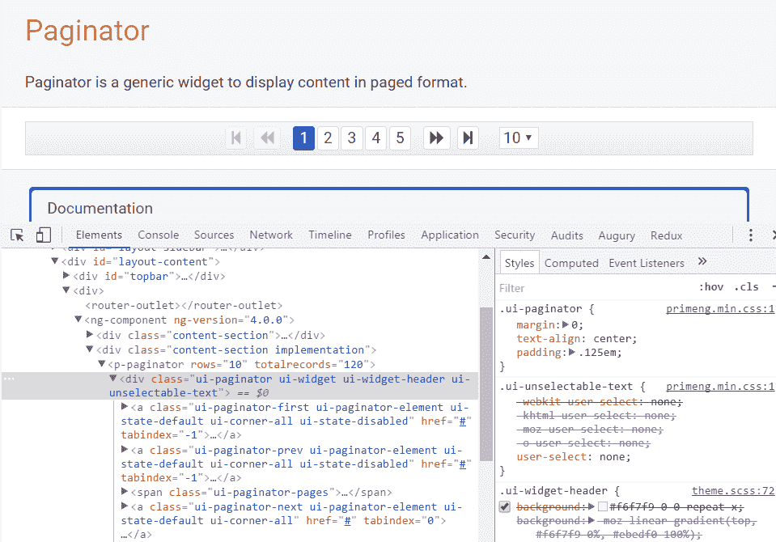

在前面截图中突出显示的行代表了 Paginator 组件的容器元素，具有以下样式类：

+   `ui-paginator`

+   `ui-unselectable-text`

+   `ui-widget`

+   `ui-widget-header`

前两个样式类`ui-paginator`和`ui-unselectable-text`是由 PrimeNG 生成的。这些是结构样式类。第一个为元素提供语义呈现，指示元素的角色。其他类似的样式类示例包括`ui-datatable`用于表格和`ui-button`用于按钮。

第二个样式类适用于希望避免意外复制粘贴无用内容（如图标或图像）的情况。一般来说，结构样式类定义了组件的骨架，并包括诸如边距、填充、显示类型、溢出行为、尺寸和定位等 CSS 属性。

PrimeNG 展示中几乎每个组件文档都包含一个带有组件结构样式类的样式部分。

正如已经提到的，PrimeNG 利用了 jQuery ThemeRoller CSS 框架。前面提到的`ui-widget`和`ui-widget-header`类是由 ThemeRoller 定义的，影响了底层 HTML 元素和相关组件的外观和感觉。这些是皮肤样式类，定义了诸如文本颜色、边框颜色和背景图像等 CSS 属性。

| **选择器** | **应用** |
| --- | --- |
| `.ui-widget` | 这是应用于所有 PrimeNG 组件的类。例如，它应用了字体系列和字体大小。 |
| `.ui-widget-header` | 这是应用于组件的头部部分的类。 |
| `.ui-widget-content` | 这是应用于组件的内容部分的类。 |
| `.ui-state-default` | 这是应用于可点击的、类似按钮的组件或其元素的默认类。 |
| `.ui-state-hover` | 这是应用于可点击的、类似按钮的组件或其元素的`mouseover`事件的类。 |
| `.ui-state-active` | 这是应用于可点击的、类似按钮的组件或其元素的`mousedown`事件的类。 |
| `.ui-state-disabled` | 这是应用于组件或其元素被禁用时的类。 |
| `.ui-state-highlight` | 这是应用于组件或其元素被突出显示或选中时的类。 |
| `.ui-corner-all` | 这是将圆角半径应用于组件的四个角的类。 |
| `.ui-corner-top` | 这是将圆角半径应用于组件的顶部两个角的类。 |
| `.ui-corner-bottom` | 这是将圆角半径应用于组件的底部两个角的类。 |
| `.fa` | 这是应用于表示图标的元素的类。 |

这些样式一贯地应用于所有 PrimeNG 组件，因此可点击的按钮和手风琴标签都应用了相同的`ui-state-default`类来指示它们是可点击的。当用户将鼠标移动到这些元素之一上时，这个类会被更改为`ui-state-hover`，当这些元素被选中时，又会变成`ui-state-active`。

这种方法可以确保所有具有类似交互状态的元素在所有组件中看起来都是相同的。所提供的 PrimeNG 选择器的主要优势是在主题设置上具有很大的灵活性，因为您不需要了解每个皮肤选择器来一致地更改 Web 应用程序中所有可用组件的样式。

在少数情况下，一些样式类并不是由 PrimeNG 明确生成的，也没有被 ThemeRoller 定义。日程安排组件（[`www.primefaces.org/primeng/#/schedule`](https://www.primefaces.org/primeng/#/schedule)）就是这样的情况之一。它具有结构类`fc-head`、`fc-toolbar`、`fc-view-container`等，这些类由第三方插件`FullCalendar`（[`fullcalendar.io`](https://fullcalendar.io)）控制。

免费主题使用相对的`em`单位来定义具有`.ui-widget`类的小部件的字体大小。默认情况下为`1em`。例如，Omega 主题定义了以下内容：

```ts
.ui-widget {
  font-family: "Roboto", "Trebuchet MS", Arial, Helvetica, sans-serif;
  font-size: 1em;
}

```

由于`em`单位，字体大小很容易定制。建议在`body`元素上应用基本字体大小，以调整整个 Web 应用程序中组件的大小：

```ts
body {
  font-size: 0.9em;
}

```

# 使用 Sass 组织项目结构

每个大型前端应用程序都需要一个强大、可扩展的 CSS 架构。CSS 预处理器是必不可少的——它有助于编写更清晰、模块化的代码，具有可重用的部分，并维护大型和复杂的样式表。CSS 预处理器基本上是一种脚本语言，它扩展了 CSS 并将其编译成常规的 CSS。今天有三种主要的 CSS 预处理器：Sass、LESS 和 Stylus。根据 Google Trends 的数据，Sass 是今天使用最多的预处理器。Sass 模仿了 HTML 结构，并允许你嵌套 CSS 选择器，这些选择器遵循相同的视觉 HTML 层次结构。使用 CSS，你需要这样写：

```ts
.container {
  padding: 5px;
}

.container p {
  margin: 5px;
}

```

使用 Sass，你可以简单地写成这样：

```ts
.container {
  padding: 5px;
  p {
    margin: 5px;
  }
}

```

Sass 向后兼容 CSS，因此你可以通过将`.css`文件扩展名改为`.scss`来轻松转换现有的 CSS 文件。

在嵌套 CSS 选择器时，你可以使用方便的`&`符号。`&`符号连接 CSS 规则。例如，考虑以下 Sass 片段：

```ts
.some-class {
  &.another-class {
    color: red;
  }
}

```

这将被编译为以下内容：

```ts
.some-class.another-class {
  color: red;
}

```

`&`符号对于沙盒化的 UI 组件也很有用，当每个组件只使用以唯一命名空间为前缀的类名时。例如，以下虚构的头部模块使用了`.mod-header`命名空间进行沙盒化：

```ts
.mod-header {
  &-link {
    color: blue;
  }

  &-menu {
    border: 1px solid gray;
  }
}

```

输出结果有两个类：`.mod-header-link`和`.mod-header-menu`。正如你所见，Sass 有助于避免 CSS 冲突。建议为每个 UI 组件编写单独的 Sass 文件，然后通过`@import`指令将它们组合在一起。使用这个指令，一个 Sass 文件可以被导入到另一个文件中。预处理器将获取你想要导入的文件，并将其与你导入的文件合并在一起。这与原生 CSS 的`@import`有点不同。CSS 的`@import`总是创建一个 HTTP 请求来获取导入的文件。Sass 的`@import`将文件合并在一起，以便将一个单一的 CSS 文件发送到浏览器。

另一个强大的 Sass 概念是**局部文件**。可以创建包含小片段的局部 Sass 文件，以便包含到其他 Sass 文件中。局部文件的两个典型例子是**变量**和**混合**。变量有助于存储你想要在整个样式表中重用的信息。变量以美元符号开头。例如：

```ts
$brand-color-background: white;
$brand-color-content: black;

```

用法：

```ts
body {
  background-color: $brand-color-background;
  color: $brand-color-content;
}

```

混合器允许您创建要在样式表中重复使用的 CSS 声明组。它们的行为类似于带参数的函数。混合器以`@mixin`指令开头，后跟名称。让我们创建一个混合器来居中任何 HTML 内容：

```ts
@mixin center($axis: "both") {
  position: absolute;
  @if $axis == "y" {
    top: 50%;
    transform: translateY(-50%);
  }
  @if $axis == "x" {
    left: 50%;
    transform: translateX(-50%);
  }
  @if $axis == "both" {
    top: 50%;
    left: 50%;
    transform: translate(-50%, -50%);
  }
}

```

混合器名称是`center`，参数`$axis`具有默认值`"both"`，如果您没有显式传递参数值。使用方法很简单--混合器必须使用`@include`指令包含：

```ts
.centered-box {
  @include center();
}

```

这导致以下结果：

```ts
.centered-box {
  position: absolute;
  top: 50%;
  left: 50%;
  transform: translate(-50%, -50%);
}

```

部分文件以前导下划线命名，例如，`_variables.scss`，`_mixins.scss`。下划线让 Sass 知道该文件不应编译为 CSS 文件。`@import`指令中的下划线和文件扩展名可以省略：

```ts
@import 'variables';
@import 'mixins';

```

Sass 还具有更强大的功能，如继承，运算符，内置函数和处理媒体查询。有关更多详细信息，请参阅官方 Sass 网站（[`sass-lang.com`](http://sass-lang.com)）。您可以在[`www.sassmeister.com`](http://www.sassmeister.com)上在线使用 Sass：

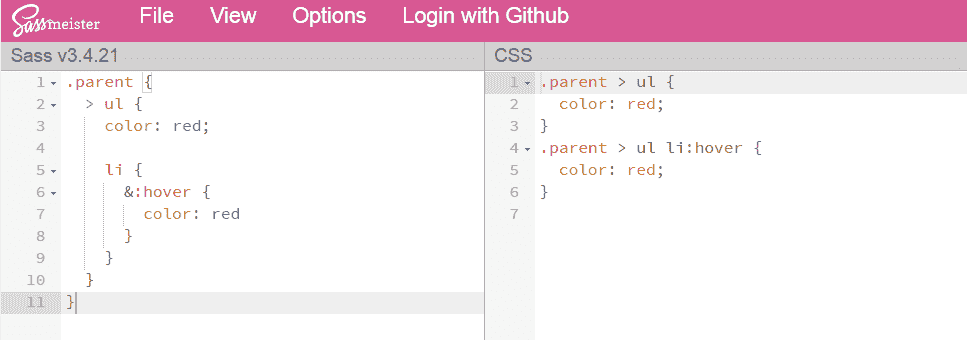

或者您可以在[`sass.js.org`](http://sass.js.org)使用它：

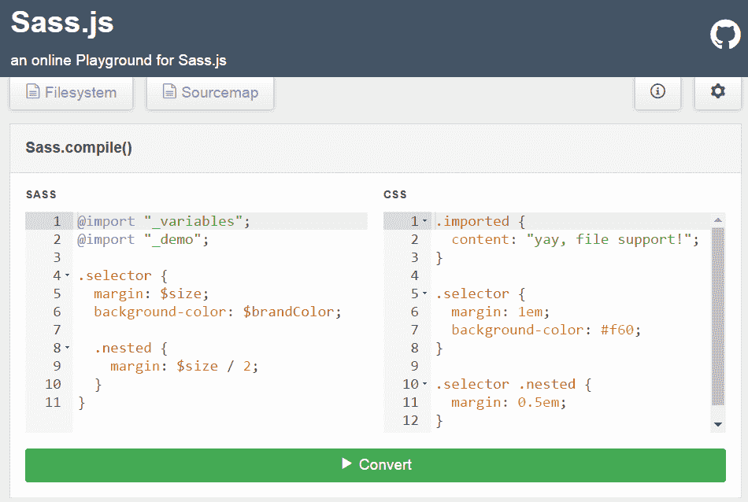

现在是时候为组织您的 Sass 文件提供指南了。有很多 Sass 文件的良好 CSS 架构和项目结构是什么？在规划 CSS 架构时，您应该将目录和文件模块化为类别。有几个提议和建议。最后，这取决于您团队中的约定。其中一个流行的提议是 7-1 模式（[`sass-guidelin.es/#the-7-1-pattern`](https://sass-guidelin.es/#the-7-1-pattern)）。这种架构提供了七个文件夹和一个主文件，用于导入所有文件并将它们编译成一个单一文件。它们如下：

+   `base/`: 此文件夹包含全局样式，如 CSS 重置，排版，颜色等。例如：

+   `_reset.scss`

+   `_typography.scss`

+   `helpers/`: 此文件夹包含 Sass 工具和辅助程序，如变量，混合器，函数等。该文件夹在单独编译时不应输出任何一行 CSS：

+   `_variables.scss`

+   `_mixins.scss`

+   `components/`: 此文件夹包含独立组件的样式。这些通常是小部件，其他组件可以由它们组合而成。例如：

+   `_button.scss`

+   `_carousel.scss`

+   `layout/`: 这个文件夹包含了更大组件的宏布局样式，比如 CSS 网格、页眉、页脚、侧边栏等等：

+   `_header.scss`

+   `_footer.scss`

+   `pages/`: 这是一个可选的文件夹，其中包含特定于页面的样式：

+   `_home.scss`

+   `_about.scss`

+   `themes/`: 这是一个可选的文件夹，其中包含不同主题的样式。对于具有多个主题的大型网站来说是有意义的：

+   `_omega.scss`

+   `_ultima.scss`

+   `vendors/`: 这个文件夹包含来自外部库和框架的文件，比如 Bootstrap、jQueryUI、Select2 等等：

+   `bootstrap.scss`

+   `jquery-ui.scss`

有些文件夹是特定于项目的，可能在许多项目中不存在。文件夹名称是任意的。例如，`components/`文件夹也可以根据您的喜好称为`modules/`。在 Angular 项目中，每个组件样式的 Sass 文件都驻留在与相应组件相同的文件夹中。没有专门的文件夹供它们使用。

对于本书来说，诞生了一个演示项目--一个想象的图形编辑器，演示了样式概念。这个 Web 应用是建立在 Angular 4 和 Bootstrap 3 之上的（[`getbootstrap.com`](http://getbootstrap.com)）。它在左右两侧有各种面板以及一个工具栏。布局是响应式的--在小屏幕上，面板会堆叠。所有样式文件都被收集在`main.scss`文件中：

```ts
// 1\. Vendor files
@import "~font-awesome/css/font-awesome.min.css";
@import "vendor/bootstrap-custom";

// 2\. Helpers (variables, mixins, functions, ...)
@import "helpers/variables";
@import "helpers/mixins";

// 3\. Base stuff (common settings for all components and pages)
@import "common/viewport-workaround";
@import "common/global";
@import "common/components";

// 4\. Styles for components
@import "../../app/app.component";
@import "../../app/main/main.component";
@import "../../app/layout/layout.component";
@import "../../app/panel/panel.component";
@import "../../app/panel/toolbar/toolbar.component";

```

带有 Sass 文件的完整图形编辑器可以在 GitHub 上找到

[`github.com/ova2/angular-development-with-primeng/tree/master/chapter2/graphic-editor-sass.`](https://github.com/ova2/angular-development-with-primeng/tree/master/chapter2/graphic-editor-sass)

一旦`main.scss`文件被导入到引导 Angular 应用程序的文件中，Webpack 会自动在`index.html`中创建一个到`main.css`的链接（感谢`HtmlWebpackPlugin`）：

```ts
// Webpack creates a link to the main.css and put it into the 
// index.html
import './assets/css/main.scss';

import {platformBrowserDynamic} from '@angular/platform-browser-dynamic';
import {AppModule} from './app/app.module';

platformBrowserDynamic().bootstrapModule(AppModule)
                        .catch(err => console.error(err));

```

*Bootstrap flexbox 布局满足 PrimeNG*部分将展示更灵活和现代的响应式布局。图形编辑器作为一个新的演示应用的基础。 

# 创建新主题的简单方法

我们有时需要创建自己的主题，而不是使用预定义的主题。Web 应用程序通常应该具有公司特定的外观和感觉，这是由公司范围的样式指南固定和预设的。使用 PrimeNG 创建新主题很容易，因为它由 ThemeRoller CSS 框架（[`jqueryui.com/themeroller`](http://jqueryui.com/themeroller)）提供支持。ThemeRoller 提供了一个功能强大且易于使用的在线可视工具。在本节中，我们将系统地展示创建新主题所需的所有步骤。有两种方法可以创建新主题，一种是通过 ThemeRoller，另一种是使用 Sass 从头开始。

# 主题滚动器方法

要第一手体验 ThemeRoller 在线可视工具，请转到 ThemeRoller 主页，浏览可用主题库，并调整 CSS 属性以查看页面上嵌入的小部件的变化。所有 CSS 更改都将实时应用。

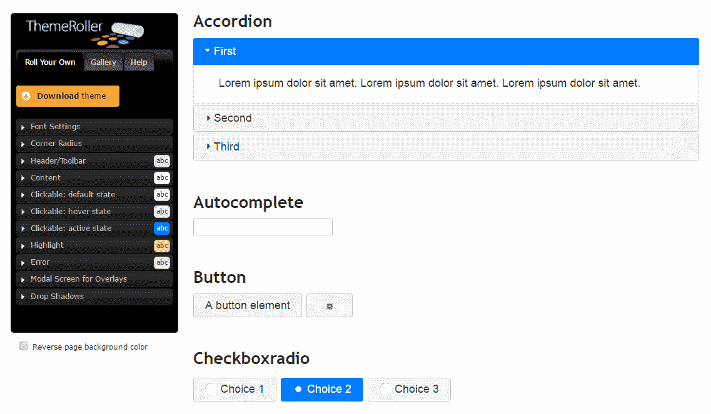

我们必须选择现有主题（“画廊”选项卡）并编辑它（“自定义”选项卡）。单击“下载主题”按钮即可完成工作。

我们应该在下载生成器页面的组件选项下取消选择“全部切换”复选框，以便我们的新主题只包括皮肤样式。

接下来，我们需要将从 ThemeRoller 下载的主题文件迁移到 PrimeNG 主题基础设施。迁移步骤很简单：

1.  我们下载的主题包将包含一个 CSS 文件`jquery-ui.theme.css`（以及缩小的变体）和`images`文件夹。解压包并将 CSS 文件重命名为`theme.css`。

1.  在您的 Web 应用程序中，创建一个名为新主题的文件夹，例如`src/assets/themes/crazy`。

1.  将`theme.css`和`images`文件夹复制到`src/assets/themes/crazy`中。

完成这些步骤后，您可以在`index.html`文件中创建一个指向`theme.css`的链接：

```ts
<link rel="stylesheet" type="text/css"  
      href="src/assets/themes/crazy/theme.css"/>

```

这是创建自定义主题的最简单方法，无需了解 CSS 知识。

# Sass 方法

第二种方法更灵活和准确。最好通过 Sass 手动创建新主题，因为主题更易维护。主要的 CSS 设置，如字体、颜色、边框半径等，可以通过 Sass 变量进行配置。您可以通过为这些变量设置自定义值来创建新主题。PrimeNG 正是采用了这种方法。大多数免费主题都是以这种方式创建的。

免费主题托管在 GitHub 上，网址为[`github.com/primefaces/primeng/tree/master/resources/themes`](https://github.com/primefaces/primeng/tree/master/src/assets/components/themes)。

每个主题都有一个单独的文件夹，其中包含设置变量的 Sass 文件。这些变量本身在`_theme.scss`中使用--这是所有免费主题共享的文件。如果您将 PrimeNG 安装为依赖项，则可以在`node_modules/primeng/resources/themes/`下找到此文件。有时，您还需要为特定的 CSS 选择器设置自定义字体或特殊设置。您可以用自己的样式规则覆盖默认样式规则--只需在导入`_theme.scss`后编写它们。自定义主题文件的一般结构如下所示：

```ts
<predefined Sass variables>

@import "primeng/resources/themes/theme";

<your custom style rules>

```

让我们创建以下文件夹结构，其中包含三个用于新`crazy`主题的 Sass 文件：

```ts
- src
    - assets
        - themes
            - crazy
                - fonts
                    ...
                - _variables.scss
                - theme.scss

```

Sass 变量可以从任何其他主题（如 Omega）复制，并放置在`_variables.scss`中。其中一些变量会有自定义值，如下所示：

```ts
$fontFamily: "Quicksand", "Trebuchet MS", Arial, Helvetica, sans-serif;
...

// Header
$headerBorderWidth: 2px;
$headerBorderColor: #f0a9df;
...

// Content
$contentBorderWidth: 2px;
$contentBorderColor: #ffafaf;
...

// Forms
$invalidInputBorderColor: #ff0000;
...

```

如您所见，我们希望使用自定义字体`Quicksand`。您可以从这个免费资源以`.otf`格式（OpenType Font）下载这种字体：[`www.fontsquirrel.com/fonts/quicksand`](https://www.fontsquirrel.com/fonts/quicksand)。为了跨浏览器支持，我们需要四种格式的字体：`.ttf`、`.eot`、`.woff`和`.svg`。有许多转换工具，其中之一可以在[`www.font2web.com`](http://www.font2web.com)找到，它允许将任何`.otf`文件转换为上述四种格式。转换后，自定义字体应该被移动到`fonts`文件夹，并通过`@font-face`规则安装。

此外，我们希望小部件标题使用粉色渐变颜色，无效字段周围有红色边框。所有这些自定义规则都在主题文件`theme.scss`中完成。此文件的摘录说明了这个想法：

```ts
@import 'variables';
@import "primeng/resources/themes/theme";

@font-face {
  font-family: 'Quicksand';
  src: url('fonts/Quicksand-Regular.eot');
  url('fonts/Quicksand-Regular.woff') format('woff'),
  url('fonts/Quicksand-Regular.ttf') format('truetype'),
  url('fonts/Quicksand-Regular.svg') format('svg');
  font-weight: normal;
  font-style: normal;
}

.ui-widget-header {
  background: linear-gradient(to bottom, #fffcfc 0%, #f0a9df 100%);
}

.ui-inputtext.ng-dirty.ng-invalid,
p-dropdown.ng-dirty.ng-invalid > .ui-dropdown,
... {
  border-color: $invalidInputBorderColor;
}

```

`crazy`主题的完整项目可以在 GitHub 上找到

[`github.com/ova2/angular-development-with-primeng/tree/master/chapter2/custom-theme.`](https://github.com/ova2/angular-development-with-primeng/tree/master/chapter2/custom-theme)

建议的结构允许创建任意数量的主题。但是，如何将`theme.scss`编译成`theme.css`呢？有两种将 Sass 编译成 CSS 的方法：

1.  从命令行安装 Sass。安装过程在 Sass 主页上有描述（[`sass-lang.com/install`](http://sass-lang.com/install)）。请注意，您需要预先安装 Ruby。一旦安装了 Sass，您就可以从终端运行 `sass theme.scss theme.css`。

1.  在 Node.js 下使用 `node-sass`（[`github.com/sass/node-sass`](https://github.com/sass/node-sass)）。

在 GitHub 上的项目中，我们使用了 `node-sass` 以及 `autoprefixer`（[`github.com/postcss/autoprefixer`](https://github.com/postcss/autoprefixer)）和 `cssnano`（[`cssnano.co`](http://cssnano.co)）。所有必需的依赖项都是本地安装的：

```ts
npm install node-sass autoprefixer cssnano postcss postcss-cli --save-dev

```

`package.json` 中的四个方便的 npm 脚本有助于创建主题文件：

```ts
"premakecss": "node-sass --include-path node_modules/ src/assets/themes/crazy/theme.scss -o src/assets/themes/crazy/",
"makecss": "postcss src/assets/themes/crazy/theme.css --use 
autoprefixer -d src/assets/themes/crazy/",
"prebuild:css": "npm run makecss",
"build:css": "postcss src/assets/themes/crazy/theme.css --use cssnano
             > src/assets/themes/crazy/theme.min.css"

```

`@import "primeng/resources/themes/theme"` 路径是通过 `--include-path node_modules/` 选项找到的，该选项设置了查找导入文件的路径。这有助于避免所有与相对路径相关的混乱。

`npm run build:css` 命令将生成 `theme.min.css`，应该包含在页面中：

```ts
<link rel="stylesheet" type="text/css" href="src/assets/themes/crazy/theme.min.css"/>

```

新主题的外观和感觉令人惊叹：

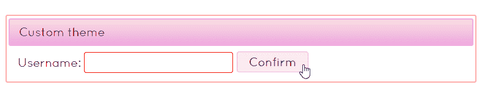

# PrimeNG 中的响应式网格系统

PrimeNG 有**Grid CSS**-- 一个针对移动设备、平板电脑和台式机进行优化的响应式和流体布局系统。PrimeNG 组件内部使用 Grid CSS，但这个轻量级实用程序也可以作为独立使用。CSS Grid 基于 12 列布局，就像许多其他网格系统一样。所有列的总宽度为 100%。在本节中，我们将详细解释 PrimeNG 网格系统的所有功能。

# 基本原则

布局容器应该有 `ui-g` 样式类。当布局容器的子元素以 `ui-g-*` 为前缀时，它们就变成了列，其中 `*` 是从 1 到 12 的任意数字。数字表示了 12 个可用单位中占据的空间。当列的数量超过 12 时，列会换行到下一行：

```ts
<div class="ui-g">
  <div class="ui-g-2">2</div>
  <div class="ui-g-4">4</div>
  <div class="ui-g-6">6</div>
  <div class="ui-g-8">8</div>
  <div class="ui-g-4">4</div>
</div>

```

以下布局有两行（行）：

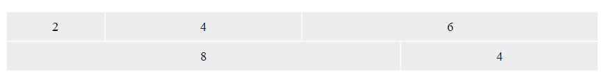

两个 `ui-g` 容器也可以实现相同的两行布局：

```ts
<div class="ui-g">
  <div class="ui-g-2">2</div>
  <div class="ui-g-4">4</div>
  <div class="ui-g-6">6</div>
</div>
<div class="ui-g">
  <div class="ui-g-8">8</div>
  <div class="ui-g-4">4</div>
</div>

```

通常，带有 `ui-g` 样式类的 *n* 个容器创建 *n* 行。

# 嵌套列

列可以嵌套在更复杂的布局中。要实现这一点，只需使用带有 `ui-g-*` 样式类的元素进行嵌套：

```ts
<div class="ui-g">
  <div class="ui-g-8 ui-g-nopad">
    <div class="ui-g-6">6</div>
    <div class="ui-g-6">6</div>
    <div class="ui-g-12">12</div>
  </div>
  <div class="ui-g-4">4</div>
</div>

```

有了这个结构，具有不同内容的列将不会具有相等的高度。有一个更健壮的解决方案可以强制使具有不同内容的列具有相等的高度。只需将内部的`div`元素包装在另一个具有`ui-g`样式类的`div`中，或者更简单地，将`ui-g`分配给具有嵌套列的列： 

```ts
<div class="ui-g">
  <div class="ui-g ui-g-8 ui-g-nopad">
    <div class="ui-g-6">6<br/>6<br/>6<br/>6<br/>6<br/>6<br/></div>
    <div class="ui-g-6">6</div>
    <div class="ui-g-12">12</div>
  </div>
  <div class="ui-g-4">4</div>
</div>

```

结果如下所示：

列具有默认填充`0.5em`。要删除它，您需要应用`ui-g-nopad`样式类。这在之前的示例中已经演示过。

# 响应式和流体布局

通过向列应用额外的类，可以实现响应式布局。支持四种屏幕尺寸，具有不同的断点。

| **前缀** | **设备** | **尺寸** |
| --- | --- | --- |
| `ui-sm-*` | 手机等小型设备 | `最大宽度：640px` |
| `ui-md-*` | 平板等中等尺寸设备 | `最小宽度：641px` |
| `ui-lg-*` | 大尺寸设备，如台式机 | `最小宽度：1025px` |
| `ui-xl-*` | 大屏幕监视器 | `最小宽度：1441px` |

当一个元素具有表中列出的多个样式类时，它们从下到上应用。让我们举个例子：

```ts
<div class="ui-g">
  <div class="ui-g-12 ui-md-6 ui-lg-2">ui-g-12 ui-md-6 ui-lg-2</div>
  <div class="ui-g-12 ui-md-6 ui-lg-2">ui-g-12 ui-md-6 ui-lg-2</div>
  <div class="ui-g-12 ui-md-4 ui-lg-8">ui-g-12 ui-md-4 ui-lg-8</div>
</div>

```

这里发生了什么？

+   在大屏幕上，三列按比例显示为 2:12、2:12 和 8:12。

+   在中等屏幕上，显示两行。第一行有相等的列，第二行有 4:12 的列。

+   在小屏幕（移动设备）上，列会堆叠--每列显示在自己的行中。

屏幕截图显示了中等尺寸设备上列的排列方式：

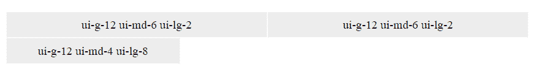

PrimeNG 组件具有内置的响应模式。它们理解特殊的`ui-fluid`样式类。Grid CSS 和任何其他网格系统都可以与此样式类一起使用，该样式类为组件提供 100%的宽度。这种行为有助于有效利用屏幕空间。一个示例演示了流体布局中的各种组件：

```ts
<div  class="ui-fluid ui-corner-all">
 <div  class="ui-g">
    <div  class="ui-g ui-g-12 ui-md-6 ui-g-nopad">
      <div  class="ui-g-12 ui-md-3 ui-label">
        Passenger
      </div>
      <div  class="ui-g-12 ui-md-9">
        <input  pInputText type="text"/>
      </div>
    </div>
    <div class="ui-g ui-g-12 ui-md-6 ui-g-nopad">
      <div class="ui-g-12 ui-md-3 ui-label">
        Flight day
      </div>
      <div class="ui-g-12 ui-md-9">
        <p-calendar [(ngModel)]="date" [showIcon]="true">
        </p-calendar>
      </div>
    </div>
  </div>
  <div  class="ui-g">
    <div  class="ui-g ui-g-12 ui-md-6 ui-g-nopad">
      <div  class="ui-g-12 ui-md-3 ui-label">
        Notice
      </div>
      <div  class="ui-g-12 ui-md-9">
        <textarea  pInputTextarea type="text"></textarea>
      </div>
    </div>
    <div  class="ui-g ui-g-12 ui-md-6 ui-g-nopad">
      <div  class="ui-g-12 ui-md-3 ui-label">
        Destination
      </div>
      <div  class="ui-g-12 ui-md-9">
        <p-listbox  [options]="cities" [(ngModel)]="selectedCity">
        </p-listbox>
      </div>
    </div>
  </div>
</div>

```

从中等屏幕到大屏幕的布局如下：

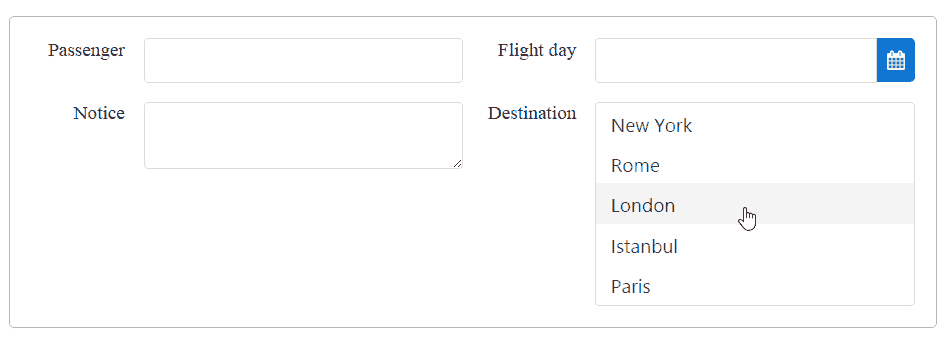

小屏幕上的布局为堆叠列：

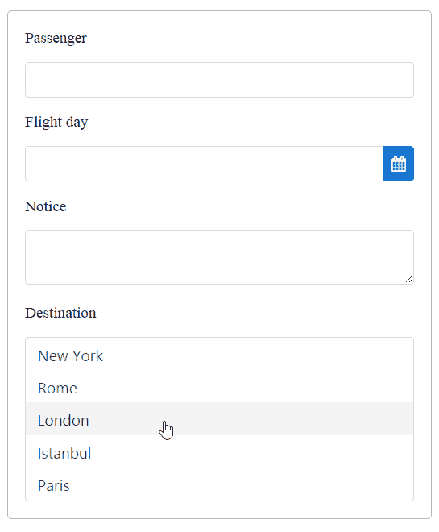

如您所见，所有右对齐的标签都变成了左对齐。您可以通过媒体查询实现此行为：

```ts
.ui-fluid .ui-g .ui-label {
  text-align: right;
  white-space: nowrap;
}

@media screen and (max-width: 640px) {
  .ui-fluid .ui-g .ui-label {
    text-align: left;
  }
}

```

完整的演示应用程序和说明可在 GitHub 上找到

[`github.com/ova2/angular-development-with-primeng/tree/master/chapter2/primeng-grid-css.`](https://github.com/ova2/angular-development-with-primeng/tree/master/chapter2/primeng-grid-css)

# Bootstrap flexbox 布局符合 PrimeNG

在本节中，我们将使用 Bootstrap 4（[`v4-alpha.getbootstrap.com`](https://v4-alpha.getbootstrap.com)）和 PrimeNG 组件重新实现在*Sass 组织项目结构*部分介绍的图形编辑器。从版本 v4.0.0-alpha.6 开始，默认情况下 Bootstrap 只有基于 flexbox 的布局，没有回退。

**Flexbox**是一种新的布局模型，在所有现代浏览器中得到广泛支持（[`caniuse.com/#search=flexbox`](http://caniuse.com/#search=flexbox)）。互联网上有许多教程。例如，您可以阅读[`css-tricks.com/snippets/css/a-guide-to-flexbox`](https://css-tricks.com/snippets/css/a-guide-to-flexbox)中关于 CSS flexbox 布局的全面指南。Flexbox 解决了许多布局问题。Flexbox 的主要优势之一是能够填充额外的空间。Flexbox 布局中的所有列都具有相同的高度，而不考虑它们的内容。让我们展示两种设备分辨率的图形编辑器的最终屏幕。

对于桌面：

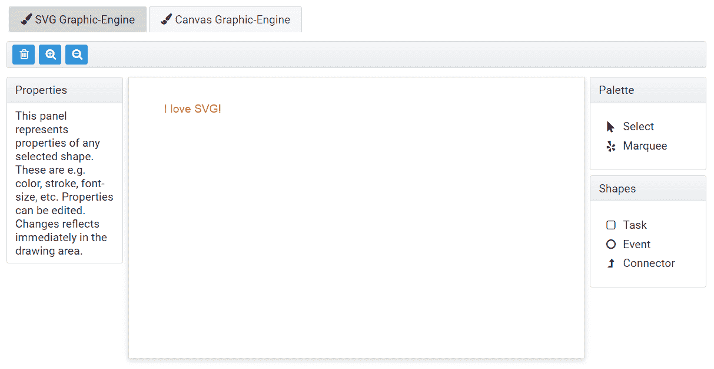

对于移动设备：

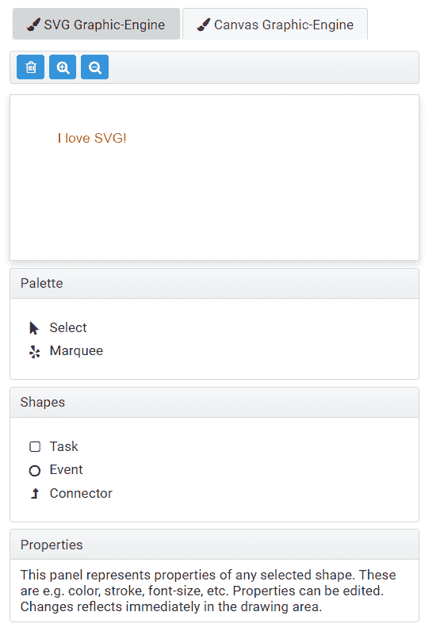

除了 PrimeNG，我们还需要安装最新的 Bootstrap 4。在撰写本文时，这是 4.0.0-alpha.6：

```ts
npm install bootstrap@4.0.0-alpha.6 --save

```

安装完成后，您需要将带有 flexbox 布局规则的 CSS 文件导入到`main.scss`文件中：

```ts
@import "~bootstrap/dist/css/bootstrap-grid.css";

```

在以前的 Bootstrap 版本中，您必须显式启用 flexbox 布局：

```ts
$enable-flex: true;
@import "~bootstrap/scss/bootstrap-grid.scss";

```

如果您打算使用样式进行额外的灵活对齐选项，您必须导入`bootstrap-grid.scss`和`_flex.scss`：

```ts
@import "~bootstrap/scss/bootstrap-grid";
@import "~bootstrap/scss/utilities/flex";

```

`_flex.scss`是一组用于垂直和水平对齐列的实用程序，用于控制内容的视觉顺序等。该文件包含各种 CSS 规则，如`justify-content-start`，`align-items-end`，`align-self-auto`，`flex-first`，`flex-last`等。这里解释了一些规则。请参考官方的 Bootstrap 文档以了解更多细节（[`v4-alpha.getbootstrap.com/layout/grid`](https://v4-alpha.getbootstrap.com/layout/grid)）。

整个应用程序的骨架驻留在两个文件中：`app.component.html`和`layout.component.html`。第一个文件包含了一个 PrimeNG 的带有两个菜单项的选项卡菜单：

```ts
<div class="container-fluid">
  <div class="row">
    <div class="col">
      <p-tabMenu [model]="items"></p-tabMenu>
    </div>
  </div>
</div>

<router-outlet></router-outlet>

```

每个项目都定义了`routerLink`：

```ts
items: MenuItem[];
...
this.items = [
  {label: 'SVG Graphic-Engine', icon: 'fa-paint-brush',
    routerLink: '/svg'},
  {label: 'Canvas Graphic-Engine', icon: 'fa-paint-brush',
    routerLink: '/canvas'}
];

```

在选项卡菜单中点击选项卡会将`layout.component.html`加载到`router-outlet`中：

```ts
<div class="container-fluid">
  <div class="row align-items-center ge-toolbar">
    <div class="col">
      <ge-toolbar></ge-toolbar>
    </div>
  </div>
  <div class="row no-gutters">
    <div class="col-md-8 flex-md-unordered col-drawing-area">
      <div class="drawing-area">
        <ng-content select=".ge-drawing-area"></ng-content>
      </div>
    </div>
    <div class="col-md-2 flex-md-last">
      <div class="flex-column no-gutters">
        <div class="col ge-palette">
          <ge-palette></ge-palette>
        </div>
        <div class="col ge-shapes">
          <ge-shapes></ge-shapes>
        </div>
      </div>
    </div>
    <div class="col-md-2 flex-md-first">
      <ge-properties></ge-properties>
    </div>
  </div>
</div>

```

`ng-content`区域被 SVG 或 Canvas 表面替换，用户可以在其中绘制形状。`ge-toolbar`组件包含 PrimeNG 的`<p-toolbar>`。其他`ge-*`组件包含面板，例如`<p-panel header="Palette">`。

最有趣的部分是样式类。在前面的代码片段中使用的样式类的简要描述如下：

| **样式类** | **描述** |
| --- | --- |
| `row` | 这充当放置在行内的列的容器。每列可以占用 1 到 12 个空间。 |
| `align-items-*` | 这定义了行内的 flex 列在垂直方向上的位置。`align-items-center`类将列定位在中间。 |
| `no-gutters` | 这会从行中移除边距和从列中移除填充。 |
| `col` | 这设置了`auto-layout`模式--Bootstrap 4 的一个新功能，用于等宽列。列将自动分配行中的空间。 |
| `col-<prefix>-<number>` | 这表示您想在每行中使用的列数，最多为 12 列。前缀定义了断点。例如，`col-md-8`类表示，在中等和更大的屏幕上，该列将占 12 列中的 8 列，在小于中等大小的屏幕上将占 12 列（默认）。 |
| `flex-column` | 这会改变项目的`flex-direction`（列）。项目可以水平或垂直布局。`flex-column`类将方向从左到右改为从上到下。 |
| `flex-<prefix>-first` | 这将列重新排序为布局中的第一列。前缀定义了应该从哪个断点应用重新排序。 |
| `flex-<prefix>-last` | 这将列重新排序为布局中的最后一列。前缀如前所述。 |
| `flex-<prefix>-unordered` | 这在第一个和最后一个之间显示列。前缀如前所述。 |

请注意，在小型设备上，我们已经减小了字体大小。这可以通过 Bootstrap 提供的断点混合来实现：

```ts
@import "~bootstrap/scss/mixins/breakpoints";

@include media-breakpoint-down(md) {
  body {
    font-size: 0.9em;
  }
}

```

有各种断点混合，它们期望以下参数之一：

+   `xs`：小型屏幕< 576px

+   `sm`：中型屏幕>= 576px

+   `md`：中型屏幕>= 768px

+   `lg`：大型屏幕>= 992px

+   `xl`：超大屏幕>= 1200px

例如，具有`ge-palette`样式类的元素在超过 768px 的屏幕上得到`margin-top: 0`，在小于 768px 的屏幕上得到`margin-top: 0.5em`：

```ts
.ge-palette {
  margin-top: 0.5em;
}

@include media-breakpoint-up(md) {
  .ge-palette {
    margin-top: 0;
  }
}

```

使用 Bootstrap 4 和 PrimeNG 的完整图形编辑器可在 GitHub 上找到

[`github.com/ova2/angular-development-with-primeng/tree/master/chapter2/graphic-editor-bootstrap4.`](https://github.com/ova2/angular-development-with-primeng/tree/master/chapter2/graphic-editor-bootstrap4)

# 摘要

阅读完本章后，您可以区分结构和皮肤样式类。简而言之，结构样式类定义了组件的骨架，而皮肤样式类用于主题。我们已经看到如何设置任何 PrimeNG 主题并创建新主题。新主题可以通过 ThemeRoller 或通过设置现有主题的 Sass 变量和 CSS 属性的自定义值，并随后编译为 CSS 文件来创建。我们鼓励使用 CSS 预处理器进行模块化 CSS 架构。Sass 预处理器有助于编写更好的样式。还提供了组织 Sass 文件的指南。

阅读完本章后，您也可以使用响应式网格系统之一，无论是 PrimeNG 自己的还是 Bootstrap 的。PrimeNG 提供了一个轻量级的响应式和流体布局系统。此外，当在顶层容器元素上使用`.ui-fluid`样式类时，PrimeNG 组件具有内置的响应模式。基于 flexbox 的布局是 HTML5 Web 应用程序的新标准和优势。flexbox 的主要优势之一是能够填充额外的空间 - 所有列具有相同的高度。Bootstrap 4 增加了对 flexbox 模型的支持，并允许您开发令人惊叹的布局。

从下一章开始，我们将深入研究每个组件。我们对令人兴奋的 PrimeNG 世界的旅程始于输入和选择组件。
