# 第三章：增强输入和选择

本章介绍了增强功能的常用输入和选择组件，适用于任何类型的应用程序或网站。这些组件是每个 Web 应用程序的主要部分。每个组件的所有功能将涵盖您在开发项目时可能遇到的许多实时用例。在创建登录表单、注册表单或任何类型的表单填写应用程序时，输入和选择组件是首要考虑的因素。由于 Web 使用的快速革命和技术改进，需要各种增强的输入和选择组件，使 Web 更加强大。PrimeNG 提供了超过 20 个用于数据输入和选择的组件，这些组件通过皮肤能力和有用功能（如用户友好界面、验证等）扩展了标准或原生 HTML 组件。

在本章中，我们将涵盖以下主题：

+   使用 InputMask 进行格式化输入

+   自动完成的自动建议

+   使用芯片输入多个值

+   发现复选框-布尔、多个和三态

+   使用单选和多选组件选择项目

+   基本和高级日历场景

+   微调器和滑块-提供输入的不同方式

+   使用丰富和强大的编辑器进行文本编辑

+   密码和基于星级的评分输入

+   使用输入和选择组件进行验证

# 使用 InputMask 进行格式化输入

InputMask 是一种特殊类型的输入组件，可以最大程度地减少用户输入不正确数据的机会。它应用了提供的掩码模板的灵活验证。这对以特定格式输入数据特别有用，例如数字、字母数字、日期、货币、电子邮件和电话。电话号码输入的 InputMask 组件的基本示例如下：

```ts
<p-inputMask id="basic" name="basic" mask="99-999999"    
  [(ngModel)]="simple" placeholder="99-999999"/>

```

根据前面的示例，掩码值`(999) 999-9999`表示只能输入数字，括号和破折号结构。由于使用了相同掩码值的占位符，它建议提供的输入格式。输入的初始显示如下：

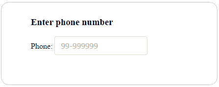

一旦输入获得焦点，口罩格式中的数字将被空格替换，而其他字符将保持在初始阶段。口罩的默认占位符字符是下划线（`_`），因此它将为每个数字显示下划线字符。每次`keyPress`事件发生后，口罩字符（即`9`）将被实际字符填充。如果提供的输入不完整或模糊，则整个输入将自动清除（默认情况下，`autoClear`为`true`）。

在组件的 DOM 树中发生事件时，有些情况需要执行某些功能。`inputMask`组件支持`onComplete`回调，在用户完成口罩模式时调用。例如，当用户完成口罩输入时，用户将收到通知，如下所示：

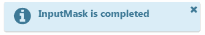

Growl 消息出现在页面顶部，带有关闭图标，这样我们可以随时删除粘性通知。

# 口罩格式选项

`mask`属性是使用输入口罩的必需属性。该组件不仅允许数字类型，还支持字母和字母数字字符，因此口罩格式可以是以下内置定义的组合：

+   `a`：字母字符（`A-Z，a-z`）

+   `9`：数字字符（`0-9`）

+   `*`：字母数字字符（`A-Z，a-z，0-9`）

让我们举个例子，我们可以根据单选按钮的选择显示具有不同口罩选项的输入口罩，如下所示：

```ts
<div>
 <div id="phoneformat" *ngIf="format == 'Option1'">
    <span>Phone:</span>
    <p-inputMask mask="(999) 999-9999" [(ngModel)]="phone" 
      placeholder="(999) 999-9999" name="phone">
    </p-inputMask>
  </div>
  <div id="dateformat" *ngIf="format == 'Option2'">
    <span>Date:</span>
    <p-inputMask mask="99/99/9999" [(ngModel)]="date" 
      placeholder="99/99/9999" name="date">
    </p-inputMask>
  </div>
  <div id="serialformat" *ngIf="format == 'Option3'">
    <span>Serial Number:</span>
    <p-inputMask mask="a*-999-a999" [(ngModel)]="serial" 
      placeholder="a*-999-a999" name="serial">
    </p-inputMask>
 </div>
</div>

```

根据前面的示例，只会显示一个带有定义口罩的输入元素。以下屏幕截图显示了日期口罩格式的快照结果：

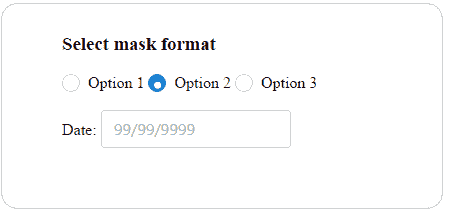 `unmask`属性可用于控制值的掩码或未掩码输出。例如，如果`ngModel`将原始未掩码值或格式化的掩码值设置为组件的绑定值，则它非常有用。

# 使用占位符字符

如前所述，下划线（`_`）是口罩中默认的活动占位符。但是可以使用`slotChar`属性进行自定义，如下所示：

```ts
<p-inputMask mask="99/99/9999" [(ngModel)]="slot" placeholder="99/99/9999"
  slotChar="mm/dd/yyyy" name="slotchar"></p-inputMask> 

```

`slotChar`选项可以是单个字符或表达式。

# 将口罩的一部分设为可选项

到目前为止，所有输入掩码的示例都表明掩码中的所有字符都是必需的。也可以通过使用问号（`?`）字符使掩码的一部分变为可选。在掩码定义中问号后面列出的任何内容都将被视为可选输入。一个常见的用例是显示带有可选分机号码的电话号码，如下所示：

```ts
<span>Phone Ext</span>
<p-inputMask mask="(999) 999-9999? x99999" [(ngModel)]="optional"     
  name="optionalmask" placeholder="(999) 999-9999? x99999">
</p-inputMask>

```

一旦用户通过到达问号字符完成输入并模糊组件，其余的验证将被跳过。也就是说，直到那部分的输入不会被擦除。例如，电话号码输入，如`(666) 234-5678` 和 `(666) 234-5678? x1230` 将是掩码的可选情况的有效输入。

完整的演示应用程序及说明可在 GitHub 上找到

[`github.com/ova2/angular-development-with-primeng/tree/master/chapter3/inputmask.`](https://github.com/ova2/angular-development-with-primeng/tree/master/chapter3/inputmask)

# AutoComplete 的自动建议

AutoComplete 是一个输入组件，它在用户输入到输入框时提供实时建议。这使用户能够在输入时快速查找并从查找的值列表中进行选择，从而利用了搜索和过滤功能。

AutoComplete 组件的基本用法包括`suggestions`属性，以提供所有结果项的列表，以及`completeMethod`，以根据输入的查询过滤项目。例如，以下 AutoComplete 组件根据用户查询显示国家列表：

```ts
<p-autoComplete [(ngModel)]="country" name="basic"
 [suggestions]="filteredCountries"
  (completeMethod)="filterCountries($event)"
  field="name" [size]="30"
  placeholder="Type your favourite Country" [minLength]="1">
</p-autoComplete>

```

在上面的示例中，`minLength="1"` 用作输入查询结果的最小字符数。这将呈现如下快照中所示的输出：

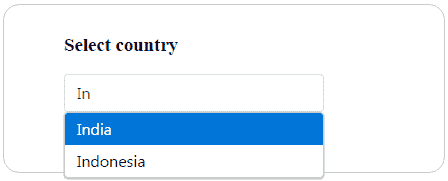

当用户在输入框中输入时，complete 方法将按需过滤项目。该方法必须在组件类中定义，如下所示：

```ts
filterCountries(event: any) {
 let query = event.query;
  this.countryService.getCountries().
 subscribe((countries: Country[]) => {
    this.filteredCountries = this.filterCountry(query, countries);
  });
}

```

上述方法允许根据用户查询对国家列表进行过滤。在这种情况下，它将过滤所有以 `query` 字符开头的国家。

为了改善用户体验，AutoComplete 通过`dropdown`属性提供了一个下拉选项。单击下拉图标，它将立即在向下弹出窗口中填充所有可能的项目。

# 多重选择

使用 AutoComplete，还可以通过将`multiple`属性设置为`true`来选择多个值。借助多选，可以将选定的文本作为数组（例如，`countries`属性）检索出来。在这种情况下，`ngModel`应该引用一个数组。

# 使用对象

到目前为止，AutoComplete 已经展示了它在原始类型上的强大功能，但它也可以处理对象类型。传递给模型的值将是一个对象实例，但`field`属性定义了要显示为建议的标签。也就是说，在这种情况下，`field`属性用于将对象的任何属性显示为标签。以下示例展示了对象使用的功能：

```ts
<p-autoComplete id="instance" [(ngModel)]="countryInstance" name="instance"
 [suggestions]="filteredCountryInstances"
 (completeMethod)="filterCountryInstances($event)" field="name">
</p-autoComplete>

```

在上面的例子中，`Country`对象被用作模型对象实例，显示的建议来自使用`name`字段属性的国家。

# 高级功能 - 定制内容显示

在许多情况下，普通字段填充是不够的；为了获得更好的体验，定制内容会更有力量。AutoComplete 使用`ng-template`提供了这个功能，它在建议面板内显示定制内容。传递给`ng-template`的本地`template`变量是`suggestions`数组中的一个对象。具有国家名称和国旗的 AutoComplete 的定制示例如下：

```ts
<p-autoComplete [(ngModel)]="customCountry" name="template"
 [suggestions]="filteredCustomCountries"
  field="name" (completeMethod)="filterCustomCountries($event)" 
  [size]="30" [minLength]="1" placeholder="Start your search">
  <ng-template let-country pTemplate="item">
    <div class="ui-helper-clearfix" class="template-border">
      
      <div class="country-text">{{country.name}}</div>
     </div>
 </ng-template>
</p-autoComplete>

```

对显示的数据类型没有限制。以下截图显示了定制国家信息的快照结果：

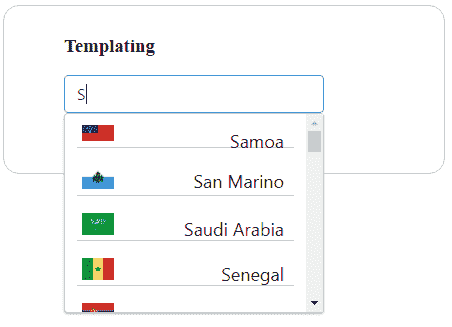

`item`模板用于定制建议面板内的内容，其中`selectedItem`用于定制多选中的选定项。

AutoComplete 组件支持许多事件，如下所述：

| **名称** | **参数** | **描述** |
| --- | --- | --- |
| `completeMethod` |

+   `event.originalEvent`: 浏览器事件

+   `event.query`: 用于搜索的值

| 调用以搜索建议的回调函数。 |
| --- |
| `onFocus` | `event`: 浏览器事件 | 当 AutoComplete 获得焦点时调用的回调函数。 |
| `onBlur` | `event`: 浏览器事件 | 当 AutoComplete 失去焦点时调用的回调函数。 |
| `onSelect` | `value`: 选定的值 | 当选择建议时调用的回调函数。 |
| `onUnselect` | `value`: 多选模式下取消选定的值 | 当取消选定的值时调用的回调函数。 |
| `onDropdownClick` |

+   `event.originalEvent`: 浏览器事件

+   `event.query`: 输入字段的当前值

| 当下拉按钮被点击时调用的回调函数。 |
| --- |
| `onClear` | `event`: 浏览器事件 | 当`input`字段被清除时调用的回调函数。 |

完整的演示应用程序及说明可在 GitHub 上找到

[`github.com/ova2/angular-development-with-primeng/tree/master/chapter3/autocomplete.`](https://github.com/ova2/angular-development-with-primeng/tree/master/chapter3/autocomplete)

# 使用芯片输入多个值

芯片组件用于在输入字段中表示多个复杂实体，如联系信息，以小块的形式。芯片可以包含实体，如照片、标题、文本、规则、图标，甚至联系人。这对以紧凑的方式表示信息很有用。芯片组件的以下基本示例表示联系人姓名的顺序。默认情况下，每个实体都可以通过叉号图标或退格键删除：

```ts
<p-chips [(ngModel)]="contactnames" name="basic"></p-chips>

```

以下屏幕截图显示了公司联系人姓名作为芯片示例的快照结果：

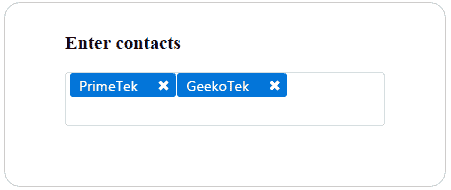

芯片组件支持两个名为`onAdd`和`onRemove`的事件回调。这些事件回调将在向输入框添加和移除芯片时被调用。

# 使用模板显示复杂信息

使用`ng-template`元素自定义芯片，其中值作为隐式变量传递。`ng-template`的内容包括普通文本、图标、图片和任何其他组件。请记住，自定义芯片组件没有叉号图标，也就是说，我们只能通过退格键删除芯片条目。带有图标的芯片组件的自定义示例如下：

```ts
<p-chips [(ngModel)]="complexcontacts" name="template">
 <ng-template let-item pTemplate="item">
    <i class="fa fa-address-card"></i>-{{item}}
  </ng-template>
</p-chips>

```

在上面的示例中，使用公司标志和联系人姓名显示了自定义内容。以下屏幕截图显示了自定义芯片示例的快照结果：

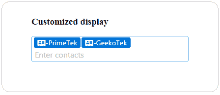

使用`max`和`disabled`属性来控制芯片的用户输入操作。可以使用`max`属性限制最大条目数。例如，如果我们设置`max="5"`，则不允许在输入中添加第六个条目。而`disabled="true"`会使输入框被禁用，从而限制芯片的输入。

PrimeNG 4.1 版本引入了用于自定义输入的`inputStyle`和`inputStyleClass`属性，以及用于控制重复输入的`allowDuplicate`属性。

完整的演示应用程序及说明可在 GitHub 上找到

请点击以下链接查看章节 3 中的 chips 示例代码：[`github.com/ova2/angular-development-with-primeng/tree/master/chapter3/chips.`](https://github.com/ova2/angular-development-with-primeng/tree/master/chapter3/chips)

# 发现复选框 - 布尔值，多个和三态

复选框是具有皮肤功能的标准复选框元素的扩展。复选框可以作为单个复选框来提供布尔值，也可以作为具有相同组名的多个复选框的多个选择。

# 布尔复选框 - 单选

默认情况下，复选框启用了多选功能，我们可以通过启用`binary`属性来进行单选。单选复选框的基本示例如下：

```ts
<p-checkbox name="single" [(ngModel)]="checked" binary="true">
</p-checkbox>

```

在上面的示例中，布尔复选框用于了解对 Angular 框架的兴趣。组件将显示如下截图所示：

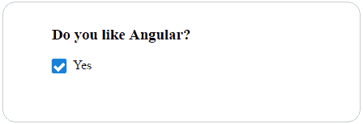

通过在模型中启用布尔属性，也可以实现复选框的预选。

# 复选框多选

如前所述，默认情况下启用了多选功能，多个复选框控件具有相同的组名。在这种情况下，`model`属性绑定到一个数组以保存所选值。通过将单个复选框的值分配给所选值，复选框组将显示预选项。选择不同的喜爱的 Angular 版本的多个复选框选择如下：

```ts
<div class="ui-g" class="multicheckbox-width">
 <div class="ui-g-12"><p-checkbox name="angulargroup"  
    value="AngularJS1.0" label="AngularJS V1.0" [(ngModel)]="selectedVersions"></p-checkbox>
  </div>
  <div class="ui-g-12"><p-checkbox name="angulargroup" 
    value="AngularV2.0" label="Angular V2.0"
 [(ngModel)]="selectedVersions"></p-checkbox>
  </div>
  <div class="ui-g-12"><p-checkbox name="angulargroup" 
    value="AngularV4.0" label="Angular V4.0"
 [(ngModel)]="selectedVersions"></p-checkbox>
  </div>
</div>

```

复选框组将显示默认选择，如下截图所示：

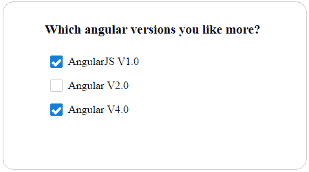

为了通知复选框选择，有一个名为`onChange`的事件回调，将在用户操作时被调用。同时，用户操作通过`disabled`属性被禁用。

# 多状态表示 - TriStateCheckbox

PrimeNG 超越了 Web 上“真/假”选择的普通复选框行为。在某些情况下，特别是表示任何实体的状态时，需要“真/假/空”组合。请记住，`model`属性分配给任何类型而不是`boolean`类型。用于输入对 Angular 4 的反馈的 TriStateCheckbox 的基本示例如下：

```ts
<p-triStateCheckbox name="tristate" [(ngModel)]="status">
</p-triStateCheckbox>

```

TriStateCheckbox 将显示三种不同的状态（优秀，良好和不好），如下截图所示：

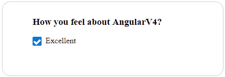

此增强复选框还为任何用户交互提供了`onChange`事件回调。用户操作通过`disabled`属性禁用，就像普通的布尔复选框一样。

完整的演示应用程序及说明可在 GitHub 上找到

[`github.com/ova2/angular-development-with-primeng/tree/master/chapter3/checkbox.`](https://github.com/ova2/angular-development-with-primeng/tree/master/chapter3/checkbox)

# 使用单选和多选组件选择项目

下拉提供了一种从可用选项集合中选择项目的方法。要列出所有可能的选项，我们应该使用定义标签值属性的`SelectItem`接口，并将此列表绑定到`options`属性。选定项目的双向绑定通过`model`属性进行定义。让我们为用户输入在下拉框中显示一个国家列表。下拉框的基本示例将如下所示：

```ts
<p-dropdown [options]="countries" [(ngModel)]="selectedCountry"
  [styleClass]="dropdown-width" placeholder="Select a Country">
</p-dropdown>

```

下拉框将显示如下所示的选项：

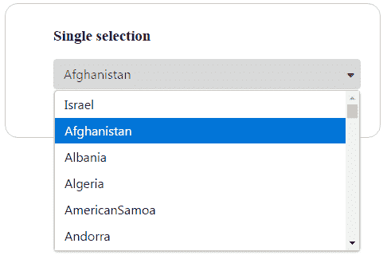

下拉组件提供了三个事件回调，如`onChange`，`onFocus`和`onBlur`。当下拉值发生变化时，分别获得焦点和失去焦点。有一个属性`editable`（即`editable="true"`）可以直接编辑输入，就像其他输入组件一样。

下拉视口的宽度和高度将通过`autoWidth`和`scrollHeight`属性进行控制。默认情况下，下拉框的宽度是根据选项的宽度计算的。而滚动高度通过`scrollHeight`选项以像素为单位进行控制，如果列表的高度超过此值，则定义滚动条。

# 自定义下拉框

下拉组件通过自定义内容比默认标签文本更强大。`filter`属性用于通过覆盖中的输入筛选所有可能的选项。下拉框的自定义示例，显示了代表国家名称和国旗图像的选项列表，将如下所示：

```ts
<p-dropdown [options]="countries" [(ngModel)]="selectedCountry"  
  [styleClass]="dropdown-width" filter="filter">
 <ng-template let-country pTemplate="item">
    <div class="ui-helper-clearfix" class="template-border">
      
      <div class="country-text">{{country.name}}</div>
    </div>
  </ng-template>
</p-dropdown>

```

下拉框将显示自定义内容和过滤，如下面的屏幕截图所示：

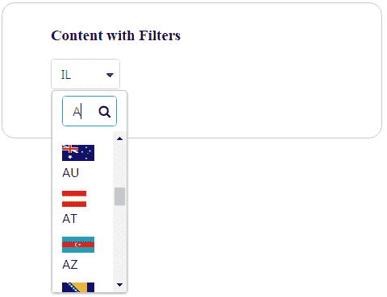

不必向下滚动查看所有国家的列表，顶部有一个过滤输入选项，可以按其起始字母过滤国家名称。它还支持逗号分隔值的多属性过滤（例如，`filterBy="label, value.name"`）。默认情况下，过滤是针对`SelectItem` API 的标签进行的。

# 多选下拉框

多选组件用于从集合中选择多个项目，而不是提供单个项目选择的下拉组件。具有国家列表的多选组件的基本示例如下：

```ts
<p-multiSelect [options]="countries" [(ngModel)]="selectedCountries">
</p-multiSelect>

```

选项列表通过`SelectItem`接口的集合可用，该接口采用标签值对。选项列表通过多选组件的`options`属性绑定。多选将显示国家列表，如下面的屏幕截图所示：

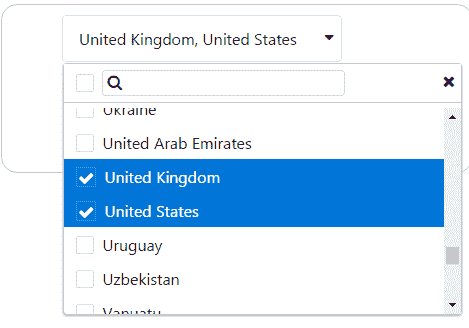

在这种情况下，用户可以使用复选框选项选择多个国家，该选项适用于每个项目，并且可以过滤输入以选择特定选项。

完整的演示应用程序及说明可在 GitHub 上找到

[`github.com/ova2/angular-development-with-primeng/tree/master/chapter3/select.`](https://github.com/ova2/angular-development-with-primeng/tree/master/chapter3/select)

# 基本和高级日历场景

日历是一种输入组件，以不同的定制方式选择日期输入，例如内联、本地化、限制特定日期和面向时间。在这种情况下，日历模型由日期类型属性支持。基本日期选择的最简单组件声明如下：

```ts
<p-calendar [(ngModel)]="basicDateInput" name="basic"></p-calendar>

```

这显示一个输入文本框，点击后会打开一个弹出式日期选择对话框，如下所示：

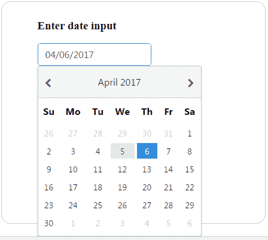

除了基本的日期选择外，还可以通过顶部的左右箭头控件在每年的每个月之间进行导航。这将在高级功能部分进行解释。

日期选择很简单，可以通过点击弹出对话框中的特定日期来完成。默认情况下，日历显示为弹出式，但可以通过`inline`属性更改此行为。日历显示的内联版本如下：

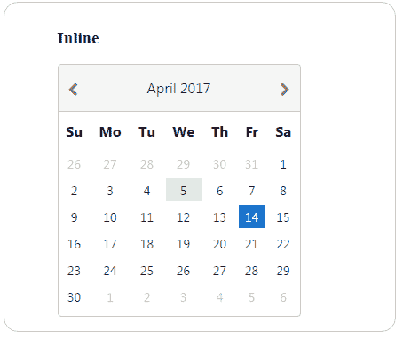

为了更好的用户体验，组件还提供了通过`showIcon`属性显示日历弹出窗口的另一个选项。使用图标按钮的日历输入示例如下：

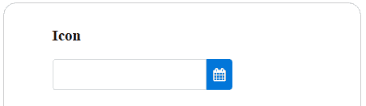

日历组件的可视显示，带有`icon`属性的将改变输入框旁边显示的默认图标。

# 本地化

不同语言和格式的本地化是通过将本地设置对象绑定到`locale`属性来定义的。默认的本地值是`英语`。要表示不同的区域设置，我们应该提供相应的语言文本标签。例如，德语区域应该为德语日历提供以下标签：

```ts
this.de = {
 firstDayOfWeek: 1,
  dayNames: ['Sonntag', 'Montag', 'Dienstag', 'Mittwoch', 'Donnerstag',  
 'Freitag', 'Samstag'],
  dayNamesShort: ['Son', 'Mon', 'Die', 'Mit', 'Don', 'Fre', 'Sam'],
  dayNamesMin: ['S', 'M', 'D', 'M ', 'D', 'F ', 'S'],
  monthNames: [
    'Januar', 'Februar', 'März', 'April', 'Mai', 'Juni', 'Juli',
    'August', 'September', 'Oktober', 'November', 'Dezember'
  ],
  monthNamesShort: ['Jan', 'Feb', 'Mär', 'Apr', 'Mai', 'Jun', 'Jul',
                    'Aug', 'Sep', 'Okt', 'Nov', 'Dez']
};

```

带有德语区域标签的日历将显示如下：

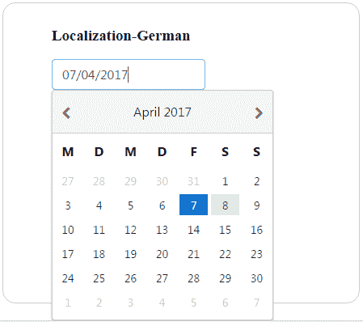

如前所示，区域特定的标签需要在后台组件中格式化为 JSON 以显示区域特定的日历。

# 时间选择器选项

除了标准的日历日期选择，我们还可以使用`showTime`和`hourFormat`来显示时间。这可以进一步限制为仅使用`timeOnly`属性来显示时间，这只是一个时间选择器。例如，`timeOnly`选项将显示时间选择器如下：

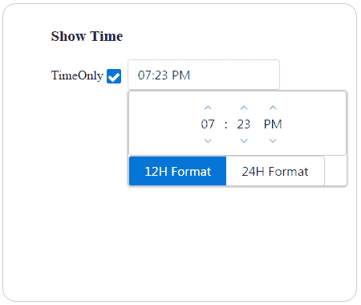

两种时间格式（12 小时制和 24 小时制）将使用分割按钮分别显示。请注意，此时启用了`showTime`属性。

# 高级功能

日历组件的高级功能，如日期格式（使用`dateFormat`属性）、受限日期（使用`min`和`max`日期）、月份和年份导航器以便轻松访问（使用`monthNavigator`、`yearNavigator`和`yearRange`属性）、只读输入（使用`readOnlyInput`属性）以及有用的事件，如`onSelect`、`onFocus`、`onClear`和`onBlur`：

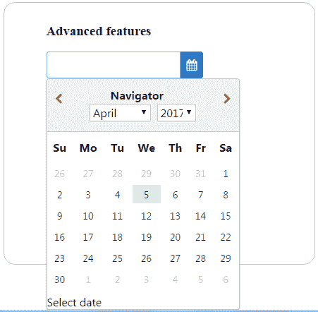

上述快照描述了可以与其特性的任何可能组合一起使用的日历。

完整的演示应用程序及说明可在 GitHub 上找到

[`github.com/ova2/angular-development-with-primeng/tree/master/chapter3/calendar.`](https://github.com/ova2/angular-development-with-primeng/tree/master/chapter3/calendar)

# 旋转器和滑块-提供输入的不同方式

输入组件 Spinner 通过控件或按钮提供数字输入的增量和减量。但仍然有选项可以将其用作普通的`InputText`。Spinner 的基本示例如下：

```ts
<p-spinner  name="basic" size="30" [(ngModel)]="basicinput"></p-spinner>

```

如下截图所示，Spinner 将显示带有按钮控件：

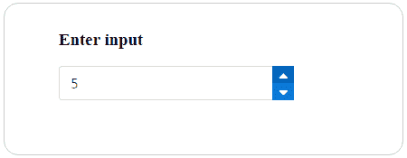

如快照所示，可以使用 Spinner 控件连续修改值。与任何其他输入组件一样，Spinner 支持`onChange`事件回调，该回调将在值更改时被调用。可以通过`maxlength`属性控制允许的最大字符数。用户交互将通过`readonly`和`disabled`属性受限。

# 高级功能-超越基本用法

Spinner 组件提供的功能不仅仅是具有增量和减量控件。它还可以提供诸如使用`min`和`max`属性的值边界，使用`step`属性自定义步进因子（默认步进因子为`1`）以及数字分隔符，例如`decimalSeparator`和`thousandSeparator`。Spinner 的自定义示例如下：

```ts
<p-spinner name="minmax" size="40" [(ngModel)]="customizedinput" [min]="0" [max]="100" [step]="0.50"
  placeholder="Enter your input or use spinner controls"></p-spinner>

```

如下截图所示，Spinner 将显示带有按钮控件：

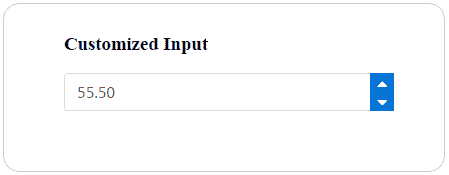

一旦用户输入达到`min`和`max`限制，值将无法通过控件或输入更改。

可以使用`formatInput`属性自定义输入的格式。

# 滑块

滑块组件提供了使用滑块条或拖动手柄输入值的能力。`model`属性绑定到一个数字类型，它保存输入值。可以通过为两者提供相同的模型值将输入附加到滑块。滑块的基本示例如下：

```ts
<p-slider [(ngModel)]="basicinput" name="basicinput"  
  styleClass="slider-width">
</p-slider>

```

如下截图所示，滑块将显示带有拖动手柄：

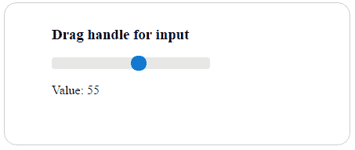

每次拖动手柄穿过条时，输出值将更新。

# 高级功能-超越基本用法

滑块组件可以通过类似于具有输入边界的微调器的方式进行进一步定制，使用`min`和`max`属性或`range`属性同时提及两个边界，使用`step`属性定制步进因子（默认步进因子为`1`），以及使用`animate`属性在单击滑块时提供动画效果。

滑块输入的默认方向是水平的。可以使用`orientation`属性将滑块的方向或方向更改为垂直。

有时，除了滑块手柄之外，还可以使用常规输入，因为这样可以直接输入并且还可以通过拖动滑块手柄来显示输出。滑块的定制示例如下：

```ts
<input type="text" pInputText name="customizedinput"   
  [(ngModel)]="customizedinput"
 styleClass="input-width"/>
<p-slider [(ngModel)]="customizedinput" name="customizedinput"   
  styleClass="slider-width" [step]="20"
 [animate]="true" (onChange)="onChange()" (onSlideEnd)="onSlideEnd()">
</p-slider>

```

滑块将显示为以下截图所示的定制特性：

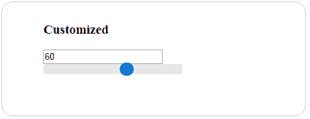

滑块输入和滑块手柄值是相互依赖的。例如，更改一个值将反映另一个值。

完整的演示应用程序及说明可在 GitHub 上找到：

+   [`github.com/ova2/angular-development-with-primeng/tree/master/chapter3/spinner`](https://github.com/ova2/angular-development-with-primeng/tree/master/chapter3/spinner)

+   [`github.com/ova2/angular-development-with-primeng/tree/master/chapter3/slider`](https://github.com/ova2/angular-development-with-primeng/tree/master/chapter3/slider)

# 使用富文本编辑器进行文本编辑

编辑器是基于 Quill 编辑器的富文本编辑器（所见即所得）。它包含一个带有常见选项的默认工具栏，其控件可以使用标题元素进行定制。此处使用的是 Quill 1.0 的最新版本作为依赖项。具有默认工具栏的基本文本编辑器可以表示如下：

```ts
<p-editor name="basic" [(ngModel)]="basictext" 
  styleClass="editor-dimensions">
</p-editor>

```

具有常见选项的文本编辑器将如下所示：

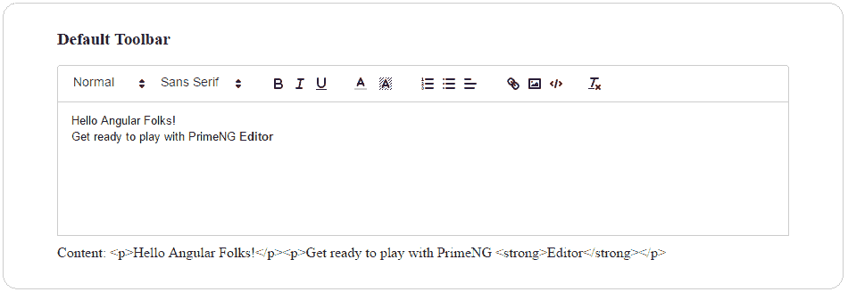1\. 在`package.json`中添加 Quill 1.0 依赖项并安装它，或者使用 CLI 工具安装它（`npm install quill --save`）。

2\. 还要在入口页面中添加 Quill 脚本和样式 URL：

`<script src="https://cdn.quilljs.com/

1.0.0-beta.3/quill.min.js"></script>`

`<link rel="stylesheet" type="text/css" href="https://cdn.quilljs.com/1.0.0-

beta.3/quill.snow.css">`

编辑器支持`onTextChange`和`onSelectionChange`事件，当编辑器的文本发生变化时，将调用`onTextChange`事件，当编辑器的选定文本发生变化时，将调用`onSelectionChange`事件。

# 自定义编辑器

如前所述，编辑器提供了一个带有常用选项的默认工具栏。可以通过在头部元素内定义元素来自定义工具栏。例如，使用文本样式控件创建的自定义工具栏如下所示：

```ts
<p-editor name="custom" [(ngModel)]="customtext" 
  styleClass="editor-dimensions">
 <p-header>
 <span class="ql-formats">
      <button class="ql-bold"></button>
      <button class="ql-italic"></button>
      <button class="ql-underline"></button>
      <button class="ql-clean"></button>
 </span>
 </p-header>
</p-editor>

```

带有自定义工具栏的文本编辑器将显示如下：

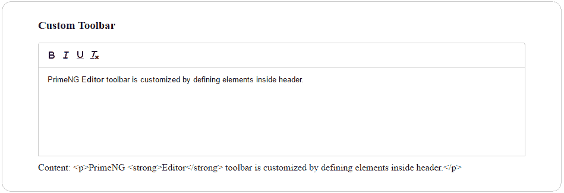

工具栏可以以不同的方式使用任意数量的工具栏控件进行自定义。请参考 Quill 文档以获取所有可用的控件。

完整的演示应用程序及说明可在 GitHub 上找到。

[`github.com/ova2/angular-development-with-primeng/tree/master/chapter3/editor.`](https://github.com/ova2/angular-development-with-primeng/tree/master/chapter3/editor)

# 密码和基于星级的评分输入

密码是一个增强型输入，具有字符的安全输入，就像网页上的其他密码字段一样，但它提供了强度指示器（弱、中、强），表示用户输入的安全强度。用户密码的基本示例可以写成如下形式：

```ts
<input pPassword name="basic" type="password" />

```

以下截图显示了基本密码示例的快照结果：

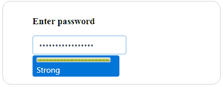

通过附加`pPassword`指令，密码应用于输入字段。`ngModel`属性用于绑定密码值。

默认情况下，密码将显示提示和强度指示标签。有一个选项可以使用诸如`promptLabel`、`weakLabel`、`mediumLabel`和`strongLabel`等属性来自定义所有强度指示标签。这将有助于根据需要本地化密码输入。默认情况下，`feedback`属性为`true`。一旦输入获得焦点或按键，指示标签就会出现。但是通过将反馈设置为`false`来改变这种行为，可以抑制输入的指示器。

# 评分输入

评分组件提供了基于星级的评分，具有选择和取消的功能。组件的基本声明如下：

```ts
<p-rating name="basic" [(ngModel)]="angular" ></p-rating>

```

在这里，评分限定值应该是一个数字类型。Angular 评分的默认视觉效果如下截图所示：

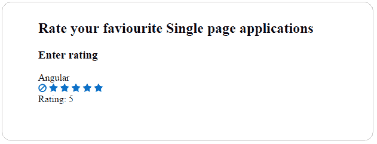

`star`属性帮助提供评分中的星星数量。星星的默认值为`5`。

选择和取消评分的行为可以更加交互，您可以通过`onRate`和`onCancel`回调来得到通知。在上面的快照中，评分值可以通过左侧的取消图标清除。这是因为，默认情况下`cancel`属性将被启用。如果该属性被禁用，则一旦选择评分就无法取消。通过禁用`cancel`属性，评分快照将显示为没有图标，如下所示：

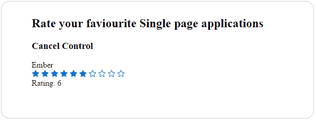

由于这个特性，取消按钮不会出现来取消给定的评分。一次只能取消一个星级。

目前，评分组件不支持半个或四分之一的值。

通过在评分组件上启用`readonly`和`disabled`属性，无法选择或取消评分。这对于仅用于显示目的很有用。

完整的演示应用程序及说明可在 GitHub 上找到：

+   [`github.com/ova2/angular-development-with-primeng/tree/master/chapter3/password`](https://github.com/ova2/angular-development-with-primeng/tree/master/chapter3/password) [](https://github.com/ova2/angular-development-with-primeng/tree/master/chapter3/password)

+   [`github.com/ova2/angular-development-with-primeng/tree/master/chapter3/rating`](https://github.com/ova2/angular-development-with-primeng/tree/master/chapter3/rating)

# 使用输入和选择组件进行验证

Angular 提供了三种不同的构建应用程序中表单的方式：

+   **基于模板的方法**：这种方法允许我们构建表单，几乎不需要或根本不需要应用程序代码

+   **基于模型驱动（或响应式）的低级 API 方法**：在这种方法中，我们创建的表单可以进行测试，而无需 DOM

+   **使用更高级 API 的基于模型驱动的方法**：这种方法使用一个称为`FormBuilder`的更高级 API。

PrimeNG 创建了大多数输入和选择组件，并支持基于模型驱动的表单。因此，所有输入和选择组件都可以进行验证。

让我们以一个带有`firstname`、`lastname`、`password`、`address`、`phone`和`gender`字段的带有验证支持的注册表单为例。PrimeNG 组件由一个模型驱动的 API 支持，使用`FormBuilder`将所有表单控件分组以创建一个注册表单，如下所示：

```ts
this.registrationform = this.formBuilder.group({
    'firstname': new FormControl('', Validators.required),
    'lastname': new FormControl('', Validators.required),
    'password': new FormControl('',   
      Validators.compose([Validators.required, 
      Validators.minLength(8)])),
    'address': new FormControl(''),
    'phone': new FormControl(''),
    'gender': new FormControl('', Validators.required)
});

```

然而，HTML 中包含了与注册表单绑定的`form`元素和`formGroup`。表单将包含一系列控件和验证条件以显示消息：

```ts
<form [formGroup]="registrationform" (ngSubmit)="onSubmit(registrationform.value)">
  ... </form>

```

具有无效输入的注册表单将导致错误消息，如下快照所示：

*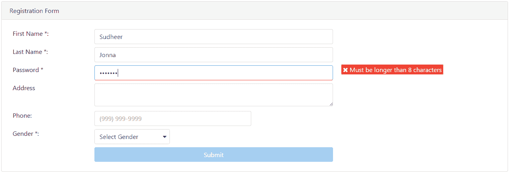*

PrimeNG 组件通过模板驱动表单和模型驱动表单提供验证。用户可以灵活选择需要提供的验证类型。

完整的演示应用程序及说明可在 GitHub 上找到。

[`github.com/ova2/angular-development-with-primeng/tree/master/chapter3/validation.`](https://github.com/ova2/angular-development-with-primeng/tree/master/chapter3/validation)

# 总结

在本章的结尾，您将能够无缝地为任何给定的用例使用所有可用的输入和选择组件。最初，我们涵盖了各种输入组件。起初，我们从使用 InputMask 进行格式化输入，使用 AutoComplete 进行自动建议，以及使用 Chips 组件输入多个值开始。

之后，我们讨论了各种复选框组件，如布尔复选框、多选框和三态复选框变体。之后，我们讨论了常用的选择组件，如单选和多选组件。我们解释了特定用例的输入组件，如日历日期输入、滑块、微调器、密码、星号和使用丰富编辑器进行文本编辑，以及所有可能的功能。最后，我们通过查看输入和选择组件的验证来结束了本章。所有这些组件和所有可能的功能都是通过逐步方法进行解释的。

在下一章中，您将看到各种按钮和面板组件将如何使您的生活更轻松。
