# 第四章：按钮和面板组件

在本章中，我们将首先涵盖各种按钮组件，如单选按钮、分割按钮、切换按钮和选择按钮，然后转向各种面板组件，如工具栏、基本面板、字段集、手风琴和选项卡视图。用户输入将以多种方式进行，其中按钮输入是最佳选项之一；另一方面，面板组件充当容器组件，允许对其他原生 HTML 或 PrimeNG 组件进行分组。PrimeNG 的每个功能——增强按钮和面板组件都涵盖了许多实时用例需求。本章详细介绍了配置按钮和面板组件的各种设置。

在本章中，我们将涵盖以下主题：

+   增强按钮、单选按钮和分割按钮

+   通过切换按钮和选择按钮选择值

+   使用工具栏对按钮进行分组

+   使用面板和字段集排列您的视图

+   垂直堆叠的手风琴面板

+   在 TabView 中使用选项卡对内容进行分组

# 增强按钮、单选按钮和分割按钮

按钮是任何网页设计中经常使用的元素。PrimeNG 通过出色的功能扩展了普通按钮的行为。

# 按钮

按钮组件是用于用户与图标和主题进行交互的标准输入元素的扩展。`pButton`指令将普通的 HTML 按钮变成 PrimeNG 增强按钮。具有定义的标签文本的按钮组件的基本示例将如下所示：

```ts
<button name="basic" pButton type="button" label="ClickMe"></button>

```

按钮的类型应为`button`类型。以下屏幕截图显示了基本按钮示例的快照结果：

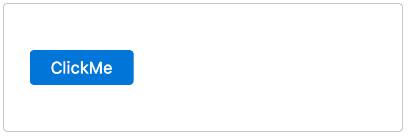

按钮组件支持一个名为`click`的事件回调，该事件将在单击按钮元素时被调用。请记住，按钮的点击事件基本上是来自 Angular 而不是特定于 PrimeNG 的。

# 图标和严重性

按钮组件在图标和严重性属性方面更有用。`icon`属性用于在按钮上方表示字体 awesome 图标。默认图标位置是左侧位置。可以使用`iconPos`属性自定义此位置，有效值为`left`和`right`。为了仅显示一个图标，将标签留空。按钮组件的示例，包括各种图标和标签的组合，将如下所示：

```ts
<button pButton type="button" icon="fa-close"></button>
<button pButton type="button" icon="fa-check" label="Yes"></button>
<button pButton type="button" icon="fa-check" iconPos="right" label="Yes"></button>

```

在上面的示例中，按钮被定义为没有标签，有标签，并且带有标签的右侧定位图标，依次排列。以下屏幕截图显示了带有图标的按钮的快照结果：

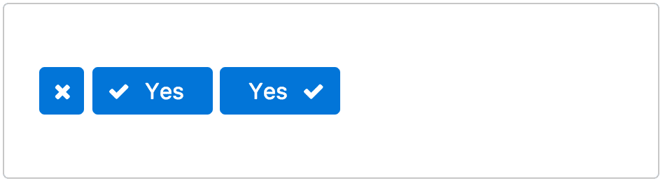

为了区分用户操作的不同严重级别，PrimeNG 提供了五种不同的类，即这些样式类与常规主题颜色不同：

+   `ui-button-secondary`

+   `ui-button-success`

+   `ui-button-info`

+   `ui-button-warning`

+   `ui-button-danger`

以下屏幕截图显示了带有所有严重情况的按钮的快照结果（与常规主题类进行比较）：

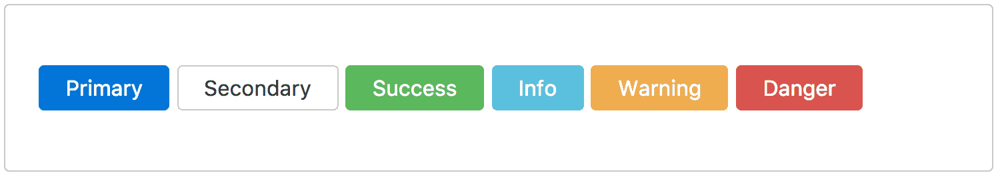

用户交互使用常规的`disabled`属性来阻止。

完整的演示应用程序及说明可在 GitHub 上找到

[`github.com/ova2/angular-development-with-primeng/tree/master/chapter4/button.`](https://github.com/ova2/angular-development-with-primeng/tree/master/chapter4/button)

# RadioButton

RadioButton 是标准单选按钮元素的扩展，具有选择能力以一次只选择一个值。双向绑定通过`ngModel`指令提供，该指令使默认值可以作为已选或未选（预选）。以下是一个具有定义标签文本的 RadioButton 组件的基本示例：

```ts
<div class="ui-g">
 <div class="ui-g-12">
    <p-radioButton name="group1" value="Angular" label="Angular"
 [(ngModel)]="basic"></p-radioButton>
  </div>
  <div class="ui-g-12">
    <p-radioButton name="group1" value="React" label="React"
 [(ngModel)]="basic"></p-radioButton>
  </div>
  <div class="ui-g-12">
    <p-radioButton name="group1" value="Polymer" label="Polymer"
 [(ngModel)]="basic"></p-radioButton>
  </div>
</div>

```

在上面的示例中，所有单选按钮都映射到同一组（`name="group1"`），以便作为互斥的单选按钮组工作。以下屏幕截图显示了单选按钮示例的快照结果：

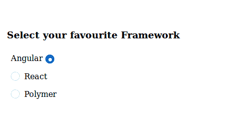

单选按钮组件支持一个名为`onClick`的事件回调，该事件将在单选按钮元素被点击时被调用。`label`属性为单选按钮提供了标签文本。标签也是可点击的，并且选择值。与单选按钮相关的标签组件需要在点击时触发输入的焦点，这可以通过`inputId`属性实现。

完整的演示应用程序及说明可在 GitHub 上找到

[`github.com/ova2/angular-development-with-primeng/tree/master/chapter4/radio-button.`](https://github.com/ova2/angular-development-with-primeng/tree/master/chapter4/radio-button)

# SplitButton

SplitButton 将一组菜单项与默认命令按钮组合在一个覆盖中。此按钮使用常见的菜单模型 API 来定义其项目。因此，分割按钮是按钮和菜单组件的组合。使用定义的标签文本的 SplitButton 组件的基本示例将如下所示：

```ts
<p-splitButton label="Create" (onClick)="create()" [model]="items">
</p-splitButton>

```

标签仅适用于默认命令按钮。以下屏幕截图显示了分割按钮示例的快照结果：

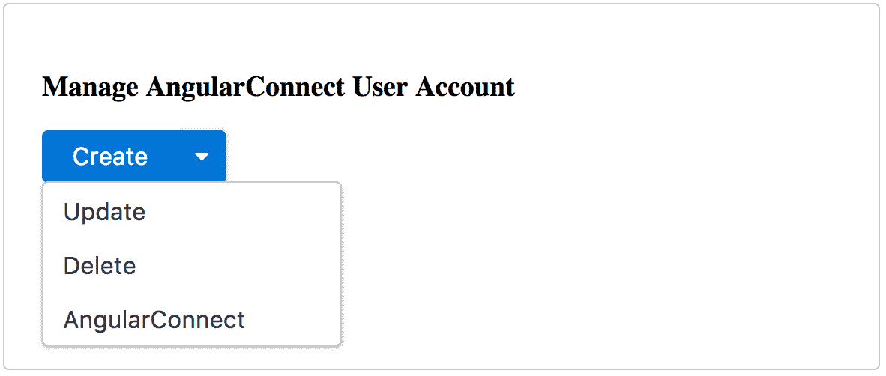

分割按钮组件支持一个名为`onClick`的事件回调，该回调将在单击默认按钮元素时被调用。

PrimeNG 4.1 提供了`appendTo`选项，可以自定义覆盖的附加位置。

# 图标和主题

有许多选项可以自定义分割按钮的行为。图标可以分别应用于关联的默认命令按钮和菜单项，使用`icon`属性。默认情况下，图标对齐到左侧，但也可以使用`iconPos`属性应用到右侧，而组件和覆盖的皮肤行为可以通过`style`、`styleClass`、`menuStyle`和`menuStyleClass`类属性进行修改。使用定义的标签文本的 SplitButton 组件的基本示例将如下所示：

```ts
<p-splitButton label="Create" icon="fa-check" iconPos="right"  
  menuStyleClass="customized-menu" [model]="itemsIcons">
</p-splitButton>

```

在上面的示例中，通过`menuStyleClass`属性改变了覆盖菜单的默认样式。例如，在这种情况下，通过设置`menuStyleClass`类名来改变覆盖的默认宽度，如下所示：

```ts
.customized-menu {
  width: 140%;
}

```

以下屏幕截图显示了分割按钮示例的快照结果：

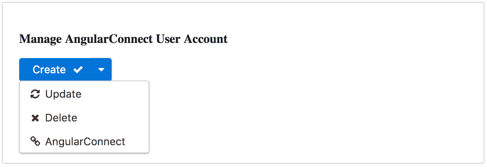

在上面的快照中，分割按钮定制了图标，创建命令按钮图标对齐到右侧，并且覆盖的宽度增加以容纳图标和文本。

完整的演示应用程序和说明可在 GitHub 上找到

[`github.com/ova2/angular-development-with-primeng/tree/master/chapter4/split-button`](https://github.com/ova2/angular-development-with-primeng/tree/master/chapter4/split-button)。

# 使用 ToggleButton 和 SelectButton 选择一个值

ToggleButton 提供了一种使用按钮选择布尔值的方法。`ngModel`指令用于将双向数据绑定到布尔属性。也就是说，通过启用布尔属性来实现切换按钮的预选。ToggleButton 使用的基本示例如下：

```ts
<p-toggleButton [(ngModel)]="basic" name="basic"></p-toggleButton>

```

以下屏幕截图显示了基本示例的快照结果：

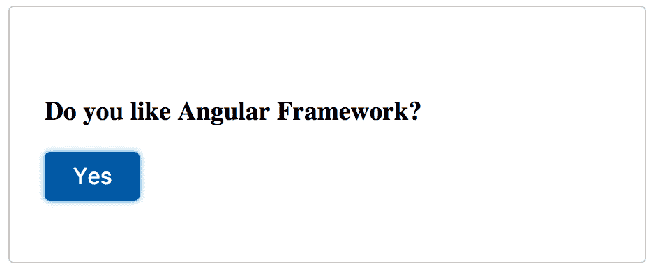

ToggleButton 还提供了自定义选项，如`onLabel`、`offLabel`、`onIcon`和`offIcon`，用于覆盖默认标签和图标。与切换按钮相关的标签组件需要在单击标签时触发按钮的焦点，这可以通过`inputId`属性实现。具有标签、图标和事件的自定义切换按钮如下：

```ts
<p-toggleButton [(ngModel)]="customized" name="custom" onLabel="I 
  confirm" offLabel="I reject" onIcon="fa-check-square" 
  offIcon="fa-window-close">
</p-toggleButton>

```

在上面的例子中，可以为`icon`属性使用各种 font-awesome 图标。以下屏幕截图显示了自定义示例的快照结果：

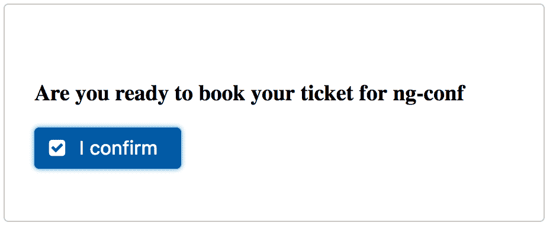

用户使用`onChange`事件来通知用户操作。同时，使用`disabled`属性来阻止用户交互。

# SelectButton

SelectButton 组件用于从按钮形式的列表中选择单个或多个项目。选项列表中的每个项目都被定义为具有标签值对属性的`SelectItem`接口。选项通过`ngModel`属性进行绑定，实现双向绑定，这将根据后端组件数据进行默认选择。选择按钮使用的基本示例如下：

```ts
<p-selectButton [options]="types" [(ngModel)]="selectedType"   
  name="basic">
</p-selectButton>  

```

在上面的例子中，所有 Prime 库都被收集为`options`属性的数组。以下屏幕截图显示了选择按钮示例的快照结果：

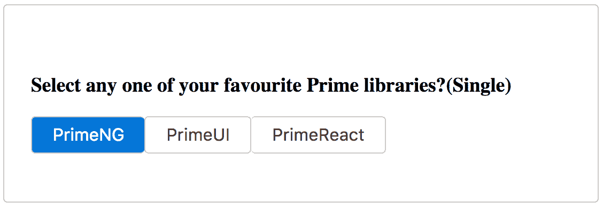

在上面的例子中，一次只能选择一个项目（单选），但也可以使用`multiple`属性选择多个项目（即`multiple="true"`）。在这种情况下，所选的数组列表不应指向空值或未定义的值。

选择按钮组件支持一个名为`onChange`的事件回调，该事件将在单击默认按钮元素时被调用。

完整的演示应用程序及说明可在 GitHub 上找到：

+   [`github.com/ova2/angular-development-with-primeng/tree/master/chapter4/togglebutton`](https://github.com/ova2/angular-development-with-primeng/tree/master/chapter4/togglebutton)

+   [`github.com/ova2/angular-development-with-primeng/tree/master/chapter4/selectbutton`](https://github.com/ova2/angular-development-with-primeng/tree/master/chapter4/selectbutton)

# 使用 Toolbar 分组按钮

Toolbar 是按钮和其他 Web 资源的分组或容器组件。Toolbar 内容包装在两个 `div` 元素中，一个用于使用 `.ui-toolbar-group-left` 类在左侧对齐内容，另一个用于使用 `.ui-toolbar-group-right` 类在右侧对齐内容。Toolbar 组件的示例，包括不同的按钮、输入控件和文本内容，如下所示：

```ts
<p-toolbar name="toolbar">
 <div class="ui-toolbar-group-left">
    <button pButton type="button" name="open" label="Open" 
      icon="fa-folder-open"></button>
    <button pButton type="button" name="new" label="New folder" 
      icon="fa-plus"></button>
    <p-splitButton name="organize" label="Organize" 
      icon="fa-check" name="organize"
 [model]="items"></p-splitButton>
  </div>

  <div class="ui-toolbar-group-right">
    <input name="search" type="text" size="30" pInputText 
    [(ngModel)]="search"
 placeholder="Search files here"/>
      <i class="fa fa-bars"></i>
      <button name="refresh" pButton type="button" 
      icon="fa-refresh"></button>
      <button name="help" pButton type="button" 
      icon="fa-question-circle"></button>
  </div>
</p-toolbar>

```

以下屏幕截图显示了 Toolbar 的快照结果：

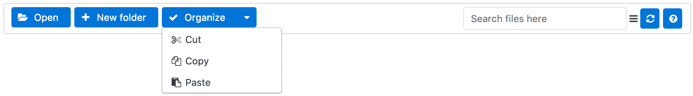

在上述快照中，常用的 Toolbar 按钮放在左侧，次要（或附加信息）放在右侧。通过 `style` 和 `styleClass` 属性提供了皮肤特性。

完整的演示应用程序及说明可在 GitHub 上找到

[`github.com/ova2/angular-development-with-primeng/tree/master/chapter4/toolbar`](https://github.com/ova2/angular-development-with-primeng/tree/master/chapter4/toolbar).

# 使用 Panel 和 FieldSet 排列您的视图

大多数网站和仪表板需要分组或容器组件来突出标题和描述。PrimeNG 提供了许多容器组件的变体。

# Panel

作为 Web 内容的通用分组组件，Panel 具有切换和自定义内容等功能。Panel 的基本定义如下：

```ts
<p-panel header="PrimeNG">
  PrimeNG is a collection of rich UI components for Angular.
  PrimeNG is a sibling of the popular JavaServer Faces Component Suite,  
  PrimeFaces.
  All widgets are open source and free to use under MIT License.
  PrimeNG is developed by PrimeTek Informatics, a company with years of 
  expertise in developing open source UI components.
</p-panel>

```

Panel 的上述定义将在容器内显示 PrimeNG 详细信息，如下屏幕截图所示：

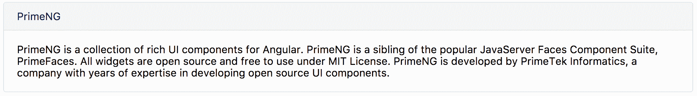

Panel 将更加用户友好，具有可切换（`toggleable="true"`）和自定义标题内容功能。可切换功能将内容定义为展开或折叠。面板内容的初始状态（展开或折叠）由`collapsed`属性定义；默认情况下，内容部分将展开，而自定义的标题和页脚通过`p-header`和`p-footer`标签定义，可以接受文本、图像、图标等。例如，以下是以下拉列表形式显示 PrimeNG 资源列表的自定义标题的示例：

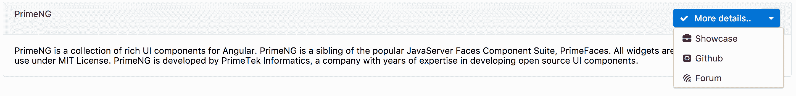

我们可以使用`onBeforeToggle`和`onAfterToggle`回调在切换之前和之后捕获用户操作。

# FieldSet

FieldSet 是一个带有内容切换功能的分组组件。在顶部，图例定义了标题并在主体内容周围绘制了一个框。具有`toggleable`功能的 FieldSet 示例如下：

```ts
 <p-fieldset legend="PrimeNG" [toggleable]="true" [collapsed]="true">
   PrimeNG is a collection of rich UI components for Angular.
   PrimeNG is a sibling of the popular JavaServer Faces Component  
   Suite, PrimeFaces.
   All widgets are open source and free to use under MIT License.
   PrimeNG is developed by PrimeTek Informatics, a company with years 
   of expertise in developing open source UI components.
</p-fieldset>

```

如下所示，前面的 FieldSet 的定义将显示为以下截图：

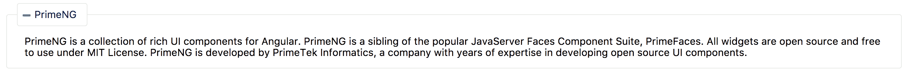

与 Panel 组件类似，FieldSet 通过`p-header`属性（即自定义的标题内容）提供了自定义的图例。

FieldSet 的标题文本由`legend`属性管理，而切换功能由`toggleable`和`collapsed`属性控制。有两个名为`onBeforeToggle`和`onAfterToggle`的事件回调可用于任何自定义逻辑实现。

完整的演示应用程序及说明可在 GitHub 上找到：

+   [`github.com/ova2/angular-development-with-primeng/tree/master/chapter4/panel`](https://github.com/ova2/angular-development-with-primeng/tree/master/chapter4/panel)

+   [`github.com/ova2/angular-development-with-primeng/tree/master/chapter4/fieldset`](https://github.com/ova2/angular-development-with-primeng/tree/master/chapter4/fieldset)

# 带有手风琴的垂直堆叠面板

手风琴是一个容器组件，可以以多个选项卡的形式对内容进行分组。内容可以是文本、图像或任何其他组件。所有选项卡内容都以垂直顺序堆叠。带有不同版本 Angular 细节的手风琴组件的基本定义如下：

```ts
<p-accordion>
 <p-accordionTab header="AngularJS">
    AngularJS (commonly referred to as "Angular.js" or "AngularJS 1.X")  
    is a JavaScript-based open-source front-end web application 
    framework mainly maintained by Google and by a community of  
    individuals and corporations to address many of the
    challenges encountered in developing single-page applications.
  </p-accordionTab>
  <p-accordionTab header="AngularV2.0">
    The successor to the older AngularJS web framework, now simply 
    known as "Angular". Angular takes a web component-based 
    approach to build powerful applications for the web. It is used  
    along with TypeScript which provides support for both older
    and new versions of JavaScript.
  </p-accordionTab>
  <p-accordionTab header="AngularV4.0">
    Angular version 4.0.0 is a major release following announced 
    adoption of Semantic Versioning, and is backwards compatible with   
    2.x.x for most applications.
  </p-accordionTab>
</p-accordion>

```

如下所示，前面的手风琴将显示为垂直面板：

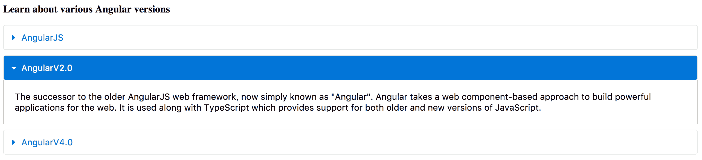

在上面的简单示例中，Accordion 将一次显示一个选项卡内容。组件中有一个选项可以通过启用`multiple`属性来显示多个选项卡内容。Accordion 可以通过强大的功能进行自定义，如自定义标题、选项卡事件、默认选定的选项卡和禁用行为。

自定义的 Accordion 组件定义如下：

```ts
<p-accordion>
 <p-accordionTab>
    <p-header>
      
      AngularJS
    </p-header>
    AngularJS (commonly referred to as "Angular.js" or "AngularJS 1.X") 
    is a JavaScript-based open-source front-end web application 
    framework mainly maintained by Google and by a community
    of individuals and corporations to address many of the challenges  
    encountered in developing single-page applications.
  </p-accordionTab>
  <p-accordionTab header="AngularV2.0">
    <p-header>
      
      AngularV2.0
    </p-header>
    The successor to the older AngularJS web framework, 
    now simply known as "Angular". Angular takes a web 
    component-based approach to build powerful 
    applications for the web. It is used along with TypeScript 
    which provides support for both older and new versions of  
    JavaScript.
  </p-accordionTab>
  <p-accordionTab header="AngularV4.0">
    <p-header>
      
      AngularV4.0
    </p-header>
    Angular version 4.0.0 is a major release 
    following announced adoption of Semantic Versioning,
    and is backwards compatible with 2.x.x for most applications.
 </p-accordionTab>
</p-accordion>

```

在上面的示例中，使用`p-header`标签创建了自定义标题，其中包含 Angular 标志和文本内容。Accordion 将显示带有自定义高级功能的内容，如下图所示：

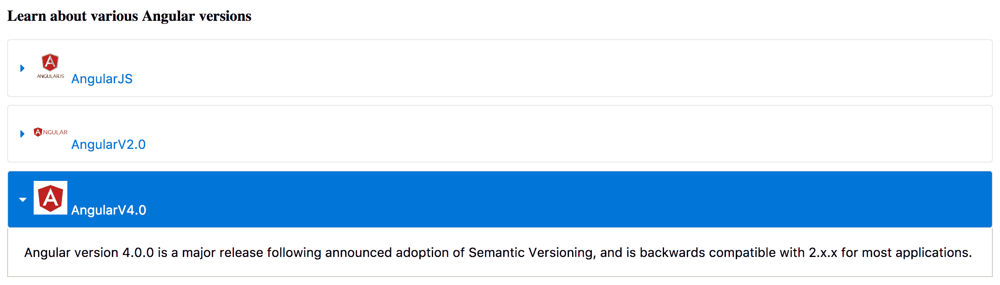

Accordion 组件支持两个名为`onOpen`和`onClose`的事件回调，分别在打开和关闭选项卡时调用。

PrimeNG 4.1 版本引入了`activeIndex`属性，用于定义活动选项卡或要以编程方式更改的索引数组。例如，`[activeIndex]="0,1"`。完整的演示应用程序及说明可在 GitHub 上找到

[`github.com/ova2/angular-development-with-primeng/tree/master/chapter4/accordion`](https://github.com/ova2/angular-development-with-primeng/tree/master/chapter4/accordion).

# 在 TabView 中使用选项卡对内容进行分组

TabView 是一个选项卡面板组件，用于以垂直和水平选项卡的形式对内容进行分组。默认的 TabView 将以水平方向显示选项卡，并且一次只能选择一个选项卡来查看内容。TabView 组件的基本定义如下：

```ts
<p-tabView name="basic">
 <p-tabPanel header="AngularJS">
    AngularJS (commonly referred to as "Angular.js" or
    "AngularJS 1.X") is a JavaScript-based open-source front-end web  
    application framework mainly maintained by Google and by a  
    community of individuals and corporations to address many of 
    the challenges encountered in developing single-page applications.
  </p-tabPanel>
  <p-tabPanel header="AngularV2.0">
    The successor to the older AngularJS web framework, 
    now simply known as "Angular". Angular takes a
    web component-based approach to build powerful 
    applications for the web. It is used along with
    TypeScript which provides support for both older 
    and new versions of JavaScript.
  </p-tabPanel>
  <p-tabPanel header="AngularV4.0">
    Angular version 4.0.0 is a major release following announced  
    adoption of Semantic Versioning, and is backwards compatible 
    with 2.x.x for most applications.
  </p-tabPanel>
</p-tabView>

```

前面的 TabView 将显示为水平面板，如下面的截图所示：

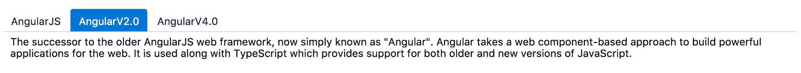

每个选项卡都用`p-tabPanel`表示。可以使用`orientation`属性改变选项卡的方向。它支持四种不同的方向：`top`、`bottom`、`left`和`right`。`top`是默认方向。

该组件还支持各种其他高级功能，如`closable`选项卡（`closable="true"`）、事件（`onChange`在选项卡更改时调用，`onClose`在选项卡关闭时调用）、使用`selection`属性进行默认选择，以及使用`disabled`属性禁用选项卡。

`onChange`事件对象公开了两个在组件类中可访问的属性：

| `onChange` |
| --- |

+   `event.originalEvent`: 原生点击事件

+   `event.index`: 选定选项卡的索引

|

```ts
onTabChange(event:any) {
 this.msgs = [];
 this.msgs.push({severity:'info', summary:'Tab Expanded', 
 detail: 'Target: '+ event.originalEvent.target+'Index: ' + event.index});

```

`onClose`事件对象公开了三个属性，在组件类中可以访问：

| `onClose` |
| --- |

+   `event.originalEvent`: 原生点击事件

+   `event.index`: 关闭选项卡的索引

+   `event.close`: 回调以实际关闭选项卡，仅在启用`controlClose`时可用

|

```ts
onTabClose(event:any) {
 this.msgs = [];
  this.msgs.push({severity:'info', summary:'Tab closed', 
 detail: 'Target: ' + event.originalEvent.target+'Index: ' + event.index});
}

```

TabView 组件的自定义定义如下：

```ts
<p-tabView (onChange)="onTabChange($event)"  
  (onClose)="onTabClose($event)">
 <p-tabPanel header="AngularJS" [closable]="true" [selected]="true">
    AngularJS (commonly referred to as "Angular.js" or "AngularJS 1.X") 
    is a JavaScript-based open-source front-end web application 
    framework mainly maintained by Google and by a community of
    individuals and corporations to address many of the challenges 
    encountered in developing single-page applications.
    </p-tabPanel>
 <p-tabPanel header="AngularV2.0" [closable]="true" 
   leftIcon="fa-bell-o" rightIcon="fa-bookmark-o">
    The successor to the older AngularJS web framework, 
    now simply known as "Angular". Angular takes a
    web component-based approach to build powerful applications 
    for the web. It is used along with TypeScript which provides  
    support for both older and new versions of JavaScript.
  </p-tabPanel>
  <p-tabPanel header="AngularV4.0" [disabled]="true">
    Angular version 4.0.0 is a major release following announced  
    adoption of Semantic Versioning, and is backwards compatible 
    with 2.x.x for most applications.
  </p-tabPanel>
</p-tabView>

```

前面的 TabView 将显示如下截图所示：

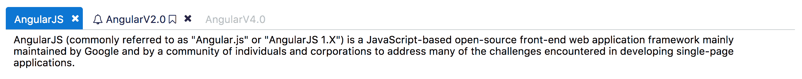

请记住，TabView 元素只应用`orientation`，`activeIndex`，`style`和`styleClass`属性，而所有其他属性都需要为选项卡面板元素定义。

完整的演示应用程序及说明可在 GitHub 上找到

[`github.com/ova2/angular-development-with-primeng/tree/master/chapter4/tabview`](https://github.com/ova2/angular-development-with-primeng/tree/master/chapter4/tabview).

# 摘要

在本章结束时，您将了解如何根据给定的用例处理各种按钮和面板组件。最初，我们涵盖了各种按钮组件。首先，我们从点击按钮变体开始，如 Button，RadioButton 和 SplitButton 组件；之后，我们转向选择值按钮变体，如 ToggleButton 和 SelectButton 组件，然后解释如何使用 Toolbar 组件将多个按钮分组。稍后，我们转向 PrimeNG 套件中提供的各种面板组件。面板组件之旅从有效地安排视图开始，使用 Panels 和 FieldSets，然后介绍如何使用垂直堆叠的 Accordion 组件，以及如何在 TabView 组件内部使用多个选项卡对内容进行分组。

下一章将详细介绍数据迭代组件，如 DataTable，导出 CSV 数据，DataList，OrderList，PickList，Schedule，以及树形分层组件，如 Tree 和 TreeTable 组件。所有这些组件都将以逐步的方式解释其所有可能的特性。
