# 第五章：数据迭代组件

在本章中，我们将涵盖使用 PrimeNG 提供的数据迭代组件来可视化数据的基本和高级功能，其中包括 DataTable、DataList、PickList、OrderList、DataGrid、DataScroller、Tree 和 TreeTable。我们将从提供了诸多功能的 DataTable 组件开始，如过滤、排序、分页、选择、重新排序、列调整大小、切换等。然后我们将专注于其他各种组件，如 DataList，以列表格式呈现数据，并通过 PickList 和 OrderList 等列出的集合提供数据选择。

之后，我们还将看到两个更多的数据变化组件，如 DataGrid，它以网格导向布局排列大型数据集，以及 DataScroller，它根据用户滚动页面来懒加载数据。Tree 和 TreeTable 组件以树形式列出数据，并且它们大多基于相同的数据模型。在本章末尾，我们将讨论一个名为 Schedule 的复杂组件，用于可视化日历数据，并演示其懒加载功能的使用。

在本章中，我们将涵盖以下主题：

+   多功能 DataTable

+   在 DataTable 中选择行

+   在 DataTable 中对数据进行排序、过滤和分页

+   使用模板自定义单元格内容

+   在 DataTable 中调整、重新排序和切换列

+   使用 DataTable 进行单元格编辑

+   使 DataTable 响应式

+   使用列和行分组

+   使用懒加载 DataTable 处理大量数据

+   通过提供行模板进行行展开

+   以 CSV 格式导出数据

+   DataTable 事件和方法

+   使用 DataList 列出数据

+   使用 PickList 列出数据

+   使用 OrderList 列出数据

+   使用 DataGrid 进行网格化数据

+   使用 DataScroller 进行按需数据加载

+   使用 Tree 可视化数据

+   使用 TreeTable 可视化数据

+   使用 Schedule 管理事件

# 多功能 DataTable

DataTable 以表格格式显示数据。表格是数据按行和列排列，或者可能是更复杂的结构。它需要一个作为对象数组的值，通过`value`属性绑定，并且使用`p-column`组件定义列。一个基本的组件示例，用于显示在列表格式中的浏览器详情，将被写成如下形式：

```ts
<p-dataTable [value]="browsers">
 <p-column field="engine" header="Engine"></p-column>
  <p-column field="browser" header="Browser"></p-column>
  <p-column field="platform" header="Platform"></p-column>
  <p-column field="grade" header="Grade"></p-column>
</p-dataTable>

```

`browsers`数组由具有`engine`、`browser`、`platform`和`grade`属性的对象组成。`field`属性将映射模型对象属性，而`header`属性用于显示列的标题。在实时应用程序中，我们使用服务从远程数据源获取数据。在这种情况下，服务被创建为可注入的服务，并且它使用 HTTP 模块来获取数据。浏览器服务将被定义为可观察对象，如下所示：

```ts
@Injectable()
export class BrowserService {

constructor(private http: Http) { }

getBrowsers(): Observable<Browser[]> {
 return this.http.get('/assets/data/browsers.json')
    .map(response => response.json().data as Browser[]);
  }
}

```

组件类必须为`value`属性定义一个`browser`对象（或项目）的数组。项目是从远程服务调用中检索的，如下所示：

```ts
browsers: Browser[];

constructor(private browserService: BrowserService) { }

ngOnInit() {
  this.browserService.getBrowsers().subscribe((browsers: any) 
    => this.browsers =  browsers);
}

```

以下屏幕截图显示了以表格格式呈现的快照结果：

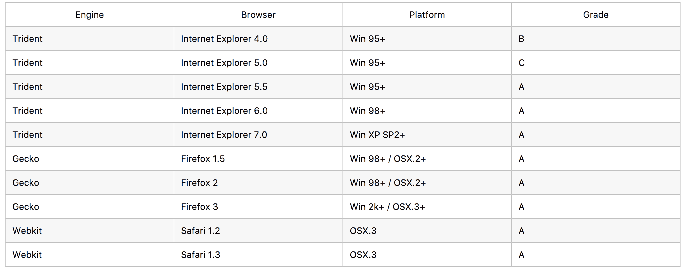

在前面的快照中，我们可以观察到行的替代颜色。这是一个特定于主题的行为。

PrimeNG 4.1 以更灵活的方式处理变更检测功能。

# 变更检测

DataTable 使用基于 setter 的检查或**ngDoCheck**来判断基础数据是否发生变化以更新**用户界面**（**UI**）。这是使用`immutable`属性进行配置的。如果启用（默认），则会使用基于 setter 的检测，因此数据更改（例如添加或删除记录）应始终创建一个新的数组引用，而不是操作现有数组。这个约束是由于 Angular，并且如果引用没有改变，就不会触发 setter。在这种情况下，删除项目时使用 slice 而不是 splice，或者在添加项目时使用扩展运算符而不是`push`方法。

另一方面，将`immutable`属性设置为`false`会移除使用 ngDoCheck 的限制，使用 IterableDiffers 来监听变化，而无需创建数据的新引用。基于 setter 的方法更快；然而，根据您的偏好，两种方法都可以使用。

# 动态列

在前面的用例中，列是使用`p-column`标签以静态表示定义的。还有另一种方法可以通过动态列在数据表中表示列。表列需要被实例化为一个数组。该数组将使用`ngFor`指令进行迭代，如下所示：

```ts
<p-dataTable [value]="basicBrowsers">
 <p-header>
    <div class="algin-left">
      <p-multiSelect [options]="columnOptions" [(ngModel)]="cols">
      </p-multiSelect>
    </div>
  </p-header>
  <p-column *ngFor="let col of cols" [field]="col.field" [header]="col.header"></p-column>
</p-dataTable>

```

`cols`属性描述了组件类中给定的列选项：

```ts
this.cols = [
  {field: 'engine', header: 'Engine'},
  {field: 'browser', header: 'Browser'},
  {field: 'platform', header: 'Platform'},
  {field: 'grade', header: 'Grade'}
];

```

以下屏幕截图显示了动态列在表格格式中的快照结果作为示例：

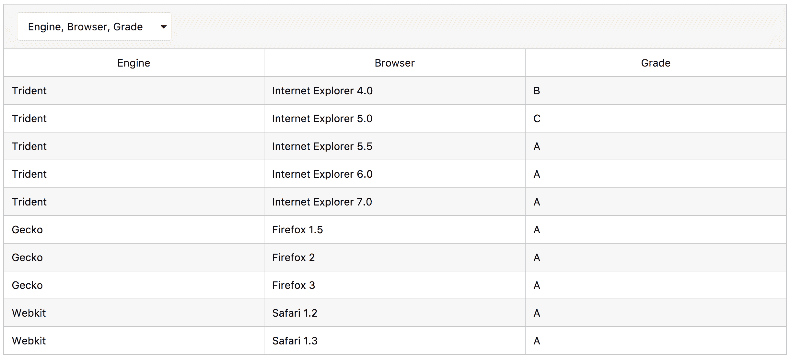

在上面的快照中，列是使用多选下拉菜单动态添加或删除的。为了演示目的，我们从表格中删除了版本列字段。

# 在 DataTable 中选择行

为了在组件上执行 CRUD 操作，需要对表格行进行选择。PrimeNG 支持各种选择，如单选、多选、单选按钮和复选框，并带有不同的事件回调。

# 单选

在单选中，通过单击特定行上的单击事件来选择行。通过将`selectionMode`设置为`single`并将`selection`属性设置为所选行来启用此选择。默认情况下，可以通过 Meta 键（Windows 的 Ctrl 键或 macOS 的 Command 键）取消选择行。通过禁用`metaKeySelection`属性，可以在不按下 Meta 键的情况下取消选择行。

具有单选功能的组件，用于选择特定的浏览器记录，将如下所示编写：

```ts
<p-dataTable [value]="basicBrowsers" selectionMode="single"  
  [(selection)]="selectedBrowser">
  // Content goes here
</p-dataTable>

```

组件类必须定义`selectedBrower`对象来存储所选项目。以下屏幕截图显示了单选结果的快照：

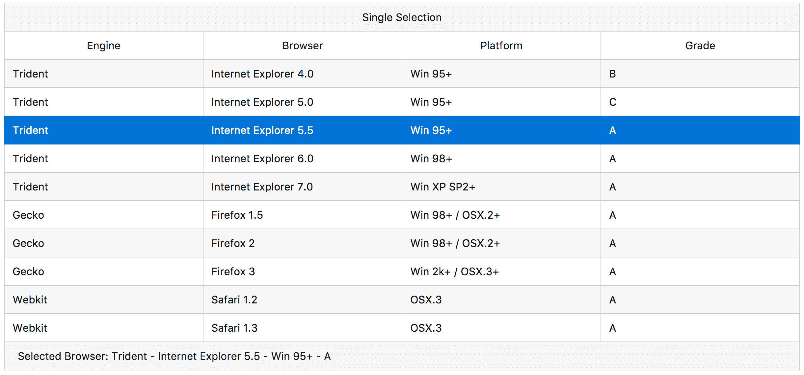

为了通知单选是否起作用，我们在页脚部分显示了所选记录的信息。页脚数据应始终与所选记录同步。

# 多选

在多选中，通过单击特定行上的单击事件来选择行，并且可以使用 Meta 键或*Shift*键选择多行。通过将`selectionMode`设置为`multiple`并将`selection`属性设置为以数组形式保存所选行来启用此选择。默认情况下，可以通过 Meta 键（Windows 的 Ctrl 键或 macOS 的 Command 键）取消选择行。通过禁用`metaKeySelection`属性，可以在不使用 Meta 键的情况下取消选择行。

具有多选功能的组件，用于选择多个浏览器记录，将如下所示编写：

```ts
<p-dataTable [value]="basicBrowsers" selectionMode="multiple" 
  [(selection)]="selectedBrowsers">
  // Content goes here
</p-dataTable>

```

组件类必须定义`selectedBrowers`数组对象来存储所选记录。以下屏幕截图显示了多选结果的快照：

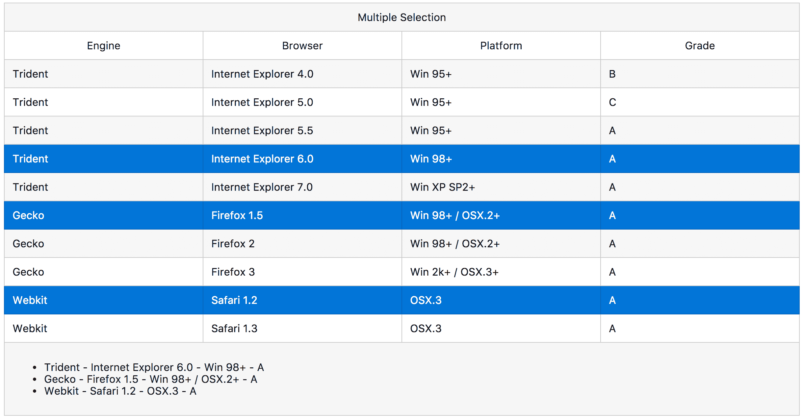

为了通知多选是否起作用，我们在页脚部分显示了选定记录的信息。页脚数据应始终与选定的记录同步。

单选和多选都支持四个事件回调，`onRowClick`、`onRowDblClick`、`onRowSelect`和`onRowUnselect`，它们在事件对象中携带选定的数据信息。有关更多详细信息，请参阅事件部分。

# 单选按钮选择

单选可以通过单选按钮实现，每行都有单选按钮，而不是在特定行上使用单击事件。通过在列级别设置`selectionMode`为`single`（请记住，前面提到的普通选择是在表级别上工作的），并将`selection`属性设置为保存选定行的对象来启用选择。

具有单选按钮选择功能的组件，用于选择特定的浏览器记录，将如下编写：

```ts
<p-dataTable [value]="basicBrowsers" [(selection)]="selectedBrowser">
 <p-header> RadioButton selection (Single Selection)</p-header>
  <p-column [style]="{'width':'38px'}" selectionMode="single">
  </p-column>
  //Content goes here
</p-dataTable>

```

以下屏幕截图显示了单选按钮选择的快照结果：

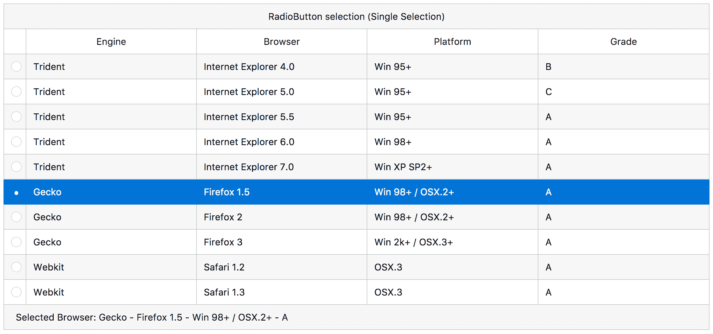

截至目前，单选按钮选择没有未选择的功能（也就是说，一旦选择了另一行，该行就会被取消选择）。

# 复选框选择

多选可以通过复选框实现，每行都有复选框，而不是在特定行上使用单击事件。通过在列级别设置`selectionMode`为`multiple`（请记住，普通选择在表级别提供此功能），并将`selection`属性设置为保存选定行的对象数组来启用选择。

具有复选框选择功能的组件，用于选择多个浏览器记录，将如下编写：

```ts
<p-dataTable [value]="basicBrowsers" [(selection)]="selectedBrowser">
 <p-header> Multiple Selection </p-header>
  <p-column [style]="{'width':'38px'}" selectionMode="multiple">
  </p-column>
  //Content goes here
</p-dataTable>

```

以下屏幕截图显示了复选框选择的快照结果：

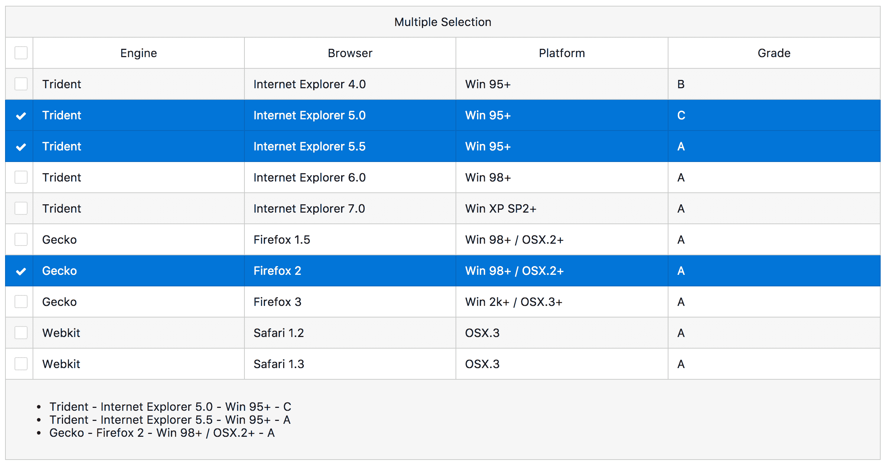

在这种选择中，选定的记录可以通过取消复选框来取消选择。复选框选择支持`onHeaderCheckboxToggle`事件，用于切换标题复选框。有关更多详细信息，请参阅事件部分。

启用选择时，请使用`dataKey`属性避免在比较对象时进行深度检查。如果无法提供`dataKey`，请使用`compareSelectionBy`属性设置为"equals"，它使用引用进行比较，而不是默认的"deepEquals"比较。深度比较不是一个好主意（特别是对于大量数据），因为它会检查所有属性。

例如，可以选择`browserId`属性的值作为`dataKey`，如下所示：

`<p-dataTable dataKey="browserId" selection="true">

...

</p-dataTable>`

# 在 DataTable 中对数据进行排序、过滤和分页

排序、过滤和分页功能对于任何类型的数据迭代组件来说都是非常重要的功能。在处理大型数据集时，这些功能将非常有帮助。

# 排序

通过在每一列上启用`sortable`属性来提供排序功能。默认情况下，组件支持单一排序（`sortMode="single"`）。我们可以通过设置`sortMode="multiple"`来实现多重排序。具有排序功能的 DataTable 组件，以按升序或降序对浏览器记录进行排序，将如下所示：

```ts
<p-dataTable [value]="browsers" (onSort)="onSort($event)">
  <p-column field="engine" header="Engine" [sortable]="true">
  </p-column>
  <p-column field="browser" header="Browser" [sortable]="true">
  </p-column>
  <p-column field="platform" header="Platform" [sortable]="true">
  </p-column>
  <p-column field="grade" header="Grade" [sortable]="true">
  </p-column>
</p-dataTable>

```

以下屏幕截图显示了对有限数量记录进行单一排序的快照结果：

！[](assets/a442c658-24dd-48c5-ae38-b47eab29d6ba.png)

我们需要使用 Meta 键（Windows 为 Ctrl，macOS 为 Command 键）来使用多列排序功能。还支持使用`sortFunction`函数进行自定义排序，而不是在`field`属性上进行常规排序。排序功能还提供了`onSort`事件回调，将在对列进行排序时调用。有关更多信息，请参阅事件详细信息部分。

# 过滤

通过在每一列上启用`filter`属性来提供过滤功能。过滤可以应用于列级别和整个表级别。表级别的过滤也称为全局过滤。要启用全局过滤，需要在`globalFilter`属性中引用输入的本地模板变量。全局过滤输入的`keyup`事件将被监听以进行过滤。

过滤功能支持可选的过滤属性，例如`filterMatchMode`，以提供不同类型的文本搜索。它有五种过滤匹配模式，如`startsWith`、`contains`、`endsWith`、`equals`和`in`，默认匹配模式是`startsWith`，而`filterPlaceholder`属性用于显示辅助占位文本。具有表列过滤功能的 DataTable 组件将如下所示：

```ts
<div class="ui-widget-header align-globalfilter">
 <i class="fa fa-search search-globalfilter"></i>
  <input #gb type="text" pInputText size="50" 
  placeholder="Global Filter">
</div>
<p-dataTable [value]="browsers" [rows]="10" [paginator]="true"   
  [globalFilter]="gb" #datatable (onFilter)="onFilter($event)">
  <p-header>List of Browsers</p-header>
  <p-column field="browser" header="Browser (contains)" [filter]="true" 
    [filterMatchMode]="contains"  filterPlaceholder="Search"></p-column>
  <p-column field="platform" header="Platform (startsWith)" 
    [filter]="true"
  filterPlaceholder="Search"></p-column>
  <p-column field="rating" header="Rating ({{browserFilter||'No 
    Filter'}}" 
    [filter]="true"  filterMatchMode="equals" [style]="
    {'overflow':'visible'}">
    <ng-template pTemplate="filter" let-col>
      <i class="fa fa-close"
  (click)="ratingFilter=null; 
        datatable.filter(null,col.field,col.filterMatchMode)"></i>
      <p-slider [styleClass]="'slider-layout'"
 [(ngModel)]="ratingFilter" [min]="1" [max]="10"
  (onSlideEnd)="datatable.filter
        ($event.value,col.field,col.filterMatchMode)">
      </p-slider>
    </ng-template>
  </p-column>
  <p-column field="engine" header="Engine (Custom)" [filter]="true"
 filterMatchMode="equals" [style]="{'overflow':'visible'}">
    <ng-template pTemplate="filter" let-col>
      <p-dropdown [options]="engines" [style]="{'width':'100%'}"
  (onChange)="datatable.filter($event.value,col.field,
        col.filterMatchMode)"  styleClass="ui-column-filter">
      </p-dropdown>
    </ng-template>
  </p-column>
  <p-column field="grade" header="Grade (Custom)" [filter]="true"
 filterMatchMode="in" [style]="{'overflow':'visible'}">
    <ng-template pTemplate="filter" let-col>
      <p-multiSelect [options]="grades" defaultLabel="All grades"
  (onChange)="datatable.filter($event.value,col.field,
        col.filterMatchMode)"  styleClass="ui-column-filter">
      </p-multiSelect>
    </ng-template>
  </p-column>
</p-dataTable>

```

过滤功能通常应用于普通输入组件，但也可以通过在各种其他输入上提供过滤器来自定义此行为，例如 Spinner、Slider、DropDown 和 MultiSelect 组件。自定义输入过滤器调用带有三个参数的`filter`函数。`filter`函数的签名将如下所示：

```ts
datatable.filter($event.value, col.field, col.filterMatchMode)

```

以下屏幕截图显示了一个具有过滤功能的快照结果，作为示例，记录数量有限：

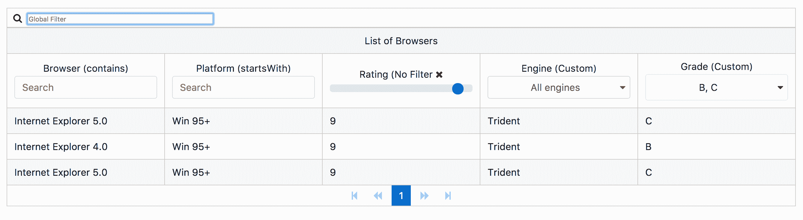

在前面的快照中，我们可以观察到数据是通过评分滑块和多选等级字段进行过滤的。过滤功能还提供了`onFilter`事件回调，该回调将在过滤输入时被调用。有关更多信息，请参阅事件详细信息部分。

# 分页

如果表格支持大型数据集，那么在单个页面上显示所有数据看起来很尴尬，当滚动数百万条记录时，对用户来说将是一场噩梦。DataTable 组件通过启用`paginator`属性和`rows`选项来支持分页功能，仅需显示页面中的记录数量。

除了上述必需的功能，它还支持各种可选功能，例如：

+   `pageLinks`属性显示了一次显示的页面链接数量。

+   `rowsPerPageOptions`属性允许更改在单个页面中显示的行数（作为数组的逗号分隔值）。

+   `totalRecords`属性显示了对于延迟加载功能有用的逻辑记录。

+   `paginatorPosition`属性显示分页器的可能值为`top`、`bottom`和`both`。分页器的默认位置是`bottom`。

用于显示大量浏览器信息的分页示例将如下所示：

```ts
<p-dataTable [value]="browsers" [rows]="10" [paginator]="true" 
  [pageLinks]="3" [rowsPerPageOptions]="[10,15,20]" 
  paginatorPosition="both"(onPage)="onPage($event)">
  <p-column field="engine" header="Engine"></p-column>
  <p-column field="browser" header="Browser"></p-column>
  <p-column field="platform" header="Platform"></p-column>
  <p-column field="grade" header="Grade"></p-column>
</p-dataTable>

```

以下屏幕截图显示了一个具有分页功能的快照结果，作为示例：

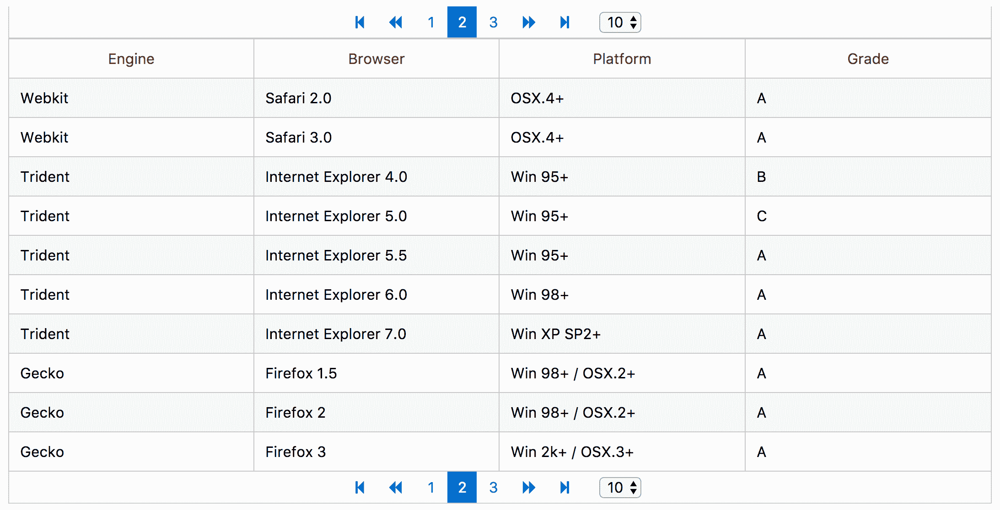

除了内置于 DataTable 中的分页器之外，我们还可以使用外部分页器来使用 Paginator 组件。分页功能还提供了`onPage`事件回调（而外部分页器提供了`onPageChange`回调），该回调将在分页时被调用。有关更多信息，请参阅事件详细信息部分。

# 使用模板自定义单元格内容

默认情况下，每列的`field`属性值用于显示表格内容。可以通过`ng-template`模板标签以各种可能的方式自定义内容，该模板标签可以应用于头部、主体和底部级别。传递给`ng-template`模板的`template`变量用于列定义，行数据由`rowData`属性使用。还可以通过`rowIndex`变量获得可选的行索引。

`ng-template`模板将具有`pTemplate`指令，其中包含了可能的值为`header`、`body`和`footer`的自定义类型。自定义的浏览器内容以各种文本颜色和行数据信息显示，并带有按钮选择，如下所示：

```ts
<p-dataTable [value]="basicBrowsers">
 <p-column field="engine" header="Engine"></p-column>
  <p-column field="browser" header="Browser"></p-column>
  <p-column field="platform" header="Platform"></p-column>
  <p-column field="grade" header="Grade">
    <ng-template let-col let-browser="rowData" pTemplate="body">
      <span [style.color]="'Green'" *ngIf="browser[col.field]=='A'"> 
        {{browser[col.field]}}</span>
      <span [style.color]="'Blue'" *ngIf="browser[col.field]=='B'"> 
        {{browser[col.field]}}</span>
      <span [style.color]="'Red'" *ngIf="browser[col.field]=='C'">
        {{browser[col.field]}}</span>
    </ng-template>
  </p-column>
  <p-column styleClass="col-button">
    <ng-template pTemplate="header">
      <button type="button" pButton icon="fa-refresh"></button>
    </ng-template>
    <ng-template let-browser="rowData" pTemplate="body">
      <button type="button" pButton (click)="selectBrowser(browser)" 
        icon="fa-search"></button>
    </ng-template>
  </p-column>
</p-dataTable>

```

在上面的例子中，我们自定义了表格内容，根据成绩显示不同的颜色，使用 body 模板每行带有按钮选择，使用 header 模板在表头处有一个按钮。以下截图显示了自定义内容显示的快照结果：

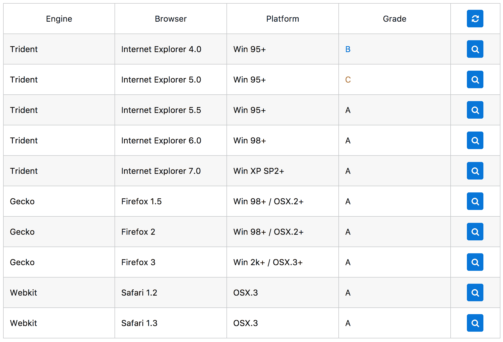

根据上面的快照，`ng-template`模板标签用于不同类型，以提供完全灵活的自定义。

# 在 DataTable 中调整大小、重新排序和切换列

默认情况下，组件的所有列都是静态表示，没有交互。该组件为列提供了调整大小、重新排序和切换功能。

# 调整大小

可以通过将`resizableColumns`属性设置为`true`来使用拖放行为调整列的大小。有两种调整大小模式可用。一种是`fit`模式，另一种是`expand`模式。默认模式是`fit`模式。在此模式下，调整列时，表格的总宽度不会改变；而在`expand`模式下，表格的总宽度将会改变。

使用`expand`模式的调整功能将被编写如下：

```ts
<p-dataTable [value]="basicBrowsers" resizableColumns="true"  
  columnResizeMode="expand">
 <p-column field="engine" header="Engine"></p-column>
  <p-column field="browser" header="Browser"></p-column>
  <p-column field="platform" header="Platform"></p-column>
  <p-column field="grade" header="Grade"></p-column>
</p-dataTable>

```

以下截图显示了使用`expand`调整大小模式的快照结果：

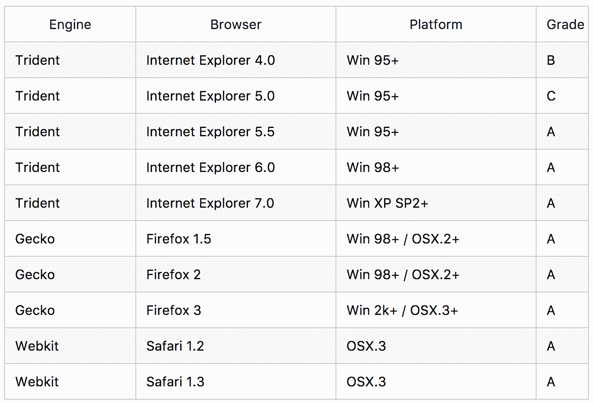

在前面的快照中，我们可以观察到引擎和等级列都根据其内容大小调整大小，以优化屏幕区域。由于`expand`模式，表的总宽度也会改变。当列调整大小时，它还可以提供`onColumnResize`事件回调，该事件在列调整大小时传递调整大小的列标题信息。有关更多信息，请参阅事件详细信息部分。

# 重新排序

通常，表列的顺序将完全按照组件中定义的顺序显示。只需将`reorderableColumns`属性设置为`true`，即可使用拖放功能重新排序列。

重新排序功能将写成如下形式：

```ts
<p-dataTable [value]="browsers" reorderableColumns="true">
 <p-column field="engine" header="Engine"></p-column>
  <p-column field="browser" header="Browser"></p-column>
  <p-column field="platform" header="Platform"></p-column>
  <p-column field="grade" header="Grade"></p-column>
</p-dataTable>

```

以下截图显示了重新排序功能的快照结果示例：

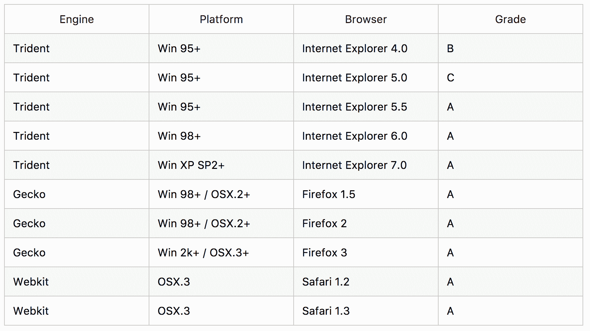

根据前面的快照，平台和浏览器列字段是相互重新排序的（即，初始列顺序为`engine`、`browser`、`platform`和`grade`。重新排序后，列的顺序将变为`engine`、`platform`、`browser`和`grade`）。每当列重新排序时，它还提供`onColReorder`事件回调。有关更多详细信息，请参阅事件部分。

# 切换

大多数情况下，屏幕空间不足以显示所有列。在这种情况下，切换表列将非常有助于节省可用的屏幕空间。由于此功能，只能显示必需或主要列。可以通过在动态列表上定义 MultiSelect 组件来实现此功能，以切换列。请参阅本章开头提到的动态列示例。

# 使用 DataTable 进行单元格内编辑

默认情况下，组件的内容将处于只读模式（即，我们无法编辑内容）。使用单元格编辑功能，UI 将更具交互性。只需在表和列级别上设置`editable`属性，即可启用单元格编辑功能。单击单元格时，将激活编辑模式。在单元格外部单击或按下“Enter”键后，将切换回查看模式并更新值。单元格编辑功能将写成如下形式：

```ts
<p-dataTable [value]="browsers" [editable]="true">
 <p-column field="browser" header="Browser" [editable]="true">
  </p-column>
  <p-column field="platfrom" header="Platform" [editable]="false">
  </p-column>
  <p-column field="engine" header="Engine" [editable]="true">
    <ng-template let-col let-browser="rowData" pTemplate="editor">
      <p-dropdown [(ngModel)]="browser[col.field]" [options]="engines"  
        [autoWidth]="false"  required="true"></p-dropdown>
    </ng-template>
  </p-column>
  <p-column field="grade" header="Grade" [editable]="true">
  </p-column>
</p-dataTable>

```

以下截图显示了在`engine`字段上使用单元格编辑功能的快照结果示例：

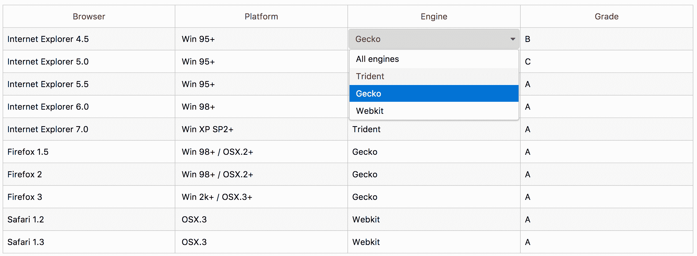

默认情况下，可编辑模式在单击特定单元格时启用输入组件。我们还可以使用其他输入组件，如 DropDown、MultiSelect、Calendar 等，进行自定义输入编辑。在前面的示例中，我们可以使用 Input 和 Dropdown 组件编辑单元格。

# 使 DataTable 响应式

响应功能对于 Web 和移动应用程序都非常有用。如果屏幕尺寸小于某个断点值，则组件列将以响应模式堆叠显示。通过将`responsive`属性设置为`true`来启用此功能。此堆叠行为也可以通过手动实现（不考虑屏幕尺寸）来实现，方法是启用`stacked`属性（即`stacked="true"`）。

Table 组件的响应模式功能将被编写如下：

```ts
<button pButton type="button" (click)="toggle()" 
  [class]="responsive-toggle"
 label="Toggle" icon="fa-list">
</button>
<p-dataTable [value]="browsers" [rows]="5" [paginator]="true" 
  [pageLinks]="3" [responsive]="true" [stacked]="stacked">
  <p-header>Responsive</p-header>
  <p-column field="engine" header="Engine"></p-column>
  <p-column field="browser" header="Browser"></p-column>
  <p-column field="platform" header="Platform"></p-column>
  <p-column field="grade" header="Grade"></p-column>
</p-dataTable>

```

组件类定义了`toggle`方法，用于切换响应行为，如下所示：

```ts
toggle() {
 this.stacked = !this.stacked;
}

```

以下屏幕截图显示了 DataTable 组件具有堆叠列的快照结果：

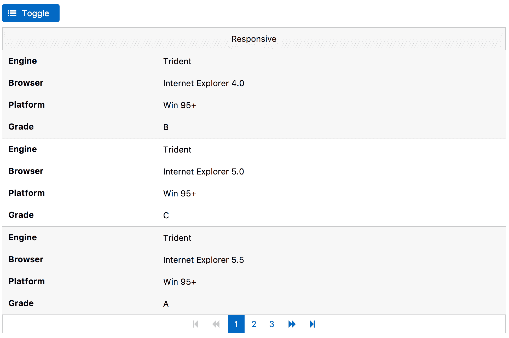

在这种用例中，列通过手动切换按钮以堆叠的方式显示，该按钮放置在表格外部。响应模式或堆叠行为也可以通过减小或最小化屏幕尺寸来实现。

# 使用列和行分组

DataTable 组件在列级和行级都提供了分组功能。

# 列分组

可以使用`p-headerColumnGroup`和`p-footerColumnGroup`标签在表头和表尾区域对列进行分组，这些标签使用`colspan`和`rowspan`属性定义列的数组。表行使用`p-row`标签定义，其中包含列组件。具有列分组的组件将被编写如下：

```ts
<p-dataTable [value]="basicBrowsers">
 <p-headerColumnGroup>
    <p-row>
      <p-column header="Browser" rowspan="3"></p-column>
      <p-column header="Details" colspan="4"></p-column>
    </p-row>
    <p-row>
      <p-column header="Environment" colspan="2"></p-column>
      <p-column header="Performance" colspan="2"></p-column>
    </p-row>
    <p-row>
      <p-column header="Engine"></p-column>
      <p-column header="Platform"></p-column>
      <p-column header="Rating"></p-column>
      <p-column header="Grade"></p-column>
    </p-row>
  </p-headerColumnGroup>

  <p-column field="browser"></p-column>
  <p-column field="engine"></p-column>
  <p-column field="platform"></p-column>
  <p-column field="rating"></p-column>
  <p-column field="grade"></p-column>

  <p-footerColumnGroup>
    <p-row>
      <p-column footer="*Please note that Chrome browser 
        details not included"
 colspan="5"></p-column>
    </p-row>
  </p-footerColumnGroup>
</p-dataTable>

```

以下屏幕截图显示了列分组功能的快照结果：

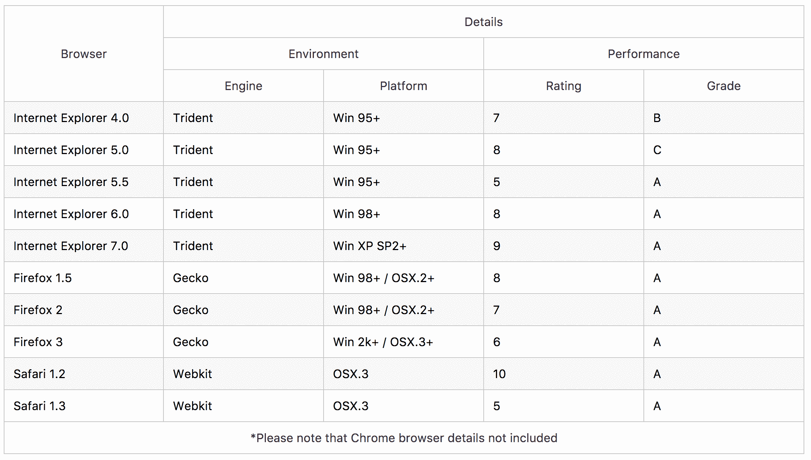

在前面的快照中，我们可以观察到特定于浏览器的信息是通过列分组进行分类的。

# 行分组

默认情况下，表行是单独的，并逐个显示以表示唯一记录。在许多情况下，需要将多个行分组为一行。

# 可展开的行分组

行可以根据特定字段进行分组，以便使用行展开器功能展开和折叠行。通过设置`rowGroupMode="subheader"`、`expandableRowGroups="true"`和`groupField="browser"`来启用此功能。`groupField`设置为特定的分类列。

具有可展开行组选项的行分组功能将被编写如下：

```ts
<p-dataTable [value]="browsers" sortField="browser"  
  rowGroupMode="subheader" groupField="browser"  
  expandableRowGroups="true" [sortableRowGroup]="false">
  <p-header>Toggleable Row Groups with Footers</p-header>
  <ng-template pTemplate="rowgroupheader" let-rowData> 
    {{rowData['browser']}}
 </ng-template>
  <p-column field="engine" header="Engine"></p-column>
  <p-column field="platform" header="Platform"></p-column>
  <p-column field="rating" header="rating">
    <ng-template let-col let-browser="rowData" pTemplate="body">
      <span>{{browser[col.field]}} 'Stars'</span>
    </ng-template>
  </p-column>
  <ng-template pTemplate="rowgroupfooter" let-browser>
    <td colspan="3" style="text-align:right">Chrome browsers are not 
      included</td>
  </ng-template>
</p-dataTable>

```

以下截图显示了可展开的行分组功能的快照结果，作为示例：

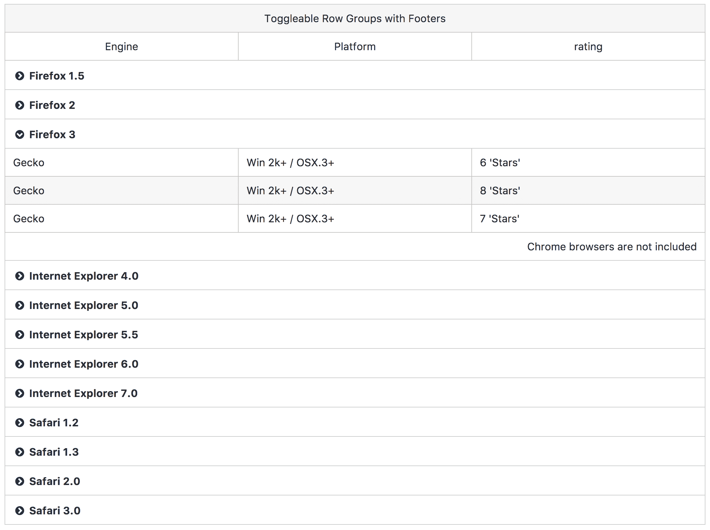

在这种情况下，我们展开了 Firefox 版本 3 组，以查看随时间变化的所有浏览器细节。

# 子标题

所有相关项目可以使用子标题功能分组在一个子组下。这个用例类似于展开的行组，但这些子标题不能被折叠。通过设置`rowGroupMode="subheader"`和`groupField="engine"`来启用此行为。`groupField`属性设置为特定的分类列。

具有子标题选项的行分组功能将被编写如下：

```ts
<p-dataTable [value]="browsers" sortField="engine"  
  rowGroupMode="subheader"
 groupField="engine" [styleClass]="'rowgroup-padding'">
  <p-header>Subheader</p-header>
  <ng-template pTemplate="rowgroupheader" let-rowData>
    {{rowData['engine']}}
 </ng-template>
  <p-column field="browser" header="Browser" sortable="true">
  </p-column>
  <p-column field="platform" header="Platform" sortable="true">
  </p-column>
  <p-column field="grade" header="Grade" sortable="true">
  </p-column>
</p-dataTable>

```

以下截图显示了具有子标题分组功能的表格的快照结果，作为示例：

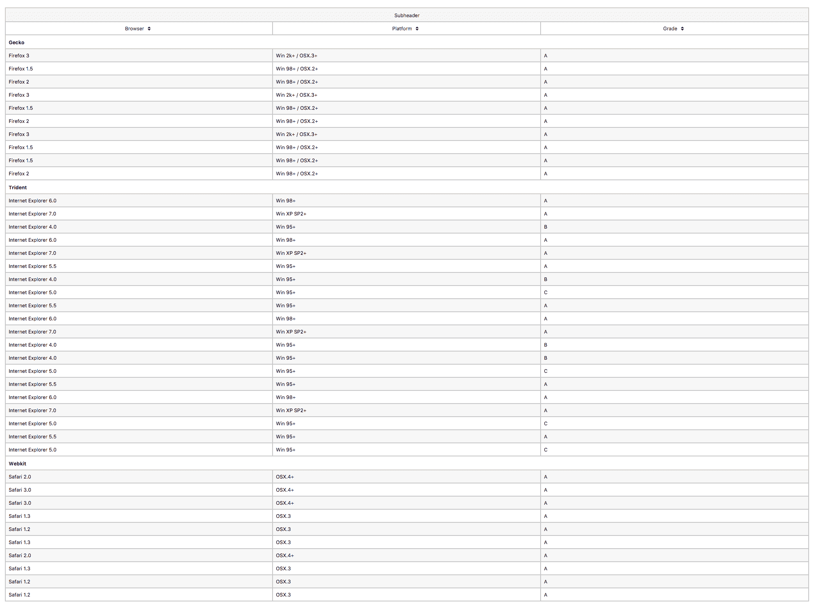子标题分组功能

在前面的用例中，所有浏览器细节都基于唯一的浏览器引擎进行分组，作为子标题。

# RowSpan 组

行可以根据`sortField`属性进行分组。通过将`rowGroupMode`属性值设置为`rowspan`（即`rowGroupMode="rowspan"`）来启用此功能。具有行跨度的行分组示例将被编写如下：

```ts
<p-dataTable [value]="browsers" sortField="engine"   
  rowGroupMode="rowspan"
 [styleClass]="'rowgroup-padding'">
  <p-header>RowSpan</p-header>
  <p-column field="engine" header="Engine" sortable="true"></p-column>
  <p-column field="platform" header="Platform" sortable="true">
  </p-column>
  <p-column field="browser" header="Browser" sortable="true">
  </p-column>
  <p-column field="grade" header="Grade" sortable="true"></p-column>
</p-dataTable>

```

以下截图显示了具有行跨度分组功能的组件的快照结果，作为示例：

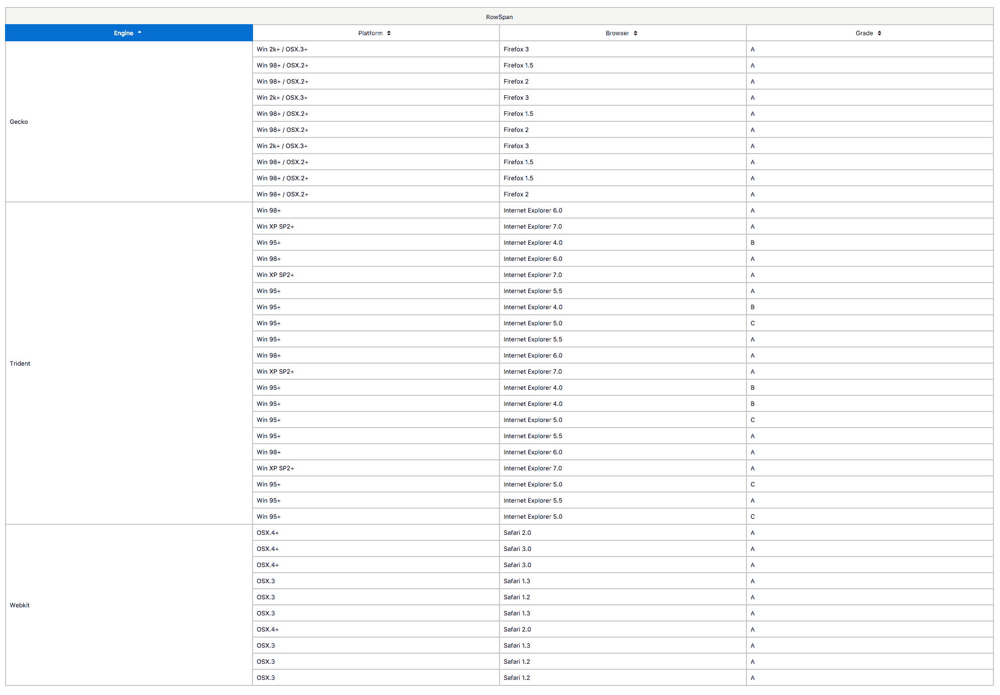行跨度分组功能

在这个版本的行分组中，浏览器的“引擎”字段用于跨越其所有相关项目的行分组。

# 使用延迟加载 DataTable 处理大量数据

延迟加载是处理大型数据集的非常关键的功能。此功能通过分页、排序和过滤操作加载数据块，而不是一次性加载所有数据。通过设置`lazy`模式（`lazy="true"）并使用`onLazyLoad`回调来进行用户操作，事件对象作为参数。事件对象保存了分页、排序和过滤数据。

还需要使用投影查询显示要用于分页配置的逻辑记录数量。这是因为在延迟加载中我们只能检索当前页的数据。没有关于剩余记录的信息可用。因此，需要根据数据源中的实际记录显示分页链接。这可以通过表组件上的`totalRecords`属性实现。

具有延迟加载功能的组件将被编写如下：

```ts
<p-dataTable [value]="browsers" [lazy]="true" [rows]="10" 
  [paginator]="true" [totalRecords]="totalRecords" 
  (onLazyLoad)="loadBrowsersLazy($event)">
  <p-header>List of browsers</p-header>
  <p-column field="engine" header="Engine" [sortable]="true" 
  [filter]="true">
  </p-column>
  <p-column field="browser" header="Browser" [sortable]="true" 
  [filter]="true">  
  </p-column>
  <p-column field="platform" header="Platform" [sortable]="true" 
  [filter]="true">
  </p-column>
 <p-column field="grade" header="Grade" [sortable]="true" 
  [filter]="true">
  </p-column>
</p-dataTable>

```

组件类定义了延迟加载回调，以根据需要检索数据，如下所示：

```ts
loadBrowsersLazy(event: LazyLoadEvent) {
 //event.first = First row offset //event.rows = Number of rows per page //event.sortField = Field name to sort with //event.sortOrder = Sort order as number, 1 for asc and -1 for dec //filters: FilterMetadata object having field as 
  //key and filter value, 
  //filter matchMode as value    this.browserService.getBrowsers().subscribe((browsers: any) =>
    this.browsers = browsers.slice(event.first, 
    (event.first + event.rows)));
}

```

作为延迟加载的演示，我们使用分页操作来检索数据。我们还可以使用排序和过滤功能。以下截图显示了一个快照结果，以便作为示例进行说明：

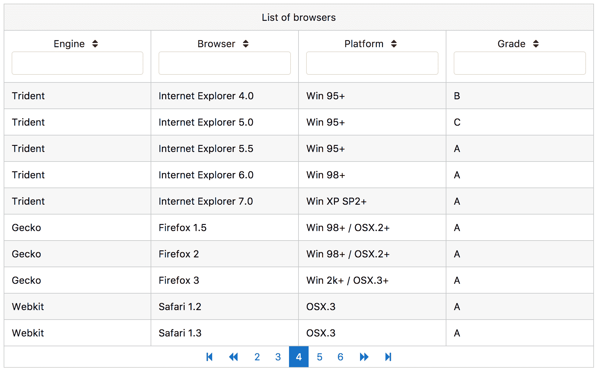

在上面的快照中，我们可以清楚地观察到第 4 页的信息是动态从远程数据源检索的。有关延迟加载事件回调的更多详细信息，请参考事件部分。

总是更喜欢对大型数据集使用延迟加载以提高性能。

# 通过提供行模板进行行展开

在许多情况下，不可能容纳表中的所有数据。表数据的次要或附加信息需要以不同的表示形式填充。行展开功能允许为特定行显示详细内容（即，在请求时显示在单独的块中显示数据）。要使用此功能，请启用`expandableRows`属性，并使用`expander`属性作为单独列添加扩展列，以及常规列以切换行。要声明扩展内容，请使用`pTemplate`指令，并将`rowexpansion`作为值。从`ng-template`中使用本地模板引用变量来访问表数据。

具有行展开功能以显示浏览器的完整详细信息的组件将被编写如下：

```ts
<p-dataTable [value]="basicBrowsers" expandableRows="true"   
  [expandedRows]="expandedRows">
  <p-column expander="true" styleClass="col-icon" header="Toggle">
  </p-column>
  <p-column field="engine" header="Engine"></p-column>
  <p-column field="browser" header="Browser"></p-column>
  <p-column field="platform" header="Platform"></p-column>
  <p-column field="grade" header="Grade"></p-column>
  <ng-template let-browser pTemplate="rowexpansion">
    <div class="ui-grid ui-grid-responsive ui-fluid 
      rowexpansion-layout">
      <div class="ui-grid-row">
        <div class="ui-grid-col-9">
          <div class="ui-grid ui-grid-responsive ui-grid-pad">
            <div class="ui-grid-row">
              <div class="ui-grid-col-2 label">Engine:</div>
              <div class="ui-grid-col-10">{{browser.engine}}</div>
            </div>
            <div class="ui-grid-row">
              <div class="ui-grid-col-2 label">Browser:</div>
              <div class="ui-grid-col-10">{{browser.browser}}</div>
            </div>
            <div class="ui-grid-row">
              <div class="ui-grid-col-2 label">Platform:</div>
              <div class="ui-grid-col-10">{{browser.platform}}</div>
            </div>
            <div class="ui-grid-row">
              <div class="ui-grid-col-2 label">Version:</div>
              <div class="ui-grid-col-10">{{browser.version}}</div>
            </div>
            <div class="ui-grid-row">
              <div class="ui-grid-col-2 label">Rating:</div>
              <div class="ui-grid-col-10">{{browser.rating}}</div>
            </div>
            <div class="ui-grid-row">
              <div class="ui-grid-col-2 label">Grade:</div>
              <div class="ui-grid-col-10">{{browser.grade}}</div>
            </div>
          </div>
        </div>
      </div>
    </div>
  </ng-template>
</p-dataTable>

```

如果需要，可以使用`expandedRows`属性将展开的行存储在组件类内的数组变量中。以下截图显示了具有行展开功能的组件的快照结果作为示例：

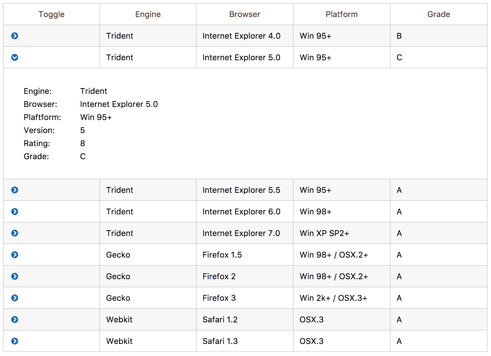

默认情况下，可以一次展开多行。我们可以通过将`rowExpandMode`属性设置为`single`来进行严格的单行展开。

我们也可以为分组表格应用行展开行为：

+   该组件提供了一个`expandableRowGroups`布尔属性，用于创建切换行组的图标。

+   默认情况下，所有行都将被展开。`expandedRowGroups`属性用于保存要默认展开特定行组的行数据实例。

提供了名为`toggleRow`的方法，用于切换表格行与行数据。

# 以 CSV 格式导出数据

数据可以在在线模式下随时以表格格式查看。但是，也需要离线模式下的数据。此外，在许多情况下，我们需要从网站获取大量数据报告。PrimeNG DataTable 可以使用`exportCSV()`API 方法以 CSV 格式导出。放置在表格内部或外部的按钮组件可以触发此方法，以便以 CSV 格式下载数据。具有导出 API 方法调用的组件将被编写如下：

```ts
<p-dataTable #dt [value]="basicBrowsers" exportFilename="browsers"   
  csvSeparator=";">
 <p-header>
    <div class="ui-helper-clearfix">
    <button type="button" pButton icon="fa-file-o" iconPos="left" label="CSV" (click)="dt.exportCSV()" style="float:left"></button>
    </div>
  </p-header>
  <p-column field="engine" header="Engine"></p-column>
  <p-column field="browser" header="Browser"></p-column>
  <p-column field="platform" header="Platform"></p-column>
  <p-column field="grade" header="Grade"></p-column>
</p-dataTable>

```

默认情况下，导出的 CSV 使用逗号（`,`）作为分隔符。但是，可以使用 DataTable 组件上的`csvSeparator`属性更改此行为。

# DataTable 事件和方法

DataTable 组件针对每个功能提供了许多事件回调和方法。以下表格列出了所有表格事件回调的名称、参数详情和描述：

| **名称** | **参数** | **描述** |
| --- | --- | --- |
| `onRowClick` |

+   `event.originalEvent`: 浏览器事件

+   `event.data`: 选定的数据

| 当点击行时调用的回调函数。 |
| --- |
| `onRowSelect` |

+   `event.originalEvent`: 浏览器事件

+   `event.data`: 选定的数据

+   `event.type`: 选择类型，有效值为`row`、`radiobutton`和`checkbox`

| 当选择行时调用的回调函数。 |
| --- |
| `onRowUnselect` |

+   `event.originalEvent`: 浏览器事件

+   `event.data`: 未选择的数据

+   `event.type`: 取消选择类型，有效值为`row`和`checkbox`

| 当使用 Meta 键取消选择行时调用的回调函数。 |
| --- |
| `onRowDblclick` |

+   `event.originalEvent`: 浏览器事件

+   `event.data`: 选定的数据

| 当双击选择行时调用的回调函数。 |
| --- |
| `onHeaderCheckboxToggle` |

+   `event.originalEvent`: 浏览器事件

+   `event.checked`: 头部复选框的状态

| 当头部复选框状态改变时调用的回调函数。 |
| --- |
| `onContextMenuSelect` |

+   `event.originalEvent`: 浏览器事件

+   `event.data`: 选定的数据

| 当右键选择行时调用的回调函数。 |
| --- |
| `onColResize` |

+   `event.element`: 调整列标题大小

+   `event.delta`：宽度变化的像素数

| 当列调整大小时调用的回调函数。 |
| --- |
| `onColReorder` |

+   `event.dragIndex`：拖动列的索引

+   `event.dropIndex`：放置列的索引

+   `event.columns`：重新排序后的列数组

| 当列重新排序时调用的回调函数。 |
| --- |
| `onLazyLoad` |

+   `event.first`：第一行偏移

+   `event.rows`：每页的行数

+   `event.sortField`：用于排序的字段名称

+   `event.sortOrder`：排序顺序作为数字，升序为`1`，降序为`-1`

+   `过滤器`：具有字段作为键和过滤器值、过滤器`matchMode`作为值的`FilterMetadata`对象

| 当在延迟模式下进行分页、排序或过滤时调用的回调函数。 |
| --- |
| `onEditInit` |

+   `event.column`：单元格的列对象

+   `event.data`：行数据

| 当单元格切换到编辑模式时调用的回调函数。 |
| --- |
| `onEdit` |

+   `event.originalEvent`：浏览器事件

+   `event.column`：单元格的列对象

+   `event.data`：行数据

+   `event.index`：行索引

| 当编辑单元格数据时调用的回调函数。 |
| --- |
| `onEditComplete` |

+   `event.column`：单元格的列对象

+   `event.data`：行数据

+   `event.index`：行索引

| 当单元格编辑完成时调用的回调函数（仅支持*Enter*键）。 |
| --- |
| `onEditCancel` |

+   `event.column`：单元格的列对象

+   `event.data`：行数据

+   `event.index`：行索引

| 当使用*Esc*键取消单元格编辑时调用的回调函数。 |
| --- |
| `onPage` |

+   `event.first`：页面中第一条记录的索引

+   `event.rows`：页面上的行数

| 当分页发生时调用的回调函数。 |
| --- |
| `onSort` |

+   `event.field`：已排序列的字段名称

+   `event.order`：排序顺序为 1 或-1

+   `event.multisortmeta`：多重排序模式中的排序元数据。有关此对象结构的多重排序部分，请参见多重排序部分。

| 当列排序时调用的回调函数。 |
| --- |
| `onFilter` | `event.filters`：具有`field`作为属性键和具有值、`matchMode`作为属性值的对象的过滤器对象。 | 当数据被过滤时调用的回调函数。 |
| `onRowExpand` |

+   `event.originalEvent`：浏览器事件

+   `data`：要展开的行数据

| 当行展开时调用的回调函数。 |
| --- |
| `onRowCollapse` |

+   `event.originalEvent`：浏览器事件

+   `data`：要折叠的行数据

| 当行折叠时调用的回调函数。 |
| --- |
| `onRowGroupExpand` |

+   `event.originalEvent`：浏览器事件

+   `group`：分组的值

| 当行组展开时调用的回调函数。 |
| --- |
| `onRowGroupCollapse` |

+   `event.originalEvent`：浏览器事件

+   `group`：组的值

| 折叠行组时调用的回调。 |
| --- |

以下表格列出了常用的表格方法及其名称、参数和描述：

| **名称** | **参数** | **描述** |
| --- | --- | --- |
| `reset` | - | 重置排序、过滤和分页器状态 |
| `exportCSV` | - | 以 CSV 格式导出数据 |
| `toggleRow` | `data` | 切换给定行数据的行扩展 |

PrimeNG 版本 4.0.1 重新引入了`rowTrackBy`选项，用于迭代组件，如 DataTable、DataGrid 和 DataList，以改善 DOM 优化。也就是说，通过将决策委托给`ngForTrackBy`指令来优化每一行的 DOM 插入和更新。在 PrimeNG 中，这将通过`rowTrackBy`属性实现。如果未定义该属性，默认情况下算法会检查对象标识。例如，浏览器行通过 ID 属性标识为

`trackById(index, browser) { return browser.id; }`。

完整的演示应用程序及说明可在 GitHub 上找到

[`github.com/ova2/angular-development-with-primeng/tree/master/chapter5/datatable`](https://github.com/ova2/angular-development-with-primeng/tree/master/chapter5/datatable)。

# 使用 DataList 列出数据

DataList 组件用于以列表布局显示数据。它需要一个项目集合作为其值，并使用`ng-template`显示内容，其中每个项目都可以使用本地模板变量访问。该模板还使用`let-i`表达式表示每个项目的索引。将所有浏览器详细信息显示为列表格式的 DataList 组件的基本示例将如下所示：

```ts
<p-dataList [value]="basicBrowsers">
 <ng-template let-browser pTemplate="item">
    <div class="ui-grid ui-grid-responsive ui-fluid" 
      class="content-layout">
      <div class="ui-grid-row">
        <div class="ui-grid-col-3">
          
        </div>
        <div class="ui-grid-col-9">
          <div class="ui-grid ui-grid-responsive ui-fluid">
            <div class="ui-grid-row">
              <div class="ui-grid-col-2">Engine: </div>
              <div class="ui-grid-col-10">{{browser.engine}}</div>
            </div>
            <div class="ui-grid-row">
              <div class="ui-grid-col-2">Browser: </div>
              <div class="ui-grid-col-10">{{browser.browser}}</div>
            </div>
            <div class="ui-grid-row">
              <div class="ui-grid-col-2">Platform: </div>
              <div class="ui-grid-col-10">{{browser.platform}}</div>
            </div>
            <div class="ui-grid-row">
              <div class="ui-grid-col-2">Version: </div>
              <div class="ui-grid-col-10">{{browser.version}}</div>
            </div>
            <div class="ui-grid-row">
              <div class="ui-grid-col-2">Grade: </div>
              <div class="ui-grid-col-10">{{browser.grade}}</div>
            </div>
          </div>
        </div>
      </div>
    </div>
  </ng-template>
</p-dataList>

```

需要从外部服务中检索浏览器详细信息的列表。在这种情况下，`BrowserService`服务将被注入到组件类中，以检索浏览器信息。我们使用可观察对象使用 HTTP 模块获取数据。列表数据将在页面加载时检索如下：

```ts
basicBrowsers: Browser[];

constructor(private browserService: BrowserService) { }

ngOnInit() {
  this.browserService.getBrowsers().subscribe(
    (browsers:any) => this.basicBrowsers = browsers.slice(0,4));
}

```

出于演示目的，我们将记录数限制为五条。以下屏幕截图显示了 DataList 组件以列表格式的快照结果作为示例：

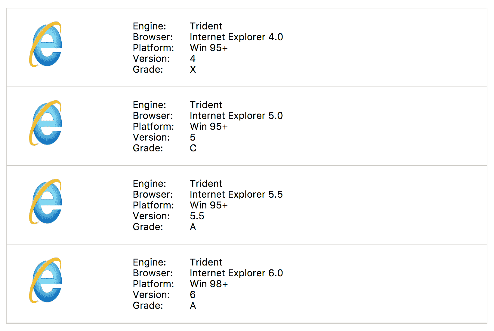

前面的快照只是以表格格式显示数据。在下一节中，您可以找到更多功能，使数据列表成为一个强大的组件。

# Facets 和分页

数据列表组件支持诸如标题和页脚之类的面板，使用 `p-header` 和 `p-footer` 标签。为了改善大型数据集上的用户体验，它支持分页功能。通过将 `paginator` 属性设置为 `true` 来启用此功能，并使用 `rows` 属性设置要显示的行数。除了这些必需的设置之外，分页还有一些可选的自定义设置。在所有这些可选属性中，`paginatorPosition` 用于在 `top`、`bottom` 或 `both` 位置显示分页器；`rowsPerPageOptions` 用于显示一个下拉菜单，其中包含要在一页中显示的可能行数；`emptyMessage` 用于在没有记录存在时显示数据列表主体。分页还支持 `onPage` 事件回调，该事件将在页面导航时被调用。有关更多详细信息，请参阅事件部分。

具有面板和分页功能的数据列表组件以显示浏览器信息如下：

```ts
<p-dataList [value]="advancedBrowsers" [paginator]="true" [rows]="5"
 (onPage)="onPagination($event)" [rowsPerPageOptions]="[5,10,15]"
 [paginatorPosition]="both" [emptyMessage]="'No records found'">
  <p-header>
    List of Browsers
  </p-header>
    .... // Content
 <p-footer>
    Note: Grades are 3 types.A,B and C.
 </p-footer> </p-dataList>

```

以下屏幕截图显示了带有分页的快照结果：

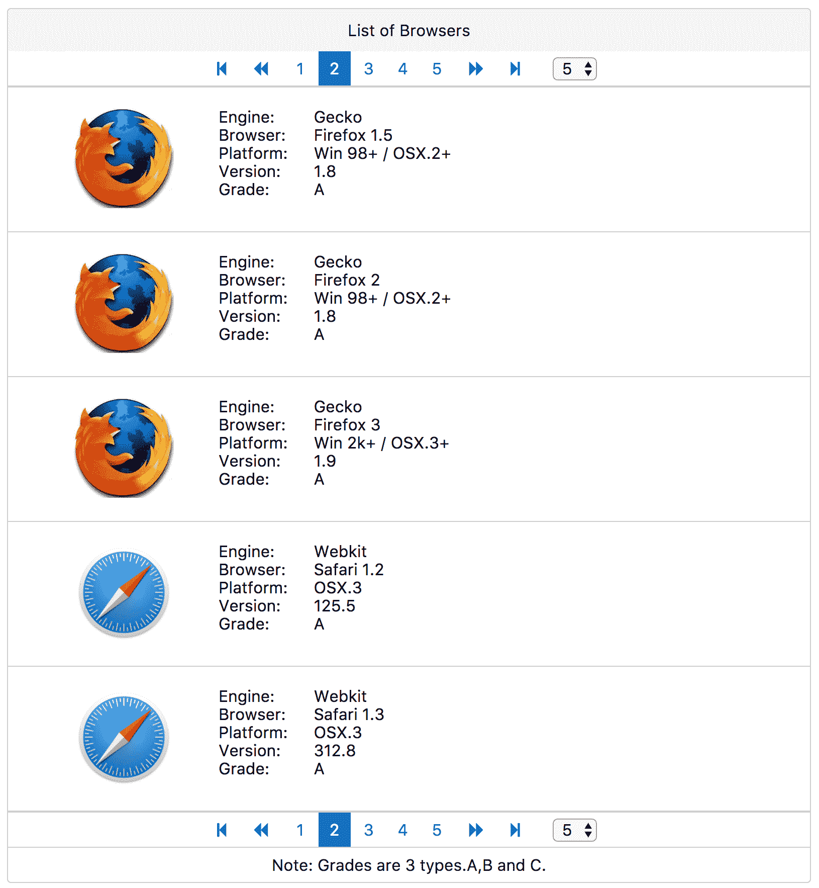

数据列表组件提供了可自定义的所有分页控件选项。

# 懒加载

懒加载是处理大型数据集的非常有用的功能。它不会一次加载所有数据，而是根据用户需求逐步加载。DataList 支持分页交互上的懒加载。通过启用 `lazy` 属性（即 `lazy="true"`）并调用 `onLazyLoad` 回调来实现此功能，从远程数据源检索数据。有关签名和更多详细信息，请参阅事件部分。

懒加载事件对象提供了页面中的第一条记录和当前页面中的行数，以获取下一组数据。此外，您应该通过投影查询提供总记录以进行分页配置。即使在页面加载时没有那么多记录可用（即，仅在懒惰模式下存在当前页面记录），这对基于可用记录总数显示分页链接非常有用。

让我们以此处显示的基本原型为例，来介绍数据列表组件的懒加载功能：

```ts
<p-dataList [value]="lazyloadingBrowsers" [paginator]="true" [rows]="5"   
  [lazy]="true"
 (onLazyLoad)="loadData($event)" [totalRecords]="totalRecords">
  ... // Content
</p-dataList>

```

组件类必须定义懒加载事件回调，以根据用户请求（在本例中，将是分页）检索记录，如下所示：

```ts
loadData(event:any) {
 let start = event.first;//event.first = First row offset
  let end = start + event.rows;//event.rows = Number of rows per page
  this.browserService.getBrowsers().subscribe((browsers: any) =>
 this.lazyloadingBrowsers = browsers.slice(start,end));
}

```

在上述代码片段中，您可以观察到事件的`first`和`rows`属性对于检索下一批记录非常有帮助。根据`rows`属性，它尝试在每个实例上获取下一个`rows`数量的记录。

# 事件

该组件提供两个事件回调，一个用于分页，另一个用于懒加载。两个事件都提供两个参数，以获取页面上第一条记录和行数。懒加载事件在启用懒加载模式的情况下，通过分页、过滤和排序功能来调用。

| **名称** | **参数** | **描述** |
| --- | --- | --- |
| `onLazyLoad` |

+   `event.first`：第一行偏移

+   `event.rows`：每页的行数

| 当分页、排序或过滤以懒加载模式发生时调用的回调函数。 |
| --- |
| `onPage` |

+   `event.first`：页面中第一条记录的索引

+   `event.rows`：页面上的行数

| 当分页发生时调用的回调函数。 |
| --- |

它还提供许多其他功能，例如用于页眉和页脚显示的 facets（`p-header`和`p-footer`），用于在多个页面之间导航的分页，以及用于根据需要检索数据的懒加载功能。

完整的演示应用程序及说明可在 GitHub 上找到

[`github.com/ova2/angular-development-with-primeng/tree/master/chapter5/datalist`](https://github.com/ova2/angular-development-with-primeng/tree/master/chapter5/datalist)。

# 使用 PickList 列出数据

PickList 组件用于在两个不同的列表之间移动项目。您还可以在每个列表内重新排序项目。这提供了所选项目的整体状态。项目可以使用默认按钮控件或拖放行为进行移动/重新排序。PickList 需要两个数组，一个用于源列表，另一个用于目标列表。使用`ng-template`模板标签来显示项目的内容，其中数组中的每个项目都可以使用本地`ng-template`变量访问。

使用国家信息的 PickList 组件的基本示例将如下所示：

```ts
<p-pickList [source]="sourceCountries" [target]="targetCountries"
 [sourceStyle]="{'height':'350px'}" [targetStyle]="{'height':'350px'}">
  <ng-template let-country pTemplate="item">
    <div class="ui-helper-clearfix">
      
      <span>{{country.flag}} - {{country.name}}({{country.dial_code}})
 </span>
    </div>
 </ng-template>
</p-pickList>

```

在组件类中，让我们定义一个用于可用数据的源列表，以及一个用于表示尚未进行选择的空列表。需要注入国家服务以从外部资源访问国家信息：

```ts
sourceCountries: Country[];
targetCountries: Country[];

constructor(private countryService: CountryService) { }

ngOnInit() {
 this.countryService.getCountries().subscribe(
    (countries: Country[]) => 
  {
    this.sourceCountries = countries;
  });
  this.targetCountries = [];
}

```

默认情况下，源和目标面板都具有默认的`width`和`height`属性。但是可以使用`sourceStyle`和`targetStyle`属性来自定义此默认行为。以下屏幕截图显示了初始 PickList 的快照结果。

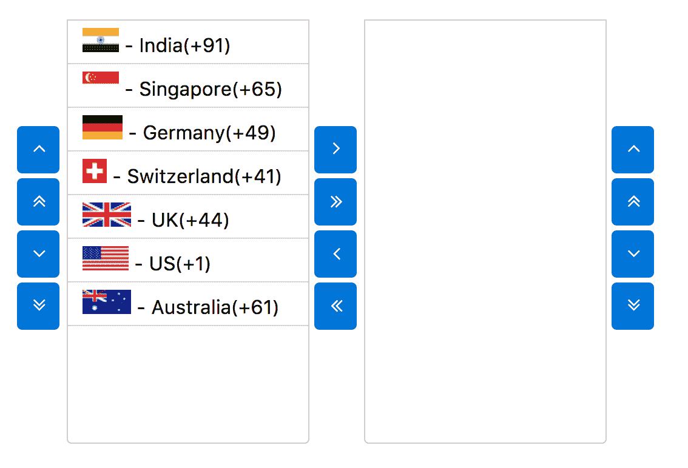

PickList 组件提供了六个事件回调，用于在两个列表之间移动项目和对源和目标区域中的项目进行排序。在这六个回调中，有四个用于移动项目，`onMoveToTarget`、`onMoveToSource`、`onMoveAllToSource`和`onMoveAllToSource`，而排序项目则由`onSourceReorder`和`onTargetReorder`执行。

该组件可以通过不同的方式进行自定义，如下所述：

+   可以使用`sourceHeader`和`targetHeader`作为属性来自定义标题。

+   网页将使用`responsive`属性（`responsive="true"`）变得响应式，根据屏幕大小调整按钮控件。

+   默认情况下，通过禁用`metaKeySelection`属性（`metaKeySelection="false"`）来防止默认的多重选择（借助 Meta 键）。

+   按钮控件的可见性通过`showSourceControls`和`showTargetControls`属性进行控制。例如，`showSourceControls="false"`和`showTargetControls="false"`。

PrimeNG 4.1 支持使用`filterBy`属性对项目字段进行过滤，这是一个新的功能。可以通过在`filterBy`属性中放置逗号分隔的字段来过滤多个字段：

```ts
<p-pickList [source]="sourceCountries"  [target]="targetCountries"   filterBy="name, code">
  ...
</p-pickList>

```

新的 4.1 版本还支持启用`dragdrop`属性来实现拖放功能（在同一列表内或跨列表）。它还提供了`dragdropScope`属性，用于保存唯一键以避免与其他拖放事件发生冲突。拖放功能示例如下：

```ts
<p-pickList [source]="sourceCountries" [target]="targetCountries"   
  sourceHeader="Available" targetHeader="Selected" [dragdrop]="true" 
  dragdropScope="name">
   ...
</p-pickList>

```

完整的演示应用程序及说明可在 GitHub 上找到。

[`github.com/ova2/angular-development-with-primeng/tree/master/chapter5/picklist`](https://github.com/ova2/angular-development-with-primeng/tree/master/chapter5/picklist)。

# 使用 OrderList 列出数据。

OrderList 组件用于按不同方向（上下）对项目集合进行排序。该组件需要一个数组类型变量来存储其值，并使用`ng-template`来显示项目数组的内容。每个项目将在`ng-template`模板中使用本地`ng-template`变量进行访问。当项目位置发生变化时，后端数组也会更新以存储最新的项目顺序。

使用国家信息的 OrderList 组件的基本示例将如下编写：

```ts
<p-orderList [value]="countries" header="Favourite countries" >
 <ng-template let-country pTemplate="item">
    <div class="ui-helper-clearfix">
      
      <span class="content-format">
        {{country.flag}} {{country.name}}({{country.dial_code}})
 </span>
    </div>
  </ng-template>
</p-orderList>

```

在组件类中，让我们定义一个国家列表来显示项目的集合。如下所示，需要注入国家服务以从外部资源或数据源访问国家信息：

```ts
countries: Country[];

constructor(private countryService: CountryService) { }

ngOnInit() {
 this.countryService.getCountries().subscribe((countries: Country[]) =>
  {
    this.countries = countries;
  });
}

```

默认情况下，列表面板具有默认的`width`和`height`属性。但是可以使用`listStyle`属性进行自定义。以下截图显示了初始顺序列表的快照结果作为示例：

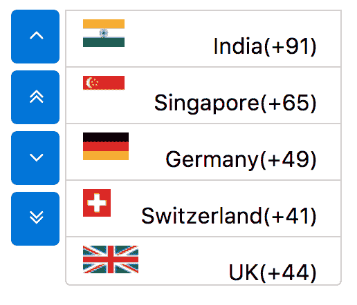

OrderList 组件提供了三种不同的事件回调，如下所示：

| **名称** | **参数** | **描述** |
| --- | --- | --- |
| `onReorder` | `event`：浏览器事件 | 重新排序列表时要调用的回调函数。 |
| `onSelectionChange` |

+   `originalEvent`：浏览器事件

+   `value`：当前选择

| 选择更改时要调用的回调函数。 |
| --- |
| `onFilterEvent` |

+   `originalEvent`：浏览器事件

+   `value`：当前过滤值

| 发生过滤时要调用的回调函数。 |
| --- |

可以按以下方式以不同方式自定义组件的默认行为：

+   可以使用`header`属性自定义标题

+   `responsive`属性（`responsive="true"`）用于应用响应式行为，根据屏幕大小调整按钮控件

+   通过禁用`metaKeySelection`属性（`metaKeySelection="false"`）来防止默认的多重选择（借助于 Meta 键）。

以下截图显示了具有前面提到的自定义的国家列表的快照结果：

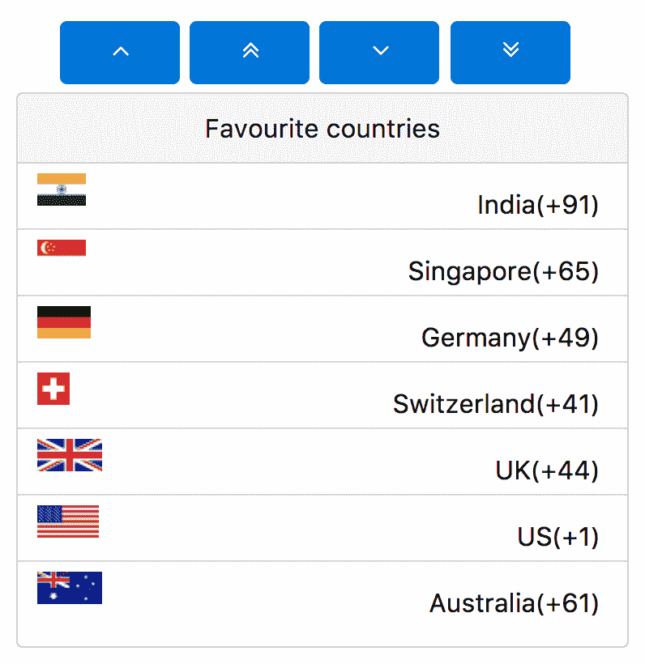

在前面的快照中，您可以观察到由于其`responsive`特性（`responsive="true"`），控件出现在顶部。我们还可以观察到面板宽度已根据视口大小进行了调整（使用`listStyle`属性）。

PrimeNG 4.1 版本支持过滤和拖放功能作为新的添加。过滤功能可以使用`filterBy`属性应用于单个字段和多个字段，类似于 DataTable 组件。例如，对国家数据进行多重过滤的功能如下：

```ts
<p-orderList [value]="countries" filterBy="name, code">
 ...
</p-orderList>

```

新的 4.1 版本还支持通过启用`dragdrop`属性重新排序项目的拖放功能。它还提供了`dragdropScope`属性，用于保存唯一键以避免与其他拖放事件发生冲突。拖放功能示例如下：

```ts
<p-orderList [value]="countries" [dragdrop]="true" dragdropScope="name">
  ...
</p-orderList>

```

完整的演示应用程序及说明可在 GitHub 上找到

[`github.com/ova2/angular-development-with-primeng/tree/master/chapter5/orderlist`](https://github.com/ova2/angular-development-with-primeng/tree/master/chapter5/orderlist)。

# 以 DataGrid 为例的网格化数据

DataGrid 以网格导向布局显示数据。数据以多个单元格以规律的方式排列的布局形式表示。它需要一个作为`value`属性的数组的项目集合和`ng-template`模板标签来显示其内容，其中每个项目都可以使用本地模板变量进行访问。模板内容需要包装在一个`div`元素中，以便使用任何网格 CSS 样式以网格布局格式化数据。

数据网格组件的基本示例与浏览器信息将如下所示：

```ts
<p-dataGrid [value]="basicBrowsers">
 <ng-template let-browser pTemplate="item">
    <div style="padding:3px" class="ui-g-12 ui-md-3">
      <p-panel [header]="browser.browser" [style]="{'text-
        align':'center'}">
         
        <div class="car-detail">{{browser.engine}} - 
          {{browser.version}}
 </div>
        <hr class="ui-widget-content" style="border-top:0">
        <i class="fa fa-search" (click)="selectBrowser(browser)"
 style="cursor:pointer"></i>
      </p-panel>
    </div>
  </ng-template>
</p-dataGrid>

```

组件类必须定义一个浏览器对象数组，这些对象是使用服务从远程数据源检索的。页面加载时访问的服务将如下所示：

```ts
basicBrowsers: Browser[];

constructor(private browserService: BrowserService) { }

ngOnInit() {
 this.browserService.getBrowsers().subscribe((browsers: any) =>
 this.basicBrowsers = browsers.slice(0, 12));
}

```

以下屏幕截图显示了数据网格组件在网格布局中的快照结果：

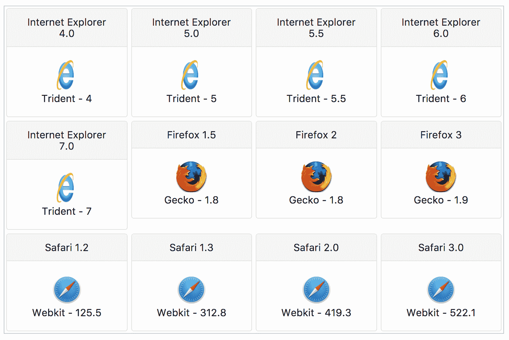

在上面的快照中，任何两个单元格之间的填充将保持一致。这可以通过该组件的皮肤类进行自定义。

# 基本用法之外 - 高级功能

在上面的快照中，浏览器数据以网格布局显示。但是，您可以观察到没有标题或页脚来总结上下文。标题和页脚方面可使用 `p-header` 和 `p-footer` 标签。

为了提高大型数据集的可用性，DataGrid 提供了分页功能，通过页面导航显示下一块数据。通过启用`paginator`属性并设置`rows`属性来提供此功能。与任何其他数据组件一样，分页功能如`pageLinks`、`rowsPerPageOptions`、`paginatorPosition`和`totalRecords`都可用于自定义。

为了处理大量数据，DataGrid 支持懒加载功能，以便以块的方式访问大量数据。通过启用`lazy`属性来提供此功能。同时，应该在分页操作中使用`onLazyLoad`事件调用懒加载方法。

以下是定义了懒加载事件回调的组件类，其中`event`对象作为参数显示在这里：

```ts
loadData(event: any) {
 let start = event.first; //event.first = First row offset
  let end = start + event.rows; //event.rows = Number of rows per page
  this.browserService.getBrowsers().subscribe((browsers: any) =>
 this.lazyloadingBrowsers = browsers.slice(start,end));
}

```

以下屏幕截图显示了懒加载功能的快照结果示例：

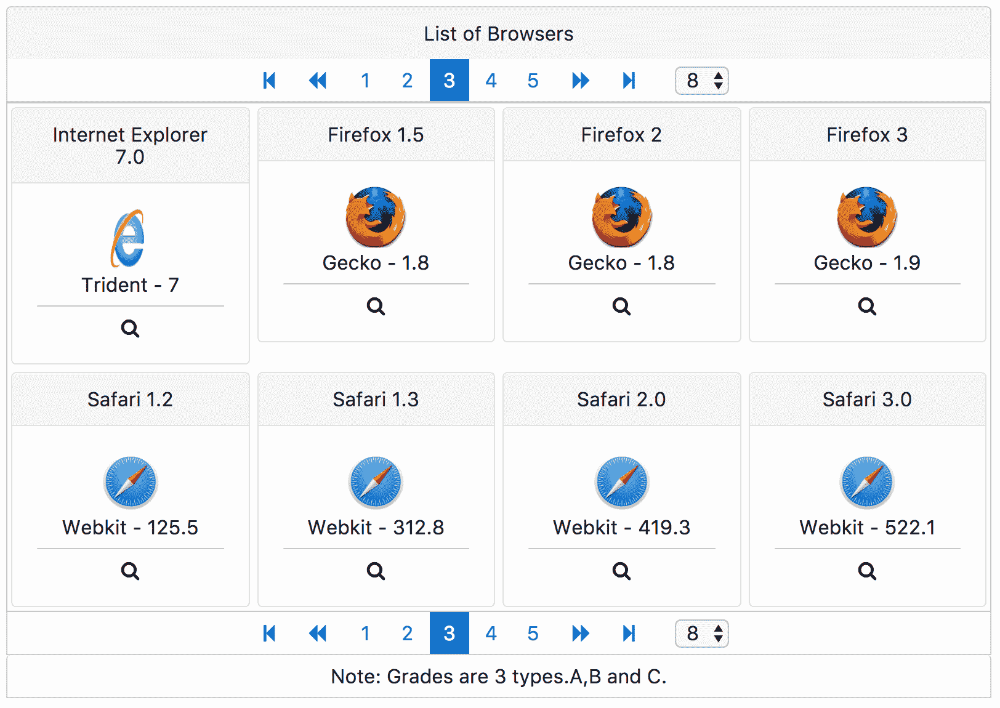

在上述快照中，它显示了外观（头部和页脚）、自定义分页选项，并在用户需求时延迟加载数据。关于浏览器的附加信息将通过单击每个单元格中可用的搜索图标在对话框中显示。默认情况下，DataGrid 组件在各种屏幕尺寸或设备上都是响应式的布局显示。

完整的演示应用程序及说明可在 GitHub 上找到

[`github.com/ova2/angular-development-with-primeng/tree/master/chapter5/datagrid`](https://github.com/ova2/angular-development-with-primeng/tree/master/chapter5/datagrid)。

# 使用 DataScroller 进行按需数据加载

DataScroller 使用滚动功能按需显示数据。它需要一个项目集合作为其值，要加载的行数，以及`ng-template`模板标签来显示内容，其中每个项目都可以使用隐式变量访问。使用各种浏览器信息的 DataScroller 组件的基本示例将如下所示（请记住，这里使用了流体网格来格式化浏览器记录的内容）：

```ts
<p-dataScroller [value]="basicBrowsers" [rows]="5">
 <ng-template let-browser pTemplate="item">
    <div class="ui-grid ui-grid-responsive ui-fluid" 
      class="content-layout">
      <div class="ui-grid-row">
        <div class="ui-grid-col-3">
          
        </div>
        <div class="ui-grid-col-9">
          <div class="ui-grid ui-grid-responsive ui-fluid">
            <div class="ui-grid-row">
              <div class="ui-grid-col-2">Engine: </div>
              <div class="ui-grid-col-10">{{browser.engine}}</div>
            </div>
            // Other content goes here
          </div>
        </div>
      </div>
    </div>
  </ng-template>
</p-dataScroller>

```

与任何其他数据组件一样，数据列表的组件类应该定义一个浏览器对象的数组。数据是通过对数据源进行远程调用来填充的。以下屏幕截图显示了一个示例的快照结果：

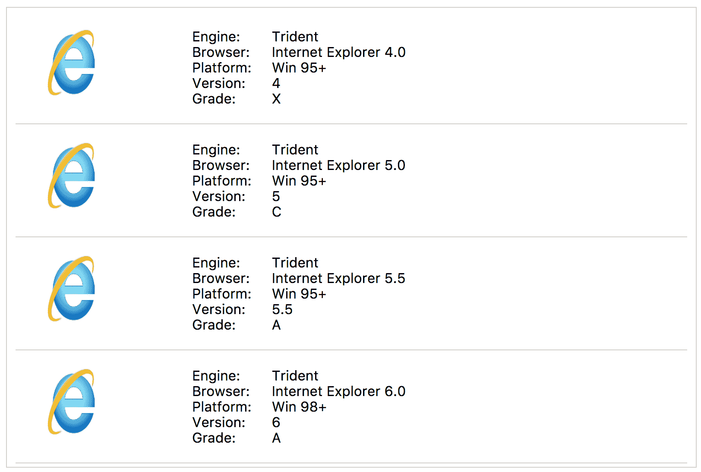

如前面的快照所示，数据根据窗口滚动作为目标按需显示。为了使 DataScroller 元素更易读，它支持使用`p-header`和`p-footer`标签的头部和页脚等方面。默认情况下，DataScroller 组件侦听窗口的滚动事件。还有另一种选项，可以使用内联模式将组件的容器定义为事件目标。为此，我们应该将`inline`属性启用为`true`（即`inline="true"`）。

除了基于滚动的数据加载外，还可以使用显式按钮操作加载更多数据。组件应该定义一个引用 Button 组件的`loader`属性。带有加载器按钮的 DataScroller 组件将如下所示：

```ts
<p-dataScroller [value]="advancedBrowsers" [rows]="5" [loader]="loadButton">
  // Content goes here </p-dataScroller>
<p-dataScroller [value]="advancedBrowsers" [rows]="5" [loader]="loadButton">

```

以下屏幕截图显示了一个带有加载器显示的快照结果：

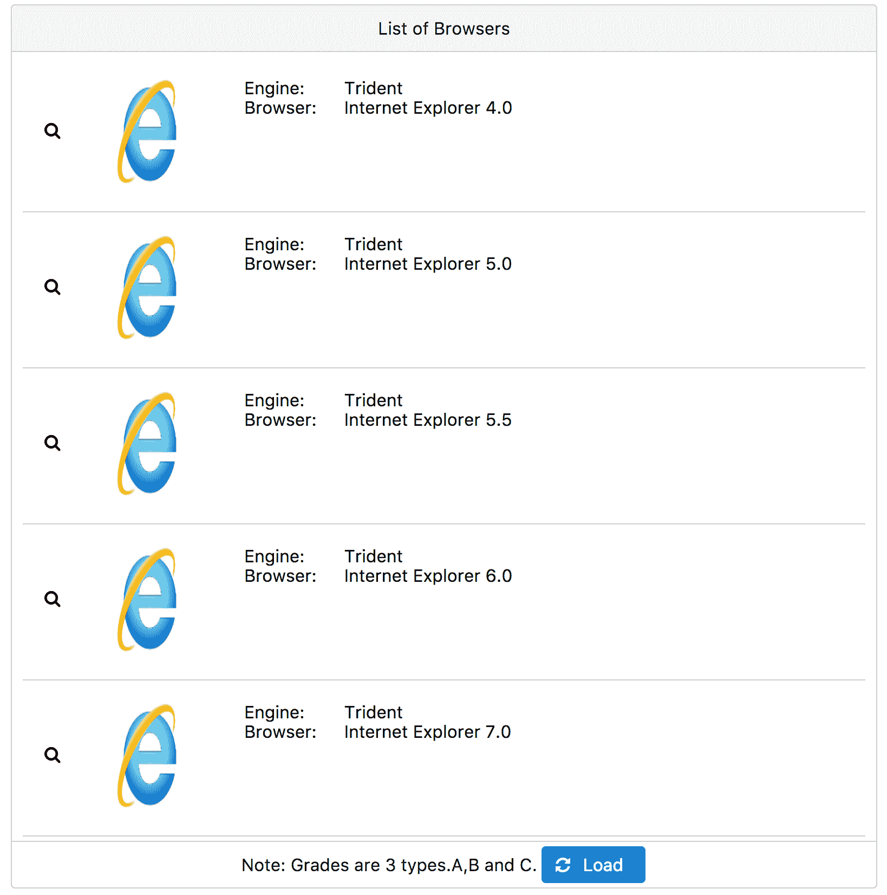

在上面的快照中，一旦用户在左侧点击搜索按钮，就会以对话框格式显示附加的浏览器信息。这可以展示如何在 DataScroller 组件中选择特定记录的能力。

# 惰性加载

为了处理大型数据集，该组件还支持惰性加载功能。它不是加载整个数据，而是在每次滚动操作时加载数据块。需要`lazy`和`onLazyLoad`属性来启用此行为。DataScroller 的惰性加载示例将如下所示：

```ts
<p-dataScroller [value]="lazyloadingBrowsers" [rows]="5"
 [lazy]="true" (onLazyLoad)="loadData($event)">
  //Content goes here </p-dataScroller>

```

组件类定义了惰性加载事件回调，以按块检索数据，如下所示：

```ts
loadData(event: any) {
 let start = event.first; //event.first = First row offset
  let end = start + event.rows; //event.rows = Number of rows per page
  this.browserService.getBrowsers().subscribe((browsers: any) =>
 this.lazyloadingBrowsers = browsers.slice(start, end));
}

```

在上面的代码片段中，您可以观察到`event`对象的`first`和`rows`属性对于检索下一批记录非常有用。根据`rows`属性，它尝试在每次获取时获取下一个`rows`数量的记录。

API 方法`reset`用于重置 DataScroller 组件的内容或数据。也就是说，组件将重置为其默认状态。

完整的演示应用程序及说明可在 GitHub 上找到

[`github.com/ova2/angular-development-with-primeng/tree/master/chapter5/datascroller`](https://github.com/ova2/angular-development-with-primeng/tree/master/chapter5/datascroller)。

# 使用树形结构可视化数据

Tree 组件用于以图形格式显示数据的分层表示。它提供了`TreeNode`对象数组作为其值。`TreeNode` API 提供了许多属性来创建树节点对象。树结构基本上有三个主要组件，如下所示：

+   树元素称为**节点**

+   连接元素的线称为分支

+   没有子节点的节点称为叶节点或叶子节点

具有节点的 Tree 组件的基本示例将如下所示（节点将表示旅游景点）：

```ts
<p-tree [value]="basicTree"></p-tree>

```

Tree 组件的数据应以嵌套的父子层次结构提供。每个树节点都使用一组属性创建，例如`label`、`data`、`expandIcon`、`collapsedIcon`、`children`等等。`TreeNode`属性的完整列表如下所示：

| **名称** | **类型** | **默认** | **描述** |
| --- | --- | --- | --- |
| `label` | `string` | `null` | 节点的标签。 |
| `data` | `any` | `null` | 节点表示的数据。 |
| `icon` | `string` | `null` | 节点旁边显示的图标。 |
| `expandedIcon` | `string` | `null` | 展开状态下使用的图标。 |
| `collapsedIcon` | `string` | `null` | 折叠状态下使用的图标。 |
| `children` | `TreeNode[]` | `null` | 作为子节点的树节点数组。 |
| `leaf` | `boolean` | `null` | 指定节点是否有子节点。用于延迟加载。 |
| `style` | `string` | `null` | 节点的内联样式。 |
| `styleClass` | `string` | `null` | 节点的样式类。 |
| `expanded` | `boolean` | `null` | 节点是否处于展开或折叠状态。 |
| `type` | `string` | `null` | 与`ng-template`类型匹配的节点类型。 |
| `parent` | `TreeNode` | `null` | 节点的父节点。 |
| `styleClass` | `string` | `null` | 节点元素的样式类名称。 |
| `draggable` | `boolean` | `null` | 是否禁用特定节点的拖动，即使启用了`draggableNodes`。 |
| `droppable` | `boolean` | `null` | 是否禁用特定节点的放置，即使启用了`droppableNodes`。 |
| `selectable` | `boolean` | `null` | 用于禁用特定节点的选择。 |

`TreeNode`的所有属性都是可选的。

旅游景点示例的树节点结构如下：

```ts
"data":
[
  {
    "label": "Asia",
    "data": "Documents Folder",
    "expandedIcon": "fa-folder-open",
    "collapsedIcon": "fa-folder",
    "children": [{
      "label": "India",
      "data": "Work Folder",
      "expandedIcon": "fa-folder-open",
      "collapsedIcon": "fa-folder",
      "children": [{
 "label": "Goa", "icon": "fa-file-word-o",
 "data": "Beaches& Old Goa colonial architecture"},
          {"label": "Mumbai", "icon": "fa-file-word-o", "data": 
 "Shopping,Bollywood"},
          {"label": "Hyderabad", "icon": "fa-file-word-o", 
 "data": "Golconda Fort"}
      ]
    },
      {
        "label": "Singapore",
        "data": "Home Folder",
        "expandedIcon": "fa-folder-open",
        "collapsedIcon": "fa-folder",
        "children": [{
 "label": "Woodlands", "icon": "fa-file-word-o", 
 "data": "Parks,Sea food"}]
      },
    ]
  }
...
]

```

在实时应用程序中，位于远程数据源中的数据是通过服务检索的。以下服务将被注入到组件类中：

```ts
@Injectable()
export class TreeNodeService {

  constructor(private http: Http) { }

  getTouristPlaces(): Observable<any[]> {
    return this.http.get('/assets/data/cities.json')
      .map(response => response.json().data);
  }
}

```

组件类在页面加载时使用服务调用加载数据，如下所示：

```ts
basicTree: TreeNode[];

constructor(private nodeService: TreeNodeService) { }

ngOnInit() {
 this.nodeService.getTouristPlaces().subscribe(
    (places: any) => this.basicTree = places);
}

```

以下截图显示了分层树组件表示的快照结果，以示例为例：

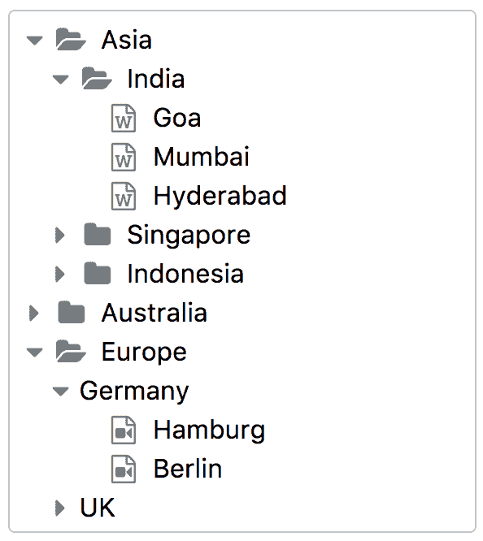

在前面的用例中，我们展开了印度和德国的国家树节点，以查看它们表示为旅游地点的子节点。

# 选择功能 - 单选、多选和复选框

树组件支持三种选择方式，包括单选、多选和复选框。单选是通过启用`selectionMode`属性和`selection`属性来实现的，后者保存了一个选定的树节点。

具有单选功能的树组件，以选择一个喜爱的旅游地点，将如下所示：

```ts
<p-tree [value]="singleSelectionTree" selectionMode="single" [(selection)]="selectedPlace"  (onNodeSelect)="nodeSelect($event)" (onNodeUnselect)="nodeUnselect($event)"></p-tree>
<div>Selected Node: {{selectedPlace ? selectedPlace.label : 'none'}}</div>

```

以下截图显示了树组件的快照结果，以单选为例：

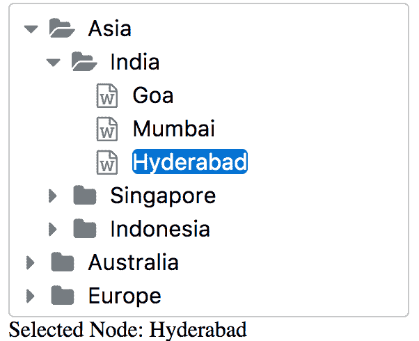

在这里，通过将`selectionMode`设置为`multiple`（`selectionMode="multiple"`）来启用多重选择。在这种情况下，`selection`属性保存一个作为选定节点的对象数组。多重选择也可以通过复选框选择来实现，只需将`selectionMode="checkbox"`。

具有多个复选框选择功能的树组件，以选择多个旅游地点，将如下所示：

```ts
<p-tree [value]="checkboxSelectionTree" selectionMode="checkbox"
 [(selection)]="selectMultiplePlaces"></p-tree>
<div>Selected Nodes: <span *ngFor="let place of selectMultiplePlaces">{{place.label}} </span></div>

```

以下截图显示了树组件的快照结果，以复选框选择为例：

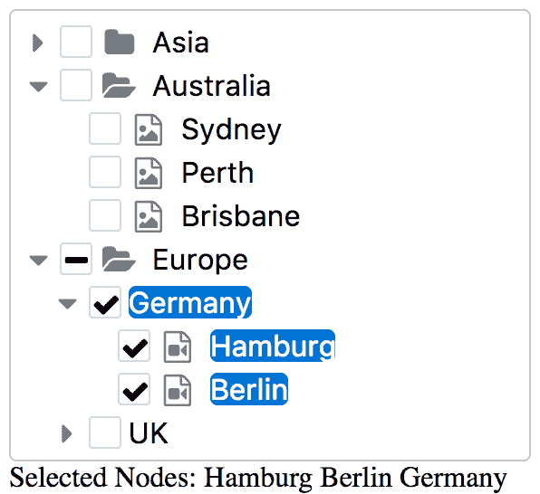

选择功能支持两个事件回调，如`onRowSelect`和`onRowUnselect`，提供了选定和取消选定的树节点。有关更多详细信息，请参阅事件部分。

选择节点的传播（向上和向下方向）通过`propagateSelectionUp`和`propagateSelectionDown`属性来控制，默认情况下是启用的。

# 超出基本用法 - 高级功能

树组件还支持许多高级功能：

+   自定义内容可以使用模板标签`ng-template`来显示。

+   可以使用`onNodeExpand`事件回调来实现延迟加载功能。

+   为每个树节点应用上下文菜单，使用本地模板引用变量。

+   使用`layout="horizontal"`表达式显示树组件的水平布局。

+   通过启用`draggableNodes`和`droppableNodes`属性，可以在源树组件和目标树组件之间实现拖放功能。`dragdropScope`属性用于将拖放支持限制在特定区域。

可以通过将 API 方法外部化来以编程方式实现行展开或折叠行为。例如，下面显示了一个带有外部按钮的树，这些按钮用于使用事件回调以编程方式展开或折叠树节点。

```ts
<p-tree #expandingTree [value]="programmaticTree"></p-tree>
<div>
 <button pButton type="text" label="Expand all" (click)="expandAll()">
   </button>
  <button pButton type="text" label="Collapse all" (click)="collapseAll()"></button>
</div>

```

在此处显示了使用事件回调函数定义的组件类，以递归方式切换树节点的示例：

```ts
expandAll() {
 this.programmaticTree.forEach( (node: any) => {
    this.expandRecursive(node, true);
  } );
}

collapseAll() {
 this.programmaticTree.forEach((node: any) => {
    this.expandRecursive(node, false);
  } );
}

expandRecursive(node: TreeNode, isExpand: boolean) {
  node.expanded = isExpand;
  if (node.children) {
    node.children.forEach( childNode => {
      this.expandRecursive(childNode, isExpand);
    } );
  }
}

```

该组件还支持四个事件回调，如`onNodeExpand`、`onNodeCollapse`、`onNodeDrop`和`onNodeContextMenuSelect`。以下事件表提供了事件、参数及其描述的完整详细信息：

| **名称** | **参数** | **描述** |
| --- | --- | --- |
| `onNodeSelect` |

+   `event.originalEvent`: 浏览器事件

+   `event.node`: 选定的节点实例

| 当选择节点时调用的回调函数。 |
| --- |
| `onNodeUnselect` |

+   `event.originalEvent`: 浏览器事件

+   `event.node`: 取消选择的节点实例

| 当取消选择节点时调用的回调函数。 |
| --- |
| `onNodeExpand` |

+   `event.originalEvent`: 浏览器事件

+   `event.node`: 展开的节点实例

| 当节点展开时调用的回调函数。 |
| --- |
| `onNodeCollapse` |

+   `event.originalEvent`: 浏览器事件

+   `event.node`: 折叠的节点实例

| 当节点折叠时调用的回调函数。 |
| --- |
| `onNodeContextMenuSelect` |

+   `event.originalEvent`: 浏览器事件

+   `event.node`: 选定的节点实例

| 当通过右键单击选择节点时调用的回调函数。 |
| --- |
| `onNodeDrop` |

+   `event.originalEvent`: 浏览器事件

+   `event.dragNode`: 被拖动的节点实例

+   `event.dropNode`: 被拖放的节点实例

| 当通过右键单击选择节点时调用的回调函数。 |
| --- |

完整的演示应用程序及说明可在 GitHub 上找到

[`github.com/ova2/angular-development-with-primeng/tree/master/chapter5/tree`](https://github.com/ova2/angular-development-with-primeng/tree/master/chapter5/tree)。

# 使用 TreeTable 可视化数据

TreeTable 用于以表格格式显示分层数据。它需要一个`TreeNode`对象数组作为其值，并提供了许多可选属性的`TreeNode`API。TreeTable 将列组件定义为具有`header`、`footer`、`field`和`style`属性的子元素，类似于 DataTable 组件。

将旅游地点树节点作为信息的 TreeTable 组件的基本示例将如下编写：

```ts
<p-treeTable [value]="basicTreeTable">
 <p-header>Basic</p-header>
  <p-column field="name" header="Name"></p-column>
  <p-column field="days" header="Days"></p-column>
  <p-column field="type" header="Type"></p-column>
</p-treeTable>

```

该组件是通过以分层方式排列`TreeNode`对象来创建的。`TreeNode`对象包括许多属性，如下所列：

| **名称** | **类型** | **默认** | **描述** |
| --- | --- | --- | --- |
| `label` | `string` | `null` | 节点的标签。 |
| `data` | `any` | `null` | 由节点表示的数据。 |
| `icon` | `string` | `null` | 要显示在内容旁边的节点图标。TreeTable 不使用。 |
| `expandedIcon` | `string` | `null` | 用于展开状态的图标。TreeTable 不使用。 |
| `collapsedIcon` | `string` | `null` | 用于折叠状态的图标。TreeTable 不使用。 |
| `children` | `TreeNode[]` | `null` | 作为子节点的树节点数组。 |
| `leaf` | `boolean` | `null` | 指定节点是否有子节点。用于延迟加载。 |
| `style` | `string` | `null` | 节点的内联样式。 |
| `styleClass` | `string` | `null` | 节点的样式类。 |

旅游景点示例的`TreeNode`结构如下：

```ts
{
  "data": [
    {
      "data": {
        "name": "Asia",
        "days": "15",
        "type": "Continent"
  },
      "children": [
        {
          "data": {
            "name": "India",
            "days": "6",
            "type": "Country"
  },
          "children": [
            {
              "data": {
                "name": "Goa",
                "days": "2",
                "type": "City"
  }...
            }]
          }]
     } }
  ...
}

```

注入的服务和组件类中的相同服务调用表示几乎与前一节中解释的 Tree 组件相似。以下屏幕截图显示了以层次结构的旅游信息为例的快照结果：

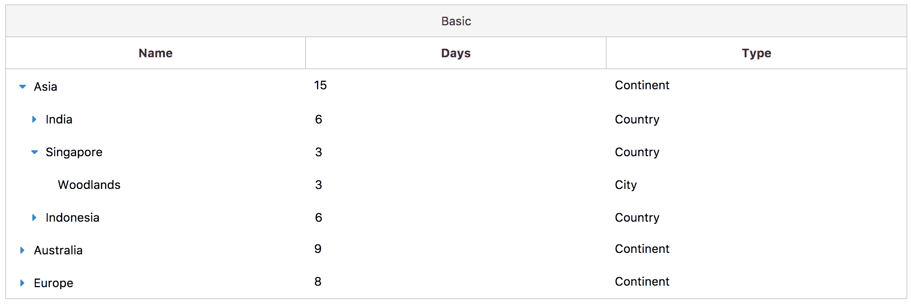

该组件还支持动态列，其中每列都是通过循环`ngFor`指令创建的。

# 选择功能 - 单选、多选和复选框

TreeTable 组件支持三种选择功能，包括单选、多选和复选框。单选通过在树表上启用`selectionMode`属性和`selection`属性来实现，该属性保存了所选的树表节点。

具有单选功能的 TreeTable 组件，用于选择喜爱的旅游景点，将如下编写：

```ts
<p-treeTable [value]="singleSelectionTreeTable" selectionMode="single"   
  [(selection)]="selectedTouristPlace   
  (onNodeSelect)="nodeSelect($event)"   
  (onNodeUnselect)="nodeUnselect($event)" 
  (onRowDblclick)="onRowDblclick($event)" >
    <p-header>Singe Selection</p-header>
    <p-column field="name" header="Name"></p-column>
    <p-column field="days" header="Days"></p-column>
    <p-column field="type" header="Type"></p-column>
</p-treeTable>

```

以下屏幕截图显示了以单选为例的快照结果：

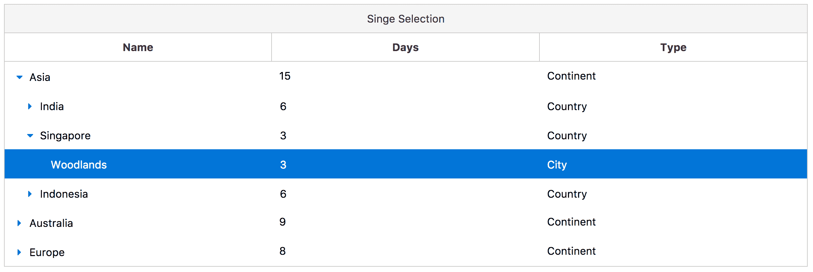

而多选功能是通过将`selectionMode`设置为多选（`selectionMode="multiple"`）来启用的。在这种情况下，`selection`属性保存了所选节点的对象数组。多选也可以通过复选框选择来实现。这可以通过设置`selectionMode="checkbox"`来实现。

具有多复选框选择功能的 TreeTable 组件，用于选择多个旅游景点，将如下所示：

```ts
<p-treeTable [value]="checkboxSelectionTreeTable" selectionMode="checkbox"
 [(selection)]="selectedMultiTouristPlaces">
  <p-header>Checkbox Selection</p-header>
  <p-column field="name" header="Name"></p-column>
  <p-column field="days" header="Days"></p-column>
  <p-column field="type" header="Type"></p-column>
</p-treeTable>

```

以下屏幕截图显示了复选框选择的快照结果：

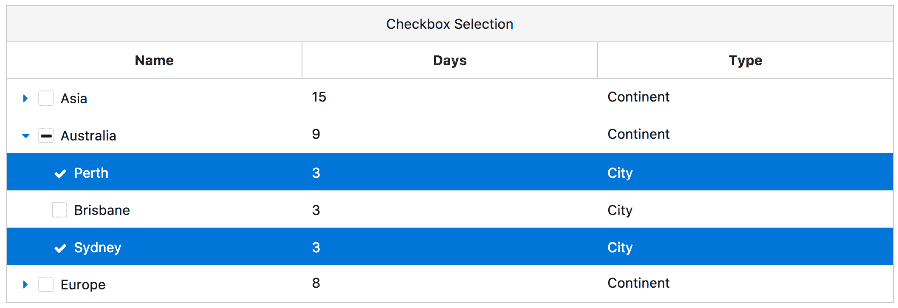

选择功能支持两个事件回调，例如`onNodeSelect`和`onNodeUnselect`，它提供了选定和取消选定的树节点。有关更多详细信息，请参阅事件部分。

# 基本用法之外 - 高级功能

TreeTable 组件还支持各种高级功能，例如使用`onNodeExpand`回调进行延迟加载，使用`ng-template`模板标签进行自定义可编辑内容，以及上下文菜单实现，这与 DataTable 组件类似。它还支持使用`p-header`和`p-footer`标签为头部和底部添加外观。

TreeTable 的内容显示是使用`ng-template`进行自定义的。默认情况下，树节点的标签显示在树节点内。要自定义内容，请在获取列的列中定义`ng-template`作为隐式变量（`let-col`），并将`rowData`定义为节点实例（`let-node="rowData"`）。同样，我们可以自定义此组件的头部和底部。

让我们以可编辑的树节点为例，通过在每个模板中放置一个输入框来实现：

```ts
<p-treeTable [value]="templateTreeTable">
 <p-header>Editable Cells with Templating</p-header>
  <p-column field="name" header="Name">
    <ng-template let-node="rowData" pTemplate="body">
      <input type="text" [(ngModel)]="node.data.name" 
        class="edit-input">
    </ng-template>
  </p-column>
  <p-column field="days" header="Days">
    <ng-template let-node="rowData" pTemplate="body">
      <input type="text" [(ngModel)]="node.data.days" 
        class="edit-input">
    </ng-template>
  </p-column>
  <p-column field="type" header="Type">
    <ng-template let-node="rowData" pTemplate="body">
      <input type="text" [(ngModel)]="node.data.type" 
        class="edit-input">
    </ng-template>
  </p-column>
</p-treeTable>

```

以下屏幕截图显示了具有可编辑模板的快照结果：

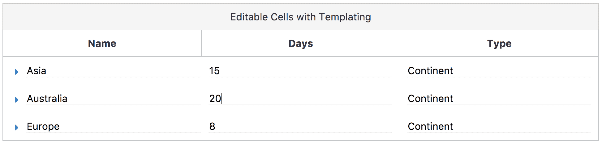

在上述快照中，我们可以编辑所有树节点字段。例如，我们将旅游套餐的天数从 9 天更新为 20 天。TreeTable 还支持扩展/折叠节点的事件回调，例如`onNodeExpand`、`onNodeCollapse`，以及上下文菜单的`onContextmenuSelect`事件。有关更多详细信息，请参阅事件部分。

PrimeNG 4.1 引入了`toggleColumnIndex`属性，用于定义包含`toggler`元素的列的索引。默认情况下，`toggleColumnIndex`的值为`0`（如果未定义`togglerColumnIndex`，TreeTable 始终在第一列显示`toggler`）。

以下事件表提供了事件、参数及其描述的完整详细信息：

| **名称** | **参数** | **描述** |
| --- | --- | --- |
| `onNodeSelect` |

+   `event.originalEvent`：浏览器事件

+   `event.node`：选定的节点实例

| 调用节点被选中时的回调。 |
| --- |
| `onNodeUnselect` |

+   `event.originalEvent`：浏览器事件

+   `event.node`：取消选定的节点实例

| 当节点取消选定时要调用的回调函数。 |
| --- |
| `onNodeExpand` |

+   `event.originalEvent`: 浏览器事件

+   `event.node`: 展开的节点实例

| 当节点展开时要调用的回调函数。 |
| --- |
| `onNodeCollapse` |

+   `event.originalEvent`: 浏览器事件

+   `event.node`: 折叠的节点实例

| 当节点折叠时要调用的回调函数。 |
| --- |
| `onContextMenuSelect` |

+   `event.originalEvent`: 浏览器事件

+   `event.node`: 选定的节点实例

| 当右键选择节点时要调用的回调函数。 |
| --- |
| `onRowDblclick` |

+   `event.originalEvent`: 浏览器事件

+   `event.node`: 选定的节点实例

| 双击行时要调用的回调函数。 |
| --- |

完整的演示应用程序及说明可在 GitHub 上找到

[`github.com/ova2/angular-development-with-primeng/tree/master/chapter5/treetable`](https://github.com/ova2/angular-development-with-primeng/tree/master/chapter5/treetable).

# 使用日程安排管理事件

日程安排是基于`FullCalendar` jQuery 插件的全尺寸拖放事件日历。日程安排的事件应该形成一个数组，并使用`events`属性进行定义。日程安排组件依赖于`FullCalendar`库，因此它需要您页面中列出的以下资源： 

+   日程安排组件嵌入到网页中，使用样式表和 JavaScript 文件。因此，我们需要在 HTML 页面的`head`部分包含`FullCalendar`库的样式表（`.css`）和 JavaScript（`.js`）文件。

+   将`jQuery`和`Moment.js`库添加为完整日历的强制库。这两个库必须在加载`FullCalendar`库的 JavaScript 文件之前加载。

因此，我们在根`index.html`文件中包含了`FullCalendar`和其他依赖资源，如下所示：

```ts
<!-- Schedule CSS resources--> <link rel="stylesheet" type="text/css" href="https://cdnjs.cloudflare.com/ajax/libs/fullcalendar/3.1.0/
fullcalendar.min.css">
<!-- Schedule Javascript resources--> <script src="https://code.jquery.com/jquery-2.2.4.min.js"></script>
<script src="https://cdnjs.cloudflare.com/ajax/libs/moment.js/2.13.0/moment.min.js"></script>
<script src="https://cdnjs.cloudflare.com/ajax/libs/fullcalendar/3.1.0/
fullcalendar.min.js"></script>

```

为整个月份定义的日程安排组件的基本示例将如下所示编写：

```ts
<p-schedule [events]="events" [height]="700" 
  [styleClass]="'schedule-width'">
</p-schedule> 

```

基本上，所有类型的事件都有标题、持续时间（开始和结束日期）、日期类型（全天/部分天）等属性。因此，事件类将如下所示定义：

```ts
export class MyEvent {
 id: number;
  title: string;
  start: string;
  end: string;
  allDay: boolean = true;
}

```

日程安排事件的数据应该按照上述格式作为原型来定义。但在实时情况下，数据是通过远程服务调用获取的，并且在事件发生变化时立即更新到日程安排界面。用于从数据源检索数据的事件服务（在本例中，它使用 HTTP 模块和可观察对象从 JSON 事件文件中检索数据）定义如下：

```ts
@Injectable()
export class EventService {

  constructor(private http: Http) { }

  getEvents(): Observable<any> {
    return this.http.get('/assets/data/scheduleevents.json')
      .map(response => response.json().data);
  }
}

```

注入的服务在网页初始加载时获取数据。如下所示，组件类必须定义可观察对象的订阅：

```ts
events: any[];

constructor(private eventService: EventService) { }

ngOnInit() {
 this.eventService.getEvents().subscribe((events: any) => 
  {this.events = events;});
}

```

以下截图显示了嵌入式日程安排组件显示的快照结果作为示例：

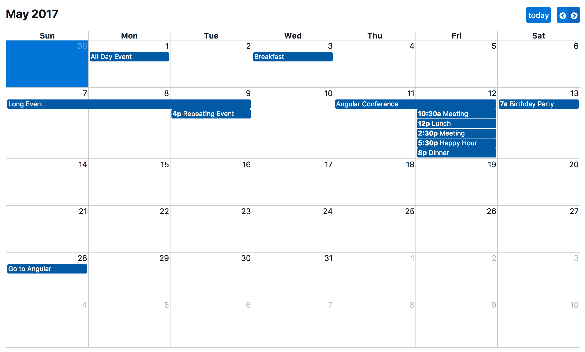

根据前面的快照，标题显示为日期（月份和年份）、今天标签和月份导航控件。主体或内容区域包含了每个月的每一天以及特定日期上的事件，以蓝色覆盖区域显示。

# 标题定制

在前面的快照中，我们观察到了日程安排的内容区域以及默认标题文本和控件。日程安排元素的默认标题配置对象将被编写如下：

```ts
{
  left: 'title', 
  center: '',
  right: 'today prev,next' }

```

通过`header`属性修改了上述默认标题显示，该属性保存了标题配置对象，如下所示：

```ts
<p-schedule [events]="events" [header]="headerConfig" [height]="700"
 [styleClass]="'schedule-width'"></p-schedule>

```

让我们定义左侧的导航控件，中间的标题，以及右侧的视图类型（月、周、日），以将其表示为配置对象：

```ts
this.headerConfig = {
 left: 'prev,next today',
  center: 'title',
  right: 'month,agendaWeek,agendaDay' };

```

以下截图显示了自定义日程安排标题的快照结果作为示例：


# 基本用法之外 - 高级功能

除了上述常规功能之外，日程安排组件还通过`onViewRender`事件回调支持懒加载，当新的日期范围被渲染或视图类型发生变化时将被调用。带有懒加载事件回调调用的日程安排组件将被编写如下：

```ts
<p-schedule [events]="events" (onViewRender)="loadEvents($event)" [height]="700" [styleClass]="'schedule-width'"></p-schedule>

```

组件类定义了一个懒加载回调，以便按需检索事件数据，并且将被编写如下：

```ts
loadEvents(event: any) {
 let start = event.view.start;
  let end = event.view.end;
  // In real time the service call filtered based on  
  //start and end dates
  this.eventService.getEvents().subscribe((events: any) =>
  {this.events = events;});
}

```

该组件还通过`locale`属性支持本地化。例如，通过设置`locale="de"`来表示德语标签。本地化标签应该在类似日历的组件中定义。

当事件数据发生任何变化时，UI 会自动更新。这对于在日程安排上实现 CRUD 操作非常有帮助。

# 事件和方法

日程安排组件提供了许多事件回调，包括点击、鼠标、调整大小和拖放用户操作，如下所列：

| **名称** | **描述** |
| --- | --- |
| `onDayClick` | 当用户点击某一天时触发 |
| `onEventClick` | 当用户点击事件时触发 |
| `onEventMouseover` | 当用户将鼠标悬停在事件上时触发 |
| `onEventMouseout` | 当用户鼠标移出事件时触发 |
| `onEventDragStart` | 当事件拖动开始时触发 |
| `onEventDragStop` | 当事件拖动停止时触发 |
| `onEventDrop` | 当拖动停止且事件已移动到*不同*的日期/时间时触发 |
| `onEventResizeStart` | 当事件调整大小开始时触发 |
| `onEventResizeStop` | 当事件调整大小停止时触发 |
| `onEventResize` | 当调整大小停止且事件持续时间发生变化时触发 |
| `onViewRender` | 当新的日期范围被渲染或视图类型切换时触发 |
| `onViewDestroy` | 当渲染的日期范围需要被销毁时触发 |
| `onDrop` | 当可拖动对象被放置到日程表上时触发 |

此外，它提供了许多 API 方法来处理不同的用例，如下所示：

| **名称** | **参数** | **描述** |
| --- | --- | --- |
| `prev()` | - | 将日程表向后移动一步（可以是一个月、一周或一天） |
| `next()` | - | 将日程表向前移动一步（可以是一个月、一周或一天） |
| `prevYear()` | - | 将日程表向后移动一年 |
| `nextYear()` | - | 将日程表向前移动一年 |
| `today()` | - | 将日程表移动到当前日期 |
| `gotoDate(date)` | `date`: 要导航的日期 | 将日程表移动到任意日期 |
| `incrementDate(duration)` | `duration`: 要添加到当前日期的持续时间 | 将日程表向前/向后移动任意时间量 |
| `getDate()` | - | 返回日历当前日期的时刻 |
| `changeView(viewName)` | `viewName`: 要切换到的有效视图字符串 | 立即切换到不同的视图 |

上述 API 方法将完全控制日程表。这些方法调用在许多用例中非常有帮助。例如，通过`.next()`方法访问日程表的下一个视图（月、周或日）如下所示：

```ts
<p-schedule [events]="events" #schedule></p-schedule>
<button type="button" pButton (click)="next(schedule)"></p-button>

```

组件类定义了点击事件回调，将调用下一个日期、周或月，如下所示：

```ts
next(schedule) {
  schedule.next();
}

```

完整的演示应用程序及说明可在 GitHub 上找到

[`github.com/ova2/angular-development-with-primeng/tree/master/chapter5/schedule`](https://github.com/ova2/angular-development-with-primeng/tree/master/chapter5/schedule).

# 摘要

此时，您将对所有数据迭代组件及其最常用的功能有一个概览，比如选择行、排序、分页、过滤数据等等。接下来，我们能够以表格、网格和列表格式显示（分层）数据。此外，您将了解如何在 DataTable 中实现调整大小、重新排序、切换和分组列，自定义单元格内容，并使用 Tree 和 TreeTable 组件可视化数据。在下一章中，您将看到一些令人惊叹的覆盖层，比如对话框、确认对话框、覆盖面板和通知组件，比如 growl 和消息，以及各种功能。
