# 第六章：令人惊叹的覆盖和消息

令人惊叹的覆盖和消息展示了模态或非模态覆盖（如对话框、灯箱和覆盖面板）中显示的各种内容的不同变体。当内容显示在上述覆盖中时，用户不会离开页面流。覆盖组件会覆盖页面上的其他组件。PrimeNG 还提供通知组件来显示各种消息或咨询信息。这些消息组件也将被描述。

在本章中，我们将涵盖以下主题：

+   在弹出模式下显示内容

+   OverlayPanel 的多功能场景

+   在灯箱中显示内容

+   使用消息和 Growl 通知用户

+   表单组件的工具提示

# 在弹出模式下显示内容

网站的附加信息可以以弹出格式表示。这将通过最佳视口改善用户体验。存在两种类型的弹出格式：**对话框**和**确认对话框**。

# 对话框

对话框是一个容器组件，用于在覆盖窗口中显示内容。为了保存网页的视口，对话框非常有用，可以以弹出格式显示附加信息。对话框的可见性通过`visible`属性控制。

默认情况下，对话框以`false`的`visibility`隐藏，并启用`visible`属性显示对话框。由于对话框具有双向绑定的特性，使用关闭图标关闭对话框后，`visible`属性会自动变为`false`。`closeOnEscape`属性用于使用*Esc*键关闭对话框。

对话框组件的基本示例与源按钮将如下所示：

```ts
<p-dialog header="PrimeNG" [(visible)]="basic"> 
  PrimeNG content goes here.... </dialog>

```

`visible`属性在用户操作时被启用。以下屏幕截图显示了基本对话框示例的快照结果：

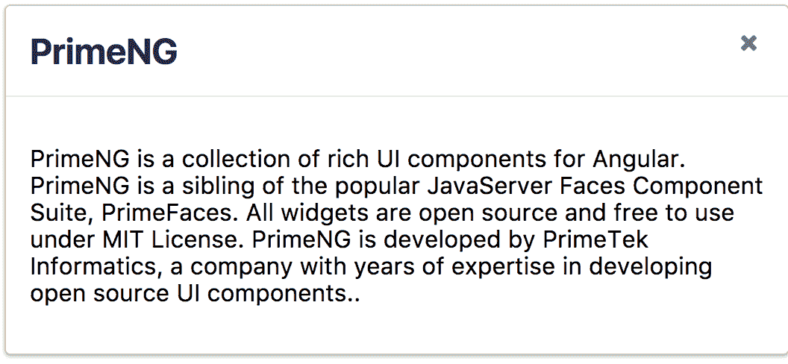

对话框组件支持两个名为`onShow`和`onHide`的事件回调，当对话框显示或隐藏时将被调用。

# 可用性功能

通过使用`draggable`、`resizable`、`closable`和`responsive`属性，对话框组件的用户体验将得到改善，具有可拖动、可调整大小、可关闭和响应式功能。除了这些交互功能，`modal`属性通过透明背景防止用户在主页面上执行操作，而`dismissableMask`在用户点击透明背景时隐藏对话框。

这些属性的默认值如下：

+   `draggable = true`

+   `resizable = true`

+   `closable = true`

+   `responsive = false`

+   `modal = false`

+   `dismissableMask = false`

# 自定义标题和页脚

对话框的标题通过`header`属性定义，并且可以通过`showHeader`属性进行控制。对话框组件的页眉和页脚部分可以使用`p-header`和`p-footer`标签以更灵活的方式进行定义。为了使用它们，需要导入页眉和页脚组件，并在指令部分声明它。

具有自定义标题和页脚的对话框组件的自定义示例将如下所示：

```ts
<p-dialog[(visible)]="custom" modal="true">
 <p-header>
    PrimeNG License declaration
  </p-header>
  All widgets are open source and free to use under MIT License.
  If agree with the license please click 'Yes' otherwise click 'No'.
  <p-footer>
    <div class="ui-dialog-buttonpane ui-widget-content 
      ui-helper-clearfix">
      <button type="button" pButton icon="fa-close" (click)="onComplete()" label="No"></button>
      <button type="button" pButton icon="fa-check" (click)="onComplete()" label="Yes"></button>
    </div>
  </p-footer>
</p-dialog>

```

以下截图显示了自定义对话框示例的快照结果：

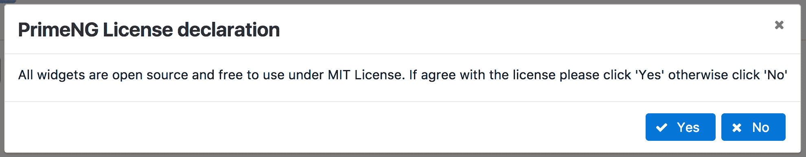

前面的快照显示了如何根据需要或要求自定义标题、消息和页脚图标。默认情况下，对话框组件在视口中居中对齐，但可以使用`positionLeft`和`positionTop`属性进行自定义。

# ConfirmDialog

ConfirmDialog 是一个用于同时显示多个操作的确认窗口的组件。在这种情况下，它将由使用可观察对象的确认服务支持。需要导入使用多个操作的确认方法的服务。

使用源按钮（或对话框生成器按钮）的 ConfirmDialog 组件的基本示例将如下所示：

```ts
<p-confirmDialog></p-confirmDialog>
    <button type="button" (click)="confirmAccept()" pButton
      icon="fa-check" label="Confirm"></button>
    <button type="button" (click)="confirmDelete()" pButton
      icon="fa-trash" label="Delete"></button>

```

在上面的示例中，确认方法将确认一个实例，用于自定义对话框 UI 以及接受和拒绝按钮。例如，`accept`函数调用确认服务的确认方法，决定需要执行什么操作：

```ts
confirmAccept() {
 this.confirmationService.confirm({
    message: 'Do you want to subscribe for Angular news feeds?',
    header: 'Subscribe',
    icon: 'fa fa-question-circle',
    accept: () => {
      this.msgs = [];
      this.msgs.push({severity:'info', summary:'Confirmed',
                     detail: 'You have accepted'});
    }
  });
}

```

点击按钮组件后，对话框出现。以下截图显示了基本确认对话框示例的快照结果：

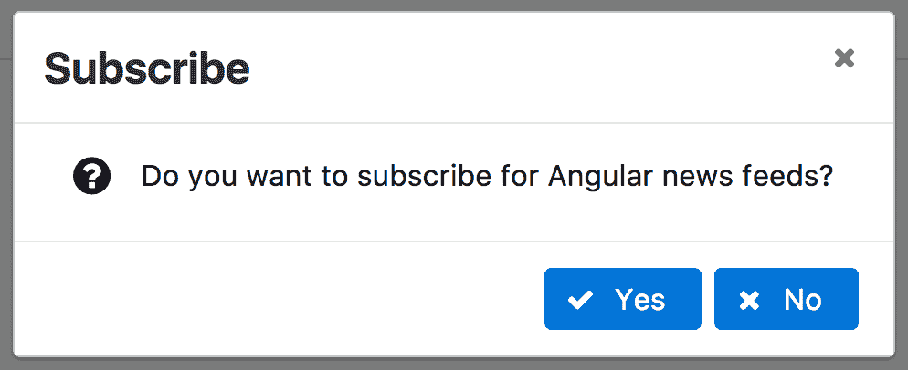

页脚的接受和拒绝按钮决定是否订阅 Angular 新闻订阅系统。

# 自定义

提供确认对话框的标题、消息和图标有两种方式。一种是声明性的方式，通过属性（`header`、`message`和`icon`）提供所有功能，而另一种方式是程序化的方式，通过确认实例属性使值可以动态变化。甚至页脚部分的按钮也可以通过它们自己的 UI（`acceptLabel`、`acceptIcon`、`acceptVisibility`、`rejectLabel`、`rejectIcon`和`rejectVisibility`）进行自定义，以及本地`ng-template`变量的接受和拒绝方法。

一个带有标题和页脚的自定义确认对话框组件的示例将如下编写：

```ts
<p-confirmDialog header="Confirmation" message="Do you like to use  
  DataTable component" icon="fa fa-question-circle" width="400" 
  height="200" #confirmation>
  <p-footer>
    <button type="button" pButton icon="fa-close" label="No" 
    (click)="confirmation.reject()"></button>
    <button type="button" pButton icon="fa-check" label="Yes" 
    (click)="confirmation.accept()"></button> </p-footer>
</p-confirmDialog>

```

以下截图显示了自定义确认对话框示例的快照结果：

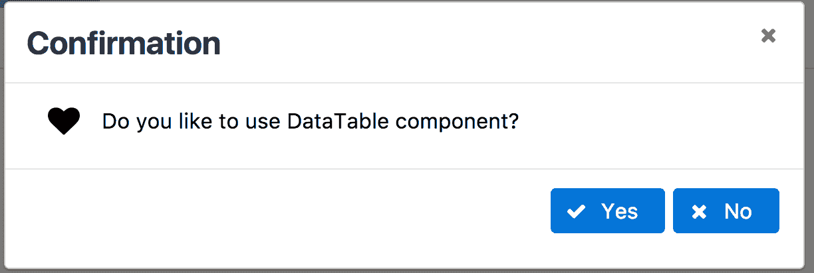

在上面的快照中，所有标题、消息和图标都是以声明性的方式进行自定义的。确认对话框提供了默认的`closable`、`responsive`和`closeOnEscape`属性，这与对话框组件类似。

完整的演示应用程序及说明可在 GitHub 上找到：

+   [`github.com/ova2/angular-development-with-primeng/tree/master/chapter6/dialog`](https://github.com/ova2/angular-development-with-primeng/tree/master/chapter6/dialog)

+   [`github.com/ova2/angular-development-with-primeng/tree/master/chapter6/confirm-dialog.`](https://github.com/ova2/angular-development-with-primeng/tree/master/chapter6/confirm-dialog)

# OverlayPanel 的多用途场景

OverlayPanel 是一个容器组件，可以在页面的其他组件上方显示附加信息。使用本地`ng-template`变量的`show`或`toggle`方法来显示该元素，使用`hide`或`toggle`方法来隐藏它。请记住，`show`方法将允许第二个参数作为目标元素，它必须显示 Overlay（而不是源）。Overlay 组件与源按钮生成器的基本示例将如下所示：

```ts
<p-overlayPanel #overlaybasic>
 
</p-overlayPanel>
<button type="button" pButton label="Logo" (click)="overlaybasic.toggle($event)"></button>

```

在上面的示例中，Overlay 将在单击按钮组件时出现。以下截图显示了基本 Overlay 示例的快照结果：

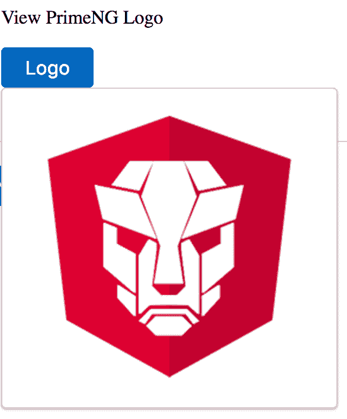

在上面的快照中，Overlay 在点击 logo 按钮时显示 PrimeNG logo 作为图像。默认情况下，OverlayPanel 附加到页面的 body 上，但可以使用 `appendTo` 属性更改目标。

# 与其他组件集成

OverlayPanel 组件也可以与其他 PrimeNG 组件集成。例如，下面的快照显示了如何使用 `ng-template` 将 Overlay 组件与 DataTable 组件集成。在这种情况下，按钮需要放置在 DataTable `ng-template` 内，并通过 `toggle` 事件触发 Overlay：

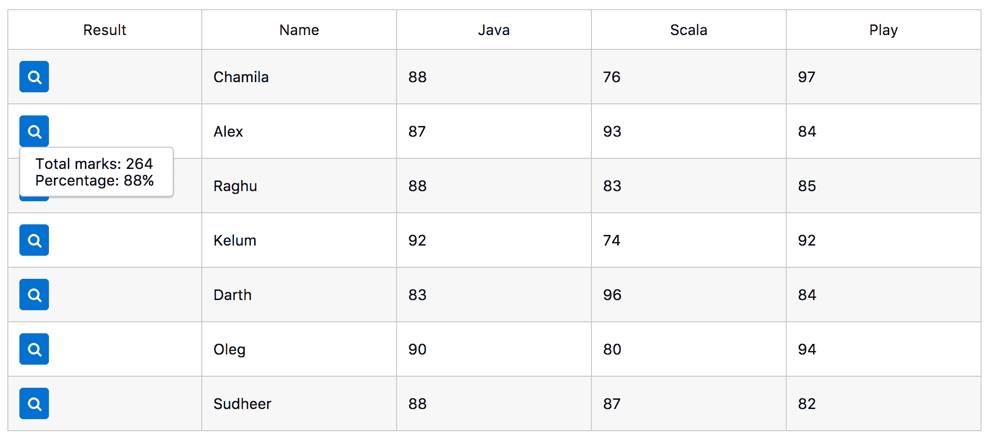

在上面的快照中，Overlay 面板用于通过点击每行的结果按钮以弹出格式显示聚合信息，如标记和百分比。

# 可关闭属性

默认情况下，Overlay 面板外部的交互会立即关闭 Dialog。可以使用 `dismissable` 属性阻止此行为。同时，还可以使用 `showCloseIcon` 属性在右上角显示关闭选项。

Dialog 组件支持四个事件回调，分别为 `onBeforeShow`、`onAfterShow`、`onBeforeHide` 和 `onAfterHide`，当 Dialog 被显示或隐藏时将被调用。

完整的演示应用程序及说明可在 GitHub 上找到

[`github.com/ova2/angular-development-with-primeng/tree/master/chapter6/overlaypanel.`](https://github.com/ova2/angular-development-with-primeng/tree/master/chapter6/overlaypanel)

# 在 Lightbox 中显示内容

LightBox 组件用于以模态 Overlay 模式显示图像、视频、内联 HTML 内容，以及 iframe 集合。存在两种类型的 LightBox 模式：一种是默认的 `image` 类型，另一种是 `content` 类型。在图像模式中，将显示图像集合，其中每个条目代表一个图像对象，代表图像的来源、缩略图和标题。一个带有 Angular 会议集合（或数组）的 LightBox 的基本示例如下：

```ts
<p-lightbox [images]="images" name="image"></p-lightbox>

```

组件将呈现如下截图所示：

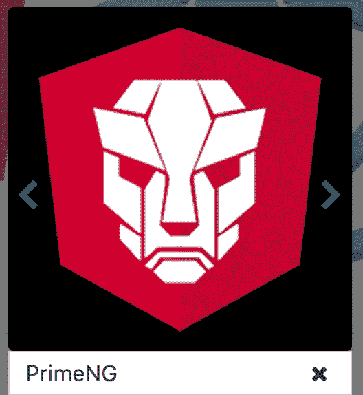

在上面的快照中，所有图像都显示为图像库，并通过下一个和上一个图标进行导航。

# 自定义内容模式

通过将`type`属性设置为`content`来启用内容模式，这将提供一个锚点（或链接）来打开 LightBox 并在其中显示内容。一个自定义内容的 LightBox 示例，包含一系列 Angular 会议，如下所示：

```ts
<p-lightbox type="content" name="content">
 <a class="group" href="#">
    Watch PrimeNG Video
  </a>
  <iframe width="500" height="300" 
    src="https://www.youtube.com/watch?v=Jf9nQ36e0Fw&t=754s" frameborder="0" allowfullscreen></iframe>
</p-lightbox>

```

该组件将作为 iframe 视频呈现在覆盖面板内，如下截图所示：

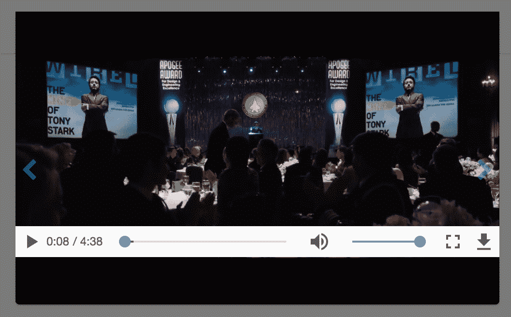

如上面的快照所示，视频列表被显示出来，并且可以在弹出模式下观看视频，以获得更好的体验。

# 过渡效果

LightBox 组件在图片之间的过渡效果更加强大。这可以通过`easing`属性实现。在这里，默认值是`ease-out`（即，使用`easing`属性自定义效果）。还有许多其他效果可用，支持整个 CSS3 效果列表。此外，默认情况下，效果持续时间为`500ms`。这也可以通过`effectDuration`属性进行自定义。

作为 LightBox 的过渡效果的一个示例，包含一系列 Angular 会议的效果如下：

```ts
<p-lightbox [images]="images" name="effects" easing="ease-out"  
  effectDuration="1000ms">
</p-lightbox>

```

完整的演示应用程序及说明可在 GitHub 上找到

[`github.com/ova2/angular-development-with-primeng/tree/master/chapter6/lightbox.`](https://github.com/ova2/angular-development-with-primeng/tree/master/chapter6/lightbox)

# 通过消息和 Growl 通知用户

消息组件用于以内联格式显示消息，以通知用户。这些消息是作为特定操作的结果而通知的。PrimeNG API 中的每条消息都是使用`Message`接口定义的，该接口定义了`severity`、`summary`和`detail`属性。

通知用户的消息的基本示例如下：

```ts
<p-messages ([value])="messages" name="basic"></p-messages>

```

在上面的例子中，消息使用`value`属性显示，该属性定义了`Message`接口的数组。该组件将如下截图所示呈现：

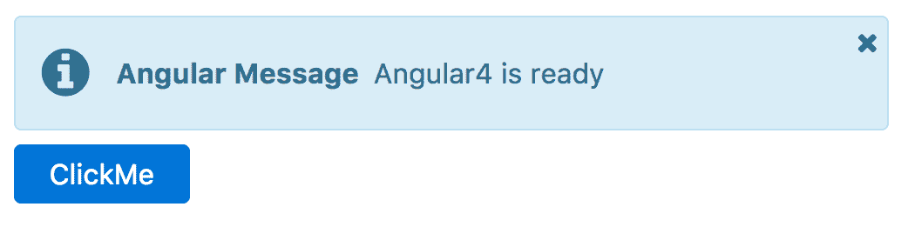

消息的严重程度由`class`属性表示。消息严重程度的可能值如下：

| **严重程度** | **类名** |
| --- | --- |
| `success` | `.ui-button-success` |
| `info` | `.ui-button-info` |
| `warn` | `.ui-button-warn` |
| `error` | `.ui-button-error` |

消息默认情况下可以通过位于右上角的关闭图标关闭。这种行为可以通过`closable`属性进行修改，即`[closable]="false"`会禁用消息的可关闭性。

# Growl - 另一种通知信息的方式

与消息组件类似，Growl 用于以覆盖模式而不是内联模式显示特定操作的消息。每条消息通过`Message`接口表示，具有`severity`、`summary`和`details`。Growl 通知用户的基本示例如下：

```ts
<p-growl ([value])="messages" name="basic"></p-growl>

```

`value`属性在后台组件模型中定义了`Message`接口的数组。组件将呈现如下截图所示：

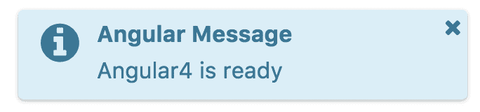

与消息组件类似，Growl 中也可以定义相同的严重类型。PrimeNG 4.1 版本引入了`onClick`事件回调，当单击消息时将被调用。

# 粘性行为

默认情况下，Growl 消息在一定时间后会被移除。Growl 消息的默认寿命是`3000ms`。这可以使用`life`属性进行自定义（即`life="5000"`）。要使消息成为粘性消息，无论提到的寿命如何，您都应该启用粘性行为，即`sticky="true"`。

PrimeNG 版本 4.0.1 支持 Growl 消息的双向绑定功能。由于这个特性，每当消息从 UI、后端实例或消息中被手动移除时，数组将立即更新。完整的演示应用程序及说明可在 GitHub 上找到

+   [`github.com/ova2/angular-development-with-primeng/tree/master/chapter6/messages`](https://github.com/ova2/angular-development-with-primeng/tree/master/chapter6/messages)

+   [`github.com/ova2/angular-development-with-primeng/tree/master/chapter6/growl.`](https://github.com/ova2/angular-development-with-primeng/tree/master/chapter6/growl)

# 表单组件的工具提示

工具提示为组件提供了咨询信息。这在使用目标组件之前给出了简要的见解。工具提示通过`pTooltip`指令应用，其值定义要显示的文本。除此之外，还可以使用`escape`属性显示 HTML 标签，而不是常规文本信息。工具提示的基本示例是为输入提供咨询信息，如下所示：

```ts
<input type="text" pInputText pTooltip="Enter your favourite component   
  name" >

```

工具提示显示在输入框的右侧，如下面的屏幕截图所示：

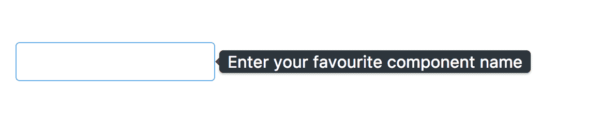

默认情况下，工具提示位置显示在目标组件的右侧。可以使用`tooltipPosition`属性将此行为更改为其他值，例如`top`、`right`和`bottom`，例如，具有`top`值的`tooltipPosition`将导致如下屏幕截图所示：

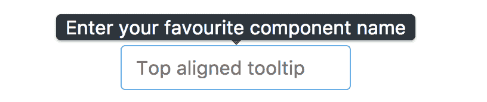

默认情况下，工具提示在悬停在目标元素上时显示（即，调用工具提示信息的默认事件是悬停）。可以使用`tooltipEvent`属性进行自定义，该属性提供焦点事件以显示和模糊事件以隐藏工具提示。请记住，工具提示也可以使用`tooltipDisabled`属性禁用。

输入的工具提示事件示例如下：

```ts
<input type="text" pInputText pTooltip="Enter your favourite component 
  name" tooltipEvent="focus" placeholder="Focus inputbox"/>

```

默认情况下，工具提示分配给文档主体。如果工具提示的目标放置在滚动容器内（例如，溢出的`div`元素），则将工具提示附加到具有相对位置的元素。可以使用`appendTo`属性实现这一点（即`appendTo="container"`）。

PrimeNG 版本 4.1 提供了`showDelay`和`hideDelay`属性，以便在显示和隐藏工具提示时添加延迟（以毫秒为单位的数字值）。延迟功能将应用如下：

```ts
<input type="text" pInputText pTooltip="Enter your favourite component 
  name" tooltipEvent="focus" placeholder="Focus inputbox" 
  showDelay="1000" hideDelay="400"/>

```

完整的演示应用程序及说明可在 GitHub 上找到

[`github.com/ova2/angular-development-with-primeng/tree/master/chapter6/tooltips.`](https://github.com/ova2/angular-development-with-primeng/tree/master/chapter6/tooltips)

# 摘要

通过阅读本节，您将能够了解如何在不离开当前页面流的情况下在覆盖窗口中显示图像、视频、iframe 和 HTML 内容。最初，您将看到如何使用对话框、确认对话框、灯箱和覆盖组件。之后，您将学习如何通过消息和生长组件在覆盖中显示内联消息或消息。

最后一个示例介绍了用于显示咨询信息的工具提示组件。所有这些组件都是通过逐步方法解释的，具有所有可能的功能。在下一章中，您将看到如何使用菜单模型 API、导航和菜单变体，如菜单、超级菜单、菜单栏、滑动菜单、面板菜单、分层菜单等，具有各种功能。
