# 第七章：无尽的菜单变体

在本章中，您将了解到几种菜单变体。PrimeNG 的菜单满足所有主要要求。如今，每个网站都包含菜单。通常，菜单被呈现给用户作为要导航或执行的命令的链接列表。菜单有时是按层次组织的，允许通过菜单结构的不同级别进行导航。

将菜单项排列成逻辑组，使用户可以快速找到相关任务。它们具有各种方面，如静态、动态、分层、混合、iPod 风格等，无所不包。读者将面临许多讨论菜单结构、配置选项、自定义以及与其他组件集成的示例。

在本章中，我们将涵盖以下主题：

+   使用 MenuModel API 创建程序化菜单

+   静态和动态定位的菜单

+   通过 MenuBar 访问命令

+   带有嵌套项的上下文菜单

+   SlideMenu - iPod 风格的菜单

+   TieredMenu - 嵌套覆盖中的子菜单

+   MegaMenu - 多列菜单

+   PanelMenu - 手风琴和树的混合

+   TabMenu - 菜单项作为选项卡

+   Breadcrumb - 提供有关页面层次结构的上下文信息

# 使用 MenuModel API 创建程序化菜单

PrimeNG 提供了一个`MenuModel` API，它将被所有菜单组件共享，用于指定菜单项和子菜单。`MenuModel` API 的核心项目是`MenuItem`类，具有`label`、`icon`、`url`、带有`items`选项的子菜单项等选项。

让我们以菜单组件为例，代表常见的工具栏用户界面。菜单组件通过`model`属性绑定`MenuItem`类的数组作为项目，如下所示：

```ts
<p-menu [model]="items"></p-menu>

```

`MenuItem`是`MenuModel` API 中的关键项目。它具有以下属性列表。每个属性都用类型、默认值和描述进行描述：

| **名称** | **类型** | **默认** | **描述** |
| --- | --- | --- | --- |
| `label` | `字符串` | `null` | 项目的文本。 |
| `icon` | `字符串` | `null` | 项目的图标。 |
| `command` | `函数` | `null` | 单击项目时要执行的回调。 |
| `url` | `字符串` | `null` | 单击项目时要导航到的外部链接。 |
| `routerLink` | `数组` | `null` | 用于内部导航的 RouterLink 定义。 |
| `items` | `数组` | `null` | 子菜单项的数组。 |
| `expanded` | `boolean` | `false` | 子菜单的可见性。 |
| `disabled` | `boolean` | `false` | 当设置为`true`时，禁用菜单项。 |
| `visible` | `boolean` | `true` | 菜单项的 DOM 元素是否已创建。 |
| `target` | `string` | `null` | 指定打开链接文档的位置。 |

表 1.0

# 菜单操作

具有纯文本只读标签和图标的菜单项并不是真正有用的。具有用户操作的菜单组件需要执行业务实现或导航到其他资源。菜单操作的主要组件是命令调用和导航。这可以通过`MenuItem`接口的`url`和`routerLink`属性来实现。

`MenuItem` API 的 URL 和路由链接选项的示例用法如下：

```ts
{label: 'View', icon: 'fa-search', command: 
  (event) => this.viewEmployee(this.selectedEmployee)}

{label: 'Help', icon: 'fa-close', url: 
 'https://www.opm.gov/policy-data- oversight/worklife/employee-
  assistance-programs/'}

```

在接下来的部分，您将看到`MenuModel` API 将如何在各种菜单组件中使用。

# 静态和动态定位的菜单

菜单是一个支持动态和静态定位的导航或命令组件。这是所有菜单组件中的基本菜单组件。菜单默认是静态定位的，但通过提供`target`属性可以使其变为动态定位。静态定位的菜单附加到页面主体作为目标（即`appendTo="body"`），而分配给其他元素则创建动态定位的菜单。

一个基本的菜单示例，包含项目文档或文件类型的菜单项，如下所示：

```ts
<p-menu [model]="items"></p-menu>

```

菜单项列表需要在一个组件类中进行组织。例如，名为“编辑”的根菜单项将有如下嵌套项：

```ts
this.items=[
{
    label: 'Edit',
    icon: 'fa-edit',
    items: [
        {label: 'Undo', icon: 'fa-mail-forward'},
        {label: 'Redo', icon: 'fa-mail-reply'}
    ]
},
//More items ...
}

```

以下截图显示了基本菜单（包含所有菜单项）示例的快照结果：

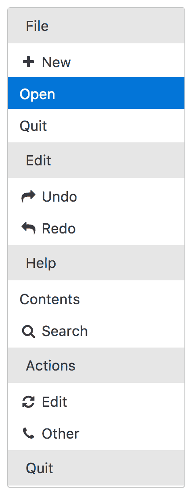

从上面的快照中，您可以观察到菜单组件以内联格式显示。但是，通过启用`popup`属性可以改变此行为，以便以覆盖的形式显示。

菜单组件为`Menu` API 定义了`toggle`、`show`和`hide`方法。每个方法的详细描述如下表所示：

| **名称** | **参数** | **描述** |
| --- | --- | --- |
| `toggle` | `event: 浏览器事件` | 切换弹出菜单的可见性。 |
| `show` | `event: 浏览器事件` | 显示弹出菜单。 |
| `hide` | - | 隐藏弹出菜单。 |

表 2.0 完整的演示应用程序及说明可在 GitHub 上找到

[`github.com/ova2/angular-development-with-primeng/tree/master/chapter7/menu`](https://github.com/ova2/angular-development-with-primeng/tree/master/chapter7/menu).

# 通过 MenuBar 访问命令

MenuBar 组件是一组水平菜单组件，带有嵌套子菜单（或用于页面导航的下拉菜单组件）。与任何其他菜单组件一样，MenuBar 使用一个包含`MenuItem`接口列表的常见菜单模型 API。嵌套子菜单的级别没有限制。让我们看一个用于窗口或应用程序特定菜单的基本 MenuBar 示例。这提供了对常见功能的访问，例如打开文件，编辑操作，与应用程序交互，显示帮助文档等，如下所示：

```ts
<p-menubar [model]="items"></p-menubar>

```

菜单项列表需要在组件类中进行组织。例如，名为“编辑”的根菜单项将具有如下所示的嵌套项：

```ts
this.items = [
  {
    label: 'Edit',
    icon: 'fa-edit',
    items: [
      {label: 'Cut', icon: 'fa-cut'},
      {label: 'Copy', icon: 'fa-copy'},
      {label: 'Paste', icon: 'fa-paste'},
      {label: 'Undo', icon: 'fa-mail-forward'},
      {label: 'Redo', icon: 'fa-mail-reply'},
      {label: 'Find', icon: 'fa-search', items: [
        {label: 'Find Next'},
        {label: 'Find Previous'}
      ]}
    ]
  },
  // more items......
];

```

以下屏幕截图显示了基本 MenuBar（带有所有菜单项）示例的快照结果：

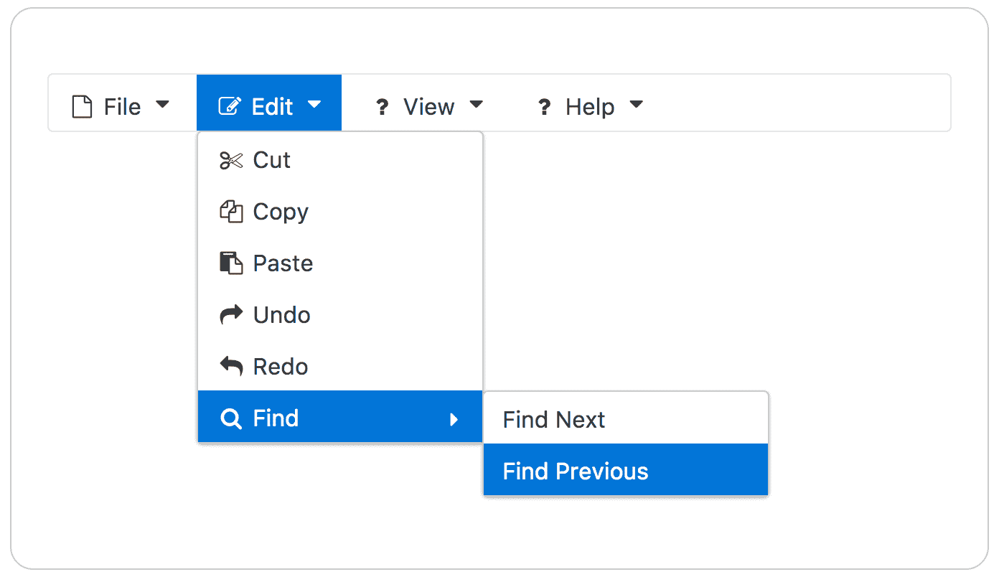

组件皮肤可以通过`style`和`styleClass`属性实现。PrimeNG 4.1 允许通过将其放置在 MenuBar 标签内部来使用自定义内容（表单控件）。

完整的演示应用程序及说明可在 GitHub 上找到

[`github.com/ova2/angular-development-with-primeng/tree/master/chapter7/menubar`](https://github.com/ova2/angular-development-with-primeng/tree/master/chapter7/menubar).

# 带有嵌套项的上下文菜单

ContextMenu 是一个具有**图形用户界面** **(GUI)**表示的菜单，通过右键单击即可出现在页面顶部。通过右键单击，会在目标元素上显示一个覆盖菜单。有两种类型的上下文菜单，一种用于文档，另一种用于特定组件。除了这两种之外，还有与组件（如 DataTable）的特殊集成。

默认情况下，ContextMenu 附加到具有全局设置的文档。一个基本的上下文菜单示例，显示文档或文件类型菜单，如下所示：

```ts
<p-contextMenu [global]="true" [model]="documentItems"></p-contextMenu>

```

菜单项列表需要在组件类中进行组织。例如，名为“文件”的根菜单项将具有如下所示的嵌套项：

```ts
this.documentItems = [
  {
    label: 'File',
    icon: 'fa-file-o',
    items: [{
      label: 'New',
      icon: 'fa-plus',
      items: [
        {label: 'Project'},
        {label: 'Other'},
      ],
      expanded: true
  },
    {label: 'Open'},
    {label: 'Quit'}
    ],
  },
  // more items ...
];

```

以下屏幕截图显示了基本上下文菜单（带有所有菜单项）示例的快照结果：

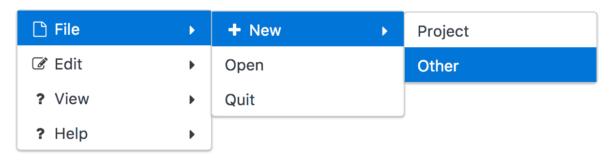

一旦单击此组件之外，上下文菜单将消失。

# ContextMenu 的自定义目标

可以使用`target`属性更改上下文菜单的默认全局设置（即，上下文菜单将显示在全局文档目标以外的其他元素上）。让我们来看一个上下文菜单示例，在右键单击图像元素时，覆盖或弹出窗口会出现在上面，如下所示：

```ts
<p-contextMenu [target]="image" [model]="targetItems" >
</p-contextMenu>


```

在这种情况下，只需定义菜单项数组，就可以从上下文菜单执行下一个和上一个操作。

# DataTable 集成

在前一节中，您已经看到如何使用`target`属性将上下文菜单与其他元素集成。但是与 DataTable 组件的集成是一个不同的情况，需要特殊处理。这种组合是 Web 开发中经常使用的用例之一。

DataTable 使用`contextMenu`属性提供对上下文菜单的引用（即，上下文菜单的模板引用变量应分配给 DataTable 的`contextMenu`属性）。上下文菜单与 DataTable 的集成将如下所示编写：

```ts
<p-contextMenu #contextmenu [model]="tableItems"></p-contextMenu>
<p-dataTable [value]="employees" selectionMode="single" [(selection)]="selectedEmployee" [contextMenu]="contextmenu">
 <p-header>Employee Information</p-header>
  <p-column field="id" header="Employee ID"></p-column>
  <p-column field="name" header="Name"></p-column>
  <p-column field="email" header="Email"></p-column>
  <p-column field="contact" header="Telephone"></p-column>
</p-dataTable>

```

上下文菜单模型绑定到菜单项数组，例如`View`和`Delete`选项，如下所示：

```ts
this.tableItems = [
 {label: 'View', icon: 'fa-search', command: (event) => 
   this.viewEmployee(this.selectedEmployee)},
 {label: 'Delete', icon: 'fa-close', command: (event) => 
   this.deleteEmployee(this.selectedEmployee)},
 {label: 'Help', icon: 'fa-close',
 url: 'https://www.opm.gov/policy-data-oversight/worklife/
   employee-assistance-programs/'}
];

```

在上面的例子中，我们执行了通知用户消息的命令操作。但在实时中，所有 CRUD 操作都与数据库同步。以下截图显示了上下文菜单与 DataTable 组件集成的快照结果。

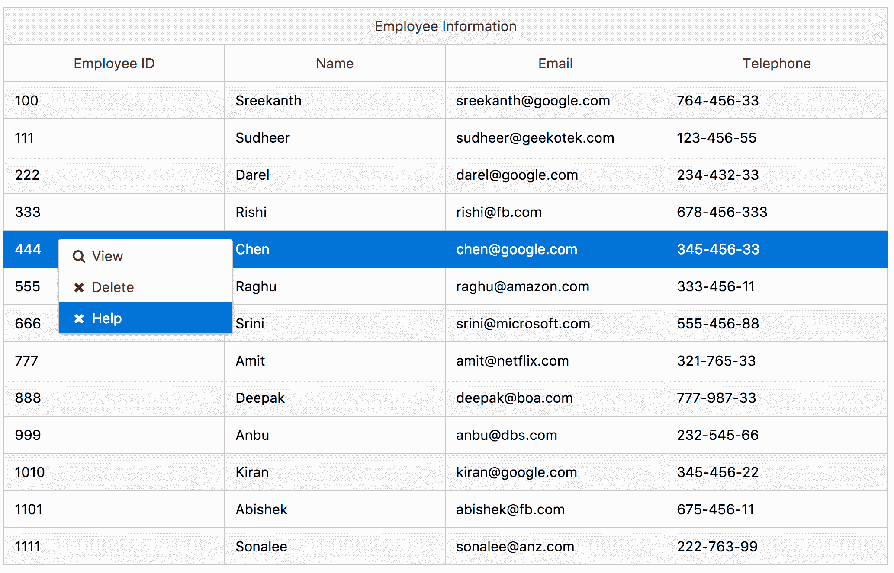

根据上面的快照，在右键单击并在行上出现覆盖时，表格行被选中。菜单项选择可以执行业务逻辑或导航到各种网页。

完整的演示应用程序及说明可在 GitHub 上找到

[`github.com/ova2/angular-development-with-primeng/tree/master/chapter7/contextmenu`](https://github.com/ova2/angular-development-with-primeng/tree/master/chapter7/contextmenu)。

# SlideMenu - iPod 样式菜单

SlideMenu 是一个显示带有滑动动画效果的子菜单的组件。这种滑动菜单组件是 iPod 样式菜单小部件的最佳示例。默认情况下，滑动菜单显示为内联菜单组件。显示文档或文件类型菜单的基本滑动菜单示例如下：

```ts
<p-slideMenu [model]="items"></p-slideMenu>

```

菜单项列表需要在组件类中进行组织。例如，名为“文件”的根菜单项将具有如下嵌套项：

```ts
this.items = [
  {
    label: 'File',
    icon: 'fa-file-o',
    items: [
    {
      label: 'New',
      icon: 'fa-plus',
      items: [
        {label: 'Project'},
        {label: 'Other'},
      ]
    },
    {label: 'Open'},
    {label: 'Quit'}
    ]
  },
  // more items ...
]

```

以下截图显示了基本幻灯片菜单的快照结果，例如，单击文件菜单项时显示文件菜单项：

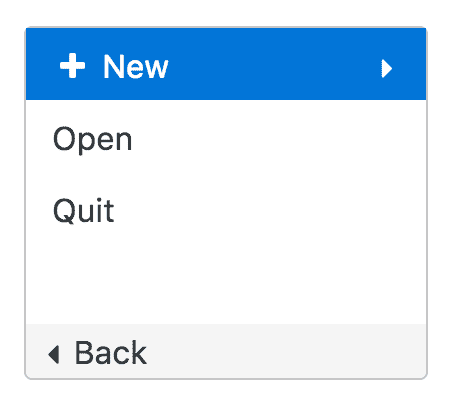

如前面的快照所示，幻灯片菜单以内联格式显示。通过启用`popup`属性，可以以弹出模式显示。在幻灯片菜单弹出窗口底部，会出现一个带有“返回”标签的返回按钮，但也可以使用`backLabel`属性进行自定义。

可以使用`toggle`、`show`和`hide`等 API 方法访问幻灯片菜单。幻灯片菜单提供各种动画效果，默认效果为`easing-out`。可以使用`effect`属性更改此默认行为。同样，幻灯片菜单的默认效果持续时间为 500 毫秒，但可以使用`effectDuration`属性进行自定义。

任何可视组件的尺寸都是非常重要的，必须进行配置。考虑到这一标准，菜单尺寸是可配置的。子菜单宽度通过`menuWidth`属性控制，默认为 180（通常以像素为单位）。同时，可滚动区域的高度通过`viewportHeight`属性控制，默认值为 175 像素（即，如果菜单高度超过此默认值，则会出现滚动条）。

完整的演示应用程序及说明可在 GitHub 上找到

[`github.com/ova2/angular-development-with-primeng/tree/master/chapter7/slidemenu`](https://github.com/ova2/angular-development-with-primeng/tree/master/chapter7/slidemenu).

# 分层菜单 - 嵌套叠加的子菜单

TieredMenu 组件以嵌套叠加模式显示子菜单。默认情况下，幻灯片菜单显示为内联菜单组件。一个基本的分层菜单示例，显示文档或文件类型菜单，如下所示：

```ts
<p-tieredMenu [model]="items"></p-tieredMenu>

```

菜单项列表需要在组件类中进行组织。例如，名为“文件”的根菜单项将具有如下嵌套项：

```ts
this.items = [
 {
   label: 'File',
   icon: 'fa-file-o',
   items: [
 {
   label: 'New',
   icon: 'fa-plus',
   items: [
   {label: 'Project'},
   {label: 'Other'},
 ]
 },
   {label: 'Open'},
   {label: 'Quit'}
 },
 // more items
]

```

以下截图显示了基本分层菜单示例的快照结果：

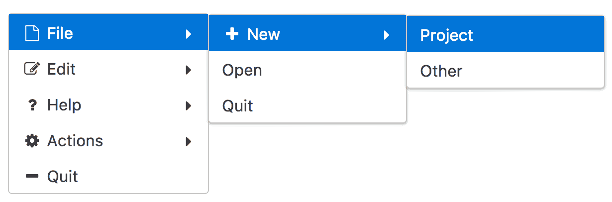

如前面的快照所示，滑动菜单以内联格式显示。通过启用`popup`属性，它将以弹出模式显示。PrimeNG 4.1 引入了`appendTo`属性以附加覆盖。可以使用 API 方法（如`toggle`、`show`和`hide`）访问滑动菜单。

滑动菜单和分层菜单组件之间的主要区别在于，滑动菜单通过替换父菜单显示子菜单，而分层菜单以覆盖模式显示子菜单。有关滑动菜单和分层菜单的 API 方法以及更详细的表格格式，请参阅菜单部分*表 2.0*。

完整的演示应用程序及说明可在 GitHub 上找到

[`github.com/ova2/angular-development-with-primeng/tree/master/chapter7/tieredmenu`](https://github.com/ova2/angular-development-with-primeng/tree/master/chapter7/tieredmenu)。

# MegaMenu - 多列菜单

MegaMenu 类似于一个下拉菜单，它展开成一个相对较大和复杂的界面，而不是一个简单的命令列表。它一起显示根项目的子菜单。MegaMenu 由嵌套菜单项组成，其中每个项目的根项目是定义覆盖菜单中列的二维数组。

一个零售商应用程序的基本 MegaMenu 示例，用于购买服装项目，将如下所示：

```ts
<p-megaMenu [model]="items"></p-megaMenu>

```

菜单项列表需要在组件类中进行组织。例如，名为“家居与家具”的根菜单项将具有如下嵌套项：

```ts
this.items = [
  {
    label: 'HOME & FURNITURE', icon: 'fa-home',
    items: [
    [
      {
        label: 'Home Furnishing',
        items: [{label: 'Cushions'}, {label: 'Throws'}, 
        {label: 'Rugs & Doormats'},
               {label: 'Curtains'}]
      },
     {
       label: 'Home Accessories',
       items: [{label: 'Artificial Flowers'}, {label: 'Lighting'}, 
               {label: 'Storage'}, {label: 'Photo Frames'}]
     }
   ],
   [
     {
       label: 'Cooking & Dinner',
       items: [{label: 'Cookware'}, {label: 'Dinnerware'}, 
       {label: 'Bakerware'}]
     },
     {
       label: 'Bed & Bath',
       items: [{label: 'Towels'}, {label: 'Bath Mats'}]
     }
   ]
   ]
  },
  // more items...
];

```

以下截图显示了基本 MegaMenu（带有所有菜单项）示例的快照结果：

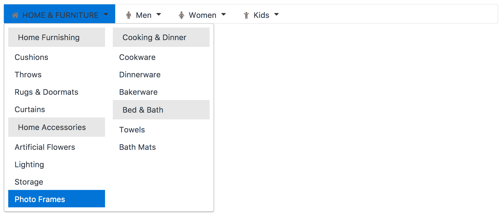

MegaMenu 的默认方向是水平的。也可以使用`orientation`属性（即`orientation="vertical"`）以垂直方式定位。垂直 MegaMenu 如下快照所示：

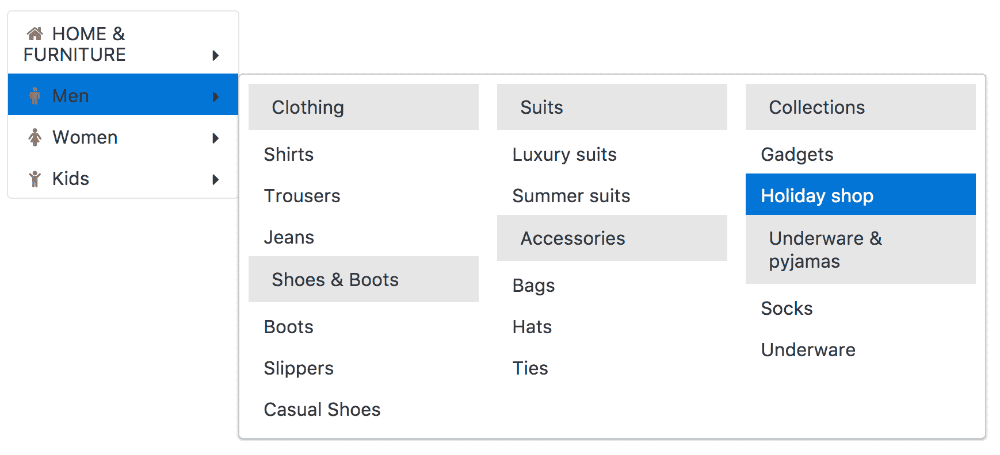

PrimeNG 4.1 允许通过将它们放置在 MegaMenu 标签内来使用自定义内容（表单控件）。

完整的演示应用程序及说明可在 GitHub 上找到

[`github.com/ova2/angular-development-with-primeng/tree/master/chapter7/megamenu`](https://github.com/ova2/angular-development-with-primeng/tree/master/chapter7/megamenu)。

# PanelMenu - 手风琴和树的混合体

PanelMenu 是垂直堆叠的手风琴和分层树组件的混合体。每个父菜单项都有一个可切换的面板；面板显示子菜单项以分层树格式显示。一个基本的面板菜单示例，显示文档或文件类型菜单，如下所示：

```ts
<p-panelMenu [model]="items" ></p-panelMenu>

```

菜单项列表需要在组件类中组织。例如，名为帮助的根菜单项将具有如下所示的嵌套项：

```ts
this.items = [
  {
 label: 'Help',
    icon: 'fa-question',
    items: [
           {label: 'Contents'},
           {label: 'Search', icon: 'fa-search',
             items: [{label: 'Text', items: [{label: 'Workspace'}]}, 
             {label: 'File'}]}
    ]
  },
  //more items ...
];

```

以下屏幕截图显示了基本面板菜单示例的快照结果：

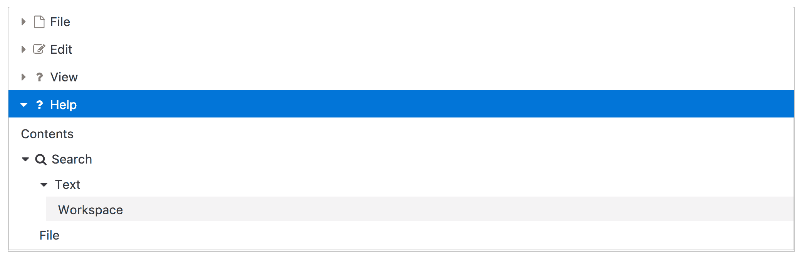

每个菜单项的初始状态通过`expanded`属性（即`expanded="true"`）进行控制，该属性在`MenuItem`接口级别上可用。

完整的演示应用程序及说明可在 GitHub 上找到

[`github.com/ova2/angular-development-with-primeng/tree/master/chapter7/panelmenu`](https://github.com/ova2/angular-development-with-primeng/tree/master/chapter7/panelmenu)。

# TabMenu - 菜单项作为选项卡

TabMenu 是一个导航/命令组件，它将项目显示为选项卡标题（即，父根项目以水平堆叠的选项卡形式表示）。单击每个选项卡时，可以执行各种菜单操作。

一个基本的选项卡菜单示例，以各种选项卡的形式显示 PrimeNG 网站信息，如下所示：

```ts
<p-tabMenu [model]="items"></p-tabMenu>

```

菜单项列表需要在组件类中组织。例如，使用菜单项如下，解释了 PrimeNG 的各种详细信息：

```ts
this.items = [
  {label: 'Overview', icon: 'fa-bar-chart', routerLink: 
  ['/pages/overview']},
  {label: 'Showcase', icon: 'fa-calendar', command: (event) => {
    this.msgs.length = 0;
    this.msgs.push({severity: 'info', summary: 'PrimeNG Showcase', 
    detail:'Navigate all components'});}
  },
  {label: 'Documentation', icon: 'fa-book', 
    url:'https://www.primefaces.org/documentation/'},
  {label: 'Downloads', icon: 'fa-download', routerLink: 
    ['/pages/downloads']},
  {label: 'Support', icon: 'fa-support', 
    url:'https://www.primefaces.org/support/'},
  {label: 'Social', icon: 'fa-twitter', 
    url:'https://twitter.com/prime_ng'},
  {label: 'License', icon: 'fa-twitter', 
    url:'https://www.primefaces.org/license/'}
];

```

以下屏幕截图显示了选项卡面板菜单示例的快照结果：

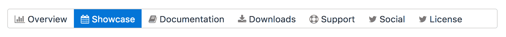

默认情况下，TabMenu 显示或激活第一个选项卡。但是，可以通过`activeItem`属性来更改选项卡的默认可见性或初始显示。

完整的演示应用程序及说明可在 GitHub 上找到

[`github.com/ova2/angular-development-with-primeng/tree/master/chapter7/tabmenu`](https://github.com/ova2/angular-development-with-primeng/tree/master/chapter7/tabmenu)。

# 面包屑 - 提供有关页面层次结构的上下文信息

面包屑组件提供有关页面层次结构的上下文信息。它允许您跟踪程序、文档和网站中的位置。这通常显示为水平的，位于网页顶部，由大于号(>)作为层次分隔符。这种菜单变体由一个常见的菜单模型 API 来定义其项目。这些菜单项（菜单项的集合）与`model`属性相连。

一个电子商务应用程序的基本面包屑示例，用于购买电器，如下所示：

```ts
<p-breadcrumb [model]="items"></p-breadcrumb>

```

项目的`model`属性是`MenuItem`类型的数组。`MenuModel` API 的可能选项或属性在本节的开头进行了描述。在这个例子中，我们为菜单项定义了标签和命令操作。菜单项的列表需要组织起来，以显示如下所示的项目：

```ts
this.items.push({
  label: 'Categories', command: (event) => {
    this.msgs.length = 0;
    this.msgs.push({severity: 'info', summary: event.item.label});
  }
});
this.items.push({
  label: 'Best Buy', command: (event) => {
    this.msgs.length = 0;
    this.msgs.push({severity: 'info', summary: event.item.label});
  }
});
this.items.push({
  label: 'TV & Video', command: (event) => {
    this.msgs.length = 0;
    this.msgs.push({severity: 'info', summary: event.item.label});
  }
});
this.items.push({
  label: 'TVs', command: (event) => {
    this.msgs.length = 0;
    this.msgs.push({severity: 'info', summary: event.item.label});
  }
});
this.items.push({
  label: 'Flat Panel TVs', command: (event) => {
    this.msgs.length = 0;
    this.msgs.push({severity: 'info', summary: event.item.label});
  }
});
this.items.push({label: 'LED Flat-Panel', url: 'https://en.wikipedia.org/wiki/LED_display'});

```

以下屏幕截图显示了基本面包屑的快照结果：

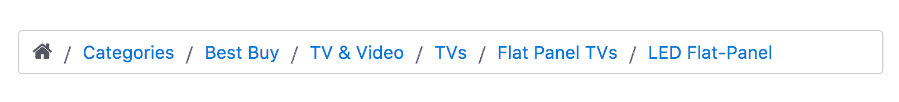

主页图标也是菜单项的一部分，可以使用`MenuItem`类型的`home`属性进行自定义。因此，所有菜单项的功能也适用于主页菜单项。`home`属性必须为面包屑组件定义如下：

```ts
<p-breadcrumb [model]="items" [home]="home"></p-breadcrumb>

```

组件类如下所示包含主页菜单项：

```ts
home: MenuItem;
 this.home = {
 label: 'Home',icon: 'fa-globe', command: (event) => {
    this.msgs.length = 0;
    this.msgs.push({severity: 'info', summary: "Home"});
  }
};

```

这是一个支持自定义图标属性的组件，可以从`MenuItem`中定义。

完整的演示应用程序及说明可在 GitHub 上找到

[`github.com/ova2/angular-development-with-primeng/tree/master/chapter7/breadcrumb`](https://github.com/ova2/angular-development-with-primeng/tree/master/chapter7/breadcrumb).

# 摘要

在本章结束时，您现在知道如何处理各种菜单组件，以及如何将它们放在页面上以满足特定的用例。首先，我们从 MenuModel API 开始创建一个项目数组，然后介绍了菜单组件作为基本组件，然后将 MenuBar 移动到具有嵌套复杂子菜单的 MegaMenu 组件，然后是其他菜单变体，如滑动菜单、分层菜单和面板菜单。

稍后，我们将转向上下文菜单和面包屑组件，作为另一种菜单操作。在下一章中，您将看到一个图表模型作为 API，以及如何为数据的可视表示创建出色的图表和地图。所有这些组件都是通过逐步方法解释的，包括所有可能的功能。
