# 第九章：杂项用例和最佳实践

杂项用例和最佳实践介绍了 PrimeNG 库的更多有趣功能。您将了解文件上传、拖放功能、显示图像集合、实际 CRUD 实现、推迟页面加载、阻止页面片段、显示带有受保护路由的确认对话框等。尽管组件集合全面，用户有时对现有组件的功能有特殊要求，或者需要新的自定义组件。

本章的目的也是专门为了在 PrimeNG 基础架构之上方便组件开发的开始。我们将经历构建可重用组件和开发自定义向导组件的完整过程。该向导可用于涉及多个步骤完成任务的工作流。此外，在阅读本章后，读者将了解 Angular 应用程序中的最新状态管理。

在本章中，我们将涵盖以下主题：

+   文件上传的全部功能

+   学习可拖放指令

+   使用 Galleria 显示图像集合

+   带有 DataTable 的 CRUD 示例实现

+   推迟机制以优化页面加载

+   在长时间运行的 AJAX 调用期间阻止页面片段

+   流程状态指示器的操作

+   使用 ColorPicker 选择颜色

+   显示带有受保护路由的确认对话框

+   使用步骤实现自定义向导组件

+   介绍使用@ngrx/store 进行状态管理

# 文件上传的全部功能

FileUpload 组件提供了一个文件上传机制，具有比基本的 HTML `<input type="file">`文件上传定义更强大的功能。该组件提供了一个基于 HTML5 的 UI，具有拖放、上传多个文件、进度跟踪、验证等功能。

文件上传组件在所有现代浏览器以及 IE 10 及更高版本中均可使用。

# 基本、多个和自动文件上传

为了能够使用文件上传，需要两个属性--用于在后端标识上传文件的请求参数的名称以及上传文件的远程 URL。例如：

```ts
<p-fileUpload name="demofiles[]" url="http://demoserver.com/upload">
</p-fileUpload>

```

该组件呈现为一个带有三个按钮的面板：Choose、Upload、Cancel，以及一个带有选定文件的内容部分。Choose 按钮显示一个文件对话框，用于选择一个或多个文件。一旦选择，文件可以通过下面的两个按钮上传或取消。默认情况下始终显示文件名和大小。此外，对于图像，您还将看到预览：

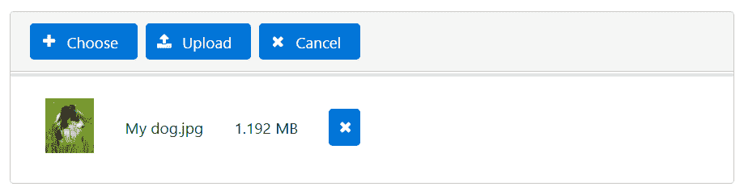预览图像的宽度可以通过`previewWidth`属性进行调整。

文件上传还提供了一个更简单的 UI，只有一个按钮 Choose，没有内容部分。您可以通过将`mode`属性设置为`"basic"`来激活此 UI：

```ts
<p-fileUpload mode="basic" name="demofiles[]"  
              url="http://demoserver.com/upload">
</p-fileUpload>

```

默认情况下，只能从文件对话框中选择一个文件。将`multiple`选项设置为`true`允许一次选择多个文件。将`auto`选项设置为`true`会立即开始上传，无需按任何按钮。在自动上传模式下，上传和取消按钮是隐藏的：

```ts
<p-fileUpload name="demofiles[]" url="http://demoserver.com/upload" 
              [multiple]="true" [auto]="true">
</p-fileUpload>

```

文件选择也可以通过从文件系统中拖动一个或多个文件并将它们放到 FileUpload 组件的内容部分来完成。

在撰写本文时，FileUpload 组件的后端无法使用 Angular 的模拟 API 进行模拟。在 GitHub 上的演示应用程序中，我们使用一个简单的本地服务器`json-server`（[`github.com/typicode/json-server`](https://github.com/typicode/json-server)）来伪造后端。否则，您将面临异常。安装后，可以使用以下命令启动服务器：

```ts
json-server db.json --port 3004

```

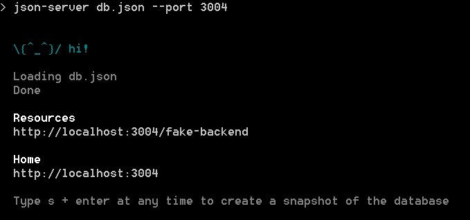

项目根目录中的`db.json`文件只有一个端点的定义：

```ts
{
  "fake-backend": {}
}

```

现在，您可以使用伪造的远程 URL 而不会出现任何异常：

```ts
<p-fileUpload name="demofiles[]" url="http://localhost:3004/
              fake-backend">
</p-fileUpload>

```

完整的演示应用程序及说明可在 GitHub 上找到

[`github.com/ova2/angular-development-with-primeng/tree/master/chapter9/fileupload`](https://github.com/ova2/angular-development-with-primeng/tree/master/chapter9/fileupload)。

# 文件类型和大小限制

默认情况下，可以上传任何文件类型。文件大小也没有限制。您可以通过分别设置`accept`和`maxFileSize`选项来限制文件类型和大小：

```ts
<p-fileUpload name="demofiles[]" url="http://localhost:3004/
              fake-backend" multiple="true" accept="image/*"     
              maxFileSize="50000">
</p-fileUpload>

```

在这个例子中，只有最大大小为`50000`字节的图像才能被上传。违反这些规则会导致验证消息出现在内容部分。

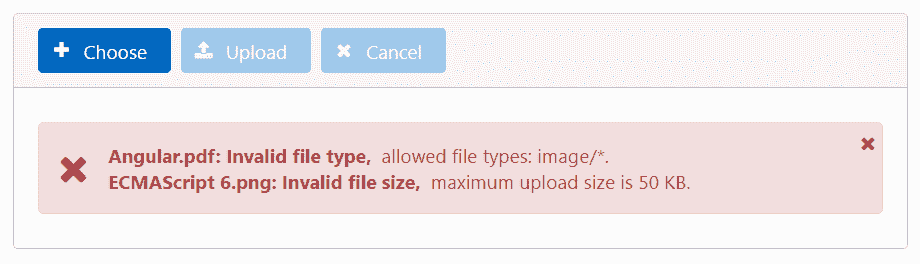

`accept`属性的可能值：

| **值** | **描述** |
| --- | --- |
| `<文件扩展名>` | 以点开头的文件扩展名，例如`.gif`、`.png`、`.doc`等。 |
| `audio/*` | 所有音频文件。 |
| `video/*` | 所有视频文件。 |
| `image/*` | 所有图像文件。 |
| `<媒体类型>` | 根据 IANA 媒体类型（[`www.iana.org/assignments/media-types/media-types.xhtml`](http://www.iana.org/assignments/media-types/media-types.xhtml)）的有效媒体类型。例如，`application/pdf`。 |

要指定多个值，请使用逗号分隔值，例如，`accept="audio/*,video/*,image/*"`。

# 自定义

验证消息可以使用以下四个选项进行自定义：

| **属性名称** | **描述** | **默认值** |
| --- | --- | --- |
| `invalidFileSizeMessageSummary` | 无效文件大小的摘要消息。占位符`{0}`指的是文件名。 | `{0}：无效文件大小，` |
| `invalidFileSizeMessageDetail` | 无效文件大小的详细消息。占位符`{0}`指的是文件大小。 | `最大上传大小为{0}。` |
| `invalidFileTypeMessageSummary` | 无效文件类型的摘要消息。占位符`{0}`指的是文件类型。 | `{0}：无效文件类型，` |
| `invalidFileTypeMessageDetail` | 无效文件类型的详细消息。占位符`{0}`指的是允许的文件类型。 | `允许的文件类型：{0}` |

下一个代码片段和屏幕截图演示了自定义消息。它们还展示了如何为按钮设置自定义标签：

```ts
<p-fileUpload name="demofiles[]" url="http://localhost:3004/
              fake-backend"
              multiple="true" accept="image/*" maxFileSize="50000"
              invalidFileSizeMessageSummary="{0} has wrong size, "
              invalidFileSizeMessageDetail="it exceeds {0}."
              invalidFileTypeMessageSummary="{0} has wrong file type, "
              invalidFileTypeMessageDetail="it doesn't match: {0}."
              chooseLabel="Select file"
              uploadLabel="Upload it!"
              cancelLabel="Abort">
</p-fileUpload>

```

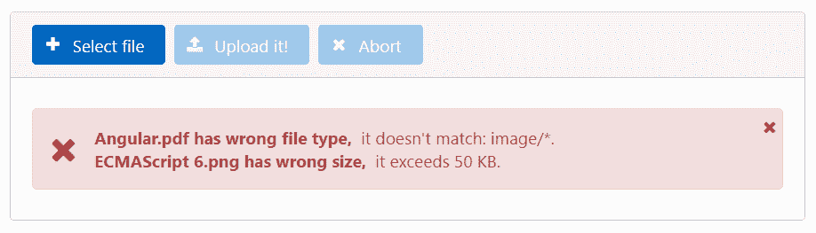

UI 可以通过三个命名的`ng-template`标签进行完全自定义。您可以自定义工具栏、内容部分和已选择文件的区域。下一个代码片段显示了一个完全可定制的 UI：

```ts
<p- name="demofiles[]" url="http://localhost:3004/fake-backend"
    multiple="true" accept=".pdf" maxFileSize="1000000">
  <ng-template pTemplate="toolbar">
    <div style="font-size: 0.9em; margin-top: 0.5em;">
      Please select your PDF documents
    </div>
  </ng-template>
  <ng-template let-file pTemplate="file">
    <div style="margin: 0.5em 0 0.5em 0;">
      <i class="fa fa-file-pdf-o" aria-hidden="true"></i>
      {{file.name}}
    </div>
  </ng-template>
  <ng-template pTemplate="content">
    <i class="fa fa-cloud-upload" aria-hidden="true"></i>
    Drag and drop files onto this area
  </ng-template>
</p-fileUpload>

```

屏幕截图显示了当没有选择文件时的初始 UI 状态：

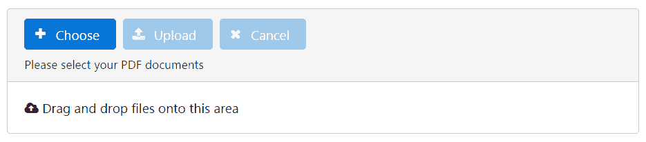

从文件对话框中选择后，UI 看起来如下：

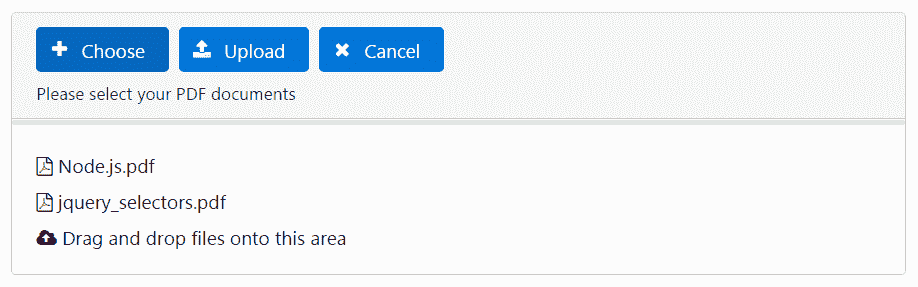

请注意，只能选择 PDF 文件。`ng-template`与`pTemplate="file"`一起使用时，会将`File`实例作为隐式变量。此实例具有`name`属性，我们在自定义 UI 中利用它。

请参阅官方文档，了解有关`File`的更多信息，网址为[`developer.mozilla.org/en-US/docs/Web/API/File`](https://developer.mozilla.org/en-US/docs/Web/API/File)。

下一级别的定制是回调事件，它们在特定时间点触发。有`onBeforeUpload`、`onBeforeSend`、`onUpload`、`onError`、`onClear`、`onSelect`和`uploadHandler`事件。下一个代码片段演示了其中两个：

```ts
<p-fileUpload name="demofiles[]" url="http://localhost:3004/
              fake-backend" accept="image/*" maxFileSize="1000000"
              (onBeforeSend)="onBeforeSend($event)" 
              (onUpload)="onUpload($event)">
</p-fileUpload>

```

`onBeforeUpload`事件在上传前不久触发。注册的回调会得到一个具有两个参数的事件对象：

+   `xhr`：`XMLHttpRequest`实例（[`developer.mozilla.org/en/docs/Web/API/XMLHttpRequest`](https://developer.mozilla.org/en/docs/Web/API/XMLHttpRequest)）。

+   `formData`：`FormData`对象（[`developer.mozilla.org/en/docs/Web/API/FormData`](https://developer.mozilla.org/en/docs/Web/API/FormData)）。

我们可以使用此回调来自定义请求数据，例如提交参数或标头信息。例如，我们可以设置一个令牌`jwt`并将其发送到服务器。只需在组件类中编写以下回调方法：

```ts
onBeforeSend(event: any) {
  (<XMLHttpRequest>event.xhr).setRequestHeader('jwt', 'xyz123');
}

```

你看，令牌已经发送了：

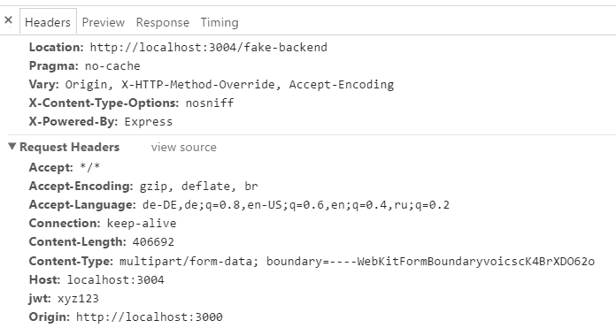

当所有选定的文件都上传完成时，将触发`onUpload`事件。传递的事件对象具有上述`XMLHttpRequest`实例和类型为`File`的对象数组。我们可以遍历文件并将它们收集在一起进行进一步处理：

```ts
uploadMsgs: Message[] = [];
uploadedFiles: any[] = [];

onUpload(event: any) {
  for (let file of event.files) {
    this.uploadedFiles.push(file);
  }

  // produce a message for growl notification
  this.uploadMsgs = [];
  this.uploadMsgs.push({severity: 'info', 
    summary: 'File Uploaded', detail: ''});
}

```

通过设置`customUpload="true"`并定义自定义上传处理程序，可以提供自定义上传实现。例如：

```ts
<p-fileUpload name="demofiles[]" customUpload="true"
              (uploadHandler)="smartUploader($event)">
</p-fileUpload>

```

如何实现`smartUploader`回调取决于您。回调可以访问`event.files`，这是一个类型为`File`的对象数组。

# 学习可拖动和可放置指令

拖放是一种动作，意味着抓取一个对象并将其放到不同的位置。能够被拖放的组件丰富了网络，并为现代 UI 模式打下了坚实的基础。PrimeNG 中的拖放实用程序允许我们高效地创建可拖放的用户界面。它们使开发人员在浏览器级别处理实现细节变得抽象。

在本节中，您将了解`pDraggable`和`pDroppable`指令。我们将介绍一个包含一些虚构文档的 DataGrid 组件，并使这些文档可拖动以便将它们放到回收站中。回收站实现为一个 DataTable 组件，显示放置文档的属性。为了更好地理解开发的代码，首先是一张图片：

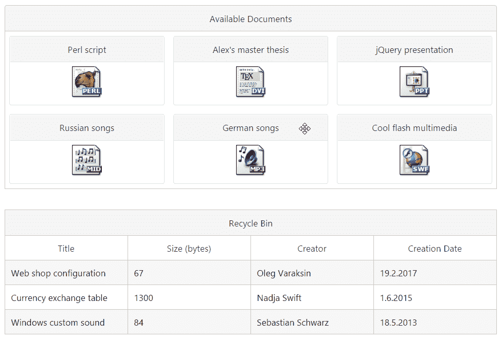

这张图片展示了拖放三个文档后发生的情况。

完整的演示应用程序及说明可在 GitHub 上找到

[`github.com/ova2/angular-development-with-primeng/tree/master/chapter9/dragdrop`](https://github.com/ova2/angular-development-with-primeng/tree/master/chapter9/dragdrop)。

# 可拖动

`pDraggable` 附加到一个元素上以添加拖动行为。`pDraggable` 属性的值是必需的，它定义了与可放置元素匹配的范围。默认情况下，整个元素都是可拖动的。我们可以通过应用 `dragHandle` 属性来限制可拖动的区域。`dragHandle` 的值可以是任何 CSS 选择器。在 DataGrid 中，我们只使面板的标题可拖动：

```ts
<p-dataGrid [value]="availableDocs">
  <p-header>
    Available Documents
  </p-header>
  <ng-template let-doc pTemplate="item">
    <div class="ui-g-12 ui-md-4" pDraggable="docs"
      dragHandle=".ui-panel-titlebar" dragEffect="move"
      (onDragStart)="dragStart($event, doc)" 
        (onDragEnd)="dragEnd($event)">
      <p-panel [header]="doc.title" [style]="{'text-align':'center'}">
        
      </p-panel>
    </div>
  </ng-template>
</p-dataGrid>

```

可拖动元素在拖动过程开始、进行和结束时可以触发三个事件，分别是 `onDragStart`、`onDrag` 和 `onDragEnd`。在组件类中，我们在拖动过程开始时缓冲被拖动的文档，并在结束时重置它。这个任务在两个回调函数中完成：`dragStart` 和 `dragEnd`。

```ts
class DragDropComponent {
  availableDocs: Document[];
  deletedDocs: Document[];
  draggedDoc: Document;

  constructor(private docService: DocumentService) { }

  ngOnInit() {
    this.deletedDocs = [];
    this.docService.getDocuments().subscribe((docs: Document[]) =>
      this.availableDocs = docs);
  }

  dragStart(event: any, doc: Document) {
    this.draggedDoc = doc;
  }

  dragEnd(event: any) {
    this.draggedDoc = null;
  }

  ...
}

```

在所示的代码中，我们使用了 `Document` 接口，具有以下属性：

```ts
interface Document {
  id: string;
  title: string;
  size: number;
  creator: string;
  creationDate: Date;
  extension: string;
}

```

在演示应用程序中，当鼠标移动到任何面板的标题上时，我们将光标设置为 `move`。这个技巧为可拖动区域提供了更好的视觉反馈：

```ts
body .ui-panel .ui-panel-titlebar {
  cursor: move;
}

```

我们还可以设置 `dragEffect` 属性来指定拖动操作允许的效果。可能的值有 `none`、`copy`、`move`、`link`、`copyMove`、`copyLink`、`linkMove` 和 `all`。请参考官方文档以获取更多细节：[`developer.mozilla.org/en-US/docs/Web/API/DataTransfer/effectAllowed`](https://developer.mozilla.org/en-US/docs/Web/API/DataTransfer/effectAllowed)。

# 可放置

`pDroppable` 附加到一个元素上以添加放置行为。`pDroppable` 属性的值应该与 `pDraggable` 的范围相同。

放置区域的范围也可以是一个数组，以接受多个可放置元素。

可放置元素可以触发四个事件：

| **事件名称** | **描述** |
| --- | --- |
| `onDragEnter` | 当可拖动元素进入放置区域时调用。 |
| `onDragOver` | 当可拖动元素被拖动到放置区域时调用。 |
| `onDrop` | 当可拖动元素放置到放置区域时调用。 |
| `onDragLeave` | 当可拖动元素离开放置区域时调用。 |

在演示应用程序中，可放置区域的整个代码如下所示：

```ts
<div pDroppable="docs" (onDrop)="drop($event)" 
     [ngClass]="{'dragged-doc': draggedDoc}">
  <p-dataTable [value]="deletedDocs">
    <p-header>Recycle Bin</p-header>
    <p-column field="title" header="Title"></p-column>
    <p-column field="size" header="Size (bytes)"></p-column>
    <p-column field="creator" header="Creator"></p-column>
    <p-column field="creationDate" header="Creation Date">
      <ng-template let-col let-doc="rowData" pTemplate="body">
        {{doc[col.field].toLocaleDateString()}}
      </ng-template>
    </p-column>
  </p-dataTable>
</div>

```

每当将文档拖放到回收站时，被放置的文档将从所有可用文档列表中移除，并添加到已删除文档列表中。这发生在`onDrop`回调中：

```ts
drop(event: any) {
  if (this.draggedDoc) {
    // add draggable element to the deleted documents list 
    this.deletedDocs = [...this.deletedDocs, this.draggedDoc];
    // remove draggable element from the available documents list
    this.availableDocs = this.availableDocs.filter(
      (e: Document) => e.id !== this.draggedDoc.id);
    this.draggedDoc = null;
  }
}

```

可用和已删除的文档都通过创建新数组来更新，而不是操作现有数组。这在数据迭代组件中是必要的，以强制 Angular 运行变更检测。操作现有数组不会运行变更检测，UI 将不会更新。

拖动任何带有文档的面板时，回收站区域会变成红色边框。我们通过将`ngClass`设置为`[ngClass]="{'dragged-doc': draggedDoc}"`来实现这种突出显示。当设置了`draggedDoc`对象时，样式类`dragged-doc`就会启用。样式类定义如下：

```ts
.dragged-doc {
  border: solid 2px red;
}

```

# 使用 Galleria 显示图像集合

Galleria 组件可用于显示具有过渡效果的图像集合。

# 让它运行起来

图像集合是以编程方式创建的--它是一个具有以下三个属性的对象数组：

+   `source`：图片的路径

+   `title`：标题部分的标题文本

+   `alt`：标题下方的描述

让我们创建一个`GalleriaComponent`类：

```ts
class GalleriaComponent {
  images: any[];

  ngOnInit() {
    this.images = [];

    this.images.push({
      source: '/assets/data/images/cars/Yeni.png',
      alt: 'This is a first car',
      title: 'Yeni Vollkswagen CC'
    });
    this.images.push({
      source: '/assets/data/images/cars/Golf.png',
      alt: 'This is a second car',
      title: 'Golf'
    });

    ... // more image definitions
  }
}

```

在 HTML 代码中，集合通过输入属性`images`进行引用：

```ts
<p-galleria [images]="images" panelWidth="400" panelHeight="320"
            [autoPlay]="false" [showCaption]="true">
</p-galleria>

```

开发的 UI 如下所示：


内容面板的宽度和高度可以通过`panelWidth`和`panelHeight`属性进行自定义。`showCaption`属性可以启用在标题部分显示标题和描述。

底部有一个名为**filmstrip**的小图像区域。通过`showFilmstrip`属性，默认情况下启用 filmstrip 的可见性。您可以通过将属性设置为`false`来禁用它。在 filmstrip 中可视化的帧的宽度和高度分别可以通过`frameWidth`和`frameHeight`属性进行自定义。所有值应以像素为单位提供。

还有`activeIndex`属性，可用于设置显示图像的位置。例如，如果您想在初始页面加载时显示第二张图像，可以设置`activeIndex="1"`。默认值为`0`。

# 自动播放模式和效果

自动播放模式可以打开幻灯片放映。自动播放模式默认情况下是启用的。在示例中，我们通过设置`[autoPlay]="false"`来禁用幻灯片放映。自动播放模式中图像之间的过渡在`4000`毫秒内完成。可以使用`transitionInterval`属性自定义此时间间隔。

在遍历图像时，可以应用过渡效果。`effect`属性可以取`blind`、`bounce`、`clip`、`drop`、`explode`、`fade`（默认值）、`fold`、`highlight`、`puff`、`pulsate`、`scale`、`shake`、`size`、`slide`和`transfer`这些值。`effectDuration`属性也可以用于决定过渡的持续时间。其默认值为`250`毫秒：

```ts
<p-galleria [images]="images" panelWidth="400" panelHeight="320"
            effect="bounce" [effectDuration]="150">
</p-galleria>

```

# 事件

只有一个事件`onImageClicked`，当点击显示的图像时触发：

```ts
<p-galleria [images]="images" panelWidth="400" panelHeight="220"
            [autoPlay]="false" [showCaption]="true"
            (onImageClicked)="onImageClicked($event)">
</p-galleria>

```

调用的回调会得到一个事件对象。除了点击图像的索引和原生点击事件之外，传入的事件对象还保留了集合中的整个图像实例。我们可以在回调中访问源 URL 并在新的浏览器标签中打开图像：

```ts
onImageClicked($event: any) {
  window.open($event.image.source, '_blank');
}

```

带有说明的完整演示应用程序可在 GitHub 上找到

[`github.com/ova2/angular-development-with-primeng/tree/master/chapter9/galleria`](https://github.com/ova2/angular-development-with-primeng/tree/master/chapter9/galleria)。

# 带有 DataTable 的 CRUD 示例实现

PrimeNG 是为企业应用程序创建的。实现**CRUD**（**创建、读取、更新**和**删除**）场景很容易。本节中的示例演示了使用作为域模型对象的员工的这种场景。可以获取、创建、更新和删除员工。所有 CRUD 操作都是通过 Angular 的 HTTP 服务进行的，该服务与模拟后端进行通信。我们将在本节的*使用@ngrx/store 进行状态管理介绍*中改进我们的 CRUD 实现。

使用以下接口定义了域模型对象`Employee`：

```ts
export interface Employee {
  id: string;
  firstName: string;
  lastName: string;
  profession: string;
  department: string;
}

```

模拟后端在此处未显示，因为它超出了本书的范围。

带有说明的完整演示应用程序可在 GitHub 上找到

[`github.com/ova2/angular-development-with-primeng/tree/master/chapter9/crud-datatable`](https://github.com/ova2/angular-development-with-primeng/tree/master/chapter9/crud-datatable)。

`EmployeeService`类具有 CRUD 操作，值得在这里列出。它公开了四种方法，返回值为`Observable`，以便组件类可以调用`subscribe()`来接收传递的数据：

```ts
@Injectable()
export class EmployeeService { 
  private static handleError(error: Response | any) {
    // error handling is done as recommended 
    //in the official Angular documentation
    // https://angular.io/docs/ts/latest/guide/server-
    //communication.html#!#always-handle-errors
    ...
  }

  constructor(private http: Http) { }

  getEmployees(): Observable<Employee[]> {
    return this.http.get('/fake-backend/employees')
      .map(response => response.json() as Employee[])
      .catch(EmployeeService.handleError);
  }

  createEmployee(employee: Employee): Observable<Employee> {
    return this.http.post('/fake-backend/employees', employee)
      .map(response => response.json() as Employee)
      .catch(EmployeeService.handleError);
  }

  updateEmployee(employee: Employee): Observable<any> {
    return this.http.put('/fake-backend/employees', employee)
      .map(response => response.json())
      .catch(EmployeeService.handleError);
  }

  deleteEmployee(id: string): Observable<any> {
    return this.http.delete('/fake-backend/employees/' + id)
      .map(response => response.json())
      .catch(EmployeeService.handleError);
  }
}

```

当从后端获取员工时，员工将显示在 DataTable 中：

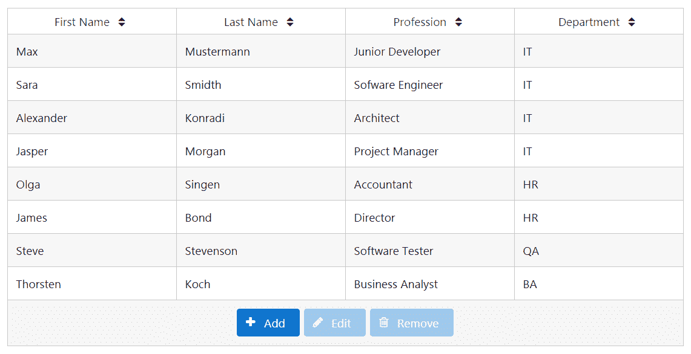

如您所见，当没有选择员工时，只有添加按钮是启用的。添加和编辑按钮触发显示员工个人数据的对话框。保存按钮根据之前选择的是添加还是编辑按钮，创建新员工或更新现有员工。

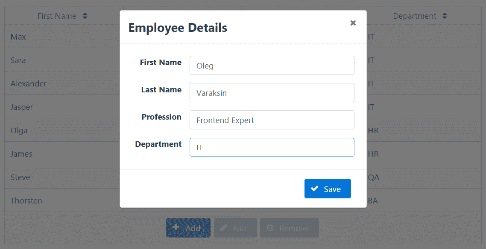

按钮触发的操作会淡入相应的消息：

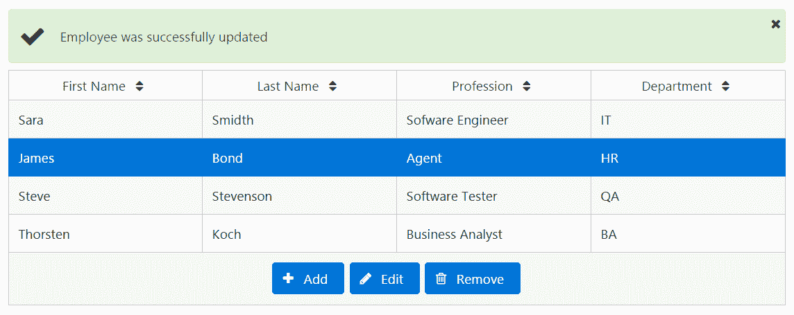

表格是使用`p-dataTable`实现的，如下所示：

```ts
<p-dataTable [value]="employees" selectionMode="single"  
             [(selection)]="selectedEmployee"  
             [paginator]="true" rows="15" 
             [responsive]="true" 
             [alwaysShowPaginator]="false">
  <p-column field="firstName" header="First Name" [sortable]="true">
  </p-column>
  <p-column field="lastName" header="Last Name" [sortable]="true">
  </p-column>
  <p-column field="profession" header="Profession" [sortable]="true">
  </p-column>
  <p-column field="department" header="Department" [sortable]="true">
  </p-column>
  <p-footer>
    <button pButton type="button" label="Add" icon="fa-plus" 
      (click)="add()"> </button>
    <button pButton type="button" label="Edit" icon="fa-pencil" 
      (click)="edit()" [disabled]="!selectedEmployee"></button>
    <button pButton type="button" label="Remove" icon="fa-trash-o" 
    (click)="remove()" [disabled]="!selectedEmployee"></button>
  </p-footer>
</p-dataTable>

```

`p-dataTable`的值绑定到数组属性`employees`。通过点击行选择员工，并保存在`selectedEmployee`属性中。当`selectedEmployee`未设置时，编辑和删除按钮将被禁用。为了简洁起见，我们将跳过对话框的代码。最有趣的部分是组件类。员工是通过`EmployeeService`在`ngOnInit()`生命周期回调中获取的：

```ts
export class DataTableCrudComponent implements OnInit, 
  OnDestroy {
  employees: Employee[];
 selectedEmployee: Employee;
 employeeForDialog: Employee;
 displayDialog: boolean;
 msgs: Message[] = [];

 get$: Subscription;
 add$: Subscription;
 edit$: Subscription;
 delete$: Subscription;

 constructor(private employeeService: EmployeeService) { }

 ngOnInit(): void {
 this.get$ = this.employeeService.getEmployees().subscribe(
      employees => this.employees = employees,
      error => this.showError(error)
    );
  }

 ngOnDestroy() {
 this.get$.unsubscribe();
    this.add$.unsubscribe();
    this.edit$.unsubscribe();
    this.delete$.unsubscribe();
  }

  ...

  private showError(errMsg: string) {
    this.msgs = [];
    this.msgs.push({severity: 'error', 
                    summary: 'Sorry, an error occurred', 
                    detail: errMsg});
  }

  private showSuccess(successMsg: string) {
    this.msgs = [];
    this.msgs.push({severity: 'success', detail: successMsg});
  }
}

```

让我们详细探讨其他 CRUD 方法。`add()`方法构建一个空的员工实例，`edit()`方法克隆所选的员工。两者都在对话框中使用。属性`displayDialog`设置为`true`，强制显示对话框。

该属性在视图中绑定到对话框的可见性，如下所示`[(visible)]="displayDialog"`。

```ts
add() {
  // create an empty employee
  this.employeeForDialog = {
    id: null, firstName: null, lastName: null, profession: null,
    department: null
  }; 
  this.displayDialog = true;
}

edit() {
  // create a clone of the selected employee
  this.employeeForDialog = Object.assign({}, this.selectedEmployee);
  this.displayDialog = true;
}

```

对话框中的保存按钮调用`save()`方法，其中我们通过`id`来检查员工是否存在。只有之前保存过的员工才包含`id`，因为`id`是在后端分配的。现有员工应该被更新，新员工应该被创建：

```ts
save() {
  if (this.employeeForDialog.id) {
    // update
    this.edit$ = 
      this.employeeService.updateEmployee(this.employeeForDialog)
      .finally(() => {
        this.employeeForDialog = null;
        this.displayDialog = false;
      })
      .subscribe(() => {
          this.employees.some((element: Employee, index: number) => {
            if (element.id === this.employeeForDialog.id) {
              this.employees[index] = Object.assign({}, 
              this.employeeForDialog);
              this.employees = [...this.employees];
              this.selectedEmployee = this.employees[index];
              return true;
            }
          });
          this.showSuccess('Employee was successfully updated');
        },
        error => this.showError(error)
      );
  } else {
    // create
    this.add$ = 
      this.employeeService.createEmployee(this.employeeForDialog)
      .finally(() => {
        this.employeeForDialog = null;
        this.selectedEmployee = null;
        this.displayDialog = false;
      })
      .subscribe((employee: Employee) => {
          this.employees = [...this.employees, employee];
          this.showSuccess('Employee was successfully created');
        },
        error => this.showError(error)
      );
  }
}

```

员工将在后端和`employees`数组中更新或创建：

如您所见，创建了`employees`数组的新实例，而不是操作现有的数组。这在数据迭代组件中是必要的，以强制 Angular 运行变更检测。操作现有数组中的元素不会更新数组的引用。结果，变更检测不会运行，UI 也不会更新。

注意，`Observable`提供了一个`finally`方法，我们可以在其中重置属性的值。

作为参数传递给`finally`方法的函数在源可观察序列正常或异常终止后被调用。

`remove()`方法由删除按钮调用：

```ts
remove() {
  this.delete$ = 
  this.employeeService.deleteEmployee(this.selectedEmployee.id)
    .finally(() => {
      this.employeeForDialog = null;
      this.selectedEmployee = null;
    })
    .subscribe(() => {
        this.employees = this.employees.filter(
          (element: Employee) => element.id !== 
          this.selectedEmployee.id);
        this.showSuccess('Employee was successfully removed');
      },
      error => this.showError(error)
    );
}

```

序列逻辑与其他 CRUD 操作类似。

# 推迟机制以优化页面加载

大型应用程序总是需要最佳实践来提高页面加载时间。不建议等到所有页面内容完全加载后再显示登陆页面。PrimeNG 提供了一个 defer 指令，可以推迟内容加载直到组件出现在视口中。当页面滚动时，内容将在变得可见时懒加载。

`pDefer`指令应用于容器元素，内容需要用`ng-template`指令包装如下：

```ts
<div pDefer (onLoad)="loadData()">
  <ng-template>
    deferred content
  </ng-template>
</div>

```

当您使用数据迭代组件（如`p-dataTable`，`p-dataList`，`p-dataGrid`等）时，defer 指令非常有助于延迟加载大型数据集。`onLoad`回调用于在组件通过页面滚动变得可见时按需从数据源查询数据。查询不会在页面加载时启动，因此页面加载速度很快。这里实现了一个具体的例子：

```ts
<div pDefer (onLoad)="loadData()">
  <ng-template>
    <p-dataTable [value]="employees">
      <p-column field="firstName" header="First Name"></p-column>
      <p-column field="lastName" header="Last Name"></p-column>
      <p-column field="profession" header="Profession"></p-column>
      <p-column field="department" header="Department"></p-column>
    </p-dataTable>
  </ng-template>
</div>

```

`loadData()`方法获取员工信息：

```ts
loadData(): void {
  this.employeeService.getEmployees().subscribe(
    employees => this.employees = employees,
    error => this.showError(error)
  );
}

```

# 在长时间运行的 AJAX 调用期间阻止页面片段

BlockUI 组件允许我们阻止页面的任何部分，例如在 AJAX 调用期间。BlockUI 组件在目标元素上添加一个层，并提供阻止用户交互的外观和行为。如果您有一个大型的 DataTable 组件，并且 CRUD 操作需要很长时间，这将非常方便。您几乎可以阻止一切事物--甚至整个页面。在本节中，我们将演示如何处理 BlockUI。

BlockUI 组件阻止一个可阻止的*目标*组件。`target`属性指向这样一个目标组件的模板引用变量。BlockUI 的可见性由布尔属性`blocked`控制。例如，以下 BlockUI 在属性`blocked`设置为`true`时阻止 Panel 组件，并在其他情况下解除阻止：

```ts
<p-blockUI [blocked]="blocked" [target]="pnl">
  // any custom content or empty
</p-blockUI>

<p-panel #pnl header="Panel Header">
  Content of Panel
</p-panel>

```

`target`的默认值是`document`对象。这意味着，如果没有提供`target`，整个页面都会被阻塞。正如你所看到的，可以在`p-blockUI`标签中放置任何自定义内容。自定义内容会显示在半透明层上。

我们将利用上一节中的 CRUD 示例来演示 BlockUI 组件的工作原理。为了简洁起见，只有两个按钮可用--一个是重新加载按钮，用于执行数据获取，另一个是删除按钮。

让我们指定阻塞方式--重新加载按钮应该阻塞整个页面，删除按钮应该只阻塞表格。此外，我们希望显示一个加载指示器和文本 Loading...，如图所示：

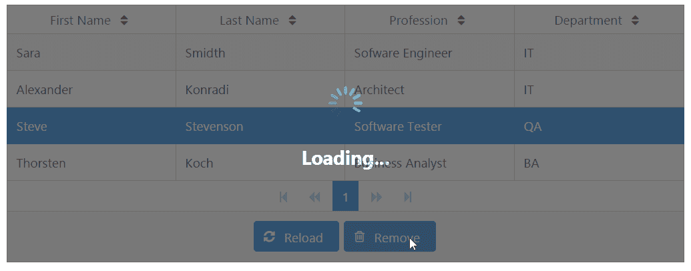

这些验收标准导致了两个 BlockUI 组件：

```ts
<p-dataTable ... #dtable>
  ...
</p-dataTable>

<p-blockUI [blocked]="blockedTable" [target]="dtable">
  <div class="center">
    <div class="box">
      <div class="content">
        
        <h1>Loading...</h1>
      </div>
    </div>
  </div>
</p-blockUI>

<p-blockUI [blocked]="blockedPage">
  <div class="center">
    <div class="box">
      <div class="content">
        
        <h1>Loading...</h1>
      </div>
    </div>
  </div>
</p-blockUI>

```

`blockedTable`和`blockedPage`属性在按钮点击时立即设置为`true`。CRUD 操作完成后，这些属性设置为`false`。这种方法在下面的代码块中概述：

```ts
export class DataTableCrudComponent {
  ...
  selectedEmployee: Employee;
  blockedTable: boolean;
  blockedPage: boolean;

  reload() {
    this.blockedPage = true;
    this.employeeService.getEmployees()
      .finally(() => {this.blockedPage = false;})
      .subscribe(...);
  }

  remove() {
    this.blockedTable = true;
    this.employeeService.deleteEmployee(this.selectedEmployee.id)
      .finally(() => {this.blockedTable = false; 
        this.selectedEmployee = null;})
      .subscribe(...);
    }
}

```

被阻塞组件上的半透明层可以按以下方式自定义：

`.ui-blockui.ui-widget-overlay {opacity: 0.5;}`完整的演示应用程序及说明可在 GitHub 上找到

[`github.com/ova2/angular-development-with-primeng/tree/master/chapter9/blockui`](https://github.com/ova2/angular-development-with-primeng/tree/master/chapter9/blockui).

# 进程状态指示器在工作中

ProgressBar 组件指示某个过程、任务或其他内容的状态。它可以处理静态值和动态值。动态值是随时间变化的值。下面的代码片段演示了两个进度条，一个是静态值，一个是动态值：

```ts
<p-growl [value]="msgs"></p-growl>

<h3>Static value</h3>
<p-progressBar [value]="40"></p-progressBar>

<h3>Dynamic value</h3>
<p-progressBar [value]="value"></p-progressBar>

```

动态值每 800 毫秒从 1 到 100 产生，使用`Observable`方法如下：

```ts
export class ProgressBarComponent implements OnInit, OnDestroy {
  msgs: Message[];
  value: number;
  interval$: Subscription;

  ngOnInit() {
    const interval = Observable.interval(800).take(100);
    this.interval$ = interval.subscribe(
      x => this.value = x + 1,
      () => {/** no error handling */ },
      () => this.msgs = [{severity: 'info', summary: 'Success', 
        detail: 'Process completed'}]
    );
  }

  ngOnDestroy() {
    this.interval$.unsubscribe();
  }
}

```

最后，将显示一个带有文本 Process completed 的 growl 消息。快照图片如下所示：

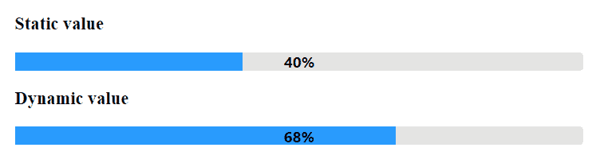完整的演示应用程序及说明可在 GitHub 上找到

[`github.com/ova2/angular-development-with-primeng/tree/master/chapter9/progressbar`](https://github.com/ova2/angular-development-with-primeng/tree/master/chapter9/progressbar).

# 使用 ColorPicker 选择颜色

ColorPicker 是一个用于从二维方框中选择颜色的图形用户界面输入小部件。该组件使用`ngModel`指令进行双向值绑定。基本上，它支持三种颜色格式，如十六进制、RGB 和 HSB，其中十六进制是默认类型。颜色格式用`format`属性表示，例如，`format="rgb"`。ColorPicker 是一个可编辑的组件，也可以在模型驱动的表单中使用。一个基本的例子如下：

```ts
<p-colorPicker [(ngModel)]="color1"></p-colorPicker>

```

组件必须为默认十六进制值定义`string`类型的颜色属性，而颜色属性应该是对象类型，用于 RGB 和 HSB 格式，如下所示：

```ts
color1: string;
color2: any = {r: 100, g: 120, b: 140};
color3: any = {h: 80, s: 50, b: 40};

```

颜色选择器将显示所选颜色如下：

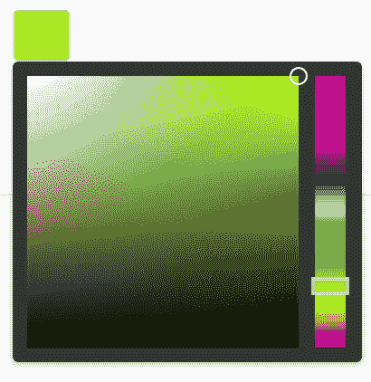

默认情况下，颜色选择器以覆盖格式显示，但可以使用`inline`属性更改此默认行为，通过启用内联设置，可以启用内联格式。内联格式的颜色选择器组件将如下所示：

```ts
<p-colorPicker [(ngModel)]="color3" inline="true"
 (onChange)="change($event)"></p-colorPicker>

```

此组件还支持带有`event`对象作为参数的`onChange`回调。`event`对象保存浏览器事件和所选颜色值，以通知更改如下：

```ts
change(event){
    this.msgs = [];
    this.msgs.push({severity: 'success', 
 summary: 'The color is changed from ColorPicker',
 detail: 'The selected color is ' + event.value});
}

```

像其他输入组件一样，ColorPicker 支持模型驱动的表单，禁用属性以禁用用户交互，等等。

完整的演示应用程序及说明可在 GitHub 上找到[`github.com/ova2/angular-development-with-primeng/tree/master/chapter9/colorpicker`](https://github.com/ova2/angular-development-with-primeng/tree/master/chapter9/colorpicker)。

# 显示带有受保护路由的确认对话框

在 Angular 2+中，您可以使用守卫保护路由。最常用的守卫类型是`CanActivate`和`CanDeactivate`。第一个守卫类型决定是否可以激活路由，第二个守卫类型决定是否可以停用路由。在本节中，我们将讨论`CanDeactivate`。这是一个只有一个方法`canDeactivate`的接口。

```ts
export interface CanDeactivate<T> {
  canDeactivate(component: T, route: ActivatedRouteSnapshot,                 
    state: RouterStateSnapshot):
    Observable<boolean> | Promise<boolean> | boolean;
}

```

此方法可以返回`Observable<boolean>`，`Promise<boolean>`或`boolean`。如果`boolean`的值为`true`，用户可以从路由中导航离开。如果`boolean`的值为`false`，用户将保持在相同的视图上。如果您想在某些情况下阻止路由导航离开，您必须执行三个步骤：

1.  创建一个实现`CanDeactivate`接口的类。该类充当守卫，当从当前视图导航离开时，路由器将对其进行检查。正如你所看到的，该接口期望一个通用组件类。这是当前在`<router-outlet>`标签中呈现的组件。

1.  在使用`@NgModule`注释的模块中将此守卫注册为提供者。

1.  将此守卫添加到路由器配置中。路由器配置具有`canDeactivate`属性，可以在其中多次添加此类守卫。

您可能想查看官方 Angular 文档中的示例

[`angular.io/docs/ts/latest/api/router/index/CanDeactivate-interface.html`](https://angular.io/docs/ts/latest/api/router/index/CanDeactivate-interface.html)。

在本书中，我们想要实现一个典型的用例，即检查用户是否有一些未保存的输入更改。如果当前视图具有未保存的输入值，并且用户试图导航到另一个视图，应该显示一个确认对话框。我们将使用 PrimeNG 的 ConfirmDialog：

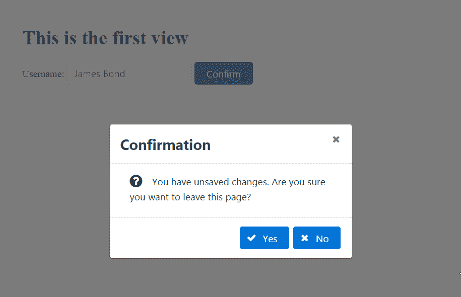

现在，点击“是”按钮会导航到另一个视图：


点击“否”按钮会阻止从当前路由导航的过程。让我们创建第一个视图，其中包含一个`input`元素，一个`submit`按钮和`<p-confirmDialog>`组件：

```ts
<h1>This is the first view</h1>

<form novalidate (ngSubmit)="onSubmit(f)" #f="ngForm">
  <label for="username">Username:</label>
  <input id="username" name="username" type="text" 
    pInputText [(ngModel)]="username"/>
  <button type="submit" pButton label="Confirm"></button>
</form>

<p-confirmDialog header="Confirmation" icon="fa fa-question-circle" 
  width="400">
</p-confirmDialog>

```

该模板对应的组件保持表单的`dirty`状态，表示表单正在被编辑：

```ts
export class FirstViewComponent {
  dirty: boolean;
  username: string;

  constructor(private router: Router) { }

  onSubmit(f: FormGroup) {
    this.dirty = f.dirty;
    this.router.navigate(['/chapter9/second-view']);
  }
}

```

我们不会实现任何复杂的算法来检查输入值是否真的已更改。我们只检查表单的`dirty`状态。如果表单没有被编辑，提交时导航应该没问题。无需询问用户有关未保存的更改。现在，我们必须将 PrimeNG 的`ConfirmationService`注入到我们的守卫实现中，这是显示确认对话框所必需的，并在`canDeactivate`方法中像这样使用它：

```ts
this.confirmationService.confirm({
  message: 'You have unsaved changes. 
  Are you sure you want to leave this page?',
  accept: () => {
    // logic to perform a confirmation
  },
  reject: () => {
    // logic to cancel a confirmation
  }
});

```

但是有一个问题。`confirm`方法没有返回所需的`Observable<boolean>`、`Promise<boolean>`或`boolean`。解决方案是通过调用`Observable.create()`创建并返回一个`Observable`对象。`create`方法期望一个带有一个参数`observer: Observer<boolean>`的回调。现在我们需要执行两个步骤：

+   将调用`this.confirmationService.confirm()`放入回调函数体中。

+   通过调用`observer.next(true)`和`observer.next(false)`将`true`或`false`传递给订阅者。订阅者是 PrimeNG 的组件`ConfirmDialog`，需要被告知用户的选择。

下面显示了`UnsavedChangesGuard`的完整实现：

```ts
@Injectable()
export class UnsavedChangesGuard implements 
  CanDeactivate<FirstViewComponent> {

  constructor(private confirmationService: ConfirmationService) { }

  canDeactivate(component: FirstViewComponent) {
    // Allow navigation if the form is unchanged
    if (!component.dirty) { return true; }

    return Observable.create((observer: Observer<boolean>) => {
      this.confirmationService.confirm({
        message: 'You have unsaved changes. 
        Are you sure you want to leave this page?',
        accept: () => {
          observer.next(true);
          observer.complete();
        },
        reject: () => {
          observer.next(false);
          observer.complete();
        }
      });
    });
  }
}

```

正如我们已经说过的，该守卫已在路由配置中注册：

```ts
{path: 'chapter9/first-view', component: FirstViewComponent, 
  canDeactivate: [UnsavedChangesGuard]}

```

如果您更喜欢`Promise`而不是`Observable`，可以返回`Promise`如下：

```ts
return new Promise((resolve, reject) => {
  this.confirmationService.confirm({
    message: "You have unsaved changes. 
    Are you sure you want to leave this page?",
    accept: () => {
      resolve(true);
    },
    reject: () => {
      resolve(false);
    }
  });
});

```

完整的演示应用程序及说明可在 GitHub 上找到

[`github.com/ova2/angular-development-with-primeng/tree/master/chapter9/guarded-routes`](https://github.com/ova2/angular-development-with-primeng/tree/master/chapter9/guarded-routes)。

# 使用 Steps 实现自定义向导组件

PrimeNG 有一个名为 Steps 的组件，用于指示工作流程中的步骤。使用方法很简单：

```ts
<p-steps [model]="items" [(activeIndex)]="activeIndex"></p-steps>

```

`model`是`MenuItem`类型的对象集合，我们在第七章中遇到过，*无尽菜单变化*。属性`activeIndex`指向项目集合中活动项目（步骤）的索引。默认值为`0`，表示默认选择第一个项目。我们还可以通过设置`[readonly]="false"`使项目可点击。

请参考 PrimeNG 展示以查看步骤的操作：

[`www.primefaces.org/primeng/#/steps`](https://www.primefaces.org/primeng/#/steps)

基于`<p-steps>`，我们将使用两个自定义组件`<pe-steps>`和`<pe-step>`来实现类似向导的行为。前缀`pe`应该提示"PrimeNG 扩展"。组件`<pe-steps>`作为多个步骤的容器。基本结构：

```ts
<pe-steps [(activeIndex)]="activeIndex" (change)="onChange($event)">
  <pe-step label="First Step">
    // content of the first step
  </pe-step> 
  <pe-step label="Second Step">
    // content of the second step
  </pe-step> 
  <pe-step label="Third Step">
    // content of the third step
  </pe-step>
</pe-steps>

```

我们可以将这个结构理解为向导。在向导步骤之间的导航通过点击面包屑项目（可点击的步骤）、导航按钮或通过编程设置步骤索引（`activeIndex`）来实现。下一张截图显示了向导和导航的样子：

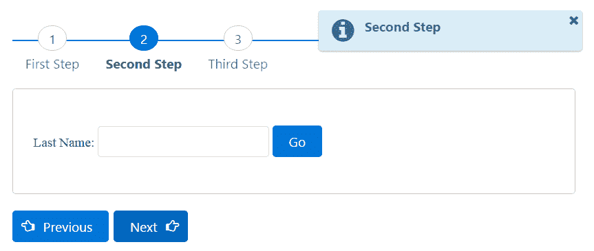

在开始实施之前，让我们先指定 API。`<pe-step>`组件具有以下内容：

**属性**：

| **名称** | **类型** | **默认值** | **描述** |
| --- | --- | --- | --- |
| `styleClass` | `string` | `null` | 单个 Step 组件的样式类 |
| `label` | `string` | `null` | 显示此 Step 的标签 |

**样式**：

| **名称** | **元素** |
| --- | --- |
| `pe-step-container` | 单个 Step 组件的容器元素 |

`<pe-steps>`组件具有：

**属性**：

| **名称** | **类型** | **默认值** | **描述** |
| --- | --- | --- | --- |
| `activeIndex` | `number` | `0` | 活动步骤的索引（双向绑定） |
| - `styleClass` | `string` | `null` | 向导容器元素的样式类 |
| - `stepClass` | `string` | `null` | 每个步骤组件的样式类 |

**事件**：

| **名称** | **参数** | **描述** |
| --- | --- | --- |
| `change` | `label`：当前显示步骤的标签 | 切换步骤时调用的回调函数 |

具有这些知识，我们可以实现`StepComponent`和`StepsComponent`。第一个在模板中有`ng-content`，以便放置自定义内容。组件类有两个指定的输入。此外，还有一个`active`属性，指示当前是否显示该步骤：

```ts
@Component({
  selector: 'pe-step',
  styles: ['.pe-step-container {padding: 45px 25px 45px 25px; 
           margin-bottom: 20px;}'],
  template: `
    <div *ngIf="active" [ngClass]="'ui-widget-content ui-corner-all
         pe-step-container'" [class]="styleClass">
      <ng-content></ng-content>
    </div>
  `
})
export class StepComponent {
  @Input() styleClass: string;
  @Input() label: string;
  active: boolean = false;
}

```

第二个组件更复杂。它遍历类型为`StepComponent`的子组件，并在生命周期方法`ngAfterContentInit()`中创建项目。如果子组件的`active`属性与`activeIndex`匹配，则将其设置为`true`。否则，将其设置为`false`。这允许在工作流程中显示一个步骤。完整的清单将超出本书的篇幅。我们只会展示一部分：

```ts
@Component({
  selector: 'pe-steps',
  template: `
    <p-steps [model]="items" [(activeIndex)]="activeIndex"
      [class]="styleClass" [readonly]="false"></p-steps> 
      <ng-content></ng-content>
      <button pButton type="text" *ngIf="activeIndex > 0"
        (click)="previous()" icon="fa-hand-o-left" label="Previous">
      </button>
      <button pButton type="text" *ngIf="activeIndex 
        < items.length - 1"
        (click)="next()" icon="fa-hand-o-right" 
          iconPos="right" label="Next"> 
      </button>
  `
})
export class StepsComponent implements AfterContentInit, OnChanges {
  @Input() activeIndex: number = 0;
  @Input() styleClass: string;
  @Input() stepClass: string;
  @Output() activeIndexChange: EventEmitter<any> = new EventEmitter();
  @Output() change = new EventEmitter();
  items: MenuItem[] = [];
  @ContentChildren(StepComponent) steps: QueryList<StepComponent>;

  ngAfterContentInit() {
    this.steps.toArray().forEach((step: StepComponent, 
      index: number) => 
      {
      ...
      if (index === this.activeIndex) { step.active = true; }

      this.items[index] = {
        label: step.label,
        command: (event: any) => {
          // hide all steps
          this.steps.toArray().forEach((s: StepComponent) => 
            s.active = false);

          // show the step the user has clicked on.
          step.active = true;
          this.activeIndex = index;

          // emit currently selected index (two-way binding)
          this.activeIndexChange.emit(index);
          // emit currently selected label
          this.change.next(step.label);
        }
      };
    });
  }

  ngOnChanges(changes: SimpleChanges) {
    if (!this.steps) { return; }

    for (let prop in changes) {
      if (prop === 'activeIndex') {
        let curIndex = changes[prop].currentValue;
        this.steps.toArray().forEach((step: StepComponent, 
          index: number) => {
          // show / hide the step
          let selected = index === curIndex;
          step.active = selected;
          if (selected) {
            // emit currently selected label
            this.change.next(step.label);
          }
        });
      }
    }
  }

  private next() {
    this.activeIndex++;
    // emit currently selected index (two-way binding)
    this.activeIndexChange.emit(this.activeIndex);
    // show / hide steps and emit selected label
    this.ngOnChanges({
      activeIndex: {
        currentValue: this.activeIndex,
        previousValue: this.activeIndex - 1,
        firstChange: false,
        isFirstChange: () => false
      }
    });
  }

  ...
}

```

完全实现和文档化的组件可在 GitHub 上找到

[`github.com/ova2/angular-development-with-primeng/tree/master/chapter9/primeng-extensions-wizard`](https://github.com/ova2/angular-development-with-primeng/tree/master/chapter9/primeng-extensions-wizard)。

要使实现的向导可分发，我们需要创建`WizardModule`：

```ts
import {NgModule} from '@angular/core';
import {CommonModule} from '@angular/common';
import {StepComponent} from './step.component';
import {StepsComponent} from './steps.component';
import {ButtonModule} from 'primeng/components/button/button';
import {StepsModule} from 'primeng/components/steps/steps';

@NgModule({
  imports: [CommonModule, ButtonModule, StepsModule],
  exports: [StepComponent, StepsComponent],
  declarations: [StepComponent, StepsComponent]
})
export class WizardModule { }

```

`WizardModule`类可以像通常在`@NgModule`内部的`imports`一样在任何 PrimeNG 应用程序中导入。显示图片的具体用法示例如下：

```ts
<pe-steps [(activeIndex)]="activeIndex" (change)="onChange($event)">
  <pe-step label="First Step">
    <label for="firstname">First Name:</label>
    <input id="firstname" name="firstname" type="text" 
      pInputText [(ngModel)]="firstName"/>
    <button pButton label="Go" (click)="next()"></button>
  </pe-step> 
  <pe-step label="Second Step">
    <label for="lastname">Last Name:</label>
    <input id="lastname" name="lastname" type="text" 
      pInputText [(ngModel)]="lastName"/>
    <button pButton label="Go" (click)="next()"></button>
  </pe-step> 
  <pe-step label="Third Step">
    <label for="address">Address:</label>
    <input id="address" name="address" type="text" 
      pInputText [(ngModel)]="address"/>
    <button pButton label="Ok" (click)="ok()"></button>
  </pe-step>
</pe-steps>

<p-growl [value]="msgs"></p-growl>

```

相应的组件实现了`next()`和`ok()`方法，以及事件回调`onChange()`。要前进，只需编写`next() {this.activeIndex++;}`。有关更多详细信息，请参阅 GitHub 项目。

向导组件可以使用`npm run update`发布到`npm`存储库。在 GitHub 项目中没有运行演示应用程序和`npm start`命令。

# 使用@ngrx/store 进行状态管理的介绍

在过去几年中，大型 Angular 应用程序中的状态管理是一个薄弱点。在 AngularJS 1 中，状态管理通常是作为服务、事件和`$rootScope`的混合来完成的。在 Angular 2+中，应用程序状态和数据流更清晰，但在 Angular 核心中仍然没有统一的状态管理。开发人员经常使用*Redux*--JavaScript 应用程序的可预测状态容器（[`redux.js.org`](http://redux.js.org)）。Redux 架构最为人所知的是与*React*库（[`facebook.github.io/react`](https://facebook.github.io/react)）一起使用，但它也可以与 Angular 一起使用。为 Angular 设计的一种流行的类似 Redux 的状态容器是*ngrx/store*（[`github.com/ngrx/store`](https://github.com/ngrx/store)）。

# Redux 原则

Redux 遵循三个基本原则：

+   应用程序的整个状态存储在一个称为*store*的单个不可变状态树中。不允许在 store 之外进行状态管理。一个中心化的不可变存储有很多好处。您可以通过使用`ChangeDetectionStrategy.OnPush`来提高性能，因为使用不可变数据，Angular 只需要检查对象引用来检测更改。此外，撤消/重做功能很容易实现。

+   *Actions*用于将信息从应用程序发送到 store。只有 actions 是 store 的信息来源。Actions 是具有`type`和`payload`属性的普通 JavaScript 对象。`type`属性描述了我们想要的状态变化的类型。`payload`属性是要发送到 store 以更新它的数据。

+   状态变化是通过称为*reducers*的纯函数进行的。纯函数是不会改变对象的函数，而是返回全新的对象。我们可以将 reducers 看作是存储中的处理步骤，允许状态转换。Reducer 在当前状态上操作并返回一个新状态。

总的来说，数据流是双向的。一个组件中的用户输入可能会影响其他组件，反之亦然。Redux 应用程序中的数据流是单向的。视图中的更改触发操作。操作被分派到 store。Reducers 根据操作执行状态更改，通过采用先前的状态和分派的操作返回下一个状态作为新对象。

`Object.assign()` 和 `spread` 运算符可以帮助返回新对象（[`redux.js.org/docs/recipes/UsingObjectSpreadOperator.html`](http://redux.js.org/docs/recipes/UsingObjectSpreadOperator.html)）。

多个组件可以订阅存储以观察随时间的状态变化并将其传播到视图。以下图表记忆了所述的 Redux 原则：

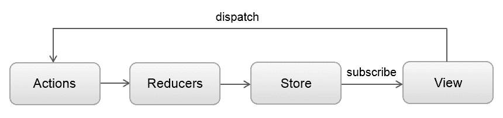

经典的 Redux 存储提供了两个重要的 API：

+   使用 `store.dispatch(action)` 分发操作

+   使用 `store.subscribe(callback)` 注册更改通知的监听器

如您所见，如果您使用 Redux 存储，您不需要手动在组件之间同步状态。

可预测的状态管理允许使用 co 调试应用程序，称为时间旅行调试器。您需要安装 `store-devtools`（[`github.com/ngrx/store-devtools`](https://github.com/ngrx/store-devtools)）以及适当的 Chrome 扩展。

# 使用 @ngrx/store 的 CRUD 应用程序

作为一个实际的例子，我们将重用“使用 DataTable 实现 CRUD 示例”部分中的相同 CRUD 示例实现。首先添加 Redux-based 应用程序的 `ngrx` 依赖项：

```ts
npm install @ngrx/store @ngrx/core --save

```

首先，我们需要为存储定义一个形状。在实际应用中，最有可能可用的员工和当前选择的员工可能会在多个组件之间共享。因此，存储可以定义如下：

```ts
export interface AppStore {
  employees: Employee[];
  selectedEmployee: Employee;
}

```

接下来，我们需要定义由类型和可选载荷组成的操作。

最佳实践是创建封装相关操作的 *Action Creator Services*：

[`github.com/ngrx/ngrx.github.io/blob/master/store/recipes/actions/action_services.md`](https://github.com/ngrx/ngrx.github.io/blob/master/store/recipes/actions/action_services.md)

我们将创建名为 `CrudActions` 的服务，其中包含四个 CRUD 操作和相关的操作创建者：

```ts
@Injectable()
export class CrudActions {
  static LOAD_EMPLOYEES = 'LOAD_EMPLOYEES';
  static CREATE_EMPLOYEE = 'CREATE_EMPLOYEE';
  static UPDATE_EMPLOYEE = 'UPDATE_EMPLOYEE';
  static DELETE_EMPLOYEE = 'DELETE_EMPLOYEE';

  loadEmployees(employees: Employee[]): Action {
    return {type: CrudActions.LOAD_EMPLOYEES, payload: employees};
  }

  createEmployee(employee: Employee): Action {
    return {type: CrudActions.CREATE_EMPLOYEE, payload: employee};
  }

  updateEmployee(employee: Employee): Action {
    return {type: CrudActions.UPDATE_EMPLOYEE, payload: employee};
  }

  deleteEmployee(id: string): Action {
    return {type: CrudActions.DELETE_EMPLOYEE, payload: id};
  }
}

```

核心部分是 reducer。reducer 函数接受状态和操作，然后使用 `switch` 语句根据操作类型返回新状态。当前状态不会被改变：

```ts
import {ActionReducer, Action} from '@ngrx/store';
import {AppStore} from './app.store';
import {CrudActions} from './crud.actions';
import {Employee} from '../model/employee';

const initialState: AppStore = {employees: [], selectedEmployee: null};

export const crudReducer: ActionReducer<AppStore> =
  (state: AppStore = initialState, action: Action): AppStore => {
 switch (action.type) {
    case CrudActions.LOAD_EMPLOYEES:
      return {
        employees: [...action.payload],
        selectedEmployee: null
  };

    case CrudActions.DELETE_EMPLOYEE:
      return {
        employees: state.employees.filter(
          (element: Employee) => element.id !== action.payload),
          selectedEmployee: null
  };

 case CrudActions.CREATE_EMPLOYEE:
      return {
        employees: [...state.employees, action.payload],
        selectedEmployee: null
  };

 case CrudActions.UPDATE_EMPLOYEE:
      let index = -1;
      // clone employees array with updated employee
  let employees = state.employees.map(
        (employee: Employee, idx: number) => {
        if (employee.id === action.payload.id) {
          index = idx;
          return Object.assign({}, action.payload);
        }
        return employee;
      });

      let selectedEmployee = index >= 0 ? employees[index] : null;
      return {employees, selectedEmployee};

    default:
      return state;
  }
};

```

如您所见，还有一个 `default` 开关语句，它只是在提供的操作不匹配任何预定义操作时返回当前状态。

现在，我们可以使用 `ngrx/store` 模块配置 `AppModule`。通过导入 `StoreModule`，应该调用 `provideStore` 方法并提供我们的 reducer 的名称：

```ts
import {StoreModule} from '@ngrx/store';
import {CrudActions} from './redux/crud.actions';
import {crudReducer} from './redux/crud.reducer';

@NgModule({
  imports: [
    ...
    StoreModule.provideStore({crudReducer})
  ],
  providers: [
    ...
    CrudActions
  ],
  ...
})
export class AppModule { }

```

通常，您也可以提供多个 reducer。这里显示了一个示例：

```ts
let rootReducer = {
  reducerOne: reducerOne,
  reducerTwo: reducerTwo, 
  reducerThree: reducerThree,
  ...
}

StoreModule.provideStore(rootReducer);

```

在内部，`@ngrx/store`使用`combineReducers`方法创建一个*meta-reducer*，该方法使用正确的状态片段调用指定的 reducer。

最后一步是分派操作并选择数据。我们可以将`CrudActions`注入`EmployeeService`并为每个 CRUD 操作创建相应的操作。返回值的类型为`Observable<Action>`：

```ts
constructor(private http: Http, private crudActions: CrudActions) { }

getEmployees(): Observable<Action> {
  return this.http.get('/fake-backend/employees')
    .map(response => response.json() as Employee[])
    .map(employees => this.crudActions.loadEmployees(employees))
    .catch(EmployeeService.handleError);
}

createEmployee(employee: Employee): Observable<Action> {
  return this.http.post('/fake-backend/employees', employee)
    .map(response => response.json() as Employee)
    .map(createdEmployee => 
      this.crudActions.createEmployee(createdEmployee))
    .catch(EmployeeService.handleError);
}

updateEmployee(employee: Employee): Observable<Action> {
  return this.http.put('/fake-backend/employees', employee)
    .map(() => this.crudActions.updateEmployee(employee))
    .catch(EmployeeService.handleError);
}

deleteEmployee(id: string): Observable<Action> {
  return this.http.delete('/fake-backend/employees/' + id)
    .map(() => this.crudActions.deleteEmployee(id))
    .catch(EmployeeService.handleError);
}

```

在组件类中，我们通过调用`store.dispatch(action)`来接收操作并分派它们。操作的分派仅将演示两个 CRUD 操作：加载所有员工和删除一个员工：

```ts
ngOnInit(): void {
  ...

  this.employeeService.getEmployees().subscribe(
    action => this.store.dispatch(action),
    error => this.showError(error)
  );
}

remove() {
  this.employeeService.deleteEmployee(this.selectedEmployee.id)
    .finally(() => {
      this.employeeForDialog = null;
    })
    .subscribe((action) => {
        this.store.dispatch(action);
        this.showSuccess('Employee was successfully removed');
      },
      error => this.showError(error)
    );
}

```

在`@ngrx/store`中选择数据是通过调用`store.select()`来实现的。`select`方法期望选择要在视图中显示的状态片段的 reducer 函数的名称。`select`方法的返回值是`Observable`，它允许订阅存储的数据。下一个代码片段演示了这样的订阅：

```ts
import {Store} from '@ngrx/store';
import {AppStore} from '../redux/app.store';
...

constructor(private store: Store<AppStore>, 
  private employeeService: EmployeeService) { }

ngOnInit(): void {
  this.store.select('crudReducer').subscribe((store: AppStore) => {
    this.employees = store.employees;
    this.selectedEmployee = store.selectedEmployee;
  });
}

```

生命周期方法`ngOnInit`是订阅的好地方。

完整的演示应用程序及说明可在 GitHub 上找到

[`github.com/ova2/angular-development-with-primeng/tree/master/chapter9/redux`](https://github.com/ova2/angular-development-with-primeng/tree/master/chapter9/redux).

# 总结

在本章中，您已经学习了更多用于各种用例的 PrimeNG 组件和指令。本章解释了 FileUpload、Draggable、Droppable、Galleria、Defer、BlockUI、ProgressBar 等有趣的功能。您已经看到了使用 DataTable 和模拟后端实现 CRUD 应用程序的实际示例。还演示了使用 ConfirmationDialog 和受保护的路由的最佳实践。阅读完本章后，您将具备必要的知识，能够为接下来的几个 Angular 和 PrimeNG Web 应用程序创建不同的自定义组件。Redux 架构不再是一个陌生的概念。您已经为复杂的 Web 应用程序中有利的状态管理做好了准备。

下一章将介绍使用现代框架进行单元测试和端到端测试。您将学习如何测试和调试 Angular 应用程序。测试驱动开发的技巧也不会缺席。
