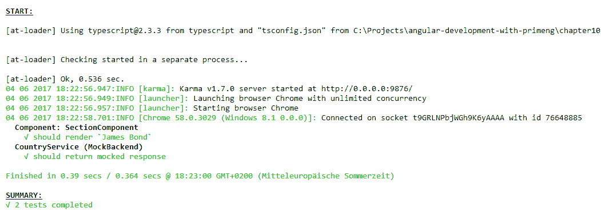
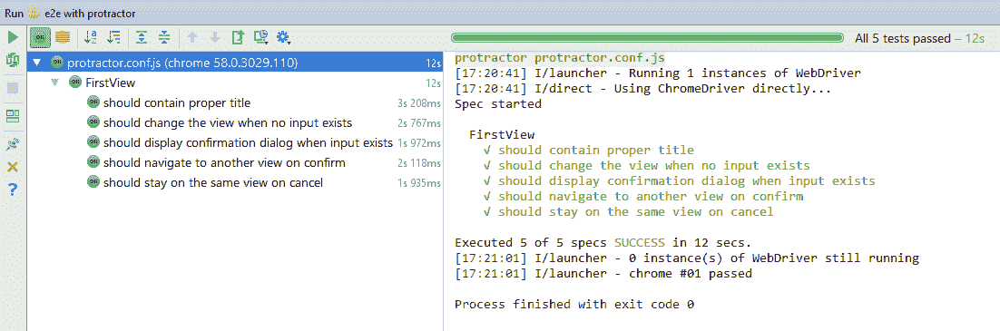
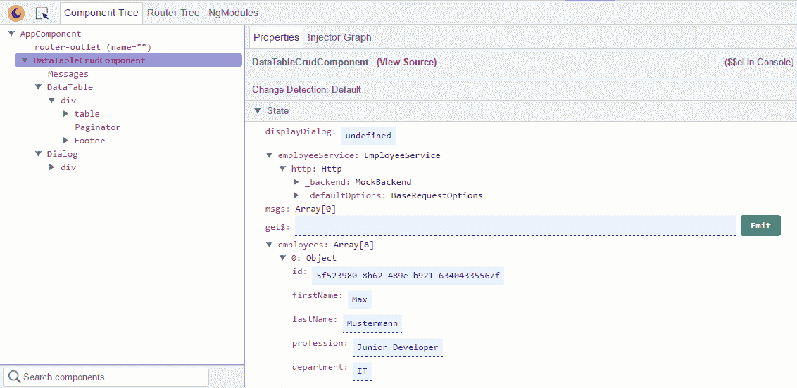
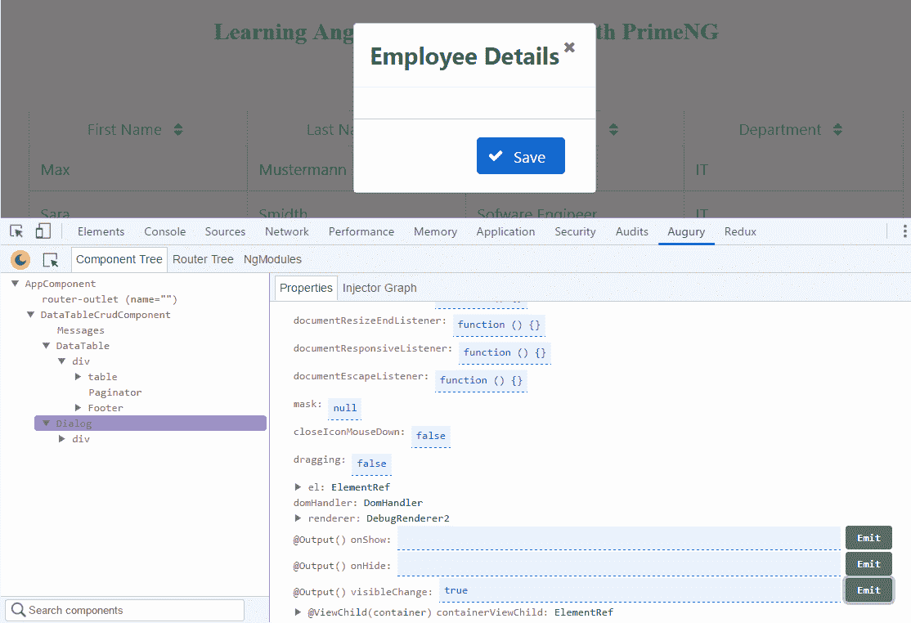
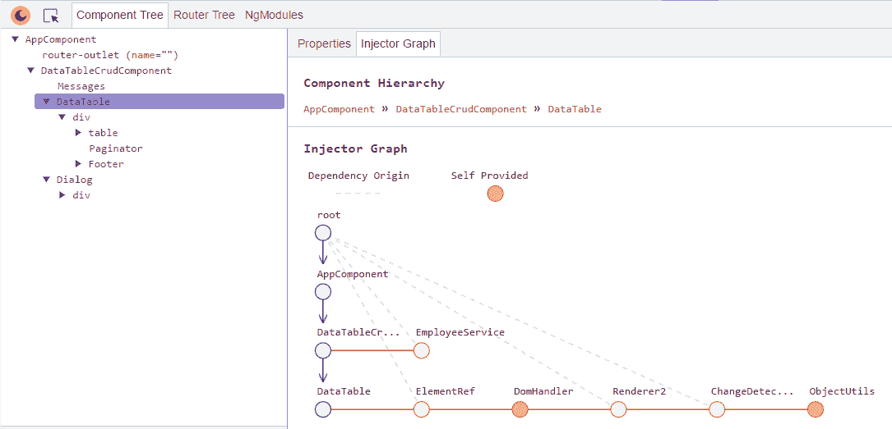
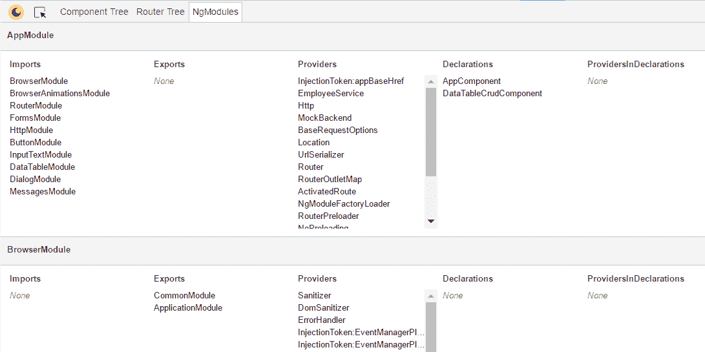
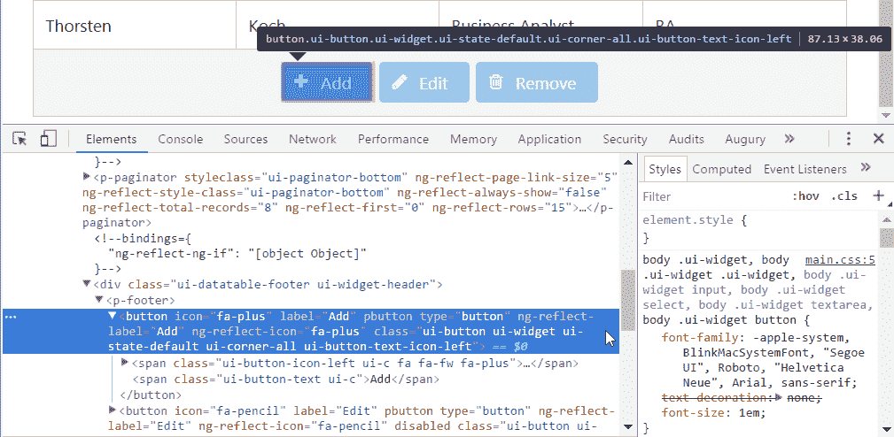
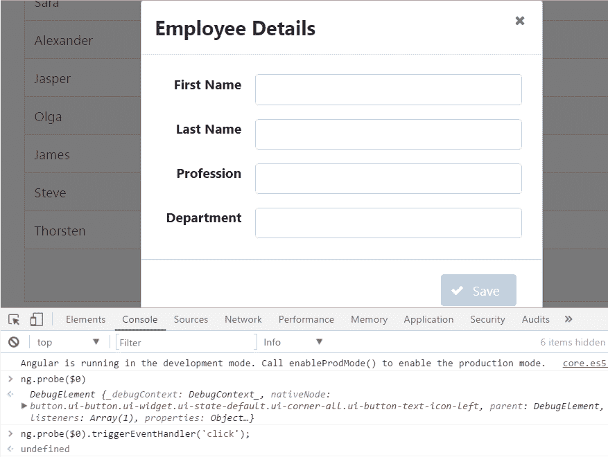

# 第十章：创建健壮的应用程序

测试 Web 应用程序是一个重要的过程，可以消除错误。测试确保编写的代码按预期工作，并且功能在后续更改中不会中断。它们还可以帮助您更好地理解您正在处理的复杂代码。有两种主要类型的测试--**单元测试**和**端到端**（**e2e**）测试。

单元测试是关于测试孤立的代码片段。单元测试通常使用模拟输入，然后断言预期结果是否发生。e2e 方法执行针对在真实浏览器中运行的应用程序的测试。这些测试断言所有代码片段是否正确地相互交互。Angular 应用程序的标准测试框架是 Jasmine 和 Protractor。Jasmine 与 Karma 一起用于单元测试，Karma 是 JavaScript 的测试运行器。Protractor 是一个 e2e 测试框架。本章简要描述了两种测试类型。您将学习如何高效地设置和使用测试框架。测试和调试技巧为本书画上了句号。

在本章中，我们将涵盖以下主题:

+   使用 Jasmine 和 Karma 设置单元测试

+   组件和服务的单元测试

+   如何加快单元测试的技巧

+   使用 Protractor 设置 e2e 测试环境

+   一览自动化 UI 测试

+   使用 Augury 和 ng.probe 探索 PrimeNG 应用程序

# 使用 Jasmine 和 Karma 设置单元测试

本节将简要概述 Jasmine ([`jasmine.github.io`](http://jasmine.github.io)) 和 Karma ([`karma-runner.github.io`](https://karma-runner.github.io))。在编写具体的单元测试之前，我们将建立一个测试环境。为此，将扩展在第一章的*使用 Webpack 设置 PrimeNG 项目*部分介绍的 Webpack 种子项目。

# Jasmine 简介

Jasmine 是一个没有依赖的 JavaScript 测试框架。使用`npm`，您可以按如下方式安装它：

```ts
npm install jasmine-core --save-dev

```

您还需要安装 Jasmine 类型定义文件。否则，TypeScript 编译器将不知道 Jasmine 类型。

```ts
npm install @types/jasmine --save-dev

```

Jasmine 有四个主要概念:

+   **规格**: 在 Jasmine 术语中，单元测试称为规格。`it(string, function)`函数指定一个测试。它接受一个标题和一个包含一个或多个期望的函数。

+   **套件**: 规范被包裹在套件中。`describe(string, function)`函数描述了一个测试套件。它接受一个标题和一个包含一个或多个规范的函数。套件也可以包含其他嵌套套件。

+   **期望**: 这些是使用`expect(actual)`函数指定的断言。该函数接受一个参数--`actual`值。

+   **匹配器**: 断言后面跟着匹配器。Jasmine 有很多匹配器，比如`toBe(expected)`、`toEqual(expected)`、`toBeLessThan(expected)`等等。`expected`参数是期望的值。例如，`expect(2 + 3).toBeLessThan(6)`。匹配器在`actual`和`expected`值之间实现布尔比较。如果匹配器返回`true`，则规范通过；否则，会抛出错误。任何匹配器都可以用`not`否定；例如，`expect(array).not.toContain(member)`。

完整的匹配器列表可在 GitHub 上找到：[`github.com/JamieMason/Jasmine-Matchers`](https://github.com/JamieMason/Jasmine-Matchers)。

Jasmine 的一个简单测试示例如下：

```ts
describe("Test matchers:", function() {
  it("Compare two values with 'toBe' matcher", function() {
    var a = 5;
    var b = 2 + 3;

    expect(a).toBe(b);
    expect(a).not.toBe(null);
  });
});

```

`it()`和`describe()`函数中的标题用于文档编写。测试应该是自描述的，这样其他开发人员就可以更好地理解测试的作用。

Jasmine 有一些设置和拆卸函数：

+   `beforeAll()`: 在套件运行之前执行一些代码。

+   `beforeEach()`: 在每个规范运行之前执行一些代码。

+   `afterAll()`: 在套件完成后执行一些代码。

+   `afterEach()`: 在每个规范完成后执行一些代码。

这里演示了使用`beforeEach()`和`afterAll()`的示例：

```ts
describe("Usage of beforeEach and afterAll", function() {
  var foo = 0;

  beforeEach(function() {
    foo += 1;
  });

  afterAll(function() {
    foo = 0;
  });

  it("Check if foo == 1", function() {
    expect(foo).toEqual(1);
  });

  it("Check if foo == 2", function() {
    expect(foo).toEqual(2);
  });
});

```

# 使用 Webpack 和 Karma 进行测试设置

有两个运行器来执行测试：

+   **Jasmine 独立发布版的 HTML 运行器（[`github.com/jasmine/jasmine/releases`](https://github.com/jasmine/jasmine/releases)**)**: 下载 ZIP 文件，解压缩，并在任何文本编辑器中打开`SpecRunner.html`文件。这个 HTML 文件包含一些加载测试框架的基本代码。您需要添加常规的 Angular 依赖项、一个 Angular 测试库和一个 SystemJS 加载器，加载`.spec`文件。之后，您可以在 Web 浏览器中打开 HTML 文件查看测试结果。

+   **命令行运行器 Karma**: Karma 可以在不同的浏览器中运行测试，并使用各种报告器报告可能的错误。该运行器可以集成到构建过程中，以便单元测试作为构建的一部分自动执行。

在本书中，我们只关注 Karma 运行器。基于 Webpack 的项目设置需要以下 Karma 依赖：

```ts
"devDependencies": {
  ...
  "karma": "~1.7.0",
  "karma-chrome-launcher": "~2.1.1",
  "karma-jasmine": "~1.1.0",
  "karma-jasmine-matchers": "~3.7.0",
  "karma-mocha-reporter": "~2.2.3",
  "karma-phantomjs-launcher": "~1.0.4",
  "karma-sourcemap-loader": "~0.3.7",
  "karma-webpack": "~2.0.3",
  "phantomjs-prebuilt": "~2.1.14"
}

```

细心的读者会注意到，我们想要针对 Google Chrome 和 PhantomJS（[`phantomjs.org`](http://phantomjs.org)）运行测试--一个无头浏览器，非常适合测试 Web 应用程序。

完整的项目及说明可在 GitHub 上找到

[`github.com/ova2/angular-development-with-primeng/tree/master/chapter10/unit-testing`](https://github.com/ova2/angular-development-with-primeng/tree/master/chapter10/unit-testing)。

使用 Webpack 和 Karma 进行测试设置需要三个配置文件。首先，我们需要一个 Karma 配置文件：`karma.config.js`。这个文件将告诉 Karma 测试的位置在哪里，使用哪个浏览器来执行测试，使用哪种报告机制等等。在 GitHub 上的项目中，这个文件的内容如下：

```ts
let webpackConfig = require('./webpack.test.js');

module.exports = config => { 
  config.set({
    autoWatch: false,
    singleRun: true,
    browsers: ['Chrome', 'PhantomJS'],
    basePath: '.',
    files: ['spec-bundle.js'],
    exclude: [],
    frameworks: ['jasmine', 'jasmine-matchers'],
    logLevel: config.LOG_INFO,
    phantomJsLauncher: {exitOnResourceError: true},
    port: 9876,
    colors: true,
    preprocessors: {
      'spec-bundle.js': ['webpack', 'sourcemap']
    },
    reporters: ['mocha'],
    webpack: webpackConfig,
    webpackServer: {noInfo: true}
  });
};

```

这里应该提到两个重要的点。有一个专门的 Webpack 配置用于测试，位于`webpack.test.js`文件中。它的内容很简单：

```ts
var ContextReplacementPlugin = require("webpack/lib/ContextReplacementPlugin");

module.exports = {
  devtool: 'inline-source-map',
  resolve: {extensions: ['.ts', '.js', '.json']},
  module: {
    rules: [
      {test: /\.ts$/, loaders: ['awesome-typescript-loader', 
        'angular2-template-loader']},
      {test: /\.json$/, loader: 'json-loader'},
      {test: /\.(css|html)$/, loader: 'raw-loader'}
    ]
  },
  plugins: [
    new ContextReplacementPlugin(
      /angular(\\|\/)core(\\|\/)@angular/,
      path.resolve(__dirname, '../src')
    )
  ]
};

```

`webpack.test.js`没有指定要测试的文件的入口点。测试文件的位置和文件扩展名在`spec-bundle.js`中定义。这是 Webpack 处理的另一个重要文件。它加载测试所需的 Angular 模块并初始化测试环境。最后，所有测试文件都会在浏览器中加载。`spec-bundle.js`文件的内容如下：

```ts
require('core-js/es6');
require('core-js/es7/reflect');
require('zone.js/dist/zone');
require('zone.js/dist/long-stack-trace-zone');
require('zone.js/dist/proxy');
require('zone.js/dist/sync-test');
require('zone.js/dist/jasmine-patch');
require('zone.js/dist/async-test');
require('zone.js/dist/fake-async-test');
require('rxjs/Rx');

const coreTesting = require('@angular/core/testing');
const browserTesting = require('@angular/platform-browser-dynamic/testing');

// Initialize the test environment
coreTesting.TestBed.resetTestEnvironment();
coreTesting.TestBed.initTestEnvironment(
  browserTesting.BrowserDynamicTestingModule,
  browserTesting.platformBrowserDynamicTesting()
);

// Let the browser show a full stack trace when an error happens
Error.stackTraceLimit = Infinity;
// Let's set the timeout for the async function calls to 3 sec. 
// (default is 5 sec.)
jasmine.DEFAULT_TIMEOUT_INTERVAL = 3000;

// Find all files with .spec.ts extensions
const context = require.context('../src/', true, /\.spec\.ts$/);

// For each file, call the context function that will require 
//the file and load it up here.
context.keys().forEach(context);

```

约定是将测试文件命名为要测试的文件相同，但在文件扩展名之前加上后缀`.spec`。例如，`header.component.spec.ts`和`language.service.spec.ts`。最佳实践也是将每个测试文件保存在与相应受测试文件相同的目录中。

在`package.json`中，我们可以配置三个方便的命令。

```ts
"scripts": {
  ...
  "test": "karma start ./config/karma.conf.js",
  "test:headless": "karma start ./config/karma.conf.js 
    --browsers PhantomJS",
  "test:chrome": "karma start ./config/karma.conf.js 
    --browsers Chrome"
}

```

现在，我们准备使用三个命令之一来运行我们的测试。当我们执行`npm run test`时，Karma 将打开和关闭每个配置的浏览器并打印测试结果。

当使用 Angular CLI 时，它会为我们处理配置。您不需要编写任何配置文件，只需在项目根目录中键入`ng test`即可快速运行所有测试。此命令会监视更改并自动重新运行测试。

# 组件和服务的单元测试

在本节中，我们将介绍 Angular 测试工具，并展示如何测试组件和服务。由于本书篇幅有限，不会解释指令、管道、路由器等的测试。

# Angular 测试工具

正如您在前一节中看到的，Angular 带有一个测试库`@angular/core/testing`，它提供了`TestBed`辅助类和许多其他实用程序。`TestBed`帮助我们为测试设置依赖项--模块、组件、提供者等。您可以调用`TestBed.configureTestingModule()`并传递与`@NgModule`中使用的相同的元数据配置对象。`configureTestingModule()`函数应该在`beforeEach()`设置函数中调用。

测试库中的另一个有用函数称为`inject()`。它允许您将指定的对象注入到测试中。以下代码片段提供了一个示例：

```ts
describe('MyService', () => {
  let service;

  beforeEach(() => TestBed.configureTestingModule({
    providers: [MyService]
  }));

  beforeEach(inject([MyService], s => {
    service = s;
  }));

  it('should return the city Bern', () => {
    expect(service.getCities()).toContain('Bern');
  });
});

```

下一个有用的函数是`async()`函数。它可用于异步操作，因为它在测试中不会完成，直到测试中的所有异步操作完成或发生指定的超时。`async()`函数包装了`it()`函数的第二个参数：

```ts
it('do something', async(() => {
  // make asynchronous operation here, e.g. call a REST service
}), 3000));

```

超时参数是可选的。还可以结合`inject()`调用`async()`：

```ts
it('do something', async(inject([SomeService], s => {
  ...
})));

```

请注意，如果您更改了某个组件的属性值，并且该属性通过`ngModel`指令绑定到视图，您也必须在`async()`中执行此操作。原因是：`ngModel`会异步更新值。我们将在本节中开发一个适当的示例。

Angular 测试工具中的`fakeAsync()`函数类似于`async()`，但它通过在特殊的*fakeAsync 测试区域*中运行测试主体来实现线性编码风格。`fakeAsync()`方法与`tick()`函数一起使用，后者模拟时间的流逝，直到所有挂起的异步活动都已完成。不再有嵌套的`then(...)`块；测试看起来是同步的：

```ts
changeSomethingAsync1();
...
tick();
expect(something).toBeDefined();

changeSomethingAsync2();
...
tick();
expect(something).toBeNull();

```

`fakeAsync()`有一个限制--您不能在`fakeAsync()`中进行 XHR 调用。

# 测试一个组件

我们想要测试一个名为`SectionComponent`的组件，它只有一个属性`username`。该组件具有以下标记：

```ts
<label  for="username">Username:</label>
<input  id="username" name="username" type="text" pInputText 
       [(ngModel)]="username"/>

```

在测试文件`section.component.spec.ts`中，我们将把值`James Bond`赋给属性`username`，然后检查该值是否出现在视图中。测试代码的完整列表如下：

```ts
import {TestBed, async, ComponentFixture} from '@angular/core/testing';
import {By} from '@angular/platform-browser';
import {DebugElement} from '@angular/core';
import {SectionComponent} from './section.component';
import {FormsModule} from '@angular/forms';

describe('Component: SectionComponent', () => {
 let fixture: ComponentFixture<SectionComponent>;
  let sectionComponent: SectionComponent;
  let element: any;
  let debugElement: DebugElement;

  beforeEach(() => {
    TestBed.configureTestingModule({
      imports: [FormsModule],
      declarations: [SectionComponent]
    });

    fixture = TestBed.createComponent(SectionComponent);
    sectionComponent = fixture.componentInstance;
    element = fixture.nativeElement;
    debugElement = fixture.debugElement;
  });

 afterEach(() => {
 if (fixture) {fixture.destroy();}
  });
   it('should render `James Bond`', async(() => {
    sectionComponent.username = 'James Bond';

    // trigger change detection
  fixture.detectChanges();

    // wait until fixture is stable and check then the name
  fixture.whenStable().then(() => {
      // first approach shows one possible way to check the result
  expect(element.querySelector('input[name=username]').value)
        .toBe('James Bond');
      // second approach shows another possible way to check the result
  expect(debugElement.query(By.css('input[name=username]'))
        .nativeElement.value).toBe('James Bond');
    });
  }));
});

```

让我们解释一下代码。首先，我们需要用`TestBed`配置测试模块。这通常在`beforeEach()`中完成。`TestBed`类有一个静态方法`createComponent(component)`，我们用它来创建`ComponentFixture`——在测试环境中包装组件实例的包装器。fixture 提供了对组件实例本身、原生根元素以及`DebugElement`的访问，后者是对该组件的根元素的包装器。此外，`ComponentFixture`还有许多其他有用的方法：

```ts
class ComponentFixture<T> {
  componentInstance: T;
  nativeElement: any;
  debugElement: DebugElement;
  detectChanges(): void;
 whenStable(): Promise<any>;
  ...
}

```

最重要的方法是`detectChanges()`和`whenStable()`。第一个触发组件的变更检测周期。这是必要的，以便将更改传播到 UI。第二个返回`Promise`，可以在所有异步调用或异步变更检测结束时用于恢复测试。我们使用了两种不同的 API 来检查`Promise`解析后的预期结果。

Jasmine 有一个间谍的概念。间谍模拟任何对象或函数，并跟踪对它及其所有参数的调用。如果间谍被调用，`toHaveBeenCalled`匹配器将返回`true`。下一个代码片段在`showDetails`方法上创建了一个间谍。经过一些交互后，我们可以验证该方法是否被调用：

```ts
const spy = spyOn(someComponent, 'showDetails');

// do some interactions
...
fixture.detectChanges();

fixture.whenStable().then(() => {
  expect(spy).toHaveBeenCalled();
});

```

我们还可以验证方法是否使用特定参数进行了调用，调用了多少次等等。有关更多详细信息，请参阅 Jasmine 文档。

# 测试一个服务

下一个例子概述了如何测试服务。我们想要测试一个从远程后端返回一些国家的服务：

```ts
@Injectable()
export class CountryService {
  constructor(private http: Http) { }

  getCountries(): Observable<Country[]> {
    return this.http.get('/assets/data/countries.json')
      .map(response => response.json().data as Country[]);
  }
}

```

`Country`对象具有以下形状：

```ts
interface Country {
  name: any;
  dial_code?: any;
  code?: any;
}

```

我们不希望在测试期间进行 HTTP 调用。为了实现这一点，我们必须用`MockBackend`替换`XHRBackend`。`MockBackend`允许我们捕获传出的 HTTP 请求并模拟传入的响应。我们可以按照自己的意愿定义一个响应，然后将服务的结果与我们的期望进行比较。下一个代码片段展示了如何构建一个模拟响应，所以当我们最终调用我们的服务时，它会得到预定义的国家数组：

```ts
import {TestBed, inject} from '@angular/core/testing';
import {HttpModule, XHRBackend, Response, ResponseOptions} 
 from '@angular/http';
import {MockBackend, MockConnection} from '@angular/http/testing';
import {CountryService} from './country.service';
import Country from './country';

describe('CountryService (MockBackend)', () => {
 let mockbackend: MockBackend, service: CountryService;
  beforeEach(() => {
    TestBed.configureTestingModule({
      imports: [HttpModule],
      providers: [CountryService, MockBackend,
        {provide: XHRBackend, useClass: MockBackend}
      ]
    })
  });

  beforeEach(inject([CountryService, MockBackend],
    (cs: CountryService, mb: MockBackend) => {
    service = cs;
    mockbackend = mb;
  }));
   it('should return mocked response', () => {
    let israel: Country = {'name': 'Israel', 
 'dial_code': '+972', 'code': 'IL'};
    let angola: Country = {'name': 'Angola', 
 'dial_code': '+244', 'code': 'AO'};
    let response = [israel, angola];

    mockbackend.connections.subscribe((connection: MockConnection) => {
      connection.mockRespond(new Response(new ResponseOptions({
        status: 200, body: JSON.stringify(response)
      })));
    });

    service.getCountries().subscribe(countries => {
      expect(countries.length).toBe(2);
      expect(countries).toContain(israel);
      expect(countries).toContain(angola);
    });
  });
});

```

请注意，这里我们不需要 `async()` 函数，因为 `MockBackend` 的行为是同步的。现在，当所有测试都成功时，您将看到以下输出：



所演示的服务类测试不是*孤立的单元测试*。孤立的单元测试探索被测试类的内部逻辑，并且不需要使用 Angular 测试工具。您不需要准备测试模块，调用 `inject()`，`async()` 等。使用 `new` 创建类的测试实例，并为构造函数参数提供模拟、间谍或虚假对象。通常，服务和管道是孤立单元测试的良好候选对象。阅读官方的 Angular 测试指南以了解更多细节 ([`angular.io/docs/ts/latest/guide/testing.html`](https://angular.io/docs/ts/latest/guide/testing.html))。

完整的项目及说明可在 GitHub 上找到

[`github.com/ova2/angular-development-with-primeng/tree/master/chapter10/unit-testing`](https://github.com/ova2/angular-development-with-primeng/tree/master/chapter10/unit-testing).

# 加速单元测试的提示

在一个真实的网络应用程序中，您可能有很多测试文件。捆绑和运行所有测试文件可能需要一段时间。Karma 的引导过程也需要一段时间。如果您总是需要运行数百甚至更多的测试来测试单个文件中的小更改，这对于快速软件开发来说是不令人满意的。如果您想要缩小测试范围，只测试您编写测试的文件，或者一组指定的文件，而不重新启动 Karma。如何做到这一点？

这就是 `karma-webpack-grep` ([`www.npmjs.com/package/karma-webpack-grep`](https://www.npmjs.com/package/karma-webpack-grep)) 可以帮助您的情况。它允许限制由 `karma-webpack` 捆绑的文件。首先，安装它：

```ts
npm install karma-webpack-grep --save-dev

```

之后，我们必须扩展 `karma.conf.js` 文件。将新的 `karma-webpack-grep` 插件放入所有 Webpack 插件的数组中。其他一切保持不变：

```ts
let grep = require('karma-webpack-grep');

module.exports = config => {
  webpackConfig.plugins = (webpackConfig.plugins || []).concat(grep({
    grep: config.grep,
    basePath: '.',
    testContext: '../src/'
  }));

  config.set({
    // the same settings as before
    ...
  });
};

```

请注意，`testContext` 选项与 `require.context(...)` 中传递的内容完全相同（请参阅 `spec-bundle.js`）。但是，`config.grep` 是从哪里来的？Karma 解析命令行参数。这意味着，如果您执行以下命令：

```ts
karma start ./config/karma.conf.js --grep some/path

```

`config.grep` 将设置为 `some/path`。让我们扩展 `npm` 脚本：

```ts
"scripts": {
  ...
  "test:headless:grep": "karma start ./config/karma.conf.js
    --browsers PhantomJS --autoWatch true --singleRun false --grep",
  "test:chrome:grep": "karma start ./config/karma.conf.js
    --browsers Chrome --autoWatch true --singleRun false --grep"
}

```

现在，您可以在观察模式下运行具体的测试。对于 Chrome 浏览器，它看起来如下：

```ts
npm run test:chrome:grep -- app/section/section.component.spec.ts
npm run test:chrome:grep -- app/section/service/country.service.spec.ts

```

对于 PhantomJS，测试以`npm test test:headless:grep`开头。测试结果看起来像下面这样（这里是针对`CountryService`）：

```ts
START:
  CountryService (MockBackend)
    V should return mocked response

Finished in 0.014 secs / 0.331 secs @ 14:33:58 GMT+0200

SUMMARY:
V 1 test completed

```

Karma 运行器继续运行并监视文件更改。每次文件更改时，测试结果都会非常快地显示出来。还可以观察并执行特定文件夹中的测试文件。为此，您可以简单地将此文件夹传递给`npm`脚本。例如：

```ts
npm run test:chrome:grep -- app/section

```

将在`src/app/section`下的所有测试都被监视和执行。只需专注于编写代码：

完整的项目及说明可在 GitHub 上找到

[`github.com/ova2/angular-development-with-primeng/tree/master/chapter10/unit-testing`](https://github.com/ova2/angular-development-with-primeng/tree/master/chapter10/unit-testing)。

# 使用 Protractor 设置端到端测试环境

Protractor（[`www.protractortest.org`](http://www.protractortest.org)）是一个开源的端到端测试自动化框架，专门为 Angular web 应用程序设计。Protractor 是一个基于 WebDriverJS 的 Node.js 工具，它是 W3C WebDriver API 的官方实现，用于与浏览器交互。

Protractor 有许多优点。您不再需要为挂起的任务在测试中添加`waits`和`sleeps`。Protractor 可以在网页完成异步任务（例如，AJAX 更新）时自动执行测试中的下一步。该框架还支持 Angular 的定位策略，允许您轻松地通过绑定、模型等找到特定于 Angular 的元素。本节简要介绍了 Protractor，包括设置和特定的测试构造。

# 安装和配置 Protractor

首选方法是使用以下命令全局安装 Protractor：

```ts
npm install protractor -g

```

Protractor 将自动下载*Selenium 独立服务器*和所有浏览器驱动程序。

Selenium 独立服务器通常在您想要连接到远程机器并对远程机器上的浏览器运行测试时需要。当您将测试分布在多台机器上时，通常与*Selenium-Grid*一起使用。

执行此命令以更新 Selenium 独立服务器和浏览器驱动程序：

```ts
webdriver-manager update

```

确保您已经像在*使用 Jasmine 和 Karma 设置单元测试*部分所示的那样在本地安装了`jasmine-core`包。测试将使用 Jasmine 编写，但您也可以使用 Mocha（[`mochajs.org`](https://mochajs.org)）-另一个在 Node.js 上运行的 JavaScript 测试框架。此外，还需要安装一个报告生成工具`jasmine-spec-reporter`：

```ts
npm install jasmine-spec-reporter --save-dev

```

Protractor 配置在`protractor.conf.js`文件中进行。

```ts
var path = require('path');
var SpecReporter = require('jasmine-spec-reporter').SpecReporter;

exports.config = {
  allScriptsTimeout: 11000,
  specs: ['../e2e/**/*.e2e-spec.ts'],
  capabilities: {'browserName': 'chrome'},
  directConnect: true,
  baseUrl: 'http://localhost:3000/',
  framework: 'jasmine',
  jasmineNodeOpts: {
    showColors: true,
    defaultTimeoutInterval: 30000,
    print: function () { }
  },
  beforeLaunch: function () {
    require('ts-node').register({
      project: path.resolve(__dirname, '../e2e')
    });
  },
  onPrepare() {
    jasmine.getEnv().addReporter(new SpecReporter());
  }
};

```

下面列出了最重要的配置选项的描述：

| **选项** | **描述** |
| --- | --- |
| `allScriptsTimeout` | 浏览器上每个脚本运行的超时时间（以毫秒为单位）。 |
| `specs` | Spec 模式相对于此配置的位置。最佳实践是将所有的 e2e 测试放在`e2e`文件夹中。子文件夹名称对应页面名称。例如，`home`页面的测试应该在`home`子文件夹中。文件名也对应页面名称。我们在我们的 spec 文件中添加`.e2e-spec.ts`后缀。例如，home 页面的 spec 文件是`home.e2e-spec.ts`。 |
| `capabilities` | 浏览器测试的配置对象。您也可以同时在多个浏览器上运行测试。为此，请使用`multiCapabilities`选项，该选项需要一个能力数组。 |
| `seleniumAddress` | 使用此选项连接到使用`webdriver-manager start`启动的运行中的 Selenium 服务器。例如，`seleniumAddress: 'http://localhost:4444/wd/hub'`。Protractor 将向该服务器发送请求以控制浏览器。您可以在`http://localhost:4444/wd/hub`上查看有关服务器状态的信息。 |
| `directConnect` | 使用此选项直接连接到 Chrome 或 Firefox（仅支持两种浏览器的直接连接）。在本书中，我们使用`directConnect`而不是`seleniumAddress`。 |
| `baseUrl` | 被测试应用的基本 URL。 |
| `framework` | 使用的测试框架。通常使用 Jasmine 或 Mocha。 |
| `beforeLaunch` | 一旦配置文件被读取但在任何环境设置之前调用的回调函数。这只会运行一次，在`onPrepare`之前。在前面的配置中，将执行`ts-node`。`ts-node`模块负责将 TypeScript 文件转换为 JavaScript 文件。您必须通过`npm`安装它，如`npm install ts-node --save-dev`。还要考虑`project`配置选项，它指向具有特定`tsconfig.json`文件的文件夹。通常，我们需要不同的 TypeScript 编译器选项来进行 e2e 测试。 |
| `onPrepare` | 一旦 Protractor 准备就绪并可用，但在执行规范之前调用的回调函数。我们可以在那里添加一些报告者。 |

所有准备工作都已完成。现在，请确保应用程序正在`http://localhost:3000/`上运行，并从项目根目录运行测试：

```ts
protractor ./config/protractor.conf.js

```

为了方便起见，您可以将此命令配置为`npm`脚本，并使用`npm run e2e`运行：

```ts
"scripts": {
  ...
  "pree2e": "webdriver-manager update",
  "e2e": "protractor ./config/protractor.conf.js"
}

```

`webdriver-manager update`命令应该首先作为预挂钩运行。这就是为什么我们需要在`scripts`部分中有`"pree2e"`的原因。

可以将 e2e 测试分成不同的套件，并分别运行与套件相关的测试。您可以在配置文件的`suites`部分完成这项任务。例如，让我们定义两个套件，`homepage`和`payment`：

```ts
suites: {
  homepage: '../e2e/homepage/**/*.e2e-spec.ts',
  payment: '../e2e/payment/**/*.e2e-spec.ts'
}

```

以下命令将仅运行与主页相关的测试：

```ts
protractor ./config/protractor.conf.js --suite homepage

```

在使用 Angular CLI 时，它会为我们创建配置文件。您可以通过在两个单独的控制台中运行`ng serve`和`ng e2e`来执行 e2e 测试。如果您需要不同的设置、特定的模拟等等用于 e2e 测试，您必须创建一个新的`environment.e2e.ts`文件，其中包含特定的环境变量，并在`.angular-cli.json`中的`environments`下注册它为`"e2e": "environments/environment.e2e.ts"`。现在，您可以在`app.module.ts`中导入`environment.ts`，检查环境变量，并在需要时执行自定义逻辑；例如，提供模拟等等。为了使其工作，应用程序应该以`ng serve --env=e2e`启动。

# 一览自动化 UI 测试

本节描述了 Protractor 测试的语法，以及 *Page Object* 和 *Page Element* 设计模式，这些是最佳的 e2e 测试实践。掌握了这些知识，我们将为 第九章 中介绍的演示应用编写一个完整的 e2e 测试，*杂项用例和最佳实践*，在 *使用受保护的路由显示确认对话框* 部分。

# 浏览器对象、元素和定位器

浏览器对象是围绕 `WebDriver` 实例全局创建的包装器。它用于导航和页面范围的信息。使用 `browser.get()`，您可以导航到一个页面，然后检查页面的标题，如下所示：

```ts
describe('Google page', function() {
  it('should have a title', function() {
    browser.get('https://www.google.com');
    expect(browser.getTitle()).toEqual('Google');
  });
});

```

当前 URL 可以通过 `browser.getCurrentUrl()` 返回。例如：

```ts
expect(browser.getCurrentUrl()).toContain('/admin');

```

Protractor 创建的其他全局对象是 `element` 和 `by`。`element` 是一个帮助函数，用于在测试的页面上查找 DOM 元素。它需要一个参数--用于定位元素的 *定位器*。定位器是使用 `by` 对象创建的。有各种定位器。我们只会提到其中一些。要获取完整列表，请阅读官方 API 文档 ([`www.protractortest.org/#/api`](http://www.protractortest.org/#/api))。

`by.css` 选择器使用 CSS 选择器定位元素。例如：

```ts
element(by.css('h1'));

```

`by.id` 选择器通过其 ID 定位元素。例如：

```ts
element(by.id('id'))

```

`by.tagName` 选择器定位具有给定标记名称的元素。例如：

```ts
element(by.tagName('div'))

```

请注意，对于 Angular 2+ 应用程序，不支持 `by.binding` 和 `by.model` 定位器。它们仅支持 Angular 1.x。

`element` 函数返回一个 `ElementFinder` 对象，可以用于与底层 DOM 元素交互或从中获取信息。以下表格列出了 `ElementFinder` 的最重要方法：

| **方法** | **描述** |
| --- | --- |
| `getText()` | 返回元素的文本。 |
| `click()` | 在元素上执行点击。 |
| `sendKeys(keys)` | 将传入的字符发送到元素（用于填写表单）。 |
| `element(locator)` | 通过给定的定位器在父元素（此元素）中查找子元素。它将第一个找到的子元素作为 `ElementFinder` 类型的对象返回。 |
| `all(locator)` | 通过给定的定位器在父元素（此元素）中查找子元素。它将返回一个`ElementArrayFinder`类型的对象，其中包含所有找到的子元素的数组。`ElementArrayFinder`对象具有许多有用的方法。例如，`count()`提供找到的元素数量，`get(index: number)`在数组中提供指定位置的元素。有关更多信息，请阅读 API 文档。 |
| `getId()` | 获取 DOM 元素的 ID。 |
| `isDisplayed()` | 检查 DOM 元素是否可见。 |
| `isEnabled()` | 检查 DOM 元素是否已启用。 |

让我们看两个例子，并检查具有样式类`info`的元素是否显示（可见）如下：

```ts
expect(element(by.css('.info')).isDisplayed()).toBe(true);

```

下一个代码片段检查按钮是否可点击：

```ts
expect(element(by.tagName('button')).isEnabled()).toBe(true);

```

要小心动画。当元素在一些动画之后出现时，等待动画结束是合理的。为了实现这一点，使用`browser.wait()`，如`browser.wait(element(by.id('id')).isDisplayed()).toBe(true)`。

请注意，对 DOM 元素的访问操作返回的是 promise 而不是元素本身。例如，`getText()`，`count()`等。Protractor 修补了 Jasmine 的`expect()`函数，以便自动等待直到 promise 得到解决并且定位的 DOM 元素可访问。之后，将应用匹配器。这很方便，但也有一些情况下，您需要访问已解决 promise 的值。在这些情况下，您可以显式使用 promise 的`then()`函数。假设您想要输出表格中行的数量。下面的代码片段举例说明了这个想法：

```ts
it('should display the correct row count', () => {
  const pcount = element.all(by.css('table tr')).count();
  pcount.then((count) => {
    console.log(`Table has ${count} rows`);
  });
  expect(pcount).toEqual(20);
});

```

# 使用页面对象的清洁架构

页面对象封装了网页的行为。在单页面应用程序中，我们有视图。为了方便起见，如果我们说“网页”，我们将指代完整页面和视图。每个网页都有一个页面对象，将页面的逻辑抽象到外部。这意味着与网页的交互被封装在页面对象中。端到端测试操作页面对象。以网店为例：页面对象可以编写为类：`ProductPage`，`ShoppingCartPage`，`PaymentPage`等等。

页面元素（又称*HTML 包装器*）是网页的另一个细分。它代表一个 HTML 元素，并封装了与该元素交互的逻辑。例如，一个 DatePicker 的 HTML 包装器可以提供 API 方法，如“将日期设置到输入字段中”、“打开日历弹出窗口”和“在日历弹出窗口中选择给定的日期”。HTML 包装器可以是复合的；这意味着它可以由多个小元素组成。例如，产品目录由产品组成，购物车由商品组成，等等。

Martin Fowler（[`martinfowler.com/bliki/PageObject.html`](https://martinfowler.com/bliki/PageObject.html)）描述了页面对象和 HTML 包装器作为设计模式。这种架构有很多优势：

+   测试代码与特定页面代码之间的清晰分离。

+   在页面上查找元素的`by`定位器不会透露给外部。页面对象的调用者从不需要关心`by`定位器。

+   如果页面发生了一些 UI 更改，您不需要更改相应的测试。我们只需要在一个地方更改代码——在页面对象内部。

+   页面对象减少了重复代码的数量。如果测试共享相同的场景，您就不需要复制/粘贴代码。只需编写一次，随处共享！

+   规范文件更易读，更紧凑——一眼看到代码，我们就知道测试的功能。

下一个代码片段演示了一个想象中的登录页面的简单页面对象：

```ts
import {browser, element, by, ElementFinder} from 'protractor';
import {promise} from 'selenium-webdriver';

export class LoginPage {
  nameInput: ElementFinder;
  passwordInput: ElementFinder;
  submitButton: ElementFinder;

  constructor() {
    this.nameInput = element(by.css('.name'));
    this.passwordInput = element(by.css('.password'));
    this.submitButton = element(by.css('button[type="submit"]'));
  }

  navigateTo() {
    browser.get('http://www.mywebshop.com');
  };

  login(name: string, password: string) {
    this.nameInput.sendKeys(name);
    this.passwordInput.sendKeys(password);
    this.submitButton.click();
  };

  isUserLoggedIn(): promise.Promise<boolean> {
    return element(by.css('.userProfile')).isDisplayed(); 
  }
}

```

正如您所看到的，许多步骤被提取到一个方法中。使用`LoginPage`的测试代码是简洁的：

```ts
describe('Web shop user', function() {
  it('should log in successfully', function() {
    let loginPage = new LoginPage();
    loginPage.navigateTo();
    loginPage.login('Max Mustermann', 'mysecret');

    expect(loginPage.isUserLoggedIn()).toBeTruthy();
  });
});

```

规范文件应该与相应的页面对象分组放在同一个文件夹中。最佳实践是为页面对象文件使用`.po.ts`后缀。例如，登录页面的页面对象文件称为`login.po.ts`。对于页面元素文件，我们建议使用`.pe.ts`后缀；例如，`dialog.pe.ts`。

# 编写完整的端到端测试

我们将编写端到端的规范，测试 UI 从第九章的*显示受保护路由的确认对话框*，*杂项用例和最佳实践*。简而言之：第一个视图有一个带有提交按钮的输入字段（用户名）。按钮触发导航到第二个视图。每当用户更改用户名时，将出现一个带有文本“您有未保存的更改。您确定要离开此页面吗？”的确认对话框。用户可以点击“是”或“否”。我们想要编写五个测试用例来验证：

+   第一页是否在`h1`标签中显示适当的标题

+   当没有输入时导航是否发生

+   当输入存在时，确认对话框是否显示

+   用户在点击“是”时是否离开当前视图

+   用户在点击“否”时是否停留在当前视图

在编写规范之前，我们需要一个名为`FirstViewPage`的页面对象：

```ts
import {browser, element, by, ElementFinder} from 'protractor';
import {promise} from 'selenium-webdriver';

export class FirstViewPage {
  nameInput: ElementFinder;
  submitButton: ElementFinder;

  constructor() {
    this.nameInput = element(by.css('input[name="username"]'));
    this.submitButton = element(by.css('button[type="submit"]'));
  }

  navigateTo() {
    browser.get('http://localhost:3000/chapter9/first-view');
  };

  typeUsername(name: string) {
    this.nameInput.sendKeys(name);
  };

  confirm() {
    this.submitButton.click();
  };

  getTitle(): promise.Promise<string> {
    return element(by.css('h1')).getText();
  }
}

```

页面元素`ConfirmDialogPageElement`封装了确认对话框的内部结构细节。它提供三种方法来询问对话框的可见性并与“是”和“否”按钮交互：

```ts
export class ConfirmDialogPageElement {
  element: ElementFinder;

  constructor(by: By) {
    this.element = element(by);
  }

  isDisplayed(): promise.Promise<boolean> {
    return this.element.isDisplayed();
  }

  confirm() {
    this.clickButton('fa-check');
  }

  cancel() {
    this.clickButton('fa-close');
  }

  private clickButton(icon: string) {
    let button = this.element.$('button .' + 
      icon).element(by.xpath('..'));
    button.click();
  }
}

```

`$()`是`element(by.css())`的一个方便的快捷符号。`by.xpath('..')`定位器允许选择父元素。

规范本身很干净-它们调用`FirstViewPage`和`ConfirmDialogPageElement`的公共 API：

```ts
describe('FirstView', () => {
  let page: FirstViewPage;

  beforeEach(() => {
    page = new FirstViewPage();
    page.navigateTo();
  });

  it('should contain proper title', () => { 
    expect(page.getTitle()).toContain('first view');
  });

  it('should change the view when no input exists', () => { 
    page.confirm();
    expect(browser.getCurrentUrl()).not.toMatch(/\/first-view$/);
  });

  it('should display confirmation dialog when input exists', () => {
    page.typeUsername('Admin');
    page.confirm();

    let confirmDialog = new ConfirmDialogPageElement(
        by.css('p-confirmdialog')); 
    expect(confirmDialog.isDisplayed()).toBeTruthy();
  });

  it('should navigate to another view on confirm', () => {
    page.typeUsername('Admin');
    page.confirm();

    let confirmDialog = new ConfirmDialogPageElement(
        by.css('p-confirmdialog'));
    confirmDialog.confirm(); 
    expect(browser.getCurrentUrl()).not.toMatch(/\/first-view$/);
  });

  it('should stay on the same view on cancel', () => {
    page.typeUsername('Admin');
    page.confirm();

    let confirmDialog = new ConfirmDialogPageElement(
        by.css('p-confirmdialog'));
    confirmDialog.cancel(); 
    expect(browser.getCurrentUrl()).toMatch(/\/first-view$/);
  });
});

```

下一个屏幕截图显示了在 IntelliJ/WebStorm 中的规范报告：

完整的项目及说明可在 GitHub 上找到

[`github.com/ova2/angular-development-with-primeng/tree/master/chapter10/e2e-testing`](https://github.com/ova2/angular-development-with-primeng/tree/master/chapter10/e2e-testing)。

# 使用 Augury 和 ng.probe 探索 PrimeNG 应用程序

Augury 是用于检查 Angular 2+应用程序的 Google Chrome 浏览器扩展（[`augury.angular.io/`](https://augury.angular.io/)）。该工具通过组件树、路由器树、模块依赖关系等可视化应用程序。开发人员立即看到应用程序结构、变更检测和其他有用的特性。他们可以探索几个构建块之间的关系，例如组件、服务、路由、模块、注入器等。Augury 是交互式的。它允许修改应用程序状态并发出事件。

您可以从 Chrome 网络商店安装 Augury：[`chrome.google.com/webstore/detail/augury/elgalmkoelokbchhkhacckoklkejnhcd`](https://chrome.google.com/webstore/detail/augury/elgalmkoelokbchhkhacckoklkejnhcd)。

一旦插件成功安装，您将在 Chrome 开发者工具（DevTools）中看到一个新的 Augury 选项卡。打开 DevTools 的快捷键：*F12*（Windows），*Command* + *Option* + *I*（Mac）。

还有另一种探索 Angular 2+应用程序的方法。在开发模式下，Angular 公开了一个全局的`ng.probe`函数，该函数接受原生 DOM 元素并返回相应的调试元素。使用调试元素，您可以检查组件、注射器、监听器的当前状态，触发事件等。`ng.probe`函数可以在浏览器的控制台中访问。

在这一部分，我们将对已知的 CRUD 演示应用程序应用 Augury 和`ng.probe`，该应用程序来自第九章，*杂项用例和最佳实践*。

# Augury 在操作中

Augury 中第一个可见的视图是组件树，显示了加载的组件。在树中选择一个组件会突出显示浏览器中组件的模板。同时，在属性选项卡的右侧呈现有关所选组件的附加信息。让我们选择`DataTableCrudComponent`：



您可以看到所有内部属性、输入和输出。所有属性都是可编辑的。下一张屏幕截图显示了对话框组件的属性。输出属性`visibleChange`是一个事件发射器。我们可以通过将值设置为`true`并单击“Emit”按钮来触发事件发射器。作为响应，对话框变得可见：



在属性选项卡旁边是注射器图，显示了组件和服务的依赖关系。如果我们选择 DataTable 组件，则将显示 DataTable 的依赖关系及其祖先链到根注射器：



服务的圆形符号需要澄清。空心红色圆圈表示该服务不是由组件提供的，而是来自依赖树中的祖先。虚线蓝线显示了服务的确切来源。在我们的情况下，所有服务都是由根注入器提供的——即`app.module.ts`中的主模块声明。填充的红色圆圈表示该服务正在被注入并在同一组件中注册。

路由器树为您提供了应用程序中所有路由的树状视图。您可以探索哪些路由来自应用程序的哪些部分。我们将跳过适当的截图。下一个选项卡 NgModules 列出了应用程序中的所有模块，以及模块的导入、导出、提供者和声明。对 NgModules 的了解可以了解可用模块的复杂性和大小：



# 使用 `ng.probe` 进行调试

默认情况下，Angular 在开发模式下运行并构建一个*调试元素树*——一个树，其结构几乎与呈现的 DOM 相同，但具有 `DebugElement` 类型的对象。每当在浏览器控制台中调用 `ng.probe(element)` 时，都会返回相应的调试元素。`DebugElement` 类扩展了 `DebugNode` ([`angular.io/docs/ts/latest/api/core/index/DebugNode-class.html`](https://angular.io/docs/ts/latest/api/core/index/DebugNode-class.html))。

在生产模式下，没有调试元素树可用，也无法使用 `ng.probe` 调试 Angular 应用程序。生产模式是通过 Angular 包 `@angular/core` 中的 `enableProdMode()` 函数启用的。

让我们看看如何使用公开的 `DebugElement` 的公共方法。首先，我们需要在 DevTools 中选择一个 DOM 元素。这将在变量 `$0` 中保留对所选 DOM 节点的引用，然后可以从控制台中访问。在 CRUD 应用程序中，我们将选择“添加”按钮，如下截图所示：



现在，我们能够获取按钮所属的组件实例的引用。一旦我们有了该实例，我们就可以与之交互；例如，我们可以更改属性等。让我们重置`employees`数组：

```ts
ng.probe($0).componentInstance.employees = [];

```

在组件模板中选择任何元素将始终提供相同的组件实例。

有一个问题——所解释的代码没有改变 UI。原因很明显——我们需要手动调用变更检测器。下一行有点复杂，但确实做到了我们需要的事情——运行变更检测周期。结果，员工表变为空：

```ts
ng.probe($0).injector.get(ng.coreTokens.ApplicationRef).tick();

```

`injector`属性允许访问组件及其父级上的所有提供者。例如，假设存在以下提供者定义：

```ts
providers: [{
  provide: 'PaymentEndpoint',
  useValue: 'http://someendpoint.com/v1/payment/'
}]

```

可以使用以下代码获取值`http://someendpoint.com/v1/payment/`：

```ts
let element = document.querySelector('.some');
let endpoint = ng.probe(element).injector.get('PaymentEndpoint');

```

具有`some`样式类的 DOM 元素应位于定义提供者可见的组件内部。

有趣的用例之一是触发注册的事件处理程序。在演示应用程序中，我们可以选择“添加”按钮，并按如下方式触发该按钮的点击事件：

```ts
ng.probe($0).triggerEventHandler('click');

```

此命令将打开以下对话框：

您可能还对一个名为*ngrev*的图形分析工具感兴趣，用于反向工程 Angular 项目（[`github.com/mgechev/ngrev`](https://github.com/mgechev/ngrev)）。使用此工具，您可以探索应用程序的结构，以及不运行应用程序的情况下不同模块、提供者和指令之间的关系。

# 总结

在本章结束时，您应该能够为单元测试和端到端测试设置测试环境。本章介绍的*事实上*标准单元测试框架和运行器分别是 Jasmine 和 Karma。您已经掌握了为大多数常用结构编写单元测试的技能，以及使用 Protractor 框架编写端到端测试的基本技能。

您还可以获得有关创建健壮应用程序的有用提示。`karma-webpack-grep`插件在开发中启动 Karma 时可以大大提高性能。Augury 工具以及`ng.probe`可以启用对 Angular 2+应用程序的调试和分析。我们希望本章和整本书能够为您的下一个 Angular 和 PrimeNG 应用程序的无缺开发过程做出贡献。
