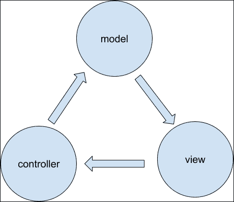
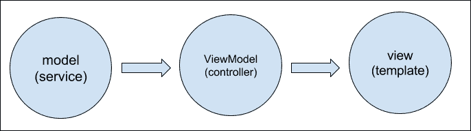
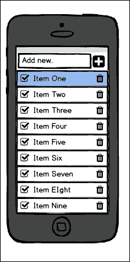
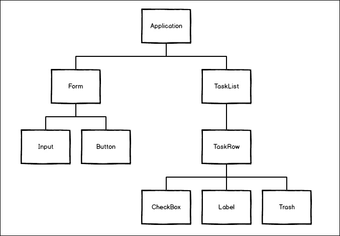

# 第一章：Angular 2 组件架构

我们对 Web 应用程序的思考方式已经改变了。本章的目标是概述构建前端应用程序的现有流行架构模式，以及依赖于组合自包含自定义组件的新方法。

了解在 Angular 1 中实现的架构模式将有助于您将现有应用程序迁移到将来的 Angular 2。在本章中，我们将讨论这些主题：

+   模型视图控制器模式概述

+   Angular 1 中的模型、视图和 ViewModel 的实现

+   从 MVVM 迁移到组件

+   Angular 2 组件架构的示例

# 模型-视图-控制器模式

这是一种用于实现用户界面的架构设计模式，多年来一直用于桌面 GUI。

它将应用程序分为三个不同的部分：

+   模型：这负责存储实际数据

+   **视图**：这是将数据呈现给用户的表示层

+   **控制器**：模型和视图之间的粘合剂

以下图表描述了这些部分之间的关系：



这种模式描述了这些部分之间的通信。**视图**反映模型中的数据，但不能直接改变模型中的数据。通常将模型和视图之间的关系描述为只读的（视图只能从模型中读取）。视图使用**控制器**通过调用方法和更改属性。**控制器**更新模型，导致视图更新并呈现新数据。

MVC 最初是为桌面应用程序开发的，但已被广泛采用作为构建单页面 Web 应用程序的架构，并且可以在所有流行的客户端框架中找到，包括 Angular。

# 在 Angular 1 中的 MVC

Angular 1 实现了经典 MVC 的变体，称为**Model View ViewModel**（**MVVM**）。这种模式描述了不同角色和部分之间的通信：

+   **模型**：这保存数据或充当数据访问层

+   **视图**：像 MVC 一样，这是表示层

+   **ViewModel**：这是绑定到视图的视图的抽象

以下图表描述了使用 Angular 1 术语的这些部分之间的关系：



在 Angular 1 中，**ViewModel**是一个名为'`$scope`'的对象，由 Angular 控制器构造。我们并不总是直接与这个对象交互。它与视图的绑定是双向的（在 Angular 中，我们将视图称为'模板'）。ViewModel 可以读取和修改模型上的数据，并在必要时更新自身。视图将立即反映这些变化。Angular 不包括任何预定义的模型类型。相反，我们将我们的模型编码为纯 JavaScript，并将其注册为 Angular 服务。以下代码片段显示了自定义模型服务`Model.js`的结构：

```ts
class Product {
  constructor(){
    this.color = "red";
  }
}
```

以下代码片段显示了`ViewModel.js`的结构：

```ts
class ProductController {
  constructor(Product) {
    this.product = Product
  }
}
```

以下代码片段显示了`View.html`的结构：

```ts
<p>{{ product.color }}</p>
```

# 从视图转向组件

Angular 应用程序围绕视图的概念构建。在 Angular 中，视图指的是模板（HTML），大多数情况下由一个或多个控制器管理。这个视图也可以包含一些自定义指令，这些指令封装了一些其他的 HTML 和 JavaScript 块。多年来，Angular 开发人员倾向于创建更多的指令，并将它们用作替换原始 HTML 标记的自定义元素的构建块。

从小的自定义元素组合视图的概念变得流行，并且可以在其他流行的现代框架（如 react 和 polymer）中找到。Angular 2 很好地围绕这个概念构建，并将基于这些构建块构建 UI 架构。因此，从现在开始，我们将组件称为构建块，将模板称为布局。

# 定义组件

组件是将 UI 代码组织成自包含、可重用的块的一种清晰方式，其中包含它们自己的视图和逻辑。组件可以组合在一起创建复杂的用户界面。组件可以选择性地从外部接收属性，并可以通过回调或事件进行通信。业务逻辑、结构和样式可以封装在组件代码中。

在 Angular 2 中，组件只是带有视图的指令。实际上，Angular 2 中的组件是一种指令。在 Angular 2 中，我们也可以编写不包含模板（并且不会被称为组件）的指令。

这些指令与您在 Angular 1.x 中熟悉的指令非常相似。主要区别在于，在 Angular 2.0 中，我们考虑两种类型的指令：为元素添加行为的属性指令，以及我们称之为组件的结构指令。

# 将应用程序分解为组件

Angular 2 应用程序是一组组件。我们为每个 UI 元素、视图和路由定义一个组件。我们必须定义一个根组件，我们将用作所有其他组件的容器。换句话说，Angular 2 应用程序是一个组件树。

设计良好、面向组件的 Angular 2 应用程序的关键是成功地将 UI 分解为组件树。例如，让我们谈谈一个简单的移动待办事项列表应用程序，它看起来像这样：



构成此 UI 的组件树将如下所示：



该应用程序由九个组件组成。在根部是**Application**组件，其中包含所有其他组件。接下来，我们找到**Form**组件，它由**Input**组件和**Button**组件构成。

**TaskList**组件是**TaskRow**组件的容器。每个 TaskRow 包括三个组件——**CheckBox**，**Label**和**Trash**图标。

关于您应该创建多少组件并没有严格的规定，但最佳实践是将 UI 分解为尽可能多的组件。组件的数量将影响应用程序的其他方面，如可重用性、维护和测试。

# 摘要

从组件构建 UI 的想法并不新鲜。在 Angular 1 中，我们有能力开发行为像组件的指令，但这并不是强制性的。在 Angular 2 中，整个应用程序是一个组件树，因此将设计分解成小部分并学习如何构建组件的能力至关重要。
