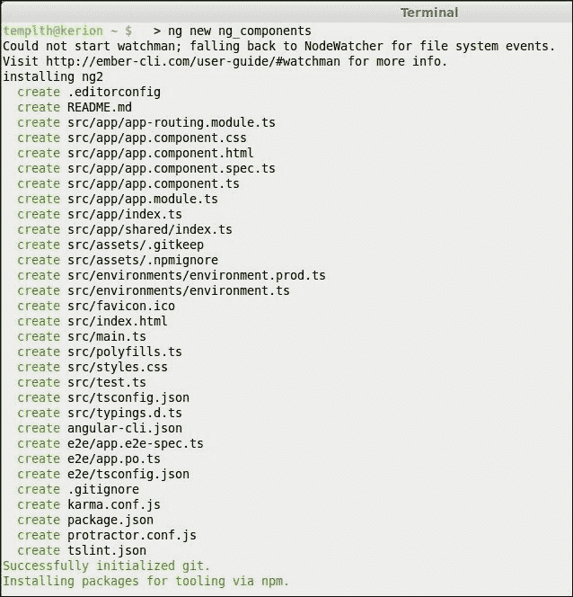
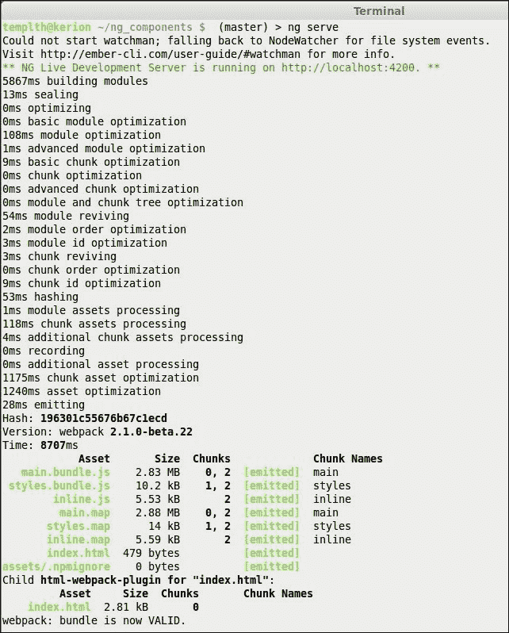
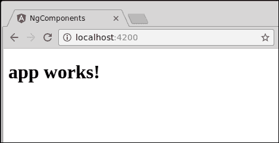

# 第二章：使用 angular-cli 设置 Angular 2 开发环境

Angular 2 利用现代 Web 技术和工具，这意味着开发环境变得更加复杂，需要一些工具和对它们的理解。

幸运的是，我们不需要花时间安装和配置所有必需的依赖项并将所有内容连接在一起。我们可以使用与 Angular 2 并行开发的 angular-cli（命令行工具）。

在本章中，我们将介绍如何使用 angular-cli 设置我们的开发环境：如何安装它以及如何使用它在几分钟内启动我们的 Angular 2 项目。

# Node 和 npm

在我们可以开始使用 angular-cli 之前，我们需要在我们的机器上安装 Node.js。Node 是建立在 Chrome 的 V8 JavaScript 引擎上的 JavaScript 运行时。它使 JavaScript 能够在没有浏览器的情况下运行，这导致了我们今天使用的许多开发工具的开发，如任务运行器、编译器、linter 和模块加载器。现代 Web 前端开发环境依赖于这些工具。

## 安装 Node

Node 是跨平台的，因此可以在任何流行的操作系统上运行。安装`node`的最简单方法是下载适用于您操作系统的官方安装程序。要做到这一点，转到[`nodejs.org/en/`](https://nodejs.org/en/)并找到 Windows、Macintosh 或 Linux 的官方安装程序。目前，Node 发布有两个主要路径——**长期支持**（**LTS**）和稳定版本。对于本书，我们将使用 Node 的 LTS 版本。确保下载 Node 4.24.53 LTS 版本的安装程序。

在成功下载并运行安装程序后，打开您的终端（或 Windows 中的命令行）并键入`node -v`。此命令应打印您刚刚安装的`node`的当前版本；在我们的情况下，应该是`4.24.53`或更高版本。

我们使用`node`作为我们的开发环境工具所依赖的 JavaScript 引擎。由于我们在本书中不会编写任何 Node.js 代码，因此此处提到的版本并没有任何特殊含义，但我们将使用的其他工具会有。

注意！angular-cli 工具将与大于 4.x 的任何 node 版本一起工作，因此您可以使用其他安装版本。

## 介绍 npm

Npm 是 node 的软件包管理器。它与 node 安装程序捆绑在一起。如果您在上一步成功安装了`node`，则应该准备好使用 npm。为了确保它已正确安装，请打开终端（Windows 上的命令行）并键入`npm -v`。此命令应打印出`npm`版本。它应该是 3 或更高版本。

我们使用`npm`来安装我们开发和运行时所需的依赖项。Npm 在`npm`注册表中搜索这些软件包，目前包含超过 19 万个软件包（并且还在增长）。您可以访问[`www.npmjs.com/`](https://www.npmjs.com/)并搜索软件包，或者使用`npm cli`来搜索、安装和管理软件包。Npm 还帮助我们管理项目生命周期，我们将在下面看到。

# 安装 angular-cli

我们将使用`npm`在我们的工作站上安装 angular-cli。要这样做，请按照以下简单步骤操作：

1.  启动`Terminal`（或 Windows 中的命令行）。

1.  键入：`npm install -g angular-cli@latest`并按*Enter*（在 Windows 上，您可能需要以管理员身份运行此命令）。

就是这样！`angular-cli`现在已安装在您的计算机上，并且因为我们在`npm install`命令中使用了`-g`标志，`angular-cli`暴露了一个`ng`别名，可以从任何地方使用。`（-g`代表`global`，这意味着该模块已安装在系统级目录上）。

# 生成一个 Angular 2 项目

我们将使用`angular-cli`的第一个命令是`new`。此命令将为我们的项目创建一个文件夹结构并安装所有必需的依赖项。除了基本的 Angular 2 文件和模块之外，`angular-cli`还将安装用于测试、linting 和文档化我们的代码的模块。本书主要讨论组件，因此我们不会涉及大部分这些内容。您可以在官方 angular-cli 页面上阅读更多关于可用命令的信息：[`cli.angular.io/`](https://cli.angular.io/)。

要生成一个新项目，请按照以下步骤操作：

1.  启动`Terminal`（或 Windows 中的命令行）。

1.  键入`ng new ng_components`并按*Enter*。

`angular-cli`软件将在当前目录下生成一个新项目。



请注意，最后一行打印出：`通过 npm 安装工具包`。`angular-cli`工具将在后台使用标准的`npm`命令下载所有所需的模块。

就是这样！你刚刚生成了一个完整的 Angular 2 项目，其中已经配置和连接了一切所需的东西。

要在开发服务器上提供它，请按照以下步骤操作：

1.  使用`cd`命令导航到刚刚创建的目录，输入：`cd ng_components.`

1.  输入`ng serve`并坐下来。

等待`angular-cli`打印以下内容：



### 注意

如果看到与 Brocolli 相关的内容，那是因为之前的`angular-cli`版本没有被正确卸载。在这种情况下，使用以下命令：

```ts
**$ npm uninstall -g angular-cli**
**$ npm cache clean**

```

然后，您可以按照本章中描述的方式重新安装该工具，使用以下命令：

```ts
**$ npm install -g angular-cli@latest**

```

在幕后，`angular-cli`构建项目，启动服务器并提供应用程序。现在我们只需要启动浏览器并将其指向`http://localhost:4200`：



幕后发生了很多事情。angular-cli 工具使用各种其他工具，比如`webpack`来完成其魔术。这些工具超出了本书的范围，但你可以在 GitHub 上的 angular-cli 文档中阅读有关它的所有内容，网址是[`github.com/angular/angular-cli`](https://github.com/angular/angular-cli)。

# 选择一个 IDE

虽然可以使用纯文本编辑器开发 Angular 2 应用程序，但强烈建议使用集成开发环境（IDE）。我个人使用`webstorm`（[`www.jetbrains.com/webstorm/`](https://www.jetbrains.com/webstorm/)），它提供了对 Angular 的完整支持。如果你正在寻找免费的开源替代方案，我们有`VSCode`（[`code.visualstudio.com/`](https://code.visualstudio.com/)），它也自然地支持 Angular 2。它们两者都提供了 Angular 代码检查和高亮显示，以及重构和自动完成功能。WebStorm 与几乎所有 JavaScript 工具完全集成，被许多人认为是最好的 JavaScript IDE。

# 总结

在本章中，我们学习了如何使用 angular-cli 在几分钟内创建、配置和提供新的 Angular 2 项目。这个工具帮助我们作为开发人员专注于我们的应用程序代码，而不是配置。

在下一章中，我们将熟悉 TypeScript 语言，重点关注构建 Angular 2 组件（以及项目的其余部分）的重要特性。
