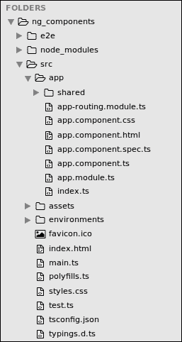
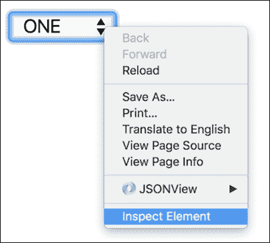

# 第四章：构建基本组件

在其核心，Angular 2 组件是一个负责向视图公开数据并实现用户交互逻辑的类。Angular 2 组件可以与 Angular 1 的控制器、作用域和视图进行比较。

Angular 2 如何知道如何处理我们的类作为组件？我们需要向类附加元数据，告诉 Angular 如何处理它。

元数据一词描述了我们添加到代码中的附加信息。这些信息在运行时由 Angular 2 使用。

在本章中，我们将涵盖以下主题：

+   Angular 2 组件的解剖

+   组件选择器

+   组件模板

+   组件样式

+   视图封装（影子 DOM）

+   数据绑定

+   Angular 2 组件的解剖

在第二章, *使用 angular-cli 设置 Angular 2 开发环境*，设置开发环境时，我们使用`angular-cli`工具从头开始生成了一个 Angular 2 项目，并将其提供给浏览器。如果您还没有这样做，请参考第二章, *使用 angular-cli 设置 Angular 2 开发环境*，并按照步骤进行操作。

完成后，是时候在我们喜爱的 IDE 中打开项目（也在第二章, *使用 angular-cli 设置 Angular 2 开发环境*中描述），检查代码。它应该类似于以下截图：


当我们使用`angular-cli`生成项目时，会为我们创建一个带有我们应用程序名称的组件（我们提供给`ng new`命令）。我们可以在`src/app`目录下找到它，如下所示：



找到名为`app.component.ts`的文件，并在编辑视图中打开它（编辑视图可能因 IDE 而异）。

让我们逐行探索组件代码，这是`app.component.ts`的代码

```ts
[app.component.ts]
import { Component } from '@angular/core';

@Component({
  selector: 'app-root',
  templateUrl: './app.component.html',
  styleUrls: ['./app.component.css']
})
export class AppComponent {
  title = 'app works!';
}
```

在第一行，我们从 Angular 核心模块导入`Component`装饰器

+   然后，我们通过在装饰器名称后面分配`@`符号来声明`Component`装饰器。因为装饰器只是一个函数（参考第三章，“TypeScript 入门”中的解释），我们需要像调用任何其他函数一样使用括号来调用它。

+   `Component`装饰器接受一个对象作为参数，该对象定义了组件的元数据。我们稍后会探讨它。

+   在装饰器之后，我们声明组件类，它应该包含我们的组件逻辑，并且当前声明了名为`title`的字符串。

+   类需要被导出，这样它才能在代码的其他地方使用。

正如我们所看到的，Angular 2 组件必须由两个不同的部分构建：一个简单的类和一个装饰器。

在我们深入研究这段代码之前，让我们打开浏览器，探索已经呈现到浏览器的元素。

为此，将浏览器指向`http://localhost:4200/`（我正在使用 Google Chrome），右键单击标题，然后从弹出菜单中选择**检查**：


这将打开 Chrome DevTool，我们将在其中探索 DOM：


我们在元数据中定义的`selector`成为了具有相同名称的元素，我们在组件类中定义的`title`作为`<h1>`标签呈现在其中。

`<app-root>`是如何找到 DOM 的？`<h1>`标签是从哪里来的？

# 引导应用程序

在处理组件和 DOM 之间的链接之前，让我们介绍模块的概念以及如何使用它来引导应用程序。

在项目根目录的`src`目录下，找到并打开`main.ts`文件：


这个文件是我们 Angular 应用程序的起点。它负责实例化应用程序的主模块和其中的根组件。为此，我们从`platform-browser-dynamic`模块中导入`platformBrowserDynamic`方法，该方法是 Angular 的一部分。这个方法返回一个对象来启动应用程序。这个对象的`bootstrapModule`方法负责通过渲染组件树的根组件来启动 Angular。它需要传递主模块作为参数，所以我们导入我们的模块类`AppModule`并将其传递给`bootstrap`：

以下代码来自`main.ts`文件：

```ts
import './polyfills.ts';
import { platformBrowserDynamic } from '@angular/platform-browser-dynamic';
import { enableProdMode } from '@angular/core';
import { environment } from './environments/environment';
import { AppModule } from './app/';

if (environment.production) {
  enableProdMode();
}

platformBrowserDynamic().bootstrapModule(AppModule);
```

其余的代码对使用根模块引导 Angular 没有任何影响。`enableProdMode`方法是 Angular 核心中的一个方法，它在生产模式下运行应用程序。环境只是一个常量，它保存一个布尔值，指示我们是否在生产环境中运行。

模块是将一组组件、指令、服务和管道聚合到一个单一实体中的便捷方式，可以进入其他模块。每个 Angular 应用程序都包含一个根模块，在我们的情况下是`AppModule`。它包含应用程序的根组件。

模块只是一个用`@NgModule`装饰的类，它接受一个对象作为参数，该对象定义了模块的元数据。

请注意，我们使用了动态引导的方法，利用了即时编译器。这会在内存中和浏览器中动态编译组件。另一种称为**预编译**（**AoT**）的替代方法在 Angular 2 中也是可能的。在这种情况下，无需将 Angular 编译器发送到浏览器，性能提升可能是显著的。

在这种情况下，在预编译应用程序之后，您需要在`main.ts`文件中使用`platform-browser-dynamic`模块的`platformBrowserDynamic`方法：

```ts
import './polyfills.ts';
import { platformBrowser } from '@angular/platform-browser';
import { enableProdMode } from '@angular/core';
import { environment } from './environments/environment';
import { AppModuleNgFactory } from './app/app.module.ng.factory';

if (environment.production) {
  enableProdMode();

}

platformBrowser().bootstrapModuleFactory(AppModuleNgFactory);
```

# 组件选择器

正如我们在本章的第一个示例中所看到的，我们在组件装饰器中定义的**选择器**成为一个呈现到 DOM 中的元素。在我们探索选择器选项之前，让我们了解一下 Angular 如何呈现这个组件。

正如我们在第一章中讨论的*Angular 2 组件架构*，Angular 2 应用程序可以被描述为一个组件树。就像任何其他树结构一样，只有一个根节点。目前在我们的项目中，我们只有一个组件，它被用作树节点。

有了这些信息，让我们看看 Angular 如何实例化我们的根组件并将其呈现出来：

在项目根目录的`src/app`目录下，找到并打开`app.module.ts`文件。这个文件包含了应用程序的根模块的定义：

```ts
[app.module.ts]
import { BrowserModule } from '@angular/platform-browser';
import { NgModule } from '@angular/core';
import { FormsModule } from '@angular/forms';
import { HttpModule } from '@angular/http';
import { AppComponent } from './app.component';

@NgModule({
  declarations: [
    AppComponent
  ],

  imports: [
    BrowserModule,
    FormsModule,
    HttpModule
  ],

  providers: [],
  bootstrap: [AppComponent]
})
export class AppModule { }
```

`app.module.ts` 负责实例化组件类。当这发生时，Angular 会在`index.html`文件中搜索我们在组件装饰器中定义的选择器。我们需要放置在`index.html`中的唯一组件是在`app.module.ts`中的根模块的`bootstrap`属性中定义的根组件。

请注意，此组件需要在`declarations`属性中指定，列出模块中所有可用的组件。

打开`index.html`，它位于`main.ts`旁边，检查代码：

```ts
[index.html]
<html>
  <head>
    <!-- other code related to the page head -->
  </head>
  <body>
    <app-root>Loading...</app-root>
  </body>
</html>
```

我们看到的第一件事是，在我们的`html`文件中，我们将选择器用作元素。这是 Angular 的默认行为。

您在`index.html`中找到的其他代码与`angular-cli`使用的构建系统相关，这超出了本书的范围。

你需要知道的是，当这个 HTML 加载到服务器时，Angular 会加载所有必需的依赖项，你需要运行`main.ts`中的代码来启动框架。

## 选择器选项

当我们构建组件时，我们正在创建新的 HTML 元素。这就是为什么默认情况下我们的选择器名称在 HTML 中用作元素的原因。但是，我们还有其他选项可以用于构建组件。让我们来探索一下：

+   按 CSS 类名选择：

```ts
    @Component({
      selector: '.app-root'
    })
    ```

在标记中使用：

```ts
    <div class="app-root">Loading...</div>
    ```

+   按属性名选择：

```ts
    @Component({
      selector: '[app-root]'
    })
    ```

在标记中使用：

```ts
    <div app-root>Loading...</div>
    ```

+   按属性名和值选择：

```ts
    @Component({
      selector: 'div[app=components]'
    })
    ```

在标记中使用：

```ts
    <div app="components">Loading...</div>
    ```

+   仅在元素不匹配选择器时选择：

```ts
    @Component({
      selector: 'div:not(.widget)'
    })
    ```

在标记中使用：

```ts
    <div class="app">Loading...</div>
    ```

+   如果其中一个选择器匹配，则选择：

```ts
    @Component({
      selector: 'app-root, .app, [ng=app]'
    })
    ```

在标记中使用：

```ts
    <app-root>Loading...</app-root>
    <div class="app">Loading...</div>
    <div ng="app">Loading...</div>
    ```

大多数情况下，保留默认值——即组件选择器——正是我们在构建常见组件时想要的。在后面的章节中，我们还将看到其他用法。

现在，我们将保留选择器为默认值。

# 组件模板

模板是 Angular 2 中组件的核心。没有模板，就没有东西可以渲染到 DOM 中。有两种方法可以将模板附加到组件上：

+   提供外部`html`文件的 URL

+   内联定义模板

由`angular-cli`创建的`app-root`包含外部模板。它是用`templateUrl`属性定义的：

```ts
[app.component.ts]
@Component({
  selector: 'app-root',
  templateUrl: './app.component.html'
})
```

我们可以在`app.component.ts`旁边找到模板，它是一个与`app.component.html`同名的 HTML 文件。让我们打开它来检查代码：

```ts
[app.component.html]
<h1>
  {{title}}
</h1>
```

现在我们知道`<h1>`是从哪里来的。你可以猜到，双大括号会从组件类中渲染标题。

如果我们想要内联声明我们的模板，我们应该使用模板属性。幸运的是，在 ES6 中，我们有一种简单创建多行字符串的方法。这个功能称为**模板字符串**，并且用反引号（`` ` ``）字符。 在以下示例中，我们演示了如何声明内联模板：

```ts
[app.component.ts]
@Component({
  selector: 'app-root',
  template: `
    <h1>
      {{title}}
    </h1>
  `
})
```

将模板保持内联是方便的，因为我们可以在同一个文件中看到模板和组件类。

## 在组件模板中嵌入样式

我们可能会想要在组件的模板中使用一些 CSS。与模板一样，我们有两个选择——内联指定我们的 CSS 类或为外部样式表提供 URL。目前，我们的组件使用一个外部 CSS 文件，通过在`styleUrls`数组中声明路径。

如属性名称所示，我们可以提供多个 URL 以从中提取 CSS。这些 CSS 文件上定义的样式现在可以在我们的模板中使用。首先让我们看一下当前的组件声明：

```ts
[app.component.ts]
@Component({
  selector: 'app-root',
  template: `
    <h1>
      {{title}}
    </h1>
  `,
  styleUrls: ['./app.component.css']
})
```

或者，我们可以使用**styles**属性以内联方式定义样式，就像模板一样。**styles**是一个字符串数组，我们可以在其中编写我们的 CSS 规则。下面的示例演示了如何使用内联样式来为`<h1>`标签设定样式：

```ts
[app.component.ts]
@Component({
  selector: 'app-root',
  template: `
    <h1>
      {{title}}
    </h1>
  `,
  styles: [`
    h1 { color: darkblue }
  `]
})
```

让我们在 Chrome DevTool 中探索该元素。右键单击`title`并从弹出菜单中选择检查。Chrome DevTool 将启动：


通过 DevTool 查看元素，可以暴露一些关于组件样式的事实：

+   我们定义的样式被转换为一个内联样式标签，位于文档的`head`部分的顶部

+   样式定义已更改，现在包括其旁边的一个属性，这使其具体化并几乎不可能被覆盖

Angular 通过生成一个唯一的属性并将其附加到我们定义的原始 CSS 选择器来保护组件的样式不被覆盖。这种行为试图模仿阴影 DOM 的工作方式。因此，在继续之前，我们需要了解什么是阴影 DOM。

# 阴影 DOM

当我们在 Angular 2 中创建一个组件时，会创建一个阴影 DOM，并且我们的模板会被加载到其中（默认情况下）。什么是阴影 DOM？阴影 DOM 指的是 DOM 元素的子树，它作为文档的一部分呈现，但不在主文档 DOM 树中。

让我们看一个众所周知的阴影 DOM 的示例，一个 HTML `select` 它是如何运作的。在您喜欢的文本编辑器中创建一个普通的 HTML 文件，然后在其 body 中创建一个 `select` 元素：

```ts
<!doctype html>
<html lang="en">
  <head>
    <meta charset="UTF-8">
    <title>Document</title>
  </head>
  <body>
    <select>
      <option>ONE</option>
      <option>TWO</option>
      <option>THREE</option>
    </select>
  </body>
</html>
```

接下来，在 Chrome 中打开它，在元素上右键单击，然后从弹出菜单中选择**检查元素**：



Chrome DevTool 将弹出，我们可以在**Elements**标签中检查`select`元素：


如果您曾经尝试过使用 CSS 定制原生`html select`元素的外观，您就会知道需要进行破解和开发一种解决方案来使其工作。`select`元素有样式结构，甚至有内置的行为，但我们看不到它。它被封装在元素内部。

如果您对封装这个术语不熟悉，这里有一个从维基百科摘取的快速定义：

**封装**是一种面向对象编程的概念，它将数据和操纵数据的函数绑定在一起，并且保护它们免受外部干扰和误用。

那么，`select`元素的外观是从哪里来的？Chrome DevTool 有一个可以与该元素的影子 DOM 相媲美的功能。要启用此功能，请转到 Chrome DevTool 的设置菜单：


向下滚动并找到**Elements**部分。勾选复选框**显示用户代理影子 DOM**：


现在，让我们再次检查`select`元素：


现在我们清楚地看到，`select`元素隐藏了一个秘密的 DOM 树。在`select`元素下面，创建了一个新的根（`#shadow-root`），并且一个内容元素就在其下面渲染。隐藏的内容标签具有一个名为`select`的属性，它定义了一些内部行为。对于 option 标签也是一样的。如果你想探索另一个创建影子 DOM 的流行 HTML 元素，可以使用`<input type='file' />`重复这些步骤。

这种强大的能力来创建一个封装自身样式、行为甚至数据的本地元素，在 Angular 2 中也是可能的。

# 封装模式

默认情况下，正如我们所见，我们的组件不会封装其结构和样式。这意味着来自组件外部的 CSS 类可以覆盖并影响我们定义的嵌入式 CSS 样式，以及组件的 HTML 结构也是可访问的。

Angular 将为我们的`selector`生成一个独特的属性来保护我们的样式，但这可以通过 CSS 的`!important`语句来覆盖。

要更改这一点，我们需要定义一个封装模式。Angular 2 为我们提供了三个选择：

+   **模拟**（默认）：Angular 将向类`selector`添加一个特殊属性，以避免影响组件之外的其他样式。

+   **本地**：这是渲染器应用的本地封装机制。在我们的情况下，它是浏览器。Angular 将为该组件创建一个影子 DOM，这意味着外部 CSS 无法影响我们的组件。

+   **None**：不会应用任何封装。

要定义封装选项，我们需要从 Angular 核心中导入`ViewEncapsulation`并使用其中一个选项来定义组件的封装属性。以下示例演示了如何将组件封装模型设置为`None`：

```ts
[app.component.ts]
@Component({
  selector: 'app-root',
  encapsulation: ViewEncapsulation.None,
  template: `
    <h1>
      {{title}}
    </h1>
  `,
  styles: [`
    h1 { color: darkblue }
  `]
})
```

大多数情况下，保留默认的模拟模式就可以了。在未来的章节中，我们会遇到一些必须将模式设置为`None`的情况。

# 数据绑定

要完全了解由 angular-cli 为我们生成的组件代码，我们需要讨论数据绑定。换句话说，我们能够将在组件类中声明的**title**呈现到组件模板的方法。

首先，让我们看一下整个组件代码：

```ts
[app.component.ts]
import { Component, ViewEncapsulation } from '@angular/core';

@Component({
  selector: 'app-root',
  encapsulation: ViewEncapsulation.None,
  template: `
    <h1>
      {{title}}
    </h1>
  `,
  styles: [`
    h1 { color: darkblue }
  `]
})
export class AppComponent {
  title = 'app works!';
}
```

很容易在模板中发现双大括号。这是 Angular 模板语法的一部分，负责从组件类进行单向数据绑定。在这种情况下，我们将 title 属性（字符串）绑定到`<h1>`标签之间呈现。

在本书的后面，我们将探索更多的绑定选项。

# 总结

在 Angular 2 中，组件是一个带有装饰器的类，该装饰器为其添加重要的元数据。组件装饰器定义了我们如何使用它以及它可以做什么。当调用装饰器时，选择器和模板是最低要求的字段（如果其中一个缺少，Angular 将抛出错误）。

如果我们将视图封装定义为本地，Angular 将为我们的组件创建一个影子 DOM，这样可以保护嵌入样式不受页面上外部 CSS 的影响。

在下一章中，我们将继续开发我们的组件并使其动态化。
