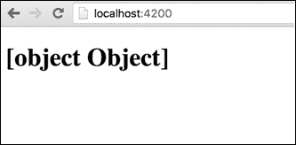

# 第五章：构建动态组件

组件本质上是数据驱动的。它们应该能够呈现动态数据，响应用户交互，并对事件做出反应。

在本章中，我们将继续在第四章中停下来，重点放在组件模板语法上，并学习如何绑定数据和事件。

将涵盖的主题如下：

+   数据插值

+   使用核心指令

+   属性绑定

+   事件绑定

+   双向绑定

# 数据插值

在第三章中，*TypeScript 入门*，我们将一个简单的字符串绑定到模板。如果您还没有这样做，请参考第四章，*构建基本组件*。让我们回顾一下我们的 app-component 代码：

```ts
[app.component.ts]
import { Component, ViewEncapsulation } from '@angular/core';

@Component({
  selector: 'app-root',
  encapsulation: ViewEncapsulation.None,
  template: `
    <h1>
      {{title}}
    </h1>
  `,
  styles: [`
    h1 { color: darkblue }
  `]
})
export class AppComponent {
  title = 'app works!';
}
```

现在，我们将专注于模板。从组件装饰器中删除`encapsulation`和`styles`属性，以使其更清晰和专注。在这样做的同时，让我们也给我们的类添加一个类型和一个构造函数：

```ts
[app.component.ts]
import { Component } from '@angular/core';

@Component({
  selector: 'app-root',
  template: `
    <h1>
      {{ title }}
    </h1>
  `
})
export class AppComponent {
  title: string;

  constructor() {
    this.title = 'app works!';
  }
}
```

这是从数据源（在我们的情况下是组件类）到视图（组件模板）的单向绑定。Angular 插值`title`并在双大括号之间输出结果。

双大括号只能插值字符串。如果我们尝试绑定一个对象，它将不起作用。在以下示例中，我创建了一个包含`title`的对象，并在浏览器中检查结果：

```ts
[app.component.ts]
import { Component } from '@angular/core';

@Component({
  selector: 'app-root',
  template: `
    <h1>
      {{ info }}
    </h1>
  `
})
export class AppComponent {
  info: {};

  constructor() {
    this.info = {title: 'app works!'};
  }
}
```

以下是输出：



### 注意

如果您在浏览器中看不到结果，请确保运行`ng serve`命令。如果您不确定如何操作，请参考第二章，*使用 angular-cli 设置 Angular 2 开发环境*。

我们可以绑定到对象属性，只需记住一切都将被插值为字符串。以下示例将正确呈现`title`：

```ts
[app.component.ts]
import { Component } from '@angular/core';

@Component({
  selector: 'app-root',
  template: `
    <h1>
      {{ info.title }}
    </h1>
  `
})
export class AppComponent {
  info: {};

  constructor() {
    this.info = {title: 'app works!'}
  }
}
```

我们在大括号之间写的是一个 angular 表达式。这意味着 angular 在将表达式转换为字符串之前对其进行评估。换句话说，我们可以在表达式中放入简单的逻辑，甚至绑定到一个方法。考虑以下示例：

```ts
[app.component.ts]
import { Component } from '@angular/core';

@Component({
  selector: 'app-root',
  template: `
    <h1>{{ info.title }}</h1>
    <h2>{{ info.subtitle || 'alternative text' }}</h2>
    <h3>My name is: {{ getFullName() }}</h3>        
  `
})
export class AppComponent {
  info: {};
  firstName: string;
  lastName: string;

  constructor() {
    this.info = {title: 'app works!'}
    this.firstName = 'Nir';
    this.lastName = 'Kaufman';
  }

  getFullName(){
    return `${this.firstName} ${this.lastName}`;
  }
}
```

在 angular 表达式中，我们不能使用`new`关键字和运算符，如：`++`，`--`和`+=`。

一般来说，表达式不应该太复杂。

组件模板的上下文是组件实例。这意味着你不能访问全局变量，比如`window`，`document`或`console.log`。

# 核心指令

如果你熟悉 Angular 1.x，你已经知道指令是什么。如果不熟悉，这里有一个简单的定义：指令是一个自定义属性，为元素添加功能。在 Angular 中，组件被认为是指令的一种特殊情况，其中包含一个模板。

Angular 2 核心包括几个指令—NgClass、NgFor、NgIf、NgStyle、NgSwitch、NgSwitchWhen 和 NgSwitchDefault。

如果你熟悉 Angular 1，你已经知道这些指令能做什么，尽管语法和底层实现已经改变。

这些指令旨在帮助我们实现常见的模板任务，比如 DOM 操作。

为了能够在组件中使用核心指令，我们需要将`BrowserModule`模块导入到组件所在的模块中。这是在生成应用程序时由 angular-cli 自动完成的，在`app.module.ts`文件中：

```ts
import { BrowserModule } from '@angular/platform-browser';
import { NgModule } from '@angular/core';
import { AppComponent } from './app.component';

@NgModule({
  declarations: [
    AppComponent
  ],

  imports: [
    BrowserModule
  ],

  bootstrap: [AppComponent]
})
export class AppModule { }
```

让我们探索如何在我们的代码中使用它们。

## NgIf

就像 Angular 1 一样，NgIf 指令会根据我们传递的表达式来删除或重新创建 DOM 的一部分。表达式应该评估为`true`或`false`。

这是我们如何使用`ngIf`：

```ts
[app.component.ts]
import { Component } from '@angular/core';

@Component({
  selector: 'app-root',
  template: `
    <h1>{{ info.title }}</h1>
    <h2>{{ info.subtitle || 'alternative text' }}</h2>  
    <h3 *ngIf="showFullName">My name is: {{ getFullName() }}</h3> 
  `
})
export class AppComponent {
  info: {};
  firstName: string;
  lastName: string;
  showFullName: boolean;

  constructor() {
    this.info = {title: 'app works!'};
    this.firstName = 'Nir';
    this.lastName = 'Kaufman';
    this.showFullName = false;
  }

  getFullName(){
    return `${this.firstName} ${this.lastName}`;
  }
}
```

不要担心`ngIf`属性前的星号，我们将在一会儿讨论它。我们分配了一个名为`showFullName`的表达式，它存在于组件类中。因此，在组件类中，我们声明了一个名为`showFullName`的类型为布尔型的类成员，并在构造函数中将其初始化为`false`。

因此，`<h3>`标签不会渲染到 DOM 中，我们也看不到完整的名字。

### 星号—*

指令名称前的星号（`*`）是 Angular 的一种语法糖，它隐藏了我们对`<template>`标签的使用。这个标签被用在*结构指令*中，这是一个描述影响 DOM 结构的指令的术语。

前面的例子可以这样写：

```ts
[app.component.ts]
import { Component } from '@angular/core';

@Component({
  selector: 'app-root',
  template: `
    <h1>{{ info.title }}</h1>
    <h2>{{ info.subtitle || 'alternative text' }}</h2>

     <template [ngIf]="showFullName">
      <h3>My name is: {{ getFullName() }}</h3>        
    </template>      
  `
})
export class AppComponent {
  info: {};
  firstName: string;
  lastName: string;
  showFullName: boolean;

  constructor() {
    this.info = {title: 'app works!'};
    this.firstName = 'Nir';
    this.lastName = 'Kaufman';
    this.showFullName = false;
  }

  getFullName(){
    return `${this.firstName} ${this.lastName}`;
  }
}
```

这就是 Angular 在幕后所做的，但是在使用语法的较短版本时，我们不需要担心。

## NgClass

NgClass 指令，就像在 Angular 1 中一样，有条件地添加和删除 CSS 类。我们传递一个可以以三种不同方式解释的表达式：

+   一个包含我们想要添加的所有 CSS 类的字符串，以空格分隔

+   要添加的 CSS 类的数组

+   将 CSS 类映射到布尔值（`true`或`false`）的对象

让我们演示使用`ngClass`的各种选项，从一个字符串开始：

```ts
[app.component.ts]
import { Component } from '@angular/core';

@Component({
  selector: 'app-root',
  styles: [`
    .italic { font-style: italic}
    .info { color: blue; } 
  `],
  template: `
    <h1>{{ info.title }}</h1>
    <h2 [ngClass]="getClass()">
      {{ info.subtitle || 'alternative text' }}</h2>

    <template [ngIf]="showFullName">
      <h3>My name is: {{ getFullName() }}</h3> 
    </template>  
  `
})
export class AppComponent {
  info: {};
  firstName: string;
  lastName: string;
  showFullName: boolean;

  constructor() {
    this.info = {title: 'app works!'};
    this.firstName = 'Nir';
    this.lastName = 'Kaufman';
    this.showFullName = false;
  }

  getFullName(){
    return `${this.firstName} ${this.lastName}`;
  }

  getClass(){
    return 'info italic';
  }
}
```

我们将`ngClass`应用到`<h2>`标签上，并传递一个我们在组件类中实现的方法。`getClass()`方法返回一个包含我们想要附加到`<h2>`元素的两个 CSS 类名的字符串。不要担心围绕`ngClass`指令的方括号。我们将在下一刻解释这个语法。

我们可以以另外两种方式实现该方法，以达到相同的结果：

+   第一种方法是通过返回一个数组：

```ts
getClass(){
  return ['info', 'italic'];
}
```

返回一个对象：

```ts
getClass(){
  return { italic: true, info: true };
}
```

+   第二种方法是使用方括号`（[ ]）`

### 提示

在 Angular 2 中，我们可以直接将数据绑定到 DOM 或指令属性。`ngClass`选择器被定义为一个属性，所以如果我们想使用它，我们需要使用方括号语法。当我们处理数据绑定时，我们将在本章后面看到更多例子。

## NgStyle

`ngStyle`指令将根据评估对象的表达式改变元素的内联样式。在下面的例子中，我们将使用`ngStyle`动态地为标题分配字体大小：

```ts
[app.component.ts]
import { Component } from '@angular/core';

@Component({
  selector: 'app-root',
  styles: [`
    .italic { font-style: italic}
    .info { color: blue; }        
  `],
  template: `
    <h1 [ngStyle]="{'font-size': titleSize }">{{ info.title }}</h1>
    <h2 [ngClass]="getClass()">
      {{ info.subtitle || 'alternative text' }}</h2>

    <template [ngIf]="showFullName">
      <h3>My name is: {{ getFullName() }}</h3>        
    </template>  
  `
})
export class AppComponent {
  info: {};
  firstName: string;
  lastName: string;
  showFullName: boolean;
  titleSize: string;

  constructor() {
    this.info = {title: 'app works!'};
    this.firstName = 'Nir';
    this.lastName = 'Kaufman';
    this.showFullName = false;
    this.titleSize = '96px';
  }

  getFullName(){
    return `${this.firstName} ${this.lastName}`;
  }

  getClass(){
    return { italic: true, info: true };
  }
}
```

在这个例子中，我们创建了一个类成员，初始化了一个名为`titleSize`的属性，然后使用它来确定`<h1>`标签上的字体大小样式，使用`ngStyle`。

## NgSwitch

NgSwitch 指令根据`switch`表达式的值添加或删除 DOM 子树。为了有效地使用这个指令，我们在`ngSwitch`指令块中使用了`ngSwitchCase`和`ngSwitchDefault`：

```ts
<div [ngSwitch]="cases">
  <div *ngSwitchCase="1">Case 1</div> 
  <div *ngSwitchCase="2">Case 2</div> 
  <div *ngSwitchDefault>Default Case</div> 
</div>
```

有几件事情需要注意——`ngSwitch`指令不是一个结构指令，这意味着它不使用`<template>`标签，也不操作 DOM 树。这是由`ngSwitchCase`和`ngSwitchDefault`指令完成的。因此，当使用`ngSwitch`指令时，我们使用方括号，其余的使用星号。

## NgFor

`ngFor`指令为集合中的每个项目创建一个新元素（实例化一个新模板）。如果你熟悉 Angular 1，`ngFor`指令在概念上类似于`ng-repeat`指令，但底层实现和语法是不同的：

在下面的例子中，我们通过重复字符串数组中的每个元素来创建一个颜色列表：

```ts
@Component({
  selector: 'app-root',
  template: `
    <ul>
      <li *ngFor="let color of colors">{{ color }}</li>
    </ul>   
  `
})
export class AppComponent {
  colors: string[] = ['red', 'green', 'blue'];
}
```

# 属性绑定

使用 Angular 2，我们可以轻松地绑定到每个 DOM 属性。例如，让我们将一个值绑定到按钮的`disabled`属性，并将其初始化为`true`：

```ts
@Component({
  selector: 'app-root',
  template: `
   <button [disabled]="isDisabled">You can't click me!</button>   
  `
})
export class AppComponent {
  private isDisabled: boolean;

  constructor() {
    this.isDisabled = true;
  }
}
```

这对任何属性都是适用的。让我们看另一个例子，这次是使用输入元素：

```ts
@Component({
  selector: 'app-root',
  template: `
    <input [type]="inputType" [placeholder]="placeHolderText">  
  `
})
export class AppComponent {
  private placeHolderText: string;
  private inputType: string;
  private inputClass: string;

  constructor() {
    this.placeHolderText = 'type your password...'
    this.inputType = 'password';
  }
}
```

# 事件绑定

到目前为止，我们学习了两种数据绑定：插值（使用花括号）和属性绑定。它们都被认为是从数据源到视图的单向数据绑定。在现实生活中，我们的组件应该能够响应用户事件。幸运的是，在 Angular 2 中，这就像属性绑定一样简单。

我们可以通过用括号括起来并将其分配给组件类上的方法来响应任何原生 DOM 事件。让我们看看如何响应按钮上的点击事件。我们需要用括号括起按钮的点击事件，并分配一个将被调用的方法：

```ts
@Component({
  selector: 'app-root',
  template: `
    <button (click)="clickHandler()">
      click me!</button> 
  `
})
export class AppComponent {
  clickHandler() {
    console.log('button clicked!');
  }
}
```

让我们使用数据绑定技术创建一个简单的切换组件：

```ts
@Component({
  selector: 'app-root',
  template: `    
    <h2 (click)="toggeld = !toggeld ">Click me to toggle some content1</h2>
    <p *ngIf="toggeld">Toggeld content</p>
  `
})
export class AppComponent {}
```

# 双向绑定

我们学会了如何使用属性和事件进行单向数据绑定。Angular 引入了第三个选项来与输入控件一起使用。这个指令叫做`ngModel`。语法可能有点奇怪，因为这个指令将属性和事件绑定在一起。

使用`ngModel`，我们可以轻松实现双向数据绑定。在下面的例子中，我们将用户名和密码输入绑定到一个用户对象：

```ts
@Component({
  selector: 'app-root',
  template: `          
    <input type="text" [(ngModel)]="user.username">
    <input type="password" [(ngModel)]="user.password">

    <button (click)="sendUser()">Send</button>
  `
})
export class AppComponent {
  private user = {
    username: '',
    password: ''
  }

  sendUser(){
    console.log(this.user);
  }
}
```

# 总结

在本章中，我们通过核心指令和数据绑定将我们的静态组件转换为动态组件。

Angular 2 保持了数据绑定的简单性，就像 Angular 1 一样。直接将数据绑定到原生 DOM 属性和事件是一个强大的功能。Angular 2 的核心指令只包括一些指令，为我们提供了一些额外的功能，否则很难实现。
