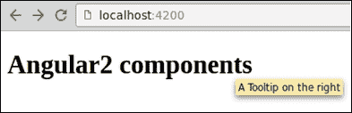
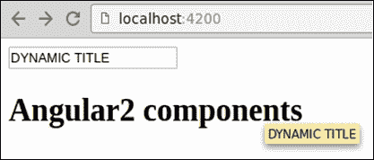
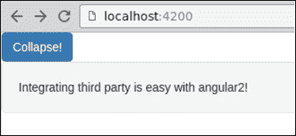
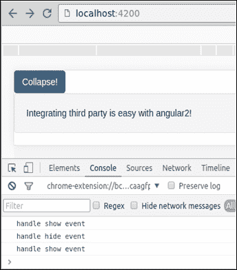

# 第八章：集成第三方组件

有许多使用其他库构建的 UI 组件，我们可能想在我们的 Angular 2 应用程序中使用。在本章中，我们将集成来自流行的 bootstrap 库的 tooltip 小部件。

导入 bootstrap 和 jQuery 库是我们在本章中涵盖的主题。

# 准备我们的开发环境

在继续之前，让我们创建一个新项目。打开`app.component.ts`并删除 HTML 模板和 CSS 文件的外部链接：

```ts
[app.component.ts]
import { Component } from '@angular/core';

@Component({
  selector: 'app-root',
  template: `<h1>Angular2 components</h1>`
})
export class AppComponent {}
```

# 导入依赖项

由于我们将包装来自 bootstrap 库的组件，我们首先需要下载并导入 bootstrap 库及其依赖项，并将其导入到我们的代码中。第一步是使用`npm`安装`bootstrap`。打开终端，确保你在项目根目录中，然后键入`npm install bootstrap -S`。此命令将下载 bootstrap 文件到`node_modules`并将其写入`package.json`。

由于 bootstrap 依赖于 jQuery 库，我们也需要安装它。我们也将使用`npm`。在终端中，键入`npm install jquery –S`。

我们还需要安装这两个库的相应类型，以便能够编译应用程序。相应类型模块的名称与目标库相同，但带有`@types`前缀。要安装它们，只需使用以下命令：

```ts
**npm install @types/jquery @types/bootstrap --save-dev**

```

`Bootstrap`库的 CSS 文件需要在`angular-cli.json`文件的样式部分中全局配置为应用程序：

```ts
[angular-cli.json]
{
  "project": {
    "version": "1.0.0-beta.16",
    "name": "ng-components"
  },
  "apps": [
    {
      "root": "src",
      "outDir": "dist",
      "assets": "assets",
      "index": "index.html",
      "main": "main.ts",
      "test": "test.ts",
      "tsconfig": "tsconfig.json",
      "prefix": "app",
      "mobile": false,
      "styles": [
        "styles.css",
        "../node_modules/bootstrap/dist/css/bootstrap.css"
      ],
      "scripts": [
      ],
      "environments": {
        "source": "environments/environment.ts",
        "dev": "environments/environment.ts",
        "prod": "environments/environment.prod.ts"
      }
    }
  ],
  (…)
}
```

由于最新版本的 Angular CLI 依赖于`Webpack`，我们使用其暴露加载器将 jQuery 全局可用于`Bootstrap`库。后者需要这样做以通过添加一组方法（如`tooltip`和`collapse`）来扩展 jQuery。要安装`expose loader`，只需使用以下命令：

```ts
**npm install expose-loader --save-dev**

```

现在我们可以在需要的地方使用`import`子句导入 jQuery 和 Bootstrap。

在继续之前，打开`app.component.ts`并添加以下导入语句以导入 jQuery 和 Bootstrap 库：

```ts
[app.component.ts]
import { Component } from '@angular/core';
import 'expose?jQuery!jquery';
import 'bootstrap';
import * as $ from 'jquery';

@Component({
  selector: 'app-root',
  template: `<h1>Angular2 components</h1>`
})
export class AppComponent {}
```

# Bootstrap tooltip 组件

Angular 2 能够绑定到元素属性和事件，而无需自定义指令，使我们能够轻松集成第三方代码。Bootstrap 使用一些自定义属性来使提示工作。我们可以直接使用它。打开`app.component.ts`并将 bootstrap 属性添加到标题中，以从底部显示提示。我们还需要利用`AfterViewInit`钩子在模板渲染时初始化提示：

```ts
[app.component.ts]
import { Component, AfterViewInit } from '@angular/core';
import 'expose?jQuery!jquery';
import 'bootstrap';
import * as $ from 'jquery';

@Component({
  selector: 'app-root',
  template: `
    <h1 data-toggle="tooltip"
        data-placement="bottom"
        title="A Tooltip on the right">Angular2 components</h1>
  `
})
export class AppComponent implements AfterViewInit {
  ngAfterViewInit() {
    $('h1').tooltip();
  }
}
```

现在，让我们打开浏览器测试一下。将鼠标悬停在标题上，等待提示出现在底部：



现在，让我们将其与 Angular 集成并使其动态化。这个过程很简单。我们可以绑定到我们想要控制的每个属性。让我们从`title`开始。

打开`app.component.ts`并添加以下代码：

```ts
[app.component.ts]
import { Component, AfterViewInit } from '@angular/core';
import 'expose?jQuery!jquery';
import 'bootstrap';
import * as $ from 'jquery';

@Component({
  selector: 'app-root',
  template: `
    <input type="text" [(ngModel)]="title" placeholder="enter custom title..">
    <h1 data-toggle="tooltip"
        data-placement="bottom"
        [title]="title">Angular2 components</h1>
  `
})
export class AppComponent implements AfterViewInit {
  ngAfterViewInit() {
    $('h1').tooltip();
  }
}
```

我们不必在组件类中编写任何代码就能使其工作。打开浏览器，输入一个标题，将鼠标悬停在标题上，看看结果：



# Bootstrap 折叠组件

让我们尝试另一个例子，但这次我们将绑定到事件。对于这个例子，我们将使用 bootstrap 库中的另一个小部件，称为`collapse`。在`components`文件夹中，创建一个名为`collapse`的新文件夹。在其中，为我们的组件创建一个名为`collapse.ts`的文件和一个名为`collapse.html`的`component`模板文件。

打开`collapse.ts`并粘贴以下代码。这是一个折叠小部件的示例，直接从 bootstrap 网站([`getbootstrap.com/javascript/#collapse`](http://getbootstrap.com/javascript/#collapse))中获取：

```ts
[collapse.ts]
import { Component, AfterViewInit } from '@angular/core';
import * as $ from 'jquery';

@Component({
  selector: 'collapse',
  templateUrl: './collapse.html'
})

export class Collapse implements AfterViewInit {
  ngAfterViewInit() {
    $('.collapse').collapse();
  }
}
```

打开`collapse.html`并粘贴以下内容：

```ts
[collapse.html]
<button class="btn btn-primary"
        data-toggle="collapse"
        data-target="#collapseExample"
        aria-expanded="false"
        aria-controls="collapseExample">
  Collapse!
</button>

<div class="collapse"
     id="collapseExample">
  <div class="well">
    Integrating third party is easy with angular2!
  </div>
</div>
```

让我们渲染这个组件。打开`app.component.ts`，导入`collapse`组件，并在模板中使用它，如下所示：

```ts
[app.component.ts]
import { Component } from '@angular/core';
import 'expose?jQuery!jquery';
import 'bootstrap';

@Component({
  selector: 'app-root',
  template: '<collapse></collapse>'
})
export class AppComponent {}
```

不要忘记将`Collapse`类添加到应用程序的根模块的`declarations`属性中，以使`collapse`组件可用，如下所示：

```ts
[app.module.ts]
import { BrowserModule } from '@angular/platform-browser';
import { NgModule } from '@angular/core';
import { FormsModule } from '@angular/forms';
import { HttpModule } from '@angular/http';
import { AppComponent } from './app.component';
import { Collapse } from './components/collapse/collapse';

@NgModule({
  declarations: [
    AppComponent,
    Collapse
  ],
  imports: [
    BrowserModule,
    FormsModule,
    HttpModule
  ],
  providers: [],
  bootstrap: [AppComponent]
})
export class AppModule { }
```

现在，打开浏览器测试折叠事件：



我们已经知道如何从提示示例中绑定属性。在这个例子中，我们将绑定到折叠事件。

根据 bootstrap 文档，折叠在其生命周期中触发四个事件。我们将专注于其中两个：

+   `show.bs.collapse`：当调用`show`方法时触发此方法。

+   `hide.bs.collapse`：当调用`hide`方法时，此方法将触发。

如果我们想要监听这些事件，我们需要保存对 DOM 元素的引用。为此，我们将注入`ElementRef`。打开`collapse.ts`并添加以下代码：

```ts
[collapse.ts]
import { Component, Inject, ElementRef } from '@angular/core';
import * as $ from 'jquery';

@Component({
  selector: 'collapse',
  templateUrl: './collapse.html'
})
export class Collapse {
  constructor(element: ElementRef) {
    $(element.nativeElement)
      .on('show.bs.collapse', 
      ()=> console.log('handle show event'));
    $(element.nativeElement)
      .on('hide.bs.collapse', 
      ()=> console.log('handle hideevent'));
  } 
}
```

有很多方法可以监听元素上的事件。我们选择使用 jQuery 来包装原生元素，并为折叠注册事件监听器。

您可以打开浏览器并观看控制台中与折叠事件对应的日志：



# 总结

Angular 2 通过自然地绑定到原生属性，与第三方代码很好地配合。另一方面，如果我们需要保存对 DOM 元素的引用，我们可以在组件中注入`ElementRef`。
