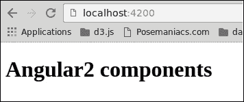
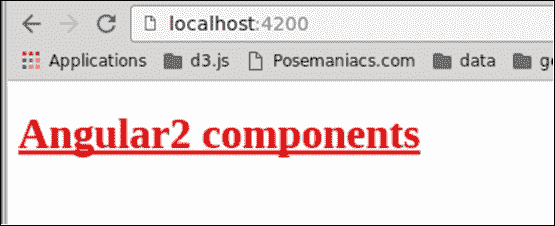

# 第九章：Angular 2 指令

在整本书中，我们学习了如何制作 Angular 2 组件。在结束我们的旅程之前，了解 Angular 2 并没有淘汰指令的概念是很重要的。事实上，组件*就是*指令。在本章中，我们将介绍 Angular 2 指令以及如何使用它们。

以下是我们将要涵盖的主题：

+   Angular 2 中组件和指令的区别

+   Angular 2 指令类型

+   如何构建一个简单的属性指令

+   如何构建一个简单的结构指令

# Angular 2 中的组件和指令

到目前为止，我们已经构建了组件。但是组件并没有取代我们从 Angular 1 中熟悉的指令。如果您不熟悉 Angular 1 指令，不用担心，我们将在一分钟内解释区别。

让我们首先定义在 Angular 术语中指令是什么：指令是一个自定义属性或元素，通过添加自定义行为来扩展 HTML 标签。

在 Angular 2 中，我们有三种类型的指令：组件指令，属性指令和结构指令。我们已经熟悉了组件，所以让我们定义其他类型：

+   **属性指令**：这改变了元素的外观或行为。其中一个例子是 Angular 核心中的 NgStyle 指令。

+   **结构指令**：这操纵 DOM，就像 Angular 核心中的 NgFor 和 NgSwitch 一样。

与组件相反，指令不需要模板，并通常将选择器定义为属性。

# 准备我们的开发环境

就像前几章一样，让我们创建一个新项目，如第二章中所述，*使用 angular-cli 设置 Angular 2 开发环境*。您还可以删除所有现有文件夹，并从`app.component.ts`中删除所有不必要的代码：

```ts
[app.component.ts]
import { Component } from '@angular/core';

@Component({
  selector: 'app-root',
  template: `<h1>Angular2 components</h1>`
})
export class AppComponent {}
```

# 基本属性指令

让我们开始创建一个名为`text-marker.ts`的新指令文件。在其中，粘贴以下代码：

```ts
[text-marker.ts]
import { Directive, ElementRef, Renderer } from '@angular/core';

@Directive({
  selector: '[text-marker]'
})
export class TextMarker {
  constructor(element: ElementRef, renderer: Renderer) {
    renderer.setElementStyle(element.nativeElement,
      'text-decoration', 'underline');
  }
}
```

要创建一个指令，我们需要从 Angular 核心导入`Directive`装饰器函数。我们还需要另外两个名为`ElementRef`和`Renderer`的类来操纵元素。它们从构造函数中注入到我们的指令类中。

该指令将为元素添加样式，并用下划线装饰文本。

让我们通过将其应用于我们的`app 组件`模板来测试这个指令。打开`index.ts`并添加以下代码：

```ts
[app.component.ts]
import { Component } from '@angular/core';

@Component({
  selector: 'app-root',
  template: `<h1 text-marker>Angular2 components</h1>`
}) 
export class AppComponent {}
```

不要忘记将`TextMarker`类添加到根模块的`declarations`属性中。这个操作对本章中实现的所有自定义组件和指令都是必需的。打开`app.module.ts`文件并按照这里描述的更新它：

```ts
[app.module.ts]
import { BrowserModule } from '@angular/platform-browser';
import { NgModule } from '@angular/core';
import { FormsModule } from '@angular/forms';
import { HttpModule } from '@angular/http';
import { AppComponent } from './app.component';
import { TextMarker } from './text-marker';

@NgModule({
  declarations: [
    AppComponent,
     TextMarker
  ],
  imports: [
    BrowserModule,
    FormsModule,
    HttpModule
  ],
  providers: [],
  bootstrap: [AppComponent]
})
export class AppModule { }
```

打开浏览器并检查结果：



## ElementRef 和 Renderer

属性指令旨在为元素添加行为。为此，我们需要访问元素本身。在 Angular 2 中，直接访问 DOM 元素被认为是不良实践。Angular 通过引入一个抽象层将代码与视图层分离。

为了引用元素，我们使用`ElementRef`，它是代表我们正在运行的平台的元素类型的类。在我们的情况下，它是浏览器 DOM。`ElementRef`类具有揭示它包装的原生元素的能力，但我们不需要它。相反，我们将使用另一个名为`Renderer`的类，并将`ElementRef`实例传递给它。`Renderer`是一个公开用于操作元素的方法的类，而不指定它是哪种类型的元素。这种机制使我们的代码与元素的实现保持解耦。

## 对来自宿主元素的事件做出反应

属性指令适用于一个元素。如果我们想要对这个元素触发的事件做出反应，我们可以在`Directive`类的一些方法上使用`HostListener`装饰器。在下面的例子中，我们的指令将监听来自元素的鼠标事件并做出响应地改变样式：

```ts
[text-marker.ts]
import { 
Directive, ElementRef, Renderer, HostListener 
} from '@angular/core';

@Directive({
 selector: '[text-marker]'
})
export class TextMarker {
  constructor(private element: ElementRef, 
  private renderer: Renderer) { }

  @HostListener('mouseenter')
  markText() {
    this.renderer.setElementStyle(
      this.element.nativeElement,
      'text-decoration',
      'underline'
    );
  }

  @HostListener('mouseleave')
  unmarkText() {
    this.renderer.setElementStyle(
      this.element.nativeElement,
      'text-decoration',
      ''
    );
  }
}
```

现在，每次鼠标进入和离开*承载*属性指令的元素时，样式都会被应用和移除。

## 将属性传递给指令

我们还可以通过使用属性将配置传递给指令。就像组件一样，指令可以声明输入。让我们重构我们的`Directive`类以从属性中获取并应用文本颜色

```ts
[text-marker.ts]
import {
  Directive,
  ElementRef,
  Renderer, Input,
  HostListener
} from '@angular/core';

@Directive({
  selector: '[text-marker]'
})
export class TextMarker {
  @Input('text-marker') 
  private color: string;

  constructor(
    private element: ElementRef, 
    private renderer: Renderer
  ){ }

  @HostListener('mouseenter')
  onEnter() {
    this.applyStyle(this.color, true);
  }
  @HostListener('mouseleave')
  onExit() {
    this.applyStyle('', false);
  }

  private applyStyle(
    color:string, mark:boolean) {

      // apply underline
      this.renderer.setElementStyle(
        this.element.nativeElement,
        'text-decoration',
        mark ? 'underline' : ''
      );

      // apply color
      this.renderer.setElementStyle(
        this.element.nativeElement
        'color', color
      );
  }
}
```

通过使用`Input`装饰器，我们可以接受属性的值（在我们的例子中是`text-marker`）并在指令类内部使用它。现在我们可以传递我们想要使用的颜色。打开`app.component.ts`并尝试以下代码：

```ts
[app.component.ts]
import { Component } from '@angular/core';

@Component({
  selector: 'app-root',
  template: `<h1 text-marker="red">Angular2 components</h1>`
})
export class AppComponent {}
```

现在，每次鼠标进入`h1`元素时，文本应该被着色为红色并带有下划线：



# 基本结构指令

正如我们在本章开头提到的，第三种指令类型称为结构指令，顾名思义，这些指令旨在操作它们所应用的元素。Angular 核心包括几个操作 DOM 的指令，如`ngIf`、`ngFor`和`ngSwitch`。

对于我们的示例，我们将实现自己的`ngIf`指令，其行为与原始指令完全相同。

首先，创建一个名为`only-if.ts`的新文件，让我们为指令定义基本结构：

```ts
[only-if.ts]
import { Directive } from '@angular/core';

@Directive({
  selector: '[onlyIf]'
})
export class OnlyIf {
}
```

结构指令的生命周期开始时就像属性指令一样。我们从 Angular 核心导入`@Directive`装饰器，并将选择器声明为属性。

接下来，我们需要访问模板，并且我们需要一些容器类型，以便我们可以附加或移除视图。为此，我们需要注入`TemplateRef`和`ViewContainerRef`：

```ts
[only-if.ts]
import {
  Directive,
  TemplateRef,
  ViewContainerRef
} from '@angular/core';

@Directive({
  selector: '[onlyIf]'
})
export class OnlyIf {
  constructor(private _templateRef: TemplateRef,
              private _viewContainerRef: ViewContainerRef)
  {  }
}
```

我们的指令，就像 Angular 的`ngIf`一样，需要从其调用者那里接收一个布尔值，表示内容将显示或移除的条件。为此，我们将为此条件声明一个输入，并利用`ViewContainerRef`和`TemplateRef`：

```ts
[only-if.ts]
import {
  Directive,
  Input,
  TemplateRef,
  ViewContainerRef
} from 'angular/core';

@Directive({
  selector: '[onlyIf]'
})
export class OnlyIf {
  constructor(private _templateRef: TemplateRef<any>,
              private _viewContainerRef: ViewContainerRef) {  }

  @Input()
  set onlyIf(condition:boolean) {
    if (condition) {
      this._viewContainerRef.createEmbeddedView(this._templateRef);
    } else {
      this._viewContainerRef.clear();
    }
  }
}
```

让我们使用这个指令。打开`app.component.ts`并粘贴以下代码：

```ts
[app.component.ts]
import { Component } from '@angular/core';

@Component({
  selector: 'app-root',
  template: `
    <input type="checkbox" [(ngModel)]="condition">
    <p *onlyIf="condition">
      This content will shown only if the condition is true
    </p>
  `
}) 
export class AppComponent {}
```

不要忘记将`OnlyIf`类添加到根模块的`declarations`属性中。

让我们来探究一下：当我们使用星号（`*`）来调用我们的指令时，Angular 在幕后创建了一个`<template>`标签。在我们的指令内部，我们可以通过`TemplateRef`类获取对此模板的引用。然后，我们可以使用`ViewContainerRef`类，它代表一个`容器`，以便我们可以将视图嵌入其中，或者从模板的内容中创建或清除视图。

# 摘要

在 Angular 2 中，有三种类型的指令：组件指令、属性指令和结构指令。在本章中，我们对它们进行了简要介绍，并学习了如何构建简单的指令。指令可以做更多的事情，但这超出了本书的范围。
