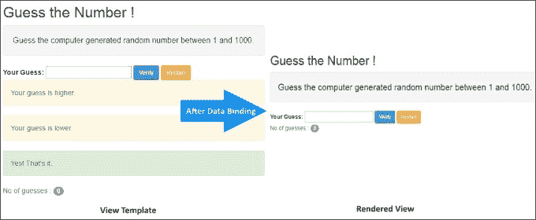

# 第一章：入门

在 JavaScript 中开发应用程序总是一个挑战。由于其可塑性和缺乏类型检查，用 JavaScript 构建一个体量较大的应用程序是困难的。此外，我们使用 JavaScript 进行各种类型的处理，如用户界面（UI）操作、客户端-服务器交互和业务处理/验证。因此，我们最终得到了难以维护和测试的意大利面代码。

图书馆，如 jQuery，非常擅长处理各种浏览器怪癖，并提供可以减少代码行数的构造。然而，这些库缺乏任何可以在代码库增长时帮助我们的结构指导。

近年来，JavaScript 框架已经出现来管理这种复杂性。其中许多框架，包括早期版本的 Angular，使用了一种称为**模型-视图-控制器**的设计模式，将应用程序的元素分离成更易管理的部分。这些框架的成功以及它们在开发者社区中的流行已经确立了使用这种模式的价值。

然而，Web 开发不断发展，自 2009 年首次推出 Angular 以来，许多事情已经发生了变化。诸如 Web 组件、新版本的 JavaScript（ES2015）和 TypeScript 等技术都已经出现。综合起来，它们提供了构建一个新的、前瞻性框架的机会。随着这个新框架的出现，也带来了一种新的设计模式——组件模式。

本章专门讨论组件模式的理解以及如何在构建一个简单的应用程序时将其付诸实践。

本章我们将涵盖的主题如下：

+   **Angular 基础知识**：我们将简要讨论用于构建 Angular 应用的组件模式

+   **构建我们的第一个 Angular 应用**：我们将在 Angular 中构建一个小游戏，*猜数字！*

+   **一些 Angular 构造的介绍**：我们将回顾在 Angular 中使用的一些构造，如插值、表达式和数据绑定语法

+   **变更检测**：我们将讨论在 Angular 应用中如何管理变更检测

+   **应用初始化**：我们将讨论 Angular 中的应用初始化过程；这也被称为**引导**

+   **工具和资源**：最后，我们将提供一些在 Angular 开发和调试过程中会派上用场的资源和工具

# Angular 基础知识

让我们开始看一下 Angular 如何实现组件模式。

## 组件模式

Angular 应用程序使用组件模式。你可能没有听说过这种模式，但它无处不在。它不仅在软件开发中使用，还在制造业、建筑业和其他领域使用。简而言之，它涉及将更小、离散的构建块组合成更大的成品。例如，电池是汽车的一个组件。

在软件开发中，组件是可以组合成更大应用程序的逻辑单元。组件往往具有内部逻辑和属性，这些逻辑和属性对于较大的应用程序是被屏蔽或隐藏的。然后，较大的应用程序通过特定的接口（称为接口）消耗这些构建块，这些接口只暴露组件使用所需的内容。通过这种方式，只要不改变接口，组件的内部逻辑就可以被修改而不影响较大的应用程序。

回到我们的电池例子，汽车通过一系列连接器消耗电池。然而，如果电池耗尽，可以用全新的电池替换，只要那个电池有相同的连接器。这意味着汽车制造商不必担心电池的内部，这简化了汽车的制造过程。更重要的是，车主不必在电池耗尽时每次都更换汽车。

延伸这个类比，电池制造商可以将它们推广给一系列不同的车辆，例如 ATV、船或雪地摩托车。因此，组件模式使它们能够实现更大规模的经济效益。

## 在 Web 应用程序中使用组件模式

随着 Web 应用程序变得越来越复杂，需要能够由更小、离散的组件构建它们的需求变得更加迫切。组件允许应用程序以一种方式构建，可以防止它们变成一团乱麻的代码。相反，基于组件的设计允许我们独立地思考应用程序的特定部分，然后我们可以通过约定的连接点将应用程序组合成一个完整的整体。

此外，维护成本更低，因为每个组件的内部逻辑可以单独管理，而不会影响应用程序的其他部分。使用自描述组件组合应用程序使得应用程序在更高层次的抽象中更容易理解。

## 为什么之前的 Angular 版本没有使用组件？

如果这个想法这么有道理，为什么之前的 Angular 版本没有采用组件模式？答案是，当 Angular 首次发布时存在的技术并不完全支持在 Web 应用程序中实现这种模式。

然而，早期版本的 Angular 在实现更智能的 Web 应用程序设计和组织方面迈出了重要的步伐。例如，它们实现了 MVC 模式，将应用程序分为模型、视图和控制器（你将在我们在 Angular 中构建的组件中看到 MVC 模式的使用）。

在 MVC 模式中，模型是数据，视图是一个网页（或移动应用程序屏幕，甚至是 Flash 页面），控制器用模型的数据填充视图。通过这种方式，实现了关注点的分离。遵循这种模式以及智能使用指令，可以让你接近组件。

因此，早期版本的 Angular 允许更合乎逻辑地设计和构建应用程序。然而，这种方法受到限制，因为使用的技术并不真正隔离。相反，它们最终都在屏幕上与其他元素没有真正的分离而呈现出来。

## 使得 Angular 能够使用这种模式的新特性是什么？

相比之下，最新版本的 Angular 采用了最近出现的技术，这些技术使得完全实现组件模式成为可能。这些技术包括 Web 组件、ES2015（JavaScript 的新版本）和 TypeScript。让我们讨论一下这些技术各自带来的可能性。

### Web 组件

Web 组件是一个总称，实际上涵盖了 Web 浏览器的四个新兴标准：

+   自定义元素

+   影子 DOM

+   模板

+   HTML 导入

### 注意

有关 Web 组件的更多信息，请访问[`webcomponents.org`](http://webcomponents.org)。

现在让我们详细讨论一下这些：

+   自定义元素使得除了标准的 HTML 标签名（如`<div>`和`<p>`）之外，可以创建新类型的元素。添加自定义标签的能力提供了一个屏幕上可以保留用于绑定组件的位置。简而言之，这是将组件与页面其余部分分离并使其成为真正自包含的第一步。

+   Shadow DOM 为页面提供了一个隐藏区域，用于脚本、CSS 和 HTML。在这个隐藏区域内的标记和样式不会影响页面的其余部分，同样重要的是它们也不会受到页面其他部分的标记和样式的影响。我们的组件可以利用这个隐藏区域来渲染其显示。因此，这是使我们的组件自包含的第二步。

+   模板是可重复使用的 HTML 块，其中的标记可以在运行时使用 JavaScript 替换为动态内容。许多 JavaScript 框架已经支持某种形式的模板。Web 组件标准化了这种模板，并在浏览器中直接支持它。模板可以用于使我们组件中使用的 Shadow DOM 内的 HTML 和 CSS 变得动态。因此，这是使我们的组件的第三步。

+   构成 Web 组件的最终标准是 HTML 导入。它们提供了一种加载 HTML、CSS 和 JavaScript 等资源的方式。Angular 不使用 HTML 导入。相反，它依赖于 JavaScript 模块加载，我们将在本章稍后讨论。

### Angular 和 Web 组件

当前的 Web 浏览器并不完全支持 Web 组件。因此，Angular 组件并不严格属于 Web 组件。更准确地说，Angular 组件实现了 Web 组件背后的设计原则。它们还使得可以构建可以在今天的浏览器上运行的组件。

### 注意

在撰写本书时，Angular 支持最新版本的浏览器，如 Chrome、Firefox、Edge，以及 IE 7 及更高版本。它还支持 Android 4.1 及更高版本的移动设备。有关 Angular 支持的浏览器列表，请访问[`github.com/angular/angular`](https://github.com/angular/angular)。

因此，在本书的其余部分，我们将专注于构建 Angular 组件而不是 Web 组件。尽管有这种区别，Angular 组件与 Web 组件紧密配合，甚至可以与它们互操作。随着浏览器开始更全面地支持 Web 组件，Angular 组件和 Web 组件之间的差异将开始消失。因此，如果您想开始采用未来的 Web 组件标准，Angular 为您提供了今天这样做的机会。

### Angular 中的语言支持

您可以使用 ES5 开发组件，但 Angular 通过添加对最新语言（如 ES2015 和 TypeScript）中找到的关键功能的支持，增强了开发组件的能力。

#### ES2015

ES2015 是 JavaScript 的新版本；它于 2015 年 6 月获得批准。它为语言添加了许多改进，我们将在本书中看到，但在这一点上，我们最感兴趣的是以下两点：

+   类

+   模块加载

**类**以前在 JavaScript 中不存在。现在它们存在的主要优势是，它们为我们组件中的代码提供了一个方便的容器。

### 注意

明确一点，JavaScript 类并没有引入完全新的东西。**Mozilla 开发者网络**（**MDN**）将它们描述为

> "对 JavaScript 现有基于原型的继承的一种语法糖。. . [提供了]一个更简单和更清晰的语法来创建对象和处理继承。"

有关更多信息，请访问[`developer.mozilla.org/en-US/docs/Web/JavaScript/Reference/Classes`](https://developer.mozilla.org/en-US/docs/Web/JavaScript/Reference/Classes)。

我们将在本书的示例中探索这些内容。如果您之前没有使用过面向对象的语言，可能不熟悉类，因此我们将在本章的示例中逐步介绍它们。

ES2015 还引入了一种新的**模块加载**方法。模块提供了一种将 JavaScript 文件封装的方式。当它们被封装时，它们不会污染全局命名空间，并且可以以受控的方式与其他模块进行交互。我们将在后面的章节中更详细地介绍模块。

一旦我们定义了模块，我们需要一种方法将它们加载到我们的应用程序中以执行。模块加载允许我们从组成 Angular 和其他组件的模块中选择我们应用程序所需的内容。

目前，存在一系列方法和库来支持 JavaScript 中的模块加载。ES2015 添加了一种新的、一致的语法来加载模块作为语言的一部分。这种语法很简单，涉及到用`export`关键字（或使用默认导出）给模块加前缀，然后在应用程序的其他地方使用`import`来消费它们。

ES 2015 模块加载使我们能够将组件组合成有用的包或功能，可以在我们的应用程序中导入或导出。事实上，模块是 Angular 本身的核心。我们将看到，模块在 Angular 本身以及我们在本书中构建的应用程序中被广泛使用。

### 注意

重要的是要理解，虽然 Angular 使用的语法与 ES2015 模块加载语法相似，但 Angular 模块（我们将在本章稍后讨论）与 JavaScript 模块并不相同。有关这些差异的更多细节，请参阅 Angular 文档[`angular.io/docs/ts/latest/guide/architecture.html`](https://angular.io/docs/ts/latest/guide/architecture.html)。从这一点开始，我们将专注于 Angular 模块。

由于今天的浏览器并不完全支持 ES2015，我们需要将 ES2015 转换为 ES5，以便在我们的应用程序中使用类和模块加载等功能。我们通过一个称为**转译**的过程来实现这一点。

转译类似于编译，不同之处在于，转译将我们的代码转换为机器语言，而转译将一种类型的源代码转换为另一种类型的源代码。在这种情况下，它将 ES2015 转换为 ES5。有几种工具称为**转译器**使我们能够做到这一点。常见的转译器包括 Traceur 和 Babel。TypeScript（我们将在下面讨论）也是一个转译器，它是我们在本书中使用的示例。

一旦 ES2015 被转译为 ES5，我们就可以使用诸如**SystemJS**之类的模块加载器来加载我们的模块。SystemJS 遵循 ES2015 模块加载的语法，并使我们能够在今天的浏览器中进行模块加载。

#### TypeScript

TypeScript 是由微软创建的 JavaScript 的超集，这意味着它包含了 ES2015 的特性（如类和模块加载），并添加了以下内容：

+   类型

+   装饰器

**类型**允许我们在类中标记变量、属性和参数，以指示它们是数字、字符串、布尔值或各种结构，如数组和对象。这使我们能够在设计时执行类型检查，以确保在我们的应用程序中使用了正确的类型。

**装饰器**是我们可以使用@符号和函数添加到我们的类中的简单注释。它们为我们的类的使用提供指令（称为元数据）。在 Angular 的情况下，装饰器允许我们将我们的类标识为 Angular 组件。装饰器可以指定要与组件一起使用的模块，以及如何实现各种绑定和指令，包括将 HTML 视图附加到组件。随着我们在本书中的学习，我们将更多地涵盖装饰器的使用。

装饰器是 ES2017 提案的一部分，不是 ES2015 的一部分。它们作为微软和谷歌之间合作的一部分被添加到 TypeScript 中。正如前面提到的，TypeScript 编译成 ES5，因此我们可以在不完全支持 ES2015 或装饰器的浏览器中使用类型和装饰器。

### 注意：…

如前所述，使用 Angular 不需要使用 ES2015 或 TypeScript。然而，我们认为随着我们在本书中的示例的进行，您将看到使用它们的优势。

### 将所有内容整合在一起

通过遵循 Web 组件标准并支持 ES2015 和 TypeScript，Angular 使我们能够创建实现组件设计模式的 Web 应用程序。这些组件有助于实现构建大型应用程序的标准的愿景，通过自描述和自包含的构建块集合。

我们希望您能在本书的示例中看到，Angular 使组件能够以直观和声明性的方式构建，这使得开发人员更容易实现它们。随着我们在本书中的示例的进行，我们将强调每种技术的使用位置。

## Angular 模块

组件是 Angular 应用程序的基本构建块。但是我们如何将这些构建块组织成完整的应用程序呢？Angular 模块提供了这个问题的答案。它们使我们能够将组件组合成可重用的功能组，并可以在整个应用程序中导出和导入。例如，在更复杂的应用程序中，我们希望为身份验证、常用工具和外部服务调用等事物创建模块。同时，模块使我们能够以一种允许按需加载它们的方式对应用程序中的功能进行分组。这被称为惰性加载，这是我们将在第四章中介绍的主题，*构建个人教练*。

每个 Angular 应用程序都将包含一个或多个包含其组件的模块。Angular 引入了`NgModule`作为一种方便地指定组成模块的组件的方式。每个 Angular 应用程序必须至少有一个这样的模块——根模块。

### 注意

Angular 本身是作为模块构建的，我们将其导入到我们的应用程序中。因此，当您构建 Angular 应用程序时，您将在各处看到模块的使用。

## 构建 Angular 应用程序的基本步骤

总之：在基本层面上，您将看到在 Angular 中开发应用程序时，您将执行以下操作：

1.  创建组件。

1.  将它们捆绑到模块中。

1.  启动您的应用程序。

了解 Angular 和组件设计模式的最佳方法是通过实际操作。因此，我们将在 Angular 中构建我们的第一个 Hello World 应用程序。这个应用程序将帮助您熟悉 Angular 框架，并看到组件设计模式的实际应用。

让我们开始做这件事。

# 传统的 Hello Angular 应用程序-猜数字！

作为我们的第一个练习，我们希望保持简单，但仍然展示框架的能力。因此，我们将构建一个非常简单的游戏，名为*猜数字*。游戏的目标是以尽可能少的尝试次数猜出一个随机生成的计算机数字。

这就是游戏的样子：


## 设置开发服务器

我们选择的开发 Web 服务器在很大程度上取决于我们所工作的平台和我们支持的后端。然而，由于本书中的应用程序纯粹针对客户端开发，任何 Web 服务器都可以。

我们建议使用`live-server`，这是一个带有实时重新加载功能的简单 HTTP 服务器。您可以使用 Node.js 安装它。由于 Node.js 可跨平台使用，您可以从[`nodejs.org/`](http://nodejs.org/)安装 Node.js。

### 注意

对于本书，我们使用的是 Node.js 版本 4.4.2 和 npm 版本 3.8.6。您可以在[`docs.npmjs.com/getting-started/installing-node`](https://docs.npmjs.com/getting-started/installing-node)找到有关安装 Node 和更新 npm 到最新版本的更多信息。

一旦安装了 Node.js，安装`live-server`模块并运行 HTTP 服务器就很容易。打开命令行并输入以下命令：

```ts
**npm install -g live-server**

```

这将在全局级别安装`live-server`。

要运行服务器，我们只需导航到应用代码所在的文件夹，或者打开要提供静态文件的文件夹。然后输入这个：

```ts
**live-server**

```

就是这样！

我们在`http://localhost:8080`上运行着一个 HTTP 服务器。它可以从当前目录中提供文件。

### 注意

`live-server`模块确实支持一些启动配置。请查看[`github.com/tapio/live-server`](https://github.com/tapio/live-server)上的文档。

根据我们所在的平台，我们还可以尝试 Python 的`SimpleHTTPServer`模块，Mongoose 或任何类似的 Web 服务器。

现在让我们来构建*猜数字*游戏。

## 构建猜数字游戏！

构建用户界面的标准做法是自上而下地构建它们。首先设计 UI，然后根据需要插入数据和行为。采用这种方法，应用的 UI、数据和行为方面都是紧密耦合的，这是一个不太理想的情况！

使用基于组件的设计，我们的工作方式不同。我们首先查看 UI 和预期行为，然后将所有这些封装到我们称之为**组件**的构建块中。然后在我们的页面上托管这个组件。在组件内部，我们将 UI 分离为视图，将行为分离为一个类，具有支持行为所需的适当属性和方法。如果你不熟悉类，不用担心。随着我们在示例中的深入讨论，我们将详细讨论它们是什么。

好的，让我们确定我们的应用程序所需的 UI 和行为。

## 设计我们的第一个组件

为了确定我们的组件需要什么，我们将从详细说明我们希望应用程序支持的功能开始：

+   生成随机数（`original`）

+   为用户提供猜测值的输入（`guess`）

+   跟踪已经猜测的次数（`noOfTries`）

+   根据用户的输入提供提示以改进他们的猜测（`deviation`）

+   如果用户正确猜测了数字，则提供成功消息（`deviation`）

现在我们有了我们的功能，我们可以确定需要向用户显示什么数据以及需要跟踪什么数据。对于前面的功能集，括号中的元素表示将支持这些功能并且需要包含在我们的组件中的属性。

### 注意

设计组件是一个非常关键的过程。如果做得好，我们可以以一种使其易于理解和易于维护的方式逻辑地组织我们的应用程序。

在构建任何应用程序时，我们建议您首先考虑要提供的功能，然后考虑支持功能的数据和行为。最后，考虑如何为其构建用户界面。无论您使用哪种库或框架构建应用程序，这都是一个很好的实践。

## 主机文件

让我们从为我们的组件创建文件开始。我们将首先创建一个目录用于我们的应用程序。我们将其命名为`guessthenumber`（但您可以根据需要命名）。我们将使用它来添加我们的文件。

### 一个 HTML 页面

首先，打开您喜欢的编辑器，并创建一个包含以下`html`和`script`标签的 HTML 页面：

```ts
<!DOCTYPE html> 
<html> 
  <head> 
    <title>Guess the Number!</title> 
    <link href="http://netdna.bootstrapcdn.com/bootstrap/
                3.1.1/css/bootstrap.min.css" rel="stylesheet"> 
    <script src="https://unpkg.com/core-js/client/shim.min.js"></script> 
    <script src="https://unpkg.com/reflect-metadata@0.1.3"></script> 
    <script src="https://unpkg.com/zone.js@0.6.23?main=browser"></script> 
    <script src="https://unpkg.com/typescript@2.0/lib/typescript.js">
    </script> 
    <script src="https://unpkg.com/systemjs@0.19.27/dist/system.js">
    </script> 
    <script src="systemjs.config.js"></script> 
    <script> 
      System.import('app').catch(function(err){ console.error(err); }); 
    </script> 
  </head> 
  <body> 
    <my-app>Loading...</my-app> 
  </body> 
</html> 

```

### 提示

**下载示例代码**

本书中的代码可以在 GitHub 上找到：[`github.com/chandermani/angular2byexample`](https://github.com/chandermani/angular2byexample)。它按照检查点进行组织，允许您一步一步地跟随我们在本书中构建示例项目。本章的下载分支是 GitHub 的**分支：checkpoint1.1**。在`guessthenumber`文件夹中查找我们在此处涵盖的代码。如果您不使用 Git，请从以下 GitHub 位置下载 Checkpoint 1.1 的快照（ZIP 文件）：[`github.com/chandermani/angular2byexample/tree/checkpoint1.1`](https://github.com/chandermani/angular2byexample/tree/checkpoint1.1)。首次设置快照时，请参考`guessthenumber`文件夹中的`readme.md`文件。

### 脚本标签

在此文件中有几点需要注意：

+   前五个`<script>`标签引用以下内容：

+   `shim`：这为旧版浏览器提供了 ES2015 功能

+   `reflect-metadata`：这添加了装饰器支持

+   `zone.js`：这管理变更检测

+   `typescript.js`：这是当前版本的 TypeScript

+   `system.js`：这加载我们的模块

+   接下来的`<script>`标签引用了我们应用程序中的一个 JavaScript 文件：`systemjs.config.js`。确保从示例代码文件中添加该文件。我们稍后将讨论这个文件。基本上，它为 SystemJS 提供了指令，告诉它应该加载哪些模块，并指示它在运行时动态转译我们的 TypeScript 文件为 ES5。

+   最后的`<script>`标签调用 SystemJS 来导入我们的组件目录：`app`。

我们将在本章后面讨论后两个脚本标签如何一起工作以启用模块加载。

### 自定义元素

页面上还有一个更重要的标签：

```ts
<my-app>Loading...</my-app> 

```

这个标签是一个**自定义元素**。它指示 Angular 在哪里注入我们将要构建的组件。

应用程序的其余 HTML 代码是不言自明的。我们在`<head>`部分引用了 Twitter Bootstrap CSS，并为我们的页面添加了一个标题，即`猜数字游戏！`。

### 注意

*猜数字游戏*和本书中的所有其他应用程序都已针对 Angular 最终版本进行了测试。

## 组件文件

现在让我们为我们的组件创建一个文件。

1.  在我们的应用程序中添加一个名为`app`的子目录。

1.  然后，使用您的编辑器，创建一个名为`guess-the-number.component.ts`的文件，并将其放在该子目录中。`.ts`扩展名将我们的文件标识为将在运行时编译为 ES5 的 TypeScript 文件。

### 导入语句

在页面顶部放置以下行：

```ts
import { Component }from '@angular/core'; 

```

这是一个导入语句。它告诉我们在我们的组件中将加载和使用哪些模块。在这种情况下，我们正在选择需要从 Angular 加载的一个模块：`Component`。Angular 有许多其他模块，但我们只加载我们需要的。

您会注意到我们导入的位置并未被标识为我们应用程序中的路径或目录。相反，它被标识为`@angular/core`。Angular 已被分成了以`@angular`为前缀的桶模块。

这些桶组合了几个逻辑相关的模块。在这种情况下，我们指示要导入`core`桶模块，这将带入`Component`模块。这种命名约定与我们模块的加载相关联，我们将在本章后面更详细地讨论。

### 装饰器

接下来，在你的`guess-the-number.component.ts`文件中添加以下脚本块：

```ts
@Component({ 
  selector: 'my-app', 
  template: ` 
    <div class="container"> 
      <h2>Guess the Number !</h2> 
      <p class="well lead">Guess the computer generated random
         number between 1 and 1000.</p> 
      <label>Your Guess: </label> 
      <input type="number" [value]="guess" (input)="guess = 
       $event.target.value" />
      <button (click)="verifyGuess()" class="btn btn-primary btn-sm">
      Verify</button> 
      <button (click)="initializeGame()" class="btn btn-warning btn-sm">
      Restart</button> 
    <div> 
      <p *ngIf="deviation<0" class="alert alert-warning">
      Your guess is higher.</p>
      <p *ngIf="deviation>0" class="alert alert-warning">
      Your guess is lower.</p>
      <p *ngIf="deviation===0" class="alert alert-success">
      Yes! That's it.</p> 
    </div> 
      <p class="text-info">No of guesses : 
        <span class="badge">{{noOfTries}}</span> 
      </p> 
    </div> 
}) 

```

这是我们组件的装饰器，直接放在类定义的上面，我们很快会讨论。`@`符号用于标识装饰器。`@Component`装饰器有一个名为 selector 的属性，您可能不会感到惊讶，它设置为我们 HTML 页面中的`<my-app>`标签。这个设置告诉 Angular 将这个组件注入到 HTML 页面上的那个标签中。

装饰器还有一个名为 template 的属性，该属性标识了我们组件的 HTML 标记。请注意在模板字符串上使用反引号（由 ES2015 引入）来渲染多行。或者，我们可以设置一个`templateUrl`属性，指向一个单独的文件。

### 定义类

现在，将以下代码块添加到您的`guess-the-number.component.ts`文件中：

```ts
export class GuessTheNumberComponent { 
  deviation: number; 
  noOfTries: number; 
  original: number; 
  guess: number; 
  constructor() { 
    this.initializeGame(); 
  } 
  initializeGame() { 
    this.noOfTries = 0; 
    this.original = Math.floor((Math.random() * 1000) + 1); 
    this.guess = null; 
    this.deviation = null; 
  } 
  verifyGuess() { 
    this.deviation = this.original - this.guess; 
    this.noOfTries = this.noOfTries + 1; 
  } 
} 

```

如果您一直在 ES5 中开发，这是所有当前浏览器支持的 JavaScript 版本，您可能不熟悉这里使用类的方式。因此，我们将花一些时间来介绍什么是类（对于那些使用面向对象编程语言（如 C#或 Java）开发的人来说，这应该是熟悉的领域）。

类文件保存了我们将用来运行组件的代码。在顶部，我们给类一个名字，即`GuessTheNumberComponent`。然后，在花括号内，我们有四行声明我们类的属性。这些类似于 ES5 变量，我们将使用它们来保存我们运行应用程序所需的值（您会注意到这些是我们设计组件时确定的四个值）。

这些属性与标准 JavaScript 变量的不同之处在于，每个属性名称后面都跟着`:`和数字。这些设置了属性的类型。在这种情况下，我们指示这四个属性将被设置为数字类型，这意味着我们期望所有这些属性的值都是数字。为我们的属性指定类型的能力是由 TypeScript 提供的，在标准 JavaScript 中是不可用的。

当我们向下移动时，我们会看到三个脚本块，它们有名称，后面跟着括号，然后是花括号，里面包含几行脚本。这些是我们类的方法，它们包含了我们组件将支持的操作。它们很像标准的 JavaScript 函数。

这些方法中的第一个是`constructor()`，这是一个特殊的方法，当我们的组件实例首次创建时将运行。在我们的例子中，构造函数在类创建时只做了一件事；它调用了我们类中的另一个方法，叫做`initializeGame()`。

`initializeGame()`方法使用赋值运算符`=`来设置类中四个属性的起始值。我们将这些值设置为`null`或`zero`，除了`original`，我们使用随机数生成器来创建要猜测的数字。

该类还包含一个名为`verifyGuess()`的方法，它更新了`deviation`和`noOfTries`属性。这个方法不是从组件类内部调用的；相反，它将从视图中调用，我们稍后在更仔细地检查视图时会看到。您还会注意到我们的方法通过在属性前加上`this`来引用同一类中的属性。

## 模块文件

正如我们之前提到的，每个 Angular 组件必须包含在一个 Angular 模块中。这意味着至少我们必须在应用程序的根目录中添加至少一个 Angular 模块文件。我们称之为**根模块**。对于像 Guess the Number!这样的简单应用程序，根模块可能是我们唯一需要的模块。然而，随着 Angular 应用程序的规模增大，通常会有多个按功能拆分的 Angular 模块文件是有意义的。随着我们在本书的后续章节中构建更复杂的应用程序，我们将涵盖这种情况。

让我们继续创建我们的 Angular 模块文件。首先，在与`guess-the-number.component.ts`相同的目录中创建一个名为`app.module.ts`的新文件，并将以下代码添加到其中：

```ts
import { NgModule }      from '@angular/core'; 
import { BrowserModule } from '@angular/platform-browser'; 

import { GuessTheNumberComponent }     
from './guess-the-number.component'; 

@NgModule({ 
    imports:      [ BrowserModule ], 
    declarations: [ GuessTheNumberComponent ], 
    bootstrap:    [ GuessTheNumberComponent ] 
}) 
export class AppModule { } 

```

前两个语句导入了`NgModule`和`BrowserModule`。请注意，虽然`NgModule`是从`@angular/core`导入的，但`BrowserModule`是从不同的模块`@angular/platform-browser`导入的。这里重要的是导入不是来自`@angular/core`，而是来自一个特定于基于浏览器的应用程序的单独模块。这提醒我们 Angular 可以支持除浏览器之外的设备，比如移动设备，因此需要将`BrowserModule`放入一个单独的模块中。

这个文件中的另一个导入是我们刚刚构建的组件`GuessTheNumberComponent`。如果你回到那个组件，你会注意到我们在类定义前面添加了`export`，这意味着我们在我们自己的应用程序中使用模块加载。

接下来我们定义一个新的组件`AppModule`。这个组件看起来不同于我们刚刚定义的`GuessTheNumberComponent`。在类本身中除了一些导入和一个装饰器`@ngModule`之外没有任何东西。我们可以使用这个装饰器来配置我们应用程序中的模块。我们首先添加导入，这种情况下包括`BrowserModule`。顾名思义，这个模块将提供在浏览器中运行我们应用程序所需的功能。下一个属性是声明，通过这个属性，我们提供了一个将在我们应用程序中使用的组件数组。在这种情况下，我们只有一个组件：`GuessTheNumberComponent`。

最后，我们设置了`bootstrap`属性。这表示我们应用程序启动时将加载的第一个组件。同样，这是`GuessTheNumberComponent`。

有了这个配置，我们现在可以准备启动我们的组件了。

## 引导

`GuessTheNumberComponent`的类定义作为组件的蓝图，但其中的脚本在我们创建组件实例之前不会运行。因此，为了运行我们的应用程序，我们需要在应用程序中添加一些内容来创建这个实例。这个过程需要我们添加引导我们组件的代码。

在`app`子目录中，创建另一个名为`main.ts`的文件，并添加以下代码：

```ts
import { platformBrowserDynamic }    
from '@angular/platform-browser-dynamic'; 
import { AppModule } from './app.module'; 
const platform = platformBrowserDynamic(); 
platform.bootstrapModule(AppModule); 

```

正如你所看到的，我们首先从`@angular/platform-browser-dynamic`中导入了`platformBrowserDynamic`模块。就像在`appModule`文件中导入`BrowseModule`一样，这个导入是专门用于基于浏览器的应用程序的。

接下来，我们添加了我们刚刚定义的`AppModule`的导入。

最后，我们将刚刚导入的`platformBrowserDynamic()`赋值给一个常量：platform。然后我们调用它的`bootstrapModule`方法，并将我们的`AppModule`作为参数。`bootstrapModule`方法然后创建了`AppModule`组件的一个新实例，然后初始化了我们的`GuessTheNumberComponent`，我们标记为要启动的组件。它通过调用组件的构造方法并设置我们游戏的初始值来实现这一点。

我们将在本章稍后更详细地讨论`bootstrap`方法如何适应整个应用程序初始化过程。

## 我们已经开始运行了！

好了，应用程序已经完成并准备好进行测试！转到文件所在的目录并输入以下内容：

```ts
**live-server**

```

应用程序应该出现在您的浏览器上。

### 注意

如果您在运行应用程序时遇到问题，可以在 GitHub 上查看可用的工作版本[`github.com/chandermani/angular2byexample`](https://github.com/chandermani/angular2byexample)。如果您不使用 Git，请从以下 GitHub 位置下载 Checkpoint 1.1 的快照（ZIP 文件）：[`github.com/chandermani/angular2byexample/tree/checkpoint1.1`](https://github.com/chandermani/angular2byexample/tree/checkpoint1.1)。在首次设置快照时，请参考`guessthenumber`文件夹中的`readme.md`文件。

如果我们现在查看我们的组件文件，我们应该对我们用这 43 行代码实现的成果感到非常印象深刻。当应用程序正在运行时，我们没有编写任何代码来更新 UI。但一切都运行得很完美。

# 深入挖掘

要了解这个应用程序在 Angular 上下文中的功能，我们需要更深入地研究我们的组件。虽然组件中的类定义非常简单和直接，但我们需要更仔细地查看模板中的 HTML，该 HTML 位于`@Component`装饰器内，以了解 Angular 在这里的工作原理。它看起来像标准的 HTML，但有一些新的符号，比如`[ ]`、`( )`、`{{`和`}}`。

在 Angular 世界中，这些符号的含义如下：

+   `{{`和`}}`是插值符号

+   `[ ]`表示属性绑定

+   `( )`表示事件绑定

显然，这些符号具有一些与它们相关的行为，并且似乎将视图 HTML 和组件代码联系起来。让我们试着理解这些符号实际上是做什么的。

## 插值

看一下猜数字游戏代码中的这个 HTML 片段：

```ts
<p class="text-info">No of guesses :  
  <span class="badge">{{noOfTries}}</span> 
</p> 

```

术语`noOfTries`被夹在两个插值符号之间。插值通过用插值标记的内容替换插值符号内部的表达式（`noOfTries`）的值来工作。在这种情况下，`noOfTries`是组件属性的名称。因此，组件属性的值将显示为插值标记内的内容。

插值使用以下语法声明：`{{expression}}`。这个表达式看起来类似于 JavaScript 表达式，但始终在组件的上下文中进行评估。请注意，我们没有做任何事情来将属性的值传递给视图。相反，插值标签直接从组件中读取属性的值，而无需额外的代码。

## 跟踪尝试次数的更改

插值的另一个有趣方面是，对组件属性的更改会自动与视图同步。运行应用程序并猜测一些东西；每次猜测后，`noOfTries`的值都会更改，视图内容也会更改：


插值是在需要查看模型状态的情况下的一个很好的调试工具。通过插值，我们不必在代码中设置断点，就可以知道组件属性的值。由于插值可以接受一个表达式，我们可以传递一个组件的方法调用或属性，并查看其值。

## 表达式

在继续之前，我们需要花一些时间了解 Angular 中的模板表达式是什么。

在 Angular 中，模板表达式只是一些普通的 JavaScript 代码片段，在与它们一起使用的模板实例相关联的组件实例的上下文中进行评估。但正如[`angular.io/docs/ts/latest/guide/template-syntax.html#template-expressions`](https://angular.io/docs/ts/latest/guide/template-syntax.html#template-expressions)的文档所澄清的那样，存在一些差异：

+   除了在事件绑定中，不允许赋值

+   禁止使用 new 运算符

+   不支持位运算符`|`和`&`

+   不支持递增和递减运算符`++`和`--`

+   模板表达式运算符，如`|`和`?.`添加了新的含义

鉴于我们对基于组件的设计的讨论，你可能不会感到惊讶地了解，文档还澄清了一些更多的事情；模板表达式不能：

+   引用全局命名空间中的任何内容

+   引用窗口或文档

+   调用`console.log`

相反，这些表达式被限制在表达式上下文中，通常是支持特定模板实例的组件实例。

然而，这些限制并不妨碍我们用表达式做一些巧妙的事情。正如我们在以下示例中所看到的，这些都是有效的表达式：

```ts
// outputs the value of a component property 
{{property}} 

// adds two values 
{{ 7 + 9 }} 

//outputs the result of boolean comparison. Ternary operator 
{{property1 >=0?'positive': 'negative'}} 

//call a component's testMethod and outputs the return value 
{{testMethod()}} 

```

### 注意

在研究表达式之后，我们强烈建议您保持表达式简单，从而保持 HTML 的可读性。`*ngIf="formHasErrors()"`表达式总是比`*` `ng-if="name==null || email==null || emailformatInValid(email) || age < 18"`更好。因此，当一个表达式开始变得复杂时，将其移到组件中的一个方法中。

### 安全导航运算符

在我们继续之前，还有一个表达式我们应该提及：Angular 安全导航运算符(`?.`)。这个运算符提供了一种方便的方式来检查冗长的属性路径中的空值，如下所示：

```ts
{{customer?.firstName }} 

```

如果安全导航运算符发现了一个空值（这里是 customer），它会停止处理路径，但让应用程序继续运行。如果没有它，应用程序将在到达第一个空值之后的任何地方崩溃（这里是 customer name），并且视图将不会显示。安全导航运算符在异步加载数据并且可能不会立即可用于视图的情况下特别有帮助。安全导航运算符将防止应用程序崩溃，然后在数据可用时加载数据。

## 数据绑定

学习插值和表达式很容易；现在让我们来看看另一个框架构造，即我们的示例应用程序数据绑定所使用的。我们将在接下来的章节中更详细地介绍数据绑定。在这一点上，我们只会简要涉及我们正在构建的示例应用程序中使用的绑定。

### 属性绑定

如果我们查看视图的 HTML，我们会看到有几个地方使用了方括号`[ ]`。这些是**属性绑定**。

让我们来看看我们创建的第一个绑定：

```ts
<input type="number" [value]="guess" (input)="guess =    $event.target.value" />
```

这种绑定通过将组件类中的`guess`属性的值与视图中输入字段的`value`链接起来。绑定是动态的；因此，当`guess`属性的值发生变化时，输入字段的`value`将与相同的值同步。而且，我们不需要编写任何代码来实现这一点。

一开始，当我们初始化游戏时，这个属性在组件类的初始化方法中被设置为 null，所以我们在输入字段中看不到任何东西。然而，随着游戏的进行，这个数字将随着猜测的值的变化而更新。

### 事件绑定

再次查看 HTML 视图，我们会发现括号 `( )` 出现在几个地方。这些是 **事件绑定**。

让我们看一下我们为第一个事件绑定创建的 HTML 代码行。这应该很熟悉，因为事件绑定在我们首先查看的属性绑定相同的标签上：`input` 标签：

```ts
<input type="number" [value]="guess" (input)="guess =    $event.target.value" />
```

在这种情况下，输入元素的 `input` 事件绑定到一个表达式。该表达式将我们组件类中的 `guess` 属性设置为 `$event.target.value`，这是用户输入的值。在幕后，当我们使用这种语法时，Angular 为我们绑定的事件设置了一个事件处理程序。在这种情况下，处理程序在用户在 `input` 字段中输入数字时更新我们组件类中的 `guess` 属性。

在您的代码中还有一些地方出现了 `( )` 括号：

```ts
<button (click)="verifyGuess()" class="btn btn-primary btn-sm">Verify</button>
<button (click)="initializeGame()" class="btn btn-warning    btn-sm">Restart</button>
```

这两个事件绑定将屏幕上按钮的 `click` 事件与我们组件中的方法绑定在一起。因此，在这种情况下，Angular 在幕后设置了直接绑定到我们组件方法的事件处理程序。当单击 **Verify** 按钮时，将调用 `verifyGuess` 方法，当单击 **Restart** 按钮时，将调用 `initializeGame` 方法。

当您阅读本书中的示例时，您会看到许多地方，属性绑定的 `[]` 标签与事件的 `()` 标签结合在一起。事实上，这种配对是如此常见，以至于后面我们将看到，Angular 提出了一种简化的语法来将这些标签合并为一个。

## 结构指令

接下来，我们将研究一些看起来类似于数据绑定但包含了我们以前没有见过的 Angular 特性：**结构指令**：

```ts
<div>
  <p *ngIf="deviation<0" class="alert alert-warning"> Your guess is higher.</p> 
  <p *ngIf="deviation>0" class="alert alert-warning"> Your guess is lower.</p>
  <p *ngIf="deviation===0" class="alert alert-success"> Yes! That"s it.</p> 
</div> 

```

`<p>` 标签中的 `*ngIf` 是 `NgIf` 结构指令。结构指令允许我们操纵 DOM 元素的结构。`NgIf` 指令根据分配给它的表达式的结果来删除或添加 DOM 元素。

### 注意

`ngIf` 前面的星号 `*` 是 Angular 在幕后扩展为 HTML5 `<template>` 的简化语法。在下一章中，我们将学习更多关于这种语法和结构指令的知识。

在这种情况下，我们正在使用`NgIf`与一个简单的表达式，类似于我们在插值中看到的类型的表达式。该表达式根据所做的猜测的值及其与正确数字的关系（更高、更低或相等）解析为`true`或`false`。然后将该结果分配给`NgIf`，如果结果为`true`，则将添加 DOM 元素，如果为`false`，则将删除 DOM 元素。

# 重新审视我们的应用

现在我们更仔细地看了一下构成我们视图的内容，让我们再次看看我们的应用程序在运行时的情况。当我们运行应用程序时，一旦浏览器渲染了我们视图中的原始 HTML，Angular 绑定就会启动。然后，框架编译这个视图模板，并在这个过程中设置必要的绑定。接下来，它在组件类和生成最终渲染输出的视图模板之间进行必要的同步。以下屏幕截图描述了在我们的应用程序的数据绑定完成后视图模板发生的转换。



我们可以通过从输入框下面的段落中删除三个`*ngIf`指令和分配给它们的表达式，并在浏览器中刷新应用程序，来看到应用程序的未转换视图模板（即在前一个屏幕截图的左侧显示的内容）。

Angular 与其他模板框架不同，因为组件与其视图之间的这些绑定是实时的。对组件属性的更改会更新视图。Angular 从不重新生成 HTML；它只是处理 HTML 的相关部分，并且仅在组件属性更改时更新需要更改的 HTML 元素。这种数据绑定能力也使 Angular 成为一个出色的视图模板引擎。

# 查看我们的代码如何处理更新

如果我们回过头来看看我们类的代码，我们会发现类中的属性和方法并没有直接引用视图。相反，方法只是在类中的属性上操作。因此，我们类的代码更易读，因此更易维护（当然也更易测试）。


到目前为止，我们已经讨论了 Angular 如何根据组件属性的变化更新视图。这是一个重要的概念，因为它可以帮助我们节省无数小时的调试和挫折。接下来的部分将专门学习变化检测以及如何管理这些更新。

# 维护状态

首先，让我们看看如何在我们的 Angular 应用中维护状态。由于 Angular 应用是动态的而不是静态的，我们需要了解用于确保这些动态值随着应用程序中的数据更新而保持最新的机制。例如，在我们的应用程序中，屏幕上的猜测次数如何更新？应用程序如何决定根据用户输入显示关于猜测是否正确的正确消息？

## 组件作为状态的容器

由于我们一直强调 Angular 使用组件设计模式，你可能不会感到惊讶，基本的应用状态容器就是组件本身。这意味着当我们有一个组件实例时，组件中的所有属性及其值都可以在模板实例中使用，而模板实例是在组件中引用的。在实际层面上，这意味着我们可以直接在模板中使用这些值，而不需要编写任何连接它们的代码。

例如，在示例应用中，为了确定要显示的消息，我们可以直接在模板表达式中使用`deviation`。Angular 将扫描我们的组件以找到具有该名称的属性，并使用其值。对于`noOfTries`也是如此；Angular 将在我们的组件中查找此属性的值，然后将其用于在模板中的插值中设置其值。我们不需要编写任何其他代码：

```ts
template: ` 
............. 
  <div>
    <p *ngIf="deviation<0" class="alert alert-warning"> Your guess is higher.</p>
    <p *ngIf="deviation>0" class="alert alert-warning"> Your guess is lower.</p>
    <p *ngIf="deviation===0" class="alert alert-success"> Yes! That's it.</p></div> 
    <p class="text-info">No of guesses : 
      <span class="badge">{{noOfTries}}</span> 
    </p> 
</div>
` 

```

## 变化检测

那么，Angular 在运行时如何跟踪组件的变化呢？到目前为止，似乎这一切都是由魔术完成的。我们只需设置组件的属性和方法，然后使用插值以及属性和事件绑定将它们绑定到视图中。Angular 会处理剩下的事情！

当然，这并不是魔术，为了有效地使用 Angular，你需要了解它如何在值发生变化时更新这些值。这被称为**变化检测**，Angular 在这方面的处理方式与以前存在的方式非常不同。

如果你在浏览器中使用调试工具来浏览应用程序，你会看到变更检测是如何工作的。在这里，我们使用 Chrome 的开发者工具，并设置了一个对`noOfTries`属性的监视。如果你在`verifyGuess()`方法的末尾设置一个断点，你会看到当你输入一个猜测时，`noOfTries`属性会在你触发断点时首先更新，就像这样：


一旦你移过断点，屏幕上的显示会更新为正确的猜测次数，如下面的截图所示：


实际上，在幕后发生的是 Angular 对应用程序中的事件做出反应，并使用变更检测器，它会遍历每个组件，以确定是否有任何影响视图的变化。在这种情况下，事件是按钮点击。按钮点击生成的事件调用了组件上的`verifyGuess()`方法，更新了`noOfTries`属性。

该事件触发了变更检测循环，该循环确定了在视图中使用的`noOfTries`属性已经发生了变化。因此，Angular 会使用该属性的新值更新与`noOfTries`绑定的视图中的元素。

正如你所看到的，这是一个多步骤的过程，Angular 首先在响应事件时更新组件和领域对象，然后运行变更检测，最后重新渲染视图中已更改的元素。而且，它会在每个浏览器事件（以及其他异步事件，如 XHR 请求和计时器）上执行此操作。Angular 中的变更检测是反应式的，是单向的。

这种方法使得 Angular 只需通过一次变更检测图。这被称为**单向数据绑定**，它极大地提高了 Angular 的性能。

### 注意

我们将在第八章*一些实际场景*中深入讨论 Angular 变更检测。有关 Angular 团队对此过程的描述，请访问[`vsavkin.com/two-phases-of-angular-2-applications-fda2517604be#.fabhc0ynb`](https://vsavkin.com/two-phases-of-angular-2-applications-fda2517604be#.fabhc0ynb)。

# 初始化应用程序

我们之前在创建`app.module.ts`和`main.ts`文件时已经涉及了应用程序初始化。第一个文件将我们的应用程序封装在一个模块中，而第二个文件则引导该模块。现在我们将更详细地了解初始化过程。

## 加载应用程序所需的模块

让我们再次回到`index.html`页面，看一下该页面上的以下脚本标签：

```ts
<script src="https://unpkg.com/systemjs@0.19.27/dist/system.js"></script> 
<script src="systemjs.config.js"></script> 

```

第一个标签表示我们将在我们的应用程序中使用一个名为 SystemJS 的 JavaScript 库。第二个标签引用了我们应用程序中设置 SystemJS 配置的文件。

正如我们之前提到的，ES2015 引入了一个新的模块加载语法。ES2015 模块加载语法的一个吸引人的特性是它允许模块被选择性地和异步地加载。我们将在整个应用程序中使用模块加载。

TypeScript 支持 ES2015 模块加载语法，而 SystemJS 允许我们向运行 ES5 的应用程序添加模块加载。将两者结合起来：

+   TypeScript 将我们应用程序的组件转译（编译）为 ES5

+   SystemJS 将它们作为 ES5 模块加载

作为这个过程的一部分，我们的每个 TypeScript 文件都将被编译为一个 SystemJS 模块。SystemJS 然后将加载所有相关的依赖项，并在请求模块本身时加载它们。

### 注意

还有其他模块加载器，包括 Webpack，因此您在选择模块加载器时并不受限于 SystemJS。有关在 Angular 中使用 Webpack 的更多信息，请参阅 Angular 网站上的以下文档：[`angular.io/docs/ts/latest/guide/webpack.html`](https://angular.io/docs/ts/latest/guide/webpack.html)。

打开`systemjs.config.js`。您会看到它包含的映射，指示 SystemJS 应该在哪里查找我们应用程序中需要的文件：

```ts
map : { 
    'app': 'app', 
    'rxjs': 'https://unpkg.com/rxjs@5.0.0-beta.12', 
    '@angular/common': 'https://unpkg.com/@angular/common@2.0.0', 
    '@angular/compiler': 'https://unpkg.com/@angular/compiler@2.0.0', 
    '@angular/core': 'https://unpkg.com/@angular/core@2.0.0', 
    '@angular/platform-browser': 'https://unpkg.com/@angular/
                                  platform-browser@2.0.0', 
    '@angular/platform-browser-dynamic': 'https://unpkg.com/@angular/
     platform-browser-dynamic@2.0.0' 
}, 

```

首先，我们将我们自己的应用程序`app`映射到它所在的目录。然后我们为 RxJS 和几个 Angular 模块添加映射。它们是从**内容传送网络**（**CDN**）的**Node Package Manager**（[`unpkg.com/#/`](https://unpkg.com/#/)）CDN 下载的。正如您所看到的，我们在 Angular 模块中使用了`@`符号。正如我们之前提到的，这意味着我们将导入包含多个模块的 Angular 桶。

### 注意

Angular 标识为 barrels 的模块捆绑包在 NPM 中被称为作用域包。有关 Angular 如何使用 NPM 作用域包的描述，请访问[`www.reddit.com/r/Angular2/comments/4hk0f8/the_angular2_team_is_changing_the_repository_on/`](https://www.reddit.com/r/Angular2/comments/4hk0f8/the_angular2_team_is_changing_the_repository_on/)。

接下来，我们确定要导入的包及其主要入口点。在我们的`app`包的情况下，我们指出`main.ts`将是入口点，`ts`将是默认扩展名，因为我们在其中使用 TypeScript。然后我们确定我们将在应用程序中使用的特定 Angular `@barrels`：

```ts
packages:{ 
    'app':  { main: 'main.ts',  defaultExtension: 'ts' }, 
    '@angular/common': { main: 'bundles/common.umd.js',
                         defaultExtension: 'js' }, 
    '@angular/compiler': { main: 'bundles/compiler.umd.js',
                           defaultExtension: 'js' }, 
    '@angular/core': { main: 'bundles/core.umd.js',
                       defaultExtension: 'js' }, 
    '@angular/platform-browser': { main: 'bundles/platform-browser.umd.js',
                                   defaultExtension: 'js' }, 
    '@angular/platform-browser-dynamic': { main: 
    'bundles/platform-browser-dynamic.umd.js', defaultExtension: 'js' }, 
}, 

```

这些包将是我们运行应用程序所需的全部内容。当您转向更复杂的应用程序时，将需要更多的包。但您只需要添加所需的内容来运行应用程序，这就是我们在这里所做的。选择所需的包的灵活性有助于最小化下载大小，这对性能来说总是一件好事。

该文件还包含以下脚本，指示 SystemJS 转译我们的 TypeScript 文件：

```ts
transpiler: 'typescript', 
typescriptOptions: { 
    emitDecoratorMetadata: true 
} 

```

### 注意

这个脚本将在浏览器中转译我们的 TypeScript 文件，这在生产应用中通常是不会做的。另外，为了尽可能简化我们应用程序的设置，我们会在浏览器加载时动态下载 Angular 模块和其他库。在生产应用中，我们会将这两个步骤移到应用程序在浏览器中启动之前进行的构建过程中。这将减少应用程序的下载大小并提高性能。我们将在第二章中探讨设置这样一个构建过程，*构建我们的第一个应用 - 7 分钟锻炼*。

然后，我们通过将以下脚本添加到我们的`index.html`文件来实现我们应用程序的模块加载：

```ts
system.import('app').catch(function(err){ console.error(err); }); 

```

传递给我们的导入语句`app`的参数是我们应用程序的位置，在这种情况下是`app`目录。因为我们在`systemjs.config.js`中指出`main.ts`将是我们应用程序的入口点，所以当应用程序首次启动时，SystemJS 将在`app`目录中查找该文件。

## 启动我们的应用程序

初始化过程的下一步是引导我们的应用程序。作为我们应用程序的入口点，`main.ts`通过执行以下代码来实现这一点：

```ts
platform.bootstrapModule(AppModule); 

```

毫不奇怪，我们正在引导`AppModule`。正如我们已经知道的那样，引导实例化`GuessTheNumberComponent`，因为它已被分配给`AppModule`中的 bootstrap 属性。

### 注意

这使`GuessTheNumberComponent`成为我们应用程序的根组件。虽然我们的应用程序只有一个组件，但每个 Angular 应用程序通常都从一个根组件开始。

我们使用以下语法在我们的`index.html`文件中确定这个组件将出现在哪里：

```ts
<my-app>Loading...</my-app>  

```

正如你可能记得的，我们组件的`@Component`装饰器标识了组件的选择器：

```ts
@Component({ 
  selector: 'my-app' 

```

综上所述，这些指示 Angular，当我们的页面加载时，需要将我们的组件绑定到`index.html`中的`my-app`标签。请注意，这里我们使用的是基于 Web 组件标准的自定义元素。

因此，这启动了引导过程，其继续如下进行：

+   Angular 扫描我们的组件定义，并导入我们在组件的`import`语句中标识的模块以及其相关的依赖项。这些是我们之前讨论过的模块。

+   它编译 HTML 视图，从`my-app`标签声明的位置开始。在这个编译过程中，框架遍历模板，查找所有的插值，并建立视图和我们的类之间的绑定。

+   编译后，它将视图和我们的组件类链接起来，其中更改会在模型中同步，并在我们与应用程序交互时实时显示。

# 工具

工具使我们的生活变得更加轻松，我们将分享一些工具，这些工具将帮助您处理 Angular 开发的不同方面，从编写代码到调试：

+   **Augury (**[`augury.angular.io/`](https://augury.angular.io/)**)**：这是一个用于调试 Angular 应用程序的 Chrome Dev Tools 扩展。虽然该工具的开发者 rangle.io 指出它应该被视为预览版本，但它支持 Angular 的最终版本。

+   **浏览器开发者控制台**：所有当前的浏览器在 JavaScript 调试方面都有出色的能力。由于我们正在使用 JavaScript，我们可以设置断点，添加监视，并进行一切在 JavaScript 中可能的操作。请记住，通过查看浏览器的控制台窗口，可以检测到很多代码错误。

+   **JSFiddle 和 Plunker**：JSFiddle（[`jsfiddle.net/`](http://jsfiddle.net/)）和 Plunker（[`plnkr.co/`](http://plnkr.co/)）是尝试 HTML、CSS 和 JavaScript 代码的绝佳平台。这些工具还具有出色的版本控制和共享功能，如果我们需要帮助，这些功能会很有用。

+   **IDE 扩展**：市场上许多流行的 IDE 都有插件/扩展，使 Angular 开发变得更加容易。例如：

+   **JetBrains WebStorm 2016:2.3**：[`www.jetbrains.com/webstorm/`](https://www.jetbrains.com/webstorm/).

+   **Sublime Text 的 Angular2 代码片段**：[`github.com/evanplaice/angular2-snippets`](https://github.com/evanplaice/angular2-snippets).

+   Atom Angular 2 Snippets and Completions: [`github.com/d3viant0ne/angular2-atom-snippets`](https://github.com/d3viant0ne/angular2-atom-snippets).

+   **Visual Studio Code**：这是微软推出的全新 IDE（[`code.visualstudio.com/`](https://code.visualstudio.com/)）。它为 Angular 和 TypeScript 提供了出色的 IntelliSense 和代码完成支持。Visual Studio 2015（[`www.visualstudio.com/`](https://www.visualstudio.com/)）也包括对 Angular 和 TypeScript 的支持。

+   Angular 社区还在开发 CLI 工具（[`cli.angular.io/`](https://cli.angular.io/)），旨在将开发人员从初始项目设置一直带到最终部署。我们将在第八章中介绍如何使用 Angular CLI，*一些实际场景*。

+   组件供应商也开始为 Angular 提供支持。例如，Telerik 发布了 Kendo UI for Angular：[`www.telerik.com/kendo-angular-ui/`](http://www.telerik.com/kendo-angular-ui/)。

# 资源

Angular 是一个新的框架，但已经开始形成一个充满活力的社区。除了本书之外，还有博客、文章、支持论坛和大量的帮助。以下是一些有用的主要资源的解释：

+   **框架代码和文档**：Angular 文档可以在[`angular.io/docs/js/latest/`](https://angular.io/docs/js/latest/)找到。文档还在不断完善中，尚未最终确定。此外，还有 Angular 源代码，是一个很好的学习资源。可以在[`github.com/angular/angular`](https://github.com/angular/angular)找到。

+   **Angular 团队的博客**：您可以在 Angular 团队的博客上获取有关 Angular 2 的更多信息：[`angularjs.blogspot.com/`](http://angularjs.blogspot.com/)。

+   **令人敬畏的 Angular：精选的令人敬畏的 Angular 资源列表**：这是一个新的社区资源，网址是[`angularclass.github.io/awesome-angular2/`](https://angularclass.github.io/awesome-angular2/)。

+   **Angular Slack 频道（**[`angularchat.co/`](https://angularchat.co/)**）和 gitter 聊天室（**[`gitter.im/angular/angular`](https://gitter.im/angular/angular)**）**：这些都是其他很好的资源。还可以在 Reddit 上查看 Angular：[`www.reddit.com/r/Angular2`](https://www.reddit.com/r/Angular2)。

+   **Angular Google 组（**[`groups.google.com/forum/#!forum/angular`](https://groups.google.com/forum/#!forum/angular)**）和 Stack Overflow 频道（**[`stackoverflow.com/questions/tagged/Angular2`](http://stackoverflow.com/questions/tagged/Angular2)**）**：如果您有任何问题或遇到了一些问题，请前往这里。

+   **使用 Angular 构建（**[`builtwithangular2.com/`](http://builtwithangular2.com/)**）**：人们已经使用 Angular 创建了一些令人惊叹的应用程序。这个网站展示了这些应用程序，其中大部分都有源代码可供我们查看。

就是这样！本章已经完成，现在是时候总结一下你学到了什么。

# 总结

旅程已经开始，我们已经达到了第一个里程碑。尽管这一章被命名为“入门”，但我们涵盖了许多概念，这些概念您需要了解以理解更大的画面。您的学习源自我们在整个章节中构建和解剖的“猜数字！”应用程序。

您学习了 Angular 如何使用 Web 组件的新兴标准以及 JavaScript 和 TypeScript 的最新版本来实现组件设计模式。我们还回顾了 Angular 中使用的一些构造，比如插值、表达式和数据绑定语法。最后，我们还研究了变更检测和应用程序初始化。

基础工作已经奠定，现在我们准备在 Angular 框架上进行一些严肃的应用程序开发。在下一章中，我们将开始进行更复杂的练习，并接触到许多新的 Angular 构造。
