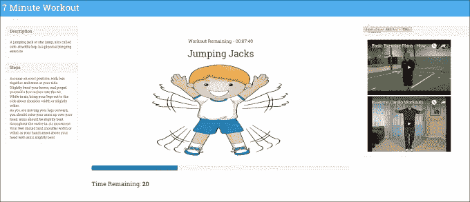
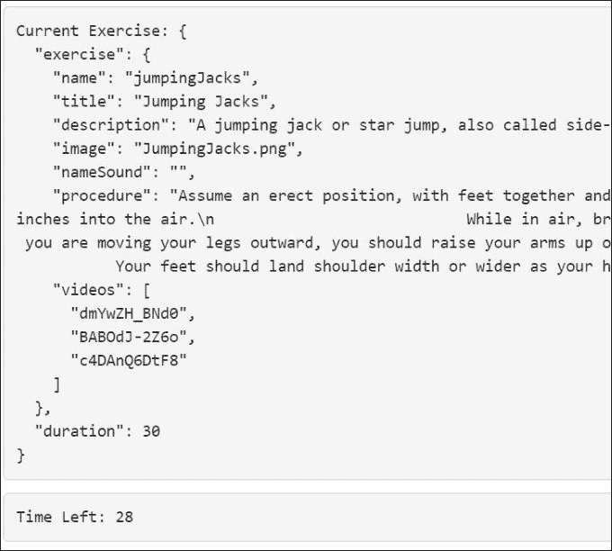
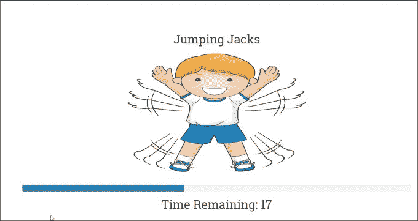
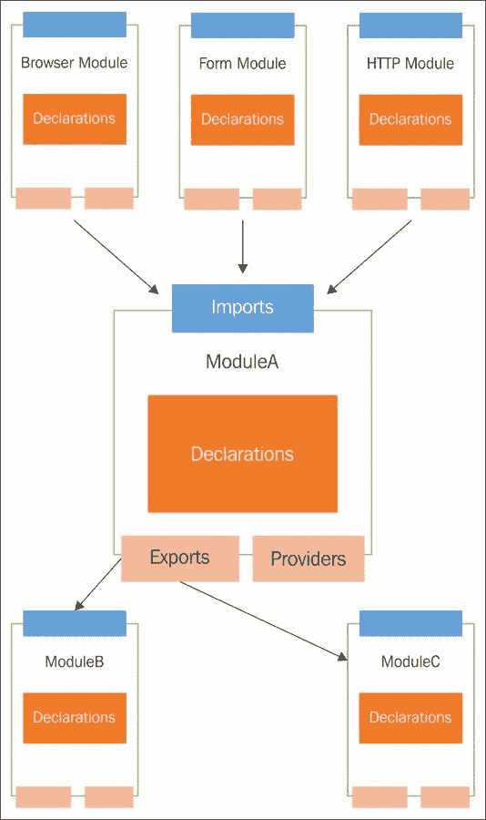
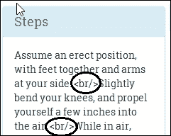
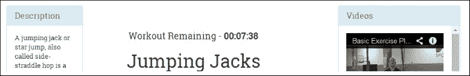
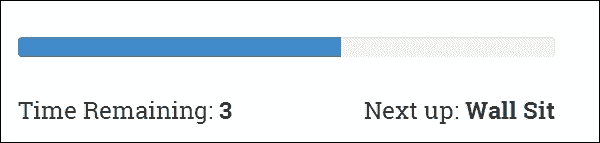
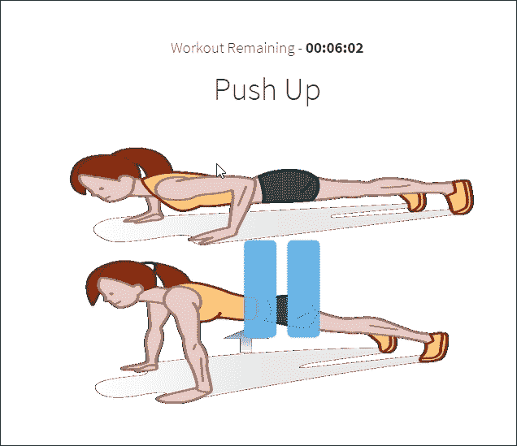
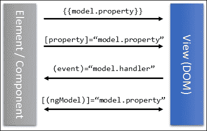

# 第二章：构建我们的第一个应用程序-7 分钟锻炼

我希望第一章足够引人入胜，你想更多地了解 Angular。相信我，我们只是触及了表面！这个框架有很多可提供的，它致力于使使用 JavaScript 进行前端开发更有条理，因此更易管理。

跟着本书的主题，我们将在 Angular 中构建一个新的应用程序，并在此过程中更好地理解这个框架。这个应用程序还将帮助我们探索框架的一些新功能。

本章我们将涵盖的主题包括以下内容：

+   7 分钟锻炼问题描述：我们详细介绍了本章中构建的应用程序的功能。

+   代码组织：对于我们的第一个真正的应用程序，我们将尝试解释如何组织代码，特别是 Angular 代码。

+   设计模型：我们应用程序的构建块之一是其模型。我们根据应用程序的要求设计应用程序模型。

+   理解数据绑定基础设施：在构建*7 分钟锻炼*视图时，我们将研究框架的数据绑定能力，包括*属性*、*属性*、*类*、*样式*和*事件*绑定。

+   探索 Angular 平台指令：我们将涵盖的一些指令包括`ngFor`、`ngIf`、`ngClass`、`ngStyle`和`ngSwitch`。

+   使用输入属性进行跨组件通信：构建了一些子组件后，我们学习了如何使用*输入属性*将数据从父组件传递给其子组件。

+   使用事件进行跨组件通信：Angular 组件可以订阅和触发事件。我们将介绍 Angular 中的事件绑定支持。

+   Angular 管道：Angular 管道提供了一种格式化视图内容的机制。我们将探索一些标准的 Angular 管道，并构建我们自己的管道，以支持从秒转换为 hh:mm:ss。

让我们开始吧！我们要做的第一件事是定义我们的*7 分钟锻炼*应用程序的模型。

# 什么是 7 分钟锻炼？

我们希望每个阅读本书的人都能保持身体健康。因此，这本书应该具有双重目的；它不仅应该激发你的思维，还应该督促你关注自己的身体健康。有什么比构建一个针对身体健康的应用程序更好的方式呢！

*7 分钟锻炼*是一种锻炼/训练计划，要求我们在七分钟的时间内快速连续进行一组十二个练习。由于其益处和短暂的锻炼时间，*7 分钟锻炼*变得非常受欢迎。我们无法证实或否认这些说法，但进行任何形式的剧烈体育活动总比什么都不做要好。如果您对这项锻炼感兴趣，可以查看[`well.blogs.nytimes.com/2013/05/09/the-scientific-7-minute-workout/`](http://well.blogs.nytimes.com/2013/05/09/the-scientific-7-minute-workout/)了解更多信息。

该应用程序的技术细节包括进行一组 12 个练习，每个练习需要 30 秒。然后是一个简短的休息时间，然后开始下一个练习。对于我们正在构建的应用程序，我们将每次休息 10 秒。因此，总持续时间略长于 7 分钟。

在本章的结尾，我们将准备好*7 分钟锻炼*应用程序，它将看起来像这样：



# 下载代码库

该应用程序的代码可以从 GitHub 网站[`github.com/chandermani/angular2byexample`](https://github.com/chandermani/angular2byexample)下载，该网站专门为本书创建。由于我们正在逐步构建应用程序，我们创建了多个检查点，这些检查点映射到**GitHub 分支**，如`checkpoint2.1`，`checkpoint2.2`等。在叙述过程中，我们将突出显示用于参考的分支。这些分支将包含截至该时间点的应用程序工作。

### 注意

*7 分钟锻炼*代码位于名为`trainer`的存储库文件夹中。

那么让我们开始吧！

# 建立构建

请记住，我们正在构建一个现代平台，对于这个平台，浏览器仍然缺乏支持。因此，在 HTML 中直接引用脚本文件是不可能的（虽然常见，但这是一种过时的方法，我们无论如何都应该避免）。当前的浏览器不理解**TypeScript**；事实上，甚至**ES 2015**（也称为 ES6）也不受支持。这意味着必须有一个过程将用 TypeScript 编写的代码转换为标准的**JavaScript（ES5）**，以便浏览器可以使用。

因此，对于几乎任何 Angular 2 应用程序来说，建立构建过程变得至关重要。对于小型应用程序来说，构建过程可能看起来有些多余，但它也有其他一些优势。

如果你是一个在 Web 堆栈上工作的前端开发人员，你无法避免**Node.js**。这是最广泛使用的 Web/JavaScript 开发平台。因此，毫无疑问，Angular 2 的构建设置也支持 Node.js，使用诸如**Grunt**、**Gulp**、**JSPM**和**webpack**等工具。

### 注意

由于我们是在 Node.js 平台上构建的，请在开始之前安装 Node.js。

虽然在线上有相当复杂的构建设置选项，但我们选择使用**Gulp**进行最小化设置。原因是因为没有一个适合所有情况的解决方案。此外，这里的主要目的是学习 Angular 2，而不是过多担心设置和运行构建的复杂性。

社区创建的一些值得注意的起始站点和构建设置如下：

| **开始网站** | **位置** |
| --- | --- |
| `angular2-webpack-starter` | [`bit.ly/ng2webpack`](http://bit.ly/ng2webpack) |
| `angular2-seed` | [`bit.ly/ng2seed`](http://bit.ly/ng2seed) |
| `angular-cli`-我们在第一章中提到过这个工具，*入门*。它允许我们生成初始的代码设置，包括构建配置，并且还具有良好的脚手架能力。 | [`bit.ly/ng2-cli`](http://bit.ly/ng2-cli) |

如果你对**Node.js**或整个构建过程非常陌生，自然会有一个问题：一个典型的 Angular 构建包括什么？这取决于情况！要了解这个过程，如果我们看一下为我们的应用定义的构建设置，会很有益。然后让我们在本地设置应用的构建。按照以下步骤让这个样板 Angular 2 应用运行起来：

1.  从[`bit.ly/ng2be-base`](http://bit.ly/ng2be-base)下载这个应用的基本版本，并解压到您机器上的一个位置。如果你熟悉 Git 的工作原理，你可以直接克隆存储库并检出`base`分支：

```ts
**git checkout base**

```

这段代码作为我们应用的起点。

1.  从命令行导航到`trainer`文件夹并执行以下命令：

```ts
**npm i -g gulp typings**
**npm install**

```

第一个命令全局安装了 Gulp（和 typings），这样你就可以在任何地方调用**Gulp**命令行工具并执行*Gulp 任务*。**Gulp 任务**是 Gulp 在构建执行期间执行的活动。如果我们查看 Gulp 构建脚本（我们很快就会做），我们会意识到它只是在构建发生时执行的一系列任务。第二个命令安装了应用程序的依赖项（以`npm`包的形式）。在 Node.js 世界中，**包**是第三方库，它们要么被应用程序使用，要么支持应用程序的构建过程。例如，Gulp 本身就是一个 Node.js 包。**npm**是一个从中央存储库中拉取这些包的命令行工具。

1.  一旦安装了 Gulp 并且 npm 从 npm 存储库中拉取了依赖项，我们就可以构建和运行应用程序了。从命令行输入以下命令：

```ts
**gulp play**

```

这将编译并运行应用程序。如果构建过程顺利进行，将会打开默认的浏览器窗口/标签，显示一个简单的 Hello World 页面（`http://localhost:9000/index.html`）。我们已经准备好开始在 Angular 2 中开发我们的应用程序了！

但在我们这样做之前，了解一下幕后发生了什么将会很有趣。

## 构建内部机制

即使你是 Gulp 的新手，看一下`gulpfile.js`也能让你对构建过程有一个大致的了解。Gulp 构建是按预定义顺序执行的一系列任务。这样一个过程的最终结果是一些形式的包代码，可以直接运行。如果我们使用*TypeScript*/*ES2015*或者其他浏览器不原生支持的类似语言来构建我们的应用程序，那么我们需要一个额外的构建步骤，称为**转译**。

### 代码转译

截至 2016 年，浏览器仍然无法运行*ES2015*代码。虽然我们很快就会接受隐藏 JavaScript（ES5）不太好的部分的语言，但我们仍然受到浏览器能力的限制。在语言特性方面，**ES5**仍然是最安全的选择，因为所有浏览器都支持它。显然，我们需要一种机制将我们的*TypeScript*代码转换为纯 JavaScript（**ES5**）。微软有一个 TypeScript 编译器来完成这项工作。

TypeScript 编译器将 TypeScript 代码转换为可以在所有浏览器中运行的 ES5 格式代码。这个过程通常被称为**转译**，由于 TypeScript 编译器执行，所以它被称为**转译器**。

有趣的是，转译可以在构建/编译时和运行时都发生：

+   **构建时转译**：作为构建过程的一部分进行转译，将脚本文件（在我们的例子中是 TypeScript 的 `.ts` 文件）编译成普通的 JavaScript。我们的构建设置使用构建时转译。

+   **运行时转译**：这发生在浏览器中的运行时。我们包括原始的特定语言脚本文件（在我们的例子中是 `.ts` 文件），以及 TypeScript 编译器，它在浏览器中预先加载，动态地编译这些脚本文件。虽然运行时转译简化了构建设置过程，但建议仅限于开发工作流程，考虑到加载转译器和动态转译代码所涉及的额外性能开销。第一章中的示例，*入门*，使用了运行时转译，因此不需要任何构建设置。再去看一遍吧！

转译的过程不仅限于 TypeScript。每种面向 Web 的语言，如 **CoffeeScript**、**ES2015** 或任何其他浏览器本身无法理解的语言，都需要转译。大多数语言都有转译器，其中一些著名的（除了 TypeScript 之外）还有 **tracuer** 和 **babel**。

要编译 TypeScript 文件，我们可以使用以下命令行手动安装 TypeScript 编译器：

```ts
**npm install -g typescript**

```

一旦安装，我们可以使用编译器（`tsc.exe`）将任何 TypeScript 文件编译成 ES5 格式。

但对于我们的构建设置，这个过程是通过 `ts2js` Gulp 任务自动化的（查看 `gulpfile.js`）。如果你想知道我们何时安装了 TypeScript... 好吧，我们是在第一次设置代码时作为 `npm install` 步骤的一部分来安装的。`gulp-typescript` 包会将 TypeScript 编译器作为依赖项下载。

有了对转译的基本理解，我们可以总结一下我们的构建设置发生了什么：

+   `gulp play` 命令启动构建过程。这个命令告诉 Gulp 通过调用 `play` 任务开始构建过程。

+   由于 `play` 任务依赖于 `ts2js` 任务，`ts2js` 会首先执行。`ts2js` 编译位于 `src` 文件夹中的 TypeScript 文件（`.ts`）并将它们输出到根目录下的 `dist` 文件夹中。

+   构建后，启动了一个静态文件服务器，用于提供所有应用程序文件，包括静态文件（图像、视频和 HTML）和脚本文件（检查`gulp.play`任务）。

+   此后，构建过程将监视您所做的任何脚本文件更改（`gulp.watch`任务），并在飞行中重新编译代码。

### 注意

**livereload** 也已为应用程序设置。对代码的任何更改都会自动刷新运行应用程序的浏览器。如果自动浏览器刷新失败，我们总是可以手动刷新。

这是运行 Angular 应用所需的基本构建设置。对于复杂的构建需求，我们可以随时查看具有更完整和健壮的构建设置的起始/种子项目，或者构建我们自己的项目。

接下来让我们看一下已经存在的样板应用代码以及整体的代码组织。

# 组织代码

这是我们将组织应用程序的代码和其他资产的方式：


`trainer`文件夹是应用程序的根文件夹，它有一个文件夹（`static`）用于静态内容（如图像、CSS、音频文件等），以及一个文件夹（`src`）用于应用程序的源代码。

应用程序源代码的组织受到 Angular 的设计和 Angular 团队发布的 Angular 风格指南（[`bit.ly/ng2-style-guide`](http://bit.ly/ng2-style-guide)）的影响。正如我们在第一章中看到的，*入门*，在 Angular 2 的主要构建模块中包括**组件**。`components`文件夹托管了我们创建的所有组件。我们将为应用程序的每个主要组件在这个文件夹中创建子文件夹。每个组件文件夹将包含与该组件相关的工件，包括其模板、实现和其他相关项目。随着我们构建应用程序，我们还将在`src`文件夹中添加更多的顶级文件夹。

如果我们现在看一下代码，`components/app`文件夹已经定义了一个*根级组件* `TrainerAppComponent` 和根级模块 `AppModule`。`bootstrap.ts`文件包含了用于引导/加载应用模块（`AppModule`）的代码。

### 注意

*7 分钟锻炼*使用**即时（JIT）编译**来编译 Angular 视图。这意味着视图在在浏览器中呈现之前才被编译。Angular 在浏览器中运行一个编译器来编译这些视图。

Angular 也支持**提前编译（AoT）**模型。通过 AoT，视图在服务器端使用 Angular 编译器的服务器版本进行编译。返回给浏览器的视图是预编译的，可以立即使用。

对于*7 分钟锻炼*，我们坚持使用 JIT 编译模型，因为与需要服务器端调整和包安装的 AoT 相比，它更容易设置。

我们强烈建议您在生产应用中使用 AoT 编译，因为它提供了许多好处。 AoT 可以改善应用程序的初始加载时间，也可以减小应用程序的大小。请查看 AoT 平台文档（*食谱*）[`bit.ly/ng2-aot`](http://bit.ly/ng2-aot) 了解 AoT 编译如何使您受益。

是时候开始我们的第一个重点领域了，那就是应用的模型！

# 7 分钟锻炼模型

设计这个应用的模型需要我们首先详细说明*7 分钟锻炼*应用的功能方面，然后得出一个满足这些要求的模型。根据之前定义的问题陈述，一些明显的要求如下：

+   能够开始锻炼。

+   提供关于当前锻炼及其进度的视觉提示。这包括以下内容：

+   提供当前锻炼的视觉描述。

+   提供如何进行特定锻炼的逐步说明

+   当前锻炼剩余的时间

+   在锻炼结束时通知用户。

我们将为这个应用添加一些其他有价值的功能，如下所示：

+   暂停当前的锻炼。

+   提供关于接下来要进行的锻炼的信息。

+   提供音频提示，使用户可以在不断地盯着屏幕的情况下进行锻炼。这包括：

+   计时器点击声

+   下一个锻炼的细节

+   发出锻炼即将开始的信号

+   显示正在进行的锻炼相关的视频，并能够播放它们。

正如我们所看到的，这个应用的中心主题是**锻炼**和**运动**。在这里，锻炼是按特定顺序进行的一系列锻炼，持续一段特定时间。因此，让我们继续定义我们的锻炼和运动的模型。

根据刚才提到的要求，我们将需要关于一项锻炼的以下细节：

+   名称。这应该是唯一的。

+   标题。这将显示给用户。

+   锻炼的描述。

+   关于如何进行锻炼的说明。

+   锻炼的图片。

+   锻炼的音频剪辑名称。

+   相关视频。

使用 TypeScript，我们可以为我们的模型定义类。

在`src/components`文件夹内创建一个名为`workout-runner`的文件夹，并将`checkpoint2.1`分支文件夹`workout-runner`（[`bit.ly/ng2be-2-1-model-ts`](https://github.com/chandermani/angular2byexample/blob/checkpoint2.1/trainer/src/components/workout-runner/model.ts)）中的`model.ts`文件复制到相应的本地文件夹中。 `model.ts`包含了我们应用程序的模型定义。

`Exercise`类看起来是这样的：

```ts
export class Exercise { 
  constructor( 
    public name: string, 
    public title: string, 
    public description: string, 
    public image: string, 
    public nameSound?: string, 
    public procedure?: string, 
    public videos?: Array<string>) { } 
} 

```

### 提示

**TypeScript 提示** 使用`public`或`private`传递构造函数参数是一种快捷方式，可以一次创建和初始化类成员。在`nameSound`，`procedure`和`videos`后面的`?`后缀意味着这些是可选参数。

对于锻炼，我们需要跟踪以下属性：

+   名称。这应该是唯一的。

+   标题。这将显示给用户。

+   作为锻炼一部分的练习。

+   每个练习的持续时间。

+   两个练习之间的休息时间。

因此，模型类（`WorkoutPlan`）看起来是这样的：

```ts
export class WorkoutPlan { 
  constructor( 
    public name: string, 
    public title: string, 
    public restBetweenExercise: number, 
 **public exercises: ExercisePlan[],** 
    public description?: string) { } 

  totalWorkoutDuration(): number { ... } 
} 

```

`totalWorkoutDuration`函数返回锻炼的总持续时间（以秒为单位）。

`WorkoutPlan`在前述定义中引用了另一个类：`ExercisePlan`。它跟踪了锻炼和锻炼的持续时间，一旦我们查看`ExercisePlan`的定义，这就显而易见了：

```ts
export class ExercisePlan { 
  constructor( 
    public exercise: Exercise, 
    public duration: number) { } 
} 

```

这三个类构成了我们的基本模型，我们将在将来决定是否需要在实现应用程序功能时扩展这个模型。

由于我们已经从预配置和基本的 Angular 应用程序开始，您只需要了解这个应用程序是如何引导的。

# 应用程序引导

第一章，“入门”，对应用程序引导过程进行了很好的介绍。 *7 分钟锻炼*的应用程序引导过程保持不变，查看`src`文件夹。有一个`bootstrap.ts`文件，除了`imports`之外只有执行位：

```ts
platformBrowserDynamic().bootstrapModule(AppModule); 

```

`boostrapModule`函数调用实际上通过加载根模块`AppModule`引导应用程序。这个过程是由`index.html`中的这个调用触发的：

```ts
System.import('app').catch(console.log.bind(console)); 

```

`System.import`语句通过从`bootstrap.ts`加载第一个模块来启动应用程序引导过程。

### 注意

在 Angular 2 的上下文中定义的模块（使用 `@NgModule` 装饰器）与 SystemJS 加载的模块是不同的。SystemJS 模块是 JavaScript 模块，可以采用符合 *CommonJS*、*AMD* 或 *ES2015* 规范的不同格式。

Angular 模块是 Angular 用来分隔和组织其构件的构造。

除非讨论的上下文是 SystemJS，否则对 *模块* 的任何引用都意味着 *Angular 模块*。

接下来的部分详细介绍了 SystemJS 如何加载我们的 Angular 应用程序。请记住，下一部分中对模块的所有引用都是 JavaScript 模块。如果你愿意，你可以跳过这一部分，因为它与 Angular 开发没有直接关系。

## 使用 SystemJS 加载应用程序

SystemJS 通过在 `index.html` 中调用 `System.import('app')` 来开始加载 JavaScript 模块。

SystemJS 首先加载 `bootstrap.ts`。在 `bootstrap.ts` 中定义的导入会导致 SystemJS 加载这些导入的模块。如果这些模块导入还有进一步的 `import` 语句，SystemJS 也会递归加载它们。

最后，一旦所有导入的模块都加载完毕，`platformBrowserDynamic().bootstrapModule(AppModule);` 函数就会被执行。

SystemJS `import` 函数需要知道模块的位置才能工作。我们在文件 `systemjs.config.js` 中定义这一点，并在 `index.html` 中引用它，在 `System.import` 脚本之前：

```ts
<script src="systemjs.config.js"></script> 

```

这个配置文件包含了 SystemJS 正确工作所需的所有配置。

打开 `systemjs.config.js`，`System.import` 函数的 `app` 参数指向一个名为 `dist` 的文件夹，如 `map` 对象中所定义的：

```ts
var map = { 
 **'app': 'dist',** 
    ... 
 } 

```

接下来的变量 `packages` 包含了一些设置，提示 SystemJS 在没有指定文件名/扩展名时如何加载一个包中的模块。对于 `app`，默认模块是 `bootstrap.js`：

```ts
var packages = { 
 **'app': { main: 'bootstrap.js',  defaultExtension: 'js' },** 
    ... 
}; 

```

你是否想知道 `dist` 文件夹与我们的应用程序有什么关系？嗯，这就是我们转译后的脚本所在的地方。因为我们的应用程序是用 TypeScript 构建的，TypeScript 编译器将 `src` 文件夹中的 `.ts` 脚本文件转换为 JavaScript 模块，并将它们存放在 `dist` 文件夹中。然后 SystemJS 加载这些编译后的 JavaScript 模块。转译后的代码位置已经作为构建定义的一部分在 `gulpfile.js` 中配置好了。在 `gulpfile.ts` 中找到这一节：

```ts
return tsResult.js 
    .pipe(sourcemaps.write()) 
 **.pipe(gulp.dest('dist'))**

```

我们应用程序使用的模块规范可以在 `gulpfile.js` 中再次验证。看一下这一行：

```ts
noImplicitAny: true, 
**module: 'system',** 
target: 'ES5', 

```

这些是 TypeScript 编译器选项，其中一个是`module`，即目标模块定义格式。

### 注意

`system`模块类型是一种新的模块格式，旨在支持 ES5 中 ES2015 模块的确切语义。

一旦脚本被*转译*并且模块定义被创建（以目标格式），SystemJS 可以加载这些模块及其依赖项。

现在是时候投入行动了；让我们构建我们的第一个组件。

# 我们的第一个组件 - WorkoutRunnerComponent

要实现`WorkoutRunnerComponent`，我们需要概述应用程序的行为。

我们在`WorkoutRunnerComponent`实现中要做的是：

1.  开始锻炼。

1.  显示进行中的锻炼并显示进度指示器。

1.  在锻炼时间结束后，显示下一个锻炼。

1.  重复此过程，直到所有锻炼结束。

让我们从实现开始。我们将首先创建`WorkoutRunnerComponent`的实现。

在`src/components`文件夹中打开`workout-runner`文件夹，并向其中添加一个名为`workout-runner.component.ts`的新代码文件。将以下代码块添加到文件中：

```ts
import {WorkoutPlan, ExercisePlan, Exercise, ExerciseProgressEvent, ExerciseChangedEvent} from '../../services/model';
export class WorkoutRunnerComponent { } 

```

`import`模块声明允许我们引用`model.ts`文件中定义的类在`WorkoutRunnerComponent`中。

我们首先需要设置锻炼数据。让我们通过向`WorkoutRunnerComponent`类添加构造函数和相关类属性来做到这一点：

```ts
workoutPlan: WorkoutPlan; 
restExercise: ExercisePlan; 
constructor() { 
   this.workoutPlan = this.buildWorkout(); 
   this.restExercise = new ExercisePlan( 
     new Exercise("rest", "Relax!", "Relax a bit", "rest.png"),  
     this.workoutPlan.restBetweenExercise);   
} 

```

`WorkoutRunnerComponent`上的`buildWorkout`设置完整的锻炼计划，我们很快就会看到。我们还初始化了一个`restExercise`变量来跟踪休息期间的锻炼（注意`restExercise`是`ExercisePlan`类型的对象）。

`buildWorkout`函数是一个冗长的函数，所以最好是从 Git 分支 checkpoint2.1（[`bit.ly/ng2be-2-1-workout-runner-component-ts`](http://bit.ly/ng2be-2-1-workout-runner-component-ts)）中的锻炼运行器的实现中复制实现。`buildWorkout`代码如下：

```ts
buildWorkout(): WorkoutPlan { 
let workout = new WorkoutPlan("7MinWorkout",  
"7 Minute Workout", 10, []); 
   workout.exercises.push( 
      new ExercisePlan( 
        new Exercise( 
          "jumpingJacks", 
          "Jumping Jacks", 
          "A jumping jack or star jump, also called side-straddle hop
           is a physical jumping exercise.", 
          "JumpingJacks.png", 
          "jumpingjacks.wav", 
          `Assume an erect position, with feet together and 
           arms at your side. ...`, 
          ["dmYwZH_BNd0", "BABOdJ-2Z6o", "c4DAnQ6DtF8"]), 
        30)); 
   // (TRUNCATED) Other 11 workout exercise data. 
   return workout; 
} 

```

这段代码构建了`WorkoutPlan`对象并将锻炼数据推送到锻炼数组中（一个`ExercisePlan`对象数组），返回新构建的锻炼计划。

初始化完成；现在是时候实际实现开始锻炼了。在`WorkoutRunnerComponent`实现中添加一个`start`函数，如下所示：

```ts
start() { 
   this.workoutTimeRemaining =  
   this.workoutPlan.totalWorkoutDuration(); 
   this.currentExerciseIndex = 0;  
   this.startExercise(this.workoutPlan.exercises[this.currentExerciseIndex]); 
} 

```

然后在函数顶部声明新变量，与其他变量声明一起：

```ts
workoutTimeRemaining: number; 
currentExerciseIndex: number; 

```

`workoutTimeRemaining`变量跟踪训练剩余的总时间，`currentExerciseIndex`跟踪当前执行的练习索引。调用`startExercise`实际上开始了一项练习。这是`startExercise`的代码：

```ts
startExercise(exercisePlan: ExercisePlan) { 
    this.currentExercise = exercisePlan; 
    this.exerciseRunningDuration = 0; 
    let intervalId = setInterval(() => { 
      if (this.exerciseRunningDuration >=  
        this.currentExercise.duration) { 
          clearInterval(intervalId);  
      } 
      else { this.exerciseRunningDuration++;    } 
    }, 1000); 
} 

```

我们首先初始化`currentExercise`和`exerciseRunningDuration`。`currentExercise`变量跟踪正在进行的练习，`exerciseRunningDuration`跟踪其持续时间。这两个变量也需要在顶部声明：

```ts
currentExercise: ExercisePlan; 
exerciseRunningDuration: number; 

```

我们使用`setInterval` JavaScript 函数，延迟 1 秒（1,000 毫秒）来通过递增`exerciseRunningDuration`来跟踪练习进度。`setInterval`每秒调用一次回调函数。`clearInterval`调用在练习持续时间结束后停止计时器。

### 提示

**TypeScript 箭头函数**传递给`setInterval`的回调参数（`()=>{...}`）是一个**lambda 函数**（或 ES 2015 中的**箭头函数**）。Lambda 函数是匿名函数的简写形式，具有附加的好处。您可以在[`basarat.gitbooks.io/typescript/content/docs/arrow-functions.html`](https://basarat.gitbooks.io/typescript/content/docs/arrow-functions.html)了解更多信息。

到目前为止，我们有一个`WorkoutRunnerComponent`类。我们需要将其转换为*Angular 组件*并定义组件视图。我们在第一章中也做过类似的事情，*入门*。

添加`Component`的导入和组件装饰器（高亮代码）：

```ts
import {WorkoutPlan, ExercisePlan, Exercise} from './model'
**import {Component} from '@angular/core';**
**@Component({**
 **selector: 'workout-runner',**
 **template: `**
 **<pre>Current Exercise: {{currentExercise | json}}</pre>
    <pre>Time Left: {{currentExercise?.duration-exerciseRunningDuration}}</pre>`**
**})** 
export class WorkoutRunnerComponent { 

```

这里没有太多需要解释的，因为您已经知道如何创建一个 Angular 组件。您了解`@Component`装饰器的作用，`selector`的作用，以及如何使用`template`。

### 注意

`@Component`装饰器生成的 JavaScript 包含有关组件的足够元数据。这使得 Angular 框架能够在运行时实例化正确的组件。

用**反引号**（`` ``）括起来的字符串是 ES2015 的一个新添加。也称为**模板文字**，这样的字符串文字可以是多行的，并允许嵌入表达式（不要与 Angular 表达式混淆）。在这里查看 MDN 文章 [`bit.ly/template-literals`](http://bit.ly/template-literals) 获取更多详情。

前面的模板 HTML 将呈现原始的`ExercisePlan`对象和剩余的锻炼时间。在第一个插值内有一个有趣的表达式：`currentExercise | json`。`currentExercise`属性在`WorkoutRunnerComponent`中定义，但是`|`符号和其后的内容（`json`）呢？在 Angular 2 世界中，它被称为**管道**。*管道的唯一目的是转换/格式化模板数据*。这里的`json`管道执行 JSON 数据格式化。在本章后面你会学到更多关于管道的知识，但是为了对`json`管道的作用有一个大致的了解，我们可以移除`json`管道和`|`符号并渲染模板；我们接下来要做这个。

正如我们在第一章中看到的，*入门*，在我们可以使用`WorkoutRunnerComponent`之前，我们需要在一个模块中声明它。由于我们的应用目前只有一个模块（`AppModule`），我们将`WorkoutRunnerComponent`的声明添加到其中。通过添加下面突出显示的代码来更新`app.module.ts`：

```ts
**import {WorkoutRunnerComponent} from '../workout-runner/workout-runner.component';** 
@NgModule({ 
  imports: [BrowserModule], 
 **declarations: [TrainerAppComponent, WorkoutRunnerComponent],**

```

现在`WorkoutRunnerComponent`可以在根组件中引用，以便渲染它。按照下面的代码在`src/components/app/app.component.ts`中进行修改：

```ts
@Component({ 
... 
    template: `  
<div class="navbar ...> ... 
</div> 
<div class="container ...> 
**<workout-runner></workout-runner>** 
</div>` 
}) 

```

我们已经改变了根组件模板，并在其中添加了`workout-runner`元素。这将在我们的根组件中渲染`WorkoutRunnerComponent`。

虽然实现看起来很完整，但关键部分缺失了。在代码中我们实际上并没有开始锻炼。锻炼应该在我们加载页面时立即开始。

**组件生命周期钩子**将拯救我们！

## 组件生命周期钩子

Angular 组件的生命周期是充满事件的。组件被创建，它们在其生命周期中改变状态，最后被销毁。当这样的事件发生时，Angular 提供了一些**生命周期钩子/函数**，框架会在组件上调用它们。考虑以下例子：

+   当组件初始化时，Angular 会调用`ngOnInit`

+   当组件的输入属性发生变化时，Angular 会调用`ngOnChanges`

+   当组件被销毁时，Angular 会调用`ngOnDestroy`

作为开发者，我们可以利用这些关键时刻，在各自的组件内执行一些自定义逻辑。

### 注意

Angular 为每个这些钩子都有 TypeScript 接口，可以应用到组件类中，以清晰地传达意图。例如：

```ts
class WorkoutRunnerComponent implements OnInit { 
  ngOnInit (){ 
    ... 
} 
... 

```

接口名称可以通过从函数名称中删除前缀`ng`来派生。

我们要在这里使用的钩子是`ngOnInit`。`ngOnInit`函数在组件的数据绑定属性初始化后但视图初始化开始之前触发。

将`ngOnInit`函数添加到`WorkoutRunnerComponent`类中，并调用开始锻炼的方法：

```ts
ngOnInit() { 
    this.start(); 
} 

```

并在`WorkoutRunnerComponent`上实现`OnInit`接口；它定义了`ngOnInit`方法：

```ts
import {Component,**OnInit**} from '@angular/core'; 
... 
export class WorkoutRunnerComponent **implements OnInit** { 

```

### 注意

还有许多其他生命周期钩子，包括`ngOnDestroy`、`ngOnChanges`和`ngAfterViewInit`，组件都支持；但我们不会在这里深入讨论它们中的任何一个。查看开发者指南（[`bit.ly/ng2-lifecycle`](http://bit.ly/ng2-lifecycle)）上的*生命周期钩子*，了解更多关于其他钩子的信息。

是时候运行我们的应用程序了！打开命令行，导航到`trainer`文件夹，并输入以下命令：

```ts
**gulp play**

```

如果没有编译错误，并且浏览器自动加载应用程序（`http://localhost:9000/index.html`），我们应该看到以下输出：



模型数据每秒都在更新！现在你会明白为什么插值（`{{ }}`）是一个很好的调试工具。

### 注意

现在也是一个尝试渲染`currentExercise`而不使用`json`管道（使用`{{currentExercise}}`）的好时机，看看会渲染出什么。

我们还没有完成！在`index.html`页面上等待足够长的时间，你会意识到计时器在 30 秒后停止。应用程序没有加载下一个锻炼数据。是时候修复它了！

更新`setInterval`的`if`条件内的代码：

```ts
if (this.exerciseRunningDuration >=  
this.currentExercise.duration) { 
   clearInterval(intervalId); 
 **let next: ExercisePlan = this.getNextExercise();**
 **if (next) {** 
 **if (next !== this.restExercise) {** 
 **this.currentExerciseIndex++;** 
 **}** 
 **this.startExercise(next);**
**}** 
 **else { console.log("Workout complete!"); }** 
} 

```

`if`条件`if (this.exerciseRunningDuration >= this.currentExercise.duration)`用于在当前锻炼的时间持续时间结束后过渡到下一个锻炼。我们使用`getNextExercise`来获取下一个锻炼，并再次调用`startExercise`来重复这个过程。如果`getNextExercise`调用没有返回任何锻炼，那么锻炼被视为完成。

在进行锻炼过渡期间，只有在下一个锻炼不是休息锻炼时，我们才会增加`currentExerciseIndex`。请记住，原始的锻炼计划中没有休息锻炼。为了保持一致，我们创建了一个休息锻炼，并且现在在休息和锻炼计划中的标准锻炼之间进行切换。因此，当下一个锻炼是休息时，`currentExerciseIndex`不会改变。

让我们快速添加 `getNextExercise` 函数。将该函数添加到 `WorkoutRunnerComponent` 类中：

```ts
getNextExercise(): ExercisePlan { 
    let nextExercise: ExercisePlan = null; 
    if (this.currentExercise === this.restExercise) { 
      nextExercise =  
this.workoutPlan.exercises[this.currentExerciseIndex + 1]; 
    } 
    else if (this.currentExerciseIndex <  
    this.workoutPlan.exercises.length - 1) { 
      nextExercise = this.restExercise; 
    } 
    return nextExercise; 
} 

```

`WorkoutRunnerComponent.getNextExercise` 返回需要执行的下一个练习。

### 注意

请注意，`getNextExercise` 返回的对象是一个 `ExercisePlan` 对象，其中包含了练习的细节和练习运行的持续时间。

实现相当不言自明。如果当前练习是休息，从 `workoutPlan.exercises` 数组中获取下一个练习（基于 `currentExerciseIndex`）；否则，下一个练习是休息，前提是我们不在最后一个练习上（`else if` 条件检查）。

有了这些，我们已经准备好测试我们的实现了。所以继续刷新 `index.html`。每隔 10 或 30 秒后，练习应该会翻转。太棒了！

### 注意

当前的构建设置会在保存文件时自动编译对脚本文件所做的任何更改；它还会在这些更改后刷新浏览器。但是，如果 UI 没有更新或事情不如预期地工作，刷新浏览器窗口。

如果您在运行代码时遇到问题，请查看 Git 分支 `checkpoint2.1`，以获取到目前为止我们所做的工作的可工作版本。

或者，如果您不使用 Git，请从 [`bit.ly/ng2be-checkpoint2-1`](http://bit.ly/ng2be-checkpoint2-1) 下载 Checkpoint 2.1 的快照（ZIP 文件）。在首次设置快照时，请参考 `trainer` 文件夹中的 `README.md` 文件。

我们已经在控制器上做了足够的工作，现在让我们构建视图。

# 构建 7 分钟锻炼视图

在定义模型和实现组件时，大部分工作已经完成。现在我们只需要使用 Angular 的超级数据绑定功能来设计 HTML。这将会简单、甜美且优雅！

对于 *7 分钟锻炼* 视图，我们需要显示练习名称、练习图片、进度指示器和剩余时间。从 Git 分支 `checkpoint2.2` 的 `workout-runner` 文件夹中复制 `workout-runner.html` 文件（或从 [`bit.ly/ng2be-2-2-workout-runner-html`](http://bit.ly/ng2be-2-2-workout-runner-html) 下载），并将其保存到本地相应的文件夹中。视图 HTML 如下所示：

```ts
<div class="row"> 
  <div id="exercise-pane" class="col-sm-8 col-sm-offset-2"> 
    <div class="row workout-content"> 
      <div class="workout-display-div"> 
        <h1>{{currentExercise.exercise.title}}</h1> 
         
        <div class="progress time-progress"> 
          <div class="progress-bar" role="progressbar" 
          [attr.aria-valuenow]="exerciseRunningDuration"  
          aria-valuemin="0"  
          [attr.aria-valuemax]="currentExercise.duration"  
          [ngStyle] = "{'width':(exerciseRunningDuration/
                      currentExercise.duration) * 100 + '%'}"></div> 
        </div> 
        <h1>Time Remaining:{{currentExercise.duration - 
            exerciseRunningDuration}}</h1> 
      </div> 
    </div> 
  </div> 
</div> 

```

在我们深入研究视图 HTML 之前，我们仍然需要引用视图。`WorkoutRunnerComponent`目前使用内联模板。我们需要通过指向上述 HTML 文件来将其外部化。通过用`templateUrl`属性替换`template`属性来更新`workout-runner.component.ts`文件：

```ts
templateUrl: '/src/components/workout-runner/workout-runner.html' 

```

装饰器属性`templateUrl`允许我们引用视图 HTML 的外部文件。

### 提示

**内联与外部模板**

我们刚刚看到了定义视图模板的两种方式：使用`template`（内联）和使用`templateUrl`（外部）属性。哪种更受青睐？

嗯，考虑到在 Angular2 中构想组件的方式，作为独立的构建模块，对于我们的应用程序来说，内联模板是有意义的。组件所需的一切都在单个文件中。然而，内联模板有一个缺点；格式化 HTML 变得困难，IDE 支持非常有限，因为内容被视为字符串文字。当我们将 HTML 外部化时，我们可以像开发普通 HTML 文档一样开发模板。

允许我们同时拥有最佳解决方案的一种可能的解决方案是在开发过程中将 HTML 模板定义为单独的文件，并使用标准的`templateUrl`属性引用它们。但作为生产发布的一部分，配置构建过程以将模板 HTML 内联到组件定义中。

在我们了解视图中的 Angular 部分之前，让我们再次运行应用程序。保存`workout-runner.component.ts`中的更改。如果`gulp play`已经在运行，请刷新页面，看到完整的锻炼应用程序！



我们的基本应用程序正在运行。锻炼图片和标题显示出来，进度指示器显示进度，并且当锻炼时间结束时进行锻炼过渡。这确实感觉很棒！

### 注意

如果您在运行代码时遇到问题，请查看 Git 分支`checkpoint2.2`，以获取到目前为止我们所做的工作的可运行版本。您还可以从 GitHub 位置下载`checkpoint2.2`的快照（zip 文件）：[`bit.ly/ng2be-checkpoint2-2`](http://bit.ly/ng2be-checkpoint2-2)。在首次设置快照时，请参考`trainer`文件夹中的`README.md`文件。

如果我们回顾一下视图 HTML，除了使用*bootstrap* CSS 和一些自定义 CSS 进行样式设置之外，还有一些有趣的 Angular 片段需要我们的注意。而且，由于一切都与 Angular 绑定基础设施相关，现在是时候深入了解这个基础设施并探索其能力了。

## Angular 2 绑定基础设施

任何现代 JavaScript 框架都具有强大的模型-视图绑定支持，Angular 也不例外。任何绑定基础设施的主要目标都是减少我们需要编写的样板代码，以保持视图和模型的同步。强大的绑定基础设施总是声明性和简洁的。

Angular 绑定基础设施允许我们将模板（原始）HTML 转换为绑定到模型数据的实时视图。根据使用的绑定构造，数据可以在两个方向上流动并同步：从模型到视图和从视图到模型。

Angular 使用`@Component`装饰器的`template`或`templateUrl`属性在组件和视图之间建立了模型数据的链接。除了`script`标签之外，几乎任何 HTML 片段都可以作为 Angular 绑定基础设施的模板。

为了使这种绑定魔法生效，Angular 需要获取视图模板，编译它，将其链接到模型数据，并在不需要任何样板同步代码的情况下保持与模型更新的同步。

根据数据流方向，这些绑定可以分为三类：

+   *从模型到视图的单向绑定*：在模型到视图绑定中，对模型的更改与视图保持同步。插值、属性、属性、类和样式绑定属于这一类别。

+   *从视图到模型的单向绑定*：在这个类别中，视图更改流向模型。事件绑定属于这一类别。

+   *双向绑定*：双向绑定，顾名思义，保持视图和模型同步。有一个专门用于双向绑定的特殊绑定构造，`ngModel`。

让我们了解如何利用 Angular 的绑定能力来支持视图模板化。Angular 提供了这些绑定构造：

+   插值

+   属性绑定

+   属性绑定

+   类绑定

+   样式绑定

+   事件绑定

*7 分钟锻炼*视图使用了一些这些构造，所以现在是学习它们的好时机。**插值**是第一个。

## 插值

插值很简单。插值符号（`{{ }}`）中的表达式在模型的上下文中进行评估，评估的结果嵌入到 HTML 中。我们在第一章 *入门* 和训练运行器视图中一直看到这些。我们使用插值来呈现练习标题和剩余练习时间：

```ts
<h1>{{currentExercise.exercise.title}}</h1> 
<h1>Time Remaining: {{currentExercise.duration?-exerciseRunningDuration}}</h1> 

```

记住，插值会同步模型的变化与视图。这是从模型到视图的一种绑定方式。

实际上，插值是属性绑定的一种特殊情况，它允许我们将 HTML 元素/自定义组件的属性绑定到模型上。我们很快讨论一下如何使用属性绑定语法编写插值。我们可以将插值视为属性绑定的语法糖。

## 属性绑定

看一下这个视图摘录：

```ts
 

```

看起来我们正在将`img`的`src`属性设置为在应用运行时评估的表达式。这是不正确的！

看起来是**属性绑定**的东西，实际上是**属性绑定**。而且，由于我们许多人不了解 HTML 元素的*属性*和*属性*之间的区别，这个说法非常令人困惑。因此，在我们看属性绑定如何工作之前，让我们试着理解一下元素的*属性*和*属性*之间的区别。

### 属性与属性的区别

拿任何 DOM 元素 API，你会发现*属性*、*属性*、*函数*和*事件*。虽然事件和函数是不言自明的，但很难理解*属性*和*属性*之间的区别。我们通常可以互换使用这些词，这也没有太大帮助。例如，这行代码：

```ts
<input type="text" value="Awesome Angular2"> 

```

当浏览器为这个输入文本框创建 DOM 元素（确切地说是`HTMLInputElement`）时，它使用`input`上的`value`属性来设置`input`的`value`属性的初始状态为`Awesome Angular2`。

在初始化之后，对`input`的`value`属性的任何更改都不会反映在`value`属性上；该属性始终为`Awesome Angular2`（除非再次明确设置）。这可以通过查询`input`状态来确认。

假设我们将`input`数据更改为`Angular2 rocks!`并查询`input`元素状态：

```ts
input.value // value property 

```

`value`属性始终返回当前的输入内容，即`"Angular2 rocks!"`。而这个 DOM API 函数：

```ts
input.getAttribute('value')  // value attribute 

```

返回`value`属性，并且最初始终设置为`Awesome Angular2`。

元素属性的主要作用是在创建相应的 DOM 对象时初始化元素的状态。

还有许多其他细微差别增加了这种混淆。这些包括以下内容：

+   *属性*和*属性*的同步在不同属性之间不一致。正如我们在前面的例子中看到的，对`input`上的`value` *属性*的更改不会影响`value` *属性*，但对于所有属性-值对来说并非如此。图像元素的`src`属性就是一个很好的例子；属性或属性值的更改始终保持同步。

+   令人惊讶的是，属性和属性之间的映射也不是一对一的。有许多属性没有任何支持属性（例如`innerHTML`），也有一些属性在 DOM 上没有相应的属性定义（例如`colspan`）。

+   属性和属性映射也增加了这种混淆，因为它没有遵循一致的模式。Angular 2 开发者指南中有一个很好的例子，我们将在这里逐字复制：

> *`disabled`属性是另一个特殊的例子。按钮的`disabled`属性默认为`false`，因此按钮是启用的。当我们添加 disabled 属性时，仅其存在就会将按钮的`disabled`属性初始化为 true，因此按钮被禁用。添加和删除 disabled 属性会禁用和启用按钮。属性的值是无关紧要的，这就是为什么我们不能通过编写`<button disabled="false">Still Disabled</button>`来启用按钮。*

本次讨论的目的是确保您了解 DOM 元素的属性和属性之间的区别。这种新的思维模式将在我们继续探索框架的属性和属性绑定能力时帮助您。让我们回到我们对属性绑定的讨论。

### 属性绑定继续...

既然我们了解了属性和属性之间的区别，让我们再次看一下绑定的例子：

```ts
 

```

`[propertName]`方括号语法用于将`img.src`属性绑定到 Angular 表达式。

属性绑定的一般语法如下：

```ts
[target]="sourceExpression"; 

```

在属性绑定的情况下，**目标**是 DOM 元素或组件上的属性。目标也可以是事件，我们将很快看到当我们执行事件绑定时。

绑定源和目标

### 提示

了解 Angular 绑定中源和目标之间的区别很重要。

出现在[]内的属性是**目标**，有时被称为**绑定目标**。目标是数据的消费者，始终指的是组件/元素上的属性。**源**表达式构成了提供数据给目标的数据源。

在运行时，表达式在组件/元素属性的上下文中进行评估（在前面的例子中是`WorkoutRunnerComponent.currentExercise.exercise.image`属性）。

### 提示

属性绑定、事件绑定和属性绑定不使用插值符号。以下是无效的：`[src]="{{'/static/images/' + currentExercise.exercise.image}}"` 如果您曾经使用过 Angular 1，将属性绑定到任何 DOM 属性允许 Angular 2 摆脱许多指令，如`ng-disable`、`ng-src`、`ng-key*`、`ng-mouse*`等。

属性绑定也适用于组件属性！组件可以定义输入和输出属性，这些属性可以绑定到视图，例如：

```ts
<workout-runner [exerciseRestDuration]="restDuration"></workout-runner> 

```

这个假设的片段将`WorkoutRunnerComponent`类上的`exerciseRestDuration`属性绑定到容器组件（父级）上定义的`restDuration`属性，允许我们将休息时间作为参数传递给`WorkoutRunnerComponent`。随着我们增强应用程序并开发新组件，您将学习如何在组件上定义自定义属性和事件。

### 注意

我们可以使用`bind-`语法启用属性绑定，这是属性绑定的*规范形式*。这意味着：`[src]="'/static/images/' + currentExercise.exercise.image"` 等同于以下内容：`bind-src="'/static/images/' + currentExercise.exercise.image"`

属性绑定，就像插值一样，是单向的，从组件/元素源到视图。对模型数据的更改与视图保持同步。

### 注意

当我们通过描述插值为属性绑定的语法糖来结束上一节时，意图是强调两者如何可以互换使用。

插值语法比属性绑定更简洁，因此非常有用。这是 Angular 解释插值的方式：`<h3>主标题 - {{heading}}</h3>` `<h3 [text-content]="' 主标题 - '+heading"></h3>` Angular 将第一个语句中的插值转换为`textContent`属性绑定（第二个语句）。

虽然属性绑定使我们能够将任何表达式绑定到目标属性，但我们在使用表达式时应该小心。这也是因为 Angular 的变更检测系统会在应用程序的生命周期中多次评估您的表达式绑定，而组件是活动的。因此，在将表达式绑定到属性目标时，请牢记这两个准则。

#### 快速表达式评估

属性绑定表达式应该快速评估。当函数被用作表达式时，评估速度会变慢。考虑这个绑定：

```ts
<div>{{doLotsOfWork()}}</div> 

```

这种插值将`doLotsOfWork`的返回值绑定到`div`上。这个函数在每次 Angular 执行变更检测运行时都会被调用，根据一些内部启发式算法，Angular 会经常执行变更检测。因此，我们使用的表达式必须快速评估。

#### 无副作用的绑定表达式

如果一个函数在绑定表达式中使用，它应该是无副作用的。再考虑另一个绑定：

```ts
<div [innerHTML]="getContent()"></div> 

```

而底层函数`getContent`：

```ts
getContent() { 
  var content=buildContent(); 
  this.timesContentRequested +=1; 
  return content; 
} 

```

`getContent`调用通过更新`timesContentRequested`属性来改变组件的状态，每次调用时都会更新。如果这个属性在视图中被使用，比如：

```ts
<div>{{timesContentRequested}}</div> 

```

Angular 会抛出诸如：

```ts
Expression '{{getContent()}}' in AppComponent@0:4' has changed after it was checked. Previous value: '1'. Current value: '2' 

```

### 注意

Angular 框架有两种模式，*开发*和*生产*。如果我们在应用程序中启用生产模式，上述错误就不会出现。

查看 http://bit.ly/enableProdMode 的框架文档以获取更多详细信息。

底线是，在属性绑定中使用的表达式应该是无副作用的。

现在让我们看一些与用于属性绑定的方括号语法相关的有趣行为。`[]`中指定的目标不仅限于组件/元素属性。要理解*目标选择*，我们需要介绍一个新概念：**指令**。

### Angular 指令

作为一个框架，Angular 试图增强 HTML **DSL**（**特定领域语言**的缩写）。

*组件*在 HTML 中使用自定义标签引用，例如`<workout-runner></workout-runner>`（不是标准 HTML 构造的一部分）。这突显了第一个扩展点。

使用`[]`和`()`进行属性和事件绑定定义了第二个。

然后还有第三种，称为**属性指令**。

虽然组件有自己的视图，但属性指令是用来增强现有元素/组件的外观和/或行为。在 workout-runner 的视图中使用的`ngStyle`指令就是一个很好的例子：

```ts
<div class="progress-bar" role="progressbar"  
[ngStyle] = "{'width':(exerciseRunningDuration/
currentExercise.duration) * 100 + '%'}"></div>  

```

`ngStyle`指令没有自己的视图；相反，它允许我们使用绑定表达式在 HTML 元素上设置多个样式。我们将在本书的后面涵盖许多框架属性指令。

还有另一类指令，称为**结构指令**。同样，结构指令没有自己的视图；它们改变应用它们的元素的 DOM 布局。`ngFor`和`ngIf`指令属于这一类。我们在本章后面专门介绍了解这些结构指令的完整部分。

### 提示

**指令命名法**

"指令"是一个用于组件指令（也称为组件）、属性指令和结构指令的总称。在本书中，当我们使用术语"指令"时，我们将根据上下文指的是属性指令或结构指令。组件指令总是被称为*组件*。

通过对 Angular 具有不同类型指令的理解，我们可以理解绑定的目标选择过程。

### 绑定的目标选择

如前所述，在`[]`中指定的目标不仅限于组件/元素属性。虽然属性名是一个常见的目标，但 Angular 模板引擎实际上会进行启发式来决定目标类型。在寻找与目标表达式匹配的已注册已知指令（*属性*或*结构*）之前，Angular 首先搜索具有匹配选择器的已知指令，然后再寻找与目标表达式匹配的属性。考虑这个视图片段：

```ts
<div [ngStyle]='expression'></div> 

```

首先搜索具有选择器`ngStyle`的指令。由于 Angular 已经有了`ngStyle`指令，它成为了目标。如果 Angular 没有内置的`ngStyle`指令，绑定引擎将会在底层组件上寻找一个名为`ngStyle`的属性。

如果没有匹配目标表达式，就会抛出*未知指令*错误。

这涵盖了大部分 Angular 的属性绑定能力。接下来，让我们看看属性绑定，并理解它的作用。

## 属性绑定

Angular 中存在属性绑定的唯一原因是有一些 HTML 属性没有对应的 DOM 属性。`colspan`和`aria`属性就是一些没有对应属性的很好的例子。我们视图中的进度条 div 使用了属性绑定。

看起来我们可以使用标准的插值语法来设置属性，但那是行不通的！打开`workout-runner.html`，用这个高亮代码替换两个包含在[]中的 aria 属性`attr.aria-valuenow`和`attr.aria-valuemax`：

```ts
<div class="progress-bar" role="progressbar"  
**aria-valuenow = "{{exerciseRunningDuration}}"**  
aria-valuemin="0"  
**aria-valuemax= "{{currentExercise.duration}}"**  
[ngStyle]= "{'width':(exerciseRunningDuration/currentExercise.duration) *  
100 + '%'}"> </div> 

```

保存并刷新页面。然后，Angular 将抛出一个有趣的错误：

```ts
Can't bind to 'ariaValuenow' since it isn't a known native property in WorkoutRunnerComponent ... 

```

Angular 试图在不存在的`div`中搜索一个名为`ariaValuenow`的属性！记住，插值实际上是属性绑定。

希望能传达这一点：*要绑定属性，请使用属性绑定*。

### 提示

Angular 默认绑定到属性而不是属性。

为了支持属性绑定，Angular 在`[]`内使用前缀表示法`attr`。属性绑定看起来像这样：

```ts
[attr.attribute-name]="expression" 

```

恢复到原始的 aria 设置以使属性绑定起作用：

```ts
<div ... [attr.aria-valuenow]="exerciseRunningDuration" [attr.aria-valuemax]="currentExercise.duration" ...> 

```

### 提示

请记住，除非附加了显式的`attr.`前缀，否则属性绑定不起作用。

虽然我们在锻炼视图中没有使用样式和类绑定，但这些是一些有用的绑定能力。因此，值得探索。

## 样式和类绑定

我们使用**类绑定**根据组件状态设置和移除特定类，如下所示：

```ts
[class.class-name]="expression" 

```

当`expression`为`true`时，添加`class-name`，当`expression`为`false`时，移除它。一个简单的例子可以是这样的：

```ts
<div [class.highlight]="isPreferred">Jim</div> // Toggles the highlight class 

```

使用**样式绑定**根据组件状态设置内联样式：

```ts
[style.style-name]="expression";
```

虽然我们在锻炼视图中使用了`ngStyle`指令，但我们也可以使用*样式绑定*，因为我们处理的是单个样式。使用样式绑定，相同的`ngStyle`表达式将变成以下内容：

```ts
[style.width.%]="(exerciseRunningDuration/currentExercise.duration) * 100" 

```

`width`是一个样式，因为它也需要单位，所以我们扩展我们的目标表达式以包括`%`符号。

请记住，`style.`和`class.`是设置单个类或样式的便捷绑定。为了更灵活，还有相应的属性指令：`ngClass`和`ngStyle`。现在是正式向您介绍属性指令的时候了。

## 属性指令

属性指令是改变组件/元素行为的 HTML 扩展。如*Angular 指令*部分所述，这些指令不定义自己的视图。

除了`ngStyle`和`ngClass`指令外，核心框架还有一些属性指令。`ngValue`，`ngModel`，`ngSelectOptions`，`ngControl`和`ngFormControl`是 Angular 提供的一些属性指令。

虽然下一节专门介绍了如何使用`ngClass`和`ngStyle`属性指令，但直到第六章，*深入了解 Angular 2 指令*，我们才学会如何创建自己的属性指令。

## 使用 ngClass 和 ngStyle 对 HTML 进行样式设置

Angular 有两个优秀的指令，允许我们动态地在任何元素上设置样式并切换 CSS 类。对于 Bootstrap 进度条，我们使用**ngStyle**指令来动态设置元素的样式，`width`，随着练习的进行而改变：

```ts
<div class="progress-bar" role="progressbar" ... [ngStyle]="{'width':(exerciseRunningDuration/currentExercise.duration) * 100 + '%'}"> </div> 

```

`ngStyle`允许我们一次绑定一个或多个样式到组件属性。它以对象作为参数。对象上的每个属性名称都是样式名称，值是绑定到该属性的 Angular 表达式，例如以下内容：

```ts
<div [ngStyle]= "{ 
'width':componentWidth,  
'height':componentHeight,  
'font-size': 'larger',  
'font-weight': ifRequired ? 'bold': 'normal' }"></div> 

```

样式不仅可以绑定到组件属性（上面的`componentWidth`和`componentHeight`），还可以设置为常量值（`larger`）。表达式解析器还允许使用三元运算符（`?:`）；查看`isRequired`。

如果在 HTML 中样式变得难以管理，我们还可以在组件中编写一个返回对象哈希的函数，并将其设置为表达式：

```ts
<div [ngStyle]= "getStyles()"></div> 

```

此外，组件上的`getStyles`看起来是这样的：

```ts
getStyles () { 
    return { 
      'width':componentWidth, 
      ... 
    } 
} 

```

`ngClass`也是在同样的基础上工作，只是用于切换一个或多个类。例如，查看以下代码：

```ts
<div [ngClass]= "{'required':inputRequired, 'email':whenEmail}"></div> 

```

当`inputRequired`为 true 时，应用`required`类，并在评估为`false`时移除。

### 提示

指令（自定义或平台），像组件一样，必须在模块上注册后才能使用。

好了！这涵盖了我们新开发的视图所需探索的一切。

### 注意

正如前面所述，如果您在运行代码时遇到问题，请查看 Git 分支`checkpoint2.2`。

如果不使用 Git，请从[`bit.ly/ng2be-checkpoint2-2`](http://bit.ly/ng2be-checkpoint2-2)下载`checkpoint2.2`的快照（zip 文件）。首次设置快照时，请参考`trainer`文件夹中的`README.md`文件。

是时候添加一些增强并更多地了解这个框架了！

首先，我们将创建一个专门用于锻炼运行的新模块。与锻炼运行相关的所有内容，包括`WorkoutRunnerComponent`，都放入此模块。这给了我们一个很好的机会，以极大的细节重新审视 Angular 模块。

# 探索 Angular 模块

随着*7 分钟锻炼*应用程序的增长，我们需要为其添加新的组件/指令/管道/其他构件，因此需要组织这些项目。每个项目都需要成为 Angular 模块的一部分。

一个天真的方法是在我们应用程序的根模块（`AppModule`）中声明所有东西，就像我们在`WorkoutRunnerComponent`中所做的那样，但这违背了 Angular 模块的整体目的。

要理解为什么单一模块方法永远不是一个好主意，让我们重新审视一下 Angular 模块。

## 理解 Angular 模块

在 Angular 中，**模块**是一种将代码组织成属于一起并作为一个统一单元工作的方式。模块是 Angular 分组和组织代码的方式。

Angular 模块主要定义：

+   它拥有的组件/指令/管道

+   它公开供其他模块消耗的组件/指令/管道

+   它依赖的其他模块

+   模块希望在整个应用程序中提供的服务

任何规模较大的 Angular 应用程序都会有模块彼此相互关联：一些模块消耗其他模块的构件，一些模块向其他模块提供构件，一些模块两者都做。

作为标准做法，模块分离是*基于特性*的。将应用程序分成特性或子特性（对于大特性），并为每个特性创建模块。即使框架也遵循此准则，因为所有框架构造都分布在各个模块中：

+   有无处不在的`BrowserModule`，它聚合了每个基于浏览器的 Angular 应用程序中使用的标准框架构造

+   如果我们想使用 Angular 路由框架，就会有`RouterModule`

+   如果我们的应用程序需要通过 HTTP 与服务器通信，就会有`HtppModule`

通过将`@NgModule`装饰器应用于 TypeScript 类来创建 Angular 模块，这是我们在第一章中学到的内容，*入门*。装饰器定义公开了足够的元数据，允许 Angular 加载模块引用的所有内容。

装饰器具有多个属性，允许我们定义：

+   外部依赖项（使用`imports`）

+   模块的构件（使用`declarations`）

+   模块的导出（使用`exports`）

+   在模块内定义的需要全局注册的服务（使用`providers`）

该图表突出显示了模块的内部以及它们之间的链接：



我们希望从所有这些讨论中有一件事是清楚的：创建一个单一的应用程序范围模块并不是正确使用 Angular 模块的方式，除非你正在构建一些基本的东西。

## 向 7 分钟锻炼添加新模块

我们也将向*7 分钟锻炼*添加更多模块（嘿，我们言传身教！）。首先，我们将创建一个新模块，`WorkoutRunnerModule`，并在其中声明`WorkoutRunnerComponent`。从现在开始，我们为锻炼执行专门创建的每个组件/指令/管道都放入`WorkoutRunnerModule`。

在`workout-runner`文件夹内创建一个新文件`workout-runner.module.ts`，并添加此模块定义：

```ts
import { NgModule }      from '@angular/core'; 
import { BrowserModule } from '@angular/platform-browser'; 
import { WorkoutRunnerComponent }  from './workout-runner.component'; 

@NgModule({ 
    imports: [BrowserModule], 
    declarations: [WorkoutRunnerComponent], 
    exports: [WorkoutRunnerComponent], 
}) 
export class WorkoutRunnerModule { } 

```

该模块看起来类似于`AppModule`。有趣的是，`WorkoutRunnerComponent`既是模块声明和导出的一部分。如果没有导出，我们就无法在`WorkoutRunnerModule`之外使用`WorkoutRunnerComponent`。

### 提示

只有导出的组件/指令/管道才能在模块之间使用。

`BrowserModule`是我们经常导入的模块。`BrowserModule`模块声明了任何基于浏览器的应用程序所需的所有常见框架指令（如`NgIf`，`NgFor`等），管道和服务。

现在我们有了`WorkoutRunnerModule`，我们需要在`AppModule`中引用此模块，并删除`AppModule`中对`WorkoutRunnerComponent`的任何直接引用。

打开`app.module.ts`，删除特定于`WorkoutRunnerComponent`的导入和声明。接下来，通过将其附加到现有模块导入并添加必要的导入引用来导入`WorkoutRunnerModule`。请参见此处的突出显示的代码：

```ts
**import {WorkoutRunnerModule}** 
**from '../workout-runner/workout-runner.module';** 
@NgModule({ 
 **imports: [BrowserModule, WorkoutRunnerModule],**

```

我们准备就绪了！行为上没有任何改变，但我们现在更有条理了。

你是否想知道如果我们也将`WorkoutRunnerComponent`声明留在`AppModule`中会发生什么？记住，`WorkoutRunnerModule`也声明了`WorkoutRunnerComponent`。让我们试试。继续吧，将`WorkoutRunnerComponent`添加回`AppModule`的`declarations`部分并运行应用程序。

应用程序在浏览器控制台中抛出此错误：

> *类型 WorkoutRunnerComponent 是 2 个模块的声明的一部分：WorkoutRunnerModule 和 AppModule！请考虑将 WorkoutRunnerComponent 移动到导入 WorkoutRunnerModule 和 AppModule 的更高级模块中。您还可以创建一个新的 NgModule，导出并包含 WorkoutRunnerComponent，然后在 WorkoutRunnerModule 和 AppModule 中导入该 NgModule。*

这导致了一个非常重要的结论：

*一个组件/指令/管道只能属于一个模块。*

一旦组件成为模块的一部分，我们就不允许重新声明它。要使用特定模块的组件，我们应该导入相应的模块，而不是重新声明组件。

通过模块导入依赖项也会带来另一个挑战。循环依赖是不允许的。如果`ModuleB`已经导入了`ModuleA`，那么`ModuleA`就不能导入`ModuleB`。如果`ModuleA`想要使用`ModuleB`中的某个组件，同时`ModuleB`又依赖于`ModuleA`中的某个组件，就会出现这种情况。

在这种情况下，正如前面的错误描述的那样，共同的依赖项应该移动到另一个 Angular 模块`ModuleC`中，并且两个模块`ModuleA`和`ModuleB`都应该引用它。

现在关于 Angular 模块的内容就够了。让我们为应用程序添加一些更多的增强功能。

# 了解更多关于练习的信息

对于第一次进行这项锻炼的人来说，详细说明每个练习涉及的步骤将是很好的。我们还可以为每个练习添加一些 YouTube 视频的引用，以帮助用户更好地理解练习。

我们将在左侧面板中添加练习描述和说明，并称之为**描述面板**。我们将在右侧面板中添加对 YouTube 视频的引用，这就是**视频面板**。为了使事情更加模块化并学习一些新概念，我们将为每个描述面板和视频面板创建独立的组件。

此模型数据已经可用。`Exercise`类（参见`model.ts`）中的`description`和`procedure`属性提供了有关练习的必要细节。`videos`数组包含一些相关的 YouTube 视频 ID，将用于获取这些视频。

## 添加描述和视频面板

Angular 应用程序只是一个组件层次结构，类似于树结构。目前，*7 Minute Workout*有两个组件，根组件`TrainerAppComponent`和其子组件`WorkoutRunnerComponent`，与 HTML 组件布局一致，现在看起来像这样：

```ts
<trainer-app> 
   <workout-runner></workout-runner> 
</trainer-app> 

```

我们将向`WorkoutRunnerComponent`添加两个新组件，一个用于支持练习描述，另一个用于支持练习视频。虽然我们可以直接向`WorkoutRunnerComponent`视图添加一些 HTML，但我们希望在这里学习一些关于跨组件通信的知识。让我们首先添加左侧的描述面板，并了解组件如何接受输入。

### 提供组件输入

创建一个名为`exercise-description`的文件夹（在`components/workout-runner`文件夹内），并在其中添加一个新文件`exercise-description.component.ts`。将以下代码添加到文件中：

```ts
import {Component, Input} from '@angular/core'; 

@Component({ 
  selector: 'exercise-description', 
  templateUrl: '/src/components/workout-runner/
  exercise-description/exercise-description.html', 
}) 
export class ExerciseDescriptionComponent { 
  @Input() description: string; 
  @Input() steps: string; 
} 

```

在我们讨论`@Input`装饰器的作用之前，让我们将组件集成到`WorkoutRunnerComponent`中。

从 Git 分支`checkpoint2.3`的文件夹`workout-runner/exercise-description`（GitHub 位置：[`bit.ly/ng2be-2-3-exercise-description-html`](http://bit.ly/ng2be-2-3-exercise-description-html)）中复制相应的视图 HTML`exercise-description.html`。为了理解`@Input`的作用，让我们突出显示`exercise-description` HTML 的相关部分：

```ts
  <div class="panel-body"> 
 **{{description}}** 
  </div> 
   ...  
   <div class="panel-body"> 
 **{{steps}}** 
   </div> 

```

前面的插值是指`ExerciseDescriptionComponent`的输入属性：`description`和`steps`。`@Input`装饰器表示该组件属性可用于视图绑定。

组件定义已经完成。现在，我们只需要在`WorkoutRunnerComponent`中引用`ExerciseDescriptionComponent`，并为`ExerciseDescriptionComponent`的`description`和`steps`提供值，以便正确渲染`ExerciseDescriptionComponent`视图。

`WorkoutRunnerComponent`只能使用`ExerciseDescriptionComponent`，如果：

+   要么`ExerciseDescriptionComponent`已在`WorkoutRunnerComponent`所属的模块中注册

+   或者`ExerciseDescriptionComponent`已经被导入（使用`imports`）到`WorkoutRunnerComponent`所属的另一个模块中

对于这种情况，我们将在`WorkoutRunnerModule`中注册`ExerciseDescriptionComponent`，该模块已经有`WorkoutRunnerComponent`。

打开`workout-runner.module.ts`，并将`ExerciseDescriptionComponent`追加到`declarations`数组中。查看突出显示的代码：

```ts
**import {ExerciseDescriptionComponent} from './exercise-description/exercise-description.component';** 
... 
declarations: [WorkoutRunnerComponent, 
 **ExerciseDescriptionComponent],**

```

现在我们可以使用`ExerciseDescriptionComponent`。打开`workout-runner.html`并根据以下代码中的突出显示部分更新 HTML 片段。在`exercise-pane`之前添加一个名为`description-panel`的新 div，并调整`exercise-pane` div 上的一些样式，如下所示：

```ts
<div class="row"> 
 **<div id="description-panel" class="col-sm-2">**
 **<exercise-description** 
**[description]="currentExercise.exercise.description" [steps]="currentExercise.exercise.procedure">**
**</exercise-description>**
 **</div>** 
  <div id="exercise-pane" class="col-sm-7">  
... 

```

确保`gulp play`正在运行并刷新页面。描述面板应该显示在左侧，并显示相关的练习详情。

查看前面视图中的`exercise-description`声明。我们以与本章前面的 HTML 元素属性相同的方式引用`description`和`steps`属性。简单，直观，非常优雅！

Angular 数据绑定基础设施确保每当`WorkoutRunnerComponent`上的`currentExercise.exercise.description`和`currentExercise.exercise.procedure`属性发生变化时，`ExerciseDescriptionComponent`上的绑定属性`description`和`steps`也会更新。

### 注意

`@Input`装饰可以接受**属性别名**作为参数，这意味着以下内容；考虑这样的属性声明：`@Input("myAwesomeProperty") myProperty:string;`

它可以在视图中如下引用：`<my-component [myAwesomeProperty]="expression"....`

Angular 绑定基础设施的强大之处在于，我们可以通过将`@Input`装饰器（还有`@Output`）附加到任何组件属性上，将其用作可绑定属性。我们不仅限于基本数据类型，如`string`、`number`和`boolean`；也可以是复杂对象，接下来我们将在添加视频面板时看到。

从`trainer/src/components/workout-runner/video-player`的 Git 分支`checkpoint2.3`文件夹中复制`video-player.component.ts`和`video-player.html`（GitHub 位置：http://bit.ly/ng2be-2-3-video-player）。

让我们来看一下视频播放器的实现。打开`video-player.component.ts`并查看`VideoPlayerComponent`类：

```ts
export class VideoPlayerComponent implements OnChanges { 
  private youtubeUrlPrefix = '//www.youtube.com/embed/'; 

  @Input() videos: Array<string>; 
  safeVideoUrls: Array<SafeResourceUrl>; 

  constructor(private sanitizer: DomSanitizationService) { } 

  ngOnChanges() { 
    this.safeVideoUrls = this.videos ? 
    this.videos 
    .map(v => this.sanitizer.bypassSecurityTrustResourceUrl(
    this.youtubeUrlPrefix + v)) 
    : this.videos; 
  } 
} 

```

这里的`videos`输入属性接受一个字符串数组（YouTube 视频代码）。虽然我们将`videos`数组作为输入，但我们并不直接在视频播放器视图中使用这个数组；相反，我们将输入数组转换为一个新的`safeVideoUrls`数组并进行绑定。可以通过查看视图实现来确认：

```ts
<div *ngFor="let video of safeVideoUrls"> 
   <iframe width="330" height="220" [src]="video"  
frameborder="0" allowfullscreen></iframe> 
</div> 

```

视图使用一个名为`ngFor`的新的 Angular 指令来绑定到`safeVideoUrls`数组。`ngFor`指令属于一类称为*结构指令*的指令。该指令的作用是根据绑定集合中的元素数量重新生成 HTML 片段。

如果您对`ngFor`指令如何与`safeVideoUrls`一起工作以及为什么我们需要生成`safeVideoUrls`而不是使用`videos`输入数组感到困惑，请稍等片刻，因为我们很快将解决这些问题。但首先让我们完成`VideoPlayerComponent`与`WorkoutRunnerComponent`的集成，以查看最终结果。

与`ExerciseDescriptionComponent`一样，我们还需要将`VideoPlayerComponent`添加到`WorkoutRunnerModule`中。我们将把这个练习留给读者。

接下来，在`exercise-pane` div 之后添加组件声明，更新`WorkoutRunnerComponent`视图。

```ts
<div id="video-panel" class="col-sm-3"> 
    <video-player  
[videos]="currentExercise.exercise.videos"> 
</video-player> 
</div> 

```

`VideoPlayerComponent`的`videos`属性绑定到练习的视频集合。

启动/刷新应用程序，视频缩略图应该会显示在右侧。

### 注意

如果您在运行代码时遇到问题，请查看 Git 分支`checkpoint2.3`，以获取我们迄今为止所做的工作版本。

您还可以从[`bit.ly/ng2be-checkpoint2-3`](http://bit.ly/ng2be-checkpoint2-3)下载`checkpoint2.3`的快照（zip 文件）。首次设置快照时，请参考`trainer`文件夹中的`README.md`文件。

现在是时候回过头来看一下我们之前跳过的`VideoPlayerComponent`实现的部分。我们特别需要理解：

+   `ngFor`指令的工作原理

+   为什么需要将输入的`videos`数组转换为`safeVideoUrls`

+   Angular 组件生命周期事件`OnChanges`的重要性

首先，让我们正式介绍`ngFor`和它所属的指令类：*结构指令*。

### 结构指令

第三类指令**结构指令**如何在组件/元素上工作以操纵它们的布局。

Angular 文档简洁地描述了结构指令：

> *与组件指令一样，不是定义和控制视图，或者像属性指令一样修改元素的外观和行为，结构指令通过添加和移除整个元素子树来操作布局。*

由于我们已经涉及了*组件指令*（比如`workout-runner`和`exercise-description`）和*属性指令*（比如`ngClass`和`ngStyle`），我们可以很好地对比它们与*结构指令*的行为。

`ngFor`指令属于这一类。我们可以通过`*`前缀来识别这些指令。除了`ngFor`，Angular 还有一些其他结构指令，比如`ngIf`和`ngSwitch`。

### 如此有用的 NgFor

每种模板语言都有构造，允许模板引擎生成 HTML（通过重复）。Angular 有**ngFor**。ngFor 指令是一个非常有用的指令，用于将 HTML 片段的一部分重复*n*次。

前面的代码针对每个练习视频（使用`videos`数组）重复了 div 片段。`let video of videos`字符串表达式被解释为：取出 videos 数组中的每个视频，并将其赋值给**模板输入变量**`video`。现在可以在`ngFor`模板 HTML 中引用这个输入变量，就像我们在设置`src`属性绑定时所做的那样。

为了提供更多关于迭代上下文的细节，`ngFor`指令提供了一个可选的`index`，它在每次迭代时从 0 增加到数组的长度，类似于我们熟悉的`for`循环。这个`index`也可以被捕获到*模板输入变量*中，并在模板内部使用：

```ts
<div *ngFor="let video of videos; let i=index"> 
     <div>This is video - {{i}}</div> 
</div> 

```

除了`index`之外，还有一些更多的迭代上下文信息可用，包括`first`、`last`、`even`和`odd`。这些信息可能会派上用场，因为我们可以做一些巧妙的事情。考虑这个例子：

```ts
<div *ngFor="let video of videos; let i=index; let f=first"> 
     <div [class.special]="f">This is video - {{i}}</div> 
</div> 

```

它将`special`类应用于第一个视频`div`。

`ngFor`指令可以应用于 HTML 元素以及我们的自定义组件。这是`ngFor`的一个有效用法：

```ts
<user-profile *ngFor="let userDetail of users"  
[user]= "userDetail"></user-profile> 

```

### 注意

`*`前缀是表示结构指令的一种更简洁的格式。实际上，与前面的`videos`数组一起使用的`ngFor`指令扩展为：`<template ngFor let-video [ngForOf]="videos">` `<div>` `<iframe width="330" height="220"` `[src]="'//www.youtube.com/embed/' + video" ...>` `</iframe>` `</div>` `</template>` `template`标签声明了`ngFor`，一个*模板输入变量*（`video`），以及一个指向`videos`数组的属性（`ngForOf`）。

#### NgFor 性能

由于`NgFor`根据集合元素生成基于 HTML 的内容，因此以性能问题而闻名。但我们不能责怪这个指令。它做了它应该做的事情：迭代和生成元素！如果支持的集合很大或由于绑定的集合经常更改而导致 DOM 的重复重新渲染，UI 渲染性能可能会受到影响。

`NgFor`的性能调整之一允许我们在创建和销毁 DOM 元素时（当底层集合元素被添加或移除时）改变这个指令的行为。

想象一种情况，我们经常从服务器获取一个对象数组，并使用`NgFor`将其绑定到视图上。`NgFor`的默认行为是每次刷新列表时重新生成 DOM（因为 Angular 进行标准对象相等性检查）。然而，作为开发人员，我们可能很清楚并没有太多改变。一些新对象可能已经被添加，一些被移除，也许有些被修改。但 Angular 只是重新生成完整的 DOM。

为了缓解这种情况，Angular 允许我们指定一个自定义**跟踪函数**，让 Angular 知道何时两个被比较的对象是相等的。看看下面的函数：

```ts
trackByUserId(index: number, hero: User) { return user.id; } 

```

可以在`NgFor`模板中使用这样的函数告诉 Angular 根据其`id`属性而不是进行引用相等性检查来比较*用户*对象。

这就是我们在`NgFor`模板中使用前面的函数的方式：

```ts
<div *ngFor="let user of users;  
trackBy: trackByUserId">{{user.name}}</div> 

```

`NgFor`*现在将避免为已经渲染的用户重新创建 DOM。*

*请记住，如果用户的绑定属性发生了变化，Angular 仍然会更新现有的 DOM 元素。*

关于`ngFor`指令就说这么多，让我们继续向前走。

我们仍然需要了解`VideoPlayerComponent`实现中`safeVideoUrls`和`OnChange`生命周期事件的作用。让我们先解决前者，并理解`safeVideoUrls`的必要性。

### Angular 2 安全性

理解为什么我们需要绑定到`safeVideoUrls`而不是`videos`输入属性的最简单方法是尝试一下。用这个替换现有的`ngFor`片段 HTML：

```ts
<div *ngFor="let video of videos"> 
<iframe width="330" height="220"  
[src]="'//www.youtube.com/embed/' + video"  
frameborder="0" allowfullscreen></iframe> 
</div> 

```

并查看浏览器的控制台日志（可能需要刷新页面）。框架抛出了一堆错误，比如：

**错误：在资源 URL 上下文中使用不安全的值（请参阅 http://g.co/ng/security#xss）**

猜猜发生了什么！Angular 正在试图保护我们的应用免受*跨站脚本（XSS）*攻击。

这种攻击使攻击者能够将恶意代码注入到我们的网页中。一旦注入，恶意代码可以从当前站点上下文中读取数据。这使它能够窃取机密数据，并冒充已登录的用户，从而获得对特权资源的访问权限。

Angular 被设计为通过消毒注入到 Angular 视图中的任何外部代码/脚本来阻止这些攻击。请记住，内容可以通过多种机制注入到视图中，包括*属性/属性/样式绑定*或*插值*。

插值会转义我们绑定到它们的任何内容。

当我们使用 HTML 元素的`innerHTML`属性（*属性绑定*）时，HTML 内容被发出时，HTML 中嵌入的任何不安全内容（*脚本*）都会被剥离。我们很快将看到一个例子，当我们将练习步骤格式化为 HTML 而不是纯文本时。

但是*Iframes*呢？在我们之前的例子中，Angular 也阻止了对 Iframe 的`src`属性的属性绑定。这是对使用 Iframe 在我们自己的网站中嵌入第三方内容的警告。Angular 也阻止了这一点。

总而言之，该框架围绕内容消毒定义了四个安全上下文。这些包括：

1.  HTML 内容消毒，当使用`innerHTML`属性绑定 HTML 内容时。

1.  样式消毒，当将 CSS 绑定到`style`属性时。

1.  URL 消毒，当 URL 与`anchor`和`img`等标签一起使用时。

1.  在使用`Iframes`或`script`标签时的资源消毒。在这种情况下，内容无法被消毒，因此默认情况下被阻止。

Angular 正在尽力使我们远离危险。但有时，我们知道内容是安全的，因此希望规避默认的消毒行为。

#### 信任安全内容

为了让 Angular 知道绑定的内容是安全的，我们使用 **DomSanitizer** 并根据刚才描述的安全上下文调用适当的方法。可用的函数有：

+   `bypassSecurityTrustHtml`

+   `bypassSecurityTrustScript`

+   `bypassSecurityTrustStyle`

+   `bypassSecurityTrustUrl`

+   `bypassSecurityTrustResourceUrl`

在我们的视频播放器实现中，我们使用 `bypassSecurityTrustResourceUrl`；它将视频 URL 转换为受信任的 `SafeResourceUrl` 对象：

```ts
this.sanitizer.bypassSecurityTrustResourceUrl(this.youtubeUrlPrefix + v) 

```

`map` 方法将视频数组转换为 `SafeResourceUrl` 对象的集合，并将其分配给 `safeVideoUrls`。

先前列出的每个方法都接受一个 *字符串参数*。这是我们希望 Angular 知道是安全的内容。然后返回的对象，可以是 `SafeStyle`、`SafeHtml`、`SafeScript`、`SafeUrl` 或 `SafeResourceUrl` 中的任何一个，然后可以绑定到视图上。

### 注意

有关这个主题的全面处理可以在框架安全指南中找到，网址为 http://bit.ly/ng2-security。强烈推荐阅读！

最后一个问题要回答的是：为什么要在 `OnChanges` Angular 生命周期事件中这样做？

*`OnChanges`* 生命周期事件在组件的输入发生变化时触发。在 `VideoPlayerComponent` 的情况下，它是 `videos` 数组输入属性。我们使用这个生命周期事件来重新创建 `safeVideoUrls` 数组并重新绑定到视图上。简单！

视频面板的实现现在已经完成。让我们添加一些小的改进，并在 Angular 中进一步探索一下。

## 使用 innerHTML 绑定格式化练习步骤

当前应用程序中的一个痛点是练习步骤的格式。阅读这些步骤有点困难。

步骤应该要么有一个换行 (`<br>`)，要么格式化为 HTML `list` 以便易读。这似乎是一个简单的任务，我们可以继续并改变绑定到步骤插值的数据，或者编写一个管道，可以使用行分隔约定 (`.`) 添加一些 HTML 格式。为了快速验证，让我们通过在 `workout-runner.component.ts` 中添加一个换行 (`<br>`) 来更新第一个练习步骤：

```ts
`Assume an erect position, with feet together and arms at your side. <br> 
 Slightly bend your knees, and propel yourself a few inches into the air. <br> 
 While in air, bring your legs out to the side about shoulder width or slightly wider. <br> 
 ... 

```

现在刷新训练页面。输出结果与我们的期望不符，如下所示：



换行标签在浏览器中被直接呈现。Angular 没有将插值渲染为 HTML；相反，它转义了 HTML 字符，我们知道为什么！

如何修复它？很简单！用属性绑定替换插值，将步骤数据绑定到元素的`innerHTML`属性（在`exercise-description.html`中），然后你就完成了！

```ts
<div class="panel-body" [innerHTML]="steps"> </div> 

```

刷新锻炼页面以确认。

### 提示

预防跨站脚本安全（XSS）问题

正如前面讨论的，Angular 默认在动态注入时对输入的 HTML 进行消毒。这可以保护我们的应用免受 XSS 攻击。但是，如果您想要动态地将样式/脚本注入 HTML 中，请使用**DomSanitizer**来绕过此消毒检查。

是时候进行另一个增强了！是时候了解 Angular 管道了。

## 使用管道显示剩余的锻炼持续时间

如果我们能告诉用户剩余完成锻炼的时间，而不仅仅是正在进行的锻炼的持续时间，那将会很好。我们可以在锻炼窗格的某个地方添加一个倒计时器，以显示剩余的总时间。

我们要采取的方法是定义一个名为`workoutTimeRemaining`的组件属性。该属性将在锻炼开始时初始化为总时间，并且每秒钟减少，直到达到零。由于`workoutTimeRemaining`是一个数字值，但我们想要在`hh:mm:ss`格式中显示计时器，因此我们需要在秒数数据和时间格式之间进行转换。**Angular 管道**是实现这种功能的一个很好的选择。

## Angular 管道

管道的主要目的是格式化在视图中显示的表达式的值。该框架带有多个预定义的管道，例如`date`，`currency`，`lowercase`，`uppercase`等。这是我们在视图中使用管道的方法：

```ts
{{expression | pipeName:inputParam1}} 

```

表达式后面跟着*管道符号*（`|`），然后是管道名称，然后是一个可选参数（`inputParam1`），用冒号（`:`）分隔。如果管道接受多个输入，它们可以一个接一个地放置，用冒号分隔，就像内置的`slice`管道一样，它可以切割数组或字符串：

```ts
{{fullName | slice:0:20}} //renders first 20 characters  

```

传递给过滤器的参数可以是常量，也可以是基础组件的属性，如下所示：

```ts
{{fullName | slice:0:truncateAt}} //renders based on value truncateAt 

```

以下是一些使用`date`管道的示例，如 Angular `date`文档中所述。假设`dateObj`初始化为 2015 年 6 月 15 日 21:43:11，语言环境为*en-US*：

```ts
{{ dateObj | date }}               // output is 'Jun 15, 2015' 
{{ dateObj | date:'medium' }}      // output is 'Jun 15, 2015, 9:43:11 PM' 
{{ dateObj | date:'shortTime' }}   // output is '9:43 PM' 
{{ dateObj | date:'mmss' }}        // output is '43:11' 

```

一些最常用的管道如下：

+   **日期**：正如我们刚才看到的，日期过滤器用于以特定方式格式化日期。该过滤器支持许多格式，并且也支持区域设置。要了解日期管道支持的其他格式，请查看框架文档[`bit.ly/ng2-date`](http://bit.ly/ng2-date)。

+   **大写**和**小写**：这两个管道，顾名思义，改变了字符串输入的大小写。

+   **小数**和**百分比**：`decimal`和`percent`管道用于根据当前浏览器区域设置格式化小数和百分比值。

+   **货币**：这用于根据当前浏览器区域设置将数字值格式化为货币。

```ts
 **{{14.22|currency:"USD" }} <!-Renders USD 14.22 -->** 
        {{14.22|currency:"USD":true}}  <!-Renders $14.22 --> 

```

+   **json**：这是一个方便的用于调试的管道，可以使用`JSON.stringify`将任何输入转换为字符串。我们在本章开头很好地利用了它来呈现`WorkoutPlan`对象（参见 Checkpoint 2.1 的代码）。

管道的另一个非常强大的特性是它们可以被链接在一起，其中一个管道的输出可以作为另一个管道的输入。考虑这个例子：

```ts
{{fullName | slice:0:20 | uppercase}} 

```

第一个管道切片`fullName`的前 20 个字符，第二个管道将它们转换为大写。

既然我们已经了解了管道是什么以及如何使用它们，为什么不为*7 分钟锻炼*应用程序实现一个**秒转时间**管道呢？

## 实现自定义管道 - SecondsToTimePipe

`SecondsToTimePipe`将数值转换为`hh:mm:ss`格式。

在`workout-runner`文件夹中创建一个名为`seconds-to-time.pipe.ts`的文件，并添加以下管道定义（也可以从 GitHub 网站的 Git 分支`checkpoint.2.4`上下载定义，网址为[`bit.ly/ng2be-2-4-seconds-to-time-pipe-ts`](http://bit.ly/ng2be-2-4-seconds-to-time-pipe-ts)）：

```ts
export class SecondsToTimePipe implements PipeTransform { 
  transform(value: number): any { 
    if (!isNaN(value)) { 
      var hours = Math.floor(value / 3600); 
      var minutes = Math.floor((value - (hours * 3600)) / 60); 
      var seconds = value - (hours * 3600) - (minutes * 60); 

      return ("0" + hours).substr(-2) + ':' 
        + ("0" + minutes).substr(-2) + ':' 
        + ("0" + seconds).substr(-2); 
    } 
    return; 
  } 
} 

```

在 Angular 管道中，实现逻辑放在`transform`函数中。作为`PipeTransform`接口的一部分定义的前述`transform`函数将输入秒值转换为*hh:mm:ss*字符串。`transform`函数的第一个参数是管道输入。如果提供了后续参数，则是管道的参数，使用视图中的冒号分隔符（`pipe:argument1:arugment2..`）传递。由于实现不需要管道参数，我们不使用任何管道参数。

实现非常简单，因为我们将秒数转换为小时、分钟和秒。然后我们将结果连接成一个字符串值并返回该值。对于`hours`、`minutes`和`seconds`变量的每个值，在左边添加 0 是为了在小时、分钟或秒的计算值小于 10 时格式化该值。

我们刚刚创建的管道是一个标准的 TypeScript 类。除非我们对其应用`@Pipe`装饰器，否则它不符合 Angular 管道的要求。

在类定义之前，向`seconds-to-time.pipe.ts`文件添加必要的`import`语句和`@Pipe`装饰器。

```ts
import {Pipe, PipeTransform} from '@angular/core'; 

```

```ts
@Pipe({ 
  name: 'secondsToTime' 
}) 

```

管道定义已经完成，但在我们可以在`WorkoutRunnerComponent`中使用`SecondsToTimePipe`之前，需要在`WorkoutRunnerModule`中声明该管道。这是我们之前为`ExerciseDescriptionComponent`和`VideoPlayerComponent`所做的事情。

打开`workout-runner.module.ts`，并添加以下代码：

```ts
import {VideoPlayerComponent} from  
'./video-player/video-player.component'; 
**import {SecondsToTimePipe} from './seconds-to-time.pipe';** 

... 
    declarations: [WorkoutRunnerComponent, ...  
**SecondsToTimePipe],**

```

最后，我们只需要在视图中添加管道。通过添加以下片段来更新`workout-runner.html`：

```ts
<div class="workout-display-div"> 
 **<h4>Workout Remaining - {{workoutTimeRemaining | secondsToTime}}</h4>** 
  <h1>{{currentExercise.exercise.title}}</h1> 

```

令人惊讶的是，实现还没有完成！我们有一个管道定义，并且在视图中引用了它，但`workoutTimeRemaining`需要在每秒钟更新才能发挥`SecondsToTimePipe`的作用。

我们已经在`start`函数中初始化了`WorkoutRunnerComponent`的`workoutTimeRemaining`属性，其数值为总的锻炼时间：

```ts
start() { 
this.workoutTimeRemaining = this.workoutPlan.totalWorkoutDuration(); 
... 
} 

```

现在的问题是：如何在每秒钟更新`workoutTimeRemaining`变量？请记住，我们已经设置了一个`setInterval`来更新`exerciseRunningDuration`。虽然我们可以为`workoutTimeRemaining`编写另一个`setInterval`实现，但如果一个`setInterval`设置可以满足这两个要求，那将会更好。

在`WorkoutRunnerComponent`中添加一个名为`startExerciseTimeTracking`的函数；它看起来像这样：

```ts
startExerciseTimeTracking() { 
    this.exerciseTrackingInterval = setInterval(() => { 
      if (this.exerciseRunningDuration >=  
          this.currentExercise.duration) { 
        clearInterval(this.exerciseTrackingInterval); 
        let next: ExercisePlan = this.getNextExercise(); 
        if (next) { 
          if (next !== this.restExercise) { 
            this.currentExerciseIndex++; 
          } 
          this.startExercise(next); 
        } 
        else { 
          console.log("Workout complete!"); 
        } 
        return; 
      } 
      ++this.exerciseRunningDuration; 
      --this.workoutTimeRemaining;     
    }, 1000); 
  } 

```

正如你所看到的，该函数的主要目的是跟踪锻炼的进度，并在完成后切换锻炼。然而，它还跟踪`workoutTimeRemaining`（它递减这个计数器）。第一个`if`条件设置只是确保在所有锻炼完成后清除计时器。内部的`if`条件用于保持`currentExerciseIndex`与正在进行的锻炼同步。

此函数使用一个名为`exerciseTrackingInterval`的实例变量。将其添加到类声明部分。我们将稍后使用这个变量来实现练习暂停行为。

从`startExercise`中删除完整的`setInterval`设置，并用`this.startExerciseTimeTracking();`替换它。我们已经准备好测试我们的实现。刷新浏览器并验证实现。



下一节是关于另一个内置的 Angular 指令`ngIf`，以及另一个小的增强。

## 使用 ngIf 添加下一个练习指示器

在练习之间的短暂休息期间，告诉用户下一个练习是什么会很好。这将帮助他们为下一个练习做准备。所以让我们添加它。

要实现此功能，我们可以简单地从`workoutPlan.exercises`数组中输出下一个练习的标题。我们在`Time Remaining`倒计时部分旁边显示标题。更改训练 div（`class="workout-display-div"`）以包含突出显示的内容，并删除`Time Remaining` `h1`：

```ts
<div class="workout-display-div"> 
<!-- Exiting html --> 
   <div class="progress time-progress"> 
   <!-- Exiting html --> 
   </div> 
 **<div class="row">**
 **<h3 class="col-sm-6 text-left">Time Remaining:** 
 **<strong>{{currentExercise.duration-exerciseRunningDuration}}</strong>** 
 **</h3>**
**<h3 class="col-sm-6 text-right" *ngIf=** 
**"currentExercise.exercise
   .name=='rest'">Next up:**
 **<strong>{{workoutPlan.exercises[
   currentExerciseIndex + 1].exercise.title}}</strong>**
**</h3>**
 **</div>** 
</div> 

```

我们包裹现有的`Time Remaining h1`，并在一个新的`div`中添加另一个`h3`标签，以显示下一个练习，并进行一些样式更新。此外，第二个`h3`中还有一个新的指令`ngIf`。`*`前缀意味着它属于与`ngFor`相同的一组指令：结构指令。

**ngIf**指令用于根据提供给它的表达式返回`true`或`false`来添加或删除 DOM 的特定部分。当表达式求值为`true`时，DOM 元素被添加，否则被销毁。将`ngIf`声明与前面的视图隔离开：

```ts
ngIf="currentExercise.details.name=='rest'" 

```

然后表达式检查我们当前是否处于休息阶段，指令相应地显示或隐藏相关的`h3`。

除此之外，在相同的`h3`中，我们有一个插值，显示来自`workoutPlan.exercises`数组的练习名称。

这里需要注意：`ngIf`会添加和销毁 DOM 元素，因此它与我们用来显示和隐藏元素的可见性构造不同。虽然`style`，`display:none`的最终结果与`ngIf`相同，但机制完全不同：

```ts
<div [style.display]="isAdmin" ? 'block' : 'none'">Welcome Admin</div> 

```

与此行相对：

```ts
<div *ngIf="isAdmin" ? 'block' : 'none'">Welcome Admin</div> 

```

使用`ngIf`时，每当表达式从`false`变为`true`时，内容都会完全重新初始化。递归地，会创建新的元素/组件并设置数据绑定，从父级到子级。当表达式从`true`变为`false`时，就会发生相反的情况：所有这些都会被销毁。因此，如果`ngIf`包裹了大量内容并且与其关联的表达式经常发生变化，使用`ngIf`有时可能会变得很昂贵。但除此之外，在`ngIf`中包裹视图比使用基于 css/style 的显示或隐藏更高效，因为当`ngIf`表达式评估为`false`时，既不会创建 DOM，也不会设置数据绑定表达式。

这个联盟中还有另一个指令：**ngSwitch**。当在父 HTML 上定义时，它可以根据`ngSwitch`表达式交换子 HTML 元素。考虑这个例子：

```ts
<div id="parent" [ngSwitch] ="userType"> 
<div *ngSwitchCase="'admin'">I am the Admin!</div> 
<div *ngSwitchCase="'powerUser'">I am the Power User!</div> 
<div *ngSwitchDefault>I am a normal user!</div> 
</div> 

```

我们将`userType`表达式绑定到`ngSwitch`。根据`userType`的值（`admin`，`powerUser`或任何其他`userType`），将呈现一个内部 div 元素。`ngSwitchDefault`指令是通配符匹配/后备匹配，当`userType`既不是`admin`也不是`powerUser`时，它会被呈现。

如果你还没有意识到，注意这里有三个指令一起工作，以实现类似 switch-case 的行为：

+   `ngSwitch`

+   `ngSwitchCase`

+   `ngSwitchDefault`

回到我们的下一个练习实现，我们已经准备好验证实现，所以我们刷新页面并等待休息时间。在休息阶段应该提到下一个练习，如下所示：



应用程序正在很好地形成。如果你使用过这个应用程序并且进行了一些体育锻炼，你会非常想念练习暂停功能。锻炼直到结束才会停止。我们需要修复这个行为。

## 暂停练习

要暂停练习，我们需要停止计时器。我们还需要在视图中的某个位置添加一个按钮，允许我们暂停和恢复锻炼。我们计划通过在页面中心的练习区域上绘制一个按钮覆盖层来实现这一点。当点击时，它将在暂停和运行之间切换练习状态。我们还将添加键盘支持，使用键绑定**p**或**P**来暂停和恢复锻炼。让我们更新组件。

更新 `WorkoutRunnerComponent` 类，添加这三个函数，并声明 `workoutPaused` 变量：

```ts
workoutPaused: boolean; 
pause() { 
    clearInterval(this.exerciseTrackingInterval); 
    this.workoutPaused = true; 
  } 

resume() { 
    this.startExerciseTimeTracking(); 
    this.workoutPaused = false; 
  } 

pauseResumeToggle() { 
    if (this.workoutPaused) { this.resume();    } 
    else {      this.pause();    } 
  } 

```

暂停的实现很简单。我们首先取消现有的 `setInterval` 设置，调用 `clearInterval(this.exerciseTrackingInterval);`。在恢复时，我们再次调用 `startExerciseTimeTracking`，再次从我们离开的地方开始跟踪时间。

现在我们只需要为视图调用 `pauseResumeToggle` 函数。将以下内容添加到 `workout-runner.html`：

```ts
<div id="exercise-pane" class="col-sm-7"> 
 **<div id="pause-overlay" (click)="pauseResumeToggle()">**
 **<span class="glyphicon pause absolute-center"** 
 **[ngClass]="{'glyphicon-pause' : !workoutPaused,** 
**'glyphicon-play' : workoutPaused}"></span>**
 **</div>** 
    <div class="row workout-content"> 

```

div 上的 `click` 事件处理程序切换了练习运行状态，`ngClass` 指令用于在 `glyphicon-pause` 和 `glyphicon-play` 之间切换类-标准的 Angular 东西。现在缺少的是能够在按下 **p** 或 **P** 键时暂停和恢复。

我们可以在 div 上应用 `keyup` 事件处理程序：

```ts
 <div id="pause-overlay" (keyup)= "onKeyPressed($event)"> 

```

但是 `div` 元素没有焦点的概念，所以我们还需要在 div 上添加 `tabIndex` 属性才能使其工作。即使这样，它只有在我们至少点击了一次 div 之后才能工作。有一个更好的方法来实现这一点；将事件处理程序附加到全局 `window` 事件 `keyup` 上。现在事件绑定将如下所示：

```ts
<div id="pause-overlay" (window:keyup)= "onKeyPressed($event)"> 

```

请注意在 `keyup` 事件之前的特殊 `window:` 前缀。我们可以使用这种语法将事件附加到任何全局对象，比如 `document`。`onKeyPressed` 事件处理程序需要添加到 `WorkoutRunnerComponent`。将此函数添加到类中：

```ts
onKeyPressed = function(event:KeyboardEvent) { 
    if (event.which == 80 || event.which == 112) { 
      this.pauseResumeToggle(); 
    } 
} 

```

`$event` 对象是 Angular 提供的标准 **DOM 事件对象**，可用于操作。由于这是一个键盘事件，专门的类是 `KeyboardEvent`。`which` 属性匹配 ASCII 值为 `p` 或 `P`。刷新页面，当鼠标悬停在练习图片上时，您应该会看到播放/暂停图标，就像这样：



当我们在事件绑定上时，这将是一个探索 Angular 事件绑定基础设施的好机会

## Angular 事件绑定基础设施

Angular 事件绑定允许组件通过事件与其父组件通信。

如果我们回顾一下应用程序的实现，到目前为止我们遇到的是属性/属性绑定。这样的绑定允许组件/元素从外部接收输入。数据流入组件。

事件绑定是属性绑定的反向。它们允许组件/元素通知外部世界任何状态变化。

正如我们在暂停/恢复实现中看到的，事件绑定使用*圆括号*（`()`）来指定目标事件：

```ts
<div id="pause-overlay" (click)="pauseResumeToggle()"> 

```

这将为`div`附加一个`click`事件处理程序，当点击`div`时会调用表达式`pauseResumeToggle()`。

### 注意

与属性一样，事件也有一个规范形式。可以使用`on-`前缀，而不是使用圆括号：`on-click="pauseResumeToggle()"`

Angular 支持所有类型的事件。与键盘输入、鼠标移动、按钮点击和触摸相关的事件。该框架甚至允许我们为我们创建的组件定义自己的事件，例如：

```ts
<workout-runner (paused)= "stopAudio()"></workout-runner> 

```

在下一章中，我们将介绍自定义组件事件，我们将为*7 分钟锻炼*添加音频支持。

预期事件会产生副作用；换句话说，事件处理程序可能会改变组件的状态，从而可能触发一系列反应，多个组件对状态变化做出反应并改变自己的状态。这与属性绑定表达式不同，后者应该是无副作用的。即使在我们的实现中，点击`div`元素也会切换运行状态。

### 事件冒泡

当 Angular 将事件处理程序附加到标准 HTML 元素事件时，事件传播的工作方式与标准 DOM 事件传播的工作方式相同。这也被称为**事件冒泡**。子元素上的事件向上传播，因此也可以在父元素上进行事件绑定，就像这样：

```ts
<div id="parent " (click)="doWork($event)"> Try 
  <div id="child ">me!</div> 
</div> 

```

点击任一`div`都会调用`doWork`函数。此外，`$event.target`包含了分派事件的`div`的引用。

### 注意

在 Angular 组件上创建的自定义事件不支持事件冒泡。

如果分配给目标的表达式求值为`falsey`值（如`void`、`false`），则事件冒泡会停止。因此，为了继续传播，表达式应该求值为`true`：

```ts
<div id="parent" (click)="doWork($event) || true"> 

```

在这里，`$event`对象也值得特别关注。

### 事件绑定$event 对象

当目标事件触发时，Angular 会提供一个`$event`对象。这个`$event`包含了发生的事件的详细信息。

这里需要注意的重要事情是，`$event`对象的形状是根据事件类型决定的。对于 HTML 元素，它是一个 DOM 事件对象（[`developer.mozilla.org/en-US/docs/Web/Events`](https://developer.mozilla.org/en-US/docs/Web/Events)），根据实际事件可能会有所不同。

但如果这是一个自定义组件事件，那么在`$event`对象中传递的内容是由组件实现决定的。我们将在下一章再次讨论这个问题。

我们现在已经涵盖了 Angular 的大部分数据绑定功能，除了双向绑定。在我们结束本章之前，有必要快速介绍一下双向绑定构造。

## 使用 ngModel 进行双向绑定

**双向绑定**帮助我们保持模型和视图同步。对模型的更改会更新视图，对视图的更改会更新模型。双向绑定适用的明显领域是*表单输入*。让我们看一个简单的例子：

```ts
<input [(ngModel)]="workout.name"> 

```

这里的`ngModel`指令在`input`的`value`属性和底层组件的`workout.name`属性之间建立了双向绑定。用户在上述`input`中输入的任何内容都会与`workout.name`同步，对`workout.name`的任何更改都会反映在前面的`input`上。

有趣的是，我们也可以在不使用`ngModel`指令的情况下实现相同的结果，通过结合*属性*和*事件绑定*的语法。考虑下一个例子；它的工作方式与之前的`input`相同：

```ts
<input [value]="workout.name"  
(input)="workout.name=$event.target.value" > 

```

在`value`属性上设置了属性绑定，并在`input`事件上设置了事件绑定，使双向同步工作。

我们将在第四章中更详细地讨论双向绑定，*构建个人健身教练*，在那里我们将构建自己的自定义训练。

我们已经创建了一个总结到目前为止我们讨论过的所有绑定的数据流模式的图表。一个方便的插图可以帮助您记忆每个绑定构造以及数据流的方式：



现在我们有一个完全功能的*7 分钟锻炼*，还有一些花里胡哨的东西，希望创建这个应用程序很有趣。现在是时候结束本章并总结所学的内容了。

### 注意

如果您在运行代码时遇到问题，请查看 Git 分支`checkpoint2.4`，以获取到目前为止我们所做的工作的可运行版本。

您还可以从此 GitHub 位置下载`checkpoint2.4`的快照（zip 文件）：[`bit.ly/ng2be-checkpoint2-4`](http://bit.ly/ng2be-checkpoint2-4)。在首次设置快照时，请参考`trainer`文件夹中的`README.md`文件。

# 总结

我们开始本章的目标是创建一个比我们在第一章创建的示例更复杂的 Angular 应用。*7 分钟锻炼*应用程序符合要求，您在构建此应用程序时学到了很多关于 Angular 框架的知识。

我们首先定义了*7 分钟锻炼*应用程序的功能规格。然后，我们将精力集中在定义应用程序的代码结构上。

为了构建应用程序，我们首先定义了应用程序的模型。一旦模型就位，我们就开始实际实现，通过构建一个**Angular 组件**。Angular 组件只是用特定于框架的装饰器`@Component`修饰的类。

我们还学习了**Angular 模块**以及 Angular 如何使用它们来组织代码构件。

一旦我们有了一个完全功能的组件，我们为应用程序创建了一个支持视图。我们还探讨了框架的*数据绑定能力*，包括**属性**、**属性**、**类**、**样式**和**事件绑定**。此外，我们还强调了**插值**是*属性绑定*的特殊情况。

组件是具有附加视图的特殊类指令。我们介绍了指令是什么，以及指令的特殊类，包括**属性**和**结构指令**。

我们学习了如何使用**输入属性**进行跨组件通信。我们组合在一起的两个子组件（`ExerciseDescriptionComponent`和`VideoPlayerComponent`）使用输入属性从父组件`WorkoutRunnerComponent`中获取它们的输入。

然后，我们介绍了 Angular 的另一个核心构造，**管道**。我们看到了如何使用诸如*日期管道*之类的管道，以及如何创建我们自己的管道。

在整个章节中，我们涉及了许多 Angular 指令，包括以下内容：

+   `ngClass/ngStyle`：使用 Angular 绑定功能应用多个样式和类

+   `ngFor`：使用循环结构生成动态 HTML 内容

+   `ngIf`：用于有条件地创建/销毁 DOM 元素。

+   `ngSwitch`：使用 switch-case 结构来创建/销毁 DOM 元素。

我们现在有一个基本的 7 分钟锻炼应用程序。为了提供更好的用户体验，我们还添加了一些小的增强功能，但我们仍然缺少一些使我们的应用程序更易用的好功能。从框架的角度来看，我们有意忽略了一些核心/高级概念，比如**变更检测**、**依赖注入**、**组件路由**，以及数据流模式，这些我们计划在下一章中进行讨论。
