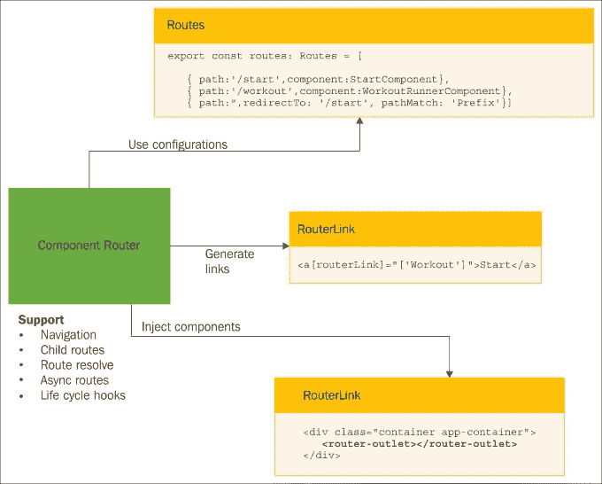
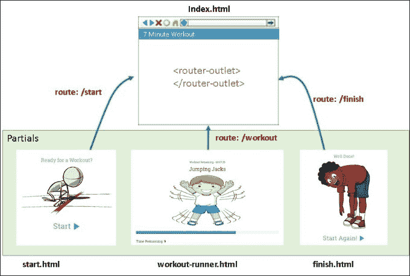
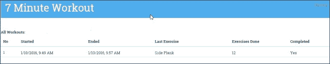
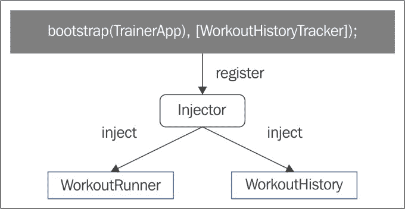
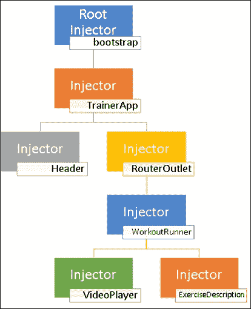
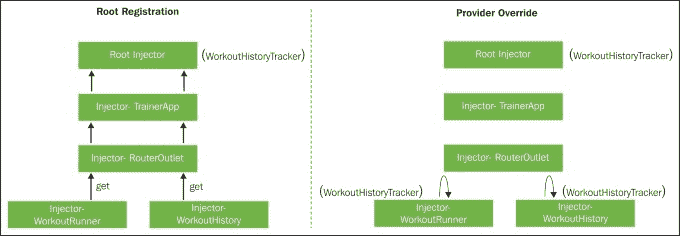

# 第三章：更多 Angular 2-SPA，路由和深入的数据流

如果上一章是关于在 Angular 中构建我们的第一个有用的应用程序，那么这一章是关于为其添加大量的 Angular 功能。在学习曲线中，我们已经开始探索技术平台，现在我们可以使用 Angular 构建一些基本的应用程序。但这只是开始！在我们能够在一个相当大的应用程序中有效使用 Angular 之前，还有很多东西要学习。这一章让我们离实现这个目标更近了一步。

*7 分钟锻炼*应用程序仍然有一些不足之处/限制，我们可以在改善整体应用程序体验的同时解决这些问题。这一章就是关于添加这些增强和功能的。而且，像往常一样，这个应用程序构建过程为我们提供了足够的机会来增强我们对框架的理解，并学习关于它的新知识。

本章涵盖的主题包括：

+   探索 Angular 单页应用程序（SPA）：我们探索 Angular 的单页应用程序功能，包括路由导航、链接生成和路由事件。

+   理解依赖注入：这是核心平台功能之一。在本章中，我们将学习 Angular 如何有效利用依赖注入，在整个应用程序中注入组件和服务。

+   Angular 纯（无状态）和不纯（有状态）管道：我们将更详细地探索 Angular 的主要数据转换构造，管道，同时构建一些新的管道。

+   跨组件通信：由于 Angular 完全涉及组件及其交互，我们将看看如何在父子和同级组件设置中进行跨组件通信。我们将学习 Angular 模板变量和事件如何促进这种通信。

+   创建和使用事件：我们将学习组件如何公开自己的事件，以及如何从模板 HTML 和其他组件绑定到这些事件。

作为一个旁注，我希望你经常使用*7 分钟锻炼*并关注你的身体健康。如果没有，请休息七分钟并进行锻炼。我坚持！

希望锻炼很有趣！现在让我们回到一些严肃的事情。让我们开始探索 Angular 单页应用程序（SPA）的功能。

### 注意

我们从第二章中离开的地方开始，*构建我们的第一个应用程序-7 分钟锻炼*。git 分支`checkpoint2.4`可以作为本章的基础。

该代码也可在 GitHub 上获取（[`github.com/chandermani/angular2byexample`](https://github.com/chandermani/angular2byexample)），供所有人下载。检查点在 GitHub 上作为分支实现。

如果您不使用 git，请从 GitHub 位置[`bit.ly/ng2be-checkpoint2-4`](http://bit.ly/ng2be-checkpoint2-4)下载`checkpoint2.4`的快照（ZIP 文件）。首次设置快照时，请参考`trainer`文件夹中的`README.md`文件。

# 探索单页应用程序的能力

*7 分钟锻炼*从加载应用程序开始，但以最后一次锻炼永久停留在屏幕上结束。这不是一个非常优雅的解决方案。为什么我们不在应用程序中添加开始和结束页面呢？这使应用程序更专业，并且可以让我们理解 AngularJS 的单页面命名法。

## Angular SPA 基础设施

使用现代 Web 框架（如 Angular（Angular 1.x）和 Ember），我们现在习惯于不执行完整页面刷新的应用程序。但是，如果您是新手，值得一提的是这些单页应用程序（SPAs）是什么。

单页应用程序（SPAs）是基于浏览器的应用程序，不需要进行完整的页面刷新。在这种应用程序中，一旦加载了初始 HTML，任何未来的页面导航都是使用 AJAX 作为 HTML 片段检索并注入到已加载的视图中。谷歌邮件是 SPA 的一个很好的例子。SPAs 为用户提供了极佳的用户体验，因为用户可以获得类似桌面应用程序的感觉，而无需不断的后退和页面刷新，这通常与传统 Web 应用程序相关联。

与其前身一样，Angular 2 也为 SPA 实现提供了必要的构造。让我们了解它们并添加我们的应用程序页面。

### Angular 路由

Angular 使用其路由基础设施支持 SPA 开发。该基础设施跟踪浏览器 URL，启用超链接生成，公开路由事件，并提供一组用于视图的指令/组件。

有四个主要的框架部分共同支持 Angular 路由基础设施：

+   **路由器（Router）**：实际提供组件导航的主要基础设施

+   **路由配置（Route）**：组件路由器依赖于路由配置来设置路由

+   **RouterOutlet 组件**：`RouterOutlet`组件是路由特定视图加载的占位符容器（*主机*）

+   **RouterLink 指令**：这会生成可以嵌入到锚标签中用于导航的超链接

以下图表突出显示了这些组件在路由设置中所扮演的角色：



我强烈鼓励每个人在为*7 分钟锻炼*设置路由时不断回顾这个图表。

路由器是这个完整设置的核心部分；因此，对路由器的快速概述将会很有帮助。

### 角度路由器

如果你曾经使用过带有 SPA 支持的任何 JavaScript 框架，这就是它的工作原理。框架监视浏览器 URL，并根据加载的 URL 提供视图。有专门的框架组件来完成这项工作。在 Angular 世界中，这种跟踪是由*框架服务*，即路由器来完成的。

### 注意

在 Angular 中，任何提供一些通用功能的类、对象或函数都被称为**服务**。Angular 没有提供任何特殊的构造来声明服务，就像它为组件、指令和管道所做的那样。任何可以被组件/指令/管道消耗的东西都可以被称为服务。路由器就是这样的一个服务。还有许多其他作为框架一部分的服务。

如果你来自 Angular 1 领域，这是一个令人愉快的惊喜-没有服务、工厂、提供者、值或常量！

### 提示

在构建组件时，尽量将尽可能多的功能委托给服务。组件应该只充当帮助同步组件模型和视图状态的中介者

角度路由器的作用是：

+   在路由更改时在组件之间启用导航

+   在组件视图之间传递路由数据

+   使当前路由的状态对活动/加载的组件可用

+   提供允许组件代码导航的 API

+   跟踪导航历史，允许我们使用浏览器按钮在组件视图之间前进和后退

+   提供生命周期事件和守卫条件，允许我们根据一些外部因素影响导航

### 注意

路由器还支持一些高级路由概念，如父子路由。这使我们能够在组件树的多个级别定义路由。父组件可以定义路由，子组件可以进一步添加更多的子路由到父路由定义中。这是我们在第四章中详细介绍的内容，*构建个人教练*。

路由器不能单独工作。正如前面的图表所示，它依赖于其他框架部分来实现期望的结果。让我们添加一些应用页面，并与每个拼图的每个部分一起工作。

### 路由设置

为了使组件路由器工作，我们首先需要将其引用，因为路由器不是核心框架的一部分。

打开`package.json`并按照这里的提示向路由器添加一个包引用：

```ts
"@angular/platform-browser-dynamic": "2.0.0", 
**"@angular/router": "3.0.0",**

```

接下来，使用命令行安装包：

```ts
**npm install**

```

最后，在`systemjs.config.js`中引用该包。这样 SystemJS 就可以正确加载`router`模块了。将路由器包添加到`ngPackageNames`数组中以设置`packages`配置：

```ts
var ngPackageNames = [ 
... 
 **'router',** 
...];

```

如果不存在，还要在`index.html`的`head`部分中添加`base`引用（已高亮显示）：

```ts
 <link rel="stylesheet" href="static/css/app.css" /> 
 **<base href="/">**

```

路由器需要设置`base href`。`href`值指定用于 HTML 文档中所有相对 URL 的基本 URL，包括链接到 CSS、脚本、图像和任何其他资源。

路由器使用**pushstate**机制进行 URL 导航。这使我们能够使用诸如：

+   `localhost:9000/start`

+   `localhost:9000/workout`

+   `localhost:9000/finish`

这可能看起来不是什么大不了的事，但请记住，我们正在进行客户端导航，而不是我们习惯的全页重定向。正如**开发者指南**所述：

> *现代 HTML 5 浏览器支持`history.pushState`，这是一种在不触发服务器页面请求的情况下更改浏览器位置和历史记录的技术。路由器可以组合一个与需要页面加载的 URL 无法区分的“自然”URL。*

#### Pushstate API 和服务器端 URL 重写

路由器使用的 pushstate API 仅在我们点击视图中嵌入的链接（`<a>`标签）或使用路由器 API 时才起作用。路由器拦截任何导航事件，加载适当的组件视图，最后更新浏览器 URL。请求从不发送到服务器。

但是如果我们刷新浏览器会怎么样？

Angular 路由器无法拦截浏览器的刷新事件，因此会发生完整的页面刷新。在这种情况下，服务器需要响应仅存在于客户端的资源请求。典型的服务器响应是对于可能导致**404（未找到）**错误的任何任意请求发送应用主机文件（如`index.html`）。这就是我们所说的服务器**URL 重写**。

即使我们的服务器设置也进行了 URL 重写。查看`gulpfile.js`中的突出显示行：

```ts
 connect.server({ 
    ... 
 **fallback: 'index.html'** 
  }); 

```

`connect.server`的最后一个配置参数设置了应用服务器的`fallback` URL 为`index.html`。这意味着对任何不存在的 URL 的请求，如`/start`、`/workout`、`/finish`或其他任何 URL，都会加载首页。

### 提示

每个服务器平台都有不同的机制来支持 URL 重写。我们建议您查看您使用的服务器堆栈的文档，以启用 Angular 应用程序的 URL 重写。

一旦我们为*7 分钟锻炼*添加了一些页面，我们就可以看到服务器端的重写。一旦新页面就位，尝试刷新应用程序并查看浏览器的网络日志；服务器每次都发送`index.html`内容，无论请求的 URL 是什么。

### 提示

**回退路径和调试**

为所有不存在的 URL 设置一个回退路径可能会在调试应用程序时产生不利影响。一旦回退机制就位，对于脚本/HTML/CSS 加载失败，就不会出现 404 错误。这可能会对任何缺失的引用产生意外结果，因为服务器总是返回`index.html`文件。每当您向应用程序添加新文件时，请注意浏览器网络日志和浏览器控制台中返回的内容是否有异常。

作为前面路由器设置的一部分，我们已经学会了如何包含路由器脚本，如何设置服务器端重定向以支持 HTML5 推送状态以及设置`base href`的需要。

在我们继续之前，我们需要为我们的应用程序添加一些其他页面并配置路由。

## 添加开始和完成页面

这里的计划是为*7 分钟锻炼*创建三个页面：

+   **开始页面**：这将成为应用程序的登陆页面

+   **锻炼页面**：我们目前拥有的内容

+   **完成页面**：我们在锻炼完成后导航到这里

锻炼组件及其视图（`workout-runner.component.ts`和`workout-runner.html`）已经存在。因此，让我们创建`StartComponent`和`FinishComponent`以及它们的视图。

从 git 分支`checkpoint3.1`复制以下文件。这些文件位于`components`文件夹下的`start`和`finish`文件夹中（从 GitHub 位置下载的链接是[`bit.ly/ng2be-3-1-components`](http://bit.ly/ng2be-3-1-components)）：

+   `start.component.ts`，`start.html`和`start.module.ts`：这包括`StartComponent`的实现和视图模板。一个标准的 HTML 视图，和一个基本的组件，使用`routerLink`指令生成超链接。

+   `finish.component.ts`，`finish.html`和`finish.module.ts`：这包括`FinishComponent`的实现和视图模板。它遵循与`StartComponent`相同的模式。

`Start`和`Finish`组件都已经使用自己的模块进行了定义。我们将遵循的约定是每个顶级视图一个模块。

三个组件都已准备就绪。是时候定义路由配置了！

### 路由配置

为了设置*7 分钟锻炼*的路由，我们将创建一个路由定义文件。在`components/app`文件夹中创建一个名为`app.routes.ts`的文件，定义应用程序的顶级路由。添加以下路由设置：

```ts
import { ModuleWithProviders } from '@angular/core'; 
import { Routes, RouterModule } from '@angular/router'; 
import {WorkoutRunnerComponent} from '../workout-runner/workout-runner.component'; 
import {StartComponent} from '../start/start.component'; 
import {FinishComponent} from '../finish/finish.component'; 

export const routes: Routes= [ 
  { path: 'start', component: StartComponent }, 
  { path: 'workout', component: WorkoutRunnerComponent }, 
  { path: 'finish', component: FinishComponent }, 
  { path: '**', redirectTo:'/start'} 
]; 
export const routing: ModuleWithProviders = RouterModule.forRoot(routes); 

```

`routes`变量是`Route`对象的数组。每个`Route`定义了单个路由的配置，其中包含：

+   `path`：要匹配的目标路径

+   `component`：当路径被命中时要加载的组件

这样的路由定义可以解释为：“当用户导航到一个路径（在`path`中定义），加载`component`属性中定义的相应组件。”以第一个路由示例为例；导航到`http://localhost:9000/start`会加载`StartComponent`的组件视图。

您可能已经注意到最后一个`Route`定义看起来有点不同。`path`看起来很奇怪，而且也没有`component`属性。带有`**`的路径表示一个捕获所有路径或我们应用程序的*通配符路由*。任何不匹配前三个路由之一的导航都会匹配捕获所有路由，导致应用程序导航到起始页面（在`redirectTo`属性中定义）。

### 注意

一旦路由设置完成，我们可以尝试这个。输入任意随机路由，如`http://localhost:9000/abcd`，应用程序会自动重定向到`http://localhost:9000/start`。

最后调用`RouterModule.forRoot`用于将此路由设置导出为模块。我们在 AppModule 中使用这个设置（导出为`routing`）来完成路由设置。打开`app.module.ts`并导入路由设置以及我们根据`Start`和`Finish`页面创建的模块：

```ts
import {StartModule} from '../start/start.module'; 
import {FinishModule} from '../finish/finish.module'; 
import {routing} from './app.routes'; 
@NgModule({ 
  imports: [..., StartModule, FinishModule, routing], 

```

现在我们已经拥有了所有所需的组件和所有定义的路由，我们在路由更改时在哪里注入这些组件呢？我们只需要在宿主视图中为其定义一个占位符。

### 使用 router-outlet 渲染组件视图

如果我们检查当前的`TrainerAppComponent`模板，它有一个嵌入的`WorkoutRunnerComponent`：

```ts
<workout-runner></workout-runner>

```

这需要改变。删除前面的声明并替换为：

```ts
<router-outlet></router-outlet>

```

`RouterOutlet`是一个 Angular 组件指令，作为一个占位符，在路由更改时加载子组件。它与路由器集成，根据当前浏览器 URL 和路由定义加载适当的组件。

以下图表帮助我们轻松地可视化了`router-outlet`的设置发生了什么：



我们现在几乎完成了；是时候触发导航了。

### 路由导航

像标准浏览器导航一样，Angular 导航可以发生：

+   当用户直接在浏览器中输入 URL 时

+   单击锚标签上的链接

+   使用脚本/代码进行导航

如果尚未启动，请启动应用程序并加载`http://localhost:9000`或`http://localhost:9000/start`。应该加载开始页面。

单击页面上的**开始**按钮，训练视图应该加载到`http://localhost:9000/workout`。

### 注意

Angular 路由器还支持旧式的基于*哈希（#）*的路由。启用基于哈希的路由时，路由如下所示：

+   `localhost:9000/#/start`

+   `localhost:9000/#/workout`

+   `localhost:9000/#/finish`

默认的路由选项是基于*pushState*的。要将其更改为基于哈希的路由，顶级路由的路由配置在路由设置期间更改，如本例所示：`export const routing: ModuleWithProviders` `= RouterModule.forRoot(routes,` `**{ useHash: true }**` `);`

有趣的是，`StartComponent`视图定义中的锚链接没有`href`属性。相反，有一个`RouterLink`指令：

```ts
<a [routerLink]="['/workout']">

```

这看起来像是属性绑定语法，`RouterLink` 指令接受一个数组类型的输入参数。这是一个路由链接参数数组（或链接参数数组）。

`routerLink` 指令与路由器一起使用这个链接参数数组来解析正确的 URL 路径。在前面的情况下，数组中唯一的元素是路由的名称。

### 注意

注意在前面的路由路径中的 **/** 前缀。`/` 用于指定绝对路径。Angular 路由器还支持相对路径，这在处理子路由时非常有用。我们将在接下来的几章中探讨子路由的概念。

刷新应用并检查 `StartComponent` 的渲染 HTML；前面的锚标签被渲染为：

```ts
<a href="/workout">

```

### 提示

避免硬编码路由链接

虽然你可以直接使用 `<a href="/workout">`，但最好使用 `routerLink` 来避免硬编码路由。

#### 链接参数数组

传递给 `routerLink` 指令的链接参数数组遵循特定的模式：

```ts
['routePath', param1, param2, {prop1:val1, prop2:val2} ....] 

```

第一个元素始终是路由路径，下一组参数用于替换路由模板中定义的占位符标记。

当前 *7 分钟锻炼* 的路由设置非常简单，不需要在链接生成中传递参数。但是对于需要动态参数的非平凡路由，可以使用这个功能。看看这个例子：

```ts
@RouteConfig([ 
 **{ path: '/users/:id', component: UserDetail },** 
  { path: '/users', component: UserList}, 
])

```

这是如何生成第一个路由的：

```ts
<a [routerLink]="['/users', 2]  // generates /users/2

```

### 注意

Angular 路由器非常强大，支持几乎我们对现代路由库的所有期望。它支持子路由、异步路由、生命周期钩子和其他一些高级场景。我们将延迟讨论这些主题，直到后面的章节。本章只是让我们开始使用 Angular 路由，但还有更多内容要学习！

路由链接参数也可以是一个对象。这样的对象用于向路由提供*可选参数*。看看这个例子：

```ts
<a [routerLink]="['/users', {id:2}]  // generates /users;id=2

```

注意生成的链接包含一个分号，用于将参数与路由和其他参数分开。

在实现中最后缺失的部分是在锻炼完成后路由到完成页面。

### 使用路由服务进行组件导航

从锻炼页面导航到完成页面不是手动触发的，而是在完成锻炼时触发。`WorkoutRunnerComponent` 需要触发这个转换。

为此，`WorkoutRunnerComponent` 需要获取组件路由并在其上调用 `navigate` 方法。

`WorkoutRunnerComponent`如何获得路由器实例？使用 Angular 的*依赖注入框架*。我们已经有一段时间没有涉及这个话题了。我们甚至不知道在这段时间里依赖注入框架一直在发挥作用。

让我们再等一会儿，首先集中精力解决导航问题。

为了让`WorkoutRunnerComponent`获得路由器服务实例，它只需要在构造函数中声明该服务。更新`WorkoutRunnerComponent`构造函数并添加导入：

```ts
import {Router} from '@angular/router'; 
constructor(private router: Router) {

```

当`WorkoutRunnerComponent`被实例化时，Angular 会神奇地将当前路由器注入到`router`私有变量中。它使用的魔法是*依赖注入框架*。

现在只需要用调用`navigation`路由替换语句`console.log("Workout complete!");`：

```ts
this.router.navigate( ['/finish'] );

```

`navigate`方法接受与`RouterLink`指令相同的链接参数数组。我们可以通过耐心等待锻炼完成来验证实现！

### 注意

如果您在运行代码时遇到问题，请查看 git 分支`checkpoint3.1`，了解我们迄今为止所做的工作的可工作版本。

或者如果您不使用 git，请从[`bit.ly/ng2be-checkpoint3-1`](http://bit.ly/ng2be-checkpoint3-1)下载`checkpoint3.1`的快照（ZIP 文件）。在首次设置快照时，请参考`trainer`文件夹中的`README.md`文件。

如果您仍然想知道如何访问当前路由的路由参数，我们有`ActivatedRoute`服务。

### 使用`ActivatedRoute`服务访问路由参数

有时，当前视图需要访问活动路由状态。在组件实现过程中，诸如当前 URL 片段、当前路由参数和其他与路由相关的数据可能会派上用场。

`ActivatedRoute`服务是所有当前路由相关查询的一站式商店。它有许多属性，包括`url`和`params`，可以利用路由的当前状态。

让我们来看一个带参数的路由的例子，以及如何从组件中访问传递的参数。给定这个路由：

```ts
{ path: '/users/:id', component: UserDetail },

```

当用户导航到`/user/5`时，底层组件可以通过首先将`ActivatedRoute`注入到其构造函数中来访问`:id`参数值：

```ts
export class UsersComponent { 
  constructor( private route: ActivatedRoute ... 

```

然后从`ActivatedRoute`服务的`params`属性中查询`id`属性。看看这个例子：

```ts
this.route.params.forEach((params: Params) => { 
     let id = +params['id']; // (+) converts string 'id' to a number 
     var currentUser=this.getUser(id) 
});  

```

`ActivatedObject`上的`params`属性实际上是一个*observable*。我们将在本章后面学习更多关于 observables 的知识，但现在足够理解 observables 是可以触发事件并且可以被订阅的对象。

我们使用`route.params` observable 上的`forEach`函数来获取路由的参数。回调对象（`params:Params`）包含与每个路由参数对应的属性。看看我们如何检索`id`属性并使用它。

我们现在已经介绍了基本的 Angular 路由基础设施，但在后面的章节中还有更多内容可以探索。现在是时候集中精力讨论一个长期以来的话题：*依赖注入*。

# Angular 依赖注入

Angular 大量使用依赖注入来管理应用程序和框架的依赖关系。令人惊讶的是，我们可以忽略这个话题，直到我们开始讨论路由器，而不会影响我们对事物如何工作的理解。在此期间，Angular 依赖注入框架一直在支持我们的实现。一个好的依赖注入框架的特点是，消费者可以在不关心内部细节的情况下使用它，并且只需很少的仪式感。

如果你不确定什么是依赖注入，或者只是对它有一个模糊的概念，那么对 DI 的介绍肯定不会伤害任何人。

## 依赖注入 101

对于任何应用程序，其组件（不要与 Angular 组件混淆）并不是孤立工作的。它们之间存在依赖关系。一个组件可能使用其他组件来实现其所需的功能。**依赖注入**是一种管理这种依赖关系的模式。

DI 模式在许多编程语言中很受欢迎，因为它允许我们以松散耦合的方式管理依赖关系。有了这样一个框架，依赖对象由 DI 容器管理。这使得依赖关系可互换，并且整体代码更加解耦和可测试。

DI 背后的理念是一个对象不会创建\管理自己的依赖关系。相反，依赖关系是从外部提供的。这些依赖关系可以通过构造函数提供，这被称为**构造函数注入**（Angular 也这样做），或者直接设置对象属性，这被称为**属性注入**。

这里是一个依赖注入实例的基本示例。考虑一个名为`Tracker`的类，它需要一个`Logger`来进行日志记录操作：

```ts
class Tracker() { 
  logger:Logger; 
  constructor() { 
    this.logger = new Logger();    
  } 
}

```

类`Logger`的依赖关系在`Tracker`内部是硬编码的。如果我们将这种依赖关系外部化呢？所以类变成了：

```ts
class Tracker { 
  logger:Logger; 
  constructor(logger:Logger) { 
    this.logger = logger;    
  } 
}

```

这看似无害的改变产生了重大影响。通过添加提供外部依赖的能力，我们现在可以：

+   解耦组件并实现可扩展性。DI 模式允许我们在不触及类本身的情况下改变`Tracker`类的日志行为。这里有一个例子：

```ts
        var trackerWithDBLog=new Tracker(new DBLogger()); 
        var trackerWithMemoryLog=new Tracker(new MemoryLogger()); 

```

我们刚刚看到的两个`Tracker`对象对于相同的`Tracker`类实现具有不同的日志功能。`trackerWithDBLog`记录到数据库，`trackerWithMemoryLog`记录到内存（假设`DBLogger`和`MemoryLogger`都是从`Logger`类派生的）。由于 Tracker 不依赖于`Logger`的特定实现（`DBLogger`或`MemoryLogger`），这意味着`Logger`和`Tracker`是松耦合的。将来，我们可以派生一个新的`Logger`类实现，并在不改变`Tracker`实现的情况下用它来记录。

+   模拟依赖关系：模拟依赖关系的能力使我们的组件更易于测试。通过为 Logger 提供一个模拟实现，如 MockLogger，或者使用一个可以轻松模拟`Logger`接口的模拟框架，可以单独测试跟踪器实现（单元测试）。

现在我们可以理解 DI 是多么强大。一旦 DI 就位，解决依赖关系的责任就落在了调用/消费者代码身上。在前面的例子中，之前实例化`Tracker`的类现在需要创建一个`Logger`的派生类并在使用之前将其注入到`Tracker`中。

显然，这种在组件中交换内部依赖的灵活性是有代价的。调用代码的实现可能变得过于复杂，因为现在它必须管理子依赖关系。这一开始可能看起来很简单，但考虑到依赖组件本身可能有依赖关系，我们正在处理的是一个复杂的依赖树结构。

为了减少调用代码的依赖管理工作，需要使用 DI 容器/框架。这些容器负责构建/管理依赖关系并将其提供给我们的客户/消费者代码。

Angular DI 框架管理我们的 Angular 组件、指令、管道和服务的依赖关系。

## 在 Angular 中探索依赖注入

Angular 采用自己的 DI 框架来管理应用程序中的依赖关系。可见的依赖注入的第一个示例是将组件路由器注入到`WorkoutRunnerComponent`中：

```ts
constructor(private router: Router) { 

```

当`WorkoutRunnerComponent`类被实例化时，DI 框架在内部定位/创建正确的路由器实例，并将其注入到调用者（在我们的例子中是`WorkoutRunnerComponent`）中。

虽然 Angular 在隐藏 DI 基础设施方面做得很好，但我们必须了解 Angular DI 的工作原理。否则，一切可能看起来相当神奇。

DI 是关于创建和管理依赖项的，负责这一点的框架组件被称为**注入器**。为了注入器能够管理依赖项，它需要理解以下内容：

+   **什么是依赖项：** 依赖项是什么？依赖项可以是一个类、一个对象、一个工厂函数或一个值。每个依赖项在注入之前都需要在 DI 框架中注册。

+   **何时何地：** DI 框架需要知道在哪里注入依赖项以及何时注入。

+   **如何：** DI 框架还需要知道在请求时创建依赖项的方法。

无论是框架构造还是我们创建的工件，任何注入的依赖项都需要回答这些问题。

例如，在`WorkoutRunnerComponent`中进行的`Router`实例注入。为了回答“什么”和“如何”部分，我们通过模块装饰器上的导入语句在应用模块（`app.module.ts`）中注册`Router`服务：

```ts
imports: [..., routing];

```

`routing`变量是一个模块，它导出了多个路由以及所有与 Angular 路由相关的服务（技术上它重新导出了`RouterModule`）。我们通过以下语句从`app.routes.ts`中导出这个变量：

```ts
export const routing: ModuleWithProviders = RouterModule.forRoot(routes);

```

“何时”和“何地”是根据需要依赖项的组件来决定的。`WorkoutRunnerComponent`的构造函数需要一个`Router`的依赖项。这通知注入器在路由导航的过程中创建`WorkoutRunnerComponent`时注入当前的`Router`实例。

### 注意

在内部，注入器根据从 TypeScript 转换为 ES5 代码时反映出的元数据来确定类的依赖关系（由 TypeScript 编译器完成）。只有在类上添加了`@Component`或`@RouteConfig`等装饰器时才会生成元数据。

如果我们将`Router`注入到另一个类中会发生什么？答案是是。Angular 注入器会创建和缓存依赖项以供将来重用，因此这些服务在本质上是单例的。

### 注意

虽然注入器中的依赖项是单例的，但在任何给定时间，整个 Angular 应用程序中可能有多个活动的注入器。你很快就会了解注入器层次结构。

使用路由器，还有另一层复杂性。由于 Angular 支持*子路由*概念，每个路由都有自己的路由器实例。等到下一章涵盖子路由时，你就能理解其中的复杂性！

让我们创建一个 Angular 服务来跟踪训练历史。这个过程将帮助你理解如何使用 Angular DI 连接依赖项。

# 跟踪训练历史

如果我们能够跟踪训练历史，这将是我们应用的一个很好的补充。我们上次锻炼是什么时候？我们完成了吗？我们花了多少时间？

跟踪训练历史需要我们跟踪训练进度。我们需要以某种方式跟踪训练何时开始和何时结束。然后需要将这些跟踪数据持久化存储在某个地方。

实现这种历史跟踪的一种方法是通过扩展我们的`WorkoutRunnerComponent`来实现所需的功能。但这会给`WorkoutRunnerComponent`增加不必要的复杂性，这不是它的主要工作。我们需要一个专门的历史跟踪服务来完成这项工作，一个可以跟踪历史数据并在整个应用程序中共享的服务。让我们开始构建`WorkoutHistoryTracker`服务。

## 构建 WorkoutHistoryTracker 服务

通过`WorkoutHistoryTracker`服务，我们计划跟踪训练的执行。该服务还公开了一个接口，允许`WorkoutRunnerComponent`启动和停止训练跟踪。

如果没有，请在`src`文件夹内创建一个名为`services`的文件夹，并添加一个名为`workout-history-tracker.ts`的文件，其中包含以下代码：

```ts
import {ExercisePlan} from '../components/workout-runner/model'; 
export class WorkoutHistoryTracker { 
  private maxHistoryItems: number = 20;   //Tracking last 20 exercises 
  private currentWorkoutLog: WorkoutLogEntry = null; 
  private workoutHistory: Array<WorkoutLogEntry> = []; 
  private  workoutTracked: boolean; 

  constructor() { } 

  get tracking(): boolean { 
    return this. workoutTracked; 
  } 
}

export class WorkoutLogEntry { 
  constructor( 
    public startedOn: Date, 
    public completed: boolean = false, 
    public exercisesDone: number = 0, 
    public lastExercise?: string, 
    public endedOn?: Date) { } 
}

```

定义了两个类：`WorkoutHistoryTracker`和`WorkoutLogEntry`。顾名思义，`WorkoutLogEntry`定义了一个训练执行的日志数据。`maxHistoryItems`允许我们配置要存储在`workoutHistory`数组中的最大项目数，该数组包含历史数据。`get tracking()`方法在 TypeScript 中定义了`workoutTracked`的 getter 属性。在训练执行期间，`workoutTracked`被设置为`true`。

让我们添加开始跟踪、停止跟踪和完成练习的功能：

```ts
startTracking() { 
  this.workoutTracked = true; 
  this.currentWorkoutLog = new WorkoutLogEntry(new Date()); 
  if (this.workoutHistory.length >= this.maxHistoryItems) { 
    this.workoutHistory.shift(); 
  } 
    this.workoutHistory.push(this.currentWorkoutLog); 
} 

exerciseComplete(exercise: ExercisePlan) { 
  this.currentWorkoutLog.lastExercise = exercise.exercise.title; 
  ++this.currentWorkoutLog.exercisesDone; 
} 

endTracking(completed: boolean) { 
  this.currentWorkoutLog.completed = completed; 
  this.currentWorkoutLog.endedOn = new Date(); 
  this.currentWorkoutLog = null; 
  this.workoutTracked = false; 
};

```

`startTracking`函数创建一个`WorkoutLogEntry`并将其添加到`workoutHistory`数组中。通过将`currentWorkoutLog`设置为新创建的日志条目，我们可以在以后的训练执行过程中对其进行操作。`endTracking`函数和`exerciseComplete`函数只是改变`currentWorkoutLog`。`exerciseComplete`函数应该在完成训练中的每个练习时调用。

最后，添加一个返回完整历史数据的函数：

```ts
getHistory(): Array<WorkoutLogEntry> { 
  return this.workoutHistory; 
}

```

这完成了`WorkoutHistoryTracker`的实现；现在是将其整合到训练执行中的时候了。

## 与`WorkoutRunnerComponent`整合

`WorkoutRunnerComponent`需要`WorkoutHistoryTracker`来跟踪训练历史记录；因此需要满足一个依赖关系。

为了使`WorkoutHistoryTracker`可发现，它需要在框架中注册。在这一点上，我们有很多选择。有很多种方法可以注册依赖项，也有很多地方可以注册！这种灵活性使得 DI 框架非常强大，尽管它也增加了混乱。

让我们首先尝试理解使用`WorkoutHistoryTracker`作为示例来注册依赖项的不同机制。

### 注册依赖项

注册依赖项的最简单方法是在根/全局级别注册它。这可以通过将依赖类型传递到模块装饰器中的`provides`属性（数组）来实现。

如本例所示，将`WorkoutHistoryTracker`添加到任何模块的`providers`数组中会全局注册该服务：

```ts
@NgModule({...**providers: [WorkoutHistoryTracker],**})

```

从技术上讲，当一个服务被添加到`providers`数组中时，它会被注册到**应用程序的根注入器**中，而不管它在哪个 Angular 模块中声明。因此，以后任何模块中的任何 Angular 构件都可以使用该服务（`WorkoutHistoryTracker`）。根本不需要任何模块导入。

### 注意

这种行为与组件/指令/管道的注册不同。这些构件必须从一个模块中导出，以便另一个模块使用它们。

当 Angular 注入器请求它们时，提供者会创建依赖项。这些提供者有创建这些依赖项的配方。虽然类似乎是可以注册的明显依赖项，但我们也可以注册：

+   一个特定的对象/值

+   一个工厂函数

直接使用类类型来注册依赖关系（如在`bootstrap`函数中所示）可能大多数情况下可以满足我们的需求，但有时我们需要在依赖注册中具有一些灵活性。提供者注册语法的扩展版本为我们提供了这种灵活性。

要了解这些变化，我们需要更详细地探讨提供者和依赖注册。

#### Angular 提供者

提供者创建由 DI 框架提供的依赖关系。

查看上一节中`WorkoutHistoryTracker`的依赖关系注册：

```ts
providers: [WorkoutHistoryTracker],

```

这种语法是以下版本的简写形式：

```ts
providers:({ provide: WorkoutHistoryTracker, useClass: WorkoutHistoryTracker })

```

第一个属性（`provide`）是一个令牌，充当注册依赖关系的键。这个键还允许我们在依赖注入期间定位依赖关系。

第二个属性（`useClass`）是一个提供者定义对象，定义了创建依赖值的方法。框架提供了许多创建这些依赖关系的方法，我们很快就会看到。

使用`useClass`，我们正在注册类`provider`。类`provider`通过实例化所请求的对象类型来创建依赖关系。

#### 值提供者

类`provider`创建类对象并满足依赖，但有时我们希望注册一个特定的对象/原始对象到 DI 提供者中。值提供者解决了这种用例。

以使用此技术注册的`WorkoutHistoryTracker`为例：

```ts
{provide: WorkoutHistoryTracker, useValue: new WorkoutHistoryTracker()};

```

注册的是我们创建的`WorkoutHistoryTracker`对象的实例，而不是让 Angular DI 创建一个。如果下游也需要手工创建的依赖关系，那么考虑这样手工创建的依赖关系（手动创建的依赖关系）。再次以`WorkoutHistoryTracker`为例。如果`WorkoutHistoryTracker`有一些依赖关系，那么这些依赖关系也需要通过手动注入来满足：

```ts
{provide: WorkoutHistoryTracker, useValue: new WorkoutHistoryTracker(new LocalStorage())});

```

值提供者在特定情况下非常有用。例如，我们可以使用值提供者注册一个常见的应用程序配置：

```ts
{provide: AppConfig, {useValue: {name:'Test App', gridSetting: {...} ...}}

```

或者在单元测试时注册一个模拟依赖：

```ts
{provide:WorkoutHistoryTracker, {useValue: new MockWorkoutHistoryTracker()}

```

#### 工厂提供者

有时候注入并不是一件简单的事情。注入取决于外部因素。这些因素决定了创建和返回的对象或类实例。工厂提供者完成了这项繁重的工作。

举个例子，我们想要为开发和生产版本设置不同的配置。我们可以很好地使用工厂实现来选择正确的配置：

```ts
{provide: AppConfig, useFactory: () => { 
  if(PRODUCTION) { 
    return {name:'My App', gridSetting: {...} ...} 
  } 
  else { 
    return {name:'Test App', gridSetting: {...} ...} 
  }
}

```

工厂函数也可以有自己的依赖项。在这种情况下，语法会有一些变化：

```ts
{provide: WorkoutHistoryTracker, useFactory: (environment:Environment) => { 
  if(Environment.isTest) { 
    return new MockWorkoutHistoryTracker(); 
  } 
  else { 
    return new WorkoutHistoryTracker(); 
  }, 
    deps:[Environment]
}

```

依赖项作为参数传递给工厂函数，并在提供者定义对象属性`deps`上注册。

如果依赖项的构建复杂，并且在连接期间无法决定所有内容，可以使用`UseFactory`提供。

虽然我们有许多选项来声明依赖项，但消耗依赖项要简单得多。

### 注意

在继续之前，让我们在一个新的服务模块中注册`WorkoutHistoryTracker`服务。这个新模块（`ServicesModule`）将用于注册所有应用程序范围的服务。

将模块定义从 git 分支`checkpoint3.2`复制到本地的`src/services`文件夹中。您可以从此 GitHub 位置下载它：[`bit.ly/ng2be-3-2-services-module-ts`](http://bit.ly/ng2be-3-2-services-module-ts)。还要删除所有对`LocalStorage`服务的引用，因为我们计划在本章稍后添加它。最后，将该模块导入`AppModule`（`app.module.ts`）。

### 注入依赖项

消耗依赖项很容易！往往我们使用构造函数注入来消耗依赖项。

#### 构造函数注入

在顶部添加`import`语句，并更新`WorkoutRunnerComponent`的构造函数，如下所示：

```ts
import {WorkoutHistoryTracker} from  
'../../services/workout-history-tracker'; 
... 
constructor(private router: Router,   
**) {**

```

与路由器一样，当创建`WorkoutRunnerComponent`时，Angular 也会注入`WorkoutHistoryTracker`。简单！

在我们继续整合之前，让我们探索一下关于 Angular 的 DI 框架的其他事实。

#### 使用注入器进行显式注入

我们甚至可以使用 Angular 的`Injector`服务进行显式注入。这是 Angular 用来支持 DI 的相同注入器。以下是如何使用`Injector`注入`WorkoutHistoryTracker`服务：

```ts
constructor(private router: Router, private injector:Injector) {
  this.tracker=injector.get(WorkoutHistoryTracker);
```

我们首先注入`Injector`，然后显式要求`Injector`获取`WorkoutHistoryTracker`实例。

什么时候有人想要这样做呢？嗯，几乎从不。避免这种模式，因为它会将 DI 容器暴露给您的实现，并且还会增加一些噪音。

消耗依赖项很容易，但 DI 框架如何定位这些依赖项呢？

### 依赖项标记

还记得之前显示的依赖项注册的扩展版本吗？

```ts
{ provide: WorkoutHistoryTracker, useClass: WorkoutHistoryTracker }

```

`provide`属性值是一个标记。此标记用于标识要注入的依赖项。每当 Angular 看到这个语句时：

```ts
constructor(tracker: WorkoutHistoryTracker)

```

它根据类类型注入正确的依赖项。这是一个类令牌的示例。类类型用于依赖项搜索/映射。Angular 还支持一些其他令牌。

#### 字符串令牌

我们可以使用字符串文字而不是类来标识依赖项。我们可以使用字符串令牌注册`WorkoutHistoryTracker`依赖项，如下所示：

```ts
{provide:"MyHistoryTracker", useClass: WorkoutHistoryTracker })

```

如果我们现在这样做：

```ts
constructor(private tracker: WorkoutHistoryTracker)

```

Angular 一点也不喜欢它，并且无法注入依赖项。由于之前看到的`WorkoutHistoryTracker`是使用字符串令牌注册的，因此在注入时也需要提供令牌。

要注入使用字符串令牌注册的依赖项，我们需要使用`@Inject`装饰器。这样做非常完美：

```ts
constructor(@Inject("MyHistoryTracker")  
  private tracker: WorkoutHistoryTracker) 

```

### 提示

当不存在`@Inject()`时，注入器使用参数的类型名称（类令牌）。

在注册实例或对象时，字符串令牌非常有用。如果没有`AppConfig`这样的类，我们之前分享的应用程序配置注册示例可以使用字符串令牌进行重写：

```ts
{ provide: "AppConfiguration", useValue: {name:'Test App', gridSetting: {...} ...});

```

然后使用`@Inject`注入：

```ts
constructor(@Inject("AppConfiguration") config:any)

```

### 注意

虽然任何对象都可以充当令牌，但最常见的令牌类型是类和字符串令牌。在内部，提供程序将令牌参数转换为`OpaqueToken`类的实例。查看框架文档以了解有关`OpaqueToken`的更多信息：

[`angular.io/docs/ts/latest/api/core/index/OpaqueToken-class.html`](https://angular.io/docs/ts/latest/api/core/index/OpaqueToken-class.html)。

虽然`WorkoutHistoryTracker`注入到`WorkoutRunnerComponent`中已完成，但其集成仍然不完整。

## 与`WorkoutRunnerComponent`集成-继续

历史跟踪器实例（`tracker`）需要在锻炼开始时、锻炼完成时和锻炼结束时调用。

将此添加为`start`函数中的第一条语句：

```ts
this.tracker.startTracking();

```

在`startExerciseTimeTracking`函数中，在`clearInterval`调用后添加突出显示的代码：

```ts
clearInterval(this.exerciseTrackingInterval); 
**if (this.currentExercise !== this.restExercise) {** 
**this.tracker.exerciseComplete(this.workoutPlan**
**.exercises[this.currentExerciseIndex]);**
**}**

```

然后在锻炼中使用突出显示的代码来完成相同函数中的`else`条件：

```ts
**this.tracker.endTracking(true);** 
this.router.navigate(['/finish']); 

```

历史跟踪几乎完成，除了一个情况。如果用户手动从锻炼页面导航离开呢？

当发生这种情况时，我们总是可以依赖组件的生命周期钩子/事件来帮助我们。当触发`NgOnDestroy`事件时，可以停止锻炼跟踪。在组件从组件树中移除之前，执行任何清理工作的合适位置。让我们来做吧。

将此函数添加到`workout-runner.component.ts`中：

```ts
ngOnDestroy() { 
  this.tracker.endTracking(false); 
} 

```

虽然我们现在已经实现了锻炼历史跟踪，但我们没有检查历史的机制。迫切需要一个锻炼历史页面/组件。

## 添加锻炼历史页面

我们在锻炼执行过程中收集的锻炼历史数据现在可以在视图中呈现出来。让我们添加一个历史组件。该组件将位于`/history`位置，并且可以通过单击应用程序标题部分的链接来加载。

更新`app.routes.ts`中的路由定义以包括新路由和相关导入：

```ts
**import {WorkoutHistoryComponent}** 
**from '../workout-history/workout-history.component';** 
... 
export const routes: Routes = [ 
  ..., 
 **{ path: 'history', component: WorkoutHistoryComponent }** 
  { path: '**', redirectTo: '/start' } 
]) 

```

**历史**链接需要添加到应用程序标题部分。让我们将标题部分重构为自己的组件。更新`app.component.ts`模板`navbar` `div`为：

```ts
<div class="navbar navbar-default navbar-fixed-top top-navbar"> 
<div class="container app-container"> 
**<header></header>** 
</div> 
</div> 

```

这里有一个新的`HeaderComponent`。从 git 分支`checkpoint3.2`的`app`文件夹中复制标题组件（`header.component.ts`）的定义（GitHub 位置：[`bit.ly/ng2be-3-2-header-component-ts`](http://bit.ly/ng2be-3-2-header-component-ts)）。还将该组件添加到`app.module.ts`的声明数组中，就像对任何 Angular 组件一样：

```ts
import {HeaderComponent} from './header.component'; 
... 
declarations: [TrainerAppComponent, HeaderComponent], 

```

如果查看`HeaderComponent`，现在已经有了历史链接。让我们添加锻炼历史组件。

`WorkoutHistoryComponent`的实现可在 git 分支`checkpoint3.2`中找到；文件夹是`workout-history`（GitHub 位置：[`bit.ly/ng2be-3-2-workout-history`](http://bit.ly/ng2be-3-2-workout-history)）。将文件夹中的所有三个文件复制到本地相应的文件夹中。记得在本地设置中保持相同的文件夹层次结构。请注意，`WorkoutHistoryComponent`已在一个单独的模块（`WorkoutHistoryModule`）中定义，并且需要导入到`AppModule`（`app.module.ts`）中。在继续之前，将`WorkoutHistoryModule`导入到`AppModule`中。现在从`WorkoutHistoryModule`中删除对`SharedModule`的所有引用。

`WorkoutHistoryComponent`的视图代码可以说是微不足道的：一些 Angular 构造，包括`ngFor`和`ngIf`。组件实现也非常简单。在`WorkoutHistoryComponent`初始化时注入`WorkoutHistoryTracker`服务依赖项并设置历史数据：

```ts
ngOnInit() { 
  this.history = this.tracker.getHistory(); 
}

```

这一次，我们使用`Location`服务而不是`Router`来从历史组件中导航离开：

```ts
goBack() { 
  this.location.back(); 
}

```

位置服务用于与浏览器 URL 交互。根据 URL 策略，可以使用 URL 路径（例如`/start`，`/workout`）或 URL 哈希段（例如`#/start`，`#/workout`）来跟踪位置更改。路由器服务也在内部使用位置服务来触发导航。

### 提示

**路由器与位置**

虽然`Location`服务允许我们执行导航，但使用`Router`是执行路由导航的首选方式。我们在这里使用位置服务，因为需要导航到最后一个路由，而不必担心如何构建路由。

我们准备测试我们的锻炼历史实现。加载起始页面，然后单击**历史**链接。历史页面加载时为空白。开始锻炼并让一个锻炼完成。再次检查历史页面；应该列出一个锻炼：



看起来不错，除了这个列表中的一个痛点。如果历史数据按时间顺序排序，并且最新的数据在顶部，那将更好。如果我们也有过滤功能，那将更好。

## 使用管道对历史数据进行排序和过滤

在第二章，“构建我们的第一个应用程序-7 分钟锻炼”，我们探索了管道。我们甚至建立了自己的管道来将秒值格式化为 hh:mm:ss。由于管道的主要目的是转换数据，这可以与任何输入一起使用。对于数组，管道可以用于对数据进行排序和过滤。我们创建了两个管道，一个用于排序，一个用于过滤。

### 注意

Angular1 具有预构建的过滤器（在 Angular2 中是管道），`orderBy`和`filter`，用于这个目的。目前，将这些过滤器移植到 Angular2 的工作已经停滞。请参阅此 GitHub 问题：[`bit.ly/ng2-issue-2340`](http://bit.ly/ng2-issue-2340)。

让我们从`orderBy`管道开始。

### orderBy 管道

我们实现的`orderBy`管道将根据对象的任何属性对对象数组进行排序。基于`fieldName`属性按升序排序项目的使用模式将是：

```ts
*ngFor="let item of items| orderBy:fieldName"

```

而对于按降序排序项目，使用模式是：

```ts
*ngFor="let item of items| orderBy:-fieldName"

```

注意在`fieldName`之前的额外连字符。

在`src/components`中创建一个名为`shared`的文件夹，并复制位于 git 分支`checkpoint3.2`（GitHub 位置：[`bit.ly/ng2be-3-2-shared`](http://bit.ly/ng2be-3-2-shared)）相应位置的所有三个文件。此文件夹中有两个管道和一个新的模块定义（`SharedModule`）。`SharedModule`定义了在整个应用程序中共享的组件/指令/管道。

打开`order-by.pipe.ts`并查看管道实现。虽然我们不会深入讨论管道的实现细节，但有些相关部分需要被强调。查看这个管道概述：

```ts
@Pipe({ name: 'orderBy' }) 
export class OrderByPipe {
  transform(value: Array<any>, field:string): any { 
   ... 
  } 
}

```

前面的`field`变量接收需要排序的字段。查看下面的代码以了解如何传递`field`参数。

如果字段有`-`前缀，我们在对数组进行降序排序之前截断前缀。

### 注意

该管道还使用了扩展运算符，这可能对您来说是新的。在 MDN 上了解有关扩展运算符的更多信息：[`bit.ly/js-spread`](http://bit.ly/js-spread)。

**要在锻炼历史视图中使用这个管道，将`SharedModule`导入`WorkoutHistoryModule`。**

更新模板 HTML：

```ts
<tr *ngFor="let historyItem of history|orderBy:'-startedOn'; let i = index"> 

```

历史数据现在将按`startedOn`降序排序。

### 注意

请注意管道参数周围的单引号（`'-startedOn'`）。我们将一个字面字符串传递给`orderBy`管道。相反，管道参数也可以绑定到组件属性。

这对于`orderBy`管道已经足够了。让我们实现过滤。

### 搜索管道

我们之前添加的`SearchPipe`只是进行基于相等性的基本过滤。没有什么特别的。

查看管道代码；管道接受两个参数，第一个是要搜索的字段，第二个是要搜索的值。我们使用数组的`filter`函数来过滤记录，进行严格的相等性检查。

让我们更新锻炼历史视图，并加入搜索管道。打开`workout-history.html`并取消注释带有单选按钮的 div。这些单选按钮根据是否完成来过滤锻炼。这是过滤选择 HTML 的样子：

```ts
<label><input type="radio" name="searchFilter" value=""  
(change)="completed = null" checked="">All </label> 
<label><input type="radio" name="searchFilter" value="true"  
(change)="completed = $event.target.value=='true'"> 
Completed </label> 
<label><input type="radio" name="searchFilter" value="false"  
(change)="completed = $event.target.value=='true'"> 
Incomplete </label> 

```

我们可以有三个过滤器：`all`、`completed`和`incomplete`的锻炼。单选按钮通过`change`事件表达式设置组件的属性`completed`。`$event.target`是被点击的单选按钮。我们不将`completed=$event.target.value`赋值，因为它的值是字符串类型。`completed`属性（在`WorkoutHistoryComponent`上）应该是`boolean`类型，以便与`WorkoutLogEntry.completed`属性进行相等比较。

`search`管道现在可以添加到`ngFor`指令表达式中。我们将链式使用`search`和`orderBy`管道。更新`ngFor`表达式为：

```ts
<tr *ngFor="let historyItem of history 
**|search:'completed':completed** 
|orderBy:'-startedOn';  
let i = index">

```

`search`管道首先过滤历史数据，然后`orderBy`管道重新排序。要特别注意`search`管道的参数：第一个参数是一个字符串字面量，表示要搜索的字段（`'completed'`），而第二个参数是从组件属性`completed`派生的。能够将管道参数绑定到组件属性允许我们有很大的灵活性。

继续验证历史页面的搜索功能。根据单选按钮的选择，历史记录被过滤，当然它们根据锻炼开始日期的逆序排列。

虽然使用管道与数组看起来很简单，但如果我们不理解管道何时被评估，可能会出现一些意外情况。

### 数组的管道陷阱

要理解应用于数组的管道的问题，请重现问题。

打开`search.pipe.ts`并删除`@Pipe`装饰器属性`pure`。还要更改以下语句：

```ts
if (searchTerm == null) return [...value];

```

到以下内容：

```ts
if (searchTerm == null) return [value];

```

在单选按钮列表的末尾（在`workout-history.html`中）添加一个按钮，将新的日志条目添加到`history`数组中：

```ts
<button (click)="addLog()">Add Log</button>

```

在`WorkoutHistoryComponent`中添加一个函数：

```ts
addLog() { 
  this.history.push(Object.assign({}, 
  this.history[this.history.length-1])); 
}

```

前面的函数复制了第一个历史项目，并将其添加回`history`数组。如果我们加载页面并点击按钮，新的日志条目将被添加到历史数组，但除非我们更改过滤器（点击其他单选按钮），否则它不会显示在视图中。有趣！

### 注意

在调用`addLog`之前，请确保至少已经有一个历史记录；否则`addLog`函数将失败。

到目前为止，我们构建的管道都是*无状态*（也称为纯粹）的。它们只是将输入数据转换为输出。无状态管道在管道输入发生变化（管道符号左侧的表达式）或任何管道参数更新时重新评估。

对于数组，这发生在数组赋值/引用更改时，而不是元素的添加或删除。切换过滤条件会起作用，因为它会导致搜索管道再次评估，因为搜索参数（`completed`状态）发生变化。这是需要注意的行为。

有什么解决方法？首先，我们可以使历史数组不可变，这意味着一旦创建就无法更改。要添加一个新元素，我们需要使用新值创建一个新数组，类似于：

```ts
this.history = [...this.history,  
Object.assign({}, this.history[0])];

```

工作得很完美，但我们正在改变我们的实现方式以使其与管道一起工作。相反，我们可以更改管道并将其标记为有状态。

无状态和有状态管道的区别在于，有状态管道在每次框架进行变更检测运行时都会被 Angular 评估，这涉及检查完整的应用程序是否有变化。因此，对于有状态管道，检查不仅限于管道输入/参数的变化。

要使`search`管道无状态，只需使用`pure:false`更新`Pipe`装饰器：

```ts
@Pipe({ 
  name: 'search', 
 **pure:false** 
}) 

```

它仍然不起作用！`search`管道还有一个需要修复的小问题。**“全部”**单选按钮选择不完美。添加一个新的训练日志，它仍然不会显示，除非我们切换过滤器。

这里的解决方法是恢复`search`管道中的这一行：

```ts
if (searchTerm == null) return value;

```

对于以下内容：

```ts
if (searchTerm == null) return [...value];

```

我们将`if`条件更改为每次返回一个新数组（使用扩展运算符），即使`searchTerm`为`null`。如果我们返回相同的数组引用，Angular 不会检查数组大小的变化，因此不会更新 UI。

这完成了我们的历史页面实现。您现在可能想知道管道的最后几个修复与变更检测的工作方式有什么关系。或者您可能想知道什么是变更检测？让我们消除所有这些疑虑，并向每个人介绍 Angular 的变更检测系统。

### 注意

Angular 的变更检测将在第八章中得到广泛覆盖，*一些实际场景*。下一节的目标是介绍变更检测的概念以及 Angular 如何执行此过程。

## Angular 变更检测概述

简而言之，变更检测就是跟踪应用程序执行期间对组件模型所做的更改。这有助于 Angular 的数据绑定基础设施确定需要更新哪些视图部分。每个数据绑定框架都需要解决这个问题，而这些框架用于跟踪更改的方法也不同。甚至从 Angular1 到 Angular2 也有所不同。

要理解 Angular 中的变更检测如何工作，有一些事情我们需要记住。

+   首先，Angular 应用程序只是一个从根到叶的组件层次结构。

+   其次，我们绑定到视图的组件属性没有任何特殊之处；因此，Angular 需要一种有效的机制来知道这些属性何时发生更改。它无法持续轮询这些属性的更改。

+   最后，为了检测属性值的变化，Angular 对先前值和当前值进行*严格比较*（`===`）。对于引用类型，这意味着只比较引用。不进行深层比较。

### 注意

正因为这个原因，我们不得不将我们的搜索管道标记为有状态。

向现有数组添加元素不会改变数组引用，因此 Angular 无法检测到数组的任何更改。一旦管道被标记为有状态，无论数组是否发生更改，管道都会被评估。

由于 Angular 无法自动知道何时更新任何绑定属性，因此在触发变更检测运行时，它会检查每个绑定属性。从组件树的根开始，Angular 检查每个绑定属性以查找组件层次结构中的更改。如果检测到更改，该组件将被标记为需要刷新。值得重申的是，绑定属性的更改不会立即更新视图。相反，变更检测运行分为两个阶段。

+   在第一阶段，它执行组件树遍历并标记需要由于模型更新而刷新的组件

+   在第二阶段，实际视图与底层模型同步

### 注意

在变更检测运行期间，模型更改和视图更新永远不会交错进行。

我们现在只需要回答另外两个问题。何时触发变更检测运行？它运行多少次？

当触发以下事件之一时，将触发 Angular 变更检测运行：

+   **用户输入/浏览器事件**：我们点击按钮，输入一些文本，滚动内容。这些操作都可以更新视图（和底层模型）。

+   **远程 XHR 请求**：这是视图更新的另一个常见原因。从远程服务器获取数据以显示在网格上，以及获取用户数据以渲染视图都是这种情况的例子。

+   **setTimeout 和 setInterval**：事实证明，我们可以使用`setTimeout`和`setInterval`来异步执行一些代码，并在特定间隔内执行。这样的代码也可以更新模型。例如，`setInterval`计时器可以定期检查股票报价并更新 UI 上的股价。

最重要的是，每个组件模型只检查一次，以自顶向下的方式进行，从根组件到树叶。

### 注意

当 Angular 配置为运行在生产模式时，最后一句是正确的。在开发模式下，组件树会被遍历两次以进行更改。Angular 期望在第一次遍历树后模型是稳定的。如果不是这种情况，Angular 会在开发模式下抛出错误，并在生产模式下忽略更改。

我们可以通过在`bootstrap`函数调用之前调用`enableProdMode`函数来启用生产模式。`import {enableProdMode} from '@angular/core'` `enableProdMode();` `platformBrowserDynamic().bootstrapModule(AppModule);`

让我们探索一些 Angular DI 框架的其他方面，从层次注入器开始，这是 Angular 的一个令人困惑但非常强大的特性。

## 层次注入器

在 Angular 中，注入器是一个负责存储依赖项并在需要时分发它们的依赖容器。之前在模块上展示的提供者注册示例实际上是在全局注入器中注册依赖项。

### 注册组件级别的依赖关系

到目前为止，我们所做的所有依赖注册都是在模块内完成的。Angular 更进一步，还允许在组件级别注册依赖关系。在`@Component`装饰器上有一个类似的 providers 属性，允许我们在组件级别注册依赖。

我们本来可以在`WorkoutRunnerComponent`上注册`WorkoutHistoryTracker`的依赖关系。类似这样的东西：

```ts
@Component({ 
  selector: 'workout-runner', 
  providers: [WorkoutRunnerComponent] 
})

```

但我们是否应该这样做，这是我们将在本节中讨论的事情。

在讨论分层注射器的情况下，重要的是要理解 Angular 为每个组件创建一个注射器（过于简化）。在组件级别进行的依赖项注册可在组件及其后代上使用。

我们还学到了依赖项是单例的。一旦创建，注射器每次都会返回相同的依赖项。这一特性在锻炼历史实现中非常明显。

`WorkoutHistoryTracker`已在`ServicesModule`中注册，然后注入到两个组件`WorkoutRunnerComponent`和`WorkoutHistoryComponent`中。两个组件都获得相同的`WorkoutHistoryTracker`实例。下一个图表突出了这个注册和注入：



要确认，只需在`WorkoutHistoryTracker`构造函数中添加一个`console.log`语句：

```ts
console.log("WorkoutHistoryTracker instance created.")

```

刷新应用程序并通过点击标题链接打开历史页面。无论我们运行锻炼多少次或打开历史页面，消息日志都会生成一次。

现在我们看到了一个新的交互/数据流模式！仔细想想；一个服务被用来在两个组件之间共享状态。`WorkoutRunnerComponent`生成数据，`WorkoutHistoryComponent`消耗数据。而且这一切都没有任何相互依赖。我们正在利用依赖项是单例的事实。这种数据共享/交互/数据流模式可以用来在任意数量的组件之间共享状态。事实上，这是我们武器库中非常强大的武器。下次需要在不相关的组件之间共享状态时，考虑使用服务。

但这与分层注射器有什么关系呢？好吧，让我们不拐弯抹角了；让我们直截了当地说。

虽然使用注射器注册的依赖项是单例的，但注射器本身不是！在任何给定的时间点，应用程序中都有多个活动的注射器。实际上，注射器是按照组件树的相同层次结构创建的。Angular 为组件树中的每个组件创建一个`Injector`实例（过于简化；请参阅下一个信息框）。

### 注意

Angular 并不是为每个组件都创建一个注射器。如 Angular 开发人员指南中所解释的：

每个组件都不需要自己的注射器，为了没有好处而大量创建注射器将是非常低效的。

但事实是每个组件都有一个注入器（即使它与另一个组件共享该注入器），并且可能有许多不同的注入器实例在组件树的不同级别运行。

假设每个组件都有自己的注入器是很有用的。

当进行锻炼时，组件和注入器树看起来像这样：



插入文本框表示组件名称。**根注入器**是作为应用程序引导过程的一部分创建的注入器。

这种注入器层次结构的重要性是什么？要理解其影响，我们需要了解当组件请求依赖项时会发生什么。

### Angular DI 依赖项遍历

每当请求依赖项时，Angular 首先尝试从组件自己的注入器满足依赖项。如果无法找到所请求的依赖项，则会查询父组件注入器以获取依赖项，如果再次失败，则查询其父级，依此类推，直到找到依赖项或达到根注入器。要点：任何依赖搜索都是基于层次结构的。

早些时候，当我们注册`WorkoutHistoryTracker`时，它是与根注入器一起注册的。`WorkoutRunnerComponent`和`WorkoutHistoryComponent`对`WorkoutHistoryTracker`的依赖请求是由根注入器满足的，而不是它们自己的组件注入器。

这种分层注入器结构带来了很大的灵活性。我们可以在不同的组件级别配置不同的提供者，并在子组件中覆盖父级提供者配置。这仅适用于在组件上注册的依赖项。如果依赖项添加在模块上，它将在根注入器上注册。

让我们尝试在使用它的组件中覆盖全局`WorkoutHistoryTracker`服务，以了解这种覆盖会发生什么。这将会很有趣，我们会学到很多！

打开`workout-runner.component.ts`，并在`@Component`装饰器中添加一个`providers`属性：

```ts
providers: [WorkoutHistoryTracker]

```

在`workout-history.component.ts`中也这样做。现在，如果我们刷新应用程序，开始锻炼，然后加载历史页面，网格是空的。无论我们尝试运行锻炼的次数，历史网格始终为空。

原因是非常明显的。在每个`WorkoutRunnerComponent`和`WorkoutHistoryComponent`上设置`WorkoutHistoryTracker`提供程序后，依赖关系由各自的组件注入器自行满足。当请求时，两个组件注入器都会创建自己的`WorkoutHistoryTracker`实例，因此历史跟踪被破坏。查看以下图表以了解在两种情况下请求是如何被满足的：



一个快速的问题：如果我们在根组件`TrainerAppComponent`中注册依赖项，而不是在应用程序引导期间进行注册，会发生什么？类似于：

```ts
@Component({ 
  selector: 'trainer-app', 
 **providers:[WorkoutHistoryTracker]** 
} 
export class TrainerAppComponent { 

```

有趣的是，即使使用这种设置，事情也能完美地运行。这是非常明显的；`TrainerAppComponent`是`RouterOutlet`的父组件，它在内部加载`WorkoutRunnerComponent`和`WorkoutHistoryComponent`。因此，在这样的设置中，依赖关系由`TrainerAppComponent`的注入器满足。

### 注意

如果中间组件声明自己是宿主组件，那么在组件层次结构上进行的依赖查找可以被操纵。我们将在后面的章节中了解更多关于这个的内容。

分层注入器允许我们在组件级别注册依赖项，避免了全局注册所有依赖项的需要。

这个功能在构建 Angular 库组件时非常方便。这样的组件可以注册它们自己的依赖项，而不需要库的消费者注册特定于库的依赖项。

### 提示

记住：如果你在加载正确的服务/依赖项时遇到问题，请确保检查组件层次结构，看看是否在任何级别上进行了覆盖。

我们现在了解了组件中的依赖解析是如何工作的。但是如果一个服务有一个依赖项会发生什么呢？又是另一个未知的领域需要探索。

### 提示

在继续之前，删除我们在这两个组件中进行的`provider`注册。

## 使用@Injectable 进行依赖注入

`WorkoutHistoryTracker`有一个基本缺陷；历史记录没有被持久化。刷新应用程序，历史记录就丢失了。我们需要添加持久化逻辑来存储历史数据。为了避免任何复杂的设置，我们使用浏览器本地存储来存储历史数据。

在`services`文件夹中添加一个`local-storage.ts`文件。并添加以下类定义：

```ts
export class LocalStorage { 
  getItem<T>(key: string): T { 
    if (localStorage[key]) { 
      return <T>JSON.parse(localStorage[key]); 
    } 
    return null; 
  }
  setItem(key: string, item: any) { 
    localStorage[key] = JSON.stringify(item); 
  }
}

```

浏览器的`localStorage`对象上的一个简单包装器。

继续在服务模块（`services.module.ts`）中注册 `LocalStorage` 服务。

像任何其他依赖项一样，在 `WorkoutHistoryTracker` 构造函数中注入它（`workout-history-tracker.ts` 文件）并进行必要的导入：

```ts
import {LocalStorage} from './local-storage'; 
... 
constructor(private storage: LocalStorage) {

```

这是标准的 DI 内容，只是它没有按预期工作。如果我们现在刷新应用程序，Angular 会抛出一个错误：

```ts
Cannot resolve all parameters for WorkoutHistoryTracker(?). Make sure they all have valid type or annotations. 

```

奇怪！这么棒的 DI 居然失败了，而且没有任何好的理由！其实不然；Angular 并没有进行任何魔法。它需要知道类的依赖关系，唯一的方法就是检查类的定义和构造函数参数。

在 `WorkoutHistoryTracker` 上添加一个名为 `@Injectable()` 的装饰器（记得加上括号），并添加模块导入语句：

```ts
import {Injectable} from '@angular/core';

```

刷新页面，DI 就能完美地工作了。是什么让它工作的？

通过添加 `@Injectable` 装饰器，我们强制 TypeScript 转译器为 `WorkoutHistoryTracker` 类生成元数据。这包括有关构造函数参数的详细信息。Angular DI 使用这些生成的元数据来确定服务的依赖类型，并在将来创建服务时满足这些依赖。

那些使用 `WorkoutHistoryTracker` 的组件呢？我们没有在那里使用 `@Injectable`，但是 DI 仍然起作用。我们不需要。任何装饰器都可以使用，而且所有组件已经应用了 `@Component` 装饰器。

### 提示

记住装饰器需要添加到调用类（或客户类）上。

`LocalStorage` 服务和 `WorkoutHistoryTracker` 之间的实际集成是一个平凡的过程。

更新 `WorkoutHistoryTracker` 的构造函数如下：

```ts
constructor(private storage: LocalStorage) { 
  this.workoutHistory = (storage.getItem<Array<WorkoutLogEntry>>(this.storageKey) || [])
  .map((item: WorkoutLogEntry) => { 
    item.startedOn = new Date(item.startedOn.toString()); 
    item.endedOn = item.endedOn == null ? null  
    : new Date(item.endedOn.toString()); 
    return item; 
  }); 
} 

```

并添加一个 `storageKey` 的声明：

```ts
private storageKey: string = "workouts";

```

构造函数从本地存储中加载训练日志。`map` 函数调用是必要的，因为 `localStorage` 中存储的所有内容都是字符串。因此，在反序列化时，我们需要将字符串转换回日期值。

在 `startTracking`、`exerciseComplete` 和 `endTracking` 函数中最后添加这个声明：

```ts
this.storage.setItem(this.storageKey, this.workoutHistory);

```

我们每次历史数据发生变化时都会将训练记录保存到本地存储中。

就是这样！我们已经在 `localStorage` 上构建了训练历史记录跟踪。验证一下！

在我们继续处理音频支持这个大问题之前，还有一些小的修复需要进行，以提供更好的用户体验。第一个与 **历史** 链接有关。

## 使用路由器服务跟踪路由更改。

`Header`组件中的**History**链接对所有路由可见。如果在锻炼页面上隐藏该链接会更好。我们不希望因为意外点击**History**链接而丢失正在进行中的锻炼。此外，在进行锻炼时，没有人对锻炼历史感兴趣。

修复很容易。我们只需要确定当前路由是否是锻炼路由，并隐藏链接。`Router`服务将帮助我们完成这项工作。

打开`header.component.ts`并为路由添加必要的导入；更新`Header`类的定义为：

```ts
import {Router, Event } from '@angular/router'; 
... 
export class HeaderComponent { 
  showHistoryLink: boolean = true; 
  private subscription: any; 
  constructor(private router: Router) { 
    this.router.events.subscribe((data: Event) => { 
      this.showHistoryLink=!this.router.url.startsWith('/workout'); 
    }); 
  } 

```

`showHistoryLink`属性确定是否向用户显示历史链接。在构造函数中，我们注入了`Router`服务，并使用`subscribe`函数在`events`属性上注册了一个回调。

`events`属性是一个可观察对象。我们将在本章后面学习更多关于可观察对象的知识，但现在理解可观察对象是指能够触发事件并且可以被订阅的对象就足够了。`subscribe`函数注册一个回调函数，每当路由改变时就会被调用。

回调函数的实现只是根据当前路由名称切换`showHistoryLink`状态。我们从`router`对象的`url`属性中获取名称。

在视图中使用`showHistoryLink`，只需更新头部模板行的锚标签为：

```ts
<li *ngIf="showHistoryLink"><a [routerLink]="['History']" ...>...</a></li>

```

就是这样！**History**链接不会出现在锻炼页面上。

另一个修复/增强与锻炼页面上的视频面板有关。

# 修复视频播放体验

当前视频面板的实现最多可以称为业余。默认播放器的大小很小。当我们播放视频时，锻炼不会暂停。在锻炼转换时，视频播放会中断。此外，整体视频加载体验在每次锻炼例行程序开始时都会有明显的延迟。这清楚地表明了视频播放需要一些修复。

这就是我们要做的来修复视频面板的方法：

+   为锻炼视频使用图像缩略图，而不是加载视频播放器本身

+   当用户点击缩略图时，加载一个可以播放所选视频的更大的视频播放器的弹出窗口/对话框

+   在视频播放时暂停锻炼

让我们开始工作吧！

## 使用视频缩略图

用这段代码替换`video-player.html`中的`ngFor`模板 html：

```ts
<div *ngFor="let video of videos" class="row video-image"> 
  <div class="col-sm-12"> 
    <div id="play-video-overlay"> 
      <span class="glyphicon glyphicon-play-circle video absolute-center">
      </span> 
    </div> 
     
  </div> 
</div> 

```

我们已经放弃了 iframe，而是加载了视频的缩略图图片（检查`img`标签）。这里显示的所有其他内容都是为了给图片设置样式。

### 注意

我们已经参考了 Stack Overflow 上的帖子[`bit.ly/so-yt-thumbnail`](http://bit.ly/so-yt-thumbnail)来确定我们视频的缩略图图片 URL。

开始一个新的训练；图片应该显示出来，但是播放功能是坏的。我们需要添加视频播放对话框。

## 使用 angular2-modal 对话框库

Angular 框架没有预打包的 UI 库/控件。我们需要向外寻找社区解决方案来满足任何 UI 控件的需求。

我们将要使用的库是 angular2-modal，在 GitHub 上可以找到[`bit.ly/angular2-modal`](http://bit.ly/angular2-modal)。让我们安装和配置这个库。

从命令行（在`trainer`文件夹内），运行以下命令来安装这个库：

```ts
**npm i angular2-modal@2.0.0-beta.13 --save**

```

为了在我们的应用中集成 angular2-modal，我们需要在`systemjs.config.js`中添加 angular2-modal 的包引用。从 git 分支`checkpoint3.2`（GitHub 位置：[`bit.ly/ng2be-3-2-system-config-js`](http://bit.ly/ng2be-3-2-system-config-js)）中复制更新后的`systemjs.config.js`到`trainer`文件夹，并覆盖本地配置文件。更新后的配置允许 SystemJS 在遇到库`import`语句时知道如何加载模态对话框库。

接下来的几步突出了在使用 angular2-modal 之前需要执行的配置仪式：

+   在第一步中，我们要配置 angular2-modal 的根元素。打开`app.component.ts`并添加下面的代码：

```ts
        import {Component, **ViewContainerRef} from '@angular/core';** 
        ... 
        import { Overlay } from 'angular2-modal'; 
        ... 
        export class TrainerAppComponent { 
 **constructor(overlay: Overlay,** 
**viewContainer: ViewContainerRef) {** 
**overlay.defaultViewContainer = viewContainer;** 
          } 
        }

```

这一步是必不可少的，因为模态对话框需要一个容器组件来托管自己。通过传入`TrainerAppComponent`的`ViewContainerRef`，我们允许对话框在应用根内加载。

+   下一步是将库中的两个模块添加到`AppModule`中。更新`app.module.ts`并添加以下代码：

```ts
        import { ModalModule } from 'angular2-modal'; 
        import { BootstrapModalModule }  
          from 'angular2-modal/plugins/bootstrap'; 
        ... 
        imports: [..., ModalModule.forRoot(), BootstrapModalModule] 

```

现在这个库已经准备好使用了。

虽然 angular2-modal 有许多预定义的标准对话框模板，比如警报、提示和确认，但这些对话框在外观和感觉方面提供了很少的定制。为了更好地控制对话框 UI，我们需要创建一个自定义对话框，幸运的是这个库支持。

### 使用 angular2-modal 创建自定义对话框

在 angular2-modal 中创建自定义对话框只是一些带有一些特殊库构造的 Angular 组件。

从 git 分支`checkpoint3.2`的`workout-runner/video-player`文件夹中复制`video-dialog.component.ts`文件（GitHub 位置：[`bit.ly/ng2be-3-2-video-dialog-component-ts`](http://bit.ly/ng2be-3-2-video-dialog-component-ts)）到本地设置中。该文件包含了自定义对话框的实现。

接下来，更新`workout-runner.module.ts`，并在模块装饰器中添加一个新的`entryComponents`属性：

```ts
**import {VideoDialogComponent} from './video-player/video-dialog.component';** ...
declarations: [..., VideoDialogComponent], 
   **entryComponents:[VideoDialogComponent]** 

```

需要将`VideoDialogComponent`添加到`entryComponents`中，因为它在组件树中没有明确使用。

`VideoDialogComponent`是一个标准的 Angular 组件，具有一些模态对话框的特定实现，我们稍后会描述。

`VideoDialogContext`类已经被创建，用于将点击的 YouTube 视频的`videoId`传递给对话框实例。该类继承自`BSModalContext`，这是对话框库用于修改模态对话框行为和 UI 的配置类。

为了更好地了解`VideoDialogContext`的使用方式，让我们从锻炼运行器中调用前面的对话框。

更新`video-player.html`中的`ngFor` div，并添加一个`click`事件处理程序：

```ts
    <div *ngFor="let video of videos" (click)="playVideo(video)" 
    class="row video-image"> 

```

前面的处理程序调用`playVideo`方法，传入点击的视频。`playVideo`函数反过来打开相应的视频对话框。将`playVideo`的实现添加到`video-player.component.ts`中，如下所示：

```ts
 **import {Modal} from 'angular2-modal';** 
 **import { overlayConfigFactory } from 'angular2-modal'** 
 **import {VideoDialogComponent, VideoDialogContext}
    from './video-dialog.component';** 
    ... 
    export class VideoPlayerComponent { 
      @Input() videos: Array<string>;   
 **constructor(private modal: Modal) { }**
 **playVideo(videoId: string) {** 
**this.modal.open(VideoDialogComponent,** 
 **overlayConfigFactory(new VideoDialogContext(videoId)));** 
**};** 
    }

```

`playVideo`函数调用`Modal`类的`open`函数，传入要打开的对话框组件以及`VideoDialogContext`类的新实例，其中包含 YouTube 视频的`videoId`。在继续之前，也要从文件中删除`ngOnChange`函数。

`video-dialog.component.ts`中的对话框实现实现了`ModalComponent<VideoDialogContext>`接口，这是模态库所需的。看看如何将上下文(`VideoDialogContext`)传递给构造函数，以及如何从上下文中提取和分配`videoId`属性。然后只需要将`videoId`属性绑定到模板视图（查看模板 HTML）并渲染 YouTube 播放器。

我们已经准备就绪。加载应用程序并开始锻炼。然后点击任何锻炼视频图片。视频对话框应该加载，现在我们可以观看视频了！

在我们完成对话框实现之前，有一个小问题需要解决。当对话框打开时，锻炼应该暂停：目前并没有发生。我们将在下一节中使用 Angular 事件支持来解决这个问题。

### 注意

如果您在运行代码时遇到问题，请查看 git 分支`checkpoint3.2`，以获取我们迄今为止所做的工作的可工作版本。

或者，如果您不使用 git，请从[`bit.ly/ng2be-checkpoint3-2`](http://bit.ly/ng2be-checkpoint3-2)下载`checkpoint3.2`的快照（ZIP 文件）。在首次设置快照时，请参考`trainer`文件夹中的`README.md`文件。

在用 Angular 构建新的东西之前，我们计划在*7 分钟锻炼*中添加最后一个功能：音频支持。它还教会我们一些新的跨组件通信模式。

# 使用 Angular 事件进行跨组件通信

在上一章中，我们提到了事件，当学习 Angular 的绑定基础设施时。现在是时候更深入地了解事件了。让我们为*7 分钟锻炼*添加音频支持。

## 使用音频跟踪运动进展

对于*7 分钟锻炼*应用程序，添加声音支持至关重要。人们无法一直盯着屏幕做运动。音频提示有助于用户有效地进行锻炼，因为他/她可以只需跟随音频指示。

以下是我们将如何使用音频提示支持运动跟踪：

+   滴答声跟踪运动进展

+   半程指示器发出声音，表明练习已经进行了一半

+   当练习即将结束时，会播放一个练习完成的音频片段

+   在休息阶段播放音频片段，通知用户下一个练习

每种情况都会有一个音频片段。

现代浏览器对音频有很好的支持。HTML5 的`<audio>`标签提供了一种将音频片段嵌入到 html 内容中的机制。我们也将使用`<audio>`标签来播放我们的片段。

由于计划使用 HTML 的`<audio>`元素，我们需要创建一个包装指令，允许我们从 Angular 控制音频元素。请记住，指令是没有视图的 HTML 扩展。

### 注意

Git 的`checkpoint3.3`文件夹`trainer/static/audio`包含了所有用于播放的音频文件；首先复制它们。如果您不使用 Git，可以在[`bit.ly/ng2be-checkpoint3-3`](http://bit.ly/ng2be-checkpoint3-3)下载并解压内容并复制音频文件。

## 构建 Angular 指令来包装 HTML 音频

到目前为止，您可能还没有意识到，但我们有意避免直接访问 DOM 以实现任何组件。目前还没有这样的需求。Angular 的数据绑定基础设施，包括属性、属性和事件绑定，已经帮助我们在不触及 DOM 的情况下操作 HTML。

对于音频元素，访问模式也应该符合 Angular 的风格。让我们创建一个包装对音频元素访问的指令。

在`workout-runner`文件夹内创建一个名为`workout-audio`的文件夹，并在其中添加一个名为`my-audio.directive.ts`的新文件。然后将此处概述的`MyAudioDirective`指令的实现添加到该文件中：

```ts
    import {Directive, ElementRef} from '@angular/core'; 

    @Directive({ 
      selector: 'audio', 
      exportAs: 'MyAudio' 
    }) 
    export class MyAudioDirective { 
      private audioPlayer: HTMLAudioElement; 
      constructor(element: ElementRef) { 
        this.audioPlayer = element.nativeElement; 
      } 
    } 

```

`MyAudioDirective`类被装饰为`@Directive`。`@Directive`装饰器类似于`@Component`装饰器，只是我们不能有附加的视图。因此，不允许有`template`或`templateUrl`！

前面的`selector`属性允许框架确定应用指令的位置。使用`audio`作为选择器使我们的指令在 html 中的每个`<audio>`标签中加载。

### 注意

在标准情况下，指令选择器是基于属性的，这有助于我们确定指令的应用位置。我们偏离了这个规范，使用了`MyAudioDirective`指令的元素选择器。

我们希望该指令加载到每个音频元素中，而逐个音频声明并添加指令特定属性变得繁琐。因此使用了元素选择器。

当我们在视图模板中使用该指令时，使用`exportAs`就变得清晰了。

在构造函数中注入的`ElementRef`对象是该指令加载的 Angular 元素。当 Angular 编译和执行 html 模板时，为每个组件和指令创建`ElementRef`实例。在构造函数中请求时，DI 框架会定位相应的`ElementRef`并注入它。我们使用`ElementRef`来在代码中获取实际的音频元素（`HTMLAudioElement`的实例）。`audioPlayer`属性保存了这个引用。

该指令现在需要公开一个 API 来操作音频播放器。将这些函数添加到`MyAudioDirective`指令中：

```ts
    stop() { 
      this.audioPlayer.pause(); 
    }

    start() { 
      this.audioPlayer.play();
    }
    get currentTime(): number { 
      return this.audioPlayer.currentTime; 
    }

    get duration(): number { 
      return this.audioPlayer.duration; 
    }

    get playbackComplete() { 
      return this.duration == this.currentTime; 
    }

```

`MyAudioDirective` API 有两个函数（`start`和`stop`）和三个 getter（`currentTime`，`duration`，以及一个名为`playbackComplete`的布尔属性）。这些函数和属性的实现只是包装了音频元素的函数。

### 注意

从 MDN 文档中了解这些音频功能：[`bit.ly/html-media-element`](http://bit.ly/html-media-element)。

要了解我们如何使用音频指令，让我们创建一个新的组件来管理音频播放。

### 注意

在继续之前，请记得在`WorkoutRunnerModule`下注册`MyAudioDirective`。

## 为音频支持创建 WorkoutAudioComponent

如果我们回过头来看一下所需的音频提示，有四个不同的音频提示，因此我们将创建一个带有五个嵌入式`<audio>`标签的组件（两个音频标签一起用于接下来的音频）。

打开`workout-audio`文件夹，并为组件模板创建一个名为`workout-audio.html`的文件。添加以下 HTML 片段：

```ts
    <audio #ticks="MyAudio" loop src="/static/audio/tick10s.mp3"></audio> 
    <audio #nextUp="MyAudio" src="/static/audio/nextup.mp3"></audio> 
    <audio #nextUpExercise="MyAudio" [src]= "'/static/audio/'
    + nextupSound">
    </audio> 
    <audio #halfway="MyAudio" src="/static/audio/15seconds.wav"></audio> 
    <audio #aboutToComplete="MyAudio" src="/static/audio/321.wav"></audio> 

```

五个`<audio>`标签，每个标签对应一个：

+   **滴答声音**：此音频产生滴答声音，并在锻炼开始时立即开始。使用模板变量`ticks`引用。

+   **接下来的音频和锻炼音频**：有两个一起工作的音频标签。第一个带有模板变量`nextUp`产生“接下来”声音。而实际的锻炼音频（`nextUpExercise`）。

+   **中途音频**：中途音频在锻炼进行到一半时播放。

+   **即将完成的音频**：播放此音频片段以表示完成一项锻炼（`aboutToComplete`）。

你有没有注意到视图中使用了`#`符号？有一些变量赋值以`#`为前缀。在 Angular 世界中，这些变量被称为模板引用变量，有时也称为模板变量。

平台开发人员指南这样描述它们：

> *模板引用变量是模板内的 DOM 元素或指令的引用。*

### 注意

不要将它们与我们之前在`ngFor`指令中使用的模板输入变量混淆：“*ngFor="let video of videos"`”

模板输入变量（在本例中为`video`）允许我们从视图中访问模型对象。分配给`video`的值取决于`ngFor`指令循环的上下文。

看一下最后一节，我们在那里将`MyAudioDirective`指令的`exportAs`元数据设置为`MyAudio`。我们在前面的视图中分配模板引用变量时重复了相同的字符串：

```ts
#ticks="MyAudio"

```

`exportAs`的作用是定义可以在视图中用来将该指令分配给变量的名称。记住，单个元素/组件可以应用多个指令。`exportAs`允许我们选择应该分配给模板变量的指令。

一旦声明了模板变量，就可以从视图的其他部分访问它们。我们很快就会讨论这个问题。但在我们的情况下，我们将使用模板变量来引用父组件代码中的多个`MyAudioDirective`。让我们了解一下它是如何工作的。

将`workout-audio.compnent.ts`文件添加到`workout-audio`文件夹，并按以下大纲进行编写：

```ts
    import {Component, ViewChild} from '@angular/core'; 
    import {MyAudioDirective} from './my-audio.directive' 
    import {WorkoutPlan, ExercisePlan, ExerciseProgressEvent, 
    ExerciseChangedEvent} from '../model'; 

    @Component({ 
      selector: 'workout-audio', 
      templateUrl: '/src/components/workout-runner/workout-audio/
      workout-audio.html' 
    }) 
    export class WorkoutAudioComponent { 
      @ViewChild('ticks') private ticks: MyAudioDirective; 
      @ViewChild('nextUp') private nextUp: MyAudioDirective; 
      @ViewChild('nextUpExercise')private nextUpExercise: MyAudioDirective; 
      @ViewChild('halfway') private halfway: MyAudioDirective; 
      @ViewChild('aboutToComplete') private aboutToComplete: 
      MyAudioDirective; 
      private nextupSound: string; 
    } 

```

这里有趣的地方是对五个属性使用的`@ViewChild`装饰器。`@ViewChild`装饰器允许我们将子组件/指令/元素引用注入到其父组件中。传递的参数是模板变量名称，它帮助 DI 匹配要注入的元素/指令。当 Angular 实例化`WorkoutAudioComponent`时，它会根据`@ViewChild`装饰器注入相应的音频组件。在我们详细了解`@ViewChild`之前，让我们完成基本的类实现。

### 注意

在`MyAudioDirective`指令上没有设置`exportAs`时，`@ViewChild`注入会注入相关的`ElementRef`实例，而不是`MyAudioDirective`实例。

剩下的任务就是在正确的时间播放正确的音频组件。将这些函数添加到`WorkoutAudioComponent`中：

```ts
    stop() { 
      this.ticks.stop(); 
      this.nextUp.stop(); 
      this.halfway.stop(); 
      this.aboutToComplete.stop(); 
      this.nextUpExercise.stop(); 
    }

    resume() { 
      this.ticks.start(); 
      if (this.nextUp.currentTime > 0 && !this.nextUp.playbackComplete)
        this.nextUp.start(); 
      else if (this.nextUpExercise.currentTime > 0 &&  
        !this.nextUpExercise.playbackComplete)  
        this.nextUpExercise.start(); 
      else if (this.halfway.currentTime > 0 &&  
        !this.halfway.playbackComplete) this.halfway.start(); 
      else if (this.aboutToComplete.currentTime > 0 &&  
        !this.aboutToComplete.playbackComplete)  
        this.aboutToComplete.start(); 
    } 

    onExerciseProgress(progress: ExerciseProgressEvent) { 
      if (progress.runningFor == Math.floor(progress.exercise.duration / 2)
      && progress.exercise.exercise.name != "rest") {
        this.halfway.start(); 
      } 
      else if (progress.timeRemaining == 3) { 
        this.aboutToComplete.start(); 
      } 
    } 

    onExerciseChanged(state: ExerciseChangedEvent) { 
      if (state.current.exercise.name == "rest") { 
        this.nextupSound = state.next.exercise.nameSound; 
        setTimeout(() => this.nextUp.start(), 2000); 
        setTimeout(() => this.nextUpExercise.start(), 3000); 
      } 
    } 

```

在编写这些函数时遇到了困难吗？它们可以在 Git 分支`checkpoint3.3`中找到。

接下来，继续将`WorkoutAudioComponent`添加到`WorkoutRunnerModule`的`declarations`数组中。

在上述代码中使用了两个新的模型类。将它们的声明添加到`model.ts`中，如下所示：

```ts
    export class ExerciseProgressEvent { 
      constructor( 
      public exercise: ExercisePlan, 
      public runningFor: number, 
      public timeRemaining: number, 
      public workoutTimeRemaining: number) { } 
    } 

    export class ExerciseChangedEvent { 
      constructor( 
      public current: ExercisePlan, 
      public next: ExercisePlan) { } 
    } 

```

这些是用于跟踪进度事件的模型类。`WorkoutAudioComponent`的实现会使用这些数据。随着我们的进展，数据是如何产生的就会变得清晰起来。

`start`和`resume`函数在开始、暂停或完成训练时停止和恢复音频。在`resume`函数中的额外复杂性是为了处理当训练在下一个动作时被暂停，当即将完成时被暂停，或者在播放音频时半途而废的情况。我们只想从上次离开的地方继续。

`onExerciseProgress` 函数应该被调用以报告锻炼进度。它用于根据锻炼的状态播放中途音频和即将完成的音频。传递给它的参数是一个包含锻炼进度数据的对象。

当锻炼改变时，应该调用 `onExerciseChanged` 函数。输入参数包含当前和下一个锻炼，帮助 `WorkoutAudioComponent` 决定何时播放下一个锻炼的音频。

请注意，这两个函数是由组件的消费者（在本例中是 `WorkoutRunnerComponent`）调用的。我们不在内部调用它们。

在本节中，我们涉及了两个新概念：模板引用变量和将子元素/指令注入到父元素中。在继续实现之前，值得更详细地探讨这两个概念。我们将首先学习更多关于模板引用变量的知识。

### 理解模板引用变量

模板引用变量是在视图模板上创建的，并且大多数情况下是从视图中使用的。正如您已经学到的，这些变量可以通过使用 `#` 前缀来声明来识别。

模板变量的最大好处之一是它们在视图模板级别促进了跨组件通信。一旦声明，这些变量可以被同级元素/组件及其子元素引用。查看以下片段：

```ts
    <input #emailId type="email">Email to {{emailId.value}} 
    <button (click)= "MailUser(emaild.value)">Send</button> 

```

这个片段声明了一个模板变量 `emailId`，然后在插值和按钮的 `click` 表达式中引用它。

Angular 模板引擎将 `input` 的 DOM 对象（`HTMLInputElement` 的一个实例）分配给 `emailId` 变量。由于该变量在同级元素中可用，我们在按钮的 `click` 表达式中使用它。

模板变量也适用于组件。我们可以轻松地这样做：

```ts
    <trainer-app> 
     <workout-runner #runner></workout-runner> 
     <button (click)= "runner.start()">Start Workout</button> 
    </trainer-app> 

```

在这种情况下，`runner` 引用了 `WorkoutRunnerComponent` 对象，并且按钮用于开始锻炼。

### 注意

`ref-` 前缀是 `#` 的规范替代。`#runner` 变量也可以声明为 `ref-runner`。

### 模板变量赋值

到目前为止，我们所见到的模板变量赋值有一些有趣的地方。回顾我们使用的例子：

```ts
    <audio #ticks="MyAudio" loop src="/static/audio/tick10s.mp3"></audio> 
    <input #emailId type="email">Email to {{emailId.value}}
    <workout-runner #runner></workout-runner> 

```

变量分配的内容取决于变量声明的位置。这由 Angular 中的规则所控制，如下所述：

+   如果指令存在于元素上，例如在前面显示的第一个示例中的`MyAudioDirective`，则该指令设置该值。`MyAudioDirective`指令将`ticks`变量设置为`MyAudioDirective`的实例。

+   如果没有指令存在，要么分配底层 HTML DOM 元素，要么分配组件对象（如`email`和`workout-runner`示例中所示）。

我们将利用这种技术来实现训练音频组件与训练运行器组件的集成。这个介绍给了我们所需要的先发优势。

我们承诺要涵盖的另一个新概念是使用`ViewChild`和`ViewChildren`装饰器进行子元素/指令注入。

### 使用`@ViewChild`装饰器

`@ViewChild`装饰器通知 Angular DI 框架在组件树中搜索子组件/指令/元素并将它们注入到父组件中。在上面的代码中，音频元素指令（`MyAudioDirective`类）被注入到`WorkoutAudioComponent`代码中。

为了建立上下文，让我们重新检查`WorkoutAudioComponent`中的一个视图片段：

```ts
    <audio #ticks="MyAudio" loop src="/static/audio/tick10s.mp3"></audio> 

```

Angular 将指令（`MyAudioDirective`）注入到`WorkoutAudioComponent`属性`ticks`中。映射是基于传递给`@ViewChild`装饰器的选择器进行的。

`ViewChild`上的选择器参数可以是字符串值，在这种情况下，Angular 会搜索匹配的模板变量，就像以前一样。

或者它可以是一个类型。这是有效的：

```ts
    @ViewChild(MyAudioDirective) private ticks: MyAudioDirective; 

```

但在我们的情况下，这并不起作用。在`WorkoutAudioComponent`视图中加载了多个`MyAudioDirective`指令，每个`<audio>`标签对应一个。在这种情况下，只会注入第一个匹配项。并不是很有用。如果视图中只有一个`<audio>`标签，传递类型选择器将起作用。

### 提示

使用`@ViewChild`装饰的属性在调用组件的`ngAfterViewInit`事件钩子之前一定会被设置。这意味着如果在构造函数内部访问这些属性，它们将为`null`。

与`@ViewChild`类似，Angular 有一个装饰器来定位多个子组件/指令：`@ViewChildren`。

### `@ViewChildren`装饰器

`@ViewChildren`的工作方式与`@ViewChild`类似，只是当视图具有多个相同类型的子组件/指令时使用。使用`@ViewChildren`，我们可以获取`WorkoutAudioComponent`中所有`MyAudioDirective`指令的实例，如下所示：

```ts
    @ViewChildren(MyAudioDirective) allAudios: QueryList<MyAudioDirective>; 

```

仔细看，`allAudios`不是一个数组，而是一个自定义对象，`QueryList<Type>`。 `QueryList`是 Angular 能够定位的组件/指令的不可变集合。这个列表最好的地方是，Angular 将保持此列表与视图状态同步。当动态地从视图中添加/删除指令/组件时，此列表也会更新。使用`ng-for`生成的组件/指令是这种动态行为的一个主要例子。考虑前面的`@ViewChildren`用法和这个视图模板：

```ts
    <audio *ngFor="let clip of clips" src="/static/audio/ "
     +{{clip}}></audio> 

```

由 Angular 创建的`MyAudioDirective`指令的数量取决于`clips`的数量。当使用`@ViewChildren`时，Angular 会将正确数量的`MyAudioDirective`实例注入到`allAudio`属性中，并在从`clips`数组中添加或删除项目时保持同步。

虽然使用`@ViewChildren`允许我们获得所有`MyAudioDirective`指令，但它不能用于控制播放。你看，我们需要获得单独的`MyAudioDirective`实例，因为音频播放的时间不同。因此，我们将坚持使用`@ViewChild`实现。

一旦我们获得了附加到每个音频元素的`MyAudioDirective`指令，只需在正确的时间播放音频轨道。

## 集成 WorkoutAudioComponent

虽然我们已经将音频播放功能组件化为`WorkoutAudioComponent`，但它始终与`WorkoutRunnerComponent`实现紧密耦合。`WorkoutAudioComponent`从`WorkoutRunnerComponent`获取其操作智能。因此，这两个组件需要互动。`WorkoutRunnerComponent`需要提供`WorkoutAudioComponent`的状态更改数据，包括训练开始时，练习进度，训练停止，暂停和恢复。

实现此集成的一种方法是使用当前公开的`WorkoutAudioComponent`API（停止，恢复和其他功能）从`WorkoutRunnerComponent`中。

可以通过将`WorkoutAudioComponent`注入到`WorkoutRunnerComponent`中来完成一些工作，就像我们之前将`MyAudioDirective`注入到`WorkoutAudioComponent`中一样。看看这段代码：

```ts
    @ViewChild(WorkoutAudioComponent) workoutAudioPlayer: 
    WorkoutAudioComponent; 

```

然后，`WorkoutAudioComponent`函数可以从代码中的不同位置调用`WorkoutRunnerComponent`。例如，这就是`pause`会如何改变的方式：

```ts
    pause() { 
      clearInterval(this.exerciseTrackingInterval); 
      this.workoutPaused = true; 
 **this.workoutAudioPlay.stop();** 
    }

```

要播放接下来的音频，我们需要更改`startExerciseTimeTracking`函数的部分内容：

```ts
    this.startExercise(next); 
    **this.workoutAudioPlayer.onExerciseChanged(
    new ExerciseChangedEvent(next, this.getNextExercise()));**

```

这是一个完全可行的选择，其中`WorkoutAudioComponent`成为由`WorkoutRunnerComponent`控制的哑组件。这种解决方案的唯一问题是，它给`WorkoutRunnerComponent`的实现增加了一些噪音。`WorkoutRunnerComponent`现在还需要管理音频播放。

然而，还有一种选择。`WorkoutRunnerComponent`可以在锻炼执行的不同时间触发事件，比如锻炼开始、练习开始、锻炼暂停等等。`WorkoutRunnerComponent`暴露事件的另一个优势是，它允许我们在未来将其他组件与`WorkoutRunnerComponent`集成，使用相同的事件。

### 暴露 WorkoutRunnerComponent 事件

Angular 允许组件和指令使用`EventEmitter`类来暴露自定义事件。在变量声明部分的末尾，将这些事件声明添加到`WorkoutRunnerComponent`中：

```ts
    workoutPaused: boolean; 
    **@Output() exercisePaused: EventEmitter<number>** **=     new EventEmitter<number>();**
 **@Output() exerciseResumed: EventEmitter<number>** **=     new EventEmitter<number>();** 
**@Output() exerciseProgress:EventEmitter<ExerciseProgressEvent>** **=     new EventEmitter<ExerciseProgressEvent>();** 
**@Output() exerciseChanged: EventEmitter<ExerciseChangedEvent>** **=     new EventEmitter<ExerciseChangedEvent>();** 
**@Output() workoutStarted: EventEmitter<WorkoutPlan>** 
**=     new EventEmitter<WorkoutPlan>();** 
**@Output() workoutComplete: EventEmitter<WorkoutPlan>** 
**=     new EventEmitter<WorkoutPlan>();**

```

事件的名称不言自明，在我们的`WorkoutRunnerComponent`实现中，我们需要在适当的时机触发这些事件。

记得将`ExerciseProgressEvent`添加到模型模块中，并在顶部已经声明的模块中导入。并且将`Output`和`EventEmitter`导入到`@angular/core`中。

让我们试着理解`@Output`装饰器和`EventEmitter`类的作用。

### @Output 装饰器

在第二章中，我们涵盖了相当多的 Angular 事件能力。具体来说，我们学会了如何使用`bracketed ()`语法在组件、指令或 DOM 元素上消耗任何事件。那么如何触发我们自己的事件呢？

在 Angular 中，我们可以创建和触发自己的事件，这些事件表示组件/指令中发生了值得注意的事情。使用`@Output`装饰器和`EventEmitter`类，我们可以定义和触发自定义事件。

现在是一个很好的时机，通过重新访问第二章中的*Angular 事件绑定基础设施*部分的*Eventing 子部分*来复习一下我们学到的关于事件的知识。

记住，正是通过事件，组件才能与外部世界进行通信。当我们声明：

```ts
    @Output() exercisePaused: EventEmitter<number> = 
    new EventEmitter<number>(); 

```

这表示 `WorkoutRunnerComponent` 公开了一个名为 `exercisePaused` 的事件（在锻炼暂停时触发）。

要订阅此事件，我们这样做：

```ts
    <workout-runner (exercisePaused)="onExercisePaused($event)">
    </workout-runner> 

```

这看起来与我们在锻炼运行器模板中订阅 DOM 事件的方式非常相似：

```ts
    <div id="pause-overlay" (click)="pauseResumeToggle()" 
    (window:keyup)="onKeyPressed($event)"> 

```

`@Output` 装饰器指示 Angular 使此事件可用于模板绑定。你可以创建一个没有 `@Output` 装饰器的事件，但这样的事件不能在 html 中引用。

### 注意

`@Output` 装饰器也可以带一个参数，表示事件的名称。如果没有提供，装饰器将使用属性名称：`@Output("workoutPaused") exercisePaused: EventEmitter<number> = new EventEmitter<number>();`

这声明了一个名为 `workoutPaused` 的事件，而不是 `exercisePaused`。

像任何装饰器一样，`@Output` 装饰器也只是为了提供元数据，以便 Angular 框架使用。真正的重活是由 `EventEmitter` 类完成的。

### 使用 EventEmitter 进行事件处理

Angular 采用响应式编程（也称为**Rx**风格编程）来支持异步操作和事件。如果你第一次听到这个术语，或者对响应式编程不太了解，你并不孤单。

响应式编程就是针对异步数据流进行编程。这样的流就是基于它们发生的时间顺序排列的一系列持续事件。我们可以把流想象成一个生成数据（以某种方式）并将其推送给一个或多个订阅者的管道。由于这些事件被订阅者异步捕获，它们被称为异步数据流。

数据可以是任何东西，从浏览器/DOM 元素事件，到用户输入，再到使用 AJAX 加载的远程数据。使用 *Rx* 风格，我们统一消耗这些数据。

在 Rx 世界中，有观察者和可观察对象，这是从非常流行的观察者设计模式派生出来的概念。可观察对象是发出数据的流。观察者则订阅这些事件。

Angular 中的 `EventEmitter` 类主要负责提供事件支持。它既充当观察者又充当可观察对象。我们可以在其上触发事件，也可以用它来监听事件。

`EventEmitter` 上有两个函数对我们很有兴趣：

+   `emit`：顾名思义，使用这个函数来触发事件。它接受一个事件数据作为参数。`emit` 是可观察的一面。

+   `subscribe`：使用这个函数来订阅`EventEmitter`引发的事件。`subscribe`是观察者端。

让我们进行一些事件发布和订阅，以了解前面的函数是如何工作的。

### 从 WorkoutRunnerComponent 中引发事件

看一下`EventEmitter`的声明。这些已经声明了`type`参数。`type`参数表示发出的数据类型。

让我们按照时间顺序从顶部开始，逐步向下在`workout-runner.component.ts`中添加事件实现。

在`start`函数的末尾添加这个语句：

```ts
    this.workoutStarted.emit(this.workoutPlan);

```

我们使用`EventEmitter`的`emit`函数来引发一个名为`workoutStarted`的事件，并将当前的训练计划作为参数。

对于`pause`，添加以下行来引发`exercisePaused`事件：

```ts
    this.exercisePaused.emit(this.currentExerciseIndex); 

```

对于`resume`，添加以下行：

```ts
    this.exerciseResumed.emit(this.currentExerciseIndex); 

```

每次在引发`exercisePaused`和`exerciseResumed`事件时，我们都将当前的练习索引作为参数传递给`emit`。

在`startExerciseTimeTracking`函数内，在调用`startExercise`后添加高亮显示的代码：

```ts
    this.startExercise(next); 
    **this.exerciseChanged.emit(new ExerciseChangedEvent(
                              next, this.getNextExercise()));**

```

传递的参数包含即将开始的练习（`next`）和队列中的下一个练习（`this.getNextExercise()`）。

在同一个函数中，添加高亮显示的代码：

```ts
    this.tracker.endTracking(true); 
    **this.workoutComplete.emit(this.workoutPlan);** 
    this.router.navigate(['finish']); 

```

当训练完成时引发事件。

最后在同一个函数中，我们引发一个表达训练进度的事件。添加这个语句：

```ts
    --this.workoutTimeRemaining; 
     **this.exerciseProgress.emit(new ExerciseProgressEvent(** 
 **this.currentExercise,**
 **this.exerciseRunningDuration,**
 **this.currentExercise.duration -**
**this.exerciseRunningDuration,**
 **this.workoutTimeRemaining**
**));**

```

这样就完成了我们的事件实现。

正如你可能已经猜到的，`WorkoutAudioComponent`现在需要消费这些事件。这里的挑战是如何组织这些组件，以便它们可以以最小的相互依赖来进行通信。

### 组件通信模式

就目前的实现而言，我们有一个基本的`WorkoutAudioComponent`实现，并通过暴露训练生命周期事件来增强了`WorkoutRunnerComponent`。现在这两者只需要相互交流。

首先显而易见的选择是将`WorkoutAudioComponent`声明添加到`WorkoutRunnerComponent`视图中。因此，`WorkoutAudioComponent`成为`WorkoutRunnerComponent`的子组件。然而，在这样的设置中，它们之间的通信变得有点笨拙。记住，事件是组件与外部世界通信的机制。

如果父组件需要与其子组件通信，可以通过以下方式实现：

+   **属性绑定**：父组件可以在子组件上设置属性绑定，将数据推送到子组件。例如：

```ts
        <workout-audio [stopped]="workoutPaused"></workout-audio> 

```

在这种情况下，属性绑定效果很好。当锻炼暂停时，音频也会停止。但并非所有情况都可以使用属性绑定来处理。播放下一个练习音频或中途音频需要更多的控制。

+   **在子组件上调用函数**：如果父组件可以获取子组件，那么父组件也可以在子组件上调用函数。我们已经看到了如何在`WorkoutAudioComponent`的实现中使用`@ViewChild`和`@ViewChildren`装饰器来实现这一点。

还有一个不太好的选择，即父组件实例可以被注入到子组件中。在这种情况下，子组件可以调用父组件函数或设置内部事件处理程序以处理父事件。

我们将尝试这种方法，然后放弃实现一个更好的方法！我们计划实现的不太理想的解决方案可以带来很多学习。

### 将父组件注入到子组件中

在最后一个闭合 div 之前将`WorkoutAudioComponent`添加到`WorkoutRunnerComponent`视图中：

```ts
    <workout-audio></workout-audio> 

```

接下来我们需要将`WorkoutRunnerComponent`注入到`WorkoutAudioComponent`中。

打开`workout-audio.component.ts`并添加以下声明和构造函数：

```ts
    private subscriptions: Array<any>; 

    constructor( @Inject(forwardRef(() => WorkoutRunnerComponent)) 
    private runner: WorkoutRunnerComponent) { 
      this.subscriptions = [ 
      this.runner.exercisePaused.subscribe((exercise: ExercisePlan) => 
      this.stop()), 
      this.runner.workoutComplete.subscribe((exercise: ExercisePlan) => 
      this.stop()), 
      this.runner.exerciseResumed.subscribe((exercise: ExercisePlan) => 
      this.resume()), 
      this.runner.exerciseProgress.subscribe((
      progress: ExerciseProgressEvent) => 
      this.onExerciseProgress(progress)), 
      this.runner.exerciseChanged.subscribe((
      state: ExerciseChangedEvent) =>  
      this.onExerciseChanged(state))] 
    } 

```

记得添加这些导入：

```ts
    import {Component, ViewChild, Inject, forwardRef} from '@angular/core'; 
    import {WorkoutRunnerComponent} from '../workout-runner.component' 

```

我们在构造注入中使用了一些技巧。如果我们直接尝试将`WorkoutRunnerComponent`注入到`WorkoutAudioComponent`中，Angular 会抱怨无法找到所有依赖项。仔细阅读代码并深思熟虑；这里隐藏着一个微妙的依赖循环问题。`WorkoutRunnerComponent`已经依赖于`WorkoutAudioComponent`，因为我们在`WorkoutRunnerComponent`视图中引用了`WorkoutAudioComponent`。现在通过在`WorkoutAudioComponent`中注入`WorkoutRunnerComponent`，我们创建了一个依赖循环。

循环依赖对于任何 DI 框架来说都是具有挑战性的。在创建具有循环依赖的组件时，框架必须以某种方式解决这个循环。在前面的例子中，我们通过使用`@Inject`装饰器并传入使用`forwardRef()`全局框架函数创建的标记来解决循环依赖问题。

在构造函数中，我们使用`EventEmitter`订阅函数将处理程序附加到事件上。传递给`subscribe`的箭头函数在特定事件发生时被调用。我们将所有订阅收集到一个数组`subscription`中。当我们需要取消订阅时，这个数组非常有用，以避免内存泄漏。

`EventEmmiter`的订阅（`subscribe`函数）有三个参数：

```ts
    subscribe(generatorOrNext?: any, error?: any, complete?: any) : any 

```

+   第一个参数是一个回调函数，每当事件被触发时调用

+   第二个参数是一个错误回调函数，当可观察对象（生成事件的部分）出现错误时调用

+   最终的参数是一个回调函数，当可观察对象完成发布事件时调用

我们已经做了足够的工作来使音频集成工作。运行应用程序并开始锻炼。除了滴答声音之外，所有其他音频片段都会在正确的时间播放。您可能需要等一段时间才能听到其他音频片段。问题是什么？

事实证明，我们从未在锻炼开始时播放滴答声音。我们可以通过在`ticks`音频元素上设置`autoplay`属性或使用“组件生命周期事件”来触发滴答声音来修复它。让我们采取第二种方法。

#### 使用组件生命周期事件

我们在`WorkoutAudioComponent`中进行了`MyAudioDirective`的注入：

```ts
    @ViewChild('ticks') private ticks: MyAudioDirective; 

```

在组件的视图被初始化之前，这将不可用：

我们可以通过在构造函数中访问`ticks`变量来验证它；它将为 null。Angular 仍然没有发挥其魔力，我们需要等待`WorkoutAudioComponent`的子级初始化。

组件的生命周期钩子可以帮助我们。一旦组件的视图被初始化，就会调用`AfterViewInit`事件钩子，因此从中访问组件的子指令/元素是一个安全的地方。让我们快速做一下。

通过添加接口实现和必要的导入来更新`WorkoutAudioComponent`，如下所示：

```ts
    import {..., AfterViewInit} from '@angular/core'; 
    ... 
      export class WorkoutAudioComponent implements AfterViewInit { 
        ngAfterViewInit() { 
          this.ticks.start(); 
        }

```

继续测试应用程序。应用程序已经具备了完整的音频反馈。不错！

虽然表面上一切看起来都很好，但现在应用程序中存在内存泄漏。如果在锻炼过程中我们从锻炼页面导航到开始或结束页面，然后再返回到锻炼页面，多个音频片段会在随机时间播放。

似乎`WorkoutRunnerComponent`在路由导航时没有被销毁，因此，包括`WorkoutAudioComponent`在内的子组件都没有被销毁。结果是什么？每次我们导航到锻炼页面时都会创建一个新的`WorkoutRunnerComponent`，但在导航离开时却从内存中永远不会被移除。

这个内存泄漏的主要原因是我们在`WorkoutAudioComponent`中添加的事件处理程序。当音频组件卸载时，我们需要取消订阅这些事件，否则`WorkoutRunnerComponent`的引用将不会被解除引用。

另一个组件生命周期事件在这里拯救我们：`OnDestroy`！将这个实现添加到`WorkoutAudioComponent`类中：

```ts
    ngOnDestroy() { 
      this.subscriptions.forEach((s) => s.unsubscribe()); 
    }

```

还记得像我们为`AfterViewInit`那样为`OnDestroy`事件接口添加引用吗？

希望我们在事件订阅期间创建的`subscription`数组现在有意义了。一次性取消订阅！

这个音频集成现在完成了。虽然这种方法并不是集成这两个组件的一个非常糟糕的方式，但我们可以做得更好。子组件引用父组件似乎是不可取的。

如果`WorkoutRunnerComponent`和`WorkoutAudioComponent`组织为兄弟组件呢？

### 注意

在继续之前，删除我们从*将父组件注入到子组件*部分开始添加到`workout-audio.component.ts`的代码。

### 使用事件和模板变量进行兄弟组件交互

如果`WorkoutAudioComponent`和`WorkoutRunnerComponent`变成兄弟组件，我们可以充分利用 Angular 的事件和模板引用变量。感到困惑？好吧，首先，组件应该布局如下：

```ts
    <workout-runner></workout-runner> 
    <workout-audio></workout-audio> 

```

有没有什么灵感？从这个模板开始，你能猜到最终的模板 HTML 会是什么样子吗？在继续之前先想一想。

还在挣扎吗？一旦我们将它们变成兄弟组件，Angular 模板引擎的威力就显现出来了。以下模板代码足以集成`WorkoutRunnerComponent`和`WorkoutAudioComponent`：

```ts
    <workout-runner (exercisePaused)="wa.stop()" 
    (exerciseResumed)="wa.resume()" (exerciseProgress)=
    "wa.onExerciseProgress($event)" (exerciseChanged)=
    "wa.onExerciseChanged($event)" (workoutComplete)="wa.stop()" 
    (workoutStarted)="wa.resume()"> 
    </workout-runner> 
    <workout-audio #wa></workout-audio> 

```

`WorkoutAudioComponent`的模板变量`wa`在`WorkoutRunnerComponent`的模板上被操作。相当优雅！在这种方法中，我们仍然需要解决最大的难题：前面的代码应该放在哪里？记住，`WorkoutRunnerComponent`是作为路由加载的一部分加载的。在代码中我们从来没有像这样的语句：

```ts
    <workout-runner></workout-runner> 

```

我们需要重新组织组件树，并引入一个容器组件，可以承载`WorkoutRunnerComponent`和`WorkoutAudioComponent`。然后路由器加载此容器组件，而不是`WorkoutRunnerComponent`。让我们开始吧。

在`workout-runner`文件夹内创建一个名为`workout-container`的文件夹，并添加两个新文件，`workout-container.component.ts`和`workout-container.html`。

将带有前面描述的事件的 HTML 代码复制到模板文件中，并在`workout-container.component.ts`中添加以下声明：

```ts
    import {Component, Input} from '@angular/core'; 
    @Component({ 
      selector: 'workout-container',
      templateUrl: '/src/components/workout-runner/workout-container.html' 
    }) 
    export class WorkoutContainerComponent { } 

```

锻炼容器组件已准备就绪。将其添加到`workout-runner.module.ts`中的`declarations`部分，并导出它，而不是`WorkoutRunnerComponent`。

接下来，我们只需要重新设置路由。打开`app.routes.ts`。更改锻炼页面的路由并添加必要的导入：

```ts
    import {WorkoutContainerComponent} from '../workout-runner/
            workout-container/workout-container.component'; 
    ..
    **{ path: '/workout', component: WorkoutContainerComponent },**

```

我们有一个清晰、简洁且令人愉悦的工作音频集成！

现在是时候结束本章了，但在解决早期部分引入的视频播放器对话框故障之前还不要结束。当视频播放器对话框打开时，锻炼不会停止/暂停。

我们不打算在这里详细说明修复方法，并敦促读者在不查看`checkpoint3.3`代码的情况下尝试一下。

这是一个明显的提示。使用事件基础设施！

另一个：从`VideoPlayerComponent`中触发事件，每个事件对应播放开始和结束。

最后的提示：对话框服务（`Modal`）上的`open`函数返回一个 promise，在对话框关闭时解析。

### 注意

如果您在运行代码时遇到问题，请查看 git 分支`checkpoint3.3`，以获取到目前为止我们所做的工作的可用版本。

或者，如果您不使用 git，请从[`bit.ly/ng2be-checkpoint3-3`](http://bit.ly/ng2be-checkpoint3-3)下载`checkpoint3.2`的快照（ZIP 文件）。在首次设置快照时，请参考`trainer`文件夹中的`README.md`文件。

# 总结

一点一点地，我们为*7 分钟锻炼*添加了许多增强功能，这对于任何专业应用程序都是必不可少的。仍然有新功能和改进的空间，但核心应用程序运行良好。

我们开始本章时探讨了 Angular 的单页面应用（SPA）功能。在这里，我们学习了基本的 Angular 路由，设置路由，使用路由配置，使用`RouterLink`指令生成链接，以及使用 Angular 的`Router`和`Location`服务进行导航。

从应用程序的角度来看，我们为*7 分钟锻炼*添加了开始、完成和锻炼页面。

然后，我们构建了一个锻炼历史跟踪器服务，用于跟踪历史锻炼执行情况。在这个过程中，我们深入学习了 Angular 的**依赖注入（DI）**。我们学习了依赖项的注册方式，依赖项令牌是什么，以及依赖项是单例的特性。

最后，我们提到了一个重要的主题：跨组件通信，主要使用 Angular 事件。我们详细介绍了如何使用`@Output`装饰器和`EventEmitter`创建自定义事件。

`@ViewChild`和`@ViewChildren`装饰器在本章中帮助我们理解了父组件如何获取子组件以供使用。Angular DI 也允许将父组件注入到子组件中。

我们通过构建一个`WorkoutAudioComponent`来结束了本章，并突出了如何使用 Angular 事件和模板变量进行兄弟组件通信。

接下来呢？我们将构建一个新的应用程序，*个人教练*。这个应用程序将允许我们构建自己的定制锻炼。一旦我们能够创建自己的锻炼，我们将把*7 分钟锻炼*应用程序改造成一个通用的*锻炼运行器*应用程序，可以运行我们使用*个人教练*构建的锻炼。

在下一章中，我们将展示 AngularJS 表单的功能，同时构建一个允许我们创建、更新和查看自定义锻炼/练习的 UI。
