# 第四章：个人教练

构建个人教练 7 分钟锻炼应用程序为我们提供了学习 Angular 的绝佳机会。通过这个应用程序，我们已经涵盖了许多 Angular 构造。然而，仍有一些领域，如 Angular 表单支持和客户端服务器通信，尚未被探索。这部分是因为从功能角度来看，“7 分钟锻炼”与最终用户的接触点有限。交互仅限于开始、停止和暂停锻炼。此外，该应用程序既不消耗数据，也不生成任何数据（除了锻炼历史记录）。

在本章中，我们计划深入研究前面提到的两个领域之一，即 Angular 表单支持。为了跟上健康和健身主题（无意冒犯），我们计划构建一个“个人教练”应用程序。这个新应用程序将是“7 分钟锻炼”的延伸，使我们能够构建自己定制的锻炼计划，而不仅限于我们已经拥有的“7 分钟锻炼”计划。

本章致力于理解 Angular 表单以及在构建“个人教练”应用程序时如何使用它们。

本章我们将涵盖的主题如下：

+   定义个人教练需求：由于本章我们正在构建一个新应用程序，因此我们首先要定义应用程序的需求。

+   定义个人教练模型：任何应用程序设计都始于定义其模型。我们为“个人教练”定义模型，这与之前构建的“7 分钟锻炼”应用程序类似。

+   定义个人教练布局和导航：我们为新应用程序定义布局、导航模式和视图。我们还设置了一个与 Angular 路由和主视图集成的导航系统。

+   添加支持页面：在我们专注于表单功能并构建一个锻炼组件之前，我们将为锻炼和锻炼列表构建一些支持组件。

+   定义锻炼构建器组件结构：我们布置了将用于管理锻炼的锻炼构建器组件。

+   构建表单：我们大量使用 HTML 表单和输入元素来创建自定义锻炼。在这个过程中，我们将更多地了解 Angular 表单。我们涵盖的概念包括：

+   表单类型：使用 Angular 可以构建两种类型的表单，即模板驱动型和模型驱动型。本章我们将使用这两种类型的表单。

+   **ngModel**：这为模板驱动的表单提供了双向数据绑定，并允许我们跟踪更改和验证表单输入。

+   **模型驱动表单控件**：这些包括表单构建器、表单控件、表单组和表单数组。这些用于以编程方式构建表单。

+   **数据格式化**：这些是允许我们为用户样式化反馈的 CSS 类。

+   **输入验证**：我们将了解 Angular 表单的验证能力。

# 个人教练应用 - 问题范围

*7 分钟锻炼*应用程序很不错，但如果我们能够创建一个允许我们构建更多这样的锻炼计划，以适应我们的健身水平和强度要求的应用程序呢？有了这种灵活性，我们可以构建任何类型的锻炼，无论是 7 分钟、8 分钟、15 分钟还是其他变化。机会是无限的。

有了这个前提，让我们踏上建立我们自己的*个人教练*应用程序的旅程，这将帮助我们根据我们特定的需求创建和管理训练/锻炼计划。让我们从定义应用程序的要求开始。

### 注意

新的*个人教练*应用现在将包括现有的*7 分钟锻炼*应用程序。支持锻炼创建的组件将被称为“锻炼构建器”。*7 分钟锻炼*应用程序本身也将被称为“锻炼运行器”。在接下来的章节中，我们将修复*锻炼运行器*，使其能够运行使用*锻炼构建器*创建的任何锻炼。

# 个人教练要求

基于管理锻炼和练习的概念，这些是我们的*个人教练*应用程序应该满足的一些要求：

+   有能力列出所有可用的锻炼。

+   有能力创建和编辑锻炼。在创建和编辑锻炼时，它应该具有：

+   有能力添加包括名称、标题、描述和休息时间在内的锻炼属性

+   有能力为锻炼添加/移除多个练习

+   有能力对锻炼进行排序

+   有能力保存锻炼数据

+   有能力列出所有可用的练习。

+   有能力创建和编辑练习。在创建和编辑练习时，它应该具有：

+   有能力添加练习属性，如名称、标题、描述和步骤

+   有能力为练习添加图片

+   为练习添加相关视频的能力

+   有能力为练习添加音频提示

所有要求似乎都是不言自明的；因此，让我们从应用程序的设计开始。按照惯例，我们首先需要考虑可以支持这些要求的模型。

# 个人教练模型

这里没有什么意外！个人教练模型本身是在我们创建*7 分钟锻炼*应用程序时定义的。锻炼和练习的两个核心概念对*个人教练*也适用。

现有的锻炼模型的唯一问题是它位于锻炼运行者目录中。这意味着为了使用它，我们必须从该目录导入它。将模型移动到`service`文件夹中更有意义，这样可以清楚地表明它可以跨功能使用。

让我们了解如何在整个应用程序中共享模型。

# 分享锻炼模型

我们将分享锻炼模型作为**服务**。如前一章所述，**服务**没有特定的定义。基本上，它是一个保存功能的类，可能在我们的应用程序中的多个位置有用。由于它将在 Workout Runner 和 Workout Builder 中使用，我们的锻炼模型符合该定义。将我们的模型转换为**服务**并不需要太多仪式感 - 所以让我们开始做吧。

首先，从 GitHub 存储库中的`checkpoint4.1`下载新*个人教练*应用程序的基本版本。

### 注意

代码可在 GitHub 上下载[`github.com/chandermani/angular2byexample`](https://github.com/chandermani/angular2byexample)。检查点在 GitHub 中作为分支实现。要下载的分支如下：**GitHub 分支：checkpoint4.1**。如果您不使用 Git，请从以下 GitHub 位置下载 Checkpoint 4.1 的快照（ZIP 文件）：[`github.com/chandermani/angular2byexample/archive/checkpoint4.1.zip`](https://github.com/chandermani/angular2byexample/archive/checkpoint4.1.zip)。首次设置快照时，请参考`trainer`文件夹中的`README.md`文件。

此代码包含完整的*7 分钟锻炼（锻炼运行者）*应用程序。我们添加了一些内容来支持新的*个人教练*应用程序。一些相关的更新包括：

+   添加新的`WorkoutBuilder`功能。此功能包含与*个人教练*相关的实现。

+   更新应用程序的布局和样式。

+   在`trainer/src/components`文件夹下的`workout-builder`文件夹中添加一些组件和带有*个人教练*占位内容的 HTML 模板。

+   定义一个新的路由到`WorkoutBuilder`功能。我们将在接下来的部分中介绍如何设置这个路由。

让我们回到定义模型。

# 模型作为一个服务

在上一章中，我们专门学习了关于 Angular 服务的一个完整部分，我们发现服务对于在控制器和其他 Angular 构造之间共享数据非常有用。实际上，我们没有任何数据，只有描述数据形状的蓝图。因此，我们计划使用服务来公开模型结构。打开`app`文件夹下的`services`文件夹中的`model.ts`文件。

### 注意

`model.ts`文件已经移动到`services`文件夹中，因为该服务在*Workout Builder*和*Workout Runner*应用程序之间共享。注意：在`trainer/src/components`文件夹下的`workout-runner`文件夹中，我们已经更新了`workout-runner.component.ts`，`workout-audio.component.ts`和`workout-audio0.component.ts`中的导入语句，以反映这一变化。

在第二章中，*构建我们的第一个应用 - 7 分钟锻炼*，我们回顾了模型文件中的类定义：`Exercise`，`ExercisePlan`和`WorkoutPlan`。正如我们之前提到的，这三个类构成了我们的基本模型。我们现在将开始在我们的新应用中使用这个基本模型。

这就是关于模型设计的全部内容。接下来，我们要做的是定义新应用的结构。

# 个人教练布局

*个人教练*的骨架结构如下：

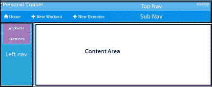

这有以下组件：

+   **顶部导航**：这包含应用品牌标题和历史链接。

+   **子导航**：这里有导航元素，根据活动组件的不同而变化。

+   **左侧导航**：这包含依赖于活动组件的元素。

+   **内容区域**：这是我们组件的主视图显示的地方。这里发生了大部分的动作。我们将在这里创建/编辑练习和锻炼，并显示练习和锻炼的列表。

查看源代码文件；在`trainer/src/components`下有一个新的文件夹`workout-builder`。它有我们之前描述的每个组件的文件，带有一些占位内容。我们将在本章节中逐步构建这些组件。

但是，我们首先需要在应用程序中连接这些组件。这要求我们定义 Workout Builder 应用程序的导航模式，并相应地定义应用程序路线。

# 带路由的私人教练

我们计划在应用程序中使用的导航模式是列表-详细信息模式。我们将为应用程序中可用的练习和锻炼创建列表页面。单击任何列表项将带我们到该项的详细视图，我们可以在那里执行所有 CRUD 操作（创建/读取/更新/删除）。以下路线符合此模式：

| **路线** | **描述** |
| --- | --- |
| `/builder` | 这只是重定向到**builder/workouts**。 |
| `/builder/workouts` | 这列出了所有可用的锻炼。这是*Workout Builder*的登陆页面。 |
| `/builder/workout/new` | 这将创建一个新的锻炼。 |
| `/builder/workout/:id` | 这将编辑具有特定 ID 的现有锻炼。 |
| `/builder/exercises` | 这列出了所有可用的练习。 |
| `/builder/exercise/new` | 这将创建一个新的练习。 |
| `/builder/exercise/:id` | 这将编辑具有特定 ID 的现有练习。 |

## 开始

此时，如果您查看`src/components/app`文件夹中的`app.routes.ts`中的路由配置，您将找到一个新的路由定义 - `builder` **:**

```ts
export const routes: Routes = [ 
  ... 
{ path: 'builder', component: WorkoutBuilderComponent }, 
  ... 
]; 

```

如果您运行应用程序，您将看到启动屏幕显示另一个链接：**创建一个锻炼：**

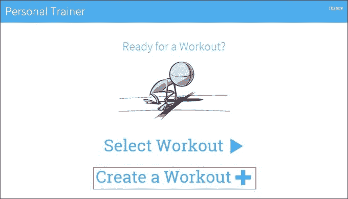

在幕后，我们为此链接添加了另一个路由器链接到`start.html`：

```ts
<a [routerLink]="['/builder']"> 
  <span>Create a Workout</span> 
  <span class="glyphicon glyphicon-plus"></span> 
</a> 

```

如果您点击此链接，您将进入以下视图：


再次在幕后，我们在`trainer/src/components/workout-builder`文件夹中添加了一个`WorkoutBuilderComponent`，并在`workout-builder.component.html`中添加了以下相关模板：

```ts
<div class="row"> 
    <div class="col-sm-3"></div> 
    <div class="col-sm-6"> 
        <h1 class="text-center">Workout Builder</h1> 
    </div> 
    <div class="col-sm-3"></div> 
</div> 

```

并且这个视图在`app.component.ts`的视图模板中使用路由器出口显示在屏幕上的标题下：

```ts
<div class="container body-content app-container"> 
    <router-outlet></router-outlet> 
</div>` 

```

我们已经将此组件包装在一个名为`workout-builder.module.ts`的新模块中：

```ts
import { NgModule }      from '@angular/core'; 
import { CommonModule } from '@angular/common'; 

import { WorkoutBuilderComponent } from "./workout-builder.component"; 

@NgModule({ 
    imports: [CommonModule], 
    declarations: [ 
        WorkoutBuilderComponent, 
    ], 
    exports: [WorkoutBuilderComponent], 
}) 
export class WorkoutBuilderModule { }

```

这里唯一可能与我们创建的其他模块不同的地方是，我们导入的是`CommonModule`而不是`BrowserModule`。这样可以避免第二次导入整个`BrowserModule`，这样在实现此模块的延迟加载时会生成错误。

最后，我们已经在`app.module.ts`中为这个模块添加了一个导入：

```ts
  ... 
@NgModule({ 
  imports: [ 
  ... 
 **WorkoutBuilderModule],** 
  ... 

```

所以这里没有什么令人惊讶的。这些是我们在前几章介绍的基本组件构建和路由模式。遵循这些模式，我们现在应该开始考虑为我们的新功能添加先前概述的额外导航。然而，在我们开始做这件事之前，有一些事情我们需要考虑。

首先，如果我们开始将路由添加到`app.routes.ts`文件中，那么存储在那里的路由数量将增加。*Workout Builder*的这些新路由也将与*Workout Runner*的路由混合在一起。虽然我们现在添加的路由数量似乎微不足道，但随着时间的推移，这可能会成为一个维护问题。

其次，我们需要考虑到我们的应用程序现在包括两个功能 - *Workout Runner*和*Workout Builder*。我们应该考虑如何在应用程序中分离这些功能，以便它们可以独立开发。

换句话说，我们希望在构建的功能之间实现**松耦合**。使用这种模式允许我们在不影响其他功能的情况下替换应用程序中的功能。例如，将来我们可能希望将*Workout Runner*转换为移动应用程序，但保持*Workout Builder*作为基于 Web 的应用程序不变。

回到第一章，我们强调了将组件彼此分离的能力是 Angular 实现的**组件设计模式**的关键优势之一。幸运的是，Angular 的路由器使我们能够将我们的路由分离成逻辑组织良好的**路由配置**，这与我们应用程序中的功能密切匹配。

为了实现这种分离，Angular 允许我们使用**子路由**，在这里我们可以隔离每个功能的路由。在本章中，我们将使用**子路由**来分离*Workout Builder*的路由。

## 向 Workout Builder 引入子路由

Angular 支持我们隔离新的*Workout Builder*路由的目标，通过为我们提供在应用程序中创建路由组件层次结构的能力。目前，我们只有一个路由组件，它位于应用程序的根组件中。但是 Angular 允许我们在根组件下添加所谓的**子路由组件**。这意味着一个功能可以不知道另一个功能正在使用的路由，并且每个功能都可以自由地根据该功能内部的变化来调整其路由。

回到我们的应用程序，我们可以使用 Angular 中的**子路由**来匹配我们应用程序的两个功能的路由与将使用它们的代码。因此，在我们的应用程序中，我们可以将路由结构化为以下*Workout Builder*的路由层次结构（在这一点上，我们将*Workout Runner*保持不变，以显示之前和之后的比较）：

介绍将子路由引入到 Workout Builder 中

通过这种方法，我们可以通过功能创建路由的逻辑分离，并使其更易于管理和维护。

所以让我们开始通过向我们的应用程序添加子路由来开始。

### 注意

从这一点开始，在本节中，我们将继续添加我们在本章早期下载的代码。如果您想查看本节的完整代码，可以从 GitHub 存储库的检查点 4.2 中下载。如果您想与我们一起构建本节的代码，请确保在`trainer/static/css`文件夹中添加`app.css`中的更改，因为我们不会在这里讨论它们。还要确保从存储库的`trainer/src/components/workout-builder`文件夹中添加 exercise(s)和 workout(s)的文件。在这个阶段，这些只是存根文件，我们将在本章后面实现它们。但是，您需要这些存根文件来实现*Workout Builder*模块的导航。该代码可供所有人在 GitHub 上下载：[`github.com/chandermani/angular2byexample`](https://github.com/chandermani/angular2byexample)。检查点在 GitHub 中作为分支实现。要下载的分支如下：**GitHub 分支：checkpoint4.2**。如果您不使用 Git，请从以下 GitHub 位置下载 Checkpoint 4.2 的快照（ZIP 文件）：[`github.com/chandermani/angular2byexample/archive/checkpoint4.2.zip`](https://github.com/chandermani/angular2byexample/archive/checkpoint4.2.zip)。首次设置快照时，请参考`trainer`文件夹中的`README.md`文件。

## 添加子路由组件

在`workout-builder`目录中，添加一个名为`workout-builder.routes.ts`的新的 TypeScript 文件，其中包含以下导入：

```ts
import { ModuleWithProviders } from '@angular/core'; 
import { Routes, RouterModule } from '@angular/router'; 

import { WorkoutBuilderComponent}  from "./workout-builder.component"; 
import { ExerciseComponent} from './exercise/exercise.component'; 
import { ExercisesComponent} from './exercises/exercises.component'; 
import { WorkoutComponent} from './workout/workout.component'; 
import { WorkoutsComponent} from './workouts/workouts.component'; 

```

正如你所看到的，我们正在导入我们刚刚提到的组件；它们将成为我们的*Workout Builder*（exercise，exercises，workout 和 workouts）的一部分。除了这些导入之外，我们还从 Angular 核心模块导入`ModuleWithProviders`，从 Angular 路由器模块导入`Routes`和`RouterModule`。这些导入将使我们能够添加和导出子路由。

然后将以下路由配置添加到文件中：

```ts
export const workoutBuilderRoutes: Routes = [ 
    { 
        path: 'builder', 
        component: WorkoutBuilderComponent, 
        children: [ 
             {path:'', pathMatch: 'full', redirectTo: 'workouts'}, 
             {path:'workouts', component: WorkoutsComponent }, 
             {path:'workout/new',  component: WorkoutComponent }, 
             {path:'workout/:id', component: WorkoutComponent }, 
             {path:'exercises', component: ExercisesComponent}, 
             {path:'exercise/new', component: ExerciseComponent }, 
             {path:'exercise/:id', component: ExerciseComponent } 
        ] 
    } 
]; 

```

第一个配置，path: 'builder'，设置了子路由的基本 URL，以便每个子路由都会在其前面添加它。下一个配置将`WorkoutBuilder`组件标识为该文件中子组件的功能区根组件。这意味着它将是使用`router-outlet`显示每个子组件的组件。最后一个配置是一个或多个子组件的列表，定义了子组件的路由。

这里需要注意的一点是，我们已经将`Workouts`设置为子路由的默认配置：

```ts
{path:'', pathMatch: 'full', redirectTo: 'workouts'}, 

```

这个配置表示，如果有人导航到`builder`，他们将被重定向到`builder/workouts`路线。`pathMatch: 'full'`设置意味着只有在 workout/builder 后的路径为空字符串时才会进行匹配。这可以防止在路由为其他内容时发生重定向，比如`workout/builder/exercises`或者我们在这个文件中配置的其他路由。

最后，添加以下`export`语句：

```ts
export const workoutBuilderRouting: ModuleWithProviders = RouterModule.forChild(workoutBuilderRoutes);

```

这个导出将我们的子路由注册到路由器中，与 app.routes.ts 中的类似，只有一个区别：我们使用的是`RouterModule.forChild`而不是`RouterModule.forRoot`。这种差异的原因似乎很明显：我们正在创建子路由，而不是应用程序根目录中的路由，这是我们表示的方式。然而，在底层，这有着重大的区别。这是因为我们的应用程序中不能有多个路由器服务。`forRoot`创建路由器服务，但`forChild`不会。

## 更新 WorkoutBuilder 组件

接下来，我们需要更新`WorkoutBuilder`组件以支持我们的新子路由。为此，将 Workout Builder 的`@Component`装饰器更改为：

+   移除`selector`

+   用`template`引用替换对`templateUrl`的引用

+   在模板中添加一个`<sub-nav>`自定义元素

+   在模板中添加一个`<router-outlet>`标签

+   装饰器现在应该如下所示：

```ts
        @Component({ 
            template: `<div class="navbar navbar-default 
                       navbar-fixed-top second-top-nav"> 
                  <sub-nav></sub-nav> 
               </div> 
               <div class="container body-content app-container"> 
                  <router-outlet></router-outlet> 
               </div>` 
        }) 

```

我们移除了选择器，因为`WorkoutBuilderComponent`不会嵌入在应用程序根目录`app.component.ts`中。相反，它将通过路由从`app.routes.ts`中到达。虽然它将处理来自`app.routes.ts`的入站路由请求，但它将进一步将它们路由到 Workout Builder 功能中包含的其他组件。

这些组件将使用我们刚刚添加到`WorkoutBuilder`模板中的`<router-outlet>`标签显示它们的视图。鉴于`Workout BuilderComponent`的模板将是简单的，我们还将内联模板替换为`templateUrl`。

### 注意

通常，对于组件的视图，我们建议使用指向单独的 HTML 模板文件的`templateUrl`。当您预期视图将涉及多于几行 HTML 时，这一点尤为重要。在这种情况下，更容易使用单独的 HTML 文件来处理视图。单独的 HTML 文件允许您使用具有颜色编码和标记完成等功能的 HTML 编辑器。相比之下，内联模板只是 TypeScript 文件中的字符串，编辑器不会给您带来这些好处。

我们还将添加一个`<sub-nav>`元素，用于创建*Workout Builder*功能内部的次级顶级菜单。我们将在本章稍后讨论这一点。

## 更新 Workout Builder 模块

现在让我们更新`WorkoutBuilderModule`。这将涉及一些重大变化，因为我们将把这个模块转变为一个功能模块。因此，这个模块将导入我们用于构建锻炼的所有组件。我们不会在这里涵盖所有这些导入，但一定要从 GitHub 存储库的`checkpoint 4.2`中的`trainer/src/components/workout-builder`文件夹中的`workout-builder.ts`中添加它们。

值得一提的是以下导入：

```ts
import { workoutBuilderRouting } from './workout-builder.routes'; 

```

它导入了我们刚刚设置的子路由。

现在让我们将`@NgModule`装饰器更新为以下内容：

```ts
@NgModule({ 
    imports: [ 
        CommonModule, 
 **workoutBuilderRouting** 
    ], 
    declarations: [ 
       WorkoutBuilderComponent,
       **WorkoutComponent,**
 **WorkoutsComponent,**
 **ExerciseComponent,**
 **ExercisesComponent,**
 **SubNavComponent,**
 **LeftNavExercisesComponent,**
 **LeftNavMainComponent**
       ],
    exports: [WorkoutBuilderComponent], 
}) 

```

## 更新 app.routes

最后一步：返回到`app.routes.ts`，并从该文件中删除`WorkoutBuilderComponent`及其路由的导入。

## 把所有东西放在一起

从上一章，我们已经知道如何为我们的应用程序设置根路由。但现在，我们所拥有的不是根路由，而是包含子路由的区域或功能路由。我们已经能够实现我们之前讨论的关注点分离，这样与*Workout Builder*相关的所有路由现在都单独包含在它们自己的路由配置中。这意味着我们可以在`WorkoutBuilderRoutes`组件中管理*Workout Builder*的所有路由，而不会影响应用程序的其他部分。

我们可以看到路由器如何将`app.routes.ts`中的路由与`workout-builder.routes.ts`中的默认路由组合在一起，如果我们现在从起始页面导航到 Workout Builder。

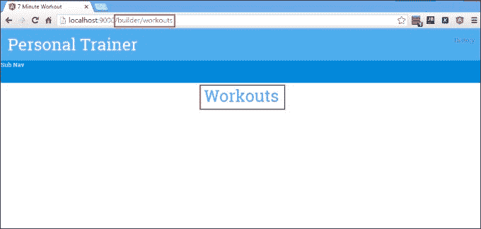

如果我们在浏览器中查看 URL，它是`/builder/workouts`。您会记得起始页面上的路由链接是`['/builder']`。那么路由是如何将我们带到这个位置的呢？

它是这样做的：当链接被点击时，Angular 路由器首先查找`app.routes.ts`中的`builder`路径，因为该文件包含了我们应用程序中根路由的配置。路由器没有在该文件的路由中找到该路径，因为我们已经从该文件的路由中删除了它。

然而，`WorkoutBuilderComponent`已经被导入到我们的`AppModule`中，该组件反过来从`workout-builder-routes.ts`导入了`workoutBuilderRouting`。后者文件包含了我们刚刚配置的子路由。路由器发现`builder`是该文件中的父路由，因此它使用了该路由。它还发现了默认设置，即在`builder`路径以空字符串结尾时重定向到子路径`workouts`，在这种情况下就是这样。

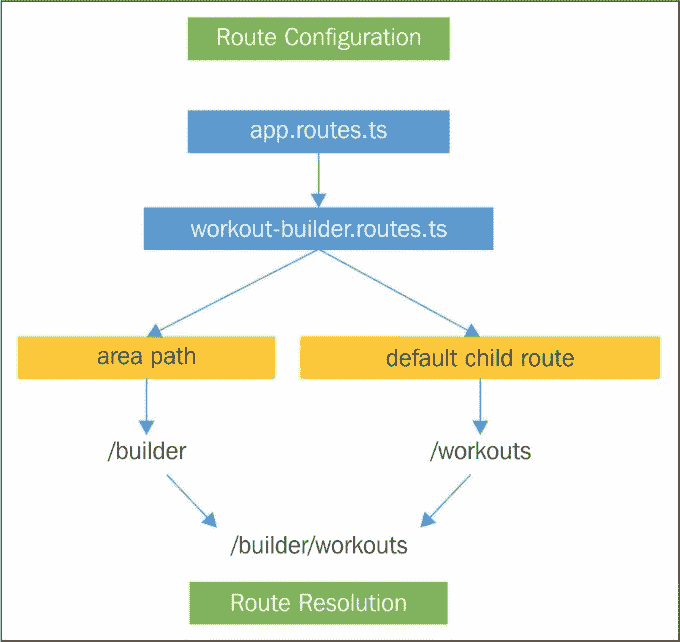

路由解析的过程如下所示：

如果您看屏幕，您会发现它显示的是`Workouts`的视图（而不是之前的*Workout Builder*）。这意味着路由器已成功地将请求路由到了`WorkoutsComponent`，这是我们在`workout-builder.routes.ts`中设置的子路由配置的默认路由的组件。

关于子路由的最后一个想法。当您查看我们的子路由组件`workout-builder.component.ts`时，您会发现它没有引用其`parent`组件`app.component.ts`（正如我们之前提到的，`<selector>`标签已被移除，因此`Workout Builder`组件没有被嵌入到根组件中）。这意味着我们已成功地封装了`Workout Builder`（以及它导入的所有组件），这将使我们能够将其全部移动到应用程序的其他位置，甚至是到一个新的应用程序中。

现在是时候将我们的训练构建器的路由转换为使用延迟加载，并构建其导航菜单了。如果您想查看下一节的完成代码，可以从`检查点 4.3`的伴随代码库中下载。再次强调，如果您正在与我们一起构建应用程序，请确保更新`app.css`文件，这里我们不讨论。

### 注意

该代码也可供所有人在 GitHub 上下载：[`github.com/chandermani/angular2byexample`](https://github.com/chandermani/angular2byexample)。检查点在 GitHub 中作为分支实现。要下载的分支如下：**GitHub 分支：checkpoint4.3**（文件夹 - `trainer`）。如果您不使用 Git，请从以下 GitHub 位置下载检查点 4.3 的快照（ZIP 文件）：[`github.com/chandermani/angular2byexample/archive/checkpoint4.3.zip`](https://github.com/chandermani/angular2byexample/archive/checkpoint4.3.zip)。首次设置快照时，请参考`trainer`文件夹中的`README.md`文件。

## 路由的延迟加载

当我们推出我们的应用程序时，我们预计我们的用户每天都会访问**训练运行器**（我们知道这对你来说也是如此！）。但我们预计他们只会偶尔使用*训练构建器*来构建他们的练习和训练计划。因此，如果我们的用户只是在**训练运行器**中做练习时，我们最好能避免加载**训练构建器**的开销。相反，我们希望只在用户想要添加或更新他们的练习和训练计划时按需加载*训练构建器*。这种方法称为**延迟加载**。

### 注意

在幕后，Angular 使用 SystemJS 来实现这种延迟加载。它允许我们在加载模块时采用异步方法。这意味着我们可以只加载启动应用程序所需的内容，然后根据需要加载其他模块。

在我们的*个人教练*应用程序中，我们希望改变应用程序，使其只在需要时加载**训练构建器**。Angular 路由器允许我们使用延迟加载来实现这一点。

但在开始实现懒加载之前，让我们先看看我们当前的应用程序以及它如何加载我们的模块。在**Sources**选项卡中打开开发者工具，启动应用程序；当应用程序的起始页面出现在您的浏览器中时，您会看到应用程序中的所有文件都已加载，包括*Workout Runner*和*Workout Builder*文件：

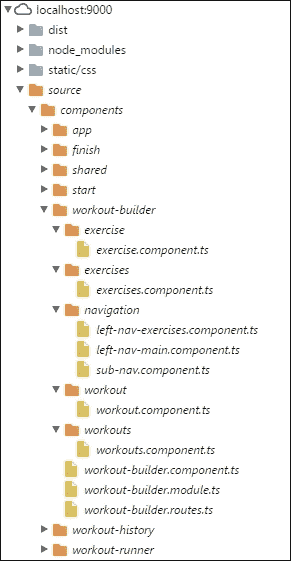

因此，即使我们可能只想使用*Workout Runner*，我们也必须加载*Workout Builder*。从某种意义上讲，如果你把我们的应用程序看作是一个**单页应用程序**（**SPA**），这是有道理的。为了避免与服务器的往返，SPA 通常会在用户首次启动应用程序时加载所有将需要使用应用程序的资源。但在我们的情况下，重要的是当应用程序首次加载时，我们并不**需要** *Workout Builder*。相反，我们希望只在用户决定要添加或更改锻炼或练习时才加载这些资源。

因此，让我们开始实现这一点。

首先，修改`app.routes.ts`，添加以下单独的路由配置，用于我们的`workoutBuilderRoutes`：

```ts
const workoutBuilderRoutes: Routes = [ 
  { 
    path: 'builder', 
    loadChildren: 'dist/components/workout-builder/workout-builder.module#Workout-BuilderModule' 
  } 
]; 

```

请注意，`loadChildren`属性是：

```ts
component:  file path + # + component name 

```

此配置提供了加载和实例化组件所需的信息。特别注意文件路径；它指向我们的代码在`dist`文件夹中的位置，当它部署为 JavaScript 文件时，而不是该文件的 TypeScript 版本所在的文件夹。

接下来，更新`Routes`配置以添加以下内容：

```ts
export const routes: Routes = [ 
  { path: 'start', component: StartComponent }, 
  { path: 'workout', component: WorkoutContainerCompnent }, 
  { path: 'finish', component: FinishComponent }, 
  { path: 'history', component: WorkoutHistoryComponent }, 
 **...workoutBuilderRoutes,** 
  { path: '**', redirectTo: '/start' } 
]; 

```

您会注意到我们已经添加了对`WorkoutBuilderRoutes`的引用，我们刚刚配置并用三个点添加了前缀。通过这三个点，我们使用 ES2015 扩展运算符来插入一个路由数组 - 具体来说是`WorkoutBuilder`功能的路由。这些路由将包含在`WorkoutBuilderRoutes`中，并将与我们应用程序根目录中的路由分开维护。最后，从该文件中删除对`WorkoutBuilderComponent`的导入。

接下来回到`workout-builder.routes.ts`，将`path`属性更改为空字符串：

```ts
export const workoutBuilderRoutes: Routes = [ 
    { 
 **path: '',** 
. . . 
    } 
]; 

```

我们进行此更改是因为我们现在正在将路径（'`builder`'）设置为`app.routes.ts`中添加的`WorkoutBuilderRoutes`的新配置。

最后返回`app-module.ts`，并在该文件的`@NgModule`配置中删除`WorkoutBuilderModule`的导入。这意味着我们不会在应用程序启动时加载**锻炼构建器**功能，而是只有在用户访问*锻炼构建器*路由时才加载它。

让我们返回并再次运行应用程序，保持 Chrome 开发者工具中的**源**选项卡打开。当应用程序开始并加载起始页面时，只有与*锻炼运行器*相关的文件出现，而与*锻炼构建器*相关的文件不会出现，如下所示：

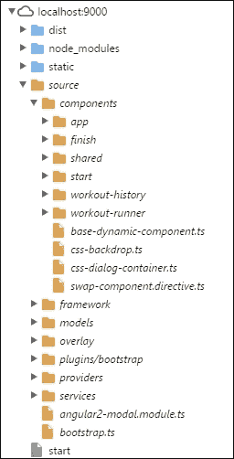

然后，如果我们清除**网络**选项卡并单击**创建锻炼链接**，我们将只看到与*锻炼构建器*加载相关的文件：

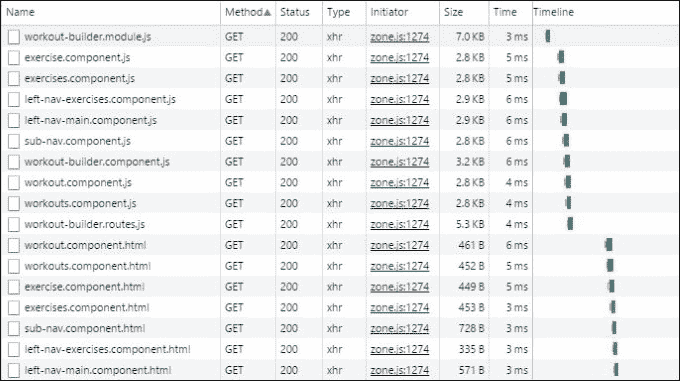

正如我们所看到的，现在加载的所有文件都与*锻炼构建器*相关。这意味着我们已经实现了新功能的封装，并且通过异步路由，我们能够使用延迟加载仅在需要时加载所有其组件。

子级和异步路由使我们能够轻松实现允许我们“既能拥有蛋糕，又能吃掉蛋糕”的应用程序。一方面，我们可以构建具有强大客户端导航的单页面应用程序，另一方面，我们还可以将功能封装在单独的子路由组件中，并仅在需要时加载它们。

Angular 路由器的这种强大和灵活性使我们能够通过密切映射应用程序的行为和响应性来满足用户的期望。在这种情况下，我们利用了这些能力来实现我们的目标：立即加载*锻炼运行器*，以便我们的用户可以立即开始锻炼，但避免加载*锻炼构建器*的开销，而只在用户想要构建锻炼时提供它。

现在我们已经在*锻炼构建器*中放置了路由配置，我们将把注意力转向创建子级和左侧导航；这将使我们能够使用这个路由。接下来的部分将涵盖实现这种导航。

## 集成子级和侧边导航

将子级和侧边导航集成到应用程序中的基本思想是提供基于活动视图而变化的上下文感知子视图。例如，当我们在列表页面而不是编辑项目时，我们可能希望在导航中显示不同的元素。电子商务网站是一个很好的例子。想象一下亚马逊的搜索结果页面和产品详细页面。随着上下文从产品列表变为特定产品，加载的导航元素也会改变。

### 子级导航

我们将首先向*Workout Builder*添加子级导航。我们已经将`SubNavComponent`导入到*Workout Builder*中。但目前它只显示占位内容：


现在我们将用三个路由链接替换该内容：**主页**，**新锻炼**和**新练习**。

打开`sub-nav.component.html`文件，并将其中的 HTML 更改为以下内容：

```ts
<div> 
    <a [routerLink]="['/builder/workouts']" class="btn btn-primary"> 
        <span class="glyphicon glyphicon-home"></span> Home 
    </a> 
    <a [routerLink]="['/builder/workout/new']" class="btn btn-primary"> 
        <span class="glyphicon glyphicon-plus"></span> New Workout 
    </a> 
    <a [routerLink]="['/builder/exercise/new']" class="btn btn-primary"> 
        <span class="glyphicon glyphicon-plus"></span> New Exercise 
    </a> 
</div> 

```

现在重新运行应用程序，您将看到三个导航链接。如果我们点击**新练习**链接按钮，我们将被路由到`ExerciseComponent`，并且其视图将出现在*Workout Builder*视图中的**路由出口**中：


**新锻炼**链接按钮将以类似的方式工作；当点击时，它将带用户到`WorkoutComponent`并在路由出口显示其视图。点击**主页**链接按钮将把用户返回到`WorkoutsComponent`和视图。

### 侧边导航

*Workout Builder*内的侧边导航将根据我们导航到的子组件而变化。例如，当我们首次导航到*Workout Builder*时，我们会进入**锻炼**屏幕，因为`WorkoutsComponent`的路由是*Workout Builder*的默认路由。该组件将需要侧边导航；它将允许我们选择查看锻炼列表或练习列表。

Angular 的基于组件的特性为我们提供了一种实现这些上下文敏感菜单的简单方法。我们可以为每个菜单定义新的组件，然后将它们导入到需要它们的组件中。在这种情况下，我们有三个组件将需要侧边菜单：**锻炼**，**练习**和**锻炼**。前两个组件实际上可以使用相同的菜单，所以我们实际上只需要两个侧边菜单组件：`LeftNavMainComponent`，它将类似于前面的菜单，并将被`Exercises`和`Workouts`组件使用，以及`LeftNavExercisesComponent`，它将包含现有练习列表，并将被`Workouts`组件使用。

我们已经为两个菜单组件准备了文件，包括模板文件，并将它们导入到`WorkoutBuilderModule`中。现在我们将把它们整合到需要它们的组件中。

首先，修改`workouts.component.html`模板以添加菜单的选择器：

```ts
div class="container-fluid"> 
    <div id="content-container" class="row"> 
 **<left-nav-main></left-nav-main>** 
        <h1 class="text-center">Workouts</h1> 
    </div> 
</div> 

```

然后，将`left-nav-main.component.html`中的占位文本替换为导航链接到`WorkoutsComponent`和`ExercisesComponent`：

```ts
<div class="col-sm-2 left-nav-bar"> 
    <div class="list-group"> 
        <a [routerLink]="['/builder/workouts']" class="list-group-item list-group-item-info">Workouts</a> 
        <a [routerLink]="['/builder/exercises']" class="list-group-item list-group-item-info">Exercises</a> 
    </div> 
</div> 

```

运行应用程序，您应该会看到以下内容：

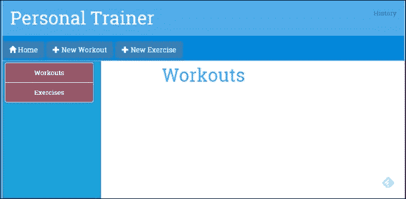

按照完全相同的步骤完成`Exercises`组件的侧边菜单。

### 注意

我们不会在这里展示这两个菜单的代码，但您可以在 GitHub 存储库的`checkpoint 4.3`中的`trainer/src/components`文件夹下的`workout-builder/exercises`文件夹中找到它们。

对于**锻炼**屏幕的菜单，步骤是相同的，只是您应该将`left-nav-exercises.component.html`更改为以下内容：

```ts
<div class="col-sm-2 left-nav-bar"> 
    <h3>Exercises</h3> 
</div> 

```

我们将使用这个模板作为构建出现在屏幕左侧的练习列表的起点，并可以选择包含在锻炼中的练习。

# 实现锻炼和练习列表

甚至在我们开始实现**锻炼**和**练习**列表页面之前，我们需要一个练习和锻炼数据的数据存储。当前的计划是使用内存数据存储并使用 Angular 服务来公开它。在第五章中，*支持服务器数据持久性*，我们将把这些数据移到服务器存储以实现长期持久性。目前，内存存储就足够了。让我们添加存储实现。

## WorkoutService 作为锻炼和练习存储库

这里的计划是创建一个负责在两个应用程序中公开练习和锻炼数据的`WorkoutService`实例。服务的主要职责包括：

+   **与 Exercise 相关的 CRUD 操作**：获取所有练习，根据名称获取特定练习，创建练习，更新练习和删除练习

+   **与 Workout 相关的 CRUD 操作**：这些类似于与 Exercise 相关的操作，但是针对 Workout 实体

### 注意

该代码可在 GitHub 上下载，网址为[`github.com/chandermani/angular2byexample`](https://github.com/chandermani/angular2byexample)。要下载的分支如下：**GitHub 分支：checkpoint4.4**（文件夹 - `trainer`）。如果您不使用 Git，请从以下 GitHub 位置下载 Checkpoint 4.4 的快照（ZIP 文件）：[`github.com/chandermani/angular2byexample/archive/checkpoint4.4.zip`](https://github.com/chandermani/angular2byexample/archive/checkpoint4.4.zip)。首次设置快照时，请参考`trainer`文件夹中的`README.md`文件。再次，如果您正在与我们一起构建应用程序，请确保更新`app.css`文件，这里我们不讨论。因为本节中的一些文件相当长，所以我们不会在这里显示代码，有时我们会建议您将文件简单复制到您的解决方案中。

在`trainer/src/services`文件夹中找到`workout-service.ts`。该文件中的代码应该如下所示，除了两个方法`setupInitialExercises`和`setupInitialWorkouts`的实现，由于它们的长度，我们已经省略了：

```ts
import {Injectable} from '@angular/core'; 
import {ExercisePlan} from './model'; 
import {WorkoutPlan} from './model'; 
import {Exercise} from "./model"; 

@Injectable() 
export class WorkoutService { 
    workouts: Array<WorkoutPlan> = []; 
    exercises: Array<Exercise> = []; 

    constructor() { 
        this.setupInitialExercises(); 
        this.setupInitialWorkouts(); 
    } 

    getExercises(){ 
        return this.exercises; 
    } 

    getWorkouts(){ 
        return this.workouts; 
    } 
    setupInitialExercises(){ 
     // implementation of in-memory store. 
    } 

    setupInitialWorkouts(){ 
     // implementation of in-memory store. 
    } 
}} 

```

正如我们之前提到的，实现 Angular 服务是直截了当的。在这里，我们声明了一个名为`WorkoutService`的类，并用`@Injectable`进行装饰，以支持在整个应用程序中注入它。在类定义中，我们首先创建了两个数组：一个用于`Workouts`，一个用于`Exercises`。这些数组分别是`WorkoutPlan`和`Exercise`类型的，因此我们需要从`model.ts`中导入`WorkoutPlan`和`Exericse`以获取它们的类型定义。

构造函数调用了两个方法来设置**Workouts**和**Services List**。目前，我们只是使用一个内存存储来填充这些列表的数据。

这两个方法，`getExercises`和`getWorkouts`，顾名思义，分别返回练习和锻炼的列表。由于我们计划使用内存存储来存储锻炼和练习数据，`Workouts`和`Exercises`数组存储了这些数据。随着我们的进行，我们将向服务添加更多的函数。

还有一件事情我们需要做，就是使服务可以在整个应用程序中被注入。

打开同一文件夹中的`services.module.ts`，然后导入`WorkoutService`并将其添加为提供者：

```ts
---- other imports ---- 
**import { WorkoutService } from "./workout-service";** 

@NgModule({ 
    imports: [], 
    declarations: [], 
    providers: [ 
        LocalStorage, 
        WorkoutHistoryTracker, 
 **WorkoutService],** 
}) 

```

这将`WorkoutService`注册为 Angular 的**依赖注入**框架的提供者。

是时候添加锻炼和练习列表的组件了！

## 锻炼和练习列表组件

首先，打开`trainer/src/components/workout-builder/workouts`文件夹中的`workouts.component.ts`文件，并按照以下方式更新导入：

```ts
import { Component, OnInit} from '@angular/core'; 
import { Router } from '@angular/router'; 

import { WorkoutPlan } from "../../../services/model"; 
import { WorkoutService } from "../../../services/workout-service"; 

```

这段新代码从 Angular 核心中导入了`OnInit`，以及`Router`，`WorkoutService`和`WorkoutPlan`类型。

接下来，用以下代码替换类定义：

```ts
export class WorkoutsComponent implements OnInit { 
    workoutList:Array<WorkoutPlan> = []; 

    constructor( 
        public router:Router, 
        public workoutService:WorkoutService) {} 

    ngOnInit() { 
        this.workoutList = this.workoutService.getWorkouts(); 
    } 

    onSelect(workout: WorkoutPlan) { 
        this.router.navigate( ['./builder/workout', workout.name] ); 
    } 
} 

```

这段代码添加了一个构造函数，我们在其中注入了`WorkoutService`和`Router`。然后`ngOnInit`方法调用`WorkoutService`的`getWorkouts`方法，并用从该方法调用返回的`WorkoutPlans`列表填充了一个`workoutList`数组。我们将使用这个`workoutList`数组来填充在`Workouts`组件的视图中显示的锻炼计划列表。

您会注意到我们将调用`WorkoutService`的代码放入了一个`ngOnInit`方法中。我们希望避免将这段代码放入构造函数中。最终，我们将用外部数据存储的调用替换这个服务使用的内存存储，我们不希望我们组件的实例化受到这个调用的影响。将这些方法调用添加到构造函数中也会使组件的测试变得复杂。

为了避免这种意外的副作用，我们将代码放在`ngOnInit`方法中。这个方法实现了 Angular 的生命周期钩子之一，`OnInit`，Angular 在创建服务的实例后调用这个方法。这样我们就依赖于 Angular 以一种可预测的方式调用这个方法，不会影响组件的实例化。

接下来，我们将对`Exercises`组件进行几乎相同的更改。与`Workouts`组件一样，这段代码将锻炼服务注入到我们的组件中。这次，我们使用锻炼服务来检索练习。

### 注意

因为它与我们刚刚为`Workouts`组件展示的内容非常相似，所以我们不会在这里展示代码。只需从`workout-builder/exercises`文件夹的`checkpoint 4.4`中添加它。

## 锻炼和锻炼列表视图

现在我们需要实现到目前为空的列表视图！

### 注意

在本节中，我们将使用`checkpoint 4.4`中找到的代码更新`checkpoint 4.3`中的代码。因此，如果您正在与我们一起编码，只需按照本节中列出的步骤进行。如果您想查看完成的代码，只需将`checkpoint 4.4`中的文件复制到您的解决方案中。

### 锻炼列表视图

要使视图工作，打开`workouts.component.html`并添加以下标记：

```ts
<div class="container-fluid">
  <div id="content-container" class="row">
    <left-nav-main></left-nav-main>
    <h1 class="text-center">Workouts</h1>
    **<div class="workouts-container">
      <div *ngFor="let workout of workoutList|orderBy:'title'"
       class="workout tile" (click)="onSelect(workout)">
         <div class="title">{{workout.title}}</div>
         <div class="stats">
           <span class="duration" >
           <span class="glyphicon glyphicon-time"></span> - 
           {{workout.totalWorkoutDuration()|secondsToTime}}</span>
           <span class="length pull-right" >
           <span class="glyphicon glyphicon-th-list">
           </span> - {{workout.exercises.length}}</span>
                </div>
            </div>
        </div>
    </div>** </div>

```

我们使用 Angular 核心指令之一`ngFor`来循环遍历锻炼列表并在页面上以列表形式显示它们。我们在`ngFor`前面加上`*`号来将其标识为 Angular 指令。使用`let`语句，我们将`workout`分配为一个本地变量，用于遍历工作列表并识别要为每个锻炼显示的值（例如，`workout.title`）。然后我们使用我们的自定义管道之一`orderBy`，按标题的字母顺序显示锻炼列表。我们还使用另一个自定义管道`secondsToTime`来格式化显示总锻炼持续时间的时间。

### 注意

如果您正在与我们一起编码，您需要将`secondsToTime`管道移动到共享文件夹并将其包含在`SharedModule`中。然后将`SharedModule`作为额外导入添加到`WorkoutBuilderModule`中。这个更改已经在 GitHub 存储库的`checkpoint 4.4`中进行了。

最后，我们将点击事件绑定到我们组件中添加的`onSelect`方法：

```ts
 onSelect(workout: WorkoutPlan) { 
     this.router.navigate( ['./builder/workout', workout.name] ); 
 }  

```

这设置了导航到锻炼详细页面。当我们双击锻炼列表中的项目时，将发生此导航。所选锻炼名称作为路由/URL 的一部分传递到锻炼详细页面。

继续刷新构建器页面(`/builder/workouts`)；列出了一个锻炼，7 分钟锻炼。点击该锻炼的瓷砖。您将被带到**锻炼**屏幕，锻炼名称`7MinWorkout`将出现在 URL 的末尾：

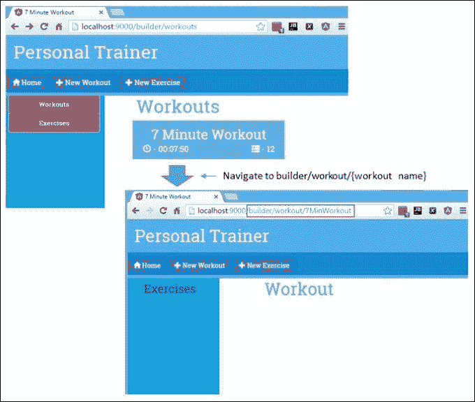

### 锻炼列表视图

对于`Exercises`列表视图，我们将采用与`Workouts`列表视图相同的方法。只是在这种情况下，我们实际上将实现两个视图：一个用于`Exercises`组件（当用户导航到该组件时显示在主内容区域），另一个用于`LeftNavExercisesComponent`练习上下文菜单（当用户导航到`Workouts`组件创建/编辑锻炼时显示）。

对于`Exercises`组件，我们将采用几乎与在`Workouts`组件中显示锻炼列表时相同的方法。所以我们不会在这里展示那些代码。只需添加来自`checkpoint 4.4`的`exercise.conponent.ts`和`exercise.component.html`文件。

当你完成复制文件后，点击左侧导航中的**练习**链接，加载你已经在`WorkoutService`中配置好的 12 个练习。

与`Workouts`列表一样，这设置了导航到练习详情页面。在练习列表中双击一个项目会带我们到练习详情页面。所选练习的名称作为路由/URL 的一部分传递到练习详情页面。

在最终的列表视图中，我们将添加一个练习列表，它将显示在*Workout Builder*屏幕的左侧上下文菜单中。当我们创建或编辑一个锻炼时，这个视图会在左侧导航中加载。使用 Angular 的基于组件的方法，我们将更新`leftNavExercisesComponent`及其相关视图，以提供这个功能。同样，我们不会在这里展示那些代码。只需添加来自`checkpoint 4.4`的`left-nav-exercises.component.ts`和`left-nav-exercises.component.html`文件，它们位于`trainer/src/components/navigation`文件夹中。

一旦你完成了复制这些文件，点击*Workout Builder*子导航菜单中的**新锻炼**按钮，你将会看到一个练习列表，在左侧导航菜单中显示了我们已经在`WorkoutService`中配置好的练习。

是时候添加加载、保存和更新练习/锻炼数据的功能了！

# 构建锻炼

*个人教练*的核心功能围绕着锻炼和练习的建立。一切都是为了支持这两个功能。在这一部分，我们将专注于使用 Angular 构建和编辑锻炼。

`WorkoutPlan`模型已经定义，所以我们知道构成锻炼的元素。 *Workout Builder*页面促进用户输入，并让我们构建/持久化锻炼数据。

完成后，“Workout Builder”页面将如下所示：

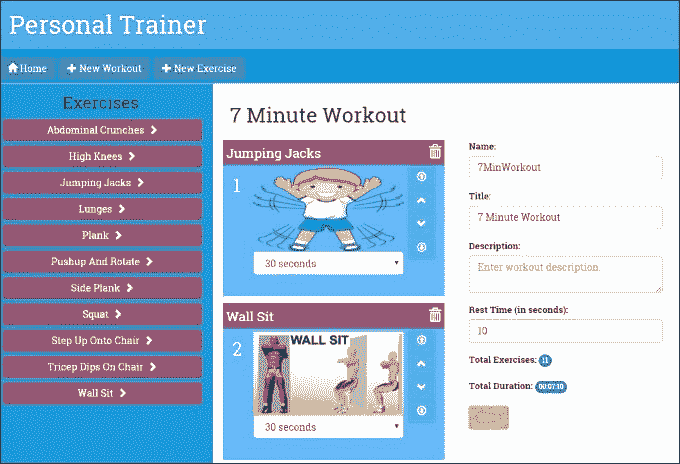

页面有一个左侧导航，列出了可以添加到锻炼中的所有练习。单击右侧的箭头图标将练习添加到锻炼的末尾。

中心区域用于构建锻炼。它由按顺序排列的练习瓷砖和一个表单组成，允许用户提供关于锻炼的其他细节，如名称、标题、描述和休息时间。

此页面有两种模式：

+   **创建**/**新建**：此模式用于创建新的锻炼。URL 为`#/ builder/workout/new`。

+   **编辑**：此模式用于编辑现有的锻炼。URL 为`#/ builder/workout/:id`，其中`:id`映射到锻炼的名称。

了解了页面元素和布局，现在是构建每个元素的时候了。我们将从左侧导航开始。

## 完成左侧导航

在上一节的最后，我们更新了`Workout`组件的左侧导航视图，以显示锻炼列表。我们的意图是让用户点击练习旁边的箭头将其添加到锻炼中。当时，我们推迟了在`LeftNavExercisesComponent`中实现`addExercise`方法，该方法绑定到该点击事件。现在我们将继续执行。

我们在这里有几个选择。 `LeftNavExercisesComponent`是`WorkoutComponent`的子组件，因此我们可以实现子/父组件间的通信来完成这一点。在上一章中，我们在*7 分钟锻炼*时使用了这种技术。

但是，将练习添加到锻炼中是构建锻炼的一个较大过程的一部分，使用子/父组件间通信将使`AddExercise`方法的实现与我们将要添加的其他功能有所不同。

因此，对于共享数据，更有意义的是采用另一种方法，这是我们可以在整个构建锻炼的过程中一致使用的方法。这种方法涉及使用服务。随着我们开始添加用于创建实际锻炼的其他功能，例如保存/更新逻辑，并实现其他相关组件，采用服务路线的好处将变得越来越明显。

因此，我们引入了一个新的服务：`WorkoutBuilderService`。`WorkoutBuilderService`服务的最终目标是在构建锻炼时协调`WorkoutService`（用于检索和保存锻炼）和组件（例如`LeftNavExercisesComponent`和我们稍后将添加的其他组件），从而将`WorkoutComponent`中的代码量减少到最低限度。

## 添加 WorkoutBuilderService

`WorkoutBuilderService`跟踪正在构建的锻炼的状态。它：

+   跟踪当前锻炼

+   创建新的锻炼

+   加载现有的锻炼

+   保存锻炼

从`checkpoint 4.5`中的`trainer/src/components`文件夹下的`workout-builder/builder-services`文件夹中复制`workout-builder-service.ts`。

### 注意

该代码也可供所有人在 GitHub 上下载[`github.com/chandermani/angular2byexample`](https://github.com/chandermani/angular2byexample)。检查点在 GitHub 中作为分支实现。要下载的分支如下：**GitHub 分支：checkpoint4.5**（文件夹-`trainer`）。如果您不使用 Git，请从以下 GitHub 位置下载 Checkpoint 4.5 的快照（ZIP 文件）：[`github.com/chandermani/angular2byexample/archive/checkpoint4.5.zip`](https://github.com/chandermani/angular2byexample/archive/checkpoint4.5.zip)。首次设置快照时，请参阅`trainer`文件夹中的`README.md`文件。再次，如果您正在与我们一起构建应用程序，请确保更新`app.css`文件，这里我们不讨论。

虽然我们通常会在整个应用程序中提供服务，但`WorkoutBuilderService`只会在*Workout Builder*功能中使用。因此，我们将在`WorkoutBuilderModule`的提供程序数组中注册它，而不是在`AppModule`中注册它（在文件顶部添加导入后）：

```ts
providers: [ 
 **WorkoutBuilderService,** 
    . . . 
] 

```

在这里将其添加为提供者意味着只有在访问*Workout Builder*功能时才会加载它，并且无法在此模块之外访问。这意味着它可以独立于应用程序中的其他模块进行演变，并且可以在不影响应用程序其他部分的情况下进行修改。

让我们看一下服务的一些相关部分。

`WorkoutBuilderService`需要`WorkoutPlan`，`Exercise`和`WorkoutService`的类型定义，因此我们将其导入到组件中：

```ts
import { WorkoutPlan, Exercise } from '../../../services/model'; 
import { WorkoutService } from "../../../services/workout-service"; 

```

`WorkoutBuilderService`依赖于`WorkoutService`来提供持久性和查询功能。我们通过将`WorkoutService`注入到`WorkoutBuilderService`的构造函数中来解决这个依赖关系**：**

```ts
constructor(public workoutService:WorkoutService){} 

```

`WorkoutBuilderService`还需要跟踪正在构建的锻炼。我们使用`buildingWorkout`属性来实现这一点。当我们在服务上调用`startBuilding`方法时，跟踪开始：

```ts
startBuilding(name: string){ 
    if(name){ 
        this.buildingWorkout = this.workoutService.getWorkout(name) 
        this.newWorkout = false; 
    }else{ 
        this.buildingWorkout = new WorkoutPlan("", "", 30, []); 
        this.newWorkout = true; 
    } 
    return this.buildingWorkout; 
} 

```

此跟踪功能背后的基本思想是设置一个`WorkoutPlan`对象（`buildingWorkout`），以便让组件可以操纵锻炼的细节。`startBuilding`方法以锻炼名称作为参数。如果未提供名称，则意味着我们正在创建新的锻炼，因此将创建并分配一个新的`WorkoutPlan`对象；如果提供名称，则通过调用`WorkoutService.getWorkout(name)`加载锻炼详情。在任何情况下，`buildingWorkout`对象都包含正在进行的锻炼。

`newWorkout`对象表示锻炼是新的还是现有的。在调用此服务的`save`方法时，它用于区分保存和更新情况。

其余的方法，`removeExercise`，`addExercise`和`moveExerciseTo`，都是不言自明的，并影响锻炼（`buildingWorkout`）的一部分的锻炼列表。

`WorkoutBuilderService`正在调用`WorkoutService`上的一个新方法`getWorkout`，我们还没有添加。继续并从`checkpoint 4.5`中`trainer/src`下的`services`文件夹中的`workout-service.ts`文件中复制`getWorkout`的实现。我们不会深入讨论新服务代码，因为实现非常简单。

让我们回到左侧导航栏并实现剩余的功能。

## 使用 ExerciseNav 添加锻炼

要将练习添加到我们正在构建的训练中，我们只需要将`WorkoutBuilderService`导入并注入`LeftNavExercisesComponent`，然后调用它的`addExercise`方法，将所选的练习作为参数传递：

```ts
constructor( 
    public workoutService:WorkoutService, 
 **public workoutBuilderService:WorkoutBuilderService) {}** 
. . . 
addExercise(exercise:Exercise) { 
 **this.workoutBuilderService.addExercise(new ExercisePlan(exercise, 30));** 
} 

```

在内部，`WorkoutBuilderService.addExercise`会使用新的练习更新`buildingWorkout`模型数据。

前面的实现是共享独立组件之间数据的经典案例。共享服务以受控的方式向任何请求数据的组件公开数据。在共享数据时，最好的做法是使用方法来公开状态/数据，而不是直接公开数据对象。我们在组件和服务的实现中也可以看到这一点。`LeftNavExercisesComponent`并不直接更新训练数据；事实上，它并没有直接访问正在构建的训练。相反，它依赖于服务方法`addExercise`来改变当前训练的练习列表。

由于服务是共享的，需要注意一些潜在的问题。由于服务可以通过系统注入，我们无法阻止任何组件依赖任何服务并以不一致的方式调用其函数，导致不良结果或错误。例如，`WorkoutBuilderService`需要在调用`addExercise`之前通过调用`startBuilding`进行初始化。如果一个组件在初始化之前调用`addExercise`会发生什么？

## 实现训练组件

`Workout`组件负责管理训练。这包括创建、编辑和查看训练。由于引入了`WorkoutBuilderService`，这个组件的整体复杂性将会降低。除了与模板视图集成、公开和交互的主要责任外，我们将把大部分其他工作委托给`WorkoutBuilderService`。

`Workout`组件与两个路由/视图相关联，即`/builder/workout/new`和`/builder/workout/:id`。这些路由处理创建和编辑训练的情况。组件的第一个任务是加载或创建它需要操作的训练。

## 路由参数

但在我们开始构建`WorkoutComponent`及其相关视图之前，我们需要简要介绍一下将用户带到该组件屏幕的导航。该组件处理创建和编辑锻炼场景。组件的第一个任务是加载或创建它需要操作的锻炼。我们计划使用 Angular 的路由框架将必要的数据传递给组件，以便它知道它是在编辑现有的锻炼还是创建新的锻炼，并在现有的锻炼的情况下，应该编辑哪个组件。

这是如何完成的？`WorkoutComponent`与两个路由相关联，即`/builder/workout/new`和`/builder/workout/:id`。这两个路由的区别在于这些路由的结尾处; 在一个情况下，是`/new`，在另一个情况下是`/:id`。这些被称为**路由参数**。第二个路由中的`:id`是路由参数的一个标记。路由器将把标记转换为锻炼组件的 ID。正如我们之前看到的，这意味着在*7 分钟锻炼*的情况下，将传递给组件的 URL 将是`/builder/workout/7MinuteWorkout`。

我们如何知道这个锻炼名称是 ID 的正确参数？正如您回忆的那样，当我们设置处理**锻炼**屏幕上的**锻炼**瓷砖点击的事件时，我们将锻炼名称指定为 ID 的参数，如下所示：

```ts
 onSelect(workout: WorkoutPlan) { 
     this.router.navigate( ['./builder/workout', workout.name] ); 
 }  

```

在这里，我们正在使用路由器的编程接口构建路由（我们在上一章节详细介绍了路由，所以这里不再赘述）。`router.navigate`方法接受一个数组。这被称为**链接参数数组**。数组中的第一项是路由的路径，第二项是指定锻炼的 ID 的路由参数。在这种情况下，我们将`id`参数设置为锻炼名称。根据我们在上一章节对路由的讨论，我们知道我们也可以构建相同类型的 URL 作为路由链接的一部分，或者简单地在浏览器中输入它以到达**锻炼**屏幕并编辑特定的锻炼。

另外两个路由中的一个以`/new`结尾。由于这个路由没有`token`参数，路由器将简单地将 URL 不加修改地传递给`WorkoutComponent`。然后，`WorkoutComponent`需要解析传入的 URL，以确定它应该创建一个新的组件。

## 路由守卫

但在链接将用户带到`WorkoutComponent`之前，还有另一个步骤需要考虑。始终存在一个可能性，即传递到编辑锻炼的 URL 中的 ID 可能不正确或丢失。在这些情况下，我们不希望组件加载，而是希望用户被重定向到另一个页面或返回到他们来自的地方。

Angular 提供了一种使用路由守卫来实现此结果的方法。顾名思义，路由守卫提供了一种阻止导航到路由的方法。路由守卫可用于注入自定义逻辑，可以执行诸如检查授权、加载数据和进行其他验证等操作，以确定是否需要取消导航到组件。所有这些都是在组件加载之前完成的，因此如果取消了路由，则永远不会看到该组件。

Angular 提供了几种路由守卫，包括`CanActivate`、`CanActivateChild`、`CanDeActivate`、`Resolve`和`CanLoad`。在这一点上，我们对第一个感兴趣：`CanActivate`。

### 实现 CanActivate 路由守卫

`CanActivate`守卫允许导航继续进行或根据我们提供的实现中设置的条件停止它。在我们的情况下，我们要做的是使用`CanActivate`来检查传递给现有锻炼的任何 ID 的有效性。具体来说，我们将通过调用`WorkoutService`来检查该 ID，以检索锻炼计划并查看其是否存在。如果存在，我们将允许导航继续进行；如果不存在，我们将停止它。

从`checkpoint 4.5`的`trainer/src/components`下的`workout-builder/workout`文件夹中复制`workout.guard.ts`，您将看到以下代码：

```ts
import { Injectable } from '@angular/core'; 
import { ActivatedRouteSnapshot, CanActivate, Router, RouterStateSnapshot } from '@angular/router'; 

import { WorkoutPlan } from "../../../services/model"; 
import { WorkoutService } from "../../../services/workout-service"; 

@Injectable() 
export class WorkoutGuard implements CanActivate { 
    publicworkout: WorkoutPlan; 

    constructor( 
        public workoutService: WorkoutService, 
        public router: Router) {} 

    canActivate( 
        route: ActivatedRouteSnapshot, 
        state: RouterStateSnapshot 
    ) { 
        this.workout = this.workoutService.getWorkout(route.params['id']); 
        if(this.workout){ return true; } 
        this.router.navigate(['/builder/workouts']); 
        return false; 
    } 
}  

```

如您所见，守卫是一个可注入的类，实现了`CanActivate`接口。我们使用`CanActivate`方法实现接口。CanActivate 方法接受两个参数；ActivatedRouteSnapshot 和 RouterStateSnapshot。在这种情况下，我们只对这两个参数中的第一个感兴趣。该参数包含一个 params 数组，我们从中提取路由的 id 参数。

`CanActivate`方法可以返回简单的`boolean`值或`Observable<boolean>`。如果我们需要在方法中进行异步调用，后者会很有用。如果我们返回`Observable`，则路由将等待异步调用解析后再继续导航。然而，在这种情况下，我们并没有进行这样的异步调用，因为我们使用的是本地内存数据存储。所以我们只是返回一个简单的 true/false `boolean`。

### 注意

在下一章中，当我们开始使用 HTTP 模块向外部数据存储进行异步调用时，我们将重构此代码以返回`Observable<boolean>`。

这段代码将`WorkoutService`注入到了守卫中。然后，`CanActivate`方法使用路由中提供的参数调用`WorkoutService`的`GetWorkout`方法。如果锻炼存在，则`canActivate`返回 true 并进行导航；如果不存在，则重新将用户重定向到锻炼页面并返回 false。

实现`WorkoutGuard`的最后一步是将其添加到`WorkoutComponent`的路由配置中。因此，按照以下方式更新`workout-builder.routes.ts`：

```ts
export const workoutBuilderRoutes: Routes = [ 
    { 
        path: '', 
        component: WorkoutBuilderComponent, 
        children: [ 
             {path:'', pathMatch: 'full', redirectTo: 'workouts'}, 
             {path:'workouts', component: WorkoutsComponent }, 
             {path:'workout/new',  component: WorkoutComponent }, 
 **{path:'workout/:id', component: WorkoutComponent, 
              canActivate: [WorkoutGuard] },** 
             {path:'exercises', component: ExercisesComponent}, 
             {path:'exercise/new', component: ExerciseComponent }, 
             {path:'exercise/:id', component: ExerciseComponent } 
        ] 
    } 
]; 

```

使用这个配置，我们将`WorkoutGuard`分配给`WorkoutComponent`路由的`canActivate`属性。这意味着在路由导航到`WorkoutComponent`之前将调用`WorkoutGuard`。

## 继续实现 Workout 组件...

现在我们已经建立了将我们带到`Workout`组件的路由，让我们转而完成它的实现。因此，从`checkpoint 4.5`中的`trainer/src/components`文件夹下的`workout-builder/workout`文件夹中复制`workout.component.ts`文件。（还要复制`workout-builder.module.ts`文件夹中的`workout-builder`文件夹。当我们开始使用 Angular 表单时，稍后我们将讨论此文件中的更改。）

打开`workout.component.ts`，你会看到我们添加了一个构造函数，用于注入`ActivatedRoute`和`WorkoutBuilderService`：

```ts
    constructor( 
    public route: ActivatedRoute, 
    public workoutBuilderService:WorkoutBuilderService){ } 

```

此外，我们添加了以下`ngOnInit`方法：

```ts
ngOnInit() { 
    this.sub = this.route.params.subscribe(params => { 
        let workoutName = params['id']; 
        if (!workoutName) { 
            workoutName = ""; 
        } 
        this.workout = this.workoutBuilderService.startBuilding(
        workoutName); 
    }); 
} 

```

该方法订阅路由参数并提取锻炼的`id`参数。如果没有找到 ID，则我们将其视为新的锻炼，因为`workout/new`是唯一配置在`WorkoutBuilderRoutes`中允许在没有 ID 的情况下到达此屏幕的路径。在这种情况下，我们在调用`WorkoutBuilderService`的`StartBuilding`方法时提供一个空字符串作为参数，这将导致它返回一个新的锻炼。

### 注意

我们订阅路由参数，因为它们是`Observables`，可以在组件的生命周期内发生变化。这使我们能够重用相同的组件实例，即使该组件的`OnInit`生命周期事件只被调用一次。我们将在下一章节详细介绍`Observables`。

除了这段代码，我们还为`Workout Component`添加了一系列方法，用于添加、删除和移动训练。这些方法都调用了`WorkoutBuilderService`上对应的方法，我们不会在这里详细讨论它们。我们还添加了一个`durations`数组，用于填充持续时间下拉列表。

目前，这对于**组件**类的实现就足够了。让我们更新相关的`Workout`模板。

## 实现训练模板

现在从`checkpoint 4.5`的`trainer/src/components`下的`workout-builder/workout`文件夹中复制`workout.component.html`文件。运行应用程序，导航到`/builder/workouts`，双击*7 Minute Workout*瓷砖。这应该加载*7 Minute Workout*的详细信息，视图类似于*构建训练*部分开头显示的视图。

### 注意

如果出现任何问题，您可以参考**GitHub 存储库：分支：checkpoint4.5**（文件夹 - `trainer`）中的`checkpoint4.5`代码。

我们将花费大量时间在这个视图上，所以让我们在这里了解一些具体情况。

练习列表 div（`id="exercise-list"`）按顺序列出了训练中的练习。我们将它们显示为内容区域左侧的从上到下的瓷砖。从功能上讲，这个模板有：

+   删除按钮，用于删除练习

+   重新排序按钮，将练习上移和下移列表，以及移到顶部和底部

我们使用`ngFor`来迭代练习列表并显示它们：

```ts
<div *ngFor="let exercisePlan of workout.exercises; let i=index" class="exercise-item"> 

```

您会注意到我们在`ngFor`前面使用了`*`星号，这是`<template>`标签的简写。我们还使用`let`来设置两个局部变量：`exerisePlan`用于标识练习列表中的项目，`i`用于设置一个索引值，我们将用它来在屏幕上显示练习的编号。我们还将使用索引值来管理重新排序和从列表中删除练习。

用于训练数据的第二个 div 元素（`id="workout-data"`）包含了 HTML 输入元素，用于名称、标题和休息持续时间的详细信息，以及一个保存训练更改的按钮。

完整的列表已经包含在 HTML 表单元素中，以便我们可以利用 Angular 提供的与表单相关的功能。那么这些功能是什么呢？

# Angular 表单

表单是 HTML 开发的一个重要部分，以至于任何针对客户端开发的框架都不能忽视它们。Angular 提供了一组小而明确定义的构造，使标准的基于表单的操作更容易。

如果我们仔细思考，任何形式的交互都归结为：

+   允许用户输入

+   根据业务规则验证这些输入

+   将数据提交到后端服务器

对于所有前述的用例，Angular 都有一些东西可以提供。

用户输入允许我们在表单输入元素和底层模型之间创建双向绑定，从而避免我们可能需要为模型输入同步编写的任何样板代码。

它还提供了在提交之前验证输入的构造。

最后，Angular 提供了用于客户端-服务器交互和将数据持久化到服务器的`http`服务。我们将在第五章中介绍这些服务，*支持服务器数据持久化*。

由于前两个用例是本章的主要重点，让我们更多地了解一下 Angular 用户输入和数据验证支持。

## 模板驱动和模型驱动表单

Angular 提供两种类型的表单：**模板驱动**和**模型驱动**。我们将在本章讨论这两种类型的表单。因为 Angular 团队表示我们中的许多人主要会使用**模板驱动表单**，这就是我们将在本章开始讨论的内容。

## 模板驱动表单

正如其名称所示，**模板驱动表单**侧重于在 HTML 模板中开发表单，并处理大部分与表单输入、数据验证、保存和更新相关的逻辑-在该模板中放置的表单指令中。结果是与与表单相关的代码在与表单模板相关联的组件类中所需的非常少。

模板驱动表单大量使用`ngModel`表单指令。我们将在接下来的部分讨论它。它为表单控件提供了双向数据绑定，这确实是一个很好的功能。它允许我们编写更少的样板代码来实现一个表单。它还帮助我们管理表单的状态（例如，表单控件是否已更改以及这些更改是否已保存）。它还使我们能够轻松构建消息，显示如果表单控件的验证要求未满足（例如，未提供必填字段，电子邮件格式不正确等）。

## 入门

为了在我们的`Workout`组件中使用 Angular 表单，我们必须首先添加一些额外的配置。首先，打开`checkpoint 4.5`中`trainer`文件夹中的`systemjs.config.js`文件，并将表单添加到`ngPackageNames`数组中：

```ts
  var ngPackageNames = [ 
    'common', 
    'compiler', 
    'core', 
 **'forms',** 
    'http', 
    'platform-browser', 
    'platform-browser-dynamic', 
    'router', 
    'testing' 
  ]; 

```

有了这个，SystemJS 将下载这个模块供我们的应用程序使用。

接下来，打开`checkpoint 4.5`中`trainer/src/components`下`workout-builder`文件夹中的`workout-buider.module.ts`的副本。您将看到它添加了以下突出显示的代码：

```ts
@NgModule({ 
    imports: [ 
        CommonModule, 
 **FormsModule,** 
        SharedModule, 
        workoutBuilderRouting 
    ], 

```

这表明我们将使用表单模块。一旦我们做出这个改变，我们将不必在`Workout`组件中进行与表单相关的进一步导入。

这引入了我们实现表单所需的所有指令，包括：

+   `NgForm`

+   `ngModel`

让我们开始使用这些来构建我们的表单。

### 使用 NgForm

在我们的模板中，我们添加了以下`form`标签：

```ts
<form #f="ngForm" class="row" name="formWorkout" (ngSubmit)="save(f.form)" novalidate>. . . 
</form> 

```

让我们看看我们这里有什么。一个有趣的事情是，我们仍然使用标准的`<form>`标签，而不是特殊的 Angular 标签。我们还使用`#`来定义一个本地变量`#f`，我们已经分配了`ngForm`。创建这个本地变量使我们能够在表单内的其他地方使用它进行与表单相关的活动。例如，您可以看到我们在开放的`form`标签的末尾使用它作为参数，`f.form`，它被传递给绑定到`(ngSubmit)`的`onSubmit`事件。

最后绑定到`(ngSubmit)`的内容应该告诉我们这里发生了一些不同的事情。即使我们没有明确添加`NgForm`指令，我们的`<form>`现在有了额外的事件，比如`ngSubmit`，我们可以将动作绑定到这些事件上。这是怎么发生的呢？嗯，这并不是因为我们将`ngForm`分配给了一个本地变量。相反，这是*自动*发生的，因为我们在`workout-builder.module.ts`中导入了表单模块。

有了这个导入，Angular 扫描我们的模板，找到了一个`<form>`标签，并将该`<form>`标签包装在`NgForm`指令中。Angular 文档表明，组件中的`<form>`元素将升级为使用 Angular 表单系统。这很重要，因为这意味着`NgForm`指令的各种功能现在可以与表单一起使用。其中包括`ngSubmit`事件，该事件在用户触发表单提交时发出信号，并提供在提交之前验证整个表单的能力。

### ngModel

模板驱动表单的基本构建块之一是`ngModel`，你会发现它在我们的表单中被广泛使用。`ngModel`的主要作用之一是支持用户输入和底层模型之间的双向绑定。有了这样的设置，模型中的更改会反映在视图中，视图的更新也会反映在模型上。到目前为止，我们所涵盖的大多数其他指令只支持从模型到视图的单向绑定。这也是因为`ngModel`仅应用于允许用户输入的元素。

正如你所知，我们已经有一个模型，我们正在用于**Workout**页面-`WorkoutPlan`。这是`model.ts`中的`WorkoutPlan`模型：

```ts
@Injectable() 
export class WorkoutPlan { 
  constructor( 
    public name: string, 
    public title: string, 
    public restBetweenExercise: number, 
    public exercises: ExercisePlan[], 
    public description?: string) { 
  } 
totalWorkoutDuration(): number{ 
 . . . . . . 
} 

```

注意在`description`后面使用了`?`。这意味着它是我们模型中的一个可选属性，不需要创建`WorkoutPlan`。在我们的表单中，这意味着我们不需要输入描述，一切都可以正常工作。

在`WorkoutPlan`模型中，我们还引用了由另一种类型的模型实例组成的数组：`ExercisePlan`。`ExercisePlan`又由一个数字（`duration`）和另一个模型（`Exercise`）组成，看起来像这样：

```ts
@Injectable() 
export class ExercisePlan { 
  constructor(public exercise: Exercise, public duration: any) { 
  } 
} 

```

请注意，我们已经用`@Injectable`装饰了两个模型类。这是为了让 TypeScript 为整个对象层次结构生成必要的元数据，即`WorkoutPlan`中的嵌套类`ExercisePlan`和`ExercisePlan`中的`Exercise`。这意味着我们可以创建复杂的模型层次结构，所有这些模型都可以在我们的表单中使用`NgModel`进行数据绑定。

因此，在整个表单中，每当我们需要更新`WorkoutPlan`或`ExercisePlan`中的一个值时，我们可以使用`NgModel`来实现（在以下示例中，`WorkoutPlan`模型将由一个名为`workout`的局部变量表示）。

#### 使用 ngModel 与输入和文本区域。

打开`workout-component.html`并查找`ngModel`。这里，它只应用于允许用户输入数据的 HTML 元素。这些包括 input、textarea 和 select。练习名称输入设置如下：

```ts
<input type="text" name="workoutName" class="form-control" id="workout-name" placeholder="Enter workout name. Must be unique." [(ngModel)]="workout.name"> 

```

前面的`[(ngModel)]`指令建立了输入控件和`workout.name`模型属性之间的双向绑定。方括号和括号应该都很熟悉。以前，我们将它们分开使用：`[]`方括号用于属性绑定，`()`括号用于事件绑定。在后一种情况下，我们通常将事件绑定到与模板关联的组件中的一个方法的调用。您可以在表单中看到这种情况的一个例子，其中用户单击按钮以删除一个练习：

```ts
<div class="pull-right" (click)="removeExercise(exercisePlan)"><span class="glyphicon glyphicon-trash"></span></div> 

```

在这里，点击事件明确绑定到了`Workout`组件类中的一个名为`removeExercise`的方法。但是对于`workout.name`输入，我们没有将其明确绑定到组件上的一个方法。那么这里发生了什么，更新是如何进行的，而不需要我们在组件上调用一个方法呢？这个问题的答案是，组合`[( )]`是将模型属性绑定到输入元素并连接更新模型的事件的速记方式。

换句话说，如果我们在表单中引用一个模型元素，`ngModel`足够聪明，知道我们想要做的是在用户输入或更改与其绑定的输入字段中的数据时更新该元素（这里是`workout.name`）。在幕后，Angular 创建了一个更新方法，类似于我们否则必须自己编写的方法。很好！这种方法使我们不必编写重复的代码来更新我们的模型。

Angular 支持大多数 HTML5 输入类型，包括文本、数字、选择、单选和复选框。这意味着模型与任何这些输入类型之间的绑定都可以直接使用。

`textarea`元素的工作方式与输入框相同：

```ts
<textarea name="description" . . . [(ngModel)]="workout.description"></textarea> 

```

在这里我们将`textarea`绑定到`workout.description`。在幕后，`ngModel`会随着我们在文本框中输入的每一次更改而更新我们模型中的锻炼描述。

为了测试这个工作原理，为什么我们不验证一下这个绑定呢？在任何一个链接输入中添加一个模型插值表达式，比如这样一个：

```ts
<input type="text". . . [(ngModel)]="workout.name">{{workout.name}} 

```

打开**锻炼**页面，在输入框中输入一些内容，看看插值是如何立即更新的。双向绑定的魔力！

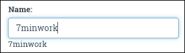

### 使用`ngModel`与选择

让我们看看选择是如何设置的：

```ts
<select . . . name="duration" [(ngModel)]="exercisePlan.duration"> 
    <option *ngFor="let duration of durations" [value]="duration.value">{{duration.title}}</option> 
</select> 

```

我们在这里使用`ngFor`来绑定到一个数组`durations`，它在`Workout`组件类中。数组看起来是这样的：

```ts
 [{ title: "15 seconds", value: 15 }, 
  { title: "30 seconds", value: 30 }, ...] 

```

`ngFor`组件将循环遍历数组，并使用插值将下拉框的值与数组中的相应值填充，每个项目的标题都使用插值显示--`{{duration.title}}`。然后`[(ngModel)]`将下拉框选择绑定到模型中的`exercisePlan.duration`。请注意，这里我们绑定到了嵌套模型：`ExercisePlan`。这是一个强大的功能，使我们能够创建具有嵌套模型的复杂表单，所有这些都可以使用`ngModel`进行数据绑定。

与输入框一样，选择也支持双向绑定。我们看到改变选择会更新模型，但是从模型到模板的绑定可能不太明显。为了验证模型到模板的绑定是否有效，请打开*7 分钟锻炼*应用程序并验证持续时间下拉框。每个下拉框的值都与模型值（30 秒）一致。

Angular 通过使用`ngModel`来保持模型和视图同步做得非常棒。改变模型，看到视图更新；改变视图，观察模型立即更新。

现在让我们给表单添加验证。

### 注意

该代码也可供所有人在 GitHub 上下载：[`github.com/chandermani/angular2byexample`](https://github.com/chandermani/angular2byexample)。检查点在 GitHub 上作为分支实现。要下载的分支如下：**GitHub 分支：checkpoint4.6**（文件夹 - `trainer`）。或者，如果您不使用 Git，请从以下 GitHub 位置下载 Checkpoint 4.6 的快照（ZIP 文件）：[`github.com/chandermani/angular2byexample/archive/checkpoint4.5.zip`](https://github.com/chandermani/angular2byexample/archive/checkpoint4.5.zip)。在首次设置快照时，请参考`trainer`文件夹中的`README.md`文件。再次强调，如果您正在与我们一起构建应用程序，请确保更新`app.css`文件，这里我们不讨论。

## Angular 验证

俗话说，“不要相信用户输入”。Angular 支持验证，包括标准的 required、min、max 和 pattern，以及自定义验证器。

## ngModel

`ngModel`是我们用来实现验证的基本组件。它为我们做了两件事：维护模型状态，并提供一种识别验证错误并显示验证消息的机制。

要开始，我们需要在所有需要验证的表单控件中将`ngModel`赋值给一个本地变量。在每种情况下，我们需要为这个本地变量使用一个唯一的名称。例如，对于锻炼名称，我们在该控件的`input`标签中添加`#name="ngModel"`。现在，锻炼名称的`input`标签应该是这样的：

```ts
<input type="text" name="workoutName" #name="ngModel" class="form-control" id="workout-name" placeholder="Enter workout name. Must be unique." [(ngModel)]="workout.name" required> 

```

继续通过表单，为每个输入将`ngModel`分配给本地变量。还为所有必填字段添加`required`属性。

### Angular 模型状态

每当我们使用`NgForm`时，表单中的每个元素，包括输入、文本区域和选择，都有与关联模型定义的一些状态。`ngModel`为我们跟踪这些状态。跟踪的状态有：

+   `原始的`：只要用户不与输入交互，这个值就是`true`。对`input`字段进行任何更新，`ng-pristine`就会被设置为`false`。

+   `脏的`：这是`ng-pristine`的相反。当输入数据已经更新时，这个值就是`true`。

+   `触摸的`：如果控件曾经获得焦点，这个值就是`true`。

+   `未触摸的`：如果控件从未失去焦点，这个值就是`true`。这只是`ng-touched`的相反。

+   `valid`：如果在`input`元素上定义了验证且它们都没有失败，则为`true`。

+   `invalid`：如果元素上定义的任何验证失败，则为`true`。

`pristine`\`dirty`或`touched`\`untouched`是有用的属性，可以帮助我们决定何时显示错误标签。

### Angular CSS 类

根据模型状态，Angular 会向输入元素添加一些 CSS 类。这些包括以下内容：

+   `ng-valid`：如果模型有效，则使用此项

+   `ng-invalid`：如果模型无效，则使用此项

+   `ng-pristine`：如果模型是原始的，则使用此项

+   `ng-dirty`：如果模型是脏的，则使用此项

+   `ng-untouched`：当输入从未被访问时使用此项

+   `ng-touched`：当输入获得焦点时使用此项

要验证它，返回到`workoutName`输入标签，并在`input`标签内部添加一个模板引用变量命名为`spy`：

```ts
<input type="text" name="workoutName" #name="ngModel" class="form-control" id="workout-name" placeholder="Enter workout name. Must be unique." [(ngModel)]="workout.name" required #spy> 

```

然后，在标签下面，添加以下标签：

```ts
<label>{{spy.className}}</label> 

```

重新加载应用程序，然后单击*Workout Builder*中的**New Workout**链接。在屏幕上什么都不触摸之前，您将看到以下内容显示：

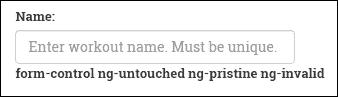

在**Name**输入框中添加一些内容并切换到其他地方。标签会变成这样：

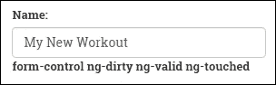

这里我们看到的是 Angular 随着用户与其交互而改变应用于该控件的 CSS 类。您还可以通过检查开发者控制台中的`input`元素来看到这些变化。

如果我们想要根据其状态向元素应用视觉提示，这些 CSS 类转换非常有用。例如，看一下这个片段：

```ts
input.ng-invalid {  border:2px solid red; } 

```

这会在任何具有无效数据的输入控件周围绘制红色边框。

当您向 Workout 页面添加更多验证时，您可以观察（在开发者控制台中）用户与`input`元素交互时这些类是如何添加和移除的。

现在我们已经了解了模型状态以及如何使用它们，让我们回到验证的讨论（在继续之前，删除您刚刚添加的变量名和标签）。

## 训练验证

需要对训练数据进行多种条件的验证。

在为我们的`input`字段添加`ngModel`的本地变量引用和必需属性之后，我们已经能够看到`ngModel`如何跟踪这些控件状态的变化以及如何切换 CSS 样式。

### 显示适当的验证消息

现在输入需要有一个值；否则，验证失败。但是我们如何知道验证失败了呢？`ngModel`在这里帮了我们。它可以提供特定输入的验证状态。这给了我们显示适当验证消息所需的内容。

让我们回到锻炼名称的输入控件。为了显示验证消息，我们必须首先修改输入标签如下：

```ts
<input type="text" name="workoutName" #name="ngModel" class="form-control" id="workout-name" placeholder="Enter workout name. Must be unique." [(ngModel)]="workout.name" required> 

```

我们已经添加了一个名为`#name`的本地变量，并将`ngModel`分配给它。这被称为模板引用变量，我们可以将其与以下标签一起使用，以显示输入的验证消息：

```ts
<label *ngIf="name.control.hasError('required') && (name.touched)" class="alert alert-danger validation-message">Name is required</label>  

```

我们在事件中显示验证消息，如果名称未提供**且**控件尚未被触摸。为了检查第一个条件，我们检索控件的`hasError`属性，并查看错误类型是否为`required`。我们检查名称输入是否已被`touched`，因为我们不希望在表单首次加载新锻炼时显示消息。

### 注意

您会注意到，我们在识别验证错误方面使用了一种更加冗长的风格，这比在这种情况下所需的要多。我们可以使用`name.control.hasError('required')`，但使用`!name. valid`也可以完美地工作。然而，使用更冗长的方法允许我们更具体地识别验证错误，这在我们开始向表单控件添加多个验证器时将是至关重要的。我们将在本章稍后看一下使用多个验证器。为了保持一致，我们将坚持使用更冗长的方法。

现在加载新的锻炼页面(`/builder/workouts/new`)。在名称输入框中输入一个值，然后删除它。错误标签将如下截图所示出现：

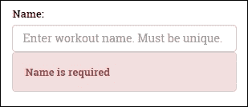

### 添加更多验证

Angular 提供了四个开箱即用的验证器：

+   `required`

+   `minLength`

+   `maxLength`

+   `pattern`

我们已经看到了`required`验证器的工作原理。现在让我们看看另外两个开箱即用的验证器：`minLength`和`maxLength`。除了使其必填外，我们希望锻炼的标题在 5 到 20 个字符之间（我们将在本章稍后看一下`pattern`验证器）。

因此，除了我们之前添加到标题输入框的 `required` 属性之外，我们还将添加 `minLength` 属性并将其设置为 `5`，并添加 `maxLength` 属性并将其设置为 `20`，如下所示：

```ts
<input type="text" . . . minlength="5" maxlength="20" required> 

```

然后，我们添加另一个标签，当此验证未满足时将显示消息：

```ts
<label *ngIf="(title.control.hasError('minlength') || title.control.hasError('maxlength')) && workout.title.length > 0" class="alert alert-danger validation-message">Title should be between 5 and 20 characters long.</label>  

```

### 管理多个验证消息

您将看到显示消息的条件现在测试长度不为零。这可以防止在控件被触摸但保持空白时显示消息。在这种情况下，标题必填消息应该显示。只有在字段中没有输入任何内容时，此消息才会显示，我们通过明确检查控件的 `hasError` 类型是否为 `required` 来实现这一点：

```ts
<label *ngIf="title.control.hasError('required')" class="alert alert-danger validation-message">Title is required.</label>

```

由于我们正在为此输入字段附加两个验证器，我们可以通过将两个验证器包装在一个检查该条件是否满足的 div 标签中来合并检查输入是否被触摸：

```ts
<div *ngIf="title.touched"> 
  . . . [the two validators] . . . 
</div> 

```

### 注意

我们刚刚展示了如何将多个验证附加到单个输入控件，并在验证条件不满足时显示适当的消息。然而，很明显，这种方法在更复杂的场景下不会“扩展”。一些输入包含许多验证，并且控制验证消息何时显示可能变得复杂。随着处理各种显示的表达式变得更加复杂，我们可能希望重构并将它们移入自定义指令中。如何创建自定义指令将在第六章中详细介绍，《深入解析 Angular 2 指令》。

#### 自定义验证消息用于练习

没有任何练习的锻炼是没有用的。锻炼中至少应该有一个练习，我们应该验证这一限制。

运动次数验证的问题在于它不是用户直接输入并由框架验证的内容。尽管如此，我们仍希望以类似于表单上其他验证的方式验证运动次数。

我们将在表单中添加一个包含练习计数的隐藏输入框。然后，我们将将其绑定到 `ngModel` 并添加一个模式验证器，以确保有多于一个练习。我们将设置输入框的值为练习的计数：

```ts
<input type="hidden" name="exerciseCount" #exerciseCount="ngModel" ngControl="exerciseCount" class="form-control" id="exercise-count" [(ngModel)]="workout.exercises.length" pattern="[1-9][0-9]*"> 

```

然后我们将为其附加一个类似于我们刚刚使用其他验证器的验证消息：

```ts
<label *ngIf="exerciseCount.control.hasError('pattern')" class="alert alert-danger extended-validation-message">The workout should have at least one exercise!</label>  

```

我们在这里并没有真正使用`ngModel`。这里没有涉及双向绑定。我们只对使用它进行自定义验证感兴趣。

打开新的 Workout 页面，添加一个练习，然后将其删除；我们应该看到错误：

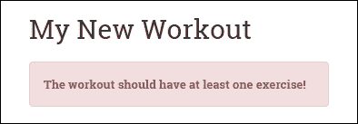

我们在这里所做的事情本来可以很容易地在不涉及任何模型验证基础设施的情况下完成。但是通过将我们的验证与该基础设施连接起来，我们确实获得了一些好处。现在，我们可以以一种一致和熟悉的方式确定特定模型的错误以及整个表单的错误。最重要的是，如果我们的验证在这里失败，整个表单将无效。

### 注意

实现自定义验证的方式通常不是您经常想要做的。相反，通常更合理的做法是在自定义指令中实现这种复杂逻辑。我们将在第六章中详细介绍创建自定义指令，*Angular 2 指令深入解析*。

我们新实现的`Exercise Count`验证的一个麻烦之处是，当新的`Workout`屏幕首次出现时会显示。对于这条消息，我们无法使用`ng-touched`来隐藏显示。这是因为练习是以编程方式添加的，并且我们使用来跟踪它们数量的隐藏输入在添加或删除练习时从未改变过未触摸状态。

为了解决这个问题，当练习列表的状态被减少到零时，我们需要一个额外的值来检查，除非表单首次加载。这种情况发生的唯一方式是用户添加然后从锻炼中删除练习，直到没有更多的练习为止。因此，我们将在组件中添加另一个属性，用于跟踪删除方法是否已被调用。我们称这个值为`removeTouched`，并将其初始值设置为`false`：

```ts
removeTouched: boolean = false; 

```

然后在删除方法中，我们将该值设置为`true`：

```ts
removeExercise(exercisePlan: ExercisePlan) { 
    this.removeTouched = true; 
    this.workoutBuilderService.removeExercise(exercisePlan); 
} 

```

接下来，我们将在验证消息条件中添加`removeTouched`，如下所示：

```ts
<label *ngIf="exerciseCount.control.hasError('pattern') && (removeTouched)" 

```

现在，当我们打开一个新的锻炼屏幕时，验证消息将不会显示。但是如果用户添加然后删除所有练习，那么它将显示。

为了理解模型验证如何转化为表单验证，我们需要了解表单级验证提供了什么。然而，甚至在此之前，我们需要实现保存锻炼并从锻炼表单中调用它。

## 保存锻炼

我们正在构建的锻炼需要被持久化（仅在内存中）。我们需要做的第一件事是扩展`WorkoutService`和`WorkoutBuilderService`。

`WorkoutService`需要两个新方法：`addWorkout`和`updateWorkout`：

```ts
addWorkout(workout: WorkoutPlan){ 
    if (workout.name){ 
        this.workouts.push(workout); 
        return workout; 
    } 
} 

updateWorkout(workout: WorkoutPlan){ 
    for (var i = 0; i < this.workouts.length; i++) { 
        if (this.workouts[i].name === workout.name) { 
            this.workouts[i] = workout; 
            break; 
        } 
    } 
} 

```

`addWorkout`方法对锻炼名称进行基本检查，然后将锻炼推入锻炼数组中。由于没有涉及后备存储，如果我们刷新页面，数据就会丢失。我们将在下一章中修复这个问题，将数据持久化到服务器。

`updateWorkout`方法在现有的锻炼数组中查找具有相同名称的锻炼，如果找到，则更新并替换它。

我们只向`WorkoutBuilderService`添加一个保存方法，因为我们已经在跟踪进行锻炼构建的上下文：

```ts
save(){ 
    let workout = this.newWorkout ? 
        this._workoutService.addWorkout(this.buildingWorkout) : 
        this._workoutService.updateWorkout(this.buildingWorkout); 
    this.newWorkout = false; 
    return workout; 
} 

```

`save`方法根据是创建新锻炼还是编辑现有锻炼，调用`Workout`服务中的`addWorkout`或`updateWorkout`方法。

从服务的角度来看，这应该足够了。是时候将保存锻炼的能力集成到`Workout`组件中，并了解更多关于表单指令的知识！

在更详细地查看`NgForm`之前，让我们向`Workout`添加保存方法，以便在单击“保存”按钮时保存锻炼。将以下代码添加到`Workout`组件中：

```ts
save(formWorkout:any){ 
    if (!formWorkout.valid) return; 
    this.workoutBuilderService.save(); 
    this.router.navigate(['/builder/workouts']); 
}  

```

我们使用其无效属性来检查表单的验证状态，然后如果表单状态有效，调用`WorkoutBuilderService.save`方法。

### 关于 NgForm 的更多信息

在 Angular 中，表单的角色与将数据提交到服务器的传统表单有所不同。如果我们回过头再看一下表单标签，我们会发现它缺少标准的 action 属性。表单指令上的`novalidate`属性告诉浏览器不要进行内置输入验证（这不是特定于 Angular 的，而是 HTML 5 属性）。

使用全页回传的标准表单行为在 Angular 这样的 SPA 框架中是没有意义的。在 Angular 中，所有服务器请求都是通过指令或服务发起的异步调用。

这里的表单扮演了不同的角色。当表单封装一组输入元素（例如输入、文本区域和选择）时，它提供了一个 API：

+   确定表单的状态，例如基于其输入控件的脏或原始状态

+   在表单或控件级别检查验证错误

### 注意

如果您仍希望使用标准表单行为，可以添加一个`ngNoForm`属性，但这肯定会导致整个页面刷新。当我们查看保存表单和实现验证时，我们将在本章稍后探讨`NgForm` API 的具体内容。

表单内的`FormControl`对象的状态由`NgForm`监视。如果其中任何一个无效，那么`NgForm`会将整个表单设置为无效。在这种情况下，我们已经能够使用`NgForm`确定一个或多个`FormControl`对象无效，因此整个表单的状态也是无效的。

在我们完成本章之前，让我们再看一个问题。

### 修复表单保存和验证消息

打开一个新的锻炼页面，直接单击**保存**按钮。由于表单无效，所以什么都没有保存，但是单个表单输入的验证根本不显示出来。现在很难知道是哪些元素导致了验证失败。这种行为背后的原因非常明显。如果我们看一下名称输入元素的错误消息绑定，它看起来是这样的：

```ts
*ngIf="name.control?.hasError('required') && name.touched"
```

请记住，在本章的早些时候，我们明确禁用了在用户触摸输入控件之前显示验证消息。同样的问题又回来找我们了，现在我们需要解决它。

我们没有办法明确地将控件的触摸状态更改为未触摸。相反，我们将采取一些小技巧来完成这项工作。我们将在`Workout`类定义的顶部引入一个名为`submitted`的新属性，并将其初始值设置为`false`，如下所示：

```ts
submitted: boolean = false;
```

变量将在单击“保存”按钮时设置为 true。通过添加突出显示的代码来更新保存实现：

```ts
save(formWorkout){ 
 **this.submitted = true;** 
    if (!formWorkout.valid) return; 
    this._workoutBuilderService.save(); 
    this.router.navigate(['/builder/workouts']); 
} 

```

尽管如此，这有什么帮助呢？好吧，这个修复的另一部分需要我们更改每个正在验证的控件的错误消息。表达式现在变成了：

```ts
*ngIf="name.control.hasError('required') && (name.touched || submitted)"   

```

通过这个修复，当控件被触摸或表单提交按钮被按下（`submitted`为`true`）时，错误消息将被显示。现在，这个表达式修复现在必须应用于每个验证消息，其中出现了检查。

如果我们现在打开新的**Workout**页面并点击**保存**按钮，我们应该能够在输入控件上看到所有的验证消息：

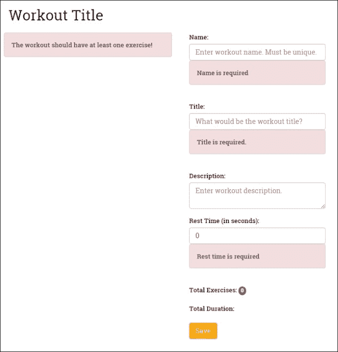

## 模型驱动表单

Angular 支持的另一种表单类型称为**模型驱动**表单。顾名思义，**模型驱动表单**从在组件类中构建的模型开始。通过这种方法，我们使用**表单构建器 API**在代码中创建一个表单并将其与模型关联起来。

鉴于我们必须编写的最少代码来使模板驱动表单工作，为什么以及何时应该考虑使用模型驱动表单？有几种情况下我们可能想要使用它们。这些情况包括我们想要以编程方式控制创建表单的情况。正如我们将看到的那样，这是特别有益的，当我们试图根据从服务器检索的数据动态创建表单控件时。

如果我们的验证变得复杂，通常更容易在代码中处理。使用模型驱动表单，我们可以将这种复杂的逻辑从 HTML 模板中剥离出来，使模板语法更简单。

模型驱动表单的另一个重要优势是，它使得对表单进行单元测试成为可能，而这在**模板驱动表单**中是不可能的。我们可以简单地在测试中实例化我们的表单控件，然后在页面上的标记之外对它们进行测试。

模型驱动表单使用了三个我们之前没有讨论过的新表单指令：`FormGroup`、`FormControl`和`FormArray`。这些指令允许在代码中构建的表单对象直接与模板中的 HTML 标记绑定。在组件类中创建的表单控件可以直接在表单中使用。从技术上讲，这意味着我们不需要在模型驱动表单中使用`ngModel`（这是模板驱动表单的一部分），尽管它可以使用。总体上，这种方法可以使模板更清洁、更简洁，更专注于驱动表单的代码。让我们开始构建一个模型驱动表单。

### 开始使用模型驱动表单。

我们将利用模型驱动表单来构建添加和编辑**练习**的表单。除其他外，该表单将允许用户添加 YouTube 上的练习视频链接。由于他们可以添加任意数量的视频链接，我们需要能够动态添加这些视频链接的控件。这个挑战将是模型驱动表单在开发更复杂表单时的有效性的一个很好的测试。这就是表单的样子：


要开始，请打开`workout-builder.module.ts`并添加以下`import`：

```ts
import { FormsModule, ReactiveFormsModule }   from '@angular/forms'; 
 ... 
@NgModule({ 
    imports: [ 
        CommonModule, 
        FormsModule, 
 **ReactiveFormsModule,** 
        SharedModule, 
        workoutBuilderRouting 
    ], 

```

`ReactiveFormsModule`包含了我们构建模型驱动表单所需的内容。

接下来，从`checkpoint 4.6`的`trainer/src/components`文件夹下的`workout-builder/builder-services`文件夹中复制`exercise-builder-service.ts`并将其导入到`workout-builder.module.ts`中：

```ts
import { ExerciseBuilderService } from "./builder-services/exercise-builder-service"; 

```

然后将其作为提供者添加到同一文件中的提供者数组中：

```ts
@NgModule({ 
   . . . 
    providers: [ 
 **ExerciseBuilderService,** 
        ExerciseGuard, 
        WorkoutBuilderService, 
        WorkoutGuard 
    ] 
}) 

```

### 注意

您会注意到我们还将`ExerciseGuard`添加为提供者。我们不会在这里涵盖它，但您也应该从`exercise`文件夹中复制它，并复制更新后的`workout-builder.routes.ts`，将其添加为导航到`ExerciseComponent`的路由守卫。

现在打开`exercise.component.ts`并在文件顶部添加以下导入语句：

```ts
import { Validators, FormArray, FormGroup, FormControl, FormBuilder } from '@angular/forms'; 

```

这将引入以下内容，我们将使用它来构建我们的表单：

+   `FormBuilder`

+   `FormGroup`

+   `FormControl`

+   `FormArray`

最后，我们将`FormBuilder`（以及`Router`，`ActivatedRoute`和`ExerciseBuilderService`）注入到我们类的构造函数中：

```ts
constructor( 
    public route: ActivatedRoute, 
    public router: Router, 
    public exerciseBuilderService:ExerciseBuilderService, 
    public formBuilder: FormBuilder 
){} 

```

完成这些初步步骤后，我们现在可以开始构建我们的表单了。

### 使用 FormBuilder API

`FormBuilder` API 是模型驱动表单的基础。您可以将其视为一个工厂，用于生产我们在代码中构建的表单。继续并将`ngOnInit`生命周期钩子添加到您的类中，如下所示：

```ts
ngOnInit():any{ 
    this.sub = this.route.params.subscribe(params => { 
        let exerciseName = params['id']; 
        if (exerciseName === 'new') { 
            exerciseName = ""; 
        } 
        this.exercise = this.exerciseBuilderService.startBuilding(exerciseName); 
    }); 
    this.buildExerciseForm(); 
} 

```

当`ngOnInit`触发时，它将调用一个用于构建我们的表单的方法（除了设置我们正在构建的练习）。因此，在组件生命周期的这个阶段，我们正在开始在代码中构建我们的表单的过程。

现在让我们通过添加以下代码来实现`buildExerciseForm`方法：

```ts
buildExerciseForm(){ 
    this.exerciseForm = this.formBuilder.group({ 
        'name': [this.exercise.name, [Validators.required, AlphaNumericValidator.invalidAlphaNumeric]], 
        'title': [this.exercise.title, Validators.required], 
        'description': [this.exercise.description, Validators.required], 
        'image': [this.exercise.image, Validators.required], 
        'nameSound': [this.exercise.nameSound], 
        'procedure': [this.exercise.procedure], 
        'videos': this.addVideoArray() 
    }) 
}  

```

让我们来看看这段代码。首先，我们使用注入的`FormBuilder`实例来构建表单，并将其分配给一个本地变量`exerciseForm`。使用`formBuilder.group`，我们向我们的表单添加了几个表单控件。我们通过简单的键/值映射添加了每一个：

```ts
'name': [this.exercise.name, Validators.required], 

```

映射的左侧是`FormControl`的名称，右侧是一个数组，其第一个元素是控件的值（在我们的情况下，是我们练习模型上对应的元素），第二个是验证器（在这种情况下是现成的必填验证器）。清晰明了！在模板外设置它们确实更容易看到和理解我们的表单控件。

我们不仅可以以这种方式在我们的表单中构建`FormControls`，还可以添加包含其中的`FormControls`的`FormControlGroups`和`FormControlArray`。这意味着我们可以创建包含嵌套输入控件的复杂表单。在我们的情况下，正如我们已经提到的，我们需要考虑用户向练习添加多个视频的可能性。我们可以通过添加以下代码来实现这一点：

```ts
'videos': this.addVideoArray() 

```

我们在这里做的是将一个`FormArray`分配给视频，这意味着我们可以在这个映射中分配多个控件。为了构建这个新的`FormArray`，我们在我们的类中添加了以下`addVideoArray`方法：

```ts
addVideoArray(){ 
    if(this.exercise.videos){ 
        this.exercise.videos.forEach((video : any) => { 
            this.videoArray.push(new FormControl(video, Validators.required)); 
        }); 
    } 
    return this.videoArray; 
} 

```

这个方法为每个视频构造一个`FormControl`；然后将每个视频添加到我们表单中的视频控件中的`FormArray`中。

### 将表单模型添加到我们的 HTML 视图

到目前为止，我们一直在我们的类中幕后工作来构建我们的表单。下一步是将我们的表单与视图连接起来。为此，我们使用了与我们在代码中构建表单时使用的相同控件：`formGroup`、`formControl`和`formArray`。

打开`exercise.component.html`并添加以下`form`标签：

```ts
<form [formGroup]="exerciseForm" (ngSubmit)="onSubmit(exerciseForm)" novalidate>  

```

在标签中，我们首先将我们刚刚在代码中构建的`exerciseForm`分配给`formGroup`。这建立了我们编码模型与视图中表单之间的连接。我们还将`ngSubmit`事件与我们代码中的`onSubmit`方法连接起来（稍后我们将讨论这个方法）。最后，我们使用`novalidate`关闭浏览器的表单验证。

### 向我们的表单输入添加表单控件

接下来，我们开始构建表单的输入。我们将从我们的练习名称输入开始：

```ts
<input name="name" formControlName="name" class="form-control" id="name" placeholder="Enter exercise name. Must be unique.">  

```

我们将我们编码的表单控件的名称分配给`formControlName`。这在我们的代码中的控件与标记中的`input`字段之间建立了链接。这里的另一个有趣的地方是我们不使用`required`属性。

### 添加验证

我们接下来要做的事情是向控件添加一个验证消息，以在验证错误发生时显示：

```ts
<label *ngIf="exerciseForm.controls.name.hasError('required') && (exerciseForm.controls.name.touched || submitted)" class="alert alert-danger validation-message">Name is required</label>  

```

请注意，这个标记与我们在模板驱动表单中用于验证的标记非常相似，只是用于识别控件的语法有点更冗长。同样，它检查控件的`hasError`属性的状态，以确保它是有效的。

但等一下！我们如何验证这个输入？我们不是已经从标签中删除了`required`属性吗？这就是我们在代码中添加的控件映射发挥作用的地方。如果你回顾一下表单模型的代码，你会看到以下映射适用于`name`控件：

```ts
'name': [this.exercise.name, Validators.required], 

```

映射数组中的第二个元素将必填验证器分配给名称表单控件。这意味着我们不必在模板中添加任何内容；相反，表单控件本身附加到了具有必填验证器的模板。在我们的代码中添加验证器的能力使我们能够方便地在模板之外添加验证器。当涉及编写具有复杂逻辑的自定义验证器时，这是特别有用的。

### 添加动态表单控件

正如我们之前提到的，我们正在构建的**练习**表单要求我们允许用户向练习中添加一个或多个视频。由于我们不知道用户可能想要添加多少个视频，我们将不得不在用户点击**添加视频**按钮时动态构建这些视频的`input`字段。它将是这样的：

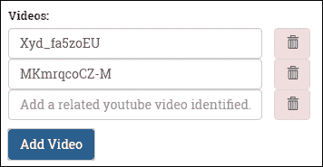

我们已经在组件类中看到了用于执行此操作的代码。现在让我们看看它是如何在我们的模板中实现的。

我们首先使用`ngFor`循环遍历我们的视频列表。然后我们将视频的索引分配给一个本地变量`i`。到目前为止没有什么意外的：

```ts
<div *ngFor="let video of videoArray.controls; let i=index" class="form-group">
```

在循环内部，我们做三件事。首先，我们添加一个按钮，允许用户删除视频：

```ts
<button type="button" (click)="deleteVideo(i)"  class="btn alert-danger pull-right"> 
    <span class="glyphicon glyphicon-trash text-danger"></span> 
</button>  

```

我们将组件类中的`deleteVideo`方法绑定到按钮的`click`事件，并将视频的索引传递给它。

接下来，我们为每个当前练习中的视频动态添加一个视频`input`字段：

```ts
<input type="text" class="form-control" [formControlName]="i" placeholder="Add a related youtube video identified."/> 

```

然后为每个视频`input`字段添加验证消息。

```ts
<label *ngIf="exerciseForm.controls['videos'].controls[i].hasError('required') && (exerciseForm.controls['videos'].controls[i].touched || submitted)" class="alert alert-danger validation-message">Video identifier is required</label>  

```

验证消息遵循本章其他地方使用的显示消息的相同模式。我们深入到`exerciseFormControls`组中，通过其索引找到特定的控件。再次，语法冗长但足够容易理解。

### 保存表单

构建模型驱动表单的最后一步是处理保存表单。当我们之前构建表单标签时，我们将`ngSubmit`事件绑定到我们代码中的以下`onSubmit`方法：

```ts
onSubmit(formExercise:FormGroup){ 
    this.submitted = true; 
    if (!formExercise.valid) return; 
    this.mapFormValues(formExercise); 
    this.exerciseBuilderService.save(); 
    this.router.navigate(['/builder/exercises']); 
} 

```

这种方法将`submitted`设置为`true`，这将触发显示任何可能之前因为表单未被触摸而被隐藏的验证消息。如果表单上有任何验证错误，它也会返回而不保存。如果没有错误，它将调用以下`mapFormValues`方法，该方法将表单中的值分配给将要保存的`exercise`：

```ts
mapFormValues(form: FormGroup){ 
    this.exercise.name = form.controls['name'].value; 
    this.exercise.title = form.controls['title'].value; 
    this.exercise.description = form.controls['description'].value; 
    this.exercise.image = form.controls['image'].value; 
    this.exercise.nameSound = form.controls['nameSound'].value; 
    this.exercise.procedure = form.controls['procedure'].value; 
    this.exercise.videos = form.controls['videos'].value; 
} 

```

然后调用`ExerciseBuilderService`中的保存方法，并将用户路由回练习列表屏幕（请记住，任何新练习都不会显示在该列表中，因为我们尚未在应用程序中实现数据持久性）。

我们希望这一点很清楚；当我们试图构建更复杂的表单时，模型驱动的表单提供了许多优势。它们允许将编程逻辑从模板中移除。它们允许以编程方式向表单添加验证器。它们支持在运行时动态构建表单。

### 自定义验证器

现在在我们结束本章之前，让我们再看一件事。任何在构建 Web 表单（无论是在 Angular 还是其他 Web 技术中）上工作过的人都知道，我们经常被要求创建特定于我们正在构建的应用程序的验证。Angular 为我们提供了灵活性，通过构建自定义验证器来增强我们的模型驱动表单验证。

在构建我们的练习表单时，我们需要确保输入的内容，因为名称只包含字母数字字符，不包含空格。这是因为当我们开始将练习存储在远程数据存储中时，我们将使用练习的名称作为其键。因此，除了标准的必填字段验证器之外，让我们构建另一个验证器，以确保输入的名称只是字母数字形式。

创建自定义控件非常简单。在其最简单的形式中，Angular 自定义验证器是一个函数，它以控件作为输入参数，运行验证检查，并返回 true 或 false。所以让我们首先添加一个名为`alphanumeric-validator.ts`的 TypeScript 文件。在该文件中，首先从`@angular/forms`中导入`FormControl`；然后将以下类添加到该文件中：

```ts
export class AlphaNumericValidator { 
    static invalidAlphaNumeric(control: FormControl):{ [key:string]:boolean } { 
        if ( control.value.length && !control.value.match(/^[a-z0-9]+$/i) ){ 
            return {invalidAlphaNumeric: true }; 
        } 
        return null; 
    } 
} 

```

代码遵循了我们刚提到的创建验证器的模式。唯一可能有点令人惊讶的是，当验证失败时它返回 true！只要你清楚了这个怪癖，你应该没有问题编写自己的自定义验证器。

### 将自定义验证器整合到我们的表单中

那么我们如何将我们的自定义验证器插入到我们的表单中呢？如果我们使用模型驱动表单，答案非常简单。当我们在代码中构建我们的表单时，我们就像添加内置验证器一样添加它。让我们这样做。打开`exercise.component.ts`并首先为我们的自定义验证器添加一个导入：

```ts
import {AlphaNumericValidator} from "./alphanumeric-validator"; 

```

然后，修改表单构建器代码，将验证器添加到`name`控件中：

```ts
buildExerciseForm(){ 
    this.exerciseForm = this._formBuilder.group({ 
'name': [this.exercise.name, [Validators.required, AlphaNumericValidator.invalidAlphaNumeric]], 
  . . . [other form controls] . . . 
    }); 
} 

```

由于名称控件已经有一个必填验证器，我们使用一个包含两个验证器的数组将`AlphaNumericValidator`作为第二个验证器添加进去。该数组可用于向控件添加任意数量的验证器。

最后一步是将控件的适当验证消息整合到我们的模板中。打开`workout.component.html`并在显示必填验证器消息的标签下方添加以下标签：

```ts
<label *ngIf="exerciseForm.controls.name.hasError('invalidAlphaNumeric') && (exerciseForm.controls.name.touched || submitted)" class="alert alert-danger validation-message">Name must be alphanumeric</label>  

```

运动屏幕现在将显示一个验证消息，如果在名称输入框中输入了非字母数字值：

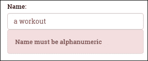

正如我们希望您所看到的，模型驱动表单使我们能够以一种简单的方式向我们的表单添加自定义验证器，这样我们就可以在我们的代码中保持验证逻辑，并轻松地将其集成到我们的模板中。

### 注意

您可能已经注意到，在本章中，我们还没有涵盖如何在模板驱动表单中使用自定义验证器。这是因为实现它们需要额外的步骤来构建自定义指令。我们将在第六章中进行介绍，*深入了解 Angular 2 指令*。

# 总结

现在我们有了一个*个人教练*应用程序。将特定的*7 分钟训练*应用程序转换为通用的*个人教练*应用程序的过程帮助我们学习了许多新概念。

我们通过定义新的应用程序要求开始了本章。然后，我们将模型设计为一个共享服务。

我们为*个人教练*应用程序定义了一些新视图和相应的路由。我们还使用了子路由和异步路由，将*训练构建器*与应用程序的其余部分分开。

然后，我们将重点转向训练构建。本章的主要技术重点之一是 Angular 表单。*训练构建器*使用了许多表单输入元素，我们使用了模板驱动和模型驱动的形式实现了许多常见的表单场景。我们还深入探讨了 Angular 验证，并实现了自定义验证器。

接下来的章节将全面讨论客户端-服务器交互。我们创建的训练和练习需要被持久化。在下一章中，我们将构建一个持久化层，这将允许我们在服务器上保存训练和练习数据。

在结束本章之前，这里有一个友好的提醒。如果您还没有完成*个人教练*的练习构建例程，请继续完成。您可以随时将您的实现与伴随代码库中提供的内容进行比较。您还可以添加一些原始实现中没有的内容，比如为练习图片上传文件，以及一旦您更熟悉客户端-服务器交互，就可以进行远程检查，以确定 YouTube 视频是否真实存在。
