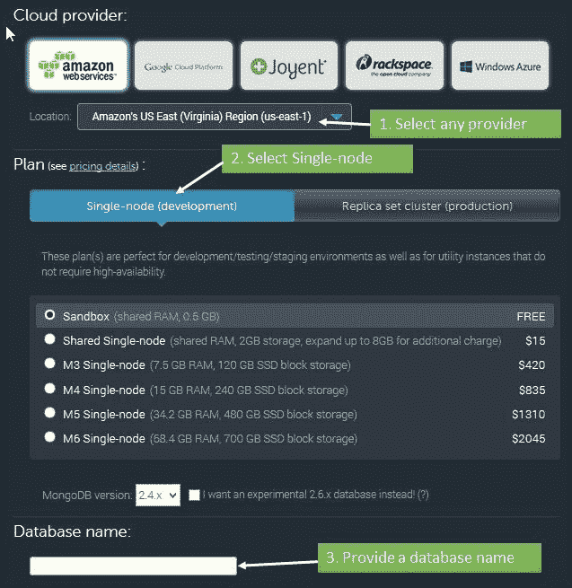
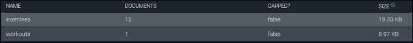
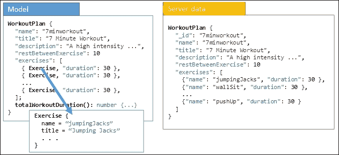
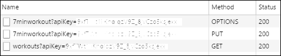
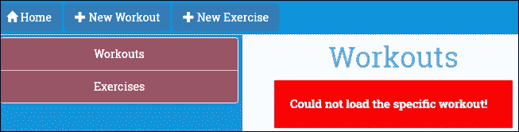

# 第五章：支持服务器数据持久性

现在是时候和服务器交流了！创建锻炼，添加锻炼，并保存它，然后发现所有努力都白费，因为数据没有持久化，这样就没有乐趣了。我们需要解决这个问题。

很少有应用程序是自包含的。无论大小如何，任何消费者应用程序都有与其边界之外的元素交互的部分。对于基于 Web 的应用程序，交互主要是与服务器进行的。应用程序与服务器交互以进行身份验证、授权、存储/检索数据、验证数据以及执行其他此类操作。

本章探讨了 Angular 为客户端-服务器交互提供的构造。在这个过程中，我们为“个人健身教练”添加了一个持久层，用于将数据加载和保存到后端服务器。

本章涵盖的主题包括以下内容：

+   **配置后端以持久化锻炼数据**：我们设置了一个 MongoLab 账户，并使用其数据 API 来访问和存储锻炼数据。

+   **理解 Angular HTTP 客户端库**：HTTP 客户端库允许我们通过 HTTP 与服务器进行交互。您将学习如何使用 HTTP 客户端库的`XMLHttpRequest`类进行各种类型的`GET`、`POST`、`PUT`和`DELETE`请求。

+   **实现锻炼数据的加载和保存**：我们使用 HTTP 模块在 MongoLab 数据库中加载和存储锻炼数据。

+   **我们可以使用 HTTP 模块的 XMLHttpRequest 的两种方式**：使用 Observables 或 promises。

+   **使用 RxJS 和 Observables**：订阅和查询数据流。

+   **使用 promises**：在本章中，我们将看到如何在 HTTP 调用和响应中使用 promises。

+   **处理跨域访问**：由于我们与不同域中的 MongoLab 服务器进行交互，您将了解浏览器对跨域访问的限制。您还将了解 JSONP 和 CORS 如何帮助我们轻松实现跨域访问，以及关于 Angular JSONP 支持的内容。

让我们开始吧。

# Angular 和服务器交互

任何客户端-服务器交互通常归结为向服务器发送 HTTP 请求并从服务器接收响应。对于重型 JavaScript 应用程序，我们依赖 AJAX 请求/响应机制与服务器进行通信。为了支持基于 AJAX 的通信，Angular 提供了 Angular HTTP 模块。在我们深入研究 HTTP 模块之前，我们需要设置存储数据并允许我们管理数据的服务器平台。

## 设置持久性存储

为了数据持久性，我们使用一个名为 MongoDB 的文档数据库（[`www.mongodb.org/`](https://www.mongodb.org/)），托管在 MongoLab 上（[`mongolab.com/`](https://mongolab.com/)），作为我们的数据存储。我们选择 MongoLab 的原因是它提供了一个直接与数据库交互的接口。这样可以省去我们设置服务器中间件来支持 MongoDB 交互的工作。

### 注意

直接将数据存储/数据库暴露给客户端从来都不是一个好主意。但在这种情况下，由于我们的主要目标是学习 Angular 和客户端-服务器交互，我们冒了这个风险并直接访问了托管在 MongoLab 中的 MongoDB 实例。还有一种新型应用程序是建立在**noBackend**解决方案之上的。在这样的设置中，前端开发人员构建应用程序而不知道确切的后端涉及。服务器交互仅限于向后端发出 API 调用。如果您对这些 noBackend 解决方案感兴趣，可以查看[`nobackend.org/`](http://nobackend.org/)。

我们的第一个任务是在 MongoLab 上配置一个账户并创建一个数据库：

1.  前往[`mongolab.com`](https://mongolab.com)并按照网站上的说明注册一个 MongoLab 账户。

1.  一旦账户被配置，登录并点击主页上的**创建新**按钮来创建一个新的 Mongo 数据库。

1.  在数据库创建界面，您需要进行一些选择来配置数据库。请参考以下截图来选择免费的数据库层和其他选项：

1.  创建数据库并记下您创建的数据库名称。

1.  一旦数据库被配置，打开数据库并从**集合**选项卡中向其中添加两个集合：

+   `exercises`：这个集合存储所有*个人教练*的练习

+   `workouts`：这个集合存储所有*个人教练*的锻炼

在 MongoDB 世界中，集合相当于数据库表。

### 注意

MongoDB 属于一类称为**文档数据库**的数据库。这里的中心概念是文档、属性和它们的链接。与传统数据库不同，模式并不是固定的。我们不会在本书中涵盖文档数据库是什么以及如何为基于文档的存储执行数据建模。*个人健身教练*有一个有限的存储需求，我们使用前面提到的两个文档集合来管理它。我们甚至可能并没有真正使用文档数据库。

一旦集合被添加，从**用户**选项卡将自己添加为数据库的用户。

下一步是确定 MongoLab 账户的 API 密钥。配置的 API 密钥必须附加到发送到 MongoLab 的每个请求中。要获取 API 密钥，请执行以下步骤：

1.  点击右上角的用户名（而不是账户名）以打开用户配置文件。

1.  在标题为**API 密钥**的部分，显示当前的 API 密钥；复制它。同时，点击 API 密钥下面的按钮以启用数据 API 访问。这是默认禁用的。

数据存储模式已经完成。现在我们需要种子化这些集合。

## 种子化数据库

*个人健身教练*应用程序已经有一个预定义的锻炼和一个包含 12 个练习的列表。我们需要用这些数据来种子化集合。

从伴随代码库的`chapter5/checkpoint1/trainer/db`中打开`seed.js`。它包含种子 JSON 脚本和有关如何将数据种子化到 MongoLab 数据库实例的详细说明。

数据库一旦被种子化，工作集合中将有一个锻炼，而练习集合中将有 12 个练习。在 MongoLab 网站上验证这一点；集合应该显示如下：



现在一切都已设置好，让我们开始讨论 HTTP 模块，并为*个人健身教练*应用程序实现锻炼/练习持久化。

# HTTP 模块的基础知识

HTTP 模块的核心是 HTTP 客户端。它使用`XMLHttpRequest`作为默认后端执行 HTTP 请求（本章后面我们将看到也可以使用 JSONP）。它支持诸如`GET`、`POST`、`PUT`和`DELETE`等请求。在本章中，我们将使用 HTTP 客户端来进行所有这些类型的请求。正如我们将看到的，HTTP 客户端使得以最少的设置和复杂性轻松进行这些调用。如果之前有使用过 Angular 或构建过与后端数据存储通信的 JavaScript 应用程序的人，这些术语都不会让人感到意外。

然而，Angular 处理 HTTP 请求的方式发生了重大变化。现在调用请求会返回一个 HTTP 响应的 Observable。它通过使用**RxJS**库来实现，这是一个众所周知的异步 Observable 模式的开源实现。

### 注意

您可以在 GitHub 上找到 RxJS 项目，网址为[`github.com/Reactive-Extensions/RxJS`](https://github.com/Reactive-Extensions/RxJS)。该网站显示该项目正在由微软与一群开源开发人员共同开发。我们在这里不会详细介绍异步 Observable 模式，并鼓励您访问该网站了解更多关于该模式以及 RxJS 如何实现它的信息。Angular 使用的 RxJS 版本是 beta 5。

简单来说，使用 Observables 允许开发人员将应用程序中流动的数据视为信息流，应用程序可以随时获取并使用。这些流随时间变化，这使得应用程序可以对这些变化做出反应。Observables 的这种特性为**函数式响应式编程**（**FRP**）提供了基础，从而从命令式转变为响应式构建 Web 应用程序的范式。

`RxJS`库提供了操作符，允许您订阅和查询这些数据流。此外，您可以轻松地混合和组合它们，正如我们将在本章中看到的。Observables 的另一个优势是它很容易取消订阅，使得可以无缝处理内联错误。

虽然仍然可以使用 promises，但 Angular 的默认方法使用 Observables。本章中我们也会介绍 promises。

# 个人教练和服务器集成

如前一节所述，客户端-服务器交互完全是关于异步性。当我们修改我们的*个人健身教练*应用程序以从服务器加载数据时，这种模式变得不言自明。

在上一章中，锻炼和练习的初始集合是在`WorkoutService`实现中硬编码的。让我们先看看如何从服务器加载这些数据。

## 加载练习和锻炼数据

在本章的前面，我们使用数据表单`seed.js`文件向数据库中添加了数据。现在我们需要在视图中呈现这些数据。MongoLab 数据 API 将在这方面帮助我们。

### 注意

MongoLab 数据 API 使用 API 密钥来验证访问请求。对 MongoLab 端点发出的每个请求都需要具有查询字符串参数`apikey=<key>`，其中`key`是我们在本章前面提供的 API 密钥。请记住，密钥始终提供给用户并与其帐户关联。避免与他人分享您的 API 密钥。

API 遵循可预测的模式来查询和更新数据。对于任何 MongoDB 集合，典型的端点访问模式是以下之一（这里给出的是基本 URL：[`api.mongolab.com/api/1/databases`](https://api.mongolab.com/api/1/databases)）：

+   `/<dbname>/collections/<name>?apiKey=<key>`：这有以下请求：

+   `GET`: 这个操作获取给定集合名称中的所有对象。

+   `POST`: 这个操作将新对象添加到集合名称中。MongoLab 有一个`_id`属性，用于唯一标识文档（对象）。如果在发布的数据中未提供，则会自动生成。

+   `/<dbname>/collections/<name>/<id>?apiKey=<key>`：这有以下请求：

+   `GET`: 这会获取集合名称中具有特定 ID 的特定文档/集合项目（在`_id`属性上进行匹配）。

+   `PUT`: 这会更新集合名称中特定项目（`id`）。

+   `DELETE`: 这会从集合名称中删除具有特定 ID 的项目。

### 注意

有关数据 API 接口的更多详细信息，请访问 MongoLab 数据 API 文档[`docs.mongolab.com/data-api`](http://docs.mongolab.com/data-api)。

现在我们有能力开始实现练习/锻炼列表页面了。

### 注意

我们在本章开始时使用的代码是 GitHub 存储库中的`checkpoint 4.6`（文件夹：`trainer`）。它可以在 GitHub 上找到（[`github.com/chandermani/angular2byexample`](https://github.com/chandermani/angular2byexample)）。检查点在 GitHub 中作为分支实现。如果您不使用 Git，请从以下 GitHub 位置下载 Checkpoint 4.6 的快照（ZIP 文件）：[`github.com/chandermani/angular2byexample/tree/checkpoint4.6`](https://github.com/chandermani/angular2byexample/tree/checkpoint4.6)。在第一次设置快照时，请参考`trainer`文件夹中的`README.md`文件。

## 从服务器加载练习和锻炼列表

为了从 MongoLab 数据库中获取练习和锻炼列表，我们必须重写我们的`WorkoutService`服务方法：`getExercises`和`getWorkouts`。但在我们这样做之前，我们必须设置我们的服务以与 Angular 的 HTTP 模块一起工作。

### 将 HTTP 模块和 RxJS 添加到我们的项目中

Angular 的 HTTP 模块已经包含在您已经安装的 Angular bundles 中。要使用它，我们需要将其导入到`app.module.ts`中，如下所示：

```ts
import { HttpModule } from '@angular/http'; 
. . . 
@NgModule({ 
  imports: [ 
. . . 
    HttpModule, 
. . . 
})

```

我们还需要一个外部第三方库：**JavaScript 的 Reactive Extensions**（**RxJS**）。RxJS 实现了 Observable 模式，并且被 Angular 与 HTTP 模块一起使用。它已经包含在我们项目中的 Angular bundles 中。

### 更新 workout-service 以使用 HTTP 模块和 RxJS

现在，从`trainer/src/services`中打开`workout-service.ts`。为了在`WorkoutService`中使用 HTTP 模块和 RxJS，我们需要在该文件中添加以下导入：

```ts
import { Http, Response } from '@angular/http'; 
import { Observable } from 'rxjs/Observable'; 
import 'rxjs/add/operator/map'; 
import 'rxjs/add/operator/catch';

```

我们从 HTTP 模块中导入 HTTP 和 Response，以及从 RxJS 导入`Observable`和另外两个 RxJS 操作符：`map`和`catch`。当我们在本节中处理代码时，我们将看到这些操作符是如何使用的。

在类定义中，添加以下属性，其中包括一个锻炼属性和设置我们 Mongo 数据库中集合的 URL 以及该数据库的密钥的属性，以及另一个属性：`params`，它将 API 密钥设置为 API 访问的查询字符串：

```ts
workout: WorkoutPlan; 
collectionsUrl = "https://api.mongolab.com/api/1/databases/<dbname>/collections"; 
apiKey = <key> 
params = '?apiKey=' + this._apiKey; 

```

我们将`<dbname>`和`<key>`标记替换为我们在本章前面提供的数据库名称和 API 密钥。

接下来，使用以下代码将 HTTP 模块注入到`WorkoutServiceconstructor`中：

```ts
constructor(public http: Http) {
}

```

然后将`getExercises()`方法更改为：

```ts
getExercises(){ 
    return this.http.get(this.collectionsUrl + '/exercises' + this.params)
        .map((res: Response) => <Exercise[]>res.json()) 
        .catch(WorkoutService.handleError); 
}

```

如果你习惯于使用 Promise 进行异步数据操作，你在这里看到的将会有所不同。我们没有一个 Promise，然后链接到它的`then()`调用，我们期望异步接收返回的数据，而是有一个`map()`方法。

根据 Angular 文档（[`angular.io/docs/ts/latest/guide/server-communication.html`](https://angular.io/docs/ts/latest/guide/server-communication.html)），这里发生的是`http.get`方法从 RxJS 库返回一个 HTTP 响应的 Observable（`Observable<Response>`）。

### 注意

当使用 HTTP 模块的`get`方法时，返回 Observable 是默认的响应。然而，Observable 可以转换为 Promise。并且，正如我们将在本章后面看到的，还存在返回 JSONP 的选项。

我们在代码中看到的`map`方法是我们之前导入的`RxJS`库中包含的 RxJS 操作符。这里需要它，因为从远程服务器检索到的内容不符合我们应用程序所需的形式。正如你所看到的，我们使用`json()`方法将响应体`response`转换为 JavaScript 对象。

### 注意

Angular 文档还明确指出，我们不应该将`Observable<Response>`响应对象返回给调用此方法的组件。相反，我们应该隐藏数据访问操作的细节，不让应用程序的其他部分知道。这样，我们可以在需要时更改这些操作，而不必修改应用程序中的其他代码。

在我们继续之前，这段代码还有一件事要提及。Observable 还有一个`catch`操作符，接受一个名为`handleError`的方法来处理失败的响应。`handleError`方法将失败的响应作为参数。目前，我们将遵循文档中为这个`handleError`方法制定的相同方法。我们将错误记录到控制台，并使用`Observable.throw`将 JSON 错误转换为用户友好的消息，然后返回：

```ts
static handleError (error: Response) { 
    console.error(error); 
    return Observable.throw(error.json().error || 'Server error'); 
}

```

明确一点，这不是生产代码，但它将给我们一个机会展示如何编写上游代码来处理作为数据访问的一部分生成的错误。

### 注意

重要的是要理解，在这个阶段，我们的 Observable 被称为*冷*。这意味着在订阅之前，没有数据流经它。如果你不小心添加订阅到你的 Observables 中，这可能会带来一些意外的情况，比如添加和更新。

### 修改`getWorkouts()`以使用 HTTP 模块

检索锻炼的代码变化几乎与练习的代码变化相同。

```ts
getWorkouts(){ 
    return this.http.get(this.collectionsUrl + '/workouts' + this.params) 
        .map((res:Response) => <WorkoutPlan[]>res.json()) 
        .catch(WorkoutService.handleError); 
}

```

现在`getExercises`和`getWorkouts`方法已经更新，我们需要确保它们能够与上游调用方一起工作。

## 更新锻炼/练习列表页面

练习和锻炼列表页面（以及`LeftNavExercises`）调用`model.ts`中的`getExercises`或`getWorkouts`方法。为了使它们能够与现在使用 HTTP 模块进行的远程调用一起工作，我们需要修改这些调用，订阅由 HTTP 模块返回的 Observable。因此，更新`exercises.component.ts`中的`ngOnInit`方法的代码如下：

```ts
ngOnInit() { 
    this.workoutService.getExercises() 
        .subscribe( 
            exerciseList=> { 
                this.exerciseList = exerciseList; 
            }, 
            (err: any) => console.error(err) 
        ); 
}

```

我们的方法现在订阅了`getExercises`方法返回的 Observable；在响应到达时，它将结果分配给`exerciseList`。如果有错误，它将分配给`console.error`调用，显示控制台中的错误。所有这些现在都是使用 HTTP 模块和 RxJS 异步处理的。

继续对`workouts.component.ts`和`left-nav-exercises.component.ts`中的`ngOnInit`方法进行类似的更改。

刷新锻炼/练习列表页面，锻炼和练习数据将从数据库服务器加载。

### 注意

如果在检索/显示数据时遇到困难，请查看 GitHub 存储库中检查点 5.1 的完整实现。请注意，在此检查点中，我们已禁用了导航链接到锻炼和练习屏幕，因为我们仍然需要为它们添加 Observable 实现。我们将在下一节中进行。在运行来自检查点 5.1 的代码之前，请记得替换数据库名称和 API 密钥。如果您不使用 Git，请从以下 GitHub 位置下载检查点 5.1 的快照（ZIP 文件）：[`github.com/chandermani/angular2byexample/tree/checkpoint5.1`](https://github.com/chandermani/angular2byexample/tree/checkpoint5.1)。在首次设置快照时，请参考`trainer`文件夹中的`README.md`文件。

看起来不错，列表加载正常。嗯，几乎！锻炼列表页面有一个小故障。如果我们仔细观察任何列表项（实际上只有一个），我们可以很容易地发现它：


锻炼持续时间的计算不再起作用！原因是什么？我们需要回顾这些计算是如何实现的。`WorkoutPlan`服务（在`model.ts`中）定义了一个`totalWorkoutDuration`方法来进行这些计算。

区别在于绑定到视图的锻炼数组。在上一章中，我们使用`WorkoutPlan`服务创建了包含模型对象的数组。但是现在，由于我们正在从服务器检索数据，我们将一个简单的 JavaScript 对象数组绑定到视图，这是因为明显的原因没有计算逻辑。

我们可以通过将服务器响应映射到我们的模型类对象并将它们返回给任何上游调用者来解决这个问题。

## 将服务器数据映射到应用程序模型

如果模型和服务器存储定义匹配，那么将服务器数据映射到我们的模型和反之亦然可能是不必要的。如果我们查看`Exercise`模型类和我们在 MongoLab 中为练习添加的种子数据，我们会发现它们是匹配的，因此映射变得不必要。

如果以下情况成立，则将服务器响应映射到模型数据变得必要：

+   我们的模型定义了任何方法

+   存储的模型与其在代码中的表示不同

+   相同的模型类用于表示来自不同来源的数据（这可能发生在混搭中，我们从不同的来源获取数据）

`WorkoutPlan`服务是模型表示和存储之间阻抗不匹配的一个典型例子。查看以下屏幕截图以了解这些差异：



模型和服务器数据之间的两个主要差异如下：

+   模型定义了`totalWorkoutDuration`方法。

+   “练习”数组的表示也不同。模型的“练习”数组包含完整的`Exercise`对象，而服务器数据只存储练习标识符或名称。

这显然意味着加载和保存锻炼需要模型映射。

我们将通过添加第二个映射来实现这一点，进一步转换 Observable 响应对象。到目前为止，我们只是将响应转换为一个普通的 JavaScript 对象。好处是，我们刚刚使用的 map 请求也返回一个 Observable，这允许我们链接另一个 map 请求，将 JSON 对象转换为`WorkoutPlan`类型。

让我们在`workout-service.ts`文件中重写`getWorkouts`方法，以添加第二个映射：

```ts
getWorkouts() { 
    return this.http.get(this.collectionsUrl + '/workouts' + this.params) 
        .map((res:Response) => <WorkoutPlan[]>res.json()) 
        .map((workouts:Array<any>) => { 
            let result:Array<WorkoutPlan> = []; 
            if (workouts) { 
                workouts.forEach((workout) => { 
                    result.push( 
                        new WorkoutPlan( 
                            workout.name, 
                            workout.title, 
                            workout.restBetweenExercise, 
                            workout.exercises, 
                            workout.description 
                        )); 
                }); 
            } 

            return result; 
        }) 
        .catch(WorkoutService.handleError); 
}

```

与以前一样，我们的第一个映射将响应 Observable 转换为由 JavaScript 对象数组组成的 Observable。然后，第二个映射将这个 Observable 转换为由`WorkoutPlan`对象组成的 Observable。每个`WorkoutPlan`对象（目前我们只有一个）将具有我们需要的`totalWorkoutDuration`方法。

查看第二个映射的代码，您可以看到我们是如何操作第一个方法的 JSON 结果的，这就是为什么我们使用了`<any>`类型。然后我们创建了一个`WorkoutPlans`的类型数组，并使用一个箭头函数`forEach`来遍历第一个数组，将每个 JavaScript 对象分配给一个`WorkoutPlan`对象。

我们将这些映射的结果返回给订阅它们的调用者，在这种情况下是`workouts.component.ts`。调用者不需要对他们用来订阅我们的 workouts Observable 的代码进行任何更改。相反，模型映射可以在应用程序的一个地方进行，然后在整个应用程序中使用。

如果重新运行应用程序，您将看到总秒数现在正确显示了：


### 注意

GitHub 存储库中的检查点 5.2 包含了我们迄今为止所涵盖的工作实现。GitHub 分支是`checkpoint5.2`（文件夹：`trainer`）。

## 从服务器加载练习和锻炼数据

就像我们之前在`WorkoutService`中修复了`getWorkouts`的实现一样，我们可以为与练习和锻炼相关的其他获取操作实现`WorkoutService`的`getExercise`和`getWorkout`方法。从检查点 5.2 中的`trainer/src/components/workout-builder`文件夹中的`workout-builder.component.ts`复制`WorkoutService`的服务实现。

### 注意

`getWorkout`和`getExercise`方法使用训练/练习的名称来检索结果。每个 MongoLab 集合项都有一个`_id`属性，用于唯一标识该项/实体。对于我们的`Exercise`和`WorkoutPlan`对象，我们使用练习的名称进行唯一标识。因此，每个对象的`name`和`_id`属性始终匹配。

在这一点上，我们需要在`workout-service.ts`中添加一个额外的导入：

```ts
import 'rxjs/add/observable/forkJoin';

```

这个导入引入了我们将很快讨论的`forkJoin`操作符。

特别注意`getWorkout`方法的实现，因为由于模型和数据存储格式不匹配，这里发生了相当多的数据转换。现在`getWorkout`方法的样子是这样的：

```ts
getWorkout(workoutName:string) { 
    return Observable.forkJoin( 
        this.http.get(this.collectionsUrl + '/exercises' + 
        this.params).map((res:Response) => <Exercise[]>res.json()), 
        this.http.get(this.collectionsUrl + '/workouts/' + 
        workoutName + this.params).map((res:Response) => 
       <WorkoutPlan>res.json()) 
    ).map( 
        (data:any) => { 
            let allExercises = data[0]; 
            let workout = new WorkoutPlan( 
                data[1].name, 
                data[1].title, 
                data[1].restBetweenExercise, 
                data[1].exercises, 
                data[1].description 
            ) 
            workout.exercises.forEach( 
                (exercisePlan:any) => exercisePlan.exercise = 
                 allExercises.find( 
                    (x:any) => x.name === exercisePlan.name 
                ) 
            ) 
            return workout; 
        } 
    ) 
    .catch(WorkoutService.handleError); 
}

```

`getWorkout`内部发生了很多事情，我们需要理解。

`getWorkout`方法使用 Observable 及其`forkJoin`操作符返回两个 Observable 对象：一个用于检索`Workout`，另一个用于检索所有`Exercises`的列表。`forkJoin`操作符的有趣之处在于它不仅允许我们返回多个 Observable 流，而且还会等待两个 Observable 流都检索到数据后再进一步处理结果。换句话说，它使我们能够从多个并发的 HTTP 请求中流式传输响应，然后对组合结果进行操作。

一旦我们有了`Workout`的详细信息和完整的练习列表，我们就使用 map 操作符（我们之前在`Workouts`列表的代码中看到过）来更新`workout`的`exercises`数组，将其正确地设置为`Exercise`类对象。它通过在`allExercises` Observable 中搜索来自服务器的`workout.exercises`数组中的练习名称，然后将匹配的练习分配给 workout 服务数组来实现这一点。最终结果是我们得到了一个完整的`WorkoutPlan`对象，其中`exercises`数组被正确设置。

这些`WorkoutService`的更改也需要在上游调用者中进行修复。我们已经修复了`LeftNavExercises`和`Exercises`组件中的练习列表，以及`Workouts`组件中的训练。

现在让我们以类似的方式修复`Workout`和`Exercise`组件。`Workout`服务中的`getWorkout`和`getExercise`方法不是直接由这些组件调用的，而是由构建器服务调用的。现在让我们一起修复构建器服务以及`Workout`和`Exercise`组件。

## 修复构建服务

现在我们已经设置好了`WorkoutService`来从远程数据存储中检索锻炼，我们必须修改`WorkoutBuilderService`以能够将该锻炼作为 Observable 检索出来。提取`Workout`详情的方法是`startBuilding`。为了做到这一点，我们将当前的`startBuilding`方法分成两个方法，一个用于新的锻炼，一个用于我们从服务器检索到的现有锻炼。以下是新锻炼的代码：

```ts
startBuildingNew(name: string){ 
    let exerciseArray : ExercisePlan[] = []; 
    this.buildingWorkout = new WorkoutPlan("", "", 30, exerciseArray); 
    this.newWorkout = true; 
    return this.buildingWorkout; 
}

```

对于现有的锻炼，我们添加以下代码：

```ts
startBuildingExisting(name: string){ 
    this.newWorkout = false; 
    return this._workoutService.getWorkout(name); 

} 

```

我们会让你在`ExerciseBuilderService`中做同样的修复。

## 修复锻炼和锻炼组件

接下来，我们将更新我们的`Workout`和`Exercise`组件，以便与我们从远程数据存储返回的 Observable 一起工作。我们将修复`Workout`组件，并留给你自己来修复`Exercise`组件，因为它遵循类似的模式。在锻炼详情页面导航渲染中使用的`LeftNavExercises`已经修复，所以让我们开始修复`Workout`组件。

`Workout`组件使用它的`ngOnit`生命周期钩子来加载新的或现有的锻炼。当路由成功解析到这个组件时，`ngOnit`使用注入的`WorkoutBuilderService`来加载锻炼。方法如下：

```ts
ngOnInit() { 
    this.sub = this.route.params.subscribe(params => { 
        if (!params['id']) { 
            this.workout = this.workoutBuilderService.startBuildingNew(); 
        } else { 
            let workoutName = params['id']; 
            this.workoutBuilderService.startBuildingExisting(workoutName) 
                .subscribe( 
                    (data:WorkoutPlan) => { 
                        this.workout = <WorkoutPlan>data; 
                        if (!this.workout) { 
                            this.router.navigate(['/builder/workouts']); 
                        } else { 
                            this.workoutBuilderService.buildingWorkout = 
                            this.workout; 
                        } 
                    }, 
                    (err:any) => { 
                        if (err.status === 404) { 
                            this.router.navigate(['/builder/workouts']) 
                        } else { 
                            console.error(err) 
                        } 
                    } 
                ); 
        } 
    }); 
}

```

首先，我们将新锻炼的方法更改为`WorkoutBuilderService.startBuildingNew`方法。这个方法创建一个新的`WorkoutPlan`对象，并将其分配给一个本地的`WorkoutPlan`实例，该实例将用于在屏幕上显示锻炼。

其次，我们更改检索现有`WorkoutPlan`的代码，以处理现在返回的是一个 Observable 的事实。因此，我们添加了订阅该 Observable 并将结果设置为本地的`WorkoutPlan`实例的代码。

为了测试实现，只需加载任何现有的锻炼详情页面，比如在`/builder/workouts/`下的*7 分钟锻炼*。锻炼数据应该成功加载。

锻炼详情页面也需要修复。`Checkpoint 5.2`文件包含了修复的`ExerciseBuilderService`和`Exercise`组件，你可以复制来加载锻炼详情；或者你可以自己做并比较实现。

# 更新路由守卫

随着我们开始使用 Observable 类型来访问数据，我们将不得不对我们为通往锻炼和练习屏幕创建的路由守卫进行一些调整。这是因为在使用 Observable 类型时会涉及一些时间考虑。简单地说，因为 Observable 是基于推送的，所以在我们创建订阅和 Observable 返回之间通常会有一些延迟。在我们的远程调用中，用于填充表单或显示项目列表，我们可以通过简单地添加一个检查项目或列表是否存在来管理该延迟。

然而，我们的守卫中并不存在这样的选项，它们会在订阅创建时立即运行检查。为了解决这个问题，我们需要在`workout-guard.ts`中添加一些代码，以确保 Observable 在我们运行检查之前得到解决。

首先从 RxJS 中导入`Observable`：

```ts
import {Observable} from "rxjs/Rx";

```

接下来更新`WorkoutGuard`组件中的`canActivate`方法，如下所示：

```ts
canActivate(route:ActivatedRouteSnapshot, 
            state:RouterStateSnapshot):Observable<boolean> { 
    let workoutName = route.params['id']; 
    return this.workoutService.getWorkout(workoutName) 
        .take(1) 
        .map(workout => !!workout) 
        .do(workoutExists => { 
            if (!workoutExists) 
            this.router.navigate(['/builder/workouts']); 
        }) 
        .catch(error => { 
                if (error.status === 404) { 
                    this.router.navigate(['/builder/workouts']); 
                    return Observable.of(false) 
                } else { 
                    return Observable.throw(error); 
                } 
            } 
        )

```

我们在这里所做的是使用`take`操作符，并将其设置为`1`，以便在返回单个结果时停止 Observable 订阅。然后，我们使用`map`将锻炼对象映射到`boolean`（使用 JavaScript 的双非运算符）以确定其是否存在。最后，我们使用`do`操作符在它不存在的情况下将路由设置为 false，并将用户路由回锻炼屏幕。这给了我们我们正在寻找的即时结果。

### 注意

GitHub 存储库中的`Checkpoint 5.2`包含了我们迄今为止所涵盖的工作实现。如果您不使用 Git，请从以下 GitHub 位置下载 Checkpoint 5.2 的快照（ZIP 文件）：[`github.com/chandermani/angular2byexample/tree/checkpoint5.2`](https://github.com/chandermani/angular2byexample/tree/checkpoint5.2)。在首次设置快照时，请参考`trainer`文件夹中的`README.md`文件。

现在是时候为练习和锻炼修复、创建和更新场景了。

# 在练习/锻炼上执行 CRUD

在创建、读取、更新和删除（CRUD）操作方面，所有保存、更新和删除方法都需要转换为 Observable 模式。

在本章的前面，我们详细介绍了对 MongoLab 集合中的 CRUD 操作的端点访问模式。回到*加载锻炼和锻炼数据*部分，重新审视访问模式。我们现在需要这个，因为我们计划创建/更新锻炼。

在开始实施之前，了解 MongoLab 如何识别集合项以及我们的 ID 生成策略非常重要。MongoDB 中的每个集合项都是通过`_id`属性在集合中唯一标识的。在创建新项目时，我们要么提供一个 ID，要么服务器自动生成一个 ID。一旦设置了`_id`，就不能更改。对于我们的模型，我们将使用锻炼/锻炼的`name`属性作为唯一 ID，并将名称复制到`_id`字段中（因此，没有自动生成`_id`）。还要记住，我们的模型类不包含这个`_id`字段；在第一次保存记录之前，必须创建它。

让我们先修复锻炼创建的场景。

## 创建新的锻炼

采用自下而上的方法，需要首先修复的是`WorkoutService`。按照下面的代码更新`addWorkout`方法：

```ts
addWorkout(workout:any) { 
  let workoutExercises:any = []; 
  workout.exercises.forEach((exercisePlan:any) => { 
    workoutExercises.push({name: exercisePlan.exercise.name, duration:exercisePlan.duration}) 
  }); 
  let body = { 
    "_id": workout.name, 
    "exercises": workoutExercises, 
    "name": workout.name, 
    "title": workout.title, 
    "description": workout.description, 
    "restBetweenExercise": workout.restBetweenExercise
  }; 
  return this.http.post(this.collectionsUrl + '/workouts' + this.params, body) 
  .map((res:Response) => res.json())
  .catch(WorkoutService.handleError)
}

```

在`getWorkout`中，我们需要将数据从服务器模型映射到我们的客户端模型；在这里需要做相反的操作。首先，我们为锻炼创建一个新的数组`workoutExercises`，然后向该数组添加一个更紧凑的版本的锻炼，以便更好地存储在服务器上。我们只想在服务器上的锻炼数组中存储锻炼名称和持续时间（该数组的类型为`any`，因为在其紧凑格式中，它不符合`ExercisePlan`类型）。

接下来，我们通过将这些更改映射到 JSON 对象来设置我们的帖子的主体。请注意，作为构造此对象的一部分，我们将`_id`属性设置为锻炼的名称，以在锻炼集合的数据库中唯一标识它。

### 注意

在 MongoDB 中使用锻炼/锻炼的*名称*作为记录标识符（或`id`）的简单方法将在任何规模较大的应用程序中失效。请记住，我们正在创建一个可以同时被许多用户访问的基于 Web 的应用程序。由于总是有两个用户可能会为锻炼/锻炼取相同的名称，我们需要一个强大的机制来确保名称不重复。

MongoLab REST API 的另一个问题是，如果有一个带有相同`id`字段的重复`POST`请求，一个将创建一个新文档，第二个将更新它，而不是第二个失败。这意味着客户端对`id`字段的任何重复检查仍然无法防止数据丢失。在这种情况下，最好分配`id`值的自动生成。

在通常情况下，我们创建实体时，唯一的 ID 生成是在服务器上完成的（主要是由数据库完成）。然后，当实体被创建时，响应包含生成的 ID。在这种情况下，我们需要在将数据返回给调用代码之前更新模型对象。

最后，我们调用 HTTP 模块的`post`方法，传递要连接的 URL，一个额外的查询字符串参数（`apiKey`），以及我们要发送的数据。

最后的返回语句应该看起来很熟悉，因为我们使用 Observables 作为 Observable 分辨率的一部分返回锻炼对象。您需要确保在 Observable 链中添加`.subscribe`以使其变热。我们将很快通过向`WorkoutComponent`的`save`方法添加订阅来做到这一点。

## 更新锻炼

为什么不尝试实现更新操作呢？`updateWorkout`方法可以以相同的方式进行修复，唯一的区别是需要使用 HTTP 模块的`put`方法：

```ts
updateWorkout(workout:WorkoutPlan) { 
  let workoutExercises:any = []; 
  workout.exercises.forEach((exercisePlan:any) => { 
    workoutExercises.push({name: exercisePlan.exercise.name, 
    duration:exercisePlan.duration}) 
  }); 
  let body = { 
    "_id": workout.name, 
    "exercises": workoutExercises, 
    "name": workout.name, 
    "title": workout.title, 
    "description": workout.description, 
    "restBetweenExercise": workout.restBetweenExercise 
  }; 
  return this.http.put(this.collectionsUrl + '/workouts/' + 
  workout.name + this.params, body) 
  .map((res:Response) => res.json()) 
  .catch(WorkoutService.handleError); 
}

```

前面的请求 URL 现在包含一个额外的片段（`workout.name`），表示需要更新的集合项的标识符。

如果在集合中找不到文档，MongoLab 的`PUT` API 请求将创建传递的文档作为请求体。在进行`PUT`请求时，请确保原始记录存在。我们可以通过首先对相同文档进行`GET`请求并确认我们在更新之前获得文档来做到这一点。我们将把这个任务留给你来实现。

## 删除锻炼

需要修复的最后一个操作是删除锻炼。这里是一个简单的实现，我们调用 HTTP 模块的`delete`方法来删除特定 URL 引用的锻炼：

```ts
deleteWorkout(workoutName:string) { 
  return this.http.delete(this.collectionsUrl + '/workouts/' + 
  workoutName + this.params) 
  .map((res:Response) => res.json()) 
  .catch(WorkoutService.handleError) 
}

```

## 修复上游代码

有了这个，现在是时候修复`WorkoutBuilderService`和`Workout`组件了。`WorkoutBuilderService`的`save`方法现在看起来像这样：

```ts
save(){ 
  let workout = this.newWorkout ? this.workoutService.addWorkout(this.buildingWorkout) :         this.workoutService.updateWorkout(this.buildingWorkout); 
  this.newWorkout = false; 
  return workout; 
}

```

大部分看起来与以前一样，因为它确实是一样的！我们不必更新这段代码，因为我们在`WorkoutService`组件中有效地隔离了与外部服务器的交互。

最后，这里显示了`Workout`组件的保存代码：

```ts
save(formWorkout:any) { 
  this.submitted = true; 
  if (!formWorkout.valid) return; 
  this.workoutBuilderService.save().subscribe( 
    success => this.router.navigate(['/builder/workouts']), 
    err => console.error(err) 
  ); 
} 

```

我们已经进行了更改，以便我们现在订阅保存。正如您可能还记得我们之前的讨论，`subscribe`使 Observable 变为活动状态，以便我们可以完成保存。

就是这样！我们现在可以创建新的锻炼，更新现有的锻炼，也可以删除它们。这并不太困难！

让我们试一试。打开新的`Workout Builder`页面，创建一个锻炼，并保存它。还尝试编辑一个现有的锻炼。这两种情况应该都能无缝工作。

### 注意

如果您在运行本地副本时遇到问题，请查看`checkpoint 5.3`以获取最新的实现。如果您不使用 Git，请从以下 GitHub 位置下载 Checkpoint 5.3 的快照（ZIP 文件）：[`github.com/chandermani/angular2byexample/tree/checkpoint5.3`](https://github.com/chandermani/angular2byexample/tree/checkpoint5.3)。首次设置快照时，请参考`trainer`文件夹中的`README.md`文件。

在我们进行`POST`和`PUT`请求保存数据时，网络端会发生一些有趣的事情。打开浏览器的网络日志控制台（F12），看看正在进行的请求。日志看起来像这样：



在实际进行`PUT`之前，会向相同的端点发出一个`OPTIONS`请求。我们在这里见证的行为被称为**预检请求**。这是因为我们正在向`api.mongolab.com`发出跨域请求。

# 使用 promises 进行 HTTP 请求

本章的大部分内容都集中在 Angular HTTP 客户端如何将 Observables 作为`XMLHttpRequests`的默认值。这代表了与以往工作方式的重大变化。许多开发人员习惯于使用 promises 进行异步 HTTP 请求。在这种情况下，Angular 仍然支持 promises，但不再是默认选择。开发人员必须选择在`XMLHttpRequest`中使用 promises 才能使用它们。

例如，如果我们想在`WorkoutService`的`getExercises`方法中使用 promises，我们首先需要导入 RxJS 的`toPromise`操作符：

```ts
import 'rxjs/add/operator/toPromise';

```

然后我们将不得不重新构造命令如下：

```ts
getExercises() { 
  return this.http.get(this.collectionsUrl + '/exercises' + this.params) 
 **.toPromise().then((res:Response) => <Exercise[]>res.json())** 
  .catch(WorkoutService.handleError); 
}

```

为了将这个方法转换为使用 promises，我们只需要在方法链中添加`.toPromise()`，然后用 promise 的成功参数`then`替换对`.map`的调用。我们可以保留`catch`不变。

对于上游组件，我们只需将返回值处理为 promise 而不是 Observable。因此，在这种情况下使用 promises，我们需要更改`Exercises.component.ts`和`LeftNavExercises.component.ts`中的代码，首先添加一个新的属性来存储错误消息。

```ts
errorMessage: any;

```

然后更改调用`WorkoutService`的方法如下：

```ts
ngOnInit() {
  this.workoutService.getExercises() 
 **.then(exerciseList => this.exerciseList = exerciseList,** 
**error => this.errorMessage = <any>error** 
);
}  

```

当然，我们可以在这个简单的例子中轻松地用 Promise 替代 Observables，并不意味着它们本质上是一样的。`then` promise 返回另一个 promise，这意味着你可以创建连续链接的 promise。在 Observable 的情况下，订阅本质上是终点，不能在那一点之后进行映射或订阅。

如果你熟悉 promises，也许在这个阶段坚持使用它们而不尝试 Observables 会很诱人。毕竟，我们在本章中使用 Observables 所做的大部分工作也可以用 promises 完成。例如，我们使用 Observable 的`forkJoin`操作符对`getWorkouts`的两个流进行映射，也可以用 promise 的`q,all`函数完成。

然而，如果你采取这种方法，你会卖自己短。Observables 开启了一种令人兴奋的新的网页开发方式，使用了所谓的函数式响应式编程。它们涉及一种基本的思维转变，将应用程序的数据视为一种持续的信息流，应用程序对其做出反应和响应。这种转变使应用程序能够以不同的架构构建，使其更快速和更具弹性。Observables 是 Angular 的核心，例如事件发射器和新版本的`NgModel`。

虽然 promises 是你工具箱中有用的工具，但我们鼓励你在使用 Angular 进行开发时调查 Observables。它们是 Angular 前瞻性哲学的一部分，将有助于未来保护你的应用程序和技能。

### 注意

查看`检查点 5.3`文件，以获取包括我们之前介绍的与 promises 相关的代码的最新实现。如果您没有使用 Git，请从以下 GitHub 位置下载 Checkpoint 5.3 的快照（ZIP 文件）：[`github.com/chandermani/angular2byexample/tree/checkpoint5.3`](https://github.com/chandermani/angular2byexample/tree/checkpoint5.3)。首次设置快照时，请参考`trainer`文件夹中的`README.md`文件。请注意，在下一节中，我们将重新使用 Observables 来处理此代码。此代码可以在`检查点 5.4`文件中找到。

# 异步管道

正如我们在本章中看到的许多数据操作一样，有一个相当常见的模式一遍又一遍地重复。当从 HTTP 请求返回一个 Observable 时，我们将响应转换为 JSON 并订阅它。然后订阅将 Observable 输出绑定到 UI 元素。如果我们能消除这种重复的编码，并用更简单的方法来实现我们想要做的事情，那不是挺好的吗？

毫不奇怪，Angular 为我们提供了正确的方法。它被称为**异步管道**，可以像其他管道一样用于绑定屏幕上的元素。但是，异步管道比其他管道更强大。它以 Observable 或 promise 作为输入，并自动订阅它。它还处理 Observable 的订阅取消，而无需任何进一步的代码。

让我们在我们的应用程序中看一个例子。让我们回到我们刚在上一节中与 promises 相关联的`LeftNavExercises`组件。请注意，我们已将此组件和`Exercise`组件从 promises 转换回使用 Observables。

### 注意

查看`检查点 5.4`文件，以获取包括将此代码转换回使用 Observables 的最新实现。如果您没有使用 Git，请从以下 GitHub 位置下载 Checkpoint 5.4 的快照（ZIP 文件）：[`github.com/chandermani/angular2byexample/tree/checkpoint5.4`](https://github.com/chandermani/angular2byexample/tree/checkpoint5.4)。首次设置快照时，请参考`trainer`文件夹中的`README.md`文件。

然后在`LeftNavExercises`中进行以下更改。首先，将`exerciseList`从一个练习数组更改为相同类型的 Observable：

```ts
public exerciseList:Observable<Exercise[]>;

```

然后修改对`WorkoutService`的调用以获取练习，以消除订阅：

```ts
this.exerciseList = this.workoutService.getExercises();

```

最后，打开每个组件的模板文件，并在`*ngFor`循环中添加`async`管道，如下所示：

```ts
<div *ngFor="let exercise of exerciseList|async|orderBy:'title'">

```

刷新页面，您仍然会看到练习列表显示。但是这一次，我们使用了`async`管道来消除设置对 Observable 的订阅的需要。非常酷！这是 Angular 添加的一个很好的便利，因为我们在本章中花时间了解了 Observables 如何与订阅配合工作，现在我们清楚地知道`async`管道现在在幕后为我们处理什么。

我们将让您在`Exercises`组件中实现相同的更改。

重要的是要了解 HTTP 请求的跨域行为以及 Angular 提供的构造来进行跨域请求。

# 跨域访问和 Angular

跨域请求是对不同域中资源的请求。当从 JavaScript 发起这样的请求时，浏览器会施加一些限制；这些被称为*同源策略*限制。这种限制阻止浏览器向与脚本原始来源不同的域发出 AJAX 请求。源匹配严格基于协议、主机和端口的组合。

对于我们自己的应用程序，对`https://api.mongolab.com`的调用是跨域调用，因为我们的源代码托管在不同的域中（很可能是类似`http://localhost/....`的东西）。

有一些变通方法和一些标准可以帮助放宽/控制跨域访问。我们将探讨其中两种技术，因为它们是最常用的。它们如下：

+   **带填充的 JSON**（**JSONP**）

+   **跨域资源共享**（**CORS**）

绕过同源策略的常见方法是使用 JSONP 技术。

## 使用 JSONP 进行跨域请求

远程调用的 JSONP 机制依赖于浏览器可以执行来自任何域的 JavaScript 文件，只要脚本是通过`<script>`标签包含的，而与来源无关。

在 JSONP 中，不是直接向服务器发出请求，而是生成一个动态的`<script>`标签，其中`src`属性设置为需要调用的服务器端点。当这个`<script>`标签附加到浏览器的 DOM 时，会导致向目标服务器发出请求。

服务器然后需要以特定格式发送响应，将响应内容包裹在函数调用代码中（在响应数据周围添加额外填充使得这种技术被称为 JSONP）。

Angular JSONP 服务隐藏了这种复杂性，并提供了一个简单的 API 来进行 JSONP 请求。Plunker 链接，[`plnkr.co/edit/ZKAUYeOnlIXau27IWG6V?p=preview`](http://plnkr.co/edit/ZKAUYeOnlIXau27IWG6V?p=preview)，突出了 JSONP 请求的制作方式。它使用*Yahoo Stock API*来获取任何股票符号的报价。

### 注意

Angular JSONP 服务仅支持 HTTP `GET`请求。使用任何其他 HTTP 请求，如`POST`或`PUT`，都会生成错误。

如果你看一下 Plunker，你会看到我们在整本书中一直遵循的组件创建的熟悉模式。我们不会再次介绍这个模式，但会强调一些与使用 Angular JSONP 服务相关的细节。

首先，除了标准导入之外，您还需要将`JsonpModule`导入到`app.module.ts`中，如下所示：

```ts
. . . 
import { JsonpModule }  from '@angular/http'; 
. . . 
@NgModule({ 
  imports: [  
    BrowserModule, 
    FormsModule, 
 **JsonpModule** 
  ], 
. . . 
}) 

```

接下来，我们需要将以下导入添加到`get-quote-component.ts`中。

```ts
import { Jsonp, URLSearchParams } from '@angular/http'; 
import {Observable} from 'rxjs/Observable'; 
import {Subject} from 'rxjs/Subject'; 
import 'rxjs/Rx';
```

我们从 HttpModule 中导入`Jsonp`和`URLSearchParams`，以及 RxJS Observable 以及`rxjs/Rx`。后者将引入我们在这个例子中需要的 RxJS 操作符。

### 注意

当你使用 Angular JSONP 时，重要的是要理解，默认情况下它返回使用 RxJS 的 Observables。这意味着我们将不得不遵循订阅这些 Observables 的模式，并使用 RxJS 操作符来操作结果。我们还可以使用 async 管道来简化这些操作。

下一步是将 JSONP 注入到构造函数中：

```ts
constructor(public jsonp: Jsonp) {} 

```

现在我们已经准备好了`getQuote`方法的所有内容。在 Plunker 中查看`getQuote`方法。我们首先定义几个变量，用于构造我们的请求：

```ts
getQuote (){ 
  let url = "https://query.yahooapis.com/v1/public/yql"; 
  let searchTerm ='select * from yahoo.finance.quote where symbol in 
  ("' + this.symbol + '")'; 
  let env = 'store://datatables.org/alltableswithkeys'; 
  let params = new URLSearchParams(); 
  params.set('q', searchTerm); // the user's search value 
  params.set('format', 'json'); 
  params.set('env', env); 
  params.set('callback', 'JSONP_CALLBACK'); 
  this.quote = this.jsonp.get(url, { search: params }) 
  .map(( res: Response) => res.json()); 
};  

```

我们正在使用 JSONP 的`get`方法来执行对 Yahoo！报价服务的远程调用。为了设置该方法，我们首先设置请求的 URL。URL 包含 Yahoo！服务的地址以及一个相当长的查询字符串。查询字符串包含了几个必需的名称-值对，这些对于成功调用 Yahoo！服务是必需的。这些包括`q`用于执行的查询，`format`用于响应的格式，以及`env`用于我们正在查询的特定环境。

Angular JSONP 服务为我们提供了一种方便的方式来创建这个查询字符串。我们可以逐个构造每个参数，然后将它们传递给`get`方法的数组。然后，Angular JSONP 将根据这些参数为我们构建查询字符串。

要进行 JSONP 请求，Angular JSONP 服务要求我们用额外的查询字符串参数`callback=JSONP_ CALLBACK`来扩展原始 URL。在内部，Angular JSONP 服务然后生成一个动态的`script`标签和一个函数。然后，它用生成的函数名替换`JSONP_CALLBACK`标记，并进行远程请求。

打开 Plunker 并输入诸如`GOOG`、`MSFT`或`YHOO`之类的符号，以查看股票报价服务的运行情况。请求的浏览器网络日志如下：

```ts
https://query.yahooapis.com/... & &callback=__ng_jsonp__.__req1.finished

```

在这里，`__ng_jsonp__.__req1`是动态生成的函数。响应看起来像这样：

```ts
__ng_jsonp__.__req1.finished({"query"  ...});

```

响应被包装在回调函数中。Angular 解析和评估这个响应，这导致调用`__ng_jsonp__.__req1`回调函数。然后，这个函数内部将数据路由到我们的`finished`函数回调。

我们希望这解释了 JSONP 的工作原理以及 JSONP 请求的基本机制。然而，JSONP 也有其局限性，如下所示：

+   首先，我们只能进行`GET`请求（这是显而易见的，因为这些请求是由脚本标签发起的）

+   其次，服务器还需要实现涉及将响应包装在一个名为`callback`的函数中的解决方案的部分，就像之前看到的那样

+   总是存在安全风险，因为 JSONP 依赖于动态脚本生成和注入

+   错误处理也不可靠，因为很难确定为什么脚本加载失败

最终，我们必须认识到 JSONP 更像是一种变通方法，而不是解决方案。随着我们向 Web 2.0 迈进，混搭变得司空见惯，越来越多的服务提供商决定通过 Web 公开他们的 API，一个更好的解决方案/标准出现了：CORS。

## 跨域资源共享

跨域资源共享（CORS）提供了一种机制，使 Web 服务器能够支持跨站点访问控制，允许浏览器从脚本中进行跨域请求。通过这个标准，消费者应用程序（如*个人健身教练*）被允许进行一些类型的请求，称为**简单请求**，而无需任何特殊的设置要求。这些简单请求仅限于`GET`，`POST`（具有特定的 MIME 类型）和`HEAD`。所有其他类型的请求被称为**复杂请求**。

对于复杂的请求，CORS 要求请求应该在 HTTP `OPTIONS`请求（也称为预检请求）之前进行，该请求查询服务器允许跨域请求的 HTTP 方法。只有在成功探测后才会进行实际请求。

### 注意

您可以从 MDN 文档中了解更多关于 CORS 的信息，网址为[`developer.mozilla.org/en-US/docs/Web/HTTP/Access_control_CORS`](https://developer.mozilla.org/en-US/docs/Web/HTTP/Access_control_CORS)。

CORS 最好的部分是客户端不需要像 JSONP 那样进行任何调整。完整的握手机制对调用代码是透明的，我们的 Angular HTTP 客户端调用可以毫无问题地工作。

CORS 需要在服务器上进行配置，MongoLab 服务器已经配置为允许跨域请求。因此，我们之前向 MongoLab 发出的`POST`请求来添加和更新`Exercise`和`Workout`文档都引起了预检`OPTIONS`请求。

## 处理找不到的锻炼

您可能还记得在第四章 *构建个人健身教练*中，我们创建了`WorkoutGuard`来防止导航到`WorkoutComponent`，如果路由参数中不存在锻炼。现在我们想通过在锻炼屏幕上显示错误消息来增强这个功能，指示找不到锻炼。

为了做到这一点，我们将修改`WorkoutGuard`，以便在找不到锻炼时重新路由到锻炼屏幕。首先，在`workoutBuilderRoutes`中添加以下子路由（确保它位于现有的锻炼路由之前）：

```ts
children: [ 
  {path: '', pathMatch: 'full', redirectTo: 'workouts'}, 
 **{path: 'workouts/workout-not-found', component: WorkoutsComponent'},** 
  {path: 'workouts', component: 'WorkoutsComponent'}, 
   *** other child routes *** 
  }, 
]

```

接下来，修改`WorkoutGuard`以便在找不到锻炼的情况下重定向到这个路由：

```ts
.do(workoutExists => {
  **if (!workoutExists)  this.router.navigate(['/builder/workouts/
  workout-not-found']);** 
}) 

```

然后在`Workouts`组件的变量中添加一个`notFound`布尔值设置为`false`：

```ts
public workoutList:Array<WorkoutPlan> = []; 
**public notFound:boolean = false;** 
private subscription:any;

```

并且，在该组件的`ngOnInit`方法中，添加以下代码来检查找不到的锻炼路径，并将`notFound`值设置为`true`：

```ts
ngOnInit() {
  **if(this.route.snapshot.url[1] && this.route.snapshot.url[1].path === 
  'workout-not-found') this.notFound = true;** 
  this.subscription = this.workoutService.getWorkouts() 
  .subscribe( 
    workoutList => this.workoutList = workoutList, 
    (err:any) => console.error(err) 
  ); 
}

```

最后，在`Workouts.component.html`模板中添加以下`div`标签，它将在`notFound`设置为`true`时显示在锻炼列表上方。

```ts
<div *ngIf="notFound" class="not-found-msgbox">Could not load the specific workout!</div>

```

如果在用户返回“锻炼”页面时在路径中找不到锻炼，则屏幕上会显示以下消息：



我们已经修复了锻炼构建器页面的路由失败，但是锻炼构建器页面仍然未完成。同样，我们将把它留给你自己来修复。

另一个主要的（尚未实施）工作是修复*7 分钟锻炼*，因为它目前只适用于一个锻炼例程。

# 修复 7 分钟锻炼应用

目前，*7 分钟锻炼*（或*锻炼运行器*）应用程序只能播放一个特定的锻炼。它需要修复以支持使用*个人教练*构建的任何锻炼计划的执行。明显需要将这两个解决方案整合起来。我们已经做好了开始整合的准备工作。我们已经有了共享的模型服务和`WorkoutService`来加载数据，足以让我们开始。

修复*7 分钟锻炼*并将其转换为通用的*锻炼运行器*大致涉及以下步骤：

+   删除*7 分钟锻炼*中使用的硬编码锻炼和练习。

+   修复起始页面以显示所有可用的锻炼，并允许用户选择要运行的锻炼。

+   修复锻炼路由配置，将所选的锻炼名称作为路由参数传递到锻炼页面。

+   使用`WorkoutService`加载所选的锻炼数据并开始锻炼。

+   当然，我们需要重命名应用程序的*7 分钟锻炼*部分；现在这个名字是错误的。我认为完整的应用程序可以称为*个人教练*。我们也可以从视图中删除所有关于*7 分钟锻炼*的引用。

一个很好的练习，你可以自己尝试！这就是为什么我们不会为你提供解决方案。相反，继续实施解决方案。将你的实现与`检查点 5.4`中提供的实现进行比较。

是时候结束这一章并总结你的学习了。

# 总结

我们现在有一个可以做很多事情的应用程序。它可以运行锻炼，加载锻炼，保存和更新它们，并跟踪历史记录。如果我们回顾一下，我们用了很少的代码就实现了这一切。我们敢打赌，如果我们尝试在标准的 jQuery 或其他框架中做这个，相比于 Angular，它需要更多的努力。

我们通过在*MongoLab*服务器上提供*MongoDB*数据库来开始这一章。由于 MongoLab 提供了一个 RESTful API 来访问数据库，我们节省了一些时间，不需要设置自己的服务器基础设施。

我们接触到的第一个 Angular 构造是 HTTP 客户端，它是连接到任何 HTTP 后端的主要服务。

你还学会了 HTTP 模块如何使用 Observables。在这一章中，我们第一次创建了自己的 Observable，并解释了如何订阅这些 Observables。

我们修复了我们的*个人健身教练*应用程序，使其使用 HTTP 模块来加载和保存锻炼数据。（请注意，关于锻炼数据的持久性留给你来完成。）在这个过程中，你还了解了围绕跨域资源访问的问题。你学会了 JSONP，这是一个绕过浏览器*同源*限制的解决方法，以及如何使用 Angular 发出 JSONP 请求。我们还涉及了 CORS，这在跨域通信方面已经成为了一个标准。

我们现在已经涵盖了大部分 Angular 的构建模块，除了一个重要的：Angular 指令。我们到处都使用了指令，但还没有创建一个。下一章将专门介绍 Angular 指令。我们将创建许多小指令，比如远程验证器、AJAX 按钮，以及*锻炼构建器*应用程序的验证提示指令。你还将学习如何将 jQuery 插件集成为 Angular 指令。
