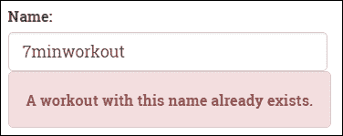
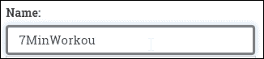
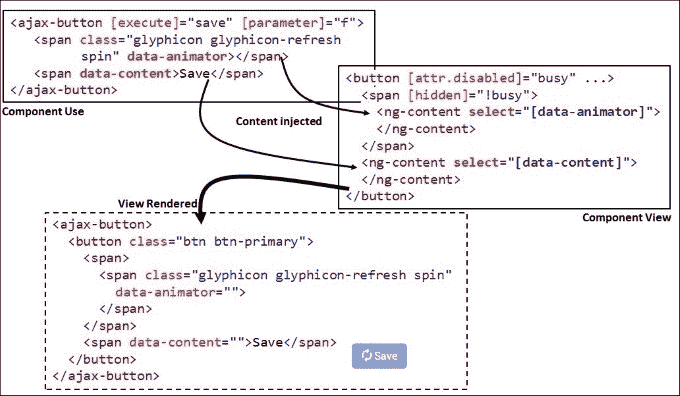
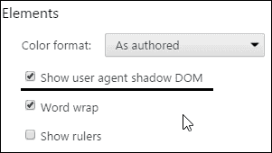
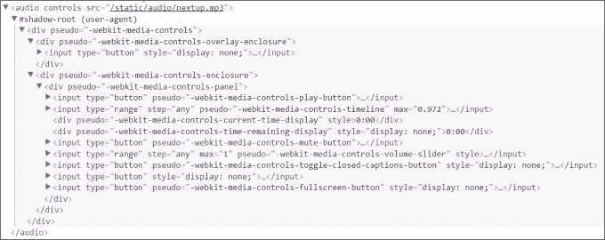
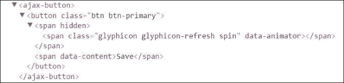
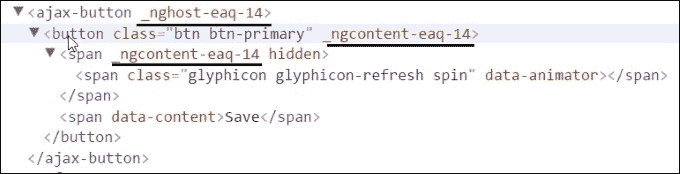
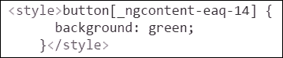
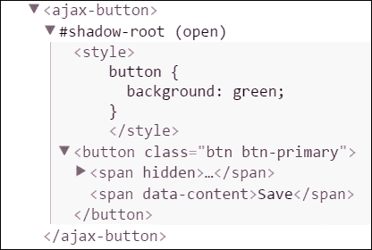

# 第六章：深入了解 Angular 2 指令

指令随处可见。它们是 Angular 2 的基本构建块。应用程序的每个扩展都导致我们创建新的**组件指令**。这些组件指令进一步使用了**属性指令**（如`NgClass`和`NgStyle`）和**结构指令**（如`NgIf`和`NgFor`）来扩展它们的行为。

虽然我们已经构建了许多组件指令和一个孤立的属性指令，但仍有一些指令构建的概念值得探索。这对于属性和结构指令尤为重要，我们尚未详细介绍。

本章我们将涵盖以下主题：

+   构建指令：我们构建多个指令，并学习指令的用途，它们与组件的区别，以及指令如何相互通信和/或与它们的宿主组件通信。我们探索所有指令类型，包括*组件指令*、*属性指令*和*结构指令*。

+   异步验证：Angular 使得验证需要与服务器交互并且是异步的规则变得容易。我们将在本章中构建我们的第一个异步验证器。

+   使用渲染器进行视图操作：渲染器允许以平台无关的方式进行视图操作。我们利用渲染器来处理繁忙指示器指令，并学习其 API。

+   宿主绑定：宿主绑定允许指令与它们的*宿主元素*进行通信。本章涵盖了如何利用这样的绑定来指令。

+   指令注入：Angular DI 框架允许基于指令在 HTML 层次结构中声明的位置进行指令注入。我们将涵盖与此类注入相关的多种情景。

+   与视图子组件和内容子组件一起工作：组件有能力将外部视图模板包含到它们自己的视图中。我们将在这里讨论如何处理注入的内容。

+   理解 NgIf 平台指令：我们将深入了解`NgIf`平台指令，并尝试理解*结构指令*（如`NgIf`）的工作原理。

+   Angular 组件的视图封装：我们将学习 Angular 如何使用从*web 组件*派生的概念来支持视图和样式封装。

让我们通过重申指令的基本分类来开始本章。

# 指令分类

Angular 指令将 HTML 视图与应用程序状态集成。指令帮助我们在应用程序状态更改时操纵视图，并在几乎没有或没有与实际 DOM 的手动交互的情况下响应视图更新。

根据它们对视图的影响方式，这些指令进一步分为三种类型。

## 组件

组件指令或组件是具有封装视图的指令。在 Angular 中，当我们构建 UI 小部件时，我们正在构建组件。我们已经构建了很多，比如`WorkoutRunner`，`WorkoutAudio`，`WorkoutBuilder`等等！

这里要意识到的一个重要点是，视图绑定到*组件*实现，并且只能使用在支持组件上定义的属性和事件。

## 属性指令

属性指令，另一方面，扩展了现有组件或 HTML 元素。将它们视为这些组件/元素的行为扩展。

由于指令是预定义元素的行为扩展，每个指令构建练习都涉及操纵应用这些指令的组件/元素的状态。在第三章中构建的`MyAudioDirective`，*更多 Angular 2-SPA，路由和深入数据流*，也是如此。该指令包装了 HTML 5 *audio*元素（`HTMLAudioElement`）以便于使用。平台指令如`ngStyle`和`ngClass`也以类似的方式工作。

## 结构指令

结构指令，像属性指令一样，不定义自己的视图。相反，它们在作为其一部分提供的*视图模板*（HTML 片段）上工作。往往，结构指令的目的是显示/隐藏或克隆提供给它的模板视图。平台指令如`NgFor`，`NgIf`和`NgSwitch`就是这一类别中的主要例子。

希望这个关于指令的快速复习足以让我们开始。我们将通过扩展锻炼构建器验证并构建一个异步验证器指令来开始我们的追求。

### 注意

我们将从我们在第五章中停下的地方开始，*支持服务器数据持久性*。Git 分支`checkpoint5.4`可以作为本章的基础。

该代码也可以在 GitHub 上找到（[`github.com/chandermani/angular2byexample`](https://github.com/chandermani/angular2byexample)），供所有人下载。检查点在 GitHub 中作为分支实现。如果您不使用 Git，请从 GitHub 位置[`bit.ly/ng2be-checkpoint5-4`](http://bit.ly/ng2be-checkpoint5-4)下载`checkpoint2.4`的快照（一个 zip 文件）。首次设置快照时，请参考`trainer`文件夹中的`README.md`文件。

还记得在`services/workout-service.ts`中更新 API 密钥为您自己的 API 密钥。

# 构建一个远程验证器指令

我们在第五章结束了*支持服务器数据持久性*，*Workout Runner*能够在 MongoDB 存储中管理训练。由于每个训练应该有一个唯一的名称，我们需要强制执行唯一性约束。因此，在创建/编辑训练时，每当用户更改训练名称时，我们可以查询 MongoDB 来验证该名称是否已经存在。

与任何远程调用一样，这个检查也是异步的，因此它需要一个*远程验证器*。我们将使用 Angular 的*异步验证器支持*来构建这个远程验证器。

**异步验证器**与标准自定义验证器类似，只是返回值不是键值对象映射或 null，而是验证检查的返回值是一个**promise**。这个 promise 最终会解析为设置的验证状态（如果有错误），否则为 null（验证成功时）。

我们将创建一个验证指令，用于进行训练名称检查。对于这样的指令，有两种可能的实现方法：

+   我们可以创建一个专门用于唯一名称验证的指令

+   我们可以创建一个通用指令，可以执行任何远程验证

### 提示

**验证指令**虽然我们在这里构建了一个验证指令，但我们也可以构建一个标准的自定义验证器类。创建指令的优势在于它允许我们将指令纳入模板驱动的表单方法中，在那里指令可以嵌入到视图 HTML 中。或者，如果表单是使用模型生成的（模型驱动方法），我们可以在创建`Control`对象时直接使用验证器类。

起初，检查重复名称是否来自数据源（mLab 数据库）似乎是一个太具体的要求，不能由通用验证器处理。但通过一些明智的假设和设计选择，我们仍然可以实现一个可以处理所有类型的远程验证的验证器，包括锻炼名称验证。

计划是创建一个将实际验证逻辑外部化的验证器。指令将接受验证函数作为输入。这意味着实际验证逻辑不是验证器的一部分，而是实际需要验证输入数据的组件的一部分。指令的工作只是调用函数并根据函数的返回值返回适当的错误键。

让我们把这个理论付诸实践，构建我们的远程验证指令，恰当地命名为`RemoteValidatorDirective`。

### 注意

以下部分的伴随代码基于 Git 分支`checkpoint6.1`。您可以与我们一起工作，或者查看前述文件夹中可用的实现。或者，如果您不使用 Git，请从 GitHub 位置[`bit.ly/ng2be-checkpoint6-1`](http://bit.ly/ng2be-checkpoint6-1)下载`checkpoint6.1`的快照（zip 文件）。在首次设置快照时，请参考`trainer`文件夹中的`README.md`文件。

## 使用异步验证器验证锻炼名称

与自定义验证器一样，异步验证器也继承自相同的`Validator`类；但这次，异步验证器返回一个`Promise`而不是返回对象映射。

让我们看一下验证器的定义。在`workout-builder/shared`文件夹中创建一个文件`remote-validator.directive.ts`，并添加这个`RemoteValidatorDirective`实现：

```ts
import {provide, Directive, Input} from '@angular/core'; 
import { NG_ASYNC_VALIDATORS, Validators, Validator, FormControl }  
from '@angular/forms'; 

@Directive({ 
selector: `[a2beRemoteValidator][ngModel]`,   
   providers:[{ provide: NG_ASYNC_VALIDATORS, 
 useExisting: RemoteValidatorDirective,  
 multi: true }] 
  ] 
}) 

export class RemoteValidatorDirective implements Validator { 
  @Input("a2beRemoteValidator") validationKey: string; 
  @Input("validateFunction")  
execute: (value: string) => Promise<boolean>;  

  validate(control: FormControl): { [key: string]: any } { 
    let value: string = control.value; 
    return this.execute(value).then((result: boolean) => { 
      if (result) { return null; } 
      else { 
        let error: any = {}; 
        error[this.validationKey] = true; 
        return error; 
      }}); 
  } 
} 

```

由于我们将验证器注册为指令，而不是使用`FormControl`实例进行注册（通常在使用*模型驱动方法*构建表单时使用），因此我们需要额外的提供者配置设置（在前述`@Directive`元数据中添加）。使用这种语法：

```ts
    providers:[{ provide: NG_ASYNC_VALIDATORS, 
 useExisting: RemoteValidatorDirective,  
 multi: true }] 

```

这个语句注册了验证器与现有的异步验证器。

### 注意

在前面的代码中使用的奇怪指令选择器`selector: `[a2beRemoteValidator][ngModel]``将在下一节中进行讨论，我们将构建一个繁忙指示器指令。

在我们深入验证器的实现之前，让我们将其添加到锻炼名称输入中。这将帮助我们将验证器的行为与其使用相关联。

使用验证声明更新训练名称输入（`workout.component.html`）：

```ts
<input type="text" name="workoutName" ... 
 **a2beRemoteValidator="workoutname"** 
 **[validateFunction]="validateWorkoutName">**

```

并在训练构建器模块（`workout-builder.module.ts`）中添加验证指令的习惯声明：

```ts
import { RemoteValidatorDirective } from "./shared/remote-validator.directive"; 
... 
declarations: [WorkoutBuilderComponent,...  
RemoteValidatorDirective], 

```

远程验证器在视图中被引用为`a2beRemoteValidator`。

### 提示

**为指令选择器添加前缀**

始终使用标识符（如你刚才看到的`a2be`）为你的指令添加前缀，以将它们与框架指令和其他第三方指令区分开来。

指令实现接受两个输入：用于设置*error key*的验证键（`validationKey`）和用于验证控件值的验证函数。这两个输入都使用`@Input`装饰器进行了注释。

### 注意

输入参数`@Input("validateFunction") execute: (value: string) => Promise<boolean>;`，绑定到一个函数，而不是一个标准的组件属性。由于底层语言 TypeScript（以及 JavaScript）的特性，我们可以将函数视为属性。

当异步验证触发时（在`input`的更改上），Angular 调用`validate`函数，传入底层的`control`。作为第一步，我们提取当前的输入值，然后使用这个输入调用`execute`函数。`execute`函数返回一个 promise，最终应该解析为`true`或`false`：

+   如果是`true`，则验证成功，promise 回调函数返回`null`。

+   如果是`false`，则验证失败，并返回一个错误的键值映射。这里的*key*是我们在使用验证器时设置的字符串字面量（`a2beRemoteValidator="workoutname"`）。

当输入上声明了多个验证器时，这个*key*就派上了用场，允许我们识别哪些验证失败了。

让我们也为这个失败添加一个验证消息。在*workout name*的现有验证`label`之后添加这个标签声明：

```ts
<label *ngIf="name.control.hasError('workoutname')" class="alert alert-danger">A workout with this name already exists.</label> 

```

然后将这两个标签包裹在一个`div`中，就像我们为*workout title*的错误标签所做的那样。

`hasError`函数检查`'workoutname'`验证键是否存在。

这个实现的最后一个缺失的部分是我们在应用指令时分配的实际验证函数(`[validateFunction]="validateWorkoutName"`)，但从未实现过。

将`validateWorkoutName`函数添加到`workout.component.ts`中：

```ts
validateWorkoutName = (name: string): Promise<boolean> => { 
if (this.workoutName === name) return Promise.resolve(true); 
return this.workoutService.getWorkout(name) 
          .toPromise() 
          .then((workout: WorkoutPlan) => { 
             return !workout; 
           }, error => { 
                return true; 
           }); 
}  

```

在探索前面的函数所做的事情之前，我们需要在`WorkoutComponent`类上进行一些修复。`validateWorkoutName`函数依赖于`WorkoutService`来获取特定名称的锻炼。让我们在构造函数中注入该服务，并在导入部分添加必要的导入：

```ts
import { WorkoutService }  from "../../../services/workout-service"; 
... 
constructor(... private workoutService: WorkoutService) { 

```

让我们还更新`ngOnInit`函数，并将本地变量`workoutName`转换为*类成员*。在其他类成员中声明`workoutName`：

```ts
private workoutName: string; 

```

将`else`语句内的第一条语句更改为：

```ts
this.workoutName = params['id']; 

```

并在`startBuildingExisting`函数调用期间使用相同的变量。

`validateWorkoutName`中的第一个`if`条件是用于更新场景。显然，我们不希望验证现有的锻炼名称。`return Promise.resolve(true);`语句返回一个始终解析为`true`的 promise。

将`validateWorkoutName`函数定义为*实例函数*（使用*箭头运算符*）而不是定义为标准函数（在*原型*上声明函数）的原因是`this`作用域问题。

查看`RemoteValidatorDirective`内部的验证函数调用（使用`@Input("validateFunction") execute;`声明）：

```ts
    return this.execute(value).then((result: boolean) => { ... }); 

```

当调用函数（名为`execute`）时，`this`引用绑定到`RemoteValidatorDirective`而不是`WorkoutComponent`。由于`execute`引用了前面设置中的`validateWorkoutName`函数，所以在`validateWorkoutName`内部访问`this`是有问题的。

这导致`validateWorkoutName`内部的`if (this.workoutName === name)`语句失败，因为`RemoteValiatorDirective`没有`workoutName`实例成员。通过将`validateWorkoutName`定义为实例函数，*TypeScript*编译器在函数定义时*创建了一个闭包*，围绕`this`的值。

通过新的声明，`validateWorkoutName`内部的`this`始终指向`WorkoutComponent`，无论函数如何被调用。

我们还可以查看`WorkoutComponent`的编译 JavaScript，以了解闭包如何与`validateWorkoutName`相关。我们感兴趣的生成代码部分如下：

```ts
function WorkoutComponent(...) { 
 **var _this = this;** 
  ... 
  this.validateWorkoutName = function (name) { 
 **if (_this.workoutName === name)** 
      return Promise.resolve(true); 

```

如果我们看一下验证函数的实现，我们会发现它涉及查询*mLab*以获取特定的锻炼名称。`validateWorkoutName`函数在找不到相同名称的锻炼时返回`true`，在找到相同名称的锻炼时返回`false`（实际上返回一个*promise*）。

### 注意

`WorkoutService`上的`getWorkout`函数返回一个*observable*，但我们通过在 observable 上调用`toPromise`函数将其转换为一个*promise*。我们需要一个 promise 对象，因为`RemoteValidatorDirective`需要从验证器函数返回一个 promise。

现在可以测试验证指令。创建一个新的锻炼并输入一个现有的锻炼名称，比如`7minworkout`。看看验证错误消息最终会显示出来：



太棒了！看起来很不错，但还有一些东西缺失。用户并没有被告知我们正在验证锻炼名称。我们可以改善这个体验。

# 构建一个繁忙指示器指令

在远程验证锻炼名称时，我们希望用户意识到后台的活动。在远程验证发生时，围绕输入框的视觉提示应该能够达到目的。

仔细思考；有一个带有异步验证器（进行远程验证）的输入框，我们希望在验证过程中为输入框添加一个视觉提示。看起来像是一个常见的解决模式？确实是，所以让我们创建另一个指令！

但在开始之前，必须明白我们并不是孤军奋战。繁忙指示器指令需要另一个指令`NgModel`的帮助。我们已经在第四章中的*构建个人教练*中对`input`元素使用了`NgModel`指令。`NgModel`帮助我们跟踪输入元素的状态。以下示例摘自第四章的*构建个人教练*，突出了`NgModel`如何帮助我们验证输入：

```ts
<input type="text" name="workoutName" #name="ngModel"  class="form-control" id="workout-name" ... [(ngModel)]="workout.name" required> 
... 
<label *ngIf="name.control.hasError('required') && (name.touched || submitted)" class="alert alert-danger">Name is required</label>  

```

甚至在前一节中对唯一的锻炼名称进行验证的错误标签也采用了相同的技术，即使用`NgModel`来检查验证状态。

让我们从定义指令的大纲和装饰器元数据开始。在`workout-builder/shared`文件夹中创建一个`busy-indicator.directive.ts`文件，并添加以下代码：

```ts
import {Directive} from '@angular/core'; 
import {NgModel} from '@angular/form; 

@Directive({ 
  selector: '[a2beBusyIndicator]', 
}) 
export class BusyIndicatorDirective { 
  constructor(private model: NgModel) { } 
} 

```

指令选择器元数据指定繁忙指示器将应用于具有`a2beBusyIndicator`属性的元素/组件。

在继续之前，将此指令添加到锻炼构建器模块（`workout-builder.module.ts`）的声明部分。

在前面的代码中唯一值得关注的是 Angular DI 注入与`input`元素关联的`NgModel`指令。请记住，`NgModel`指令已经存在于`input`（`workoutname`）上：

```ts
**<input... name="workoutName" #name="ngModel" [(ngModel)]="workout.name" ...>**

```

这足以将我们的新指令集成到锻炼视图中，所以让我们快速做一下。

从`workout-builder`中打开`workout.component.html`并将繁忙指示器指令添加到锻炼名称`input`中：

```ts
<input type="text" name="workoutName" ... a2beBusyIndicator> 

```

创建一个新的锻炼或打开一个现有的锻炼，看看`BusyIndicatorDirective`是否被加载，并且`NgModel`注入是否正常工作。这可以通过在`BusyIndicatorDirective`构造函数内设置断点来轻松验证。

Angular 将相同的`NgModel`实例注入到`BusyIndicatorDirective`中，当它遇到输入 HTML 上的`ngModel`时创建了它。

您可能想知道，如果我们在没有`ngModel`属性的输入元素上应用此指令，或者实际上在任何 HTML 元素/组件上应用此指令，会发生什么，比如这样：

```ts
<div a2beBusyIndicator></div> 
<input type="text" a2beBusyIndicator> 

```

注入会起作用吗？

当然不是！我们可以在创建锻炼视图上尝试。打开`workout.component.html`并在锻炼名称`input`上方添加以下`input`。刷新应用程序：

```ts
<input type="text" name="workoutName1" a2beBusyIndicator> 

```

Angular 抛出异常，如下所示：

```ts
**EXCEPTION: No provider for NgModel! (BusyIndicatorDirective -> NgModel)**

```

如何避免这种情况？嗯，Angular 的 DI 可以在这里拯救我们，因为它允许我们声明一个可选的依赖项。

### 注意

在继续之前删除您刚刚添加的`input`控件。

## 使用@Optional 装饰器注入可选依赖项

Angular 有一个`@Optional`装饰器，当应用到构造函数参数时，指示 Angular *注入器*在找不到依赖项时注入`null`。

因此，繁忙指示器构造函数可以编写如下：

```ts
  constructor(@Optional() private model: NgModel) { } 

```

问题解决了吗？实际上并没有；如先前所述，我们需要`NgModel`指令才能使`BusyIndicatorDirective`正常工作。因此，虽然我们学到了一些新东西，但在当前情况下并不是非常有用。

### 注意

在继续之前，请记住将`workoutnameinput`恢复到原始状态，应用`a2beBusyIndicator`。

`BusyIndicatorDirective`只有在元素上已经存在`NgModel`指令时才能应用。

这次`selector`指令将拯救我们。将`BusyIndicatorDirective`的选择器更新为：

```ts
selector: `[a2beBusyIndicator][ngModel]` 

```

此选择器仅在元素上同时存在`a2beBusyIndicator`和`ngModel`属性的组合时才创建`BusyIndicatorDirective`。问题解决了！

现在是时候添加实际的实现了。

## 实现 1-使用渲染器

为了使`BusyIndicatorDirective`起作用，它需要知道`input`上的异步验证何时触发以及何时结束。这些信息只能通过`NgModel`指令获得。`NgModel`有一个属性`control`，它是`Control`类的一个实例。正是这个`Control`类跟踪输入的当前状态，包括以下内容：

+   当前分配的验证器（同步和异步）

+   当前值

+   输入元素状态，如`pristine`、`dirty`和`touched`

+   输入验证状态，可能是`valid`、`invalid`或在异步执行验证时是`pending`

+   跟踪值更改或验证状态更改的事件。

`Control`类似乎是一个有用的类，我们感兴趣的是`pending`状态！

让我们为`BusyIndicatorDirective`类添加第一个实现。使用以下代码更新类：

```ts
private subscriptions: Array<any> = []; 
ngAfterViewInit() { 
this.subscriptions.push( 
this.model 
          .control.statusChanges 
          .subscribe((status: any) => { 
              if (this.model.control.pending) { 
                this.renderer.setElementStyle( 
                  this.element.nativeElement,  
"border-width", "3px"); 
                this.renderer.setElementStyle( 
                  this.element.nativeElement,  
"border-color", "gray"); 
              } 
              else { 
                this.renderer.setElementStyle( 
                  this.element.nativeElement,  
"border-width", null); 
this.renderer.setElementStyle( 
                     this.element.nativeElement,  
"border-color", null); 
              } 
        })); 
    }  

```

在构造函数中需要添加两个新的依赖项，因为我们在`ngAfterViewInit`函数中使用它们。将`BusyIndicatorDirective`的构造函数更新为以下内容：

```ts
constructor(private model: NgControl,  
 **private element: ElementRef,** 
 **private renderer: Renderer) { }**

```

还要在`'@angular/core'`中为`ElementRef`和`Renderer`添加导入。

`ElementRef`是对底层 HTML 元素（在本例中为`input`）的包装对象。第三章中构建的`MyAudioDirective`指令，*更多 Angular 2-SPA，路由和深入数据流*，使用`ElementRef`来获取底层的`Audio`元素。

`Renderer`注入值值得一提。调用`setElementStyle`是`Renderer`负责管理 DOM 的明显迹象。但在更深入地探讨`Renderer`的角色之前，让我们试着理解前面的代码在做什么。

在上述代码中，模型（`NgModel`实例）上的`control`属性定义了一个事件（一个`Observable`），`statusChanges`，我们可以订阅它以了解控件验证状态何时更改。可用的验证状态是`valid`，`invalid`和`pending`。

订阅检查控件状态是否为`pending`，并相应地使用`Renderer` API 函数`setElementStyle`装饰底层元素。我们设置输入的`border-width`和`border-color`。

上述实现添加到`ngAfterViewInit`指令生命周期钩子中，在视图初始化后调用。

让我们试一下。打开创建锻炼页面或现有的*7 分钟锻炼*。一旦开始输入/编辑锻炼名称，`input`样式就会更改，并在锻炼名称的远程验证完成后恢复。不错！



在继续之前，还要将取消订阅代码添加到`BusyIndicatorDirective`中，以避免内存泄漏。将此函数添加到`BusyIndicatorDirective`中：

```ts
ngOnDestroy() { 
    this.subscriptions.forEach((s) => s.unsubscribe()); 
} 

```

### 提示

**始终取消订阅可观察对象**

始终记得取消对代码中已完成的任何`Observable`/`EventEmitter`订阅，以避免内存泄漏。

实现看起来不错。`Renderer`正在发挥作用。但还有一些未解答的问题。

为什么不直接获取底层 DOM 对象并使用标准 DOM API 来操作输入样式？为什么我们需要*渲染器*？

## Angular 渲染器，翻译层

Angular 2 的主要设计目标之一是使其在各种环境、框架和设备上运行。Angular 通过将核心框架实现分为应用程序层和渲染层来实现这一点。应用程序层具有我们与之交互的 API，而渲染层提供了一个抽象，应用程序层可以使用它而不必担心实际视图是如何以及在哪里被渲染的。

通过分离渲染层，Angular 理论上可以在各种设置中运行。这些包括（但不限于）：

+   浏览器

+   浏览器主线程和 Web Worker 线程，出于明显的性能原因

+   服务器端渲染

+   原生应用程序框架；正在努力将 Angular 2 与`NativeScript`和`ReactNative`集成

+   测试，允许我们在 Web 浏览器之外测试应用程序 UI

### 注意

Angular 在浏览器内部使用的`Renderer`实现是`DOMRenderer`。它负责将我们的 API 调用转换为浏览器 DOM 更新。事实上，我们可以通过在`BusyIndicatorDirective`的构造函数中添加断点并查看`renderer`的值来验证渲染器类型。

出于这个确切的原因，我们避免在`BusyIndicatorDirective`内部直接操作 DOM 元素。你永远不知道代码最终会在哪里运行。我们本来可以轻松地这样做：

```ts
this.element.nativeElement.style.borderWidth="3px"; 

```

相反，我们使用`Renderer`以一种与平台无关的方式来做同样的事情。

看看`Renderer` API 函数`setElementStyle`：

```ts
this.renderer.setElementStyle( 
             this.element.nativeElement, "border-width", "3px"); 

```

它需要设置样式的元素，要更新的样式属性和要设置的值。`element`引用了注入到`BusyIndicatorDirective`中的`input`元素。

### 提示

**重置样式**

通过调用`setElementStyle`设置的样式可以通过在第三个参数中传递`null`值来重置。查看前面代码中的`else`条件。

`Renderer` API 还有许多其他方法，可以用来设置属性，设置属性，监听事件，甚至创建新视图。每当你构建一个新的指令时，记得评估`Renderer` API 来进行 DOM 操作。

### 注意

有关`Renderer`及其应用的更详细解释，请参阅 Angular 设计文档的一部分：[`bit.ly/ng2-render`](http://bit.ly/ng2-render)

我们还没有完成！借助 Angular 的强大功能，我们可以改进实现。Angular 允许我们在指令实现中进行*宿主绑定*，帮助我们避免大量的样板代码。

## 指令中的宿主绑定

在 Angular 领域，指令附加到的组件/元素被称为**宿主元素**：承载我们的指令/组件的容器。对于`BusyIndicatorDirective`，`input`元素是*宿主*。

虽然我们可以使用`Renderer`来操作宿主（我们也这样做了），但是 Angular 数据绑定基础设施可以进一步减少样板代码。它提供了一种声明性的方式来管理指令-宿主交互。使用宿主绑定概念，我们可以操作元素的*属性*和*属性*，并订阅其*事件*。

让我们了解每个宿主绑定的能力，最后，我们将修复我们的`BusyIndicatorDirective`实现。

### 使用@HostBinding 进行属性绑定

使用**宿主属性绑定**将*指令属性*绑定到*宿主元素属性*。在变更检测阶段，对指令属性的任何更改都将与链接的宿主属性同步。

我们只需要在要与之同步的指令属性上使用`@HostBinding`装饰器。例如，考虑这个绑定：

```ts
@HostBinding("readOnly") get busy() {return this.isbusy}; 

```

当应用于`input`时，当`isbusy`指令属性为`true`时，它将将`inputreadOnly`属性设置为`true`。

### 注意

请注意，`readonly`也是`input`上的一个属性。我们在这里所指的是输入属性`readOnly`。

### 属性绑定

**属性绑定**将指令属性绑定到宿主组件属性。例如，考虑一个具有以下绑定的指令：

```ts
@HostBinding("attr.disabled") get canEdit(): string  
  { return !this.isAdmin ? "disabled" : null }; 

```

如果应用于输入，当`isAdmin`标志为`false`时，它将在`input`上添加`disabled`属性，并在其他情况下清除它。我们在这里也遵循 HTML 模板中使用的相同属性绑定表示法。属性名称以字符串文字`attr`为前缀。

我们也可以对*类*和*样式绑定*做类似的事情。考虑以下一行：

```ts
@HostBinding('class.valid')  
   get valid { return this.control.valid; } 

```

这一行设置了一个类绑定，接下来的一行创建了一个样式绑定：

```ts
@HostBinding("style.borderWidth")  
   get focus(): string { return this.focus?"3px": "1px"}; 

```

### 事件绑定

最后，**事件绑定**用于订阅宿主组件/元素引发的事件。考虑这个例子：

```ts
@Directive({ selector: 'button, div, span, input' }) 
class ClickTracker { 
  @HostListener('click', ['$event.target']) 
  onClick(element: any) { 
    console.log("button", element, "was clicked"); 
  } 
} 

```

这将在宿主事件`click`上设置一个监听器。Angular 将为视图上的每个*button*、*div*、*span*和*input*实例化前面的指令，并设置与`onClick`函数的宿主绑定。`$event`变量包含引发的事件数据，`target`指的是被点击的元素/组件。

事件绑定也适用于组件。考虑以下示例：

```ts
@Directive({ selector: 'workout-runner' }) 
class WorkoutTracker { 
  @HostListener('workoutStarted', ['$event']) 
  onWorkoutStarted(workout: any) { 
    console.log("Workout has started!"); 
  } 
} 

```

通过这个指令，我们跟踪了在`WorkoutRunner`组件上定义的`workoutStarted`事件。当锻炼开始时，将调用`onWorkoutStarted`函数，并提供已开始的锻炼的详细信息。

现在我们了解了这些绑定是如何工作的，我们可以改进我们的`BusyIndicatorDirective`实现。

## 实现 2 - 具有宿主绑定的 BusyIndicatorDirective

你可能已经猜到了！我们将使用*宿主属性绑定*而不是`Renderer`来设置样式。想试试吗？继续！清除现有的实现，尝试为`borderWidth`和`borderColor`样式属性设置宿主绑定，而不查看以下的实现。

这是主机绑定实现后指令的样子：

```ts
import {Directive, HostBinding} from '@angular/core'; 
import {NgModel} from '@angular/forms'; 

@Directive({ selector: `[a2beBusyIndicator][ngModel]`}) 
export class BusyIndicatorDirective { 
  private get validating(): boolean {  
   return this.model.control != null &&  
            this.model.control.pending; }; 

  @HostBinding("style.borderWidth") get controlBorderWidth():  
      string { return this.validating ? "3px" : null; }; 
  @HostBinding("style.borderColor") get controlBorderColor(): 
      string { return this.validating ? "gray" : null }; 

  constructor(private model: NgModel) { } 
} 

```

我们已经将`pending`状态检查移到了一个名为`validating`的指令属性中，然后使用了`controlBorderWidth`和`controlBorderColor`属性进行样式绑定。这绝对比我们以前的方法更加简洁！去测试一下吧。

如果我们告诉你，这可以在不需要自定义指令的情况下完成，不要感到惊讶。这就是我们的做法，只需在锻炼名称`input`上使用样式绑定：

```ts
<input type="text" name="workoutName" ... 
**[style.borderColor]="name.control.pending ? 'gray' : null"**
**[style.borderWidth]="name.control.pending ? '3px' : null">**

```

我们得到了相同的效果！

不，我们的努力并没有白费。我们学到了**渲染器**和**主机绑定**。这些概念在构建提供复杂行为扩展而不仅仅是设置元素样式的指令时会派上用场。

### 注意

如果您在运行代码时遇到问题，请查看 Git 分支`checkpoint6.1`，以获取我们迄今为止所做的工作版本。或者，如果您不使用 Git，请从[`bit.ly/ng2be-checkpoint6-1`](http://bit.ly/ng2be-checkpoint6-1)下载`checkpoint6.1`的快照（zip 文件）。在首次设置快照时，请参考`trainer`文件夹中的`README.md`文件。

我们接下来要讨论的下一个主题是*指令注入*。

# 指令注入

回到前面几页，看一下使用渲染器的`BusyIndicatorDirective`实现，特别是构造函数：

```ts
constructor(private model: NgModel ...) { } 

```

Angular 自动定位了为当前元素创建的`NgModel`指令，并将其注入到`BusyIndicatorDirective`中。这是可能的，因为这两个指令都声明在同一个*主机元素*上。

好消息是我们可以影响这种行为。在父 HTML 树或子树上创建的指令也可以被注入。接下来的几节将讨论如何在组件树中注入指令，这是一个非常方便的功能，允许具有*共同血统*（在视图中）的指令进行跨指令通信。

我们将使用 Plunker（[`bit.ly/ng2be-directive-tree`](http://bit.ly/ng2be-directive-tree)）来演示这些概念。

首先，看一下 Plunker 文件`app.component.ts`。它有三个指令：`Relation`，`Acquaintance`和`Consumer`，并且定义了这个视图层次结构：

```ts
<div relation="grand-parent" acquaintance="jack"> 
    <div relation="parent"> 
 **<div relation="me" consumer>** 
        <div relation="child-1"> 
          <div relation="grandchild-1"></div> 
        </div> 
        <div relation="child-2"></div> 
      </div> 
    </div> 
</div> 

```

在接下来的几节中，我们将描述不同的方式，可以将不同的`relation`和`Acquaintance`指令注入到`consumer`指令中。在`ngAfterViewInit`生命周期钩子期间，查看浏览器控制台以获取我们记录的注入依赖项。

## 注入在同一元素上定义的指令

默认情况下，构造函数注入支持在同一元素上定义的指令的注入。构造函数只需要声明我们想要注入的指令类型变量即可：

```ts
variable:DirectiveType 

```

我们在`BusyIndicatorDirective`中进行的`NgModel`注入属于这一类别。如果在当前元素上找不到指令，Angular DI 将抛出错误，除非我们标记依赖项`@Optional`。

### 提示

**可选依赖项**

`@Optional`装饰器不仅限于指令注入。它用于标记任何类型的依赖项为可选的。

从 plunk 示例中，第一个注入将`Relation`指令与 me 属性（`relation="me"`）注入到 consumer 指令中：

```ts
constructor(private me:Relation ... 

```

## 从父级注入指令依赖项

使用`@Host`装饰器前缀的构造函数参数指示 Angular 在*当前元素*、*其父元素*或*其父元素*上搜索依赖项，直到达到组件边界（在其视图层次结构中某处存在该指令的组件）。检查第二个`consumer`注入：

```ts
constructor(..., @Host() private myAcquaintance:Acquaintance  

```

这个语句注入了在层次结构中声明的`Acquaintance`指令实例。

### 注意

就像之前描述的`@Option`装饰器一样，`@Host()`的使用也不仅限于指令。Angular 服务注入也遵循相同的模式。如果一个服务标记为`@Host`，搜索将停止在宿主组件处。它不会继续向上组件树。

`@Skipself`装饰器可用于跳过当前元素进行指令搜索。

从 plunk 示例中，这个注入将`Relation`指令与父属性（`relation="parent"`）注入到 consumer 中：

```ts
@SkipSelf() private myParent:Relation 

```

## 注入子指令（或多个指令）

如果需要将在嵌套 HTML 中定义的指令注入到父指令/组件中，有四个装饰器可以帮助我们：

+   `@ViewChild`/`@ViewChildren`

+   `@ContentChild`/`@ContentChildren`

正如这些命名约定所暗示的，有装饰器可以注入单个子指令或多个子指令：

要理解`@ViewChild/@ViewChildren`与`@ContentChild/@ContentChildren`的重要性，我们需要看一下视图和内容子级是什么，这是我们很快会讨论的一个话题。但现在，理解视图子级是组件自己视图的一部分，而内容子级是注入到组件视图中的外部 HTML 就足够了。

看看在 Plunket 中，`ContentChildren`装饰器是如何用来将子`Relation`指令注入到`Consumer`中的：

```ts
@ContentChildren(Relation) private children:QueryList<Relation>; 

```

令人惊讶的是，变量`children`的数据类型不是数组，而是一个自定义类`QueryList`。`QueryList`类不是一个典型的数组，而是一个集合，当 Angular 添加或删除依赖项时，它会保持最新。如果使用结构指令（如`NgIf`或`NgFor`）创建/销毁 DOM 树时，这种情况可能会发生。我们还将在接下来的部分更多地讨论`QueryList`。

您可能已经注意到，前面的注入不是构造函数注入，就像前面的两个示例一样。这是有原因的。注入的指令在底层组件/元素的内容初始化之前是不可用的。正因为这个原因，我们在`ngAfterViewInit`生命周期钩子内有 console.log 语句。我们应该在此生命周期钩子执行后才能访问内容子级。

前面的示例代码将所有三个子`relation`对象注入到`consumer`指令中。

## 注入后代指令

@ContentChildren`装饰器（或者实际上也是`@ViewChildren`）只注入指令/组件的直接子级，而不是其后代。要包括所有后代，我们需要为`Query`提供一个参数：

```ts
**@ContentChildren(Relation, {descendants: true}) private 
    allDescendents:QueryList<Relation>;** 

```

传递`descendants: true`参数将指示 Angular 搜索所有后代。

如果您查看 plunker 日志，前面的语句将所有四个后代注入进来。

虽然 Angular DI 看起来很简单，但它包含了很多功能。它管理我们的服务、组件和指令，并在正确的时间、正确的地方为我们提供正确的东西。组件和其他指令中的指令注入提供了指令之间进行通信的机制。这样的注入允许一个指令访问另一个指令的公共 API（公共函数/属性）。

现在是探索新东西的时候了。我们将构建一个 Ajax 按钮组件，允许我们将外部视图注入到组件中，这个过程也被称为**内容转换**。

# 构建一个 Ajax 按钮组件

当我们保存/更新练习或锻炼时，总会存在重复提交（或重复的`POST`请求）的可能性。当前的实现没有提供任何关于保存/更新操作何时开始和何时完成的反馈。由于缺乏视觉线索，应用程序的用户可能会有意或无意地多次点击**保存**按钮。

让我们尝试通过创建一个专门的按钮来解决这个问题——一个*Ajax 按钮*，当点击时会给出一些视觉线索，并且还会阻止重复的 Ajax 提交。

按钮组件将按照以下方式工作。它接受一个函数作为输入。这个输入函数（输入参数）应该返回与远程请求相关的 promise。点击按钮时，按钮内部会进行远程调用（使用输入函数），跟踪底层的 promise，等待其完成，并在此过程中显示一些繁忙的线索。此外，按钮在远程调用完成之前保持禁用，以避免重复提交。

### 注意

以下部分的伴随代码基于 git 分支`checkpoint6.2`。您可以跟着我们一起工作，或者查看分支中提供的实现。或者如果您不使用 Git，可以从 GitHub 位置[`bit.ly/ng2be-checkpoint6-2`](http://bit.ly/ng2be-checkpoint6-2)下载`checkpoint6.2`的快照（zip 文件）。首次设置快照时，请参考`trainer`文件夹中的`README.md`文件。

让我们创建组件大纲以使事情更清晰。在`workout-builder/shared`文件夹中创建一个名为`ajax-button.component.ts`的文件，并添加以下组件大纲：

```ts
import {Component, Input } from '@angular/core'; 

@Component({ 
  selector: 'ajax-button', 
  template: `<button [attr.disabled]="busy"  
                  class="btn btn-primary"> 
                <span [hidden]="!busy"> 
                <span class="glyphicon  
                     glyphicon-refresh spin"></span> 
                </span>  
                <span>Save</span> 
            </button>` 
}) 
export class AjaxButtonComponent { 
  busy: boolean = null; 
  @Input() execute: any; 
  @Input() parameter: any; 
} 

```

组件（`AjaxButtonComponent`）有两个属性绑定，`execute`和`parameter`。`execute`属性指向在 Ajax 按钮点击时调用的函数。`parameter`是可以传递给此函数的数据。

查看视图中`busy`标志的使用。当设置了`busy`标志时，我们禁用按钮并显示旋转器。让我们添加使一切工作的实现。将以下代码添加到`AjaxButtonComponent`类中：

```ts
@HostListener('click', ['$event']) 
onClick(event: any) { 
    let result: any = this.execute(this.parameter); 
    if (result instanceof Promise) { 
      this.busy = true; 
      result.then( 
        () => { this.busy = null;},  
  (error:any) => { this.busy = null; }); 
    } 
} 

```

我们设置了一个*主机事件绑定*，将点击事件绑定到`AjaxButtonComponent`上。每当单击`AjaxButtonComponent`组件时，都会调用`onClick`函数。

需要将`HostListener`导入添加到`'@angular/core'`模块中。

`onClick`的实现调用带有`parameter`作为唯一参数的输入函数。调用的结果存储在`result`变量中。

`if`条件检查`result`是否是`Promise`对象。如果是，`busy`指示器将设置为`true`。然后按钮等待 promise 解析，使用`then`函数。无论 promise 是以*成功*还是*错误*解析的，繁忙标志都将设置为`null`。

### 注意

繁忙标志设置为`null`而不是`false`的原因是由于这个属性绑定`[attr.disabled]="busy"`。除非`busy`是`null`，否则`disabled`属性不会被移除。请记住，在 HTML 中，`disabled="false"`不会启用按钮。在按钮再次可点击之前，需要移除该属性。

假设对这一行仍然存在困惑：

```ts
    let result: any = this.execute(this.parameter); 

```

然后需要查看组件的使用方式。打开`workout.component.html`，并用以下内容替换`Save`按钮的 HTML：

```ts
<ajax-button [execute]="save" [parameter]="f"></ajax-button> 

```

我们将`Workout.save`函数绑定到`execute`和`parameter`；它接受`FormControl`对象`f`。

我们需要更改`Workout`类中的`save`函数，以便返回一个`AjaxButtonComponent`可以工作的 promise。但在继续之前，打开`workout.component.ts`，添加`AjaxButtonComponent`，导入它，并在`directives`数组中引用它。

然后将`save`函数的实现更改为以下内容：

```ts
save = (formWorkout: any): Promise<any> => { 
         this.submitted = true; 
         if (!formWorkout.valid) return; 
         let savePromise =  
         this.workoutBuilderService.save().toPromise(); 
         savePromise.then( 
            (data) => this.router.navigate(['/builder/workouts']), 
            (err) => console.error(err) 
         ); 
            return savePromise; 
} 

```

`save`函数现在返回一个*promise*，我们通过调用`workoutBuilderService.save()`返回的*observable*上的`toPromise`函数来构建它。

还要将`AjaxButtonComponent`添加到健身教练模块的(`workout-builder.module.ts`)声明部分。

### 注意

请注意我们如何将`save`函数定义为*实例函数*（使用箭头运算符）以创建一个对*this*的闭包。这是我们在构建*远程验证器指令*时也做过的事情。

是时候测试我们的实现了！刷新应用程序并打开创建/编辑锻炼视图。单击**保存**按钮，看到 Ajax 按钮的效果：


我们开始这一节的目的是突出外部元素/组件如何被插入到一个组件中。现在让我们来做吧！

## 将外部组件/元素插入到组件中

从一开始，我们需要理解**插入**的含义。理解这个概念的最好方法是看一个例子。

到目前为止，我们构建的任何组件都没有从外部借用内容。不确定这是什么意思？

考虑前面的`AjaxButtonComponent`示例：

```ts
<ajax-button [execute]="save" [parameter]="f"></ajax-button> 

```

如果我们将`ajax-button`的使用更改为以下内容会怎样？

```ts
<ajax-button [execute]="save" [parameter]="f">Save Me!</ajax-button> 

```

`Save Me!`文本会显示在按钮上吗？不会，试试看！

`AjaxButtonComponent`组件已经有了一个模板，并且拒绝了我们在前面声明中提供的内容。如果我们可以以某种方式使内容（在前面的例子中的`Save Me!`）加载到`AjaxButtonComponent`中会怎样？将外部视图片段注入到组件视图中的行为就是我们所说的**插入**，框架提供了必要的结构来实现插入。

现在是介绍两个新概念的时候了，*内容子组件*和*视图子组件*。

### 内容子组件和视图子组件

简洁地定义，组件内部定义的 HTML 结构（使用`template/templateUrl`）是组件的**视图子组件**。然而，作为组件使用的一部分提供的 HTML 视图添加到宿主元素（如`<ajax-button>`），定义了组件的**内容子组件**。

默认情况下，Angular 不允许像之前看到的那样嵌入*内容子组件*。`Save Me!`文本从未被发出。我们需要明确告诉 Angular 在*组件视图模板*中的哪里发出*内容子组件*。为了理解这个概念，让我们修复`AjaxButtonComponent`的视图。打开`ajax-button.component.ts`并更新视图模板定义为：

```ts
`<button [attr.disabled]="busy" class="btn btn-primary"> 
<span [hidden]="!busy"> 
<ng-content select="[data-animator]"></ng-content> 
   </span> 
   <ng-content select="[data-content]"></ng-content> 
 </button>` 

```

前面视图中的两个`ng-content`元素定义了*内容注入位置*，内容子组件可以被注入/插入的地方。`selector`属性定义了应该用于定位内容子组件的*CSS 选择器*。

一旦我们在`workout.component.html`中修复`AjaxButtonComponent`的使用，这个概念就开始变得更有意义了。将其更改为以下内容：

```ts
<ajax-button [execute]="save" [parameter]="f"> 
 **<span class="glyphicon glyphicon-refresh spin" data-animator>
   </span>****<span data-content>Save</span>** 
</ajax-button> 

```

带有`data-animator`的`span`被注入到带有`select=[data-animator]`属性的`ng-content`中，另一个带有`data-content`属性的`span`被注入到第二个`ng-content`声明中。

再次刷新应用程序，尝试保存锻炼。虽然最终结果是相同的，但结果视图是多个视图片段的组合：一个部分用于组件定义（*视图子项*），另一个部分用于组件使用（*内容子项*）。

下图突出显示了渲染的`AjaxButtonComponent`的这种差异：



### 提示

`ng-content`可以在没有`selector`属性的情况下声明。在这种情况下，定义在组件标记内的完整内容被注入。

*内容注入*到现有组件视图中是一个非常强大的概念。它允许组件开发人员提供扩展点，组件使用者可以方便地消费和定制组件的行为，而且是在受控的方式下。

我们为`AjaxButtonComponent`定义的内容注入允许使用者更改繁忙指示器动画和按钮内容，同时保持按钮的行为不变。

Angular 的优势不仅在于此。它有能力将*内容子项*和*视图子项*注入到*组件代码/实现*中。这使得组件能够与其内容/视图子项进行交互，并控制它们的行为。

### 使用@ViewChild 和@ViewChildren 注入视图子项

在第三章中，*更多 Angular 2-SPA、路由和深入的数据流*，我们使用了类似的东西，*视图子项注入*。为了复习我们做过的事情，让我们看一下`WorkoutAudioComponent`实现的相关部分。

视图定义如下：

```ts
<audio #ticks="MyAudio" loop  
  src="/static/audio/tick10s.mp3"></audio> 
<audio #nextUp="MyAudio"  
  src="/static/audio/nextup.mp3"></audio> 
<audio #nextUpExercise="MyAudio"  
  [src]="'/static/audio/' + _nextupSound"></audio> 
// Some other audio elements 

```

注入看起来像下面这样：

```ts
@ViewChild('ticks') private _ticks: MyAudioDirective; 
@ViewChild('nextUp') private _nextUp: MyAudioDirective; 
@ViewChild('nextUpExercise') private _nextUpExercise: MyAudioDirective; 

```

与`audio`标签相关联的指令（`MyAudioDirective`）使用`@ViewChild`装饰器注入到`WorkoutAudio`实现中。传递给`@ViewChild`的参数是*模板变量*名称（如`tick`），用于在视图定义中定位元素。然后`WorkoutAudio`组件使用这些音频指令来控制*7 分钟锻炼*的音频播放。

前面的实现注入了`MyAudioDirective`，甚至子组件也可以被注入。例如，不使用`MyAudioDirective`，假设我们构建一个`MyAudioComponent`，就像这样：

```ts
@Component({ 
  selector: 'my-audio', 
  template: '<audio ...></audio>', 
}) 
export class MyAudioComponent { 
  ... 
} 

```

然后我们可以使用它来代替`audio`标签：

```ts
<my-audio #ticks loop  
  src="/static/audio/tick10s.mp3"></my-audio> 

```

注入仍然会起作用。

如果在组件视图上定义了多个相同类型的指令/组件会发生什么？使用`@ViewChildren`装饰器。它允许您查询一种类型的注入。使用`@ViewChildren`的语法如下：

```ts
@ViewChildren(directiveType) children: QueryList<directiveType>; 

```

这将注入所有类型为`directiveType`的视图子代。对于先前提到的`WorkoutAudio`组件示例，我们可以使用以下语句来获取所有`MyAudioDirective`：

```ts
@ViewChildren(MyAudioDirectives) private all: QueryList<MyAudioDirectives>; 

```

`ViewChildren`装饰器也可以接受逗号分隔的选择器列表（*模板变量名称*）而不是类型。例如，要在`WorkoutAudio`组件中选择多个`MyAudioDirective`实例，我们可以使用以下方法：

```ts
 @ViewChildren('ticks, nextUp, nextUpExercise, halfway, aboutToComplete') private all: QueryList<MyAudioDirective>; 

```

`QueryList`类是 Angular 提供的一个特殊类。我们在本章的*注入后代指令*部分介绍了`QueryList`。让我们进一步探讨`QueryList`。

### 使用 QueryList 跟踪注入的依赖项

对于需要注入多个组件/指令的组件（使用`@ViewChildren`或`@ContentChildren`），注入的依赖项是一个`QueryList`对象。

`QueryList`类是一个*只读*的*集合*，包含了注入的组件/指令。Angular 根据用户界面的当前状态来保持这个集合同步。

例如，考虑`WorkoutAudio`指令视图。它有五个`MyAudioDirective`的实例。因此，对于以下语句，`all.length`将是*五*：

```ts
@ViewChildren(MyAudioDirective) private all: QueryList<MyAudioDirective>; 

```

虽然前面的例子没有突出显示同步部分，但 Angular 可以跟踪视图中添加或移除的组件/指令。当我们使用诸如`ngFor`之类的内容生成指令时，就会发生这种情况。

以这个假设的模板为例：

```ts
<div *ngFor="let audioData of allAudios"> 
  <audio [src]=" audioData.url"></audio> 
</div> 

```

这里注入的`MyAudioDirective`指令数量等于`allAudios`数组的大小。在程序执行期间，如果元素被添加到`allAudios`数组或从中删除，框架也会同步指令集合。

虽然`QueryList`类不是一个数组，但可以使用`for (var item in queryListObject)`语法进行迭代（因为它实现了**ES6 可迭代接口**）。它还有一些其他有用的属性，如`length`、`first`和`last`，可以派上用场。查看框架文档（[`bit.ly/ng2-querylist-class`](http://bit.ly/ng2-querylist-class)）了解更多详情。

从前面的讨论中，我们可以得出结论，`QueryList`可以为组件开发人员节省大量样板代码，如果需要手动进行跟踪，则需要这些代码。

### 提示

**视图子访问时机**

当组件/指令初始化时，视图子注入是不可用的。

Angular 确保视图子注入在`ngAfterViewInit`生命周期事件之前可用于组件。确保只有在`ngAfterViewInit`事件触发后才访问注入的组件/指令。

现在让我们来看一下内容子注入，它几乎相似，只是有一些细微的差别。

### 使用@ContentChild 和@ContentChildren 注入内容子

Angular 允许我们使用一组并行属性来注入*内容子*，即`@ContentChild`用于注入特定的内容子，`@ContentChildren`用于注入特定类型的内容子。

如果我们回顾一下`AjaxButtonComponent`的用法，它的内容子 span 可以通过以下方式注入到`AjaxButtonComponent`中：

```ts
@ContentChild('spinner') spinner:ElementRef; 
@ContentChild('text') text:ElementRef; 

```

这也可以通过在`workout.component.html`中的相应 span 上添加模板变量来完成：

```ts
<span class="glyphicon glyphicon-refresh spin"  
**data-animator #spinner></span>**
**<span data-content #text>Save</span>**

```

虽然前面的注入是`ElementRef`，它也可以是一个组件。如果我们定义了一个名为 spinner 的组件：

```ts
<ajax-button> 
<busy-spinner></busy-spinner> 
... 
</ajax-button> 

```

我们也可以使用以下方式进行注入：

```ts
@ContentChild(BusySpinner) spinner: BusySpinner; 

```

对于指令也是一样的。在`AjaxButtonComponent`上声明的任何指令都可以注入到`AjaxButtonComponent`的实现中。对于前面的情况，由于它是标准的 HTML，我们注入了`ElementRef`，这是 Angular 为任何 HTML 元素创建的包装器。

### 提示

与*视图子*类似，Angular 确保内容子引用在`ngAfterContentInit`生命周期事件之前绑定到注入的变量。

当我们谈论注入依赖项时，让我们谈谈一些关于*将服务注入到* *组件*的变化。

# 使用 viewProvider 进行依赖注入

我们已经熟悉了在 Angular 中进行 DI 注册的机制，在那里我们通过将其添加到任何模块声明来在全局级别注册依赖项：

或者我们可以在`@Component`装饰器的`providers`属性上以组件级别来完成：

```ts
providers:[WorkoutHistoryTracker, LocalStorage] 

```

### 注意

为了避免混淆，我们现在讨论的是除了指令/组件对象之外的依赖注入。在可以使用装饰器提示（如`@Query`、`@ViewChild`、`@ViewChildren`等）注入之前，指令/组件需要在模块的`declarations`数组中注册。

在组件级别注册的依赖项可用于其*视图子级*和*内容子级*及其后代。

### 注意

在我们继续之前，我们希望*视图*和*内容* *子级*之间的区别对每个人都非常清晰。如果有疑问，请再次参考*内容子级和视图子级*部分。

让我们从第四章中的示例中获取一个例子，*构建个人健身教练*。`WorkoutBuilderService`服务在锻炼构建器模块（`WorkoutBuilderModule`）中以应用程序级别注册：

```ts
providers: [ExerciseBuilderService, ...  
 **WorkoutBuilderService]);**

```

这使我们能够在整个应用程序中注入`WorkoutBuilderService`以构建锻炼，并在运行锻炼时使用。相反，我们也可以在`WorkoutBuilderComponent`级别注册服务，因为它是所有锻炼/练习创建组件的父级，就像这样：

```ts
@Component({ 
    template: `...` 
 **providers:[ WorkoutBuilderService ]** 
}) 
export class WorkoutBuilderComponent { 

```

这个改变将禁止在`WorkoutRunner`或与锻炼执行相关的任何组件中注入`WorkoutBuilder`。

### 注意

如果`WorkoutBuilderService`服务在应用程序级别和组件级别（如前面的示例所示）都注册了，那会怎么样？注入是如何发生的？根据我们的经验，我们知道 Angular 会将`WorkoutBuilderService`服务的不同实例注入到`WorkoutBuilderComponent`（及其后代）中，而应用程序的其他部分（*Workout runner*）将获得全局依赖。记住**层次注入器**！

Angular 并不止步于此。它还提供了使用`viewProviders`属性对依赖项进行进一步范围限定。`viewProviders`属性在`@Component`装饰器上可用，允许注册只能在视图子级中注入的依赖项。

让我们再次考虑`AjaxButtonComponent`示例，以及一个名为`MyDirective`的简单指令实现，以阐述我们的讨论：

```ts
@Directive({ 
  selector: '[myDirective]', 
}) 
export class MyDirective { 
  constructor(service:MyService) { } 
  ... 
} 

```

`MyDirective`类依赖于一个名为`MyService`的服务。

要将此指令应用于`AjaxButtonComponent`模板中的*button 元素*，我们还需要注册`MyService`依赖项（假设`MyService`尚未全局注册）：

```ts
@Component({ 
  selector: 'ajax-button', 
  template:` <button [attr.disabled]="busy" ... 
 **myDirective>** 
                ... 
             <button>` 
 **providers:[MyService],** 
... 

```

由于`MyService`已在`AjaxButtonComponent`中注册，因此`MyDirective`也可以添加到其内容子级中。因此，在*spinner HTML*上应用`myDirective`也会起作用（`workout.component.html`中的代码）：

```ts
<span class="glyphicon glyphicon-refresh spin"  
  data-animator #spinner myDirective></span> 

```

但将`providers`属性更改为`viewProviders`：

```ts
**viewProviders:[MyService]**

```

将会导致`MyService`在`AjaxButtonComponent`的内容子级（前面代码中的`span`）中注入失败，并在控制台中出现 DI 错误。

### 注意

使用`viewProviders`注册的依赖项对其内容子级是不可见的。

*视图*和*内容子级*的这种依赖范围在一开始可能看起来并不有用，但它确实有其好处。想象一下，我们正在构建一个可重用的组件，我们希望将其打包并交付给开发人员进行使用。如果组件具有预打包的服务依赖项，我们需要特别小心。如果这样的组件允许*内容注入*（内容子级），则如果在组件上使用基于提供程序的注册，依赖服务将被广泛暴露。任何内容子级都可以获取到服务依赖并使用它，导致不良后果。通过使用`viewProvider`注册依赖项，只有组件实现及其子视图才能访问依赖项，提供了必要的封装层。

我们再次对 DI 框架提供的灵活性和定制级别感到惊讶。虽然对于初学者来说可能有些吓人，但一旦我们开始使用 Angular 构建更多的组件/指令，我们总会发现这些概念让我们的实现变得更简单的地方。

让我们将注意力转向指令的第三种分类：*结构指令*。

# 理解结构指令

虽然我们经常使用结构指令，比如`NgIf`和`NgFor`，但很少需要创建结构指令。仔细考虑。如果我们需要一个新的视图，我们创建一个*组件*。如果我们需要扩展现有的元素/组件，我们使用*指令*。而结构指令最常见的用途是克隆视图的一部分（也称为*模板视图*），然后根据一些条件进行操作。

+   将这些模板（`NgIf`和`NgSwitch`）注入/销毁

+   或者复制这些模板（`NgFor`）

使用结构指令实现的任何行为都会无意中落入这两个类别之一。

鉴于这一事实，我们不必构建自己的结构指令，而是可以查看`NgIf`实现的源代码。

这是`NgIf`的完整实现：

```ts
@Directive({selector: '[ngIf]', inputs: ['ngIf']}) 
export class NgIf { 
  private _prevCondition: boolean = null; 

  constructor(private _viewContainer: ViewContainerRef,  
              private _templateRef: TemplateRef) {} 

  set ngIf(newCondition /* boolean */) { 
    if (newCondition && (isBlank(this._prevCondition)  
                     || !this._prevCondition)) { 
      this._prevCondition = true; 
      this._viewContainer 
          .createEmbeddedView(this._templateRef); 
    }  
    else if (!newCondition && (isBlank(this._prevCondition)  
                               || this._prevCondition)) { 
      this._prevCondition = false; 
      this._viewContainer.clear(); 
    } 
  } 
} 

```

这里没有魔法，只是简单的结构指令，用于检查布尔条件以创建/销毁视图！

`prevCondition`跟踪`ngIf`表达式的上一个值。与`prevCondition`的额外检查是为了确保只有在被监视的表达式（`newCondition`）实际翻转时，模板的添加/移除逻辑才会运行。当`newCondition`和`prevCondition`都是`true`或`false`时，什么也不会发生。

理解指令的工作原理并不困难。需要详细说明的是两个新的注入，`ViewContainerRef（_viewContainer）`和`TemplateRef（_TemplateRef）`。

## TemplateRef

`TemplateRef`类（`_templateRef`）存储了结构指令所引用的模板的引用。还记得第二章中关于结构指令的讨论吗，*构建我们的第一个应用程序 - 7 分钟锻炼*？所有结构指令都使用模板 HTML。当我们使用诸如`NgIf`的指令时：

```ts
<h3 *ngIf="currentExercise.exercise.name=='rest'"> 
  ... 
</h3> 

```

Angular 在内部将此声明转换为以下内容：

```ts
<template [ngIf]="currentExercise.exercise.name=='rest'"> 
  <h3> ... </h3> 
</template> 

```

这是结构指令使用的模板，`_templateRef`指向这个模板。

### 注意

`template`是一个 HTML5 标签，用于保存不希望在浏览器中呈现的内容。`template`标签的默认样式设置为`display:none`。

如果我们在 Angular 视图中手动添加模板标记，Angular 模板引擎将用空的`<script></script>`标记替换它们。

另一个注入是`ViewContainerRef`。

## ViewContainerRef

`ViewContainerRef`类指向模板呈现的容器。该类有许多方便的方法来管理视图。`NgIf`实现使用的两个函数`createEmbeddedView`和`clear`用于添加和移除模板 HTML。

`createEmbeddedView`函数获取模板引用（再次注入到指令中）并渲染视图。

`clear`函数销毁已注入的元素/组件并清除视图容器。由于模板（`TemplateRef`）中引用的每个组件及其子组件都被销毁，所有相关的绑定也将不存在。

结构指令有一个非常特定的应用领域。尽管如此，我们可以使用`TemplateRef`和`ViewContainerRef`类做很多巧妙的技巧。

我们可以实现一个结构指令，根据用户角色显示/隐藏视图模板。

考虑一个假设的结构指令`forRoles`的示例：

```ts
<button *forRoles="admin">Admin Save</button> 

```

如果用户不属于*管理员*角色，`forRoles`指令将不会渲染按钮。核心逻辑看起来会像下面这样：

```ts
if(this.loggedInUser.roles.indexOf(this.forRole) >=0){ 
      this.viewContainer.createEmbeddedView(this.templateRef); 
} 
else { 
      this.viewContainer.clear(); 
}  

```

指令实现将需要某种返回已登录用户详细信息的服务。我们将指令的实现留给读者。

`forRoles`指令的功能也可以使用`NgIf`来实现：

```ts
<button *ngIf="loggedInUser.roles.indexOf('admin')>=0">Admin Save</button> 

```

但`forRoles`指令只是通过清晰的意图增加了模板的可读性。

结构指令的一个有趣应用可能涉及创建一个只是复制传递给它的模板的指令。构建一个将会非常容易；我们只需要调用`createEmbeddedView`两次：

```ts
ngOnInit() {       
 this.viewContainer.createEmbeddedView(this._templateRef);        
 this.viewContainer.createEmbeddedView(this._templateRef); 
}  

```

另一个有趣的练习！

`ViewContainerRef`类还有一些其他函数，允许我们注入*组件*，获取嵌入视图的数量，重新排序视图等等。查看`ViewContainerRef`的框架文档（[`bit.ly/view-container-ref`](http://bit.ly/view-container-ref)）以获取更多详细信息。

这完成了我们对结构指令的讨论，现在是时候开始新的内容了！

到目前为止，我们构建的组件从公共*bootstrap 样式表*和`app.css`中定义的一些自定义样式中获取其样式（CSS）。Angular 在这方面有更多的提供。一个真正可重用的组件应该在行为和用户界面方面完全自包含。

# 组件样式和视图封装

Web 应用程序开发长期存在的问题是在 DOM 元素行为和样式方面缺乏封装。我们无法通过任何机制将应用程序 HTML 的一部分与另一部分隔离开来。

事实上，我们拥有太多的权力。使用像 jQuery 和强大的*CSS 选择器*这样的库，我们可以控制任何 DOM 元素并改变其行为。在能够访问的方面，我们的代码和任何外部库的代码之间没有区别。每一行代码都可以操纵渲染的 DOM 的任何部分。因此，封装层被打破了。一个糟糕编写的库可能会导致一些难以调试的恶心问题。

对 CSS 样式也是如此。任何 UI 库实现都可以覆盖全局样式，如果库实现希望这样做的话。

这些都是任何库开发人员在构建可重用库时面临的真正挑战。一些新兴的 Web 标准尝试通过提出诸如**web 组件**等概念来解决这个问题。

**Web 组件**，简单来说，是可重用的用户界面小部件，它们封装了它们的*状态*、*样式*、*用户界面*和*行为*。功能通过明确定义的 API 公开，用户界面部分也被封装起来。

*web 组件*概念是通过四个标准实现的：

+   HTML 模板

+   Shadow DOM

+   自定义元素

+   HTML 导入

在这次讨论中，我们感兴趣的技术标准是**Shadow DOM**。

## Shadow DOM 概述

**Shadow DOM**就像是一个并行的 DOM 树，托管在组件内部（*一个 HTML 元素，* *不要与 Angular 组件混淆*），隐藏在主 DOM 树之外。除了组件本身，应用程序的任何部分都无法访问这个影子 DOM。

Shadow DOM 标准的实现允许视图、样式和行为封装。理解 Shadow DOM 的最佳方法是查看 HTML5 的`video`和`audio`标签。

你是否曾想过这个`audio`声明：

```ts
<audio src="/static/audio/nextup.mp3" controls></audio> 

```

产生以下结果？


是浏览器生成了底层的 Shadow DOM 来渲染音频播放器。令人惊讶的是，我们甚至可以查看生成的 DOM！以下是我们的操作方法：

+   取上述 HTML，创建一个虚拟 HTML 页面，并在 Chrome 中打开。

+   然后打开开发者工具窗口（**F12**）。点击左上角的**设置**图标。

+   在**常规**设置中，点击复选框，如下面截图中所示，以启用对 Shadow DOM 的检查：



刷新页面，如果现在检查生成的`audio` HTML，Shadow DOM 就会显示出来：



在`shadow-root`下，有一个全新的世界，页面和脚本的其他部分无法访问。

### 注意

在 Shadow DOM 领域，**shadow-root**（在上述代码中为`#shadow-root`）是生成的 DOM 的根节点，托管在**shadow host**（在本例中是`audio`标签）内。

当浏览器渲染此元素/组件时，渲染的是*shadow root*中的内容，而不是*shadow host*。

从这次讨论中，我们可以得出结论，Shadow DOM 是浏览器创建的并封装了 HTML 元素的*markup*、*style*和*behavior*（DOM 操作）的并行 DOM。

### 注意

这是对 Shadow DOM 的一个温和介绍。要了解更多有关 Shadow DOM 的工作原理，请参阅 Rob Dodson 的系列文章：[`bit.ly/shadow-dom-intro`](http://bit.ly/shadow-dom-intro)

但这与 Angular 有什么关系呢？事实证明，Angular 组件也支持某种视图封装！这使我们也可以为 Angular 组件隔离样式。

## Shadow DOM 和 Angular 组件

要了解 Angular 如何应用 Shadow DOM 的概念，我们首先必须学习有关为 Angular 组件设置样式的内容。

在构建本书中的应用程序样式时，我们采取了保守的方法。无论是*Workout Builder*还是*Workout Runner*（*7 分钟锻炼*）应用程序，我们构建的所有组件都从*bootstrap CSS*和在`app.css`中定义的自定义样式中继承其样式。没有一个组件定义了自己的样式。

虽然这符合 Web 应用程序开发的标准实践，但有时我们确实需要偏离。特别是当我们构建自包含、打包和可重用的组件时。

Angular 允许我们通过在`@Component`装饰器上使用`style`（用于内联样式）和`styleUrl`（外部样式表）属性来定义特定于组件的样式。让我们尝试一下`style`属性，看看 Angular 会做什么。

我们将使用`AjaxButtonComponent`的实现作为下一个练习的操场。但在这之前，让我们看看`AjaxButtonComponent`的 HTML 目前是什么样子的。`AjaxButtonComponent`的 HTML 树如下所示：



让我们使用`styles`属性覆盖一些样式：

```ts
@Component({ 
  ... 
  styles:[` 
    button { 
      background: green; 
    }`] 
}) 

```

上述*CSS 选择器*将`background`属性设置为`green`，适用于所有 HTML 按钮。保存上述样式并刷新工作构建器页面。按钮样式已更新。没有惊喜？不是真的，还有一些！看一下生成的 HTML：



一些新属性被添加到许多 HTML 元素中。而最近定义的样式又在哪里？就在`head`标签内的最顶部。



在`head`部分定义的样式具有额外的范围，带有`_ngcontent-eaq-14`属性（在您的情况下可能会有不同的属性名称）。这种范围允许我们独立地为`AjaxButtonComponent`设置样式，它不能覆盖任何全局样式。

根据定义，应该影响应用程序中所有按钮外观的样式没有产生影响。Angular 已经对这些样式进行了范围限制。

### 注意

这种范围确保组件样式不会干扰已定义的样式，但反之则不成立。全局样式仍然会影响组件，除非在组件本身中进行覆盖。即使我们使用`styleUrls`属性，Angular 也会执行相同的操作。假设我们将相同的 CSS 嵌入到外部 CSS 文件中并使用了这个：`styleUrls:['static/css/ajax-button.css']`，Angular 仍然会将样式内联到`head`部分，通过获取 CSS，解析它，然后注入它。

这种作用域样式是 Angular 试图模拟 Shadow DOM 范例的结果。在组件上定义的样式永远不会泄漏到全局样式中。所有这些都是无需任何努力的神奇效果！

### 提示

如果您正在构建定义自己样式并希望具有一定隔离性的组件，请使用组件的`style`/`styleUrl`属性，而不是使用旧式方法，即为所有样式使用一个公共 CSS 文件。

我们可以通过使用`@Component`装饰器属性**encapsulation**来进一步控制这种行为。关于这个属性的 API 文档提到：

> 封装：ViewEncapsulation
> 
> 指定模板和样式应如何封装。如果视图有样式，则默认为**ViewEncapsulation.Emulated**，否则为**ViewEncapsulation.None**。

正如我们所看到的，一旦在组件上设置样式，封装效果就是`Emulated`。否则，它是`None`。

### 注意

如果我们将`encapsulation`明确设置为`ViewEncapsulation.None`，则范围属性将被移除，并且样式将像普通样式一样嵌入到 head 部分。

然后还有第三个选项，`ViewEncapsulation.Native`，在这种情况下，Angular 实际上为组件视图创建了 Shadow DOM。将`AjaxButtonComponent`实现上的`encapsulation`属性设置为`ViewEncapsulation.Native`，现在看一下渲染的 DOM：



`AjaxButtonComponent`现在有了一个影子 DOM！这也意味着按钮的完整样式丢失了（样式来自 bootstrap CSS），按钮现在需要定义自己的样式。

Angular 非常努力地确保我们开发的组件可以独立工作并且可重用。每个组件已经有了自己的模板和行为。除此之外，我们还可以封装组件样式，从而创建健壮的、独立的组件。

这就是本章的结束，是时候总结一下我们学到了什么了。

# 总结

随着我们结束这一章，我们现在对指令的工作原理和如何有效使用它们有了更好的理解。

我们通过构建一个`RemoteValidatorDirective`开始了这一章，并且学到了很多关于 Angular 对*异步验证*的支持。

接下来是`BusyIndicatorDirective`，同样是一个很好的学习机会。我们探索了**renderer**服务，它允许以一种与平台无关的方式来操作组件视图。我们还学习了**host bindings**，它让我们能够绑定到宿主元素的*事件*、*属性*和*属性*。

Angular 允许在视图谱系中声明的指令被注入到谱系内部。我们专门花了一些时间来理解这种行为。

我们创建的第三个指令（组件）是`AjaxButtonComponent`。它帮助我们理解了组件的*内容子元素*和*视图子元素*之间的关键区别。

我们还涉及了结构性指令，其中我们探讨了`NgIf`平台指令。

最后，我们看了一下 Angular 在视图封装方面的能力。我们探讨了 Shadow DOM 的基础知识，并学习了框架如何运用 Shadow DOM 范式来提供视图加样式的封装。

下一章将全面讨论测试 Angular 应用程序，这是完整框架提供的一个关键部分。Angular 框架是以可测试性为目标构建的。框架构造和工具支持使得在 Angular 中进行自动化测试变得容易。关于这个内容我们会在下一章详细讨论……
