# 第八章：一些实际场景

在我们的带领下已经有了七章，应该感觉不错。到目前为止，你所学到的是我们在过去几章中构建的应用程序的直接结果。我相信你现在对框架有了足够的了解，知道它是如何工作的，以及它支持什么。拥有这些知识，一旦我们开始构建一些相当大的应用程序，一些常见的问题/模式将不可避免地出现，比如这些：

+   如何验证用户并控制他/她的访问（授权）？

+   如何确保应用程序的性能足够？

+   我的应用程序需要本地化内容。我该怎么办？

+   我可以使用哪些工具来加快应用程序开发？

+   我有一个 Angular 1 应用程序。我该如何迁移它？

还有一些！

在本章中，我们将尝试解决这些常见场景，并提供一些可行的解决方案和/或指导方针来处理这些用例。

本章我们将涵盖的主题包括：

+   **Angular 种子项目**：您将学习如何在开始新的项目时，一些 Angular 种子项目可以帮助我们。

+   验证 Angular 应用程序：这是一个常见的要求。我们将看看如何在 Angular 中支持基于 cookie 和令牌的身份验证。

+   **Angular 性能**：作为我们试图详细说明 Angular 2 的性能以及您可以做些什么来使您的应用程序更快的必要性，一个习惯性能部分是必不可少的。

+   **将 Angular 1 应用程序迁移到 Angular 2**：Angular 1 和 Angular 2 完全是不同的东西。在本章中，您将学习如何逐步将 Angular 1 应用程序迁移到 Angular 2。

让我们从头开始！

# 构建一个新的应用程序

想象这样一个场景：我们正在构建一个新的应用程序，并且由于 Angular 框架的超级强大，我们已经一致决定使用 Angular。太棒了！接下来呢？接下来是设置项目的平凡过程。

虽然这是一个平凡的活动，但仍然是任何项目的关键部分。设置新项目通常涉及：

+   创建标准的文件夹结构。这有时受服务器框架的影响（如*RoR*，*ASP.Net*，*Node.js*等）。

+   将标准资产添加到特定文件夹。

+   设置构建，如果我们正在开发基于 Angular 2 的 Web 应用程序，则包括：

+   如果使用 TypeScript，编译/转译内容

+   配置模块加载器

+   依赖管理，包括框架和第三方组件

+   设置单元/E2E 测试

+   配置不同环境的构建，如开发、测试和生产。同样，这受到所涉及的服务器技术的影响。

+   代码捆绑和最小化。

有很多事情要做。

如果我们能够简化整个设置过程会怎么样？这确实是可能的；我们只需要一个**种子项目**或者一个**起始站点**。

# 种子项目

在我们写这本书的时候，Angular 2 刚刚出现。有许多*种子项目*可以让我们立即开始。一些种子项目将框架与特定的后端集成在一起，而另一些只提供 Angular 特定的内容。有些预先配置了特定供应商的库/框架（如*LESS*、*SASS*、*Bootstrap*和*FontAwesome*），而其他一些只提供了一个简单的设置。

一些值得探索的著名种子项目包括：

+   **Angular 2 Webpack Starter** ([`bit.ly/ng2webpack`](http://bit.ly/ng2webpack))：这个种子存储库是一个 Angular 2 的起始项目，适用于任何想要快速上手使用 Angular 2 和 TypeScript 的人。它使用 Webpack（模块捆绑器）来构建我们的文件并帮助处理样板。它是一个完整的构建系统，具有大量的集成。

+   **Angular 2 Seed** ([`bit.ly/ng2seed`](http://bit.ly/ng2seed))：另一个类似于 Angular 2 Webpack starter 的种子项目。这个种子项目使用 gulp 进行构建自动化，模块捆绑系统不像 Webpack 那样先进。

+   **angular-cli** ([`bit.ly/ng2-cli`](http://bit.ly/ng2-cli))：这是由 Angular 团队创建的命令行工具，不仅为我们设置了一个种子项目，还具有脚手架功能。我们可以生成样板组件、指令、管道和服务。

这些项目在使用 Angular 构建时提供了一个快速起步。

如果应用程序与特定的后端堆栈绑定，我们有两个选择，如下所示：

+   使用其中一个种子项目并手动将其与后端集成。

+   找到一个为我们做这些事情的种子项目/实现。Angular 2 相对较新，但很有可能随着时间的推移会出现这样的种子项目。

在谈论这些种子项目时，不能不提及更进一步的工具。它们不仅提供了种子实现，还具有脚手架功能，使我们的生活更加轻松。

# 种子和脚手架工具

在这个领域值得一提的两个是**Yeoman**和**angular-cli**。

## Yeoman

Yeoman ([`yeoman.io/`](http://yeoman.io/))是一套针对 Web 应用程序开发的工具。它定义了构建现代 Web 应用程序的工作流程。它包括：

+   **yo**：这是一个用于即时生成代码的脚手架工具

+   **Grunt/Gulp**：在 Node 上构建系统的事实标准选择

+   **Bower/npm**：Bower 是 Web 的包管理器，与 npm 类似

Yeoman 的脚手架组件非常有趣。*yo*，正如它的名字，使用了生成器的概念来实现脚手架。

### 注意

脚手架是生成可以构建的代码骨架的过程。使用脚手架，我们可以节省一些初始工作，并提供一些关于任何编码工件的整体结构应该如何看起来的指导。

Yeoman 中的生成器用于设置初始种子项目，以及后续用于生成单个脚本。由于 Yeoman 并不专门针对 Angular，因此有各种客户端和服务器堆栈的生成器。对于 Angular 2，有许多可用的生成器，具有不同的配置。

### 提示

查看[`bit.ly/yogenerators`](http://bit.ly/yogenerators)以获取 Yeoman 支持的生成器的详尽列表！您需要筛选出 Angular 2 生成器，并选择适合您的内容。随意尝试这些生成器，看看哪个最适合您的需求。

## angular-cli

**angular-cli**是 Angular 团队正式认可的脚手架工具，与 Yeoman 的工作方式相同，但专门针对 Angular 2。让我们试一试。

要安装 angular-cli，从命令行运行：

```ts
**npm install -g angular-cli**

```

然后运行这组命令来生成初始工件并为新项目构建设置：

```ts
**ng new PROJECT_NAME**
**cd PROJECT_NAME**
**ng serve**

```

在浏览器中打开`http://localhost:4200/`，我们有一个正在运行的应用程序！

让我们也来检查它的脚手架能力。

要生成一个组件，我们只需要调用这个命令：

```ts
**ng generate component home**

```

它为我们的组件*Home*生成了一个样板实现。该工具在`src/app`文件夹内创建了一个`home`文件夹，并添加了一些与组件相关的文件。这不仅节省了我们一些鼠标点击和输入的工作，而且生成的代码符合 Angular 社区概述的最佳实践。一个不错的开始！去查看生成的代码，了解这个结构。

我们刚刚看到了使用 angular-cli 生成组件，但这个工具也可以生成*指令*、*管道*、*服务*和*路由*。在 GitHub 网站的工具文档中查看[`bit.ly/ng2-cli`](http://bit.ly/ng2-cli)。

是时候看看 Angular 最被吹捧的领域了，**性能**。让我们了解是什么让 Angular 运行得如此快，以及 Angular 提供了哪些开关/旋钮来改善整体应用程序的性能。

# Angular 2 性能

Angular 2 的设计考虑了性能。从框架占用空间、初始加载时间、内存利用率、变化检测加数据绑定，到 DOM 渲染，框架的每个部分都经过了调整或正在调整以获得更好的性能。

接下来的几节专门讨论了 Angular 的性能和它使用的技巧，以实现一些令人印象深刻的性能提升。

## 字节大小

框架的*字节大小*是性能优化的一个很好的起点。虽然世界正在向高速互联网发展，但我们中间有相当一部分人在使用较慢的连接，并且使用手机连接到网络。我们可能不会太在意这里或那里的几 KB，但这确实很重要！

虽然 Angular 2 的开箱即用的字节大小比 Angular 1 大，但有一些技术可以大大减少 Angular 2 捆绑包的大小。

首先，*最小化*和*压缩*的标准技术可以大大减少这一差距。而且使用 Angular 2，我们可以通过*模块捆绑器/加载器*来做一些巧妙的技巧，进一步减少 Angular 2 捆绑包的大小。

**摇树**可能是一个古怪的名字，但它确实做到了！当我们使用 TypeScript（或 ES2015）构建应用程序时，包含*模块*和*导出*，像*Rollup*（[`rollupjs.org`](http://rollupjs.org)）这样的模块捆绑器可以对这样的代码进行静态代码分析，确定哪些代码部分从未被使用，并在捆绑发布版本之前将其删除。这样的模块捆绑器在添加到应用程序的构建过程中时，可以分析框架部分、任何第三方库和应用程序代码，以删除创建捆绑包之前的任何死代码。*摇树*可以导致巨大的大小减小，因为你不会捆绑你不使用的框架部分。

可以从框架捆绑包中删除的最大框架部分之一是*编译器*。是的，你没看错，就是编译器！

### 注意

对于好奇的读者来说，编译器是 Angular 捆绑包中贡献最大的框架部分，为*500 KB+*（在 Angular 2 *v2.0.0*中）。

使用树摇和**预编译**（**AoT**）编译，我们可以完全摆脱 Angular 编译器（在浏览器中）。

通过 AoT 编译，视图模板（HTML）在服务器端预先编译。这种编译再次是作为应用程序构建过程的一部分进行的，其中 Angular 2 编译器的服务器版本（一个节点包）编译应用程序中的每个视图。

所有模板都已经编译，根本不需要将 Angular 编译器位发送到客户端。现在，树摇可以摆脱编译器，并创建一个更精简的框架包。

### 注意

在[`bit.ly/ng2-aot`](http://bit.ly/ng2-aot)提供的框架文档中了解更多关于 AoT 的信息。

## 初始加载时间和内存利用

任何具有成熟框架的 Web 应用程序的初始加载时间通常很慢。这种影响在移动设备上更为明显，因为 JavaScript 引擎可能没有桌面客户端那么强大。为了获得更好的用户体验，优化框架的初始加载时间尤为重要，特别是对于移动设备。

**Angular 2 的初始加载时间和重新渲染视图速度是 Angular 1 的五倍**。随着 Angular 团队不断发展框架，这些数字将会变得更好。

此外，AoT 编译也可以提高应用程序的初始加载时间，因为不需要耗时的活动（视图编译）。

内存利用也是如此。Angular 2 在这方面表现更好，未来的版本将会更好。

如果您计划切换到 Angular 2，这是您应该期待的事情：一个为未来构建的高性能框架。

我们将要讨论的下面三个性能改进之所以成为可能，是因为做出了一个单一的架构决策：*创建一个单独的渲染器层*。

## Angular 渲染引擎

Angular 1 最大的缺点是该框架与浏览器 DOM 绑定在一起。指令、绑定和插值都针对 DOM 工作。

在 Angular 2 中，最大的架构变化是引入了一个单独的渲染层。现在，Angular 2 应用程序有两个层：

+   应用层：这是我们的代码所在的层。它使用在渲染层上构建的抽象与其进行交互。我们在第六章中看到的 Renderer 类，*Angular 2 Directives in Depth*，就是我们用来与渲染层交互的接口。

+   渲染层：这一层负责将应用层的请求转换为渲染组件，并对用户输入和视图更新做出反应。

渲染器的默认实现是`DomRenderer`，它在浏览器内部运行。但也有其他渲染抽象，我们将在下一节中讨论它们。

## 服务器端渲染

服务器端的预渲染是改善 Angular 2 应用程序初始加载时间的另一种技术。这种技术在移动设备上非常有用，因为它显著提高了感知加载时间。

服务器端渲染负责在客户端渲染启动之前处理初始页面加载（并处理视图渲染）。

在这种情况下，当用户请求查看/页面时，服务器上的一款软件会生成一个完全实现的 HTML 页面，其中数据预先绑定到视图，并将其与一个小脚本一起发送到客户端。因此，应用视图立即被渲染，准备好进行交互。在后台加载框架的同时，第一次发送的小脚本会捕获所有用户输入，并使其可用于框架，从而允许在加载后重放交互。

Angular Universal 允许在服务器端和客户端上渲染和共享视图。

服务器端渲染之所以成为可能，是因为之前所述的渲染层的分离。初始视图由服务器上的渲染器实现生成，名为`ServerDomRenderer`。有一个 Node.js 插件可以在多个 Node web 框架中使用，例如*Express*、*Hapi*、*Sail*等。还在努力为其他流行的服务器平台（如.NET 和 PHP）开发渲染实现。

### 注意

查看 Angular 设计文档以了解有关服务器端渲染的更多信息。

性能不是服务器端渲染的唯一好处。事实证明，搜索索引器也喜欢预渲染的 HTML 内容。服务器端渲染在**搜索引擎优化（SEO）**和深度链接等领域非常有用，这使得内容共享变得更加容易。

## 将工作卸载到 Web Worker

将工作卸载到**Web Worker**是一个很好的主意，这也是由于渲染层与应用程序层的分离才变得可能。

*Web Worker*提供了在后台线程中运行脚本的机制。这些线程可以执行不涉及浏览器 DOM 的工作。无论是 CPU 密集型任务还是远程 XHR 调用，都可以委托给 Web Worker。

在当今世界，多核 CPU 是常态，但 JavaScript 执行仍然是单线程的。我们需要一种标准/机制来利用这些空闲核心来运行我们的应用程序。Web Worker 完全符合要求，由于大多数现代浏览器都支持它们，我们都应该编写利用 Web Worker 的代码。

遗憾的是，情况并非如此。Web Worker 仍然不是主流，这其中有很多充分的理由。Web Worker 对允许和不允许的事项施加了许多限制。这些限制包括：

+   **无法直接访问 DOM**：Web Worker 无法直接操作 DOM。事实上，Web Worker 无法访问多个全局对象，如*window*和*document*，而其他一些在 Web Worker 线程上也不可用。这严重限制了 Web Worker 可以被利用的用例数量。

+   **浏览器支持**：Web Worker 仅适用于现代/常青浏览器（IE 10+）。

+   **进程间通信**：Web Worker 不与主浏览器进程共享内存，因此需要通过*消息传递*（序列化数据）与主线程（UI 线程）进行通信。此外，消息传递机制是异步的，增加了通信模型的另一层复杂性。

显然，Web Worker 很难使用。

Angular 2 试图通过将 Web Worker 的使用集成到框架本身中来缓解这些限制。它通过在 Web Worker 线程中运行完整的应用程序，除了渲染部分来实现这一点。

该框架负责处理应用程序代码在 Web Worker 内部运行和主 UI 线程内部运行的渲染器之间的通信。从开发者的角度来看，没有可见的区别。

这再次得益于 Angular 2 中渲染器层的分离。以下图表显示了在应用程序主线程上运行的层以及在 Web Worker 中运行的内容：

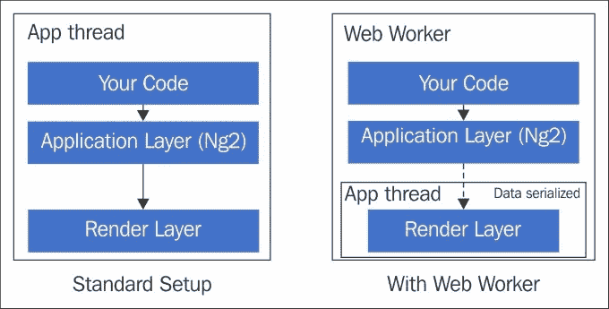

### 注意

观看 Jason Teplitz 的演讲（[`bit.ly/yt-ng2-web-worker`](http://bit.ly/yt-ng2-web-worker)）了解 Web Worker 的优势。

## 高性能移动体验

Angular 的渲染抽象再次为我们打开了许多集成途径，特别是在移动平台上。与其在移动浏览器上运行应用程序，不如创建可以利用设备原生 UI 功能的 Angular 渲染器。

在此领域中两个值得注意的项目是平台的渲染器：

+   **ReactNative** ([`bit.ly/rnative`](http://bit.ly/rnative))：ReactNative 的渲染器（[`bit.ly/ng2-rnative`](http://bit.ly/ng2-rnative)）。它允许使用 ReactNative 的渲染能力编写 Angular 2 应用程序。

+   **NativeScript** ([`www.nativescript.org/`](https://www.nativescript.org/))：Angular 和 NativeScript 团队合作创建了 NativeScript 的渲染器（[`bit.ly/ng2-native-script`](http://bit.ly/ng2-native-script)）。

应用平台，如*ReactNative*和*NativeScript*，已经非常出色地为原生移动平台（iOS 和 Android）提供了基于 JavaScript 的 API，使我们能够利用单一的代码库和熟悉的语言。Angular 渲染器将事情推向了更高层次。通过与 Angular 集成，大量代码可以在浏览器和移动设备之间共享。只有视图模板和与视图相关的服务（如对话框、弹出窗口等）可能有所不同。

查看各自渲染器的文档，了解它们的工作原理和支持的功能。

接下来，我们将在*变更检测*方面进行框架改进。

## 改进变更检测

Angular 2 相对于 Angular 1 的主要性能改进之一是*变更检测*的工作方式。Angular 2 的变更检测开箱即用，速度非常快，而且可以进一步调整以获得更好的结果。

接下来的几节将深入讨论 Angular 变更检测。这是一个重要的主题，当构建大规模应用时需要了解。它还有助于我们调试一些看似变更检测不起作用的情况。

让我们从理解什么是变更检测以及为什么它很重要开始讨论。

### 变更检测

Angular 的*数据绑定引擎*很好地将视图与模型数据（组件数据）进行绑定。这些是实时绑定，Angular 会保持视图与模型更改同步。每当模型更改时，绑定引擎会重新渲染依赖于模型的视图部分。为了管理这种视图模型同步，Angular 需要知道模型何时发生了变化以及发生了什么变化。这就是**变更检测**的全部内容。在应用程序执行期间，Angular 经常进行我们所谓的**变更检测运行**，以确定发生了什么变化。

### 注意

如果您熟悉 Angular 1，*变更检测运行*大致相当于**脏检查循环**，只是在 Angular 2 中没有循环。

虽然保持模型和视图同步的问题听起来很简单，但实际上却很棘手。与组件树不同，多个模型之间的相互关联可能很复杂。一个组件模型的变化可能会触发多个组件模型的变化。此外，这些相互关联可能会形成循环。单个模型属性可能绑定到多个视图。所有这些复杂的情况都需要使用强大的变更检测基础设施来管理。

在接下来的几节中，我们将探讨 Angular 变更检测基础设施的工作原理，变更检测触发的时机，以及我们如何影响 Angular 中的变更检测行为。

### 变更检测设置

一切都始于 Angular 为视图上渲染的每个组件设置变更检测器。由于每个 Angular 应用程序都是一个组件层次结构，这些变更检测器也是按照相同的层次结构设置的。以下图表突出显示了*Workout Builder*应用程序在某个时间点的**变更检测器层次结构**：

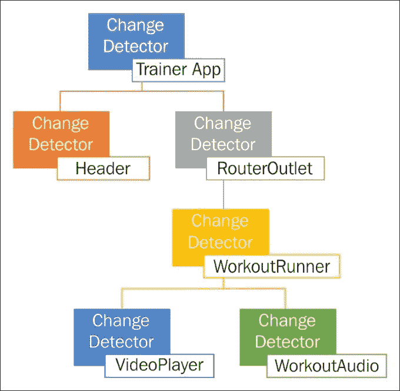

附加到组件的*变更检测器*负责检测组件中的变化。它通过解析组件模板 HTML 上的绑定来实现，并设置必要的变更检测监视。

请记住，检测器只在模板中使用的模型属性上设置监视，而不是在所有组件属性上。

另一个值得强调的重要点是*变更检测是单向的，从模型到视图*。Angular 没有双向数据绑定的概念，因此前面的图是一个没有循环的有向树。这也使得变更检测更加可预测。禁止交错地更新模型和视图。

### 何时启动变更检测？

Angular 是否会不断检查模型数据的变化？考虑到我们绑定视图的组件属性并不继承自任何特殊类，Angular 无法知道哪个属性发生了变化。Angular 唯一的出路就是不断查询每个数据绑定的属性，了解它的当前值，并将其与旧值进行比较以检测变化。至少可以说这是非常低效的！

Angular 做得比这更好，因为变更检测运行只会在应用程序执行过程中的特定时间执行。仔细考虑任何 Web 应用程序；是什么导致视图更新？

视图可能因为以下原因而更新：

+   **用户输入/浏览器事件**：我们点击按钮，输入一些文本，滚动内容。这些操作中的每一个都可以更新视图（和底层模型）。

+   **远程 XHR 请求**：这是视图更新的另一个常见原因。从远程服务器获取数据以显示在网格上，以及获取用户数据以渲染视图都是这种情况的例子。

+   **setTimeout 和 setInterval 定时器**：事实证明，我们可以使用`setTimeout`和`setInterval`来异步执行一些代码，并在特定间隔内执行。这样的代码也可以更新模型。例如，`setInterval`定时器可以定期检查股票报价并在 UI 上更新股价。

出于明显的原因，Angular 的变更检测也只有在这些条件发生时才会启动。

有趣的地方不在于 Angular 的变更检测何时启动，而在于 Angular 如何拦截所有*浏览器事件*、*XHR 请求*以及`setTimeout`和`setInterval`函数。

在 Angular 中，这一功能是由一个叫做**zone.js**的库执行的。正如文档所描述的：

> *区域是一个持续存在的执行上下文，跨越异步任务。*

这个库的一个基本能力是它可以钩入一段代码，并在代码执行开始和结束时触发回调。被监视的代码可能是一系列既同步又异步的调用。考虑下面的例子，突出了使用方法：

```ts
let zone = new NgZone({ enableLongStackTrace: false });     
let doWork = function () { 
  console.log('Working'); 
}; 

zone.onMicrotaskEmpty.subscribe((data:any) => { 
  console.log("Done!"); 
}); 

zone.run(() => { 
  doWork(); 
    setTimeout(() => { 
        console.log('Hard'); 
        doWork(); 
    }, 200); 
    doWork(); 
}); 

```

我们将一段代码包装在`zone.run`调用中。这段代码两次同步调用`doWork`函数，并与一个`setTimeout`调用交错，该调用在 200 毫秒后调用相同的函数。

通过将这个序列包装在`zone.run`中，我们可以知道调用执行何时完成。在区域术语中，这些是**轮次**。在`zone.run`之前的代码设置了一个订阅者，当执行完成时会被调用，使用`zone.onMicrotaskEmpty`函数：

如果我们执行上述代码，日志看起来像：

```ts
Working  // sync call 
Working  // sync call 
**Done!   // main execution complete**  
Hard     // timeout callback 
Working  // async call 
**Done!   // async execution complete**

```

`onMicrotaskEmpty`订阅会执行两次，一次是在顺序执行完成后（在`run`回调中定义），一次是在异步的`setTimeout`执行完成后。

Angular 2 变化检测使用相同的技术在区域内执行我们的代码。这段代码可能是一个*事件处理程序*，在完成之前内部进行更多的同步和异步调用。或者它可能是一个`setTimeout`/`setInterval`操作，可能再次需要 UI 更新。

Angular 变化检测框架订阅执行区域的`onMicrotaskEmpty`可观察对象，并在每个轮次完成时启动变化检测。以下图表突出显示了当类似于刚才描述的代码在按钮点击时运行时会发生什么：

当变化检测启动时是什么时候？

### 注意

在代码块执行期间，如果区域库确定调用是异步的，它会生成一个新的微任务，具有自己的生命周期。这些微任务的完成也会触发`onMicrotaskEmpty`。

如果你想知道在 Angular 内部变化检测触发器是什么样的，这里是从 Angular 源代码中摘录的一部分（进一步简化）：

```ts
class ApplicationRef_ { 

  private _changeDetectorRefs:ChangeDetectorRef[] = []; 

  constructor(private zone: NgZone) { 
    this.zone.onMicrotaskEmpty 
      .subscribe(() => this.zone.run(() => this.tick()); 
  } 

  tick() { 

    this._changeDetectorRefs.forEach((detector) => { 
      detector.detectChanges(); 
    }); 
  } 
} 

```

`ApplicationRef`类跟踪整个应用程序中附加的所有变化检测器，并在应用程序级别的区域对象触发`onMicrotaskEmpty`事件时触发变化检测周期。我们很快将会讨论在这个变化检测期间发生了什么。

*Zonejs*能够跟踪任何异步调用的执行上下文，因为它覆盖了默认的浏览器 API。这种覆盖，也称为**monkey patching**，覆盖了*事件订阅*、*XHR 请求*和`setTimeout`/`setInterval`API。在之前突出的示例中，我们调用的`setTimeout`是原始浏览器 API 的一个 monkey-patched 版本。

现在我们知道了变化检测器是如何设置的以及何时启动这一活动，我们可以看看它是如何工作的。

### 变化检测是如何工作的？

一旦变化检测器设置好并且浏览器 API 被修改以触发变化检测，真正的变化检测就开始了。这是一个非常简单的过程。

一旦触发了任何异步事件回调（事件处理程序的执行也是异步活动），Angular 首先执行我们附加到回调的应用程序代码。这段代码执行可能会导致一些模型更新。在回调执行后，Angular 需要通过触发*变化检测运行*来响应这些变化。

在变化检测运行中，从组件树顶部开始，每个变化检测器评估其相应组件的模板绑定，以查看绑定表达式的值是否发生了变化。

关于这种执行，有一些需要强调的事情：

+   Angular 使用严格的相等性检查（使用`===`）来检测变化。由于它不是深度比较，对于引用对象的绑定，Angular 只会在对象引用发生变化时更新视图。

+   变化检测流是单向的（从根开始），从父级向子级以自顶向下的方式运行。父组件上的检测器在子检测器之前运行。

默认情况下，变化检测算法会导航整个树，无论变化是在树的哪个位置触发的。这意味着在每次变化检测运行时都会评估所有绑定。

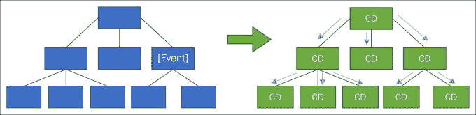

### 注意

在每次运行时进行绑定评估可能看起来效率低下，但实际上并非如此。Angular 采用了一些先进的优化方法，使这种检查变得超快。但是，如果我们想要调整这种行为，我们确实有一些开关可以减少执行的检查次数。我们将很快涉及这个话题。

+   变化检测器只跟踪模板绑定的属性，而不是完整的对象/组件属性。

+   为了检测绑定值的变化，变化检测器需要跟踪上一次变化检测运行期间评估的表达式的先前值。显然，对于我们使用的每个模板绑定，都需要一定数量的簿记。

显而易见的下一个问题是：当变化检测器检测到变化时会发生什么？

由于已经完成了设置变更检测和识别更改的所有艰苦工作，这一步只涉及更新组件状态和同步组件 DOM。

这里还有一些值得注意的观察：

+   首先，Angular 将模型更新步骤与 DOM 更新分开。

考虑以下代码片段，当有人点击按钮时调用：

```ts
        doWork() { 
           this.firstName="David"; 
           this.lastName="Ruiz"; 
        } 

```

假设`firstName`和`lastName`都绑定到了组件视图，对`firstName`的更改不会立即更新 DOM 绑定。相反，Angular 会等待`doWork`函数完成后再触发变更检测运行和 DOM 更新。

+   其次，变更检测运行不会（也不应该）更新模型状态。这避免了任何循环和级联更新。变更检测运行只负责评估绑定并更新视图。这也意味着我们不应该在变更检测期间更新模型状态。如果在变更检测期间更新模型，Angular 会抛出错误。让我们看一个例子：

1.  打开`start.html`并更新最后一个 div 为：

```ts
            <div class="col-sm-3"> 
            Change detection done {{changeDetectionDone()}}
            </div> 

```

1.  并且在组件实现（`start.component.ts`）中添加一个`changeDetectionDone`函数，如下所示：

```ts
            times: number = 0; 
            changeDetectionDone(): number { 
                this.times++; 
                return this.times; 
            } 

```

1.  运行应用程序，加载起始页面，然后查看浏览器控制台。Angular 已记录了一些看起来像这样的错误：

```ts
        EXCEPTION: Expression has changed after it was checked.
        Previous value: 'Change 
        detection done 1'. Current value: 'Change detection done 2' ... 

```

当调用`changeDetectionDone`函数（在插值内部）时，我们正在改变组件的状态，Angular 会抛出错误，因为它不希望组件状态更新。

### 注意

这种变更检测行为仅在未启用 Angular 的**生产模式**时才启用。可以通过在引导应用程序（在`bootstrap.ts`中）之前调用`enableProdMode()`函数来启用 Angular 的*生产模式*。

当启用时，Angular 的行为会有些不同。它会关闭框架内的断言和其他检查。生产模式还会影响变更检测行为。

在非生产模式下，Angular 会遍历组件树两次以检测更改。如果在第二次遍历中任何绑定表达式发生了变化，它会抛出错误。

相比之下，在生产模式下，变更检测树遍历只进行一次。如果启用生产模式，控制台中看到的变更检测错误将不会出现。这可能导致模型和视图状态不一致。这是我们应该注意的事情！

底线是，当变更检测正在进行时，我们不能改变组件的状态。一个直接的推论是：如果我们在绑定表达式中使用函数，函数执行应该是无状态的，没有任何副作用。

+   最后，这种从根节点到叶节点的变更检测遍历只在变更检测运行期间执行一次。

### 注意

对于具有 Angular 1 背景的人来说，这是一个惊喜！*Angular 2 中的 digest 循环计数为 1*。Angular 2 开发人员永远不会遇到“digest 迭代超出异常！”更高性能的变更检测系统！

## 变更检测性能

让我们谈谈变更检测的性能。如果你认为每次检查完整的组件树以进行更改是低效的，你会惊讶地知道它有多快。由于在表达式评估和比较方面进行了一些优化，Angular 可以在几毫秒内执行数千次检查。

在幕后，对于视图绑定中涉及的每个表达式，Angular 都会生成一个特定于特定绑定的变更检测函数。虽然乍一看可能有些反直觉，但 Angular 并没有一个用于确定表达式是否发生变化的通用函数。相反，这就像为我们绑定的每个属性编写自己的变更检测函数。这使得 JavaScript 虚拟机能够优化代码，从而提高性能。

### 注意

想了解更多吗？查看 Victor Savkin 的这个视频：[`youtu.be/jvKGQSFQf10`](https://youtu.be/jvKGQSFQf10)。

尽管进行了所有这些优化，仍然可能存在遍历完整组件树性能不足的情况。特别是当我们需要在视图上呈现大量数据集并保持绑定完整时，这一点尤为真实。好消息是，Angular 变更检测机制可以进行调整。

Angular 需要完成树遍历的原因是，一个地方的模型更改可能会触发其他地方的模型更改。换句话说，模型更改可能会产生级联效应，其中相互连接的模型对象也会更新。由于 Angular 无法知道到底发生了什么变化，它会检查完整的组件树和相关模型。

如果我们可以帮助 Angular 确定应用程序状态的哪些部分已更新，Angular 就可以对需要检查更改的组件树的哪一部分进行智能处理。我们可以通过将应用数据存储在一些特殊的数据结构中来实现这一点，这些数据结构有助于 Angular 决定需要检查哪些组件的更改。

我们可以通过三种方式使 Angular 的变更检测更智能。

### 使用不可变数据结构

**不可变对象/集合**是一旦创建就无法更改的对象。任何属性更改都会导致创建一个新对象。这就是流行的不可变数据结构库**immutable.js**的说法：

> *一旦创建，不可变数据就无法更改，从而大大简化了应用程序开发，无需进行防御性复制，并且可以使用简单的逻辑实现高级记忆和变更检测技术。*

让我们试着了解不可变数据结构如何在 Angular 上下文中帮助的一个例子。

想象一下，我们正在构建一组组件来收集**人力资源**（**HR**）软件的员工信息。员工组件视图看起来像这样：

```ts
<Employee> 
<summary [model]="employee"></employee> 
<personal [model]="employee.personal"></personal> 
<professional  
[model]="employee.professional"></professional> 
<address [model]="employee.home"></address> 
   <address [model]="employee.work"></address> 
</Employee> 

```

它有用于输入个人、专业和地址信息的部分。`summary`组件为正在输入的员工数据提供只读视图。每个组件都有一个名为`model`的属性，突出显示这些组件操作的员工数据的哪一部分。每个这些组件的 summary、professional、personal 和 address 内部可能有其他子组件。这就是组件树的样子：

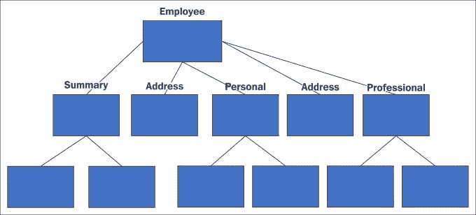

当我们更新员工的个人信息时会发生什么？对于标准对象（可变的），Angular 无法对数据的形状和所有更改做出任何假设；因此，它会进行完整的树遍历。

不可变性在这里如何帮助？当使用不可变的数据结构时，对对象属性的任何更改都会导致创建一个新对象。例如，如果我们使用一个流行的库*immutablejs*来创建一个不可变的对象：

```ts
personalInfo = Immutable.Map({ name: 'David', 'age': '40' }); 

```

对`personalInfo`的`name`或`age`属性的更改会创建一个新对象：

```ts
newPersonalInfo = personalInfo.set('name', 'Dan'); 

```

如果员工模型的每个属性（`personal`、`professional`、`home`和`work`）都是不可变的，这种不可变性就会派上用场。

以`PersonalInfo`组件定义为例，该组件绑定到个人信息数据：

```ts
 @Component({ 
  selector:'personal', 
  template: ` 
    <h2>{{model.name}}</h2> 
    <span>{{model.age}}</span>`, 
 **changeDetection: ChangeDetectionStrategy.OnPush** 
}) 
class PersonalInfo { 
  @Input() model; 
} 

```

由于`PersonalInfo`所依赖的唯一事物是`model`属性，而`model`属性绑定到一个不可变对象，因此只有在`model`引用发生变化时，Angular 才需要进行变化检测。否则，完整的`PersonalInfo`组件子树可以被跳过。

通过将`PersonalInfo`组件属性`changeDetection`设置为`ChangeDetectionStrategy.OnPush`，我们指示 Angular 只在组件的输入发生变化时触发变化检测。

如果我们将每个 Employee 组件子代的变化检测策略更改为`OnPush`，并更新员工的个人信息，那么只有`PersonalInfo`组件子树会被检查是否有变化：

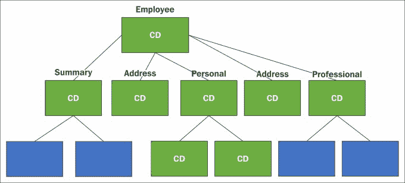

对于大型组件树，这样的优化将大大提高应用程序/视图性能。

### 注意

当设置为`OnPush`时，Angular 只有在组件的输入属性发生变化或组件或其子代内部触发事件时才会触发变化检测。

使用不可变数据结构开发应用程序偏离了标准的开发范式，其中应用状态是完全可变的。我们在本节中重点介绍了 Angular 如何利用不可变数据结构来优化变化检测过程。

*可观察对象*是另一种数据结构，可以帮助我们优化 Angular 的变化检测。

### 使用可观察对象

**可观察对象**是在其内部状态发生变化时触发事件的数据结构。Angular 的*事件基础设施*广泛使用*可观察对象*来将组件的内部状态传达给外部世界。

虽然我们已经使用可观察对象*输出属性*（`EventEmitter`类）来触发事件，但*输入属性*也可以接受可观察对象。这样的可观察对象输入可以帮助 Angular 优化变化检测。

使用可观察对象时，变化检测开关仍然保持为`ChangeDetectionStrategy.OnPush`。但这次，只有当组件输入触发事件（因为它们是可观察的）时，Angular 才会执行脏检查。当输入触发事件时，从受影响的组件到根的完整组件树路径都被标记为需要验证。

在执行视图更新时，Angular 只会同步受影响的路径，忽略其余部分的树。

### 手动变化检测

我们实际上可以完全禁用组件上的变更检测，并在需要时触发手动变更检测。要禁用变更检测，我们只需要将组件特定的变更检测器（`ChangeDetectorRef`类的实例）注入到组件中，并调用`detach`函数：

```ts
constructor(private ref: ChangeDetectorRef) { 
    ref.detach(); 
} 

```

现在，我们需要通知 Angular 在何时检查组件的变更。

### 注意

我们可以使用`ChangeDetectorRef`上的`reattach`函数将组件重新附加到变更检测树上。

`ChangeDetectorRef`类有两个可用于手动变更检测的函数：

+   `markForCheck`：这标记了从检测器到根的路径进行脏检查。请记住，实际的脏检查只有在所有应用程序代码执行完毕后才会执行，而不是在我们调用`markForCheck`时立即执行。这段代码展示了这个函数的使用：

```ts
        this._userService.getUserDetails() 
        .subscribe((user)=>  
        { this.user = user; ref.markForCheck();} 

```

+   `detectChanges`：此函数实际上在调用它的组件（及其子组件）上执行变更检测。使用`detectChanges`就像将树与应用程序的其余部分隔离开，并执行局部变更检测。

除非标准变更检测变得昂贵，我们很少需要禁用标准变更检测设置。

举个例子，一个公共聊天室应用程序，它接收来自连接到它的成千上万人的消息。如果我们不断地拉取消息并刷新 DOM，应用程序可能会变得无响应。在这种情况下，我们可以禁用聊天应用程序组件树的部分的变更检测，并在特定间隔手动触发变更检测以更新 UI。

虽然我们已经看到了三种调整变更检测行为的方法，但好处在于这些方法并不是互斥的。组件树的部分可以使用不可变数据结构，部分可以使用 observables，部分可以使用手动变更检测，其余部分仍然可以使用默认的变更检测。Angular 将乐意配合！

现在关于变更检测就说到这里。除非我们正在构建一些具有繁忙 UI 的大型视图，否则我们可能永远不需要它。这种情况需要我们从变更检测系统中挤出每一点性能，而系统已经为此做好了准备。

接下来，我们将看一下大多数应用程序不可避免地具有的另一个常见需求：对其用户进行身份验证。

# 处理身份验证和授权

大多数，如果不是所有的应用程序都有要求对其用户进行身份验证/授权。我们可以说身份验证和授权更多是服务器的问题而不是客户端的问题，这是正确的。但是，客户端需要适应并与服务器强加的身份验证和授权要求进行集成。

在典型的应用程序执行工作流程中，应用程序首先加载部分视图，然后从服务器获取数据，并最终将数据绑定到其视图。显然，视图和远程数据 API 是需要进行安全保护的两个资产。

为了保护这些资源，您需要了解典型应用程序在服务器上是如何安全的。保护任何 Web 应用程序主要有两种广泛的方法：*基于 Cookie 的身份验证*和*基于令牌的身份验证*。它们每个都需要在客户端部分进行不同的处理。接下来的两节描述了我们如何与这两种方法中的任何一种集成。

## 基于 Cookie 的身份验证

如果服务器堆栈支持，这种身份验证机制是最容易实现的。它是非侵入性的，可能对 Angular 应用程序的更改要求最少。**基于 Cookie 的身份验证**涉及设置浏览器 cookie 以跟踪用户身份验证会话。下面的序列图解释了典型的基于 Cookie 的身份验证工作流程：

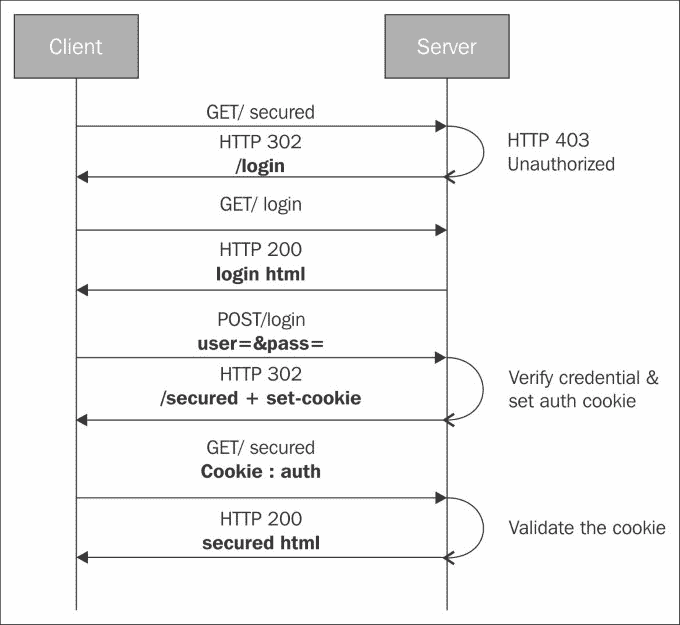

以下是典型的身份验证工作流程：

+   当尝试从浏览器访问受保护的资源时，如果用户未经身份验证，服务器会发送 HTTP 401 未经授权状态码。正如我们将在后面看到的那样，如果请求中没有附加 cookie 或者 cookie 已过期/无效，用户请求就是未经授权的请求。

+   这个未经授权的响应被服务器或者有时是客户端框架（在我们的情况下是 Angular）拦截，通常会导致 302 重定向（如果被服务器拦截）。重定向的位置是登录页面的 URL（登录页面允许匿名访问）。

+   然后用户在登录页面上输入用户名和密码，并对登录端点进行 POST。

+   服务器验证凭据，设置浏览器 cookie，并将用户重定向到原始请求的资源。

+   因此，身份验证 cookie 是每个请求的一部分（由浏览器自动添加），服务器使用此 cookie 来确认用户的身份和用户是否已经通过身份验证。

### 注意

这种情况假设 HTML 和 API 存在于单个域下。

正如我们所看到的，采用这种方法，Angular 基础设施并不涉及；或者涉及很少。甚至登录页面可以是一个标准的 HTML 页面，只需将数据发送到登录端点进行身份验证。如果用户登陆到 Angular 应用程序，这意味着用户已经通过了身份验证。

### 注意

基于 cookie 的身份验证流程可能会根据服务器框架而有所不同，但设置一个 cookie 并在随后的每个请求中附加一个 cookie 的一般模式仍然是相同的。

在基于 cookie 的应用程序身份验证中，如果应用程序想要获取用户上下文，那么会暴露一个服务器端点（如`/user/details`），返回已登录用户的特定数据。然后客户端应用程序可以实现一个诸如`UserService`的服务，加载并缓存用户配置文件数据。

这里描述的情景假设 API 服务器（返回数据的服务器）和托管应用程序的站点位于单个域中。这并不总是情况。即使对于*个人健身教练*，数据存储在*MongoLab*服务器上，而应用程序存储在不同的服务器上（即使是本地）。我们已经知道这是一个跨域访问，并且它带来了自己一套挑战。

在这样的设置中，即使 API 服务器能够验证请求并向客户端发送一个 cookie，客户端应用程序仍然不会在随后的请求中发送身份验证 cookie。

为了解决这个问题，我们需要在 XHR 请求中将一个布尔变量`withCredentials`设置为`true`。这可以通过覆盖`BaseRequestOptions`（`withCredentials`属性）在全局级别启用。框架使用`BaseRequestOptions`类作为默认的 HTTP 请求选项。请参阅下一节，*基于令牌的身份验证*，了解如何覆盖`BaseRequestOptions`。

这也可以通过在每个 HTTP 请求方法的最后一个参数中传递`withCredentials:true`标志来在每个请求级别上启用：

```ts
this.httpService.get(url,{withCredentials:true}); 

```

每个 HTTP 函数的最后一个参数，包括`get`、`post`和`put`，都是一个`RequestOptionsArgs`对象。这允许我们覆盖正在进行的请求的一些属性。

一旦启用了这个标志，客户端浏览器将开始为跨域请求附加身份验证 cookie。

服务器也需要启用**跨域资源共享**（**CORS**），并且需要以特定方式响应请求才能成功。它应该将**access-control-allow-credentials**标头设置为 true，并将**access-control-allow-origin**标头设置为发出请求的主机站点。

### 注意

查看 MDN 文档（[`bit.ly/http-cors`](http://bit.ly/http-cors)）以详细了解这种情况。

基于 cookie 的身份验证在客户端方面确实更省事，但有时您必须返回到基于令牌的访问。这可能是因为：

+   Cookie 和跨域请求在各种浏览器中表现不佳。特别是，IE8 和 IE9 不支持它。

+   服务器可能不支持生成 cookie，或者服务器只暴露基于令牌的身份验证。

+   基于令牌的解决方案易于与原生移动应用程序和桌面客户端集成。

+   令牌不容易受到跨站点请求伪造（CSRF）攻击的影响。

### 注意

要了解有关 CSRF 的更多信息，请查看这里的 CRSF Prevention cheat sheet [`bit.ly/csrf-cs`](http://bit.ly/csrf-cs)。

下一节将讨论支持基于令牌的身份验证。

## 基于令牌的身份验证

基于令牌的访问是指在每个请求中发送令牌（通常在 HTTP 标头中），而不是 cookie。简化的基于令牌的工作流程看起来像这样：

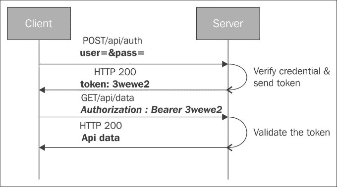

许多公共 API（如*Facebook*和*Twitter*）使用基于令牌的身份验证。令牌的格式、它的去向以及如何生成取决于所使用的协议和服务器实现。使用基于令牌的身份验证的流行服务实施**OAuth 2.0**协议进行令牌生成和交换。

在典型的基于令牌的身份验证设置中，视图是公开可用的，但 API 是受保护的。如果应用程序尝试通过 API 调用拉取数据而没有将适当的令牌附加到传出请求中，服务器将返回 HTTP 401 未经授权的状态代码。

与基于令牌的身份验证系统集成还需要在客户端方面进行相当多的设置。让我们以支持基于令牌的身份验证的*人力资源（HR）*系统为例，以便您了解身份验证工作流程如何与作为客户端的 Angular 应用程序一起工作。

HR 系统有一个显示员工列表和登录页面的页面。它还有用于获取员工列表和生成访问令牌的 API 端点。返回员工列表的 API 端点受基于令牌的访问控制。

工作流程从用户加载员工列表页面开始。视图加载了，但 API 调用失败，服务器返回 *HTTP 401 未经授权*。

在收到 401 HTTP 错误代码时，应用程序应该通过将用户路由到登录视图（记住这是一个单页应用程序）或打开登录弹出窗口来做出响应。

这样的天真实现可能是：

```ts
this._http.get('/api/employees') 
.map(response => response.json()) 
   .catch((error:Response)=>{ 
      if(error.status == 401) { 
         this.router.navigate(['/login']); 
} 
}); 

```

前面实现的最大问题是我们需要为每个需要远程数据访问的组件添加 catch 块，因为调用可能会失败。不太聪明！

相反，我们必须将这个检查集中起来。鉴于 Angular 应用基本上是一个组件树，这样的检查可以添加到顶层组件中。`canActivate` 组件守卫钩子将是添加这个检查的正确位置。

因此，在应用根目录上给出了这个路由配置：

```ts
@const routes: Routes = [ 
    { path: 'home', component: HomeComponent }, 
    { path: 'login', component: LoginComponent } 
]; 

```

为了阻止对 `/home` 的未经授权访问，我们可以实现 `canActivate` 守卫类如下：

```ts
export class AuthGuard implements CanActivate { 
  canActivate() { 
    // Check if there is auth token and return true. 
    return true; 
  } 
} 

```

然后扩展 home 的路由定义以包括这个守卫：

```ts
{ path: 'home', component: HomeComponent,  
**canActivate:[AuthGuard] },**

```

要了解如何实现 `canActivate` 函数，我们需要知道在令牌身份验证期间客户端发生了什么。

使用基于令牌的身份验证，登录页面看起来类似于基于 cookie 的登录页面，但是在登录过程的一部分，服务器会返回一个令牌，而不是在服务器上设置 cookie。这个令牌需要附加到所有后续的安全 API 请求中。因此，这个令牌需要在*浏览器的本地存储*中持久化，并且这是在第一次接收到令牌时完成的。

*身份验证服务*可以执行这样的任务。服务的一个示例实现如下：

```ts
export class AuthService { 
  authenticate(username: string, password: string) { 
    return this.http.post('/login',  
          JSON.stringify({ u: username, p: password })) 
      .map((token: Response) => {  
        localstorage.setItem('token',token); 
        return true; 
      }); 
  } 
} 

```

服务对登录端点进行 HTTP `post`，并在接收到身份验证令牌时，将令牌存储在浏览器的本地存储中。

身份验证后，下一个任务是在访问受保护的 API 资源的后续请求中附加令牌。对于大多数 API 实现，这个令牌需要添加到请求头中。

所有`http`服务函数：`get`，`post`和其他-都需要一个额外的`RequestOptionsArgs`类型参数，用于传递一些额外的参数给请求。我们可以使用`headers`属性为需要授权的 HTTP 请求设置*auth token*。令牌的名称可能根据后端实现而有所不同，但这是一个典型的带有令牌的请求的样子：

```ts
this.http.get('secured/api/users',{ 
headers:{  
'Accept': 'application/json',  
**'Authorization': 'Bearer ' + localStorage.getItem('token')** 
}); 

```

尽管这种方法有效，但非常冗长和繁琐。现在每次调用安全 API 都需要设置这个额外的参数。我们需要一些更好的替代方案。

Angular 有一个`BaseRequestOptions`类，其中包含 HTTP 请求的默认选项。我们可以使用 Angular DI 将`BaseRequestOptions`替换为我们自己的选项。这可以通过继承`BaseRequestOptions`类并在引导期间覆盖`BaseRequestOptions`的 DI 提供程序来实现：

```ts
class MyOptions extends BaseRequestOptions { 
 header:Headers=new Header({ 
'Authorization': 'Bearer ' + localStorage.getItem('token') 
 }); 
} 

bootstrap(App, [HTTP_PROVIDERS, provide(RequestOptions, {useClass: MyOptions})]); 

```

可悲的是，这不起作用！因为在进行身份验证之前授权令牌不可用，所以在引导期间设置`RequestOptions`将导致所有未来的 HTTP 请求上设置一个空的`Authorization`头部。

### 提示

在引导期间覆盖`RequestOptions`只有在我们在那个阶段有必要的内容可用时才有用。

我们还有什么其他选择？与 Angular 1 不同，Angular 2 没有**全局拦截器**可以在请求发出之前用于注入头部。因此，唯一可行的替代方案是创建一个自定义的 HTTP 客户端服务来与安全 API 通信。当可用时，该服务可以透明地附加令牌。

我们已经为此创建了一个示例服务实现，该实现可在[`bit.ly/ng2-auth-svc`](http://bit.ly/ng2-auth-svc)上找到。我们将重点介绍这个`AuthHttp`服务的一些相关部分。

这个`AuthHttp`暴露了与 HTTP 服务相同的接口，它的函数在内部将请求委托给原始的`http`服务。下面的片段详细介绍了两个这样的 HTTP 函数，`get`和`post`：

```ts
public get(url: string, options?: RequestOptionsArgs)  
:Rx.Observable<Response> { 
  return this._request(RequestMethod.Get, url, null,  
  options); 
    } 

public post(url: string, body: string, options?:  
RequestOptionsArgs) :Rx.Observable<Response> { 
  return this._request(RequestMethod.Post, url, body,  
  options); 
} 

```

每个 HTTP 函数包装器内部都调用`_request`私有方法。这个函数大部分工作都是设置 HTTP 授权头部，发出请求和接收响应。函数的实现看起来像这样：

```ts
private _request(method: RequestMethod, url: string,  
 body?: string, options?: RequestOptionsArgs):  
 Rx.Observable<Response> { 
let requestOptions = new RequestOptions(Object.assign({ 
            method: method, 
            url: url, 
            body: body 
    }, options)); 

   if(!requestOptions.headers) { 
      requestOptions.headers = new Headers(); 
   } 

requestOptions.headers.set("Authorization" 
,this._buildAuthHeader()) 

return Rx.Observable.create((observer) => { 
this.process.next(Action.QueryStart); 
this._http.request(new Request(requestOptions)) 
.map(res=> res.json()) 
.finally(() => {  
this.process.next(Action.QueryStop);}) 
            .subscribe( 
            (res) => { 
            observer.next(res); 
            observer.complete();}, 
            (err) => { 
               switch (err.status) { 
               case 401: 
                  //intercept 401 
                  this.authFailed.next(err); 
                  observer.error(err); 
                  break; 
               default: 
                  observer.error(err); 
                  break; 
} 
           }) 
        }) 
    } 

```

在合并请求选项并设置授权标头之后，该函数创建一个自定义可观察对象，使用`http`服务的`request`函数发出请求。在收到响应后，观察者发出响应并标记为完成（没有更多事件）。

在前面的函数中，*401*错误处理有点不同。该函数调用`this.authFailed.next(err)`并在`AuthHttp`类上定义的`EventEmitter`上引发事件：

```ts
authFailed: EventEmitter<any> = new EventEmitter<any>(); 

```

然后它使用`observer.error(err)`触发标准的错误触发机制；

这个事件的用处很快就会变得清楚。

`_buildAuthHeader`的实现很简单，它从浏览器的本地存储中获取授权令牌：

```ts
private _buildAuthHeader(): string { 
    return localStorage.getItem("authToken"); 
} 

```

现在可以注入此服务并用于调用任何安全 API，例如：

```ts
this.authHttp.get('/api/employees') 

```

此调用将在 API 请求中添加授权令牌（如果可用）。

到目前为止我们做了什么？视图已经使用`@CanActivate`装饰器进行了保护，API 端点也是安全的，但仍然有一个需要处理的情况。令牌过期时会发生什么？

当 API 令牌过期时，再次访问 API 端点会导致 401 错误。在这种情况下，应用程序应该要么重定向到登录页面，要么显示登录弹出窗口以继续。

要知道请求失败时，我们再次使用`AuthHttp`服务。可以订阅`AuthHttp`上的`authFailed`事件。订阅和对此事件做出反应的最佳位置将是*根组件实现*。

在应用程序的根组件中，我们只需要做：

```ts
ngOnInit() { 
    this._authHttp.authFailed.subscribe((error)=>{ 
      this._router.navigate(['/login']); 
      // or 
      // this.showLoginDialog(); 
    }); 
} 

```

有了这一点，我们现在已经处理了大部分与基于令牌的身份验证相关的情况。

显然，基于令牌的身份验证，即使灵活，也需要在各种组件/服务之间进行相当数量的设置和协调。

本教程仅概述了向服务器发送令牌的一种机制，但该过程可能根据服务器堆栈而有所不同。在 Angular 中实现基于令牌的身份验证之前，始终参考后端/服务器文档。

### 注意

在编写本书时，并没有太多实现基于令牌的身份验证所需的标准任务的库。未来，在开始之前，请检查是否有相同的流行/成熟社区提供。

我们已经处理了身份验证，但授权呢？一旦用户上下文建立，我们仍然需要确保用户只能访问他/她被允许访问的部分。*授权*仍然缺失。

## 处理授权

与身份验证一样，授权支持也需要在服务器和客户端上实现，尤其是在服务器端而不是客户端。请记住，任何人都可以入侵 JavaScript 代码并规避完整的身份验证/授权设置。因此，无论客户端是否具有必要的检查，都应始终加强服务器基础设施。

这并不意味着我们在客户端不进行任何授权检查。对于标准用户来说，这是防止未经授权访问的第一道防线。

在处理任何应用程序的授权需求时，有三个基本元素是设置的一部分：

+   需要进行安全/授权的资源

+   角色和属于这些角色的用户列表

+   资源和角色之间的映射，定义了谁可以访问什么

从 Angular 应用程序的角度来看，资源是需要限制到特定角色的页面，有时也包括页面的部分。如果用户处于特定角色，根据角色-资源的映射，他们可以访问一些页面；否则他们将被拒绝访问。

虽然在 Angular 应用程序中可以以多种方式实现授权，但我们将概述一种通用实现，可以根据未来的需求进行进一步定制。

### 添加授权支持

要启用授权，我们需要做的第一件事是在整个应用程序中公开已登录用户的数据，包括他/她的角色。

#### 共享用户身份验证上下文

用户上下文可以使用 Angular 服务共享，然后注入到需要授权上下文的组件中。查看此服务接口：

```ts
class SessionContext { 
  currentUser():User { ... }; 
  isUserInRole(roles:Array<string>):boolean { ...}; 
  isAuthenticated:boolean; 
} 

```

`SessionContext`服务跟踪用户登录会话，并提供以下详细信息：

+   已登录用户（`currentUser`）

+   用户是否经过身份验证（`isAuthenticated`）

+   `isUserInRole`函数根据传入`roles`参数的角色，返回`true`或`false`

有了这样一个服务，我们可以为路由添加授权，从而仅限制特定角色访问某些路由。

#### 限制路由

像身份验证一样，`canActivate`守卫检查也可以用于授权。实现一个带有`CanActivate`接口的类，并将`SessionContext`服务注入到构造函数中；然后在`canActivate`函数中使用`SessionContext`服务检查用户是否属于特定角色。请查看以下代码片段：

```ts
export class AuthGuard implements CanActivate { 
  constructor(private session:SessionContext) { } 
  canActivate() { 
    return this.session.isAuthenticated &&  
      session.isUserInRole(['Contributor', 'Admin']); 
  } 
} 

```

现在只有*Contributor*和*Admin*角色的用户才能访问主页。

我们以与*基于令牌的身份验证*部分相同的方式在路由中注册前面的守卫类。

这就是我们授权访问我们的路由的方式。

但是当页面上的视图元素是根据用户的角色渲染时会发生什么？

#### 基于角色有条件地渲染内容

有条件地渲染内容很容易实现。我们只需要根据用户角色显示/隐藏 HTML 元素。我们可以构建一个*结构指令*，比如`ng-if`，它可以在渲染内容之前验证用户是否属于某个角色。指令的使用方式如下：

```ts
<div id='header'> 
<div> Welcome, {{userName}}</div> 
<div><a href='#/setting/my'>Settings</a></div> 
**<div *a2beRolesAllowed='["admin"])'>** 
<a href='#/setting/site'>Site Settings</a> 
</div> 
</div> 

```

前面的代码在渲染**站点设置**超链接之前检查用户是否处于管理员角色。

指令的实现模仿了`ng-if`的工作方式，只是我们的显示/隐藏逻辑取决于`SessionContext`服务。以下是`a2beRolesAllowed`指令的示例实现：

```ts
@Directive({ selector: '[a2beRolesAllowed]' }) 
export class RolesAllowedDirective { 
  private _prevCondition: boolean = null; 
  constructor(private _viewContainer: ViewContainerRef, 
    private _templateRef: TemplateRef, private SessionContext _session) { } 

  @Input() set a2beRolesAllowed(roles: Array<string>) { 
    if (this._session.isUserInRole(roles)) { 
      this._viewContainer 
        .createEmbeddedView(this._templateRef); 
    } 
    else { 
      this._viewContainer.clear(); 
    } 
  } 
} 

```

这是一个使用`SessionContext`和作为输入传递的角色（`a2beRolesAllowed`）来显示或隐藏片段的微不足道的实现。

这将我们带到了身份验证和授权实现的尽头。参考实现演练应该帮助我们将身份验证和授权构建到我们的应用中。有了这个基本的理解，任何设置都可以被调整以处理其他自定义的身份验证/授权场景。

现在是时候解决房间里的大象了：从 Angular 1 迁移到 Angular 2。如果您在 Angular 2 上重新开始，您可以很好地跳过下一节。

# 迁移 Angular 1 应用

如果您在 Angular 1 上进行了大量工作，那么 Angular 2 会提出一些相关的问题：

+   我应该将我的 Angular 1 应用迁移到 Angular 2 吗？

+   框架是否已经准备好投入使用？

+   迁移应该何时发生？

+   迁移是一次性的还是可以分阶段进行？

+   涉及的工作量是多少？

+   今天我能做些什么，以帮助未来的迁移？

+   今天我要开始一个新的 Angular 1 应用。当 Angular 2 发布时，我应该怎么做才能使迁移无缝进行呢？

为了确保过渡尽可能顺利，每个这样的问题都需要得到解决。在接下来的章节中，我们将尝试回答许多这样的问题。作为学习的一部分，我们还将带您逐步将 Trainer 应用的 Angular 1 版本（为本书第一版开发）迁移到 Angular 2。这将帮助每个人做出一些明智的决定，决定何时以及如何迁移到 Angular 2。

“我应该迁移还是不迁移？”这是我们首先要解决的问题。

## 我应该迁移吗？

Angular 2 的出现并不意味着 Angular 1 消失。Angular 1 仍在与 Angular 2 并行进行积极开发。Google 承诺将长时间支持 Angular 1，并且在 Angular 1 中已经发布了一系列版本，其中包括 2016 年 2 月发布的 Angular 1.5。鉴于 Angular 1 短时间内不会消失，我们现在可以从我们应用的角度来考虑。

首先，Angular 2 相比于其前身有什么优势？

### Angular 2 的优势

Angular 2 是为未来设计的，并克服了其前身的许多缺点。在本节中，我们强调了 Angular 2 比 Angular 1 更好的框架的特点。

在决定是否迁移到 Angular 2 时，您应该注意的事项：

+   **更好的行为封装**：诚然，当我们开始学习 Angular 1 时，作用域似乎是上帝赐予的，但现在我们意识到了管理层次性质的作用域是多么困难。Angular 2 中的基于组件的开发在应用状态方面提供了更好的封装。组件管理自己的状态，接受输入，并触发事件：这是一种易于理解的责任清晰划分！

+   **应用代码中的框架减少**：您不需要像作用域这样的特殊对象。DI 使用注解（在 TypeScript 中）。您不需要设置监视。总的来说，当阅读组件代码时，您不会在其中找到框架级别的构造。

+   **更小的框架 API 可供探索**：Angular 1 有许多指令需要了解。而在 Angular 2 模板语法中，与浏览器事件相关的指令已经消失。这减少了需要了解的指令数量。

+   **性能**：与其前身相比，Angular 2 更快。本书的一个完整部分专门讨论了什么使 Angular 2 成为高性能框架。

+   **移动友好**：Angular 2 试图通过利用诸如服务器端渲染和 Web Workers 等技术来优化用户的移动体验。在移动设备上，Angular 2 应用程序比其前身更具性能。

+   **跨平台**：Angular 2 的目标是在大多数设备和各种平台上运行。您可以使用 Angular 2 构建 Web 和移动应用程序。正如我们之前所了解的，渲染层的分离为 Angular 2 的利用提供了大量可能性。

从真正意义上讲，Angular 2 取代了其前身，在一个完美的世界中，每个人都应该在更好的框架/技术上工作。但是，如果您是谨慎的类型，并且希望在事情变得稳定之后尝试 Angular 2，我们建议您今天构建您的 Angular 1 应用程序的方式，以便轻松迁移到 Angular 2。

下一节讨论了今天遵循的 Angular 1 的原则和实践，以便未来方便迁移。

## 今天为易迁移开发 Angular 1 应用程序

Angular 2 是一个范式转变，我们在 Angular 2 中开发组件的方式与 Angular 1 完全不同。为了方便迁移，Angular 1 也应该采用基于组件的开发。如果我们在构建 Angular 1 应用程序时遵循一些准则/原则，就可以实现这一点。接下来的几节将详细介绍这些准则。

### 提示

即使您不打算迁移到 Angular 2，这里列出的建议也是强烈推荐的。这些建议将使 Angular 1 代码更加模块化、有组织和可测试。

### 一个文件一个组件

这可以是任何东西：一个 Angular 1 *控制器*、*指令*、*过滤器*或*服务*。一个文件一个组件可以更好地组织代码并实现轻松迁移，使我们能够清楚地识别已经取得了多少进展。

### 避免内联匿名函数

使用命名函数而不是内联匿名函数来声明控制器、指令、过滤器和服务。这样的声明：

```ts
angular.module('7minWorkout') 
  .controller('WorkoutController',[...]) 

angular.module('app') 
.directive('remoteValidator', [...]) 

angular.module('7minWorkout') 
.filter('secondsToTime', function () { ... } 

angular.module('7minWorkout') 
.factory('workoutHistoryTracker', [...]) 

```

应该转换为：

```ts
function WorkoutController($scope, ...) { ... } 
WorkoutController.$inject = ['$scope', ...]; 

function remoteValidator($parse) {...} 
remoteValidator.$inject=[$parse]; 

function secondsToTime() {...} 

function workoutHistoryTracker($rootScope, ...) { ...} 
workoutHistoryTracker.$inject = ['$rootScope',...]; 

```

使用命名函数的优点是易于调试和迁移到 TypeScript。使用命名函数还要求使用`$inject`函数属性注册依赖项。

### 注意

基于`$inject`的依赖声明可以防止缩小，并增加函数的可读性。

为了避免使用这种方法暴露全局名称函数，建议将函数包装在**立即调用的函数表达式**（**IIFE**）中：

```ts
(function() { 
function WorkoutController($scope, ...) { ... } 
WorkoutController.$inject = ['$scope', ...]; 

   angular 
        .module('7minWorkout') 
        .controller('WorkoutController', WorkoutController); 

})(); 

```

### 避免使用$scope！

是的，你读对了；避免使用$scope 对象或直接使用作用域！

Angular 1 作用域最大的问题是它们的层次结构性质。从子作用域访问父作用域给了我们巨大的灵活性，但代价是很高的。这可能会不知不觉地创建不必要的依赖，使应用程序变得非常难以调试和迁移。相比之下，在 Angular 2 中，视图绑定到其组件实现，不能隐式地访问其边界之外的数据。因此，如果你计划迁移到 Angular 2，*尽量避免使用作用域*。

有许多技术可以用来消除对`$scope`对象的依赖。接下来的几个小节详细阐述了一些可以帮助我们避免 Angular 1 作用域的技术。

#### 在所有地方使用 controller as（控制器别名）语法

Angular 1.3+有*controller as*语法用于*controller*，*directive*和*routes*。*controller as*允许 Angular 1 数据绑定表达式绑定到控制器实例属性，而不是当前作用域对象属性。有了控制器的范式，我们就不需要直接与作用域交互，因此未来的迁移变得容易。

### 注意

虽然控制器别名消除了作用域访问，但在 Angular 1 中仍然存在作用域。完整的 Angular 1 数据绑定基础设施依赖于作用域。控制器别名只是在我们的代码和作用域访问之间增加了一个间接。

在视图中考虑以下*controller as*的语法：

```ts
**<div ng-controller="WorkoutListController as workoutList">** 
   <a ng-repeat="workout in workoutList.workouts"  
      href="#/workout/{{workout.name}}"> 
</div> 

```

对应的控制器实现如下：

```ts
function WorkoutListController($scope, ...) { 
  this.workouts=[]; 
} 

```

`WorkoutListController` as `workoutList`在当前作用域上为`WorkoutListController`创建了一个别名`workoutList`，因此允许我们绑定到控制器上定义的`workouts`属性。

路由定义也允许使用`controllerAs`属性在*路由定义对象*中进行控制器别名：

```ts
$routeProvider.when('/builder/workouts', { 
... 
   controller: 'WorkoutListController', 
 **controllerAs: 'workoutList'** 
 }); 

```

最后，指令也可以使用`controllerAs`，并且与*指令定义对象*上的`bindToController`属性一起，我们可以摆脱任何直接作用域访问。

### 注意

查看关于控制器、路由和指令的 Angular 文档，以对控制器别名语法有基本的了解。还可以查看以下帖子，了解更多关于这个主题的详细示例：[`bit.ly/ng1-controller-as`](http://bit.ly/ng1-controller-as)

### 注意

[`bit.ly/ng1-bind-to`](http://bit.ly/ng1-bind-to)

#### 避免 ng-controller

如果可以避免作用域，那么控制器也可以避免！

这可能再次看起来违反直觉，但这种方法确实有实际好处。我们理想情况下要做的是在 Angular 1 中模拟组件行为。由于在 Angular 1 中最接近组件的东西是*元素指令*（带有`restrict='E'`），我们应该在任何地方都使用*元素指令*。

具有自己模板和隔离作用域的 Angular 1 元素指令可以很好地像 Angular 2 组件一样工作，并且只依赖于其内部状态进行视图绑定。我们只是不需要`ng-controller`。

考虑在*个人健身教练*应用程序的 Angular 1 版本中使用`ng-controller`进行音频跟踪：

```ts
<div id="exercise-pane" class="col-sm-7"> 
... 
  <span ng-controller="WorkoutAudioController"> 
    <audio media-player="ticksAudio" loop autoplay  
     src="content/tick10s.mp3"></audio> 
    <audio media-player="nextUpAudio"  
     src="content/nextup.mp3"></audio> 
    ... 
  </span> 

```

不使用`WorkoutAudioController`，一个元素指令可以封装训练音频的视图和行为。然后，这样的指令可以替换完整的`ng-controller`声明及其视图：

```ts
<div id="exercise-pane" class="col-sm-7"> 
... 
<workout-audio-component></workout-audio-component> 

```

当用元素指令替换`ng-controller`时，控制器依赖的作用域变量应该使用*指令定义对象*上的`bindToController`属性传递给指令。类似这样：

```ts
bindToController: { 
   name: '=', 
   title: '&' 
} 

```

Tero 在这两篇博客文章中广泛讨论了这个主题：

+   [`bit.ly/ng2-no-controllers`](http://bit.ly/ng2-no-controllers)

+   [`bit.ly/ng2-refactor-to-component`](http://bit.ly/ng2-refactor-to-component)

这些是必读的帖子，包含大量信息！

### 使用 Angular 1.5+组件 API 构建

Angular 1.5+有一个**组件 API**，允许我们创建指令，这些指令可以很容易地迁移到 Angular 2。组件 API 预先配置了合理的默认值，因此在构建真正隔离和可重用的指令时，可以合并最佳实践。

查看组件 API（[`bit.ly/ng1-dev-guide-components`](http://bit.ly/ng1-dev-guide-components)）和 Tod Motto 的这篇信息性文章（[`bit.ly/1MahwNs`](http://bit.ly/1MahwNs)）来了解组件 API。

重申之前强调的内容，这些步骤不仅针对简化 Angular 2 迁移，也针对使 Angular 1 代码更好。基于组件的 UI 开发是比我们在 Angular 1 中习惯的更好的范例。

### 提示

我们强烈建议您阅读 Angular 1 风格指南（[`bit.ly/ng2-styleguide`](http://bit.ly/ng2-styleguide)）。这个指南包含了大量的提示/模式，可以让我们构建更好的 Angular 1 应用程序，并且与之前提供的易于迁移到 Angular 2 的指南保持一致。

最后，如果您已经决定迁移，现在是时候决定迁移什么了。

## 迁移什么？

对于处于维护模式的应用程序，其中大部分开发活动都围绕着错误修复和一些增强，坚持使用 Angular 1 是明智的。记住那句老话“*如果它没坏，就别修*。”

如果应用程序正在积极开发并且有明确的长期路线图，考虑迁移到 Angular 2 是值得的。随着我们深入挖掘迁移的复杂性，我们将意识到这个过程所涉及的时间和精力。虽然 Angular 团队已经非常努力地使这次迁移顺利进行，但毫无疑问，这并不是一项琐碎的工作。实际迁移将需要大量的时间和精力。

这里的一线希望是我们不需要一次性迁移所有内容。我们可以慢慢地将 Angular 1 代码库的部分迁移到 Angular 2。两种框架可以共存，也可以相互依赖。这也使我们能够在 Angular 2 中开发应用程序的新部分。这是多么酷！

但是，这种灵活性也是有代价的-字节的代价。由于两种框架都被下载，页面字节会增加，这是我们应该注意的事情。

此外，虽然两种框架的共存使我们能够在不造成太多中断的情况下进行迁移，但我们不能让它成为一个永久性的活动。最终，Angular 1 必须离开，而且越早离开越好。

在迁移过程中，最好的做法是在现有应用程序中划分出新的 SPA。例如，我们可以完全使用 Angular 2 构建应用程序的管理区域，使用单独的主机页面，但仍然共享样式表、图像，甚至 Angular 1 服务的公共基础设施，如果我们稍微重构代码。正如我们将在后面学到的，将服务迁移到 Angular 2 是最容易的。

将应用程序分解为多个较小的应用程序会引入全页刷新，但在迁移时，这是一种更清晰的方法。

考虑到所有这些，如果您已经决定迁移并确定了迁移的区域，您需要为迁移做好准备工作。

## 为 Angular 2 迁移做准备

欢迎来到 Angular 2 迁移的大胆世界！成功的迁移策略包括确保我们事先做好准备，从而避免任何晚期的意外。

作为准备工作，第一步是从第三方库依赖的角度分析应用程序。

### 识别第三方依赖

任何 Angular 1 应用程序使用的第三方库也需要一个迁移策略。这些可能是基于 jQuery 的库或 Angular 1 库。

#### jQuery 库

在 Angular 1 中使用 jQuery 库是通过在其上创建一个指令包装器来消耗的。我们将不得不将这些指令迁移到 Angular 2。

#### Angular 1 库

迁移 Angular 1 库有点棘手。Angular 1 有一个庞大的生态系统，而 Angular 2 是一个新生事物。Angular 2 社区的成果要像 Angular 1 那样丰富还需要一些时间。因此，对于我们使用的每个 Angular 1 库，我们需要在 Angular 2 中找到一个替代品，或者创建一个，或者完全摆脱这个库。

以每个如此受欢迎的 UI 框架**ui-bootstrap**（[`bit.ly/ng1-ui-bootstrap`](http://bit.ly/ng1-ui-bootstrap)）为例。目前有多个项目正在重写这个库以适配 Angular 2，但都尚未完成。如果我们依赖*ui-bootstrap*：

+   我们可以使用端口，假设我们想要使用的组件已经迁移。这里值得注意的端口有**ng-bootstrap**（[`goo.gl/3dHkaU`](https://goo.gl/3dHkaU)）和**ng2-bootstrap**（[`goo.gl/u4hOJn`](https://goo.gl/u4hOJn)）。

+   或者等待端口完成。

+   或者采取更激进的方法，在 Angular 2 中构建我们自己的 bootstrap 库。

这些选择每一个在时间和复杂性方面都有权衡。

还需要做出的另一个选择是开发语言。我们应该使用 TypeSript、ES2015 还是普通的旧 JavaScript（ES5）？

### 语言的选择

我们肯定会推荐使用 TypeScript。这是一种非常棒的语言，与 Angular 2 集成非常好，大大减少了 Angular 2 声明的冗长。而且，它可以与 JavaScript 共存，使我们的生活更加轻松。即使没有 Angular 2，TypeScript 也是我们应该在 Web 平台上采用的一种语言。

在接下来的章节中，我们将把 Angular 1 **个人教练**应用迁移到 Angular 2。该应用当前可在*GitHub*上找到，网址为[`bit.ly/a1begit`](http://bit.ly/a1begit)。该应用是本书第一版*AngularJS by Example*的一部分，是用 JavaScript 构建的。

### 注意

我们将再次遵循基于检查点的方法进行迁移。在迁移过程中我们突出的检查点已经实现为 GitHub 分支。只是这一次，没有伴随的代码库可供下载。

由于我们将与 v1 代码的*git*存储库进行交互，并使用 N*ode.js*工具进行构建，请在继续之前在开发环境中设置*git*和*nodejs*。

# 迁移 Angular 1 的个人教练

甚至在我们开始迁移过程之前，我们需要在本地设置 v1 *个人教练*。

迁移后的应用代码可以从 GitHub 网站[`github.com/chandermani/angularjsbyexample`](https://github.com/chandermani/angularjsbyexample)下载。由于我们是分阶段迁移，我们创建了多个检查点，这些检查点对应于专门用于迁移的**GitHub 分支**。例如`ng2-checkpoint8.1`、`ng2-checkpoint8.2`等分支突出了这一进展。在叙述过程中，我们将突出显示分支以供参考。这些分支将包含到目前为止在应用上完成的工作。

### 注意

*7 分钟锻炼*代码位于名为`trainer`的存储库文件夹中。

那么让我们开始吧！

## 在本地设置 Angular 1 的个人教练

按照以下步骤，您将很快就能上手：

1.  从命令行中，克隆 v1 github 存储库：

```ts
**git clone https://github.com/chandermani/angularjsbyexample.git**

```

1.  导航到新的 git 存储库并检出`ng2-base`分支以开始：

```ts
**cd angularjsbyexample**
**git checkout ng2-base**

```

1.  由于该应用从**mLab**中托管的**MongoDB**中加载其锻炼数据（[`mlab.com/`](https://mlab.com/)），您需要一个 mLab 账户来托管与锻炼相关的数据。通过注册 mLab 账户来设置 mLab 账户。一旦您有了 mLab 账户，您需要从 mLab 的管理门户中检索您的 API 密钥。请按照 API 文档提供的说明([`bit.ly/mlab-docs`](http://bit.ly/mlab-docs))获取您的 API 密钥。

1.  一旦您获得 API 密钥，请在`app/js/config.js`中更新此行与您的 API 密钥：

```ts
        ApiKeyAppenderInterceptorProvider 
        .setApiKey("<yourapikey>"); 

```

1.  并将一些种子锻炼数据添加到您的 mLab 实例中。将种子数据添加到 mLab 的说明在源代码文件`app/js/seed.js`中可用。

1.  接下来，安装 v1 *Personal Trainer*所需的必要*npm 包*：

```ts
**cd trainer/app**
**npm install**

```

1.  安装**http-server**；它将作为我们 v1 应用的开发服务器：

```ts
**npm i http-server -g**

```

通过从`app`文件夹启动`http-server`来验证设置是否完成：

```ts
**http-server -c-1**

```

并打开浏览器位置`http://localhost:8080`。

v1 *Personal Trainer*的起始页面应该显示出来。玩转应用程序以验证应用程序是否正常工作。现在迁移可以开始了。

## 识别依赖关系

在我们开始迁移 v1 *Personal Trainer*之前的第一步是识别我们在 Personal Trainer 的 Angular 1 版本中使用的外部库。

我们在 v1 中使用的外部库有：

+   `angular-media-player`

+   `angular-local-storage`

+   `angular-translate`

+   `angular-ui-bootstrap`

+   `owl. carousel`

像*angular-media-player*和*angular-local-storage*这样的库很容易迁移/替换。我们在本书的早期章节中已经做过这个。

*angular-translate*可以用*ng2-translate*替换，正如我们将在接下来的章节中看到的，这并不是一个非常具有挑战性的任务。

我们在*Personal Trainer*中使用*angular-ui-bootstrap*来进行**模态对话框**。*ng2-bootstrap* ([`bit.ly/ng2-bootstrap`](http://bit.ly/ng2-bootstrap))是一个值得接替的版本，并计划与旧版本的 bootstrap 具有 1-1 的对应关系，但在撰写本书时，模态对话框的实现还在进行中；因此我们不得不寻找替代方案。

还有另外两个专门针对模态对话框的库：**angular2-modal** ([`bit.ly/ng2-modal`](http://bit.ly/ng2-modal))和**ng2-bs3-modal** ([`bit.ly/ng2-bs3-modal`](http://bit.ly/ng2-bs3-modal))。我们可以选择其中一个并摆脱*angular-ui-bootstrap*库。

*Owl. Carousel*是一个 jQuery 库，我们可以编写一个 Angular 2 组件来包装这个插件。

现在我们已经解决了外部依赖关系，让我们决定要使用的语言。

虽然现有的代码库是 JavaScript，但我们喜欢 TypeScript。它的类型安全性，简洁的语法以及与 Angular 2 的良好兼容性使其成为我们的首选语言。因此，我们将全面采用 TypeScript。

另一个倾向于选择 TypeScript 的因素是我们不需要将现有的代码库迁移到 TypeScript。我们迁移/构建新的任何东西，都会用 TypeScript 构建。遗留代码仍然保留在 JavaScript 中。

让我们开始吧。作为第一个迁移任务，我们需要为我们的 v1 Personal Trainer 设置一个模块加载器。

## 设置模块加载器

由于我们将在许多小文件中创建许多新的 Angular 2 组件，直接添加脚本引用将变得繁琐且容易出错。我们需要一个模块加载器。模块加载器可以帮助我们：

+   基于一些常见模块格式创建隔离/可重用模块

+   根据依赖关系管理脚本加载顺序

+   允许对模块进行捆绑/打包，并在开发/生产部署时进行按需加载

我们也使用**SystemJS**模块加载器进行此迁移。

使用命令行安装 SystemJS：

```ts
**npm i systemjs --save**

```

### 注意

所有命令都需要从`trainer/app`文件夹中执行。

我们打开`index.html`并删除所有应用程序脚本的脚本引用。应删除所有源为`src='js/*.*'`的脚本引用，除了`angular-media-player.js`和`angular-local-storage.js`，因为它们是外部库。

### 注意

注意：我们不会删除第三方库的脚本引用，只删除应用程序文件。

在所有第三方脚本引用之后添加 SystemJS 配置：

```ts
<script src="js/vendor/angular-local-storage.js"</script> 
**<script src="node_modules/systemjs/dist/system.src.js">**
**</script>**
**<script>**
 **System.config({ packages: {'js': {defaultExtension: 'js'}}});**
 **System.import('js/app.js');**
**</script>**

```

在 body 标签上删除`ng-app`属性，保持`ng-controller`声明不变：

```ts
<body ng-controller="RootController"> 

```

`ng-app`引导的方式必须消失，因为我们要切换到`angular.bootstrap`函数。手动引导有助于我们将 Angular 2 引入其中时。

前面的`SystemJS.import`调用通过加载`js/app.js`中定义的第一个应用程序模块来加载应用程序。我们将很快定义这个模块。

在与`app.js`相同的文件夹中创建一个名为`app.module.js`的新文件，并将`app.js`的全部内容复制到`app.module.js`中。

### 注意

记住要摆脱`use strict`语句。TypeScript 编译器不喜欢它。

所有应用程序模块定义都不在`app.module.js`中。

接下来，清空`app.js`并添加以下导入和引导代码：

```ts
**import  './app.module.js';** 
import  './config.js'; 
import  './root.js'; 
import './shared/directives.js'; 
import './shared/model.js'; 
import './shared/services.js'; 
import './7MinWorkout/services.js'; 
import './7MinWorkout/directives.js'; 
import './7MinWorkout/filters.js'; 
import './7MinWorkout/workout.js'; 
import './7MinWorkout/workoutvideos.js'; 
import './WorkoutBuilder/services.js'; 
import './WorkoutBuilder/directives.js'; 
import './WorkoutBuilder/exercise.js'; 
import './WorkoutBuilder/workout.js'; 

angular.element(document).ready(function() { 
  angular.bootstrap(document.body, ['app'],  
{ strictDi: true }); 
}); 

```

我们已经在`app.js`中添加了*ES6 导入语句*。这些是之前在`index.html`中引用的相同脚本。现在 SystemJS 在加载`app.js`时会加载这些脚本文件。

将所有的 Angular 1 模块声明移到一个新文件`app.module.js`中，并首先在`app.js`中导入它，以确保在执行任何`import`语句之前定义了 Angular 1 模块。

### 提示

不要混淆*ES6 模块*和使用`angular.module('name')`定义/访问的*Angular 2 模块*。这两个概念完全不同。

最后几行使用`angular.bootstrap`函数引导了 Angular 1 应用程序。

模块加载现在已启用；让我们也启用 TypeScript。

## 启用 TypeScript

要启用 TypeScript，请使用*npm*安装 TypeScript 编译器：

```ts
**npm i typescript -g**

```

我们还可以安装 TypeScript*类型定义管理器*，允许我们为我们使用的库使用类型定义：

```ts
**npm i typings --save-dev**

```

### 注意

**类型定义**或**typings**是定义 TypeScript/JavaScript 库的公共接口的文件。这些类型定义帮助 IDE 在库函数周围提供智能感知。大多数流行的 JavaScript 库和 TypeScript 编写的框架/库都有类型定义。

接下来，打开`package.json`并在脚本配置内添加以下行：

```ts
"scripts": { 
    "test": "echo "Error: no test specified" && exit 1" 
 **"tsc": "tsc -p . -w",** 
 **"typings": "typings"** 
  } 

```

### 注意

我们刚刚添加的两个`scripts`属性用于提供常用脚本的快捷方式。请参考以下示例，我们使用`typings`命令来安装`typings`（`npm run typings`）。

为 Angular 1 和 jQuery 安装*类型定义*。从命令行运行：

```ts
**npm run typings install dt~jquery dt~angular dt~angular-route dt~angular-resource dt~angular-mocks dt~core-js dt~angular-ui-bootstrap -- --save --global** 

```

### 提示

如果安装*typings*时遇到问题，请确保安装的`typings`包是最新的，然后重试。我们可以使用此命令检查包的最新版本：

```ts
npm show typings version
```

### 提示

使用命令行更新`package.json`到最新版本，并调用`npm install`。

现在我们需要为 TypeScript 编译器设置一些配置。创建一个名为`tsconfig.json`的文件（在`trainer/app`文件夹中），并从`ng2-checkpoint8.1`存储库分支（也可以远程获取[`bit.ly/ng2be-8-1-tsconfig`](http://bit.ly/ng2be-8-1-tsconfig)）复制配置：运行编译器：

```ts
**npm run tsc**

```

这应该启动 TypeScript 编译器，并且不应报告任何错误。

### 注意

在开发过程中，始终在单独的控制台窗口中运行此命令。编译器将持续监视 TypeScript 文件的更改，并在检测到更改时重新构建代码。

将`app.js`和`app.module.js`文件的扩展名更改为`app.ts`和`app.module.ts`。TypeScript 编译器会检测这些更改并编译 TypeScript 文件。编译后，编译器为每个 TypeScript 文件生成两个文件。一个是编译后的 JavaScript 文件（例如`app.js`），另一个是用于调试目的的映射文件（`app.js.map`）。

### 注意

我们没有为这个练习设置复杂的构建，因为我们的主要重点是迁移。

对于您自己的应用程序，初始设置步骤可能会有所不同，这取决于构建的当前设置方式。

在测试新更改之前，需要修复`config.js`，因为我们已经通过以下方式在 Angular 1 中启用了*strict DI check*：

```ts
  angular.bootstrap(document.body, ['app'],  
**{ strictDi: true });**

```

用`ng2-checkpoint8.1`中提供的更新内容或[`bit.ly/ng2be-8-1-configjs`](http://bit.ly/ng2be-8-1-configjs)中提供的更新内容替换`config.js`的内容（*并记得重新设置 API 密钥*）。此更新修复了`config`函数，并使其适用于缩小。是时候测试应用程序了！

确保 TypeScript 编译器在一个控制台中运行；在新的控制台窗口上运行`http-server -c-1`。

导航至`http://localhost:8080;`，应用程序的起始页面应该加载。

提交您的本地更改

### 提示

如果一切正常，甚至可以将您的本地更改提交到 git 存储库。这将帮助您跟踪随着我们逐步迁移应用程序而发生的变化。

到目前为止的实现可在`ng2-checkpoint8.1` GitHub 分支中找到。

如果您遇到问题，请比较`ng2-base`和`ng2-checkpoint8.1`分支，以了解所做的更改。由于代码托管在 GitHub 上，我们可以使用*GitHub 比较*界面来比较单个分支中的提交。请参阅此处的文档以了解如何操作：[`bit.ly/github-compare`](http://bit.ly/github-compare)。

[`bit.ly/ng2be-compare-base-8-1`](http://bit.ly/ng2be-compare-base-8-1)链接显示了`ng2-base`和`ng2-checkpoint8.1`之间的比较。

您可以忽略作为 TypeScript 编译的一部分生成的`app.js`和`app.module.js`的差异视图。

是时候介绍 Angular 2 了！

## 添加 Angular 2

我们首先要为我们的应用程序安装 Angular 2 和依赖的*npm 模块*。我们将首先使用必要的软件包更新`package.json`文件。

从[`bit.ly/ng2be-8-2-package-json`](http://bit.ly/ng2be-8-2-package-json)中复制所有更新的软件包文件到您的本地安装。

`package.json`现在引用了一些与 Angular 2 相关的新软件包。通过调用来安装引用的软件包：

```ts
**npm install**

```

### 提示

如果您在使用`npm install`安装软件包时遇到问题，请删除`node_modules`文件夹，然后再次运行`npm install`。

然后在`index.html`中的`system.src.js`脚本引用之前（总共三个）添加 Angular 2 所依赖的一些库引用（并且不使用 SystemJS 加载）：

```ts
**<script src="/node_modules/core-js/client/shim.min.js"></script>**
**<script src="/node_modules/zone.js/dist/zone.js"></script>**
**<script src="/node_modules/reflect-metadata/Reflect.js"></script>**<script src="/node_modules/systemjs/dist/system.src.js"></script> 

```

目前，SystemJS 配置存在于`index.html`文件本身中。由于 Angular 2 需要一定数量的配置，我们将创建一个单独的*SystemJS 配置文件*，并在`index.html`中引用它。

在`system.src.js`引用之后添加这个脚本引用：

```ts
<script src="systemjs.config.js"></script> 

```

现在清除包含对`System.config`函数调用的脚本部分，并替换为：

```ts
<script>System.import('app');</script> 

```

从[`bit.ly/ng2be-migrate-systemjs-config`](http://bit.ly/ng2be-migrate-systemjs-config)复制`systemjs.config.js`并将其放在与`package.json`相同的文件夹中。

### 注意

这个配置文件源自 Angular 的*快速入门指南*，可在[`bit.ly/ng2-qsguide`](http://bit.ly/ng2-qsguide)上找到。您可以从在线指南中了解更多关于这个配置的信息。

还要更新`tsconfig.json`并在`compilerOptions`中添加一个名为`moduleResolution`的新属性：

```ts
  "removeComments": false, 
 **"moduleResolution": "node"**

```

这指示 TypeScript 在`node_modules`文件夹中查找类型定义。请记住，Angular 2 的类型定义已经作为 Angular 2 库的一部分捆绑在一起，因此不需要单独的类型定义导入。

现在已经添加了 Angular 2 特定的引用，我们需要修改现有的引导过程以加载 Angular 2。

Angular 团队提出了一个名为**UpdateAdapter**的 Angular 2 服务，它允许在 Angular 1 设置中引导 Angular 2。`UpgradeAdapter`服务实现了许多常见的迁移用例。使用`UpgradeAdapter`，我们可以：

+   引导一个同时加载 Angular 1 和 Angular 2 框架的应用程序。这是我们要做的第一件事。

+   在 Angular 1 视图中合并一个 Angular 2 组件。

+   在 Angular 2 视图中合并一个 Angular 1 组件，尽管有一些限制。

+   注册一个 Angular 1 服务到 Angular 2，反之亦然。

`UpgradeAdpater`服务的唯一目的是允许逐步将 Angular 1 的构件迁移到 Angular 2。随着我们迁移工作的进展，`UpgradeAdpater`的作用变得清晰起来。

让我们学习如何使用`UpgradeAdpater`引导混合的 Angular 1 和 Angular 2 应用程序。

### 引导混合应用程序

由于我们从 Angular 2 开始，我们需要定义一个根应用程序模块。

创建一个新文件`app-ng1.module.js`，并将`app.module.ts`的完整内容复制到新文件中。还要记得更新`app.ts`中的`import`语句：

```ts
import  './app-ng1.module.js'; 

```

现在让我们将 Angular 2 根模块定义（`AppModule`）添加到`app.module.ts`中。

用 Angular 2 模块定义替换`app.module.ts`的内容。从`ng2-checkpoint8.2`（GitHub 位置：[`bit.ly/ng2be-8-2-app-module-ts`](http://bit.ly/ng2be-8-2-app-module-ts)）复制新的定义。

接下来，在与`app.ts`相同的文件夹中创建一个名为`upgrade-adapter.ts`的文件，并为`UpdateAdapter`实例添加一个*全局导出*：

```ts
import {UpgradeAdapter} from '@angular/upgrade'; 
import {AppModule} from './app.module'; 
export const upgradeAdapter = new UpgradeAdapter(AppModule); 

```

这个`UpgradeAdpater`实例（名为`upgradeAdapter`）现在全局可用，并且可以用来引导混合应用程序。

### 注意

导出`UpgradeAdapter`的实例允许我们在整个应用程序中重用相同的实例。这是框架之间互操作的强制要求。

将我们刚创建的文件导入到`app.ts`中。在`app.ts`的其他导入之后添加此导入语句：

```ts
import {upgradeAdapter} from './upgrade-adapter'; 

```

并用以下代码替换引导代码：

```ts
angular.element(document).ready(function() {     
    upgradeAdapter.bootstrap(document.body, ['app'], { strictDi: true }); 
}); 

```

刷新您的应用程序，并确保它像以前一样工作。确保在 TypeScript 编译器控制台窗口中注意错误。

恭喜！我们现在有一个混合应用程序正在运行。两个框架现在同时工作。

### 注意

如果您在升级到 Angular 2 时遇到问题，请查看`ng2-checkpoint8.2`分支。同样，您也可以比较这些 git 分支`ng2-checkpoint8.1`和`ng2- checkpoint8.2`，以了解发生了什么变化（[`bit.ly/ng2be-compare-8-1-8-2`](http://bit.ly/ng2be-compare-8-1-8-2)）。

迁移过程现在可以开始。我们可以从将 Angular 1 视图/指令的一部分迁移到 Angular 2 开始。

## 将 Angular 2 组件注入到 Angular 1 视图中

最常见的迁移模式涉及将较低级别的 Angular 1 指令/视图迁移到 Angular 2 组件。如果我们将 Angular 1 HTML 视图结构可视化为指令树，我们从叶子开始。我们将指令/视图的部分迁移到 Angular 2 组件，并将该组件嵌入到 Angular 1 视图模板中。这个 Angular 2 组件被注入到 Angular 1 视图中作为*元素指令*。

### 注意

Angular 1 最接近 Angular 2 组件的东西是元素指令。在迁移过程中，我们要么迁移元素指令，要么迁移控制器（`ng-controller`）-视图对。

这是将视图/指令逐步迁移到 Angular 2 组件的自下而上方法。以下图表突出显示了 Angular 1 视图层次结构如何逐渐转变为 Angular 2 组件树：

将 Angular 2 组件注入到 Angular 1 视图中

让我们迁移一些小的东西，感受一下事情是如何运作的。`ExerciseNavController`及其对应的视图符合要求。

## 将我们的第一个视图迁移到 Angular 2 组件

`ExerciseNavController`是*训练建造者*的一部分，位于`trainer/app/js/WorkoutBuilder/exercise.js`内。相应的视图是从`trainer/app/partials/workoutbuilder/left-nav-exercises.html`提供的。

这个控制器-视图对的主要目的是在构建训练时显示可用的练习列表（可用用户路径`http://localhost:8080/#/builder/workouts/new`）：

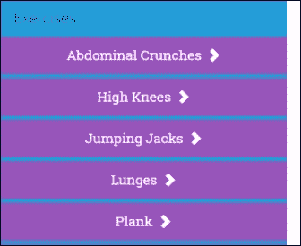

点击任何这些练习名称都会将练习添加到正在构建的训练中。

让我们从为上述视图创建一个组件开始。

### 注意

在开始新组件之前，将一个新的训练建造者模块（`WorkoutBuilderModule`）添加到应用程序中。从`WorkoutBuilder`文件夹中的`ng2-checkpoint8.3`中复制模块定义（GitHub 位置：[`bit.ly/ng2be-8-3-workout-builder-module-ts`](http://bit.ly/ng2be-8-3-workout-builder-module-ts)）。还要在`app.module.ts`中导入新创建的模块。

我们建议不要在这里内联完整的代码，而是从 GitHub 分支`ng2-checkpoint8.3`中复制`exercise-nav-component.ts`文件（[`bit.ly/ng2be-8-3-exercisenavts`](http://bit.ly/ng2be-8-3-exercisenavts)），并将其添加到本地的`WorkoutBuilder`文件夹中。由于有相当多的样板代码，我们只会突出显示相关的部分。

对比模板语法

### 提示

Angular 团队已经发布了一个优秀的参考资料（[`bit.ly/ng2-a1-a2-quickref`](http://bit.ly/ng2-a1-a2-quickref)），详细介绍了 Angular 1 中的常见视图语法及其在 Angular 2 中的等价物。在迁移 Angular 1 应用程序时强烈推荐！

首先，如果你看一下`exercise-nav-component.ts`文件，组件模板类似于 Angular 1 中使用的`left-nav-exercises.html`，只是没有`ng-controller`，模板绑定是基于 Angular 2 的：

```ts
template: `<div id="left-nav-exercises"> 
           <h4>Exercises</h4> 
           <div *ngFor="let exercise of exercises" class="row"> 
           ... 

           </div>` 

```

如果我们关注组件实现（`ExercisesNavComponent`），第一个显著的是组件的依赖关系：

```ts
constructor(  
@Inject('WorkoutService') private workoutService: any,  
@Inject('WorkoutBuilderService') private workoutBuilderService: any) 

```

`WorkoutService`和`WorkoutBuilderService`是注入到 Angular 2 组件中的 Angular 1 服务。

不错！如果这是你的初步反应，我们也不怪你。这很酷！但故事还没有完全结束。这里没有发生魔法。Angular 2 不能访问 Angular 1 的服务，除非告诉它在哪里找。`UpgradeAdapter` 在这里承担了大部分的重活。

### 将 Angular 1 依赖注入到 Angular 2

`UpgradeAdapter` 有一个 API 方法，允许我们在 Angular 2 中注册一个 *Angular 1 服务*。打开 `app.ts` 并在 `upgrade-adapter` 导入后添加这些行：

```ts
upgradeAdapter.upgradeNg1Provider('WorkoutService'); 
upgradeAdapter.upgradeNg1Provider('WorkoutBuilderService'); 

```

`updateNg1Provider`，顾名思义，将一个 Angular 1 依赖注册到 *Angular 2 根注入器*。一旦注册，该依赖就可以在整个 Angular 2 应用程序中使用。

### 提示

**与服务共享功能**

`UpgradeAdapter` 还会确保服务的同一个实例在两个框架中共享。这使得服务成为在两个框架之间共享行为的首选候选者。而且，正如我们很快将看到的那样，它也可以反过来工作。

有时依赖关系还有其他依赖，因此最好一次性从 Angular 1 中引入所有服务依赖。将 Angular 1 依赖注册的列表（使用 `upgradeNg1Provider` 完成）从 [`bit.ly/ng2be-8-3-appts`](http://bit.ly/ng2be-8-3-appts) 复制到你的本地 `app.ts`。记得删除我们已经导入的两个多余的声明。

回到组件集成！由于 `ExercisesNavComponent` 在 Angular 1 视图中呈现，因此需要将其注册为 *Angular 1 指令*。

### 将 Angular 2 组件注册为指令

`ExercisesNavComponent` 是一个 Angular 2 组件，但它可以转换为 Angular 1 指令。打开 `app.ts` 并添加以下突出显示的行：

```ts
**import {ExercisesNavComponent}** 
**from './WorkoutBuilder/exercise-nav-component'** 
import {upgradeAdapter} from './upgrade-adapter'; 
**angular.module('WorkoutBuilder').directive('exerciseNav', upgradeAdapter.downgradeNg2Component(ExercisesNavComponent) as angular.IDirectiveFactory);**

```

这次使用的 `UpgradeAdapter` 函数是 `downgradeNg2Component`。该函数返回一个包含 *指令定义对象* 的 *工厂函数*。我们将组件注册为 Angular 1 指令，`exerciseNav`。

### 注意

每个 Angular 2 组件在 Angular 1 中使用时都被注册为 *元素指令*。

组件实现已经完成。现在我们需要清理旧代码，并在视图中注入新指令。

打开 `app.ts` 并添加导入语句以导入新创建的组件：

```ts
import './WorkoutBuilder/exercise-nav-component'; 

```

从 `exercise.js` 中删除 `ExercisesNavController` 的定义，并用 `partials` 文件夹中的 `left-nav-exercises.html` 替换其内容：

```ts
<exercise-nav></exercise-nav> 

```

我们已经准备就绪。

Angular 1 仍然将`left-nav-exercises.html`作为路由转换的一部分加载，但内部视图是一个 Angular 2 组件。

继续尝试新的实现。创建一个新的锻炼并尝试从左侧导航中添加练习。功能应该像以前一样工作。

### 注意

如果您在升级到 Angular 2 时遇到问题，请查看`ng2-checkpoint8.3`。

您可以比较 git 分支`ng2-checkpoint8.2`和`ng2-checkpoint8.3`来了解发生了什么变化（[`bit.ly/ng2be-compare-8-2-8-3`](http://bit.ly/ng2be-compare-8-2-8-3)）。

虽然我们只迁移了一个微不足道的组件，但这个练习突显了将 Angular 2 组件转换/降级为 Angular 1 指令并在 Angular 1 视图中使用是多么容易。Angular 2 组件的整体封装使得这个任务变得容易。

这个降级的组件甚至可以使用所有熟悉的 Angular 2 属性绑定语法从父作用域中获取输入：

```ts
<exercise-nav [exercises]='vm.exercises'></exercise-nav> 

```

此外，组件引发的事件也可以由 Angular 1 容器作用域订阅：

```ts
<exercise-nav (onExerciseClicked)='vm.add(exercise)'></exercise-nav> 

```

我们现在有一个 Angular 2 组件在最初设计用于 Angular 1 的服务中运行。这是我们迁移旅程的一个有希望的开始！

在我们继续之前，是时候强调这种协作是如何工作的和规则的参与了。

## 规则的参与

从 Angular 1 到 Angular 2 的迁移故事之所以可能，是因为这些框架可以共存，并可能共享数据。有一些接触点可以跨越边界。为了更好地了解混合应用程序的工作原理以及在这种设置中可以实现什么，我们需要了解两个框架之间的协作领域。

有三个需要讨论的领域：

+   DOM 中的模板交错

+   依赖注入

+   变更检测

由于 Angular 2 组件和 Angular 1 指令可以共存于 DOM 中，我们需要回答的问题是：谁拥有 DOM 的哪些部分？

### Angular 1 指令和 Angular 2 组件

当涉及到 DOM 元素的所有权时，黄金法则是：

*每个 DOM 元素都由 Angular 框架中的一个管理/拥有。*

以前的迁移示例。`ExercisesNavComponent`的视图由 Angular 2 管理，而容器视图（`left-nav-exercises.html`）由 Angular 1 管理。

在这些指令和组件的边界处有些棘手的事情。考虑`left-nav-exercises.html`中的声明：

```ts
<exercise-nav></exercise-nav> 

```

谁拥有这个？简短的答案是 Angular 1。

虽然这是一个 Angular 2 组件，但宿主元素由 Angular 1 拥有。这意味着所有 Angular 1 模板语法都适用：

```ts
<exercise-nav ng-if='showNav'></exercise-nav> 
<exercise-nav ng-repeat='item in items'></exercise-nav> 

```

由于这些组件和指令共存于同一个视图中，它们经常需要进行通信。管理这种通信有两种方式：

+   使用 Angular 1 和 Angular 2 的模板能力：

+   嵌入在 Angular 1 视图中的 Angular 2 组件可以通过事件和属性绑定从父作用域获取输入

+   类似地，如果一个指令被注入到 Angular 2 组件视图中，它也可以从父组件获取输入，并调用父组件函数（通过其隔离作用域）

+   使用共享服务。我们之前看到了一个例子，我们将`WorkoutService`和`WorkoutBuilderService` Angular 1 服务注入到`ExercisesNavComponent`中。

### 注意

将 Angular 1 指令注入到 Angular 2 中有点棘手。要能够将 Angular 1 指令注入到 Angular 2 模板中，该指令需要遵守一些规则。我们将在接下来的部分讨论这些规则。

使用服务共享功能比通过视图模板共享要灵活得多。在跨框架边界注入服务需要我们在两个框架中注册服务，并让 Angular 来处理其余部分。让我们学习一下跨边界的依赖注入是如何工作的。

### 资源共享和依赖注入

在混合应用中，依赖项的注册方式受这两个框架中 DI 的工作方式的驱动。对于 Angular 1，只有一个全局注入器，而 Angular 2 有一个分层注入器的概念。在混合环境中，最小公分母是两个框架都支持的全局注入器。

#### 共享一个 Angular 1 服务

在 Angular 1 中定义的依赖项一旦在 Angular 2 的*app 注入器*（根注入器）中注册后，就可以在 Angular 2 中使用。`UpgradeAdapter`函数`upgradeNg1Provider`处理了这个问题：

```ts
UpdateAdapter.upgradeNg1Provider(name:string,  
  options?: {asToken: any;})) 

```

由于 Angular 1 中的依赖注入是*基于字符串标记*的，第一个参数是服务的名称（字符串标记）。第二个参数允许我们为 v1 服务注册一个自定义的 Angular 2 标记。

这是我们在之前迁移的`nav`组件中所做的练习：

```ts
upgradeAdapter.upgradeNg1Provider('WorkoutService'); 

```

当涉及在 Angular 2 中注入依赖时，我们需要使用`Inject`装饰器（*带有字符串标记*）进行注入：

```ts
constructor(  
  @Inject('WorkoutService') private workoutService: any,  

```

`WorkoutService`是一个通用的提供者，注册到 Angular 1 中。如果这是一个 TypeScript 类，注册可以使用额外的类令牌完成：

```ts
upgradeAdapter.upgradeNg1Provider('WorkoutService', 
  {asToken:WorkoutService}); 

```

并且可以使用熟悉的类型注入而无需装饰器：

```ts
constructor(private workoutService: WorkoutService,  

```

#### 共享一个 Angular 2 服务

来自 Angular 2 的服务也可以被注入到 Angular 1 中。由于 Angular 1 只有一个全局注入器，所以依赖项是在全局级别注册的。执行此操作的`UpgradeAdapter`函数是：

```ts
UpgradeAdapter.downgradeNg2Provider(token:any):Function

```

`downgradeNg2Provider`创建了一个工厂函数，可以被 Angular 1 模块的`factory` API 使用：

```ts
angular.module('app').factory('MyService',  
  UpgradeAdapter.downgradeNg2Provider(MyService)) 

```

`MyService`现在可以像任何其他服务一样在整个 Angular 1 应用程序中被注入。

`UpgradeAdapter`确保只创建一个依赖项的单个实例，并在框架之间共享。

看一下下面的图表；它总结了我们讨论过的内容：

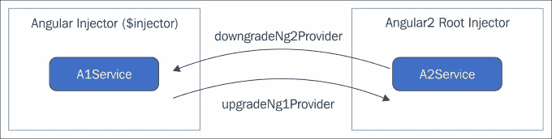

本次讨论的最后一个主题是*变更检测*。

### 变更检测

在混合应用程序中，变更检测由 Angular 2 管理。如果你习惯在你的代码中调用`$scope.$apply()`，在混合应用程序中就不需要了。

我们已经讨论了 Angular 2 变更检测的工作原理。Angular 2 框架通过在标准触发点内部调用`$scope.$apply()`来触发 Angular 1 变更检测。

现在我们了解了参与规则，更容易理解事情是如何工作的，什么是可行的，什么是不可行的。

让我们设定一些更大/更丰富的目标，并迁移 v1 应用程序的起始页和完成页。

## 迁移起始页和完成页

完成页很容易迁移，我建议你自己来做。在`js`文件夹内创建一个名为`finish`的文件夹，并创建三个文件，`finish-component.ts`，`finish-component.tpl.html`和`finish.module.ts`，用于组件的代码和视图模板以及模块定义。实现这个组件。

将完成模块导入到`AppModule`（`app.module.ts`）中。然后修复完成的路由以加载完成组件。

```ts
$routeProvider.when('/finish', { template: '<finish></finish>' }); 

```

最后，记得从`partials/workout`文件夹中删除完成的 html 模板。

### 注意

如果你在迁移完成页时遇到困难，请比较`ng2-checkpoint8.3`和`ng2-checkpoint8.4` git 分支，了解`8.4`分支中发生了什么变化（[`bit.ly/ng2be-compare-8-3-8-4`](http://bit.ly/ng2be-compare-8-3-8-4)）。

完成页面很容易，但起始页面不是！虽然起始页面似乎是一个容易的目标，但有一些挑战需要一些深思熟虑。

起始页面最大的问题是它使用了第三方库*angular-translate*来本地化页面的内容。由于我们将完整页面/视图迁移到 Angular 2，我们需要一种机制来处理这些 Angular 1 库的依赖关系。

*angular-translate*带有一个*filter*（在 Angular 2 世界中是*pipe*）和一个指令，都名为`translate`。它们的工作是将字符串标记翻译成本地化的字符串文字。

现在*start*页面变成了一个 Angular 2 组件，我们需要将过滤器转换为 Angular 2 管道，并以某种方式使`translate`指令在 Angular 2 中工作。在这种情况下，我们的迁移选择如下：

+   创建一个新的过滤器，并使用`UpgradeAdapter`升级 v1 的`translate`指令。

+   在 Angular 2 世界中找到*angular-translate*的合适替代品。

尽管第一个选择似乎是最简单的，但它有一些严重的限制。Angular 2 `UpgradeApapter`带有一个`upgradeNg1Component`函数，可以升级任何 Angular 1 指令。并非如此！在哪些指令可以升级到 Angular 2 周围有一些严格的要求。

### 注意

升级 Angular 1 组件并不意味着该组件已经迁移。相反，Angular 2 允许我们在 Angular 2 组件视图中直接使用 Angular 1 元素指令。

### Angular 1 指令升级

有时，应用程序的部分可能以自上而下的方式迁移；一个高级别视图被转换为一个组件。在这种情况下，我们不是迁移 Angular 1 视图中的所有自定义指令，而是使用`UpgradeAdpater`函数`upgradeNg1Component`将它们升级为 Angular 2 组件。以下图表说明了这种迁移路径：

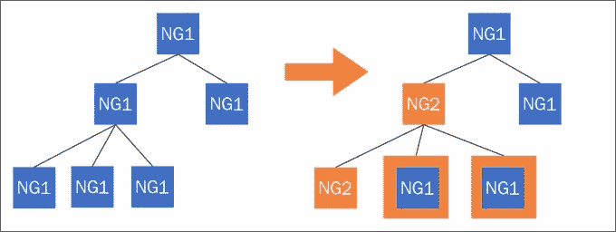

Angular 2 框架对可以升级为 Angular 2 组件的内容施加了一些限制。以下是来自 Angular 2 迁移指南的摘录。

> 要使 Angular 1 组件指令与 Angular 2 兼容，应配置这些属性：`restrict: 'E'`。组件通常用作元素。
> 
> `scope: {}` - 一个隔离的作用域。在 Angular 2 中，组件总是与其周围隔离的，我们在 Angular 1 中也应该这样做。
> 
> `bindToController: {}`。组件的输入和输出应该绑定到控制器，而不是使用$scope。
> 
> `controller`和`controllerAs`。组件有自己的控制器。template 或 templateUrl。组件有自己的模板。
> 
> 组件指令也可以使用以下属性：
> 
> `transclude: true`，如果组件需要从其他地方传递内容。
> 
> `require`，如果组件需要与某个父组件的控制器通信。
> 
> 组件指令**不得**使用以下属性：
> 
> `compile`。这在 Angular 2 中将不再受支持。
> 
> `replace`: true。Angular 2 永远不会用组件模板替换组件元素。这个属性在 Angular 1 中也已经被弃用。
> 
> `priority`和`terminal`。虽然 Angular 1 组件可以使用这些属性，但在 Angular 2 中不使用，最好不要编写依赖于它们的代码。

### 提示

唯一可以升级到 Angular 2 的 Angular 1 指令是元素指令，前提是满足所有其他条件。

有了这么多的待办事项清单，将 Angular 1 指令升级到 Angular 2 相对困难，而将 Angular 2 组件降级则更容易。往往情况下，如果父视图已经迁移到 Angular 2，我们必须对 Angular 1 指令进行实际的代码迁移。

查看*angular-translate*的源代码，我们意识到它使用了`$compile`服务；因此，升级选项被排除在外。我们需要找到一个替代库。

我们确实有一个针对 Angular 2 的国际化库，`ng2-translate` ([`bit.ly/ng2-translate`](http://bit.ly/ng2-translate))。

### 用 ng2-translate 替换 angular-translate

*ng2-translate*是一个针对 Angular 2 的国际化库。这个库可以替代 v1 *angular-translate*。

安装`ng2-translate`的 npm 包：

```ts
**npm i ng2-translate --save**

```

更新`systemjs.config.js`以包括`ng2-translate`库。在`map`和`packages`属性中添加条目：

```ts
var map = {... 
 **'ng2-translate': '/node_modules/ng2-translate/bundles'** 
var packages = { ... 
 **'ng2-translate': { defaultExtension: 'js' }**

```

`ng2-translate`需要在模块级别进行配置，因此请使用突出显示的代码更新`app.module.ts`：

```ts
@NgModule({
 **imports: [BrowserModule, ...,**
 **HttpModule, TranslateModule.forRoot(),],**
 **providers: [TranslateService,**
 **{**
 **provide: TranslateLoader,**
 **useFactory: (http: Http) => new TranslateStaticLoader(http, 'i18n', '.json'),**
 **deps: [Http]**
 **}]**
})

```

前面的提供者声明设置了一个加载器，从`i18n`文件夹加载翻译文件（`.json`）。`HttpModule`导入是必需的，以便翻译库从服务器加载翻译。

这些语句需要导入以使 TypeScript 编译器满意。将这些导入语句添加到`app.module.ts`：

```ts
import {TranslateModule, TranslateService,                TranslateLoader, TranslateStaticLoader} from 'ng2-translate/ng2-translate';  

```

`ng2-translate`库现在已经准备好使用。

我们要做的第一件事就是在应用程序引导时设置默认的翻译语言。

#### 使用一个用于初始化的 bootstrap-ready 回调

有了 Angular 2，幸运的是`UpdateAdapter`上的 bootstrap 函数有一个专门用于此目的的`ready`回调函数。它在两个框架的引导之后被调用。

在`app.ts`中更新 bootstrap 函数，使用以下代码片段：

```ts
upgradeAdapter.bootstrap(document.body, ['app'],  
 { strictDi: true }) 
 .ready((updateApp: UpgradeAdapterRef) => { 
    var translateService =  
      updateApp.ng2Injector.get(TranslateService); 

    var userLang = navigator.language.split('-')[0];  
    userLang = /(fr|en)/gi.test(userLang) ? userLang : 'en'; 

    translateService.setDefaultLang('en'); 

    translateService.use(userLang); 
  }); 

```

并添加一个对`TranslateService`的导入：

```ts
import {TranslateService} from 'ng2-translate/ng2-translate'; 

```

代码尝试确定当前浏览器语言，并相应地设置翻译的当前语言。注意我们如何获取`TranslateService`。`UpgradeAdapterRef`对象持有对 Angular 2 *root injector*的引用，后者又加载了`ng2-translate`的`TranslateService`。

接下来，从`ng2-checkpoint8.4`分支（[`bit.ly/ng2be-8-4-start`](http://bit.ly/ng2be-8-4-start)）复制与开始页面实现相关的三个文件到一个新的文件夹`app/js/start`中。

现在开始组件在使用之前需要注册为 Angular 1 指令。将此语句添加到`app.ts`中：

```ts
import {StartComponent} from './start/start-component'; 
angular.module('start').directive('start', upgradeAdapter.downgradeNg2Component(StartComponent) as angular.IDirectiveFactory); 

```

现在开始模板文件使用`translate` pipe（*pipe 的名称与 Angular 1 的 filter `translate`相同*）。

页面还有一些 pipes，用于搜索和排序页面上显示的训练列表：

```ts
<a *ngFor="#workout of workouts|search:'name':searchContent|orderBy:'name'" href="#/workout/{{workout.name}}"> 

```

现在我们需要为`orderBy`和`search`的 pipes 添加实现。从`ng2-checkpoint8.4`（[`bit.ly/ng2be-8-4-pipests`](http://bit.ly/ng2be-8-4-pipests)）复制完整的代码，并将其添加到一个新文件`js/shared/pipes.ts`中。我们不会在这里深入讨论任何 pipe 的实现，因为我们在之前的章节中已经做过了。

再次创建一个新的 Angular 2 模块，以在整个应用程序中共享这些 pipes。从`ng2-checkpoint8.4`（[`bit.ly/ng2be-shared-module-ts`](http://bit.ly/ng2be-shared-module-ts)）复制模块定义到本地的`js/shared`文件夹，并将其导入`app.module.ts`。

### 注意

我们之前已经将`secondsToTime`（在`js/7MinWorkout/filters.js`中可用）过滤器迁移到了 Angular 2，并且实现已经在`pipes.ts`文件中可用。

开始和结束组件的实现已经完成。让我们将它们集成到应用程序中。

### 集成开始和结束页面

开始/结束视图作为路由更改的一部分加载；因此我们需要修复路由定义。

打开`app.ts`并添加对 start 和 finish 的导入：

```ts
import './start/start-component'; 
import './finish/finish-component'; 

```

路由定义在`config.js`中。将开始和结束路由定义更新为：

```ts
$routeProvider.when('/start',  
**{ template: '<start></start>' });** 
$routeProvider.when('/finish',  
**{ template: '<finish></finish>' });**

```

路由模板 html 是 Angular 1 视图的一部分。由于我们已经将`StartComponent`和`FinishComponent`注册为 Angular 1 指令，路由加载了正确的组件。

### 注意

如果您已经迁移了完成页面，那么您不需要按照描述重新导入和设置完成的路由。

在我们测试实现之前还有一些修复工作要做。

使用模块更新`app-ng1.module.ts`，包括`start`和`finish`：

```ts
angular.module('app', ['ngRoute', ... ,  
**'start', 'finish']);** 
... 
**angular.module('start', []);angular.module('finish', []);**

```

最后，从`ng2-checkpoint8.4`文件夹`i18n`中复制翻译文件`de.json`和`en.json`（[`bit.ly/ng2-8-4-i18n`](http://bit.ly/ng2-8-4-i18n)）。现在我们准备测试我们开发的内容。

如果没有启动，请启动 TypeScript 编译器和*HTTP 服务器*，然后启动浏览器。开始和结束页面应该可以正常加载。但是翻译不起作用！点击顶部导航栏上的语言翻译链接没有任何影响。内容始终以英文呈现。

### 注意

如果您遇到困难，请比较 git 分支`ng2-checkpoint8.3`和`ng2-checkpoint8.4`，了解发生了什么变化（[`bit.ly/ng2be-compare-8-3-8-4`](http://bit.ly/ng2be-compare-8-3-8-4)）。

翻译仍然不起作用，因为启用翻译的顶部导航栏代码（`root.js`）仍在使用旧库。我们需要摆脱 angular-translate（v1 库）。有两个库做同样的工作并不是我们想要的，但是移除它也不是那么简单。

### 摆脱 angular-translate

为了摆脱 angular-translate（v1）库，我们需要：

+   从所有 Angular 1 视图中删除 angular-translate 的指令/过滤器引用。

+   摆脱任何使用这个库的代码。

摆脱 v1 指令/过滤器是一项艰巨的任务。我们既不能在 Angular 1 视图中添加 v2 ng2-translate 管道，也不能一次性将使用 v1 指令/过滤器的每个视图迁移到 Angular 2。

为什么不编写一个新的 Angular 1 过滤器，使用 ng2-translate 的翻译服务（`TranslateService`）进行翻译，然后在所有地方使用新的过滤器？问题解决！

让我们称这个过滤器为`ng2Translate`。我们用`ng2Translate`替换 v1 视图中对`translate`过滤器的所有引用。所有 v1 `translate`指令引用也应该被替换为`ng2Translate`过滤器。

以下是过滤器实现的样子：

```ts
import {TranslateService} from 'ng2-translate'; 

export function ng2Translate(ng2TranslateService: TranslateService) { 
   function translate(input) { 
    if (input && ng2TranslateService.currentLang) { 
      return ng2TranslateService.instant(input); 
    } 
  } 
  translate['$stateful'] = true; 
  return translate; 
} 

ng2Translate.$inject = ['ng2TranslateService']; 
angular.module('app').filter("ng2Translate", ng2Translate); 

```

在`shared`文件夹中创建一个名为`filters.ts`的文件，并添加上述实现。该过滤器使用`TranslateService`（在 Angular 1 中注册为`ng2TranslateService`）将字符串标记映射到本地化内容。为了测试这个实现，还需要进行一些步骤：

+   在 Angular 1 视图中，用`ng2Translate`替换所有对`translate`（指令和过滤器）的引用。这些文件中有引用：`description-panel.html`、`video-panel.html`、`workout.html`（在`partials/workout`文件夹中）和`index.html`。在插值中替换过滤器是一个简单的练习，对于`translate`指令，用插值替换它。例如，在`partials/workout/description-panel.html`中，代码行如下：

```ts
        <h3 class="panel-title" translate>RUNNER.STEPS</h3> 

```

然后变成以下内容：

```ts
        <h3 class="panel-title">{{'RUNNER.STEPS'|ng2Translate}}</h3> 

```

记得在插值中引用字符串标记（`'RUNNER.STEPS'`）。

+   将过滤器导入到`app.ts`中：

```ts
        import './shared/filters' 

```

+   `ng2Translate`过滤器依赖于`TranslateService`；因此需要在 Angular 1 注入器中注册（在`app.ts`中）：

```ts
        angular.module('app').factory('ng2TranslateService', 
        upgradeAdapter.downgradeNg2Provider(TranslateService)); 

```

在 Angular 1 中，`TranslateService`被注册为`ng2TranslateService`。

+   最后，从[`bit.ly/ng2-migrate-root-no-trasnlate`](http://bit.ly/ng2-migrate-root-no-trasnlate)复制更新的`root.js`。我们已经用`ng2TranslateService`替换了所有对`$translate`服务的引用，并重构了代码以使用新的服务。`root.js`包含了 v1 `RootController`的实现。

现在我们可以开始了。尝试新的实现，应用程序应该使用 ng2-translate 库加载翻译。

现在我们可以删除所有对 angular-translate 的引用。在`index.html`、`app.module.ts`和`config.js`中都有引用。

开始和完成页面的迁移已经完成，现在是时候看看其他目标了。

### 注意

比较`ng2-checkpoint8.4`和`ng2-checkpoint8.5`分支，了解`ng2-checkpoint8.5`中的新变化（[`bit.ly/ng2be-compare-8-4-8-5`](http://bit.ly/ng2be-compare-8-4-8-5)）。

在接下来的几个迁移中，我们将不像之前的迁移那样描述详细。我们强烈建议您查看`angular2-migrate-ts`分支上的相关提交，以了解事情是如何进行的。我们只会强调接下来的迁移的相关细节。

## 替换 ui-bootstrap 库

在将开始和完成页面迁移到 Angular 2 时，我们学到的一件事是迁移第三方依赖项是多么繁琐。迁移使用外部库的 Angular 1 视图而不迁移这些库本身是一个挑战。我们还学到，将 Angular 2 组件嵌入到 Angular 1 视图中要比反过来容易得多。

鉴于这些观察结果，迁移到 Angular 2 时，首先迁移/替换第三方库变得至关重要。

我们想要摆脱的一个这样的库是**ui-bootstrap**（[`bit.ly/ng1-ui-bootstrap`](http://bit.ly/ng1-ui-bootstrap)）库。虽然我们只从 ui-bootstrap 中使用模态对话框服务，但摆脱它将是一个挑战。

称这个模态对话框为服务`($uibModal)`将是一个误称。虽然它在 Angular 1 中像服务一样被注入，但它实际上操作 DOM，因此无法使用`upgradeNg1Provider`函数进行升级。

我们再次需要一个在 Angular 2 中模态对话框的替代实现。我们选择的库是 angular2-modal（[`bit.ly/ng2-modal`](http://bit.ly/ng2-modal)）。

Personal Trainer 在两个地方使用 angular2-modal，在顶部导航中显示锻炼历史记录，以及在锻炼执行过程中显示与锻炼相关的视频。

作为迁移到 angular2-modal 的一部分，我们还迁移了**顶部导航**（在`index.html`中声明）和**视频面板**（`partials/workout/video-panel.html`）。

### 注意

查看`ng2-checkpoint8.6` GitHub 分支，了解在此迁移期间更改了哪些工件。我们只会*突出*使迁移具有挑战性的事项。

您还可以在 GitHub 上将此分支与之前的分支（`ng2-checkpoint8.5`）进行比较，网址为[`bit.ly/ng2be-compare-8-5-8-6`](http://bit.ly/ng2be-compare-8-5-8-6)，了解有哪些变化。

*本节将详细介绍*`ng2-checkpoint8.6`*GitHub 分支上的代码。*

迁移到我们的新模态对话框库*angular2-modal*的最大挑战是，它需要访问根组件才能正确地在屏幕中间呈现对话框。虽然这在标准的 Angular 2 应用程序中不是问题，但对于混合应用程序，该库无法定位根组件，因为根本就没有。

### 注意

查看第三章中的*使用 angular2-modal 对话框库*部分，*更多 Angular 2 – SPA，路由和深入数据流*，以了解如何安装和配置该库。您还可以比较`ng2-checkpoint8.5`和`ng2-checkpoint8.6`分支，以确定与 angular2-modal 相关的更改。

为了解决这些限制，我们首先必须重构 Angular 1 应用程序，使得我们有一个 Angular 2 根组件。这样的组件然后包含完整的 Angular 1 视图。现在新的呈现的 html 结构看起来像这样：

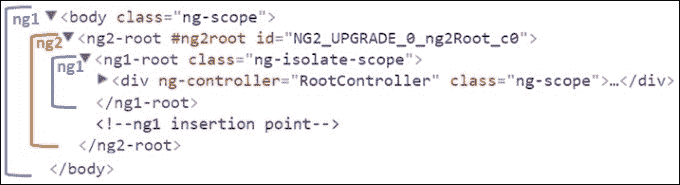

打开`index.html`，`ng2-root`（`Ng2RootComponent`）标签是一个 Angular 2 组件，它包装了完整的 Angular 1 视图。现有的 Angular 1 视图 html 现在被包装在一个指令（`ng1Root`）中，使用`component` API。查看文件`ng1-root-component.ts`，`ng1-root-component.tpl.html`和`ng2-root-component.ts`，以了解这些组件现在是如何结构化的，并在`Ng2RootComponent`的构造函数中提供 angular2-modal `ng2-root`容器引用。

根元素的重组还采用了另一种迁移模式。Angular 2 组件（`Ng2RootComponent`）转译了 Angular 1 元素指令（`ng1Root`）。查看`Ng2RootComponent`的视图模板：

```ts
@Component({ 
  selector: 'ng2-root', 
 **template: `<ng-content></ng-content>`** 
}) 

```

它在`index.html`中的使用：

```ts
<ng2-root> 
      <ng1-root></ng1-root> 
</ng2-root> 

```

在这样的设置中，`ng1RootComponent`嵌入在 Angular 2 `Ng2RootComponent`中，它从父级 Angular 1 视图派生其上下文，因此可以访问父级作用域。

在此迁移的过程中，还对应用程序进行了许多其他小的更改，将此分支与`ng2-checkpoint8.5`进行比较，可以帮助您了解发生了什么变化。

我们将在这里停下来，引导您前往与迁移相关的其他 GitHub 分支。所有以`ng2-checkpoint*`开头的分支都是迁移分支。尝试迁移未完成的视图，并将其与 GitHub 分支更改进行比较。请记住，Angular 2 已经开发了应用程序的工作版本，因此这是一个很好的参考点。查看每个分支的`README.md`文件，了解应用程序的哪个部分已迁移到 Angular 2。

与此同时，让我们总结一下我们从迁移中学到的东西。

## 学习

我们希望这次迁移练习已经为您提供了足够的洞察力。现在您可以评估从 Angular 1 迁移到 Angular 2 需要的复杂性、时间和精力。让我们将我们在这个过程中学到的知识作为亮点：

+   迁移是耗时的：毫无疑问，迁移绝非一项琐事。每个页面/视图都提出了自己的挑战，我们需要克服。一些元素易于迁移，而一些则不是。如果您目前正在使用 Angular 1 进行开发，最好的做法是遵循“为轻松迁移今天开发的 Angular 1 应用程序”部分的建议。

+   首先迁移第三方库：迁移第三方库可能非常具有挑战性。原因有多种：

+   这些库在各个页面上都被使用

+   它们可能无法升级到 Angular 2（使用`UpgradeAdapter`）

+   当库被广泛使用时，迁移使用该库的每个视图可能是不可行的。

### 提示

最好识别应用程序中的所有第三方依赖项，并在 Angular 2 世界中找到合适的替代方案。如果可能的话，使用新库开发一些概念验证（POC），以了解新库与现有实现有多大的不同。

+   可能存在重叠的库：在迁移过程中，可能会出现 Angular 1 和 Angular 2 版本的库共存的情况。尽量缩短这段时间，并尽快迁移到更新的版本。

+   将 Angular 2 组件集成到 Angular 1 中比反过来容易得多：在迁移过程中，将完整视图迁移到 Angular 2。由于 Angular 2 施加的限制，很难将具有嵌入式 Angular 1 元素指令的父级 Angular 2 组件。

在这种限制下，自下而上的迁移方法比自上而下的方法更有效。

+   任何与 UI 无关的内容都很容易迁移：对于“个人健身教练”，我们最后迁移服务，因为它们可以很容易地迁移。

+   Angular 1 和 Angular 2 之间的功能对等性更好：Angular 2 可能没有 Angular 1 支持的每个功能。在这种情况下，我们需要解决方法来实现期望的行为。

这就完成了我们的迁移故事。有了这个，现在是时候结束这一章并总结我们从中学到的东西了。

# 总结

在本章中，我们对围绕 Angular 开发的一些实际问题有了一些有用的见解。这些建议/指南在使用该框架构建真实应用程序时非常有用。

我们从探讨“种子项目”的概念开始，以及这些项目如何让我们迅速启动和运行。我们看了一些流行的种子项目，可以作为任何新的 Angular 应用程序开发的基础。我们还涉及了*Yeoman*和*angular-cli*，这是一套帮助我们快速启动新项目的工具。

尽管身为服务器端问题，身份验证和授权确实会影响客户端的实现。关于身份验证/授权的部分涵盖了如何在基于 cookie 和令牌的设置中处理身份验证。

我们讨论了性能这个非常重要的话题，您学会了优化 Angular 应用程序性能的方法。

最后，我们将 v1 的*个人教练*迁移到 Angular 2。逐步迁移的过程教会了我们迁移的复杂性，所面临的挑战以及所做的变通方法。

书即将结束，但对于每个阅读它的人来说，旅程才刚刚开始。是时候将理论付诸实践，磨练我们新获得的技能，用 Angular 构建一些有用的东西，并与世界分享。您在 Angular 上投入的越多，这个框架就越有回报。让我们开始吧！
