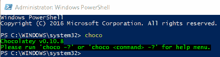
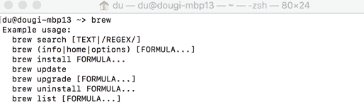
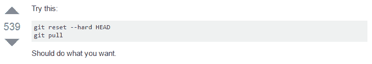

# 第一章：搭建开发环境

让我们从质疑整本书的前提开始，即 Angular 本身。为什么学习 Angular，而不是 React、Vue 或其他框架？首先，我不会反对学习任何新工具的论点。我相信每个工具都有其存在的场所和目的。熟练掌握 React 或 Vue 只会进一步加深您对 Angular 的理解。自 2012 年以来，像 Backbone 或 Angular 这样的**单页面应用**（**SPA**）框架就吸引了我的全部注意力，当时我意识到服务器端渲染的模板是不可能维护的，并且会导致软件系统的非常昂贵的重写。如果您打算创建可维护的软件，必须遵守的首要指令是将 API 和业务逻辑与**用户界面**（**UI**）解耦。

问题是，为什么要精通 Angular？我发现 Angular 完美地符合帕累托原则。它已经成为一个成熟且不断发展的平台，使您能够用 20%的努力完成 80%的任务。此外，从版本 4 开始，在**长期支持**（**LTS**）直到 2018 年 10 月，每个主要版本都受到 18 个月的支持，创造了一个持续学习、保持最新和淘汰旧功能的过程。从全栈开发人员的角度来看，这种连续性是非常宝贵的，因为您的技能和培训将在未来多年内保持有用和新鲜。

这第一章将帮助您和您的团队成员创建一致的开发环境。对于初学者来说，创建正确的开发环境可能很困难，这对于无挫折的开发体验至关重要。对于经验丰富的开发人员和团队来说，实现一致和最小的开发环境仍然是一个挑战。一旦实现，这样的开发环境有助于避免许多与 IT 相关的问题，包括持续维护、许可和升级成本。

安装 GitHub 桌面版、Node.js、Angular CLI 和 Docker 的说明将成为从初学者到经验丰富的团队的良好参考，以及自动化和确保开发环境的正确和一致配置的策略。

如果您已经设置了强大的开发环境，可以跳过本章；但是，请注意，本章中声明的一些环境假设可能会导致后续章节中的一些指令对您不起作用。如果遇到问题或需要帮助同事、学生或朋友设置他们的开发环境，请返回本章作为参考。

在本章中，您将学到以下内容：

+   使用 CLI 包管理器安装和更新软件：

+   Windows 10 上的 Chocolatey

+   macOS X 上的 Homebrew

+   使用脚本来自动化安装：

+   Windows 10 上的 Powershell

+   macOS X 上的 Bash

+   实现一致且跨平台的开发环境

您应该熟悉这些内容：

+   JavaScript ES2015+

+   前端开发基础知识

+   RESTful API

支持的操作系统如下：

+   Windows 10 Pro v1703+与 PowerShell v5.1+

+   macOS Sierra v10.12.6+与终端（Bash 或 Oh My Zsh）

+   大多数建议的软件也适用于 Linux 系统，但您的体验可能会有所不同。

建议的跨平台软件如下：

+   Node 8.10+（除非非 LTS 版本）

+   npm 5.7.1+

+   GitHub Desktop 1.0.0+

+   Visual Studio Code v1.16.0+

+   Google Chrome 64+

# CLI 包管理器

通过**图形用户界面**（**GUI**）安装软件是缓慢且难以自动化的。作为全栈开发人员，无论您是 Windows 用户还是 Mac 用户，您都必须依赖**命令行界面**（**CLI**）包管理器来高效地安装和配置您将依赖的软件。请记住，任何可以表示为 CLI 命令的东西也可以被自动化。

# 为 Windows 安装 Chocolatey

Chocolatey 是 Windows 的基于 CLI 的包管理器，可用于自动化软件安装。要在 Windows 上安装 Chocolatey，您需要运行一个提升的命令行：

1.  启动开始菜单

1.  开始在`PowerShell`中输入

1.  您应该看到 Windows PowerShell 桌面应用程序作为搜索结果

1.  右键单击 Windows PowerShell 并选择以管理员身份运行

1.  这将触发用户账户控制（UAC）警告；选择“是”继续

1.  在 PowerShell 中执行以下命令来安装 Chocolatey 包管理器：

```ts
PS> Set-ExecutionPolicy AllSigned; iex ((New-Object System.Net.WebClient).DownloadString('https://chocolatey.org/install.ps1'))
```

1.  通过执行`choco`来验证您的 Chocolatey 安装

1.  您应该看到类似的输出，如下面的屏幕截图所示：

成功安装 Chocolatey 所有后续的 Chocolatey 命令也必须从提升的命令行中执行。或者，也可以在不需要提升的命令行中安装 Chocolatey。但是，这将导致非标准和不太安全的开发环境，并且通过该工具安装的某些应用程序可能仍然需要提升。

有关更多信息，请参阅：[`chocolatey.org/install`](https://chocolatey.org/install)。

# 为 macOS 安装 Homebrew

Homebrew 是 macOS 的基于命令行的软件包管理器，可用于自动化软件安装。要在 macOS 上安装 Homebrew，您需要运行一个命令行。

1.  使用⌘ + Space 启动 Spotlight 搜索

1.  在“终端”中输入

1.  在终端中执行以下命令以安装 Homebrew 软件包管理器：

```ts
$ /usr/bin/ruby -e "$(curl -fsSL https://raw.githubusercontent.com/Homebrew/install/master/install)"
```

1.  通过执行`brew`来验证您的 Homebrew 安装

1.  您应该看到类似的输出，如下所示：

成功安装 Homebrew

1.  要启用对其他软件的访问，请执行以下命令：

```ts
$ brew tap caskroom/cask
```

有关更多信息，请访问：[`brew.sh/`](https://brew.sh/)。

# Git 和 GitHub 桌面

本节旨在建立一个最佳实践的 Git 配置，适用于尽可能广泛的受众。为了充分利用本节和本书后续章节，假定读者已满足以下先决条件：

+   对源代码管理和 Git 的理解

+   在[GitHub.com](https://github.com/)上创建一个免费帐户

# 为什么使用 GitHub？

如果您是 Git 用户，很可能您也使用在线存储库，如 GitHub、Bitbucket 或 GitLab。每个存储库都有一个免费的开源项目层，配有功能各异的强大网站，包括您可以付费使用的本地企业选项。GitHub 在 2016 年托管了 3800 多万个存储库，是目前最受欢迎的在线存储库。GitHub 被广泛认为是一个基本的实用工具，永远不会被社区下线。

随着时间的推移，GitHub 添加了许多丰富的功能，使其从一个简单的存储库变成了一个在线平台。在本书中，我将引用 GitHub 的功能和功能，以便您可以利用其能力来改变您开发、维护和发布软件的方式。

# 为什么使用 GitHub 桌面？

Git CLI 工具确实很强大，如果你坚持使用它，你会没问题的。然而，作为全栈开发人员，我们担心各种问题。在你匆忙完成手头的任务时，你很容易因为遵循错误或不完整的建议而毁掉你自己，有时甚至毁掉你的团队的一天。

请参见来自 StackOverflow 的以下建议的截图([`stackoverflow.com/questions/1125968/force-git-to-overwrite-local-files-on-pull`](http://stackoverflow.com/questions/1125968/force-git-to-overwrite-local-files-on-pull))：



如果你执行上述命令，请准备好失去未提交的本地更改。不幸的是，新手用户倾向于遵循最简单和最直接的指令，可能导致丢失工作。如果你认为你过去的提交是安全的，再想想！当涉及到 Git 时，如果你能想象到，通过 CLI 都可以做到。

幸运的是，通过 GitHub，你可以保护分支并实施 GitHub 工作流程，其中包括分支、提交、合并、更新和提交拉取请求。这些保护和工作流程有助于防止有害的 Git 命令造成不可逆转的更改，并实现一定程度的质量控制，使你的团队保持高效。通过 CLI 执行所有这些操作，特别是在存在合并冲突时，可能会变得复杂和繁琐。

要更深入地了解 Git 和 GitHub 的优势和缺陷，你可以阅读我 2016 年关于这个主题的文章：[Bit.ly/InDepthGitHub](http://bit.ly/InDepthGitHub)。

# 安装 Git 和 GitHub 桌面

GitHub 桌面提供了一个易于使用的 GUI 来执行 GitHub 工作流程，这种方式在 Windows 和 macOS 上是一致的。当新人或初级团队成员加入时，或者如果你不经常贡献代码，一致性是非常有价值的。

1.  执行安装命令：

对于 Windows：

```ts
**PS> choco install git github-desktop -y** 
```

对于 macOS：

```ts
$ brew install git && brew cask install github-desktop
```

1.  通过执行 `git --version` 来验证你的 Git 安装，并观察返回的版本号

在安装新的 CLI 工具后，你需要重新启动你的终端。然而，你可以通过刷新或源化你的环境变量来避免重新启动终端并节省一些时间。在 Windows 上，执行 `refreshenv`；在 macOS 上，执行 `source ~/.bashrc` 或 `source ~/.zshrc`。

1.  通过启动应用程序来验证你的 GitHub 桌面安装

1.  在 GitHub 桌面上登录[`github.com/`](https://github.com/)

1.  创建了存储库后，您可以通过在终端中执行以下命令来启动应用程序：

```ts
$ github path/to/repo
```

1.  如果您已经在正确的文件夹中，可以输入以下命令：

```ts
$ github .
```

对于 Windows，在 GitHub Desktop 启动时，如果卡在登录屏幕上，请关闭应用程序，以管理员身份重新启动，完成设置，然后您将能够正常使用它，而无需再次以管理员身份启动。有关更多信息，请参阅：[`desktop.github.com/`](https://desktop.github.com/)。

# Node.js

本节旨在建立最佳实践的 JavaScript 开发环境。为了充分利用本书，假定您已满足以下先决条件：

+   对现代 JavaScript 生态系统和工具的认识

+   NodeJS 的网站：[`nodejs.org`](https://nodejs.org)

+   Npm 的网站：[`www.npmjs.com`](https://www.npmjs.com)

+   Angular 的网站：[`angular.io`](https://angular.io)

+   Legacy AngularJS 的网站：[`angularjs.org/`](https://angularjs.org/)

+   Yarn 的网站：[`yarnpkg.com`](https://yarnpkg.com)

+   React 的网站：[`facebook.github.io/react`](https://facebook.github.io/react)

Node.js 是可以在任何地方运行的 JavaScript。它是一个开源项目，旨在在服务器上运行 JavaScript，构建在谷歌 Chrome 的 V8 JavaScript 引擎上。2015 年底，Node.js 稳定下来，并宣布了企业友好的 18 个月 LTS 周期，为平台带来了可预测性和稳定性，配合更频繁更新但更实验性的 Latest 分支。Node 还附带了 npm，Node 包管理器，截至 2018 年，npm 是世界上最大的 JavaScript 包存储库。

要更详细地了解 Node 的历史，请阅读我在 Node 上的两部分文章：[Bit.ly/NodeJSHistory](http://bit.ly/NodeJSHistory)。

您可能听说过 yarn 以及它比 npm 更快或更好。截至 npm 5，它与 Node 8 捆绑在一起，npm 更加功能丰富，更易于使用，并且在性能方面与 yarn 不相上下。Yarn 由 Facebook 发布，该公司还创建了 React JavaScript UI 库。必须指出的是 yarn 依赖于 npm 存储库，因此无论您使用哪种工具，都可以访问相同的包库。

# 现有的 Node.js 安装

如果您之前安装过 Node.js，在使用 choco 或 brew 安装新版本 Node 时，请确保仔细阅读命令输出。您的软件包管理器可能会返回警告或额外的指令，因此您可以成功完成安装。

您的系统或文件夹权限很可能在过去被手动编辑过，这可能会影响 Node 的无障碍操作。如果以下命令无法解决您的问题，请作为最后的手段使用 Node 网站上的 GUI 安装程序。

无论如何，您必须小心卸载之前使用`npm -g`安装的所有全局工具。随着每个主要的 Node 版本，您的工具与 Node 之间的本地绑定可能会失效。此外，全局工具很快就会过时，项目特定的工具也很快就会不同步。因此，全局安装工具现在是一种反模式，已被更好的技术所取代，这些技术在下一节和第二章的 Angular CLI 部分中有介绍，*创建一个本地天气 Web 应用*。

要查看全局安装的软件包列表，请执行`npm list -g --depth 0`。要卸载全局软件包，请执行`npm uninstall -g package-name`。我建议您卸载所有全局安装的软件包，并根据下一节提供的建议重新开始。

# 安装 Node.js

本书假定您正在使用 Node 8.4 或更高版本。Node 的奇数版本不适合长期使用。6.x.x、8.x.x、10.x.x 等是可以的，但是要尽量避免 7.x.x、9.x.x 等。

1.  执行安装命令：

对于 Windows：

```ts
PS> choco install nodejs-lts -y
```

对于 macOS：

```ts
$ brew install node@8
```

1.  验证 Node 的安装是否成功，执行`node -v`

1.  验证 npm 的安装是否成功，执行`npm -v`

请注意，不要在 Windows 上使用`npm install -g npm`来升级 npm 版本，如第四章中所述，*与 Angular 更新保持最新*。强烈建议您使用`npm-windows-upgrade` npm 包。

npm 存储库包含许多有用且成熟的 CLI 命令，通常是跨平台的。以下是我经常依赖并选择全局安装以提高性能的命令：

+   `npx`：通过按需下载最新版本或项目特定的本地`node_modules`文件夹来执行 CLI 工具。它随 npm 5 一起提供，并允许您运行频繁更新的代码生成器，而无需全局安装。

+   `rimraf`：Unix 命令`rm -rf`，但在 Windows 上也可以使用。在删除`node_modules`文件夹时非常有用，特别是当 Windows 由于嵌套文件夹结构而无法执行此操作时。

+   `npm-update`：分析您的项目文件夹，并报告哪些包有更新版本，哪些没有，如果您愿意，可以更新所有这些包。

+   `n`：非常容易快速切换 Node 版本的工具，无需记住特定版本号。不幸的是，它只在 macOS/Linux 上运行。

+   `http-server`：简单的、零配置的命令行 HTTP 服务器，是本地测试静态 HTML/CSS 页面或 Angular 或 React 项目的`dist`文件夹的绝佳方式。

+   `npm-windows-upgrade`：在 Windows 上升级 npm 所必需的。

# Visual Studio Code

**Visual Studio Code**（**VS Code**）是最好的代码编辑器/集成开发环境之一。它是免费的，而且跨平台。值得注意的是，VS Code 具有代码编辑器的极快性能，类似于 NotePad++或 Sublime Text，但具有昂贵的集成开发环境的功能集和便利性，例如 Visual Studio 或 WebStorm。对于 JavaScript 开发，这种速度是必不可少的，并且对于经常在不同项目之间频繁切换的开发人员来说，这是一项巨大的生活质量改善。VS Code 集成了终端、易于使用的扩展系统、透明的设置、出色的搜索和替换功能，以及在我看来存在的最好的 Node.js 调试器。

# 安装 Visual Studio Code

对于 Angular 开发，这本书将利用 VS Code。强烈建议您也使用 VS Code。

1.  执行安装命令：

对于 Windows：

```ts
PS> choco install VisualStudioCode -y
```

对于 macOS：

```ts
$ brew cask install visual-studio-code
```

Visual Studio Code 的最佳功能之一是您还可以从 CLI 启动它。如果您想要编辑的文件夹中，只需执行`code .`或通过执行`code ~/.bashrc`或`code readme.md`来执行特定文件。

1.  通过启动 Visual Studio Code 来验证安装

1.  转到一个文件夹并执行`code .`

1.  这将打开一个新的 VS Code 窗口，其中资源管理器显示当前文件夹的内容

有关更多信息，请参阅[`code.visualstudio.com`](https://code.visualstudio.com)。

# Windows 和 macOS 的自动化

在本章的开头，我宣称*任何可以表示为 CLI 命令的东西也可以被自动化*。在设置过程中，我们确保每个使用的工具都已设置并且通过 CLI 命令可验证其功能。这意味着我们可以轻松地创建一个 PowerShell 或 bash 脚本来串联这些命令，并简化设置和验证新环境的任务。事实上，我已经创建了这些脚本的一个基本实现，您可以从本书的 GitHub 存储库的`第一章`文件夹中下载：

1.  导航至[`github.com/duluca/web-dev-environment-setup`](https://github.com/duluca/web-dev-environment-setup)查找脚本

1.  在 PowerShell 中执行`install-windows-deps.ps1`以安装和验证 Windows 上的依赖关系

1.  在终端中执行`install-mac-deps.sh`以安装和验证 macOS 上的依赖关系

残酷的现实是，这些脚本并不代表一个非常有能力或弹性的解决方案。脚本无法远程执行或管理，并且它们无法轻松地从错误中恢复或在机器启动周期中生存。此外，您的 IT 需求可能超出了这里所涵盖的范围。

如果您处理大型团队和频繁的人员流动，自动化工具将大大地产生回报，而如果您是独自一人或是一个较小、稳定的团队的一部分，它将是极度过剩的。我鼓励您探索诸如 Puppet、Chef、Ansible 和 Vagrant 等工具，以帮助您决定哪一个最适合您的需求，或者一个简单的脚本是否足够好。

# 总结

在这一章中，您掌握了基于 CLI 的软件包管理器在 Windows 和 macOS 上的使用，以加快和自动化开发环境的设置，为您和您的同事。通过减少开发人员环境之间的差异，您的团队可以更容易地克服任何个人配置问题，并更多地专注于手头的任务执行。通过对共同环境的集体理解，团队中没有一个人需要承担帮助排除其他人问题的负担。因此，您的团队将更加高效。通过利用更复杂和弹性的工具，中大型组织将能够在其 IT 预算中实现巨大的节省。

在下一章中，您将熟悉新的 Angular 平台，优化您的 Web 开发环境，利用 Waffle 和 GitHub 问题来使用看板，学习 Angular 基础知识以构建一个考虑全栈架构的简单 Web 应用，并介绍使用 RxJS 进行响应式编程。

# 进一步阅读

Vishwas Parameshwarappa 的《自动化本地开发者机器设置》一文是使用 Vagrant 的绝佳起点。您可以在[Red-gate.com/simple-talk/sysadmin/general/automating-setup-local-developer-machine](https://www.red-gate.com/simple-talk/sysadmin/general/automating-setup-local-developer-machine)找到这篇文章。
