# 第二章：创建本地天气 Web 应用程序

在本章中，我们将使用迭代开发方法设计和构建一个简单的本地天气应用程序，使用 Angular 和第三方 Web API。您将专注于首先提供价值，同时学习使用 Angular、TypeScript、Visual Studio Code、响应式编程和 RxJS 的微妙之处和最佳方式。在我们开始编码之前，我们将介绍 Angular 背后的哲学，并确保您的开发环境经过优化，可以实现协作和轻松的信息辐射。

本章的每个部分都将向您介绍新概念、最佳实践和利用这些技术的最佳方式，并涵盖关闭您可能对 Web 和现代 JavaScript 开发基础知识的任何知识空白的基础知识。

在本章中，您将学习 Angular 的基础知识，以构建一个简单的 Web 应用程序，并熟悉新的 Angular 平台和全栈架构。

在本章中，您将学到以下内容：

+   介绍 Angular 及其背后的哲学

+   为全栈开发配置具有最佳文件夹结构的存储库

+   使用 Angular CLI 生成您的 Angular Web 应用程序

+   优化 Visual Code 以进行 Angular 和 TypeScript 开发

+   使用 Waffle 作为与 GitHub 连接的看板板来规划您的路线图

+   打造一个新的 UI 元素来显示当前天气信息，使用组件和接口

+   使用 Angular 服务和 HttpClient 从 OpenWeatherMap API 检索数据

+   利用可观察流使用 RxJS 转换数据

本书提供的代码示例需要使用 Angular 5 和 6 版本。Angular 5 的代码与 Angular 6 兼容。Angular 6 将在 LTS 中得到支持，直到 2019 年 10 月。代码存储库的最新版本可以在以下位置找到：

+   对于第 2 到 6 章，LocalCast Weather，请访问：[Github.com/duluca/local-weather-app](https://github.com/duluca/local-weather-app)

+   对于第 7 到 12 章，LemonMart，请访问：[Github.com/duluca/lemon-mart](https://github.com/duluca/lemon-mart)

# 介绍 Angular

Angular 是由谷歌和一群开发者社区维护的开源项目。新的 Angular 平台与您过去可能使用过的遗留框架大不相同。与微软的合作使得 TypeScript 成为默认的开发语言，它是 JavaScript 的超集，使开发者能够针对旧版浏览器（如 Internet Explorer 11）编写现代 JavaScript 代码，同时在 Chrome、Firefox 和 Edge 等最新浏览器中得到支持。Angular 的遗留版本，即 1.x.x 范围内的版本，现在被称为 AngularJS。2.0.0 及更高版本简称为 Angular。AngularJS 是一个单页应用程序（SPA）框架，而 Angular 是一个能够针对浏览器、混合移动框架、桌面应用程序和服务器端渲染视图的平台。

在 AngularJS 中，每个次要版本增量都意味着风险更新，伴随着昂贵的废弃和不确定间隔的主要新功能。这导致了一个不可预测的、不断发展的框架，似乎没有指导手来推动代码库向前发展。如果你使用过 AngularJS，你可能会卡在一个特定的版本上，因为你的代码库的特定架构使得很难迁移到新版本。在 2018 年春/夏季，AngularJS 的最后一个主要更新将发布版本 1.7。这个发布将标志着这个遗留框架的终结，计划在 2021 年 7 月终止支持。

Angular 在各个方面都比 AngularJS 有所改进。该平台遵循语义版本控制，如[`semver.org/`](https://semver.org/)所定义，其中次要版本增量表示新功能添加和可能废弃通知的第二个下一个主要版本，但不会有破坏性的变化。此外，谷歌的 Angular 团队已经承诺了一个确定的发布计划，每 6 个月发布一次主要版本增量。从 Angular 4 开始，在这 6 个月的开发窗口之后，所有主要版本都将获得长期支持（LTS），为期 12 个月的错误修复和安全补丁。从发布到终止支持，每个主要版本都将获得 18 个月的支持。请参考以下图表，了解 AngularJS 和 Angular 的暂定发布和支持计划：

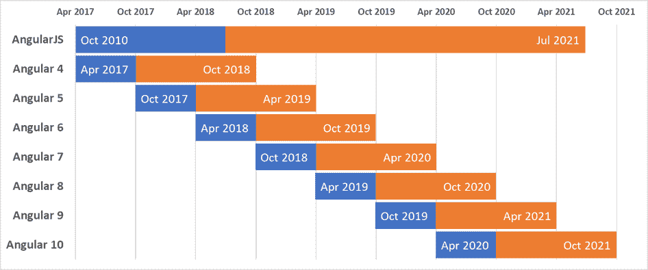暂定的 Angular 发布和支持计划

那么，这对你意味着什么呢？你可以放心，你在 Angular 中编写的代码将在大约 24 个月的时间范围内得到支持，并且向后兼容，即使你对其不做任何更改。因此，如果你在 2017 年 4 月编写了一个 Angular 4 版本的应用程序，你的代码现在可以在 Angular 5 中运行，而 Angular 5 本身将在 2019 年 4 月之前得到支持。要将你的 Angular 4 代码升级到 Angular 6，你需要确保你没有使用在 Angular 5 中宣布为废弃的任何 API。实际上，这些废弃的内容很少，除非你正在使用低级别的 API 来实现高度专业化的用户体验，否则更新代码库所需的时间和精力应该是最小的。然而，这是谷歌所做出的承诺，而不是一份合同。Angular 团队有很大的动力来确保向后兼容，因为谷歌在整个组织中运行着 600 多个 Angular 应用程序，每次只有一个版本的 Angular 处于活动状态。这意味着，当你阅读这篇文章时，所有这 600 多个应用程序都将在 Angular 6 中运行。你可能认为谷歌有无限的资源来实现这一点，但像任何其他组织一样，他们也有有限的资源，并非每个应用程序都有专门的团队进行积极维护。这意味着 Angular 团队必须通过自动化测试来确保兼容性，并尽可能地减少未来的主要版本更新所需的工作量。在 Angular 6 中，通过引入 `ng update`，更新过程变得更加简单。未来，团队将发布自动化的 CLI 工具，以使废弃功能的升级成为一个合理的努力。

这对开发人员和组织来说都是个好消息。现在，你不必永远停留在 Angular 的旧版本上，而是可以计划并分配必要的资源，将你的应用程序移向未来，而无需进行昂贵的重写。正如我在 2017 年的一篇博客文章中所写的那样，《Angular 4 的最佳新功能》，链接在 [bit.ly/NgBestFeature](http://bit.ly/NgBestFeature)，信息很明确：

**对于开发人员和经理：**Angular 会一直存在，所以你应该投入时间、注意力和金钱来学习它-即使你目前热爱其他框架。**对于决策者（CIO，CTO 等）：**计划在接下来的 6 个月内开始过渡到 Angular。这将是一个可以向商业人士解释的投资，并且您的投资将在最初的 LTS 窗口到期后的多年内产生回报，具有优雅的升级路径到 Angular vNext 及更高版本。

那么，为什么谷歌（Angular）和微软（TypeScript，Visual Studio Code）免费提供这样的技术？有多种原因，其中一些包括展示技术证明以留住和吸引人才，通过与数百万开发人员一起验证和调试新的想法和工具，并最终使开发人员更容易地创建出色的网络体验，从而为谷歌和微软带来更多业务。我个人认为这里没有任何恶意意图，并且欢迎开放、成熟和高质量的工具，我可以随意摆弄并根据自己的意愿进行调整，如果必要的话，而不必为专有技术的支持合同付费。

注意，在网上寻找 Angular 帮助可能会有些棘手。您会注意到大多数时候，Angular 被称为 Angular 2 或 Angular 4。有时，Angular 和 AngularJS 都简称为 AngularJS。当然，这是不正确的。Angular 的文档在[angular.io](https://angular.io)。如果您登陆[angularjs.org](https://angularjs.org/)，您将看到有关传统 AngularJS 框架的信息。有关即将发布的 Angular 版本的最新更新，请查看官方发布计划：[Github.com/angular/angular/blob/master/docs/RELEASE_SCHEDULE.md](https://github.com/angular/angular/blob/master/docs/RELEASE_SCHEDULE.md)。

# Angular 的哲学

Angular 的哲学是在配置和约定之间犯错误。基于约定的框架，虽然从外部看起来可能很优雅，但对新手来说很难掌握框架。然而，基于配置的框架旨在通过显式配置元素和钩子公开其内部工作原理，您可以将自定义行为附加到框架上。实质上，Angular 试图不那么神奇，而 AngularJS 则有很多魔力。

这导致了大量冗长的编码。这是件好事。简洁的代码是可维护性的敌人，只有原始作者受益。然而，正如 Andy Hunt 和 David Thomas 在《实用程序员》中所说的，

请记住，你（以及之后的人）将会读取代码很多次，但只会写入几次。

冗长、解耦、内聚和封装的代码是未来保护你的代码的关键。Angular 通过其各种机制，实现了这些概念的正确执行。它摒弃了在 AngularJS 中发明的许多自定义约定，比如`ng-click`，并引入了一个更直观的语言，建立在现有的 HTML 元素和属性之上。因此，`ng-click`变成了`(click)`，扩展了 HTML 而不是替换它。

# Angular 6 有什么新功能？

本书中的大部分内容、模式和实践都与 Angular 4 及以上版本兼容。Angular 6 是最新版本的 Angular，为平台带来了许多底层改进，提高了整体稳定性和生态系统的内聚性。通过额外的 CLI 工具，开发体验得到了极大的改善，这些工具使得更新软件包版本和加快构建时间更加容易，从而改善了代码-构建-视图的反馈循环。有了 Angular 6，所有平台工具都与 6.0 版本同步，这样更容易理清生态系统。在下表中，你可以看到这样做如何使得工具兼容性更容易沟通：

|  | **之前** | **v6 时** |
| --- | --- | --- |
| **CLI** | 1.7 | 6.0 |
| **Angular** | 5.2.10 | 6.0 |
| **Material** | 5.2.4 | 6.0 |

Angular CLI 6.0 带来了重大的新功能，比如`ng update`和`ng add`命令；`ng update`使得更新 Angular 版本、npm 依赖、RxJS 和 Angular Material 变得更加容易，包括一些确定性的代码重写能力，以应用对 API 或函数的名称更改。关于更新 Angular 版本的主题在第四章中有详细介绍，*与 Angular 更新保持最新*。`ng add`为 Angular CLI 带来了原理图支持。通过原理图，您可以编写自定义代码，为 Angular 应用添加新的功能，添加任何依赖项、样板配置代码或脚手架。一个很好的例子是通过执行`ng add @angular/material`来将 Angular Material 添加到您的项目中。关于将 Angular Material 添加到您的项目中的主题在第五章中有详细介绍，*使用 Angular Material 增强 Angular 应用*。一个独立的 Material 更新工具旨在使 Angular Material 的更新变得不那么痛苦，可以在[Github.com/angular/material-update-tool](https://github.com/angular/material-update-tool)找到，但预计这个功能将合并到`ng update`中。进一步的原理图可以为 CLI 带来自己的`generate`命令，使您的生活更加轻松，代码库随着时间的推移更加一致。此外，Webpack 的第 4 版被配置为将您的 Angular 应用构建为更小的模块，并具有范围托管，缩短了应用的首次绘制时间。

Angular 6 的主要主题是在幕后进行性能改进和自定义元素支持。版本 6 在基本捆绑包大小方面比 v5 提高了 12%，达到 65 KB，这将从快速 3G 到光纤连接的加载时间提高了 21-40%。随着您的应用程序增长，Angular 利用更好的摇树技术来进一步修剪最终可交付的未使用代码。速度是 Angular 6 的 UX 功能。这是通过更好地支持 Angular **Component Development Kit** (**CDK**), Angular Material, Animations, and i18n 来实现的。Angular Universal 允许服务器端辅助快速启动时间，并且 Angular **Progressive Web App** (**PWA**)支持利用本机平台功能，如缓存和离线，因此在随后的访问中，您的应用程序保持快速。RxJS 6 支持可摇树的`pipe`命令，更频繁地减少捆绑包大小，并修复了`throttle`的行为，我在第六章中警告您，*Reactive Forms and Component Interaction,*以及众多的错误修复和性能改进。TypeScript 2.7 带来了更好的支持，可以导入不同类型的 JavaScript 包，并在构建时捕获编码错误的更高级功能。

自定义元素支持是 Web 组件规范的一部分，非常重要。使用 Angular Elements，您可以编写一个 Angular 组件，并在*任何*其他使用*任何*Web 技术的 Web 应用程序中重用该组件，从本质上来说，声明您自己的自定义 HTML 元素。这些自定义元素将与任何基于 HTML 的工具链兼容，包括其他 Web 应用程序库或框架。为了使其工作，整个 Angular 框架需要与您的新自定义元素一起打包。这在 Angular 6 中是不可行的，因为这意味着每次创建新用户控件都至少需要增加 65 KB。此外，在 2018 年初，只有 Chrome 支持自定义元素，而无需添加 polyfills 以使这些自定义元素工作。由于其实验性质，我在本书中不涉及自定义元素。Angular 的未来更新，可能在 2018 年底或 2019 年初，应该会引入 Ivy 渲染引擎，使基本捆绑包大小最小为 2.7 KB，从而实现闪电般快速的加载时间，并使得可以发布基于 Angular 的自定义元素。在这个时间范围内，构建这样的组件的工具和自定义元素的本地浏览器支持也将得到改进，包括 Firefox 和 Safari 的支持，使得 Microsoft Edge 成为最后一个实现该标准的浏览器。

在对新的 Web 技术感到兴奋之前，始终在[`caniuse.com`](https://caniuse.com)上检查，以确保您确实能够在必须支持的浏览器中使用该功能。

尽管[Angular.io](https://Angular.io)已更新以演示自定义元素的可行性，但该文档网站每月吸引了 100 多万独立访问者，因此应该有助于解决一些难题，使其更加成熟。自定义元素是托管交互式代码示例的绝佳用例，可以与静态内容一起使用。在 2018 年初，[Angular.io](https://Angular.io)开始使用[StackBlitz.io](https://StackBlitz.io)进行交互式代码示例。这是一个令人惊叹的网站，本质上是一个云中的 Visual Studio Code IDE，您可以在其中尝试不同的想法或运行 GitHub 存储库，而无需本地拉取或执行任何代码。

Angular 生态系统也欢迎 NgRx 库，它基于 RxJS 为 Angular 带来了类似 Redux 的状态管理。这种状态管理对于在 PWA 和移动环境中构建离线优先应用是必要的。然而，在 iOS 的 Safari 浏览器中，PWA 的支持并不好，并且在新的 IE6 浏览器决定加入之前，PWA 不会得到广泛的应用。此外，NgRx 是对已经令人困惑和复杂的工具如 RxJS 的抽象。鉴于我对最小化工具的积极态度，以及对 RxJS 在利基受众之外缺乏明确必要性，我不会涉及这个工具。RxJS 足够强大和有能力解锁复杂和可扩展的模式，帮助您构建出色的 Angular 应用，正如在第十章中所展示的，*Angular 应用设计和配方*。

Angular Material 6 添加了新的用户控件，如树和徽章，同时通过一系列错误修复、功能完整性和现有组件的主题化，使库更加稳定。Angular Flex Layout 6 引入了 polyfills，使 Internet Explorer 11 支持 CSS Flexbox。这使得使用 Material 和 Flex Layout 的 Angular 应用程序完全兼容于仍然存在于企业和政府中的最后一个主要遗留浏览器技术，尽管在 2018 年 1 月与 Windows 8.1 一起离开了主流支持，并被 Microsoft Edge 取代了 16 次。Angular 6 本身可以通过 polyfills 配置为与 IE9 兼容。这对于必须支持这些遗留浏览器并且仍然能够使用现代技术构建解决方案的开发人员来说是个好消息。

还发布了一些令人兴奋的新的辅助工具，可以实现高频率、高性能或大型企业用例。由前 Angular 团队成员开发的 Nx CLI 工具为 Angular 带来了一个有见地的开发环境设置，适用于顾问和必须确保一致环境的大型组织。这本书遵循类似的模式，旨在教育您建立一致的架构和设计模式，以应用于您的应用程序。Google 的 Bazel 构建工具实现了增量构建，因此未更改的应用程序部分无需重新构建，大大提高了大型项目的构建时间，并允许在 Angular 应用程序之间共享库的打包。

我希望您和我一样对 Angular 6 和它所解锁的未来可能性感到兴奋。现在，让我们把这一切放在一边，深入研究通过构建一个简单的 Angular 应用程序来完成事情。

# 全栈架构中的 Angular

在本章中，我们将为您的 Angular 项目设计、架构、创建一个待办事项，并建立文件夹结构，以便与 REST API 进行通信。这个应用程序将被设计来演示以下用途：

+   角 CLI 工具（ng）

+   角组件的 UI 重用

+   角 HTTP 客户端

+   角路由器

+   角反应形式

+   材料自动完成

+   材料工具栏

+   材料 Sidenav

无论您使用的是什么后端技术，我建议您的前端始终驻留在自己的存储库中，并且使用自己的 Web 服务器进行提供，而不依赖于您的 API 服务器。

首先，您需要一个愿景和一个路线图来行动。

# 线框设计

有一些很棒的工具可以制作粗略的模型，以展示您的想法，并具有令人惊讶的丰富功能。如果您有专门的 UX 设计师，这些工具非常适合创建准原型。然而，作为全栈开发人员，我发现最好的工具是纸和笔。这样，您就不必学习另一个工具（YAL），而且没有设计要比有设计好得多。把东西写在纸上会让您避免在后续过程中进行昂贵的编码绕路，如果您能提前验证用户的线框设计，那就更好了。我将我的应用称为 LocalCast Weather，但请发挥创意，选择您自己的名称。以下是您天气应用的线框设计：

LocalCast 的线框。故意手绘。

线框不应该是什么花哨的东西。我建议从手绘设计开始，这样做非常快速，并且可以有效地传递粗略的轮廓。有很多很棒的线框工具，我将在本书中建议并使用其中的一些，但是在项目的最初几天，每个小时都很重要。可以肯定，这种粗糙的设计可能永远不会离开您团队的范围，但请知道，没有什么比将您的想法写在纸上或白板上更能获得即时的反馈和协作。

# 高级架构

无论您的项目大小如何，坦率地说，大多数时候您都无法提前准确预测，从一个健壮的架构开始至关重要，如果需要，它可以扩展，但不会增加执行一个简单应用想法的工作量。关键是确保从一开始就进行适当的解耦。在我看来，有两种解耦方式，一种是软解耦，基本上是达成“绅士协议”，不混合关注点，尽量不搞乱代码库。这可以适用于您编写的代码，一直到基础设施级别的交互。如果您将前端代码保持在与后端代码相同的代码结构下，并且让您的 REST 服务器提供前端应用程序，那么您只是在练习软解耦。

相反，你应该练习硬解耦，这意味着前端代码存放在一个单独的存储库中，从不直接调用数据库，并且完全托管在自己的网络服务器上。这样，你可以确保在任何时候，你的 REST API 或前端代码是完全可以独立替换的。练习硬解耦也有经济和安全方面的好处。前端应用的服务和扩展需求肯定与后端不同，因此您将能够适当优化您的主机环境并节省金钱。如果您将对 REST API 的访问白名单限制为仅允许来自前端服务器的调用，您将大大提高安全性。请考虑下面我们 LocalCast Weather 应用的高级架构图：

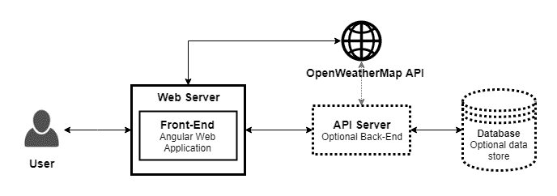LocalCast 高级架构

高级架构显示，我们的 Angular web 应用程序完全与任何后端解耦。它托管在自己的网络服务器上，可以与 Web API（如**OpenWeatherMap**）通信，或者选择与后端基础设施配对，以解锁丰富和定制的功能，这是仅仅使用 Web API 无法提供的，比如存储每个用户的偏好或者用我们自己的数据集补充 OpenWeatherMap 的数据集。

# 文件夹结构

我建议不要将前端和后端代码放在同一个代码存储库中。在同一个存储库中使用会导致奇怪的依赖关系，当你需要启用持续集成或将代码部署到生产环境时。为了获得集成的开发体验，并能够快速在存储库之间切换，您可以使用 IDE 功能，比如 VS Code Workspace，一次打开多个存储库在同一树状结构下。

如果必须使用单个存储库，为后端代码和前端代码创建单独的文件夹，分别命名为`server`和`web-app`。这样做的好处至少是很大的，因为团队成员可以在不互相干扰的情况下开始在前端或后端上工作。

按照接下来的两个部分的说明正确设置您的应用程序。如果您已经有一个强大的开发目录设置，并且您是一个 Git 专家，那么跳过到*生成您的 Angular 应用程序*部分。

# 设置您的开发目录

设置一个专门的`dev`目录是一个救命稻草。因为这个目录下的所有数据都将使用 GitHub 进行备份，您可以安全地配置您的防病毒软件、云同步或备份软件来忽略它。这将大大减少 CPU、磁盘和网络的利用率。作为一个全栈开发人员，您很可能会经常进行多任务处理，因此避免不必要的活动将对性能、功耗和数据消耗产生净正面影响，尤其是如果您的开发环境是一台资源匮乏的笔记本电脑，或者当您在移动时希望尽可能延长电池续航时间。

直接在`c:\`驱动器下创建一个`dev`文件夹非常重要，因为 Windows，或者说 NTFS，无法处理超过 260 个字符的文件路径。这一开始可能看起来足够，但当您在已经深层次的文件夹结构中安装 npm 包时，`node_modules`文件夹结构很容易达到这个限制。使用 npm 3+，引入了一种新的、更扁平的包安装策略，这有助于解决 npm 相关的问题，但尽可能靠近`root`文件夹将对任何工具都有很大帮助。在 2016 年末，有报道称微软可能会引入一个“启用 NTFS 长路径”的组策略来解决这个问题，但截至 2017 年底，这在 Windows 10 上还没有实现。

1.  使用以下命令创建您的`dev`文件夹：

对于 Windows：

```ts
PS> mkdir c:\dev
PS> cd c:\dev
```

在基于 Unix 的操作系统中，`~`（读作波浪线）是当前用户`home`目录的快捷方式，位于`/Users/your-user-name`下。

对于 macOS：

```ts
$ mkdir ~/dev
$ cd ~/dev
```

现在您的开发目录已准备就绪，让我们开始生成您的 Angular 应用程序。

# 生成您的 Angular 应用程序

Angular CLI（Angular 命令行界面）是一个官方的 Angular 项目，以确保新创建的 Angular 应用程序具有统一的架构，遵循社区多年来完善的最佳实践。这意味着您今后遇到的任何 Angular 应用程序都应该具有相同的一般形状。Angular CLI 不仅限于初始代码生成。您将经常使用它来创建新的组件、指令、管道、服务、模块等。Angular CLI 还将在开发过程中帮助您进行实时重新加载，以便您可以快速查看更改的结果。Angular CLI 还可以测试、检查代码，并构建优化版本的代码以进行生产发布。此外，随着新版本的 Angular 发布，Angular CLI 将帮助您升级您的代码，自动重写部分代码，以使其与潜在的破坏性更改保持兼容。

# 安装 Angular CLI

[`angular.io/guide/quickstart`](https://angular.io/guide/quickstart)上的文档将指导您安装`@angular/cli`作为全局 npm 软件包。不要这样做。随着 Angular CLI 的升级，不断地保持全局和项目内版本同步是一个不断的烦恼。如果不这样做，工具会不断地抱怨。此外，如果您正在处理多个项目，随着时间的推移，您将拥有不同版本的 Angular CLI。因此，您的命令可能不会返回您期望的结果，或者您的团队成员会受到影响。

下一节详细介绍的策略将使您的 Angular 项目的初始配置比必要的复杂一些；然而，如果您在几个月或一年后返回项目，您将能够使用您在该项目上最后使用的工具版本，而不是可能需要进行升级的未来版本。在下一节中，您将应用这一最佳实践来初始化您的 Angular 应用程序。

# 初始化 Angular 应用程序

现在，我们将使用`npx`初始化应用程序进行开发，当您安装最新版本的 Node LTS 时，它已经安装在您的系统上：

1.  在您的`dev`文件夹下，执行`npx @angular/cli new local-weather-app`

1.  在您的终端上，您应该看到类似于以下的成功消息：

```ts
...  
  create local-weather-app/src/tsconfig.app.json (211 bytes)
  create local-weather-app/src/tsconfig.spec.json (283 bytes)
  create local-weather-app/src/typings.d.ts (104 bytes)
  create local-weather-app/src/app/app.module.ts (316 bytes)
  create local-weather-app/src/app/app.component.html (1141 bytes)
  create local-weather-app/src/app/app.component.spec.ts (986 bytes)
  create local-weather-app/src/app/app.component.ts (207 bytes)
  create local-weather-app/src/app/app.component.css (0 bytes)
added 1273 packages from 1238 contributors in 60.594s
Project 'local-weather-app' successfully created.
```

您的项目文件夹`local-weather-app`已经初始化为 Git 存储库，并使用了初始的文件和文件夹结构，应该看起来像这样：

```ts
local-weather-app
├── angular.json
├── .editorconfig
├── .gitignore
├── .gitkeep
├── e2e
├── karma.conf.js
├── node_modules
├── package-lock.json
├── package.json
├── protractor.conf.js
├── README.md
├── src
├── tsconfig.json
└── tslint.json
```

`@angular/cli`的别名是`ng`。如果您要全局安装 Angular CLI，您只需执行`ng new local-weather-app`，但我们没有这样做。因此，重要的是要记住，今后您将执行`ng`命令，但这次是在`local-weather-app`目录下。最新版本的 Angular CLI 已经安装在`node_modules/.bin`目录下，因此您可以运行`ng`命令，比如`npx ng generate component my-new-component`，并继续以有效的方式工作。

如果您使用的是 macOS，您可以通过实现 shell 自动回退来进一步改善开发体验，这样就不需要使用`npx`命令了。如果找到未知命令，npx 将接管请求。如果包已经在`node_modules/.bin`下本地存在，npx 将把您的请求传递给正确的二进制文件。因此，您只需像全局安装一样运行命令，比如`ng g c my-new-component`。请参考 npx 的自述文件，了解如何在[npmjs.com/package/npx#shell-auto-fallback](https://www.npmjs.com/package/npx#shell-auto-fallback)上设置这一点。

# 使用 GitHub 桌面发布 Git 存储库

GitHub 桌面允许您直接在应用程序中创建新存储库：

1.  打开 GitHub 桌面

1.  文件 | 添加本地存储库...

1.  通过单击 Choose...来定位`local-weather-app`文件夹

1.  单击添加存储库

1.  请注意，Angular CLI 已经在历史选项卡中为您创建了第一个提交

1.  最后，点击发布存储库，如图所示：

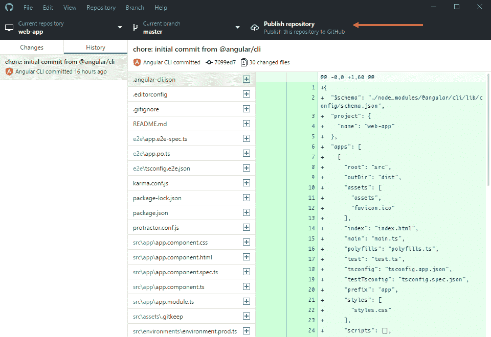GitHub 桌面

# 检查和更新 package.json

`Package.json`是您应该随时密切关注的最重要的配置文件。您的项目脚本、运行时和开发依赖项都存储在这个文件中。

1.  打开`package.json`并找到`name`和`version`属性：

```ts
package.json
{
  "name": "local-weather-app",
  "version": "0.0.0",
  "license": "MIT",
  **...**
```

1.  将您的应用程序重命名为您希望的任何名称；我将使用`localcast-weather`

1.  将您的版本号设置为`1.0.0`

`npm`使用语义化版本（semver），其中版本号数字表示主要.次要.补丁增量。Semver 从`1.0.0`开始为任何发布的 API 设置版本号，尽管它不会阻止 0.x.x 版本。作为 Web 应用程序的作者，您的应用程序的版本对您没有真正影响，除了内部工具、团队或公司沟通目的。但是，您的依赖项的版本对您的应用程序的可靠性非常关键。总之，补丁版本应该只是错误修复。次要版本增加功能而不会破坏现有功能，主要版本增量可以进行不兼容的 API 更改。然而，在现实中，任何更新都会对应用程序的测试行为构成风险。这就是为什么`package-lock.json`文件存储了应用程序的整个依赖树，以便其他开发人员或持续集成服务器可以复制应用程序的确切状态。欲了解更多信息，请访问：[`semver.org/`](https://semver.org/)。

在下面的代码块中，可以看到`scripts`属性包含一组有用的启动脚本，您可以进行扩展。`start`和`test`命令是 npm 的默认命令，因此可以通过`npm start`或`npm test`来执行。但是，其他命令是自定义命令，必须在前面加上`run`关键字。例如，要构建您的应用程序，您必须使用`npm run build`：

```ts
package.json
  ...
 "scripts": {
    "ng": "ng",
    "start": "ng serve",
    "build": "ng build",
    "test": "ng test",
    "lint": "ng lint",
    "e2e": "ng e2e"
  },
  ...
```

在 npx 引入之前，如果您想要在没有全局安装的情况下使用 Angular CLI，您必须使用`npm run ng -- g c my-new-component`来运行它。双破折号是必需的，以便让 npm 知道命令行工具名称在哪里结束并开始选项。例如，要在除默认端口`4200`之外的端口上启动您的 Angular 应用程序，您需要运行`npm start -- --port 5000`。

1.  更新您的`package.json`文件，以便从一个不常用的端口（如`5000`）运行您的应用的开发版本作为新的默认行为：

```ts
package.json
  ... "start": "ng serve --port 5000",
  ...
```

在`dependencies`属性下，您可以观察到您的运行时依赖项。这些库将与您的代码一起打包并发送到客户端浏览器。保持此列表最小化非常重要：

```ts
package.json
  ... "dependencies": {
    "@angular/animations": "⁶.0.0",
    "@angular/common": "⁶.0.0",
    "@angular/compiler": "⁶.0.0",
    "@angular/core": "⁶.0.0",
    "@angular/forms": "⁶.0.0",
    "@angular/http": "⁶.0.0",
    "@angular/platform-browser": "⁶.0.0",
    "@angular/platform-browser-dynamic": "⁶.0.0",
    "@angular/router": "⁶.0.0",
    "core-js": "².5.4",
    "rxjs": "⁶.0.0",
    "zone.js": "⁰.8.26"
  },
  ...
```

在前面的示例中，所有 Angular 组件都是相同版本。当您安装额外的 Angular 组件或升级单个组件时，建议将所有 Angular 包保持在相同的版本。这特别容易做到，因为 npm 5 不再需要`--save`选项来永久更新软件包版本。例如，只需执行`npm install @angular/router`就足以更新`package.json`中的版本。总的来说，这是一个积极的变化，因为您在`package.json`中看到的将与实际安装的内容匹配。但是，您必须小心，因为 npm 5 还将自动更新`package-lock.json`，这将传播您可能无意的更改给您的团队成员。

您的开发依赖项存储在`devDependencies`属性下。在向项目安装新工具时，您必须小心地在命令后面添加`--save-dev`，以便正确分类您的依赖关系。开发依赖项仅在开发过程中使用，不会发送到客户端浏览器。您应该熟悉每一个这些软件包及其具体目的。如果您对我们继续显示的软件包不熟悉，了解更多关于它们的最佳资源是[`www.npmjs.com/`](https://www.npmjs.com/)：

```ts
package.json
  ... "devDependencies": {
    "@angular/compiler-cli": "⁶.0.0",
    "@angular-devkit/build-angular": "~0.6.1",
    "typescript": "~2.7.2",
    "@angular/cli": "~6.0.1",
    "@angular/language-service": "⁶.0.0",
    "@types/jasmine": "~2.8.6",
    "@types/jasminewd2": "~2.0.3",
    "@types/node": "~8.9.4",
    "codelyzer": "~4.2.1",
    "jasmine-core": "~2.99.1",
    "jasmine-spec-reporter": "~4.2.1",
    "karma": "~1.7.1",
    "karma-chrome-launcher": "~2.2.0",
    "karma-coverage-istanbul-reporter": "~1.4.2", 
```

```ts
 "karma-jasmine": "~1.1.1",
    "karma-jasmine-html-reporter": "⁰.2.2",
    "protractor": "~5.3.0", "ts-node": "~5.0.1",
    "tslint": "~5.9.1"
  }
  ...
```

版本号前面的字符在 semver 中具有特定含义。

+   波浪号`~`在定义版本号的所有三个数字时启用波浪范围，允许自动应用补丁版本升级。

+   上插字符`^`使插入范围生效，允许自动应用次要版本升级

+   缺少任何字符会提示 npm 在您的计算机上安装该库的确切版本

您可能会注意到，不允许自动进行主要版本升级。一般来说，更新软件包可能存在风险。为了确保没有软件包在您明确知识的情况下进行更新，您可以使用 npm 的`--save-exact`选项安装确切版本的软件包。让我们通过安装我发布的一个名为`dev-norms`的 npm 软件包来尝试这种行为，这是一个生成团队围绕的合理默认规范的 markdown 文件的 CLI 工具，如下所示：

1.  在`local-weather-app`目录下，执行`npm install dev-norms --save-dev --save-exact`。请注意，`"dev-norms": "1.3.6"`或类似的内容已添加到`package.json`中，并且`package-lock.json`已自动更新以相应地反映这些更改。

1.  工具安装完成后，执行`npx dev-norms create`。创建了一个名为`dev-norms.md`的文件，其中包含上述的开发者规范。

1.  保存对`package.json`的更改。

使用过时的软件包会带来自己的风险。在 npm 6 中，引入了`npm audit`命令，以让您了解您正在使用的软件包中发现的任何漏洞。在`npm install`期间，如果收到任何漏洞通知，您可以执行`npm audit`以了解任何潜在风险的详细信息。

在下一节中，您将提交您对 Git 所做的更改。

# 使用 VS Code 提交代码

为了提交您的更改到 Git，然后将您的提交同步到 GitHub，您可以使用 VS Code。

1.  切换到源代码控制窗格，在此处标记为 1：

！[](Images/e771b503-a971-4ce4-ae81-957de6a252b1.png)Visual Studio Code 源代码控制窗格

1.  在 2 中输入提交消息

1.  单击 3 中的复选标记图标提交您的更改

1.  最后，通过单击 4 中的刷新图标将您的更改与 GitHub 存储库同步。

从现在开始，您可以在 VS Code 中执行大多数 Git 操作。

# 运行您的 Angular 应用程序

运行您的 Angular 应用程序以检查它是否正常工作。在开发过程中，您可以通过`ng serve`命令执行`npm start`；此操作将在 localhost 上转译、打包和提供启用了实时重新加载的代码：

1.  执行`npm start`

1.  导航到`http://localhost:5000`

1.  您应该看到一个类似于此的呈现页面：

！[](Images/10bd04de-9c6d-4a91-b4b0-a20e77386d26.png)默认的 Angular CLI 登陆页面

1.  通过在集成终端中按下*Ctrl* + *C*来停止应用程序。

# 优化用于 Angular 的 VS Code

一直保存文件可能会变得乏味。您可以通过以下方式启用自动保存：

1.  打开 VS Code

1.  切换到“文件”|“自动保存”下的设置。

您可以通过启动“首选项”来进一步自定义 VS Code 行为的许多方面。在 Windows 上启动首选项的键盘快捷键是*Ctrl* + *，*，在 macOS 上是⌘ + *，*。

# IDE 设置

您可以通过在项目目录的根目录中创建一个`.vscode`文件夹并在其中放置一个`settings.json`文件来与同事共享这些设置。如果您将此文件提交到存储库，每个人都将共享相同的 IDE 体验。不幸的是，个人无法使用自己的本地偏好覆盖这些设置，因此请确保共享设置是最小化的，并且作为团队规范达成一致。

以下是我用于实现最佳、节省电池寿命的 Angular 开发体验的自定义设置：

```ts
.vscode/settings.json
{
  "editor.tabSize": 2,
  "editor.rulers": [90, 140],
  "files.trimTrailingWhitespace": true,
  "files.autoSave": "onFocusChange",
  "editor.cursorBlinking": "solid",
  "workbench.iconTheme": "material-icon-theme", // Following setting 
                                               requires Material Icon 
                                                   Theme Extension
  "git.enableSmartCommit": true,
  "editor.autoIndent": true,
  "debug.openExplorerOnEnd": true,
  "auto-close-tag.SublimeText3Mode": true,      // Following setting 
                                               requires Auto Close Tag 
                                                      Extension
  "explorer.openEditors.visible": 0,
  "editor.minimap.enabled": false,
  "html.autoClosingTags": false,
  "git.confirmSync": false,
  "editor.formatOnType": true,
  "editor.formatOnPaste": true,
  "editor.formatOnSave": true,
  "prettier.printWidth": 90,                 // Following setting requires
                                                    Prettier Extension
  "prettier.semi": false,
  "prettier.singleQuote": true,
  "prettier.trailingComma": "es5",
  "typescriptHero.imports.insertSemicolons": false, // Following setting 
                                                   requires TypeScriptHero 
                                                          Extension
  "typescriptHero.imports.multiLineWrapThreshold": 90,
}
```

此外，您还可以在 VS Code 中启用以下设置，以获得更丰富的开发体验：

```ts
"editor.codeActionsOnSave": {
  "source.organizeImports": true
},    
"npm.enableScriptExplorer": true
```

# IDE 扩展

对于使用 VS Code 和 Angular 进行*神奇*开发体验，您应该安装由 John Papa 创建和策划的 Angular Essentials 扩展包。John Papa 是 Angular 社区中的领军者和思想领袖之一。他不断不懈地寻求最佳的开发体验，以便您作为开发人员更加高效和快乐。他是一个值得信赖并且非常认真对待的资源。我强烈建议您在 Twitter 上关注他`@john_papa`。

与设置类似，您还可以通过 JSON 文件共享推荐的扩展。以下是我用于 Angular 开发的扩展：

```ts
.vscode/extensions.json
{
  "recommendations": [
    "johnpapa.angular-essentials",
 "PKief.material-icon-theme",
    "formulahendry.auto-close-tag",
    "PeterJausovec.vscode-docker",
    "eamodio.gitlens",
    "WallabyJs.quokka-vscode",
    "rbbit.typescript-hero",
```

```ts
    "DSKWRK.vscode-generate-getter-setter",
    "esbenp.prettier-vscode"
  ]
}
```

VS Code 还会建议您安装一些扩展。我建议不要安装太多扩展，因为这些扩展会明显地减慢 VS Code 的启动性能和最佳运行。

# 编码风格

您可以在 VS Code 和 Angular CLI 中自定义编码风格执行和代码生成行为。在 JavaScript 方面，我更喜欢 StandardJS 设置，它规范了一种编写代码的最简化方法，同时保持了良好的可读性。这意味着使用 2 个空格作为制表符，而不使用分号。除了减少按键次数外，StandardJS 在水平方面也占用更少的空间，这在您的 IDE 只能利用屏幕的一半，另一半被浏览器占用时尤其有价值。您可以在以下网址了解更多关于 StandardJS 的信息：[`standardjs.com/`](https://standardjs.com/)。

使用默认设置，您的代码将如下所示：

```ts
import { AppComponent } from "./app.component";
```

使用 StandardJS 设置，您的代码将如下所示：

```ts
import { AppComponent } from './app.component'
```

最终，这对您来说是一个可选的步骤。但是，我的代码示例将遵循 StandardJS 风格。您可以通过以下步骤开始进行配置更改：

1.  安装 Prettier - Code formatter 扩展

1.  使用新的扩展更新`.vscode/extensions.json`文件

1.  执行`npm i -D prettier`

可以使用`i`代替更冗长的`--save-dev`选项进行`install`，并使用`-D`代替。但是，如果你将`-D`误输入为`-d`，你最终会将该包保存为生产依赖项。

1.  编辑`package.json`添加一个新的脚本，更新现有的脚本，并创建新的格式规则：

```ts
**package.json**
  ... 
  "scripts": {
    ...
    "standardize": "prettier **/*.ts --write",
    "start": "npm run standardize && ng serve --port 5000",
    "build": "npm run standardize && ng build",
    ...
  },
  ...
 "prettier": {
    "printWidth": 90,
    "semi": false,
    "singleQuote": true,
    "trailingComma": "es5",
    "parser": "typescript"
  } ... 
```

macOS 和 Linux 用户必须修改`standardize`脚本，为了正确遍历目录，必须在`**/*.ts`周围添加单引号。在 macOS 和 Linux 中，正确的脚本看起来像这样`"standardize": "prettier '**/*.ts' --write"`。

1.  类似地，使用新的格式规则更新`tslint.json`：

```ts
tslint.json
  ...  
  "quotemark": [
    true,
    "single"
  ],
  ...
  "semicolon": [
    true,
    "never"
  ],
  ...  "max-line-length": [
    true,
    120
  ],...
```

1.  执行`npm run standardize`来更新所有文件到新的样式

1.  观察 GitHub Desktop 中的所有文件更改

1.  今后，每当你执行`npm start`或`npm run build`时，新的`standardize`脚本将自动运行并保持文件的格式。

1.  提交并推送你的更改到你的存储库

当你输入新代码或使用 Angular CLI 生成新组件时，你会遇到双引号或分号被下划线标记为问题。在大多数情况下，问题旁边会出现一个黄色的灯泡图标。如果你点击灯泡，你会看到一个修复动作：不必要的分号或类似的消息。你可以利用这些自动修复程序，或者按下*Shift* + *Alt* + *F*来运行整个文件的 Prettier 格式文档命令。在下面的截图中，你可以看到自动修复程序的运行情况，有黄色的灯泡和相应的上下文菜单：

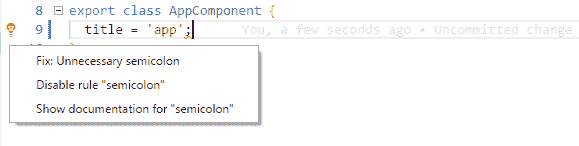VS Code 自动修复程序

# 使用 Waffle 规划功能路线图

在开始编码之前制定一个大致的行动计划非常重要，这样你和你的同事或客户就会意识到你计划执行的路线图。无论是为自己还是为他人构建应用程序，功能的活动积压总是会在你休息后回到项目时作为一个很好的提醒，或者作为一个信息辐射器，防止不断的状态更新请求。

在敏捷开发中，您可能已经使用了各种票务系统或工具，比如表面或看板。我的最爱工具是 Waffle.io，因为它直接与您的 GitHub 存储库的问题集成，并通过标签跟踪问题的状态。这样，您可以继续使用您选择的工具与存储库进行交互，并轻松地传递信息。在下一节中，您将设置一个 Waffle 项目来实现这个目标。

# 设置 Waffle 项目

现在我们将设置我们的 Waffle 项目：

1.  转到 Waffle.io [`waffle.io/`](https://waffle.io/)。

1.  点击登录或免费开始。

1.  选择公共和私有存储库以允许访问所有存储库。

1.  点击创建项目。

1.  搜索本地天气应用存储库并选择它。

1.  点击继续。

您将获得两个起始布局模板，如下图所示：

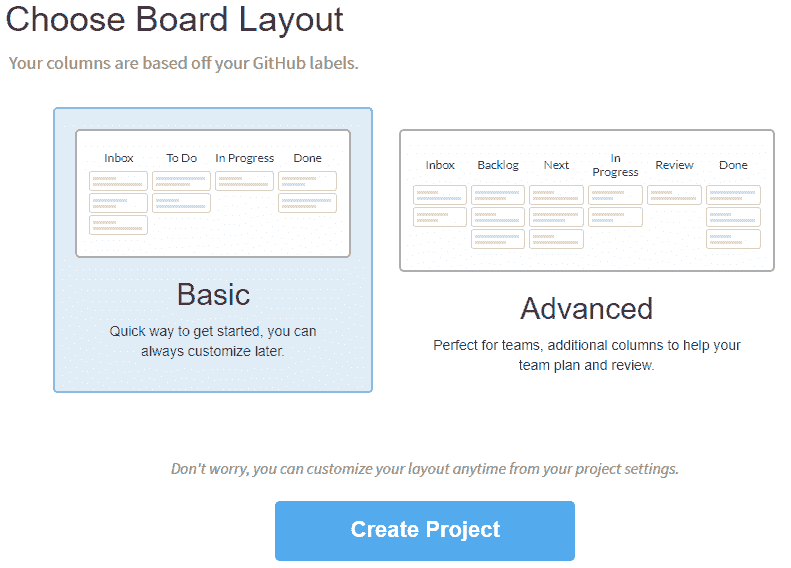Waffle.io 默认看板布局

对于这个简单的项目，您将选择基本。但是，高级布局演示了如何修改 Waffle 的默认设置，例如添加额外的列，比如 Review，以考虑参与过程的测试人员或产品所有者。您可以进一步自定义任何看板以适应您现有的流程。

1.  选择基本布局，然后点击创建项目。

1.  您将看到为您创建的新看板。

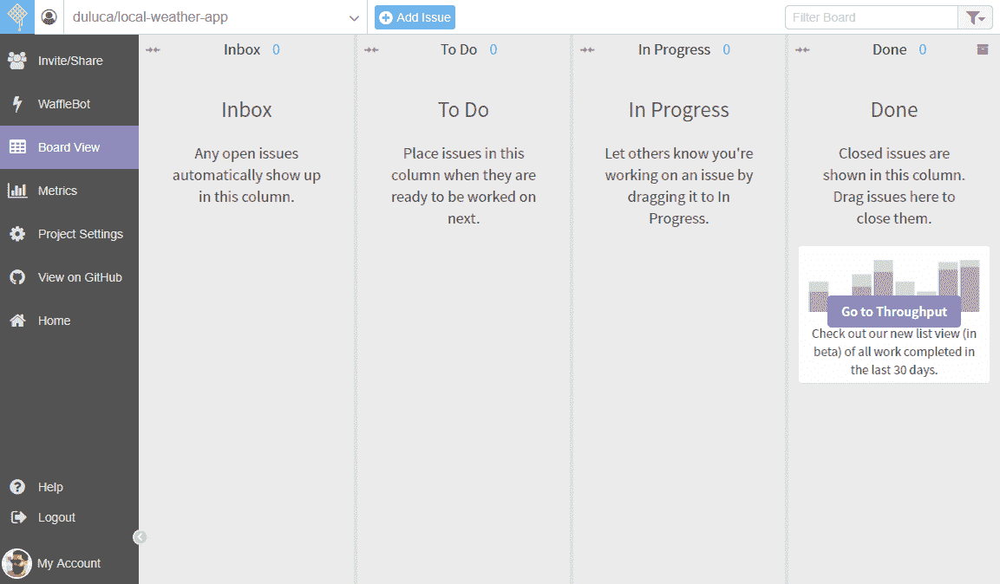空的 Waffle 看板

默认情况下，Waffle 将作为看板。允许您将任务从一个状态移动到另一个状态。但是，默认视图将显示存储库中存在的所有问题。要将 Waffle 用作 Scrum 板，您需要将问题分配给 GitHub 里程碑，这将代表冲刺。然后，您可以使用过滤功能仅显示来自该里程碑的问题，或者换句话说，来自当前冲刺的问题。

在 Waffle 上，您可以通过点击比例图标将故事点附加到问题上。列将自动显示总数和卡片顺序，代表优先级，并且将从会话到会话保留。此外，您可以切换到指标视图以获取里程碑燃尽和吞吐量图表和统计信息。

# 为您的本地天气应用创建问题

我们现在将创建一个问题的积压，您将使用它来跟踪您实施应用程序设计的进展。在创建问题时，您应该专注于提供对用户有价值的功能迭代。您必须克服的技术障碍对您的用户或客户没有兴趣。

以下是我们计划在第一个发布版本中构建的功能：

+   显示当前位置当天的天气信息

+   显示当前位置的天气预报信息

+   添加城市搜索功能，以便用户可以查看其他城市的天气信息

+   添加首选项窗格以存储用户的默认城市

+   使用 Angular Material 改进应用程序的用户体验

继续在 Waffle 或 GitHub 上创建您的问题；无论您喜欢哪个都可以。在创建 Sprint 1 的范围时，我对功能有一些其他想法，所以我只是添加了这些问题，但我没有分配给任何人或者里程碑。我还继续为我打算处理的问题添加了故事点。以下是看板的样子，因为我要开始处理第一个故事：

！[](Images/afcc6387-02dc-4e09-9f46-0c45a106a8e2.png)看板的初始状态快照在[`waffle.io/duluca/local-weather-app`](https://waffle.io/duluca/local-weather-app)。最终，Waffle 提供了一个易于使用的 GUI，以便非技术人员可以轻松地与 GitHub 问题进行交互。通过允许非技术人员参与 GitHub 上的开发过程，您可以解锁 GitHub 成为整个项目的唯一信息来源的好处。关于功能和问题的问题，答案和讨论都作为 GitHub 问题的一部分进行跟踪，而不是在电子邮件中丢失。您还可以在 GitHub 上存储维基类型的文档，因此通过在 GitHub 上集中所有与项目相关的信息，数据，对话和工件，您大大简化了可能需要持续维护的多个系统的复杂交互，成本高昂。对于私有存储库和本地企业安装，GitHub 的成本非常合理。如果您坚持使用开源，就像我们在本章中一样，所有这些工具都是免费的。作为奖励，我在我的存储库[`github.com/duluca/local-weather-app/wiki`](https://github.com/duluca/local-weather-app/wiki)上创建了一个基本的维基页面。请注意，您无法将图像上传到`README.md`或维基页面。为了解决这个限制，您可以创建一个新问题，在评论中上传图像，并复制并粘贴其 URL 以将图像嵌入`README.md`或维基页面。在示例维基中，我遵循了这种技术将线框设计嵌入页面中。

有了具体的路线图，现在你可以开始实施你的应用程序了。

# 使用组件和接口来制作 UI 元素

您将利用 Angular 组件，接口和服务以一种解耦的，内聚的和封装的方式构建当前天气功能。

Angular 应用程序的默认登陆页面位于`app.component.html`中。因此，首先通过编辑`AppComponent`的模板，使用基本的 HTML 来布置应用程序的初始登陆体验。

我们现在开始开发 Feature 1：显示当前位置的当天天气信息，所以你可以将卡片移动到 Waffle 的 In Progress 列。

我们将添加一个`h1`标签作为标题，然后是我们应用的标语作为`div`，以及用于显示当前天气的占位符，如下面的代码块所示：

```ts
src/app/app.component.html
<div style="text-align:center">
  <h1>
  LocalCast Weather
  </h1>
  <div>Your city, your forecast, right now!</div>
  <h2>Current Weather</h2>
  <div>current weather</div>
</div>
```

此时，您应该运行`npm start`并在浏览器中导航到`http://localhost:5000`，以便您可以实时观察您所做的更改。

# 发现 OpenWeatherMap API

由于`httpClient`是强类型的，我们需要创建一个符合我们将调用的 API 形状的新接口。为了能够做到这一点，您需要熟悉当前天气数据 API。

1.  通过导航到[`openweathermap.org/current`](http://openweathermap.org/current)阅读文档：

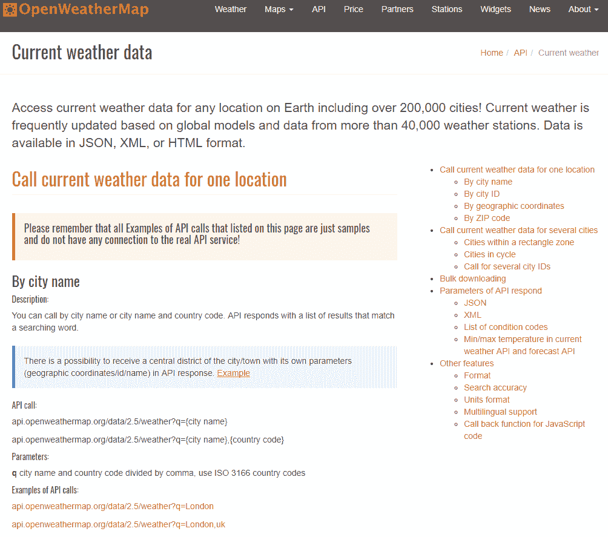OpenWeatherMap 当前天气数据 API 文档

您将使用名为“按城市名称”的 API，该 API 允许您通过提供城市名称作为参数来获取当前天气数据。因此，您的网络请求将如下所示：

```ts
api.openweathermap.org/data/2.5/weather?q={city name},{country code}
```

1.  在文档页面上，点击“API 调用示例”下的链接，您将看到类似以下的示例响应：

```ts
http://samples.openweathermap.org/data/2.5/weather?q=London,uk&appid=b1b15e88fa797225412429c1c50c122a1
{
  "coord": {
    "lon": -0.13,
    "lat": 51.51
  },
  "weather": [
    {
      "id": 300,
      "main": "Drizzle",
      "description": "light intensity drizzle",
      "icon": "09d"
    }
  ],
  "base": "stations",
  "main": {
    "temp": 280.32,
    "pressure": 1012,
    "humidity": 81,
    "temp_min": 279.15,
    "temp_max": 281.15
  },
  "visibility": 10000,
  "wind": {
    "speed": 4.1,
    "deg": 80
  },
  "clouds": {
    "all": 90
  },
  "dt": 1485789600,
  "sys": {
    "type": 1,
    "id": 5091,
    "message": 0.0103,
    "country": "GB",
    "sunrise": 1485762037,
    "sunset": 1485794875
  },
  "id": 2643743,
  "name": "London",
  "cod": 200
}
```

考虑到您已经创建的现有`ICurrentWeather`接口，此响应包含的信息比您需要的要多。因此，您将编写一个新接口，符合此响应的形状，但只指定您将使用的数据部分。此接口将仅存在于`WeatherService`中，我们不会导出它，因为应用程序的其他部分不需要了解此类型。

1.  在`weather.service.ts`中的`import`和`@Injectable`语句之间创建一个名为`ICurrentWeatherData`的新接口

1.  新接口应该像这样：

```ts
src/app/weather/weather.service.ts
interface ICurrentWeatherData {
  weather: [{
    description: string,
    icon: string
  }],
  main: {
    temp: number
  },
  sys: {
    country: string
  },
  dt: number,
  name: string
}
```

通过`ICurrentWeatherData`接口，我们通过向接口添加具有不同结构的子对象来定义新的匿名类型。这些对象中的每一个都可以单独提取出来，并定义为自己的命名接口。特别要注意的是，`weather`将是具有`description`和`icon`属性的匿名类型的数组。

# 添加一个 Angular 组件

我们需要显示当前天气信息，位置在`<div>current weather</div>`处。为了实现这一点，您需要构建一个负责显示天气数据的组件。

创建单独组件的原因是架构最佳实践，这在**Model-View-ViewModel**（**MVVM**）设计模式中得到了体现。你可能之前听说过**Model-View-Controller**（**MVC**）模式。大多数在 2005 年至 2015 年左右编写的基于 Web 的代码都是按照 MVC 模式编写的。MVVM 与 MVC 模式在重要方面有所不同。正如我在 2013 年的 DevPro 文章中所解释的：

[有效实现 MVVM]本质上强制执行关注点的正确分离。业务逻辑与展示逻辑清晰分离。因此，当一个视图被开发时，它就会保持开发状态，因为修复一个视图功能中的错误不会影响其他视图。另一方面，如果[你使用]视觉继承有效并[创建]可重用的用户控件，修复一个地方的错误可以解决整个应用程序中的问题。

Angular 提供了 MVVM 的有效实现。

ViewModels 清晰地封装任何展示逻辑，并通过作为模型的专业版本来简化 View 代码。View 和 ViewModel 之间的关系很直接，可以更自然地将 UI 行为包装在可重用的用户控件中。

你可以在[`bit.ly/MVVMvsMVC`](http://bit.ly/MVVMvsMVC)阅读更多关于架构细微差别的内容和插图。

接下来，你将创建你的第一个 Angular 组件，其中将包括 View 和 ViewModel，使用 Angular CLI 的`ng generate`命令：

1.  在终端中，执行`npx ng generate component current-weather`

确保你在`local-weather-app`文件夹下执行`ng`命令，而不是在`root`项目文件夹下执行。此外，请注意`npx ng generate component current-weather`可以重写为`ng g c current-weather`。今后，本书将使用简写格式，并期望你在必要时加上`npx`。

1.  观察在你的`app`文件夹中创建的新文件：

```ts
src/app
├── app.component.css
├── app.component.html
├── app.component.spec.ts
├── app.component.ts
├── app.module.ts
├── current-weather
  ├── current-weather.component.css
  ├── current-weather.component.html
  ├── current-weather.component.spec.ts
  └── current-weather.component.ts
```

生成的组件有四个部分：

+   `current-weather.component.css`包含特定于组件的任何 CSS，并且是一个可选文件。

+   `current-weather.component.html`包含定义组件外观和绑定渲染的 HTML 模板，并且可以被视为 View，结合使用的任何 CSS 样式。

+   `current-weather.component.spec.ts`包含基于 Jasmine 的单元测试，你可以扩展以测试你的组件功能。

+   `current-weather.component.ts`包含了类定义上方的`@Component`装饰器，它是将 CSS、HTML 和 JavaScript 代码粘合在一起的粘合剂。类本身可以被视为 ViewModel，从服务中提取数据并执行任何必要的转换，以公开视图的合理绑定，如下所示：

```ts
src/app/current-weather/current-weather.component.ts
import { Component, OnInit } from '@angular/core'
@Component({
  selector: 'app-current-weather',
  templateUrl: './current-weather.component.html',
  styleUrls: ['./current-weather.component.css'],
})
export class CurrentWeatherComponent implements OnInit {
  constructor() {}

  ngOnInit() {}
}
```

如果您计划编写的组件很简单，可以使用内联样式和内联模板重写它，以简化代码结构。

1.  使用内联模板和样式更新`CurrentWeatherComponent`：

```ts
src/app/current-weather/current-weather.component.ts import { Component, OnInit } from '@angular/core'

@Component({
  selector: 'app-current-weather',
  template: `
  <p>
    current-weather works!
  </p>
  `,
  styles: ['']
})
export class CurrentWeatherComponent implements OnInit {
constructor() {}

ngOnInit() {}
}
```

当您执行生成命令时，除了创建组件，该命令还将您创建的新模块添加到`app.module.ts`中，避免了将组件连接在一起的繁琐任务。

```ts
src/app/app.module.ts ...
import { CurrentWeatherComponent } from './current-weather/current-weather.component'
...
@NgModule({
declarations: [AppComponent, CurrentWeatherComponent],
...
```

Angular 的引导过程，诚然有点复杂。这也是 Angular CLI 存在的主要原因。`index.html`包含一个名为`<app-root>`的元素。当 Angular 开始执行时，它首先加载`main.ts`，该文件配置了用于浏览器的框架并加载了应用模块。应用模块然后加载所有依赖项，并在前述的`<app-root>`元素内呈现。在第七章中，*创建一个以路由为首的业务应用程序*，当我们构建一个业务应用程序时，我们将创建自己的功能模块，以利用 Angular 的可扩展性特性。

现在，我们需要在初始的`AppComponent`模板上显示我们的新组件，以便最终用户可以看到：

1.  通过用`<app-current-weather></app-current-weather>`替换`<div>current weather</div>`，将`CurrentWeatherComponent`添加到`AppComponent`中：

```ts
src/app/app.component.html
<div  style="text-align:center"> <h1> LocalCast Weather </h1> <div>Your city, your forecast, right now!</div>
 <h2>Current Weather</h2>
 <app-current-weather></app-current-weather> </div>
```

1.  如果一切正常，您应该会看到这个：

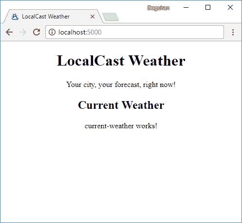您的本地天气应用程序的初始渲染请注意浏览器窗口标签中的图标和名称。作为 Web 开发的规范，在`index.html`文件中，使用应用程序的名称和图标更新`<title>`标签和`favicon.ico`文件，以自定义浏览器标签信息。如果您的 favicon 没有更新，请在`href`属性后附加一个唯一的版本号，例如`href="favicon.ico?v=2"`。结果，您的应用程序将开始看起来像一个真正的 Web 应用程序，而不是一个由 CLI 生成的起始项目。

# 使用接口定义您的模型

现在你的`View`和`ViewModel`已经就位，你需要定义你的`Model`。如果你回顾设计，你会发现组件需要显示：

+   城市

+   国家

+   当前日期

+   当前图片

+   当前温度

+   当前天气描述

你将首先创建一个代表这个数据结构的接口：

1.  在终端中，执行`npx ng generate interface ICurrentWeather`

1.  观察一个新生成的名为`icurrent-weather.ts`的文件，其中包含一个空的接口定义，看起来像这样：

```ts
src/app/icurrent-weather.ts
export  interface ICurrentWeather { }
```

这不是一个理想的设置，因为我们可能会向我们的应用程序添加许多接口，追踪各种接口可能会变得乏味。随着时间的推移，当你将这些接口的具体实现作为类添加时，将把类和它们的接口放在自己的文件中是有意义的。

为什么不直接将接口命名为`CurrentWeather`？这是因为以后我们可能会创建一个类来实现`CurrentWeather`的一些有趣的行为。接口建立了一个契约，确定了任何实现或扩展接口的类或接口上可用属性的列表。始终要意识到何时使用类与接口是非常重要的。如果你遵循最佳实践，始终以大写`I`开头命名你的接口，你将始终意识到你正在传递的对象的类型。因此，接口被命名为`ICurrentWeather`。

1.  将`icurrent-weather.ts`重命名为`interfaces.ts`

1.  将接口名称的大写改正为`ICurrentWeather`

1.  同时，按照以下方式实现接口：

```ts
src/app/interfaces.ts
export interface ICurrentWeather {
  city: string
  country: string
  date: Date
  image: string
  temperature: number
  description: string
}
```

这个接口及其最终的具体表示作为一个类是 MVVM 中的模型。到目前为止，我已经强调了 Angular 的各个部分如何符合 MVVM 模式；未来，我将用它们的实际名称来引用这些部分。

现在，我们可以将接口导入到组件中，并开始在`CurrentWeatherComponent`的模板中连接绑定。

1.  导入`ICurrentWeather`

1.  切换回`templateUrl`和`styleUrls`

1.  定义一个名为`current`的局部变量，类型为`ICurrentWeather`

```ts
src/app/current-weather/current-weather.component.ts import { Component, OnInit } from '@angular/core'
import { ICurrentWeather } from '../interfaces'

@Component({
  selector: 'app-current-weather',
  templateUrl: './current-weather.component.html',
  styleUrls: ['./current-weather.component.css'],
})
export class CurrentWeatherComponent implements OnInit {
  current: ICurrentWeather

  constructor() {}

  ngOnInit() {}
}
```

如果你只是输入`current: ICurrentWeather`，你可以使用自动修复程序自动插入导入语句。

在构造函数中，你将临时用虚拟数据填充当前属性以测试你的绑定。

1.  将虚拟数据实现为一个 JSON 对象，并使用 as 运算符声明其遵守`ICurrentWeather`：

```ts
src/app/current-weather/current-weather.component.ts
...
constructor() {
 this.current = {
 city: 'Bethesda',
 country: 'US',
 date: new Date(),
 image: 'assets/img/sunny.svg',
 temperature: 72,
 description: 'sunny',
 } as ICurrentWeather
} ...
```

在`src/assets`文件夹中，创建一个名为`img`的子文件夹，并放置一张你选择的图片以在虚拟数据中引用。

你可能会忘记你创建的接口中的确切属性。你可以通过按住*Ctrl*并将鼠标悬停在接口名称上来快速查看它们，如下所示：

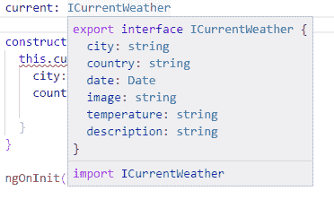*Ctrl* + 悬停在接口上

现在你可以更新模板，将你的绑定与基本的基于 HTML 的布局连接起来。

1.  实现模板：

```ts
src/app/current-weather/current-weather.component.html <div>
  <div>
    <span>{{current.city}}, {{current.country}}</span>
    <span>{{current.date | date:'fullDate'}}</span>
  </div>
  <div>
    
    <span>{{current.temperature | number:'1.0-0'}}℉</span>
  </div>
  <div>
    {{current.description}}
  </div>
</div>
```

要更改`current.date`的显示格式，我们使用了上面的`DatePipe`，传入`'fullDate'`作为格式选项。在 Angular 中，各种内置和自定义管道`|`操作符可用于改变数据的外观，而不实际改变基础数据。这是一个非常强大、方便和灵活的系统，可以在不编写重复的样板代码的情况下共享用户界面逻辑。在上面的例子中，如果我们想以更紧凑的形式表示当前日期，我们可以传入`'shortDate'`。有关各种`DatePipe`选项的更多信息，请参阅[`angular.io/api/common/DatePipe`](https://angular.io/api/common/DatePipe)上的文档。要格式化`current.temperature`，以便不显示小数值，可以使用`DecimalPipe`。文档在[`angular.io/api/common/DecimalPipe`](https://angular.io/api/common/DecimalPipe)。

请注意，你可以使用它们各自的 HTML 代码来渲染℃和℉： 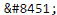 代表℃， 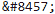 代表℉。

1.  如果一切正常，你的应用程序应该看起来类似于这个截图：

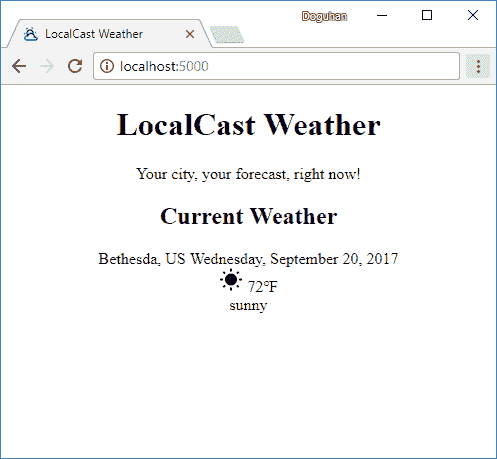绑定虚拟数据后的应用程序

恭喜，你已成功连接了你的第一个组件。

# 使用 Angular 服务和 HttpClient 来检索数据

现在你需要将你的`CurrentWeather`组件连接到`OpenWeatherMap`的 API。在接下来的章节中，我们将介绍以下步骤来实现这个目标：

1.  创建一个新的 Angular 服务

1.  导入`HttpClientModule`并将其注入到服务中

1.  发现`OpenWeatherMap` API

1.  创建一个符合 API 形状的新接口

1.  编写一个`get`请求

1.  将新服务注入到`CurrentWeather`组件中

1.  从`CurrentWeather`组件的`init`函数中调用服务

1.  最后，使用 RxJS 函数将 API 数据映射到本地的`ICurrentWeather`类型，以便组件可以使用它

# 创建一个新的 Angular 服务

任何触及组件边界之外的代码都应该存在于一个服务中；这包括组件间的通信，除非存在父子关系，以及任何缓存或从 cookie 或浏览器的 localStorage 中检索数据的代码。这是一个关键的架构模式，可以使您的应用在长期内易于维护。我在我的 DevPro MVVM 文章中对这个想法进行了扩展，网址为 [`bit.ly/MVVMvsMVC`](http://bit.ly/MVVMvsMVC)。

要创建一个 Angular 服务，执行以下操作：

1.  在终端中执行 `npx ng g s weather --flat false`

1.  观察新创建的`weather`文件夹：

```ts
src/app
...
└── weather
   ├── weather.service.spec.ts
   └── weather.service.ts
```

生成的服务有两部分：

+   `weather.service.spec.ts` 包含了基于 Jasmine 的单元测试，您可以扩展以测试您的服务功能。

+   `weather.service.ts` 包含了类定义之上的`@Injectable`装饰器，这使得可以将此服务注入到其他组件中，利用 Angular 的提供者系统。这将确保我们的服务是单例的，意味着无论它被注入到其他地方多少次，它只会被实例化一次。

服务已经生成，但没有自动提供。要做到这一点，请按照以下步骤操作：

1.  打开`app.module.ts`

1.  在 providers 数组中输入`WeatherService`

1.  使用自动修复程序为您导入类：

```ts
src/app/app.module.ts
...
import { WeatherService } from './weather/weather.service'
...
@NgModule({
  ...
  providers: [WeatherService],
  ...
```

如果您安装了推荐的扩展程序 TypeScript Hero，导入语句将会自动添加。您不必使用自动修复程序来完成。今后，我将不再提到导入模块的需要。

# 注入依赖项

为了进行 API 调用，您将在 Angular 中利用`HttpClient`模块。官方文档 ([`angular.io/guide/http`](https://angular.io/guide/http)) 简洁地解释了这个模块的好处：

“使用 HttpClient，@angular/common/http 为 Angular 应用程序提供了一个简化的 HTTP 功能 API，构建在浏览器暴露的 XMLHttpRequest 接口之上。HttpClient 的额外好处包括可测试性支持，请求和响应对象的强类型化，请求和响应拦截器支持，以及基于 Observables 的更好的错误处理。”

让我们从将`HttpClientModule`导入到我们的应用程序开始，这样我们就可以在模块中将`HttpClient`注入到`WeatherService`中：

1.  将`HttpClientModule`添加到`app.module.ts`中，如下所示：

```ts
src/app/app.module.ts
...
import { HttpClientModule } from  '@angular/common/http'
...
@NgModule({
  ...
  imports: [
    ...
    HttpClientModule,
    ...
```

1.  在`WeatherService`中注入`HttpClient`，由`HttpClientModule`提供，如下所示：

```ts
src/app/weather/weather.service.ts
import { HttpClient } from '@angular/common/http'
import { Injectable } from '@angular/core'

@Injectable()
export class WeatherService {
  constructor(private httpClient: HttpClient) {}
}
```

现在，`httpClient`已经准备好在您的服务中使用。

# 存储环境变量

很容易忽略，但是前几节中的示例 URL 包含一个必需的`appid`参数。您必须将此密钥存储在您的 Angular 应用程序中。您可以将其存储在天气服务中，但实际上，应用程序需要能够在从开发到测试、暂存和生产环境的不同资源集之间切换。Angular 提供了两个环境：一个是`prod`，另一个是默认的。

在继续之前，您需要注册一个免费的`OpenWeatherMap`帐户并检索您自己的`appid`。您可以阅读[`openweathermap.org/appid`](http://openweathermap.org/appid)上的`appid`文档以获取更详细的信息。

1.  复制您的`appid`，它将包含一长串字符和数字

1.  将您的`appid`存储在`environment.ts`中

1.  为以后使用配置`baseUrl`：

```ts
src/environments/environment.ts
export const environment = {
  production: false,
  appId: 'xxxxxxxxxxxxxxxxxxxxxxxxxxxxxxxx',
  baseUrl: 'http://',
}
```

在代码中，我们使用驼峰命名法`appId`来保持我们的编码风格一致。由于 URL 参数不区分大小写，`appId`和`appid`都可以使用。

# 实现 HTTP GET 操作

现在，我们可以在天气服务中实现 GET 调用：

1.  在`WeatherService`类中添加一个名为`getCurrentWeather`的新函数

1.  导入`environment`对象

1.  实现`httpClient.get`函数

1.  返回 HTTP 调用的结果：

```ts
src/app/weather/weather.service.ts
import { environment } from '../../environments/environment'
...
export class WeatherService {
  constructor(private httpClient: HttpClient) { }

  getCurrentWeather(city: string, country: string) {
    return this.httpClient.get<ICurrentWeatherData>(
        `${environment.baseUrl}api.openweathermap.org/data/2.5/weather?` +
          `q=${city},${country}&appid=${environment.appId}`
    )
  }
}
```

请注意 ES2015 的字符串插值特性的使用。您可以使用反引号语法包裹``您的字符串``，而不是通过将变量追加到一起来构建字符串，例如`environment.baseUrl + 'api.openweathermap.org/data/2.5/weather?q=' + city + ',' + country + '&appid=' + environment.appId`。在反引号内，您可以有换行，并且还可以直接嵌入变量到字符串流中，方法是用`${dollarbracket}`语法将它们包裹起来。但是，当您在代码中引入换行时，它将被解释为字面换行—`\n`。为了在代码中断开字符串，您可以添加反斜杠`\`，但是接下来的代码行不能有缩进。更容易的方法是连接多个模板，就像前面的代码示例中所示的那样。请注意，在`get`函数中使用了 TypeScript 泛型，使用了尖括号语法，如`<TypeName>`。使用泛型是开发时的生活质量特性。通过向函数提供类型信息，该函数的输入和/或返回变量类型将在编写代码时显示并在开发和编译时进行验证。

# 从组件中检索服务数据

为了能够在`CurrentWeather`组件中使用`getCurrentWeather`函数，您需要将服务注入到组件中：

1.  将`WeatherService`注入到`CurrentWeatherComponent`类的构造函数中

1.  删除在构造函数中创建虚拟数据的现有代码：

```ts
src/app/current-weather/current-weather.component.ts
constructor(private weatherService: WeatherService) { }
```

1.  在`ngOnInit`函数中调用`getCurrentWeather`函数：

```ts
src/app/current-weather/current-weather.component.ts
ngOnInit() {
  this.weatherService.getCurrentWeather('Bethesda', 'US')
    .subscribe((data) => this.current = data)
}
```

公平警告，不要指望这段代码立即能够工作。您应该会看到一个错误，所以让我们在下一部分中了解发生了什么。

Angular 组件具有丰富的生命周期钩子集合，允许您在组件被渲染、刷新或销毁时注入自定义行为。`ngOnInit()`是您将要使用的最常见的生命周期钩子。它只会在组件首次实例化或访问时被调用。这是您希望执行服务调用的地方。要深入了解组件生命周期钩子，请查看文档[`angular.io/guide/lifecycle-hooks`](https://angular.io/guide/lifecycle-hooks)。请注意，您传递给`subscribe`的匿名函数是 ES2015 的箭头函数。如果您不熟悉箭头函数，一开始可能会感到困惑。箭头函数实际上非常简洁和简单。

考虑以下箭头函数：

`(data) => { this.current = data }`

你可以简单地重写它为：

`function(data) { this.current = data }`

有一个特殊条件——当您编写一个简单转换数据的箭头函数时，比如这样：

`(data) => { data.main.temp }`

该功能有效地将`ICurrentWeatherData`作为输入，并返回 temp 属性。返回语句是隐式的。如果将其重写为常规函数，它将如下所示：

`function(data) { return data.main.temp }`

当`CurrentWeather`组件加载时，`ngOnInit`将触发一次，这将调用`getCurrentWeather`函数，该函数返回一个类型为`Observable<ICurrentWeatherData>`的对象。如官方文档所述，Observable 是 RxJS 的最基本构建块，表示事件发射器，它将以`ICurrentWeatherData`类型随时间发出接收到的任何数据。`Observable`对象本身是无害的，除非被监听，否则不会引发网络事件。您可以在[reactivex.io/rxjs/class/es6/Observable.js~Observable.html](http://reactivex.io/rxjs/class/es6/Observable.js~Observable.html)上阅读更多关于 Observables 的信息。

通过在 Observable 上调用`.subscribe`，实质上是将侦听器附加到发射器上。您在`subscribe`方法中实现了一个匿名函数，每当接收到新数据并发出事件时，该函数将被执行。匿名函数以数据对象作为参数，并且在这种情况下的具体实现中，将数据分配给名为 current 的局部变量。每当 current 更新时，您之前实现的模板绑定将拉取新数据并在视图上呈现它。即使`ngOnInit`只执行一次，对 Observable 的订阅仍然存在。因此，每当有新数据时，current 变量将被更新，并且视图将重新呈现以显示最新数据。

手头错误的根本原因是正在发出的数据是`ICurrentWeatherData`类型；但是，我们的组件只能理解按照`ICurrentWeather`接口描述的形状的数据。在下一节中，您需要深入了解 RxJS，以了解如何最好地完成该任务。

注意，VS Code 和 CLI 有时会停止工作。如前所述，当您编写代码时，`npm start` 命令正在 VS Code 的集成终端中运行。Angular CLI 与 Angular Language Service 插件结合，不断监视代码更改并将您的 TypeScript 代码转译为 JavaScript，因此您可以在浏览器中实时查看您的更改。很棒的是，当您出现编码错误时，除了在 VS Code 中的红色下划线外，您还会在终端或甚至浏览器中看到一些红色文本，因为转译失败了。在大多数情况下，纠正错误后，红色下划线将消失，Angular CLI 将自动重新转译您的代码，一切都会正常工作。然而，在某些情况下，您会注意到 VS Code 无法在 IDE 中捕捉到输入更改，因此您将无法获得自动补全帮助，或者 CLI 工具会卡在显示“webpack: Failed to compile”的消息上。您有两种主要策略来从这种情况中恢复：

1.  点击终端并按 *Ctrl* + *C* 停止运行 CLI 任务，然后通过执行 `npm start` 重新启动

1.  如果 **#1** 不起作用，请使用 *Alt* + *F4*（Windows）或 ⌘ + *Q*（macOS）退出 VS Code 并重新启动它

考虑到 Angular 和 VS Code 的每月发布周期，我相信随着时间的推移，工具只会变得更好。

# 使用 RxJS 转换数据

RxJS 代表响应式扩展，这是一个模块化库，可以实现响应式编程，这本身是一种异步编程范式，并允许通过转换、过滤和控制函数来操作数据流。您可以将响应式编程视为事件驱动编程的演变。

# 了解响应式编程

在事件驱动编程中，您会定义一个事件处理程序并将其附加到事件源。更具体地说，如果您有一个保存按钮，它公开了一个 `onClick` 事件，您将实现一个 `confirmSave` 函数，当触发时，会显示一个弹出窗口询问用户“您确定吗？”。请看下图以可视化此过程。

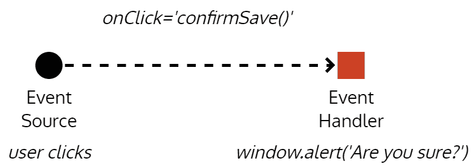事件驱动实现

简而言之，您将有一个事件在每次用户操作时触发。如果用户多次点击保存按钮，这种模式将愉快地渲染出与点击次数相同的弹出窗口，这并没有太多意义。

发布-订阅（pub/sub）模式是一种不同类型的事件驱动编程。在这种情况下，我们可以编写多个处理程序来同时处理给定事件的结果。假设您的应用程序刚刚收到了一些更新的数据。发布者将遍历其订阅者列表，并将更新的数据传递给它们每一个。参考以下图表，更新的数据事件如何触发一个`updateCache`函数，该函数可以使用新数据更新本地缓存，一个`fetchDetails`函数，该函数可以从服务器检索有关数据的更多详细信息，以及一个`showToastMessage`函数，该函数可以通知用户应用程序刚刚收到了新数据。所有这些事件都可以异步发生；但是，`fetchDetails`和`showToastMessage`函数将接收比它们实际需要的更多数据，并且尝试以不同方式组合这些事件以修改应用程序行为可能会变得非常复杂。

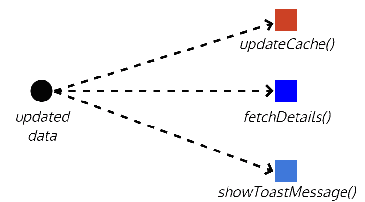发布-订阅模式实现

在响应式编程中，一切都被视为流。流将包含随时间发生的事件，这些事件可以包含一些数据或没有数据。以下图表可视化了一个场景，您的应用程序正在监听用户的鼠标点击。无序的用户点击流是没有意义的。通过对其应用`throttle`函数，您可以对此流施加一些控制，以便每 250 毫秒只获取更新。如果订阅此新事件，每 250 毫秒，您将收到一个点击事件列表。您可以尝试从每个点击事件中提取一些数据，但在这种情况下，您只对发生的点击事件数量感兴趣。我们可以使用`map`函数将原始事件数据转换为点击次数。

在流的下游，我们可能只对包含两个或更多点击的事件感兴趣，因此我们可以使用`filter`函数仅对本质上是双击事件的事件进行操作。每当我们的过滤事件触发时，这意味着用户打算双击，您可以通过弹出警报来对此信息进行操作。流的真正力量来自于您可以选择在任何时候对事件进行操作，因为它通过各种控制、转换和过滤函数。您可以选择使用`*ngFor`和 Angular 的`async`管道在 HTML 列表上显示点击数据，以便用户可以每 250 毫秒监视被捕获的点击数据类型。

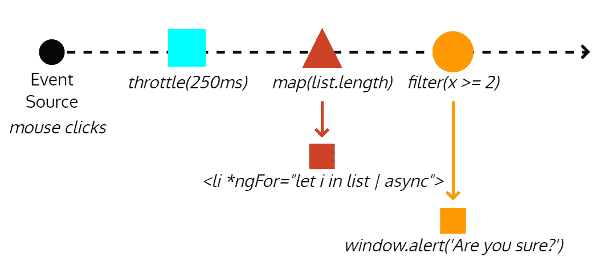一个响应式数据流实现

# 实施响应式转换

为了避免将意外类型的数据从您的服务中返回，您需要更新`getCurrentWeather`函数以定义返回类型为`Observable<ICurrentWeather>`，并导入`Observable`类型，如下所示：

```ts
**src/app/weather/weather.service.ts**
import { Observable } from 'rxjs'
import { ICurrentWeather } from '../interfaces'
... 
```

```ts
export class WeatherService {
  ...
  getCurrentWeather(city:  string, country:  string): Observable<ICurrentWeather> {
  }
  ...
}
```

现在，VS Code 会提醒您，`Observable<ICurrentWeatherData>`类型无法赋值给`Observable<ICurrentWeather>`类型：

1.  编写一个名为`transformToICurrentWeather`的转换函数，可以将`ICurrentWeatherData`转换为`ICurrentWeather`

1.  另外，编写一个名为`convertKelvinToFahrenheit`的辅助函数，将 API 提供的开尔文温度转换为华氏度：

```ts
src/app/weather/weather.service.ts export class WeatherService {...
  private transformToICurrentWeather(data: ICurrentWeatherData): ICurrentWeather {
    return {
      city: data.name,
      country: data.sys.country,
      date: data.dt * 1000,
      image: `http://openweathermap.org/img/w/${data.weather[0].icon}.png`,
      temperature: this.convertKelvinToFahrenheit(data.main.temp),
      description: data.weather[0].description
    }
  }

  private convertKelvinToFahrenheit(kelvin: number): number {
    return kelvin * 9 / 5 - 459.67
  }
}
```

请注意，您需要在此阶段将图标属性转换为图像 URL。在服务中执行此操作有助于保持封装性，将图标值绑定到视图模板中的 URL 将违反**关注点分离**（**SoC**）原则。如果您希望创建真正模块化、可重用和可维护的组件，您必须在执行 SoC 方面保持警惕和严格。有关天气图标的文档以及 URL 应如何形成的详细信息，包括所有可用的图标，可以在[`openweathermap.org/weather-conditions`](http://openweathermap.org/weather-conditions)找到。另外，可以提出这样的论点，即从开尔文到华氏的转换实际上是一个视图关注点，但我们已经在服务中实现了它。这个论点是站得住脚的，特别是考虑到我们计划的功能可以在摄氏度和华氏度之间切换。另一个论点是，此时，我们只需要以华氏度显示，并且天气服务的工作部分是能够转换单位。这个论点也是有道理的。最终的实现将是编写一个自定义的 Angular 管道，并在模板中应用它。管道也可以轻松地与计划中的切换按钮绑定。然而，此时，我们只需要以华氏度显示，我会倾向于*不*过度设计解决方案。

1.  将`ICurrentWeather.date`更新为`number`类型

在编写转换函数时，您会注意到 API 将日期返回为数字。这个数字代表自 UNIX 纪元（时间戳）以来的秒数，即 1970 年 1 月 1 日 00:00:00 UTC。然而，`ICurrentWeather`期望一个`Date`对象。通过将时间戳传递给`Date`对象的构造函数进行转换是很容易的，就像`new Date(data.dt)`。这样做没问题，但也是不必要的，因为 Angular 的`DatePipe`可以直接处理时间戳。为了追求简单和充分利用我们使用的框架的功能，我们将更新`ICurrentWeather`以使用`number`。如果您正在转换大量数据，这种方法还有性能和内存上的好处，但这个问题在这里并不适用。有一个例外——JavaScript 的时间戳是以毫秒为单位的，但服务器的值是以秒为单位的，所以在转换过程中仍然需要进行简单的乘法运算。

1.  在其他导入语句下方导入 RxJS 的`map`操作符：

```ts
src/app/weather/weather.service.ts
import { map } from 'rxjs/operators'
```

手动导入`map`操作符可能看起来有点奇怪。RxJS 是一个非常强大的框架，具有广泛的 API 表面。仅 Observable 本身就有 200 多个附加方法。默认情况下包括所有这些方法会在开发时创建太多的函数选择问题，并且还会对最终交付的大小、应用程序性能和内存使用产生负面影响。因此，您必须单独添加您打算使用的每个操作符。

1.  通过`pipe`将`map`函数应用于`httpClient.get`方法返回的数据流。

1.  将`data`对象传递给`transformToICurrentWeather`函数：

```ts
src/app/weather/weather.service.ts
...
return this.httpClient
  .get<ICurrentWeatherData>(
    `http://api.openweathermap.org/data/2.5/weather?q=${city},${country}&appid=${environment.appId}`
  ).pipe(
    map(data => 
      this.transformToICurrentWeather(data)
    )
  )
...
```

现在，传入的数据可以在流经过程中进行转换，确保`OpenWeatherMap`当前天气 API 数据的格式正确，以便`CurrentWeather`组件可以使用。

1.  确保您的应用成功编译

1.  在浏览器中检查结果：

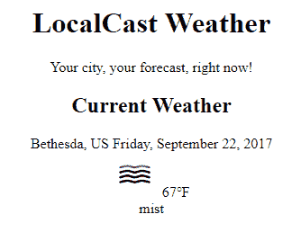从 OpenWeatherMap 显示实时数据

最后，您应该看到您的应用能够从`OpenWeatherMap`获取实时数据，并正确地将服务器数据转换为您期望的格式。

您已经完成了 Feature 1 的开发：显示当前位置的当天天气信息。提交您的代码并将卡片移动到 Waffle 的 Done 列。

1.  最后，我们可以将此任务移动到 Done 列：

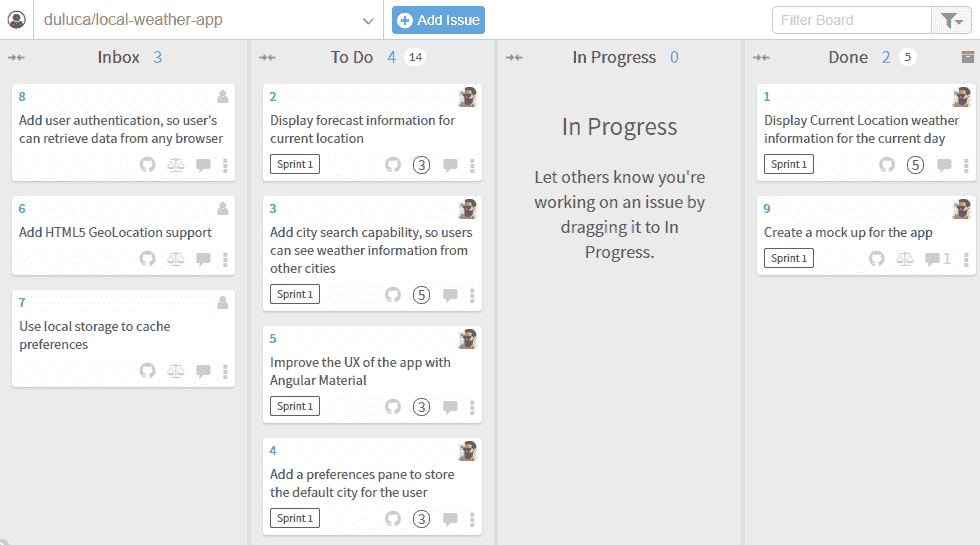Waffle.io 看板状态

# 摘要

恭喜，在本章中，您创建了您的第一个具有灵活架构的 Angular 应用，同时避免了过度工程化。这是可能的，因为我们首先制定了一个路线图，并将其编码在一个可见于您的同行和同事的看板中。我们专注于实施我们正在进行中的第一个功能，并且没有偏离计划。

您现在可以使用 Angular CLI 和优化的 VS Code 开发环境来帮助您减少需要编写的代码量。您可以利用 TypeScript 匿名类型和可观察流来准确地将复杂的 API 数据重塑为简单的格式，而无需创建一次性接口。

您学会了通过主动声明函数的输入和返回类型以及使用通用函数来避免编码错误。您使用日期和小数管道来确保数据按预期格式化，同时将与格式相关的问题大部分放在模板中，这种逻辑属于模板。

最后，您使用接口在组件和服务之间进行通信，而不会将外部数据结构泄漏到内部组件。通过结合应用所有这些技术，Angular、RxJS 和 TypeScript 允许我们做到这一点，您已经确保了关注点的正确分离和封装。因此，`CurrentWeather`组件现在是一个真正可重用和可组合的组件；这并不是一件容易的事情。

如果您没有发布它，那就从未发生过。在下一章中，我们将通过解决应用程序错误、确保自动化单元测试和端到端测试通过，并使用 Docker 将 Angular 应用程序容器化，以便可以在网络上发布。
