# 第三章：为生产发布准备 Angular 应用程序

如果你不发布它，它就没有发生过。在上一章中，您创建了一个可以检索当前天气数据的本地天气应用程序。您已经创造了一定价值；但是，如果您不将应用程序放在网络上，最终您将创造零价值。交付某物是困难的，将某物交付到生产中更加困难。您希望遵循一种能够产生可靠、高质量和灵活发布的策略。

我们在第二章中创建的应用程序，*创建一个本地天气 Web 应用程序*，是脆弱的，有失败的单元和端到端（e2e）测试，并且会发出控制台错误。我们需要修复单元测试并通过有意引入错误来加固应用程序，以便您可以使用调试工具看到真实条件的副作用。我们还需要能够单独交付前端应用程序和后端应用程序，这是保持能够推送单独的应用程序和服务器更新的灵活性非常重要的解耦。此外，解耦将确保随着应用程序堆栈中的各种工具和技术不可避免地不再受支持或受青睐，您将能够替换前端或后端，而无需完全重写系统。

在本章中，您将学会以下内容：

+   运行 Angular 单元和 e2e

+   使用 Chrome 开发者工具排除常见的 Angular 错误

+   防止空数据

+   使用 Docker 将应用程序容器化

+   使用 Zeit Now 将应用程序部署到网络上

所需软件如下所示：

+   Docker 社区版 17.12 版本

+   Zeit Now 账户

# Angular 单元测试

仅仅因为您的 Angular 应用程序使用`npm start`启动并且似乎工作正常，并不意味着它没有错误或准备好投入生产。如前面在第二章中所述，Angular CLI 在创建新组件和服务时会创建一个单元测试文件，例如`current-weather.component.spec.ts`和`weather.service.spec.ts`。

在最基本的层面上，这些默认单元测试确保您的新组件和服务可以在测试中正确实例化。看一下以下规范文件，并观察`should create`测试。该框架断言`CurrentWeatherComponent`类型的组件不是 null 或 undefined，而是真实的。

```ts
src/app/current-weather/current-weather.component.spec.ts
describe('CurrentWeatherComponent', () => {
  let component: CurrentWeatherComponent
  let fixture: ComponentFixture<CurrentWeatherComponent>

  beforeEach(
    async(() => {
      TestBed.configureTestingModule({
        declarations: [CurrentWeatherComponent],
      }).compileComponents()
    })
  )

  beforeEach(() => {
    fixture = TestBed.createComponent(CurrentWeatherComponent)
    component = fixture.componentInstance
    fixture.detectChanges()
  })

  it('should create', () => {
    expect(component).toBeTruthy()
  })
})
```

`WeatherService`规范包含了类似的测试。但是，您会注意到这两种类型的测试设置略有不同：

```ts
src/app/weather/weather.service.spec.ts
describe('WeatherService', () => {
  beforeEach(() => {
    TestBed.configureTestingModule({
      providers: [WeatherService],
    })
  })

  it('should be created', inject([WeatherService], (service: WeatherService) => {
      expect(service).toBeTruthy()
    })
  )
})
```

在`WeatherService`规范的`beforeEach`函数中，正在将要测试的类配置为提供者，然后注入到测试中。另一方面，`CurrentWeatherComponent`规范有两个`beforeEach`函数。第一个`beforeEach`函数异步声明和编译了组件的依赖模块，而第二个`beforeEach`函数创建了一个测试装置，并开始监听组件的变化，一旦编译完成就准备运行测试。

# 单元测试执行

Angular CLI 使用 Jasmine 单元测试库来定义单元测试，并使用 Karma 测试运行器来执行它们。最好的是，这些测试工具已经配置好可以直接运行。您可以使用以下命令执行单元测试：

```ts
$ npm test
```

测试将由 Karma 测试运行器在新的 Chrome 浏览器窗口中运行。Karma 的主要优点是它带来了类似于 Angular CLI 在开发应用程序时使用 WebPack 实现的实时重新加载功能。您应该观察终端上的最后一条消息为 Executed 5 of 5 (5 FAILED) ERROR。这是正常的，因为我们根本没有注意测试，所以让我们修复它们。

保持 Karma Runner 窗口与 VS Code 并排打开，这样您可以立即看到您的更改结果。

# 声明

AppComponent 应该创建应用程序测试失败。如果您观察错误详情，您会发现`AppComponent`无法创建，因为'app-current-weather'不是一个已知的元素。此外，如果指出错误，错误会出现一个[ERROR ->]标签，最后一行为我们解释了事情，类似于 AppComponent.html 中的第 6 行出现的错误。

在`app.component.spec.ts`的声明中包括`CurrentWeatherComponent`：

```ts
src/app/app.component.spec.ts
...
TestBed.configureTestingModule({
  declarations: [AppComponent, CurrentWeatherComponent],
}).compileComponents()
...
```

# 提供者

您会注意到错误数量并没有减少。相反，`AppComponent`和`CurrentWeatherComponent`由于缺少`WeatherService`的提供者而无法创建。因此，让我们在这两个组件的规范文件中为`WeatherService`添加提供者。

1.  在`app.component.spec.ts`的声明中提供`WeatherService`。

1.  在`current-weather.component.spec.ts`中应用相同的代码更改，如下所示：

```ts
src/app/app.component.spec.ts
src/app/current-weather/current-weather.component.spec.ts ...  beforeEach(    async(() => { TestBed.configureTestingModule({
        declarations: [...],
        providers: [WeatherService],
        ...
```

你可能会想知道为什么`AppComponent`需要一个提供程序，因为组件构造函数没有注入`WeatherService`。这是因为`CurrentWeatherComponent`是`AppComponent`的硬编码依赖项。可以通过两种方式进一步解耦这两个组件：一种方式是使用`ng-container`动态注入组件，另一种方式是利用 Angular Router 和`router-outlet`。后一种选项是你将会在大多数应用程序中使用的结构方式，并且将在后面的章节中进行介绍，而实现前一种选项以正确解耦组件则留给读者作为练习。

# 导入

你仍然有剩余的错误。让我们首先修复`WeatherService`的错误，因为它是其他组件的依赖项。测试报告了一个缺少`HttpClient`提供程序的错误。然而，我们不希望我们的单元测试进行 HTTP 调用，所以我们不应该提供`HttpClient`，就像我们在上一节中所做的那样。Angular 为`HttpClient`提供了一个名为`HttpClientTestingModule`的测试替身。为了利用它，你必须导入它，然后它将自动为你提供给服务。

在提供程序下方导入`HttpClientTestingModule`。

```ts
**src/app/weather/weather.service.spec.ts** import { HttpClientTestingModule } from '@angular/common/http/testing' 
...
describe('WeatherService', () => {
  beforeEach(() => {
    TestBed.configureTestingModule({
        imports: [HttpClientTestingModule],
        ... 
```

类似于`HttpClientTestingModule`，还有一个`RouterTestingModule`和一个`NoopAnimationsModule`，它们是真实服务的模拟版本，因此单元测试可以专注于测试你编写的组件或服务代码。在后面的章节中，我们还将介绍如何编写自己的模拟。

现在你应该只看到与`AppComponent`和`CurrentWeatherComponent`相关的错误。即使你已经提供了它们的依赖项，这些组件也失败了。要理解为什么会发生这种情况以及如何解决它，你还必须了解如何使用测试替身。

# 测试替身

只有在受测试的类中的代码应该被执行。在`CurrentWeatherComponent`的情况下，我们需要确保服务代码不被执行。因此，你*永远*不应该提供服务的实际实现。这也是我们在上一节中使用`HttpClientTestingModule`的原因。由于这是我们的自定义服务，我们必须提供我们自己的测试替身的实现。

在这种情况下，我们将实现一个服务的虚假。由于`WeatherService`的虚假将用于多个组件的测试，您的实现应该在一个单独的文件中。为了保持代码库的可维护性和可发现性，一个文件一个类是一个很好的遵循的原则。将类放在单独的文件中将使您免受某些编码罪的困扰，比如错误地在两个类之间创建或共享全局状态或独立函数，从而在此过程中保持代码适当地解耦：

1.  创建一个新文件`weather/weather.service.fake.ts`

我们需要确保实际实现和测试替身的 API 不会随着时间而不同步。我们可以通过为服务创建一个接口来实现这一点。

1.  如下所示，将`IWeatherService`添加到`weather.service.ts`中：

```ts
src/app/weather/weather.service.ts
export interface IWeatherService {
  getCurrentWeather(city: string, country: string): Observable<ICurrentWeather>
}
```

1.  更新`WeatherService`以实现新接口：

```ts
src/app/weather/weather.service.ts
export class WeatherService implements IWeatherService
```

1.  在`weather.service.fake.ts`中实现一个基本的虚假。

```ts
src/app/weather/weather.service.fake.ts
import { Observable, of } from 'rxjs'

import { IWeatherService } from './weather.service'
import { ICurrentWeather } from '../interfaces'

export class WeatherServiceFake implements IWeatherService {
  private fakeWeather: ICurrentWeather = {
    city: 'Bursa',
    country: 'TR',
    date: 1485789600,
    image: '',
    temperature: 280.32,
    description: 'light intensity drizzle',
  }

```

```ts
  public getCurrentWeather(city: string, country: string): Observable<ICurrentWeather> {
    return of(this.fakeWeather)
  }
}
```

我们正在利用现有的`ICurrentWeather`接口，以确保我们的虚假数据正确地构建，但我们还必须将其转换为`Observable`。这很容易通过使用`of`来实现，它会根据提供的参数创建一个可观察序列。

现在您已经准备好为`AppComponent`和`CurrentWeatherComponent`提供虚假。

1.  更新两个组件的提供者以使用`WeatherServiceFake`

以便虚假将被用于实际服务的替代品：

```ts
src/app/app.component.spec.ts
src/app/current-weather/current-weather.component.spec.ts
  ...
  beforeEach(
    async(() => {
      TestBed.configureTestingModule({
        ...
        providers: [{ provide: WeatherService, useClass: WeatherServiceFake}],
        ...
```

随着您的服务和组件变得更加复杂，很容易提供一个不完整或不足的测试替身。您可能会看到诸如 NetworkError: Failed to execute 'send' on 'XMLHttpRequest'，Can't resolve all parameters，或[object ErrorEvent] thrown 等错误。在后一种错误的情况下，点击 Karma 中的调试按钮以发现视图错误详情，可能会显示为 Timeout - Async callback was not invoked within timeout specified by jasmine。单元测试设计为在毫秒内运行，因此实际上应该不可能达到默认的 5 秒超时。问题几乎总是出现在测试设置或配置中。

我们已成功解决了所有与单元测试相关的配置和设置问题。现在，我们需要修复使用初始代码生成的单元测试。

# 茉莉花规范

有两个单元测试失败。在 Jasmine 术语中，单元测试称为规范，由`it`函数实现；`it`函数组织在包含可以在每个测试之前或之后执行的辅助方法的`describe`函数下，并处理规范的整体配置需求。您的应用程序为您生成了五个规范，其中两个现在失败了。

第一个是`AppComponent 应该有标题'app'`；但是，我们从`AppComponent`中删除了这个属性，因为我们没有在使用它。在这种罕见情况下，我们需要这样做：

1.  删除`应该有标题'app'`单元测试。

错误消息足够描述性，可以让您快速了解哪个测试失败了。这是因为提供给`describe`函数的描述是'AppComponent'，而提供给`it`函数的描述是'应该有标题'app''。Jasmine 然后将任何父对象的描述附加到规范的描述中。当您编写新的测试时，您需要维护规范的可读描述。

接下来的错误，`AppComponent 应该在 h1 标签中呈现标题`，是我们必须修复的一个错误。我们现在在`h1`标签中呈现`LocalCast Weather`这几个词。

1.  更新`应该在 h1 标签中呈现标题`测试如下所示：

```ts
src/app/app.component.spec.ts ...it(  'should render title in a h1 tag',
    ...
    expect(compiled.querySelector('h1').textContent).toContain('LocalCast Weather')
    ... 
```

所有单元测试现在都成功通过了。我们应该执行原子提交，所以让我们提交代码更改。

1.  提交您的代码更改。

为了实现有效的单元测试覆盖率，您应该专注于测试包含业务逻辑的函数的正确性。这意味着您应该特别注意遵守单一职责和开闭原则，即 SOLID 原则中的 S 和 O。

# Angular e2e 测试

除了单元测试外，Angular CLI 还为您的应用程序生成和配置 e2e 测试。虽然单元测试侧重于隔离被测试的类，e2e 测试则是关于集成测试。Angular CLI 利用 Protractor 和 WebDriver，因此您可以从用户在浏览器上与您的应用程序交互的角度编写**自动接受测试**（**AAT**）。根据经验，您应该始终编写比 AAT 多一个数量级的单元测试，因为您的应用程序经常发生变化，因此与单元测试相比，AAT 更加脆弱且昂贵。

如果术语 Web 驱动程序听起来很熟悉，那是因为它是经典的 Selenium WebDriver 的演变。截至 2017 年 3 月 30 日，WebDriver 已被提议为 W3C 的官方 Web 标准。您可以在[`www.w3.org/TR/webdriver`](https://www.w3.org/TR/webdriver)上阅读更多关于它的信息。如果您之前熟悉 Selenium，您会感到宾至如归，因为许多模式和实践几乎是相同的。

CLI 为初始的`AppComponent`提供了 e2e 测试，根据应用程序的复杂性和功能集，您可以遵循提供的模式来更好地组织您的测试。在`e2e`文件夹下为每个组件生成两个文件：

```ts
e2e/app.e2e-spec.ts
import { AppPage } from './app.po'

describe('web-app App', () => {
  let page: AppPage

  beforeEach(() => {
    page = new AppPage()
  })

  it('should display welcome message', () => {
    page.navigateTo()
    expect(page.getParagraphText()).toEqual('Welcome to app!')
  })
})
```

`app.e2e-spec.ts`是用 Jasmine 编写的，实现了验收测试。该规范依赖于页面对象（`po`）文件，该文件定义在`spec`文件旁边：

```ts
e2e/app.po.ts
import { browser, by, element } from 'protractor'

export class AppPage {
  navigateTo() {
    return browser.get('/')
  }

  getParagraphText() {
    return element(by.css('app-root h1')).getText()
  }
}
```

页面对象文件封装了来自`spec`文件的 Web 驱动程序实现细节。 AATs 是最。这导致了易于维护、人类可读的规范文件。通过在这个级别分离关注点，您可以将 AAT 的脆弱性隔离到一个位置。通过利用类继承，您可以构建一个强大的页面对象集合，随着时间的推移更容易维护。

# e2e 测试执行

您可以在终端中使用以下命令执行 e2e 测试；确保`npm test`进程没有在运行：

```ts
$ npm run e2e
```

您会注意到测试执行与单元测试不同。虽然您可以配置一个观察者来不断执行 Karma 的单元测试，但由于 e2e 测试的用户驱动和有状态的特性，尝试使用类似的配置来执行 e2e 测试并不是一个好的做法。运行测试一次并停止测试工具确保每次运行都有一个干净的状态。

# e2e 规范

执行 e2e 测试后，您应该会看到类似于这里的错误消息：

```ts
**************************************************
* Failures *
**************************************************

1) web-app App should display welcome message
 - Expected 'LocalCast Weather' to equal 'Welcome to app!'.

Executed 1 of 1 spec (1 FAILED) in 1 sec.
```

这个错误类似于您之前修复的单元测试：

1.  更新`spec`以期望正确的标题如下：

```ts
e2e/app.e2e-spec.ts expect(page.getParagraphText()).toEqual('LocalCast Weather')
```

1.  重新运行测试，现在应该通过了：

```ts
Jasmine started

 web-app App
 √ should display welcome message

Executed 1 of 1 spec SUCCESS in 1 sec.
```

1.  提交您的代码更改。

# 排除常见的 Angular 错误

我们的单元测试和 e2e 测试现在正在运行。在这一部分，您有意引入一个容易犯的错误，以便您可以熟悉在开发应用程序时可能发生的真实错误，并对使您成为一名有效的开发人员的工具有扎实的理解。

在 macOS 上按*option* + ⌘ + *I*，或在 Windows 上按*F12*或*Ctrl* + *Shift* + *I*打开 Chrome 开发者工具（dev tools）。

```ts
src/app/weather/weather.service.ts
...
return this.httpClient
  .get<ICurrentWeatherData>(
    `api.openweathermap.org/data/2.5/weather?q=${city},${country}&appid=${environment.appId}`
  ).pipe(map(data => this.transformToICurrentWeather(data)))
...
```

你的应用将成功编译，但当你在浏览器中检查结果时，你不会看到任何天气数据。事实上，就像你在下面的图片中看到的那样，`CurrentWeather`组件似乎根本没有渲染：

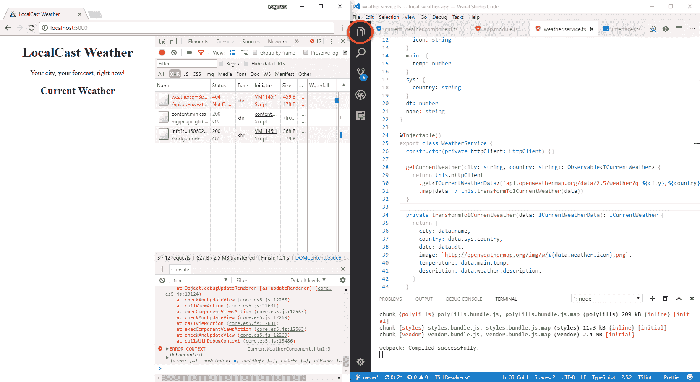带有实时重新加载的并排开发

要找出原因，你需要调试你的 Angular 应用。

# 使用 Chrome 开发者工具进行调试

作为开发人员，我使用谷歌 Chrome 浏览器，因为它具有跨平台和一致的开发者工具，还有有用的扩展。

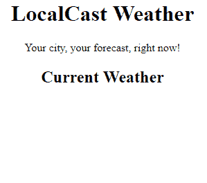CurrentWeather 未渲染

作为最佳实践，我会在 VS Code 和浏览器并排编码，同时在浏览器中也打开开发工具。有几个很好的理由来练习并排开发：

+   **快速反馈循环**：通过实时重新加载，你可以很快看到你的更改的最终结果

+   **笔记本电脑**：现在很多开发人员大部分时间都在笔记本电脑上进行开发，而第二个显示器是一种奢侈。

+   注意响应式设计：由于我有限的空间可用，我不断关注移动优先开发，在事后修复桌面布局问题。观察一下并排开发是什么样子的：

+   **网络活动意识**：为了让我能够快速看到任何 API 调用错误，并确保请求的数据量保持在我的预期范围内

+   **控制台错误意识**：为了让我能够在引入新错误时快速做出反应和解决问题

假设我们在从`OpenWeatherMap.org`的 API 文档页面复制和粘贴 URL 时犯了一个无心的错误，并忘记在其前面添加`http://`。这是一个容易犯的错误：

最终，你应该做最适合你的事情。通过并排设置，我经常发现自己在打开和关闭 VS Code 的资源管理器，并根据手头的具体任务调整开发工具窗格的大小。要切换 VS Code 的资源管理器，请点击前面截图中圈出的资源管理器图标。

就像你可以使用`npm start`进行带有实时重新加载的并排开发一样，你也可以使用`npm test`进行单元测试，获得同样类型的快速反馈循环。

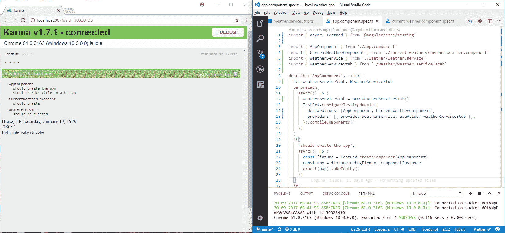并排开发与单元测试

通过并排的单元测试设置，你可以在开发单元测试方面变得非常有效。

# 优化 Chrome 开发工具

为了使并排开发和实时重新加载正常工作，你需要优化默认的开发工具体验。

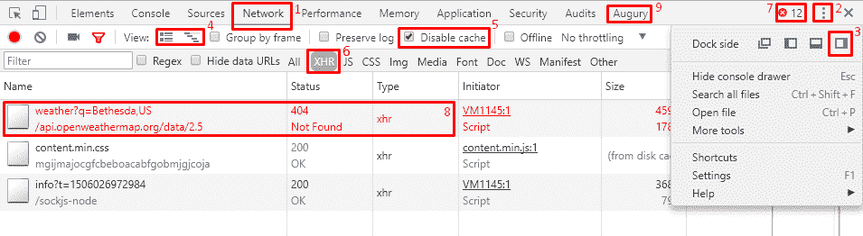优化的 Chrome 开发者工具

从前面的图中可以看出，有很多设置和信息显示器被突出显示：

1.  默认打开网络选项卡，这样你就可以看到网络流量的流动。

1.  点击按钮打开开发工具设置。

1.  点击右侧图标，使开发工具停靠在 Chrome 的右侧。这种布局可以提供更多的垂直空间，这样你就可以一次看到更多的网络流量和控制台事件。作为一个附带的好处，左侧的布局接近移动设备的大小和形状。

1.  切换到大请求行，并关闭概览，以便查看每个请求的 URL 和参数，并获得更多的垂直空间。

1.  勾选禁用缓存选项，这样当你在打开开发工具的情况下刷新页面时，将强制重新加载每个资源。这可以防止奇怪的缓存错误影响你的工作。

1.  你主要会对各种 API 的 XHR 调用感兴趣，所以点击 XHR 来过滤结果。

1.  请注意，你可以在右上角看到控制台错误的数量为 12。理想情况下，控制台错误的数量应该始终为 0。

1.  请注意，请求行中的顶部项目表明状态码为 404 未找到的错误。

1.  由于我们正在调试一个 Angular 应用程序，Augury 扩展已经加载。我将在第七章中更详细地介绍这个工具，*创建一个更复杂的应用程序时，你将会构建一个更复杂的应用程序。

有了优化的开发工具环境，你现在可以有效地排除之前的应用程序错误。

# 故障排除网络问题

在这个状态下，应用程序有三个可见的问题：

+   组件详情没有显示

+   有很多控制台错误。

+   API 调用返回 404 未找到错误

首先检查任何网络错误，因为网络错误通常会引起连锁反应：

1.  在网络选项卡中点击失败的 URL

1.  在 URL 右侧打开的详细信息窗格中，点击预览选项卡

1.  您应该看到这个：

```ts
Cannot GET /api.openweathermap.org/data/2.5/weather
```

仅仅观察这个错误消息，您很可能会忽略这样一个事实，即您忘记向 URL 添加`http://`前缀。这个错误很微妙，当然不是非常明显的。

1.  将鼠标悬停在 URL 上，并观察完整的 URL，如下所示：

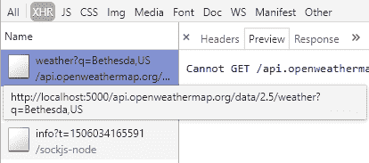检查网络错误

正如您所看到的，现在这个错误非常明显。在这个视图中，我们可以看到完整的 URL，并且清楚地看到`weather.service.ts`中定义的 URL 没有完全合格，因此 Angular 尝试从其父服务器`localhost:5000`上加载资源，而不是通过网络到正确的服务器上。

# 调查控制台错误

在您修复此问题之前，值得了解 API 调用失败的连锁效应：

1.  观察控制台错误：

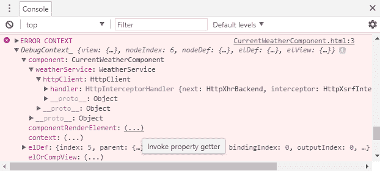开发工具控制台错误上下文

这里需要注意的第一个元素是`ERROR CONTEXT`对象，它有一个名为`DebugContext_`的属性。`DebugContext_`包含了发生错误时您的 Angular 应用程序的当前状态的详细快照。`DebugContext_`中包含的信息远远超过了 AngularJS 生成的大部分不太有用的错误消息。

值为(...)的属性是属性获取器，您必须点击它们以加载其详细信息。例如，如果您点击 componentRenderElement 的省略号，它将被填充为 app-current-weather 元素。您可以展开该元素以检查组件的运行时条件。

1.  现在滚动到控制台的顶部

1.  观察第一个错误：

```ts
ERROR TypeError: Cannot read property 'city' of undefined
```

您可能之前遇到过`TypeError`。这个错误是由于尝试访问未定义对象的属性而引起的。在这种情况下，`CurrentWeatherComponent.current`没有分配给一个对象，因为 http 调用失败了。由于`current`没有初始化，模板盲目地尝试绑定其属性，比如`{{current.city}}`，我们会得到一个消息，说无法读取未定义的属性'city'。这是一种连锁反应，可能会在您的应用程序中产生许多不可预测的副作用。您必须积极编码以防止这种情况发生。

# Karma、Jasmine 和单元测试错误

当使用`ng test`命令运行测试时，你可能会遇到一些高级错误，这些错误可能掩盖了实际潜在错误的根本原因。

解决错误的一般方法应该是从内而外，首先解决子组件的问题，最后解决父组件和根组件的问题。

# 网络错误

网络错误可能是由多种潜在问题引起的：

```ts
NetworkError: Failed to execute 'send' on 'XMLHttpRequest': Failed to load 'ng:///DynamicTestModule/AppComponent.ngfactory.js'.
```

从内而外地工作，你应该实现服务的测试替身，并将伪造的东西提供给适当的组件，就像前一节所介绍的那样。然而，在父组件中，即使你正确地提供了伪造的东西，你可能仍然会遇到错误。请参考处理通用错误事件的部分，以揭示潜在的问题。

# 通用错误事件

错误事件是隐藏潜在原因的通用错误：

```ts
[object ErrorEvent] thrown
```

为了暴露通用错误的根本原因，实现一个新的`test:debug`脚本：

1.  在`package.json`中实现如下所示的`test:debug`：

```ts
package.json
...
"scripts": {
  ...
  "test:debug": "ng test --sourcemaps=false",
  ...
}
```

1.  执行`npm run test:debug`

1.  现在 Karma 运行器可能会揭示潜在的问题

1.  如果有必要，跟踪堆栈以找到可能导致问题的子组件

如果这种策略不起作用，你可以通过断点调试单元测试来获取更多关于出错原因的信息。

# 使用 Visual Studio Code 进行调试

你还可以直接在 Visual Studio Code 中调试你的 Angular 应用程序、Karma 和 Protractor 测试。首先，你需要配置调试器以与 Chrome 调试环境配合工作，如下所示：

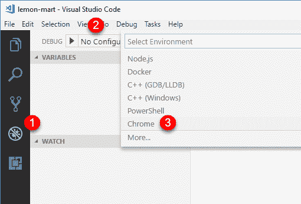VS Code 调试设置

1.  点击调试窗格

1.  展开“无配置”下拉菜单，然后点击“添加配置...”

1.  在“选择环境”选择框中，选择 Chrome

这将在`.vscode/launch.json`文件中创建一个默认配置。我们将修改这个文件以添加三个单独的配置。

1.  用以下配置替换`launch.json`的内容：

```ts
.vscode/launch.json
{
  "version": "0.2.0",
  "configurations": [
    {
      "name": "npm start",
      "type": "chrome",
      "request": "launch",
      "url": "http://localhost:5000/#",
      "webRoot": "${workspaceRoot}",
      "runtimeArgs": [
        "--remote-debugging-port=9222"
        ],
      "sourceMaps": true
    },
    {
      "name": "npm test",
      "type": "chrome",
      "request": "launch",
      "url": "http://localhost:9876/debug.html",
      "webRoot": "${workspaceRoot}",
      "runtimeArgs": [
        "--remote-debugging-port=9222"
        ],
      "sourceMaps": true
    },
    {
      "name": "npm run e2e",
      "type": "node",
      "request": "launch",
      "program": "${workspaceRoot}/node_modules/protractor/bin/protractor",
      "protocol": "inspector",
      "args": ["${workspaceRoot}/protractor.conf.js"]
    }
  ]
}
```

1.  在开始调试之前，执行相关的 CLI 命令，如`npm start`、`npm test`或`npm run e2e`

1.  在调试页面上，在调试下拉菜单中，选择 npm start，然后点击绿色播放图标

1.  观察 Chrome 实例是否已启动

1.  在`.ts`文件上设置断点

1.  执行应用程序中的操作以触发断点

1.  如果一切顺利，Chrome 将报告代码已在 Visual Studio Code 中暂停

在发布时，这种调试方法并不总是可靠的。我不得不在 Chrome Dev Tools | Sources 标签中手动设置断点，在`webpack://.`文件夹下找到相同的`.ts`文件，这样才能正确地触发 VS Code 中的断点。然而，这使得使用 VS Code 调试代码的整个好处变得毫无意义。有关更多信息，请在 GitHub 上查看 Angular CLI 部分关于 VS Code Recipes 的内容：[`github.com/Microsoft/vscode-recipes`](https://github.com/Microsoft/vscode-recipes)。

# 在 Angular 中进行 null 防范

在 JavaScript 中，`undefined`和`null`值是一个持久性问题，必须在每一步积极地处理。在 Angular 中，有多种方法可以防范`null`值：

1.  属性初始化

1.  安全导航操作符`?.`

1.  使用`*ngIf`进行 null 防范

# 属性初始化

在诸如 Java 这样的静态类型语言中，你被灌输了正确的变量初始化/实例化是无错误操作的关键。所以让我们在`CurrentWeatherComponent`中尝试通过使用默认值来初始化当前值：

```ts
src/app/current-weather/current-weather.component.ts
constructor(private weatherService: WeatherService) {
  this.current = {
    city: '',
    country: '',
    date: 0,
    image: '',
    temperature: 0,
    description: '',
  }
}
```

这些更改的结果将把控制台错误从 12 个减少到 3 个，此时您只会看到与 API 调用相关的错误。然而，应用本身仍然不是一个可以展示的状态，如下所示：

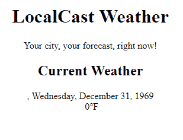

属性初始化的结果

为了使这个视图对用户可见，我们必须在模板的每个属性上编写默认值的代码。因此，通过初始化来修复 null 防范问题，我们创建了一个默认值处理问题。对于开发人员来说，初始化和默认值处理都是*O(n)*规模的任务。在最好的情况下，这种策略将是烦人的实施，在最坏的情况下，高度无效且容易出错，每个属性至少需要*O(2n)*的工作量。

# 安全导航操作符

Angular 实现了安全导航操作`?.`来防止对未定义对象的意外遍历。因此，我们只需更新模板，而不是编写初始化代码并处理模板值：

```ts
src/app/current-weather/current-weather.component.html
<div>
  <div>
    <span>{{current?.city}}, {{current?.country}}</span>
    <span>{{current?.date | date:'fullDate'}}</span>
  </div>
  <div>
    
    <span>{{current?.temperature}}℉</span>
  </div>
  <div>
    {{current?.description}}
  </div>
</div>
```

这一次，我们不必自己设置默认值，让 Angular 处理显示未定义的绑定。您会注意到，就像初始化修复一样，错误数量已经从 12 个减少到 3 个。应用本身的状态有所改善。不再显示混乱的数据；然而，它仍然不是一个可以展示的状态，如下所示：

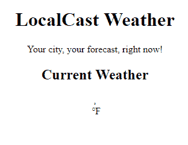安全导航操作符的结果

你可能可以想象在更复杂的场景中安全导航操作符可以派上用场的方式。然而，当大规模部署时，这种类型的编码仍然需要至少*O(n)*级别的工作量来实现。

# 使用*ngIf 进行空值保护

理想的策略是使用`*ngIf`，这是一个结构指令，意味着 Angular 将在假语句之后停止遍历 DOM 树元素。

在`CurrentWeather`组件中，我们可以在尝试渲染模板之前轻松检查`current`变量是否为 null 或未定义：

1.  更新顶层的`div`元素，使用`*ngIf`来检查`current`是否是一个对象，如下所示：

```ts
src/app/current-weather/current-weather.component.html <div *ngIf="current">
  ...
</div>
```

现在观察控制台日志，没有报告任何错误。你始终要确保你的 Angular 应用程序报告零控制台错误。如果你仍然在控制台日志中看到错误，请确保你已经正确恢复了`OpenWeather`的 URL 到正确的状态，或者终止并重新启动你的`npm start`进程。我强烈建议在继续之前解决任何控制台错误。一旦你修复了所有错误，确保你再次提交你的代码。

1.  提交你的代码。

# 使用 Docker 对应用进行容器化

Docker [docker.io](http://docker.io) 是一个用于开发、发布和运行应用程序的开放平台。Docker 结合了一个轻量级的容器虚拟化平台和工作流程以及工具，帮助管理和部署应用程序。虚拟机（VMs）和 Docker 容器之间最明显的区别是，VMs 通常有数十 GB 的大小，需要数 GB 的内存，而容器在磁盘和内存大小方面只有几 MB 的要求。此外，Docker 平台抽象了主机操作系统级别的配置设置，因此成功运行应用程序所需的每一部分配置都编码在人类可读的 Dockerfile 格式中，如下所示：

```ts
**Dockerfile**
FROM duluca/minimal-node-web-server:8.11.1 WORKDIR /usr/src/app COPY dist public
```

前面的文件描述了一个新的容器，该容器继承自一个名为`duluca/minimal-node-web-server`的容器，将工作目录更改为`/usr/src/app`，然后将开发环境中`dist`文件夹的内容复制到容器的`public`文件夹中。在这种情况下，父镜像配置了一个 Express.js 服务器，充当 web 服务器，以提供`public`文件夹中的内容。请参考以下图表，以了解正在发生的情况的可视化表示：

Docker 镜像的上下文

在基础层是我们的主机操作系统，比如 Windows 或 macOS，它运行 Docker 运行时，将在下一节中安装。Docker 运行时能够运行自包含的 Docker 镜像，这是由上述的`Dockerfile`定义的。`duluca/minimal-node-web-server`基于轻量级的 Linux 操作系统 Alpine。Alpine 是 Linux 的一个完全精简版本，不带有任何图形界面，驱动程序，甚至大多数你可能期望从 Linux 系统中得到的 CLI 工具。因此，这个操作系统的大小只有大约 5MB。基础软件包然后安装了 Node.js，Node.js 本身的大小约为 10MB，以及我定制的基于 Node.js 的 Express.js web 服务器，结果是一个微小的约 15MB 的镜像。Express 服务器被配置为提供`/usr/src/app`文件夹的内容。在前面的`Dockerfile`中，我们只是将开发环境中`/dist`文件夹的内容复制到`/usr/src/app`文件夹中。我们稍后将构建并执行这个镜像，这将运行我们的 Express web 服务器，其中包含我们`dist`文件夹的输出。

Docker 的美妙之处在于你可以导航到[`hub.docker.com`](https://hub.docker.com)，搜索`duluca/minimal-node-web-server`，阅读它的`Dockerfile`，并追溯其源头直到作为 web 服务器基础的原始基础镜像。我鼓励你以这种方式审查你使用的每个 Docker 镜像，以了解它对你的需求到底带来了什么。你可能会发现它要么过度复杂，要么有你以前不知道的功能，可以让你的生活变得更加轻松。请注意，父镜像需要特定版本的`duluca/minimal-node-web-server`，为`8.11.1`。这是非常有意义的，作为读者，你应该选择你找到的 Docker 镜像的最新可用版本。然而，如果你不指定版本号，你将始终获得镜像的最新版本。随着镜像的发布更多版本，你可能会拉取一个未来版本，可能会破坏你的应用程序。因此，对于你依赖的镜像，总是指定一个版本号。

一个这样的案例是`duluca/minimal-node-web-server`中内置的 HTTPS 重定向支持。当你只需要在你的 Dockerfile 中添加以下行时，你可以花费无数小时尝试设置一个 nginx 代理来做同样的事情：

```ts
ENV ENFORCE_HTTPS=xProto
```

就像 npm 包一样，Docker 可以带来巨大的便利和价值，但你必须小心地理解你正在使用的工具。

在第十一章中，*AWS 上高可用云基础设施*，我提到了基于 Nginx 的低占用的 docker 镜像的使用。如果你熟悉配置`nginx`，你可以使用`duluca/minimal-nginx-web-server`作为你的基础镜像。

# 安装 Docker

为了能够构建和运行容器，你必须首先在你的计算机上安装 Docker 执行环境。

Windows 对 Docker 的支持可能具有挑战性。你必须拥有一个支持虚拟化扩展的 CPU 的 PC，这在笔记本电脑上并不是一定的。你还必须拥有启用了 Hyper-V 的 Windows 专业版。另一方面，Windows Server 2016 原生支持 Docker，这是微软向行业采用 Docker 和容器化倡议所表现出的前所未有的支持量。

1.  通过执行以下命令安装 Docker：

对于 Windows：

```ts
**PS> choco install docker docker-for-windows -y** 
```

对于 macOS：

```ts
$ brew install docker
```

1.  执行`docker -v`来验证安装。

# 设置 Docker 脚本

现在，让我们配置一些 Docker 脚本，您可以使用这些脚本来自动构建，测试和发布您的容器。我开发了一组名为**npm Scripts for Docker**的脚本，适用于 Windows 10 和 macOS。您可以在[bit.ly/npmScriptsForDocker](http://bit.ly/npmScriptsForDocker)获取这些脚本的最新版本：

1.  在[`hub.docker.com/`](https://hub.docker.com/)上注册 Docker Hub 帐户

1.  为您的应用程序创建一个公共（免费）存储库

不幸的是，在发布时，Zeit 不支持私有 Docker Hub 存储库，因此您的唯一选择是公开发布您的容器。如果您的图像必须保持私有，我建议您按照第十一章中描述的在 AWS ECS 环境中设置的方法进行操作，*在 AWS 上构建高可用云基础设施*。您可以通过访问 Zeit Now 的文档[zeit.co/docs/deployment-types/docker](https://zeit.co/docs/deployment-types/docker)来了解问题的最新情况。

1.  更新`package.json`以添加一个新的配置属性，具有以下配置属性：

```ts
package.json
  ...
  "config": {
    "imageRepo": "[namespace]/[repository]",
    "imageName": "custom_app_name",
    "imagePort": "0000"
  },
 ...
```

命名空间将是您的 DockerHub 用户名。您将在创建过程中定义您的存储库的名称。示例图像存储库变量应如`duluca/localcast-weather`。图像名称用于轻松识别您的容器，同时使用 Docker 命令，如`docker ps`。我将只称之为`localcast-weather`。端口将定义应从容器内部使用哪个端口来公开您的应用程序。由于我们在开发中使用`5000`，请选择另一个端口，如`8080`。

1.  通过从[bit.ly/npmScriptsForDocker](http://bit.ly/npmScriptsForDocker)复制粘贴脚本将 Docker 脚本添加到`package.json`。以下是脚本的注释版本，解释了每个功能。

请注意，使用 npm 脚本时，`pre`和`post`关键字分别用于在给定脚本的执行之前或之后执行辅助脚本，并且脚本故意分成较小的部分，以便更容易阅读和维护它们：

```ts
package.json
...
  "scripts": {
    ...
    "predocker:build": "npm run build",
    "docker:build": "cross-conf-env docker image build . -t $npm_package_config_imageRepo:$npm_package_version",
    "postdocker:build": "npm run docker:tag",
    ...
```

`npm run docker:build`将在`pre`中构建您的 Angular 应用程序，然后使用`docker image build`命令构建 Docker 镜像，并在`post`中为图像打上版本号：

```ts
package.json
    ...
    "docker:tag": " cross-conf-env docker image tag $npm_package_config_imageRepo:$npm_package_version $npm_package_config_imageRepo:latest",
    ...
```

`npm run docker:tag`将使用`package.json`中的`version`属性的版本号和`latest`标签标记已构建的 Docker 镜像：

```ts
package.json
    ...
    "docker:run": "run-s -c docker:clean docker:runHelper",
    "docker:runHelper": "cross-conf-env docker run -e NODE_ENV=local --name $npm_package_config_imageName -d -p $npm_package_config_imagePort:3000 $npm_package_config_imageRepo",
    ...
```

`npm run docker:run`将删除任何现有的先前版本的镜像，并使用`docker run`命令运行已构建的镜像。请注意，`imagePort`属性用作 Docker 镜像的外部端口，该端口映射到 Node.js 服务器监听的图像的内部端口`3000`：

```ts
package.json
    ...
    "predocker:publish": "echo Attention! Ensure `docker login` is correct.",
    "docker:publish": "cross-conf-env docker image push $npm_package_config_imageRepo:$npm_package_version",
    "postdocker:publish": "cross-conf-env docker image push $npm_package_config_imageRepo:latest",
    ...
```

`npm run docker:publish`将使用`docker image push`命令将构建的镜像发布到配置的存储库，本例中为 Docker Hub。首先发布带版本标签的镜像，然后发布带`latest`标签的镜像。

```ts
package.json
    ...
    "docker:clean": "cross-conf-env docker rm -f $npm_package_config_imageName",
    ...
```

`npm run docker:clean`将使用`docker rm -f`命令从系统中删除先前构建的镜像：

```ts
package.json
    ...
    "docker:taillogs": "cross-conf-env docker logs -f $npm_package_config_imageName",
    ...
```

运行`npm run docker:taillogs`将使用`docker log -f`命令显示正在运行的 Docker 实例的内部控制台日志，这是在调试 Docker 实例时非常有用的工具：

```ts
package.json
    ...
    "docker:open:win": "echo Trying to launch on Windows && timeout 2 && start http://localhost:%npm_package_config_imagePort%",
    "docker:open:mac": "echo Trying to launch on MacOS && sleep 2 && URL=http://localhost:$npm_package_config_imagePort && open $URL",
    ...
```

`npm run docker:open:win`或`npm run docker:open:mac`将等待 2 秒，然后使用`imagePort`属性以正确的 URL 启动浏览器到您的应用程序：

```ts
package.json
    ...
    "predocker:debug": "run-s docker:build docker:run",
    "docker:debug": "run-s -cs docker:open:win docker:open:mac docker:taillogs"
  },
...
```

`npm run docker:debug`将构建您的镜像并在`pre`中运行一个实例，打开浏览器，然后开始显示容器的内部日志。

1.  安装两个开发依赖项，以确保脚本的跨平台功能：

```ts
$ npm i -D cross-conf-env npm-run-all
```

1.  自定义预构建脚本以在构建图像之前执行单元测试和 e2e 测试：

```ts
package.json
"predocker:build": "npm run build -- --prod --output-path dist && npm test -- --watch=false && npm run e2e",
```

请注意，`npm run build`提供了`--prod`参数，可以实现两个目标：

1. 将约 2.5 MB 的开发时间负载优化为约 73kb 或更少

2. 在`src/environments/environment.prod.ts`中定义的配置项在运行时使用

1.  更新`src/environments/environment.prod.ts`，使用您自己的`OpenWeather`的`appId`：

```ts
export const environment = {
  production: true,
  appId: '01ffxxxxxxxxxxxxxxxxxxxxxxxxxxxx',
  baseUrl: 'https://',
}
```

我们正在修改`npm test`的执行方式，以便测试只运行一次，工具停止执行。提供`--watch=false`选项以实现此行为，而不是默认的持续执行行为。此外，`npm run build`提供了`--output-path dist`，以确保`index.html`发布在文件夹的根目录。

1.  创建一个名为`Dockerfile`的新文件，没有文件扩展名

1.  实现`Dockerfile`，如下所示：

```ts
Dockerfile
FROM duluca/minimal-node-web-server:8.11.1
WORKDIR /usr/src/app
COPY dist public
```

确保检查`dist`文件夹的内容。确保`index.html`位于`dist`的根目录。否则，请确保您的`Dockerfile`复制具有`index.html`的文件夹。

1.  执行`npm run predocker:build`以确保您的应用程序更改已成功

1.  执行`npm run docker:build`以确保您的镜像成功构建

虽然您可以单独运行提供的任何脚本，但您实际上只需要记住其中两个：

+   **npm run docker:debug**将在新的浏览器窗口中测试、构建、标记、运行、追踪和启动您的容器化应用程序

+   **npm run docker:publish**将发布您刚刚构建和测试的图像到在线 Docker 存储库

1.  在终端中执行`docker:debug`：

```ts
$ npm run docker:debug
```

您会注意到脚本在终端窗口中显示错误。这些并不一定是失败的指标。脚本并不完善，因此它们会同时尝试 Windows 和 macOS 兼容的脚本，并且在第一次构建时，清理命令会失败，因为没有东西需要清理。在您阅读此文时，我可能已经发布了更好的脚本；如果没有，您可以随时提交拉取请求。

成功的`docker:debug`运行应该会在焦点中打开一个新的浏览器窗口，显示您的应用程序和服务器日志在终端中被追踪，如下所示：

```ts
Current Environment: local.
Server listening on port 3000 inside the container
Attenion: To access server, use http://localhost:EXTERNAL_PORT
EXTERNAL_PORT is specified with 'docker run -p EXTERNAL_PORT:3000'. See 'package.json->imagePort' for th
e default port.
GET / 304 12.402 ms - -
GET /styles.d41d8cd98f00b204e980.bundle.css 304 1.280 ms - -
GET /inline.202587da3544bd761c81.bundle.js 304 11.117 ms - -
GET /polyfills.67d068662b88f84493d2.bundle.js 304 9.269 ms - -
GET /vendor.c0dc0caeb147ad273979.bundle.js 304 2.588 ms - -
GET /main.9e7f6c5fdb72bb69bb94.bundle.js 304 3.712 ms - -
```

您应该始终运行`docker ps`来检查您的镜像是否正在运行，上次更新时间，或者它是否与声称相同端口的现有镜像发生冲突。

1.  在终端中执行`docker:publish`：

```ts
$ npm run docker:publish
```

您应该在终端窗口中观察到成功运行，如下所示：

```ts
The push refers to a repository [docker.io/duluca/localcast-weather]
60f66aaaaa50: Pushed
...
latest: digest: sha256:b680970d76769cf12cc48f37391d8a542fe226b66d9a6f8a7ac81ad77be4f58b size: 2827
```

随着时间的推移，您的本地 Docker 缓存可能会增长到相当大的规模，在我的笔记本电脑上大约是两年 40GB。您可以使用`docker image prune`和`docker container prune`命令来减小缓存的大小。有关更详细的信息，请参阅[`docs.docker.com/config/pruning`](https://docs.docker.com/config/pruning)上的文档。

让我们来看一下与 Docker 互动的更简单的方法。

# VS Code 中的 Docker 扩展

与 Docker 镜像和容器互动的另一种方式是通过 VS Code。如果您已经安装了`PeterJausovec.vscode-docker` Docker 扩展，如第二章*创建本地天气 Web 应用程序*中建议的那样，您将在 VS Code 的资源管理器窗格中看到一个名为 DOCKER 的可展开标题，如下截图中的箭头所指出的那样：

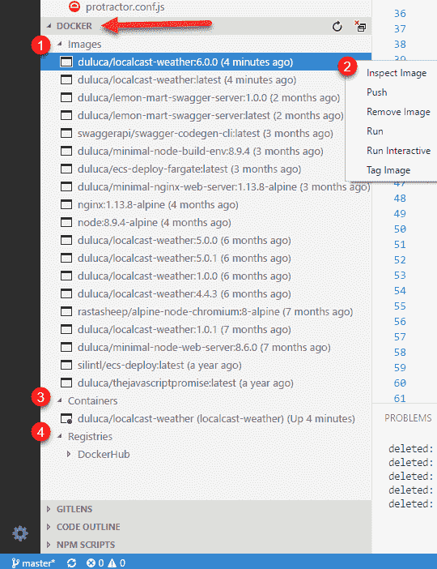VS Code 中的 Docker 扩展

让我们来看一下扩展提供的一些功能：

1.  **镜像**包含系统上存在的所有容器快照的列表

1.  右键单击 Docker 镜像会弹出上下文菜单，可以在其中运行各种操作，如运行、推送和标记

1.  **容器**列出系统上存在的所有可执行 Docker 容器，您可以启动、停止或附加到它们

1.  **注册表**显示您配置连接的注册表，如 DockerHub 或 AWS 弹性容器注册表

虽然该扩展使与 Docker 的交互变得更容易，**npm 脚本用于 Docker**可以自动化与构建、标记和测试镜像相关的许多琐事。它们是跨平台的，并且在持续集成环境中同样有效。

通过 CLI 与 npm 脚本进行交互可能会让您感到困惑。让我们接下来看一下 VS Code 的 npm 脚本支持。

# VS Code 中的 NPM 脚本

VS Code 默认支持 npm 脚本。为了启用 npm 脚本资源管理器，打开 VS Code 设置，并确保存在`"npm.enableScriptExplorer": true`属性。一旦您这样做了，您将在资源管理器窗格中看到一个可展开的标题，名为 NPM SCRIPTS，如下箭头所指：

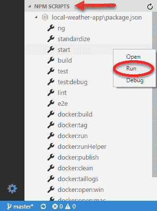VS Code 中的 NPM 脚本

您可以单击任何脚本来启动包含该脚本的行`package.json`，或者右键单击并选择运行来执行该脚本。

# 部署容器化应用

如果从编码的角度来看，将某些东西交付到生产环境是困难的，那么从基础架构的角度来看，要做到正确更是极其困难。在后面的章节中，我将介绍如何为您的应用程序配置世界一流的 AWS **弹性容器服务**（**ECS**）基础架构，但如果您需要快速展示一个想法，这是无济于事的。现在，Zeit Now 登场了。

# Zeit Now

Zeit Now，[`zeit.co/now`](https://zeit.co/now)，是一个多云服务，可以实现应用程序的实时全球部署，直接从 CLI 进行。Now 可以与正确实现`package.json`或`Dockerfile`的应用程序一起工作。尽管我们两者都做了，但我们更喜欢部署我们的 Docker 镜像，因为在幕后会应用更多的魔法来使`package.json`部署工作，而您的 Docker 镜像可以部署到任何地方，包括 AWS ECS。

# 配置 Now CLI 工具

现在，让我们配置 Zeit Now 来在您的存储库上工作：

1.  通过执行`npm i -g now`来安装 Zeit Now

1.  通过执行`now -v`来确保正确安装

1.  在`local-weather-app`下创建一个名为`now`的新文件夹

1.  在新的`now`文件夹下创建一个新的`Dockerfile`

1.  实现从您刚刚发布的图像中提取文件：

```ts
now/Dockerfile
FROM duluca/localcast-weather:6.0.1
```

1.  最后，在您的终端中执行`now`命令，并按照说明完成配置：

```ts
$ now
> No existing credentials found. Please log in:
> We sent an email to xxxxxxxx@gmail.com. Please follow the steps provided
 inside it and make sure the security code matches XXX XXXXX.
√ Email confirmed
√ Fetched your personal details
> Ready! Authentication token and personal details saved in "~\.now"
```

# 部署

在 Zeit Now 上部署非常容易：

1.  将您的工作目录更改为`now`并执行命令：

```ts
$ now --docker --public
```

1.  在终端窗口中，该工具将报告其进度和您可以访问您的已发布应用程序的 URL：

```ts
> Deploying C:\dev\local-weather-app\web-app\now under duluca
> Ready! https://xxxxxxxxxxxxx.now.sh [3s]
> Initializing...
> Building
> ▲ docker build
Sending build context to Docker daemon 2.048 kBkB
> Step 1 : FROM duluca/localcast-weather
> latest: Pulling from duluca/localcast-weather
...
> Deployment complete!
```

1.  导航到第二行列出的 URL，并验证您的应用程序的发布。

请注意，如果您在途中出现配置错误，您的浏览器可能会显示一个错误，指出此页面正在尝试加载不安全的脚本，请允许并重新加载以查看您的应用程序。

您可以探索 Zeit Now 的付费功能，这些功能允许为您的应用程序提供高级功能，例如自动扩展。

恭喜，您的应用程序已在互联网上发布！

# 总结

在本章中，您掌握了单元测试和端到端测试的配置和设置。您优化了故障排除工具，并了解了在开发应用程序时可能遇到的常见 Angular 错误。您学会了如何通过防范空数据来最好地避免 Angular 控制台错误。您配置了系统以与 Docker 一起工作，并成功地为您的 Web 应用程序容器化了自己专用的 Web 服务器。您为 Docker 配置了项目的 npm 脚本，可以被任何团队成员利用。最后，您成功地在云中交付了一个 Web 应用程序。

现在您知道如何构建一个可靠、弹性和容器化的生产就绪的 Angular 应用程序，以实现灵活的部署策略。在下一章中，我们将改进应用程序的功能集，并使用 Angular Material 使其看起来更加出色。
