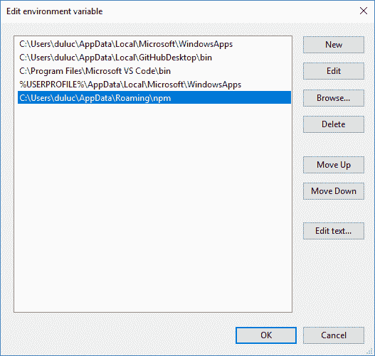
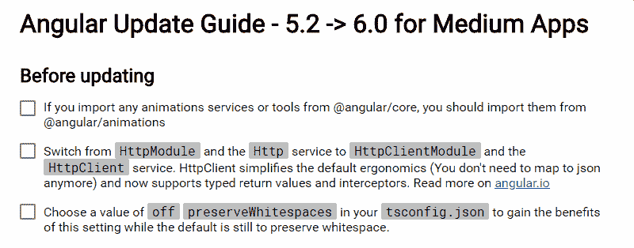
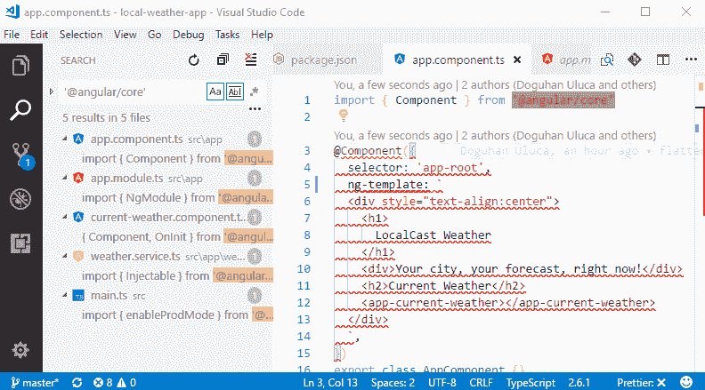
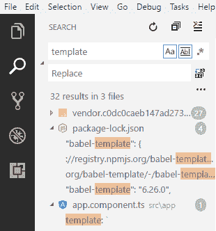
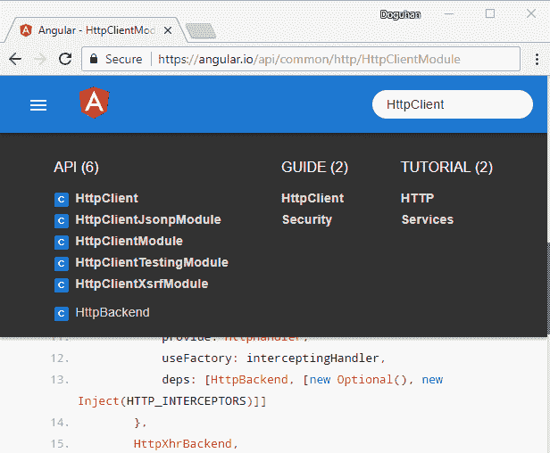
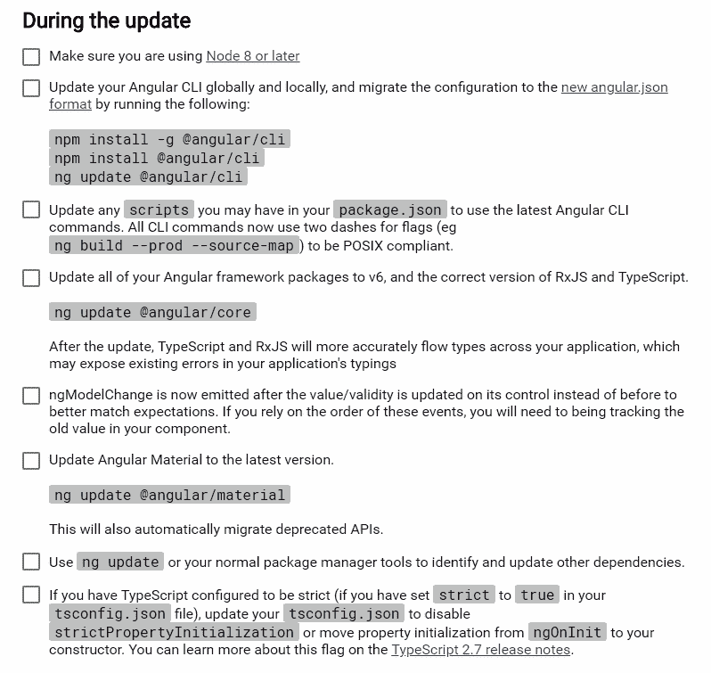
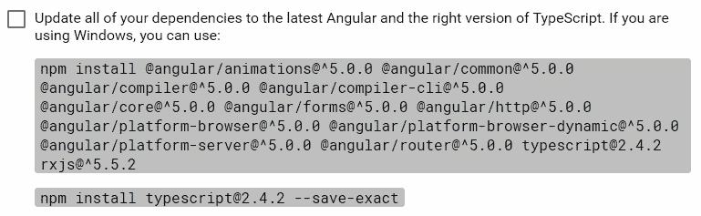
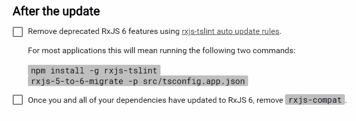
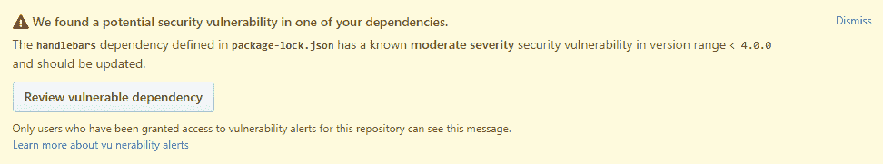
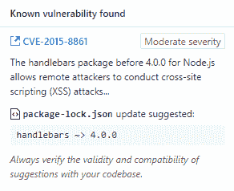

# 第四章：与 Angular 更新保持同步

在不同版本的几十种不同浏览器的数十种组合上提供安全、快速和一致的 Web 体验并不是一件容易的事。Angular 的存在就是为了实现这一点；然而，互联网是一个不断发展的竞争技术和供应商的领域。Angular 团队已经承诺定期更新平台，但是要靠您来跟上 Angular 的补丁、次要版本和主要版本的发布。

Angular 是一个旨在最大程度减少从一个版本升级到另一个版本的工作量的平台，提供了有用的工具和指南，最重要的是确定性的发布节奏和关于废弃功能的充分沟通，这允许进行适当的规划以保持最新。

您必须以一种深思熟虑和计划的方式保持与 Angular 的最新版本同步。这样的策略将最大程度地提高您使用 Angular 这样的平台所获得的好处，将错误和浏览器之间的不一致体验降至最低。在极端情况下，您有选择：要么保留数百名测试人员来测试您的 Web 应用程序在所有主要浏览器及其最新版本上的兼容性问题，要么保持您的 Angular 版本（或您选择的框架）保持最新。请记住，最终，确保您交付的产品质量是由您来决定的。

现在可以随意跳过本章，当 Angular 的一个次要或主要版本发布时再回来阅读，或者继续阅读以了解潜在的升级过程可能是什么样子。

在本章中，我们将讨论以下主题：

+   更新节点

+   更新 `npm` 和全局包

+   更新 Angular

+   解决安全漏洞

+   更新您的 Web 服务器

# Web 框架的简要历史

首先，重要的是考虑为什么我们首先要使用 Angular 或 React 等框架？在 Angular 之前，有 AngularJS 和 Backbone，它们都严重依赖于普遍存在的 jQuery 之前的框架。在 jQuery 存在的早期，即 2006 年，它对 Web 开发人员的目的是非常明显的——创建一个一致的 API 表面来实现 DOM 操作。浏览器供应商应该实现各种 Web 技术，如 HTML、JavaScript/EcmaScript 和 CSS，这是由万维网联盟（W3C）标准化的。当时，绝大多数互联网用户依赖的唯一浏览器是 Internet Explorer，它作为推动专有技术和 API 以保持其作为首选浏览器的优势的工具。首先是 Mozilla 的 Firefox，然后是 Google 的 Chrome 浏览器成功地获得了重要市场份额。然而，新浏览器版本开始以惊人的速度发布，竞争利益和不同的实现草案和已批准标准的版本和名称的质量差异造成了开发人员无法在 Web 上提供一致的体验。因此，您可以使用 jQuery 而不是反复编写代码来检查浏览器版本，这样您就可以轻松地隐藏供应商特定实现的所有复杂性，通过优雅地填补空白来弥补缺失的功能。

在 jQuery 中创建丰富的用户体验仍然很繁琐，Backbone 和 AngularJS 等框架使构建具有本地感和速度的 Web 应用程序更具成本效益。然而，浏览器不断变化，jQuery 和早期设计决策的意想不到的影响随之而来，随着标准的不断发展，导致了在 Angular 和 React 中构建 Web 应用程序的两种新的不同方法。从 AngularJS 过渡到 Angular 对整个社区来说都是一个令人不适的经历，包括 Angular 开发团队，但这必须是一个重大发布，以创建一个可以不断发展的平台。现在，新的 Angular 平台致力于保持最新状态，定期发布增量版本，以避免过去的错误。

# 更新 Node

即使您不将 Node.js 用作 Web 服务器，您也已经在使用它通过 npm 安装您的依赖项，并通过基于 Node.js 的软件包（如 WebPack，Gulp 或 Grunt）执行构建和测试任务。Node.js 是一个轻量级的跨平台执行环境，可以使大多数现代开发工具无缝工作。由于其性质，Node 位于您的主机操作系统之外的技术堆栈的最底层。保持 Node 的版本最新以获得安全性、速度和功能更新的好处非常重要。

Node.js 有两个分支：**长期支持**（**LTS**）版本和当前版本。奇数版本是一次性的、风险的发布，不计划进行 LTS 阶段。偶数版本首先作为当前版本发布，然后进入 LTS 阶段。

为了最大的稳定性和避免意外问题，我强烈建议坚持使用 Node 的 LTS 版本：

1.  通过运行此命令检查您当前的版本：

```ts
node -v
v8.9.0
```

您可以在[`nodejs.org`](https://nodejs.org)上查看有关最新发布的更多信息。除了计划发布，这个网站通常会包含有关各种 Node.js 发布的临时关键安全补丁的信息。

1.  如果您使用奇数或非 LTS 发布频道，请删除您现有的 Node 安装：

在 Windows 上，请确保您以管理员权限运行 PowerShell：

```ts
PS> choco uninstall node

```

在 macOS 上，如果您的环境设置正确，您不需要在命令中添加`sudo`：

```ts
$ brew uninstall --ignore-dependencies node
```

1.  在 Windows 上，要升级到最新的 LTS 版本，请执行以下命令：

```ts
PS> choco upgrade nodejs-lts
```

1.  在 macOS 上，如果您还没有安装 Node 8，您首先需要执行以下操作：

```ts
$ brew install node@8
```

1.  如果您已经在版本 8 上，则执行以下操作：

```ts
$ brew upgrade node@8
```

请注意，计划在 2018 年 10 月发布版本 10 作为下一个 LTS 版本，因此在运行 brew install 命令之前，您需要牢记这一点。

如果您在 macOS 上，请参考下一节，了解使用`n`工具更轻松地管理您的 Node 版本的方法。否则，请跳转到*更新 Npm*部分。

# n - 用于 macOS 的 Node 版本管理器

在 macOS 上，HomeBrew 没有 Node 的 LTS 特定频道，如果最新版本是奇数版本，您将发现自己处于一个不理想的位置。如果您错误地执行了`brew upgrade node`并升级到奇数版本，要从这个错误中恢复最好是很烦人的。这个过程包括通过运行类似于这样的命令来潜在地破坏其他 CLI 工具：

```ts
$ brew uninstall --ignore-dependencies node
```

在通过 brew 进行初始 Node 安装后，我强烈建议利用功能丰富、交互式的 Node 版本管理工具`n`，由前 Node 维护者 TJ Holowaychuk 创建：

1.  安装`n`：

```ts
$ npm install -g n
```

1.  执行`n`，它将显示您计算机上先前下载的所有 Node 版本的列表，并标记当前版本：

```ts
$ n
 ...
 node/8.2.1
 node/8.3.0
 node/8.4.0
 ο node/8.9.0
```

1.  执行`n lts`以安装最新的 LTS 版本：

```ts
$ n lts
 install : node-v8.9.3
 mkdir : /usr/local/n/versions/node/8.9.3
 fetch : https://nodejs.org/dist/v8.9.3/node-v8.9.3-darwin-x64.tar.gz
######################################################################## 100.0%
 installed : v8.9.3
```

使用`n`，您可以快速在不同的 Node 版本之间切换。

在本节中，我们将介绍如何保持 npm 的最新状态。

# 更新 npm 和全局 npm 包

如果 Node 是您技术栈中最低级别的工具，那么 npm 和全局 npm 包将被视为坐落在 Angular 和 Node 之间的下一层。

每次更新 Node 版本时，您还会获得一个新版本的 npm，它与 Node 捆绑在一起。但是，npm 的发布计划与 Node 的不一致。有时，会有显著的性能和功能增益，需要特定升级您的 npm 版本，例如 npm v5.0.0 引入的数量级速度改进，或者 npm v5.2.0 引入的减少全局包需求的 npx 工具：

+   在 Windows 上，您需要使用`npm-windows-upgrade`工具来升级您的 npm 版本：

1.  安装`npm-windows-upgrade`：

```ts
PS> npm install --global --production npm-windows-upgrade
```

如果在安装工具时遇到错误，请参考*Npm fails to install a global tool on Windows*部分，解决系统设置的任何问题。

1.  在提升的 shell 中执行`npm-windows-upgrade`，您将获得一系列选项，如下所示：

```ts
PS> npm-windows-upgrade
npm-windows-upgrade v4.1.0
? Which version do you want to install?
 6.0.1-next.0
> 6.0.0
 6.0.0-next.2
 6.0.0-next.1
 6.0.0-next.0
 5.10.0-next.0
 5.9.0-next.0
(Move up and down to reveal more choices)
```

1.  选择一个稳定的版本，例如`6.0.0`：

```ts
PS>
? Which version do you want to install? 6.0.0
Checked system for npm installation:
According to PowerShell: C:\Program Files\nodejs
According to npm: C:\Users\duluc\AppData\Roaming\npm
Decided that npm is installed in C:\Program Files\nodejs
Upgrading npm... \

Upgrade finished. Your new npm version is 6.0.0\. Have a nice day!
```

1.  验证您的安装：

```ts
PS> npm -v
6.0.0
```

+   在 macOS 上，升级您的 npm 版本很简单：

1.  执行`npm install -g npm`：

```ts
$ npm install -g npm
/usr/local/bin/npm -> /usr/local/lib/node_modules/npm/bin/npm-cli.js
/usr/local/bin/npx -> /usr/local/lib/node_modules/npm/bin/npx-cli.js
+ npm@6.0.0
updated 1 package in 18.342s
```

请注意，安装全局包，如前面所示，不应需要使用`sudo`。

1.  如果需要`sudo`，执行以下操作：

```ts
$ which npm
/usr/local/bin/npm
```

1.  找到此文件夹的所有者和权限：

```ts
$ ls -ld /usr/local/bin/npm
lrwxr-xr-x 1 youruser group 38 May 5 11:19 /usr/local/bin/npm -> ../lib/node_modules/npm/bin/npm-cli.js
```

如您所见，正确的配置看起来像您自己的用户，以粗体显示为`youruser`，对该文件夹具有读/写/执行权限，也以粗体显示为`rwx`，其中`npm`位于其中。如果不是这种情况，请使用`sudo chown -R $USER /usr/local/bin/npm`来拥有该文件夹，然后使用`chmod -R o+rwx /usr/local/bin/npm`来确保您的用户具有完全权限。

1.  验证您的安装：

```ts
$ npm -v
6.0.0
```

保持任何全局安装的软件包最新也很重要；请参考下一节，了解如何将全局安装保持在最低限度，并解决 Windows 上的安装问题。

# 全局 Npm 包

如本节和第二章中所述，在设置 Angular 项目时，您应该避免将任何项目特定工具安装为全局包。这包括诸如`typescript`、`webpack`、`gulp`或`grunt`等工具。`npx`工具使您能够方便地运行 CLI 命令，例如使用特定版本的`tsc`，而对性能的影响很小。如第二章中所讨论的，全局安装项目特定工具会对您的开发环境产生不利影响。

我确实提到了一些我仍然继续全局安装的工具，比如来自*升级 Node*部分的`n`工具，或者`rimraf`，这是一个跨平台递归删除工具，在 Windows 10 不配合删除您的`node_modules`文件夹时非常方便。这些工具是非项目特定的，而且基本稳定，不需要频繁更新。

事实是，除非工具提醒您升级自己，否则您很可能永远不会主动这样做。我们在第三章中使用的 now CLI 工具，*为生产发布准备 Angular 应用*，以在云中发布我们的 Docker 容器，是一个很好的例子，它始终保持警惕，以确保自己与以下消息保持最新：

```ts
 ^(─────────────────────────────────────────
   │ Update available! 8.4.0 → 11.1.7                                  │
   │ Changelog: https://github.com/zeit/now-cli/releases/tag/11.1.7    │
   │ Please download binaries from https://zeit.co/download            │
    ─────────────────────────────────────────)
```

您可以通过执行以下操作升级全局工具：

```ts
$ npm install -g now@latest
```

请注意，`@latest`请求将升级到下一个主要版本，如果可用的话，而不会引起太多轰动。虽然主要版本包含令人兴奋和有用的新功能，但它们也有破坏旧功能的风险，而您可能正在依赖这些功能。

这应该完成您的升级。然而，特别是在 Windows 上，很容易使您的 Node 和 npm 安装处于破损状态。以下部分涵盖了常见的故障排除步骤和您可以采取的操作，以恢复您的 Windows 设置。

# Npm 在 Windows 上无法安装全局工具

Npm 可能无法安装全局工具；请考虑以下讨论的症状、原因和解决方案：

**症状**：当您尝试安装全局工具时，您可能会收到一个包含拒绝删除消息的错误消息，类似于下面显示的消息：

```ts
PS C:\WINDOWS\system32> npm i -g now
npm ERR! path C:\Users\duluc\AppData\Roaming\npm\now.cmd
npm ERR! code EEXIST
npm ERR! Refusing to delete C:\Users\duluc\AppData\Roaming\npm\now.cmd: node_modules\now\download\dist\now symlink target is not controlled by npm C:\Users\duluc\AppData\Roaming\npm\node_modules\now
npm ERR! File exists: C:\Users\duluc\AppData\Roaming\npm\now.cmd
npm ERR! Move it away, and try again.
npm ERR! A complete log of this run can be found in:
npm ERR! C:\Users\duluc\AppData\Roaming\npm-cache\_logs\2017-11-11T21_30_28_382Z-debug.log
```

**原因**：在 Windows 上，如果您曾经执行过`npm install -g npm`或使用 choco 升级过您的 Node 版本，您的 npm 安装很可能已经损坏。

**解决方案 1**：使用`npm-windows-upgrade`工具恢复您的环境：

1.  执行 npm 升级例程：

```ts
PS> npm install --global --production npm-windows-upgrade
PS> npm-windows-upgrade
```

1.  使用`rimraf`删除有问题的文件和目录：

```ts
PS> npm i -g rimraf
rimraf C:\Users\duluc\AppData\Roaming\npm\now.cmd
rimraf C:\Users\duluc\AppData\Roaming\npm\now
```

1.  尝试重新安装：

```ts
PS> npm i -g now@latest
```

如果这不能解决您的问题，请尝试解决方案 2。

**解决方案 2**：如果您安装了非 LTS nodejs 或者没有正确配置 npm，请尝试以下步骤：

1.  卸载非 LTS nodejs 并重新安装它：

```ts
PS> choco uninstall nodejs
PS> choco install nodejs-lts --force -y
```

1.  按照[`github.com/npm/npm/wiki/Troubleshooting#upgrading-on-windows`](https://github.com/npm/npm/wiki/Troubleshooting#upgrading-on-windows)中的指南安装`npm-windows-upgrade`。

1.  在具有管理员权限的 Powershell 中执行此操作：

```ts
PS> Set-ExecutionPolicy Unrestricted -Scope CurrentUser -Force
PS> npm install --global --production npm-windows-upgrade
PS> npm-windows-upgrade
```

1.  执行`npm-windows-upgrade`：

```ts
PS> npm-windows-upgrade
npm-windows-upgrade v4.1.0
? Which version do you want to install? 5.5.1
Checked system for npm installation:
According to PowerShell: C:\Program Files\nodejs
According to npm: C:\Users\duluc\AppData\Roaming\npm
Decided that npm is installed in C:\Program Files\nodejs
Upgrading npm... -
Upgrade finished. Your new npm version is 5.5.1\. Have a nice day!
```

1.  注意根据 npm 文件夹。

1.  转到此文件夹，并确保此文件夹中不存在`npm`或`npm.cmd`。

1.  如果有，删除。

1.  确保此文件夹在`PATH`中。

单击“开始”，搜索“环境变量”。单击“编辑系统环境变量”。在“系统属性”窗口中，单击“环境变量”。选择带有路径的行。单击“编辑”。

编辑环境变量对话框

1.  尝试重新安装您的全局工具。

1.  如果问题仍然存在，您可能需要使用 PowerShell 命令删除全局的`npm`文件夹，如下所示：

```ts
PS> cmd /C "rmdir /S /Q C:\Users\duluc\AppData\Roaming\npm"
```

1.  转到该文件夹：

```ts
PS> dir C:\Users\duluc\AppData\Roaming\npm
```

1.  执行 npm：

```ts
PS> npm@5.5.1 C:\Program Files\nodejs\node_modules\npm
```

1.  重新执行`npm-windows-upgrade`例程：

```ts
PS> npm install --global --production npm-windows-upgrade
PS> npm-windows-upgrade
```

1.  重新安装工具：

```ts
PS> npm i -g now
C:\Users\duluc\AppData\Roaming\npm\now -> C:\Users\duluc\AppData\Roaming\npm\node_modules\now\download\dist\now
> now@8.4.0 postinstall C:\Users\duluc\AppData\Roaming\npm\node_modules\now
> node download/install.js
> For the source code, check out: https://github.com/zeit/now-cli
> Downloading Now CLI 8.4.0 [====================] 100%
+ now@8.4.0
```

将来不要运行`npm i -g npm`。

# 更新 Angular

使用 Node 和 npm 最新版本，您现在可以准备升级您的 Angular 版本了。Angular 生态系统经过精心设计，使您的版本更新尽可能轻松。次要版本更新应该是直接和快速的，从版本`6.0.0`开始；主要版本升级应该更容易，因为 Angular CLI 附带了新的`ng update`命令。配合[update.angular.io](https://update.angular.io)上发布的更新指南和特定于您升级路径的各种辅助工具，更新 Angular 是直接的。在本节中，我们将介绍如何更新您的 Angular 应用程序，假设从版本 5.2 升级到 6.0 的情景。指南应该基本保持不变，任何变化或将来的更改都记录在[`update.angular.io/`](https://update.angular.io/)中。

请记住，Angular 不建议在升级时跳过主要版本号，因此如果您使用的是版本 4，则首先需要升级到 5，然后再升级到 6。不要延迟更新您的框架版本，认为可以通过跳跃到最新版本来获得一些效率。

# Angular 更新指南

按照这一步骤指南准备、执行和测试您的 Angular 版本升级过程。

# 了解您当前的版本

让我们首先检查`package.json`，以便您了解您正在使用的各种依赖项的版本。所有`@angular`包应该是相同的次要版本，例如`5.2`，如图所示：

```ts
package.json
 "@angular/animations": "5.2.5",
    "@angular/cdk": "⁵.2.2",
    "@angular/common": "5.2.5",
    "@angular/compiler": "5.2.5",
    "@angular/core": "5.2.5",
    "@angular/flex-layout": "².0.0-beta.12",
    "@angular/forms": "5.2.5",
    "@angular/http": "5.2.5",
    "@angular/material": "⁵.2.2",
    "@angular/platform-browser": "5.2.5",
    "@angular/platform-browser-dynamic": "5.2.5",
    "@angular/router": "5.2.5",
    "core-js": "².4.1",
    ...
    "rxjs": "⁵.5.6",
    "ts-enum-util": "².0.0",
    "zone.js": "⁰.8.20"
  },
  "devDependencies": {
    "@angular/cli": "1.7.0",
    "@angular/compiler-cli": "5.2.5",
    "@angular/language-service": "5.2.5",
...
```

# 使用 Angular 更新指南

现在您已经了解了您当前的版本，可以使用更新指南了：

1.  导航至[update.angular.io](https://update.angular.io/)

1.  选择您的应用程序的复杂性：

+   基本：没有动画，没有 HTTP 调用

+   中级：如果您正在使用 Angular Material 或进行 HTTP 调用或使用 RxJS，通常作为 1-2 人开发团队并交付小型应用程序

+   高级：多人团队，交付中大型应用程序

大多数应用程序将属于中等复杂性；我强烈建议选择此选项。如果您已经在文档中深入实现了 Angular 功能，通过利用文档中提到的功能来实现任何自定义行为，确保在 HTTP、渲染、路由等方面实现任何自定义行为——一定要先浏览高级列表，以确保您没有使用已弃用的功能。

1.  在更新指南上，选择从哪个版本升级到哪个版本。在这种情况下，选择从 5.2 升级到 6.0，如图所示：

！[](Images/9561a4ef-1e63-4b22-84d1-df6ee3e7ff8a.png)Angular 更新指南

1.  点击“显示我如何更新！”

1.  请注意屏幕上显示的指示，分为更新前、更新中和更新后三个不同的部分

现在是困难的部分，我们需要遵循说明并应用它们。

# 更新您的 Angular 应用程序

更新软件是有风险的。有几种策略可以减少您在更新应用程序时的风险。这是您在应用程序中构建大量自动化测试的主要原因；然而，随着时间的推移，您的实施，包括 CI 和 CD 系统，可能会恶化。版本更新是重新评估您的自动化系统的健壮性并进行必要投资的好时机。在开始更新过程之前，请考虑以下升级前清单。

# 升级前清单

以下是在开始升级之前要运行的一些方便的检查项目清单：

1.  确保`@angular`版本一直匹配到最后一个补丁。

1.  确保您的 CI 和 CD 管道正常运行，没有失败或禁用的测试。

1.  在升级之前对应用程序进行烟雾测试。确保所有主要功能正常运行，没有控制台错误或警告。

1.  在升级之前解决任何发现的质量问题。

1.  按顺序和有条不紊地遵循更新指南。

1.  准备好回滚更新。

让我们从更新前的活动开始更新过程。

# 在更新之前

Angular 更新指南建议在“更新前”部分采取特定步骤，如下所示：

Angular 更新指南 - 更新前

在尝试更新之前，您可能需要对代码进行几种不同的更新。

**命名空间更改**：上述列表中的第一项通知我们某些动画服务和工具的命名空间可能已经更改。这些更改应该是低风险的，并且可以通过在 VS Code 中使用全局搜索工具快速完成。让我们看看如何快速观察你的应用程序中所有`'@angular/core'`的用法。看下一张截图：

'@angular/core'的搜索结果

在这种情况下，没有与动画相关的用法，所以我们可以继续。

**重命名和替换更新**：在版本 4 中，有一个要求，即将`OpaqueTokens`类型替换为`InjectionTokens`。对于这些类型的更改，再次使用全局搜索工具查找和替换必要的代码。

在使用全局搜索工具查找和替换代码时，确保您启用了匹配大小写（由 Aa 表示）和匹配整个单词（由 Ab|表示），以防止意外的替换。看一下以下截图，看看这两个选项处于启用状态时的情况：

匹配大小写和匹配整个单词已启用

**功能性更改**：弃用的功能提前一个主要版本发出信号，需要重写应用程序代码中受影响部分。如果您一直在大量使用`HttpModule`和`Http`，那么您的代码将需要进行严重的改造：

1.  首先，使用全局搜索发现实际用法的实例。

1.  在[angular.io](https://angular.io)上搜索新引入的服务，例如`HttpClient`或`HttpClientModule`：

Angular.io 文档页面

1.  单击标题下的相关链接，其中包含有关新服务的丰富和上下文的信息。

新的服务通常伴随着新的好处，比如改进的编码体验，更好的可测试性或性能。

1.  重新实现必要的代码。

1.  执行下一节中提到的后续更新检查表。

这些功能性变化可以同时成为巨大的生产力助推器，但也会极大地增加及时升级到新版本 Angular 的摩擦。然而，您可以通过提前准备来降低变更成本，并最大程度地获得这些变化的好处。

在这种情况下，LocalCast Weather 应用程序没有使用已弃用的模块，因为恰好是在发布`HttpClient`服务后不久开始开发该应用程序。然而，如果我没有关注 Angular 社区，我就不会知道这个变化。出于这个原因，我强烈建议关注[`blog.angular.io`](https://blog.angular.io)。

此外，您可以定期检查 Angular 更新工具。该工具可能不会被迅速更新；然而，它是所有即将到来的变化的一个很好的摘要资源。

在更新工具中，如果您选择未来版本的 Angular，您将收到警告消息：

**警告**：当前主要版本之后的发布计划尚未最终确定，可能会更改。这些建议是基于计划的弃用。

这是保持领先并提前规划资源围绕 Angular 更新的一个很好的方法。

完成“更新前”阶段后，考虑在进入下一阶段之前查看后续更新检查表。

# 更新期间

以下是指南中关于`ng update`工具的更新期间部分：

Angular 更新指南-更新期间

相比之下，Angular 6 之前的升级看起来是这样的：

Angular 更新指南-在 Angular 6 之前

如果你对手动更新更感兴趣，请参考手动更新部分。在这一部分，我详细介绍了你应该执行的步骤，以更全面地进行自动升级。在第二章中，*创建一个本地天气 Web 应用程序*，我们避免安装 Angular CLI，这就是这种策略的好处所在。你可以继续在现有的 Angular 4 或 Angular 5 项目上工作，而不必担心 CLI 向后兼容性问题：

1.  确保你已经更新到了最新的 Node LTS 版本，就像本章前面展示的那样

1.  确保你使用的是 npm 的最新版本，就像本章前面展示的那样

1.  在你的终端中，`cd`进入项目文件夹

1.  清理你的`node_modules`文件夹：

```ts
$ rimraf node_modules
```

重要的是要注意，Node 或 npm 的版本更改可能会影响你的`node_modules`依赖项在计算机上的安装或存储方式。在升级到更低级别的工具，比如 Node 或 npm 之后，最好清除`node_modules`并在你的项目中重新安装你的包。在你的持续集成（CI）服务器上，这意味着使现有的包缓存无效。

1.  重新安装依赖项：

```ts
$ npm install
```

1.  卸载全局安装的`@angular/cli`、`webpack`、`jasmine`或`typescript`的版本：

```ts
$ npm uninstall -g @angular/cli webpack jasmine typescript
```

1.  在你的项目中更新到最新的 CLI 版本：

```ts
$ npm i -D @angular/cli@latest
> @angular/cli@6.0.0 postinstall /Users/du/dev/local-weather-app/node_modules/@angular/cli
> node ./bin/ng-update-message.js

===================================================================
The Angular CLI configuration format has been changed, and your 
existing configuration can be updated automatically by running 
the following command:
ng update @angular/cli
===================================================================
```

1.  根据前面的消息建议更新项目配置：

```ts
$ npx ng update @angular/cli 
 master!
 Updating karma configuration
 Updating configuration
 Removing old config file (.angular-cli.json)
 Writing config file (angular.json)
 Some configuration options have been changed, please make sure to update any npm scripts which you may have modified.
DELETE .angular-cli.json
CREATE angular.json (3644 bytes)
UPDATE karma.conf.js (1007 bytes)
UPDATE src/tsconfig.spec.json (324 bytes)
UPDATE package.json (3874 bytes)
UPDATE tslint.json (3024 bytes)
...
added 620 packages from 669 contributors in 24.956s
```

1.  尝试执行`ng update`：

```ts
$ npx ng update
We analyzed your package.json, there are some packages to update:

Name Version Command to update
-------------------------------------------------------------------
@angular/core 5.1.0 -> 6.0.0 ng update @angular/core
@angular/material 5.0.0 -> 6.0.0 ng update @angular/material
rxjs 5.5.2 -> 6.1.0 ng update rxjs

There might be additional packages that are outdated.
Or run ng update --all to try to update all at the same time.
```

1.  尝试执行`ng update --all`：

```ts
$ npx ng update --all
```

你可能会收到一个错误消息，说找到了不兼容的 peer 依赖。列出了一个或多个具体的问题。在解决所有问题之前，你将无法使用`ng update`。

在下一节中，我将介绍解决 peer 依赖错误的策略。如果你没有这种错误，可以跳过这一节。

# 不兼容的 peer 依赖

我将介绍一些在升级过程中遇到的不兼容的 peer 依赖错误，以及解决这些错误的不同策略。请注意，我将从简单的情况开始，并演示可能需要的研究量，因为你需要的依赖项可能不仅仅是你的包的最新发布版本。

+   包`karma-jasmine-html-reporter`缺少 peer 依赖`"jasmine" @ "³.0.0"`。

这是一个简单的错误，只需简单地更新到最新版本的`jasmine`即可解决：

```ts
$ npm i -D jasmine
```

+   包`@angular/flex-layout`与`"rxjs"`有不兼容的对等依赖关系（需要`"⁵.5.0"`，将安装`"6.1.0"`）。

这个错误需要一些对生态系统的研究和理解。截至 Angular 6，我们知道所有库都是版本同步的，因此我们需要这个库的 6.x 版本。让我们使用`npm info`来发现当前可用的版本：

```ts
$ npm info @angular/flex-layout
 ...
 dist-tags:
 latest: 5.0.0-beta.14 next: 6.0.0-beta.15

published a month ago by angular <devops+npm@angular.io>
```

截至目前，该库仍处于 beta 版本，最新版本为 5.0.0，因此简单地更新到最新版本的`@angular/flex-layout`是行不通的。在这种情况下，我们需要安装包的`@next`版本，如下所示：

```ts
$ npm i @angular/flex-layout@next
```

您将收到一堆依赖警告，显示需要 Angular 6 包。一旦更新完成，这些错误将消失。

+   包"@angular/compiler-cli"与"typescript"有不兼容的对等依赖关系（需要">=2.7.2 <2.8"，将安装"2.8.3"）。

Angular CLI 依赖于特定版本的 Typescript。如果执行`npm info typescript`，则最新版本的 Typescript 可能比所需版本更新。在这种情况下，正如前面的错误消息所报告的那样，它是`2.8.3`。错误消息确实向我们指出了具体需要的版本，如果你看一下 requires 语句。下限`2.7.2`似乎是正确的安装版本，所以让我们安装它，如下所示：

```ts
$ npm install -D typescript@2.7.2
```

理论上，我们所有的操作都应该解决所有对等依赖问题。实际上，我注意到这些错误有时会在使用`npx ng update --all`时仍然存在，因此我们将继续通过运行单独的更新命令来进行更新。

在非 macOS 操作系统上，您可能会持续遇到与 fsevents 相关的警告，例如`npm WARN optional SKIPPING OPTIONAL DEPENDENCY: fsevents@1.1.3`。这是一个可选的包，仅在 macOS 上使用。避免看到这个错误的简单方法是运行`npm install --no-optional`命令。

# 继续更新。

我们将逐步更新 Angular：

1.  让我们从 Angular Core 开始更新：

```ts
$ npx ng update @angular/core
Updating package.json with dependency rxjs @ "6.1.0" (was "5.5.6")...
 Updating package.json with dependency @angular/language-service @ "6.0.0" (was "5.2.5")...
 Updating package.json with dependency @angular/compiler-cli @ "6.0.0" (was "5.2.5")...
 Updating package.json with dependency @angular/router @ "6.0.0" (was "5.2.5")...
 Updating package.json with dependency @angular/forms @ "6.0.0" (was "5.2.5")...
 Updating package.json with dependency @angular/platform-browser @ "6.0.0" (was "5.2.5")...
 Updating package.json with dependency @angular/animations @ "6.0.0" (was "5.2.5")...
 Updating package.json with dependency zone.js @ "0.8.26" (was "0.8.20")...
 Updating package.json with dependency @angular/platform-browser-dynamic @ "6.0.0" (was "5.2.5")...
 Updating package.json with dependency @angular/common @ "6.0.0" (was "5.2.5")...
 Updating package.json with dependency @angular/core @ "6.0.0" (was "5.2.5")...
 Updating package.json with dependency @angular/compiler @ "6.0.0" (was "5.2.5")...
 Updating package.json with dependency @angular/http @ "6.0.0" (was "5.2.5")...
 UPDATE package.json (5530 bytes)
 ...
 added 12 packages from 37 contributors and updated 14 packages in 54.204s
```

请注意，此命令还会更新`rxjs`。

1.  更新 Angular Material：

```ts
$ npx ng update @angular/material
Updating package.json with dependency @angular/cdk @ "6.0.0" (was "5.2.2")...
 Updating package.json with dependency @angular/material @ "6.0.0" (was "5.2.2")...
 UPDATE package.json (5563 bytes)
 ...
```

确保您查看第五章中的 Material Update Tool 和手动更新 Angular Material 的策略，*使用 Angular Material 增强 Angular 应用*。

1.  更新其他依赖项，包括使用`npm update`更新类型：

```ts
$ npm update
+ codelyzer@4.3.0
+ karma-jasmine@1.1.2
+ jsonwebtoken@8.2.1
+ core-js@2.5.5
+ prettier@1.12.1
+ karma-coverage-istanbul-reporter@1.4.2
+ typescript@2.8.3
+ @types/jsonwebtoken@7.2.7
+ ts-enum-util@2.0.2
+ @types/node@6.0.108
```

请注意，`typescript`已更新到其最新版本`2.8.3`，这对于 Angular 6 来说是不可接受的，正如前一节所述。通过执行`npm install -D typescript@2.7.2`回滚到版本`2.7.2`。

1.  解决任何 npm 错误和警告。

你已经完成了主要的 Angular 依赖项更新。考虑在继续*升级后*部分之前执行“升级后检查清单”。

# 升级后

“升级后”阶段通知需要在主要 Angular 依赖项更新后进行的更改，并有时告诉我们在升级我们的 Angular 版本后可以获得的进一步好处。观察下一步：

Angular 升级指南-升级后

在这种情况下，我们必须解决与我们升级到 RxJS 相关的弃用。幸运的是，Angular 团队知道这可能是一个痛苦的过程，因此他们建议使用一个自动化工具来帮助我们入门：

1.  不要全局安装该工具

1.  执行迁移工具，如下所示：

```ts
$ npx rxjs-tslint -p .\src\tsconfig.app.json

Running the automatic migrations. Please, be patient and wait until the execution completes.
Found and fixed the following deprecations:

Fixed 2 error(s) in C:/dev/lemon-mart/src/app/common/common.ts
Fixed 6 error(s) in C:/dev/lemon-mart/src/app/auth/auth.service.ts
Fixed 1 error(s) in C:/dev/lemon-mart/src/app/common/ui.service.ts
...

WARNING: C:/dev/lemon-mart/src/app/auth/auth-http-interceptor.ts[2, 1]: duplicate RxJS import
WARNING: C:/dev/lemon-mart/src/app/auth/auth-http-interceptor.ts[4, 27]: outdated import path
```

```ts
WARNING: C:/dev/lemon-mart/src/app/auth/auth.service.fake.ts[2, 1]: duplicate RxJS import
...
```

1.  手动解决任何警告；考虑以下示例：

```ts
example
import { BehaviorSubject, Observable, of } from 'rxjs'
import { ErrorObservable } from 'rxjs/observable/ErrorObservable'
import { IfObservable } from 'rxjs/observable/IfObservable'
import { catchError } from 'rxjs/operators'
```

在前面的示例中，我们只需要根据 RxJS 6 文档从`'rxjs'`和`'rxjs/operators'`导入，因此删除另外两个导入。此外，`ErrorObservable`和`IfObservable`导入被任何一行代码引用，因此很容易识别并删除。

一些警告可能掩盖了与新的 RxJS 函数的错误或不兼容性，因此逐一检查它们非常重要。

1.  移除`rxjs-compat`：

```ts
$ npm uninstall rxjs-compat
```

1.  构建和测试您的代码，以确保通过执行`npm run predocker:build`进行构建。

`predocker:build`以生产模式构建您的 Angular 应用程序，并通过执行以下命令运行您的单元测试和端到端测试：

```ts
$ npm run build -- --prod && npm test -- --watch=false && npm run e2e
```

解决任何错误。如果您遇到与您的代码无关的神秘错误，请尝试删除`node_modules`并重新安装软件包。

如果一切正常工作，恭喜你，你已经完成了升级！在你打开起泡酒之前，执行“升级后检查清单”。

# 升级后检查清单

更新后的清单在确保在进行大规模代码更改后没有引入任何退化的情况下非常有用。建议在更新过程的每个阶段之后执行此清单。可能并不总是可能或可行执行整个清单，但在对代码基进行重大更改后，如果有必要，更新你的单元测试，并逐步执行以下清单：

1.  构建和烟雾测试你的 Angular 应用

1.  提交你的更改

1.  每次提交时，确保 CI 流水线保持正常

1.  如果进行功能性更改，可能需要遵循你的组织的发布周期程序，其中可能包括由 QA 团队进行手动测试

1.  建议逐个实施和部署这些更改，并将它们部署到生产环境

1.  收集性能数据，如下一节所述

在一类更改后提交你的代码，这样可以在出现问题时回滚或挑选进一步的升级提交。

出于各种原因，你可能需要手动升级 Angular，这在下一节中有所涉及。

# 手动更新

最好对手动升级的工作原理有一个大致的了解，因为你可能无法使用具有自动更新功能的 Angular CLI 版本；你可能需要完全退出你的项目或者工具可能包含错误。这里讨论的版本号是从更新指南中复制的示例。

为了举例，我将演示从 Angular 4 到 Angular 5 的潜在升级：

1.  遵循指南和本章的更新说明

1.  确保 Node 和 npm 是最新的

1.  为了升级到版本 `5.0.0`，执行以下命令：

```ts
$ npm install @angular/animations@'⁵.0.0' @angular/common@'⁵.0.0' @angular/compiler@'⁵.0.0' @angular/compiler-cli@'⁵.0.0' @angular/core@'⁵.0.0' @angular/forms@'⁵.0.0' @angular/http@'⁵.0.0' @angular/platform-browser@'⁵.0.0' @angular/platform-browser-dynamic@'⁵.0.0' @angular/platform-server@'⁵.0.0' @angular/router@'⁵.0.0' typescript@2.4.2 rxjs@'⁵.5.2'
```

1.  接着执行`--save-exact`命令，以防 TypeScript 被意外升级：

```ts
$ npm install typescript@2.4.2 --save-exact
```

1.  确保你的 `package.json` 文件已经更新到正确的版本：

```ts
"dependencies": {
    "@angular/animations": "⁵.0.0",
    "@angular/common": "⁵.0.0",
    "@angular/compiler": "⁵.0.0",
    "@angular/core": "⁵.0.0",
    "@angular/forms": "⁵.0.0",
    "@angular/http": "⁵.0.0",
    "@angular/platform-browser": "⁵.0.0",
    "@angular/platform-browser-dynamic": "⁵.0.0",
    "@angular/platform-server": "⁵.0.0",
    "@angular/router": "⁵.0.0",
    "core-js": "².5.1",
    "rxjs": "⁵.5.2",
    "zone.js": "⁰.8.17"
  },
  "devDependencies": {
    "@angular/cli": "¹.5.0",
    "@angular/compiler-cli": "⁵.0.0",
    "@angular/language-service": "⁴.4.3",
   ...
    "typescript": "2.4.2"
  },
```

注意，TypeScript 版本中的插入符号和波浪号已被移除，以防止任何意外的升级，因为 Angular 工具对任何给定 TypeScript 发布的特定功能非常敏感。

注意，`@angular/cli` 和 `@angular/compiler-cli` 已经更新到它们的最新版本；然而，工具没有更新 `@angular/language-service`。这突显了手动检查的重要性，因为你的工具链中的每个工具都容易受到小错误的影响。

1.  通过执行以下命令更新`@angular/language-service`：

```ts
$ npm install @angular/language-service@⁵.0.0
```

1.  验证`package.json`中是否有正确的文件版本：

```ts
"@angular/language-service": "⁵.0.0",
```

您已完成更新您的软件包。

1.  按照指南和本章的更新说明进行操作。

在升级您的 Angular 应用程序后，测试您的更改对性能的影响是一个好主意。

# 性能测试

在更新之前和之后测试您的 Angular 应用程序的性能，以确保您的性能数字保持预期。在下面的情况中，由于平台级别的改进，我们自动获得了性能优势。首先，让我们比较一下 Angular v4 和 v5：

| **类别** | **   Angular 4** | **   Angular 5** | **        % 差异** |
| --- | --- | --- | --- |
| JavaScript Assets Delivered (gzipped) |             83.6 KB |             72.6 KB |            13% smaller |
| 首页渲染时间（Fiber） |                 0.57 秒 |                 0.54 秒 |                 5% 更快 |
| 首页渲染时间（快速 3G） |                 1.27 秒 |                 1.18 秒 |                 7% 更快 |

Angular 4.4.3 vs 5.0.0

Angular 6 的改进趋势持续下去：

| **类别** | **   Angular 5** | **   Angular 6** | **      % 差异** |
| --- | --- | --- | --- |
| JavaScript Assets Delivered (gzipped) |             72.6 KB |             64.1 KB |        12% 更小 |
| 首页渲染时间（Fiber） |                 0.54 秒 |                 0.32 秒 |           40% 更快 |
| 首页渲染时间（快速 3G） |                 1.18 秒 |                 0.93 秒 |           21% 更快 |

Angular 5.0.0 vs 6.0.0

这种趋势应该在未来的更新中继续，使用 Ivy 渲染引擎的目标大小为 3KB。我们将在第五章中介绍这些性能数字的重要性，*使用 Angular Material 增强 Angular 应用程序*。

# 解决安全漏洞

有时您会收到关于某些软件包的安全漏洞的通知，通过博客或者如果您使用 GitHub，您可能会在您的存储库上看到这样的警告：

GitHub.com 漏洞扫描

这是一个特定的问题，当我的 Angular 应用程序版本为 5.0.0，我的 CLI 版本为 1.5.0 时出现的。如果您查看这个依赖项，您可以看到依赖的软件包，并获得更多关于这个问题的细节。

GitHub.com 安全公告

在这种情况下，handlebars 的易受攻击版本 1.3.0 是由 Angular 5.0 包之一引起的。

进一步研究 Angular 的 GitHub 问题表明，问题实际上是由`@angular/cli 版本 1.5.0`引起的。参考是[`github.com/angular/angular/issues/20654`](https://github.com/angular/angular/issues/20654)。

这是尝试更新到 Angular、Material 或 CLI 的最新次要版本更新的好方法，在这种情况下是版本 5.1.0 和 1.6.0：

```ts
$ npm install @angular/animations@⁵.1.0 @angular/common@⁵.1.0 @angular/compiler@⁵.1.0 @angular/compiler-cli@⁵.1.0 @angular/core@⁵.1.0 @angular/forms@⁵.1.0 @angular/http@⁵.1.0 @angular/platform-browser@⁵.1.0 @angular/platform-browser-dynamic@⁵.1.0 @angular/platform-server@⁵.1.0 @angular/router@⁵.1.0 @angular/language-service@⁵.1.0 @angular/cli@¹.6.0
```

这次更新解决了 GitHub 显示的安全警告。如果你无法通过升级解决你的问题，请在 GitHub 上创建一个新问题，并密切关注 Angular 的即将发布的补丁或次要版本，直到问题得到解决。

# 更新你的 Web 服务器

你的堆栈顶部是你托管 Web 应用程序的 Web 服务器。这是一个实时的生产系统，很可能暴露在互联网上，因此风险最大。应该谨慎地保持最新状态。

理想情况下，你的发布流水线类似于第三章*，为生产发布准备 Angular 应用程序*中描述的流水线，其中你的前端应用程序由一个容器化的低配置实例提供。这可以是我发布和维护的`minimal-node-web-server`，也可以是基于 Nginx 的实例。在任何情况下，通过更改基础镜像旁边列出的版本号来升级是很简单的：

```ts
Dockerfile
FROM duluca/minimal-node-web-server:8.6.0
WORKDIR /usr/src/app
COPY dist public
```

指定你正在使用的基础 Docker 镜像的版本号总是一个好主意。否则，它将默认为最新行为，这在这种情况下可能意味着一个不适合生产的奇数版本。也就是说，`minimal-node-web-server`遵循了最佳安全实践的层层叠加，减少了攻击面，使成功攻击你的 Web 应用程序变得非常困难。与这一安全最佳实践主题一致，`minimal-node-web-server`永远不会将奇数节点版本作为默认行为。

如果你的内容是通过 IIS、Apache 或 Tomcat 等 Web 服务器安装提供的，你必须遵循和跟踪这些技术的安全公告。然而，很可能另一个人或另一个部门将负责升级这台服务器，这可能会导致从几天到几个月的延迟，这在互联网时间中是永远的。

你处于最高风险，如果你通过同一应用服务器提供静态网页内容，比如你的 SPA，同时也实现了后端 API。即使你的架构可能是解耦的，如果在你的依赖树中升级任何工具或应用程序对你的应用的任何其他部分产生副作用，这意味着你在保护或改进前端应用性能方面存在重大摩擦。

一个真正解耦的架构还将允许前端以不同的速度扩展，而不同于你的后端基础设施，这可以带来巨大的成本效益。例如，假设你的前端提供大量静态信息，并且很少需要轮询后端。在高负载时，你可能需要三个前端服务器实例来处理所有请求，但只需要一个后端服务器实例，因为调用很少。

# 更新 Docker 镜像

在升级应用程序及其依赖项或简单添加新功能后，您需要更新并发布新的 Docker 镜像。

1.  在`package.json`中，将版本属性更新为`1.1.0`或将您的版本与当前的 Angular 版本匹配

1.  执行`npm run docker:debug`来构建并验证您的更新是否正确工作

1.  最后，执行`npm run docker:publish`将您的新镜像推送到存储库

在发布图像后，采取必要步骤将图像部署到服务器或云提供商，如第三章中所述，*准备 Angular 应用程序进行生产发布*，以及第十一章中所述，*AWS 上高可用云基础设施*。

# 摘要

在本章中，我们讨论了保持整个依赖栈的最新状态的重要性，从 Node 和 npm 等开发工具到 Angular。我们看了看如何使用 ng update 和 Angular Update Guide 来尽可能地减少 Angular 更新的痛苦。我们还涵盖了手动更新、性能测试、处理超出安全漏洞和补丁的问题，包括保持 Web 服务器最新的必要性。保持相对最新的系统具有直接的成本效益。差距越小，维护的工作量就越小。然而，随着时间的推移，升级系统的成本呈指数级增长。作为非直接的好处，我们可以列举出由更好的性能带来的客户满意度，这是影响亚马逊等公司数百万美元的指标。工具中的新功能也对开发人员的生产力和幸福感产生深远影响，这有助于留住人才，减少新功能的成本，从而可能提高客户满意度。保持最新状态无疑是一个积极的反馈循环。

在下一章中，我们将讨论如何通过将 Angular Material 添加到项目中，使您的本地天气应用程序看起来更加出色。在这个过程中，您将了解用户控制或 UI 组件库可能对应用程序产生的负面性能影响，包括基本的 Material 组件、Angular Flex 布局、可访问性、排版、主题设置以及如何更新 Angular Material。
