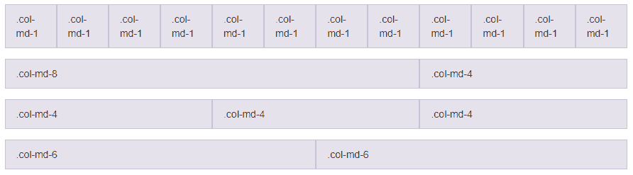
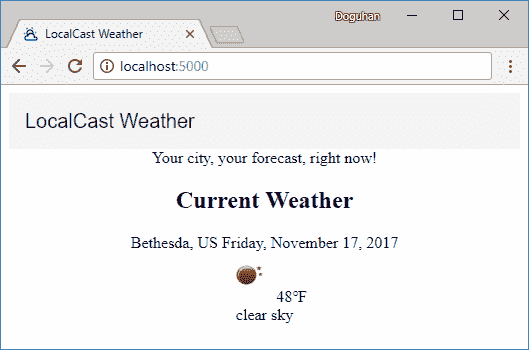

# 第五章：使用 Angular Material 增强 Angular 应用

在第三章*，为生产发布准备 Angular 应用*中，我们提到了提供高质量应用程序的需求。目前，该应用程序的外观和感觉非常糟糕，只适用于上世纪 90 年代创建的网站。用户或客户对您的产品或工作的第一印象非常重要，因此我们必须能够创建一个外观出色且在移动和桌面浏览器上提供出色用户体验的应用程序。

作为全栈开发人员，很难专注于应用程序的完善。随着应用程序功能集的迅速增长，情况会变得更糟。编写支持视图的优秀且模块化的代码很有趣，但在匆忙中退回到 CSS hack 和内联样式来改进应用程序是没有乐趣的。

Angular Material 是一个与 Angular 密切协调开发的令人惊叹的库。如果您学会如何有效地利用 Angular Material，您创建的功能将从一开始就看起来和运行得很好，无论您是在小型还是大型应用程序上工作。Angular Material 将使您成为一个更有效的 Web 开发人员，因为它附带了各种您可以利用的用户控件，并且您不必担心浏览器兼容性。作为额外的奖励，编写自定义 CSS 将变得罕见。

在本章中，您将学习以下内容：

+   如何配置 Angular Material

+   使用 Angular Material 升级 UX

# Angular Material

Angular Material 项目的目标是提供一系列有用且标准的高质量用户界面（UI）组件。该库实现了谷歌的 Material Design 规范，在谷歌的移动应用程序、网络属性和 Android 操作系统中普遍存在。Material Design 确实具有特定的数字和盒状外观和感觉，但它不仅仅是另一个 CSS 库，就像 Bootstrap 一样。考虑在此处使用 Bootstrap 编码的登录体验：

Bootstrap 登录体验

请注意，输入字段及其标签位于不同的行上，复选框是一个小目标，错误消息显示为短暂的弹出通知，提交按钮只是坐落在角落里。现在考虑给定的 Angular Material 示例：

Angular Material 登录体验

输入字段及其标签最初是组合在一起的，以紧凑的形式吸引用户的注意力。复选框对触摸友好，提交按钮会拉伸以占用可用空间，以获得更好的默认响应式用户体验。一旦用户点击字段，标签就会收起到输入字段的左上角，如图所示：

Angular Material 动画和错误

此外，验证错误消息会内联显示，并与标签颜色变化结合，使用户注意力集中在输入字段上。

Material Design 帮助您设计具有自己品牌和样式的模块化 UI，同时定义动画，使用户在使用您的应用程序时拥有更好的用户体验（UX）。人类大脑下意识地跟踪对象及其位置。任何帮助过渡或由人类输入引起的反应的动画都会减少用户的认知负担，因此允许用户专注于处理内容，而不是试图弄清您特定应用程序的怪癖。

模块化 UI 设计和流畅的动作的结合创造了出色的用户体验。看看 Angular Material 如何实现一个简单的按钮。

Angular Material 按钮动画

在上面的截图中，请注意按钮上的点击动画是从用户实际点击的位置开始的。然而微妙，这创造了一种连续的动作，导致了对给定动作的适当反应。当按钮在移动设备上使用时，这种特效变得更加明显，从而导致更加自然的人机交互。大多数用户无法表达什么使直观的用户体验实际上直观，设计和体验中的这些微妙但至关重要的线索在允许您为用户设计这样的体验方面取得了巨大进步。

Angular Material 还旨在成为 Angular 高质量 UI 组件的参考实现。如果您打算开发自定义控件，Angular Material 的源代码应该是您首要的资源。术语“高质量”经常被使用，量化其含义非常重要。Angular Material 团队在他们的网站上恰当地表达了这一点。

**我们所说的“高质量”是什么意思？**

国际化和可访问性，以便所有用户都可以使用它们。简单直观的 API，不会让开发人员困惑，并且在各种用例中表现如预期，没有错误。行为经过充分的单元测试和集成测试。在 Material Design 规范的范围内可定制。性能成本最小化。代码清晰，有文档，可以作为 Angular 开发人员的示例。浏览器和屏幕阅读器支持。

Angular Material 支持所有主要浏览器的最近两个版本：Chrome（包括 Android）、Firefox、Safari（包括 iOS）和 IE11 / Edge。

构建 Web 应用程序，特别是那些也兼容移动设备的应用程序，确实很困难。有很多细微之处需要注意。Angular Material 将这些细微之处抽象出来，包括支持所有主要浏览器，这样您就可以专注于创建您的应用程序。Angular Material 不是一时的潮流，也不应轻视。如果使用正确，您可以大大提高生产率和工作质量的感知。

在您的项目中，不一定总是能够使用 Angular Material。我建议使用 PrimeNG（[`www.primefaces.org/primeng`](https://www.primefaces.org/primeng)）或 Clarity（[`vmware.github.io/clarity`](https://vmware.github.io/clarity)）作为组件工具包，可以满足您大部分，如果不是全部，用户控制需求。要避免的一件事是从不同来源获取大量用户控件，最终得到一个杂乱的库，其中有数百个怪癖和错误需要学习、维护或解决。

# Angular Material 的设置和性能

Angular Material 默认配置为优化最终交付的包大小。在 Angular.JS 和 Angular Material 1.x 中，将加载整个依赖库。然而，在 Angular Material 6 中，我们能够指定我们打算使用的组件，从而实现显著的性能改进。

在下表中，您可以看到典型的 Angular 1.x + Angular Material 1.x 与 Angular 6 + Material 6 应用程序在高速低延迟的光纤连接下性能特征的改进：

| **光纤网络** | **Angular 6 + Material 6** | **Angular 1.5 + Material 1.1.5** | **% 差异** |
| --- | --- | --- | --- |
| 首页渲染时间* | 0.61 秒 | 1.69 秒** | ~2.8 倍更快 |
| 基本级别资产交付* | 113 KB | 1,425 KB | 缩小 12.6 倍 |

**图像或其他媒体内容未包含在结果中，以进行公平比较*

**平均值：较低质量的基础设施导致初始渲染时间为 0.9 到 2.5 秒*

在高速低延迟连接的理想条件下，Angular 6 + Material 6 应用程序在一秒内加载。然而，当我们切换到更常见的中等速度和高延迟的快速 3G 移动网络时，差异变得更加明显，如下表所示：

| **快速 3G 移动网络** | **Angular 6 + Material 6** | **Angular 1.5 + Material 1.1.5** | **    % 差异** |
| --- | --- | --- | --- |
| 首页渲染时间* | 1.94 秒 | 11.02 秒 | 5.7 倍更快 |
| 基本级别资产交付* | 113 KB | 1,425 KB | 缩小 12.6 倍 |

**图像或其他媒体内容未包含在结果中，以进行公平比较*

尽管应用程序的大小差异保持一致，但您可以看到移动网络引入的额外延迟导致传统的 Angular 应用程序速度显着下降到不可接受的水平。

将所有组件添加到 Material 6 将导致约 1.3 MB 的额外负载需要传递给用户。正如您可以从之前的比较中看到的，这必须以任何代价避免。为了提供可能最小的应用程序，尤其是在移动和与销售相关的场景中，每 100 毫秒的加载时间对用户保留都有影响，您可以逐个加载和包含模块。Webpack 的摇树过程将模块分成不同的文件，从而减少初始下载大小。在未来的构建中，预计 Angular 的大小将进一步缩小，可能会减少上表中提到的大小一半。

# 安装 Angular Material

让我们开始任务，并使用 Angular Material 改进天气应用程序的用户体验。让我们将改进应用程序用户体验的任务移动到我们的 Waffle.io 看板上的进行中。在这里，您可以看到我的看板的状态：

Waffle.io 看板

# 自动

在 Angular 6 中，您可以自动将 Angular Material 添加到您的项目中，从而在过程中节省大量时间：

1.  执行`add`命令，如下所示：

```ts
$ npx ng add @angular/material
Installing packages for tooling via npm.

+ @angular/material@6.0.1
added 1 package in 15.644s
Installed packages for tooling via npm.
UPDATE package.json (1381 bytes)
UPDATE angular.json (3694 bytes)
UPDATE src/app/app.module.ts (502 bytes)
UPDATE src/index.html (474 bytes)
UPDATE node_modules/@angular/material/prebuilt-themes/indigo-pink.css (56678 bytes)
added 1 package in 13.031s
```

请注意，`index.html`文件已经被修改以添加图标库和默认字体，如下所示：

```ts
src/index.html
<head>
  <link href="https://fonts.googleapis.com/icon?family=Material+Icons" rel="stylesheet">
  <link href="https://fonts.googleapis.com/css?family=Roboto:300,400,500" rel="stylesheet">
  ...
</head>
```

还要注意`app.module.ts`已更新以导入`BrowserAnimationsModule`，如下所示：

```ts
src/app/app.module.ts

import { BrowserAnimationsModule } from '@angular/platform-browser/animations';

@NgModule({
  declarations: [
    AppComponent
  ],
  imports: [
    ...
    BrowserAnimationsModule
  ],
```

1.  启动您的应用程序并确保它能正常工作：

```ts
$ npm start
```

有了这个，你就完成了。您的应用程序应该已配置为使用 Angular Material。重要的是要了解组成 Angular Material 的各种组件；在接下来的章节中，我们将介绍手动安装和配置步骤。您可以跳到*Angular Flex Layout*部分，但我强烈建议浏览一下手动步骤，因为我介绍了创建一个 Angular 模块来组织您的 Material 模块的概念。

# 手动

我们将从安装所有必需的库开始。从 Angular 5 开始，Angular Material 的主要版本应该与您的 Angular 安装版本匹配，而在 Angular 6 中，版本应该同步：

1.  在终端中，执行`npm install @angular/material @angular/cdk @angular/animations hammerjs`

1.  观察`package.json`版本：

```ts
package.json
 "dependencies": {
    "@angular/animations": "6.0.0",
    "@angular/cdk": "6.0.0",
    "@angular/material": "6.0.0",
    "hammerjs": "².0.8",
    ...
```

在这种情况下，所有库的主要和次要版本都是 5.0。如果您的主要和次要版本不匹配，您可以重新运行`npm install`命令以安装特定版本，或者选择通过将包的 semver 版本附加到安装命令来升级您的 Angular 版本：

```ts
$ npm install @angular/material@6.0.0 @angular/cdk@6.0.0 @angular/animations@6.0.0
```

如果您使用类似 Bash 的 shell，可以使用括号语法来节省一些输入，以避免重复命令的部分，比如`npm install @angular/{material,cdk,animations}@6.0.0`。

如果您需要更新 Angular 的版本，请参考第四章中的*更新 Angular*部分，*保持与 Angular 更新同步*。

# 理解 Material 的组件

让我们看看我们究竟安装了什么：

+   `@angular/material`是官方的 Material 2 库。

+   `@angular/cdk`是一个对等依赖项，除非您打算构建自己的组件，否则不会直接使用它。

+   `@angular/animations` 启用了一些 Material 2 模块的动画。可以省略它以保持应用程序的大小最小。您可以使用`NoopAnimationsModule`来禁用需要此依赖项的模块中的动画。结果，您将失去一些 Angular Material 的 UX 优势。

+   `hammerjs`启用了手势支持；如果您的目标是任何触摸设备，不仅仅是手机和平板电脑，还包括混合式笔记本电脑，这一点非常重要。

# 手动配置 Angular Material

现在依赖项已安装，让我们在 Angular 应用中配置 Angular Material。请注意，如果您使用`ng add @angular/material`来安装 Angular Material，则其中一些工作将由系统自动完成。

# 导入模块

我们将首先创建一个单独的模块文件，用于存放所有我们的 Material 模块导入：

1.  在终端中执行以下命令以生成`material.module.ts`：

```ts
$ npx ng g m material --flat -m app
```

请注意`--flat`标志的使用，它表示不应为`material.module.ts`创建额外的目录。另外，请注意，指定了`-m`，它是`--module`的别名，以便我们的新模块自动导入到`app.module.ts`中。

1.  观察新创建的文件`material.module.ts`：

```ts
src/app/material.module.ts
import { NgModule } from '@angular/core'
import { CommonModule } from '@angular/common'

@NgModule({
  imports: [CommonModule],
  declarations: [],
})
export class MaterialModule {}
```

1.  确保该模块已被导入到`app.module.ts`中：

```ts
src/app/app.module.ts
import { MaterialModule } from './material.module'
...  
@NgModule({
  ...
    imports: [..., MaterialModule],
}
```

1.  添加动画和手势支持（可选，但对移动设备支持必要）：

```ts
src/app/app.module.ts
import 'hammerjs'
import { BrowserAnimationsModule } from '@angular/platform-browser/animations'

@NgModule({
  ...
  imports: [..., MaterialModule, BrowserAnimationsModule],
}
```

1.  修改`material.module.ts`以导入按钮、工具栏和图标的基本组件

1.  移除`CommonModule`：

```ts
src/app/material.module.ts
import { MatButtonModule, MatToolbarModule, MatIconModule } from '@angular/material'
import { NgModule } from '@angular/core'

@NgModule({
  imports: [MatButtonModule, MatToolbarModule, MatIconModule],
  exports: [MatButtonModule, MatToolbarModule, MatIconModule],
})
export class MaterialModule {}
```

Material 现在已导入到应用程序中，现在让我们配置一个主题并将必要的 CSS 添加到我们的应用程序中。

# 导入主题

为了使用 Material 组件，需要一个基本主题。我们可以在`angular.json`中定义或更改默认主题：

```ts
angular.json
... 
"styles": [
  {
    "input": "node_modules/@angular/material/prebuilt-themes/indigo-pink.css"
  },
  "src/styles.css"
],
...
```

1.  从这里选择一个新选项：

+   `deeppurple-amber.css`

+   `indigo-pink.css`

+   `pink-bluegrey.css`

+   `purple-green.css`

1.  更新`angular.json`以使用新的 Material 主题

您也可以创建自己的主题，这在本章的自定义主题部分有介绍。有关更多信息，请访问[`material.angular.io/guide/theming`](https://material.angular.io/guide/theming)。

请注意，`styles.css`中实现的任何 CSS 将在整个应用程序中全局可用。也就是说，不要在此文件中包含特定于视图的 CSS。每个组件都有自己的 CSS 文件用于此目的。

# 添加 Material 图标字体

通过将 Material 图标 Web 字体添加到应用程序中，您可以访问一个很好的默认图标集。这个库大小为 48 kb，非常轻量级。

+   对于图标支持，请在`index.html`中导入字体：

```ts
src/index.html
<head>
  ...
  <link href="https://fonts.googleapis.com/icon?family=Material+Icons" rel="stylesheet">
</head>
```

在[`www.google.com/design/icons/`](https://www.google.com/design/icons/)上发现并搜索图标。

要获得更丰富的图标集，请访问[MaterialDesignIcons.com](https://materialdesignicons.com/)。这个图标集包含了 Material 图标的基本集，以及丰富的第三方图标，包括来自社交媒体网站的有用图像，以及涵盖了很多领域的丰富的操作。这个字体大小为 118 kb。

# Angular Flex Layout

在您可以有效使用 Material 之前，您必须了解其布局引擎。如果您已经做了一段时间的 Web 开发，您可能遇到过 Bootstrap 的 12 列布局系统。这对我大脑以 100%的方式分配事物的数学障碍。Bootstrap 还要求严格遵守 div 列、div 行的层次结构，必须从顶层 HTML 精确管理到底部。这可能会导致非常沮丧的开发体验。在下面的截图中，您可以看到 Bootstrap 的 12 列方案是什么样子的：

Bootstrap 的 12 列布局方案

Bootstrap 的自定义网格布局系统在当时是革命性的，但随后 CSS3 Flexbox 出现了。结合媒体查询，这两种技术允许创建响应式用户界面。然而，有效地利用这些技术是非常费力的。从 Angular v4.1 开始，Angular 团队推出了其 Flex 布局系统，它可以正常工作。

GitHub 上的 Angular Flex Layout 文档恰如其分地解释了如下内容：

Angular Flex Layout 提供了一个复杂的布局 API，使用 FlexBox CSS + mediaQuery。这个模块为 Angular（v4.1 及更高版本）开发人员提供了使用自定义布局 API、mediaQuery observables 和注入的 DOM flexbox-2016 CSS 样式的组件布局功能。

Angular 的出色实现使得使用 FlexBox 非常容易。正如文档进一步解释的那样：

布局引擎智能地自动应用适当的 FlexBox CSS 到浏览器视图层次结构。这种自动化还解决了许多传统的、手动的、仅使用 Flexbox CSS 的应用程序所遇到的复杂性和解决方法。

该库非常强大，可以容纳您能想象到的任何类型的网格布局，包括与您可能期望的所有 CSS 功能的集成，比如`calc()`函数。在下图中，您可以看到如何使用 CSS Flexbox 描述列：

Angular Flex Layout 方案

令人振奋的消息是，Angular Flex 布局与 Angular Material 没有任何耦合，并且可以独立使用。这是非常重要的解耦，解决了使用 AngularJS 与 Material v1 时的一个主要痛点，其中 Material 的版本更新经常会导致布局中的错误。

更多详情，请查看：[`github.com/angular/flex-layout/wiki`](https://github.com/angular/flex-layout/wiki)。

在发布时，`@angular/flex-layout`还没有发布稳定版本。该项目的 GitHub 活动表明，稳定版本将与 Angular 6 的发布同步。此外，CSS Grid 有望取代 CSS Flexbox，因此，该库使用的基础技术可能会发生变化。我希望这个库作为布局引擎的抽象层。

# 响应式布局

您设计和构建的所有 UI 都应该是面向移动设备的 UI。这不仅仅是为了服务于手机浏览器，还包括笔记本电脑用户可能会将您的应用与其他应用并排使用的情况。要正确实现移动设备优先设计有许多微妙之处。

以下是*Mozilla 圣杯布局*，它演示了“根据不同屏幕分辨率动态更改布局的能力”，同时优化移动设备的显示内容。

您可以在[`mzl.la/2vvxj25`](https://mzl.la/2vvxj25)了解有关 Flexbox 基本概念的更多信息。

这是大屏幕上 UI 外观的表示：

Mozilla 大屏幕上的圣杯布局

同样的布局在小屏幕上表示如下：

Mozilla 小屏幕上的圣杯布局

Mozilla 的参考实现需要 85 行代码来完成这种响应式 UI。Angular Flex 布局只需一半的代码就能完成同样的任务。

# 安装 Angular Flex 布局

让我们安装并将 Angular Flex 布局添加到我们的项目中：

1.  在终端中，执行`npm i @angular/flex-layout`

在发布时，`@angular/flex-layout`的当前版本是`5.0.0-beta.14`，这会导致许多对等依赖错误。为了避免这些错误，请执行`npm i @angular/flex-layout@next`来安装版本`6.0.0-beta.15`，如第四章中所述，*与 Angular 更新保持最新*。

1.  更新`app.module.ts`，如下所示：

```ts
src/app.module.ts
import { FlexLayoutModule } from '@angular/flex-layout'

imports: [
...
  FlexLayoutModule,
],
```

# 布局基础

Bootstrap 和 CSS FlexBox 与 Angular Flex 布局是不同的东西。如果你学会了 Angular Flex 布局，你将编写更少的布局代码，因为 Angular Material 大多数时候会自动做正确的事情，但是一旦你意识到一旦你离开 Angular Flex 布局的保护茧，你将不得不写更多的代码来让事情运转起来，你会感到失望。然而，你的技能仍然会转化，因为概念基本上是相同的。

让我们在接下来的部分中回顾一下 Flex 布局 API。

# DOM 容器的 Flex 布局 API

这些指令可以用在诸如`<div>`或`<span>`之类的 DOM 容器上，比如`<div fxLayout="row" fxLayoutAlign="start center" fxLayoutGap="15px">...</div>`：

| HTML API     | 允许的值 |
| --- | --- |
| `fxLayout` | <direction> &#124; <direction> <wrap>  Use: row &#124; column &#124; row-reverse &#124; column-reverse |

| `fxLayoutAlign` | <main-axis> <cross-axis>  main-axis: start &#124;center &#124; end &#124; space-around &#124; space-between

cross-axis: start &#124; center &#124; end &#124; stretch |

| `fxLayoutGap` | % &#124; px &#124; vw &#124; vh |
| --- | --- |

# DOM 元素的 Flex 布局 API

这些指令影响 DOM 元素在其容器中的行为，比如`<div fxLayout="column"><input fxFlex /></div>`：

| HTML API | 允许的值 |
| --- | --- |
| `fxFlex` | "" &#124; px &#124; % &#124; vw &#124; vh &#124; <grow> <shrink> <basis> |
| `fxFlexOrder` | int |
| `fxFlexOffset` | % &#124; px &#124; vw &#124; vh |
| `fxFlexAlign` | start &#124; baseline &#124; center &#124; end |
| `fxFlexFill` | *none* |

# 任何元素的 Flex 布局 API

以下指令可以应用于任何 HTML 元素，以显示、隐藏或更改所述元素的外观和感觉，比如`<div fxShow fxHide.lt-sm></div>`，它会显示一个元素，除非屏幕尺寸小于小屏幕：

| HTML API | 允许的值 |
| --- | --- |
| `fxHide` | TRUE &#124; FALSE &#124; 0 &#124; "" |
| `fxShow` | TRUE &#124; FALSE &#124; 0 &#124; "" |
| `ngClass` | @extends ngClass core |
| `ngStyle` | @extends ngStyle core |

本节介绍了静态布局的基础知识。您可以在[`github.com/angular/flex-layout/wiki/Declarative-API-Overview`](https://github.com/angular/flex-layout/wiki/Declarative-API-Overview)上阅读更多关于静态 API 的信息。我们将在*第十章，Angular 应用程序设计和技巧*中介绍响应式 API。您可以在[`github.com/angular/flex-layout/wiki/Responsive-API`](https://github.com/angular/flex-layout/wiki/Responsive-API)上阅读更多关于响应式 API 的信息。

# 向您的应用程序添加 Material 组件

现在我们已经安装了各种依赖项，我们可以开始修改我们的 Angular 应用程序以添加 Material 组件。我们将添加一个工具栏，Material 设计卡片元素，并涵盖基本布局技术以及辅助功能和排版方面的问题。

# Angular Material 原理图

使用 Angular 6 和引入原理图，像 Material 这样的库可以提供自己的代码生成器。在出版时，Angular Material 附带了三个基本的生成器，用于创建具有侧边导航、仪表板布局或数据表的 Angular 组件。您可以在[`material.angular.io/guide/schematics`](https://material.angular.io/guide/schematics)上阅读更多关于生成器原理图的信息。

例如，您可以通过执行以下操作创建一个侧边导航布局：

```ts
$ ng generate @angular/material:material-nav --name=side-nav 

CREATE src/app/side-nav/side-nav.component.css (110 bytes)
CREATE src/app/side-nav/side-nav.component.html (945 bytes)
CREATE src/app/side-nav/side-nav.component.spec.ts (619 bytes)
CREATE src/app/side-nav/side-nav.component.ts (489 bytes)
UPDATE src/app/app.module.ts (882 bytes)
```

此命令更新了`app.module.ts`，直接将 Material 模块导入到该文件中，打破了我之前建议的`material.module.ts`模式。此外，一个新的`SideNavComponent`被添加到应用程序作为一个单独的组件，但正如在第九章中的*侧边导航*部分所提到的，*设计认证和授权*，这样的导航体验需要在应用程序的根部实现。

简而言之，Angular Material 原理图承诺使向您的 Angular 应用程序添加各种 Material 模块和组件变得不那么繁琐；然而，如提供的那样，这些原理图并不适用于创建灵活、可扩展和良好架构的代码库，正如本书所追求的那样。

目前，我建议将这些原理图用于快速原型设计或实验目的。

现在，让我们开始手动向 LocalCast Weather 添加一些组件。

# 使用 Material 工具栏修改着陆页面

在我们开始对 `app.component.ts` 进行进一步更改之前，让我们将组件切换为使用内联模板和内联样式，这样我们就不必在相对简单的组件中来回切换文件。

1.  更新 `app.component.ts` 以使用内联模板

1.  移除 `app.component.html` 和 `app.component.css`

```ts
src/app/app.component.ts import { Component } from '@angular/core'

@Component({
  selector: 'app-root',
  template: `
    <div style="text-align:center">
      <h1>
      LocalCast Weather
      </h1>
      <div>Your city, your forecast, right now!</div>
      <h2>Current Weather</h2>
      <app-current-weather></app-current-weather>
    </div>
  `
})
export class AppComponent {}
```

让我们通过实现一个全局工具栏来改进我们的应用：

1.  观察 `app.component.ts` 中的 `h1` 标签：

```ts
**src/app/app.component.ts**
<h1>
 LocalCast Weather </h1>
```

1.  使用 `mat-toolbar` 更新 `h1` 标签：

```ts
src/app/app.component.ts    
<mat-toolbar>
  <span>LocalCast Weather</span>
</mat-toolbar>
```

1.  观察结果；您应该看到一个工具栏，如图所示：

 本地天气工具栏

1.  使用更引人注目的颜色更新 `mat-toolbar`：

```ts
src/app/app.component.ts    
<mat-toolbar color="primary">
```

为了更加原生的感觉，工具栏与浏览器的边缘接触是很重要的。这在大屏和小屏格式上都很有效。此外，当您将可点击的元素（如汉堡菜单或帮助按钮）放在工具栏的最左侧或最右侧时，您将避免用户点击空白空间的可能性。这就是为什么 Material 按钮实际上具有比视觉表示更大的点击区域。这在打造无挫折的用户体验方面有很大的不同：

```ts
src/styles.css
body {
  margin: 0;
}
```

这对于这个应用来说并不适用，但是，如果您正在构建一个密集的应用程序，您会注意到您的内容将一直延伸到应用程序的边缘，这并不是一个理想的结果。考虑将您的内容区域包裹在一个 div 中，并使用 css 应用适当的边距，如下所示：

```ts
src/styles.css
.content-margin {
  margin-left: 8px;
  margin-right: 8px;
}
```

在下一个截图中，您可以看到应用了主色的边到边工具栏：

 带有改进工具栏的本地天气

# 在 Material Card 中表示天气

Material 卡片是一个很好的容器，用来表示当前的天气信息。卡片元素被一个投影阴影所包围，将内容与周围区域分隔开来：

1.  在 `material.module` 中导入 `MatCardModule`：

```ts
src/app/material.module.ts
import { ..., MatCardModule} from '@angular/material'
...
@NgModule({
  imports: [..., MatCardModule],
  exports: [..., MatCardModule],
})
```

1.  在 `app.component` 中用 `<mat-card>` 包围 `<app-current-weather>`：

```ts
src/app/app.component.ts
  <div style="text-align:center">
    <mat-toolbar color="primary">
      <span>LocalCast Weather</span>
    </mat-toolbar>
    <div>Your city, your forecast, right now!</div>
    <mat-card>
      <h2>Current Weather</h2>
      <app-current-weather></app-current-weather>
    </mat-card>
  </div>
```

1.  观察如图所示的几乎无法区分的卡片元素：

 带有不可区分卡片的本地天气

为了更好地布局屏幕，我们需要切换到 Flex 布局引擎。首先从组件模板中移除训练轮：

1.  从周围的 `<div>` 中移除 `style="text-align:center"`：

要在页面中心放置一个元素，我们需要创建一行，为中心元素分配一个宽度，并在两侧创建两个额外的列，这些列可以灵活地占据空白空间，如下所示：

```ts
src/app/app.component.ts
<div fxLayout="row">
  <div fxFlex></div>
  <div fxFlex="300px">  
    ...
  </div>
  <div fxFlex></div>
</div>
```

1.  用前面的 HTML 包围`<mat-card>`

1.  注意卡片元素已正确居中，如下所示：

带居中卡片的 LocalCast 天气

阅读卡片文档，并查看 Material 文档站点上的示例，您会注意到`mat-card`提供了容纳标题和内容的元素。我们将在接下来的部分中实现这一点。

在[material.angular.io](https://material.angular.io)上，您可以通过单击括号图标查看任何示例的源代码，或者通过单击箭头图标在 Plunker 中启动一个可工作的示例。

# 可访问性

利用这样的 Material 特性可能会感觉不必要；然而，在设计应用程序时，您必须考虑响应性、样式、间距和可访问性问题。Material 团队已经付出了很多努力，以便您的代码在大多数情况下能够正确运行，并为尽可能多的用户群提供高质量的用户体验。这可能包括视力受损或键盘主导用户，他们必须依赖专门的软件或键盘功能（如标签）来浏览您的应用程序。利用 Material 元素为这些用户提供了关键的元数据，使他们能够浏览您的应用程序。

Material 声称支持以下屏幕阅读器软件：

+   Windows 上的 IE / FF / Chrome 上的 NVDA 和 JAWS

+   iOS 上的 Safari 和 Safari / Chrome 上的 VoiceOver

+   Android 上的 Chrome TalkBack

# 卡头和内容

现在，让我们实现`mat-card`的标题和内容元素，如下所示：

```ts
src/app/app.component.ts    
<mat-toolbar color="primary">
  <span>LocalCast Weather</span>
</mat-toolbar>
<div>Your city, your forecast, right now!</div>
<div fxLayout="row">
  <div fxFlex></div>
  <mat-card fxFlex="300px">
    <mat-card-header>
      <mat-card-title>Current Weather</mat-card-title>
    </mat-card-header>
    <mat-card-content>
      <app-current-weather></app-current-weather>
    </mat-card-content>
  </mat-card>
  <div fxFlex></div>
</div>
```

在 Material 中，少即是多。您会注意到我们能够删除中心的`div`，并直接在中心卡上应用`fxFlex`。所有 Material 元素都原生支持 Flex 布局引擎，这在复杂的 UI 中具有巨大的积极维护影响。

应用`mat-card-header`后，您可以看到这个结果：

带标题和内容的 LocalCast 天气卡

请注意，卡片内的字体现在与 Material 的 Roboto 字体匹配。然而，Current Weather 不再像以前那样引人注目。如果你在 `mat-card-title` 内部添加回 `h2` 标签，Current Weather 在视觉上会显得更大；然而，字体将不再与你的应用程序的其余部分匹配。要解决这个问题，你必须了解 Material 的排版特性。

# Material 排版

Material 的文档恰如其分地将其表述如下：

排版是一种排列字体的方式，使文本在显示时易于辨认、可读和吸引人。

Material 提供了不同级别的排版，具有不同的字体大小、行高和字重特性，你可以应用到任何 HTML 元素上，而不仅仅是提供的组件。

在下表中是你可以使用的 CSS 类，用于应用 Material 的排版，比如 `<div class="mat-display-4">Hello, Material world!</div>`：

| **类名** | **用法** |
| --- | --- |
| `display-4`, `display-3`, `display-2` 和 `display-1` | 大的、一次性的标题，通常位于页面顶部（例如，主标题） |
| `headline ` | 对应 `<h1>` 标签的章节标题 |
| `title ` | 对应 `<h2>` 标签的章节标题 |
| `subheading-2` | 对应 `<h3>` 标签的章节标题 |
| `subheading-1` | 对应 `<h4>` 标签的章节标题 |
| `body-1` | 基本正文文本 |
| `body-2` | 更粗的正文文本 |
| `caption ` | 较小的正文和提示文本 |
| `button` | 按钮和锚点 |

你可以在 [`material.angular.io/guide/typography`](https://material.angular.io/guide/typography) 阅读更多关于 Material 排版的信息。

# 应用排版

有多种方式可以应用排版。一种方式是利用 `mat-typography` 类，并使用相应的 HTML 标签如 `<h2>`：

```ts
src/app/app.component.ts 
<mat-card-header class="mat-typography">
  <mat-card-title><h2>Current Weather</h2></mat-card-title>
</mat-card-header>
```

另一种方式是直接在元素上应用特定的排版，比如 `class="mat-title"`：

```ts
src/app/app.component.ts 
<mat-card-title><div class="mat-title">Current Weather</div></mat-card-title>
```

请注意，`class="mat-title"` 可以应用到 `div`、`span` 或带有相同结果的 `h2` 上。

作为一个一般的经验法则，通常更好的做法是实现更具体和局部化的选项，即第二种实现方式。

# 更新标语为居中对齐的标题

我们可以使用 `fxLayoutAlign` 居中应用程序的标语，并给它一个柔和的 `mat-caption` 排版，如下所示：

1.  实现布局更改和标题排版：

```ts
**src/app/app.component.ts** 
<div fxLayoutAlign="center">
  <div class="mat-caption">Your city, your forecast, right now!</div>
</div>
```

1.  观察结果，如下所示：

LocalCast 天气中心标语居中

# 更新当前天气卡片布局

仍然有更多工作要做，以使 UI 看起来像设计，特别是当前天气卡片的内容，如下所示：


为了设计布局，我们将利用 Angular Flex。

您将编辑`current-weather.component.html`，该文件使用`<div>`和`<span>`标签来建立分别位于不同行或同一行上的元素。随着切换到 Angular Flex，我们需要将所有元素切换为`<div>`，并使用`fxLayout`指定行和列。

# 实施布局脚手架

我们需要首先实现粗糙的脚手架。

考虑模板的当前状态：

```ts
 src/app/current-weather/current-weather.component.html
 1 <div *ngIf="current">
 2  <div>
 3    <span>{{current.city}}, {{current.country}}</span>
 4    <span>{{current.date | date:'fullDate'}}</span>
 5  </div>
 6  <div>
 7    
 8    <span>{{current.temperature | number:'1.0-0'}}℉</span>
 9  </div>
10  <div>
11    {{current.description}}
12  </div>
13 </div>
```

让我们逐步通过文件并更新它：

1.  将第 3、4 和 8 行的`<span>`元素更新为`<div>`

1.  用`<div>`包装``元素

1.  在第 2 行和第 6 行有多个子元素的`<div>`元素上添加`fxLayout="row"`属性

1.  城市和国家列大约占据了屏幕的 2/3，因此在第 3 行的`<div>`元素上添加`fxFlex="66%"`

1.  在第 4 行的下一个`<div>`元素上添加`fxFlex`，以确保它占据其余的水平空间

1.  在新的`<div>`元素周围添加`fxFlex="66%"`，以包围``元素

1.  在第 4 行的下一个`<div>`元素上添加`fxFlex`

模板的最终状态应该如下所示：

```ts
 src/app/current-weather/current-weather.component.html
 1 <div *ngIf="current">
 2   <div fxLayout="row">
 3     <div fxFlex="66%">{{current.city}}, {{current.country}}</div>
 4     <div fxFlex>{{current.date | date:'fullDate'}}</div>
 5   </div>
 6   <div fxLayout="row">
 7     <div fxFlex="66%">
 8       
 9     </div>
10     <div fxFlex>{{current.temperature | number:'1.0-0'}}℉</div>
11   </div>
12   <div>
13    {{current.description}}
14  </div>
15 </div>
```

您可以在添加 Angular Flex 属性时更详细; 但是，您写的代码越多，将来需要维护的内容就越多，这会使未来的更改变得更加困难。例如，第 12 行的`<div>`元素不需要`fxLayout="row"`，因为`<div>`隐式地换行。同样，在第 4 行和第 7 行，右侧列不需要显式的`fxFlex`属性，因为它将自动被左侧元素挤压。

从网格放置的角度来看，所有元素现在都在正确的*单元格*中，如下所示：

带有布局脚手架的 LocalCast 天气

# 对齐元素

现在，我们需要对齐和样式化每个单独的单元格以匹配设计。日期和温度需要右对齐，描述需要居中：

1.  要右对齐日期和温度，请在`current-weather.component.css`中创建一个名为`.right`的新 css 类：

```ts
src/app/current-weather/current-weather.component.css
.right {
  text-align: right
}
```

1.  在第 4 行和第 10 行的`<div>`元素中添加`class="right"`

1.  以与之前章节中应用标语居中的方式居中`<div>`元素的描述

1.  观察元素是否正确对齐，如下所示：

具有正确对齐的 LocalCast 天气

# 样式元素

最终确定元素的样式通常是前端开发中最耗时的部分。我建议进行多次尝试，首先以最小的努力实现设计的足够接近版本，然后让您的客户或团队决定是否值得额外投入更多时间来完善设计：

1.  添加一个新的 css 属性：

```ts
src/app/current-weather/current-weather.component.css
.no-margin {
  margin-bottom: 0
}
```

1.  对于城市名称，在第 3 行，添加'class="mat-title no-margin"'

1.  对于日期，在第 4 行，添加"mat-subheading-2 no-margin"到'class="right"'

1.  将日期格式从'fullDate'更改为'EEEE MMM d'以匹配设计

1.  修改`,`在第 8 行添加`style="zoom: 175%"`

1.  对于温度，在第 10 行，追加"mat-display-3 no-margin"

1.  对于描述，在第 12 行，添加'class="mat-caption"'

这是模板的最终状态：

```ts
src/app/current-weather/current-weather.component.html
<div *ngIf="current">
  <div fxLayout="row">
    <div fxFlex="66%" class="mat-title no-margin">{{current.city}}, {{current.country}}</div>
    <div fxFlex class="right mat-subheading-2 no-margin">{{current.date | date:'EEEE MMM d'}}</div>
  </div>
  <div fxLayout="row">
    <div fxFlex="66%">
      
    </div>
    <div fxFlex class="right mat-display-3 no-margin">{{current.temperature | number:'1.0-0'}}℉</div>
  </div>
  <div fxLayoutAlign="center" class="mat-caption">
    {{current.description}}
  </div>
</div>
```

1.  观察您的代码的样式化输出如何改变，如图所示：

带有样式的 LocalCast 天气

# 微调样式

标语可以从顶部和底部边距中受益。这是我们可能会在整个应用程序中使用的常见 CSS，所以让我们把它放在'styles.css'中：

1.  实现'vertical-margin'：

```ts
src/styles.css
.vertical-margin {
  margin-top: 16px;
  margin-bottom: 16px;
}
```

1.  应用'vertical-margin'：

```ts
src/app/app.component.ts
<div class="mat-caption vertical-margin">Your city, your forecast, right now!</div>
```

当前天气与城市名称具有相同的样式；我们需要区分这两者。

1.  在'app.component.ts'中，使用'mat-headline'排版更新当前天气：

```ts
src/app/app.component.ts
<mat-card-title><div class="mat-headline">Current Weather</div></mat-card-title>
```

1.  图像和温度没有居中，因此在第 6 行的围绕这些元素的行中添加'fxLayoutAlign="center center"':

```ts
src/app/current-weather/current-weather.component.html
<div fxLayout="row" fxLayoutAlign="center center">
```

1.  观察您的应用程序的最终设计，应该是这样的：

LocalCast 天气最终设计

# 微调以匹配设计

这是一个你可能会花费大量时间的领域。如果我们遵循 80-20 原则，像素完美的微调通常最终成为需要花费 80%的时间来完成的最后 20%。让我们来看看我们的实现与设计之间的差异以及弥合差距需要付出的努力：


日期需要进一步定制。缺少数字序数*th*; 为了实现这一点，我们需要引入第三方库，如 moment，或者实现我们自己的解决方案，并将其绑定到模板上的日期旁边：

1.  更新'current.date'以附加序数：

```ts
src/app/current-weather/current-weather.component.html
{{current.date | date:'EEEE MMM d'}}{{getOrdinal(current.date)}}
```

1.  实现一个`getOrdinal`函数：

```ts
src/app/current-weather/current-weather.component.ts export class CurrentWeatherComponent implements OnInit {
...
  getOrdinal(date: number) {
    const n = new Date(date).getDate()
    return n > 0
      ? ['th', 'st', 'nd', 'rd'][(n > 3 &amp;&amp; n < 21) || n % 10 > 3 ? 0 : n % 10]
      : ''
  }
  ...
}
```

请注意，`getOrdinal`的实现归结为一个复杂的一行代码，不太可读，很难维护。如果这样的函数对您的业务逻辑至关重要，应该进行大量的单元测试。

在撰写本文时，Angular 6 不支持日期模板中的新行换行；理想情况下，我们应该能够将日期格式指定为`'EEEE\nMMM d'`，以确保换行始终保持一致。

温度的实现需要使用`<span>`元素将数字与单位分开，用`<p>`包围，以便可以将上标样式应用到单位，例如`<span class="unit">℉</span>`，其中 unit 是一个 CSS 类，使其看起来像一个上标元素。

1.  实现一个`unit` CSS 类：

```ts
src/app/current-weather/current-weather.component.css
.unit {
  vertical-align: super;
}
```

1.  应用`unit`：

```ts
src/app/current-weather/current-weather.component.html
...   
 7 <div fxFlex="55%">
...
10 <div fxFlex class="right no-margin">
11   <p class="mat-display-3">{{current.temperature | number:'1.0-0'}}
12     <span class="mat-display-1 unit">℉</span>
13   </p>
```

我们需要通过调整第 7 行的`fxFlex`值来实验预报图像应该有多少空间。否则，温度会溢出到下一行，并且您的设置还会受到浏览器窗口大小的影响。例如，`60%`在小浏览器窗口下效果很好，但当最大化时会导致溢出。然而，`55%`似乎满足了两个条件：

调整后的 LocalCast 天气

与往常一样，可以进一步调整边距和填充以进一步定制设计。然而，每一次偏离库都会在以后产生可维护性后果。除非您真的要围绕显示天气数据构建业务，否则应该在项目结束时推迟任何进一步的优化，如果时间允许，如果经验是任何指导，您将不会进行这种优化。

通过两个负的 margin-bottom hack，你可以获得一个与原始设计非常接近的设计，但我不会在这里包含这些 hack，而是留给读者在 GitHub 存储库中发现。这些 hack 有时是必要的恶，但总的来说，它们指向设计和实现现实之间的脱节。在调整部分之前的解决方案是甜蜜点，Angular Material 在这里蓬勃发展：

调整和 hack 后的 LocalCast 天气

# 更新单元测试

为了保持您的单元测试运行，您需要将`MaterialModule`导入到任何使用 Angular Material 的组件的`spec`文件中：

```ts
*.component.spec.ts
...
  beforeEach(
    async(() => {
      TestBed.configureTestingModule({
        ...
        imports: [..., MaterialModule, NoopAnimationsModule],
      }).compileComponents()
    })
  )
```

你还需要更新任何测试，包括 e2e 测试，以搜索特定的 HTML 元素。

例如，由于应用程序的标题 LocalCast Weather 不再在`h1`标签中，你必须更新`spec`文件，以在`span`元素中查找它：

```ts
src/app/app.component.spec.ts
expect(compiled.querySelector('span').textContent).toContain('LocalCast Weather')
```

同样，在 e2e 测试中，你需要更新你的页面对象函数，以从正确的位置检索文本：

```ts
e2e/app.po.ts
getParagraphText() {
  return element(by.css('app-root mat-toolbar span')).getText()
}
```

# 自定义主题

正如我们之前讨论的，Material 默认提供了一些默认主题，如深紫色-琥珀色、蓝紫色-粉色、粉色-蓝灰色和紫色-绿色。然而，你的公司或产品可能有自己的配色方案。为此，你可以创建一个自定义主题，改变你的应用程序的外观。

为了创建一个新的主题，你必须实现一个新的 scss 文件：

1.  在`src`下创建一个名为`localcast-theme.scss`的新文件

1.  Material 主题指南，位于[`material.angular.io/guide/theming`](https://material.angular.io/guide/theming)，包括一个最新的起始文件。我将进一步解释文件的内容

1.  首先包含基础主题库：

```ts
src/localcast-theme.scss
@import '~@angular/material/theming';
```

1.  导入`mat-core()` mixin，其中包括各种 Material 组件使用的所有通用样式：

```ts
src/localcast-theme.scss
@include mat-core();
```

`mat-core()`应该只在你的应用程序中包含一次；否则，你将在应用程序中引入不必要和重复的 css 负载。

`mat-core()`包含必要的 scss 函数，可以将自定义颜色注入到 Material 中，例如 mat-palette、mat-light-theme 和 mat-dark-theme。

至少，我们必须定义一个新的主色和一个强调色。然而，定义新的颜色并不是一个简单的过程。Material 需要定义一个调色板，mat-palette，它需要由一个复杂的颜色对象种子化，不能简单地被一个简单的十六进制值如`#BFB900`所覆盖。

要选择你的颜色，可以使用位于[`material.io/color`](https://material.io/color)的 Material Design Color Tool。这是工具的截图：

Material.io 颜色工具

1.  使用 Material Palette，选择一个主色和一个次要颜色：

+   我的主要选择是红色，色调值为`500`

+   我的次要选择是蓝紫色，色调值为`A400`

1.  通过浏览左侧的 6 个预构建屏幕，观察你的选择如何应用到 Material 设计应用程序

1.  评估你的选择对可访问性的影响，如下所示：

Material.io 颜色工具可访问性选项卡该工具警告我们，我们的选择导致不合格的文本，当白色文本用于主要颜色时。您应该注意避免在主要颜色上显示白色文本，或更改您的选择。

`mat-palette`的接口如下所示：

```ts
mat-palette($base-palette, $default: 500, $lighter: 100, $darker: 700)
```

1.  使用工具的默认色调定义主要和次要的`mat-palette`对象：

```ts
src/localcast-theme.scss
$localcast-primary: mat-palette($mat-red, 500);
$localcast-accent: mat-palette($mat-indigo, A400);
```

1.  创建一个新主题并应用它：

```ts
src/localcast-theme.scss
$localcast-app-theme: mat-light-theme($localcast-primary, $localcast-accent);

@include angular-material-theme($localcast-app-theme);
```

1.  在`angular.json`中，找到`apps.styles`属性

1.  在删除`styles.input`属性的同时，在列表前加上`localcast-theme.scss`

```ts
angular.json
...      
"styles": [
  "src/localcast-theme.scss",
  "src/styles.css"
],
...
```

即使您的主题是 scss，您仍然可以在应用程序的其余部分使用 css。Angular CLI 支持编译 scss 和 css。如果您想更改默认行为，可以通过将`angular.json`文件中的`defaults.styleExt`属性从 css 更改为 scss 来完全切换到 scss。

您还可以选择消除`styles.css`并将其内容与`localcast-theme.scss`合并，或者通过简单将其重命名为`styles.scss`将`styles.css`转换为 sass 文件。如果这样做，不要忘记更新`angular.json`。

您的应用程序现在应该是这样的：

带有自定义主题的 LocalCast 天气

我们现在可以将 UX 任务移动到已完成的列中：

Waffle.io 看板状态

# 高级主题

为了创建更多定制的主题，您应该考虑使用 Material Design 主题调色板生成器[`mcg.mbitson.com`](http://mcg.mbitson.com)。这将生成定义自定义颜色调色板以创建真正独特主题所需的代码。

您还可以在[`meyerweb.com/eric/tools/color-blend`](https://meyerweb.com/eric/tools/color-blend)找到颜色混合器，以找到两种颜色之间的中间点。

# 更新 Angular Material

在第四章中，*与 Angular 更新保持最新*，我们利用了`ng update`进行自动升级体验，并介绍了手动和系统化的更新包方法。我们将在更新 Angular Material 时采用类似的策略。

您可以使用`ng update`来快速且无痛的升级体验，应该如下所示：

```ts
$ npx ng update @angular/material
 Updating package.json with dependency @angular/cdk @ "6.0.0" (was "5.2.2")...
 Updating package.json with dependency @angular/material @ "6.0.0" (was "5.2.2")...
UPDATE package.json (5563 bytes)
```

此外，我发现了 Angular 团队在 [`github.com/angular/material-update-tool`](https://github.com/angular/material-update-tool) 发布的 `material-update-tool`。目前这个工具被宣传为一个特定的 Angular Material 5.x 到 6.0 的更新工具，因此它可能在未来成为 `ng update` 的一部分，就像 `rxjs-tslint` 工具一样。您可以按照下面的示例运行该工具：

```ts
$ npx angular-material-updater -p .\src\tsconfig.app.json

√ Successfully migrated the project source files. Please check above output for issues that couldn't be automatically fixed.
```

如果您幸运并且一切顺利，可以随意跳过本节的其余部分。在本节的其余部分中，我将介绍我在开发此示例时遇到的涉及发布候选版本和 Beta 版本的特定情况，这突显了手动更新的必要性。首先，我们将了解当前版本，然后发现最新可用版本，最后，更新和测试升级，就像我们手动更新 Angular 时所做的那样。

# 对您当前的版本进行盘点

观察 `package.json` 中的 Angular Material 包版本：

```ts
package.json
"dependencies": {
  "@angular/core": "⁵.0.0",
  ...
  "@angular/animations": "⁵.0.0",
  "@angular/cdk": "⁵.0.0-rc0",
  "@angular/flex-layout": "².0.0-beta.10-4905443", 
  "@angular/material": "⁵.0.0-rc0",
  "hammerjs": "².0.8",
},
```

在这种特殊情况下，我在 RC 阶段安装了 Material 5.0.0。建议不要发布 Beta 或 RC 库。由于我们的 `@angular/core` 包指示我们使用的是 Angular 版本 5.0.0，我们将目标升级到最新的 Angular Material 5.x.x 版本。

# 检查最新可用版本

我们将利用 npm CLI 工具来发现 Angular Material 的最新可用版本：

1.  执行 `npm info @angular/material` 并观察输出：

```ts
{ 
  name: '@angular/material',
  description: 'Angular Material',
  'dist-tags': { latest: '5.0.0' },
  versions:
   [ ...
     '5.0.0-rc.0',
     '5.0.0-rc.1',
     '5.0.0-rc.2',
     '5.0.0-rc.3',
     '5.0.0-rc0',
     '5.0.0' ],
...
time: {
  created: ...
     '5.0.0-rc0': '2017-11-06T20:15:29.863Z',
     '5.0.0-rc.1': '2017-11-21T00:38:56.394Z',
     '5.0.0-rc.0': '2017-11-27T19:21:19.781Z',
     '5.0.0-rc.2': '2017-11-28T00:13:13.487Z',
     '5.0.0-rc.3': '2017-12-05T21:20:42.674Z',
     '5.0.0': '2017-12-06T20:19:25.466Z' 
}

```

您可以观察到，结合输出中更深层的时间信息，自 `5.0.0-rc0` 发布以来已经推出了 5 个新版本，最终版本是库的主要版本 5.0.0 发布。

如果 Material 库有其他主要版本可用，比如 6.0.0，您仍应坚持使用 5.x.x 版本，因为我们的 `@angular/core` 版本是 5.x.x。一般来说，您应该保持 Angular 和 Material 的主要版本相同。

1.  研究 `@angular/core`、`@angular/animations`、`@angular/cdk`、`@angular/flex-layout`、`@angular/material` 和 `hammerjs` 的最新可用版本。

1.  为了减少您需要筛选的信息量，对每个包执行 `npm info <package-name>` versions

1.  将您的发现记录在类似以下的表中；我们将讨论如何确定您的目标版本：

| **包** | **当前** | **最新** | **目标** |
| --- | --- | --- | --- |
| @angular/core | 5.0.0 | 5.1.0 | 5.0.0 |
| @angular/animations | 5.0.0 | 5.1.0 | 5.0.0 |
| @angular/cdk | 5.0.0-rc0 | 5.0.0 | 5.0.0 |
| @angular/flex-layout | 2.0.0-beta.10-4905443 | 2.0.0-rc.1 | 2.x.x |
| @angular/material | 5.0.0-rc0 | 5.0.0 | 5.0.0 |
| hammerjs | 2.0.8 | 2.0.8 | 2.x.x |

研究结果表明，发布了新的 Angular 小版本，这是有用的信息。在确定目标版本时，要保守。遵循以下指导：

+   在更新 Material 时不要更新 Angular 组件

+   如果您打算同时更新 Angular 组件，请分阶段进行，并确保在每个单独阶段之后执行测试

+   将任何 Beta 或 RC 软件包更新到其最新可用版本

+   当软件包的新版本可用时，保持在软件包的相同主要版本中

+   除非文档另有建议，否则遵循这些指南

# 更新 Angular Material

现在我们知道要升级到哪个版本，让我们继续进行：

1.  执行以下命令以将 Material 及其相关组件更新到其目标版本：

```ts
$ npm install @angular/material@⁵.0.0 @angular/cdk@⁵.0.0 @angular/animations@⁵.0.0 @angular/flex-layout@².0.0-rc.1
```

1.  验证您的`package.json`以确保版本与预期版本匹配

1.  解决任何 NPM 警告（详见第四章，*与 Angular 更新保持最新*，*更新 Angular*部分）

在这种特定情况下，我收到了无法满足的`@angular/flex-layout`包的对等依赖警告。在 GitHub 上进一步调查（[`github.com/angular/flex-layout/issues/508`](https://github.com/angular/flex-layout/issues/508)）显示这是一个已知问题，通常可以从 Beta 或 RC 包中预期到。这意味着可以安全地忽略这些警告。

升级完成后，请确保执行“后续更新清单”，详见第四章，*与 Angular 更新保持最新*。

# 摘要

在本章中，您了解了什么是 Angular Material，如何使用 Angular Flex 布局引擎，UI 库对性能的影响，以及如何将特定的 Angular Material 组件应用于您的应用程序。您意识到了过度优化 UI 设计的陷阱，以及如何向应用程序添加自定义主题。我们还讨论了如何保持 Angular Material 的最新状态。

在下一章中，我们将更新天气应用程序，以响应用户输入使用响应式表单，并保持我们的组件解耦，同时还使用`BehaviorSubject`在它们之间实现数据交换。在下一章之后，我们将完成天气应用程序，并将重点转移到构建更大的业务应用程序。
