# 第六章：响应式表单和组件交互

到目前为止，您一直在努力组合构成 Angular 应用程序的基本元素，比如模块、组件、管道、服务、RxJS、单元测试、环境变量，甚至更进一步地学习如何使用 Docker 交付您的 Web 应用程序，并使用 Angular Material 使其看起来更加精致。

为了构建真正动态的应用程序，我们需要构建能够实现丰富用户交互并利用现代网络功能的功能，比如`LocalStorage`和`GeoLocation`。您还需要熟练掌握新的 Angular 语法，以有效地利用绑定、条件布局和重复元素。

您需要能够使用 Angular 表单来创建带有验证消息的输入字段，使用搜索即时输入功能创建引人入胜的搜索体验，为用户提供自定义其偏好的方式，并能够在本地和服务器上持久保存这些信息。您的应用程序可能会有多个共享数据的组件。

随着您的应用程序不断发展，并且有更多的人参与其中或者与同事交流您的想法，仅仅用手绘草图就变得越来越困难。这意味着我们需要一个更专业的模拟，最好是一个交互式的模拟，以最好地展示应用程序的计划用户体验。

在本章中，您将做以下事情：

1.  了解这些：

+   双向绑定

+   模板驱动表单

1.  熟练掌握组件之间的交互

1.  能够创建这些：

+   交互式原型

+   使用 Angular 响应式表单进行输入字段和验证

# 交互式原型

外观确实很重要。无论您是在开发团队工作还是作为自由职业者，您的同事、老板或客户总是会更认真地对待一个精心准备的演示。在第二章中，*创建本地天气 Web 应用程序*，我提到了成为全栈开发人员的时间和信息管理挑战。我们必须选择一个可以在最少的工作量下取得最佳结果的工具。这通常意味着选择付费工具，但 UI/UX 设计工具很少是免费或便宜的。

原型工具将帮助您创建一个更好、更专业的应用程序模拟。无论您选择哪种工具，都应该支持您选择使用的 UI 框架，在这种情况下是 Material。

如果一张图片价值千言万语，那么你的应用的交互式原型价值千行代码。应用的交互式模型将帮助你在编写一行代码之前审查想法，并节省大量的代码编写。

# MockFlow WireFramePro

我选择了 MockFlow WireFramePro，[`mockflow.com`](https://mockflow.com)，作为一个易于使用、功能强大且在线支持 Material design UI 元素的工具，它允许你创建多个页面，然后将它们链接在一起，以创建一个工作应用程序的幻觉。

最重要的是，在发布时，MockFlow 允许永远免费使用一个完整功能集和功能。这将给你一个机会真正审查工具的有用性，而不受人为限制或者试用期的影响，试用期总是比你预期的要快得多。

Balsamiq 是更知名的线框工具。然而，[`balsamiq.com`](https://balsamiq.com)没有提供免费使用，但如果你正在寻找一个没有月费的工具，我强烈推荐 Balsamiq 的桌面应用 Mockups，它只需要一次购买费用。

# 构建模型

我们首先添加一个新任务来创建一个交互式原型，在任务结束时，我会将所有工件附加到这个任务上，这样它们就存储在 GitHub 上，所有团队成员都可以访问，也可以从 Wiki 页面链接进行持久性文档化。让我们将这个新任务拉到进行中的列，并查看来自 Waffle.io 的看板板的状态：

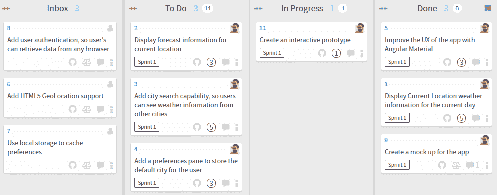

WireframePro 作为一个拖放设计界面非常直观，所以我不会详细介绍工具的工作原理，但我会强调一些技巧：

1.  创建你的项目

1.  选择一个组件包，可以是手绘 UI 或者 Material design

1.  将每个屏幕作为一个新页面添加，如下所示：

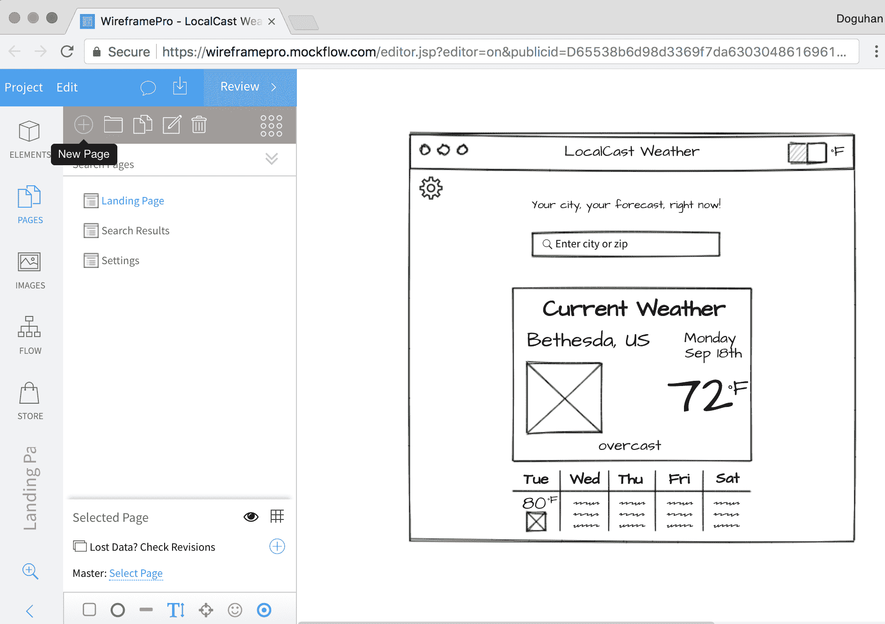MockFlow.com WireFrame Pro

我建议坚持手绘 UI 的外观和感觉，因为它能够为你的观众设定正确的期望。如果你在与客户的第一次会议上展示了一个非常高质量的模型，你的第一个演示将是一个低调的陈述。你最多只能满足期望，最坏的情况下，会让你的观众感到失望。

# 主屏幕

这是主屏幕的新模型：

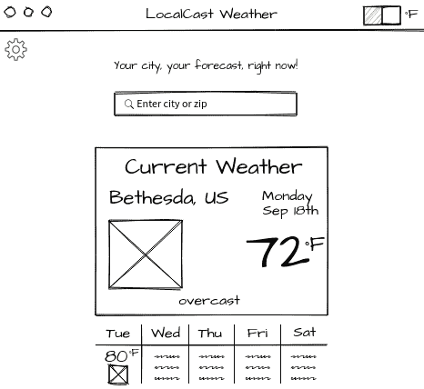LocalCast Weather Wireframe

您会注意到一些不同之处，比如应用工具栏与浏览器栏的混合以及重复元素的故意模糊。我做出这些选择是为了减少我需要在每个屏幕上花费的设计时间。我只是使用水平和垂直线对象来创建网格。

# 搜索结果

搜索屏幕同样故意保持模糊，以避免必须维护任何详细信息。令人惊讶的是，您的观众更有可能关注您的测试数据，而不是关注设计元素。

通过含糊不清，我们故意让观众的注意力集中在重要的事情上。以下是搜索屏幕的模拟：

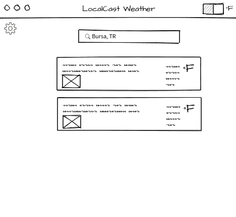LocalCast 天气搜索线框图

# 设置窗格

设置窗格是一个单独的屏幕，其中包含从主屏幕复制并应用了 85%不透明度的元素，以创建类似模型的体验。设置窗格本身只是一个带有黑色边框和纯白背景的矩形。

看一下以下的模拟：

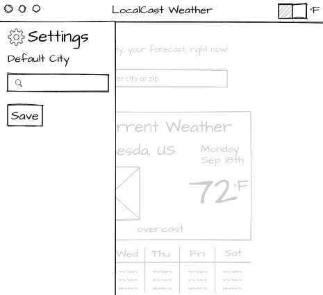LocalCast 天气设置线框图

# 添加交互性

能够点击模拟并了解导航工作流程的感觉是一个无法或缺的工具，可以获得早期用户反馈。这将为您和您的客户节省大量的沮丧、时间和金钱。

要将元素链接在一起，请按照以下步骤操作：

1.  选择主屏幕上的可点击元素，如*齿轮*图标

1.  在链接子标题下，点击选择页面

1.  在弹出窗口中，选择设置

1.  点击创建链接，如此截图所示：

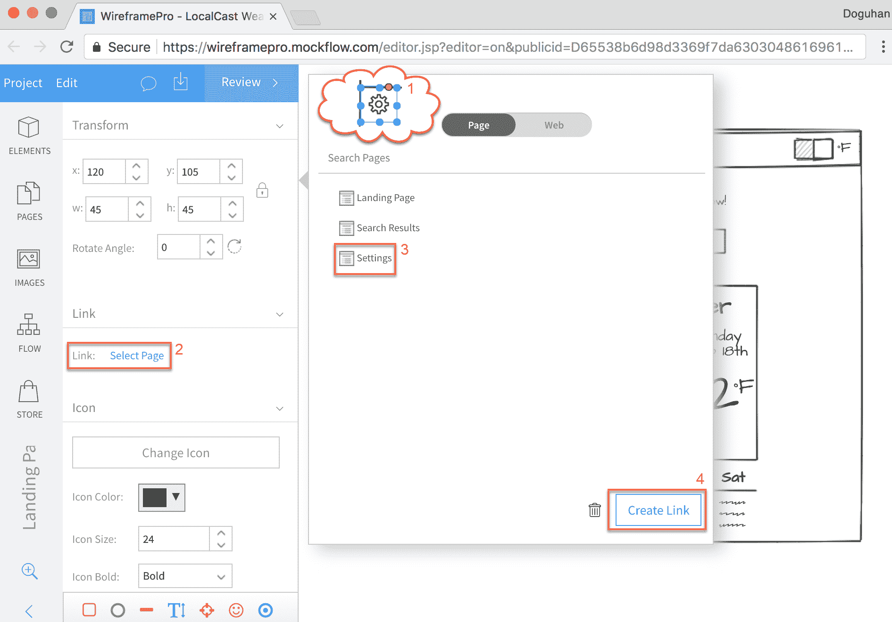WireFrame Pro - 添加链接

现在，当您点击*齿轮*图标时，工具将显示设置页面，这将在同一页面上创建侧边栏实际显示的效果。要返回主屏幕，您可以将齿轮图标和侧边栏外部的部分链接回该页面，以便用户可以来回导航。

# 导出功能原型

一旦您的原型完成，您可以将其导出为各种格式：

1.  选择导出线框图按钮，如下所示：

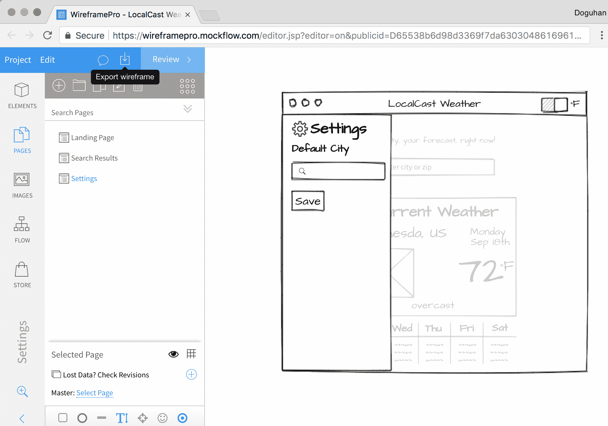WireFrame Pro - 导出线框图

1.  现在选择您的文件格式，如下所示：

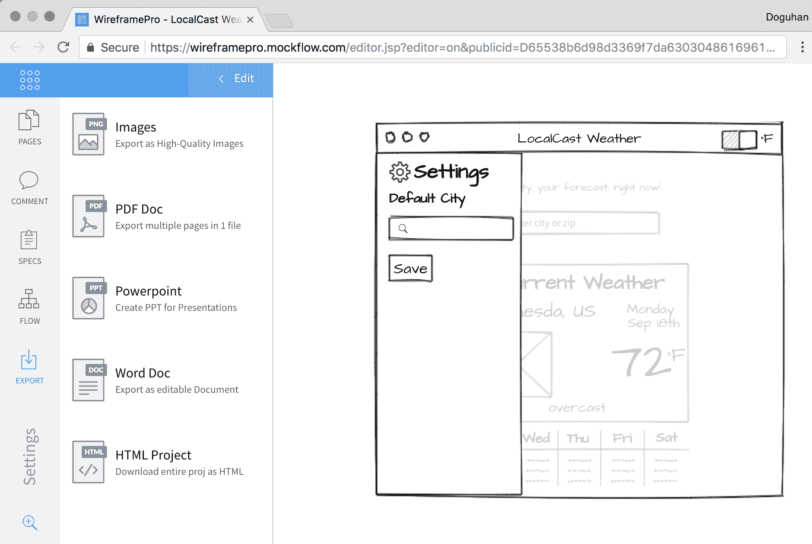WireFrame Pro - 文件格式

我更喜欢 HTML 格式，因为它更灵活；然而，您的工作流程和需求会有所不同。

1.  如果您选择了 HTML，您将获得一个 ZIP 捆绑包的所有资产。

1.  解压捆绑包并使用浏览器导航到它；您应该会得到您线框的交互版本，如图所示：

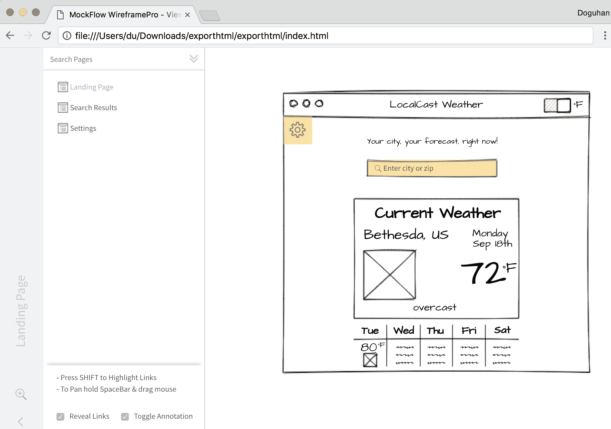WireFrame Pro - 交互式线框交互元素在以下截图中以黄色突出显示。您可以使用屏幕左下角的“显示链接”选项启用或禁用此行为。

您甚至可以使用`minimal-nginx-server`或`minimal-node-server`对原型 HTML 项目进行容器化，并使用相同的技术在 Zeit Now 上进行托管，这与第三章中讨论的准备 Angular 应用程序进行生产发布的技术完全相同。

现在将所有资产添加到 GitHub 问题的评论中，包括 ZIP 捆绑包，我们准备继续下一个任务。让我们将“添加城市搜索卡…”移动到“进行中”，如我们看板中所示：

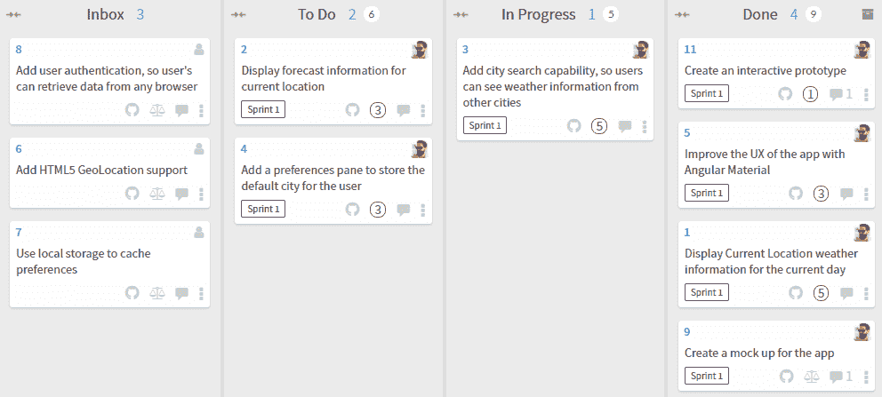Waffle.io 看板

# 使用用户输入进行搜索

现在，我们将在应用程序的主屏幕上实现搜索栏。用户故事中指出显示当前位置的天气预报信息，这可能意味着具有地理位置功能。然而，正如您可能注意到的，地理位置被列为一个单独的任务。挑战在于，使用原生平台功能如地理位置，您永远无法保证获得实际的位置信息。这可能是由于移动设备的信号丢失问题，或者用户可能拒绝分享他们的位置信息。

首先，我们必须提供良好的基线用户体验，并实现增值功能，如地理位置功能。我们将实现搜索即时输入功能，同时向用户提供反馈，如果服务无法检索到预期的数据。

最初，实现类型搜索机制可能是直观的；然而，`OpenWeatherMap`API 并没有提供这样的端点。相反，它们提供昂贵且在兆字节范围内的大量数据下载。

我们需要实现自己的应用服务器来公开这样一个端点，以便我们的应用可以有效地查询，同时使用最少量的数据。

OpenWeatherMap 的免费端点确实带来了一个有趣的挑战，其中两位数的国家代码可能会伴随城市名称或邮政编码以获得最准确的结果。这是一个很好的机会，可以为用户实现反馈机制，如果对于给定的查询返回了多个结果。

我们希望应用程序的每次迭代都是一个潜在的可发布的增量，并且避免在任何给定时间做太多事情。

我们将执行以下操作：

1.  添加 Angular 表单控件

1.  使用 Angular Material Input，如在[`material.angular.io/components/input`](https://material.angular.io/components/input)中记录的那样。

1.  将搜索栏创建为其自己的组件

1.  扩展现有的端点以接受邮政编码，并使国家代码在`weather.service`中变为可选项

1.  节流请求

# 添加 Angular 响应式表单

您可能会想为什么我们要添加 Angular 表单，因为我们只添加了一个单个输入字段，而不是具有多个输入的表单。作为一个一般的经验法则，任何时候您添加任何输入字段，它都应该包装在`<form>`标签中。`Forms`模块包含`FormControl`，它使您能够编写支持输入字段背后的后备代码，以响应用户输入，并根据需要提供适当的数据、验证或响应消息。

Angular 中有两种类型的表单：

+   **模板驱动：** 这些表单类似于您可能熟悉的 AngularJS 中的表单，其中表单逻辑主要在 HTML 模板中。我个人不喜欢这种方法，因为很难测试这些行为，而且庞大的 HTML 模板很快就难以维护。

+   **响应式：** 响应式表单的行为由控制器中编写的 TypeScript 代码驱动。这意味着您的验证逻辑可以进行单元测试，并且更好的是可以在整个应用程序中重复使用。在[`angular.io/guide/reactive-forms`](https://angular.io/guide/reactive-forms)中了解更多关于响应式表单的信息。

让我们首先将`ReactiveFormsModule`导入到我们的应用程序中：

```ts
src/app/app.module.ts
...
import { FormsModule, ReactiveFormsModule } from '@angular/forms'
...
@NgModule({
  ...
  imports: [
    ...
    FormsModule,
    ReactiveFormsModule,
    ...
```

响应式表单是使 Angular Material 团队能够编写更丰富的工具的核心技术，例如可以根据将来的 TypeScript 接口自动生成输入表单的工具。

# 添加和验证组件

我们将使用 Material 表单和输入模块创建一个`citySearch`组件：

1.  将`MatFormFieldModule`和`MatInputModule`添加到`material.module`中，以便在应用程序中可用：

```ts
src/app/material.module.ts
import {
  ...
  MatFormFieldModule,
  MatInputModule,
} from '@angular/material'
...
@NgModule({
  imports: [
    ...
    MatFormFieldModule,
    MatInputModule,
  ],
  exports: [
    ...
    MatFormFieldModule,
    MatInputModule,
  ],
})
```

我们正在添加`MatFormFieldModule`，因为每个输入字段都应该包装在`<mat-form-field>`标签中，以充分利用 Angular Material 的功能。在高层次上，`<form>`封装了键盘、屏幕阅读器和浏览器扩展用户的许多默认行为；`<mat-form-field>`实现了简单的双向数据绑定，这种技术应该适度使用，并且还允许优雅的标签、验证和错误消息显示。

1.  创建新的`citySearch`组件：

```ts
$ npx ng g c citySearch --module=app.module
```

由于我们添加了`material.module.ts`文件，`ng`无法猜测应将城市搜索功能模块添加到哪里，导致出现错误，例如*More than one module matches*。因此，我们需要使用`--module`选项提供要将`citySearch`添加到的模块。使用`--skip-import`选项跳过将组件导入到任何模块中。

1.  创建一个基本模板：

```ts
src/app/city-search/city-search.component.html
<form>
  <mat-form-field>
    <mat-icon matPrefix>search</mat-icon>
    <input matInput placeholder="Enter city or zip" aria-label="City or Zip" [formControl]="search">
  </mat-form-field>
</form>
```

1.  导入并实例化`FormControl`的实例：

```ts
src/app/city-search/city-search.component.ts
import { FormControl } from '@angular/forms'
...
export class CitySearchComponent implements OnInit {
  search = new FormControl()
  ...
```

响应式表单有三个级别的控件：

+   `FormControl`是与输入字段具有一对一关系的最基本元素

+   `FormArray`表示重复的输入字段，表示对象的集合

+   `FormGroup`用于将单独的`FormControl`或`FormArray`对象注册为您向表单添加更多输入字段时

最后，`FormBuilder`对象用于更轻松地编排和维护`FormGroup`的操作，这将在第十章中进行介绍，*Angular 应用设计和示例*。

1.  在包含`app-current-weather`的外部行的标题之间，在`app.component`中添加`app-city-search`：

```ts
src/app/app.component.ts
...
  </div>    
  <div fxLayoutAlign="center">
    <app-city-search></app-city-search>
  </div>
  <div fxLayout="row">
...
```

1.  通过在浏览器中查看应用程序来测试组件的集成，如下所示：

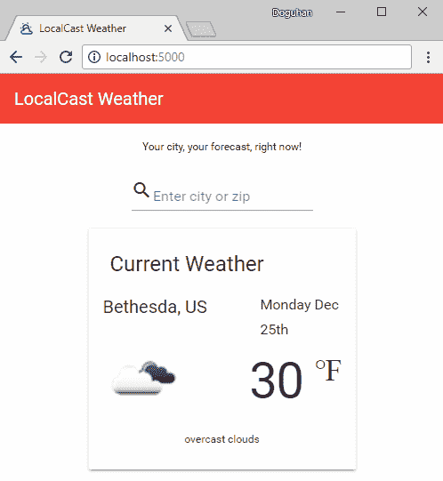带有搜索字段的 LocalWeather 应用

如果没有错误，现在我们可以开始添加`FormControl`元素并将它们连接到搜索端点。

# 向天气服务添加搜索

到目前为止，我们一直在通过名称和国家代码传递参数来获取城市的天气。通过允许用户输入邮政编码，我们必须使我们的服务更灵活，以接受两种类型的输入。

OpenWeatherMap 的 API 接受 URI 参数，因此我们可以使用 TypeScript 联合类型重构现有的`getCurrentWeather`函数，并使用类型守卫，我们可以提供不同的参数，同时保持类型检查：

1.  重构`weather.service`中的`getCurrentWeather`函数以处理邮政编码和城市输入：

```ts
app/src/weather/weather.service.ts  
  getCurrentWeather(
    search: string | number,
    country?: string
  ): Observable<ICurrentWeather> {
    let uriParams = ''
    if (typeof search === 'string') {
      uriParams = `q=${search}`
    } else {
      uriParams = `zip=${search}`
    }

    if (country) {
      uriParams = `${uriParams},${country}`
    }

    return this.getCurrentWeatherHelper(uriParams)
  }
```

我们将城市参数重命名为`search`，因为它可以是城市名称或邮政编码。然后，我们允许其类型为`string`或`number`，并根据运行时的类型，我们将使用`q`或`zip`。如果存在，我们还将`country`设置为可选，并仅在查询中追加它。

`getCurrentWeather`现在嵌入了业务逻辑，因此是单元测试的良好目标。遵循单一职责原则，从 SOLID 原则中，我们将 HTTP 调用重构为自己的函数，称为`getCurrentWeatherHelper`。

1.  将 HTTP 调用重构为`getCurrentWeatherHelper`。

在下一个示例中，请注意使用反引号字符`` ` ``而不是单引号字符`'`，它利用了允许在JavaScript中嵌入表达式的模板文字功能：

```ts
src/app/weather/weather.service.ts  
  private getCurrentWeatherHelper(uriParams: string): Observable<ICurrentWeather> {
    return this.httpClient
      .get<ICurrentWeatherData>(
        `${environment.baseUrl}api.openweathermap.org/data/2.5/weather?` +
          `${uriParams}&appid=${environment.appId}`
      )
      .pipe(map(data => this.transformToICurrentWeather(data)))
  }
```

作为积极的副作用，`getCurrentWeatherHelper` 遵循了开闭原则，因为我们可以通过提供不同的`uriParams` 来改变函数的行为，所以它对扩展是开放的，并且对修改是封闭的，因为它不需要经常被修改。

为了证明后一点，让我们实现一个新的函数，根据纬度和经度获取当前天气。

1.  实现`getCurrentWeatherByCoords`：

```ts
src/app/weather/weather.service.ts    
getCurrentWeatherByCoords(coords: Coordinates): Observable<ICurrentWeather> {
  const uriParams = `lat=${coords.latitude}&lon=${coords.longitude}`
  return this.getCurrentWeatherHelper(uriParams)
}
```

如你所见，`getCurrentWeatherHelper` 可以在不做任何修改的情况下容易地进行扩展。

1.  确保您更新`IWeatherService`和之前所做的更改保持一致。

作为遵循 SOLID 设计原则的结果，我们更容易地对流控制逻辑进行鲁棒的单元测试，最终编写出更具韧性、更便宜维护的代码。

# 实现搜索：

现在，让我们将新的服务方法与输入字段连接起来：

1.  更新`citySearch`以注入`weatherService`并订阅输入更改:

```ts
src/app/city-search/city-search.component.ts
...
export class CitySearchComponent implements OnInit {
  search = new FormControl()  
  constructor(private weatherService: WeatherService) {}
  ...
  ngOnInit() {
    this.search.valueChanges
      .subscribe(...)
  } 
```

在此时，我们将所有输入都视为`string`。用户输入可以是城市、邮政编码，或用逗号分隔的城市和国家代码，或邮政编码和国家代码。而城市或邮政编码是必需的，国家代码是可选的。我们可以使用`String.split`函数来解析任何可能的逗号分隔输入，然后使用`String.trim`去除字符串的开头和结尾的任何空格。然后，我们通过遍历它们并使用`Array.map`来确保我们去除字符串的所有部分。

然后，我们使用三元运算符`?:`来处理可选参数，只有在存在值时才传递一个值，否则将其保留为未定义。

1.  实现搜索处理程序：

```ts
src/app/city-search/city-search.component.ts
this.search.valueChanges
  .subscribe((searchValue: string) => {
    if (searchValue) {
      const userInput = searchValue.split(',').map(s => s.trim())
      this.weatherService.getCurrentWeather(
        userInput[0],
        userInput.length > 1 ? userInput[1] : undefined
      ).subscribe(data => (console.log(data)))
    }
  })
```

1.  为用户添加有关可选国家功能的提示：

```ts
src/app/city-search/city-search.component.html
...    
  <mat-form-field>
    ...
    <mat-hint>Specify country code like 'Paris, US'</mat-hint>
  </mat-form-field>
...
```

在这一点上，订阅处理程序将调用服务器并将输出记录到控制台。

观察在 Chrome Dev Tools 中如何工作。注意`search`函数运行的频率以及我们未处理服务错误的情况。

# 使用节流/防抖限制用户输入：

如此，我们在每次按键输入时都向服务器发送请求。这不是期望的行为，因为它会导致糟糕的用户体验，耗尽电池寿命，造成浪费的网络请求，并在客户端和服务器端都引起性能问题。用户可能会打错字；他们可能会改变主意，然后很少有输入的前几个字符会产生有用的结果。

我们仍然可以监听每个按键输入，但不必对每个按键输入做出反应。通过利用节流/防抖，我们可以限制生成的事件数量到一个预定的时间间隔，并依然保持输入时搜索的功能。

请注意，`throttle`和`debounce`不是功能等效的，它们的行为会因框架而异。除了节流，我们希望捕获用户输入的最后一次输入。在`lodash`框架中，throttle 函数可以实现此需求，而在`RxJS`中，debounce 可以实现。请注意，此差异可能在将来的框架更新中得到修复。

可以很容易地使用`RxJS/debounceTime`将节流注入到可观察流中。

使用`pipe`实现`debounceTime`：

```ts
src/app/city-search/city-search.component.ts
import { debounceTime } from 'rxjs/operators'

    this.search.valueChanges
      .pipe(debounceTime(1000))
      .subscribe(...)
```

`debounceTime`最多每秒运行一次搜索，但在用户停止输入后也会运行最后一次搜索。相比之下，`RxJS/throttleTime`每秒只会运行一次搜索，并不一定捕获用户输入的最后几个字符。

RxJS 还具有`throttle`和`debounce`函数，您可以使用它们来实现自定义逻辑以限制不一定是基于时间的输入。

由于这是一个时间和事件驱动的功能，不可行进行断点调试。您可以在 Chrome Dev Tools | Network 选项卡中监视网络调用，但要获得有关搜索处理程序实际被调用的次数的更实时感觉，请添加一个`console.log`语句。

在代码中使用活动的`console.log`语句并不是一个好的实践。正如第三章*为生产发布准备 Angular 应用*中介绍的，`console.log`是一种低级的调试方法。这些语句使得很难阅读实际代码，这本身就具有很高的可维护性成本。所以，无论它们是被注释掉还是不是，都不要在代码中使用`console.log`语句。

# 实现输入验证和错误消息

`FormControl`是高度可定制的。它允许您设置默认初始值，添加验证器，或在模糊、更改和提交事件上监听更改，如下所示：

```ts
example
new FormControl('Bethesda', { updateOn: 'submit' })
```

我们不会用一个值来初始化`FormControl`，但我们需要实现一个验证器来禁止一个字符的输入：

1.  从`@angular/forms`导入`Validators`：

```ts
src/app/city-search/city-search.component.ts
import { FormControl, Validators } from '@angular/forms'
```

1.  修改`FormControl`以添加最小长度验证器：

```ts
src/app/city-search/city-search.component.ts
search = new FormControl('', [Validators.minLength(2)])
```

1.  修改模板以显示验证错误消息：

```ts
src/app/city-search/city-search.component.html
...  
<form style="margin-bottom: 32px">  
  <mat-form-field>
    ...
    <mat-error *ngIf="search.invalid">
      Type more than one character to search
    </mat-error>
  </mat-form-field>
</form>
...
```

请注意增加一些额外的间距以为长度较长的错误消息腾出空间。

如果您处理不同类型的错误，模板中的`hasError`语法可能会变得重复。您可能希望实现一个更可扩展的解决方案，可以通过代码进行自定义，如下所示：

```ts
example
<mat-error *ngIf="search.invalid">{{getErrorMessage()}}</mat-error>

getErrorMessage() {
   return this.search.hasError('minLength') ? 'Type more than one character to search' : '';
}
```

1.  修改`search`函数以不使用无效输入执行搜索：

```ts
src/app/city-search/city-search.component.ts
this.search.valueChanges.pipe(debounceTime(1000)).subscribe((searchValue: string) => {
      if (!this.search.invalid) {
        ...
```

不仅仅是简单检查`searchValue`是否已定义且不是空字符串，我们可以通过调用`this.search.invalid`来利用验证引擎进行更健壮的检查。

# 通过双向绑定实现模板驱动的表单

与响应式表单相对应的是模板驱动的表单。如果您熟悉 AngularJS 中的`ng-model`，您会发现新的`ngModel`指令是其 API 兼容的替代品。

在幕后，`ngModel`实现了一个自动将自身附加到`FormGroup`的`FormControl`。`ngModel`可以在`<form>`级别或单个`<input>`级别使用。您可以在[angular.io/api/forms/NgModel](https://angular.io/api/forms/NgModel)上了解更多关于`ngModel`的信息。

在本地天气应用中，我在`app.component.ts`中包含了一个名为`app-city-search-tpldriven`的组件的注释。您可以取消`app.component`中的注释以进行实验。让我们看看替代模板实现是什么样的：

```ts
src/app/city-search-tpldriven/city-search-tpldriven.component.html
  ...
    <input matInput placeholder="Enter city or zip" aria-label="City or Zip" 
      [(ngModel)]="model.search" (ngModelChange)="doSearch($event)"
      minlength="2" name="search" #search="ngModel">
  ...
    <mat-error *ngIf="search.invalid">
      Type more than one character to search
    </mat-error>
  ...

```

注意`ngModel`与`[()]`的“香蕉箱”双向绑定语法的使用。

组件中的差异实现如下：

```ts
src/app/city-search-tpldriven/city-search-tpldriven.component.ts
import { NgModel, Validators} from '@angular/forms'
...
export class CitySearchTpldrivenComponent implements OnInit {
   model = {
    search: '',
  }
  ...
  doSearch(searchValue) {
    const userInput = searchValue.split(',').map(s => s.trim())
    this.weatherService
      .getCurrentWeather(userInput[0], userInput.length > 1 ? userInput[1] : undefined)
      .subscribe(data => console.log(data))
  }
```

正如你所看到的，大部分逻辑是在模板中实现的，程序员需要保持对模板中的内容和控制器的活跃心智模型，并在两个文件之间来回切换，以对事件处理程序和验证逻辑进行更改。

此外，我们丢失了输入限制以及在输入无效状态时阻止服务调用的能力。当然，仍然可以实现这些功能，但它们需要繁琐的解决方案，而且并不完全适合新的 Angular 语法和概念。

# 启用组件交互

为了更新当前天气信息，我们需要`city-search`组件与`current-weather`组件进行交互。在 Angular 中，有四种主要的技术来实现组件之间的交互：

+   全局事件

+   父组件监听从子组件冒泡上来的信息

+   在模块内部工作的同级、父级或子级的组件，它们基于类似的数据流

+   父组件向子组件传递信息

# 全局事件

这是从编程早期开始就一直被利用的技术。在 JavaScript 中，你可能通过全局函数委托或 jQuery 的事件系统来实现这一点。在 AngularJS 中，你可能创建了一个服务并在其中存储值。

在 Angular 中，你仍然可以创建一个根级别的服务，在其中存储值，使用 Angular 的`EventEmitter`类（实际上是为指令而设计的），或使用`rxjs/Subscription`来为自己创建一个复杂的消息总线。

作为模式，全局事件容易被滥用，而不是帮助维护一个解耦的应用架构，随着时间的推移，它会导致全局状态。全局状态甚至是在控制器级别的本地状态，函数读取和写入任何给定类的变量，都是编写可维护和可单元测试软件的头号敌人。

最终，如果你将所有应用程序数据存储或者路由所有事件都在一个服务中以启用组件交互，那么你只是在发明一个更好的捕鼠夹。这是一种应该尽量避免的反模式。在后面的章节中，您将发现本质上我们仍然会使用服务来实现组件间的交互；然而，我想指出的是在灵活的架构和全局或集中式解耦方法之间存在一个细微的界限，后者无法很好地扩展。

# 使用事件发射器的子父关系

你的子组件应该完全不知道它的父组件。这是创建可重用组件的关键。

我们可以使用 app 组件作为父元素，实现城市搜索组件和当前天气组件之间的通信，让 `app` 模块控制器来协调数据。

让我们看看这个实现会是怎样的：

1.  `city-search` 组件通过 `@Output` 属性公开了一个 `EventEmitter`：

```ts
src/app/city-search/city-search.component.ts
import { Component, Output, EventEmitter } from '@angular/core'

export class CitySearchComponent implements OnInit {
  ...
  @Output() searchEvent = new EventEmitter<string>()

  ...
  this.search.valueChanges.debounceTime(1000).subscribe((searchValue: string) => {
      if (!this.search.invalid) {
        this.searchEvent.emit(this.searchValue)
      }
    })
  ...
}
```

1.  `app` 组件使用该信息，并调用 `weatherService`，设置 `currentWeather` 变量：

```ts
src/app/app.component.ts
template: `
  ...
    <app-city-search (searchEvent)="doSearch($event)"></app-city-search>
  ...
`

export class AppComponent {
  currentWeather: ICurrenWeather
  constructor() { }

  doSearch(searchValue) {
    const userInput = searchValue.split(',').map(s => s.trim())
    this.weatherService
      .getCurrentWeather(userInput[0], userInput.length > 1 ? userInput[1] : undefined)
      .subscribe(data => this.currentWeather = data)
  }
}
```

我们已经成功地向上传递了信息，现在我们必须能够将它传递给 `current-weather` 组件。

# 使用输入绑定的父子关系

按照定义，父组件将意识到它正在使用哪些子组件。由于 `currentWeather` 属性与 `current-weather` 组件上的 `current` 属性绑定，结果传递下来并显示。这是通过创建一个 `@Input` 属性来实现的：

```ts
src/app/current-weather/current-weather.component.ts
import { Component, Input } from '@angular/core'
...
export class CurrentWeatherComponent implements OnInit {
 @Input() current: ICurrentWeather
 ...
}
```

然后你可以更新 `app` 组件，将数据绑定到 `current` 天气上：

```ts
src/app/app.component.ts
template: `
  ...
    <app-current-weather [current]="currentWeather"></app-current-weather>
  ...
`
```

这种方式可能适用于创建耦合度较高的组件或用户控件，且不需要消耗外部数据的情况。一个很好的例子就是向 `current-weather` 组件添加预测信息，如下所示：

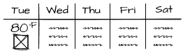天气预报线框图

每周的每一天都可以作为一个组件来实现，使用 `*ngFor` 进行重复，并且将这些信息合理地绑定到 `current-weather` 的子组件上是非常合理的：

```ts
example
<app-mini-forecast *ngFor="let dailyForecast of forecastArray     
  [forecast]="dailyForecast">
</app-mini-forecast>
```

通常，如果你在使用数据驱动的组件，父子或者子父通信模式将导致架构不够灵活，使得组件的重用或重新排列变得非常困难。考虑到不断变化的业务需求和设计，这是一个重要的教训需要牢记。

# 使用主题进行兄弟交互

组件互动的主要原因是发送或接收用户提供或从服务器接收的数据更新。在 Angular 中,你的服务公开 `RxJS.Observable` 端点,这些是数据流,你的组件可以订阅它们。`RxJS.Observer` 补充了 `RxJS.Observable` 作为 `Observable` 发出的事件的消费者。`RxJS.Subject` 将这两套功能合并到一个易于使用的对象中。您可以使用主题来描述属于特定数据集的流,比如正在显示的当前天气数据:

```ts
src/app/weather/weather.service.ts
import { Subject } from 'rxjs'
...
export class WeatherService implements IWeatherService {
   currentWeather: Subject<ICurrentWeather>
   ...
}
```

`currentWeather` 仍然是一个数据流,并不仅仅代表一个数据点。你可以通过订阅来订阅 `currentWeather` 数据的变化,或者可以按照以下方式发布对它的更改:

```ts
example
currentWeather.subscribe(data => (this.current = data))
currentWeather.next(newData)
```

`Subject` 的默认行为非常类似于通用的发布-订阅机制,比如 jQuery 事件。但是,在组件以不可预知的方式加载或卸载的异步世界中,使用默认的 `Subject` 并不是很有用。

有三种不同类型的 Subject:

+   `ReplaySubject`: 它将记住和缓存数据流中发生的所有数据点,以便订阅者可以在任何给定时间重放所有事件

+   `BehaviorSubject`: 它只记住最后一个数据点,同时继续监听新的数据点

+   `AsyncSubject`: 这是一次性事件,不希望再次发生

`ReplaySubject` 可能会对您的应用程序造成严重的内存和性能影响,所以应该谨慎使用。在 `current-weather` 的情况下,我们只对显示最新收到的天气数据感兴趣,但通过用户输入或其他事件,我们可以接收新数据,因此我们可以保持 `current-weather` 组件最新。 `BehaviorSubject` 将是满足这些需求的合适机制:

1.  在 `weatherService` 中定义 `BehaviorSubject` 并设置默认值:

```ts
app/src/weather/weather.service.ts
import { BehaviorSubject } from 'rxjs'
...
export class WeatherService implements IWeatherService {
  currentWeather = new BehaviorSubject<ICurrentWeather>({
    city: '--',
    country: '--',
    date: Date.now(),
    image: '',
    temperature: 0,
    description: '',
  })
  ...
}
```

1.  将 `current-weather` 组件更新为订阅新的 `BehaviorSubject`:

```ts
app/src/current-weather/current-weather.component.ts
...  
ngOnInit() {
  this.weatherService.currentWeather.subscribe(data => (this.current = data))
}
...
```

1.  将 `city-search` 组件更新为发布其接收到的数据到 `BehaviorSubject`:

```ts
app/src/city-search/city-search.component.ts
... 
this.weatherService
  .getCurrentWeather(
    userInput[0],
    userInput.length > 1 ? userInput[1] : undefined
  )
  .subscribe(data => this.weatherService.currentWeather.next(data))
...
```

1.  在浏览器中测试您的应用程序；它应该如下所示：

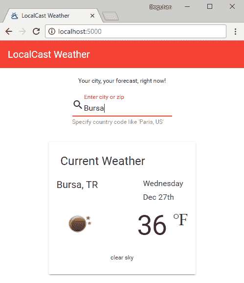土耳其布尔萨的天气信息

当您输入一个新的城市时，组件应该更新为该城市的当前天气信息。

在应用程序首次加载时，默认体验看起来有些问题。至少有两种不同的处理方式。首先是在`app`组件级别隐藏整个组件，如果没有数据显示。为了使其工作，我们将不得不将`weatherService`注入到`app`组件中，最终导致不太灵活的解决方案。另一种方法是能够更好地处理`current-weather`组件中缺少的数据。

为了使应用程序更好，您可以在应用程序启动时实现地理位置功能，以获取用户当前位置的天气。您还可以利用`window.localStorage`来存储上次显示的城市或从`window.geolocation`在初始启动时检索的上次位置。

在继续之前，不要忘记执行`npm test`和`npm run e2e`。读者可以自行修复单元测试和端到端测试。

# 摘要

这一章完成了我们对本地天气应用程序的工作。我们可以将`城市搜索`功能任务移动到`完成`列，如我们看板中所示：

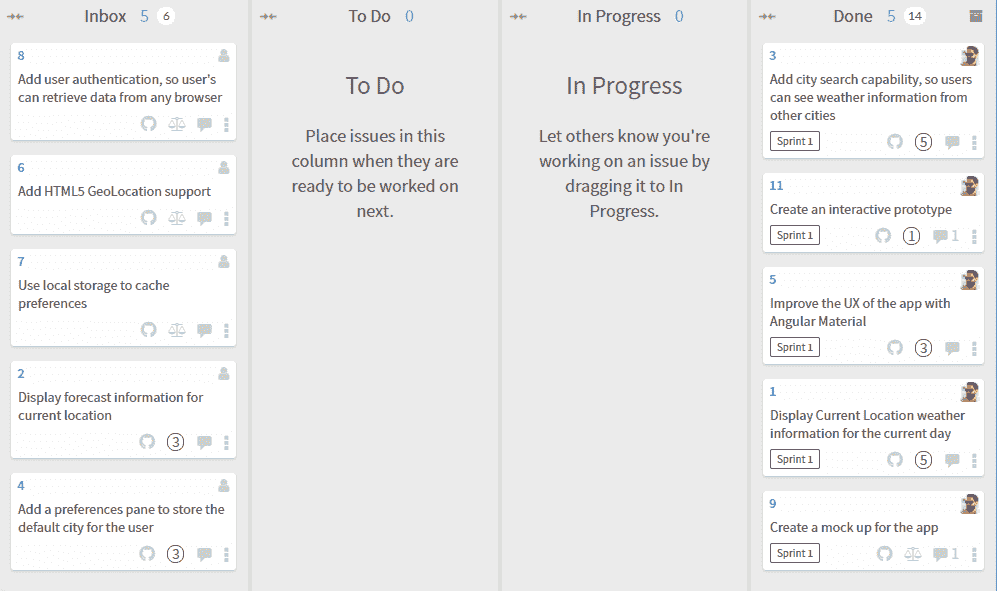Waffle.io 看板状态

在本章中，您学会了如何创建一个交互式原型，而不需要编写一行代码。然后，您使用`MatInput`、验证器、响应式表单和数据流驱动处理程序创建了一个搜索即时响应的功能。您还了解了不同的策略来实现组件间的交互和数据共享。最后，您了解了双向绑定和基于模板的表单。

LocalCast Weather 是一个简单的应用程序，我们用它来介绍 Angular 的基本概念。正如您所见，Angular 非常适合构建这样的小型和动态应用程序，同时向最终用户提供最少量的框架代码。您应该考虑利用 Angular 甚至用于快速而简单的项目，这在构建更大型的应用程序时也是一个很好的实践。在下一章中，您将使用路由器优先的方法来创建一个更复杂的**业务线**（**LOB**）应用程序，设计和构建可扩展的 Angular 应用程序，其中包括一流的身份验证和授权、用户体验以及涵盖大多数 LOB 应用程序需求的众多技巧。
