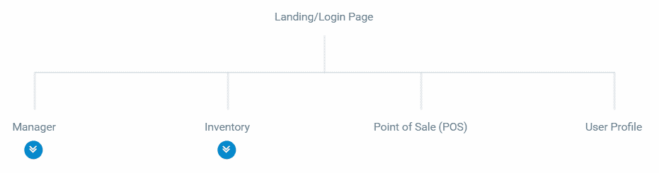

# 第七章：创建一个路由优先的业务应用

业务应用（LOB）是软件开发世界的基础。根据维基百科的定义，LOB 是一个通用术语，指的是为特定客户交易或业务需求提供产品或一组相关产品。LOB 应用程序提供了展示各种功能和功能的良好机会，而无需涉及大型企业应用程序通常需要的扭曲或专业化场景。在某种意义上，它们是 80-20 的学习经验。然而，我必须指出有关 LOB 应用程序的一个奇怪之处——如果您最终构建了一个半有用的 LOB 应用程序，对它的需求将不受控制地增长，您很快就会成为自己成功的受害者。这就是为什么您应该把每个新项目的开始视为一个机会，一个编码的机会，以便更好地创建更灵活的架构。

在本章和其余章节中，我们将建立一个具有丰富功能的新应用程序，可以满足可扩展架构和工程最佳实践的 LOB 应用程序的需求，这将帮助您在有需求时快速启动并迅速扩展解决方案。我们将遵循路由优先的设计模式，依赖可重用的组件来创建一个名为 LemonMart 的杂货店 LOB。

在本章中，您将学会以下内容：

+   有效使用 CLI 创建主要的 Angular 组件和 CLI 脚手架

+   学习如何构建路由优先应用

+   品牌、自定义和材料图标

+   使用 Augury 调试复杂的应用程序

+   启用延迟加载

+   创建一个基本框架

本书提供的代码示例需要 Angular 版本 5 和 6。Angular 5 代码与 Angular 6 兼容。Angular 6 将在 LTS 中得到支持，直到 2019 年 10 月。代码存储库的最新版本可以在以下网址找到：

+   对于第 2 到 6 章，LocalCast Weather 在 [Github.com/duluca/local-weather-app](https://github.com/duluca/local-weather-app)

+   对于第 7 到 12 章，LemonMart 在 [Github.com/duluca/lemon-mart](https://github.com/duluca/lemon-mart)

# Angular 技巧表

在我们深入创建 LOB 应用程序之前，我为您提供了一个速查表，让您熟悉常见的 Angular 语法和 CLI 命令，因为在接下来的过程中，这些语法和命令将被使用，而不会明确解释它们的目的。花些时间来审查和熟悉新的 Angular 语法、主要组件、CLI 脚手架和常见管道。如果您的背景是 AngularJS，您可能会发现这个列表特别有用，因为您需要放弃一些旧的语法。

# 绑定

绑定，或数据绑定，指的是代码中变量与 HTML 模板或其他组件中显示或输入的值之间的自动单向或双向连接：

| **类型** | **语法** | **数据方向** |
| --- | --- | --- |

| 插值属性

属性

类

样式 | `{{expression}}``[target]="expression"``bind-target="expression"` | 从数据源单向

到视图目标 |

事件 | `(目标)="语句"` `on-目标="语句"` | 从视图目标单向

到数据源 |

| 双向 | `[(target)]="expression"` `bindon-target="expression"` | 双向 |
| --- | --- | --- |

来源：[`angular.io/guide/template-syntax#binding-syntax-an-overview`](https://angular.io/guide/template-syntax#binding-syntax-an-overview)

# 内置指令

指令封装了可以作为属性应用到 HTML 元素或其他组件的编码行为：

| **名称** | **语法** | **目的** |
| --- | --- | --- |
| 结构指令 | `*ngIf``*ngFor``*ngSwitch` | 控制 HTML 的结构布局，以及元素是否从 DOM 中添加或移除 |
| 属性指令 | `[class]``[style]``[(model)]` | 监听并修改其他 HTML 元素、属性、属性和组件的行为，如 CSS 类、HTML 样式和 HTML 表单元素 |

结构指令来源：[`angular.io/guide/structural-directives`](https://angular.io/guide/structural-directives)

属性指令来源：[`angular.io/guide/template-syntax#built-in-attribute-directives`](https://angular.io/guide/template-syntax#built-in-attribute-directives)

# 常见管道

管道修改了数据绑定值在 HTML 模板中的显示方式。

| **名称** | **目的** | **用法** |
| --- | --- | --- |
| 日期 | 根据区域设置规则格式化日期 | `{{date_value &#124; date[:format]}}` |
| 文本转换 | 将文本转换为大写、小写或标题大小写 | `{{value &#124; uppercase}}``{{value &#124; lowercase}}``{{value &#124; titlecase }}` |
| 小数 | 根据区域规则，将数字格式化 | `{{number &#124; number[:digitInfo]}}` |
| 百分比 | 根据区域规则，将数字格式化为百分比 | `{{number &#124; percent[:digitInfo]}}` |
| 货币 | 根据区域规则，将数字格式化为带有货币代码和符号的货币 | `{{number &#124; currency[:currencyCode [:symbolDisplay[:digitInfo]]]}}` |

管道来源：[`angular.io/guide/pipes`](https://angular.io/guide/pipes)

# 启动命令，主要组件和 CLI 脚手架

启动命令帮助生成新项目或添加依赖项。Angular CLI 命令帮助创建主要组件，通过自动生成样板脚手架代码来轻松完成。有关完整命令列表，请访问[`github.com/angular/angular-cli/wiki`](https://github.com/angular/angular-cli/wiki)：

| **名称** | **目的** | **CLI 命令** |
| --- | --- | --- |
| 新建 | 创建一个新的 Angular 应用程序，并初始化 git 存储库，配置好 package.json 和路由。从父文件夹运行。 | `npx @angular/cli new project-name --routing` |
| 更新 | 更新 Angular，RxJS 和 Angular Material 依赖项。如有必要，重写代码以保持兼容性。 | `npx ng update` |
| 添加材料 | 安装和配置 Angular Material 依赖项。 | `npx ng add @angular/material` |
| 模块 | 创建一个新的`@NgModule`类。使用`--routing`来为子模块添加路由。可选地，使用`--module`将新模块导入到父模块中。 | `ng g module new-module` |
| 组件 | 创建一个新的`@Component`类。使用`--module`来指定父模块。可选地，使用`--flat`来跳过目录创建，`-t`用于内联模板，和`-s`用于内联样式。 | `ng g component new-component` |
| 指令 | 创建一个新的`@Directive`类。可选地，使用`--module`来为给定子模块范围内的指令。 | `ng g directive new-directive` |
| 管道 | 创建一个新的`@Pipe`类。可选地，使用`--module`来为给定子模块范围内的管道。 | `ng g pipe new-pipe` |
| 服务 | 创建一个新的`@Injectable`类。使用`--module`为给定子模块提供服务。服务不会自动导入到模块中。可选地使用`--flat` false 在目录下创建服务。 | `ng g service new-service` |
| Guard | 创建一个新的`@Injectable`类，实现路由生命周期钩子`CanActivate`。使用`--module`为给定的子模块提供守卫。守卫不会自动导入到模块中。 | `ng g guard new-guard` |
| Class | 创建一个简单的类。 | `ng g class new-class` |
| Interface | 创建一个简单的接口。 | `ng g interface new-interface` |
| Enum | 创建一个简单的枚举。 | `ng g enum new-enum` |

为了正确地为自定义模块下列出的一些组件进行脚手架搭建，比如`my-module`，你可以在你打算生成的名称前面加上模块名称，例如`ng g c my-module/my-new-component`。Angular CLI 将正确地连接并将新组件放置在`my-module`文件夹下。

# 配置 Angular CLI 自动完成

在使用 Angular CLI 时，您将获得自动完成的体验。执行适合您的`*nix`环境的适当命令：

+   对于 bash shell：

```ts
$ ng completion --bash >> ~/.bashrc
$ source ~/.bashrc
```

+   对于 zsh shell：

```ts
$ ng completion --zsh >> ~/.zshrc
$ source ~/.zshrc
```

+   对于使用 git bash shell 的 Windows 用户：

```ts
$ ng completion --bash >> ~/.bash_profile
$ source ~/.bash_profile
```

# 路由器优先架构

Angular 路由器，打包在`@angular/router`包中，是构建**单页应用程序**（**SPAs**）的中心和关键部分，它的行为和操作方式类似于普通网站，可以使用浏览器控件或缩放或微缩放控件轻松导航。

Angular 路由器具有高级功能，如延迟加载、路由器出口、辅助路由、智能活动链接跟踪，并且可以表达为`href`，这使得使用 RxJS `SubjectBehavior`的无状态数据驱动组件的高度灵活的路由器优先应用程序架构成为可能。

大型团队可以针对单一代码库进行工作，每个团队负责一个模块的开发，而不会互相干扰，同时实现简单的持续集成。谷歌之所以选择针对数十亿行代码进行单一代码库的工作，是有很好的原因的。事后的集成非常昂贵。

小团队可以随时重新调整他们的 UI 布局，以快速响应变化，而无需重新设计他们的代码。很容易低估由于布局或导航的后期更改而浪费的时间。这样的变化对于大型团队来说更容易吸收，但对于小团队来说是一项昂贵的努力。

通过延迟加载，所有开发人员都可以从次秒级的首次有意义的绘制中受益，因为在构建时将传递给浏览器的核心用户体验文件大小保持在最低限度。模块的大小影响下载和加载速度，因为浏览器需要做的越多，用户看到应用程序的第一个屏幕就需要的时间就越长。通过定义延迟加载的模块，每个模块都可以打包为单独的文件，可以根据需要单独下载和加载。智能活动链接跟踪可以提供卓越的开发人员和用户体验，非常容易实现突出显示功能，以指示用户当前活动的选项卡或应用程序部分。辅助路由最大化了组件的重用，并帮助轻松实现复杂的状态转换。通过辅助路由，您可以仅使用单个外部模板呈现多个主视图和详细视图。您还可以控制路由在浏览器的 URL 栏中向用户显示的方式，并使用`routerLink`在模板中和`Router.navigate`在代码中组合路由，驱动复杂的场景。

为了实现一个以路由为先的实现，您需要这样做：

1.  早期定义用户角色

1.  设计时考虑延迟加载

1.  实现一个骨架导航体验

1.  围绕主要数据组件进行设计

1.  执行一个解耦的组件架构

1.  区分用户控件和组件

1.  最大化代码重用

用户角色通常表示用户的工作职能，例如经理或数据录入专员。在技术术语中，它们可以被视为特定类别用户被允许执行的一组操作。定义用户角色有助于识别可以配置为延迟加载的子模块。毕竟，数据录入专员永远不会看到经理可以看到的大多数屏幕，那么为什么要将这些资产传递给这些用户并减慢他们的体验呢？延迟加载在创建可扩展的应用程序架构方面至关重要，不仅从应用程序的角度来看，而且从高质量和高效的开发角度来看。配置延迟加载可能会很棘手，这就是为什么及早确定骨架导航体验非常重要的原因。

识别用户将使用的主要数据组件，例如发票或人员对象，将帮助您避免过度设计您的应用程序。围绕主要数据组件进行设计将在早期确定 API 设计，并帮助定义`BehaviorSubject`数据锚点，以实现无状态、数据驱动的设计，确保解耦的组件架构，详见第六章，*响应式表单和组件交互*。

最后，识别封装了您希望为应用程序创建的独特行为的自包含用户控件。用户控件可能会被创建为具有数据绑定属性和紧密耦合的控制器逻辑和模板的指令或组件。另一方面，组件将利用路由器生命周期事件来解析参数并对数据执行 CRUD 操作。在早期识别这些组件重用将导致创建更灵活的组件，可以在路由器协调下在多个上下文中重用，最大程度地实现代码重用。

# 创建 LemonMart

LemonMart 将是一个中型的业务应用程序，拥有超过 90 个代码文件。我们将从创建一个新的 Angular 应用程序开始，其中包括路由和 Angular Material 的配置。

# 创建一个以路由为先的应用程序

采用以路由为先的方法，我们将希望在应用程序早期启用路由：

1.  您可以通过执行以下命令创建已经配置了路由的新应用程序：

确保未全局安装`@angular/cli`，否则可能会遇到错误：

```ts
$ npx @angular/cli new lemon-mart --routing
```

1.  一个新的`AppRoutingModule`文件已经为我们创建了：

```ts
src/app/app-routing.modules.ts
import { NgModule } from '@angular/core';
import { Routes, RouterModule } from '@angular/router';

const routes: Routes = [];

@NgModule({
  imports: [RouterModule.forRoot(routes)],
  exports: [RouterModule]
})
export class AppRoutingModule { }
```

我们将在 routes 数组中定义路由。请注意，routes 数组被传入以配置为应用程序的根路由，默认的根路由为`/`。

在配置您的`RouterModule`时，您可以传入其他选项来自定义路由器的默认行为，例如当您尝试加载已经显示的路由时，而不是不采取任何操作，您可以强制重新加载组件。要启用此行为，请创建您的路由器如下：`RouterModule.forRoot(routes, { onSameUrlNavigation: 'reload' })`。

1.  最后，`AppRoutingModule`被注册到`AppModule`中，如下所示：

```ts
src/app/app.module.ts ...
import { AppRoutingModule } from './app-routing.module';

@NgModule({
  ...
  imports: [
    AppRoutingModule 
    ...
  ],
  ...
```

# 配置 Angular.json 和 Package.json

以下是第 2-6 章中涵盖的配置步骤的快速摘要。如果您对某个步骤不熟悉，请参考之前的章节。在继续之前，您应该完成这些步骤：

1.  修改`angular.json`和`tslint.json`以强制执行您的设置和编码标准。

1.  安装`npm i -D prettier`

1.  将`prettier`设置添加到`package.json`

1.  将开发服务器端口配置为除`4200`之外的其他端口，例如`5000`

1.  添加`standardize`脚本并更新`start`和`build`脚本

1.  为 Docker 添加 npm 脚本到`package.json`

1.  建立开发规范并在项目中记录，`npm i -D dev-norms`然后`npx dev-norms create`

1.  如果您使用 VS Code，请设置`extensions.json`和`settings.json`文件

您可以配置 TypeScript Hero 扩展以自动组织和修剪导入语句，只需将`"typescriptHero.imports.organizeOnSave": true`添加到`settings.json`中。如果与设置`"files.autoSave": "onFocusChange"`结合使用，您可能会发现该工具在您尝试输入时会积极清除未使用的导入。确保此设置适用于您，并且不会与任何其他工具或 VS Code 自己的导入组织功能发生冲突。

1.  执行`npm run standardize`

参考第三章，*为生产发布准备 Angular 应用*，以获取更多配置细节。

您可以在[bit.ly/npmScriptsForDocker](http://bit.ly/npmScriptsForDocker)获取 Docker 的 npm 脚本，以及在[bit.ly/npmScriptsForAWS](http://bit.ly/npmScriptsForAWS)获取 AWS 的 npm 脚本。

# 配置 Material 和样式

我们还需要设置 Angular Material 并配置要使用的主题，如第五章中所述，*使用 Angular Material 增强 Angular 应用*：

1.  安装 Angular Material：

```ts
$ npx ng add @angular/material
$ npm i @angular/flex-layout hammerjs 
$ npx ng g m material --flat -m app
```

1.  导入和导出`MatButtonModule`，`MatToolbarModule`和`MatIconModule`

1.  配置默认主题并注册其他 Angular 依赖项

1.  将通用 css 添加到`styles.css`中，如下所示，

```ts
src/styles.css

body {
  margin: 0;
}

.margin-top {
  margin-top: 16px;
}

.horizontal-padding {
  margin-left: 16px;
  margin-right: 16px;
}

.flex-spacer {
  flex: 1 1 auto;
}
```

有关更多配置详细信息，请参阅第五章，*使用 Angular Material 增强 Angular 应用*。

# 设计 LemonMart

在构建从数据库到前端的基本路线图的同时，避免过度工程化非常重要。这个初始设计阶段对项目的长期健康和成功至关重要，团队之间任何现有的隔离必须被打破，并且整体技术愿景必须被团队的所有成员充分理解。这并不是说起来容易做起来难，关于这个话题已经有大量的书籍写成。

在工程领域，没有一个问题有唯一正确的答案，因此重要的是要记住没有一个人可以拥有所有答案，也没有一个人可以有清晰的愿景。技术和非技术领导者之间创造一个安全的空间，提供开放讨论和实验的机会是文化的一部分，这一点非常重要。能够在团队中面对这种不确定性所带来的谦卑和同理心与任何单个团队成员的技术能力一样重要。每个团队成员都必须习惯于把自己的自我放在一边，因为我们的集体目标将是在开发周期内发展和演变应用程序以适应不断变化的需求。如果你能够知道你已经成功了，那么你所创建的软件的各个部分都可以很容易地被任何人替换。

# 确定用户角色

我们设计的第一步是考虑您使用应用程序的原因。

我们为 LemonMart 设想了四种用户状态或角色：

+   认证用户，任何经过认证的用户都可以访问他们的个人资料

+   收银员，其唯一角色是为客户结账。

+   店员，其唯一角色是执行与库存相关的功能

+   经理，可以执行收银员和店员可以执行的所有操作，但也可以访问管理功能

有了这个想法，我们可以开始设计我们应用程序的高级设计。

# 使用站点地图确定高级模块

制作应用程序的高级站点地图，如下所示：

用户的登陆页面我使用了 MockFlow.com 的 SiteMap 工具来创建站点地图

显示在[`sitemap.mockflow.com`](https://sitemap.mockflow.com)。

在首次检查时，三个高级模块出现为延迟加载的候选项：

1.  销售点（POS）

1.  库存

1.  经理

收银员只能访问 POS 模块和组件。店员只能访问库存模块，其中包括库存录入、产品和类别管理组件的额外屏幕。

库存页面

最后，管理者将能够通过管理模块访问所有三个模块，包括用户管理和收据查找组件。

管理页面

启用所有三个模块的延迟加载有很大好处，因为收银员和店员永远不会使用属于其他用户角色的组件，所以没有理由将这些字节发送到他们的设备上。这意味着当管理模块获得更多高级报告功能或新角色添加到应用程序时，POS 模块不会受到应用程序增长的带宽和内存影响。这意味着更少的支持电话，并且在同一硬件上保持一致的性能更长的时间。

# 生成启用路由的模块

现在我们已经定义了高级组件作为管理者、库存和 POS，我们可以将它们定义为模块。这些模块将与您迄今为止创建的模块不同，用于路由和 Angular Material。我们可以将用户配置文件创建为应用程序模块上的一个组件；但是，请注意，用户配置文件只会用于已经经过身份验证的用户，因此定义一个专门用于一般经过身份验证用户的第四个模块是有意义的。这样，您将确保您的应用程序的第一个有效载荷保持尽可能小。此外，我们将创建一个主页组件，用于包含我们应用程序的着陆体验，以便我们可以将实现细节从`app.component`中排除出去：

1.  生成`manager`，`inventory`，`pos`和`user`模块，指定它们的目标模块和路由功能：

```ts
$ npx ng g m manager -m app --routing
$ npx ng g m inventory -m app --routing
$ npx ng g m pos -m app --routing
$ npx ng g m user -m app --routing
```

如第一章中所讨论的*设置您的开发环境*，如果您已经配置`npx`自动识别`ng`作为命令，您可以节省更多按键，这样您就不必每次都添加`npx`到您的命令中。不要全局安装`@angular/cli`。请注意缩写命令结构，其中`ng generate module manager`变成`ng g m manager`，同样，`--module`变成了`-m`。

1.  验证您是否没有 CLI 错误。

请注意，在 Windows 上使用`npx`可能会遇到错误，例如路径必须是字符串。收到未定义。这个错误似乎对命令的成功操作没有任何影响，这就是为什么始终要检查 CLI 工具生成的内容是至关重要的。

1.  验证文件夹和文件是否已创建：

```ts
/src/app
│   app-routing.module.ts
│   app.component.css
│   app.component.html
│   app.component.spec.ts
│   app.component.ts
│   app.module.ts
│   material.module.ts
├───inventory
│        inventory-routing.module.ts
│        inventory.module.ts
├───manager
│        manager-routing.module.ts
│        manager.module.ts
├───pos
│        pos-routing.module.ts
│        pos.module.ts
└───user
        user-routing.module.ts
        user.module.ts
```

1.  检查`ManagerModule`的连接方式。

子模块实现了类似于`app.module`的`@NgModule`。最大的区别是子模块不实现`bootstrap`属性，这是你的根模块所需的，用于初始化你的 Angular 应用程序：

```ts
src/app/manager/manager.module.ts
import { NgModule } from '@angular/core'
import { CommonModule } from '@angular/common'

import { ManagerRoutingModule } from './manager-routing.module'

@NgModule({
  imports: [CommonModule, ManagerRoutingModule],
  declarations: [],
```

```ts
})
export class ManagerModule {}
```

由于我们指定了`-m`选项，该模块已被导入到`app.module`中：

```ts
src/app/app.module.ts
...
import { ManagerModule } from './manager/manager.module'
...
@NgModule({
  ...
  imports: [
    ...
    ManagerModule 
  ],
...
```

此外，因为我们还指定了`--routing`选项，一个路由模块已经被创建并导入到`ManagerModule`中：

```ts
src/app/manager/manager-routing.module.ts
import { NgModule } from '@angular/core'
import { Routes, RouterModule } from '@angular/router'

const routes: Routes = []

@NgModule({
  imports: [RouterModule.forChild(routes)],
  exports: [RouterModule],
})
export class ManagerRoutingModule {}
```

请注意，`RouterModule`正在使用`forChild`进行配置，而不是`forRoot`，这是`AppRouting`模块的情况。这样，路由器就能理解在不同模块上下文中定义的路由之间的正确关系，并且可以在这个例子中正确地在所有子路由前面添加`/manager`。

CLI 不尊重你的`tslint.json`设置。如果你已经正确配置了 VS Code 环境并使用 prettier，你的代码样式偏好将在你每个文件上工作时应用，或者在全局运行 prettier 命令时应用。

# 设计 home 路由

考虑以下模拟作为 LemonMart 的登陆体验：

LemonMart 登陆体验

与`LocalCastWeather`应用程序不同，我们不希望所有这些标记都在`App`组件中。`App`组件是整个应用程序的根元素；因此，它应该只包含将在整个应用程序中持续出现的元素。在下面的注释模拟中，标记为 1 的工具栏将在整个应用程序中持续存在。

标记为 2 的区域将容纳 home 组件，它本身将包含一个登录用户控件，标记为 3：

LemonMart 布局结构

在 Angular 中，将默认或登陆组件创建为单独的元素是最佳实践。这有助于减少必须加载的代码量和在每个页面上执行的逻辑，但在利用路由器时也会导致更灵活的架构：

使用内联模板和样式生成`home`组件：

```ts
$ npx ng g c home -m app --inline-template --inline-style
```

现在，你已经准备好配置路由器了。

# 设置默认路由

让我们开始为 LemonMart 设置一个简单的路由：

1.  配置你的`home`路由：

```ts
src/app/app-routing.module.ts 
...
const routes: Routes = [
  { path: '', redirectTo: '/home', pathMatch: 'full' },
  { path: 'home', component: HomeComponent },
]
...
```

我们首先为`'home'`定义一个路径，并通过设置组件属性来告知路由渲染`HomeComponent`。然后，我们将应用的默认路径`''`重定向到`'/home'`。通过设置`pathMatch`属性，我们始终确保主页路由的这个非常特定的实例将作为着陆体验呈现。

1.  创建一个带有内联模板的`pageNotFound`组件

1.  为`PageNotFoundComponent`配置通配符路由：

```ts
src/app/app-routing.module.ts 
...
const routes: Routes = [
  ...
  { path: '**', component: PageNotFoundComponent }
]
...
```

这样，任何未匹配的路由都将被重定向到`PageNotFoundComponent`。

# RouterLink

当用户登陆到`PageNotFoundComponent`时，我们希望他们通过`RouterLink`重定向到`HomeComponent`：

1.  实现一个内联模板，使用`routerLink`链接回主页：

```ts
src/app/page-not-found/page-not-found.component.ts
...
template: `
    <p>
      This page doesn't exist. Go back to <a routerLink="/home">home</a>.
    </p>
  `,
...
```

这种导航也可以通过`<a href>`标签实现；然而，在更动态和复杂的导航场景中，您将失去诸如自动活动链接跟踪或动态链接生成等功能。

Angular 的引导过程将确保`AppComponent`在您的`index.html`中的`<app-root>`元素内。然而，我们必须手动定义我们希望`HomeComponent`呈现的位置，以完成路由器配置。

# 路由出口

`AppComponent`被视为在`app-routing.module`中定义的根路由的根元素，这使我们能够在此根元素内定义 outlets，以使用`<router-outlet>`元素动态加载任何我们希望的内容：

1.  配置`AppComponent`以使用内联模板和样式

1.  为您的应用程序添加工具栏

1.  将您的应用程序名称作为按钮链接添加，以便在点击时将用户带到主页

1.  添加`<router-outlet>`以渲染内容：

```ts
src/app/app.component.ts
...
template: `
    <mat-toolbar color="primary">
      <a mat-button routerLink="/home"><h1>LemonMart</h1></a>
    </mat-toolbar>
    <router-outlet></router-outlet>
  `,
```

现在，主页的内容将在`<router-outlet>`内呈现。

# 品牌、自定义和 Material 图标

为了构建一个吸引人且直观的工具栏，我们必须向应用引入一些图标和品牌，以便用户可以通过熟悉的图标轻松浏览应用。

# 品牌

在品牌方面，您应该确保您的 Web 应用程序具有自定义色板，并与桌面和移动浏览器功能集成，以展示您应用的名称和图标。

# 色板

使用 Material Color 工具选择一个色板，如第五章中所讨论的，*使用 Angular Material 增强 Angular 应用*。这是我为 LemonMart 选择的色板：

```ts
https://material.io/color/#!/?view.left=0&view.right=0&primary.color=2E7D32&secondary.color=C6FF00
```

# 实现浏览器清单和图标

您需要确保浏览器在浏览器选项卡中显示正确的标题文本和图标。此外，应创建一个清单文件，为各种移动操作系统实现特定的图标，以便用户将您的网站固定在手机上时，会显示一个理想的图标，类似于手机上的其他应用图标。这将确保如果用户将您的 Web 应用添加到其移动设备的主屏幕上，他们将获得一个本地外观的应用图标：

1.  从设计师或网站（如[`www.flaticon.com`](https://www.flaticon.com)）获取您网站标志的 SVG 版本

1.  在这种情况下，我将使用一个特定的柠檬图片：

 LemonMart 的标志性标志在使用互联网上找到的图像时，请注意适用的版权。在这种情况下，我已经购买了许可证以便发布这个柠檬标志，但是您可以在以下网址获取您自己的副本，前提是您提供图像作者所需的归属声明：[`www.flaticon.com/free-icon/lemon_605070`](https://www.flaticon.com/free-icon/lemon_605070)。

1.  使用[`realfavicongenerator.net`](https://realfavicongenerator.net)等工具生成`favicon.ico`和清单文件

1.  根据您的喜好调整 iOS、Android、Windows Phone、macOS 和 Safari 的设置

1.  确保设置一个版本号，favicons 可能会因缓存而臭名昭著；一个随机的版本号将确保用户始终获得最新版本

1.  下载并提取生成的`favicons.zip`文件到您的`src`文件夹中。

1.  编辑`angular.json`文件以在您的应用程序中包含新的资产：

```ts
angular.json   
"apps": [
  {
    ...
      "assets": [
        "src/assets",
        "src/favicon.ico",
        "src/android-chrome-192x192.png",
        "src/favicon-16x16.png",
        "src/mstile-310x150.png",
        "src/android-chrome-512x512.png",
        "src/favicon-32x32.png",
        "src/mstile-310x310.png",
        "src/apple-touch-icon.png",
        "src/manifest.json",
        "src/mstile-70x70.png",
        "src/browserconfig.xml",
        "src/mstile-144x144.png",
        "src/safari-pinned-tab.svg",
        "src/mstile-150x150.png"
      ]
```

1.  将生成的代码插入到`index.html`的`<head>`部分中：

```ts
src/index.html
<link rel="apple-touch-icon" sizes="180x180" href="/apple-touch-icon.png?v=rMlKOnvxlK">
<link rel="icon" type="image/png" sizes="32x32" href="/favicon-32x32.png?v=rMlKOnvxlK">
<link rel="icon" type="image/png" sizes="16x16" href="/favicon-16x16.png?v=rMlKOnvxlK">
<link rel="manifest" href="/manifest.json?v=rMlKOnvxlK">
<link rel="mask-icon" href="/safari-pinned-tab.svg?v=rMlKOnvxlK" color="#b3ad2d">
<link rel="shortcut icon" href="/favicon.ico?v=rMlKOnvxlK">
<meta name="theme-color" content="#ffffff">
```

1.  确保您的新 favicon 显示正确

为了进一步推广您的品牌，请考虑配置自定义的 Material 主题并利用[`material.io/color`](https://material.io/color/)，如*第五章，使用 Angular Material 增强 Angular 应用*中所讨论的那样。

# 自定义图标

现在，让我们在您的 Angular 应用程序中添加您的自定义品牌。您将需要用于创建 favicon 的 svg 图标：

1.  将图像放在`src/app/assets/img/icons`下，命名为`lemon.svg`

1.  将`HttpClientModule`导入`AppComponent`，以便可以通过 HTTP 请求`.svg`文件

1.  更新`AppComponent`以注册新的 svg 文件作为图标：

```ts
src/app/app.component.ts import { DomSanitizer } from '@angular/platform-browser'
...
export class AppComponent {
  constructor(iconRegistry: MatIconRegistry, sanitizer: DomSanitizer) {
    iconRegistry.addSvgIcon(
      'lemon',
      sanitizer.bypassSecurityTrustResourceUrl('assets/img/icons/lemon.svg')
    )
  }
}
```

1.  将图标添加到工具栏：

```ts
src/app/app.component.ts  
template: `
    <mat-toolbar color="primary">
      <mat-icon svgIcon="lemon"></mat-icon>
      <a mat-button routerLink="/home"><h1>LemonMart</h1></a>
    </mat-toolbar>
    <router-outlet></router-outlet>
  `,
```

现在让我们为菜单、用户资料和注销添加剩余的图标。

# Material 图标

Angular Material 可以与 Material Design 图标直接配合使用，可以在`index.html`中将其作为 Web 字体导入到您的应用程序中。也可以自行托管字体；但是，如果您选择这条路，您也无法获得用户的浏览器在访问其他网站时已经缓存了字体的好处，从而节省了下载 42-56 KB 文件的速度和延迟。完整的图标列表可以在[`material.io/icons/`](https://material.io/icons/)找到。

现在让我们使用一些图标更新工具栏，并为主页设置一个最小的模板，用于模拟登录按钮：

1.  确保 Material 图标`<link>`标签已添加到`index.html`：

```ts
src/index.html
<head>
  ...
  <link href="https://fonts.googleapis.com/icon?family=Material+Icons" rel="stylesheet">
</head>
```

有关如何自行托管的说明可以在[`google.github.io/material-design-icons/#getting-icons`](http://google.github.io/material-design-icons/#getting-icons)的自行托管部分找到。

配置完成后，使用 Material 图标非常容易。

1.  更新工具栏，将菜单按钮放置在标题左侧。

1.  添加一个`fxFlex`，以便将剩余的图标右对齐。

1.  添加用户个人资料和注销图标：

```ts
src/app/app.component.ts    
template: `
    <mat-toolbar color="primary">
      <button mat-icon-button><mat-icon>menu</mat-icon></button>
      <mat-icon svgIcon="lemon"></mat-icon>
      <a mat-button routerLink="/home"><h1>LemonMart</h1></a>
      <span class="flex-spacer"></span>
      <button mat-icon-button><mat-icon>account_circle</mat-icon></button>
      <button mat-icon-button><mat-icon>lock_open</mat-icon></button>
    </mat-toolbar>
    <router-outlet></router-outlet>
  `,
```

1.  添加一个最小的登录模板：

```ts
src/app/home/home.component.ts 
  styles: [`
    div[fxLayout] {margin-top: 32px;}
  `],
  template: `
    <div fxLayout="column" fxLayoutAlign="center center">
      <span class="mat-display-2">Hello, Lemonite!</span>
      <button mat-raised-button color="primary">Login</button>
    </div>
  `
```

您的应用程序应该类似于这个屏幕截图：

LemonMart with minimal login

在实现和显示/隐藏菜单、个人资料和注销图标方面还有一些工作要做，考虑到用户的身份验证状态。我们将在第九章中涵盖这些功能，*设计身份验证和授权*。现在您已经为应用程序设置了基本路由，需要学习如何在移动到设置带有子组件的延迟加载模块之前调试您的 Angular 应用程序。

# Angular Augury

Augury 是用于调试和分析 Angular 应用程序的 Chrome Dev Tools 扩展。这是一个专门为帮助开发人员直观地浏览组件树、检查路由状态并通过源映射在生成的 JavaScript 代码和开发人员编写的 TypeScript 代码之间启用断点调试的工具。您可以从[augury.angular.io](http://augury.angular.io)下载 Augury。安装后，当您为 Angular 应用程序打开 Chrome Dev Tools 时，您会注意到一个新的 Augury 标签，如下所示：

Chrome Dev Tools Augury

Augury 在理解您的 Angular 应用程序在运行时的行为方面提供了有用和关键的信息：

1.  当前的 Angular 版本列出为版本 5.1.2

1.  组件树

1.  路由器树显示了应用程序中配置的所有路由

1.  NgModules 显示了`AppModule`和应用程序的子模块

# 组件树

组件树选项卡显示了所有应用程序组件之间的关系以及它们如何相互作用：

1.  选择特定组件，如`HomeComponent`，如下所示：

Augury 组件树

右侧的属性选项卡将显示一个名为“查看源代码”的链接，您可以使用它来调试您的组件。在下面更深的地方，您将能够观察组件属性的状态，例如 displayLogin 布尔值，包括您注入到组件中的服务及其状态。

您可以通过双击值来更改任何属性的值。例如，如果您想将 displayLogin 的值更改为`false`，只需双击包含 true 值的蓝色框并输入 false。您将能够观察到您的更改在您的 Angular 应用程序中的影响。

为了观察`HomeComponent`的运行时组件层次结构，您可以观察注射器图。

1.  单击注射器图选项卡，如下所示：

Augury 注射器图

该视图显示了您选择的组件是如何被渲染的。在这种情况下，我们可以观察到`HomeComponent`在`AppComponent`内部被渲染。这种可视化在追踪陌生代码库中特定组件的实现或存在深层组件树的情况下非常有帮助。

# 断点调试

让我再次重申，`console.log`语句绝对不应该提交到您的代码库中。一般来说，它们是浪费您的时间，因为它需要编辑代码，然后清理您的代码。此外，Augury 已经提供了您组件的状态，因此在简单的情况下，您应该能够利用它来观察或强制状态。

有一些特定用例，其中`console.log`语句可能会有用。这些大多是并行操作的异步工作流，并且依赖于及时的用户交互。在这些情况下，控制台日志可以帮助您更好地理解事件流和各个组件之间的交互。

Augury 目前还不够复杂，无法解决异步数据或通过函数返回的数据。还有其他常见情况，你可能希望观察属性的状态在设置时，甚至能够实时更改它们的值，以强制代码执行`if`-`else`或`switch`语句中的分支逻辑。对于这些情况，你应该使用断点调试。

假设`HomeComponent`上存在一些基本逻辑，它根据从`AuthService`获取的`isAuthenticated`值设置了一个`displayLogin`布尔值，如下所示：

```ts
src/app/home/home.component.ts
...
import { AuthService } from '../auth.service'
...
export class HomeComponent implements OnInit {
  displayLogin = true
  constructor(private authService: AuthService) {}

  ngOnInit() {
    this.displayLogin = !this.authService.isAuthenticated()
  }
}
```

现在观察`displayLogin`的值和`isAuthenticated`函数在设置时的状态，然后观察`displayLogin`值的变化：

1.  点击`HomeComponent`上的查看源链接

1.  在`ngOnInit`函数内的第一行上设置一个断点

1.  刷新页面

1.  Chrome Dev Tools 将切换到源标签页，你会看到断点被触发，如蓝色所示：

Chrome Dev Tools 断点调试

1.  悬停在`this.displayLogin`上并观察其值设置为`true`

1.  如果悬停在`this.authService.isAuthenticated()`上，你将无法观察到其值

当你的断点被触发时，你可以在控制台中访问当前状态的作用域，这意味着你可以执行函数并观察其值。

1.  在控制台中执行`isAuthenticated()`：

```ts
> !this.authService.isAuthenticated()
true
```

你会注意到它返回了`true`，这就是`this.displayLogin`的设置值。你仍然可以在控制台中强制转换`displayLogin`的值。

1.  将`displayLogin`设置为`false`：

```ts
> this.displayLogin = false
false
```

如果你观察`displayLogin`的值，无论是悬停在上面还是从控制台中检索，你会发现值被设置为`false`。

利用断点调试基础知识，你可以在不改变源代码的情况下调试复杂的场景。

# 路由树

路由树标签将显示路由的当前状态。这可以是一个非常有用的工具，可以帮助你可视化路由和组件之间的关系，如下所示：

Augury 路由树

前面的路由树展示了一个深度嵌套的路由结构，其中包含主细节视图。你可以通过点击圆形节点来查看渲染给定组件所需的绝对路径和参数。

如您所见，对于`PersonDetailsComponent`来说，确定需要渲染主细节视图中的详细部分所需的参数集可能会变得复杂。

# NgModules

NgModules 选项卡显示了当前加载到内存中的`AppModule`和任何其他子模块：

1.  启动应用程序的`/home`路由

1.  观察 NgModules 选项卡，如下所示：

Augury NgModules

您会注意到只有`AppModule`被加载。但是，由于我们的应用程序采用了延迟加载的架构，我们的其他模块尚未被加载。

1.  导航到`ManagerModule`中的一个页面

1.  然后，导航到`UserModule`中的一个页面

1.  最后，导航回到`/home`路由

1.  观察 NgModules 选项卡，如下所示：

Augury NgModules with Three Modules

1.  现在，您会注意到已经加载了三个模块到内存中。

NgModules 是一个重要的工具，可以可视化设计和架构的影响。

# 具有延迟加载的子模块

延迟加载允许由 webpack 驱动的 Angular 构建过程将我们的 Web 应用程序分隔成不同的 JavaScript 文件，称为块。通过将应用程序的部分分离成单独的子模块，我们允许这些模块及其依赖项被捆绑到单独的块中，从而将初始 JavaScript 捆绑包大小保持在最小限度。随着应用程序的增长，首次有意义的绘制时间保持恒定，而不是随着时间的推移不断增加。延迟加载对于实现可扩展的应用程序架构至关重要。

现在我们将介绍如何设置具有组件和路由的子模块。我们还将使用 Augury 来观察我们各种路由配置的效果。

# 配置具有组件和路由的子模块

管理模块需要一个着陆页，如此模拟所示：

Manager's Dashboard 让我们从为`ManagerModule`创建主屏幕开始：

1.  创建`ManagerHome`组件：

```ts
$ npx ng g c manager/managerHome -m manager -s -t
```

为了在`manager`文件夹下创建新组件，我们必须在组件名称前面加上`manager/`前缀。此外，我们指定该组件应该被导入并在`ManagerModule`中声明。由于这是另一个着陆页，它不太可能复杂到需要单独的 HTML 和 CSS 文件。您可以使用`--inline-style`（别名`-s`）和/或`--inline-template`（别名`-t`）来避免创建额外的文件。

1.  验证您的文件夹结构如下：

```ts
 /src
 ├───app
 │ │
 │ ├───manager
 │ │ │ manager-routing.module.ts
 │ │ │ manager.module.ts
 │ │ │
 │ │ └───manager-home
 │ │ manager-home.component.spec.ts
 │ │ manager-home.component.ts
```

1.  使用`manager-routing.module`配置`ManagerHome`组件的路由，类似于我们如何使用`app-route.module`配置`Home`组件：

```ts
src/app/manager/manager-routing.module.ts
import { ManagerHomeComponent } from './manager-home/manager-home.component'
import { ManagerComponent } from './manager.component'

const routes: Routes = [
  {
    path: '',
    component: ManagerComponent,
    children: [
      { path: '', redirectTo: '/manager/home', pathMatch: 'full' },
      { path: 'home', component: ManagerHomeComponent },
    ],
  },
]
```

您会注意到`http://localhost:5000/manager`实际上还没有解析到一个组件，因为我们的 Angular 应用程序不知道`ManagerModule`的存在。让我们首先尝试强制急加载的方法，导入`manager.module`并注册 manager 路由到我们的应用程序。

# 急加载

这一部分纯粹是为了演示我们迄今为止学到的导入和注册路由的概念，并不会产生可扩展的解决方案，无论是急加载还是懒加载组件：

1.  将`manager.module`导入到`app.module`中：

```ts
 src/app/app.module.ts
 import { ManagerModule } from './manager/manager.module'
   ...
   imports: [
   ...
     ManagerModule,
   ]
```

您会注意到`http://localhost:5000/manager`仍然没有渲染其主组件。

1.  使用 Augury 调试路由状态，如下所示：

带有急加载的路由树

1.  似乎`/manager`路径已经正确注册并指向正确的组件`ManagerHomeComponent`。问题在于`app-routing.module`中配置的`rootRouter`并不知道`/manager`路径，因此`**`路径优先，并渲染`PageNotFoundComponent`。

1.  作为最后的练习，在`app-routing.module`中实现`'manager'`路径，并像平常一样将`ManagerHomeComponent`分配给它：

```ts
src/app/app-routing.module.ts
import { ManagerHomeComponent } from './manager/manager-home/manager-home.component'  
...
const routes: Routes = [
  ...
  { path: 'manager', component: ManagerHomeComponent },
  { path: '**', component: PageNotFoundComponent },
]
```

现在您会注意到`http://localhost:5000/manager`正确显示`manager-home works!`；然而，如果您通过 Augury 调试路由状态，您会注意到`/manager`注册了两次。

这个解决方案不太可扩展，因为它强制所有开发人员维护一个单一的主文件来导入和配置每个模块。它容易产生合并冲突和沮丧，希望团队成员不会多次注册相同的路由。

可以设计一个解决方案将模块分成多个文件。您可以在`manager.module`中实现 Route 数组并导出它，而不是标准的`*-routing.module`。考虑以下示例：

```ts
example/manager/manager.module
export const managerModuleRoutes: Routes = [
  { path: '', component: ManagerHomeComponent }
]
```

然后需要将这些文件单独导入到`app-routing.module`中，并使用`children`属性进行配置：

```ts
example/app-routing.module
import { managerModuleRoutes } from './manager/manager.module'
...
{ path: 'manager', children: managerModuleRoutes },
```

这个解决方案将起作用，这是一个正确的解决方案，正如 Augury 路由树所示：

带有子路由的路由树

没有重复的注册，因为我们删除了`manager-routing.module`。此外，我们不必在`manager.module`之外导入`ManagerHomeComponent`，从而得到一个更好的可扩展解决方案。然而，随着应用程序的增长，我们仍然必须在`app.module`中注册模块，并且子模块仍然以潜在不可预测的方式耦合到父`app.module`中。此外，这段代码无法被分块，因为使用`import`导入的任何代码都被视为硬依赖。

# 懒加载

现在您了解了模块的急加载如何工作，您将能够更好地理解我们即将编写的代码，否则这些代码可能看起来像黑魔法，而神奇（也就是被误解的）代码总是导致意大利面式架构。

我们现在将急加载解决方案演变为懒加载解决方案。为了从不同模块加载路由，我们知道不能简单地导入它们，否则它们将被急加载。答案在于在`app-routing.module.ts`中使用`loadChildren`属性配置路由，该属性使用字符串通知路由器如何加载子模块：

1.  确保您打算懒加载的任何模块都*不*被导入到`app.module`中

1.  删除添加到`ManagerModule`的任何路由

1.  确保`ManagerRoutingModule`被导入到`ManagerModule`中。

1.  使用`loadChildren`属性实现或更新管理器路径：

```ts
src/app/app-routing.module.ts
import {
  ...
  const routes: Routes = [
    ...
    { path: 'manager', loadChildren: './manager/manager.module#ManagerModule' },
    { path: '**', component: PageNotFoundComponent },
  ]
  ...
```

懒加载是通过一个巧妙的技巧实现的，避免使用`import`语句。定义一个具有两部分的字符串文字，其中第一部分定义了模块文件的位置，例如`app/manager/manager.module`，第二部分定义了模块的类名。在构建过程和运行时可以解释字符串，以动态创建块，加载正确的模块并实例化正确的类。`ManagerModule`然后就像它自己的 Angular 应用程序一样，管理着所有子依赖项和路由。

1.  更新`manager-routing.module`路由，考虑到 manager 现在是它们的根路由：

```ts
src/app/manager/manager-routing.module.ts
const routes: Routes = [
  { path: '', redirectTo: '/manager/home', pathMatch: 'full' },
  { path: 'home', component: ManagerHomeComponent },
]
```

我们现在可以将`ManagerHomeComponent`的路由更新为更有意义的`'home'`路径。这个路径不会与`app-routing.module`中找到的路径冲突，因为在这个上下文中，`'home'`解析为`'manager/home'`，同样，当路径为空时，URL 看起来像`http://localhost:5000/manager`。

1.  通过查看 Augury 来确认懒加载是否起作用，如下所示：

带有延迟加载的路由树`ManagerHomeComponent`的根节点现在命名为`manager [Lazy]`。

# 完成骨架走向

使用我们在本章前面创建的 LemonMart 站点地图，我们需要完成应用程序的骨架导航体验。为了创建这种体验，我们需要创建一些按钮来链接所有模块和组件。我们将逐个模块进行：

+   在开始之前，更新`home.component`上的登录按钮，链接到`Manager`模块：

```ts
src/app/home/home.component.ts
 ...
 <button mat-raised-button color="primary" routerLink="/manager">Login as Manager</button>
 ...
```

# 管理模块

由于我们已经为`ManagerModule`启用了延迟加载，让我们继续完成它的其他导航元素。

在当前设置中，`ManagerHomeComponent`在`app.component`中定义的`<router-outlet>`中呈现，因此当用户从`HomeComponent`导航到`ManagerHomeComponent`时，`app.component`中实现的工具栏保持不变。如果我们在`ManagerModule`中实现类似的工具栏，我们可以为跨模块导航子页面创建一致的用户体验。

为了使这个工作，我们需要复制`app.component`和`home/home.component`之间的父子关系，其中父级实现工具栏和`<router-outlet>`，以便子元素可以在其中呈现：

1.  首先创建基本的`manager`组件：

```ts
$ npx ng g c manager/manager -m manager --flat -s -t
```

`--flat`选项跳过目录创建，直接将组件放在`manager`文件夹下，就像`app.component`直接放在`app`文件夹下一样。

1.  使用`activeLink`跟踪实现导航工具栏：

```ts
src/app/manager/manager.component.ts
styles: [`
   div[fxLayout] {margin-top: 32px;}
   `, `
  .active-link {
    font-weight: bold;
    border-bottom: 2px solid #005005;
  }`
],
template: `
  <mat-toolbar color="accent">
    <a mat-button routerLink="/manager/home" routerLinkActive="active-link">Manager's Dashboard</a>
    <a mat-button routerLink="/manager/users" routerLinkActive="active-link">User Management</a>
    <a mat-button routerLink="/manager/receipts" routerLinkActive="active-link">Receipt Lookup</a>
  </mat-toolbar>
  <router-outlet></router-outlet>
`
```

需要注意的是，子模块不会自动访问父模块中创建的服务或组件。这是为了保持解耦架构的重要默认行为。然而，在某些情况下，有必要共享一些代码。在这种情况下，需要重新导入`mat-toolbar`。由于`MatToolbarModule`已经在`src/app/material.module.ts`中加载，我们可以将这个模块导入到`manager.module.ts`中，这样做不会产生性能或内存开销。

1.  `ManagerComponent`应该被导入到`ManagerModule`中：

```ts
src/app/manager/manager.module.ts
import { MaterialModule } from '../material.module'
import { ManagerComponent } from './manager.component'
...
imports: [... MaterialModule, ManagerComponent],
```

1.  为子页面创建组件：

```ts
$ npx ng g c manager/userManagement -m manager
$ npx ng g c manager/receiptLookup -m manager
```

1.  创建父/子路由。我们知道我们需要以下路由才能导航到我们的子页面，如下所示：

```ts
example
{ path: '', redirectTo: '/manager/home', pathMatch: 'full' },
{ path: 'home', component: ManagerHomeComponent },
{ path: 'users', component: UserManagementComponent },
{ path: 'receipts', component: ReceiptLookupComponent },
```

为了定位在`manager.component`中定义的`<router-outlet>`，我们需要首先创建一个父路由，然后为子页面指定路由：

```ts
src/app/manager/manager-routing.module.ts
...
const routes: Routes = [
  {
    path: '', component: ManagerComponent, children: [
      { path: '', redirectTo: '/manager/home', pathMatch: 'full' },
      { path: 'home', component: ManagerHomeComponent },
```

```ts
      { path: 'users', component: UserManagementComponent },
      { path: 'receipts', component: ReceiptLookupComponent },
    ]
  },
]
```

现在您应该能够浏览应用程序。当您单击“登录为经理”按钮时，您将被带到此处显示的页面。可单击的目标已突出显示，如下所示：

！[](Images/16f4d60a-a3a9-4f65-9f74-992c704c63f2.png)带有可单击目标的经理仪表板

如果您单击 LemonMart，您将被带到主页。如果您单击“经理仪表板”，“用户管理”或“收据查找”，您将被导航到相应的子页面，而工具栏上的活动链接将以粗体和下划线显示。

# 用户模块

登录后，用户将能够通过侧边导航菜单访问其个人资料，并查看他们可以在 LemonMart 应用程序中访问的操作列表。在第九章中，*设计身份验证和授权*，当我们实现身份验证和授权时，我们将从服务器接收用户的角色。根据用户的角色，我们将能够自动导航或限制用户可以看到的选项。我们将在此模块中实现这些组件，以便它们只在用户登录后加载一次。为了完成骨架的搭建，我们将忽略与身份验证相关的问题：

1.  创建必要的组件：

```ts
$ npx ng g c user/profile -m user
$ npx ng g c user/logout -m user -t -s
$ npx ng g c user/navigationMenu -m user -t -s
```

1.  实现路由：

从在`app-routing`中实现懒加载开始：

```ts
src/app/app-routing.module.ts
... 
 { path: 'user', loadChildren: 'app/user/user.module#UserModule' },
```

确保`app-routing.module`中的`PageNotFoundComponent`路由始终是最后一个路由。

现在在`user-routing`中实现子路由：

```ts
src/app/user/user-routing.module.ts
...
const routes: Routes = [
  { path: 'profile', component: ProfileComponent },
  { path: 'logout', component: LogoutComponent },
]
```

我们正在为`NavigationMenuComponent`实现路由，因为它将直接用作 HTML 元素。此外，由于`userModule`没有着陆页面，因此没有定义默认路径。

1.  连接用户和注销图标：

```ts
src/app/app.component.ts ...
<mat-toolbar>
  ...
  <button mat-mini-fab routerLink="/user/profile" matTooltip="Profile" aria-label="User Profile"><mat-icon>account_circle</mat-icon></button>
  <button mat-mini-fab routerLink="/user/logout" matTooltip="Logout" aria-label="Logout"><mat-icon>lock_open</mat-icon></button>
</mat-toolbar>
```

图标按钮可能会让人费解，因此最好为它们添加工具提示。为了使工具提示起作用，请从`mat-icon-button`指令切换到`mat-mini-fab`指令，并确保在`material.module`中导入`MatTooltipModule`。此外，确保为仅包含图标的按钮添加`aria-label`，以便依赖屏幕阅读器的残障用户仍然可以浏览您的 Web 应用程序。

1.  确保应用程序正常运行。

请注意，两个按钮彼此之间距离太近，如下所示：

！[](Images/daf74636-eb0d-4688-bca3-2305ebb2ecc3.png)带图标的工具栏

1.  您可以通过在`<mat-toolbar>`中添加`fxLayoutGap="8px"`来解决图标布局问题；然而，现在柠檬标志与应用程序名称相距太远，如图所示：

带有填充图标的工具栏

1.  可以通过合并图标和按钮来解决标志布局问题：

```ts
src/app/app.component.ts ...<mat-toolbar>  ...
  <a mat-icon-button routerLink="/home"><mat-icon svgIcon="lemon"></mat-icon><span class="mat-h2">LemonMart</span></a>
  ...
</mat-toolbar>
```

如下截图所示，分组修复了布局问题：

带有分组和填充元素的工具栏

从用户体验的角度来看，这更加理想；现在用户也可以通过点击柠檬返回到主页。

# POS 和库存模块

我们的基本框架假定经理的角色。为了能够访问我们即将创建的所有组件，我们需要使经理能够访问 pos 和 inventory 模块。

更新`ManagerComponent`，添加两个新按钮：

```ts
src/app/manager/manager.component.ts
<mat-toolbar color="accent" fxLayoutGap="8px">
  ...
  <span class="flex-spacer"></span>
  <button mat-mini-fab routerLink="/inventory" matTooltip="Inventory" aria-label="Inventory"><mat-icon>list</mat-icon></button>
  <button mat-mini-fab routerLink="/pos" matTooltip="POS" aria-label="POS"><mat-icon>shopping_cart</mat-icon></button>
</mat-toolbar>
```

请注意，这些路由链接将会将我们从`ManagerModule`中导航出去，因此工具栏消失是正常的。

现在，你需要实现剩下的两个模块。

# POS 模块

POS 模块与用户模块非常相似，只是`PosComponent`将成为默认路由。这将是一个复杂的组件，带有一些子组件，因此请确保它是在一个目录中创建的：

1.  创建`PosComponent`

1.  将`PosComponent`注册为默认路由

1.  为`PosModule`配置延迟加载

1.  确保应用程序正常运行

# 库存模块

库存模块与`ManagerModule`非常相似，如图所示：

库存仪表盘模拟

1.  创建基本的`Inventory`组件

1.  注册`MaterialModule`

1.  创建库存仪表盘、库存录入、产品和类别组件

1.  在`inventory-routing.module`中配置父子路由

1.  为`InventoryModule`配置延迟加载

1.  确保应用程序正常运行，如下所示：

LemonMart 库存仪表盘

现在应用程序的基本框架已经完成，重要的是检查路由树，以确保延迟加载已经正确配置，并且模块没有意外地急加载。

# 检查路由树

导航到应用程序的基本路由，并使用 Augury 检查路由树，如图所示：

急加载错误的路由树

除了最初需要的组件之外，其他所有内容都应该用[Lazy]属性标记。如果由于某种原因，路由没有用[Lazy]标记，那么它们很可能被错误地导入到`app.module`或其他组件中。

在上面的截图中，您可能会注意到`ProfileComponent`和`LogoutComponent`是急加载的，而`user`模块被正确标记为[Lazy]。即使通过工具和代码库进行多次视觉检查，也可能让您寻找罪魁祸首。但是，如果您全局搜索`UserModule`，您很快就会发现它被导入到`app.module`中。

为了安全起见，请确保删除`app.module`中的模块导入语句，您的文件应该像下面这样：

```ts
src/app/app.module.ts
import { FlexLayoutModule } from '@angular/flex-layout'
import { BrowserModule } from '@angular/platform-browser'
import { NgModule } from '@angular/core'

import { AppRoutingModule } from './app-routing.module'
import { AppComponent } from './app.component'
import { BrowserAnimationsModule } from '@angular/platform-browser/animations'
import { MaterialModule } from './material.module'
import { HomeComponent } from './home/home.component'
import { PageNotFoundComponent } from './page-not-found/page-not-found.component'
import { HttpClientModule } from '@angular/common/http'

@NgModule({
  declarations: [AppComponent, HomeComponent, PageNotFoundComponent],
  imports: [
    BrowserModule,
    AppRoutingModule,
    BrowserAnimationsModule,
    MaterialModule,
    HttpClientModule,
    FlexLayoutModule,
  ],
  providers: [],
  bootstrap: [AppComponent],
})
export class AppModule {}

```

下一张截图显示了修正后的路由器树：

带有延迟加载的路由器树确保在继续之前执行`npm test`和`npm run e2e`时没有错误。

# 通用测试模块

现在我们有很多模块要处理，配置每个规范文件的导入和提供者变得很繁琐。为此，我建议创建一个通用测试模块，其中包含您可以在各个领域重复使用的通用配置。

首先创建一个新的`.ts`文件。

1.  创建`common/common.testing.ts`

1.  用通用测试提供者、虚拟和模块填充它，如下所示：

我已经提供了`ObservableMedia`、`MatIconRegistry`、`DomSanitizer`的虚拟实现，以及`commonTestingProviders`和`commonTestingModules`的数组。

```ts
src/app/common/common.testing.ts
import { HttpClientTestingModule } from '@angular/common/http/testing'
import { MediaChange } from '@angular/flex-layout'
import { FormsModule, ReactiveFormsModule } from '@angular/forms'
import { SafeResourceUrl, SafeValue } from '@angular/platform-browser'
import { NoopAnimationsModule } from '@angular/platform-browser/animations'
// tslint:disable-next-line:max-line-length
import { SecurityContext } from '@angular/platform-browser/src/security/dom_sanitization_service'
import { RouterTestingModule } from '@angular/router/testing'
import { Observable, Subscription, of } from 'rxjs'
import { MaterialModule } from '../material.module'

const FAKE_SVGS = {
  lemon: '<svg><path id="lemon" name="lemon"></path></svg>',
}

export class ObservableMediaFake {
  isActive(query: string): boolean {
    return false
  }

  asObservable(): Observable<MediaChange> {
    return of({} as MediaChange)
  }

  subscribe(
    next?: (value: MediaChange) => void,
    error?: (error: any) => void,
    complete?: () => void
  ): Subscription {
    return new Subscription()
  }
}

export class MatIconRegistryFake {
  _document = document
  addSvgIcon(iconName: string, url: SafeResourceUrl): this {
    // this.addSvgIcon('lemon', 'lemon.svg')
    return this
  }

  getNamedSvgIcon(name: string, namespace: string = ''): Observable<SVGElement> {
    return of(this._svgElementFromString(FAKE_SVGS.lemon))
  }

  private _svgElementFromString(str: string): SVGElement {
    if (this._document || typeof document !== 'undefined') {
      const div = (this._document || document).createElement('DIV')
      div.innerHTML = str
      const svg = div.querySelector('svg') as SVGElement
      if (!svg) {
        throw Error('<svg> tag not found')
      }
      return svg
    }
  }
}

export class DomSanitizerFake {
  bypassSecurityTrustResourceUrl(url: string): SafeResourceUrl {
    return {} as SafeResourceUrl
  }
  sanitize(context: SecurityContext, value: SafeValue | string | null): string | null {
    return value ? value.toString() : null
  }
}

export const commonTestingProviders: any[] = [
  // intentionally left blank
]

export const commonTestingModules: any[] = [
  FormsModule,
  ReactiveFormsModule,
  MaterialModule,
  NoopAnimationsModule,
  HttpClientTestingModule,
  RouterTestingModule,
]

```

现在让我们看一下这个共享配置文件的示例用法：

```ts
src/app/app.component.spec.ts import { commonTestingModules,
 commonTestingProviders,
 MatIconRegistryFake,
 DomSanitizerFake,
 ObservableMediaFake,
} from './common/common.testing'
import { ObservableMedia } from '@angular/flex-layout'
import { MatIconRegistry } from '@angular/material'
import { DomSanitizer } from '@angular/platform-browser'

...
TestBed.configureTestingModule({
      imports: commonTestingModules,
      providers: commonTestingProviders.concat([
        { provide: ObservableMedia, useClass: ObservableMediaFake },
        { provide: MatIconRegistry, useClass: MatIconRegistryFake },
        { provide: DomSanitizer, useClass: DomSanitizerFake },
      ]),
      declarations: [AppComponent],
...
```

大多数其他模块只需要导入`commonTestingModules`。

在所有测试通过之前不要继续前进！

# 总结

在本章中，您学会了如何有效地使用 Angular CLI 来创建主要的 Angular 组件和脚手架。您创建了您的应用的品牌，利用了自定义和内置的 Material 图标。您学会了如何使用 Augury 调试复杂的 Angular 应用。最后，您开始构建基于路由器的应用程序，尽早定义用户角色，考虑懒加载的设计，并尽早确定行走骨架导航体验。

总结一下，为了实现基于路由器的实现，您需要这样做：

1.  尽早定义用户角色

1.  考虑懒加载的设计

1.  实现一个行走骨架导航体验

1.  围绕主要数据组件进行设计

1.  强制执行解耦的组件架构

1.  区分用户控件和组件

1.  最大程度地重用代码

在这一章中，您执行了 1-3 步；在接下来的三章中，您将执行 4-7 步。在第八章中，《持续集成和 API 设计》，我们将讨论围绕主要数据组件进行设计，并启用持续集成以确保高质量的可交付成果。在第九章中，《设计身份验证和授权》，我们将深入探讨安全考虑，并设计有条件的导航体验。在第十章中，《Angular 应用设计和配方》，我们将通过坚持解耦的组件架构，巧妙选择创建用户控件与组件，并利用各种 TypeScript、RxJS 和 Angular 编码技术来最大程度地重用代码。
