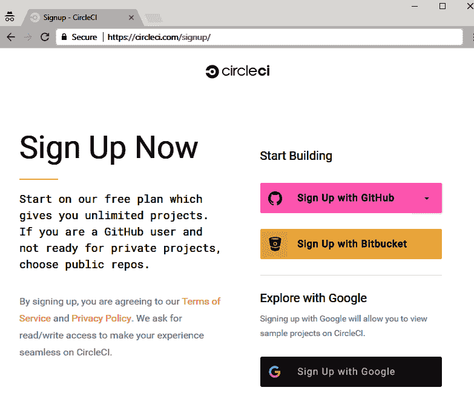
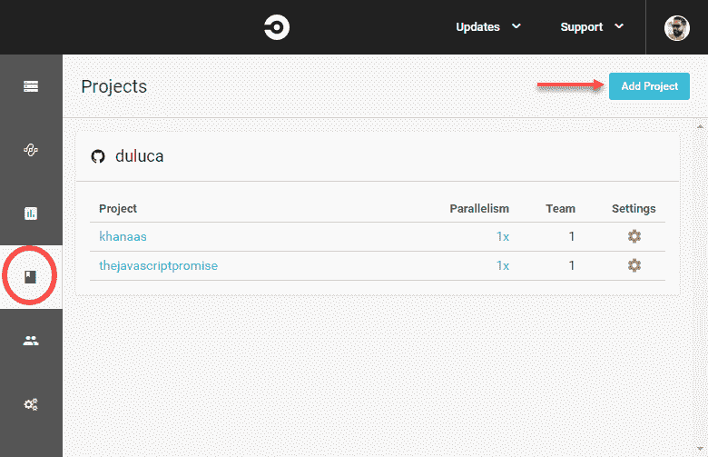
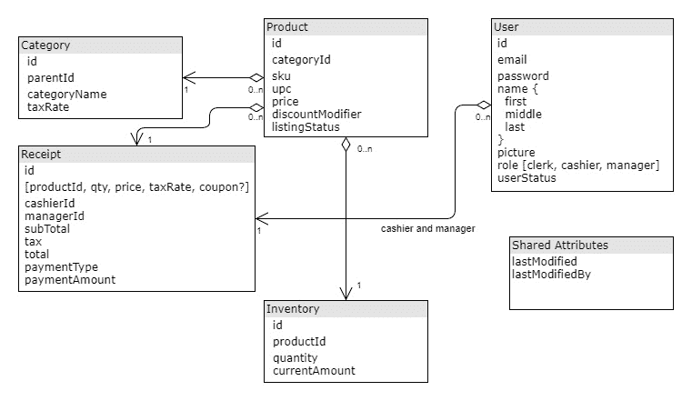
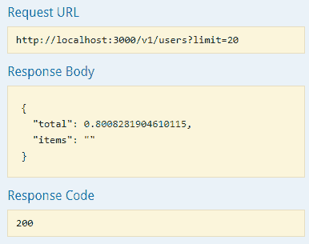
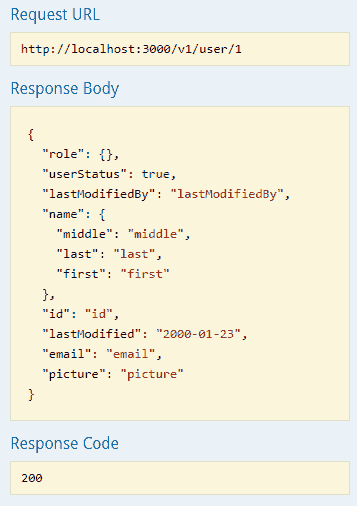
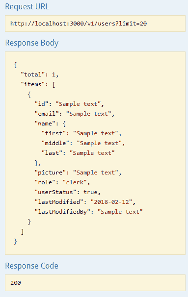
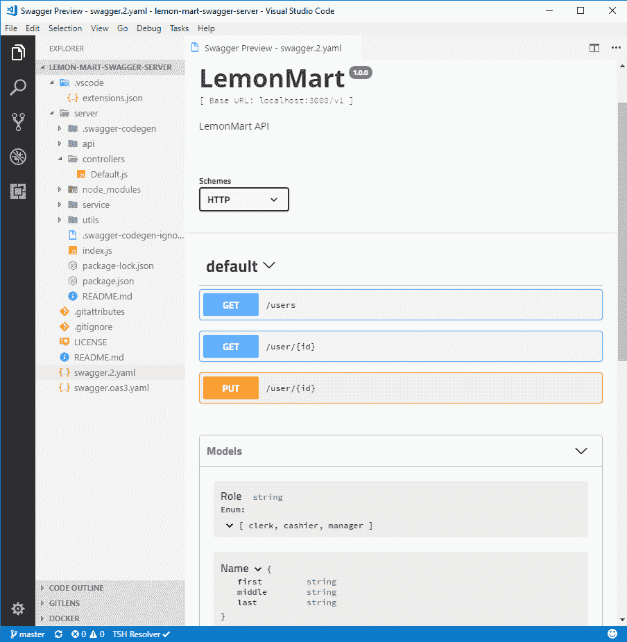

# 第八章：持续集成和 API 设计

在我们开始为我们的 LOB 应用 LemonMart 构建更复杂的功能之前，我们需要确保我们创建的每个代码推送都通过了测试，符合编码标准，并且是团队成员可以运行测试的可执行构件，因为我们继续进一步开发我们的应用。同时，我们需要开始考虑我们的应用将如何与后端服务器进行通信。无论是您、您的团队还是其他团队将创建新的 API，都很重要的是 API 设计能够满足前端和后端架构的需求。为了确保开发过程顺利进行，需要一个强大的机制来为 API 创建一个可访问的、实时的文档。**持续集成**（**CI**）可以解决第一个问题，而 Swagger 非常适合解决 API 设计、文档和测试需求。

持续集成对于确保质量可交付成果至关重要，它会在每次代码推送时构建和执行测试。建立 CI 环境可能会耗费时间，并需要对所使用的工具有专门的知识。CircleCI 是一个成熟的基于云的 CI 服务，拥有免费的套餐和有用的文章，可以让您尽可能少地进行配置就能开始使用。我们将介绍一种基于 Docker 的方法，可以在大多数 CI 服务上运行，使您的特定配置知识保持相关，并将 CI 服务知识降至最低。

全栈开发的另一个方面是，您可能会同时开发应用程序的前端和后端。无论您是独自工作，还是与团队或多个团队合作，建立数据契约都是至关重要的，以确保您不会在最后关头遇到集成挑战。我们将使用 Swagger 为 REST API 定义数据契约，然后创建一个模拟服务器，您的 Angular 应用程序可以向其发出 HTTP 调用。对于后端开发，Swagger 可以作为生成样板代码的良好起点，并且可以作为 API 的实时文档和测试 UI。

在本章中，您将学习以下内容：

+   使用 CircleCI 的 CI

+   使用 Swagger 进行 API 设计

本章需要以下内容：

+   一个免费的 CircleCI 账户

+   Docker

# 持续集成

持续集成的目标是在每次代码推送时实现一致且可重复的环境，用于构建、测试和生成可部署的应用程序成果。在推送代码之前，开发人员应该合理地期望他们的构建会通过；因此，创建一个可靠的持续集成环境，自动化开发人员也可以在本地机器上运行的命令是至关重要的。

# 构建环境容器化

为了确保跨各种操作系统平台、开发者机器和持续集成环境的一致构建环境，您可以将构建环境容器化。请注意，目前至少有半打常见的持续集成工具在使用中。学习每个工具的细节几乎是一项不可能完成的任务。构建环境的容器化是一个高级概念，超出了当前持续集成工具的预期。然而，容器化是标准化您的构建基础设施的绝佳方式，几乎可以在任何持续集成环境中执行。通过这种方法，您学到的技能和创建的构建配置变得更有价值，因为您的知识和创建的工具都变得可转移和可重复使用。

有许多策略可以将构建环境容器化，具有不同的粒度和性能期望。对于本书的目的，我们将专注于可重用性和易用性。我们将专注于一个简单和直接的工作流程，而不是创建一个复杂的、相互依赖的一组 Docker 映像，这可能允许更有效的失败优先和恢复路径。较新版本的 Docker 具有一个很棒的功能，称为多阶段构建，它允许您以易于阅读的方式定义多个映像过程，并维护一个单一的`Dockerfile`。

在流程结束时，您可以提取一个优化的容器映像作为我们的交付成果，摆脱先前流程中使用的映像的复杂性。

作为提醒，您的单个`Dockerfile`将类似于下面的示例：

```ts
Dockerfile
FROM duluca/minimal-node-web-server:8.11.1
WORKDIR /usr/src/app
COPY dist public
```

多阶段工作是通过在单个`Dockerfile`中使用多个`FROM`语句来实现的，其中每个阶段可以执行一个任务，并使其实例内的任何资源可用于其他阶段。在构建环境中，我们可以将各种与构建相关的任务实现为它们自己的阶段，然后将最终结果，例如 Angular 构建的`dist`文件夹，复制到包含 Web 服务器的最终镜像中。在这种情况下，我们将实现三个阶段的镜像：

+   **构建器**：用于构建 Angular 应用程序的生产版本

+   **测试器**：用于对无头 Chrome 实例运行单元测试和端到端测试

+   **Web 服务器**：最终结果仅包含优化的生产位

多阶段构建需要 Docker 版本 17.05 或更高版本。要了解有关多阶段构建的更多信息，请阅读[`docs.docker.com/develop/develop-images/multistage-build/`](https://docs.docker.com/develop/develop-images/multistage-build/)中的文档。

从创建一个新文件开始，以实现多阶段配置，命名为`Dockerfile.integration`，位于项目的根目录。

# 构建器

第一个阶段是`构建器`。我们需要一个轻量级的构建环境，可以确保一致的构建。为此，我创建了一个基于 Alpine 的 Node 构建环境示例，其中包含 npm、bash 和 git 工具。有关为什么我们使用 Alpine 和 Node 的更多信息，请参阅第三章*准备 Angular 应用程序进行生产发布*，*使用 Docker 容器化应用程序*部分。

1.  实现一个新的 npm 脚本来构建你的 Angular 应用程序：

```ts
"scripts": {
  "build:prod": "ng build --prod",
}
```

1.  从基于 Node.js 的构建环境继承，如`node:10.1`或`duluca/minimal-node-build-env:8.11.2`

1.  实现你的特定环境构建脚本，如下所示：

请注意，在发布时，低级 npm 工具中的一个错误阻止了基于`node`的镜像成功安装 Angular 依赖项。这意味着下面的示例`Dockerfile`基于较旧版本的 Node 和 npm，使用了`duluca/minimal-node-build-env:8.9.4`。在将来，当错误得到解决时，更新的构建环境将能够利用`npm ci`来安装依赖项，这将比`npm install`命令带来显著的速度提升。

```ts
Dockerfile.integration
FROM duluca/minimal-node-build-env:8.9.4 as builder

# project variables
ENV SRC_DIR /usr/src
ENV GIT_REPO https://github.com/duluca/lemon-mart.git
ENV SRC_CODE_LOCATION .
ENV BUILD_SCRIPT build:prod

# get source code
RUN mkdir -p $SRC_DIR
WORKDIR $SRC_DIR
# if necessary, do SSH setup here or copy source code from local or CI environment
RUN git clone $GIT_REPO .
# COPY $SRC_CODE_LOCATION .

RUN npm install
RUN npm run $BUILD_SCRIPT
```

在上面的示例中，容器正在从 GitHub 拉取源代码。我选择这样做是为了保持示例简单，因为在本地和远程持续集成环境中它的工作方式是相同的。然而，您的持续集成服务器将已经有源代码的副本，您需要从持续集成环境中复制然后放入容器中。

您可以使用`COPY $SRC_CODE_LOCATION .`命令从持续集成服务器或本地计算机复制源代码，而不是使用`RUN git clone $GIT_REPO .`命令。如果这样做，您将需要实现一个`.dockerignore`文件，它与您的`.gitignore`文件有些相似，以确保不会泄露机密信息，不会复制`node_modules`，并且配置在其他环境中是可重复的。在持续集成环境中，您将需要覆盖环境变量`$SRC_CODE_LOCATION`，以便`COPY`命令的源目录是正确的。随时创建多个适合您各种需求的`Dockerfile`版本。

此外，我构建了一个基于`node-alpine`的最小 Node 构建环境`duluca/minimal-node-build-env`，您可以在 Docker Hub 上观察到它，网址为[`hub.docker.com/r/duluca/minimal-node-build-env`](https://hub.docker.com/r/duluca/minimal-node-build-env)。这个镜像比`node`小大约十倍。Docker 镜像的大小对构建时间有真正的影响，因为持续集成服务器或您的团队成员将花费额外的时间拉取更大的镜像。选择最适合您需求的环境。

# 调试构建环境

根据您的特定需求，`Dockerfile`的构建部分的初始设置可能会令人沮丧。为了测试新命令或调试错误，您可能需要直接与构建环境进行交互。

为了在构建环境中进行交互实验和/或调试，执行以下操作：

```ts
$ docker run -it duluca/minimal-node-build-env:8.9.4 /bin/bash
```

在将命令嵌入您的`Dockerfile`之前，您可以在此临时环境中测试或调试命令。

# 测试人员

第二阶段是`tester`。默认情况下，Angular CLI 生成了一个针对开发环境的测试要求。这在持续集成环境中不起作用；我们必须配置 Angular 以针对一个无需 GPU 辅助执行的无头浏览器，并且进一步，一个容器化环境来执行测试。

Angular 测试工具在第三章中有所涵盖，*为生产发布准备 Angular 应用程序*

# 为 Angular 配置无头浏览器

Protractor 测试工具正式支持在无头模式下运行 Chrome。为了在持续集成环境中执行 Angular 测试，您需要配置您的测试运行器 Karma 以使用无头 Chrome 实例运行：

1.  更新`karma.conf.js`以包括新的无头浏览器选项：

```ts
src/karma.conf.js
...
browsers: ['Chrome', 'ChromiumHeadless', 'ChromiumNoSandbox'],
customLaunchers: {
  ChromiumHeadless: {
        base: 'Chrome',
        flags: [
          '--headless',
          '--disable-gpu',
          // Without a remote debugging port, Google Chrome exits immediately.
          '--remote-debugging-port=9222',
        ],
        debug: true,
      },
      ChromiumNoSandbox: {
        base: 'ChromiumHeadless',
        flags: ['--no-sandbox', '--disable-translate', '--disable-extensions']
      }
    },
```

`ChromiumNoSandbox`自定义启动器封装了所有需要的配置元素，以便进行良好的默认设置。

1.  更新`protractor`配置以在无头模式下运行：

```ts
e2e/protractor.conf.js
...
  capabilities: {
    browserName: 'chrome',
    chromeOptions: {
      args: [
        '--headless',
        '--disable-gpu',
        '--no-sandbox',
        '--disable-translate',
        '--disable-extensions',
        '--window-size=800,600',
      ],
    },
  },
...
```

为了测试应用程序的响应情况，您可以使用`--window-size`选项，如前所示，来更改浏览器设置。

1.  更新`package.json`脚本以在生产构建场景中选择新的浏览器选项：

```ts
package.json
"scripts": {
  ...
  "test:prod": "npm test -- --watch=false"
  ...
}
```

请注意，`test:prod`不包括`npm run e2e`。e2e 测试是需要更长时间执行的集成测试，因此在包含它们作为关键构建流程的一部分时要三思。e2e 测试将不会在下一节提到的轻量级测试环境中运行，因此它们将需要更多的资源和时间来执行。

# 配置测试环境

对于轻量级测试环境，我们将利用基于 Alpine 的 Chromium 浏览器安装：

1.  继承自`slapers/alpine-node-chromium`

1.  将以下配置附加到`Docker.integration`：

```ts
Docker.integration
...
FROM slapers/alpine-node-chromium as tester
ENV BUILDER_SRC_DIR /usr/src
ENV SRC_DIR /usr/src
ENV TEST_SCRIPT test:prod

RUN mkdir -p $SRC_DIR
WORKDIR $SRC_DIR

COPY --from=builder $BUILDER_SRC_DIR $SRC_DIR

CMD 'npm run $TEST_SCRIPT'
```

上述脚本将从`builder`阶段复制生产构建，并以可预测的方式执行您的测试脚本。

# Web 服务器

第三和最后阶段生成将成为您的 Web 服务器的容器。一旦完成此阶段，先前的阶段将被丢弃，最终结果将是一个优化的小于 10MB 的容器：

1.  使用 Docker 将您的应用程序容器化，如第三章中所讨论的，*为生产发布准备 Angular 应用程序*

1.  在文件末尾添加`FROM`语句

1.  从`builder`中复制生产就绪代码，如下所示：

```ts
Docker.integration
...
FROM duluca/minimal-nginx-web-server:1.13.8-alpine
ENV BUILDER_SRC_DIR /usr/src
COPY --from=builder $BUILDER_SRC_DIR/dist /var/www
CMD 'nginx'
```

1.  构建和测试您的多阶段`Dockerfile`：

```ts
$ docker build -f Dockerfile.integration .
```

如果您从 GitHub 拉取代码，请确保在构建容器之前提交和推送您的代码，因为它将直接从存储库中拉取您的源代码。使用`--no-cache`选项确保拉取新的源代码。如果您从本地或 CI 环境复制代码，则*不要*使用`--no-cache`，因为您将无法从能够重用先前构建的容器层中获得速度提升。

1.  将脚本保存为名为`build:ci`的新 npm 脚本，如下所示：

```ts
package.json
"scripts": {
  ...
  "build:ci": "docker build -f Dockerfile.integration . -t $npm_package_config_imageRepo:latest",
  ...
}
```

# CircleCI

CircleCI 使得轻松开始使用免费套餐，并为初学者和专业人士提供了很好的文档。如果您有独特的企业需求，可以将 CircleCI 部署在企业内部，企业防火墙后，或作为云中的私有部署。

CircleCI 具有预先配置的构建环境，适用于免费设置的虚拟配置，但也可以使用 Docker 容器运行构建，这使得它成为一个可以根据用户技能和需求进行扩展的解决方案，正如“容器化构建环境”部分所述：

1.  在[`circleci.com/`](https://circleci.com/)上创建一个 CircleCI 帐户

1.  使用 GitHub 注册：

CircleCI 注册页面

1.  添加新项目：

CircleCI 项目页面

在下一个屏幕上，您可以选择 Linux 或 macOS 构建环境。macOS 构建环境非常适用于构建 iOS 或 macOS 应用程序。但是，这些环境没有免费套餐；只有具有 1x 并行性的 Linux 实例是免费的。

1.  搜索 lemon-mart 并点击设置项目

1.  选择 Linux

1.  选择平台 2.0

1.  选择语言为其他，因为我们将使用自定义容器化构建环境

1.  在您的源代码中，创建一个名为`.circleci`的文件夹，并添加一个名为`config.yml`的文件：

```ts
.circleci/config.yml
version: 2
jobs:
  build:
    docker:
      - image: docker:17.12.0-ce-git
    working_directory: /usr/src
    steps:
      - checkout
      - setup_remote_docker:
          docker_layer_caching: false
      - run:
          name: Build Docker Image
          command: |
            npm run build:ci
```

在前面的文件中，定义了一个`build`作业，它基于 CircleCI 预先构建的`docker:17.12.0-ce-git`镜像，其中包含 Docker 和 git CLI 工具。然后我们定义了构建“步骤”，使用`checkout`从 GitHub 检出源代码，通知 CircleCI 使用`setup_remote_docker`命令设置 Docker-within-Docker 环境，然后执行`docker build -f Dockerfile.integration .`命令来启动我们的自定义构建过程。

为了优化构建，您应该尝试使用层缓存和从 CircleCI 中已经检出的源代码复制源代码。

1.  将更改同步到 Github

1.  在 CircleCI 上，点击创建您的项目

如果一切顺利，您将获得通过的*绿色*构建。如下截图所示，构建＃4 成功：

CircleCI 上的绿色构建

目前，CI 服务器正在运行，在第 1 阶段构建应用程序，然后在第 2 阶段运行测试，然后在第 3 阶段构建 Web 服务器。请注意，我们没有对此 Web 服务器容器映像执行任何操作，例如将其部署到服务器。

为了部署您的映像，您需要实现一个部署步骤。在此步骤中，您可以部署到多个目标，如 Docker Hub，Zeit Now，Heroku 或 AWS ECS。与这些目标的集成将涉及多个步骤。在高层次上，这些步骤如下：

1.  使用单独的运行步骤安装特定于目标的 CLI 工具

1.  使用特定于目标环境的登录凭据配置 Docker，并将这些凭据存储为 CircleCI 环境变量

1.  使用`docker push`将生成的 Web 服务器映像提交到目标的 Docker 注册表

1.  执行特定于平台的`deploy`命令，指示目标运行刚刚推送的 Docker 映像。

如何从本地开发环境配置 AWS ECS 上的此类部署在第十一章中有所介绍，*AWS 上高可用云基础设施*。

# 代码覆盖报告

了解您的 Angular 项目的单元测试覆盖量和趋势的一个好方法是通过代码覆盖报告。

为了为您的应用程序生成报告，请从项目文件夹中执行以下命令：

```ts
$ npx ng test --browsers ChromiumNoSandbox --watch=false --code-coverage
```

生成的报告将以 HTML 形式创建在名为 coverage 的文件夹下；执行以下命令在浏览器中查看：

```ts
$ npx http-server -c-1 -o -p 9875 ./coverage
```

这是由`istanbul.js`生成的 LemonMart 的文件夹级示例覆盖报告：

LemonMart 的 Istanbul 代码覆盖报告

您可以深入研究特定文件夹，例如`src/app/auth`，并获得文件级报告，如下所示：

Istanbul 代码覆盖报告适用于 src/app/auth

您可以进一步深入了解给定文件的行级覆盖率，例如`cache.service.ts`，如下所示：

cache.service.ts 的 Istanbul 代码覆盖报告

在前面的图像中，您可以看到第 5、12、17-18 和 21-22 行没有被任何测试覆盖。图标表示 if 路径未被执行。我们可以通过实现对`CacheService`中包含的函数进行单元测试来增加我们的代码覆盖率。作为练习，读者应该尝试至少用一个新的单元测试覆盖其中一个函数，并观察代码覆盖报告的变化。

理想情况下，您的 CI 服务器配置应该以一种方便访问的方式生成和托管代码覆盖报告，并在每次测试运行时执行。将这些命令作为`package.json`中的脚本实现，并在 CI 流水线中执行它们。这个配置留给读者作为一个练习。

将`http-server`安装为项目的开发依赖项。

# API 设计

在全栈开发中，早期确定 API 设计非常重要。API 设计本身与您的数据契约的外观密切相关。您可以创建 RESTful 端点，也可以使用下一代 GraphQL 技术。在设计 API 时，前端和后端开发人员应该密切合作，以实现共享的设计目标。一些高层目标列如下：

+   最小化客户端和服务器之间传输的数据

+   坚持使用成熟的设计模式（即分页）

+   设计以减少客户端中存在的业务逻辑

+   扁平化数据结构

+   不要暴露数据库键或关系

+   从一开始就版本化端点

+   围绕主要数据组件进行设计

重要的是不要重复造轮子，并且在设计 API 时采取一种有纪律的，如果不是严格的方法是很重要的。API 设计错误的下游影响可能是深远的，一旦您的应用程序上线就无法纠正。

我将详细介绍围绕主要数据组件进行设计，并实现一个示例的 Swagger 端点。

# 围绕主要数据组件进行设计

围绕主要数据组件进行设计有助于组织您的 API。这将大致匹配您在 Angular 应用程序的各个组件中使用数据的方式。我们将首先通过创建一个粗略的数据实体图来定义我们的主要数据组件，然后使用 swagger 为用户数据实体实现一个示例 API。

# 定义实体

让我们首先尝试一下您想要存储的实体类型以及这些实体之间可能的关系。

这是一个使用[draw.io](http://draw.io)创建的 LemonMart 的样本设计：

 LemonMart 的数据实体图

此时，您的实体是存储在 SQL 还是 NoSQL 数据库中并不重要。我的建议是坚持你所知道的，但如果你是从零开始的，像 MongoDB 这样的 NoSQL 数据库将在您的实现和需求发展时提供最大的灵活性。

# Swagger

Swagger 将允许您设计您的 Web API。对于团队来说，它可以充当前端和后端团队之间的接口。此外，通过 API 模拟，您甚至可以在 API 的实现开始之前开发和完成 API 功能。

随着我们的进展，我们将实现一个示例用户 API，以演示 Swagger 的工作原理。

示例项目附带了 VS Code 的推荐扩展。Swagger Viewer 允许我们在不运行任何其他工具的情况下预览 YAML 文件。

# 粗略地说，您将需要为每个实体创建 CRUD API。您可以使用 Swagger 来设计您的 API。

在`components`下，添加共享的`parameters`，使其易于重用常见模式，如分页端点：

示例代码存储库可以在[github.com/duluca/lemon-mart-swagger-server](http://github.com/duluca/lemon-mart-swagger-server)找到。对于您的模拟 API 服务器，您应该创建一个单独的 git 存储库，以便前端和后端之间的这个契约可以分开维护。

1.  创建一个名为`lemon-mart-swagger-server`的新 GitHub 存储库

1.  开始定义一个带有一般信息和目标服务器的 YAML 文件：

```ts
swagger.oas3.yaml
openapi: 3.0.0
info:
  title: LemonMart
  description: LemonMart API
  version: "1.0.0"

servers:
  - url: http://localhost:3000
    description: Local environment
  - url: https://mystagingserver.com/v1
    description: Staging environment
  - url: https://myprodserver.com/v1
    description: Production environment
```

1.  Swagger 规范的最广泛使用和支持的版本是`swagger: '2.0'`。下面的示例是使用更新的、基于标准的`openapi: 3.0.0`给出的。示例代码存储库包含了这两个示例。然而，在发布时，Swagger 生态系统中的大多数工具都依赖于 2.0 版本。在`components`下，定义共享数据`schemas`：

```ts
swagger.oas3.yaml
...
components:
  schemas: 
    Role:
      type: string
      enum: [clerk, cashier, manager]
    Name:
      type: object
      properties:
        first:
          type: string
        middle:
          type: string
        last:
          type: string
    User:
      type: object
      properties:
        id:
          type: string
        email:
          type: string
        name:
          $ref: '#/components/schemas/Name'
        picture:
          type: string
        role:
          $ref: '#/components/schemas/Role'
        userStatus:
          type: boolean
        lastModified:
          type: string
          format: date
        lastModifiedBy:
          type: string
    Users:
      type: object
      properties:
        total:
          type: number
          format: int32
      items:
        $ref: '#/components/schemas/ArrayOfUser'
    ArrayOfUser:
      type: array
      items:
            $ref: '#/components/schemas/User'
```

1.  定义一个 Swagger YAML 文件

```ts
swagger.oas3.yaml
...
  parameters:
    offsetParam: # <-- Arbitrary name for the definition that will be used to refer to it.
                  # Not necessarily the same as the parameter name.
      in: query
      name: offset
      required: false
      schema:
        type: integer
        minimum: 0
      description: The number of items to skip before starting to collect the result set.
    limitParam:
      in: query
      name: limit
      required: false
      schema:
        type: integer
        minimum: 1
        maximum: 50
        default: 20
      description: The numbers of items to return.
```

1.  在`paths`下，为`/users`路径定义一个`get`端点：

```ts
...
paths:
  /users:
    get:
      description: |
        Searches and returns `User` objects.
        Optional query params determines values of returned array
      parameters:
        - in: query
          name: search
          required: false
          schema:
            type: string
          description: Search text
        - $ref: '#/components/parameters/offsetParam'
        - $ref: '#/components/parameters/limitParam'
      responses:
        '200': # Response
          description: OK
          content: # Response body
            application/json: # Media type
              schema:
                $ref: '#/components/schemas/Users'
```

1.  在`paths`下，添加`get`通过 ID 获取用户和`update`通过 ID 更新用户的端点：

```ts
swagger.oas3.yaml
...
  /user/{id}:
    get:
      description: Gets a `User` object by id
      parameters:
        - in: path
          name: id
          required: true
          schema:
            type: string
          description: User's unique id
      responses:
         '200': # Response
            description: OK
            content: # Response body
              application/json: # Media type
                schema:
                  $ref: '#/components/schemas/User'
    put:
      description: Updates a `User` object given id
      parameters:
        - in: query
          name: id
          required: true
          schema:
            type: string
          description: User's unique id
        - in: body
          name: userData
          schema:
            $ref: '#/components/schemas/User'
          style: form
          explode: false
          description: Updated user object
      responses:
        '200':
          description: OK
          content: # Response body
              application/json: # Media type
                schema:
                  $ref: '#/components/schemas/User'
```

要验证你的 Swagger 文件，你可以使用在线编辑器[editor.swagger.io](https://editor.swagger.io)。注意使用`style: form`和`explode: false`，这是配置期望基本表单数据的端点的最简单方式。要了解更多参数序列化选项或模拟认证端点和其他可能的配置，请参考[swagger.io/docs/specification/](https://swagger.io/docs/specification/)上的文档。

# 创建一个 Swagger 服务器

使用你的 YAML 文件，你可以使用 Swagger Code Gen 工具生成一个模拟的 Node.js 服务器。

# 使用非官方工具的 OpenAPI 3.0

如前一节所述，本节将使用 YAML 文件的第 2 版，它可以使用官方工具生成服务器。然而，还有其他工具可以生成一些代码，但不完整到足够易于使用：

1.  如果在项目文件夹中使用 OpenAPI 3.0，请执行以下命令：

```ts
$ npx swagger-node-codegen swagger.oas3.yaml -o ./server
...
Done! 
Check out your shiny new API at C:\dev\lemon-mart-swagger-server\server.
```

在一个名为`server`的新文件夹下，你现在应该有一个生成的 Node Express 服务器。

1.  为服务器安装依赖项：

```ts
$ cd server
$ npm install
```

然后，你必须手动实现缺失的存根来完成服务器的实现。

# 使用官方工具的 Swagger 2.0

使用官方工具和 2.0 版本，你可以自动创建 API 和生成响应。一旦官方工具完全支持 OpenAPI 3.0，相同的指令应该适用：

1.  将你的 YAML 文件发布到一个可以被你的机器访问的 URI 上：

```ts
https://raw.githubusercontent.com/duluca/lemon-mart-swagger-server/master/swagger.2.yaml
```

1.  在你的项目文件夹中，执行以下命令，用你的 YAML 文件指向的 URI 替换`<uri>`：

```ts
$ docker run --rm -v ${PWD}:/local swaggerapi/swagger-codegen-cli 
$ generate -i <uri> -l nodejs-server -o /local/server
```

与前一节类似，这将在服务器目录下创建一个 Node Express 服务器。为了执行这个服务器，继续以下步骤。

1.  用`npm install`安装服务器的依赖项。

1.  运行`npm start`。你的模拟服务器现在应该已经启动。

1.  导航到`http://localhost:3000/docs`

1.  尝试`get /users`的 API；你会注意到 items 属性是空的：

Swagger UI - 用户端点

但是，你应该收到虚拟数据。我们将纠正这种行为。

1.  尝试`get /user/{id}`；你会看到你收到了一些虚拟数据：

Swagger UI - 按用户 ID 端点

行为上的差异是因为，默认情况下，Node Express 服务器使用在 `server/controllers/Default.js` 下生成的控制器来读取在服务器创建期间从 `server/service/DefaultService.js` 生成的随机数据。然而，您可以禁用默认控制器，并强制 Swagger 进入更好的默认存根模式。

1.  更新 `index.js` 以强制使用存根并注释掉控制器：

```ts
index.js
var options = {
  swaggerUi: path.join(__dirname, '/swagger.json'),
  // controllers: path.join(__dirname, './controllers'),
  useStubs: true,
}
```

1.  再次尝试 `/users` 端点

正如您在这里所看到的，响应默认情况下具有更高的质量：

Swagger UI - 使用虚拟数据的用户端点

在上述中，`total` 是一个整数，`role` 被正确定义，`items` 是一个有效的数组结构。

为了启用更好和更定制的数据模拟，您可以编辑 `DefaultService.js`。在这种情况下，您希望更新 `usersGET` 函数以返回一个定制用户数组。

# 启用跨域资源共享（CORS）

在您能够从应用程序中使用您的服务器之前，您需要配置它以允许**跨域资源共享**（**CORS**），以便您托管在 `http://localhost:5000` 上的 Angular 应用程序可以与您托管在 `http://localhost:3000` 上的模拟服务器进行通信：

1.  安装 `cors` 包：

```ts
$ npm i cors
```

1.  更新 `index.js` 以使用 `cors`：

```ts
server/index.js
...
var cors =  require('cors')
...
app.use(cors())

// Initialize the Swagger middleware
swaggerTools.initializeMiddleware(swaggerDoc, function(middleware) {
...
```

确保在 `initializeMiddleware` 之前调用 `app.use(cors())`；否则，其他 Express 中间件可能会干扰 `cors()` 的功能。

# 验证和发布 Swagger 服务器

您可以通过 SwaggerUI 验证您的 Swagger 服务器设置，SwaggerUI 将位于 `http://localhost:3000/docs`，或者您可以通过 VS Code 中的预览 Swagger 扩展实现更集成的环境。

我将演示如何使用这个扩展来从 VS Code 内部测试您的 API：

1.  在资源管理器中选择 YAML 文件

1.  按下 *Shift* + *Alt* + *P* 并执行预览 Swagger 命令

1.  您将看到一个交互式窗口来测试您的配置，如下所示：

在 Visual Studio Code 中预览 Swagger 扩展

1.  点击 /users 的 Get 按钮

1.  点击 Try it out 查看结果

在 OpenAPI 3.0.0 中，您将看到一个服务器列表，包括本地和远程资源，而不是方案。这是一个非常方便的工具，可以在编写前端应用程序时探索各种数据源。

现在您已经验证了 Swagger 服务器，您可以发布服务器，使团队成员或需要可预测数据集才能成功执行的**自动验收测试**（**AAT**）环境可以访问它。

执行以下步骤，如第三章中所述，*为生产发布准备 Angular 应用程序*：

1.  在根级别的`package.json`文件中为 Docker 添加 npm 脚本

1.  添加一个`Dockerfile`：

```ts
Dockerfile
FROM duluca/minimal-node-build-env:8.11.2

RUN mkdir -p /usr/src
WORKDIR /usr/src

COPY server .

RUN npm ci

CMD ["node", "index"]
```

构建容器后，您就可以部署它了。

我已经在 Docker Hub 上发布了一个示例服务器，网址为[`hub.docker.com/r/duluca/lemon-mart-swagger-server`](https://hub.docker.com/r/duluca/lemon-mart-swagger-server)。

# 总结

在本章中，您学会了如何创建基于容器的持续集成环境。我们利用 CircleCI 作为基于云的 CI 服务，并强调您可以将构建结果部署到所有主要的云托管提供商。如果您启用了这样的自动化部署，您将实现**持续部署**（**CD**）。通过 CI/CD 管道，您可以与客户和团队成员分享应用程序的每个迭代，并快速向最终用户交付错误修复或新功能。

我们还讨论了良好 API 设计的重要性，并确定 Swagger 作为一个有益于前端和后端开发人员的工具，用于定义和开发针对实时数据契约的应用。如果您创建了一个 Swagger 模拟服务器，您可以让团队成员拉取模拟服务器镜像，并在后端实现完成之前使用它来开发他们的前端应用程序。

CircleCI 和 Swagger 都是各自高度复杂的工具。本章提到的技术故意简单，但旨在实现复杂的工作流程，让您领略到这些工具的真正威力。您可以大大提高这种技术的效率和能力，但这些技术将取决于您的具体需求。

装备了 CI 和模拟的 API，我们可以发送真实的 HTTP 请求，我们准备快速迭代，同时确保高质量的可交付成果。在下一章中，我们将深入探讨如何使用基于令牌的身份验证和条件导航技术，为您的业务应用程序设计授权和身份验证体验，以实现平滑的用户体验，继续采用路由器优先的方法。
