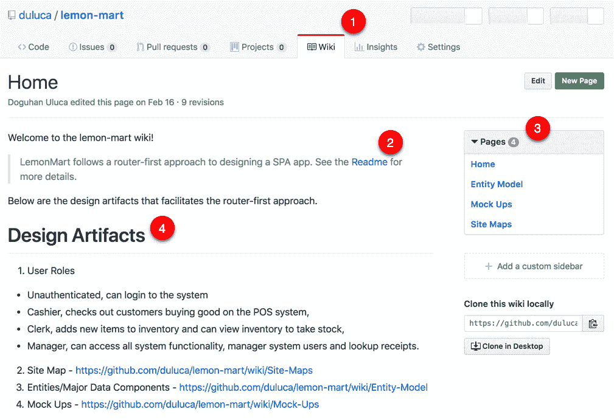
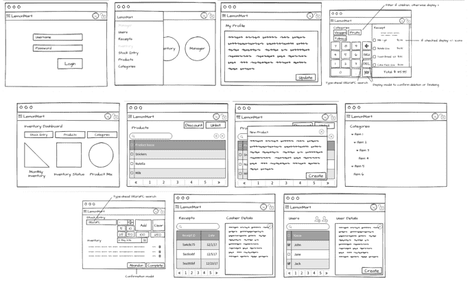
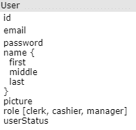
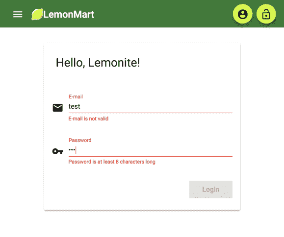
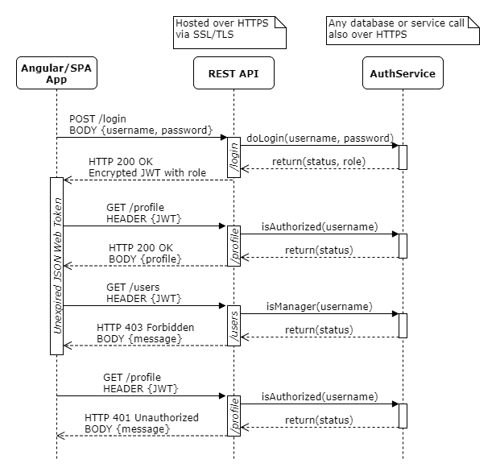
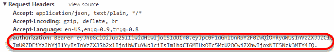
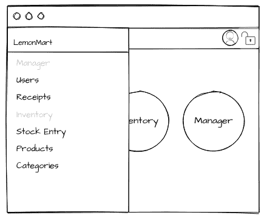
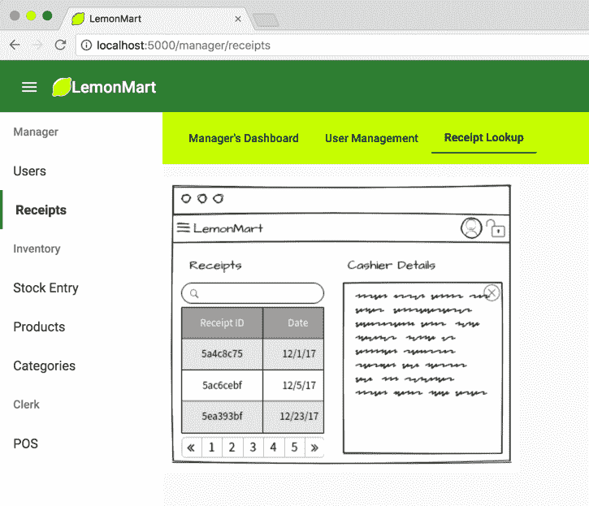
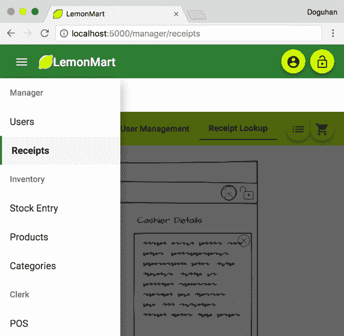
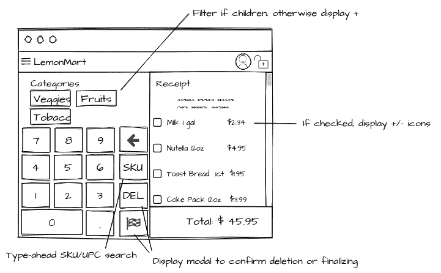

# 第九章：设计身份验证和授权

设计高质量的身份验证和授权系统而不会让最终用户感到沮丧是一个难题。身份验证是验证用户身份的行为，授权指定用户访问资源的特权。这两个过程，简称为 auth，必须无缝地协同工作，以满足具有不同角色、需求和工作职能的用户的需求。在今天的网络中，用户对通过浏览器遇到的任何 auth 系统都有很高的期望水平，因此这是您的应用程序中绝对需要第一次就完全正确的一个非常重要的部分。

用户应始终了解他们在应用程序中可以做什么和不能做什么。如果出现错误、失败或错误，用户应清楚地了解为什么会发生这样的错误。随着应用程序的增长，很容易忽略触发错误条件的所有方式。您的实现应易于扩展或维护，否则您的应用程序的基本骨架将需要大量的维护。在本章中，我们将介绍创建出色的 auth UX 的各种挑战，并实现一个坚实的基线体验。

我们将继续采用路由器优先方法来设计 SPA，通过实现 LemonMart 的身份验证和授权体验。在第七章中，*创建基于路由器的企业应用程序*，我们定义了用户角色，完成了所有主要路由的构建，并完成了 LemonMart 的粗略行走骨架导航体验，因此我们已经准备好实现基于角色的路由和拉取此类实现的细微差别。

在第八章中，*持续集成和 API 设计*，我们讨论了围绕主要数据组件进行设计的想法，因此您已经熟悉用户实体的外观，这将在实现基于令牌的登录体验中派上用场，包括在实体内缓存角色信息。

在深入研究 auth 之前，我们将讨论在开始实现各种条件导航元素之前，完成应用程序的高级模拟的重要性，这在设计阶段可能会发生重大变化。

在本章中，您将了解以下主题：

+   高级 UX 设计的重要性

+   基于令牌的身份验证

+   条件导航

+   侧边导航栏

+   可重用的警报 UI 服务

+   缓存数据

+   JSON Web Tokens

+   Angular HTTP 拦截器

+   路由守卫

# 完成模型

模型在确定我们在整个应用程序中需要哪种组件和用户控件方面非常重要。任何将在组件之间使用的用户控件或组件都需要在根级别定义，其他的则在其自己的模块中定义。

在第七章，*创建一个以路由为首的业务应用程序*中，我们已经确定了子模块并为它们设计了着陆页面，以完成行走的骨架。现在我们已经定义了主要的数据组件，我们可以为应用程序的其余部分完成模型。在高层次设计屏幕时，请牢记几件事：

+   用户是否可以尽可能少地导航来完成其角色所需的常见任务？

+   用户是否可以通过屏幕上可见的元素轻松访问应用程序的所有信息和功能？

+   用户是否可以轻松搜索他们需要的数据？

+   一旦用户找到感兴趣的记录，他们是否可以轻松地深入了解详细记录或查看相关记录？

+   那个弹出警报真的有必要吗？您知道用户不会阅读它，对吧？

请记住，设计任何用户体验都没有一种正确的方式，这就是为什么在设计屏幕时，始终要牢记模块化和可重用性。

当您生成各种设计工件，如模型或设计决策时，请务必将它们发布在所有团队成员都可以访问的维基上：

1.  在 GitHub 上，切换到 Wiki 选项卡

1.  您可以查看我的示例维基，如下所示：[Github.com/duluca/lemon-mart/wiki](https://github.com/duluca/lemon-mart/wiki)

GitHub.com LemonMart Wiki

1.  创建维基页面时，请确保在任何其他可用文档之间进行交叉链接，例如 Readme

1.  请注意，GitHub 在页面下显示维基上的子页面

1.  然而，额外的摘要是有帮助的，比如设计工件部分，因为有些人可能会错过右侧的导航元素

1.  完成模型后，请将其发布在维基上

您可以在这里看到维基的摘要视图：

柠檬市场模型的摘要视图

1.  可选地，将模型放在行走的骨架应用程序中，以便测试人员更好地设想尚未开发的功能

完成模拟后，我们现在可以继续使用身份验证和授权工作流来实现 LemonMart。

# 设计认证和授权工作流

一个设计良好的身份验证工作流是无状态的，因此没有会话过期的概念。用户可以自由地与您的无状态 REST API 进行交互，无论他们希望同时或随后在多少设备和标签页上。**JSON Web Token** (**JWT**) 实现了基于分布式声明的身份验证，可以通过数字签名或集成保护和/或使用 **消息认证码** (**MAC**) 进行加密。这意味着一旦用户的身份经过认证，比如说通过密码挑战，他们将收到一个编码的声明票据或令牌，然后可以使用它来对系统进行未来的请求，而无需重新验证用户的身份。服务器可以独立验证此声明的有效性并处理请求，而无需事先知道与该用户进行过互动。因此，我们不必存储有关用户的会话信息，使我们的解决方案无状态且易于扩展。每个令牌将在预定义的时间后过期，并且由于它们的分布式性质，无法远程或单独撤销；但是，我们可以通过插入自定义帐户和用户角色状态检查来加强实时安全性，以确保经过身份验证的用户有权访问服务器端资源。

JSON Web Tokens 实现了 IETF 行业标准 RFC7519，可以在 [`tools.ietf.org/html/rfc7519`](https://tools.ietf.org/html/rfc7519) 找到。

良好的授权工作流程能够基于用户角色进行条件导航，以便用户自动进入最佳的登陆界面；他们不会看到不适合他们角色的路由或元素，如果他们错误地尝试访问一个授权的路径，他们将被阻止这样做。您必须记住，任何客户端角色导航仅仅是一种便利，而不是用于安全目的。这意味着每次向服务器发出的调用都应包含必要的头部信息，带有安全令牌，以便服务器可以重新验证用户，独立验证他们的角色，只有在这样做之后才允许检索安全数据。客户端身份验证是不可信的，这就是为什么密码重置屏幕必须使用服务器端渲染技术构建，以便用户和服务器都可以验证预期的用户正在与系统交互。

在接下来的部分中，我们将围绕用户数据实体设计一个完整的身份验证工作流程，如下所示：

用户实体

# 添加身份验证服务

我们将首先创建一个具有真实和虚假登录提供程序的身份验证服务：

1.  添加身份验证和授权服务：

```ts
$ npx ng g s auth -m app --flat false
```

1.  确保服务在`app.module`中提供：

```ts
src/app/app.module.ts
import { AuthService } from './auth/auth.service'
...  
providers: [AuthService],
```

为服务创建一个单独的文件夹将组织各种与身份验证和授权相关的组件，例如`Role`的`enum`定义。此外，我们还将能够在同一个文件夹中添加一个`authService`的伪造版本，这对于编写单元测试至关重要。

1.  将用户角色定义为`enum`：

```ts
src/app/auth/role.enum.ts
export enum Role {
  None = 'none',
  Clerk = 'clerk',
  Cashier = 'cashier',
  Manager = 'manager',
}
```

# 实现基本的身份验证服务

现在，让我们构建一个本地身份验证服务，这将使我们能够演示一个强大的登录表单、缓存和基于身份验证状态和用户角色的条件导航概念：

1.  首先安装一个 JWT 解码库，以及一个用于伪造身份验证的 JWT 编码库：

```ts
$ npm install jwt-decode fake-jwt-sign
$ npm install -D @types/jwt-decode
```

1.  为`auth.service.ts`定义导入项：

```ts
src/app/auth/auth.service.ts
import { HttpClient } from '@angular/common/http'
import { Injectable } from '@angular/core'

import { sign } from 'fake-jwt-sign' // For fakeAuthProvider only
import * as decode from 'jwt-decode'

import { BehaviorSubject, Observable, of, throwError as observableThrowError } from 'rxjs'
import { catchError, map } from 'rxjs/operators'

import { environment } from '../../environments/environment'
import { Role } from './role.enum'
...
```

1.  实现`IAuthStatus`接口来存储解码后的用户信息，一个辅助接口，以及默认安全的`defaultAuthStatus`：

```ts
src/app/auth/auth.service.ts
...
export interface IAuthStatus {
  isAuthenticated: boolean
  userRole: Role
  userId: string
}

interface IServerAuthResponse {
  accessToken: string
}

const defaultAuthStatus = { isAuthenticated: false, userRole: Role.None, userId: null }
...
```

`IAuthUser`是一个接口，代表了您可能从身份验证服务接收到的典型 JWT 的形状。它包含有关用户及其角色的最少信息，因此可以附加到服务器调用的`header`中，并且可以选择地缓存在`localStorage`中以记住用户的登录状态。在前面的实现中，我们假设了`Manager`的默认角色。

1.  使用`BehaviorSubject`定义`AuthService`类来锚定用户当前的`authStatus`，并在构造函数中配置一个`authProvider`，该`authProvider`可以处理`email`和`password`并返回一个`IServerAuthResponse`：

```ts
src/app/auth/auth.service.ts ...
@Injectable({
  providedIn: 'root'
})
export class AuthService {
   private readonly authProvider: (
    email: string,
    password: string
  ) => Observable<IServerAuthResponse>

  authStatus = new BehaviorSubject<IAuthStatus>(defaultAuthStatus)

  constructor(private httpClient: HttpClient) {
     // Fake login function to simulate roles
    this.authProvider = this.fakeAuthProvider
    // Example of a real login call to server-side
    // this.authProvider = this.exampleAuthProvider
  }
  ...
```

请注意，`fakeAuthProvider`被配置为该服务的`authProvider`。真实的身份验证提供程序可能看起来像以下代码，其中用户的电子邮件和密码被发送到一个 POST 端点，该端点验证他们的信息，创建并返回一个 JWT 供我们的应用程序使用：

```ts
example
private exampleAuthProvider(
  email: string,
  password: string
): Observable<IServerAuthResponse> {
  return this.httpClient.post<IServerAuthResponse>(`${environment.baseUrl}/v1/login`, {
    email: email,
    password: password,
  })
}
```

这很简单，因为大部分工作是在服务器端完成的。这个调用也可以发送给第三方。

请注意，URL 路径中的 API 版本`v1`是在服务中定义的，而不是作为`baseUrl`的一部分。这是因为每个 API 可以独立于其他 API 更改版本。登录可能长时间保持为`v1`，而其他 API 可能升级为`v2`、`v3`等。

1.  实现一个`fakeAuthProvider`，模拟身份验证过程，包括动态创建一个假的 JWT：

```ts
src/app/auth/auth.service.ts
  ...
  private fakeAuthProvider(
    email: string,
    password: string
  ): Observable<IServerAuthResponse> {
    if (!email.toLowerCase().endsWith('@test.com')) {
      return observableThrowError('Failed to login! Email needs to end with @test.com.')
    }

    const authStatus = {
      isAuthenticated: true,
      userId: 'e4d1bc2ab25c',
      userRole: email.toLowerCase().includes('cashier')
        ? Role.Cashier
        : email.toLowerCase().includes('clerk')
          ? Role.Clerk
          : email.toLowerCase().includes('manager') ? Role.Manager : Role.None,
    } as IAuthStatus

    const authResponse = {
      accessToken: sign(authStatus, 'secret', {
        expiresIn: '1h',
        algorithm: 'none',
      }),
    } as IServerAuthResponse

    return of(authResponse)
  }
  ...
```

`fakeAuthProvider`在服务中实现了本来应该是服务器端方法，因此您可以方便地在微调身份验证工作流程的同时实验代码。它使用临时的`fake-jwt-sign`库创建并签署了一个 JWT，以便我们还可以演示如何处理一个格式正确的 JWT。

不要将您的 Angular 应用程序与`fake-jwt-sign`依赖项一起发布，因为它是用于服务器端代码的。

1.  在我们继续之前，实现一个`transformError`函数来处理在`common/common.ts`下的可观察流中混合的`HttpErrorResponse`和字符串错误：

```ts
src/app/common/common.ts
import { HttpErrorResponse } from '@angular/common/http'
import { throwError } from 'rxjs'

export function transformError(error: HttpErrorResponse | string) {
  let errorMessage = 'An unknown error has occurred'
  if (typeof error === 'string') {
    errorMessage = error
  } else if (error.error instanceof ErrorEvent) {
    errorMessage = `Error! ${error.error.message}`
  } else if (error.status) {
    errorMessage = `Request failed with ${error.status} ${error.statusText}`
  }
  return throwError(errorMessage)
}
```

1.  实现`login`函数，该函数将从`LoginComponent`中调用，如下一节所示

1.  添加``import { transformError } from '../common/common'``

1.  还要实现一个相应的`logout`函数，可以由顶部工具栏中的注销按钮调用，也可以由登录尝试失败或者如果路由器身份验证守卫检测到未经授权的访问尝试时调用，这是本章后面涵盖的一个主题：

```ts
src/app/auth/auth.service.ts
  ...
  login(email: string, password: string): Observable<IAuthStatus> {
    this.logout()

    const loginResponse = this.authProvider(email, password).pipe(
      map(value => {
        return decode(value.accessToken) as IAuthStatus
      }),
      catchError(transformError)
    )

    loginResponse.subscribe(
      res => {
        this.authStatus.next(res)
      },
      err => {
        this.logout()
        return observableThrowError(err)
      }
    )

    return loginResponse
  }

  logout() {
    this.authStatus.next(defaultAuthStatus)
  }
}
```

`login`方法通过调用`logout`方法，`authProvider`与`email`和`password`信息，并在必要时抛出错误来封装正确的操作顺序。

`login`方法遵循 SOLID 设计中的开闭原则，通过对外部提供不同的 auth 提供程序来扩展，但对修改保持封闭，因为功能的差异被封装在 auth 提供程序中。

在下一节中，我们将实现`LoginComponent`，以便用户可以输入他们的用户名和密码信息并尝试登录。

# 实现登录组件

`login`组件利用我们刚刚创建的`authService`并使用响应式表单实现验证错误。登录组件应该以一种独立于任何其他组件的方式进行设计，因为在路由事件期间，如果我们发现用户没有得到适当的身份验证或授权，我们将把他们导航到这个组件。我们可以将这个起源 URL 捕获为`redirectUrl`，这样一旦用户成功登录，我们就可以将他们导航回去。

1.  让我们从实现到`login`组件的路由开始：

```ts
src/app/app-routing.modules.ts
...
  { path: 'login', component: LoginComponent },
  { path: 'login/:redirectUrl', component: LoginComponent },
...
```

1.  现在实现组件本身：

```ts
src/app/login/login.component.ts
import { Component, OnInit } from '@angular/core'
import { FormBuilder, FormGroup, Validators, NgForm } from '@angular/forms'
import { AuthService } from '../auth/auth.service'
import { Role } from '../auth/role.enum'

@Component({
  selector: 'app-login',
  templateUrl: 'login.component.html',
  styles: [
    `
    .error {
        color: red
    }
    `,
    `
    div[fxLayout] {margin-top: 32px;}
    `,
  ],
})
export class LoginComponent implements OnInit {
  loginForm: FormGroup
  loginError = ''
  redirectUrl
  constructor(
    private formBuilder: FormBuilder,
    private authService: AuthService,
    private router: Router,
    private route: ActivatedRoute
  ) {
    route.paramMap.subscribe(params => (this.redirectUrl = params.get('redirectUrl')))
  }

  ngOnInit() {
    this.buildLoginForm()
  }

  buildLoginForm() {
    this.loginForm = this.formBuilder.group({
      email: ['', [Validators.required, Validators.email]],
      password: ['', [
        Validators.required,
        Validators.minLength(8),
        Validators.maxLength(50),
      ]],
    })
  }

  async login(submittedForm: FormGroup) {
    this.authService
      .login(submittedForm.value.email, submittedForm.value.password)
      .subscribe(authStatus => {
        if (authStatus.isAuthenticated) {
          this.router.navigate([this.redirectUrl || '/manager'])
        }
      }, error => (this.loginError = error))
  }
}
```

作为成功登录尝试的结果，我们利用路由器将经过身份验证的用户导航到他们的个人资料。在通过服务从服务器发送的错误的情况下，我们将将该错误分配给`loginError`。

1.  这里是一个用于捕获和验证用户的`email`和`password`的登录表单的实现，并且如果有任何服务器错误，显示它们：

```ts
src/app/login/login.component.html
<div fxLayout="row" fxLayoutAlign="center">
  <mat-card fxFlex="400px">
    <mat-card-header>
      <mat-card-title>
        <div class="mat-headline">Hello, Lemonite!</div>
      </mat-card-title>
    </mat-card-header>
    <mat-card-content>
      <form [formGroup]="loginForm" (ngSubmit)="login(loginForm)" fxLayout="column">
        <div fxLayout="row" fxLayoutAlign="start center" fxLayoutGap="10px">
          <mat-icon>email</mat-icon>
          <mat-form-field fxFlex>
            <input matInput placeholder="E-mail" aria-label="E-mail" formControlName="email">
            <mat-error *ngIf="loginForm.get('email').hasError('required')">
              E-mail is required
            </mat-error>
            <mat-error *ngIf="loginForm.get('email').hasError('email')">
              E-mail is not valid
            </mat-error>
          </mat-form-field>
        </div>
        <div fxLayout="row" fxLayoutAlign="start center" fxLayoutGap="10px">
          <mat-icon matPrefix>vpn_key</mat-icon>
          <mat-form-field fxFlex>
            <input matInput placeholder="Password" aria-label="Password" type="password" formControlName="password">
            <mat-hint>Minimum 8 characters</mat-hint>
            <mat-error *ngIf="loginForm.get('password').hasError('required')">
              Password is required
            </mat-error>
            <mat-error *ngIf="loginForm.get('password').hasError('minlength')">
              Password is at least 8 characters long
            </mat-error>
            <mat-error *ngIf="loginForm.get('password').hasError('maxlength')">
              Password cannot be longer than 50 characters
            </mat-error>
          </mat-form-field>
        </div>
        <div fxLayout="row" class="margin-top">
          <div *ngIf="loginError" class="mat-caption error">{{loginError}}</div>
          <div class="flex-spacer"></div>
          <button mat-raised-button type="submit" color="primary" [disabled]="loginForm.invalid">Login</button>
        </div>
      </form>
    </mat-card-content>
  </mat-card>
</div>
```

登录按钮在满足客户端验证规则之前将被禁用。此外，`<mat-form-field>`一次只会显示一个`mat-error`，除非您为更多错误创建更多的空间，所以请确保将您的错误条件放在正确的顺序中。

一旦您完成了实现`login`组件，现在可以更新主屏幕以有条件地显示或隐藏我们创建的新组件。

1.  更新`home.component`以在用户打开应用程序时显示登录：

```ts
src/app/home/home.component.ts

  template: `
    <div *ngIf="displayLogin">
      <app-login></app-login>
    </div>
    <div *ngIf="!displayLogin">
      <span class="mat-display-3">You get a lemon, you get a lemon, you get a lemon...</span>
    </div>
  `,

export class HomeComponent implements OnInit {
  displayLogin = true
  ...
```

不要忘记将上面的代码中所需的依赖模块导入到您的 Angular 应用程序中。有意留给读者去找到并导入缺失的模块。

你的应用程序应该看起来类似于这个屏幕截图：

带有登录的 LemonMart

在实现和显示/隐藏侧边栏菜单、个人资料和注销图标方面，还有一些工作要做，这取决于用户的认证状态。

# 有条件的导航

有条件的导航在创建一个无挫折的用户体验方面是必要的。通过选择性地显示用户可以访问的元素并隐藏他们无法访问的元素，我们允许用户自信地浏览应用程序。

让我们从在用户登录到应用程序后隐藏登录组件开始：

1.  在`home`组件中，导入`authService`到`home.component`

1.  将`authStatus`设置为名为`displayLogin`的本地变量：

```ts
src/app/home/home.component
...
import { AuthService } from '../auth/auth.service'
...
export class HomeComponent implements OnInit {
  private _displayLogin = true
  constructor(private authService: AuthService) {}

  ngOnInit() {
    this.authService.authStatus.subscribe(
      authStatus => (this._displayLogin = !authStatus.isAuthenticated)
    )
  }

  get displayLogin() {
    return this._displayLogin
  }
}
```

这里需要一个`displayLogin`的属性获取器，否则您可能会收到一个`Error: ExpressionChangedAfterItHasBeenCheckedError: Expression has changed after it was checked`的错误消息。这个错误是 Angular 组件生命周期和变化检测工作方式的副作用。这种行为很可能会在未来的 Angular 版本中发生变化。

1.  在`app`组件上，订阅认证状态并将当前值存储在名为`displayAccountIcons`的本地变量中：

```ts
src/app/app.component.ts

import { Component, OnInit } from '@angular/core'
import { AuthService } from './auth/auth.service'
...
export class AppComponent implements OnInit {
  displayAccountIcons = false
  constructor(..., private authService: AuthService) { 
  ...
  ngOnInit() {
    this.authService.authStatus.subscribe(
      authStatus => (this.displayAccountIcons = authStatus.isAuthenticated)
    )
  }
  ...
}
```

1.  使用`*ngIf`来隐藏所有针对已登录用户的按钮：

```ts
src/app/app.component.ts 
<button *ngIf="displayAccountIcons" ... >
```

现在，当用户登出时，您的工具栏应该看起来干净整洁，没有任何按钮，如下所示：

登录后的 LemonMart 工具栏

# 常见验证

在我们继续之前，我们需要为`loginForm`实现验证。当我们在第十章中实现更多表单时，您会意识到在模板或响应式表单中重复输入表单验证会变得很繁琐。响应式表单的吸引力之一是它由代码驱动，因此我们可以轻松地将验证提取到一个共享类中，进行单元测试，并重复使用它们：

1.  在`common`文件夹下创建一个`validations.ts`文件

1.  实现电子邮件和密码验证：

```ts
src/app/common/validations.ts
import { Validators } from '@angular/forms'

export const EmailValidation = [Validators.required, Validators.email]
export const PasswordValidation = [
  Validators.required,
  Validators.minLength(8),
  Validators.maxLength(50),
]
```

根据您的密码验证需求，您可以使用`RegEx`模式和`Validations.pattern()`函数来强制密码复杂性规则，或者利用 OWASP npm 包`owasp-password-strength-test`来启用密码短语以及设置更灵活的密码要求。

1.  使用新的验证更新`login`组件：

```ts
src/app/login/login.component.ts
import { EmailValidation, PasswordValidation } from '../common/validations'
  ...
     this.loginForm = this.formBuilder.group({
      email: ['', EmailValidation],
      password: ['', PasswordValidation],
    })
```

# UI 服务

当我们开始处理复杂的工作流程，比如身份验证工作流时，能够以编程方式为用户显示一个提示通知是很重要的。在其他情况下，我们可能希望在执行破坏性操作之前要求确认，这时需要一个更具侵入性的弹出通知。

无论您使用哪个组件库，都会变得很烦琐，因为您需要重复编写相同的样板代码，只是为了显示一个快速通知。UI 服务可以整洁地封装一个默认实现，也可以根据需要进行自定义：

1.  在`common`下创建一个新的`uiService`

1.  实现一个`showToast`函数：

```ts
src/app/common/ui.service.ts
import { Injectable, Component, Inject } from '@angular/core'
import {
  MatSnackBar,
  MatSnackBarConfig,
  MatDialog,
  MatDialogConfig,
} from '@angular/material'
import { Observable } from 'rxjs'

@Injectable()
export class UiService {
  constructor(private snackBar: MatSnackBar, private dialog: MatDialog) {}

  showToast(message: string, action = 'Close', config?: MatSnackBarConfig) {
    this.snackBar.open(
      message,
      action,
      config || {
        duration: 7000,
      }
    )
  }
...
}
```

对于`showDialog`函数，我们必须实现一个基本的对话框组件：

1.  在`app.module`提供的`common`文件夹下添加一个新的`simpleDialog`，包括内联模板和样式

```ts
app/common/simple-dialog/simple-dialog.component.ts
@Component({
  template: `
    <h2 mat-dialog-title>data.title</h2>
    <mat-dialog-content>
      <p>data.content</p>
    </mat-dialog-content>
    <mat-dialog-actions>
      <span class="flex-spacer"></span>
      <button mat-button mat-dialog-close *ngIf="data.cancelText">data.cancelText</button>
      <button mat-button mat-button-raised color="primary" [mat-dialog-close]="true"
        cdkFocusInitial>
        data.okText
      </button>
    </mat-dialog-actions>
  `,
})
export class SimpleDialogComponent {
  constructor(
    public dialogRef: MatDialogRef<SimpleDialogComponent, Boolean>,
    @Inject(MAT_DIALOG_DATA) public data: any
  ) {}
}
```

请注意，`SimpleDialogComponent`不应该像`selector: 'app-simple-dialog'`那样具有应用程序选择器，因为我们只打算与`UiService`一起使用它。从组件中删除此属性。

1.  然后，实现一个`showDialog`函数来显示`SimpleDialogComponent`：

```ts
app/common/ui.service.ts
...
showDialog(
    title: string,
    content: string,
    okText = 'OK',
    cancelText?: string,
    customConfig?: MatDialogConfig
  ): Observable<Boolean> {
    const dialogRef = this.dialog.open(
      SimpleDialogComponent,
      customConfig || {
        width: '300px',
        data: { title: title, content: content, okText: okText, cancelText: cancelText },
      }
    )

    return dialogRef.afterClosed()
  }
}
```

`ShowDialog`返回一个`Observable<boolean>`，因此您可以根据用户的选择实施后续操作。单击“确定”将返回`true`，单击“取消”将返回`false`。

在`SimpleDialogComponent`中，使用`@Inject`，我们可以使用`showDialog`发送的所有变量来自定义对话框的内容。

不要忘记更新`app.module.ts`和`material.module.ts`，引入各种新的依赖项。

1.  更新`login`组件以在登录后显示一个提示消息：

```ts
src/app/login/login.component.ts
import { UiService } from '../common/ui.service'
...
constructor(... ,
    private uiService: UiService)
...
  .subscribe(authStatus => {
        if (authStatus.isAuthenticated) {
          this.uiService.showToast(`Welcome! Role: ${authStatus.userRole}`)
          ...
```

用户登录后将显示一个提示消息，如下所示：

Material Snack bar`snackBar`将根据浏览器的大小占据整个屏幕或部分屏幕。

# 使用 Cookie 和本地存储进行缓存

我们必须能够缓存已登录用户的身份验证状态。否则，每次刷新页面，用户都必须通过登录流程。我们需要更新`AuthService`以便持久保存身份验证状态。

有三种主要的数据存储方式：

+   Cookie

+   本地存储

+   会话存储

不应该使用 Cookie 来存储安全数据，因为它们可能会被不良行为者嗅探或窃取。此外，Cookie 最多可以存储 4KB 的数据，并且可以设置过期时间。

`localStorage` 和 `sessionStorage` 在某种程度上是相似的。它们是受保护和隔离的浏览器端存储，允许存储大量应用程序数据。你不能在这两个存储上设置过期时间。当浏览器窗口关闭时，`sessionStorage` 的值会被移除。这些值会在页面重新加载和恢复时保留。

JSON Web Token 是加密的，并包括一个用于过期的时间戳，从本质上来说，它抵消了 `cookie` 和 `localStorage` 的弱点。任何选项都应该与 JWT 一起使用是安全的。

让我们首先实现一个缓存服务，可以将我们的身份验证信息的缓存方法抽象出来，`AuthService` 可以使用。

1.  首先创建一个抽象的 `cacheService`，封装缓存方法：

```ts
src/app/auth/cache.service.ts
export abstract class CacheService {
  protected getItem<T>(key: string): T {
    const data = localStorage.getItem(key)
    if (data && data !== 'undefined') {
      return JSON.parse(data)
    }
    return null
  }

  protected setItem(key: string, data: object | string) {
    if (typeof data === 'string') {
      localStorage.setItem(key, data)
    }
    localStorage.setItem(key, JSON.stringify(data))
  }

  protected removeItem(key: string) {
    localStorage.removeItem(key)
  }

  protected clear() {
    localStorage.clear()
  }
}

```

这个缓存服务基类可以用来赋予任何服务缓存功能。这与创建一个注入到其他服务中的集中式缓存服务不同。通过避免集中式值存储，我们避免了各种服务之间的相互依赖。

1.  更新 `AuthService` 以扩展 `CacheService` 并实现 `authStatus` 的缓存：

```ts
auth/auth.service
...
export class AuthService extends CacheService {
  authStatus = new BehaviorSubject<IAuthStatus>(
    this.getItem('authStatus') || defaultAuthStatus
  )

  constructor(private httpClient: HttpClient) {
    super()
    this.authStatus.subscribe(authStatus => this.setItem('authStatus', authStatus))
    ...
  }
  ...
}
```

这里演示的技术可以用来持久化任何类型的数据，并有意地利用 RxJS 事件来更新缓存。正如你可能注意到的，我们不需要更新登录函数来调用 `setItem`，因为它已经调用了 `this.authStatus.next`，我们只是连接到数据流。这有助于保持无状态和避免副作用，通过将函数解耦。

在初始化 `BehaviorSubject` 时，要注意处理从缓存加载数据时的 `undefined/null` 情况，并提供默认实现。你可以在 `setItem` 和 `getItem` 函数中实现自己的自定义缓存过期方案，或者利用第三方创建的服务。

如果你正在开发一个高安全性的应用程序，你可能选择只缓存 JWT 以确保额外的安全层。在任何情况下，JWT 应该被单独缓存，因为令牌必须在每个请求的标头中发送到服务器。了解基于令牌的身份验证如何工作是很重要的，以避免泄露妥协的秘密。在下一节中，我们将介绍 JWT 的生命周期，以提高你的理解。

# JSON Web Token 生命周期

JSON Web Tokens 与基于状态的 REST API 架构相辅相成，具有加密令牌机制，允许方便、分布式和高性能的客户端请求的身份验证和授权。令牌身份验证方案有三个主要组件：

+   客户端，捕获登录信息并隐藏不允许的操作，以获得良好的用户体验

+   服务器端，验证每个请求既经过身份验证又具有适当的授权

+   Auth 服务，生成和验证加密令牌，独立验证用户请求的身份验证和授权状态，从数据存储中验证

安全系统假定在主要组件之间发送/接收的数据是在传输中加密的。这意味着您的 REST API 必须使用正确配置的 SSL 证书托管，通过 HTTPS 提供所有 API 调用，以便用户凭据在客户端和服务器之间永远不会暴露。同样，任何数据库或第三方服务调用都应该通过 HTTPS 进行。此外，存储密码的任何数据存储应该使用安全的单向哈希算法和良好的盐化实践。任何其他敏感用户信息应该使用安全的双向加密算法在静止状态下进行加密。遵循这种分层安全方法至关重要，因为攻击者需要同时攻破所有实施的安全层，才能对您的业务造成实质性的伤害。

下一个序列图突出了基于 JWT 的身份验证的生命周期：

基于 JWT 的身份验证的生命周期

最初，用户通过提供其用户名和密码登录。一旦验证，用户的身份验证状态和角色将被加密为具有过期日期和时间的 JWT，并发送回浏览器。

您的 Angular（或任何其他 SPA）应用程序可以安全地将此令牌缓存在本地或会话存储中，以便用户不必在每个请求中登录，或者更糟糕的是，我们不会在浏览器中存储用户凭据。让我们更新身份验证服务，以便它可以缓存令牌。

1.  更新服务以能够设置、获取、解码和清除令牌，如下所示：

```ts
src/app/auth/auth.service.ts
...
  private setToken(jwt: string) {
    this.setItem('jwt', jwt)
  }

  private getDecodedToken(): IAuthStatus {
    return decode(this.getItem('jwt'))
  }

  getToken(): string {
    return this.getItem('jwt') || ''
  }

  private clearToken() {
    this.removeItem('jwt')
  }
```

1.  在登录期间调用`setToken`，在注销期间调用`clearToken`，如下所示：

```ts
src/app/auth/auth.service.ts
...
  login(email: string, password: string): Observable<IAuthStatus> {
    this.logout()

    const loginResponse = this.authProvider(email, password).pipe(
      map(value => {
        this.setToken(value.accessToken)
        return decode(value.accessToken) as IAuthStatus
      }),
      catchError(transformError)
    )
  ...
  logout() {
    this.clearToken()
    this.authStatus.next(defaultAuthStatus)
  }
```

每个后续请求都将在请求头中包含 JWT。您应该保护每个 API 以检查并验证收到的令牌。例如，如果用户想要访问他们的个人资料，`AuthService`将验证令牌以检查用户是否经过身份验证，但还需要进一步的数据库调用来检查用户是否有权查看数据。这确保了对用户对系统的访问的独立确认，并防止对未过期令牌的滥用。

如果经过身份验证的用户调用 API，但他们没有适当的授权，比如说一个职员想要访问所有用户的列表，那么`AuthService`将返回一个虚假的状态，客户端将收到 403 Forbidden 的响应，这将显示为用户的错误消息。

用户可以使用过期的令牌发出请求；当这种情况发生时，将向客户端发送 401 未经授权的响应。作为良好的用户体验实践，我们应该自动提示用户重新登录，并让他们在没有任何数据丢失的情况下恢复他们的工作流程。

总之，真正的安全性是通过强大的服务器端实现来实现的，任何客户端实现主要是为了实现良好的安全实践周围的良好用户体验。

# HTTP 拦截器

实现 HTTP 拦截器以将 JWT 注入到发送给用户的每个请求的头部，并通过要求用户登录来优雅地处理身份验证失败：

1.  在`auth`下创建`authHttpInterceptor`：

```ts
src/app/auth/auth-http-interceptor.ts
import {
  HttpEvent,
  HttpHandler,
  HttpInterceptor,
  HttpRequest,
} from '@angular/common/http'
import { Injectable } from '@angular/core'
import { Router } from '@angular/router'
import { Observable, throwError as observableThrowError } from 'rxjs'
import { catchError } from 'rxjs/operators'
import { AuthService } from './auth.service'

@Injectable()
export class AuthHttpInterceptor implements HttpInterceptor {
  constructor(private authService: AuthService, private router: Router) {}
  intercept(req: HttpRequest<any>, next: HttpHandler): Observable<HttpEvent<any>> {
    const jwt = this.authService.getToken()
    const authRequest = req.clone({ setHeaders: { authorization: `Bearer ${jwt}` } })
    return next.handle(authRequest).pipe(
      catchError((err, caught) => {
        if (err.status === 401) {
          this.router.navigate(['/user/login'], {
            queryParams: { redirectUrl: this.router.routerState.snapshot.url },
          })
        }

        return observableThrowError(err)
      })
    )
  }
}
```

请注意，`AuthService`被利用来检索令牌，并且在 401 错误后为登录组件设置`redirectUrl`。

1.  更新`app`模块以提供拦截器：

```ts
src/app/app.module.ts
 providers: [
    ...
    {
      provide: HTTP_INTERCEPTORS,
      useClass: AuthHttpInterceptor,
      multi: true,
    },
  ],
```

您可以在 Chrome Dev Tools | Network 选项卡中观察拦截器的操作，当应用程序正在获取`lemon.svg`文件时：

lemon.svg 的请求头

# 侧边导航

启用移动优先工作流，并提供一个简单的导航机制，以便快速跳转到所需的功能。使用身份验证服务，根据用户当前的角色，只显示他们可以访问的功能链接。我们将按照以下方式实现侧边导航的模拟：

侧边导航的模拟

让我们将侧边导航的代码实现为一个单独的组件，以便更容易维护：

1.  在`app.module`中创建和声明`NavigationMenuComponent`。

```ts
src/app/app.module.ts
@NgModule({
  declarations: [
    ...
    NavigationMenuComponent,
  ],
```

在用户登录之后，其实并不需要侧边导航。但是，为了能够从工具栏启动侧边导航菜单，我们需要能够从`app.component`触发它。由于这个组件很简单，我们将急切加载它。要惰性加载它，Angular 确实有一个动态组件加载器模式，但这种模式的实现开销很大，只有在节省数百千字节的情况下才有意义。

`SideNav`将从工具栏触发，并且它带有一个`<mat-sidenav-container>`父容器，其中包含`SideNav`本身和应用程序的内容。因此，我们需要通过将`<router-outlet>`放置在`<mat-sidenav-content>`中来渲染所有应用程序内容。

1.  在 material.module 中导入`MatSidenavModule`和`MatListModule`

```ts
src/app/material.module.ts
@NgModule({
  imports: [
    ...
    MatSidenavModule,
    MatListModule,
  ],
  exports: [
    ...
    MatSidenavModule,
    MatListModule,
  ]
```

1.  定义一些样式，以确保 Web 应用程序将扩展到填满整个页面，并在桌面和移动设备情况下保持正确的可滚动性：

```ts
src/app/app.component.ts
styles: [
    `.app-container {
      display: flex;
      flex-direction: column;
      position: absolute;
      top: 0;
      bottom: 0;
      left: 0;
      right: 0;
    }
    .app-is-mobile .app-toolbar {
      position: fixed;
      z-index: 2;
    }
    .app-sidenav-container {
      flex: 1;
    }
    .app-is-mobile .app-sidenav-container {
      flex: 1 0 auto;
    },
    mat-sidenav {
      width: 200px;
    }
    `
  ],
```

1.  在`AppComponent`中导入`ObservableMedia`服务：

```ts
src/app/app.component.ts
constructor(
    ...
    public media: ObservableMedia
  ) {
  ...
}
```

1.  使用响应式`SideNav`更新模板，该模板将在移动设备上滑动到内容上方，或者在桌面情况下将内容推到一边：

```ts
src/app/app.component.ts
...
template: `
  <div class="app-container">
    <mat-toolbar color="primary" fxLayoutGap="8px" class="app-toolbar"
      [class.app-is-mobile]="media.isActive('xs')">
      <button *ngIf="displayAccountIcons" mat-icon-button (click)="sidenav.toggle()">
        <mat-icon>menu</mat-icon>
      </button>
      <a mat-icon-button routerLink="/home">
        <mat-icon svgIcon="lemon"></mat-icon><span class="mat-h2">LemonMart</span>
      </a>
      <span class="flex-spacer"></span>
      <button *ngIf="displayAccountIcons" mat-mini-fab routerLink="/user/profile"
        matTooltip="Profile" aria-label="User Profile"><mat-icon>account_circle</mat-icon>
      </button>
      <button *ngIf="displayAccountIcons" mat-mini-fab routerLink="/user/logout"
        matTooltip="Logout" aria-label="Logout"><mat-icon>lock_open</mat-icon>
      </button>
    </mat-toolbar>
    <mat-sidenav-container class="app-sidenav-container"
                          [style.marginTop.px]="media.isActive('xs') ? 56 : 0">
      <mat-sidenav #sidenav [mode]="media.isActive('xs') ? 'over' : 'side'"
                  [fixedInViewport]="media.isActive('xs')" fixedTopGap="56">
        <app-navigation-menu></app-navigation-menu>
      </mat-sidenav>
      <mat-sidenav-content>
        <router-outlet class="app-container"></router-outlet>
      </mat-sidenav-content>
    </mat-sidenav-container>
  </div>
`,
```

前面的模板利用了早期注入的 Angular Flex 布局媒体可观察对象，实现了响应式实现。

由于将显示在`SiveNav`内的链接长度不定，并且受到各种基于角色的业务规则的影响，最好将其实现为一个单独的组件。

1.  为`displayAccountIcons`实现一个属性获取器，并使用`setTimeout`来避免出现`ExpressionChangedAfterItHasBeenCheckedError`等错误

```ts
src/app/app.component.ts export class AppComponent implements OnInit {
  _displayAccountIcons = false
  ...
  ngOnInit() {
    this.authService.authStatus.subscribe(authStatus => {
      setTimeout(() => {
        this._displayAccountIcons = authStatus.isAuthenticated
      }, 0)
    })
  }
```

```ts
  get displayAccountIcons() {
    return this._displayAccountIcons
  }
}
```

1.  在`NavigationMenuComponent`中实现导航链接：

```ts
src/app/navigation-menu/navigation-menu.component.ts
...
  styles: [
    `
    .active-link {
      font-weight: bold;
      border-left: 3px solid green;
    }
  `,
  ],
  template: `
    <mat-nav-list>
      <h3 matSubheader>Manager</h3>
      <a mat-list-item routerLinkActive="active-link" routerLink="/manager/users">Users</a>
      <a mat-list-item routerLinkActive="active-link" routerLink="/manager/receipts">Receipts</a>
      <h3 matSubheader>Inventory</h3>
      <a mat-list-item routerLinkActive="active-link" routerLink="/inventory/stockEntry">Stock Entry</a>
      <a mat-list-item routerLinkActive="active-link" routerLink="/inventory/products">Products</a>
      <a mat-list-item routerLinkActive="active-link" routerLink="/inventory/categories">Categories</a>
      <h3 matSubheader>Clerk</h3>
      <a mat-list-item routerLinkActive="active-link" routerLink="/pos">POS</a>
    </mat-nav-list>
  `,
...
```

`<mat-nav-list>`在功能上等同于`<mat-list>`，因此您可以使用该组件的文档进行布局目的。观察这里的经理、库存和职员的子标题：

在桌面上显示的经理仪表板上的收据查找

`routerLinkActive="active-link"`突出显示所选的收据路由，如前面的屏幕截图所示。

此外，您可以在移动设备上看到外观和行为的差异如下：

在移动设备上显示的经理仪表板上的收据查找

# 登出

现在我们正在缓存登录状态，我们需要实现一个登出体验：

1.  在`AuthService`中实现`logout`函数：

```ts
src/app/auth/auth.service.ts
...
  logout() {
    this.clearToken()
    this.authStatus.next(defaultAuthStatus)
  }
```

1.  实现`logout`组件：

```ts
src/app/user/logout/logout.component.ts
import { Component, OnInit } from '@angular/core'
import { Router } from '@angular/router'
import { AuthService } from '../../auth/auth.service'

@Component({
  selector: 'app-logout',
  template: `
    <p>
      Logging out...
    </p>
  `,
  styles: [],
})
export class LogoutComponent implements OnInit {
  constructor(private router: Router, private authService: AuthService) {}

  ngOnInit() {
    this.authService.logout()
    this.router.navigate(['/'])
  }
}
```

正如您所注意到的，注销后，用户将被导航回到主页。

# 登录后基于角色的路由

这是您应用程序的最基本和重要的部分。通过延迟加载，我们确保只加载了最少量的资产，以使用户能够登录。

用户一旦登录，他们应该根据其用户角色被路由到适当的登陆屏幕，这样他们就不会猜测他们需要如何使用应用程序。例如，收银员只需要访问 POS 来结账，所以他们可以自动路由到该屏幕。

您可以找到 POS 屏幕的模拟如下所示：

销售点屏幕模拟让我们通过更新`LoginComponent`来确保用户在登录后被路由到适当的页面：

1.  更新`login`逻辑以根据角色路由：

```ts
app/src/login/login.component.ts  

async login(submittedForm: FormGroup) {
    ...
    this.router.navigate([
      this.redirectUrl || this.homeRoutePerRole(authStatus.userRole)
    ])
    ...
  }

  homeRoutePerRole(role: Role) {
    switch (role) {
      case Role.Cashier:
        return '/pos' 
      case Role.Clerk:
        return '/inventory' 
      case Role.Manager:
        return '/manager' 
      default:
        return '/user/profile'
    }
  }
```

同样，职员和经理被路由到他们的登陆屏幕，以便访问他们需要完成任务的功能，就像之前展示的那样。由于我们实现了默认的经理角色，相应的登陆体验将自动启动。另一面是有意和无意地尝试访问用户无权访问的路由。在下一节中，我们将学习关于路由守卫，它可以在表单呈现之前帮助检查身份验证甚至加载必要的数据。

# 路由守卫

路由守卫使逻辑进一步解耦和重用，并对组件生命周期有更大的控制。

以下是您最有可能使用的四个主要守卫：

1.  `CanActivate`和`CanActivateChild`，用于检查对路由的授权访问

1.  `CanDeactivate`，用于在离开路由之前请求权限

1.  `Resolve`，允许从路由参数预取数据

1.  `CanLoad`，允许在加载功能模块资产之前执行自定义逻辑

有关如何利用`CanActivate`和`CanLoad`，请参考以下章节。`Resolve`守卫将在第十章 *Angular App Design and Recipes*中介绍。

# 身份验证守卫

身份验证守卫通过允许或禁止在加载任何数据请求到服务器之前意外导航到功能模块或组件，从而实现良好的用户体验。

例如，当经理登录时，他们会自动路由到`/manager/home`路径。浏览器将缓存此 URL，对于一个职员意外导航到相同的 URL 是完全合理的。Angular 不知道特定路由对用户是否可访问，没有`AuthGuard`，它将愉快地渲染经理的主页并触发最终失败的服务器请求。

不管你的前端实现有多健壮，你实现的每个 REST API 都应该在服务器端得到适当的保护。让我们更新路由器，这样`ProfileComponent`在没有经过身份验证的用户的情况下就无法激活，而`ManagerModule`在没有经过经理使用`AuthGuard`登录的情况下就不会加载：

1.  实现一个`AuthGuard`服务：

```ts
src/app/auth/auth-guard.service.ts
import { Injectable } from '@angular/core'
import {
  CanActivate,
  Router,
  ActivatedRouteSnapshot,
  RouterStateSnapshot,
  CanLoad,
  CanActivateChild,
} from '@angular/router'
import { AuthService, IAuthStatus } from './auth.service'
import { Observable } from 'rxjs'
import { Route } from '@angular/compiler/src/core'
import { Role } from './role.enum'
import { UiService } from '../common/ui.service'

@Injectable({
  providedIn: 'root'
})
export class AuthGuard implements CanActivate, CanActivateChild, CanLoad {
  protected currentAuthStatus: IAuthStatus
  constructor(
    protected authService: AuthService,
    protected router: Router,
    private uiService: UiService
  ) {
    this.authService.authStatus.subscribe(
      authStatus => (this.currentAuthStatus = authStatus)
    )
  }

  canLoad(route: Route): boolean | Observable<boolean> | Promise<boolean> {
    return this.checkLogin()
  }

  canActivate(
    route: ActivatedRouteSnapshot,
    state: RouterStateSnapshot
  ): boolean | Observable<boolean> | Promise<boolean> {
    return this.checkLogin(route)
  }

  canActivateChild(
    childRoute: ActivatedRouteSnapshot,
    state: RouterStateSnapshot
  ): boolean | Observable<boolean> | Promise<boolean> {
    return this.checkLogin(childRoute)
  }

  protected checkLogin(route?: ActivatedRouteSnapshot) {
    let roleMatch = true
    let params: any
    if (route) {
      const expectedRole = route.data.expectedRole

      if (expectedRole) {
        roleMatch = this.currentAuthStatus.userRole === expectedRole
      }

      if (roleMatch) {
        params = { redirectUrl: route.pathFromRoot.map(r => r.url).join('/') }
      }
    }

    if (!this.currentAuthStatus.isAuthenticated || !roleMatch) {
      this.showAlert(this.currentAuthStatus.isAuthenticated, roleMatch)

      this.router.navigate(['login', params  || {}])
      return false
    }

    return true
  }

  private showAlert(isAuth: boolean, roleMatch: boolean) {
    if (!isAuth) {
      this.uiService.showToast('You must login to continue')
    }

    if (!roleMatch) {
      this.uiService.showToast('You do not have the permissions to view this resource')
    }
  }
}
```

1.  使用`CanLoad`守卫来阻止惰性加载模块，比如经理的模块：

```ts
src/app/app-routing.module.ts
...
  {
    path: 'manager',
    loadChildren: './manager/manager.module#ManagerModule',
    canLoad: [AuthGuard],
  },
...
```

在这种情况下，当`ManagerModule`正在加载时，`AuthGuard`将在`canLoad`事件期间被激活，并且`checkLogin`函数将验证用户的身份验证状态。如果守卫返回`false`，模块将不会被加载。在这一点上，我们没有元数据来检查用户的角色。

1.  使用`CanActivate`守卫来阻止个别组件的激活，比如用户的`profile`：

```ts
user/user-routing.module.ts
...
{ path: 'profile', component: ProfileComponent, canActivate: [AuthGuard] },
...
```

在`user-routing.module`的情况下，在`canActivate`事件期间激活`AuthGuard`，并且`checkLogin`函数控制这个路由可以导航到哪里。由于用户正在查看自己的个人资料，这里不需要检查用户的角色。

1.  使用`CanActivate`或`CanActivateChild`与`expectedRole`属性来阻止其他用户激活组件，比如`ManagerHomeComponent`：

```ts
mananger/manager-routing.module.ts
...
  {
    path: 'home',
    component: ManagerHomeComponent,
    canActivate: [AuthGuard],
    data: {
      expectedRole: Role.Manager,
    },
  },
 {
    path: 'users',
    component: UserManagementComponent,
    canActivate: [AuthGuard],
    data: {
      expectedRole: Role.Manager,
    },
  },
  {
    path: 'receipts',
    component: ReceiptLookupComponent,
    canActivate: [AuthGuard],
    data: {
      expectedRole: Role.Manager,
    },
  },
...
```

在`ManagerModule`内部，我们可以验证用户是否有权访问特定路由。我们可以通过在路由定义中定义一些元数据，比如`expectedRole`，将其传递给`checkLogin`函数来实现这一点，该函数将通过`canActivate`事件来激活。如果用户经过身份验证但其角色与`Role.Manager`不匹配，`AuthGuard`将返回 false 并阻止导航。

1.  确保`AuthService`和`AuthGuard`都在`app.module`和`manager.module`中提供，因为它们在两个上下文中都被使用。

一如既往，在继续之前，请确保通过执行`npm test`和`npm run e2e`来通过所有测试。

# 身份验证服务伪造和常见测试提供者

我们需要实现一个`AuthServiceFake`，以便我们的单元测试通过，并使用类似于[第七章](https://cdp.packtpub.com/full_stack_angular_for_java_developers__/wp-admin/post.php?post=29&action=edit)中提到的`commonTestingModules`模式，方便地在我们的规范文件中提供这个假数据。

为了确保我们的假数据具有与实际`AuthService`相同的公共函数和属性，让我们首先创建一个接口：

1.  将`IAuthService`添加到`auth.service.ts`

```ts
src/app/auth/auth.service.ts export interface IAuthService {
  authStatus: BehaviorSubject<IAuthStatus>
  login(email: string, password: string): Observable<IAuthStatus>
  logout()
  getToken(): string
}
```

1.  确保`AuthService`实现了接口

1.  导出`defaultAuthStatus`以便重复使用

```ts
src/app/auth/auth.service.ts

export const defaultAuthStatus = {
  isAuthenticated: false,
  userRole: Role.None,
  userId: null,
}export class AuthService extends CacheService implements IAuthService 
```

现在我们可以创建一个实现相同接口的假数据，但提供的函数不依赖于任何外部认证系统。

1.  在`auth`下创建一个名为`auth.service.fake.ts`的新文件。

```ts
src/app/auth/auth.service.fake.ts
import { Injectable } from '@angular/core'
import { BehaviorSubject, Observable, of } from 'rxjs'
import { IAuthService, IAuthStatus, defaultAuthStatus } from './auth.service'

@Injectable()
export class AuthServiceFake implements IAuthService {
  authStatus = new BehaviorSubject<IAuthStatus>(defaultAuthStatus)
  constructor() {}

  login(email: string, password: string): Observable<IAuthStatus> {
    return of(defaultAuthStatus)
  }

  logout() {}

  getToken(): string {
    return ''
  }
}
```

1.  使用`commonTestingProviders`更新`common.testing.ts`：

```ts
src/app/common/common.testing.ts

export const commonTestingProviders: any[] = [
  { provide: AuthService, useClass: AuthServiceFake },
  UiService,
]
```

1.  观察在`app.component.spec.ts`中使用假数据：

```ts
src/app/app.component.spec.ts ...
  TestBed.configureTestingModule({
    imports: commonTestingModules,
    providers: commonTestingProviders.concat([
      { provide: ObservableMedia, useClass: ObservableMediaFake },
      ...
```

我们之前创建的空`commonTestingProviders`数组正在与特定于`app.component`的假数据连接，因此我们的新`AuthServiceFake`应该自动应用。

1.  更新`AuthGuard`的规范文件如下所示：

```ts
src/app/auth/auth-guard.service.spec.ts ...
   TestBed.configureTestingModule({
      imports: commonTestingModules,
      providers: commonTestingProviders.concat(AuthGuard)
    })
```

1.  继续将这种技术应用到所有依赖于`AuthService`和`UiService`的规范文件中

1.  值得注意的例外情况是在`auth.service.spec.ts`中，您不希望使用假数据，因为`AuthService`是被测试的类，请确保它配置如下所示：

```ts
src/app/auth/auth.service.spec.ts
...
  TestBed.configureTestingModule({
    imports: [HttpClientTestingModule],
    providers: [AuthService, UiService],
  })
```

1.  此外，`SimpleDialogComponent`的测试需要对一些外部依赖进行存根处理，例如：

```ts
src/app/common/simple-dialog/simple-dialog.component.spec.ts
  ...
    providers: [{
      provide: MatDialogRef,
      useValue: {}
    }, {
      provide: MAT_DIALOG_DATA,
      useValue: {} // Add any data you wish to test if it is passed/used correctly
    }],
  ...
```

记住，直到所有测试都通过之前不要继续！

# 摘要

现在您应该熟悉如何创建高质量的身份验证和授权体验了。我们首先讨论了完成和记录整个应用的高级 UX 设计的重要性，以便我们可以正确地设计出色的条件导航体验。我们创建了一个可重用的 UI 服务，以便我们可以方便地将警报注入到我们应用的流程控制逻辑中。

我们介绍了基于令牌的身份验证和 JWT 的基础知识，以便您不会泄漏任何关键用户信息。我们了解到缓存和 HTTP 拦截器是必要的，这样用户就不必在每个请求中输入他们的登录信息。最后，我们介绍了路由守卫，以防止用户意外进入他们未被授权使用的屏幕，并重申了应用程序的真正安全性应该在服务器端实现的观点。

在下一章中，我们将逐一介绍一份全面的 Angular 配方清单，以完成我们的企业应用程序 LemonMart 的实施。
