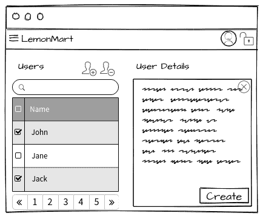
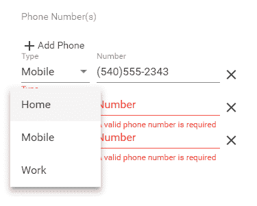
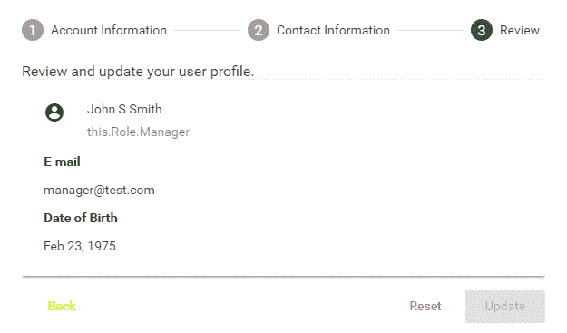
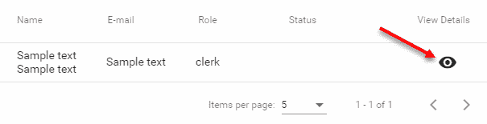
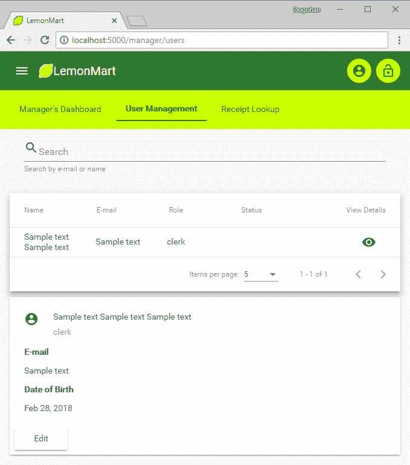

# 第十章：Angular 应用程序设计和示例

在这一章中，我们将完成 LemonMart 的实现。作为路由器优先方法的一部分，我将演示创建可重用的可路由组件，这些组件还支持数据绑定 - 使用解析守卫来减少样板代码，并利用类、接口、枚举、验证器和管道来最大程度地重用代码。此外，我们将创建多步骤表单，实现带分页的数据表，并探索响应式设计。在本书中，我们将涉及 Angular 和 Angular Material 提供的大部分主要功能。

在这一章中，我们将放开训练轮。我会提供一般指导来帮助你开始实现；然而，完成实现将取决于你自己的努力。如果你需要帮助，你可以参考本书提供的完整源代码，或者参考 GitHub 上最新的示例：[Github.com/duluca/lemon-mart](https://github.com/duluca/lemon-mart)。

在这一章中，你将学习以下主题：

+   面向对象类设计

+   可路由复用组件

+   缓存服务响应

+   HTTP POST 请求

+   多步骤响应式表单

+   解析守卫

+   使用辅助路由的主/细节视图

+   带分页的数据表

# 用户类和面向对象编程

到目前为止，我们只使用接口来表示数据，并且我们仍然希望在各种组件和服务之间传递数据时继续使用接口。然而，需要创建一个默认对象来初始化`BehaviorSubject`。在**面向对象编程**（**OOP**）中，让`User`对象拥有这个功能比让一个服务拥有更有意义。因此，让我们实现一个`User`类来实现这个目标。

在`user/user`文件夹中，定义一个`IUser`接口和一个在`UserModule`中提供的`User`类：

```ts
src/app/user/user/user.ts
import { Role } from '../../auth/role.enum'

export interface IUser {
  id: string
  email: string
  name: {
    first: string
    middle: string
    last: string
  }
  picture: string
  role: Role
  userStatus: boolean
  dateOfBirth: Date
  address: {
    line1: string
    line2: string
    city: string
    state: string
    zip: string
  }
  phones: IPhone[]
}

export interface IPhone {
  type: string
  number: string
  id: number
}

```

```ts
export class User implements IUser {
  constructor(
    public id = '',
    public email = '',
    public name = { first: '', middle: '', last: '' },
    public picture = '',
    public role = Role.None,
    public dateOfBirth = null,
    public userStatus = false,
    public address = {
      line1: '',
      line2: '',
      city: '',
      state: '',
      zip: '',
    },
    public phones = []
  ) {}

  static BuildUser(user: IUser) {
    return new User(
      user.id,
      user.email,
      user.name,
      user.picture,
      user.role,
      user.dateOfBirth,
      user.userStatus,
      user.address,
      user.phones
    )
  }
}
```

请注意，通过在构造函数中将所有属性定义为`public`属性并赋予默认值，我们一举两得；否则，我们将需要分别定义属性并初始化它们。这样，我们实现了简洁的实现。

你还可以为模板实现计算属性，比如方便地显示用户的`fullName`：

```ts
src/app/user/user/user.ts  
get fullName() {
  return `${this.name.first} ${this.name.middle} ${this.name.last}`
}
```

使用`static BuildUser`函数，您可以快速为对象填充从服务器接收到的数据。您还可以实现`toJSON()`函数，以在将数据发送到服务器之前自定义对象的序列化行为。

# 重用组件

我们需要一个能够显示特定用户信息的组件。这些信息被呈现的自然位置是当用户导航到`/user/profile`时。您可以看到`User`配置文件的模拟。

用户配置文件模拟

用户信息还在应用程序的其他位置模拟显示，位于`/manager/users`：

管理用户管理模拟

为了最大程度地重用代码，我们需要确保设计一个`User`组件，可以在两个上下文中使用。

例如，让我们完成两个与用户配置文件相关的屏幕的实现。

# 带缓存、GET 和 POST 的用户服务

为了实现用户配置文件，我们必须首先实现一个可以对`IUser`执行 CRUD 操作的`UserService`。在创建服务之前，您需要运行`lemon-mart-swagger-server`，这样您就可以在开发过程中使用它来拉取虚假数据：

1.  在`package.json`中添加一个名为`mock:standalone`的新脚本

```ts
package.json
"mock:standalone": "docker run -p 3000:3000 -t duluca/lemon-mart-swagger-server",
```

请注意，此脚本假定您已经在本地计算机上独立构建了您的 swagger 服务器和/或从您可以拉取的存储库中发布了它。

1.  执行脚本

1.  在`environment.ts`和`environment.prod.ts`中创建一个`baseUrl`属性，其中包含到您的模拟服务器的 url

```ts
src/environments/environment.ts
export const environment = {
  production: false,
  baseUrl: 'http://localhost:3000'
}
```

1.  在`user/user`下创建一个`UserService`，如下所示：

```ts
src/app/user/user/user.service.ts
@Injectable({
  providedIn: 'root'
})
export class UserService extends CacheService {
  currentUser = new BehaviorSubject<IUser>(this.getItem('user') || new User())
  private currentAuthStatus: IAuthStatus
  constructor(private httpClient: HttpClient, private authService: AuthService) {
    super()
    this.currentUser.subscribe(user => this.setItem('user', user))
    this.authService.authStatus.subscribe(
      authStatus => (this.currentAuthStatus = authStatus)
    )
  }

  getCurrentUser(): Observable<IUser> {
    const userObservable = this.getUser(this.currentAuthStatus.userId).pipe(
      catchError(transformError)
    )
    userObservable.subscribe(
      user => this.currentUser.next(user),
      err => Observable.throw(err)
    )
    return userObservable
  }

```

```ts
  getUser(id): Observable<IUser> {
    return this.httpClient.get<IUser>(`${environment.baseUrl}/v1/user/${id}`)
  }

  updateUser(user: IUser): Observable<IUser> {
    this.setItem('draft-user', user) // cache user data in case of errors
    const updateResponse = this.httpClient
      .put<IUser>(`${environment.baseUrl}/v1/user/${user.id || 0}`, user)
      .pipe(catchError(transformError))

    updateResponse.subscribe(
      res => {
        this.currentUser.next(res)
        this.removeItem('draft-user')
      },
      err => Observable.throw(err)
    )

    return updateResponse
  }
}
```

在`UserService`中，`currentUser`将作为锚定`BehaviorSubject`。为了保持我们的缓存最新，我们在`constructor`中订阅`currentUser`的变化。此外，我们订阅`authStatus`，因此当用户加载其自己的配置文件时，`getProfile`可以使用经过身份验证的用户的`userId`执行`GET`调用。

此外，我们单独提供了一个`getUser`函数，以便管理员可以加载其他用户配置文件的详细信息，这在我们稍后在本章实现主/细节视图时将会需要。最后，`updateUser`接受一个实现`IUser`接口的对象，因此数据可以发送到`PUT`端点。重要的是要强调，当传递数据时，您应始终坚持接口而不是像`User`这样的具体实现。这是 SOLID 原则中的 D-依赖反转原则。依赖具体实现会带来很多风险，因为它们经常变化，而像`IUser`这样的抽象很少会改变。毕竟，你会直接把灯焊接到墙上的电线吗？不，你会先把灯焊接到插头上，然后使用插头来获取你需要的电力。

`UserService`现在可以用于基本的 CRUD 操作。

# 用户配置文件与多步鉴权启用的响应式表单

现在，让我们实现一个多步输入表单，以捕获用户配置文件信息。我们还将使用媒体查询使这个多步表单对移动设备具有响应性。

1.  让我们从添加一些辅助数据开始，这些数据将帮助我们显示一个带有选项的输入表单：

```ts
src/app/user/profile/data.ts
export interface IUSState {
  code: string
  name: string
}

export function USStateFilter(value: string): IUSState[] {
  return USStates.filter(state => {
    return (
      (state.code.length === 2 && state.code.toLowerCase() === value.toLowerCase()) ||
      state.name.toLowerCase().indexOf(value.toLowerCase()) === 0
    )
  })
}

export enum PhoneType {
  Mobile,
  Home,
  Work,
}

const USStates = [
  { code: 'AK', name: 'Alaska' },
  { code: 'AL', name: 'Alabama' },
  { code: 'AR', name: 'Arkansas' },
  { code: 'AS', name: 'American Samoa' },
  { code: 'AZ', name: 'Arizona' },
  { code: 'CA', name: 'California' },
  { code: 'CO', name: 'Colorado' },
  { code: 'CT', name: 'Connecticut' },
  { code: 'DC', name: 'District of Columbia' },
  { code: 'DE', name: 'Delaware' },
  { code: 'FL', name: 'Florida' },
  { code: 'GA', name: 'Georgia' },
  { code: 'GU', name: 'Guam' },
  { code: 'HI', name: 'Hawaii' },
  { code: 'IA', name: 'Iowa' },
  { code: 'ID', name: 'Idaho' },
  { code: 'IL', name: 'Illinois' },
  { code: 'IN', name: 'Indiana' },
  { code: 'KS', name: 'Kansas' },
  { code: 'KY', name: 'Kentucky' },
  { code: 'LA', name: 'Louisiana' },
  { code: 'MA', name: 'Massachusetts' },
  { code: 'MD', name: 'Maryland' },
  { code: 'ME', name: 'Maine' },
  { code: 'MI', name: 'Michigan' },
  { code: 'MN', name: 'Minnesota' },
  { code: 'MO', name: 'Missouri' },
  { code: 'MS', name: 'Mississippi' },
  { code: 'MT', name: 'Montana' },
  { code: 'NC', name: 'North Carolina' },
  { code: 'ND', name: 'North Dakota' },
  { code: 'NE', name: 'Nebraska' },
  { code: 'NH', name: 'New Hampshire' },
  { code: 'NJ', name: 'New Jersey' },
  { code: 'NM', name: 'New Mexico' },
  { code: 'NV', name: 'Nevada' },
  { code: 'NY', name: 'New York' },
  { code: 'OH', name: 'Ohio' },
  { code: 'OK', name: 'Oklahoma' },
  { code: 'OR', name: 'Oregon' },
  { code: 'PA', name: 'Pennsylvania' },
  { code: 'PR', name: 'Puerto Rico' },
  { code: 'RI', name: 'Rhode Island' },
  { code: 'SC', name: 'South Carolina' },
  { code: 'SD', name: 'South Dakota' },
  { code: 'TN', name: 'Tennessee' },
  { code: 'TX', name: 'Texas' },
  { code: 'UT', name: 'Utah' },
  { code: 'VA', name: 'Virginia' },
  { code: 'VI', name: 'Virgin Islands' },
  { code: 'VT', name: 'Vermont' },
  { code: 'WA', name: 'Washington' },
  { code: 'WI', name: 'Wisconsin' },
  { code: 'WV', name: 'West Virginia' },
  { code: 'WY', name: 'Wyoming' },
]

```

1.  安装一个辅助库以以编程方式访问 TypeScript 枚举值

```ts
$ npm i ts-enum-util
```

1.  在`common/validations.ts`中添加新的验证规则

```ts
src/app/common/validations.ts
...

export const OptionalTextValidation = [Validators.minLength(2), Validators.maxLength(50)]
export const RequiredTextValidation = OptionalTextValidation.concat([Validators.required])
export const OneCharValidation = [Validators.minLength(1), Validators.maxLength(1)]
export const BirthDateValidation = [
  Validators.required,
  Validators.min(new Date().getFullYear() - 100),
  Validators.max(new Date().getFullYear()),
]
export const USAZipCodeValidation = [
  Validators.required,
  Validators.pattern(/^\d{5}(?:[-\s]\d{4})?$/),
]
export const USAPhoneNumberValidation = [
  Validators.required,
  Validators.pattern(/^\D?(\d{3})\D?\D?(\d{3})\D?(\d{4})$/),
]
```

1.  现在按照以下方式实现`profile.component.ts`：

```ts
src/app/user/profile/profile.component.ts
import { Role as UserRole } from '../../auth/role.enum'
import { $enum } from 'ts-enum-util'
...
@Component({
  selector: 'app-profile',
  templateUrl: './profile.component.html',
  styleUrls: ['./profile.component.css'],
})
export class ProfileComponent implements OnInit {
  Role = UserRole
  PhoneTypes = $enum(PhoneType).getKeys()
  userForm: FormGroup
  states: Observable<IUSState[]>
  userError = ''
  currentUserRole = this.Role.None

  constructor(
    private formBuilder: FormBuilder,
    private router: Router,
    private userService: UserService,
    private authService: AuthService
  ) {}

  ngOnInit() {
    this.authService.authStatus.subscribe(
      authStatus => (this.currentUserRole = authStatus.userRole)
    )

    this.userService.getCurrentUser().subscribe(user => {
      this.buildUserForm(user)
    })

    this.buildUserForm()
  }
  ...
}
```

在加载时，我们从`userService`请求当前用户，但这将需要一些时间，因此我们必须首先用`this.buildUserForm()`构建一个空表单。在这个函数中，您还可以实现一个解析守卫，如后面的部分所讨论的那样，根据路由提供的`userId`加载用户，并将该数据传递到`buildUserForm(routeUser)`中，跳过加载`currentUser`以增加此组件的可重用性。

# 表单组

我们的表单有许多输入字段，因此我们将使用`FormGroup`，由`this.formBuilder.group`创建，来容纳我们的各种`FormControl`对象。此外，子`FormGroup`对象将允许我们维护正确的数据结构形状。

按照以下方式开始构建`buildUserForm`函数：

```ts
src/app/user/profile/profile.component.ts
...
  buildUserForm(user?: IUser) {
    this.userForm = this.formBuilder.group({
      email: [
        {
          value: (user && user.email) || '',
          disabled: this.currentUserRole !== this.Role.Manager,
        },
        EmailValidation,
      ],
      name: this.formBuilder.group({
        first: [(user && user.name.first) || '', RequiredTextValidation],
        middle: [(user && user.name.middle) || '', OneCharValidation],
        last: [(user && user.name.last) || '', RequiredTextValidation],
      }),
      role: [
        {
          value: (user && user.role) || '',
          disabled: this.currentUserRole !== this.Role.Manager,
        },
        [Validators.required],
      ],
      dateOfBirth: [(user && user.dateOfBirth) || '', BirthDateValidation],
      address: this.formBuilder.group({
        line1: [
          (user && user.address && user.address.line1) || '',
          RequiredTextValidation,
        ],
        line2: [
          (user && user.address && user.address.line2) || '',
          OptionalTextValidation,
        ],
        city: [(user && user.address && user.address.city) || '', RequiredTextValidation],
        state: [
          (user && user.address && user.address.state) || '',
          RequiredTextValidation,
        ],
        zip: [(user && user.address && user.address.zip) || '', USAZipCodeValidation],
      }),
      ...
    })
    ...
  }
...
```

`buildUserForm` 可选地接受一个 `IUser` 来预填表单，否则所有字段都设置为它们的默认值。`userForm` 本身是顶级 `FormGroup`。各种 `FormControls` 被添加到其中，例如 `email`，并根据需要附加验证器。请注意 `name` 和 `address` 是它们自己的 `FormGroup` 对象。这种父子关系确保了表单数据的正确结构，当序列化为 JSON 时，它符合 `IUser` 的结构，以便我们的应用程序和服务器端代码可以利用。

您将独立完成 `userForm` 的实现，按照本章提供的示例代码，并且我将在接下来的几节中逐步解释代码的某些关键功能。

# 步进器和响应式布局

Angular Material Stepper 需要使用 `MatStepperModule`。该步进器允许将表单输入分解为多个步骤，以便用户不会一次处理大量的输入字段。用户仍然可以跟踪他们在流程中的位置，并且作为开发人员，我们可以分解 `<form>` 实现并逐步强制执行验证规则，或者创建可选的工作流，其中某些步骤可以被跳过或必需的。与所有 Material 用户控件一样，步进器是根据响应式 UX 设计的。在接下来的几节中，我们将实现三个步骤，涵盖流程中的不同表单输入技术：

1.  账户信息

+   输入验证

+   使用媒体查询的响应式布局

+   计算属性

+   日期选择器

1.  联系信息

+   类型提前支持

+   动态表单数组

1.  回顾

+   只读视图

+   保存和清除数据

让我们为用户模块准备一些新的 Material 模块：

1.  创建一个 `user-material.module`，其中包含以下 Material 模块：

```ts
MatAutocompleteModule,
MatDatepickerModule,
MatDividerModule,
MatLineModule,
MatNativeDateModule,
MatRadioModule,
MatSelectModule,
MatStepperModule,
```

1.  确保 `user.module` 正确导入：

1.  新的 `user-material.module`

1.  基线 `app-material.module`

1.  需要 `FormsModule`、`ReactiveFormsModule` 和 `FlexLayoutModule`

当我们开始添加子 Material 模块时，将根 `material.module.ts` 文件重命名为 `app-material.modules.ts` 是有意义的，与 `app-routing.module.ts` 的命名方式一致。今后，我将使用后一种约定。

1.  现在，开始实现账户信息步骤的第一行：

```ts
src/app/user/profile/profile.component.html <mat-toolbar color="accent"> <h5>User Profile</h5>
</mat-toolbar>

<mat-horizontal-stepper #stepper="matHorizontalStepper">
  <mat-step [stepControl]="userForm">
    <form [formGroup]="userForm">
      <ng-template matStepLabel>Account Information</ng-template>
      <div class="stepContent">
        <div fxLayout="row" fxLayout.lt-sm="column" [formGroup]="userForm.get('name')" fxLayoutGap="10px">
          <mat-form-field fxFlex="40%">
            <input matInput placeholder="First Name" aria-label="First Name" formControlName="first">
            <mat-error *ngIf="userForm.get('name').get('first').hasError('required')">
              First Name is required
            </mat-error>
            <mat-error *ngIf="userForm.get('name').get('first').hasError('minLength')">
              Must be at least 2 characters
            </mat-error>
            <mat-error *ngIf="userForm.get('name').get('first').hasError('maxLength')">
              Can't exceed 50 characters
            </mat-error>
          </mat-form-field>
          <mat-form-field fxFlex="20%">
            <input matInput placeholder="MI" aria-label="Middle Initial" formControlName="middle">
            <mat-error *ngIf="userForm.get('name').get('middle').invalid">
              Only inital
            </mat-error>
          </mat-form-field>
          <mat-form-field fxFlex="40%">
            <input matInput placeholder="Last Name" aria-label="Last Name" formControlName="last">
            <mat-error *ngIf="userForm.get('name').get('last').hasError('required')">
              Last Name is required
            </mat-error>
            <mat-error *ngIf="userForm.get('name').get('last').hasError('minLength')">
              Must be at least 2 characters
            </mat-error>
            <mat-error *ngIf="userForm.get('name').get('last').hasError('maxLength')">
              Can't exceed 50 characters
            </mat-error>
          </mat-form-field>
        </div>
       ...
      </div>
    </form>
   </mat-step>
...
</mat-horizontal-stepper>
```

1.  请注意了解步进器和表单配置的工作方式，到目前为止，您应该看到第一行呈现，提取模拟数据：

！[](Images/c97a1ab4-0f09-4ffa-988c-7653e3d2fac7.png)多步骤表单 - 步骤 1

1.  为了完成表单的实现，请参考本章提供的示例代码或[GitHub.com/duluca/lemon-mart](https://github.com/duluca/lemon-mart)上的参考实现

在您的实现过程中，您会注意到 Review 步骤使用了一个名为`<app-view-user>`的指令。这个组件的最小版本在下面的 ViewUser 组件部分中实现了。但是，现在可以随意实现内联功能，并在可重用组件与绑定和路由数据部分重构代码。

在下面的截图中，您可以看到桌面上多步骤表单的完成实现是什么样子的：

！[](Images/57c7a762-3c76-479f-8631-9aea9fe153f0.png)桌面上的多步骤表单

请注意，在带有`fxLayout="row"`的行上添加`fxLayout.lt-sm="column"`可以启用表单的响应式布局，如下所示：

！[](Images/b81c87cc-c4d2-47b6-b535-0d4ee3487d63.png)移动设备上的多步骤表单让我们看看出生日期字段在下一节中是如何工作的。

# 计算属性和日期选择器

如果您想根据用户输入显示计算属性，可以按照这里显示的模式进行操作：

```ts
src/app/user/profile/profile.component.ts ...
get dateOfBirth() {
  return this.userForm.get('dateOfBirth').value || new Date()
}

get age() {
  return new Date().getFullYear() - this.dateOfBirth.getFullYear()
}
...
```

模板中计算属性的使用如下所示：

```ts
src/app/user/profile/profile.component ...
<mat-form-field fxFlex="50%">
  <input matInput placeholder="Date of Birth" aria-label="Date of Birth" formControlName="dateOfBirth" [matDatepicker]="dateOfBirthPicker">
  <mat-hint *ngIf="userForm.get('dateOfBirth').touched">{{this.age}} year(s) old</mat-hint>
  <mat-datepicker-toggle matSuffix [for]="dateOfBirthPicker"></mat-datepicker-toggle>
  <mat-datepicker #dateOfBirthPicker></mat-datepicker>
  <mat-error *ngIf="userForm.get('dateOfBirth').invalid">
    Date must be with the last 100 years
  </mat-error>
</mat-form-field>
...
```

这就是它的作用：

！[](Images/32973f3a-9310-4b3f-a27a-576e3ae49b15.png)使用日期选择器选择日期

选择日期后，将显示计算出的年龄，如下所示：

！[](Images/4af6873a-d130-449b-a01d-96b82b2c4fb2.png)计算年龄属性

现在，让我们继续下一步，联系信息，并看看我们如何能够方便地显示和输入地址字段的州部分。

# 输入提示支持

在`buildUserForm`中，我们设置了一个监听器`address.state`来支持类型向前筛选下拉体验：

```ts
src/app/user/profile/profile.component.ts ...
this.states = this.userForm
  .get('address')
  .get('state')
  .valueChanges.pipe(startWith(''), map(value => USStateFilter(value)))
...
```

在模板上，使用`mat-autocomplete`实现绑定到过滤后的州数组的`async`管道：

```ts
src/app/user/profile/profile.component.html ...
<mat-form-field fxFlex="30%">
  <input type="text" placeholder="State" aria-label="State" matInput formControlName="state" [matAutocomplete]="stateAuto">
  <mat-autocomplete #stateAuto="matAutocomplete">
    <mat-option *ngFor="let state of states | async" [value]="state.name">
      {{ state.name }}
    </mat-option>
  </mat-autocomplete>
  <mat-error *ngIf="userForm.get('address').get('state').hasError('required')">
    State is required
  </mat-error>
</mat-form-field>
...
```

当用户输入`V`字符时，它是什么样子：

！[](Images/3ffccda5-771e-4671-afee-6fe029507a19.png)带有输入提示支持的下拉菜单在下一节中，让我们启用多个电话号码的输入。

# 动态表单数组

请注意，`phones`是一个数组，可能允许多个输入。我们可以通过使用`this.formBuilder.array`构建一个`FormArray`和几个辅助函数来实现这一点：

```ts
src/app/user/profile/profile.component.ts
...
  phones: this.formBuilder.array(this.buildPhoneArray(user ? user.phones : [])),
...
  private buildPhoneArray(phones: IPhone[]) {
    const groups = []

    if (!phones || (phones && phones.length === 0)) {
      groups.push(this.buildPhoneFormControl(1))
    } else {
      phones.forEach(p => {
        groups.push(this.buildPhoneFormControl(p.id, p.type, p.number))
      })
    }
    return groups
  }

  private buildPhoneFormControl(id, type?: string, number?: string) {
    return this.formBuilder.group({
      id: [id],
      type: [type || '', Validators.required],
      number: [number || '', USAPhoneNumberValidation],
    })
  }
...
```

`BuildPhoneArray`支持使用单个电话输入初始化表单，或者使用现有数据填充它，与`BuildPhoneFormControl`协同工作。当用户点击添加按钮创建新的输入行时，后者函数非常有用：

```ts
src/app/user/profile/profile.component.ts
...  
  addPhone() {
    this.phonesArray.push(
      this.buildPhoneFormControl(this.userForm.get('phones').value.length + 1)
    )
  }

  get phonesArray(): FormArray {
    return <FormArray>this.userForm.get('phones')
  }
...
```

`phonesArray`属性的 getter 是一种常见的模式，可以更容易地访问某些表单属性。然而，在这种情况下，它也是必要的，因为必须将`get('phones')`强制转换为`FormArray`，这样我们才能在模板上访问它的`length`属性：

```ts
src/app/user/profile/profile.component.html
...
<mat-list formArrayName="phones">
  <h2 mat-subheader>Phone Number(s)</h2>
  <button mat-button (click)="this.addPhone()">
    <mat-icon>add</mat-icon>
    Add Phone
  </button>
  <mat-list-item *ngFor="let position of this.phonesArray.controls let i=index" [formGroupName]="i">
  <mat-form-field fxFlex="100px">
    <mat-select placeholder="Type" formControlName="type">
      <mat-option *ngFor="let type of this.PhoneTypes" [value]="type">
      {{ type }}
      </mat-option>
    </mat-select>
  </mat-form-field>
  <mat-form-field fxFlex fxFlexOffset="10px">
    <input matInput type="text" placeholder="Number" formControlName="number">
    <mat-error *ngIf="this.phonesArray.controls[i].invalid">
      A valid phone number is required
    </mat-error>
  </mat-form-field>
  <button fxFlex="33px" mat-icon-button (click)="this.phonesArray.removeAt(i)">
    <mat-icon>close</mat-icon>
  </button>
  </mat-list-item>
</mat-list>
...
```

`remove`函数是内联实现的。

让我们看看它应该如何工作：

使用 FormArray 的多个输入

现在我们已经完成了输入数据，可以继续进行步进器的最后一步，审查。然而，正如之前提到的，审查步骤使用`app-view-user`指令来显示其数据。让我们先构建那个视图。

# ViewUser 组件

以下是`<app-view-user>`指令的最小实现，这是审查步骤的先决条件。

按照下面的示例在`user`下创建一个新的`viewUser`组件：

```ts
src/app/user/view-user/view-user.component.ts
import { Component, OnInit, Input } from '@angular/core'
import { IUser, User } from '../user/user'

@Component({
  selector: 'app-view-user',
  template: `
    <mat-card>
      <mat-card-header>
        <div mat-card-avatar><mat-icon>account_circle</mat-icon></div>
        <mat-card-title>{{currentUser.fullName}}</mat-card-title>
        <mat-card-subtitle>{{currentUser.role}}</mat-card-subtitle>
      </mat-card-header>
      <mat-card-content>
        <p><span class="mat-input bold">E-mail</span></p>
        <p>{{currentUser.email}}</p>
        <p><span class="mat-input bold">Date of Birth</span></p>
        <p>{{currentUser.dateOfBirth | date:'mediumDate'}}</p>
      </mat-card-content>
      <mat-card-actions *ngIf="!this.user">
        <button mat-button mat-raised-button>Edit</button>
      </mat-card-actions>
    </mat-card>
  `,
  styles: [
    `
    .bold {
      font-weight: bold
    }
  `,
  ],
})
export class ViewUserComponent implements OnChanges {
  @Input() user: IUser
  currentUser = new User()

  constructor() {}

  ngOnChanges() {
    if (this.user) {
      this.currentUser = User.BuildUser(this.user)
    }
  }
}
```

上面的组件使用输入绑定与`@Input`来获取用户数据，符合`IUser`接口，来自外部组件。我们实现了`ngOnChanges`事件，每当绑定的数据发生变化时就会触发。在这个事件中，我们使用`User.BuildUser`将存储在`this.user`中的简单 JSON 对象实例化为`User`类的实例，并将其赋值给`this.currentUser`。模板使用这个变量，因为像`currentUser.fullName`这样的计算属性只有在数据驻留在`User`类的实例中时才能工作。

现在，我们准备完成多步表单。

# 组件审查和保存表单

在多步表单的最后一步，用户应该能够审查然后保存表单数据。作为一个良好的实践，成功的`POST`请求将返回保存的数据到浏览器。然后我们可以使用从服务器接收到的信息重新加载表单：

```ts
src/app/user/profile/profile.component 
...
async save(form: FormGroup) {
  this.userService
    .updateUser(form.value)
    .subscribe(res => this.buildUserForm(res), err => (this.userError = err))
 }
...
```

如果有错误，它们将被设置为`userError`以供显示。在保存之前，我们将以紧凑的形式呈现数据，使用一个可重用的组件将表单数据绑定到其中：

```ts
src/app/user/profile/profile.component.html
...
<mat-step [stepControl]="userForm">
  <form [formGroup]="userForm" (ngSubmit)="save(userForm)">
  <ng-template matStepLabel>Review</ng-template>
  <div class="stepContent">
    Review and update your user profile.
    <app-view-user [user]="this.userForm.value"></app-view-user>
  </div>
  <div fxLayout="row" class="margin-top">
    <button mat-button matStepperPrevious color="accent">Back</button>
    <div class="flex-spacer"></div>
    <div *ngIf="userError" class="mat-caption error">{{userError}}</div>
    <button mat-button color="warn" (click)="stepper.reset()">Reset</button>
    <button mat-raised-button matStepperNext color="primary" type="submit" [disabled]="this.userForm.invalid">Update</button>
  </div>
  </form>
</mat-step>
...
```

这是最终产品应该是什么样子的：

审查步骤请注意重置表单的选项。添加一个警报对话框来确认重置用户输入数据将是良好的用户体验。

现在用户配置文件输入已完成，我们已经完成了创建主/细节视图的最终目标的一半，其中经理可以点击用户并查看其配置文件详细信息。我们仍然有很多代码要添加，在这个过程中，我们已经陷入了添加大量样板代码来加载组件所需数据的模式。在下一节中，我们将学习解析守卫，以便简化我们的代码并减少样板代码。

# 解析守卫

解析守卫是一种路由守卫，如第九章中所述，*设计身份验证和授权*。解析守卫可以通过从路由参数中读取记录 ID 来加载组件所需的数据，异步加载数据，并在组件激活和初始化时准备好。

解析守卫的主要优势包括加载逻辑的可重用性、减少样板代码以及减少依赖性，因为组件可以接收到所需的数据而无需导入任何服务：

1.  在`user/user`下创建一个新的`user.resolve.ts`类：

```ts
**src/app/user/user/user.resolve.ts**
import { Injectable } from '@angular/core'
import { Resolve, ActivatedRouteSnapshot } from '@angular/router'
import { UserService } from './user.service'
import { IUser } from './user'

@Injectable()
export class UserResolve implements Resolve<IUser> {
  constructor(private userService: UserService) {}

  resolve(route: ActivatedRouteSnapshot) {
    return this.userService.getUser(route.paramMap.get('userId'))
  }
} 
```

1.  您可以使用解析守卫，如下所示：

```ts
example
{
  path: 'user',
  component: ViewUserComponent,
  resolve: {
    user: UserResolve,
  },
},
```

1.  `routerLink`将如下所示：

```ts
example
['user', {userId: row.id}]
```

1.  在目标组件的`ngOnInit`钩子中，您可以这样读取已解析的用户：

```ts
example
this.route.snapshot.data['user']
```

您可以在接下来的两个部分中观察到这种行为，之后我们将更新`ViewUserComponent`和路由以利用解析守卫。

# 可重用的组件与绑定和路由数据

现在，让我们重构`viewUser`组件，以便我们可以在多个上下文中重用它。一个是可以使用解析守卫加载自己的数据，适用于主/细节视图，另一个是可以将当前用户绑定到它，就像我们在之前部分构建的多步输入表单的审阅步骤中所做的那样：

1.  使用以下更改更新`viewUser`组件：

```ts
src/app/user/view-user/view-user.component.ts
...
import { ActivatedRoute } from '@angular/router'

export class ViewUserComponent implements OnChanges, OnInit {
  ...
  constructor(private route: ActivatedRoute) {}

  ngOnInit() {
    if (this.route.snapshot && this.route.snapshot.data['user']) {
      this.currentUser = User.BuildUser(this.route.snapshot.data['user'])
      this.currentUser.dateOfBirth = Date.now() // for data mocking purposes only
    }
  }
  ...
```

现在我们有两个独立的事件。一个是`ngOnChanges`，它处理了如果`this.user`已经绑定，则将值分配给`this.currentUser`。`ngOnInit`只会在组件首次初始化或路由到达时触发。在这种情况下，如果路由的任何数据已经解析，它将被分配给`this.currentUser`。

为了能够在多个惰性加载模块中使用该组件，我们必须将其包装在自己的模块中。

1.  在`app`下创建一个新的`shared-components.module.ts`：

```ts
src/app/shared-components.module.ts
import { NgModule } from '@angular/core'
import { ViewUserComponent } from './user/view-user/view-user.component'
import { FormsModule, ReactiveFormsModule } from '@angular/forms'
import { FlexLayoutModule } from '@angular/flex-layout'
import { CommonModule } from '@angular/common'
import { MaterialModule } from './app-material.module'

@NgModule({
  imports: [
    CommonModule,
    FormsModule,
    ReactiveFormsModule,
    FlexLayoutModule,
    MaterialModule,
  ],
  declarations: [ViewUserComponent],
  exports: [ViewUserComponent],
})
export class SharedComponentsModule {}

```

1.  确保将`SharedComponentsModule`模块导入到您打算在其中使用`ViewUserComponent`的每个功能模块中。在我们的情况下，这将是`User`和`Manager`模块。

1.  从`User`模块声明中删除`ViewUserComponent`

我们现在已经准备好开始实现主/细节视图了。

# 主/细节视图辅助路由

路由器优先架构的真正力量在于使用辅助路由，我们可以仅通过路由器配置影响组件的布局，从而实现丰富的场景，我们可以将现有组件重新组合成不同的布局。辅助路由是彼此独立的路由，它们可以在已在标记中定义的命名出口中呈现内容，例如`<router-outlet name="master">`或`<router-outlet name="detail">`。此外，辅助路由可以有自己的参数、浏览器历史、子级和嵌套辅助。

在以下示例中，我们将使用辅助路由实现基本的主/细节视图：

1.  实现一个具有两个命名出口的简单组件：

```ts
src/app/manager/user-management/user-manager.component.ts
template: `
    <div class="horizontal-padding">
      <router-outlet name="master"></router-outlet>
      <div style="min-height: 10px"></div>
      <router-outlet name="detail"></router-outlet>
    </div>
  `
```

1.  在`manager`下创建一个`userTable`组件

1.  更新`manager-routing.module`以定义辅助路由：

```ts
src/app/manager/manager-routing.module.ts
  ...
      {
        path: 'users',
        component: UserManagementComponent,
        children: [
          { path: '', component: UserTableComponent, outlet: 
         'master' },
          {
            path: 'user',
            component: ViewUserComponent,
            outlet: 'detail',
            resolve: {
              user: UserResolve,
            },
          },
        ],
        canActivate: [AuthGuard],
        canActivateChild: [AuthGuard],
        data: {
          expectedRole: Role.Manager,
        },
      },
  ...
```

这意味着当用户导航到`/manager/users`时，他们将看到`UserTableComponent`，因为它是用`default`路径实现的。

1.  在`manager.module`中提供`UserResolve`，因为`viewUser`依赖于它

1.  在`userTable`中实现一个临时按钮

```ts
src/app/manager/user-table/user-table.component.html
<a mat-button mat-icon-button [routerLink]="['/manager/users', { outlets: { detail: ['user', {userId: 'fakeid'}] } }]" skipLocationChange>
  <mat-icon>visibility</mat-icon>
</a>
```

考虑用户点击上面定义的查看详情按钮，然后`ViewUserComponent`将为具有给定`userId`的用户呈现。在下一个截图中，您可以看到在我们在下一节中实现数据表后，查看详情按钮将是什么样子：

查看详情按钮您可以为主和细节定义许多组合和替代组件，从而允许无限可能的动态布局。然而，设置`routerLink`可能是一种令人沮丧的体验。根据确切的条件，您必须在链接中提供或不提供所有或一些出口。例如，对于前面的情况，如果链接是`['/manager/users', { outlets: { master: [''], detail: ['user', {userId: row.id}] } }]`，路由将悄悄地无法加载。预计这些怪癖将在未来的 Angular 版本中得到解决。

现在，我们已经完成了对`ViewUserComponent`的解析守卫的实现，您可以使用 Chrome Dev Tools 来查看数据是否被正确加载。在调试之前，请确保我们在第八章中创建的模拟服务器正在运行。

1.  确保模拟服务器正在运行，通过执行`docker run -p 3000:3000 -t duluca/lemon-mart-swagger-server`或`npm run mock:standalone`。

1.  在 Chrome Dev Tools 中，设置一个断点，就在`this.currentUser`被分配后，如下所示：

Dev Tools 调试 ViewUserComponent

您将观察到`this.currentUser`在`ngOnInit`函数内部正确设置，而无需加载数据的样板代码，显示了解析守卫的真正好处。`ViewUserComponent`是细节视图；现在让我们将主视图实现为带分页的数据表。

# 带分页的数据表

我们已经创建了用于布置主/细节视图的脚手架。在主输出中，我们将拥有一个用户的分页数据表，因此让我们实现`UserTableComponent`，其中将包含一个名为`dataSource`的`MatTableDataSource`属性。我们需要能够使用标准分页控件（如`pageSize`和`pagesToSkip`）批量获取用户数据，并能够通过用户提供的`searchText`进一步缩小选择范围。

让我们从向`UserService`添加必要的功能开始。

1.  实现一个新的接口`IUsers`来描述分页数据的数据结构

```ts
src/app/user/user/user.service.ts
...
export interface IUsers {
  items: IUser[]
  total: number
}
```

1.  在`UserService`中添加`getUsers`

```ts
src/app/user/user/user.service.ts
...
getUsers(pageSize: number, searchText = '', pagesToSkip = 0): Observable<IUsers> {
  return this.httpClient.get<IUsers>(`${environment.baseUrl}/v1/users`, {
    params: {
      search: searchText,
      offset: pagesToSkip.toString(),
      limit: pageSize.toString(),
    },
  })
}
...
```

1.  设置`UserTable`的分页、排序和过滤：

```ts
src/app/manager/user-table/user-table.component
import { AfterViewInit, Component, OnInit, ViewChild } from '@angular/core'
import { FormControl } from '@angular/forms'
import { MatPaginator, MatSort, MatTableDataSource } from '@angular/material'
import { merge, of } from 'rxjs'
import { catchError, debounceTime, map, startWith, switchMap } from 'rxjs/operators'
import { OptionalTextValidation } from '../../common/validations'
import { IUser } from '../../user/user/user'
import { UserService } from '../../user/user/user.service'

@Component({
  selector: 'app-user-table',
  templateUrl: './user-table.component.html',
  styleUrls: ['./user-table.component.css'],
})
export class UserTableComponent implements OnInit, AfterViewInit {
  displayedColumns = ['name', 'email', 'role', 'status', 'id']
  dataSource = new MatTableDataSource()
  resultsLength = 0
  _isLoadingResults = true
  _hasError = false
  errorText = ''
  _skipLoading = false

  search = new FormControl('', OptionalTextValidation)

  @ViewChild(MatPaginator) paginator: MatPaginator
  @ViewChild(MatSort) sort: MatSort

  constructor(private userService: UserService) {}

  ngOnInit() {}

  ngAfterViewInit() {
    this.dataSource.paginator = this.paginator
    this.dataSource.sort = this.sort

    this.sort.sortChange.subscribe(() => (this.paginator.pageIndex = 0))

    if (this._skipLoading) {
      return
    }

    merge(
      this.sort.sortChange,
      this.paginator.page,
      this.search.valueChanges.pipe(debounceTime(1000))
    )
      .pipe(
        startWith({}),
        switchMap(() => {
          this._isLoadingResults = true
          return this.userService.getUsers(
            this.paginator.pageSize,
            this.search.value,
            this.paginator.pageIndex
          )
        }),
        map((data: { total: number; items: IUser[] }) => {
          this._isLoadingResults = false
          this._hasError = false
          this.resultsLength = data.total

          return data.items
        }),
        catchError(err => {
          this._isLoadingResults = false
          this._hasError = true
          this.errorText = err
          return of([])
        })
      )
      .subscribe(data => (this.dataSource.data = data))
  }

  get isLoadingResults() {
    return this._isLoadingResults
  }

  get hasError() {
    return this._hasError
  }
}

```

初始化分页、排序和过滤属性后，我们使用`merge`方法来监听所有三个数据流的变化。如果有一个变化，整个`pipe`就会被触发，其中包含对`this.userService.getUsers`的调用。然后将结果映射到表格的`datasource`属性，否则会捕获和处理错误。

1.  创建一个包含以下 Material 模块的`manager-material.module`：

```ts
MatTableModule, 
MatSortModule, 
MatPaginatorModule, 
MatProgressSpinnerModule
```

1.  确保`manager.module`正确导入：

1.  新的`manager-material.module`

1.  基线`app-material.module`

1.  必需的`FormsModule`、`ReactiveFormsModule`和`FlexLayoutModule`

1.  最后，实现`userTable`模板：

```ts
src/app/manager/user-table/user-table.component.html
<div class="filter-row">
  <form style="margin-bottom: 32px">
    <div fxLayout="row">
      <mat-form-field class="full-width">
        <mat-icon matPrefix>search</mat-icon>
        <input matInput placeholder="Search" aria-label="Search" [formControl]="search">
        <mat-hint>Search by e-mail or name</mat-hint>
        <mat-error *ngIf="search.invalid">
          Type more than one character to search
        </mat-error>
      </mat-form-field>
    </div>
  </form>
</div>
<div class="mat-elevation-z8">
  <div class="loading-shade" *ngIf="isLoadingResults">
    <mat-spinner *ngIf="isLoadingResults"></mat-spinner>
    <div class="error" *ngIf="hasError">
      {{errorText}}
    </div>
  </div>
  <mat-table [dataSource]="dataSource" matSort>
    <ng-container matColumnDef="name">
      <mat-header-cell *matHeaderCellDef mat-sort-header> Name </mat-header-cell>
      <mat-cell *matCellDef="let row"> {{row.name.first}} {{row.name.last}} </mat-cell>
    </ng-container>
    <ng-container matColumnDef="email">
      <mat-header-cell *matHeaderCellDef mat-sort-header> E-mail </mat-header-cell>
      <mat-cell *matCellDef="let row"> {{row.email}} </mat-cell>
    </ng-container>
    <ng-container matColumnDef="role">
      <mat-header-cell *matHeaderCellDef mat-sort-header> Role </mat-header-cell>
      <mat-cell *matCellDef="let row"> {{row.role}} </mat-cell>
    </ng-container>
    <ng-container matColumnDef="status">
      <mat-header-cell *matHeaderCellDef mat-sort-header> Status </mat-header-cell>
      <mat-cell *matCellDef="let row"> {{row.status}} </mat-cell>
    </ng-container>
    <ng-container matColumnDef="id">
      <mat-header-cell *matHeaderCellDef fxLayoutAlign="end center">View Details</mat-header-cell>
      <mat-cell *matCellDef="let row" fxLayoutAlign="end center" style="margin-right: 8px">
        <a mat-button mat-icon-button [routerLink]="['/manager/users', { outlets: { detail: ['user', {userId: row.id}] } }]" skipLocationChange>
          <mat-icon>visibility</mat-icon>
        </a>
      </mat-cell>
    </ng-container>
    <mat-header-row *matHeaderRowDef="displayedColumns"></mat-header-row>
    <mat-row *matRowDef="let row; columns: displayedColumns;">
    </mat-row>
  </mat-table>

  <mat-paginator [pageSizeOptions]="[5, 10, 25, 100]"></mat-paginator>
</div>

```

只有主视图时，表格看起来像这个截图：

用户表

如果您点击查看图标，`ViewUserComponent`将在详细信息输出中呈现，如下所示：

主/细节视图

然后，您可以连接编辑按钮并将`userId`传递给`UserProfile`，以便可以编辑和更新数据。或者，您可以在详细信息输出中直接呈现`UserProfile`。

带分页的数据表完成了 LemonMart 的实现，以便在本书中使用。现在让我们确保所有的测试都通过，然后再继续。

# 更新单元测试

自从我们引入了新的`userService`，为它创建一个伪装实现，使用与`authService`和`commonTestingProviders`相同的模式。

1.  为`UserService`实现`IUserService`接口

```ts
src/app/user/user/user.service.ts
export interface IUserService {
  currentUser: BehaviorSubject<IUser>
  getCurrentUser(): Observable<IUser>
  getUser(id): Observable<IUser>
  updateUser(user: IUser): Observable<IUser>
  getUsers(pageSize: number, searchText: string, pagesToSkip: number): Observable<IUsers>
}
...
export class UserService extends CacheService implements IUserService {
```

1.  实现伪装用户服务

```ts
src/app/user/user/user.service.fake.ts
import { Injectable } from '@angular/core'
import { BehaviorSubject, Observable, of } from 'rxjs'

import { IUser, User } from './user'
import { IUsers, IUserService } from './user.service'

@Injectable()
export class UserServiceFake implements IUserService {
  currentUser = new BehaviorSubject<IUser>(new User())

  constructor() {}

```

```ts
  getCurrentUser(): Observable<IUser> {
    return of(new User())
  }

  getUser(id): Observable<IUser> {
    return of(new User((id = id)))
  }

  updateUser(user: IUser): Observable<IUser> {
    return of(user)
  }

  getUsers(pageSize: number, searchText = '', pagesToSkip = 0): Observable<IUsers> {
    return of({
      total: 1,
      items: [new User()],
    } as IUsers)
  }
}
```

1.  将用户服务的伪装添加到`commonTestingProviders`

```ts
src/app/common/common.testing.ts
export const commonTestingProviders: any[] = [
  ...
  { provide: UserService, useClass: UserServiceFake },
]
```

1.  将`SharedComponentsModule`添加到`commonTestingModules`

```ts
src/app/common/common.testing.ts
export const commonTestingModules: any[] = [
  ...
  SharedComponentsModule
]
```

1.  为`UserTableComponent`实例化默认数据

修复提供者和导入后，您会注意到`UserTableComponent`仍然无法创建。这是因为组件初始化逻辑需要定义`dataSource`。如果未定义，组件将无法创建。但是，我们可以在第二个`beforeEach`方法中轻松修改组件属性，该方法在`TestBed`将真实的、模拟的或伪装的依赖项注入到组件类之后执行。查看下面加粗的更改以进行测试数据设置：

```ts
src/app/manager/user-table/user-table.component.spec.ts ...
  beforeEach(() => {
    fixture = TestBed.createComponent(UserTableComponent)
    component = fixture.componentInstance
 component.dataSource = new MatTableDataSource()
 component.dataSource.data = [new User()]
 component._skipLoading = true
    fixture.detectChanges()
  })
...
```

到目前为止，您可能已经注意到，只需更新一些我们中央配置，一些测试就通过了，其余的测试可以通过应用我们在整本书中一直在使用的各种模式来解决。例如`user-management.component.spec.ts`使用了我们创建的常用测试模块和提供者：

```ts
src/app/manager/user-management/user-management.component.spec.ts      
providers: commonTestingProviders,
imports: commonTestingModules.concat([ManagerMaterialModule]),
```

当您使用提供者和伪装时，请记住正在测试的模块、组件、服务或类，并小心只提供依赖项的伪装。

`ViewUserComponent`是一个特殊情况，我们不能使用我们的常用测试模块和提供者，否则我们将最终创建循环依赖。在这种情况下，手动指定需要导入的模块。

1.  继续修复单元测试配置，直到所有测试都通过！

在本书中，我们没有涉及任何功能单元测试，其中我们会测试一些业务逻辑以测试其正确性。相反，我们专注于保持自动生成的测试处于工作状态。我强烈建议使用 Angular 开箱即用提供的优秀框架来实现单元测试，以覆盖关键业务逻辑。

您始终可以选择进一步编写基本单元测试，使用 Jasmine 来隔离测试类和函数。Jasmine 具有丰富的测试双功能，能够模拟和监视依赖关系。编写和维护这种基本单元测试更容易、更便宜。然而，这个话题本身非常深入，超出了本书的范围。

# 总结

在本章中，我们完成了所有主要的 Angular 应用程序设计考虑，以及配方，以便能够轻松实现一款业务应用程序。我们讨论了应用面向对象的类设计，以使数据的填充或序列化更容易。我们创建了可由路由器激活或嵌入到另一个具有数据绑定的组件中的可重用组件。我们展示了您可以将数据`POST`到服务器并缓存响应。我们还创建了一个响应屏幕尺寸变化的丰富多步输入表单。我们通过利用解析守卫从组件中删除样板代码来加载用户数据。然后，我们使用辅助路由实现了主/详细视图，并演示了如何构建带有分页的数据表。

总的来说，通过使用路由器优先设计、架构和实现方法，我们以对我们想要实现的内容有很好的高层次理解来处理我们应用程序的设计。此外，通过及早识别重用机会，我们能够优化我们的实现策略，提前实现可重用组件，而不会冒过度设计解决方案的风险。

在下一章中，我们将在 AWS 上设置一个高可用的基础架构来托管 LemonMart。我们将使用新的脚本更新项目，以实现无停机的蓝绿部署。
