# 第十一章：在 AWS 上实现高可用云基础设施

网络是一个充满敌意的环境。有好人和坏人。坏人可能会试图找到您安全漏洞，或者试图通过**分布式拒绝服务**（**DDoS**）攻击来使您的网站崩溃。如果幸运的话，好人会喜欢您的网站并且不会停止使用它。他们会给您提出改进网站的建议，但也可能遇到错误，并且可能因为高流量而使您的网站变得非常缓慢。在网络上进行真实部署需要大量的专业知识才能做到正确。作为全栈开发人员，您只能了解硬件、软件和网络的许多微妙之处。幸运的是，随着云服务提供商的出现，许多这些专业知识已经被转化为软件配置，由提供商来处理困难的硬件和网络问题。

云服务提供商最好的特性之一是云可伸缩性，这指的是您的服务器在面对意外高流量时自动扩展，而在流量恢复到正常水平时自动缩减成本。**亚马逊网络服务**（**AWS**）不仅具备基本的云可伸缩性，还引入了高可用性和容错概念，允许弹性的本地和全球部署。我选择介绍 AWS，是因为它的广泛功能远远超出了我在本书中所涉及的范围。通过 Route 53，您可以获得免费的 DDoS 防护；通过 API Gateway，您可以创建 API 密钥；通过 AWS Lambda，您可以以每月仅几美元的成本处理数百万次的交易；通过 CloudFront，您可以在世界主要城市周围的秘密边缘位置缓存您的内容。此外，蓝绿部署将允许您实现无停机部署您的软件。

总的来说，你将在本章学习的工具和技术适用于任何云服务提供商，并且正在迅速成为任何全栈开发人员的关键知识。我们将讨论以下主题：

+   创建和保护 AWS 账户

+   合适的基础设施规模

+   简单的负载测试以优化实例

+   配置和部署到 AWS ECS Fargate

+   脚本化的蓝绿部署

+   计费

# 创建安全的 AWS 账户

帐户访问和控制在任何云服务中都至关重要，AWS 也不例外。在初始帐户创建后，您将拥有您的根凭据，即您的电子邮件和密码组合。

让我们从创建 AWS 帐户开始：

1.  首先导航到`https://console.aws.amazon.com`

1.  如果您没有帐户，请创建一个新帐户

1.  如果您是 AWS 的新用户，您可以在此注册屏幕上获得 12 个月的免费服务访问权限：

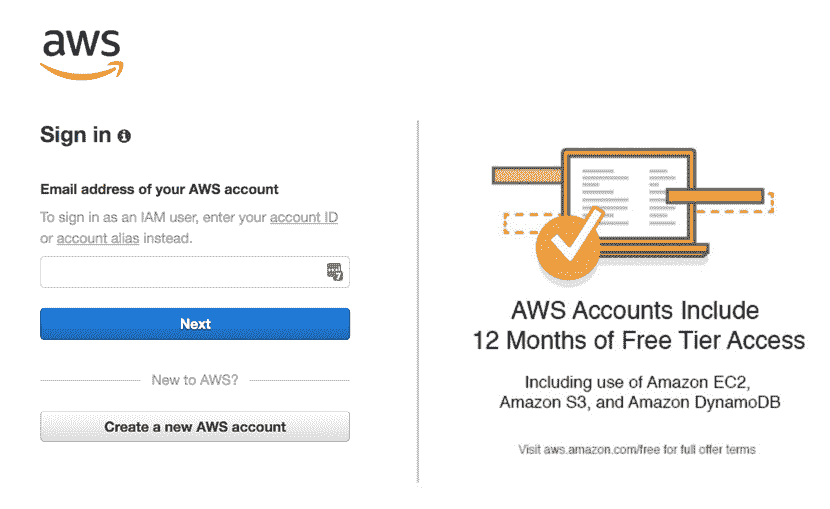AWS 帐户注册

您的 AWS 计费与您的根凭据相关联。如果遭到破坏，您的帐户可能会受到很大的损害，而在您重新获得访问权限之前可能会发生很多损害。

1.  确保您在根凭据上启用了双因素认证：

为了增加安全层，从现在开始，您需要停止使用根凭据登录到您的 AWS 帐户。您可以使用 AWS 身份和访问管理（IAM）模块创建用户帐户。如果这些帐户遭到破坏，与您的根帐户不同，您可以轻松快速地删除或替换它们。

1.  导航到`IAM`模块

1.  创建一个具有全局管理员权限的新用户帐户

1.  使用这些凭据登录到 AWS 控制台

1.  您还应该为这些凭据启用双因素认证

1.  安全的帐户设置如下，每个状态都报告为绿色：

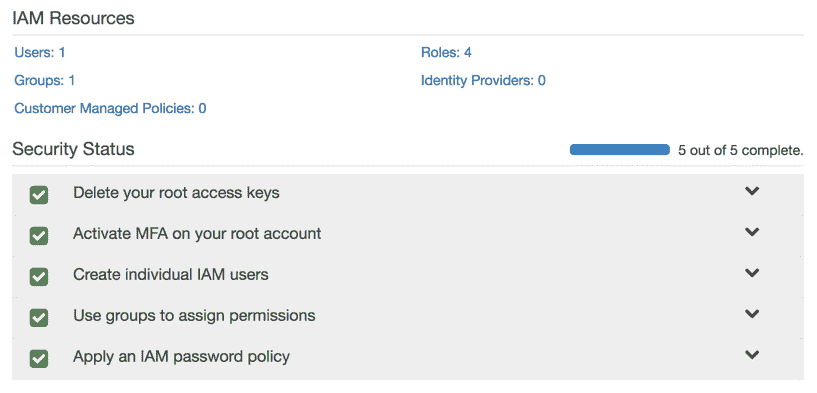安全设置后的 AWS IAM 模块

与用户帐户一起工作的主要好处是程序化访问。对于每个用户帐户，您可以创建一个公共访问 ID 和私有访问密钥对。当您与第三方合作，例如托管的持续集成服务、您自己的应用程序代码或 CLI 工具时，您使用您的程序化访问密钥连接到您的 AWS 资源。当访问密钥不可避免地泄漏时，快速方便地禁用对旧密钥的访问并创建新密钥。

此外，用户帐户访问可以通过非常细粒度的权限进行严格控制。您还可以创建具有一组权限的角色，并进一步控制 AWS 服务和一些外部服务之间的通信。

在创建用户帐户和角色时，始终要在最小权限方面犯错误。当与不熟悉 AWS 的客户、承包商或同事合作时，这可能是一种令人沮丧的练习，但这是一种值得的练习。

你的安全性和可靠性取决于最薄弱的环节，因此你必须计划应对故障，并且最重要的是，定期实践恢复计划。

# 保护秘密

密码和私钥泄漏比你想象的更常见。你的密钥可能会在不安全的公共 Wi-Fi 网络中被泄露；你可能会意外地将它们提交到你的代码仓库中，或者使用极不安全的通信方法，比如电子邮件。然而，意外的代码提交是最大的问题，因为大多数初级开发者并不意识到在源代码控制系统中删除并不是一个选项。

作为开发者，有一些值得注意的最佳实践可以遵循以保护你的秘密：

1.  始终在公共 Wi-Fi 上使用 VPN 服务，比如[tunnelbear.com](https://www.tunnelbear.com/)

1.  利用位于用户`home`文件夹下的`.aws/credentials`文件，创建配置文件并存储访问密钥

1.  在项目的根目录中创建一个`.env`文件，并将其列入`.gitignore`，以存储你的 CI 服务器可能会后续注入的任何秘密作为团队规范

1.  始终在推送之前审查提交

每次遵循这些惯例都会养成一个好习惯，永远不要将你的秘密提交到代码仓库中。在下一节中，我们将深入探讨云环境的资源考虑。

# 合适的基础设施规模

优化基础设施的目的是保护公司的收入，同时最大限度地减少基础设施的运营成本。你的目标应该是确保用户不会遇到高延迟，也就是不良性能，或者更糟糕的是未完成或丢弃的请求，同时使你的企业保持可持续的努力。

Web 应用程序性能的三大支柱如下：

1.  CPU 利用率

1.  内存使用量

1.  网络带宽

我故意将磁盘访问排除在关键考虑指标之外，因为只有在应用服务器或数据存储上执行特定工作负载时才会受到影响。只要应用程序资产由内容交付网络（CDN）提供，磁盘访问很少会影响提供 Web 应用程序的性能。也就是说，仍然要注意任何意外的磁盘访问，比如高频率创建临时和日志文件。例如，Docker 可能会输出日志，这些日志很容易填满驱动器。

在理想的情况下，CPU、内存和网络带宽的使用应该均匀地在可用容量的 60-80%左右。如果您遇到性能问题，由于诸如磁盘 I/O、慢的第三方服务或低效的代码等各种其他因素，很可能您的某个指标会接近或达到最大容量，而另外两个指标则处于空闲或严重未被充分利用的状态。这是一个利用更多 CPU、内存或带宽来补偿性能问题并均匀利用可用资源的机会。

将 60-80%的利用率作为目标的原因是为了为新实例（服务器或容器）提供一些时间来进行配置，并准备好为用户提供服务。在您预定义的阈值被突破后，当新实例被配置时，您可以继续为日益增长的用户提供服务，从而最小化未满足的请求。

在本书中，我已经反对过度设计或完美的解决方案。在当今复杂的 IT 环境中，几乎不可能预测您将遇到性能瓶颈的地方。您的工程师很容易花费 10 万美元以上的工程时间，而解决您的问题可能只需要几百美元的新硬件，无论是网络交换机、固态硬盘、CPU 还是更多内存。

如果您的 CPU 太忙，您可能希望在您的代码中引入更多的记账逻辑，通过索引、哈希表或字典，您可以将其缓存在内存中，以加快逻辑的后续或中间步骤。例如，如果您不断地运行数组查找操作来定位记录的特定属性，您可以对该记录执行一个操作，将记录的 ID 和/或属性保存在内存中的哈希表中，将您的运行成本从*O(n)*降低到*O(1)*。

根据前面的例子，您可能会在哈希表中使用过多的内存。在这种情况下，您可能希望更积极地将缓存卸载或转移到速度较慢但更丰富的数据存储中，利用您多余的网络带宽，比如一个 Redis 实例。

如果您的网络利用率过高，您可能希望调查使用具有过期链接的 CDN、客户端缓存、限制请求速度、滥用配额的客户的 API 访问限制，或者优化您的实例，使其具有与其 CPU 或内存容量相比不成比例的更多网络容量。

# 优化实例

在之前的示例中，我演示了使用我的 `duluca/minimal-node-web-server` Docker 镜像来托管我们的 Angular 应用程序。尽管 Node.js 是一个非常轻量级的服务器，但它并不仅仅是一个优化的 Web 服务器。此外，Node.js 具有单线程执行环境，这使得它不适合同时为许多并发用户提供静态内容。

您可以通过执行 `docker stats` 来观察 Docker 镜像正在使用的资源：

```ts
$ docker stats
CONTAINER ID  CPU %  MEM USAGE / LIMIT    MEM %  NET I/O         BLOCK I/O  PIDS
27d431e289c9  0.00%  1.797MiB / 1.952GiB  0.09%  13.7kB / 285kB  0B / 0B       2
```

以下是 Node 和基于 NGINX 的服务器在空闲时利用的系统资源的比较结果：

| **服务器** | **              镜像大小** | **             内存使用** |
| --- | --- | --- |
| `duluca/minimal-nginx-web-server` |                                     16.8 MB |                                         1.8 MB |
| `duluca/minimal-node-web-server` |                                     71.8 MB |                                       37.0 MB |

然而，空闲时的值只能讲述故事的一部分。为了更好地了解情况，我们必须进行简单的负载测试，以查看在负载下的内存和 CPU 利用率。

# 简单的负载测试

为了更好地了解我们服务器的性能特征，让我们对它们施加一些负载和压力：

1.  使用 `docker run` 来启动您的容器：

```ts
$ docker run --name <imageName> -d -p 8080:<internal_port> <imageRepo>
```

如果您正在使用 `npm Scripts for Docker`，执行以下命令来启动您的容器：

```ts
$ npm run docker:debug
```

1.  执行以下 bash 脚本来开始负载测试：

```ts
$ curl -L http://bit.ly/load-test-bash [](http://bit.ly/load-test-bash) | bash -s 100 "http://localhost:8080"
```

该脚本将向服务器发送 100 个请求/秒，直到您终止它。

1.  执行 `docker stats` 来观察性能特征。

以下是 CPU 和内存利用的高级观察：

| **CPU 利用率统计** | **        低** | **         中** | **          高** | **   最大内存** |
| --- | --- | --- | --- | --- |
| `duluca/minimal-nginx-web-server` |                   2% |                    15% |                       60% |                   2.4 MB |
| `duluca/minimal-node-web-server` |                 20% |                    45% |                     130% |                    75 MB |

正如您所看到的，两个服务器提供完全相同内容之间存在显著的性能差异。请注意，基于每秒请求的这种测试适用于比较分析，并不一定反映实际使用情况。

很明显，我们的 NGINX 服务器将为我们带来最佳性价比。有了最佳解决方案，让我们在 AWS 上部署应用程序。

# 部署到 AWS ECS Fargate

AWS **弹性容器服务**（**ECS**）Fargate 是一种在云中部署容器的成本效益高且易于配置的方式。

ECS 由四个主要部分组成：

1.  容器仓库，**弹性容器注册表**（**ECR**），您可以在其中发布 Docker 镜像

1.  服务、任务和任务定义，您可以在其中定义容器的运行时参数和端口映射，作为服务运行的任务定义。

1.  集群，一个包含 EC2 实例的集合，可以在其中配置和扩展任务

1.  Fargate 是一个托管的集群服务，它抽象了 EC2 实例、负载均衡器和安全组的问题

在发布时，Fargate 仅在 AWS`us-east-1`地区可用。

我们的目标是创建一个高可用的蓝绿部署，这意味着在服务器故障甚至部署期间，我们的应用程序至少会有一个实例在运行。这些概念在第十二章中进行了详细探讨，*Google Analytics 和高级云运维*，在*可扩展环境中的每用户成本*部分。

# 配置 ECS Fargate

您可以在 AWS 服务菜单下访问 ECS 功能，选择弹性容器服务链接。

如果这是您第一次登录，您必须通过教程，其中您将被强制创建一个示例应用程序。我建议您完成教程后删除示例应用程序。为了删除服务，您需要将服务的任务数量更新为 0。此外，删除默认集群以避免任何意外费用。

# 创建 Fargate 集群

让我们从配置 Fargate 集群开始，这将在配置其他 AWS 服务时充当锚点。我们的集群最终将运行一个集群服务，在接下来的章节中我们将逐渐构建起来。

在发布时，AWS Fargate 仅在 AWS 美国东部地区可用，支持更多地区和即将推出对 Amazon 弹性容器服务 Kubernetes（Amazon EKS）的支持。Kubernetes 是 AWS ECS 的广泛首选开源替代方案，具有更丰富的容器编排能力，可用于本地、云和混合云部署。

让我们创建集群：

1.  转到弹性容器服务

1.  单击集群|创建集群

1.  选择仅网络...由 AWS Fargate 提供支持的模板

1.  单击“下一步”，您将看到创建集群步骤，如下所示：

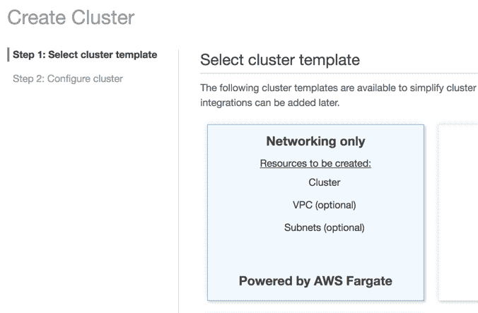AWS ECS 创建集群

1.  将集群名称输入为`fargate-cluster`

1.  创建一个 VPC 来将您的资源与其他 AWS 资源隔离开来

1.  单击创建集群以完成设置

您将看到您的操作摘要，如下所示：

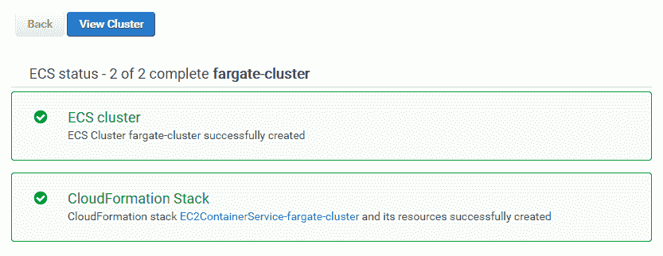AWS ECS Fargate Cluster

现在您已经在其自己的**虚拟私有云**（**VPC**）中创建了一个集群，您可以在弹性容器服务 | 集群下查看它。

# 创建容器存储库

接下来，我们需要设置一个存储库，我们可以在其中发布我们在本地或 CI 环境中构建的容器映像：

1.  转到弹性容器服务

1.  单击 Repositories | Create Repository

1.  将存储库名称输入为`lemon-mart`

1.  复制屏幕上生成的存储库 URI

1.  将 URI 粘贴到您的应用程序的`package.json`中作为新的`imageRepo`变量：

```ts
package.json ...
"config": {
  “imageRepo”: “000000000000.dkr.ecr.us-east-1.amazonaws.com/lemon-mart”,
  ...
}
```

1.  单击创建存储库

1.  单击下一步，然后单击完成以完成设置

在摘要屏幕上，您将获得有关如何在 Docker 中使用存储库的进一步说明。在本章的后面，我们将介绍将为我们处理此事的脚本。

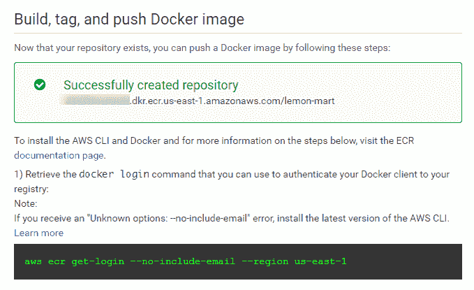AWS ECS 存储库

您可以在弹性容器服务 | 存储库下查看您的新存储库。我们将在即将到来的`npm Scripts for AWS`部分介绍如何发布您的镜像。

# 创建任务定义

在我们的存储库中定义了一个容器目标后，我们可以定义一个任务定义，其中包含运行容器所需的元数据，例如端口映射、保留的 CPU 和内存分配：

1.  转到弹性容器服务

1.  单击任务定义 | 创建新任务定义

1.  选择 Fargate 启动类型兼容性

1.  将任务定义名称输入为`lemon-mart-task`

1.  选择任务角色`none`（您可以稍后添加一个以启用访问其他 AWS 服务）

1.  输入任务大小`0.5 GB`

1.  输入任务 CPU `0.25 CPU`

1.  单击添加容器：

1.  将容器名称输入为`lemon-mart`

1.  对于 Image，粘贴之前的镜像存储库 URI，但是在末尾添加`:latest`标签，以便它始终拉取存储库中的最新镜像，例如`000000000000.dkr.ecr.us-east-1.amazonaws.com/lemon-mart:latest`

1.  为 NGINX 设置`128 MB`的软限制，为 Node.js 设置`256 MB`

1.  在端口映射下，指定 NGINX 的容器端口为`80`，Node.js 的端口为`3000`

1.  接受其余默认值

1.  单击添加；这是在创建之前查看任务定义的方式：

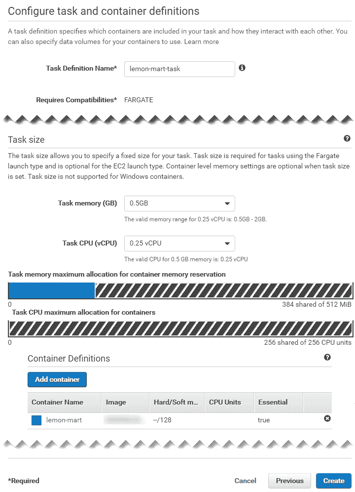AWS ECS 任务定义

1.  点击“创建”完成设置

在 Elastic Container Service | 任务定义下查看您的新任务定义。

请注意，默认设置将启用 AWS CloudWatch 日志记录，这是您可以追溯访问容器实例控制台日志的一种方式。在这个例子中，将创建一个名为`/ecs/lemon-mart-task`的 CloudWatch 日志组。

在 Cloud Watch | 日志下查看您的新日志组。如果要添加需要持久数据的容器，任务定义允许您定义一个卷并挂载一个文件夹到您的 Docker 容器。我已经发布了一个指南，用于在 ECS 容器中配置 AWS 弹性文件系统（EFS）[bit.ly/mount-aws-efs-ecs-container](http://bit.ly/mount-aws-efs-ecs-container)。

# 创建弹性负载均衡器

在高可用部署中，我们希望根据刚刚创建的任务定义在两个不同的可用区（AZs）上运行两个容器实例。为了实现这种动态扩展和收缩，我们需要配置一个应用负载均衡器（ALB）来处理请求路由和排空：

1.  在一个单独的标签页上，导航到 EC2 | 负载均衡器 | 创建负载均衡器

1.  创建一个应用负载均衡器

1.  输入名称`lemon-mart-alb`：

为了支持监听器下的 SSL 流量，您可以在端口`443`上添加一个新的 HTTPS 监听器。通过 AWS 服务和向导，可以方便地实现 SSL 设置。在 ALB 配置过程中，AWS 提供了链接到这些向导以创建您的证书。然而，这是一个复杂的过程，可以根据您现有的域托管和 SSL 证书设置而有所不同。在本书中，我将跳过与 SSL 相关的配置。您可以在我发布的指南中找到与 SSL 相关的步骤[bit.ly/setupAWSECSCluster](http://bit.ly/setupAWSECSCluster)。

1.  在可用区中，选择为您的 fargate-cluster 创建的 VPC

1.  选择所有列出的可用区

1.  展开标签并添加一个键/值对，以便能够识别 ALB，比如`"App": "LemonMart"`

1.  点击“下一步”

1.  选择默认 ELB 安全策略

1.  点击“下一步”

1.  创建一个新的集群特定安全组，`lemon-mart-sg`，只允许端口`80`入站，如果使用 HTTPS，则允许端口`443`

在下一节创建集群服务时，请确保此处创建的安全组是在服务创建期间选择的安全组。否则，您的 ALB 将无法连接到您的实例。

1.  点击下一步

1.  将新的目标组命名为`lemon-mart-target-group`

1.  将协议类型从`instance`更改为`ip`

1.  在健康检查下，保持默认路由`/`，如果在 HTTP 上提供网站

健康检查对于扩展和部署操作至关重要。这是 AWS 用来检查实例是否已成功创建的机制。

如果部署 API 和/或将所有 HTTP 调用重定向到 HTTPS，请确保您的应用程序定义了一个不会被重定向到 HTTPS 的自定义路由。在 HTTP 服务器 GET `/healthCheck`返回简单的 200 消息，说`我很健康`，并验证这不会重定向到 HTTPS。否则，您将经历很多痛苦和苦难，试图弄清楚问题出在何处，因为所有健康检查都失败，部署也莫名其妙地失败。`duluca/minimal-node-web-server`提供了 HTTPS 重定向，以及一个开箱即用的仅 HTTP 的`/healthCheck`端点。使用`duluca/minimal-nginx-web-server`，您将需要提供自己的配置。

1.  点击下一步

1.  *不要*注册任何目标或 IP 范围。ECS Fargate 将神奇地为您管理这一切，如果您自己这样做，您将提供一个半破碎的基础设施。

1.  点击下一步：审查；您的 ALB 设置应该与所示的类似：

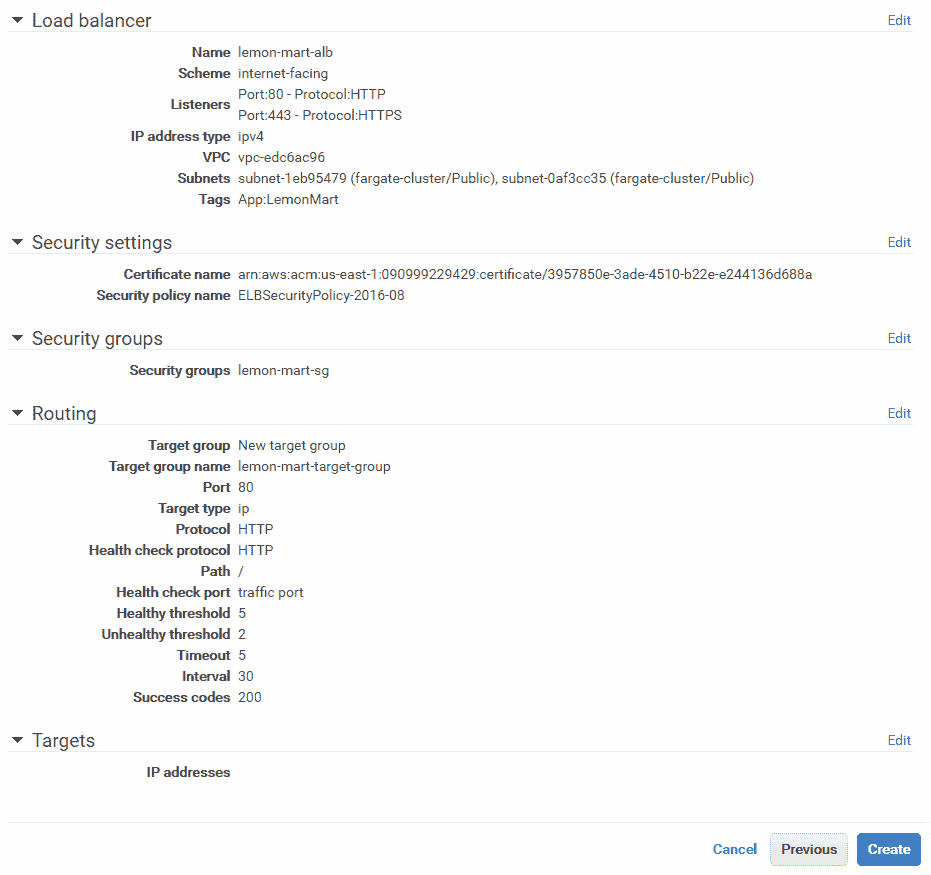AWS 应用负载均衡器设置

1.  点击创建完成设置

在下一节创建集群服务时，您将使用 lemon-mart-alb。

# 创建集群服务

现在，我们将通过使用任务定义和我们创建的 ALB 在我们的集群中创建一个服务来将所有内容整合在一起：

1.  导航到弹性容器服务

1.  点击集群| fargate-cluster

1.  在服务选项卡下，点击创建

1.  选择启动类型`Fargate`

1.  选择您之前创建的任务定义

请注意，任务定义是有版本的，比如`lemon-mart-task:1`。如果您对任务定义进行更改，AWS 将创建`lemon-mart-task:2`。您需要使用这个新版本更新服务，以使更改生效。

1.  输入服务名称`lemon-mart-service`

1.  任务数量`2`

1.  最小健康百分比`50`

1.  最大百分比`200`

1.  点击下一步

将最小健康百分比设置为 100，以确保在部署期间保持高可用性。Fargate 的定价是基于每秒的使用量，因此在部署应用程序时，您将额外收费用于额外实例，而旧实例正在被取消配置。

1.  在配置网络下，选择与之前相同的 VPC 作为您的集群

1.  选择所有可用的子网；至少应该有两个以实现高可用性

1.  在上一节中创建的安全组中选择`lemon-mart-sg`

1.  选择负载均衡器类型为应用程序负载均衡器

1.  选择 lemon-mart-alb 选项

1.  通过单击“添加到负载均衡器”按钮，将容器端口添加到 ALB，例如`80`或`3000`

1.  选择您已经定义的侦听器端口

1.  选择您已经定义的目标组

1.  取消选中“启用服务发现集成”

1.  单击“下一步”

1.  如果您希望您的实例在达到一定限制时自动扩展和缩减，则设置自动扩展

我建议在服务的初始设置期间跳过自动扩展的设置，以便更容易排除任何潜在的配置问题。您可以随后返回并进行设置。自动任务扩展策略依赖于警报，例如 CPU 利用率。在第十二章 *Google Analytics and Advanced Cloud Ops,* 中的*可扩展环境中的每用户成本*部分，您可以了解如何计算您的最佳目标服务器利用率，并根据此数字设置您的警报。

1.  单击“下一步”并审查您的更改，如图所示：

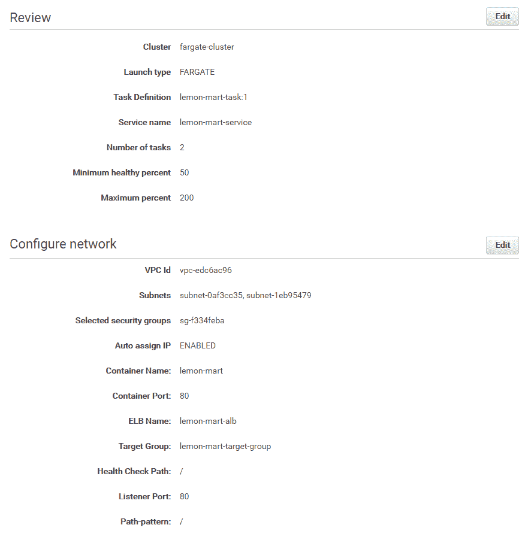AWS Fargate 集群服务设置

1.  最后，单击“保存”完成设置

在 Elastic Container Service | Clusters | fargate-cluster | lemon-mart-service 下观察您的新服务。在将图像发布到容器存储库之前，您的 AWS 服务将无法配置实例，因为健康检查将不断失败。发布图像后，您需要确保服务的事件选项卡中没有错误。

AWS 是一个复杂的系统，使用 Fargate 可以避免很多复杂性。但是，如果您有兴趣使用自己的 Ec2 实例设置自己的 ECS 集群，您可以获得 1-3 年预留实例的重大折扣。我有一个 75+设置指南可在[bit.ly/setupAWSECSCluster](http://bit.ly/setupAWSECSCluster)上获得。

我们已经手动执行了很多步骤来创建我们的集群。AWS CloudFormation 通过提供配置模板来解决这个问题，您可以根据自己的需求进行自定义，或者从头开始编写自己的模板脚本。如果您想认真对待 AWS，这种代码即基础架构设置绝对是正确的方式。

对于生产部署，请确保您的配置由 CloudFormation 模板定义，这样它就可以很容易地重新配置，而不是在部署相关的失误发生时。

# 配置 DNS

如果您使用 AWS Route 53 来管理您的域名，很容易将域名或子域分配给 ALB：

1.  导航到 Route 53 | 托管区域

1.  选择您的域名，如`thejavascriptpromise.com`

1.  点击“创建记录集”

1.  将名称输入为`lemonmart`

1.  将别名设置为“是”

1.  从负载均衡器列表中选择 lemon-mart-alb

1.  点击“创建”完成设置

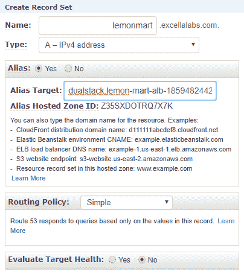Route 53 - 创建记录集

现在，您的站点将可以通过您刚刚定义的子域访问，例如`http://lemonmart.thejavascriptpromise.com`。

如果不使用 Route 53，请不要惊慌。在您的域名提供商的网站上，编辑“区域”文件以创建一个`A`记录到 ELB 的 DNS 地址，然后您就完成了。

# 获取 DNS 名称

为了获取负载均衡器的 DNS 地址，请执行以下步骤：

1.  导航到 EC2 | 负载均衡器

1.  选择 lemon-mart-alb

1.  在“描述”选项卡中注意 DNS 名称；请参考以下示例：

```ts
DNS name:
lemon-mart-alb-1871778644.us-east-1.elb.amazonaws.com (A Record)
```

# 准备 Angular 应用

本节假定您已经按照第三章中详细介绍的设置了 Docker 和“用于 Docker 的 npm 脚本”。您可以在[bit.ly/npmScriptsForDocker](http://bit.ly/npmScriptsForDocker)获取这些脚本的最新版本。

实现优化的`Dockerfile`：

```ts
Dockerfile 
FROM duluca/minimal-nginx-web-server:1.13.8-alpine
COPY dist /var/www
CMD 'nginx'
```

请注意，如果您正在使用“用于 Docker 的 npm 脚本”，请将内部镜像端口从`3000`更新为`80`，如下所示：

```ts
"docker:runHelper": "cross-conf-env docker run -e NODE_ENV=local --name $npm_package_config_imageName -d -p $npm_package_config_imagePort:80 $npm_package_config_imageRepo",
```

# 添加用于 AWS 的 npm 脚本

就像“用于 Docker 的 npm 脚本”一样，我开发了一组脚本，称为“用于 AWS 的 npm 脚本”，可以在 Windows 10 和 macOS 上运行。这些脚本将允许您以惊人的、无停机的蓝绿色方式上传和发布您的 Docker 镜像。您可以在[bit.ly/npmScriptsForAWS](http://bit.ly/npmScriptsForAWS)获取这些脚本的最新版本：

1.  确保在您的项目上设置了[bit.ly/npmScriptsForDocker](http://bit.ly/npmScriptsForDocker)

1.  创建一个`.env`文件并设置`AWS_ACCESS_KEY_ID`和`AWS_SECRET_ACCESS_KEY`：

```ts
.env
AWS_ACCESS_KEY_ID=your_own_key_id
AWS_SECRET_ACCESS_KEY=your_own_secret_key
```

1.  确保您的`.env`文件在您的`.gitignore`文件中，以保护您的秘密信息。

1.  安装或升级到最新的 AWS CLI：

+   在 macOS 上`brew install awscli`

+   在 Windows 上``choco install awscli``

1.  使用您的凭据登录到 AWS CLI：

1.  运行`aws configure`

1.  您需要从配置 IAM 帐户时获取您的访问密钥 ID 和秘密访问密钥

1.  设置默认区域名称为`us-east-1`

1.  更新`package.json`，添加一个新的`config`属性，具有以下配置属性：

```ts
package.json
  ...
  "config": {
    ...
    "awsRegion": "us-east-1",
    "awsEcsCluster": "fargate-cluster",
    "awsService": "lemon-mart-service"
  },
 ...
```

确保您更新了`package.json`，从您配置`npm Scripts for Docker`时，`imageRepo`属性中有您新的 ECS 存储库的地址。

1.  在`package.json`中添加 AWS `scripts`，如下所示：

```ts
package.json
...
"scripts": {
  ...
  "aws:login": "run-p -cs aws:login:win aws:login:mac",
  "aws:login:win": "cross-conf-env aws ecr get-login --no-include-email --region $npm_package_config_awsRegion > dockerLogin.cmd && call dockerLogin.cmd && del dockerLogin.cmd",
 "aws:login:mac": "eval $(aws ecr get-login --no-include-email --region $npm_package_config_awsRegion)"
}
```

`npm run aws:login`调用特定于平台的命令，自动执行从 AWS CLI 工具获取 Docker 登录命令的多步操作，如下所示：

```ts
example
$ aws ecr get-login --no-include-email --region us-east-1
docker login -u AWS -p eyJwYXl...3ODk1fQ== https://073020584345.dkr.ecr.us-east-1.amazonaws.com
```

您首先要执行`aws ecr get-login`，然后复制粘贴生成的`docker login`命令并执行它，以便您的本地 Docker 实例指向 AWS ECR：

```ts
package.json
...
"scripts": {
  ...
  "aws:deploy": "cross-conf-env docker run --env-file ./.env duluca/ecs-deploy-fargate -c $npm_package_config_awsEcsCluster -n $npm_package_config_awsService -i $npm_package_config_imageRepo:latest -r $npm_package_config_awsRegion --timeout 1000"
  }
...
```

`npm run aws:deploy`拉取一个 Docker 容器，它本身执行蓝绿部署，使用您使用`aws ecr`命令提供的参数。这个工作原理的细节超出了本书的范围。要查看更多使用原生`aws ecr`命令的示例，请参考`aws-samples`存储库，网址为[github.com/aws-samples/ecs-blue-green-deployment](https://github.com/aws-samples/ecs-blue-green-deployment)。

请注意，`duluca/ecs-deploy-fargate`蓝绿部署脚本是原始`silintl/ecs-deploy`镜像的一个分支，经过修改以支持使用 PR `https://github.com/silinternational/ecs-deploy/pull/129`进行 AWS ECS Fargate。一旦`silintl/ecs-deploy`合并了这一更改，我建议您在蓝绿部署中使用`silintl/ecs-deploy`：

```ts
package.json
...
"scripts": {
  ...
  "aws:release": "run-s -cs aws:login docker:publish aws:deploy"
}
...
```

最后，`npm run aws:release`简单地按正确顺序运行`aws:login`，`docker:publish`从`npm Scripts for Docker`和`aws:deploy`命令。

# 发布

您的项目已配置为在 AWS 上部署。您主要需要使用我们创建的两个命令来构建和发布图像：

1.  执行`docker:debug`来测试、构建、标记、运行、跟踪并在浏览器中启动您的应用程序以测试图像：

```ts
$ npm run docker:debug
```

1.  执行`aws:release`以配置 Docker 登录到 AWS，发布您的最新图像构建，并在 ECS 上发布它：

```ts
 $ npm run aws:release
```

1.  验证您的任务是否在服务级别上运行：

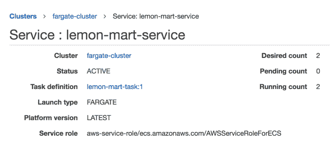AWS ECS 服务确保运行计数和期望计数相同。

1.  验证您的实例是否在任务级别上运行：

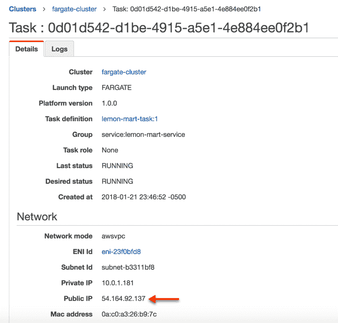AWS ECS 任务实例

请注意公共 IP 地址并导航到它；例如，`http://54.164.92.137`，您应该看到您的应用程序或 LemonMart 正在运行。

1.  验证负载均衡器设置在 DNS 级别上是否正确。

1.  导航到 ALB DNS 地址，例如`http://lemon-mart-alb-1871778644.us-east-1.elb.amazonaws.com`，并确认应用程序呈现如下：

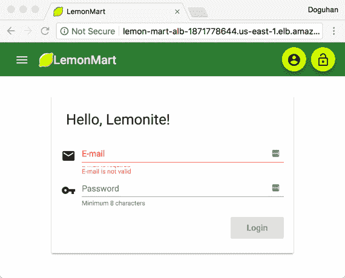在 AWS Fargate 上运行的 LemonMart

Et voilà！您的网站应该已经上线并运行。

在随后的发布中，您将能够观察蓝绿部署的实际操作，如下所示：

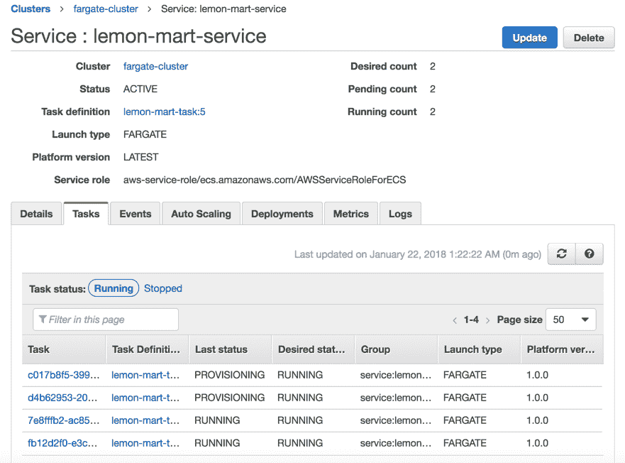蓝绿部署期间的 AWS 服务

有两个正在运行的任务，正在提供两个新任务。在验证新任务的同时，运行计数将上升到四个任务。在验证新任务并且从旧任务中排出连接之后，运行计数将返回到两个。

您可以通过配置 CircleCI 与您的 AWS 凭据，使用安装了`awscli`工具并运行`npm Scripts for AWS`的容器，来自动化您的部署。通过这种技术，您可以实现对暂存环境的持续部署或对生产环境的持续交付。

这一切都很好，但是一个基本的高可用配置会花费多少？让我们在下一节中进行检查。

# AWS 计费

我的在 AWS Fargate 上高可用的 LemonMart 部署大约每月花费大约 45 美元。以下是详细信息：

| **描述** | **     成本** |
| --- | --- |
| 亚马逊简单存储服务（S3） |          $0.01 |
| AWS 数据传输 |          $0.02 |
| 亚马逊云监控 |          $0.00 |
| 亚马逊 EC2 容器服务（ECS Fargate） |        $27.35 |
| 亚马逊弹性计算云（EC2 负载均衡器实例） |        $16.21 |
| 亚马逊 EC2 容器注册表（ECR） |          $0.01 |
| 亚马逊路由 53 |          $0.50 |
| **总计** | **       $44.10** |

请注意，账单非常详细，但确实准确列出了我们最终使用的所有 AWS 服务。主要成本是在**EC2 容器服务**（**ECS**）上运行我们的 Web 服务器的两个实例，以及在**弹性计算云**（**EC2**）上运行负载均衡器。客观地说，每月 45 美元似乎是托管一个 Web 应用程序的很多钱。如果愿意自己设置专用 EC2 服务器的集群，并且可以选择 1 年或 3 年的付款周期，最多可以节省 50%的费用。在 Heroku 上，类似的高可用部署以每月 50 美元起步，并提供其他丰富的功能。同样，在 Zeit Now 上，两个实例的成本为每月 30 美元。请注意，Heroku 和 Zeit Now 都不提供对物理上不同可用区的访问。另一方面，Digital Ocean 允许您在不同的数据中心中设置服务器；但是，您必须编写自己的基础设施。每月 15 美元，您可以在三台服务器上设置自己的高可用集群，并能够在上面托管多个站点。

# 总结

在本章中，您了解了在正确保护您的 AWS 账户时的微妙之处和各种安全考虑因素。我们讨论了调整基础设施的概念。您以隔离的方式进行了简单的负载测试，以找出两个 Web 服务器之间性能的相对差异。拥有优化的 Web 服务器后，您配置了 AWS ECS Fargate 集群，以实现高可用的云基础设施。使用 AWS 的 npm 脚本，您学会了如何编写可重复且可靠的无停机蓝绿部署。最后，您了解了在 AWS 和其他云提供商（如 Heroku、Zeit Now 和 Digital Ocean）上运行基础设施的基本成本。

在下一章，我们将完成对全栈 Web 开发人员在部署 Web 应用程序时应该了解的各种主题的广度的覆盖。我们将向 LemonMart 添加 Google Analytics 以测量用户行为，利用高级负载测试来了解部署良好配置的可扩展基础设施的财务影响，并使用自定义分析事件来测量重要应用程序功能的实际使用情况。
