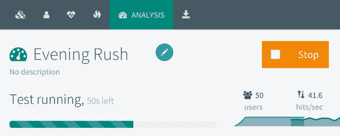

# 第十二章：谷歌分析和高级云运维

您已经设计、开发并部署了一个世界级的 Web 应用程序；然而，这只是您应用程序故事的开始。网络是一个不断发展的、生机勃勃的环境，需要关注才能继续成功地作为一个业务。在第十一章中，*AWS 上高可用云基础设施*，我们已经介绍了云基础设施的基本概念和所有权成本。在本章中，我们将更深入地了解用户如何实际使用谷歌分析来创建真实的负载测试，以模拟实际用户行为，了解单个服务器实际容量。了解单个服务器的容量，我们可以微调我们的基础设施扩展以减少浪费，并讨论各种扩展策略的影响。最后，我们将介绍高级分析概念，如自定义事件，以获得对用户行为更细粒度的理解和跟踪。

在本章中，您将了解以下主题：

+   谷歌分析

+   谷歌标签管理器

+   预算和扩展

+   高级负载测试以预测容量

+   自定义分析事件

在整个章节中，您将设置这些：

+   谷歌分析账户

+   谷歌标签管理器账户

+   OctoPerf 账户

# 收集分析

现在我们的网站已经上线运行，我们需要开始收集指标来了解它的使用情况。指标是操作 Web 应用程序的关键。

谷歌分析有许多方面；主要的三个如下：

1.  获取，衡量访问者如何到达您的网站

1.  行为，衡量访问者如何与您的网站互动

1.  转化，衡量访问者如何在您的网站上完成各种目标

让我们来看看我的网站[TheJavaScriptPromise.com](http://TheJavaScriptPromise.com)的行为|概述：

谷歌分析行为概述

[TheJavaScriptPromise.com](http://TheJavaScriptPromise.com)是一个简单的单页面 HTML 网站，所以指标非常简单。让我们来看看屏幕上的各种指标：

1.  页面浏览显示访问者数量

1.  独立页面浏览显示独立访问者的数量

1.  平均页面停留时间显示每个用户在网站上花费的时间

1.  跳出率显示用户在不浏览子页面或以任何方式与站点进行交互的情况下离开站点，例如单击具有自定义事件的链接或按钮

1.  % 退出表示用户在查看特定页面或一组页面后离开站点的频率

在 2017 年，该网站大约有 1,090 名独立访客，平均每位访客在网站上花费约 2.5 分钟或 157 秒。鉴于这只是一个单页面站点，跳出率和%退出指标在任何有意义的方式上都不适用。稍后，我们将使用这些数字来计算每用户成本。

除了页面浏览之外，Google Analytics 还可以捕获特定事件，例如单击触发服务器请求的按钮。然后可以在事件|概述页面上查看这些事件，如下所示：

Google Analytics 事件概述

在服务器端也可以捕获指标，但这将提供请求随时间变化的统计数据。您将需要额外的代码和状态管理来跟踪特定用户的行为，以便计算用户随时间变化的统计数据。通过在客户端使用 Google Analytics 实施此类跟踪，您可以更详细地了解用户的来源、他们的行为、是否成功以及何时离开您的应用程序，而不会给后端添加不必要的代码复杂性和基础设施负载。

# 将 Google Tag Manager 添加到 Angular 应用程序

让我们开始在您的 Angular 应用程序中捕获分析数据。Google 正在逐步淘汰随 Google Analytics 一起提供的传统`ga.js`和`analytics.js`产品，而是使用其新的、更灵活的全局站点标签`gtag.js`，该标签与 Google 标签管理器一起提供。这绝不是对 Google Analytics 的结束；相反，它是朝着更易于配置和管理的分析工具的转变。全局站点标签可以通过 Google 标签管理器远程配置和管理。标签是交付给客户端的 JavaScript 跟踪代码片段，它们可以启用对新指标的跟踪，并与多个分析工具集成，而无需更改已部署的代码。您仍然可以继续使用 Google Analytics 来分析和查看您的分析数据。Google 标签管理器的另一个主要优势是它是版本控制的，因此您可以在不害怕对分析配置造成任何不可逆转的损害的情况下尝试不同类型的标签，这些标签在各种条件下被触发。

# 设置 Google 标签管理器

让我们从为您的应用程序设置 Google 标签管理器帐户开始：

1.  登录到[GoogleTagManager.com](https://googletagmanager.com)的 Google 标签管理器

1.  按照以下步骤添加一个带有 Web 容器的新帐户：

Google 标签管理器

1.  按照指示将生成的脚本粘贴到您的`index.html`的顶部`<head>`和`<body>`部分附近：

```ts
src/index.html
<head>
<!-- Google Tag Manager -->
<script>(function(w,d,s,l,i){w[l]=w[l]||[];w[l].push({'gtm.start':
new Date().getTime(),event:'gtm.js'});var f=d.getElementsByTagName(s)[0],
j=d.createElement(s),dl=l!='dataLayer'?'&l='+l:'';j.async=true;j.src=
'https://www.googletagmanager.com/gtm.js?id='+i+dl;f.parentNode.insertBefore(j,f);
})(window,document,'script','dataLayer','GTM-56D4F6K');</script>
<!-- End Google Tag Manager -->
...
</head>
<body>
<!-- Google Tag Manager (noscript) -->
<noscript><iframe src="https://www.googletagmanager.com/ns.html?id=GTM-56D4F6K"
height="0" width="0" style="display:none;visibility:hidden"></iframe></noscript>
<!-- End Google Tag Manager (noscript) -->
<app-root></app-root>
</body>
```

请注意，`<noscript>`标签仅在用户在其浏览器中禁用 JavaScript 执行时才会执行。这样，我们可以收集这些用户的指标，而不是对他们的存在一无所知。

1.  提交并发布您的标签管理器容器

1.  您应该看到您的标签管理器的初始设置已完成，如下所示：

已发布的标签

1.  验证您的 Angular 应用程序是否没有任何错误运行。

请注意，如果您不发布您的标签管理器容器，您将在`dev`控制台或网络选项卡中看到 404 错误加载`gtm.js`。

# 设置 Google Analytics

现在，让我们通过 Google Analytics 生成一个跟踪 ID：

1.  登录到[analytics.google.com](https://analytics.google.com)的 Google Analytics

1.  打开管理控制台，如下面截图中指出的*齿轮*图标：

Google Analytics 管理控制台

1.  创建一个新的分析帐户

1.  使用图像中的箭头作为指南：

1.  添加一个名为`LemonMart`的新属性

1.  根据您的偏好配置属性

1.  点击跟踪代码

1.  复制以`UA-xxxxxxxxxx-1`开头的跟踪 ID

1.  忽略提供的`gtag.js`代码

# 在标签管理器中配置 Google Analytics 标签

现在，让我们将我们的 Google Analytics ID 连接到 Google Tag Manager：

1.  在[tagmanager.google.com](https://tagmanager.google.com)上，打开工作区选项卡

1.  点击添加新标签

1.  将其命名为`Google Analytics`

1.  点击标签配置并选择通用分析

1.  在 Google Analytics 设置下，添加一个新变量

1.  在上一节中复制的跟踪 ID 粘贴

1.  点击触发器并添加所有页面触发器

1.  点击保存，如下截图所示：

！[](Images/d19ac69c-9873-438e-9464-efa05b4ec2b1.png)创建 Google Analytics 标签

1.  提交并发布您的更改，并观察版本摘要，其中显示了 1 个标签：

！[](Images/5f1211b6-18b0-445a-ae28-a6ef095c88f7.png)显示一个标签的版本摘要

1.  现在刷新您的 Angular 应用程序，在`/home`路由上

1.  在私人窗口中，打开您的 Angular 应用程序的新实例，并导航到`/manager/home`路由

1.  在[analytics.google.com](https://analytics.google.com)上，打开实时|概览窗格，如下所示：

！[](Images/2ec54d66-0dd0-4c50-ad8a-c4b415b25713.png)Google Analytics 实时概览

1.  请注意，正在跟踪两个活跃用户

1.  在活跃页面顶部，您应该看到用户所在的页面

通过同时利用 Google Tag Manager 和 Google Analytics，我们能够在不更改 Angular 应用程序内部任何代码的情况下完成页面跟踪。

**搜索引擎优化**（**SEO**）是分析的重要部分。为了更好地了解爬虫如何感知您的 Angular 站点，请使用 Google 搜索控制台，网址为[`www.google.com/webmasters/tools`](https://www.google.com/webmasters/tools)，来识别优化。此外，考虑使用 Angular Universal 来在服务器端呈现某些动态内容，以便爬虫可以索引您的动态数据源并将更多流量带到您的站点。

# 预算和扩展

在第十一章的 AWS 计费部分，《在 AWS 上构建高可用云基础设施》，我们涵盖了运行 Web 服务器的月度成本，从每月 5 美元到每月 45 美元，从单服务器实例方案到高可用基础设施。对于大多数需求，预算讨论将从这个月度数字开始并结束。您可以执行负载测试，如高级负载测试部分建议的那样，来预测每台服务器的用户容量，并大致了解您可能需要多少服务器。在一个动态扩展的云环境中，有数十台服务器全天候运行，这是计算预算的一种过于简单化的方式。

如果您经营规模相当大的网络资产，事情变得复杂。您将在不同技术堆栈上运行多个服务器，提供不同的用途。很难判断或证明为看似过剩的容量或不必要的高性能服务器留出多少预算。不知何故，您需要能够沟通您的基础设施的效率，考虑到您服务的用户数量，并确保您的基础设施经过调整，以便您不会因为应用程序无响应或因为使用的容量超出需要而失去用户或支付过多。因此，我们将采取以用户为中心的方法，并将我们的 IT 基础设施成本转化为业务和您组织的营销部门可以理解的每用户成本指标。

在下一节中，我们将调查计算基础设施每用户成本的含义，以及当云扩展应用时这些计算如何改变，以我的一个网站为例。

# 计算每用户成本

我们将利用来自 Google Analytics 的行为指标，目标是在一定时间内计算每个用户的成本：

**每用户成本**

使用之前的[TheJavaScriptPromise.com](http://TheJavaScriptPromise.com)数据，让我们将数据代入公式计算*perUserCost/month*。

这个网站部署在 DigitalOcean 的 Ubuntu 服务器上，所以包括每周备份在内的月度基础设施成本为每月 6 美元。从 Google Analytics 中，我们知道 2017 年有 1,090 名独立访客：


2017 年，我每个用户支付了 7 美分。花得值吗？每月 6 美元，我不介意。在 2017 年，[TheJavaScriptPromise.com](http://thejavascriptpromise.com/)部署在传统的服务器设置上，作为一个静态站点，不会动态扩展或缩减。这些条件使得使用独立访客指标并找到每个用户成本非常简单。这种简单性不仅使得容易计算，也导致了基础设施的不佳。如果我在相同的基础设施上为 100 万用户提供服务，我的成本将达到每年 7 万美元。如果我通过 Google 广告每 1000 个用户赚取 100 美元，我的网站每年将赚取 10 万美元。税收、开发费用和不合理的托管费用后，该运营很可能会亏损。

如果您利用云扩展，其中实例可以根据当前用户需求动态扩展或缩减，那么前面的公式很快就会变得无用，因为您必须考虑到预配时间和目标服务器利用率。预配时间是您的云提供商从头开始启动新服务器所需的时间。目标服务器利用率是给定服务器的最大使用度量标准，当达到扩展警报时，必须发送新服务器准备就绪，以防当前服务器达到最大容量。为了计算这些变量，我们必须对我们的服务器执行一系列负载测试。

页面浏览是一种过于简单化的方式来确定 Angular 等单页应用程序中的用户行为，其中页面浏览不一定与请求相关联。如果我们仅基于页面浏览执行负载测试，我们将无法真实模拟您的平台在负载下的性能。

用户行为，或者用户实际使用您的应用程序的方式，可以极大地影响您的性能预测，并且会导致预算数字大幅波动。您可以使用 Google Analytics 自定义事件来捕获一系列复杂的操作，这些操作导致平台提供各种类型的请求。在本章的后面，我们将探讨如何在*测量实际使用*部分中测量实际使用情况。

最初，您将不会拥有任何上述指标，您可能拥有的任何指标都将在您对软件或硬件堆栈进行重大更改时无效。因此，必须定期执行负载测试，以模拟真实的用户负载。

# 高级负载测试

为了能够预测容量，我们需要运行负载测试。在第十一章中，《AWS 上高可用云基础设施》，我讨论了一种简单的负载测试技术，即向服务器发送一堆网络请求。在相对比较的情况下，这对于测试原始功率效果很好。然而，实际用户以不同的间隔生成数十个请求，当他们浏览您的网站时，会导致对后端服务器的各种 API 调用。

我们必须能够模拟虚拟用户，并将大量用户释放到我们的服务器上，以找到服务器的瓶颈。 OctoPerf 是一个易于使用的服务，可执行此类负载测试，位于[`octoperf.com`](https://octoperf.com)。 OctoPerf 提供了一个免费的套餐，允许 50 个并发用户/测试在无限次测试运行中使用两个负载生成器：

1.  创建一个 OctoPerf 账户

1.  登录并为 LemonMart 添加一个新项目，如图所示：

OctoPerf 添加项目

OctoPerf 允许您创建具有不同使用特征的多个虚拟用户。由于它是基于 URL 的设置，任何基于点击的用户操作也可以通过直接调用应用程序服务器 URL 与测试参数来模拟。

1.  创建两个虚拟用户：一个作为“经理”，导航到基于经理的页面，第二个作为`POS`用户，只能使用 POS 功能

1.  单击“创建场景”：

POS 用户场景

1.  将场景命名为“晚高峰”

1.  您可以添加一些经理和 POS 用户，如图所示：

晚高峰场景

1.  单击“启动 50 个 VUs”按钮开始负载测试

您可以实时观察到达到的用户数量和每秒点击数，如下面的屏幕截图所示：

晚高峰负载测试进行中

1.  ECS 服务指标还给我们提供了实时利用率的高层次概念，如下面的屏幕截图所示：

ECS 实时指标

1.  分析负载测试结果。

您可以通过单击 ECS 服务指标中的 CPU 利用率链接或导航到 CloudWatch |指标部分来从 ECS 中获得更准确的结果，如下所示：

AWS CloudWatch 指标

如前图所示，CPU 利用率在持续 50 个用户负载的 10 分钟内保持在 1.3%左右。在此期间，没有请求错误，如 OctoPerf 的统计摘要所示：

！[](Images/2030e153-a12e-45b1-acc6-0ae6b8ac7261.png)OctoPerf 统计摘要

理想情况下，我们会测量每秒最大用户数，直到出现错误。然而，考虑到只有 50 个虚拟用户和我们已经拥有的信息，我们可以预测在 100%利用率下可以处理多少用户：

！[](Images/187cb266-4556-4d6a-8342-024c2f6a8a5a.png)

我们的负载测试结果显示，我们的基础设施可以处理每秒 3,846 个用户。根据这些信息，我们可以在下一节中计算可扩展环境中的每个用户成本。然而，性能和可靠性是相辅相成的。您选择如何设计基础设施也将提供重要的预算信息，因为您需要的可靠性水平将决定您必须始终保留的实例的最低数量。

# 可靠的云扩展

可靠性可以用您组织的恢复点目标（RPO）和恢复时间目标（RTO）来表达。 RPO 代表您愿意丢失多少数据，而 RTO 代表在发生故障时您可以多快重建基础设施。

假设你经营一家电子商务网站。每个工作日中午左右，你的销售达到峰值。每当用户将商品添加到购物车时，你会将商品存储在服务器端缓存中，以便用户可以在家后继续他们的购物狂欢。此外，你每分钟处理数百笔交易。生意很好，你的基础设施扩展得很好，一切都运行顺利。与此同时，一只饥饿的老鼠或一个过度充电的闪电云决定袭击你的数据中心。最初，一个看似无害的电源单元停机了，但没关系，因为附近的电源单元可以接管工作。然而，这是午餐高峰期；数据中心上的其他网站也面临着高流量。结果，几个电源单元过热并失败。没有足够的电源单元来接管工作，因此，电源单元接连过热并逐个失败，引发了一系列故障，最终导致整个数据中心崩溃。与此同时，你的一些用户刚刚点击了“添加到购物车”，其他用户点击了“支付”按钮，还有一些用户正要到达你的网站。如果你的 RPO 是一小时，意味着你每小时持久化一次购物车缓存，那么你可能会失去那些夜间购物者的宝贵数据和潜在销售额。如果你的 RTO 是一小时，那么你需要最多一个小时才能让你的网站重新上线运行，你可以放心，那些刚刚点击购买按钮或到达无响应网站的客户大部分当天都不会在你的网站上购买商品。

深思熟虑的 RPO 和 RTO 是一个关键的业务需求，但它们也必须与合适的基础设施配合，以便以一种经济有效的方式实现你的目标。AWS 由全球两打以上的地区组成，每个地区至少包含它们的可用区（AZs）。每个 AZ 都是一个物理上分离的基础设施，不会受到另一个 AZ 故障的影响。

在 AWS 上的高可用配置意味着你的应用程序至少在两个 AZ 上运行，因此，如果一个服务器实例失败，甚至整个数据中心失败，你已经在一个物理上分离的数据中心上有另一个实例可以无缝接管传入的请求。

容错架构意味着您的应用部署在多个区域。即使整个区域因自然灾害、分布式拒绝服务（DDoS）攻击或糟糕的软件更新而崩溃，您的基础设施仍然可以保持稳定，并能够响应用户请求。通过层层安全和错位备份，您的数据得到了保护。

AWS 拥有出色的服务，如 Shield 用于保护针对您网站的 DDoS 攻击，Pilot Light 服务可在另一个区域保持最小基础设施处于休眠状态，如果需要，可以扩展到完整容量，同时保持运营成本低廉，以及 Glacier 服务以经济的方式存储大量数据长时间。

高可用配置将始终需要至少两个实例在多个可用区设置中。对于容错设置，您需要至少在两个区域中拥有两个高可用配置。大多数 AWS 云服务，如用于数据存储的 DynamoDB 或用于缓存的 Redis，默认情况下都是高可用的，包括无服务器技术，如 Lambda。Lambda 按使用量收费，并且可以以成本有效的方式扩展以满足任何需求。如果您可以将繁重的计算任务转移到 Lambda，您可以大大减少服务器利用率和扩展需求。在规划基础设施时，您应考虑所有这些变量，以建立适合您需求的可扩展环境。

# 可扩展环境中的每个用户成本

在可扩展的环境中，你不能计划 100%的利用率。要为新服务器提供服务需要时间。利用率达到 100%的服务器无法及时处理额外的请求，这会导致用户视角下的请求丢失或错误。因此，相关服务器必须在达到 100%利用率之前发送触发器，以避免请求丢失。在本章的前面，我建议在扩展之前将目标利用率设定为 60-80%。确切的数字将高度依赖于您特定的软件和硬件堆栈选择。根据您的自定义利用率目标，我们可以计算出您的基础设施预计平均每个实例需要为多少用户提供服务。利用这些信息，您可以计算出更准确的每用户成本，这应该可以根据您的特定需求来正确规划您的 IT 预算。低于预算和超出预算一样糟糕。您可能会放弃增长、安全性、数据、可靠性和弹性，这是不可接受的。

在下一节中，我们将详细介绍如何计算最佳目标服务器利用率指标，以便您可以计算更准确的每用户成本；然后，我们将探讨在预定时间框架和软件部署期间可能发生的扩展。

# 计算目标服务器利用率。

首先，计算您的自定义服务器利用率目标，这是您的服务器承受增加负载并触发新服务器提供服务的点，以便原始服务器不会达到 100%的利用率并丢失请求。考虑这个公式：

**目标利用率**

让我们通过一个具体的例子来演示这个公式是如何工作的：

1.  对您的实例进行负载测试，以找出每个实例的用户容量：*负载测试结果：* 3,846 用户/秒

每秒请求和每秒用户并不相等，因为用户需要多次请求才能完成一个动作，可能每秒执行多个请求。高级负载测试工具如 OctoPerf 是必要的，以执行真实和多样化的工作负载，并测量用户容量和请求容量。

1.  测量实例提供速度，从创建/冷启动到首次满足请求：*测量实例提供速度：* 60 秒

为了测量这个速度，你可以放下秒表。根据你的确切设置，AWS 在 ECS 服务事件选项卡、CloudWatch 和 CloudTrail 中提供事件和应用程序日志，以关联足够的信息来确定何时请求了一个新实例以及实例准备好满足请求需要多长时间。例如，在 ECS 服务事件选项卡中，将目标注册事件作为开始时间。一旦任务开始，点击任务 ID 查看创建时间。使用任务 ID，在 CloudWatch 中检查任务的日志，以查看任务为第一个网络请求提供服务的时间作为结束时间，然后计算持续时间。

1.  测量 95 百分位数用户增长率，排除已知容量增加：*95 百分位数用户增长率：*每秒 10 个用户

如果你没有先前的指标，最初定义用户增长率将是最好的一个合理猜测。然而，一旦开始收集数据，你可以更新你的假设。此外，要以一种成本效益的方式运营一个可以应对任何想象得到的异常值的基础设施是不可能的。根据你的指标，应该有意识地做出一个商业决策，忽略哪个异常值百分位数作为可接受的商业风险。

1.  让我们将数字代入公式中：


自定义目标利用率，向下取整，将是 84%。将扩展触发器设置为 84%将避免实例过度配置，同时避免丢弃用户请求。

有了这个自定义的目标利用率，让我们考虑扩展后更新每用户成本公式：

**带有扩展的每用户成本**！[](Images/abb6593b-cac6-4b06-a8c9-f779bf5bd9a9.png)

因此，如果我们的基础设施成本是每月 100 美元，为 150 个用户提供服务，在 100%的利用率下，你可以计算每用户成本为每月$0.67/用户。如果考虑到扩展，成本将如下所示：


在不丢弃请求的情况下进行扩展将使每用户每月的成本从原始的$0.67 增加 16%，达到$0.79。然而，重要的是要记住，你的基础设施不会总是如此高效，在较低的利用率目标下，或者在配置错误的情况下，扩展触发器的成本很容易翻倍、翻三倍或者翻四倍。这里的最终目标是找到甜蜜点，这样你就会支付合适的每用户金额。

没有一个固定的每用户成本是您应该瞄准的。然而，如果您运行的服务在考虑了所有其他运营成本和利润率之后向用户收取每月 5 美元，然后您仍然有额外的预算 *和* 您的用户抱怨性能不佳，那么您的支出不足。然而，如果您在侵蚀利润率，甚至是亏损，那么您可能是在过度支出，或者您可能需要重新考虑您的商业模式。

还有一些其他因素可能会影响您的每个用户成本，比如蓝绿部署。您还可以通过利用预先安排的供应来提高扩展的效率。

# 预先安排的供应

动态扩展然后再收缩是定义云计算的特点。然而，目前可用的算法仍然需要一些规划，如果您知道一年中的某些天、周或月需要非同寻常地更高的资源容量。在新流量突然涌入时，您的基础设施将尝试动态扩展，但如果流量增长的速度是对数的，即使是优化的服务器利用率目标也无济于事。服务器经常会达到并以 100%的利用率运行，导致请求被丢弃或出现错误。为了防止这种情况发生，您应该在这些可预测的高需求时期主动提供额外的容量。

# 蓝绿部署

在第十一章中，*AWS 上的高可用云基础设施*，您配置了无停机的蓝绿部署。蓝绿部署是可靠的代码部署，可以确保您的网站持续运行，同时最大限度地减少糟糕部署的风险。

假设您有一个高可用的部署，意味着任何时候都有两个实例处于活动状态。在蓝绿部署期间，将会提供两个额外的实例。一旦这些额外的实例准备好满足请求，它们的健康状况将使用您预定义的健康指标来确定。

如果您的新实例被发现是健康的，这意味着它们是正常工作的。在这段时间内，比如 5 分钟，原始实例中的连接被排空并重新路由到新实例。此时，原始实例被取消供应。

如果发现新实例不健康，那么这些新实例将被取消配置，导致部署失败。然而，服务将保持可用状态，因为原始实例将保持完整，并在整个过程中继续为用户提供服务。

# 使用指标修订估算

负载测试和预测用户增长率可以让您了解您的系统在生产中可能的行为。收集更精细的指标和数据对于修订您的估算并确定更准确的 IT 预算至关重要。

# 测量实际使用

正如我们之前讨论的那样，仅跟踪页面浏览量并不能反映用户发送给服务器的请求量。使用 Google Tag Manager 和 Google Analytics，您可以轻松跟踪不仅仅是页面浏览量。

截至发布时间，以下是您可以在各个类别中配置的一些默认事件。此列表将随时间增长：

+   页面查看：用于跟踪用户在页面资源加载和页面完全呈现时是否停留在页面上：

+   页面查看，在第一次机会时触发

+   DOM 准备就绪，当 DOM 结构加载完成时

+   窗口加载完成，当所有元素都加载完成时

+   点击：用于跟踪用户与页面的点击交互：

+   所有元素

+   只有链接

+   用户参与度：跟踪用户行为：

+   元素可见性，元素是否已显示

+   表单提交，是否提交了表单

+   滚动深度，他们在页面上滚动了多远

+   YouTube 视频，如果播放了嵌入的 YouTube 视频

+   其他事件跟踪：

+   自定义事件：由程序员定义，用于跟踪单个或多步事件，例如用户完成结账流程的步骤

+   历史更改：用户是否在浏览器历史记录中导航

+   JavaScript 错误：是否生成了 JavaScript 错误

+   计时器：触发或延迟基于时间的分析事件

大多数这些事件不需要额外的编码来实现，因此我们将实现一个自定义事件，以演示如何使用自定义编码捕获任何单个或一系列事件。通过一系列事件捕获工作流程可以揭示您应该将开发工作重点放在哪里。

有关 Google Tag Manager 事件、触发器或技巧的更多信息，我建议您查看 Simo Ahava 在[www.simoahava.com](http://www.simoahava.com)的博客。

# 创建自定义事件

在此示例中，我们将捕获当客户成功结账并完成销售时的事件。我们将实现两个事件，一个用于结账启动，另一个用于交易成功完成时：

1.  登录到您的 Google 标签管理器工作区，网址为[tagmanager.google.com](https://tagmanager.google.com)

1.  在触发器菜单下，单击新建，如图所示：

创建`checkout`函数，在进行服务调用之前调用`checkoutInitiated`

1.  命名您的触发器

1.  单击空的触发器卡以选择事件类型

1.  选择自定义事件

1.  创建名为`checkoutCompleted`的自定义事件，如图所示：

现在，让我们编辑 Angular 代码来触发事件：

通过选择“一些自定义事件”选项，您可以限制或控制特定事件的收集，即仅当在特定页面或域上时，例如在`lemonmart.com`上。在下面的屏幕截图中，您可以看到一个自定义规则，该规则将过滤掉在`lemonmart.com`上未发生的任何结账事件，以清除开发或测试数据：

一些自定义事件

1.  保存您的新事件

1.  为名为`checkoutInitiated`的事件重复此过程

1.  添加两个新的 Google Analytics 事件标签，如图所示：

新的自定义事件标签

1.  配置事件并将您创建的相关触发器附加到其中，如图所示：

标签管理器工作区

1.  提交并发布您的工作区

我们现在准备在我们的分析环境中接收自定义事件。

# 在 Angular 中添加自定义事件

可选地，您可以直接在模板中添加`onclick`事件处理程序，例如在结账按钮上添加`onclick="dataLayer.push({'event': 'checkoutInitiated'})"`。这将`checkoutInitiated`事件推送到由`gtm.js`提供的`dataLayer`对象中。

1.  观察带有结账按钮的 POS 模板：

```ts
src/app/pos/pos/pos.component.html
...
  <button mat-icon-button (click)="checkout({amount: 12.25})">
    <mat-icon>check_circle</mat-icon>
  </button>
...
```

圆形结账按钮位于以下图表的左下角：

POS 页面与结账按钮

1.  在 POS 组件中，声明您打算推送的`dataLayer`事件的接口：

```ts
src/app/pos/pos/pos.component.ts ...
interface IEvent {
  event: 'checkoutCompleted' | 'checkoutInitiated'
}
declare let dataLayer: IEvent[]
...
export class PosComponent implements OnInit {
  ...
```

1.  自定义结账事件

1.  使用`setTimeout`模拟一个虚假交易，并在超时结束时调用`checkoutCompleted`事件：

```ts
src/app/pos/pos/pos.component.ts export class PosComponent implements OnInit {
...
checkout(transaction) {
    dataLayer.push({
      event: 'checkoutInitiated',
    })

    setTimeout(() => {
      dataLayer.push({
        event: 'checkoutCompleted',
      })
    }, 500)
  }
}
```

在实际实现中，只有在服务调用成功时才会调用`checkoutCompleted`。为了不错过分析收集过程中的任何数据，还要考虑覆盖失败情况，例如添加多个覆盖各种失败情况的`checkoutFailed`事件。

现在，我们准备看分析结果。

1.  在 POS 页面上，点击结账按钮

1.  在 Google Analytics 中，观察实时|事件选项卡，以查看事件发生时的事件。

1.  5-10 分钟后，这些事件也会显示在行为|事件选项卡下，如下所示：

Google Analytics 顶级事件

使用自定义事件，您可以跟踪站点上发生的各种微妙的用户行为。通过收集`checkoutInitiated`和`checkoutCompleted`事件，您可以计算有多少启动的结账最终完成的转化率。在销售点系统的情况下，该比率应该非常高；否则，这意味着您可能存在系统性问题。

# 高级分析事件

在每个事件中收集额外的元数据是可能的，例如在启动结账时收集付款金额或类型，或在完成结账时收集`transactionId`。

要使用这些更高级的功能，我建议您查看`angulartics2`，该工具可以在[`www.npmjs.com/package/angulartics2`](https://angulartics.github.io/angulartics2/)找到。`angulartics2`是一个供应商无关的 Angular 分析库，可以使用流行的供应商（如 Google Tag Manager、Google Analytics、Adobe、Facebook、百度等）实现独特和细粒度的事件跟踪需求，如该工具主页上所示：

Angulartics2

`angulartics2`与 Angular 路由器和 UI-Router 集成，可以根据每个路由实现自定义规则和异常。该库使实现自定义事件和启用数据绑定的元数据跟踪变得容易。查看以下示例：

```ts
example
<div angulartics2On="click" angularticsEvent="DownloadClick" angularticsCategory="{{ song.name }}" [angularticsProperties]="{label: 'Fall Campaign'}"></div>
```

我们可以跟踪名为`DownloadClick`的点击事件，该事件将附加一个`category`和一个`label`，以便在 Google Analytics 中进行丰富的事件跟踪。

通过高级分析，您可以使用实际使用数据来指导您改进或托管您的应用程序。这个主题总结了从本书开始时创建铅笔草图模型的旅程，涵盖了今天的全栈 Web 开发人员必须熟悉的各种工具、技术和技术。我们深入研究了 Angular、Angular Material、Docker 和自动化，以使您成为最高效的开发人员，交付最高质量的 Web 应用程序，同时在这一过程中处理了许多复杂性。祝你好运！

# 总结

在本章中，您已经丰富了开发 Web 应用程序的知识。您学会了如何使用 Google Tag Manager 和 Google Analytics 来捕获您的 Angular 应用程序的页面浏览量。使用高级指标，我们讨论了如何计算每个用户基础设施的成本。然后，我们调查了高可用性和扩展性对预算的影响的细微差别。我们涵盖了负载测试复杂用户工作流程，以估算任何给定服务器可以同时托管多少用户。利用这些信息，我们计算了目标服务器利用率，以微调您的扩展设置。

我们所有的预发布计算大多是估计和经过深思熟虑的猜测。我们讨论了您可以使用哪些指标和自定义事件来衡量应用程序的实际使用情况。当您的应用程序上线并开始收集这些指标时，您可以更新您的计算，以更好地了解您基础设施的可行性和负担能力。

在本书的过程中，我已经表明，Web 开发远不止是编写网站。在本书的前半部分，我们涵盖了从流程、设计、方法、架构到开发环境、您使用的库和工具的各种主题，包括基本的 Angular 平台和 Angular Material，最后使用 Zeit Now 在 Web 上部署您的应用程序。

在书的下半部分，我们采用了“路由器优先”方法来设计、架构和实现一个大型的业务应用程序，涵盖了你在现实生活中可能遇到的大多数主要设计模式。在这个过程中，我们涵盖了单元测试、Docker、使用 CircleCI 进行持续集成、使用 Swagger 设计 API、使用 Google Tag Manager 收集分析数据，以及在 AWS 上部署高可用性应用程序。当你掌握了这些各种技能和技术，你将成为一个真正的全栈 web 开发人员，能够利用 Angular 交付小型和大型 web 应用程序。
