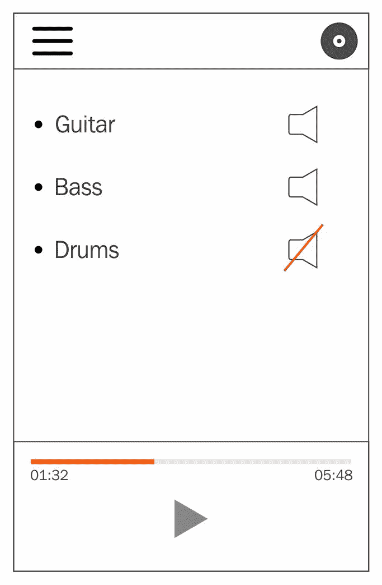

# 第一章：使用@NgModule 塑造形状

在这一章中，我们将通过一些扎实的项目组织练习来启动，为使用 NativeScript for Angular 构建一个令人惊叹的应用做好准备。我们希望为您提供一些重要且强大的概念，以便在规划架构时考虑，为您铺平道路，使开发体验更加顺畅，具备可扩展性。

将 Angular 与 NativeScript 结合使用提供了丰富的有用范例和工具来构建和规划您的应用程序。正如常说的那样，伴随着巨大的力量而来的是巨大的责任，尽管这种技术组合非常棒，可以创建令人惊叹的应用程序，但它们也可以用于创建一个过度工程化且难以调试的应用程序。让我们花一些时间来进行一些练习，以帮助避免常见的陷阱，并真正释放这种技术堆栈的全部潜力。

我们将向您介绍 Angular 的`@NgModule`装饰器，我们将专门使用它来帮助将我们的应用程序代码组织成具有明确目的和可移植性的逻辑单元。我们还将介绍一些我们将在架构中使用的 Angular 概念，例如依赖注入服务。在建立了坚实的基础后，我们将迅速接近第三章末尾的时候首次运行我们的应用程序。

在本章中，我们将涵盖以下主题：

+   什么是 NativeScript for Angular？

+   设置您的本机移动应用程序

+   项目组织

+   架构规划

+   `@NgModule`装饰器

+   `@Injectable`装饰器

+   将您的应用程序分解为模块

# 心理准备

在开始编码之前，您可以通过绘制出应用程序需要的各种服务和功能，极大地增强项目的开发体验。这样做将有助于减少代码重复，构建数据流，并为未来快速功能开发铺平道路。

服务是一种通常处理处理和/或为您的应用程序提供数据的类。您对这些服务的使用不需要知道数据来自何处的具体细节，只需知道它可以向服务询问其目的，然后它就会发生。

# 素描练习

对此的一个很好的练习是勾画出您的应用视图之一的大致想法。您可能还不知道它会是什么样子，没关系；这只是一个思考用户期望的练习，是引导您的思维过程进入您需要构建的各个部分或模块的第一步。这也将帮助您考虑应用需要管理的各种状态。

以我们即将构建的应用**TNSStudio**（**Telerik NativeScript**（**TNS**））为例。我们将在第二章 *特性模块*中更详细地介绍我们的应用是什么，以及它将具体执行的任务。



从上到下，我们可以看到一个带有菜单按钮、标志和录音按钮的标题。然后，我们有用户录制的音轨列表，每个音轨都有一个（重新）录制按钮和一个独奏或静音按钮。

从这个草图中，我们可以考虑应用可能需要提供的几个服务：

+   播放器服务

+   录音服务

+   持久存储服务可记住用户为录音混音中的每个音轨设置的音量级别设置，或者用户是否已经通过身份验证。

我们还可以了解应用可能需要管理的各种状态：

+   用户录音/音轨列表

+   应用是否正在播放音频

+   应用是否处于录音模式或非录音模式

# 低级思维

提供一些低级服务也是有利的，这些服务提供了便捷的 API 来访问诸如 HTTP 远程请求和/或日志记录等内容。这样做将使您能够创建您或您的团队喜欢使用的与低级 API 交互时的独特特性。例如，也许您的后端 API 需要设置一个独特的标头，以及为每个请求设置一个特殊的身份验证标头。创建一个围绕 HTTP 服务的低级包装器将使您能够隔离这些独特特性，并为您的应用提供一致的 API，以确保所有 API 调用都在一个地方得到增强。

此外，您的团队可能希望能够将所有日志代码导入第三方日志分析器（用于调试或其他性能相关指标）。使用精简代码创建围绕某些框架服务的低级包装器将使您的应用能够快速适应这些潜在需求。

# 使用@NgModule 进行模块化

然后，我们可以考虑将这些服务分解为组织单元或模块。

Angular 为我们提供了`@NgModule`装饰器，它将帮助我们定义这些模块的外观以及它们为我们的应用程序提供了什么。为了尽可能地保持应用程序的引导/启动时间尽快，我们可以以这样的方式组织我们的模块，以便在应用程序启动后延迟加载一些服务/功能。用少量所需代码引导一个模块将有助于将启动阶段保持在最低限度。

# 我们应用程序的模块拆分

以下是我们将如何通过模块来组织我们的应用程序：

1.  `CoreModule`：提供一个良好的基础层，包括低级服务、组件和实用程序。例如与日志记录、对话框、HTTP 和其他各种常用服务的交互。

1.  `AnalyticsModule`******：潜在地，您可以拥有一个模块，为您的应用程序提供处理分析的各种服务。

1.  `PlayerModule`*****：提供我们的应用程序播放音频所需的一切。

1.  `RecorderModule`*****：提供我们的应用程序录制音频所需的一切。

*(*)*这些被视为*功能模块。*(**)*我们将在本书的示例中省略此模块，但在此提到它是为了上下文。

# 模块的好处

使用类似的组织方式为您和您的团队提供了几个有利的事情：

+   **高度的可用性**：通过设计低级的`CoreModule`，您和您的团队有机会以独特的方式设计如何使用常用服务，不仅适用于您现在构建的应用程序，还适用于将来的更多应用程序。当使用低级服务时，您可以轻松地将`CoreModule`移动到完全不同的应用程序中，并获得您为该应用程序设计的所有相同独特 API。

+   **将您自己的应用程序代码视为“功能模块”**：这样做将帮助您专注于应用程序应该提供的独特能力，而不是`CoreModule`提供的内容，同时减少代码的重复。

+   **鼓励和增强快速开发**：通过将常用功能限制在我们的`CoreModule`中，我们减轻了在我们的功能模块中担心这些细节的负担。我们可以简单地注入`CoreModule`提供的服务并使用这些 API，而不必重复自己。

+   **可维护性**：将来，如果由于应用程序需要与低级服务进行交互而需要更改底层细节，只需在一个地方（`CoreModule`服务中）进行更改，而不是在应用程序的不同部分可能分散的冗余代码。

+   **性能**：将应用程序拆分为模块将允许您在启动时仅加载您需要的模块，然后在需要时延迟加载其他功能。最终，这将导致更快的应用程序启动时间。

# 考虑因素？

您可能会想，为什么不将播放器/录音机模块合并成一个模块？

**答案**：我们的应用程序只允许在注册用户经过身份验证时进行录制。因此，考虑经过身份验证的上下文的潜力以及仅对经过身份验证的用户（如果有）可访问的功能是有益的。这将使我们能够进一步微调我们的应用程序的加载性能，使其在需要时仅加载所需的内容。

# 入门

我们假设您已经在计算机上正确安装了 NativeScript。如果没有，请按照[`nativescript.org`](https://nativescript.org)上的安装说明进行操作。安装完成后，我们需要使用 shell 提示符创建我们的应用程序框架：

```ts
tns create TNSStudio --ng
```

`tns`代表 Telerik NativeScript。这是您将用于创建、构建、部署和测试任何 NativeScript 应用程序的主要命令行用户界面（CLI）工具。

这个命令将创建一个名为`TNSStudio`的新文件夹。里面是您的主项目文件夹，包括构建应用程序所需的一切。它将包含与此项目相关的所有内容。创建项目文件夹后，您需要做一件事才能拥有一个完全可运行的应用程序。那就是为 Android 和/或 iOS 添加运行时：

```ts
cd TNSStudio
tns platform add ios
tns platform add android
```

如果您使用的是 Macintosh，您可以为 iOS 和 Android 构建。如果您在 Linux 或 Windows 设备上运行，Android 是您可以在本地计算机上编译的唯一平台。

# 创建我们的模块外壳

尚未编写服务实现的情况下，我们可以通过开始定义它应该提供什么来大致了解我们的`CoreModule`将会是什么样子，使用`NgModule`：

让我们创建`app/modules/core/core.module.ts`：

```ts
// angular
import { NgModule } from '@angular/core';
@NgModule({})
export class CoreModule { }
```

# 可注入的服务

现在，让我们为我们的服务创建模板。请注意，这里导入了可注入的装饰器，以声明我们的服务将通过 Angular 的**依赖注入**（**DI**）系统提供，这允许这些服务被注入到可能需要它的任何类构造函数中。DI 系统提供了一个很好的方式来保证这些服务将被实例化为单例并在我们的应用程序中共享。值得注意的是，如果我们不想让它们成为单例，而是希望为组件树的某些分支创建唯一的实例，我们也可以在组件级别提供这些服务。在这种情况下，我们希望将它们创建为单例。我们将在我们的`CoreModule`中添加以下内容：

+   `LogService`：用于传输所有控制台日志的服务。

+   `DatabaseService`：处理我们的应用程序需要的任何持久数据的服务。对于我们的应用程序，我们将实现原生移动设备的存储选项，例如应用程序设置，作为一个简单的键/值存储。但是，你也可以在这里实现更高级的存储选项，例如通过 Firebase 进行远程存储。

创建`app/modules/core/services/log.service.ts`：

```ts
// angular
import { Injectable } from '@angular/core';
@Injectable()
export class LogService {
}
```

另外，创建`app/modules/core/services/database.service.ts`：

```ts
// angular
import { Injectable } from '@angular/core';
@Injectable()
export class DatabaseService {
}
```

# 一致性和标准

为了保持一致性并减少我们的导入长度，并为更好的可扩展性做准备，让我们在`app/modules/core/services`中也创建一个`index.ts`文件，它将导出我们的服务的`const`集合，并按字母顺序导出这些服务（以保持整洁）：

```ts
import { DatabaseService } from './database.service';
import { LogService } from './log.service';

export const PROVIDERS: any[] = [
  DatabaseService,
  LogService
];

export * from './database.service';
export * from './log.service';
```

本书中我们将遵循组织的类似模式。

# 完成 CoreModule

我们现在可以修改我们的`CoreModule`来使用我们创建的内容。我们还将利用这个机会导入`NativeScriptModule`，这是我们的应用程序需要与其他 NativeScript for Angular 功能一起使用的。因为我们知道我们将全局使用这些功能，我们还可以指定它们被导出，这样当我们导入和使用我们的`CoreModule`时，我们就不需要担心在其他地方导入`NativeScriptModule`。我们的`CoreModule`修改应该如下所示：

```ts
// nativescript
import { NativeScriptModule } from 'nativescript-angular/nativescript.module';
// angular
import { NgModule } from '@angular/core';
// app
import { PROVIDERS } from './services';
@NgModule({
  imports: [
    NativeScriptModule
  ],
  providers: [
    ...PROVIDERS
  ],
  exports: [
    NativeScriptModule
  ]
})
export class CoreModule { }
```

现在，我们已经为我们的`CoreModule`建立了一个良好的起点，我们将在接下来的章节中实现其细节。

# 总结

在本章中，我们为我们的应用程序打下了坚实的基础。您学会了如何从模块的角度思考应用程序的架构。您还学会了如何利用 Angular 的`@NgModule`装饰器来构建这些模块。最后，我们现在有了一个很好的基础架构，可以在其上构建我们的应用程序。

现在您已经掌握了一些关键概念，我们可以继续进入我们应用程序的核心部分，即功能模块。让我们深入了解我们应用程序的主要功能，继续构建我们的服务层在第二章中，*功能模块*。我们很快将在第三章中为我们的应用程序创建一些视图，并在 iOS 和 Android 上运行应用程序，*通过组件构建我们的第一个视图*。
