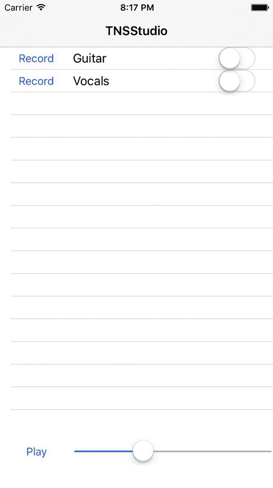
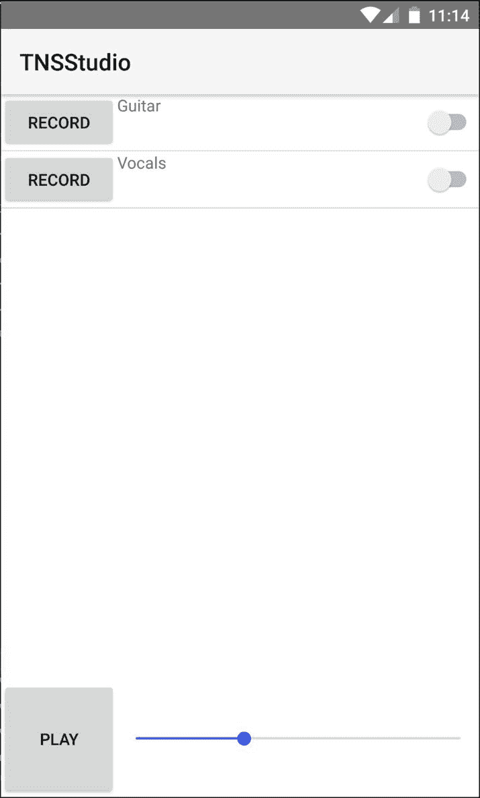

# 第三章：我们的第一个视图通过组件构建

我们在第二章 *特性模块*中努力构建我们应用程序的基础，现在是时候最终看一眼我们正在处理的内容了。这就是将我们的草图从屏幕上的移动设备上获取第一个视图的过程。

使用 NativeScript 为 Angular 构建视图与为 Web 构建视图并没有太大的不同。我们将使用 Angular 的 Component 装饰器来构建各种组件，以实现我们所需的可用性。我们将使用 NativeScript XML 而不是 HTML 标记，这是一个非常强大、简单而简洁的抽象，可以在 iOS 和 Android 上使用所有本地视图组件。

我们不会在这里涵盖您可以访问的所有组件的好处和类型；但是要了解更多信息，我们建议阅读以下任何一本书：

+   [`www.packtpub.com/web-development/getting-started-nativescript`](https://www.packtpub.com/web-development/getting-started-nativescript)

+   [`www.manning.com/books/nativescript-in-action`](https://www.manning.com/books/nativescript-in-action)

在本章中，我们将涵盖以下主题：

+   使用 Component 装饰器来组合我们的视图

+   创建可重用的组件

+   使用管道创建自定义视图过滤器

+   在 iOS 和 Android 模拟器上运行应用程序

# 我们的第一个视图通过组件构建

如果我们从第一章 *使用@NgModule 塑造应用程序*中查看我们的草图，我们可以看到应用程序顶部有一个标题，其中包含我们的应用程序标题和右侧的记录按钮。我们还可以看到一些播放器控件的轨道列表在底部。我们可以将我们的 UI 设计的这些关键元素基本上分解为三个主要组件。一个组件已经由 NativeScript 框架提供，ActionBar，我们将使用它来表示顶部标题。

NativeScript 提供了许多丰富的视图组件来构建我们的 UI。标记不是 HTML，而是 XML，具有`.html`扩展名，这可能看起来不太寻常。使用`.html`扩展名用于 NativeScript for Angular 的 XML 视图模板的原因是，自定义渲染器([`github.com/NativeScript/nativescript-angular`](https://github.com/NativeScript/nativescript-angular))使用 DOM 适配器来解析视图模板。每个 NativeScript XML 组件代表各自平台上的真正本地视图小部件。

对于另外两个主要组件，我们将使用 Angular 的 Component 装饰器。在应用程序开发周期的这个阶段，思考封装的 UI 功能部分非常重要。我们将把我们的曲目列表封装为一个组件，将播放器控件封装为另一个组件。在这个练习中，我们将使用从抽象视角到每个组件的实现细节的外部到内部的方法来构建我们的 UI。

首先，让我们专注于我们 Angular 应用程序中的根组件，因为它将定义我们第一个视图的基本布局。打开`app/app.component.html`，清空其内容，并用以下内容替换，以从我们的草图中勾勒出初始 UI 概念：

```ts
<ActionBar title="TNSStudio">
</ActionBar>
<GridLayout rows="*, 100" columns="*">
  <track-list row="0" col="0"></track-list>
  <player-controls row="1" col="0"></player-controls>
</GridLayout>
```

我们用`ActionBar`和主视图的主要布局容器`GridLayout`来表达我们的观点。在 NativeScript 中，每个视图都以布局容器作为根节点开始（在任何`ActionBar`或`ScrollView`之外），就像在 HTML 标记中使用`div`标签一样。在撰写本文时，NativeScript 提供了六种布局容器：`StackLayout`、`GridLayout`、`FlexboxLayout`、`AbsoluteLayout`、`DockLayout`和`WrapLayout`。对于我们的布局，`GridLayout`将很好地工作。

# 关于 GridLayout

GridLayout 是你在 NativeScript 应用程序中将使用的三种最常用的布局之一（其他两种是 FlexboxLayout 和 StackLayout）。这是一个允许您轻松构建复杂布局的布局。使用 GridLayout 非常类似于 HTML 中的增强表格。基本上，您要将屏幕区域分成所需的部分。它将允许您告诉列（或行）成为屏幕剩余宽度（和高度）的百分比。网格支持三种类型的值；**绝对大小**，剩余空间的百分比和使用的空间。

对于**绝对大小**，只需输入数字。例如，`100`表示它将使用 100 dp 的空间。

另一个**dp**的名字是**dip**。它们是一样的。设备无关像素（也称为密度无关像素、DIP 或 DP）是基于计算机持有的坐标系统的测量单位，代表了应用程序使用的像素的抽象，然后由底层系统转换为物理像素。

如果你考虑到最小的支持的 iOS 设备，它的屏幕宽度为 320dp。对于其他设备，如平板电脑，一些宽度为 1024 dp。因此，100 dp 几乎是 iOS 手机屏幕的三分之一，而在平板电脑上则是屏幕的十分之一。因此，在使用固定的绝对值时，这是您需要考虑的事情。通常最好使用使用的空间而不是固定值，除非您需要将列限制为特定大小。

要使用**剩余空间**为基础的值，也就是 `***`，`***` 告诉它使用剩余空间的其余部分。如果列（或行）设置为 `*`，`*`，那么空间将被分成两个相等的剩余空间。同样，`rows="*,*,*,*,*"` 将指定五个相等大小的行。您还可以指定诸如 `columns="2*,3*,*"` 这样的东西，您将得到三列；第一列将是屏幕的六分之二，第二列将是屏幕的三分之一，最后一列将是屏幕的六分之一（即 2+3+1 = 6）。这使您在如何使用剩余空间方面具有极大的灵活性。

第三种大小类型是**使用的空间**。所以发生的情况是网格内的内容被测量，然后列被分配为该列（或行）中使用的最大尺寸。当您有一个包含数据的网格，但不确定大小或者您并不在乎时，这是非常有用的；您只是希望它看起来不错。因此，这是自动关键字。我可能会写 `columns="auto,auto,*,auto"`。这意味着列 1、2 和 4 将根据这些列内的内容自动调整大小；而列 3 将使用剩下的空间。这对于布局整个屏幕或屏幕的部分非常有用，您希望它看起来某种特定的样子。

GridLayout 是最好的布局之一的最后一个原因是，当您将项目分配给 GridLayout 时，您实际上可以将多个项目分配给相同的行和/或列，并且可以使用行或列跨度来允许项目使用多个行和/或列。

要分配一个对象，你只需通过 `row="0"` 和/或 `col="0"` 进行分配（请记住这些是基于索引的位置）。您还可以使用 `rowSpan` 和 `colSpan` 来使元素跨越多行和/或列。总的来说，GridLayout 是最通用的布局，可以让您轻松地创建几乎任何您在应用程序中需要的布局。

# 回到我们的布局

在网格内，我们声明了一个`track-list`组件来表示我们的曲目列表，它将垂直伸展，占据所有的垂直空间，只留下`player-controls`的高度为 100。我们将`track-list`指定为`row="0" col="0"`，因为行和列是基于索引的。通过 GridLayout 的`*`在 rows 属性中定义了灵活（剩余）的垂直高度。网格的底部部分（第 1 行）将表示播放器控件，允许用户播放/暂停混音并移动播放位置。

现在我们已经以相当抽象的方式定义了应用程序的主视图，让我们深入研究我们需要构建的两个自定义组件，`track-list`和`player-controls`。

# 构建 TrackList 组件

曲目列表应该是所有录制曲目的列表。列表中的每一行都应该提供一个单独的录制按钮，以重新录制，另外还应该提供一个用于显示用户提供的标题的名称标签。它还应该提供一个开关，允许用户独奏特定的曲目。

我们可以注入`PlayerService`并将其声明为`public`，以便我们可以直接绑定到服务的 tracks 集合。

我们还可以模拟一些绑定来启动一些操作，比如`record`操作。现在，让我们允许传入一个 track，并通过`LogService`打印出对该 track 的检查。

让我们从创建`app/modules/player/components/track-list/track-list.component.ts`（配套的`.html`模板）开始：

```ts
// angular
import { Component, Input } from '@angular/core';

// app
import { ITrack } from '../../../core/models';
import { LogService } from '../../../core/services';
import { PlayerService } from '../../services/player.service';

@Component({
 moduleId: module.id,
 selector: 'track-list',
 templateUrl: 'track-list.component.html'
})
export class TrackListComponent {

 constructor(
   private logService: LogService,
   public playerService: PlayerService
 ) { }

 public record(track: ITrack) {
   this.logService.inspect(track);
 }
}
```

对于视图模板`track-list.component.html`，我们将使用强大的`ListView`组件。这个小部件代表了 iOS 上的原生 UITableView（[`developer.apple.com/reference/uikit/uitableview`](https://developer.apple.com/reference/uikit/uitableview)）和 Android 上的原生 ListView（[`developer.android.com/guide/topics/ui/layout/listview.html`](https://developer.android.com/guide/topics/ui/layout/listview.html)），提供了 60fps 的虚拟滚动和重用行。它在移动设备上的性能是无与伦比的：

```ts
<ListView [items]="playerService.tracks">
  <ng-template let-track="item">
    <GridLayout rows="auto" columns="75,*,100">
      <Button text="Record" (tap)="record(track)" 
          row="0" col="0"></Button>
      <Label [text]="track.name" row="0" col="1"></Label>
      <Switch [checked]="track.solo" row="0" col="2">
      </Switch>
    </GridLayout>
  </ng-template>
</ListView>
```

这个视图模板有很多内容，让我们来仔细检查一下。

由于我们在组件构造函数中将`playerService`声明为`public`，我们可以通过标准的 Angular 绑定语法`[items]`直接绑定到其 tracks，这将是我们的列表将迭代的集合。

内部的`template`节点允许我们封装列表中每一行的布局方式。它还允许我们声明一个变量名（`let-track`）作为我们的迭代器引用。

我们从一个 GridLayout 开始，因为每一行都将包含一个录制按钮（允许重新录制轨道），我们将为其分配宽度为 75。这个按钮将绑定到`tap`事件，如果用户经过身份验证，将激活一个录制会话。

然后，我们将有一个标签来显示轨道的用户提供的名称，我们将分配`*`以确保它扩展以填充左侧和右侧列之间的水平空间。我们使用文本属性来绑定到`track.name`。

最后，我们将使用`switch`来允许用户在混音中切换独奏轨道。这提供了`checked`属性，允许我们将`track.solo`属性绑定到。

# 构建一个对话框包装服务来提示用户

如果你还记得第一章中的*使用 @NgModule 进入形式*，录制是一个只能由经过身份验证的用户使用的功能。因此，当他们点击每个轨道的录制按钮时，我们将希望提示用户进行登录对话框。如果他们已经登录，我们将希望提示他们确认是否要重新录制轨道，以确保良好的可用性。

我们可以通过导入一个提供跨平台一致 API 的 NativeScript 对话框服务来直接处理这个对话框。NativeScript 框架的`ui/dialogs`模块（[`docs.nativescript.org/ui/dialogs`](https://docs.nativescript.org/ui/dialogs)）是一个非常方便的服务，允许您创建原生警报、确认、提示、操作和基本登录对话框。然而，我们可能希望为 iOS 和 Android 提供自定义的原生对话框实现，以获得更好的用户体验。有几个插件提供非常优雅的原生对话框，例如，[`github.com/NathanWalker/nativescript-fancyalert`](https://github.com/NathanWalker/nativescript-fancyalert)。

为了为这种丰富的用户体验做好准备，让我们构建一个快速的 Angular 服务，我们可以注入并在任何地方使用，这将使我们能够轻松地在将来实现这些美好的东西。

由于这应该被视为我们应用的“核心”服务，让我们创建`app/modules/core/services/dialog.service.ts`：

```ts
// angular
import { Injectable } from '@angular/core';

// nativescript
import * as dialogs from 'ui/dialogs';

@Injectable()
export class DialogService {

  public alert(msg: string) {
    return dialogs.alert(msg);
  }

  public confirm(msg: string) {
    return dialogs.confirm(msg);
  }

  public prompt(msg: string, defaultText?: string) {
    return dialogs.prompt(msg, defaultText);
  }

  public login(msg: string, userName?: string, password?: string) {
    return dialogs.login(msg, userName, password);
  }

  public action(msg: string, cancelButtonText?: string, 
    actions?: string[]) {
    return dialogs.action(msg, cancelButtonText, actions);
  }
}
```

乍一看，这似乎非常浪费！为什么要创建一个提供与已经存在于 NativeScript 框架中的服务完全相同 API 的包装器？

是的，确实，在这个阶段看起来是这样。然而，我们正在为将来处理这些对话框的灵活性和强大性做准备。敬请关注可能涵盖这种有趣而独特的整合的潜在奖励章节。

在我们继续使用这个服务之前，我们需要做的最后一件事是确保它被添加到我们的核心服务`PROVIDERS`集合中。这将确保 Angular 的 DI 系统知道我们的新服务是一个有效的可用于注入的令牌。

打开`app/modules/core/services/index.ts`并进行以下修改：

```ts
import { AuthService } from './auth.service';
import { DatabaseService } from './database.service';
import { DialogService } from './dialog.service';
import { LogService } from './log.service';

export const PROVIDERS: any[] = [
 AuthService,
 DatabaseService,
 DialogService,
 LogService
];

export * from './auth.service';
export * from './database.service';
export * from './dialog.service';
export * from './log.service';
```

我们现在准备好注入和使用我们的新服务。

# 将 DialogService 集成到我们的组件中

让我们打开`track-list.component.ts`并注入`DialogService`以在我们的记录方法中使用。我们还需要确定用户是否已登录，以有条件地显示登录对话框或确认提示，因此让我们也注入`AuthService`：

```ts
// angular
import { Component, Input } from '@angular/core';

// app
import { ITrack } from '../../../core/models';
import { AuthService, LogService, DialogService } from '../../../core/services';
import { PlayerService } from '../../services/player.service';

@Component({
  moduleId: module.id,
  selector: 'track-list',
  templateUrl: 'track-list.component.html'
})
export class TrackListComponent {

 constructor(
   private authService: AuthService,
   private logService: LogService,
   private dialogService: DialogService,
   public playerService: PlayerService
 ) { }

 public record(track: ITrack, usernameAttempt?: string) {
   if (AuthService.CURRENT_USER) {
     this.dialogService.confirm(
       'Are you sure you want to re-record this track?'
     ).then((ok) => {
       if (ok) this._navToRecord(track);
     });
   } else {
     this.authService.promptLogin(
       'Provide an email and password to record.',
       usernameAttempt
     ).then(
       this._navToRecord.bind(this, track), 
       (usernameAttempt) => {
         // initiate sequence again
         this.record(track, usernameAttempt);
       }
     ); 
    }
  }

  private _navToRecord(track: ITrack) {
    // TODO: navigate to record screen
    this.logService.debug('yes, re-record', track);
  }
}
```

现在，记录方法首先检查用户是否经过静态`AuthService.CURRENT_USER`引用进行了身份验证，该引用是在应用启动时通过 Angular 的依赖注入首次构建`AuthService`时设置的（参见第二章，*特性模块*）。

如果用户已经通过身份验证，我们会呈现一个确认对话框以确保操作是有意的。

如果用户没有经过身份验证，我们希望提示用户登录。为了减少本书的负担，我们将假设用户已经通过后端 API 注册，因此我们不会要求用户注册。

我们需要在`AuthService`中实现`promptLogin`方法来持久保存用户的登录凭据，这样他们每次返回应用时都会自动登录。现在，记录方法提供了一个额外的可选参数`usernameAttempt`，当在用户输入验证错误后重新启动登录序列时，这将有助于重新填充登录提示的用户名字段。我们不会在这里对用户输入进行彻底的验证，但至少可以对有效的电子邮件进行轻量级检查。

在您自己的应用中，您可能应该进行更多的用户输入验证。

为了保持关注点的清晰分离，打开`app/modules/core/services/auth.service.ts`来实现`promptLogin`。以下是带有修改的整个服务：

```ts
// angular
import { Injectable } from '@angular/core';

// lib
import { BehaviorSubject } from 'rxjs/BehaviorSubject';

// app
import { DatabaseService } from './database.service';
import { DialogService } from './dialog.service';
import { LogService } from './log.service';

@Injectable()
export class AuthService {

 // access our current user from anywhere
 public static CURRENT_USER: any;

 // subscribe to authenticated state changes
 public authenticated$: BehaviorSubject<boolean> = 
   new BehaviorSubject(false);

 constructor(
 private databaseService: DatabaseService,
 private dialogService: DialogService,
 private logService: LogService
 ) {
   this._init();
 } 

 public promptLogin(msg: string, username: string = '')
   : Promise<any> {
   return new Promise((resolve, reject) => {
     this.dialogService.login(msg, username, '')
       .then((input) => {
         if (input.result) { // result = false when canceled
           if (input.userName && 
               input.userName.indexOf('@') > -1) {
               if (input.password) {
                 // persist user credentials
                 this._saveUser(
                   input.userName, input.password
                 );
                 resolve();
               } else {
                 this.dialogService.alert(
                   'You must provide a password.'
                 ).then(reject.bind(this, input.userName));
               }
           } else {
             // reject, passing userName back
             this.dialogService.alert(
               'You must provide a valid email address.'
             ).then(reject.bind(this, input.userName));
           }
         }
       });
     });
 }

 private _saveUser(username: string, password: string) {
   AuthService.CURRENT_USER = { username, password };
   this.databaseService.setItem(
     DatabaseService.KEYS.currentUser,
     AuthService.CURRENT_USER
   );
   this._notifyState(true);
 }

  private _init() {
    AuthService.CURRENT_USER =
      this.databaseService
      .getItem(DatabaseService.KEYS.currentUser);
    this.logService.debug(
      `Current user: `, AuthService.CURRENT_USER
    );
    this._notifyState(!!AuthService.CURRENT_USER);
  }

  private _notifyState(auth: boolean) {
    this.authenticated$.next(auth);
  }
}
```

我们使用`dialogService.login`方法打开本机登录对话框，允许用户输入用户名和密码。一旦他们选择确定，我们对输入进行最小的验证，如果成功，就会继续通过`DatabaseService`持久保存用户名和密码。否则，我们只是警告用户有错误，并拒绝我们的承诺，传递输入的用户名。这样可以通过重新显示带有输入的用户名的登录对话框来帮助用户，以便他们更容易地进行更正。

完成这些服务级细节后，`track-list`组件看起来非常不错。然而，在我们进行这项工作时，我们应该采取一个额外的步骤。如果您还记得，我们的 TrackModel 包含一个 order 属性，这将帮助用户方便地按照他们喜欢的方式对曲目进行排序。

# 创建一个 Angular 管道 - OrderBy

Angular 提供了 Pipe 装饰器，以便轻松创建视图过滤器。让我们首先展示我们将如何在视图中使用它。您可以看到它看起来非常类似于 Unix shell 脚本中使用的命令行管道；因此，它被命名为：`Pipe`：

```ts
<ListView [items]="playerService.tracks | orderBy: 'order'">
```

这将获取`playerService.tracks`集合，并确保通过每个`TrackModel`的`order`属性对其进行排序，以便在视图中显示。

由于我们可能希望在应用程序的任何视图中使用这个，让我们将这个管道作为`CoreModule`的一部分添加。创建`app/modules/core/pipes/order-by.pipe.ts`，以下是我们将如何实现`OrderByPipe`：

```ts
import { Pipe } from '@angular/core';

@Pipe({
 name: 'orderBy'
})
export class OrderByPipe {

 // Comparator method
 static comparator(a: any, b: any): number {
   if (a === null || typeof a === 'undefined') a = 0;
   if (b === null || typeof b === 'undefined') b = 0;

   if ((isNaN(parseFloat(a)) || !isFinite(a)) || 
       (isNaN(parseFloat(b)) || !isFinite(b))) {
      // lowercase strings
      if (a.toLowerCase() < b.toLowerCase()) return -1;
      if (a.toLowerCase() > b.toLowerCase()) return 1;
   } else {
     // ensure number values
     if (parseFloat(a) < parseFloat(b)) return -1;
     if (parseFloat(a) > parseFloat(b)) return 1;
   }

   return 0; // values are equal
 }

 // Actual value transformation
 transform(value: Array<any>, property: string): any {
   return value.sort(function (a: any, b: any) {
     let aValue = a[property];
     let bValue = b[property];
     let comparison = OrderByPipe
                      .comparator(aValue, bValue);
     return comparison;
   });
 } 
}
```

我们不会详细介绍这里发生了什么，因为在 JavaScript 中对集合进行排序是非常典型的。为了完成这一点，确保`app/modules/core/pipes/index.ts`遵循我们的标准约定：

```ts
import { OrderByPipe } from './order-by.pipe';

export const PIPES: any[] = [
 OrderByPipe
];
```

最后，导入前面的集合以与`app/modules/core/core.module.ts`一起使用。以下是所有修改的完整文件：

```ts
// nativescript
import { NativeScriptModule } from 'nativescript-angular/nativescript.module'; 

// angular
import { NgModule } from '@angular/core';

// app
import { PIPES } from './pipes';
import { PROVIDERS } from './services';

@NgModule({
 imports: [
   NativeScriptModule
 ],
 declarations: [
   ...PIPES
 ],
 providers: [
   ...PROVIDERS
 ],
 exports: [
   NativeScriptModule,
   ...PIPES
 ]
})
export class CoreModule { }
```

由于管道是视图级别的实现，我们确保它们作为`exports`集合的一部分添加，以允许其他模块使用它们。

现在，如果我们在这一点上运行我们的应用程序，您会注意到我们在`track-list.component.html`视图模板上使用的`OrderBy`管道*不会*工作！

Angular 模块在彼此之间进行隔离编译。

这是一个需要理解的关键点：Angular 将声明`TrackListComponent`的`PlayerModule`编译到自身中，以孤立的方式。由于我们将`OrderByPipe`声明为`CoreModule`的一部分，而`PlayerModule`目前对`CoreModule`没有依赖，`TrackListComponent`被编译时并不知道`OrderByPipe`！你会在控制台中看到生成的错误：

```ts
CONSOLE ERROR file:///app/tns_modules/tns-core-modules/trace/trace.js:160:30: ns-renderer: ERROR BOOTSTRAPPING ANGULAR
CONSOLE ERROR file:///app/tns_modules/tns-core-modules/trace/trace.js:160:30: ns-renderer: Template parse errors:
 The pipe 'orderBy' could not be found ("
 </ListView>-->

 <ListView [ERROR ->][items]="playerService.tracks | orderBy: 'order'">
   <ng-template let-track="item">
     <GridLayout rows"): TrackListComponent@10:10
```

为了解决这个问题，我们希望确保`PlayerModule`知道来自`CoreModule`的与视图相关的声明（如管道或其他组件），方法是确保`CoreModule`作为`PlayerModule`的`imports`集合的一部分添加进去。这也为我们提供了一个额外的便利。如果你注意到，`CoreModule`指定`NativeScriptModule`作为一个导出，这意味着导入`CoreModule`的任何模块将从中获得`NativeScriptModule`。以下是允许所有内容一起工作的`PlayerModule`的最终修改：

```ts
// angular
import { NgModule } from '@angular/core';

// app
import { CoreModule } from '../core/core.module';
import { COMPONENTS } from './components';
import { PROVIDERS } from './services';

@NgModule({
 imports: [
   CoreModule 
 ],
 providers: [...PROVIDERS],
 declarations: [...COMPONENTS],
 exports: [...COMPONENTS]
})
export class PlayerModule { }
```

现在我们可以继续进行`player-controls`组件。

# 构建 PlayerControls 组件

我们的播放器控件应该包含一个用于整个混音的播放/暂停切换按钮。它还应该呈现一个滑块控件，允许我们快进和倒带我们的播放。

让我们创建`app/modules/player/components/player-controls/player-controls.component.html`（带有匹配的`.ts`）：

```ts
<GridLayout rows="100" columns="75,*" row="1" col="0">
  <Button [text]="playStatus" (tap)="togglePlay()" row="0" col="0"></Button>
  <Slider minValue="0" [maxValue]="duration" 
          [value]="currentTime" row="0" col="1"></Slider>
</GridLayout>
```

我们从一个具有明确的 100 高度的单行`GridLayout`开始。然后，第一列将被限制为 75 宽，以容纳我们的播放/暂停切换按钮。然后，第二列将占据其余的水平空间，用`*`表示，使用`Slider`组件。这个组件由 NativeScript 框架提供，允许我们将`maxValue`属性绑定到我们混音的总持续时间，以及将值绑定到播放的`currentTime`。

然后，对于`player-controls.component.ts`：

```ts
// angular
import { Component, Input } from '@angular/core';

// app
import { ITrack } from '../../../core/models';
import { LogService } from '../../../core/services';
import { PlayerService } from '../../services';

@Component({
 moduleId: module.id,
 selector: 'player-controls',
 templateUrl: 'player-controls.component.html'
})
export class PlayerControlsComponent {

 public currentTime: number = 0; 
 public duration: number = 0; 
 public playStatus: string = 'Play';

 constructor(
   private logService: LogService,
   private playerService: PlayerService
 ) { }

 public togglePlay() {
   let playing = !this.playerService.playing;
   this.playerService.playing = playing;
   this.playStatus = playing ? 'Stop' : 'Play';
 }

}
```

目前，我们已经直接将`currentTime`和`duration`放在了组件上，但是以后我们会将它们重构到`PlayerService`中。最终，当我们在后续章节实现处理音频的插件时，与我们的播放器相关的所有状态都将来自于`PlayerService`。`togglePlay`方法也只是为一些一般行为设置了存根，切换我们按钮的文本为播放或停止。

# 快速预览

在这一点上，我们将快速查看我们到目前为止构建的内容。目前，我们的播放器服务返回一个空的曲目列表。为了查看结果，我们应该向其中添加一些虚拟数据。例如，在`PlayerService`中，我们可以添加：

```ts
constructor() {
  this.tracks = [
    {name: "Guitar"},
    {name: "Vocals"},
  ];
}
```

如果它不够漂亮，不要感到惊讶；我们将在下一章中涵盖这一点。我们也不会涵盖我们目前可用的所有运行时命令；我们将在第六章 *在 iOS 和 Android 上运行应用程序* 中彻底涵盖这一点。

# 在 iOS 上预览

你需要在安装了 XCode 的 Mac 上预览 iOS 应用程序：

```ts
tns run ios --emulator
```

这将启动 iOS 模拟器，你应该会看到以下截图：



# 在 Android 上预览

你需要安装 AndroidSDKk 和工具才能在 Android 模拟器上预览：

```ts
tns run android --emulator
```

这将启动一个 Android 模拟器，你应该会看到以下截图：



恭喜！我们有了我们的第一个视图。嘿，没人说它会很漂亮！

# 总结

我们已经开始了第二部分的组件构建，我们已经布置了我们的根组件`app.component.html`来容纳我们的主视图，你将学习到`GridLayout`，一个非常有用的布局容器。

Angular 的组件装饰器使我们能够轻松构建`TrackListComponent`和`PlayerControlsComponent`。我们还学会了如何构建一个 Angular `Pipe` 来帮助我们的视图保持我们的曲目列表有序。Angular 的`NgModule`教会了我们需要确保任何与视图相关的声明都被正确导入。这种 Angular 设计模式有助于保持模块隔离，作为可以通过相互导入模块相互混合的独立代码单元。

我们还增强了一些服务，以支持我们对组件所需的一些可用性。

最后，我们能够快速地看一下我们正在构建的东西。尽管目前还不够漂亮，但我们可以看到事情正在逐渐成形。

在第四章 *使用 CSS 创建更漂亮的视图* 中，你将学习如何使用 CSS 来美化我们的视图。
