# 第四章：使用 CSS 创建更美观的视图

NativeScript 为原生应用程序开发带来的许多关键好处之一是能够使用标准 CSS 为原生视图组件设置样式。您会发现对许多常见和高级属性有很好的支持；然而，有些属性没有直接对应，而其他属性则完全是原生视图布局的独特之处。

让我们看看如何使用一些 CSS 类将我们的第一个视图变得非常惊人。您还将学习如何利用 NativeScript 的核心主题来提供一致的样式框架以构建。

在本章中，我们将涵盖以下主题：

+   使用 CSS 来为视图设置样式

+   了解典型 Web 样式和原生样式之间的一些区别

+   使用特定于平台的文件解锁 NativeScript 的功能

+   学习如何使用 nativescript-theme-core 样式框架插件

+   调整 iOS 和 Android 上状态栏的背景颜色和文本颜色

# 是时候开始优雅了

让我们首先看看我们应用程序主要的`app.css`文件，位于`App`目录中：

```ts
/*
In NativeScript, the app.css file is where you place CSS rules that
you would like to apply to your 

entire application. Check out
http://docs.nativescript.org/ui/styling for a full list of the CSS
selectors and 

properties you can use to style UI components.

/*
For example, the following CSS rule changes the font size 

of all UI
components that have the btn class name.
*/
.btn {
  font-size: 18;
}

/*
In many cases you may want to use the NativeScript core theme instead
of writing your own CSS rules. For a full list 

of class names in the theme
refer to http://docs.nativescript.org/ui/theme.
*/
@import 'nativescript-

theme-core/css/core.light.css';
```

默认情况下，`--ng`模板提示了您可以选择的两个选项来构建您的 CSS：

+   编写自定义类

+   将 nativescript-theme-core 样式框架插件用作基础。

让我们探索第一个选项片刻。在`.btn`类之后添加以下内容：

```ts
.btn {
  font-size: 18;
}

.row {
 padding: 15 5;
 background-color: yellow;
}

.row .title {
 font-size: 25;
 color: #444;
 font-weight: bold;
}

Button {
 background-color: red;
 color: white;
}
```

从这个简单的例子中，您可能会立即注意到一些有趣的事情：

+   `padding`不使用您在 Web 样式中熟悉的`px`后缀。

+   不用担心，使用`px`后缀不会伤害您。

+   从 NativeScript 3.0 开始，支持发布单位，因此您可以使用 dp（设备独立像素）或`px`（设备像素）。

如果未指定单位，则将使用 dp。对于宽度/高度和边距，您还可以在 CSS 中使用百分比作为单位类型。

+   支持各种常见属性（`padding`，`font size`，`font weight`，`color`，`background color`等）。同样，简写的`margin/padding`也可以使用，即`padding: 15 5`。

+   您可以使用标准的十六进制颜色名称，例如黄色，或者使用简写代码，例如＃444。

+   CSS 作用域与您期望的一样，即`.row .title { ...`。

+   元素/标签/组件名称可以进行全局样式设置。

尽管您可以按标签/组件名称设置样式，但不建议这样做。我们将向您展示一些有趣的原生设备注意事项。

现在，让我们打开 `app/modules/player/components/track-list/track-list.component.html` 并在我们的模板中添加 `row` 和 `title` 类：

```ts
<ListView [items]="playerService.tracks | orderBy: 'order'">
  <template let-track="item">

<GridLayout rows="auto" columns="100,*,100" class="row">
      <Button text="Record" (tap)

="record(track)" row="0" col="0"></Button>
      <Label [text]="track.name" row="0" col="1" 

class="title"></Label>
      <Switch row="0" col="2"></Switch>

</GridLayout>
  </template>
</ListView>
```

让我们快速预览一下使用 `tns run ios --emulator` 会发生什么，你应该会看到以下内容：

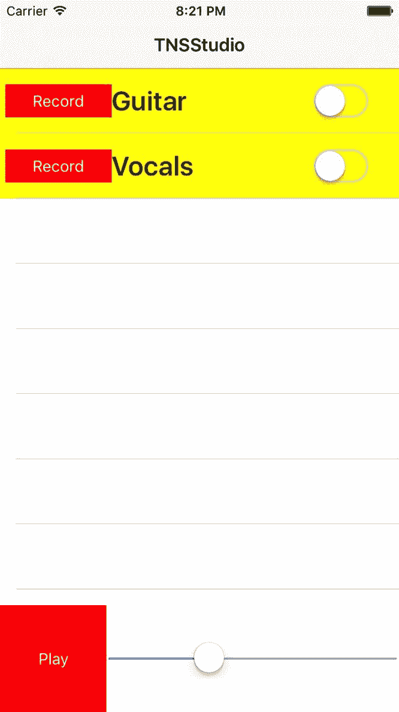

如果您在 Android 中使用 `tns run android --emulator`，您应该会看到以下内容：

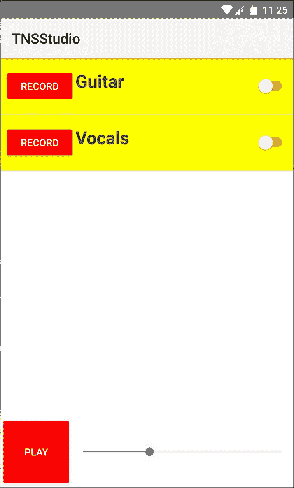

我们可以看到，在两个平台上，这些样式都得到了一致的应用，同时仍然保持了每个平台的独特特征。例如，iOS 保持了按钮的扁平设计美学，开关提供了熟悉的 iOS 感觉。相比之下，在 Android 上，按钮保留了其微妙的默认阴影和全大写文本，同时保留了熟悉的 Android 开关。

然而，有一些微妙的（可能不理想的）差异是重要的理解和解决的。从这个例子中，我们可能注意到以下内容：

1.  Android 的按钮左右边距比 iOS 宽。

1.  行标题的对齐不一致。在 iOS 上，默认情况下，标签是垂直居中的；然而，在 Android 上，它是对齐到顶部的。

1.  如果您点击“记录”按钮查看登录对话框，您还会注意到一些非常不理想的东西：

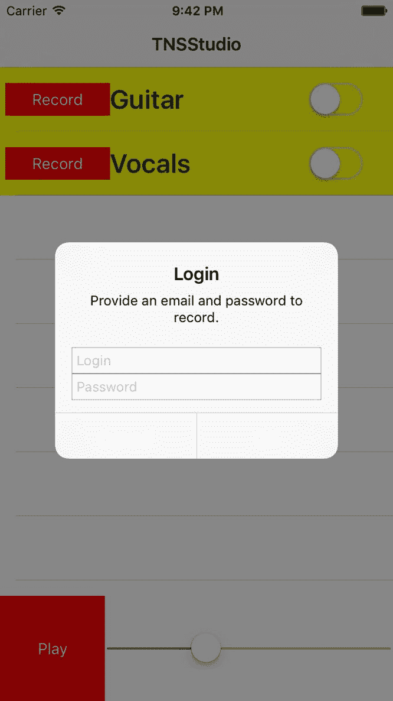

第 3 项可能是最令人惊讶和意想不到的。它展示了全局样式元素/标签/组件名称不建议的主要原因之一。由于原生对话框默认使用 `Buttons`，我们添加的一些全局 `Button` 样式正在渗入对话框（特别是 `color: white`）。为了解决这个问题，我们可以确保适当地限定所有组件名称：

```ts
.row Button {
 background-color: red;
 color: white;
} 
```

或者更好的是，只需在按钮上使用一个类名：

```ts
.row .btn {
 background-color: red;
 color: white;
} <Button text="Record" (tap)="record(track)" row="0" col="0" 

class="btn"></Button>
```

为了解决第 2 项（行标题对齐），我们可以介绍 NativeScript 的一个特殊功能：根据运行平台构建特定于平台的文件的能力。让我们创建一个新文件 `app/common.css`，并将 `app/app.css` 的所有内容重构到这个新文件中。然后，让我们创建另外两个新文件 `app/app.ios.css` 和 `app/app.android.css`（然后删除 `app.css`，因为它将不再需要），两个文件的内容如下：

```ts
@import './common.css';
```

这将确保我们的共享通用样式被导入到 iOS 和 Android 的 CSS 中。现在，我们有一种方法来应用特定于平台的样式修复！

让我们通过修改 `app/app.android.css` 来解决垂直对齐问题：

```ts
@import './common.css';

.row .title {
  vertical-align: center;
}
```

这为我们现在添加了仅适用于 Android 的额外样式调整：

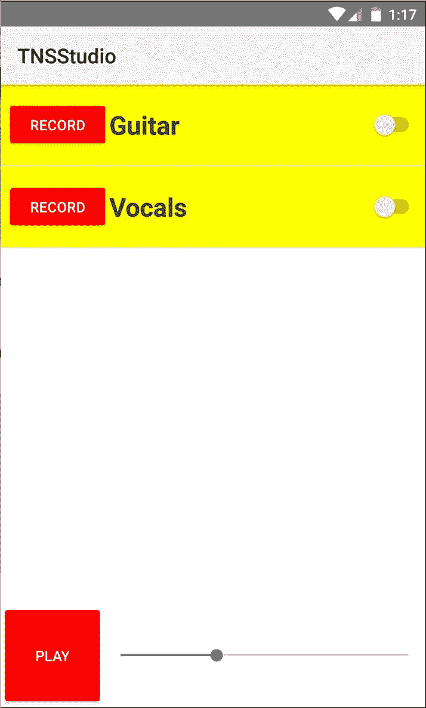

非常好，好多了。

要解决问题＃1，如果我们希望在两个平台上的按钮具有相同的边距，我们需要应用更多特定于平台的调整。

此时，您可能想知道您需要自己进行多少调整来解决一些特定于平台的问题。您会高兴地知道，并没有详尽的清单，但是非常高昂的 NativeScript 社区共同努力创造了更好的东西，一个一致的类似于 bootstrap 的核心主题，提供了许多这些微妙的调整，比如标签的垂直对齐和许多其他微妙的调整。

# 认识 NativeScript 核心主题

所有新的 NativeScript 项目都安装了一个核心主题，并且可以立即使用。如前所述，您可以选择两种选项来为您的应用程序设置样式。前面的部分概述了您在从头开始为您的应用程序设置样式时可能遇到的一些问题。

让我们来看看 Option #2：使用`nativescript-theme-core`插件。这个主题是为了扩展和构建而构建的。它提供了各种各样的实用类，用于间距、着色、布局、着色皮肤等等。由于它提供了坚实的基础和令人惊叹的灵活性，我们将在这个主题的基础上构建我们应用的样式。

值得一提的是，`nativescript-theme-`前缀是有意为之的，因为它有助于提供一个在`npm`上搜索所有 NativeScript 主题的常用前缀。如果您设计并发布自己的自定义 NativeScript 主题，建议使用相同的前缀。

让我们移除我们的自定义样式，只留下核心主题。然而，我们不会使用默认的浅色皮肤，而是使用深色皮肤。现在我们的`app/common.css`文件应该是这样的：

```ts
@import 'nativescript-theme-core/css/core.dark.css';
```

现在，我们希望开始使用核心主题提供的一些类来为我们的组件分类。您可以在这里了解所有类的完整列表：[`docs.nativescript.org/ui/theme`](https://docs.nativescript.org/ui/theme)。

从`app/app.component.html`开始，让我们添加以下类：

```ts
<ActionBar title="TNSStudio" class="action-bar">
</ActionBar>
<GridLayout 

rows="*, 100" columns="*" class="page">
  <track-list row="0" col="0"></track-list>
  <player-controls row="1" col="0"></player-controls>
</GridLayout>
```

`action-bar`类确保我们的皮肤能够适当地应用于应用程序的标题，并为 iOS 和 Android 上的`ActionBar`提供微妙的一致性调整。

`page`类确保我们的皮肤应用于整个页面。在任何给定的组件视图上，将此类应用于根布局容器非常重要。

通过这两个调整，我们现在应该在 iOS 上看到这个：

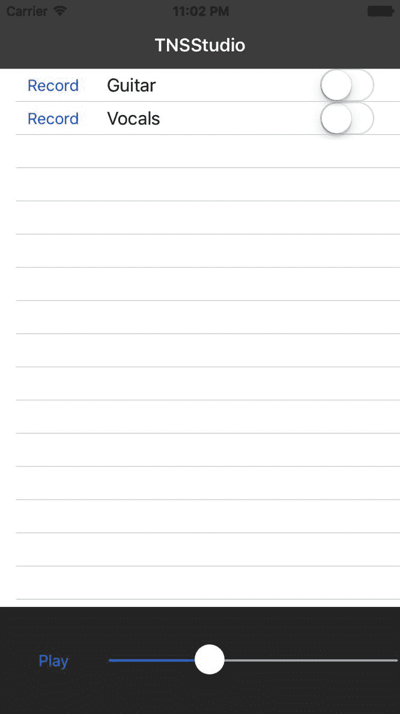

而这是在 Android 上的样子：

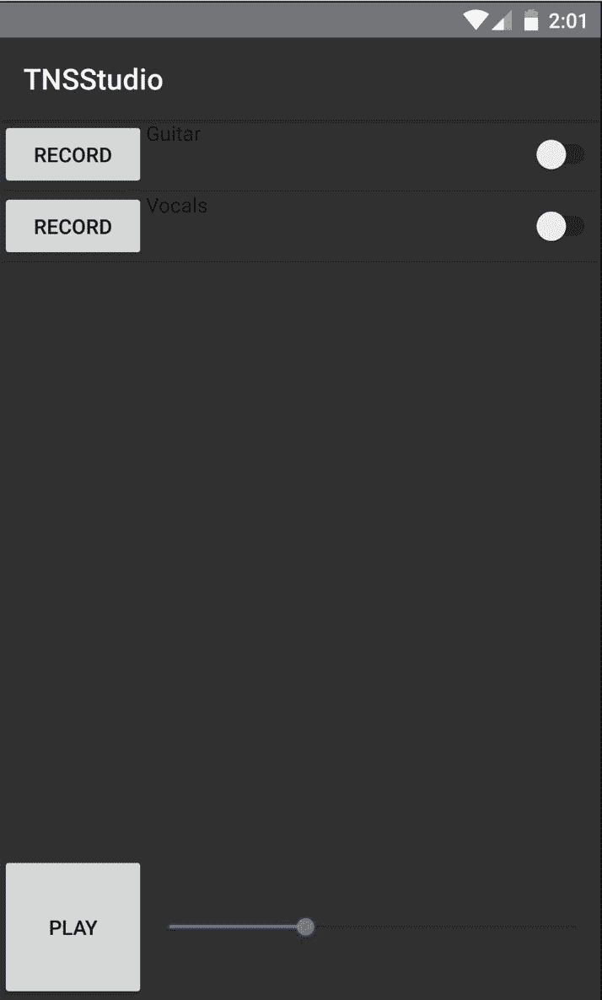

您会注意到`ListView`的另一个 iOS/Android 差异。iOS 默认具有白色背景，而 Android 似乎具有透明背景，允许皮肤页面颜色透过显示。让我们继续使用核心主题中更多的类来为我们的组件分类，这有助于解决这些细微差别。打开`app/modules/player/components/track-list/track-list.component.html`并添加以下类：

```ts
<ListView [items]="playerService.tracks | orderBy: 'order'" class="list-group">
  <ng-

template let-track="item">
    <GridLayout rows="auto" columns="100,*,100" class="list-group-

item">
      <Button text="Record" (tap)="record(track)" row="0" col="0" class="c-

ruby"></Button>
      <Label [text]="track.name" row="0" col="1" 

class="h2"></Label>
      <Switch row="0" col="2" 

class="switch"></Switch>
    </GridLayout>
  </ng-template>
</ListView>
```

父类`list-group`有助于将所有内容范围限定到`list-group-item`。然后，我们添加`c-ruby`来为我们的录音按钮添加一些红色。有几种皮肤颜色提供了姓氏：`c-sky`，`c-aqua`，`c-charcoal`，`c-purple`等等。在这里查看所有这些：[`docs.nativescript.org/ui/theme#color-schemes`](https://docs.nativescript.org/ui/theme#color-schemes)。

然后我们在标签中添加`h2`，使其字体大小增加一点。最后，`switch`类有助于标准化轨道独奏开关。

现在我们在 iOS 上有了这个：

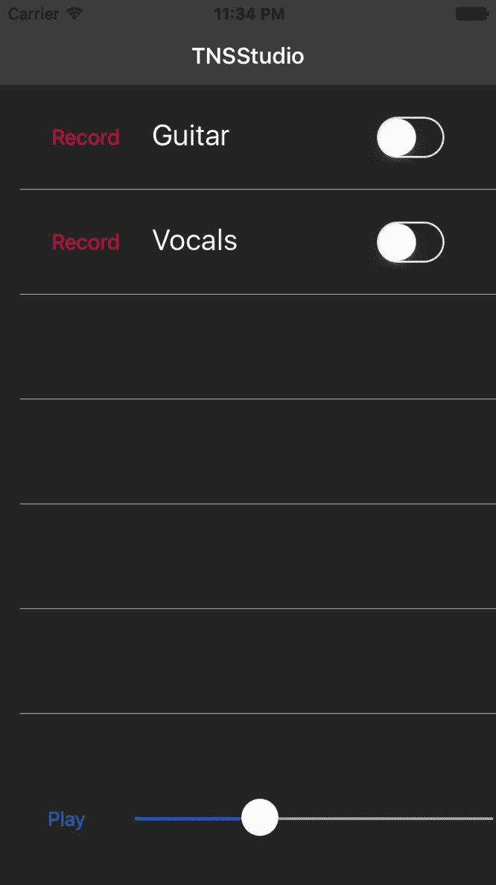

而我们在 Android 上有了这个：

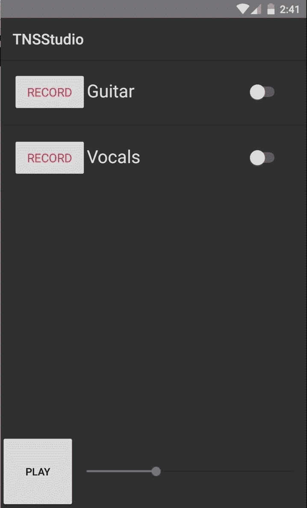

让我们继续前进到我们的最后一个组件（目前为止），`player-controls`。打开`app/modules/player/components/player-controls/player-controls.component.html`并添加以下内容：

```ts
<GridLayout rows="100" columns="100,*" row="1" col="0" class="p-x-10">
  <Button 

[text]="playStatus" (tap)="togglePlay()" row="0" col="0" class="btn btn-primary w-

100"></Button>
  <Slider minValue="0" [maxValue]="duration" [value]="currentTime" row="0" col="1" 

class="slider"></Slider>
</GridLayout>
```

首先，我们添加`p-x-10`类来为左/右容器（`GridLayout`）添加`10`填充。然后，我们为我们的播放/暂停按钮添加`btn btn-primary w-100`。`w-100`类将按钮的宽度设置为`100`。然后，我们为我们的滑块添加`slider`类。

现在，在 iOS 上事情开始有所进展：

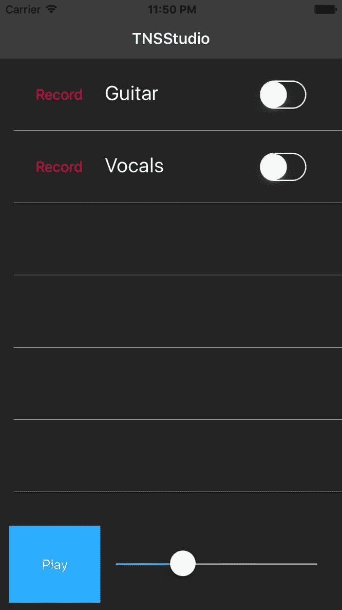

在 Android 上看起来将如下所示：

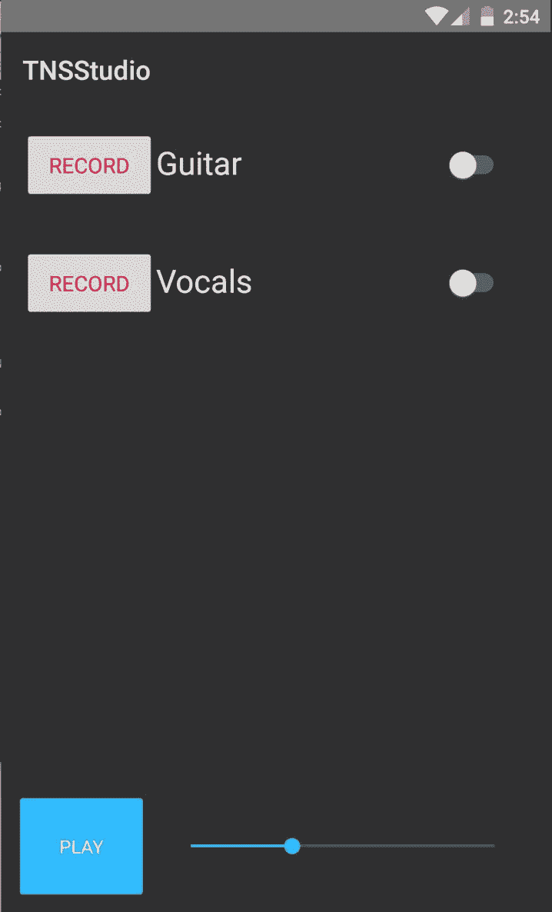

哇，好了，现在事情正在逐渐成形。随着我们的进行，我们将继续对事情进行更多的打磨，但是这个练习已经展示了您可以多快地使用核心主题中的许多类来调整您的样式。

# 调整 iOS 和 Android 上状态栏的背景颜色和文本颜色

您可能已经注意到，在 iOS 上，状态栏文本是黑色的，与我们的深色皮肤不太搭配。此外，我们可能希望改变 Android 的状态栏色调。NativeScript 提供了对原生 API 的直接访问，因此我们可以轻松地将它们更改为我们想要的样子。这两个平台处理它们的方式不同，因此我们可以有条件地为每个平台更改状态栏。

打开 `app/app.component.ts`，让我们添加以下内容：

```ts
// angular
import { Component } from '@angular/core';

// nativescript
import { isIOS } from 'platform';
import { topmost } from 'ui/frame';
import * as app from 'application';

// app
import { AuthService } from 

'./modules/core/services';

declare var android;

@Component({
  moduleId: 

module.id,
  selector: 'my-app',
  templateUrl: 'app.component.html',
})
export class AppComponent {

  constructor(
    private authService: AuthService
  ) { 
    if (isIOS) {
 /**
 * 0 = black text
 * 1 = white text
 */
 topmost().ios.controller.navigationBar.barStyle = 1;
 } else {
 // adjust text to darker color
 let decorView = 

app.android.startActivity.getWindow()
 .getDecorView();
 decorView.setSystemUiVisibility(android.view.View.SYSTEM_UI_FLAG_LIGHT_STATUS_BAR);
 }
  }
}
```

这将使 iOS 状态栏文本变为白色：

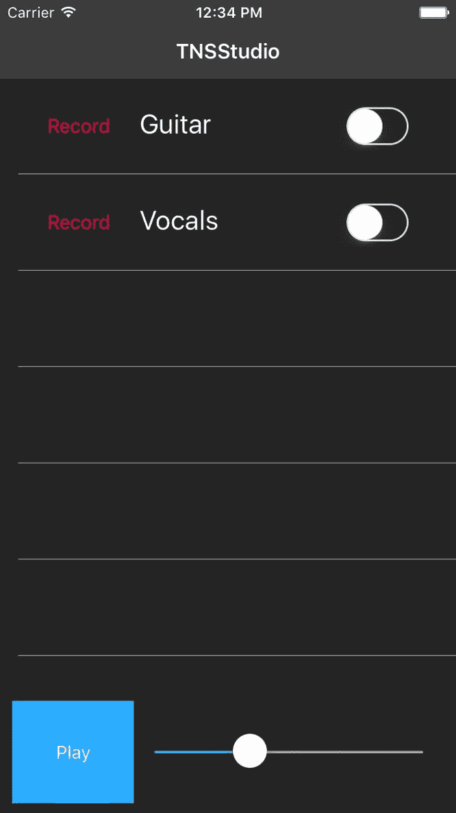

条件的第二部分调整 Android 以在状态栏中使用深色文本：

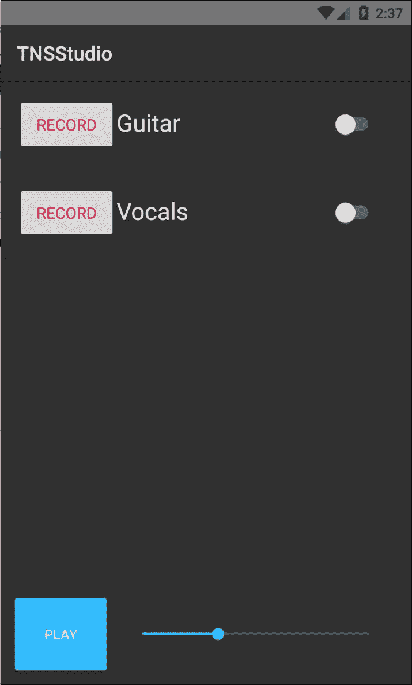

在此期间，让我们也调整 `ActionBar` 的背景颜色，为其增添一些亮点。在 iOS 上，状态栏的背景颜色采用 `ActionBar` 的背景颜色，而在 Android 上，状态栏的背景颜色必须通过 `App_Resources` 中的 Android `colors.xml` 进行调整。从 iOS 开始，让我们打开 `app/common.css` 并添加以下内容：

```ts
.action-bar {
  background-color:#101B2E;
}
```

这将为 iOS 的 `ActionBar` 着色如下：

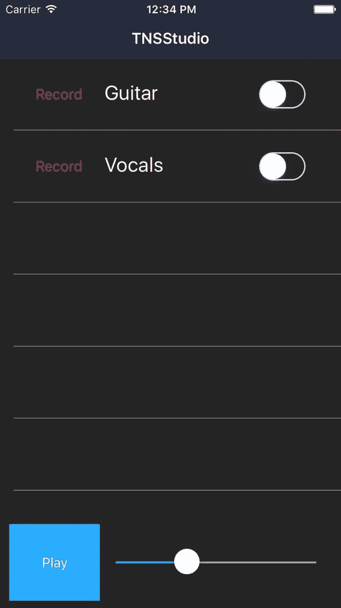

对于 Android，我们希望我们的状态栏背景呈现与我们 `ActionBar` 背景相衬的色调。为此，我们要打开 `app/App_Resources/Android/values/colors.xml` 并进行以下调整：

```ts
<?xml version="1.0" encoding="utf-8"?>
<resources>
  <color 

name="ns_primary">#F5F5F5</color>
  <color 

name="ns_primaryDark">#284472</color>
  <color name="ns_accent">#33B5E5</color>

<color name="ns_blue">#272734</color>
</resources>
```

这是 Android 上的最终结果：

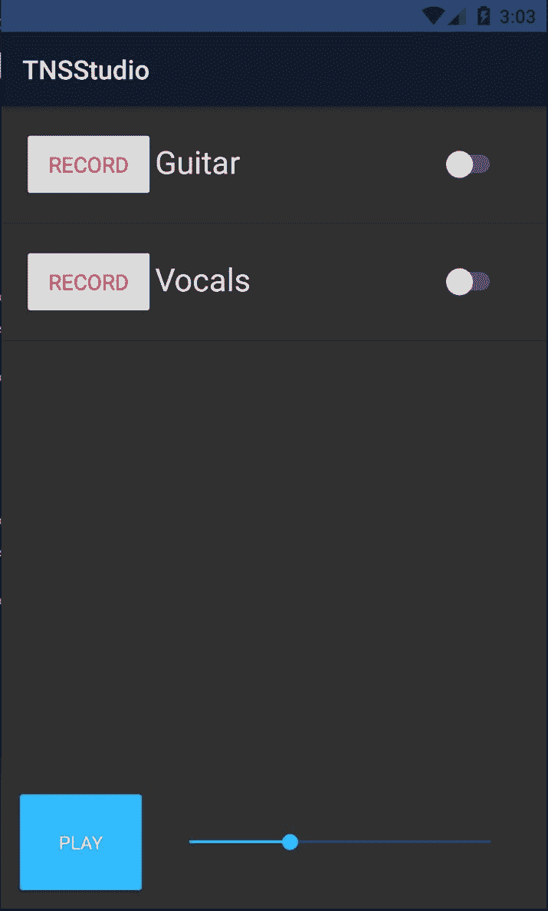

# 总结

最终为我们的应用程序添加外观是令人耳目一新和有趣的；然而，我们当然还没有完成样式设置。我们将继续通过 CSS 磨练视图，并很快引入 SASS 来在即将到来的章节中进一步完善它。然而，本章介绍了您在通过 CSS 设置应用程序时需要注意的各种考虑因素。

您已经了解到常见的 CSS 属性是受支持的，并且我们还看到了 iOS 和 Android 处理某些默认特性的差异。具有特定于平台的 CSS 覆盖的能力是一个很好的好处，也是您想要利用在跨平台 NativeScript 应用程序中的特殊能力。了解如何在两个平台上控制状态栏的外观是实现应用程序所需外观和感觉的关键。

在下一章中，我们将暂时停止样式设置，转而深入研究通过延迟加载进行路由和导航，为我们的应用程序的一般可用性流程做好准备。准备好深入了解我们应用程序中更有趣的 Angular 部分。
