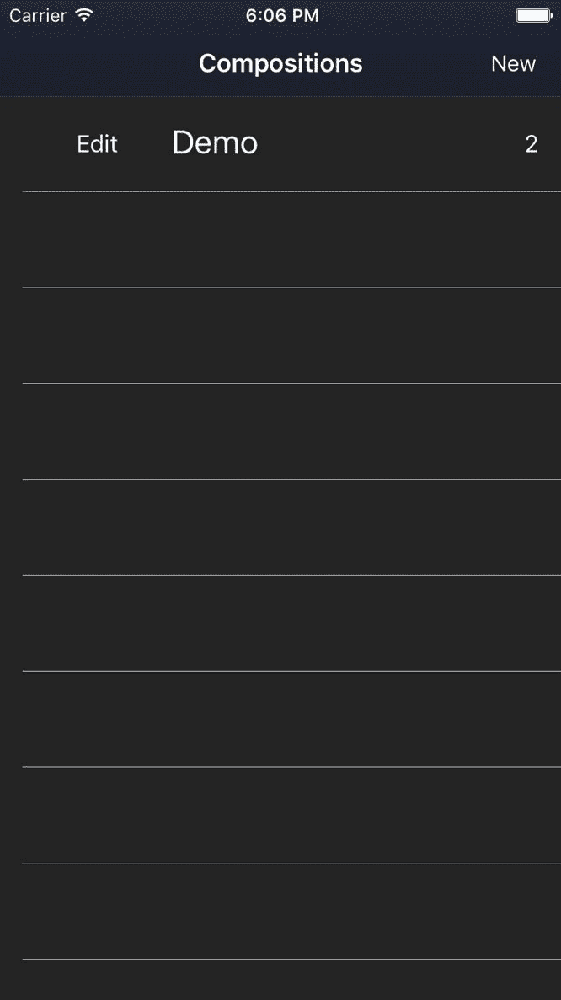
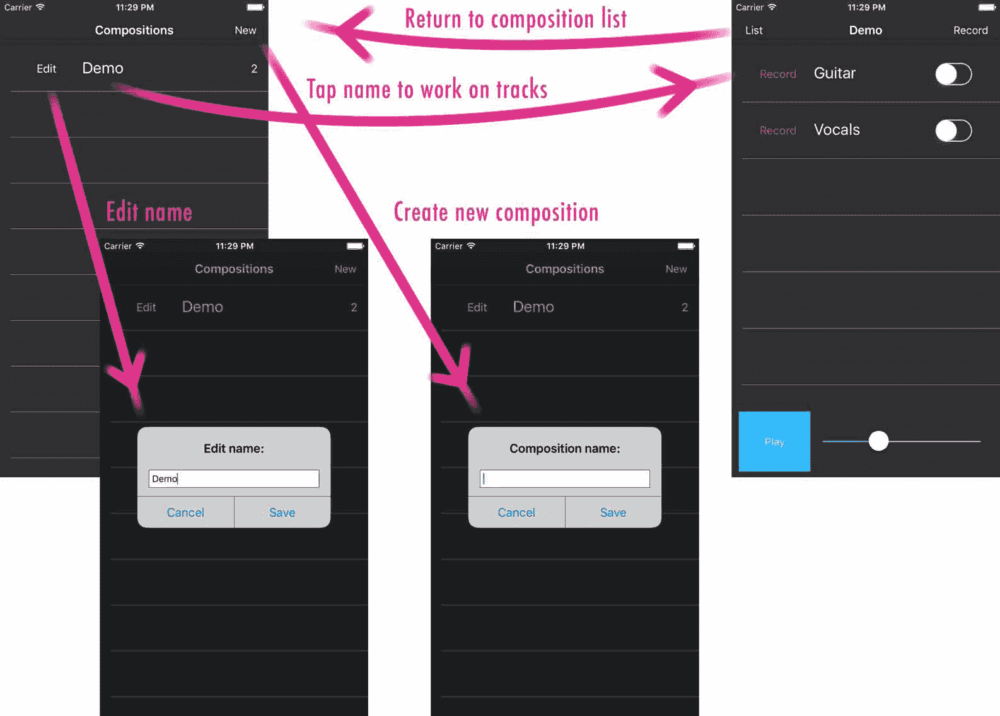
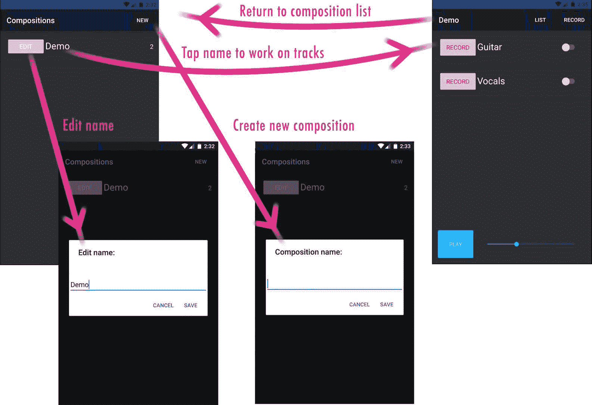
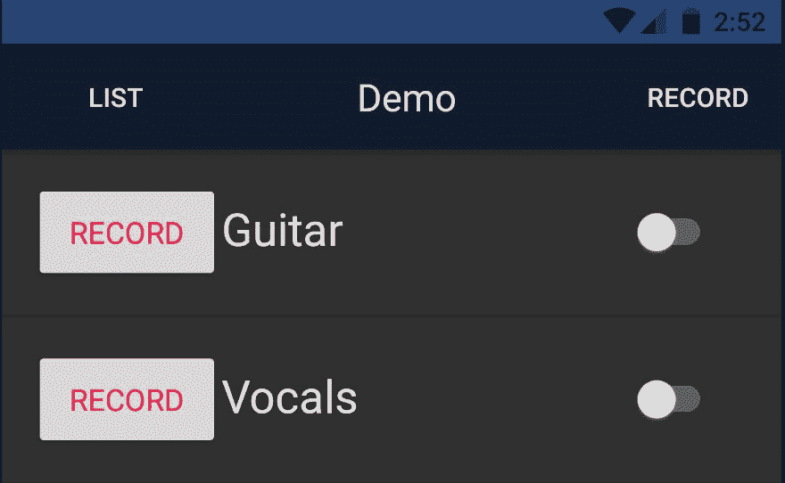

# 第五章：路由和懒加载

路由对于任何应用程序的稳定可用性流程至关重要。让我们了解移动应用程序的路由配置的关键要素，以充分利用 Angular 路由器给我们带来的所有灵活性。

在本章中，我们将涵盖以下主题：

+   配置 Angular 路由器与 NativeScript 应用程序

+   按路由懒加载模块

+   为 Angular 的`NgModuleFactoryLoader`提供`NSModuleFactoryLoader`

+   了解如何在`page-router-outlet`与`router-outlet`结合使用

+   学习如何在多个延迟加载模块之间共享单例服务

+   使用身份验证守卫保护需要有效身份验证的视图

+   了解如何使用`NavigationButton`自定义后退移动导航

+   通过引入后期功能需求来利用我们灵活的路由设置

# 在 66 号公路上踏上你的旅程

当我们开始沿着这条充满冒险的高速公路旅行时，让我们从在本地服务站停下来，确保我们的车辆状态良好。进入`app`的根目录，构建一个新的附加到我们车辆引擎的模块：路由模块。

创建一个新的路由模块`app/app.routing.ts`，内容如下：

```ts
import { NgModule } from '@angular/core';
import { NativeScriptRouterModule } 
  from 'nativescript-angular/router';
import { Routes } from '@angular/router';

const routes: Routes = [
  {
    path: '',
    redirectTo: '/mixer/home',
    pathMatch: 'full'
  },
  {
    path: 'mixer',
    loadChildren: () => require('./modules/mixer/mixer.module')['MixerModule']
  },
  {
    path: 'record',
    loadChildren: () => require('./modules/recorder/recorder.module')['RecorderModule']
  }
];

@NgModule({
  imports: [
    NativeScriptRouterModule.forRoot(routes)
  ],
  exports: [
    NativeScriptRouterModule
  ]
})
export class AppRoutingModule { }
```

将根路径`''`定义为重定向到一个延迟加载模块提供了非常灵活的路由配置，正如你将在本章中看到的那样。您将看到一个新模块`MixerModule`，我们马上就会创建。实际上，它将在很大程度上成为当前`AppComponent`的样子。以下是您使用类似于此路由配置时获得的一些优势列表：

+   通过急切加载仅有最少的根模块配置，然后懒加载第一个路由模块，使应用启动时间保持快速

+   为我们提供了利用`page-router-outlet`和`router-outlet`的能力，结合主/细节导航以及`clearHistory`交换页面导航

+   将路由配置责任隔离到相关模块，随着时间的推移，这种方式会更加灵活

+   如果我们决定更改用户最初呈现的初始页面，可以轻松地在将来针对不同的**起始页面**进行定位

这使用`NativeScriptRoutingModule.forRoot(routes)`，因为这应该被视为我们应用程序路由配置的根。

我们还导出 `NativeScriptRoutingModule`，因为我们将在稍后将这个 `AppRoutingModule` 导入到我们的根 `AppModule` 中。这使得路由指令可用于我们根模块的根组件。

# 为 NgModuleFactoryLoader 提供 NSModuleFactoryLoader

默认情况下，Angular 的内置模块加载器使用 SystemJS；然而，NativeScript 提供了一个增强的模块加载器称为 `NSModuleFactoryLoader`。让我们在主路由模块中提供这个，以确保所有我们的模块都是用它加载而不是 Angular 的默认模块加载器。

对 `app/app.routing.ts` 进行以下修改：

```ts
import { NgModule, NgModuleFactoryLoader } from '@angular/core';
import { NativeScriptRouterModule, NSModuleFactoryLoader } from 'nativescript-angular/router';

const routes: Routes = [
  {
    path: '',
    redirectTo: '/mixer/home',
    pathMatch: 'full'
  },
  {
    path: 'mixer',
    loadChildren: './modules/mixer/mixer.module#MixerModule'
  },
  {
    path: 'record',
    loadChildren: './modules/recorder/recorder.module#RecorderModule',
    canLoad: [AuthGuard]
  }
];

@NgModule({
  imports: [
    NativeScriptRouterModule.forRoot(routes)
  ],
  providers: [
    AuthGuard,
    {
 provide: NgModuleFactoryLoader,
 useClass: NSModuleFactoryLoader
 }
  ],
  exports: [
    NativeScriptRouterModule
  ]
})
export class AppRoutingModule { }
```

现在，我们可以使用标准的 Angular 懒加载语法通过 `loadChildren` 来指定默认的 `NgModuleFactoryLoader`，但应该使用 NativeScript 增强的 `NSModuleFactoryLoader`。我们不会详细介绍 `NSModuleFactoryLoader` 提供的内容，因为在这里已经很好地解释了：[`www.nativescript.org/blog/optimizing-app-loading-time-with-angular-2-lazy-loading`](https://www.nativescript.org/blog/optimizing-app-loading-time-with-angular-2-lazy-loading)，而且我们还有很多内容要在本书中介绍。

很好。有了这些升级，我们可以离开服务店，继续沿着高速公路前行。让我们继续实现我们的新路由设置。

打开 `app/app.component.html`；将其内容剪切到剪贴板，并用以下内容替换：

```ts
<page-router-outlet></page-router-outlet>
```

这将成为我们视图级实现的基础。 `page-router-outlet` 允许任何组件插入自己的位置，无论是单个平面路由还是具有自己子视图的路由。它还允许其他组件视图推送到移动导航栈，实现主/细节移动导航和后退历史记录。

为了使 `page-router-outlet` 指令工作，我们需要我们的根 `AppModule` 导入我们的新 `AppRoutingModule`。我们还将利用这个机会删除之前导入的 `PlayerModule`。打开 `app/app.module.ts` 并进行以下修改：

```ts
// angular
import { NgModule } from '@angular/core';

// app
import { CoreModule } from './modules/core/core.module';
import { AppRoutingModule } from './app.routing';
import { AppComponent } from './app.component';

@NgModule({
 imports: [
   CoreModule,
   AppRoutingModule
 ],
 declarations: [AppComponent],
 bootstrap: [AppComponent]
})
export class AppModule { }
```

# 创建 MixerModule

这个模块实际上不会有什么新东西，因为它将作为之前我们根组件视图的重新定位。然而，它将引入一个额外的好处：能够定义自己的内部路由。

创建 `app/modules/mixer/components/mixer.component.html`，并粘贴从 `app.component.html` 中剪切的内容：

```ts
<ActionBar title="TNSStudio" class="action-bar"></ActionBar><GridLayout rows="*, 100" columns="*" class="page">  
  <track-list row="0" col="0"></track-list>  
  <player-controls row="1" col="0"></player-controls></GridLayout>
```

然后创建一个匹配的 `app/modules/mixer/components/mixer.component.ts`：

```ts
import { Component } from '@angular/core';

@Component({ 
  moduleId: module.id, 
  selector: 'mixer', 
  templateUrl: 'mixer.component.html'
})
export class MixerComponent {}
```

现在，我们将创建`BaseComponent`，它将作为不仅是前面的`MixerComponent`，还有任何其他我们可能想要在其位置呈现的子视图组件的占位符。例如，我们的混音器可能希望允许用户将单个轨道从混音器中弹出并放入一个隔离的视图中以处理音频效果。

在`app/modules/mixer/components/base.component.ts`中创建以下内容：

```ts
// angular
import { Component } from '@angular/core';

@Component({
 moduleId: module.id,
 selector: 'mixer-base',
 template: `<router-outlet></router-outlet>`
})
export class BaseComponent { }
```

这提供了一个插槽，用于插入我们的混音器配置的任何子路由，其中之一是`MixerComponent`本身。由于视图只是一个简单的`router-outlet`，因此没有必要创建单独的`templateUrl`，所以我们在这里直接内联了它。

现在，我们准备实现`MixerModule`；创建`app/modules/mixer/mixer.module.ts`，其中包含以下内容：

```ts
import { NgModule, NO_ERRORS_SCHEMA } from '@angular/core';
import { NativeScriptRouterModule } from 
  'nativescript-angular/router';
import { Routes } from '@angular/router';

import { PlayerModule } from '../player/player.module';
import { BaseComponent } from './components/base.component';
import { MixerComponent } from 
  './components/mixer.component';

const COMPONENTS: any[] = [
  BaseComponent,
  MixerComponent
]

const routes: Routes = [
  {
    path: '',
    component: BaseComponent,
    children: [
      {
        path: 'home',
        component: MixerComponent
      }
    ]
  }
];

@NgModule({
  imports: [
    PlayerModule,
    NativeScriptRouterModule.forChild(routes)
  ],
  declarations: [
    ...COMPONENTS
  ],
  schemas: [
    NO_ERRORS_SCHEMA
  ]
})
export class MixerModule { }
```

我们已经导入了`PlayerModule`，因为混音器使用了在那里定义的组件/小部件（即`track-list`和`player-controls`）。我们还利用了`NativeScriptRouterModule.forChild(routes)`方法来指示这些特定的子路由。我们的路由配置在根路径`' '`处设置了 BaseComponent，将`'home'`定义为`MixerComponent`。如果您还记得，我们应用的`AppRoutingModule`配置了我们应用的根路径，如下所示：

```ts
...
{
  path: '',
  redirectTo: '/mixer/home',
  pathMatch: 'full'
},
...
```

这将直接路由到`MixerComponent`，在这里被定义为`'home'`。如果需要，我们可以通过将`redirectTo`指向混音器的不同子视图来轻松地将启动页面定向到不同的视图。由于`BaseComponent`只是一个`router-outlet`，在我们的混音器路由的根路径`' '`下定义的任何子级（由我们整个应用的路由视为`'/mixer'`）都将直接插入到该视图插槽中。如果您现在运行这个，您应该会看到我们之前的相同的启动页面。

恭喜！您的应用启动时间现在很快，您已经懒加载了第一个模块！

但是，有一些令人惊讶的事情需要注意：

+   您可能会注意到在启动页面出现之前会有一个快速的白色闪烁（至少在 iOS 上是这样）

+   您可能会注意到控制台日志打印了“当前用户：”两次

我们将分别解决这些问题。

1.  在启动页面显示之前去除闪屏。

这是正常的，是默认页面背景颜色白色的结果。为了提供无缝的启动体验，打开`app/common.css`文件，并将全局`Page`类定义放在这里，将背景颜色着色为与我们的`ActionBar`背景颜色相同：

```ts
Page {
  background-color:#101B2E;
}
```

现在，不会再出现白屏，应用程序的启动将显得无缝。

1.  控制台日志会打印两次“当前用户：”

Angular 的依赖注入器由于延迟加载而导致了这个问题。

这段代码来自`app/modules/core/services/auth.service.ts`，我们在这里有一个私有的`init`方法，它是从服务的构造函数中调用的。

```ts
...
@Injectable()
export class AuthService {
   ...
   constructor(
     private databaseService: DatabaseService,
     private logService: LogService
   ) {
     this._init();
   } 
  ...
  private _init() {
    AuthService.CURRENT_USER = this.databaseService.getItem(
      DatabaseService.KEYS.currentUser);
    this.logService.debug(`Current user: `,
 AuthService.CURRENT_USER);
    this._notifyState(!!AuthService.CURRENT_USER);
  }
  ...
}
```

等等！这是什么意思？这意味着`AuthService`被构造了两次吗？！

是的。它是的。:(

我能听到车轮的尖叫声，就在此刻，你把这次高速公路冒险转向了沟渠里。;)

这绝对是一个巨大的问题，因为我们绝对打算让`AuthService`成为一个可以在任何地方注入并共享以提供我们应用程序当前认证状态的全局共享单例。

现在我们必须解决这个问题，但在看一个可靠的解决方案之前，让我们先稍微偏离一下，了解一下为什么会发生这种情况。

# 了解 Angular 的依赖注入器在延迟加载模块时的行为

我们将直接从 Angular 官方文档(`https://angular.io/guide/ngmodule-faq#!#q-why-child-injector`)中引用，而不是重述细节，这完美地解释了这一点：

Angular 会将`@NgModule.providers`添加到应用程序根注入器，除非该模块是延迟加载的。对于延迟加载的模块，Angular 会创建一个子注入器，并将模块的提供者添加到子注入器中。

这意味着一个模块的行为会有所不同，取决于它是在应用程序启动期间加载还是在后来进行延迟加载。忽视这种差异可能会导致不良后果。

为什么 Angular 不像对急切加载模块那样将延迟加载的提供者添加到应用程序根注入器中呢？

答案根植于 Angular 依赖注入系统的一个基本特性。一个注入器可以添加提供者，直到它第一次被使用。一旦注入器开始创建和提供服务，它的提供者列表就被冻结了；不允许添加新的提供者。

当应用程序启动时，Angular 首先会将根注入器配置为所有急切加载模块的提供者，然后创建其第一个组件并注入任何提供的服务。一旦应用程序开始，应用程序根注入器就关闭了新的提供者。

时间过去了，应用逻辑触发了一个模块的延迟加载。Angular 必须将延迟加载模块的提供者添加到某个注入器中。它不能将它们添加到应用程序根注入器，因为该注入器对新提供者是关闭的。因此，Angular 为延迟加载模块上下文创建一个新的子注入器。

如果我们看一下我们的根`AppModule`，我们可以看到它导入了`CoreModule`，其中提供了`AuthService`：

```ts
...
@NgModule({
  imports: [
    CoreModule,
    AppRoutingModule
  ],
  declarations: [AppComponent],
  bootstrap: [AppComponent],
  schemas: [NO_ERRORS_SCHEMA]
})
export class AppModule { }
```

如果我们再看一下`PlayerModule`，我们可以看到它也导入了`CoreModule`，因为`PlayerModule`的组件使用了它声明的`OrderByPipe`以及它提供的一些服务（即`AuthService`，`LogService`和`DialogService`）：

```ts
...
@NgModule({
  imports: [
    CoreModule
  ],
  providers: [...PROVIDERS],
  declarations: [...COMPONENTS],
  exports: [...COMPONENTS],
  schemas: [ NO_ERRORS_SCHEMA ]
})
export class PlayerModule { }
```

由于我们新的路由配置，`PlayerModule`现在是延迟加载的，与`MixerModule`一起加载。这会导致 Angular 的依赖注入器为我们的延迟加载的`MixerModule`注册一个新的子注入器，其中包括`PlayerModule`，它还带来了它导入的`CoreModule`，其中定义了那些提供者，包括`AuthService`，`LogService`等等。当 Angular 注册`MixerModule`时，它将注册整个新模块中定义的所有提供者，包括它的导入模块与新的子注入器，从而产生这些服务的新实例。

Angular 的文档还提供了一个推荐的模块设置来解决这种情况，所以让我们再次从`https://angular.io/guide/ngmodule-faq#!#q-module-recommendations`进行改述：

SharedModule

创建一个`SharedModule`，其中包含你在应用程序中到处使用的组件、指令和管道。这个模块应该完全由声明组成，其中大部分是导出的。`SharedModule`可以重新导出其他小部件模块，比如`CommonModule`，`FormsModule`，以及你最广泛使用的 UI 控件模块。`SharedModule`不应该有提供者，原因在之前已经解释过。它导入或重新导出的模块也不应该有提供者。如果你偏离了这个指南，要知道你在做什么以及为什么。在你的特性模块中导入`SharedModule`，无论是在应用启动时加载的模块还是以后延迟加载的模块。

创建一个`CoreModule`，其中包含应用启动时加载的单例服务的提供者。只在根`AppModule`中导入`CoreModule`。永远不要在任何其他模块中导入`CoreModule`。

考虑将`CoreModule`作为一个纯服务模块，不包含任何声明。

好哇！这是一个很好的建议。特别值得注意的是最后一行：

考虑将 CoreModule 变成一个纯服务模块，没有声明。

所以，我们已经有了`CoreModule`，这是一个好消息，但我们希望将其变成一个*纯服务模块，没有声明*。我们还*只在根 AppModule 中导入 CoreModule。永远不要在任何其他模块中导入 CoreModule。*然后，我们可以创建一个新的`SharedModule`，只提供*……**在应用程序中到处使用的组件、指令和管道*。

让我们创建`app/modules/shared/shared.module.ts`，如下所示：

```ts
// nativescript
import { NativeScriptModule } from 'nativescript-angular/nativescript.module'; 

// angular
import { NgModule, NO_ERRORS_SCHEMA } from '@angular/core';

// app
import { PIPES } from './pipes';

@NgModule({
  imports: [
    NativeScriptModule
  ],
  declarations: [
    ...PIPES
  ],
  exports: [
    NativeScriptModule,
    ...PIPES
  ],
  schemas: [ NO_ERRORS_SCHEMA ]
})
export class SharedModule {}
```

对于`PIPES`，我们只是将 pipes 目录从`app/modules/core`移动到`app/modules/shared`文件夹中。现在，`SharedModule`是我们可以自由导入到需要任何管道或未来共享组件/指令的多个不同模块中的一个。它不会像这个建议所提到的那样定义任何服务提供者：

出于之前解释的原因，`SharedModule`不应该有提供者，也不应该有任何导入或重新导出的模块有提供者。

然后，我们可以调整`CoreModule`（位于`app/modules/core/core.module.ts`中）如下，使其成为一个纯服务模块，没有声明：

```ts
// nativescript
import { NativeScriptModule } from 'nativescript-angular/nativescript.module'; 
import { NativeScriptFormsModule } from 'nativescript-angular/forms'; 
import {NativeScriptHttpModule } from 'nativescript-angular/http';
// angular
import { NgModule, Optional, SkipSelf } from '@angular/core';

// app
import { PROVIDERS } from './services';

const MODULES: any[] = [
  NativeScriptModule,
  NativeScriptFormsModule,
  NativeScriptHttpModule
];

@NgModule({
  imports: [
    ...MODULES
  ],
  providers: [
    ...PROVIDERS
  ],
  exports: [
    ...MODULES
  ]
})
export class CoreModule {
  constructor (
    @Optional() @SkipSelf() parentModule: CoreModule) {
    if (parentModule) {
      throw new Error(
        'CoreModule is already loaded. Import it in the AppModule only');
    }
  }
}
```

这个模块现在只定义了提供者，包括`AuthService`、`DatabaseService`、`DialogService`和`LogService`，这些都是我们在书中之前创建的，并且我们希望确保它们是真正的单例，无论它们是在惰性加载的模块中使用还是不使用。

为什么我们使用`...PROVIDERS`扩展符号而不是直接分配集合？

出于可扩展性的原因。将来，如果我们需要添加额外的提供者或覆盖提供者，我们只需简单地在模块中添加到集合中即可。导入和导出也是一样。

我们还利用这个机会导入一些额外的模块，以确保它们也在整个应用程序中全局使用。`NativeScriptModule`、`NativeScriptFormsModule`和`NativeScriptHttpModule`都是重要的模块，可以在 Angular 的各种提供程序中覆盖某些 Web API，以增强我们的应用程序使用本机 API。例如，应用程序将使用本机 HTTP API 而不是`XMLHttpRequest`（这是一个 Web API），从而提高 iOS 和 Android 的网络性能。我们还确保将它们导出，这样我们的根模块就不再需要导入它们，而是只需导入`CoreModule`。

最后，我们定义了一个构造函数，以帮助我们在将来防止意外地将`CoreModule`导入到其他懒加载模块中。

我们还不知道`PlayerModule`提供的`PlayerService`是否会被`RecorderModule`所需，后者也将被懒加载。如果将来出现这种情况，我们还可以将`PlayerService`重构为`CoreModule`，以确保它是整个应用程序中共享的真正单例。现在，我们将它留在`PlayerModule`中。

现在让我们根据我们所做的工作做最后的调整，来收紧一切。

`app/modules/player/player.module.ts`文件现在应该是这样的：

```ts
// angular
import { NgModule, NO_ERRORS_SCHEMA } from '@angular/core';

// app
import { SharedModule } from '../shared/shared.module';
import { COMPONENTS } from './components';
import { PROVIDERS } from './services';

@NgModule({
  imports: [ SharedModule ],
  providers: [ ...PROVIDERS ],
  declarations: [ ...COMPONENTS ],
  exports: [
    SharedModule,
    ...COMPONENTS
  ],
  schemas: [ NO_ERRORS_SCHEMA ]
})
export class PlayerModule { }
```

`app/modules/recorder/recorder.module.ts`文件现在应该是这样的：

```ts
// angular
import { NgModule, NO_ERRORS_SCHEMA } from '@angular/core';

// app
import { SharedModule } from '../shared/shared.module';
import { PROVIDERS } from './services';

@NgModule({
 imports: [ SharedModule ],
 providers: [ ...PROVIDERS ],
 schemas: [ NO_ERRORS_SCHEMA ]
})
export class RecorderModule { }
```

请注意，我们现在导入`SharedModule`而不是`CoreModule`。这使我们能够通过导入`SharedModule`在整个应用程序中共享指令、组件和管道（基本上是模块声明部分中的任何内容）。

我们的根`AppModule`在`app/app.module.ts`中保持不变：

```ts
// angular
import { NgModule } from '@angular/core';

// app
import { CoreModule } from './modules/core/core.module';
import { AppRoutingModule } from './app.routing';
import { AppComponent } from './app.component';

@NgModule({
  imports: [
    CoreModule,
    AppRoutingModule
  ],
  declarations: [ AppComponent ],
  bootstrap: [ AppComponent ]
})
export class AppModule { }
```

任何模块（懒加载或非懒加载）仍然可以注入`CoreModule`提供的任何服务，因为根`AppModule`现在导入了`CoreModule`。这允许 Angular 的根注入器仅构建一次由`CoreModule`提供的服务。然后，每当这些服务被注入到任何地方（*无论是在懒加载模块还是非懒加载模块中*），Angular 都会首先询问父注入器（在懒加载模块的情况下，它将是子注入器）是否有该服务，如果在那里找不到，它将询问下一个父注入器，一直到根注入器，最终找到这些单例提供的地方。

嗯，我们在这个沙漠小镇度过了美好的时光。让我们沿着高速公路前往超安全的 51 区，那里的模块可以被锁定多年，除非提供适当的授权。

# 为 RecorderModule 创建 AuthGuard

我们应用的一个要求是，录制功能应该被锁定并且在用户认证之前无法访问。这为我们提供了有用户基础的能力，并且如果需要的话，未来可能引入付费功能。

Angular 提供了在我们的路由上插入守卫的能力，这些守卫只会在特定条件下激活。这正是我们需要实现这个功能要求的，因为我们已经将`'/record'`路由隔离为懒加载`RecorderModule`，其中包含所有的录制功能。我们只希望在用户认证时才允许访问`'/record'`路由。

让我们在一个新的文件夹中创建`app/guards/auth-guard.service.ts`，以便扩展性，因为我们可能会增长并在这里创建其他守卫。

```ts
import { Injectable } from '@angular/core';
import { Route, CanActivate, CanLoad } from '@angular/router';
import { AuthService } from '../modules/core/services/auth.service';

@Injectable()
export class AuthGuard implements CanActivate, CanLoad {

  constructor(private authService: AuthService) { }

  canActivate(): Promise<boolean> {
    return new Promise((resolve, reject) => {
      if (this._isAuth()) {
        resolve(true);
      } else {
        // login sequence to continue prompting
        let promptSequence = (usernameAttempt?: string) => {
          this.authService.promptLogin(
            'Authenticate to record.',
            usernameAttempt
          ).then(() => {
            resolve(true); 
          }, (usernameAttempt) => {
            if (usernameAttempt === false) {
              // user canceled prompt
              resolve(false);
            } else {
              // initiate sequence again
              promptSequence(usernameAttempt);
            }
          });
        };
        // start login prompt sequence
        // require auth before activating
        promptSequence();
      }
    });
  }

  canLoad(route: Route): Promise<boolean> {
    // reuse same logic to activate
    return this.canActivate();
  }

  private _isAuth(): boolean {
    // just get the latest value from our BehaviorSubject
    return this.authService.authenticated$.getValue();
  }
}
```

我们能够利用`AuthService`的`BehaviorSubject`来使用`this.authService.authenticated$.getValue()`来获取最新的值，以确定认证状态。我们使用这个值来立即通过`canActivate`钩子激活路由（或者通过`canLoad`钩子加载模块）如果用户已经认证。否则，我们通过服务的方法显示登录提示，但这次我们将其包装在重新提示序列中，直到成功认证或者用户取消提示为止。

对于这本书，我们不会连接到任何后端服务来进行真正的服务提供商认证。我们会把这部分留给你在你自己的应用中完成。我们只会将你在登录提示中输入的电子邮件和密码持久化为有效用户，经过非常简单的输入验证。

请注意，`AuthGuard`是一个可注入的服务，就像其他服务一样，所以我们需要确保它被添加到`AppRoutingModule`的提供者元数据中。现在我们可以使用以下突出显示的修改来保护我们的路由，以在`app/app.routing.ts`中使用它：

```ts
...
import { AuthGuard } from './guards/auth-guard.service';

const routes: Routes = [
  ...
  {
    path: 'record',
    loadChildren: 
      './modules/recorder/recorder.module#RecorderModule',
    canLoad: [AuthGuard]
  }
];

@NgModule({
  ...
  providers: [
    AuthGuard,
    ...
  ],
  ...
})
export class AppRoutingModule { }
```

为了尝试这个功能，我们需要为我们的`RecorderModule`添加子路由，因为我们还没有这样做。打开`app/modules/recorder/recorder.module.ts`并添加以下突出显示的部分：

```ts
// nativescript
import { NativeScriptModule } from 'nativescript-angular/nativescript.module';
import { NativeScriptRouterModule } from 'nativescript-angular/router';

// angular
import { NgModule, NO_ERRORS_SCHEMA } from '@angular/core';
import { Routes } from '@angular/router';

// app
import { SharedModule } from '../shared/shared.module';
import { PROVIDERS } from './services';
import { RecordComponent } from './components/record.component';

const COMPONENTS: any[] = [
 RecordComponent
]

const routes: Routes = [
 {
 path: '',
 component: RecordComponent
 }
];

@NgModule({
  imports: [
    SharedModule,
    NativeScriptRouterModule.forChild(routes)
  ],
  declarations: [ ...COMPONENTS ],
  providers: [ ...PROVIDERS ],
  schemas: [ NO_ERRORS_SCHEMA ]
})
export class RecorderModule { }
```

现在我们有了一个合适的子路由配置，当用户导航到`'/record'`路径时，将显示单个`RecordComponent`。我们不会展示`RecordComponent`的细节，因为你可以参考书籍仓库中的第五章，*路由和懒加载*分支。然而，目前在`app/modules/recorder/components/record.component.html`中，它只是一个存根组件，只显示一个简单的标签，所以我们可以试一下。

最后，我们需要一个按钮，可以路由到我们的`'/record'`路径。如果我们回顾一下我们最初的草图，我们想要一个 Record 按钮显示在`ActionBar`的右上角，所以现在让我们实现它。

打开`app/modules/mixer/components/mixer.component.html`并添加以下内容：

```ts
<ActionBar title="TNSStudio" class="action-bar">
  <ActionItem nsRouterLink="/record" ios.position="right">
 <Button text="Record" class="action-item"></Button>
 </ActionItem>
</ActionBar>
<GridLayout rows="*, 100" columns="*" class="page">
  <track-list row="0" col="0"></track-list>
  <player-controls row="1" col="0"></player-controls>
</GridLayout>
```

现在，如果我们在 iOS 模拟器中运行这个程序，我们会注意到我们在`ActionBar`中的 Record 按钮没有任何作用！这是因为`MixerModule`只导入了以下内容：

```ts
@NgModule({
  imports: [
    PlayerModule,
    NativeScriptRouterModule.forChild(routes)
  ],
  ...
})
export class MixerModule { }
```

`NativeScriptRouterModule.forChild(routes)`方法只是配置路由，但不会使各种路由指令，如`nsRouterLink`，可用于我们的组件。

既然你之前学到了`SharedModule`应该用来声明你想要在你的模块中共享的各种指令、组件和管道（无论是懒加载还是不懒加载），这是一个很好的机会来利用它。

打开`app/modules/shared/shared.module.ts`并进行以下突出显示的修改：

```ts
...
import { NativeScriptRouterModule } from 'nativescript-angular/router'; 
...

@NgModule({
  imports: [
    NativeScriptModule, 
    NativeScriptRouterModule
  ],
  declarations: [
    ...PIPES
  ],
  exports: [
    NativeScriptModule,
    NativeScriptRouterModule,
    ...PIPES
  ],
  schemas: [NO_ERRORS_SCHEMA]
})
export class SharedModule { }
```

现在，回到`MixerModule`，我们可以调整导入以使用`SharedModule`：

```ts
...
import { SharedModule } from '../shared/shared.module'; 
@NgModule({
  imports: [
    PlayerModule,
    SharedModule,
    NativeScriptRouterModule.forChild(routes)
  ],
  ...
})
export class MixerModule { }
```

这确保了通过利用我们应用程序范围的`SharedModule`，`MixerModule`中现在包含并可用于使用的`NativeScriptRouterModule`暴露的所有指令。

再次运行我们的应用程序，现在当我们点击`ActionBar`中的 Record 按钮时，我们会看到登录提示。如果我们输入一个格式正确的电子邮件地址和任何密码，它将保留这些详细信息，登录我们，并在 iOS 上显示`RecordComponent`如下：


您可能会注意到一些非常有趣的事情。`ActionBar`从我们通过 CSS 分配的背景颜色和按钮颜色现在显示默认的蓝色。这是因为`RecordComponent`没有定义`ActionBar`；因此，它会恢复到一个具有默认返回按钮的默认样式的`ActionBar`，该按钮将采用刚刚导航离开的页面的标题。'/record'路由还使用了`page-router-outlet`的能力将组件推送到移动导航栈上。`RecordComponent`被动画化显示，同时允许用户选择左上角按钮进行导航返回（将导航历史后退一步）。

要修复`ActionBar`，让我们在`RecordComponent`视图中添加`ActionBar`和自定义的`NavigationButton`（一个模拟移动设备默认返回导航按钮的`NativeScript`视图组件）。我们可以对`app/modules/record/components/record.component.html`进行调整：

```ts
<ActionBar title="Record" class="action-bar">
  <NavigationButton text="Back"
    android.systemIcon="ic_menu_back">
  </NavigationButton>
</ActionBar>
<StackLayout class="p-20">
  <Label text="TODO: Record" class="h1 text-center"></Label>
</StackLayout>
```

现在，这看起来好多了。


如果我们在 Android 上运行这个，并使用任何电子邮件/密码组合登录以保持用户登录，它将显示相同的`RecordComponent`视图；然而，您会注意到另一个有趣的细节。我们已经设置 Android 显示一个标准的返回箭头系统图标作为`NavigationButton`，但是当点击该箭头时，它不会做任何事情。Android 的默认行为依赖于设备旁边的物理硬件返回按钮，靠近主页按钮。然而，我们可以通过向`NavigationButton`添加一个点击事件来提供一致的体验，这样 iOS 和 Android 都会对点击返回按钮做出相同的反应。对模板进行以下修改：

```ts
<ActionBar title="Record" icon="" class="action-bar">
  <NavigationButton (tap)="back()" text="Back" 
    android.systemIcon="ic_menu_back">
  </NavigationButton>
</ActionBar>
<StackLayout class="p-20">
  <Label text="TODO: Record" class="h1 text-center"></Label>
</StackLayout>
```

然后，我们可以使用 Angular 的`RouterExtensions`服务在`app/modules/recorder/components/record.component.ts`中实现`back()`方法。

```ts
// angular
import { Component } from '@angular/core';
import { RouterExtensions } from 'nativescript-angular/router';

@Component({
 moduleId: module.id,
 selector: 'record',
 templateUrl: 'record.component.html'
})
export class RecordComponent { 

  constructor(private router: RouterExtensions) { }

  public back() {
    this.router.back();
  }
}
```

现在，除了硬件返回按钮之外，Android 的返回按钮也可以被点击以进行导航。iOS 简单地忽略了点击事件处理程序，因为它使用了`NavigationButton`的默认本机行为。相当不错。以下是`RecordComponent`在 Android 上的外观：


我们将在接下来的章节中实现一个不错的录音视图。

现在，我们肯定是在 66 号公路上巡航！

我们已经实现了延迟加载路由，提供了`AuthGuard`来保护我们应用的录音功能不被未经授权的使用，并在这个过程中学到了很多。*然而，我们刚意识到在游戏的最后阶段我们缺少了一个非常重要的功能*。我们需要一种方法来随着时间的推移处理几种不同的混音。默认情况下，我们的应用可能会启动最后打开的混音，但我们希望创建新的混音（让我们称之为**作品**）并将单独的音轨的全新混音记录为独立的作品。我们需要一个新的路由来显示这些作品，我们可以适当地命名，这样我们就可以来回跳转并处理不同的素材。

# 处理晚期功能需求 - 管理作品

现在是时候处理 66 号公路上的意外交通了。我们遇到了一个晚期的功能需求，意识到我们需要一种管理任意数量不同混音的方法，这样我们就可以随着时间的推移处理不同的素材。我们可以将每个混音称为音轨的作品。

好消息是，我们已经花了相当多的时间来设计一个可扩展的架构，我们即将收获我们的劳动成果。现在对晚期功能需求的回应变得像在附近愉快地散步一样。让我们通过花点时间来处理这个新功能，展示我们应用架构的优势。

让我们首先为我们将创建的新`MixListComponent`定义一个新的路由。打开`app/modules/mixer/mixer.module.ts`并进行以下突出显示的修改：

```ts
...
import { MixListComponent } from './components/mix-list.component';
import { PROVIDERS } from './services';

const COMPONENTS: any[] = [
  BaseComponent,
  MixerComponent,
  MixListComponent
]

const routes: Routes = [
  {
    path: '',
    component: BaseComponent,
    children: [
      {
 path: 'home',
 component: MixListComponent
 },
 {
 path: ':id',
 component: MixerComponent
 }
    ]
  }
];

@NgModule({
   ...
   providers: [
 ...PROVIDERS
 ]
})
export class MixerModule { }
```

我们正在改变最初的策略，不再将`MixerComponent`作为主页起始页面呈现，而是将在稍后创建一个新的`MixListComponent`来代表`'home'`起始页面，这将是我们正在处理的所有作品的列表。我们仍然可以让`MixListComponent`在应用启动时自动选择最后选择的作品，以方便以后使用。我们现在已经将`MixerComponent`定义为带参数的路由，因为它将始终代表我们的一个工作作品，由`':id'`参数路由标识，这将解析为类似`'/mixer/1'`的路由。我们还导入了我们将在稍后创建的`PROVIDERS`。

让我们修改`CoreModule`提供的`DatabaseService`，以帮助为我们的新数据需求提供一个恒定的持久化键。我们将希望通过这个恒定的键名持久保存用户创建的作品。打开`app/modules/core/services/database.service.ts`并进行以下高亮修改：

```ts
...
interface IKeys {
  currentUser: string;
  compositions: string;
}

@Injectable()
export class DatabaseService {

  public static KEYS: IKeys = {
    currentUser: 'current-user',
    compositions: 'compositions'
  };
...
```

让我们还创建一个新的数据模型来表示我们的作品。创建`app/modules/shared/models/composition.model.ts`：

```ts
import { ITrack } from './track.model';

export interface IComposition {
  id: number;
  name: string;
  created: number;
  tracks: Array<ITrack>;
  order: number;
}
export class CompositionModel implements IComposition {
  public id: number;
  public name: string;
  public created: number;
  public tracks: Array<ITrack> = [];
  public order: number;

  constructor(model?: any) {
    if (model) {
      for (let key in model) {
        this[key] = model[key];
      }
    }
    if (!this.created) this.created = Date.now();
    // if not assigned, just assign a random id
    if (!this.id)
      this.id = Math.floor(Math.random() * 100000);
  }
}
```

然后，坚持我们的惯例，打开`app/modules/shared/models/index.ts`并重新导出这个新模型：

```ts
export * from './composition.model';
export * from './track.model';
```

现在我们可以在一个新的数据服务中使用这个新模型和数据库键来构建这个新功能。创建`app/modules/mixer/services/mixer.service.ts`：

```ts
// angular
import { Injectable } from '@angular/core';

// app
import { ITrack, IComposition, CompositionModel } from '../../shared/models';
import { DatabaseService } from '../../core/services/database.service';
import { DialogService } from '../../core/services/dialog.service';

@Injectable()
export class MixerService {

  public list: Array<IComposition>;

  constructor(
    private databaseService: DatabaseService,
    private dialogService: DialogService
  ) {
    // restore with saved compositions or demo list
    this.list = this._savedCompositions() || 
      this._demoComposition();
  } 

  public add() {
    this.dialogService.prompt('Composition name:')
      .then((value) => {
        if (value.result) {
          let composition = new CompositionModel({
            id: this.list.length + 1,
            name: value.text,
            order: this.list.length // next one in line
          });
          this.list.push(composition);
          // persist changes
          this._saveList();
        }
      });
  }

  public edit(composition: IComposition) {
    this.dialogService.prompt('Edit name:', composition.name)
      .then((value) => {
        if (value.result) {
          for (let comp of this.list) {
            if (comp.id === composition.id) {
              comp.name = value.text;
              break;
            }
          }
          // re-assignment triggers view binding change
          // only needed with default change detection
          // when object prop changes in collection
          // NOTE: we will use Observables in ngrx chapter
          this.list = [...this.list];
          // persist changes
          this._saveList();
        }
      });
  }

  private _savedCompositions(): any {
    return this.databaseService
      .getItem(DatabaseService.KEYS.compositions);
  }

  private _saveList() {
    this.databaseService
      .setItem(DatabaseService.KEYS.compositions, this.list);
  }

  private _demoComposition(): Array<IComposition> {
    // Starter composition to demo on first launch
    return [
      {
        id: 1,
        name: 'Demo',
        created: Date.now(),
        order: 0,
        tracks: [
          {
            id: 1,
            name: 'Guitar',
            order: 0
          },
          {
            id: 2,
            name: 'Vocals',
            order: 1
          }
        ]
      }
    ]
  }
}
```

现在我们有了一个服务，它将提供一个列表来绑定我们的视图，以显示用户保存的作品。它还提供了一种添加和编辑作品以及在第一次应用启动时为良好的首次用户体验播种演示作品的方法（*我们稍后会为演示添加实际的曲目*）。

按照我们的惯例，让我们也添加`app/modules/mixer/services/index.ts`，如下所示，我们刚才在`MixerModule`中导入过：

```ts
import { MixerService } from './mixer.service';

export const PROVIDERS: any[] = [
  MixerService
];

export * from './mixer.service';
```

现在让我们创建`app/modules/mixer/components/mix-list.component.ts`来使用和投影我们的新数据服务：

```ts
// angular
import { Component } from '@angular/core';

// app
import { MixerService } from '../services/mixer.service';

@Component({
  moduleId: module.id,
  selector: 'mix-list',
  templateUrl: 'mix-list.component.html'
})
export class MixListComponent {

  constructor(public mixerService: MixerService) { } 
}
```

对于视图模板，`app/modules/mixer/components/mix-list.component.html`：

```ts
<ActionBar title="Compositions" class="action-bar">
  <ActionItem (tap)="mixerService.add()" 
    ios.position="right">
    <Button text="New" class="action-item"></Button>
  </ActionItem>
</ActionBar>
<ListView [items]="mixerService.list | orderBy: 'order'" 
  class="list-group">
  <ng-template let-composition="item">
    <GridLayout rows="auto" columns="100,*,auto" 
      class="list-group-item">
      <Button text="Edit" row="0" col="0" 
        (tap)="mixerService.edit(composition)"></Button>
      <Label [text]="composition.name"
        [nsRouterLink]="['/mixer', composition.id]"
        class="h2" row="0" col="1"></Label>
      <Label [text]="composition.tracks.length" 
        class="text-right" row="0" col="2"></Label>
    </GridLayout>
  </ng-template>
</ListView>
```

这将把我们的`MixerService`用户保存的作品列表呈现到视图中，并且当我们首次启动应用时，它将被预先加载一个样本**演示**作品，其中包含两个录音，以便用户可以玩耍。现在 iOS 首次启动的情况如下：



我们可以创建新的作品并编辑现有作品的名称。我们还可以点击作品的名称来查看`MixerComponent`；然而，我们需要调整组件来抓取路由`':id'`参数并将其视图连接到所选的作品。打开`app/modules/mixer/components/mixer.component.ts`并添加高亮部分：

```ts
// angular
import { Component, OnInit, OnDestroy } from '@angular/core';
import { ActivatedRoute } from '@angular/router';
import { Subscription } from 'rxjs/Subscription';

// app
import { MixerService } from '../services/mixer.service';
import { CompositionModel } from '../../shared/models';

@Component({
 moduleId: module.id,
 selector: 'mixer',
 templateUrl: 'mixer.component.html'
})
export class MixerComponent implements OnInit, OnDestroy {

  public composition: CompositionModel; 
 private _sub: Subscription;

 constructor(
 private route: ActivatedRoute,
 private mixerService: MixerService
 ) { } 

 ngOnInit() {
 this._sub = this.route.params.subscribe(params => {
 for (let comp of this.mixerService.list) {
 if (comp.id === +params['id']) {
 this.composition = comp;
 break;
 }
 }
 });
 } 

 ngOnDestroy() {
 this._sub.unsubscribe();
 }
}
```

我们可以注入 Angular 的 `ActivatedRoute` 来订阅路由的参数，这样我们就可以访问 `id`。因为它默认会以字符串形式传入，所以我们使用 `+params['id']` 将其转换为数字，以便在服务列表中定位到该组合。我们为选定的 `composition` 分配一个本地引用，这样我们就可以在视图中绑定它。与此同时，我们还将在 `ActionBar` 中添加一个名为 `List` 的按钮，用于返回到我们的组合（*稍后，我们将实现字体图标来显示在它们的位置*）。打开 `app/modules/mixer/components/mixer.component.html` 并进行以下突出显示的修改：

```ts
<ActionBar [title]="composition.name" class="action-bar">
  <ActionItem nsRouterLink="/mixer/home">
 <Button text="List" class="action-item"></Button>
 </ActionItem>
  <ActionItem nsRouterLink="/record" ios.position="right">
    <Button text="Record" class="action-item"></Button>
  </ActionItem>
</ActionBar>
<GridLayout rows="*, 100" columns="*" class="page">
  <track-list [tracks]="composition.tracks" row="0" col="0"></track-list>
  <player-controls row="1" col="0"></player-controls>
</GridLayout>
```

这样我们就可以在 `ActionBar` 的标题中显示所选组合的名称，并将其轨道传递给 `track-list`。我们需要向 `track-list` 添加 `Input`，以便它呈现组合的轨道，而不是它现在绑定的虚拟数据。让我们打开 `app/modules/player/components/track-list/track-list.component.ts` 并添加一个 `Input`：

```ts
...
export class TrackListComponent {

 @Input() tracks: Array<ITrack>;

 ...
}
```

以前，`TrackListComponent` 视图绑定到了 `playerService.tracks`，所以让我们调整组件的视图模板，使其绑定到我们的新 `Input`，这将代表用户实际选择的组合中的轨道**：**

```ts
<ListView [items]="tracks | orderBy: 'order'" class="list-group">
  <template let-track="item">
    <GridLayout rows="auto" columns="100,*,100" class="list-group-item">
      <Button text="Record" (tap)="record(track)" row="0" col="0" class="c-ruby"></Button>
      <Label [text]="track.name" row="0" col="1" class="h2"></Label>
      <Switch [checked]="track.solo" row="0" col="2" class="switch"></Switch>
    </GridLayout>
  </template>
</ListView>
```

现在我们的应用程序中有以下顺序来满足这个晚期功能需求，我们只需在这里的几页材料中就完成了：



它在 Android 上的工作方式完全相同，同时保留其独特的本机特性。



然而，您可能会注意到，Android 上的 `ActionBar` 默认为所有 `ActionItem` 都在右侧。我们想要向您展示的最后一个技巧是平台特定的视图模板的能力。哦，不要担心那些丑陋的 Android 按钮；我们稍后会为它们集成字体图标。

在您认为合适的地方创建平台特定的视图模板。这样做将帮助您为每个平台调整视图，必要时使其高度可维护。

让我们创建 `app/modules/mixer/components/action-bar/action-bar.component.ts`：

```ts
// angular
import { Component, Input } from '@angular/core';

@Component({
  moduleId: module.id,
  selector: 'action-bar',
  templateUrl: 'action-bar.component.html'
})
export class ActionBarComponent {

  @Input() title: string;
}
```

然后您可以创建一个特定于 iOS 的视图模板：`app/modules/mixer/components/action-bar/action-bar.component.ios.html`：

```ts
<ActionBar [title]="title" class="action-bar">
  <ActionItem nsRouterLink="/mixer/home">
    <Button text="List" class="action-item"></Button>
  </ActionItem>
  <ActionItem nsRouterLink="/record" ios.position="right">
    <Button text="Record" class="action-item"></Button>
  </ActionItem>
</ActionBar>
```

以及一个特定于 Android 的视图模板：`app/modules/mixer/components/action-bar/action-bar.component.android.html`：

```ts
<ActionBar class="action-bar">
  <GridLayout rows="auto" columns="auto,*,auto" class="action-bar">
    <Button text="List" nsRouterLink="/mixer/home" class="action-item" row="0" col="0"></Button>
    <Label [text]="title" class="action-bar-title text-center" row="0" col="1"></Label>
    <Button text="Record" nsRouterLink="/record" class="action-item" row="0" col="2"></Button>
  </GridLayout>
</ActionBar>
```

然后我们可以在 `app/modules/mixer/components/mixer.component.html` 中使用它：

```ts
<action-bar [title]="composition.name"></action-bar>
<GridLayout rows="*, 100" columns="*" class="page">
  <track-list [tracks]="composition.tracks" row="0" col="0"></track-list>
  <player-controls row="1" col="0"></player-controls>
</GridLayout>
```

只需确保将其添加到`app/modules/mixer/mixer.module.ts`中的`MixerModule`的`COMPONENTS`中：

```ts
...
import { ActionBarComponent } from './components/action-bar/action-bar.component';
...

const COMPONENTS: any[] = [
  ActionBarComponent,
  BaseComponent,
  MixerComponent,
  MixListComponent
];
...
```

看这里！



# 摘要

我们已经到达了 66 号公路的终点，希望您和我们一样感到兴奋。本章介绍了一些有趣的 Angular 概念，包括使用惰性加载模块进行路由配置，以保持应用程序启动时间快；使用本机文件处理 API 构建自定义模块加载器；将`router-outlet`的灵活性与 NativeScript 的`page-router-outlet`相结合；掌握并理解惰性加载模块的单例服务；保护依赖授权访问的路由；以及处理晚期功能需求，展示我们出色可扩展的应用程序设计。

本章将总结我们应用程序的一般可用性流程，此时，我们已经准备好进入我们应用程序的核心竞争力：**通过 iOS 和 Android 丰富的本机 API 处理音频**。

在深入讨论之前，在下一章中，我们将花一点时间来检查 NativeScript 的各种`tns`命令行参数，以运行我们的应用程序，以便全面了解我们现在可以使用的工具。
