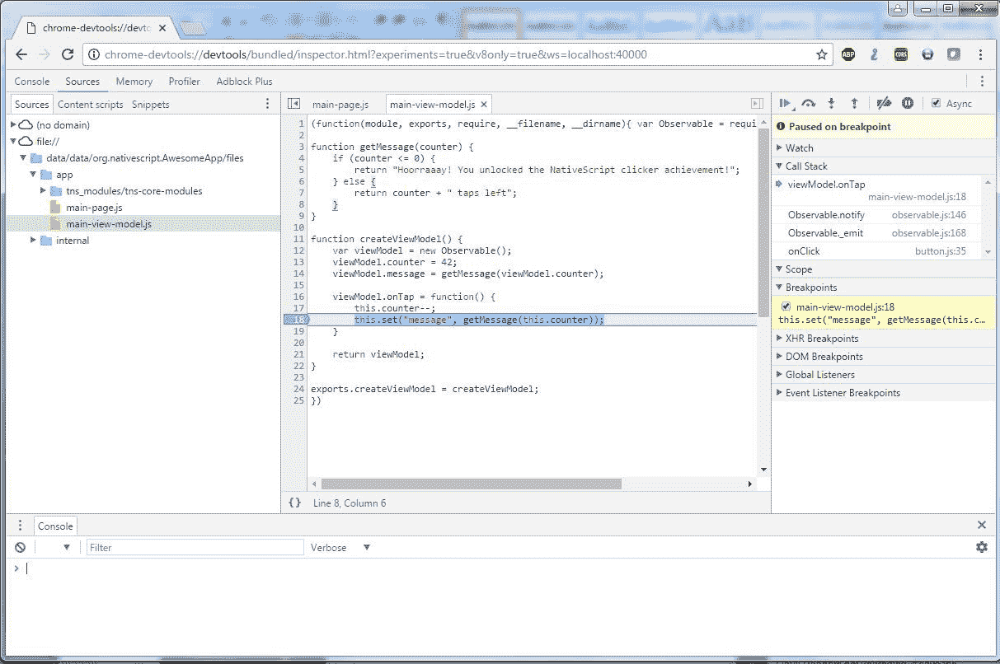
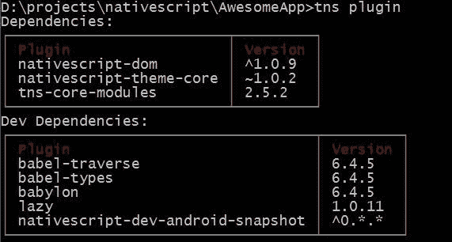
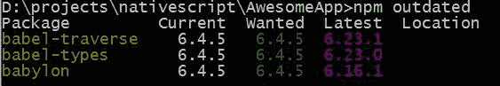
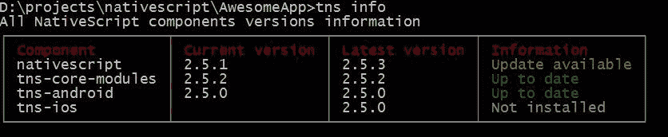
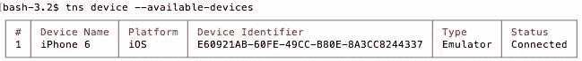

# 第六章：在 iOS 和 Android 上运行应用程序

有几种构建、运行和开始使用 NativeScript 应用程序的方法。我们将介绍命令行工具，因为它们目前是最受支持的方法，也是处理任何 NativeScript 项目的最佳方式。

为了简化我们的理解，我们将首先介绍我们经常使用的命令，然后再介绍不太经常使用的命令。所以，让我们开始并逐步介绍你需要了解的命令。

在本章中，我们将介绍以下主题：

+   如何运行一个应用程序

+   如何启动调试器

+   如何构建一个部署应用程序

+   如何启动测试框架

+   如何运行 NativeScript 诊断

+   关于 Android 密钥库的一切

# 接受命令...

我们将首先介绍的命令是您每次使用时都会用到的命令

启动您的应用程序。为了简化事情，我将使用`<platform>`来表示 iOS、Android，或者--当它最终得到支持时--Windows。

# tns run <platform>

`tns run <platform>`命令将自动构建您的应用程序并将其同步到设备和模拟器上。它将尽力使您的应用程序在设备上处于运行状态，然后启动应用程序。这个命令多年来发生了变化，现在已经成为一个相当智能的命令，它将自动做出某些选择，以简化您的开发生活。这个命令的一个很酷的功能是它将您的应用程序同步到所有正在运行和连接的设备上。如果您连接了五个不同的设备，所有这五个设备都将接收到更改。这只对每个平台有效，但您可以在一个命令窗口中运行`tns run ios`，在另一个命令窗口中运行`tns run android`，然后任何更改都将自动同步到连接到您的计算机的所有设备。您可以想象，这在测试和清理阶段非常有用，以确保一切在不同的手机和平板电脑上看起来都很好。如果您的计算机没有连接任何物理设备，它将自动为您启动模拟器。

通常情况下，由于应用程序已经存在于设备上，它只会快速地同步更改的文件。这是一个非常快速的过程，因为它只是将您的文件夹中的所有更改从您自己的`app`文件夹传输到所有连接的设备，然后启动应用程序。在大多数情况下，这个过程是非常好的。然而，`tns run <platform>`不会总是自动检测到`node_modules`文件夹的任何更改，例如当您升级插件时。如果是这种情况，您需要取消当前运行的`tns run`，然后启动一个新的`tns run`。偶尔，`tns run`仍然会认为它只需要同步，而实际上它应该重新构建应用程序。在这种情况下，您将需要使用方便的`--clean`选项。这对于设备似乎没有接收到任何更改的情况非常重要。`tns run <platform> --clean`命令通常会强制重新构建应用程序；然而，如果`--clean`无法重新构建，那么请查看本章后面描述的`tns build`命令。还有一些其他命令参数并不经常使用，但您可能需要它们来处理特定情况。`--justlaunch`将启动应用程序并且不做其他操作；`--no-watch`将禁用实时同步，最后`--device <device id>`将强制应用程序仅安装在特定设备上。您可以通过运行`tns devices`来查看哪些设备可用于安装应用程序。

# tns debug <platform>

我们将讨论的下一个命令是`tns debug <platform>`；这将允许您使用调试工具来测试您的应用程序。这与`tns run`命令的工作方式类似；但是，它不仅仅是运行您的应用程序，而是对其进行调试。调试器将使用标准的 Chrome 开发工具，这使您可以逐步执行代码：断点、调用堆栈和控制台日志。此命令将为您提供一个 URL，您可以在 Chrome 中打开。特别是在 iOS 中，您应该运行`tns debug ios --chrome`来获取 chrome-devtools 的 URL。以下是通过 Chrome 调试器调试 Android 的示例：



一些相同的`tns run`参数在这里也是有效的，比如`--no-watch`，`--device`和`--clean`。除了这些命令，还有其他几个命令可用，例如`--debug-brk`，用于使应用在应用程序启动时中断，以便您可以在继续启动过程之前轻松设置断点。`--start`和`--stop`允许您附加和分离已经运行的应用程序。

不要忘记，如果您当前正在使用调试器，JavaScript 有一个很酷的`debugger;`命令，它将强制附加的调试器中断，就像您设置了断点一样。这可以用于在代码的任何位置设置断点，并且如果调试器未附加到您的程序，则会被忽略。

# tns build <platform>

您需要了解的下一个命令是`tns build <platform>`；此命令完全从头构建一个新的应用程序。现在，此命令的主要用途是当您要构建要交给他人测试或上传到其中一个商店的应用程序的调试或发布版本时。但是，如果`tns run`版本的应用程序处于奇怪的状态，也可以使用它来强制进行完全清洁的构建-这将进行完全重建。如果不包括`--release`标志，构建将是默认的调试构建。

在 iOS 上，您将使用`--for-device`，这将使应用程序编译为真实设备而不是模拟器。请记住，您需要从苹果获得签名密钥才能进行正确的发布构建。

在 Android 上，当您使用`--release`时，您将需要包括所有以下`--key-store-*`参数；这些参数是必需的，用于签署您的 Android 应用程序：

| `--key-store-path` | 您的密钥库文件的位置。 |
| --- | --- |
| `--key-store-password` | 用于读取密钥库中任何数据的密码。 |
| `--key-store-alias` | 此应用程序的别名。因此，在您的密钥库中，您可能将`AA`作为别名，而在您的心目中等同于 AwesomeApp。我更喜欢将别名设置为与应用程序的全名相同，但这是您的选择。 |
| `--key-store-alias-password` | 这是读取刚刚设置的别名分配的实际签名密钥所需的密码。 |

由于密钥库可能很难处理，我们将稍微偏离主题，讨论如何实际创建密钥库。这通常只需要做一次，您需要为要发布的每个 Android 应用程序执行此操作。对于 iOS 应用程序，这也不是您需要担心的事情，因为苹果会为您提供签名密钥，并且他们完全控制它们。

# Android 密钥库

在 Android 上，您可以创建自己的应用程序签名密钥。因此，这个密钥在您的应用程序的整个生命周期中都会被使用——我是说，您需要使用相同的密钥来发布每个版本的应用程序。这个密钥将版本 1.0 链接到 v1.1 到 v2.0。如果不使用相同的密钥，该应用程序将被视为完全不同的应用程序。

有两个密码的原因是，您的密钥库实际上可以包含无限数量的密钥，因此，密钥库中的每个密钥都有自己的密码。任何拥有此密钥的人都可以假装是您。这对于构建服务器很有帮助，但如果丢失，就不那么有帮助了。您无法在以后更改密钥，因此备份密钥库非常重要。

如果没有您的密钥库，您将永远无法发布完全相同的应用程序名称的新版本，这意味着使用旧版本的任何人都不会看到您有更新的版本。因此，再次强调，备份密钥库文件非常重要。

# 创建新的密钥库

```ts
keytool -genkey -v -keystore *<keystore_name>* -alias *<alias_name>* keyalg RSA -keysize 4096 -validity 10000
```

您提供一个要保存到的文件的路径`keystore_name`，对于`alias_name`，您放入实际的密钥名称，我通常使用应用程序名称；因此，您输入以下内容：

```ts
keytool -genkey -v -keystore *android.keystore* -alias *com.mastertechapps.awesomeapp* -keyalg RSA -keysize 4096 -validity 10000
```

然后，您将看到以下内容：

```ts
Enter keystore password:
 Re-enter new password:
 What is your first and last name?
   [Unknown]:  Nathanael Anderson
What is the name of your organizational unit?
   [Unknown]:  Mobile Applications
What is the name of your organization?
   [Unknown]:  Master Technology
What is the name of your City or Locality?
   [Unknown]:  Somewhere
What is the name of your State or Province?
   [Unknown]:  WorldWide
What is the two-letter country code for this unit?
   [Unknown]:  WW
Is CN=Nathanael Anderson, OU=Mobile Applications, O=Master Technology, L=Somewhere, ST=WorldWide, C=WW correct?
   [no]:  yes
Generating 4,096 bit RSA key pair and self-signed certificate (SHA256withRSA) with a validity of 10,000 days        for: CN=Nathanael Anderson, OU=Mobile Applications, O=Master Technology, L=Somewhere, ST=WorldWide, C=WW
Enter key password for <com.mastertechapps.awesomeapp>
        (RETURN if same as keystore password):
[Storing android.keystore]
```

现在您为应用程序拥有了一个密钥库。

# Android Google Play 指纹

如果您使用 Google Play 服务，可能需要提供您的 Android 应用程序密钥指纹。要获取密钥指纹，可以使用以下命令：

```ts
keytool -list -v -keystore *<keystore_name>* -alias *<alias_name>*  -storepass *<password>* -keypass *<password>*
```

您应该看到类似于这样的东西：

```ts
Alias name: com.mastertechapps.awesomeapp
Creation date: Mar 14, 2017
Entry type: PrivateKeyEntry
Certificate chain length: 1
Certificate[1]:
Owner: CN=Nathanael Anderson, OU=Mobile Applications, O=Master Technology, L=Somewhere, ST=WorldWide, C=WW
Issuer: CN=Nathanael Anderson, OU=Mobile Applications, O=Master Technology, L=Somewhere, ST=WorldWide, C=WW

Serial number: 2f886ac2

Valid from: Sun Mar 14 14:14:14 CST 2017 until: Thu Aug 17 14:14:14 CDT 2044

Certificate fingerprints:
         MD5:  FA:9E:65:44:1A:39:D9:65:EC:2D:FB:C6:47:9F:D7:FB
         SHA1: 8E:B1:09:41:E4:17:DC:93:3D:76:91:AE:4D:9F:4C:4C:FC:D3:77:E3
         SHA256: 42:5B:E3:F8:FD:61:C8:6E:CE:14:E8:3E:C2:A2:C7:2D:89:65:96:1A:42:C0:4A:DB:63:D8:99:DB:7A:5A:EE:73
```

请注意，除了确保您保留了密钥库的良好备份外，如果您将应用程序出售给另一个供应商，每个应用程序都有单独的密钥库会使转移对您来说更加简单和安全。如果您使用相同的密钥库和/或别名，这将使您难以区分谁得到了什么。因此，为了简单起见，我个人建议您为每个应用程序设置单独的密钥库和别名。我通常将密钥库保存在应用程序中并进行版本控制。由于打开和访问别名都受到密码保护，除非您选择密码不当，否则一切都很好。

# 返回命令

现在我们已经花了一些时间处理 Android 密钥库，我们将更深入地了解一些您偶尔在这里和那里使用的 tns 命令。其中之一是 tns plugin。

# tns plugin 命令

这个命令实际上非常重要，但只有在您想要处理插件时才会使用。这个命令的最常见版本只是 `tns plugin add <name>`。因此，例如，如果您想安装一个名为 *NativeScript-Dom* 的插件，您将执行 `tns plugin add nativescript-dom`，它将自动安装用于在应用程序中使用此插件的代码。要删除此插件，您将输入 `tns plugin remove nativescript-dom`。我们还有 `tns plugin update nativescript-dom` 用于删除插件并下载并安装插件的最新版本。最后，仅运行 `tns plugin` 将为您列出您已安装的插件及其版本的列表：



然而，老实说，如果我需要这些信息，我正在寻找过时的插件，所以你最好的选择是输入 `npm outdated` 并让 `npm` 给你列出过时的插件和当前版本：



如果您的插件已过时，则可以使用 `tns plugin update` 命令对其进行升级。

# tns install <dev_plugin> 命令

这个命令并不经常使用，但当您需要时它很有用，因为它允许您安装开发插件，例如 webpack、typescript、coffee script 或 SASS 支持。因此，如果您决定要使用 *webpack*，您可以输入 `tns install webpack`，它将安装 webpack 支持，以便您可以对应用程序进行 webpack。

# tns create <project_name> 命令

这个命令是我们用来创建一个新项目的。这将创建一个新的目录，并安装构建新应用所需的所有独立于平台的代码。这个命令的重要参数是`--ng`，它告诉它使用 Angular 模板（这是我们在本书中使用的--没有`--ng`，你会得到普通的 JS 模板）和`--appid`，它允许你设置完整的应用名称。因此，`tns create AwesomeApp --ng --appid com.mastertechapps.awesomeapp`将在`AwesomeApp`目录中创建一个新的 Angular 应用，应用 ID 为`com.mastertechapps.awesomeapp`。

# tns 信息命令

用于检查主要 NativeScript 组件状态的另一个有用命令是`tns info`；这个命令实际上会检查你的主要 NativeScript 部分，并告诉你是否有任何过期的内容：



从上面的例子中可以看出，NativeScript 命令行有一个更新版本，而我没有安装`ios`运行时。

# tns 平台[add|remove|clean|upgrade]<platform>命令

你可以使用`tns platform` [`add`|`remove`|`clean`|`upgrade`] `<platform>`命令来安装、删除或更新平台模块，就像插件一样。这些是你在之前的`tns info`命令中看到的`tns-android`和`tns-ios`模块。应用实际上需要这些特定于平台的模块来安装。默认情况下，当你执行`tns run`时，如果缺少这些模块，它将自动安装它们。偶尔，如果应用程序拒绝构建，你可以使用`tns platform clean <platform>`，它将自动卸载然后重新安装平台，这将重置构建过程。

请注意，当你执行`tns platform clean/remove/update`时，这些命令会完全删除`platforms/<platform>`文件夹。如果你对该文件夹中的文件进行了任何手动更改（这是不推荐的），这些更改将被删除。

# tns 测试<platform>命令

`tns test <platform>`命令允许你安装和/或启动测试框架。我们将在后面的章节中更深入地介绍测试，但为了完整起见，我们将在本节中介绍这个命令。`tns test init`将初始化测试系统；你将每个应用程序都要做一次。它会要求你选择一个测试框架，然后安装你选择的测试框架。`tns test <platform>`将在特定平台上启动测试。

# tns 设备命令

如果你需要特定地针对一个设备，使用 `tns device` 命令将会给你列出已安装并连接到你的计算机的设备。这将允许你在 `tns run/debug` 命令上使用 `--device <deviceid>` 参数：



# TNS doctor 命令

`tns doctor` 命令会检查你的环境是否存在常见问题。它会尝试检测一切是否安装和配置正确。它大多数时候都有效，但偶尔会失败并声明某些东西出了问题，即使一切实际上都正常。然而，它提供了一个非常好的第一指示，如果你的 `tns run/build/debug` 不再工作。

# TNS help 命令

如果你完全忘记了我们在这里写的东西，你可以执行 `tns help`，它会给你一个不同命令的概述。一些参数可能没有列出，但在这一点上，它们是存在的。在新版本中，可能会添加新的参数和命令到 `tns`，这是了解它们的最简单方式。

如果由于某种原因，你的应用似乎没有正确更新，最简单的解决方法是从设备上卸载应用。然后，尝试执行 `tns build <platform>`，然后 `tns run <platform>`。如果这样做无法解决问题，那么再次卸载应用，执行 `tns platform clean <platform>`，然后执行 `tns run`。偶尔，平台可能会进入奇怪的状态，重置它是解决问题的唯一方法。

# TNS 命令行速查表

| **命令行** | **描述** |
| --- | --- |
| `tns --version` | 返回 NativeScript 命令的版本。如果你正在运行旧版本，那么你可以使用 npm 来升级你的 NativeScript 命令，就像这样：`npm install -g nativescript`。 |
| `tns create <your project name>` | 这将创建一个全新的项目。以下是它的参数：`--ng` 和 `--appid`。 |
| `tns platform add <platform>` | 这将向你的项目添加一个目标平台。 |
| `tns platform clean <platform>` | 通常不需要这个命令，但如果你正在操作平台目录和你的平台，你可以先移除然后再添加回来。请注意，这会删除整个平台目录。因此，如果你对 Android 清单或 iOS Xcode 项目文件进行了特定的自定义，你应该在运行清理命令之前备份它们。 |
| `tns platform update <platform>` | 这实际上是一个非常重要的命令。NativeScript 仍然是一个非常活跃的项目，正在进行大量的开发。这个命令将您的平台代码升级到最新版本，通常可以消除错误并添加许多新功能。请注意，这应该与常用 JavaScript 库的升级一起进行，因为它们大多数时间是同步的。 |
| `tns build <platform>` | 这将使用参数`--release`、`--for-device`和`--key-store-*`为该平台构建应用程序。 |
| `tns deploy <platform>` | 这将构建并部署应用程序到该平台的物理或虚拟设备上。 |
| `tns run <platform>` | 这将在物理设备或模拟器上构建、部署和启动应用程序。这是您大部分时间用来运行应用程序并查看更改的命令。其参数包括`--clean`、`--no-watch`和`--justlaunch`。 |
| `tns debug <platform>` | 这将在调试模式下构建、部署然后启动应用程序在物理设备或模拟器上。这可能是第二常用的命令。它的参数包括`--clean`、`--no-watch`、`--dbg-break`和`--start`。 |
| `tns plugin add <plugin>` | 这允许您添加第三方插件或组件。这些插件可以完全基于 JavaScript 代码，也可能包含从 Java 或 Objective-C 库编译而来。 |
| `tns doctor` | 如果 NativeScript 似乎无法正常工作，这允许您对环境运行诊断检查。 |
| `tns devices` | 这显示了可用于`--device`命令的连接设备列表。 |
| `tns install <dev plugin>` | 这将安装开发插件（例如 webpack、typescript 等）。 |
| `tns test [ init &#124; <platform> ]` | 这允许您为应用程序创建或运行任何测试。使用 init 将为应用程序初始化测试框架。然后，您可以输入要在该平台上运行测试的平台。 |

# Summary

现在你已经了解了命令行的强大之处，你真正需要记住的是`tns debug ios`和`tns run android`；它们将是我们冒险中的不变的朋友。再加上一些`tns plugin add`命令，最后用`tns build`完成应用程序，你就大功告成了。然而，不要忘记其他命令；它们都有各自的用途。有些很少使用，但有些在需要时非常有帮助。

在第七章中，*构建多轨道播放器*，我们将开始探索如何实际访问原生平台并与插件集成。
