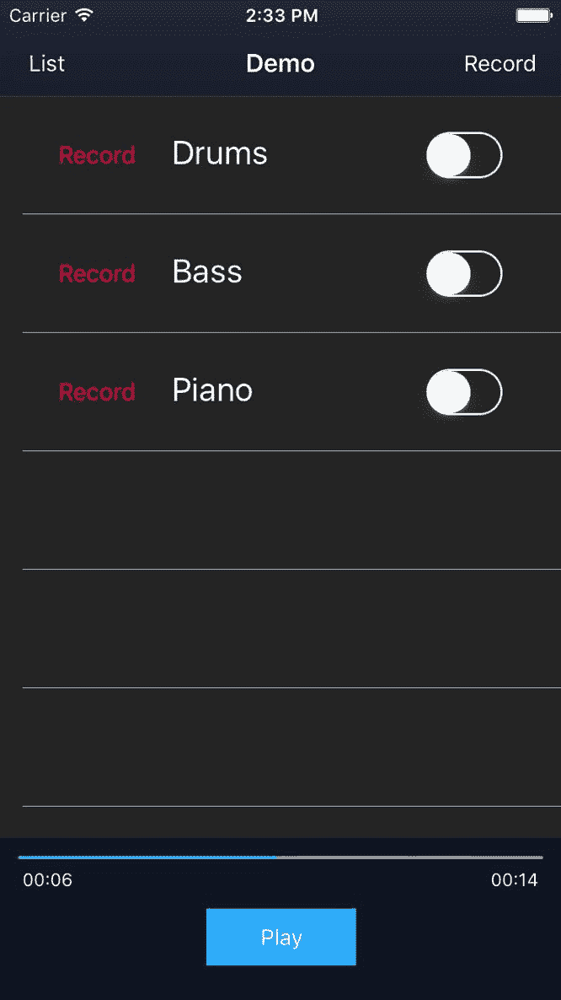
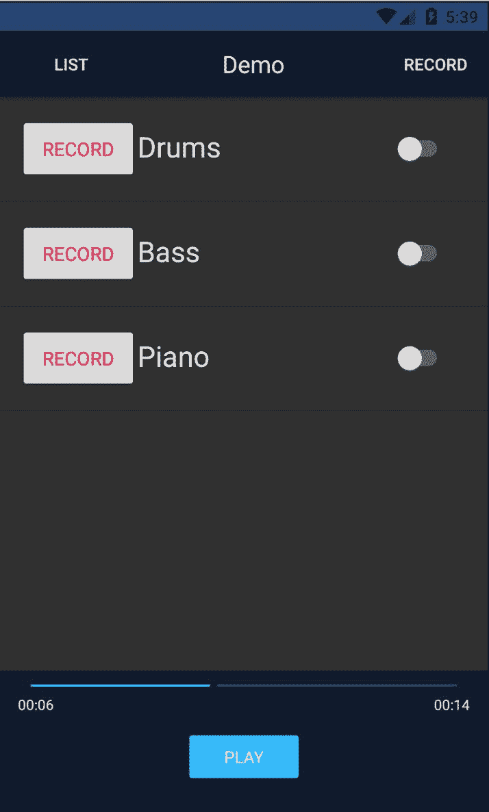

# 第七章：构建多轨道播放器

我们已经到达了 NativeScript 开发的关键点：通过 TypeScript 直接访问 iOS 上的 Objective-C/Swift API 和 Android 上的 Java API。

这绝对是 NativeScript 最独特的方面之一，为移动开发者打开了许多机会。特别是，我们的应用将需要充分利用 iOS 和 Android 上丰富的本地音频 API，以实现其核心竞争力，为用户提供引人入胜的多轨录音/混音体验。

了解如何针对这些 API 进行编码将是解锁您的移动应用的全部潜力所必不可少。此外，学习如何集成现有的 NativeScript 插件，这些插件可能已经在 iOS 和 Android 上提供了一致的 API，可以帮助您更快地实现目标。利用每个平台可以提供的最佳性能将是我们在第三部分旅程的重点。

在本章中，我们将涵盖以下内容：

+   集成 Nativescript-audio 插件

+   为我们的轨道播放器创建一个模型，以便未来扩展

+   使用 RxJS 可观察对象

+   了解 Angular 的 NgZone 与第三方库和视图绑定

+   处理多个音频源的音频播放同步

+   利用 Angular 的绑定，以及 NativeScript 的本地事件绑定，实现我们所追求的精确可用性

+   使用 Angular 平台特定指令为我们的播放器控件构建自定义快进滑块

# 通过 nativescript-audio 插件实现我们的多轨道播放器

幸运的是，NativeScript 社区发布了一个插件，为我们提供了一个一致的 API，可以在 iOS 和 Android 上使用，以启动音频播放器。在实施功能之前，可以随意浏览[`plugins.nativescript.org`](http://plugins.nativescript.org)，*这是 NativeScript 插件的官方来源*，以确定现有插件是否适用于您的项目。

在这种情况下，**nativescript-audio**插件位于[`plugins.nativescript.org/plugin/nativescript-audio`](http://plugins.nativescript.org/plugin/nativescript-audio)，其中包含了我们开始集成应用程序功能的播放器部分所需的内容，并且可以在 iOS 和 Android 上运行。*它甚至提供了一个我们可能可以使用的录音机*。让我们开始安装它：

```ts
npm install nativescript-audio --save
```

NativeScript 框架允许您集成任何 npm 模块，打开了令人眼花缭乱的集成可能性，包括 NativeScript 特定的插件。实际上，如果您遇到 npm 模块给您带来麻烦的情况（也许是因为它依赖于 NativeScript 环境中不兼容的 node API），甚至有一个插件可以帮助您处理这个问题：[`www.npmjs.com/package/nativescript-nodeify`](https://www.npmjs.com/package/nativescript-nodeify)。详细描述在[`www.nativescript.org/blog/how-to-use-any-npm-module-with-nativescript`](https://www.nativescript.org/blog/how-to-use-any-npm-module-with-nativescript)。

每当与 NativeScript 插件集成时，创建一个模型或 Angular 服务，围绕其集成提供隔离。

**尝试通过创建可重用的模型或 Angular 服务来隔离第三方插件的集成点**。这不仅会为您的应用程序提供良好的可扩展性，而且在将来如果需要用不同的插件替换它或在 iOS 或 Android 上提供不同的实现时，还会为您提供更多的灵活性。

# 为我们的多音轨播放器构建 TrackPlayerModel。

我们需要每个音轨都有自己的音频播放器实例，并公开一个 API 来加载音轨的音频文件。这也将是一个很好的地方，在音频文件加载后公开音轨的持续时间。

由于这个模型很可能会在整个应用程序中共享（预计将来还会有录音播放），我们将与我们的其他模型一起创建在`app/modules/shared/models/track-player.model.ts`中：

```ts
// libs
import { TNSPlayer } from 'nativescript-audio';

// app
import { ITrack } from 

'./track.model';

interface ITrackPlayer {
  trackId: number;
  duration: number;
  readonly 

player: TNSPlayer;
}

export class TrackPlayerModel implements ITrackPlayer {
  public trackId: 

number;
  public duration: number;

  private _player: TNSPlayer;

  constructor() {

this._player = new TNSPlayer();
  }

  public load(track: ITrack): Promise<number> {
    return 

new Promise((resolve, reject) => {
      this.trackId = track.id;

      this._player.initFromFile({
        audioFile: track.filepath,
        loop: false
      }).then(() => {

this._player.getAudioTrackDuration()
          .then((duration) => {
            this.duration = +duration;
            resolve();
          });
      });
    });
  }

  public get player(): 

TNSPlayer {
    return this._player;
  }
}
```

我们首先从`nativescript-audio`插件中导入甜美的 NativeScript 社区音频播放器`TNSPlayer`。然后，我们定义一个简单的接口来实现我们的模型，它将引用`trackId`，它的`duration`，以及`player`实例的`readonly` getter。然后，我们包括该接口以与我们的实现一起使用，该实现使用自身构造了`TNSPlayer`的实例。由于我们希望一个灵活的模型可以随时加载其音轨文件，我们提供了一个接受`ITrack`的`load`方法，该方法利用`initFromFile`方法。这反过来会异步获取音轨的总持续时间（以字符串形式返回，因此我们使用`+duration`）来存储模型上的数字，然后解析音轨的初始化完成。

为了一致性和标准，确保还要从`app/modules/shared/models/index.ts`导出这个新模型：

```ts
export * from './composition.model';
export * from './track-player.model';
export * from 

'./track.model';
```

最后，我们为播放器实例提供一个 getter，`PlayerService`将使用它。这将引导我们迈出下一步：打开`app/modules/player/services/player.service.ts`。我们将根据最新的开发情况稍微改变我们的初始实现；全面查看后，我们将在此之后解释：

```ts
// angular
import { Injectable } from '@angular/core';

// libs
import { Subject } 

from 'rxjs/Subject';
import { Observable } from 'rxjs/Observable';

// app
import { ITrack, CompositionModel, TrackPlayerModel } from '../../shared/models';

@Injectable()
export class PlayerService {

  // observable state
  public playing$: 

Subject<boolean> = new Subject();
 public duration$: Subject<number> = new Subject

();
 public currentTime$: Observable<number>;

  // active composition
  private _composition: CompositionModel;
  // internal state 
  private _playing: 

boolean;
  // collection of track players
  private _trackPlayers: Array<TrackPlayerModel> 

= [];
  // used to report currentTime from
  private _longestTrack: 

TrackPlayerModel;

  constructor() {
    // observe currentTime changes every 1 seconds

this.currentTime$ = Observable.interval(1000)
 .map(_ => this._longestTrack ?
 this._longestTrack.player.currentTime
 : 0);
  }

  public set playing(value: boolean) 

{
 this._playing = value;
 this.playing$.next(value);
 }

  public get playing(): boolean {
 return 

this._playing;
 }

 public get composition(): CompositionModel 

{
 return this._composition;
 }

  public set 

composition(comp: CompositionModel) {
 this._composition = comp;

 // clear any previous players
 this._resetTrackPlayers();
 // setup 

player instances for each track
 let initTrackPlayer = (index: number) => {
 let track = this._composition.tracks[index];
 let trackPlayer = new 

TrackPlayerModel();
 trackPlayer.load(track).then(_ => {

 this._trackPlayers.push(trackPlayer);
 index++;
 if (index < 

this._composition.tracks.length) {
 initTrackPlayer(index);
 } 

else {
 // report total duration of composition
 this._updateTotalDuration();
 }
 });
 };
 // kick off multi-track player initialization
 initTrackPlayer

(0);
 }

 public togglePlay() {
 this.playing = 

!this.playing;
 if (this.playing) {
 this.play();
 } else {
 this.pause();
 }
 } 

  public play() {
 for (let t of this._trackPlayers) {
 t.player.play();
 }
 }

 public 

pause() {
 for (let t of this._trackPlayers) {
 t.player.pause

();
 }
 }

  ...

  private 

_updateTotalDuration() {
 // report longest track as the total duration of the mix
 let totalDuration = Math.max(
 ...this._trackPlayers.map(t => 

t.duration));
 // update trackPlayer to reflect longest track 
 for (let 

t of this._trackPlayers) {
 if (t.duration === totalDuration) {
 this._longestTrack = t;
 break;
 }
 } 
 this.duration$.next(totalDuration);
 }

 private _resetTrackPlayers() {
 for (let t of this._trackPlayers) {
 t.cleanup();
 }
 this._trackPlayers = [];
 } 
}
```

此时`PlayerService`的基石不仅是管理混音中播放多个曲目的艰苦工作，而且提供一个状态，我们的视图可以观察以反映组合的状态。因此，我们有以下内容：

```ts
...
// observable state
public playing$: Subject<boolean> = new Subject();
public duration$: 

Subject<number> = new Subject();
public currentTime$: Observable<number>;

// active 

composition
private _composition: CompositionModel;
// internal state 
private _playing: boolean;
// 

collection of track players
private _trackPlayers: Array<TrackPlayerModel> = [];
// used to report 

currentTime from
private _longestTrack: TrackPlayerModel;

constructor() {
  // observe currentTime 

changes every 1 seconds
  this.currentTime$ = Observable.interval(1000)
    .map(_ => this._longestTrack ?
      this._longestTrack.player.currentTime
      : 0);
  }
  ...
```

我们的视图还需要知道播放状态以及“持续时间”和“当前时间”。对于`playing$`和`duration$`状态，使用`Subject`将很好地工作，因为它们如下：

+   它们可以直接发出值

+   它们不需要发出初始值

+   它们不需要任何可观察的组合

另一方面，`currentTime$`将根据一些组合设置，因为它的值将取决于随时间可能发展的间歇状态（稍后详细介绍！）。换句话说，`playing$`状态是我们通过用户的播放操作（或基于播放器状态的内部操作）直接控制和发出的值，而`duration$`状态是我们直接作为所有曲目播放器初始化和准备就绪的结果发出的值**。**

`currentTime`是播放器不会自动通过播放器事件发出的值，而是我们必须间歇性地检查的值。因此，我们组合`Observable.interval(1000)`，它将在订阅时每 1 秒自动发出我们映射的值，表示最长曲目播放器实际的`currentTime`。

其他“私有”引用帮助维护服务的内部状态。最有趣的是，我们将保留对`_longestTrack`的引用，因为我们的组合总持续时间将始终基于最长的曲目，并且也将用于跟踪`currentTime`。

这个设置将提供我们的视图需要的基本内容以满足适当的用户交互。

*RxJS 默认不包含任何操作符。因此，如果你现在运行`Observable.interval(1000)`和`.map`，你的应用程序将崩溃！*

一旦您开始更多地使用 RxJS，最好创建一个`operators.ts`文件来将所有 RxJS 操作符导入其中。然后，在根`AppComponent`中导入该文件，这样您就不会在整个代码库中到处散布这些操作符导入。

创建`app/operators.ts`，内容如下：

```ts
import 'rxjs/add/operator/map';
import 'rxjs/add/observable/interval';
```

然后，打开`app/app.component.ts`并在第一行导入该文件：

```ts
import './operators';
...
```

现在，我们可以自由地在代码的任何地方使用 map、interval 和任何其他`rxjs`操作符，只要我们将它们导入到那个单一的文件中。

我们服务的下一部分相当不言自明：

```ts
public set playing(value: boolean) {
  this._playing = value;
  this.playing$.next(value);
}

public get playing(): boolean {
  return this._playing;
}

public get composition(): CompositionModel 

{
  return this._composition;
}
```

我们的`playing`设置器确保内部状态`_playing`得到更新，并且我们的`playing$`主题的值被发出，以便任何需要对此状态变化做出反应的订阅者。为了保险起见，还添加了方便的获取器。我们合成的下一个设置器变得相当有趣，因为这是我们与新的`TrackPlayerModel`进行交互的地方：

```ts
public set composition(comp: CompositionModel) {
  this._composition = comp;

  // clear any previous 

players
  this._resetTrackPlayers();
  // setup player instances for each track
  let initTrackPlayer = 

(index: number) => {
    let track = this._composition.tracks[index];
    let trackPlayer = new 

TrackPlayerModel();
    trackPlayer.load(track).then(_ => {

      this._trackPlayers.push

(trackPlayer);
      index++;
      if (index < this._composition.tracks.length) {

initTrackPlayer(index);
      } else {
        // report total duration of composition

this._updateTotalDuration();
      }
    });
  };
  // kick off multi-track player initialization

 initTrackPlayer(0);
}
...
private _resetTrackPlayers() {
  for (let t of this._trackPlayers) {

 t.cleanup();
  }
  this._trackPlayers = [];
}
```

每当我们设置活动合成时，我们首先确保我们服务的内部`_trackPlayers`引用被正确清理和清除`this._resetTrackPlayers()`。然后设置一个本地方法`initTrackPlayer`，可以被迭代调用，考虑到每个播放器的`load`方法的异步性，以确保每个曲目的播放器都正确加载了音频文件，包括其持续时间。在每次成功加载后，我们将添加到我们的`_trackPlayers`集合中，进行迭代，并继续，直到所有音频文件都加载完成。完成后，我们调用`this._updateTotalDuration()`来确定我们曲目合成的最终持续时间：

```ts
private _updateTotalDuration() {
  // report longest track as the total duration of the mix
  let 

totalDuration = Math.max(
    ...this._trackPlayers.map(t => t.duration));
  // update trackPlayer to reflect 

longest track 
  for (let t of this._trackPlayers) {
    if (t.duration === totalDuration) {

this._longestTrack = t;
      break;
    }
  }
  this.duration$.next(totalDuration);
}
```

由于具有最长持续时间的曲目应始终用于确定整个合成的总持续时间，我们使用`Math.max`来确定最长持续时间，然后存储对曲目的引用。因为多个曲目可能具有相同的持续时间，所以使用哪个曲目并不重要，只要有一个与最长持续时间匹配即可。这个`_longestTrack`将是我们的“节奏设置者”，因为它将用于确定整个合成的`currentTime`。最后，我们通过我们的`duration$`主题将最长持续时间作为`totalDuration`发出给任何订阅观察者。

接下来的几种方法提供了我们合成的整体播放控制的基础：

```ts
public togglePlay() {
  this.playing = !this.playing;
  if (this.playing) {
    this.play();
  } 

else {
    this.pause();
  }
}

public play() {
  for (let t of this._trackPlayers) {

 t.player.play();
  }
}

public pause() {
  for (let t of this._trackPlayers) {

t.player.pause();
  }
}
```

我们 UI 中的主要播放按钮将使用`togglePlay`方法来控制播放，因此也用于切换内部状态以及启用所有音轨播放器的播放或暂停方法。

# 让音乐播放！

为了尝试所有这些，让我们从由精美的*Jesper Buhl Trio*创作的爵士乐曲*What Is This Thing Called Love*中添加三个示例音频文件。这些音轨已经分为鼓、贝斯和钢琴。我们可以将这些`.mp3`文件添加到`app/audio`文件夹中。

让我们修改`MixerService`中演示曲目的音轨，以提供对这些新的真实音频文件的引用。打开`app/modules/mixer/services/mixer.service.ts`并进行以下修改：

```ts
private _demoComposition(): Array<IComposition> {
  // starter composition for user to demo on first 

launch
  return [
    {
      id: 1,
      name: 'Demo',
      created: Date.now(),

order: 0,
      tracks: [
 {
 id: 1,
 name: 'Drums',
 order: 0,
 filepath: 

'~/audio/drums.mp3'
 },
 {
 id: 2,
 name: 'Bass',
 order: 1,
 filepath: '~/audio/bass.mp3'
 },
 {
 id: 3,
 name: 'Piano',
 order: 

2,
 filepath: '~/audio/piano.mp3'
 }
 ]
    }
  ];
}
```

现在让我们为我们的播放控件提供一个输入，它将接受我们选择的组合。打开`app/modules/mixer/components/mixer.component.html`，并进行以下突出显示的修改：

```ts
<action-bar [title]="composition.name"></action-bar>
<GridLayout rows="*, auto" columns="*" 

class="page">
  <track-list [tracks]="composition.tracks" row="0" col="0"> 
  </track-list>

<player-controls [composition]="composition"
    row="1" col="0"></player-controls>
</GridLayout>
```

然后，在`app/modules/player/components/player-controls/player-controls.component.ts`中的`PlayerControlsComponent`中，我们现在可以通过其各种可观察对象观察`PlayerService`的状态：

```ts
// angular
import { Component, Input } from '@angular/core';

// libs
import { Subscription } from 'rxjs/Subscription';

// app
import { ITrack, 

CompositionModel } from '../../../shared/models';
import { PlayerService } from '../../services';

@Component({
  moduleId: module.id,
  selector: 'player-controls',
  templateUrl: 'player-

controls.component.html'
})
export class PlayerControlsComponent {

  @Input() composition: 

CompositionModel;

  // ui state
  public playStatus: string = 'Play';
  public duration: 

number = 0;
  public currentTime: number = 0;

  // manage subscriptions
  private _subPlaying: 

Subscription;
 private _subDuration: Subscription;
 private _subCurrentTime: 

Subscription;

  constructor(
    private playerService: PlayerService
  ) { }

public togglePlay() {
 this.playerService.togglePlay();
 } 

  ngOnInit() {
    // init audio player for composition

this.playerService.composition = this.composition;
    // react to play state

this._subPlaying = this.playerService.playing$
 .subscribe((playing: boolean) => 

{
        // update button state
 this._updateStatus(playing); 
        // 

update slider state
 if (playing) {
 this._subCurrentTime = 

this.playerService
 .currentTime$
 .subscribe

((currentTime: number) => {
 this.currentTime = currentTime;
 });
 } else if (this._subCurrentTime) {
 this._subCurrentTime.unsubscribe();
 }
 });
    // 

update duration state for slider
    this._subDuration = this.playerService.duration$
 .subscribe((duration: number) => {
 this.duration = duration;
 });
  }

  ngOnDestroy() {
    // cleanup

if (this._subPlaying)
 this._subPlaying.unsubscribe(); 
 if 

(this._subDuration)
 this._subDuration.unsubscribe(); 
 if 

(this._subCurrentTime)
 this._subCurrentTime.unsubscribe();
  } 

  private _updateStatus(playing: boolean) {
 this.playStatus = 

playing ? 'Stop' : 'Play';
 }
}
```

`PlayerControlComponent`的基石现在是通过`this.playerService.composition = this.composition`在`ngOnInit`中设置活动组合的能力，这是在准备好组合输入时，以及订阅`PlayerService`提供的各种状态来更新我们的 UI。这里最有趣的是`playing$`订阅，它根据是否正在播放来管理`currentTime$`的订阅。如果您还记得，我们的`currentTime$`可观察对象以`Observable.interval(1000)`开始，这意味着每一秒它将发出最长音轨的`currentTime`，这里再次显示供参考：

```ts
this.currentTime$ = Observable.interval(1000)
  .map(_ => this._longestTrack ?

this._longestTrack.player.currentTime
    : 0);
```

我们只想在播放时更新`Slider`的`currentTime`；因此，当`playing$`主题发出`true`时，我们订阅，这将允许我们的组件每秒接收播放器的`currentTime`。当`playing$`发出`false`时，我们取消订阅，不再接收`currentTime`的更新。太棒了。

我们还订阅了我们的`duration$`主题以更新 Slider 的最大值。最后，我们通过它们在`ngOnDestroy`中的`Subscription`引用确保所有订阅都被清理。

现在让我们来看看`app/modules/player/components/player-controls/player-controls.component.html`中`PlayerControlsComponent`的视图绑定：

```ts
<GridLayout rows="100" columns="100,*"
  row="1" col="0" class="p-x-10">
  <Button [text]

="playStatus" (tap)="togglePlay()"
    row="0" col="0" class="btn btn-primary w-

100"></Button>
  <Slider [maxValue]="duration" [value]="currentTime" 
    minValue="0" row="0" col="1" class="slider">  
  </Slider>
</GridLayout>
```

如果您运行该应用程序，现在可以在 iOS 和 Android 上选择演示曲目并播放音乐。

*音乐到我们的耳朵！这相当棒。事实上，它非常棒！*

在这一点上，您可能会注意到或希望有一些事情：

+   选择播放按钮后，它会正确地变为停止，但当播放到末尾时，它不会返回到原来的播放文本。

+   “滑块”也应该返回到位置 0 以重置播放。

+   iOS 上的总“持续时间”和“当前时间”使用秒；然而，Android 使用毫秒。

+   在 iOS 上，如果您选择在演奏作品的演示曲目播放期间多次播放/暂停，您可能会注意到所有曲目上都有一个非常微妙的播放同步问题。

+   需要当前时间和持续时间标签。

+   **播放搜索**很好能够使用滑块来控制播放位置。

# 完善实现

我们的模型和服务中缺少一些重要的部分，以真正完善我们的实现。让我们从处理曲目播放器实例的完成和错误条件开始。打开`app/modules/shared/models/track-player.model.ts`中的`TrackPlayerModel`，并添加以下内容：

```ts
... export interface IPlayerError {
 trackId: number;
 error: any;
}

export class TrackPlayerModel implements ITrackPlayer {

  ...
  private _completeHandler: (number) => void;
 private _errorHandler: 

(IPlayerError) => void;

  ...

  public load(
    track: ITrack, 

complete: (number) => void, 
 error: (IPlayerError) => void
  ): 

Promise<number> {
    return new Promise((resolve, reject) => {
      ...

this._completeHandler = complete;
 this._errorHandler = error;

this._player.initFromFile({
        audioFile: track.filepath,
        loop: false,

completeCallback: this._trackComplete.bind(this),
 errorCallback: 

this._trackError.bind(this) ... private _trackComplete(args: any) {
    // TODO: 

works well for multi-tracks with same length
    // may need to change in future with varied lengths

this.player.seekTo(0);
    console.log('trackComplete:', this.trackId);
    if (this._completeHandler)

this._completeHandler(this.trackId); 
  }

  private _trackError(args: any) {
    let error = 

args.error;
    console.log('trackError:', error);
    if (this._errorHandler)
      this._errorHandler({ 

trackId: this.trackId, error }); 
 }
```

我们首先定义每个曲目错误的形状为`IPlayerError`。然后，我们通过`load`参数捕获对`_completeHandler`和`_errorHandler`函数的引用，现在需要完成和错误回调。我们在分配模型的内部`this._trackComplete`和`this._trackError`之前分配这两个回调（使用`.bind(this)`语法确保函数范围被锁定到自身）到`TNSPlayer`的`completeCallback`和`errorCallback`。

`completeCallback`和`errorCallback`将在区域外触发。这就是为什么我们在后面的章节中注入`NgZone`并使用`ngZone.run()`。我们可以通过使用`zonedCallback`函数创建回调来避免这种情况。它将确保回调将在创建回调的代码相同的区域中执行。例如：

```ts
this._player.initFromFile({
  audioFile: track.filepath,
  loop: false,
  completeCallback: 

zonedCallback(this._trackComplete.bind(this)),
  errorCallback: 

zonedCallback(this._trackError.bind(this))
  ...
```

这为我们提供了在分派这些条件之前内部处理每个条件的能力。

其中一个内部条件是在播放完成时将每个音频播放器重置为零，因此我们只需调用`TNSPlayer`的`seekTo`方法进行重置。我们标记了一个*TODO*，因为虽然这在所有音轨长度相同时效果很好（*就像我们的演示音轨*），但当我们开始录制不同长度的多轨音轨时，这肯定会在未来变得有问题。想象一下，我们有两个音轨：音轨 1 的持续时间为 1 分钟，音轨 2 的持续时间为 30 秒。如果我们播放到 45 秒并暂停，音轨 2 已经调用了它的完成处理程序并重置为 0。然后我们点击播放以恢复。音轨 1 从 45 秒处恢复，但音轨 2 又回到了 0。*我们会在那时解决这个问题，所以不要为此担心！*此时，我们正在完善我们的第一阶段实现。

最后，我们调用分配的`completeHandler`来让调用者知道哪个 trackId 已经完成。对于`trackError`，我们只需传递`trackId`和`error`。

现在，让我们回到`PlayerService`并将其连接起来。打开`app/modules/player/services/player.service.ts`并进行以下修改：

```ts
// app
import { ITrack, CompositionModel, TrackPlayerModel, IPlayerError } from 

'../../shared/models';

@Injectable()
export class PlayerService {

  // observable state
  ...
  public complete$: Subject<number> = new Subject();
  ... public set 

composition(comp: CompositionModel) {...let initTrackPlayer = (index: 

number) => {...trackPlayer.load(
        track,

   this._trackComplete.bind(this),
        this._trackError.bind(this)

  ...

 private _trackComplete(trackId: number) {
    console.log('track complete:', trackId);
    this.playing = 

false;
    this.complete$.next(trackId);
  }

  private _trackError(playerError: IPlayerError) {

  console.log(`trackId ${playerError.trackId} error:`,
      playerError.error);
  }
  ...
```

我们已经添加了另一个主题，`complete$`，以允许视图组件订阅音轨播放完成时的情况。此外，我们添加了两个回调处理程序，`_trackComplete`和`_trackError`，我们将它们传递给`TrackPlayerModel`的`load`方法。

然而，如果我们试图更新视图绑定以响应任何视图组件中`complete$`订阅的触发，你会注意到一些令人困惑的事情。**视图不会更新！**

每当与第三方库集成时，请注意来自库的回调处理程序，这可能需要更新视图绑定。在需要时注入 NgZone 并用`this.ngZone.run(() => ...`进行包装。

提供回调的第三方库通常需要通过 Angular 的 NgZone 运行。Thoughtram 的伟大人员发表了一篇关于 Zone 的精彩文章，如果你想了解更多，请访问[`blog.thoughtram.io/angular/2016/02/01/zones-in-angular-2.html`](https://blog.thoughtram.io/angular/2016/02/01/zones-in-angular-2.html)。

第三方库**nativescript-audio**集成了 iOS 和 Android 本机音频播放器，并提供了可以连接到处理完成和错误条件的回调。这些回调在本机音频播放器的上下文中异步执行，因为它们不是在用户事件的上下文中处理，比如点击，或者网络请求的结果，或者像`setTimeout`这样的定时器，如果我们打算它们导致更新视图绑定，我们需要确保结果和随后的代码执行发生在 Angular 的 NgZone 中。

由于我们打算让`complete$`主题导致视图绑定更新（*特别是重置我们的滑块*），我们将注入 NgZone 并包装我们的回调处理。回到`app/modules/player/services/player.service.ts`，让我们进行以下调整：

```ts
// angular
import { Injectable, NgZone } from '@angular/core';

@Injectable()

export class PlayerService {

  ...
  constructor(private ngZone: NgZone) {}

...
  private _trackComplete(trackId: number) {
    console.log('track complete:', trackId);

this.ngZone.run(() => {
      this.playing = false;
      this.complete$.next(trackId);

   });
  }
  ...
```

现在，当我们在视图组件中使用这个新的`complete$`主题来响应我们服务的状态时，我们将会清楚。让我们调整`PlayerControlsComponent`在`app/modules/player/components/player-controls/player-controls.component.ts`中观察`complete$`主题来重置我们的`currentTime`绑定：

```ts
export class PlayerControlsComponent {

  ...
  private _subComplete: Subscription;
  ...
  ngOnInit() {
    ...
    // completion should reset currentTime
    this._subComplete 

= this.playerService.complete$.subscribe(_ => {
 this.currentTime = 0;
 });
  }
  ngOnDestroy() {
    ...
    if (this._subComplete) this._subComplete.unsubscribe(); 
  }
  ...
```

iOS 音频播放器以秒为单位报告`duration`和`currentTime`，而 Android 以毫秒报告。我们需要标准化！

让我们向`PlayerService`添加一个方法来标准化时间，这样我们就可以依赖两个平台都提供以秒为单位的时间：

```ts
...
// nativescript
import { isIOS } from 'platform';
...

@Injectable()
export class PlayerService {

 constructor() {
   // observe currentTime changes 

every 1 seconds
   this.currentTime$ = Observable.interval(1000)
     .map(_ => this._longestTrack ?

  this._standardizeTime(
 this._longestTrack.player.currentTime)

: 0;
     );
 }
 ...
 private _updateTotalDuration() {
   ...
   // iOS: reports 

duration in seconds
 // Android: reports duration in milliseconds
 // 

standardize to seconds
   totalDuration = this._standardizeTime(totalDuration);

console.log('totalDuration of mix:', totalDuration);
   this.duration$.next(totalDuration);
 }
 ...

private _standardizeTime(time: number) {
 return isIOS ? time : time * .001;
 }
 ...
```

我们可以利用 NativeScript 提供的`platform`模块中的`isIOS`布尔值来有条件地调整我们的时间，将 Android 的毫秒转换为秒。

使用 NativeScript 的`platform`模块中的`isIOS`和/或`isAndroid`布尔值是在需要时跨代码库进行平台调整的非常有效的方法。

**那么在 iOS 上有关多个曲目的微妙播放同步问题呢？**

在 iOS 上，如果您在演示曲目的 14 秒播放期间多次选择播放/暂停，您可能会注意到所有曲目都有一个非常微妙的播放同步问题。我们可以推测这也可能在某个时候发生在 Android 上。

# 利用 NativeScript 的优势，直接利用 nativescript-audio 插件中底层 iOS AVAudioPlayer 实例的本机 API

让我们在我们的播放/暂停逻辑中插入一些保护措施，以帮助确保我们的曲目在我们的编程能力范围内保持同步。**nativescript-audio**插件提供了一个仅适用于 iOS 的方法，称为`playAtTime`。它与特殊的`deviceCurrentTime`属性一起工作，正如苹果的文档中为此目的描述的那样。

由于`nativescript-audio`插件没有暴露`deviceCurrentTime`，我们可以通过`ios` getter 直接访问原生属性。让我们调整`PlayerService`的`play`方法来使用它：

```ts
public play() {
  // for iOS playback sync
 let shortStartDelay = .01;
 let 

now = 0;

 for (let i = 0; i < this._trackPlayers.length; i++) {
 let track = this._trackPlayers[i];
 if (isIOS) {
 if (i == 0) now = 

track.player.ios.deviceCurrentTime;
 (<any>track.player).playAtTime

(now + shortStartDelay);
 } else {
 track.player.play

();
 }
 } 
}
```

由于`track.player`是我们的`TNSPlayer`实例，我们可以通过其**ios** getter 访问底层的原生平台播放器实例（对于 iOS，它是`AVAudioPlayer`）来直接访问`deviceCurrentTime`。我们为了保险起见提供了一个非常短的起始延迟，将其加入到第一首曲目的`deviceCurrentTime`中，并使用它来确保我们的所有曲目在同一时间开始，这非常有效！由于`playAtTime`没有通过`nativescript-audio`插件的 TypeScript 定义发布，我们在调用该方法之前只需对播放器实例进行类型转换（`<any>track.player`）即可满足 tsc 编译器。由于在 Android 上没有等效的方法，我们将只使用标准的媒体播放器的播放方法，这对 Android 来说效果很好。

让我们现在用类似的保护措施来调整我们的暂停方法：

```ts
public pause() {
  let currentTime = 0;

 for (let i = 0; i < 

this._trackPlayers.length; i++) {
 let track = this._trackPlayers[i];
 if 

(i == 0) currentTime = track.player.currentTime;
    track.player.pause();
    // ensure tracks pause 

and remain paused at the same time
    track.player.seekTo(currentTime);
  }
}
```

通过使用第一首曲目的`currentTime`作为**pace setter**，我们暂停我们混音中的每一首曲目，并确保它们通过立即定位到相同的`currentTime`保持在完全相同的时间。这有助于确保当我们恢复播放时，它们都从同一时间点开始。让我们在下一节中利用所有这些内容来构建一个自定义的穿梭滑块。

# 创建一个自定义的 ShuttleSliderComponent

我们不能没有能够在我们的混音中来回穿梭的能力！让我们加倍努力，通过结合 NativeScript 和 Angular 提供给我们的所有选项的优势来增强`Slider`的功能。在这个过程中，我们的播放控件将开始变得更加有用。

从高层次开始，打开`app/modules/player/components/player-controls/player-controls.component.html`并用以下内容替换它：

```ts
<StackLayout row="1" col="0" class="controls">
  <shuttle-slider [currentTime]

="currentTime" 
 [duration]="duration"></shuttle-slider>
  <Button 

[text]="playStatus" (tap)="togglePlay()"
    class="btn btn-primary w-100"></Button>
</StackLayout>
```

我们正在用`StackLayout`替换`GridLayout`，以改变一下我们播放器控件的布局。让我们使用一个全宽的滑块叠放在播放/暂停按钮上。我们想要的效果类似于 iPhone 上的 Apple Music 应用，滑块是全宽的，当前时间和持续时间显示在下面。现在，让我们构建我们的自定义`shuttle-slider`组件，并创建`app/modules/player/components/player-controls/shuttle-slider.component.html`，内容如下：

```ts
<GridLayout #sliderArea rows="auto, auto" columns="auto,*,auto" 
  class="slider-area">
  <Slider 

#slider slim-slider minValue="0" [maxValue]="duration"
      colSpan="3" class="slider"></Slider>

<Label #currentTimeDisplay text="00:00" class="h4 m-x-5" row="1" col="0">
  </Label>
  <Label 

[text]="durationDisplay" class="h4 text-right m-x-5"
    row="1" col="2"></Label>
</GridLayout>
```

这里的事情将变得非常有趣。我们将结合 Angular 绑定在有用的地方，比如这些绑定：`[maxValue]="duration"`和`[text]="durationDisplay"`。然而，对于我们其余的可用性布线，我们将需要更精细的和手动的控制。例如，我们的包含`GridLayout`通过`#sliderArea`将成为用户可以触摸进行穿梭的区域，而不是`Slider`组件本身，我们将完全禁用用户与滑块本身的交互（因此，你看到的`slim-slider`指令属性）。滑块将仅用于时间的视觉表示。

我们将要这样做的原因是因为我们希望这种交互能够启动几个程序化的动作：

+   在穿梭时暂停播放（如果正在播放）

+   在来回移动时更新当前时间显示标签

+   以受控方式启动`seekTo`命令到我们的轨道播放器实例，从而减少多余的搜索命令

+   如果之前正在播放，那么在不再进行穿梭时恢复播放

如果我们使用`Slider`和 Angular 绑定到`currentTime`通过`currentTime$` observable，这取决于我们与其交互以及轨道播放器状态的控制，事情会耦合得太紧，无法实现我们需要的精细控制。

我们即将要做的事情之美，是对 Angular 与 NativeScript 的灵活组合的一个很好的证明。让我们开始在`app/modules/player/components/player-controls/shuttle-slider.component.ts`中编写我们的交互；这是完整的设置，你可以在这里查看，我们马上就会分解：

```ts
// angular
import { Component, Input, ViewChild, ElementRef } from '@angular/core';

// 

nativescript
import { GestureTypes } from 'ui/gestures';
import { View } from 'ui/core/view';
import { Label 

} from 'ui/label';
import { Slider } from 'ui/slider';
import { Observable } from 'data/observable';
import 

{ isIOS, screen } from 'platform';

// app
import { PlayerService } from '../../services';

@Component({
  moduleId: module.id,
  selector: 'shuttle-slider',
  templateUrl: 'shuttle-

slider.component.html',
  styles: [`
    .slider-area {
      margin: 10 10 0 10;
    }

.slider {
      padding:0;
      margin:0 0 5 0;
      height:5;
    }
  `]
})
export 

class ShuttleSliderComponent {

  @Input() currentTime: number; 
  @Input() duration: number; 

 @ViewChild('sliderArea') sliderArea: ElementRef;
  @ViewChild('slider') slider: ElementRef;

@ViewChild('currentTimeDisplay') currentTimeDisplay: ElementRef;

  public durationDisplay: string;

  private _sliderArea: View;
  private _currentTimeDisplay: Label;
  private _slider: Slider;
  private 

_screenWidth: number;
  private _seekDelay: number;

  constructor(private playerService: PlayerService) { 

}

  ngOnChanges() {
    if (typeof this.currentTime == 'number')   {
      this._updateSlider

(this.currentTime);
    }
    if (this.duration) {
      this.durationDisplay = 

this._timeDisplay(this.duration);
    }
  }

  ngAfterViewInit() {
    this._screenWidth = 

screen.mainScreen.widthDIPs;
    this._sliderArea = <View>this.sliderArea

.nativeElement;
    this._slider = <Slider>this.slider.nativeElement;
    this._currentTimeDisplay = 

<Label>this.currentTimeDisplay
                                 .nativeElement;

this._setupEventHandlers();
  }

  private _updateSlider(time: number) {
    if (this._slider) 

this._slider.value = time;
    if (this._currentTimeDisplay)
      this._currentTimeDisplay
        .text = 

this._timeDisplay(time);
  }

  private _setupEventHandlers() {
    this._sliderArea.on

(GestureTypes.touch, (args: any) => {
      this.playerService.seeking = true;
      let x = args.getX();

      if (x >= 0) {
        let percent = x / this._screenWidth;
        if (percent > .5) {

        percent += .05;
        }
        let seekTo = this.duration * percent;
        this._updateSlider

(seekTo);

        if (this._seekDelay) clearTimeout(this._seekDelay);
        this._seekDelay = setTimeout

(() => {
          // android requires milliseconds
          this.playerService
            .seekTo

(isIOS ? seekTo : (seekTo*1000));
        }, 600);
      }
    });
  }

  private 

_timeDisplay(seconds: number): string {
    let hr: any = Math.floor(seconds / 3600);
    let min: any = 

Math.floor((seconds - (hr * 3600))/60);
    let sec: any = Math.floor(seconds - (hr * 3600) 

- (min * 60));
    if (min < 10) { 
      min = '0' + min; 
    }
    if (sec < 10){ 

sec = '0' + sec;
    }
    return min + ':' + sec;
  }
}
```

对于一个相当小的组件占用空间，这里发生了很多很棒的事情！让我们来分解一下。

让我们看看那些属性装饰器，从`@Input`开始：

```ts
@Input() currentTime: number; 
@Input() duration: number; 

// allows these property bindings to flow into our view:
<shuttle-slider 
 [currentTime]

="currentTime" 
  [duration]="duration">
</shuttle-slider>
```

然后，我们有我们的`@ViewChild`引用：

```ts
@ViewChild('sliderArea') sliderArea: ElementRef;
@ViewChild('slider') 

slider: ElementRef;
@ViewChild('currentTimeDisplay') currentTimeDisplay: ElementRef;

private _sliderArea: StackLayout;
private _currentTimeDisplay: Label;
private _slider: Slider;// provides us with references to these view components<StackLayout 

#sliderArea class="slider-area">
  <Slider #slider slim-slider

minValue="0 [maxValue]="duration" class="slider">
  </Slider>
  <GridLayout rows="auto" 

columns="auto,*,auto"
    class="m-x-5">
    <Label #currentTimeDisplay text="00:00" 

class="h4"
      row="0" col="0"></Label>
    <Label [text]="durationDisplay" class="h4 text-right" 

      row="0" col="2"></Label>
  </GridLayout>
</StackLayout>
```

然后，我们可以在组件中访问这些`ElementRef`实例，以便以编程方式处理它们；但是，不是立即。由于`ElementRef`是视图组件的代理包装器，只有在 Angular 的组件生命周期钩子`ngAfterViewInit`触发后，才能访问其底层的`nativeElement`（我们实际的 NativeScript 组件）。

在这里了解有关 Angular 组件生命周期钩子的所有信息：

[`angular.io/docs/ts/latest/guide/lifecycle-hooks.html.`](https://angular.io/docs/ts/latest/guide/lifecycle-hooks.html)

因此，我们在这里为我们的实际 NativeScript 组件分配私有引用：

```ts
ngAfterViewInit() {
  *this._screenWidth = screen.mainScreen.widthDIPs;*
  this._sliderArea = 

<StackLayout>this.sliderArea
 .nativeElement;
 this._slider = <Slider>this.slider.nativeElement;
 this._currentTimeDisplay = 

<Label>this.currentTimeDisplay
 .nativeElement;
  *this._setupEventHandlers();*
}
```

我们还利用这个机会使用`platform`模块的`screen`实用程序来引用整体屏幕宽度，使用**密度无关像素**（**dip**）单位。这将允许我们使用用户在`sliderArea` StackLayout 上的手指位置进行一些计算，以调整`Slider`的实际值。然后，我们调用设置我们必要的事件处理程序。

使用我们的`_sliderArea`引用来包含 StackLayout，我们添加了一个`touch`手势监听器，以捕获用户在滑块区域上的任何触摸：

```ts
private _setupEventHandlers() {
  this._sliderArea.on(GestureTypes.touch, (args: any) => {

*this.playerService.seeking = true; // TODO*

    let x = args.getX();
    if (x >= 0) {

  // x percentage of screen left to right
      let percent = x / this._screenWidth;
      if (percent > .5) 

{
        percent += .05; // non-precise adjustment
      }
      let seekTo = this.duration * percent;
      this._updateSlider(seekTo);

      if (this._seekDelay) clearTimeout(this._seekDelay);

this._seekDelay = setTimeout(() => {
        // android requires milliseconds

this.playerService.seekTo(
          isIOS ? seekTo : (seekTo*1000));
      }, 600);
    }
  });
}
```

这使我们能够通过`args.getX()`抓取用户手指的`X`位置。我们用它来除以用户设备屏幕宽度，以确定从左到右的百分比。由于我们的计算不是完全精确的，当用户通过 50%标记时，我们进行了一些小的调整。这种可用性目前非常适合我们的用例，但是我们将保留以后改进的选项；但是，现在它完全可以。

然后，我们将持续时间乘以这个百分比，以获得我们的`seekTo`标记，以更新我们的`Slider`值，以便使用手动精度获得即时 UI 更新：

```ts
private _updateSlider(time: number) {
  if (this._slider) this._slider.value = time;
  if 

(this._currentTimeDisplay)
    this._currentTimeDisplay.text = this._timeDisplay(time);
}
```

在这里，我们实际上直接使用我们的 NativeScript 组件，而不使用 Angular 的绑定或 NgZone。在需要对 UI 进行精细控制和性能控制的情况下，这可能非常方便。由于我们希望`Slider`轨道能够立即随用户手指移动，以及时间显示标签使用标准音乐时间码格式表示实时交互，我们在适当的时间直接设置它们的值。

然后，我们使用寻找延迟超时来确保我们不会向我们的多轨播放器发出多余的寻找命令。用户的每次移动都会进一步延迟实际的寻找命令，直到他们停在他们想要的位置。我们还使用我们的 `isIOS` 布尔值来根据每个平台音频播放器的需要适当地转换时间（iOS 为秒，Android 为毫秒）。

最有趣的可能是我们的 `ngOnChanges` 生命周期钩子：

```ts
ngOnChanges() {
  if (typeof this.currentTime == 'number') {
    this._updateSlider(this.currentTime);

 }
  if (this.duration) {
    this.durationDisplay = this._timeDisplay(this.duration);
  }
}
```

当 Angular 检测到组件（或指令）的 ***输入属性*** 发生变化时，它会调用其 `ngOnChanges()` 方法。

这是 `ShuttleSliderComponent` 对其 `Input` 属性变化、`currentTime` 和 `duration` 做出反应的绝妙方式。在这里，我们只在它确实发出有效数字时通过 `this._updateSlider(this.currentTime)` 手动更新我们的滑块和当前时间显示标签。最后，我们还确保更新我们的持续时间显示标签。只要存在活动订阅，该方法将在 `PlayerService` 的 `currentTime$` observable 每秒触发一次。**不错！** 哦，别忘了将 `ShuttleSliderComponent` 添加到 `COMPONENTS` 数组中，以便与模块一起包含。

现在我们需要实际实现这一点：

```ts
*this.playerService.seeking = true; // TODO*
```

我们将使用更多巧妙的 observable 技巧来处理我们的寻找状态。让我们打开 `app/modules/player/services/player.service.ts` 中的 `PlayerService`，并添加以下内容：

```ts
...
export class PlayerService {

  ...
  // internal state 
  private _playing: boolean;
  private _seeking: boolean;
 private _seekPaused: boolean;
 private _seekTimeout: number;
  ...
  constructor(private ngZone: NgZone) {
    this.currentTime$ = 

Observable.interval(1000)
      .switchMap(_ => {
        if (this._seeking) 

{
 return Observable.never();
 } else if 

(this._longestTrack) {
          return Observable.of(
            this._standardizeTime(

this._longestTrack.player.currentTime));
        } else {
          return Observable.of(0);
        }

   });
  }
  ...
  public set seeking(value: boolean) {
 this._seeking = 

value;
 if (this._playing && !this._seekPaused) {
 // pause 

while seeking
 this._seekPaused = true;
 this.pause();
 }
 if (this._seekTimeout) clearTimeout(this._seekTimeout);
 this._seekTimeout = setTimeout(() => {
 this._seeking = false;
 if 

(this._seekPaused) {
 // resume play
 this._seekPaused = 

false;
 this.play();
 }
 }, 

1000);
 }

  public seekTo(time: number) {
 for 

(let track of this._trackPlayers) {
 track.player.seekTo(time);
 } 
 }
  ...
```

我们引入了三个新的 observable 操作符 `switchMap`、`never` 和 `of`，我们需要确保它们也被导入到我们的 `app/operators.ts` 文件中：

```ts
import 'rxjs/add/operator/map';
import 'rxjs/add/operator/switchMap';
import 

'rxjs/add/observable/interval';
import 'rxjs/add/observable/never';
import 

'rxjs/add/observable/of';
```

`switchMap` 允许我们的 observable 根据几个条件切换流，帮助我们管理 `currentTime` 是否需要发出更新。显然，在寻找时，我们不需要对 `currentTime` 的变化做出反应。因此，当 `this._seeking` 为 true 时，我们将我们的 Observable 流切换到 `Observable.never()`，确保我们的观察者永远不会被调用。

在我们的 `seeking` setter 中，我们调整内部状态引用（`this._seeking`），如果它当前是 `this._playing` 并且由于寻找而尚未暂停（因此 `!this._seekPaused`），我们立即暂停播放（仅一次）。然后，我们设置另一个超时，延迟在组件触发 `seekTo` 后的额外 400 毫秒恢复播放，如果在寻找开始时正在播放（因此，检查 `this._seekPaused`）。

这样，用户可以自由地在我们的滑块上移动手指，尽可能快地移动。他们将实时看到`Slider`轨道的即时 UI 更新，以及当前时间显示标签；与此同时，我们避免了向我们的多轨播放器发送多余的`seekTo`命令，直到它们停下来，提供了一个非常好的用户体验。

# 为 iOS 和 Android 本机 API 修改创建 SlimSliderDirective

我们仍然需要为`Slider`上的`slim-slider`属性创建一个指令：

```ts
<Slider #slider slim-slider minValue="0" [maxValue]="duration" 

class="slider"></Slider>
```

我们将创建特定于平台的指令，因为我们将在 iOS 和 Android 上利用滑块的实际本机 API 来禁用用户交互并隐藏拇指，以实现无缝外观。

对于 iOS，创建`app/modules/player/directives/slider.directive.ios.ts`，并进行以下操作：

```ts
import { Directive, ElementRef } from '@angular/core';

@Directive({
 selector: '[slim-

slider]'
})
export class SlimSliderDirective {

  constructor(private el: ElementRef) { } 

ngOnInit() {
    let uiSlider = <UISlider>this.el.nativeElement.ios;
    uiSlider.userInteractionEnabled = 

false;
    uiSlider.setThumbImageForState(
      UIImage.new(), UIControlState.Normal);
  }
}
```

通过 NativeScript 的`Slider`组件本身的`ios`获取器，我们可以访问底层的本机 iOS `UISlider`实例。我们使用苹果的 API 参考文档（[`developer.apple.com/reference/uikit/uislider`](https://developer.apple.com/reference/uikit/uislider)）来找到一个适当的 API，通过`userInteractionEnabled`标志来禁用交互，并通过设置空白作为拇指来隐藏拇指。完美。

对于 Android，创建`app/modules/player/directives/slider.directive.android.ts`，并进行以下操作：

```ts
import { Directive, ElementRef } from '@angular/core';

@Directive({
  selector: '[slim-

slider]'
})
export class SlimSliderDirective {

  constructor(private el: ElementRef) { } 

ngOnInit() {
    let seekBar = <android.widget.SeekBar>this.el
                  .nativeElement.android;
    seekBar.setOnTouchListener(
      new android.view.View.OnTouchListener({
        onTouch(view, event) {
          return true;
        }
      })
    );
    seekBar.getThumb().mutate().setAlpha(0);

}
}
```

通过`Slider`组件上的`android`获取器，我们可以访问本机的`android.widget.SeekBar`实例。我们使用 Android 的 API 参考文档（[`developer.android.com/reference/android/widget/SeekBar.html`](https://developer.android.com/reference/android/widget/SeekBar.html)）来找到 SeekBar 的 API，并通过覆盖`OnTouchListener`来禁用用户交互，并通过将其 Drawable alpha 设置为 0 来隐藏拇指。

现在，创建`app/modules/player/directives/slider.directive.d.ts`：

```ts
export declare class SlimSliderDirective { }
```

这将允许我们导入和使用我们的`SlimSlider`类作为标准的 ES6 模块；创建`app/modules/player/directives/index.ts`：

```ts
import { SlimSliderDirective } from './slider.directive';

export const DIRECTIVES: any[] = [

SlimSliderDirective
];
```

在运行时，NativeScript 只会将适当的特定于平台的文件构建到目标平台中，完全排除不适用的代码。这是在代码库中创建特定于平台功能的非常强大的方式。

最后，让我们确保我们的指令在`PlayerModule`中声明，位于`app/modules/player/player.module.ts`，进行以下更改：

```ts
...
import { DIRECTIVES } from './directives';
...

@NgModule({
  ...
  declarations: [
    ...COMPONENTS,
    ...DIRECTIVES
  ],
  ...
})
export class PlayerModule { }
```

现在我们应该在 iOS 上看到这一点，我们的播放暂停在 6 秒处：



对于 Android，将如下进行：



现在您可以观察到以下内容：

+   所有三个轨道一起完美混合播放

+   无论是否正在播放，都可以通过滑块进行播放

+   播放/暂停切换

+   当播放到达结尾时，我们的控制会正确重置

而且这一切都在 iOS 和 Android 上运行。毫无疑问，这是一个了不起的成就。

# 摘要

我们现在完全沉浸在 NativeScript 丰富的世界中，引入了插件集成以及直接访问 iOS 和 Android 的原生 API。最重要的是，我们有一个非常棒的多轨播放器，具有完整的播放控制，包括混音播放！

令人兴奋的 Angular 组合，包括其 RxJS 可观察对象的基础，真的开始显现出来，我们已经能够利用视图绑定，以及通过强大的可观察组合来响应服务事件流，同时仍然保留了手动控制我们的 UI 的能力。无论我们的视图是否需要 Angular 指令来丰富其功能，还是通过原始 NativeScript 功能进行手动触摸手势控制，现在我们都可以轻松实现。

我们一直在构建一个完全原生的 iOS 和 Android 应用程序，这真是令人惊叹。

在下一章中，我们将继续深入研究原生 API 和插件，将录音引入我们的应用程序，以满足我们多轨录音工作室移动应用程序的核心要求。
