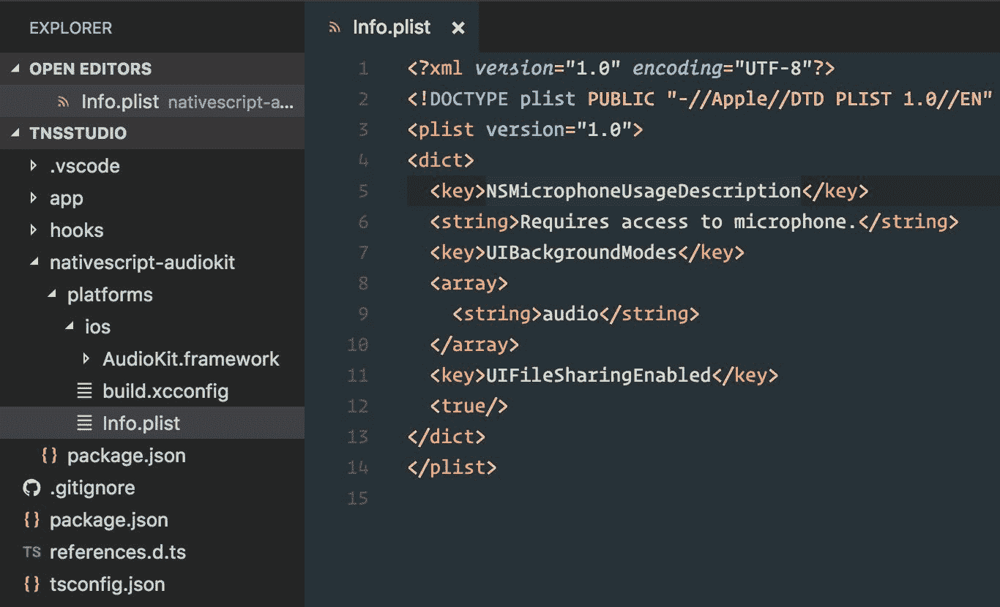
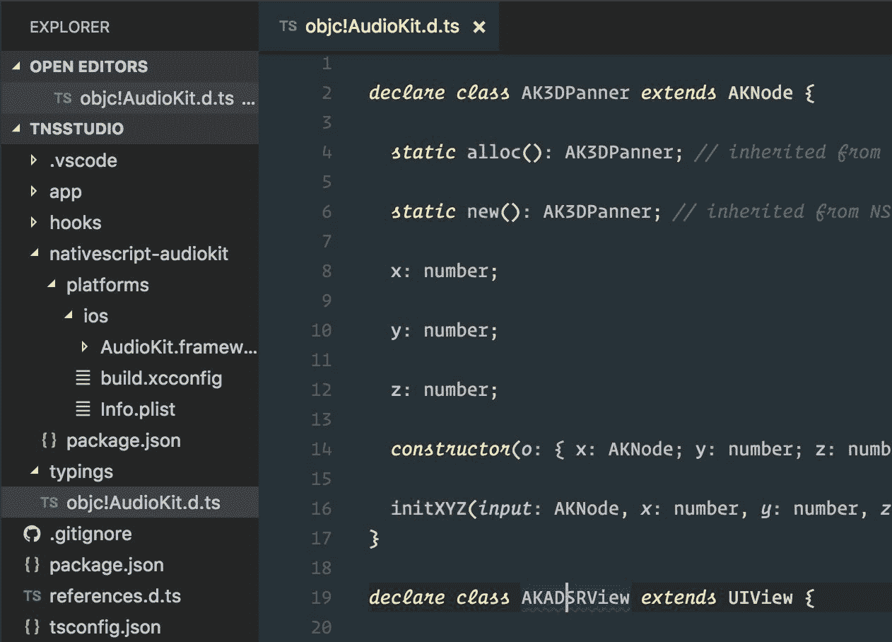
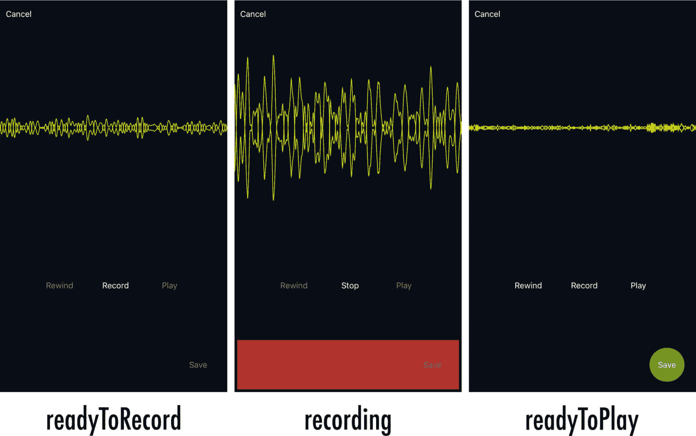
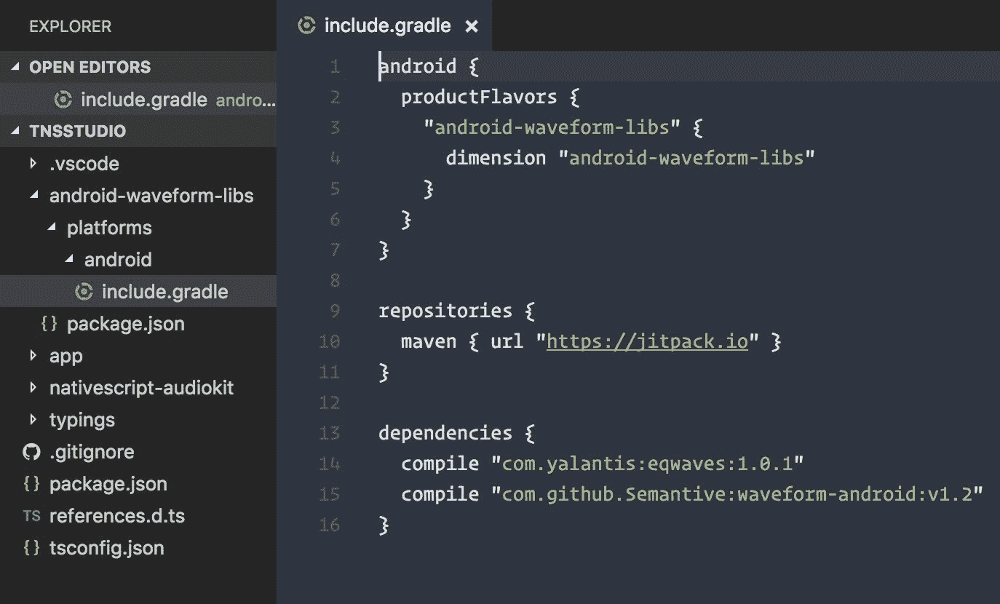
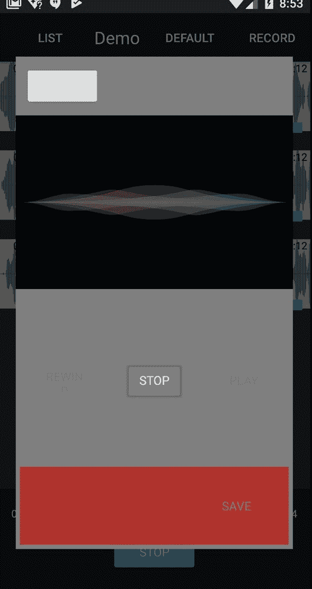
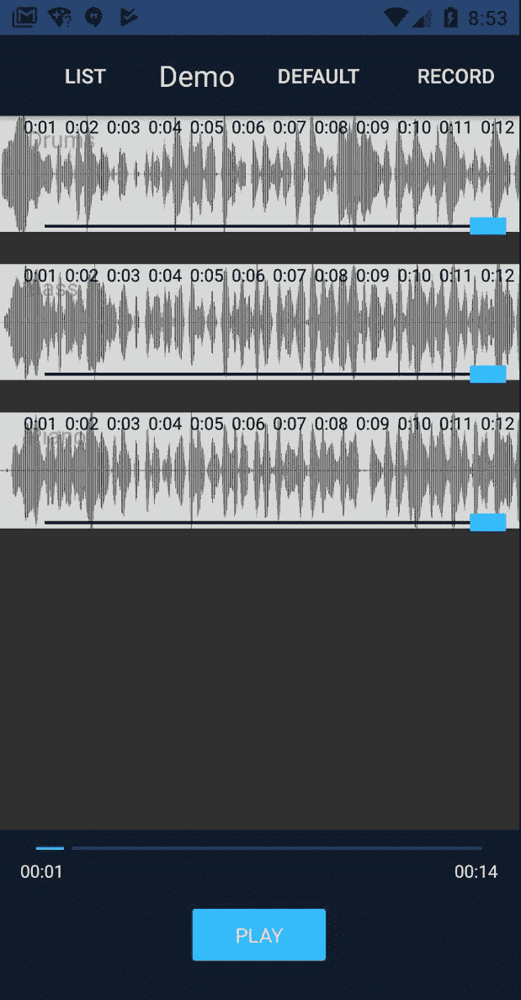

# 第八章：构建音频录音机

录制音频是我们的应用必须处理的性能最密集的操作。这也是唯一一个访问原生 API 将最有回报的功能。我们希望用户能够以移动设备可能的最低延迟录制，以实现最高保真度的声音。此外，这种录制应该可以选择地发生在现有预先录制的音轨的顶部，所有音轨都在同步播放。

由于我们的应用开发的这个阶段将深入到特定平台的原生 API，我们将把我们的实现分为两个阶段。我们将首先构建出录音功能的 iOS 特定细节，然后是 Android。

在本章中，我们将涵盖以下内容：

+   为 iOS 和 Android 构建一个功能丰富的跨平台音频录音机，具有一致的 API

+   集成 iOS 框架库，比如完全使用 Swift 构建的 AudioKit（[`audiokit.io`](http://audiokit.io)）

+   如何将 Swift/Objective C 方法转换为 NativeScript

+   基于原生 API 构建自定义可重复使用的 NativeScript 视图组件，以及如何在 Angular 中使用它们

+   配置一个可重复使用的 Angular 组件，既可以通过路由使用，也可以通过弹出式模态框打开

+   集成 Android Gradle 库

+   如何将 Java 方法转换为 NativeScript

+   使用 NativeScript 的 ListView 和多个项目模板

# 第一阶段 - 为 iOS 构建音频录音机

iOS 平台的音频功能令人印象深刻，不得不说。一群才华横溢的音频爱好者和软件工程师合作构建了一个开源框架层，位于该平台的音频堆栈之上。这个世界级的工程努力是令人敬畏的 AudioKit（[`audiokit.io/`](http://audiokit.io/)），由无畏的 Aurelius Prochazka 领导，他是音频技术的真正先驱。

AudioKit 框架完全使用 Swift 编写，这在与 NativeScript 集成时引入了一些有趣的表面层挑战。

# 挑战绕道 - 将基于 Swift 的库集成到 NativeScript 中

在撰写本文时，如果代码库通过所谓的**桥接头文件**正确地将类和类型暴露给 Objective-C，NativeScript 可以与 Swift 一起工作，从而允许两种语言混合或匹配。您可以在这里了解有关桥接头文件的更多信息：[`developer.apple.com/library/content/documentation/Swift/Conceptual/BuildingCocoaApps/MixandMatch.html`](https://developer.apple.com/library/content/documentation/Swift/Conceptual/BuildingCocoaApps/MixandMatch.html)。[](https://developer.apple.com/library/content/documentation/Swift/Conceptual/BuildingCocoaApps/MixandMatch.html) 当 Swift 代码库编译为框架时，将自动生成此桥接头文件。Swift 提供了丰富的语言功能，其中一些与 Objective C 没有直接对应关系。最新的 Swift 语言增强功能的全面支持可能最终会到 NativeScript，但是在撰写本文时，有一些需要牢记的考虑。

AudioKit 利用了 Swift 语言所提供的最佳功能，包括丰富的**枚举**功能。您可以在这里了解 Swift 语言中扩展的枚举功能：

[`developer.apple.com/library/content/documentation/Swift/Conceptual/Swift_Programming_Language/Enumerations.html`](https://developer.apple.com/library/content/documentation/Swift/Conceptual/Swift_Programming_Language/Enumerations.html)

特别是，文档中有这样的内容："*它们采用了传统上仅由类支持的许多功能，例如计算属性以提供有关枚举当前值的附加信息，以及实例方法以提供与枚举表示的值相关的功能。*”

这样的*枚举*对 Objective C 来说是陌生的，因此无法在桥接头文件中使用。在编译时生成桥接头文件时，任何使用 Swift 的奇异*枚举*的代码都将被简单地忽略，导致 Objective C 无法与代码的这些部分进行交互。这意味着您将无法在 NativeScript 中使用 Swift 代码库中的方法，该方法使用了这些增强的构造（*在撰写本文时*）。

为了解决这个问题，我们将 fork AudioKit 框架，并展平`AKAudioFile`扩展文件中使用的奇异枚举，这些文件提供了一个强大和方便的导出方法，我们将要用来保存我们录制的音频文件。我们需要修改的奇异*enum*看起来像这样（[`github.com/audiokit/AudioKit/blob/master/AudioKit/Common/Internals/Audio%20File/AKAudioFile%2BProcessingAsynchronously.swift`](https://github.com/audiokit/AudioKit/blob/master/AudioKit/Common/Internals/Audio%20File/AKAudioFile%2BProcessingAsynchronously.swift)）：

```ts
// From AudioKit's Swift 3.x codebase

public enum ExportFormat {
  case wav
  case aif
  case mp4
  case m4a
  case caf

  fileprivate var UTI: CFString {
    switch self {
    case .wav:
      return AVFileTypeWAVE as CFString
    case .aif:
      return AVFileTypeAIFF as CFString
    case .mp4:
      return AVFileTypeAppleM4A as CFString
    case .m4a:
      return AVFileTypeAppleM4A as CFString
    case .caf:
      return AVFileTypeCoreAudioFormat as CFString
    }
  }

  static var supportedFileExtensions: [String] {
    return ["wav", "aif", "mp4", "m4a", "caf"]
  }
}
```

这与您可能熟悉的任何*enum*都不同；正如您所看到的，它包括除枚举之外的属性。当这段代码被编译并生成桥接头文件以与 Objective-C 混合或匹配时，桥接头文件将排除使用此结构的任何代码。我们将将其展平，使其看起来像以下内容：

```ts
public enum ExportFormat: Int {
  case wav
  case aif
  case mp4
  case m4a
  case caf
}

static public func stringUTI(type: ExportFormat) -> CFString {
  switch type {
  case .wav:
    return AVFileTypeWAVE as CFString
  case .aif:
    return AVFileTypeAIFF as CFString
  case .mp4:
    return AVFileTypeAppleM4A as CFString
  case .m4a:
    return AVFileTypeAppleM4A as CFString
  case .caf:
    return AVFileTypeCoreAudioFormat as CFString
  }
}

static public var supportedFileExtensions: [String] {
  return ["wav", "aif", "mp4", "m4a", "caf"]
}
```

然后我们将调整`AKAudioFile`扩展的部分，以使用我们展平的属性。这将允许我们手动构建`AudioKit.framework`，我们可以在我们的应用程序中使用，暴露我们想要使用的方法：`exportAsynchronously`。

我们不会详细介绍手动构建`AudioKit.framework`的细节，因为这在这里有很好的文档记录：[`github.com/audiokit/AudioKit/blob/master/Frameworks/INSTALL.md#building-universal-frameworks-from-scratch`](https://github.com/audiokit/AudioKit/blob/master/AudioKit/Common/Internals/Audio%20File/AKAudioFile%2BProcessingAsynchronously.swift)。有了我们定制的框架，我们现在可以将其集成到我们的应用程序中。

# 将自定义构建的 iOS 框架集成到 NativeScript

现在我们可以创建一个内部插件，将这个 iOS 框架集成到我们的应用程序中。拿着我们构建的自定义`AudioKit.framework`，在我们应用程序的根目录下创建一个`nativescript-audiokit`目录。然后在里面添加一个`platforms/ios`文件夹，将框架放进去。这样就可以让 NativeScript 知道如何将这些 iOS 特定的文件构建到应用程序中。由于我们希望这个内部插件被视为任何标准的 npm 插件，我们还将在`nativescript-audiokit`文件夹内直接添加`package.json`，内容如下：

```ts
{
  "name": "nativescript-audiokit",
  "version": "1.0.0",
  "nativescript": {
    "platforms": {
      "ios": "3.0.0"
    }
  }
}
```

现在我们将使用以下命令将其添加到我们的应用程序中（NativeScript 将首先在本地查找并找到**nativescript-audiokit**插件）：

```ts
tns plugin add nativescript-audiokit
```

这将正确地将自定义构建的 iOS 框架添加到我们的应用程序中。

但是，我们还需要两个非常重要的项目：

1.  由于 AudioKit 是一个基于 Swift 的框架，我们希望确保我们的应用程序包含适当的支持 Swift 库。添加一个新文件，`nativescript-audiokit/platforms/ios/build.xcconfig`：

```ts
EMBEDDED_CONTENT_CONTAINS_SWIFT = true
```

1.  由于我们将要使用用户的麦克风，我们希望确保麦克风的使用在我们应用程序的属性列表中得到了指示。我们还将利用这个机会添加两个额外的属性设置来增强我们应用程序的能力。因此，总共我们将为以下目的添加三个属性键：

+   让设备知道我们的应用程序需要访问麦克风，并确保在第一次访问时请求用户的权限。

+   在应用程序被放入后台时继续播放音频。

+   提供在连接到计算机时能够在 iTunes 中看到应用程序的`documents`文件夹的能力。这将允许您通过应用程序的文档在 iTunes 中直接查看录制的文件。这对于集成到桌面音频编辑软件中可能会有用。

添加一个新文件，`nativescript-audiokit/platforms/ios/Info.plist`，其中包含以下代码：

```ts
<?xml version="1.0" encoding="UTF-8"?>
<!DOCTYPE plist PUBLIC "-//Apple//DTD PLIST 1.0//EN" "http://www.apple.com/DTDs/PropertyList-1.0.dtd">
<plist version="1.0">
<dict>
  <key>NSMicrophoneUsageDescription</key>
 <string>Requires access to microphone.</string>
 <key>UIBackgroundModes</key>
 <array>
 <string>audio</string>
 </array>
 <key>UIFileSharingEnabled</key> 
 <true/>
</dict>
</plist>
```

这是一个屏幕截图，更好地说明了我们应用程序中的内部插件结构：



现在，当 NativeScript 构建 iOS 应用程序时，它将确保`AudioKit.framework`被包含为一个库，并将`build.xcconfig`和`Info.plist`的内容合并到我们应用程序的配置中。每当我们对这个内部插件文件夹（`nativescript-audiokit`）中的文件进行更改时，我们希望确保我们的应用程序能够接收到这些更改。为了做到这一点，我们可以简单地删除并重新添加插件，所以现在让我们这样做：

```ts
tns plugin remove nativescript-audiokit
tns plugin add nativescript-audiokit
```

现在我们准备使用 iOS 的 AudioKit API 构建我们的音频录制器。

# 设置本地 API 类型检查并生成 AudioKit TypeScript 定义。

我们要做的第一件事是安装`tns-platform-declarations`：

```ts
npm i tns-platform-declarations --save-dev
```

现在，在项目的根目录中创建一个名为`references.d.ts`的新文件，其中包含以下内容：

```ts
/// <reference path="./node_modules/tns-platform-declarations/ios.d.ts" />
/// <reference path="./node_modules/tns-platform-declarations/android.d.ts" />
```

这为我们提供了对 iOS 和 Android API 的完整类型检查和智能感知支持。

现在我们想要为 AudioKit 框架本身生成类型定义。我们可以执行以下命令来为包含的`AudioKit.framework`生成类型定义：

```ts
TNS_TYPESCRIPT_DECLARATIONS_PATH="$(pwd)/typings" tns build ios
```

我们将环境变量`TNS_TYPESCRIPT_DECLARATIONS_PATH`设置为当前工作目录（`pwd`），并添加一个名为`typings`的文件夹前缀。当 NativeScript 创建 iOS 构建时，它还将为我们的应用程序提供的所有原生 API 以及第三方库生成类型定义文件。现在我们将在项目中看到一个`typings`文件夹，其中包含两个文件夹：`i386`和`x86_64`。一个是模拟器架构，另一个是设备。两者都将包含相同的输出，因此我们只需关注一个。打开`i386`文件夹，你会找到一个`objc!AudioKit.d.ts`文件。

我们只想使用那个文件，所以将它移动到`typings`文件夹的根目录：`typings/objc!AudioKit.d.ts`。然后我们可以删除`i386`和`x86_64`文件夹，因为我们将不再需要它们（其他 API 定义文件通过`tns-platform-declarations`提供）。我们只是生成这些类型定义文件以获得 AudioKit 库的 TypeScript 定义。这是一次性的事情，用于轻松集成这个本地库，所以您可以放心将这个自定义`typings`文件夹添加到源代码控制中。

仔细检查`tsconfig.json`，确保已启用`"skipLibCheck": true`选项。现在我们可以修改我们的`references.d.ts`文件，以包含 AudioKit 库的附加类型：

```ts
/// <reference path="./node_modules/tns-platform-declarations/ios.d.ts" />
/// <reference path="./node_modules/tns-platform-declarations/android.d.ts" />
/// <reference path="./typings/objc!AudioKit.d.ts" />
```

我们的项目结构现在应该是这样的：



# 使用 AudioKit 构建录音机

我们将首先创建一个围绕与 AudioKit 录音 API 交互的模型。你可以直接从你的 Angular 组件或服务中开始直接编写针对这些 API 的代码，但是由于我们希望在 iOS 和 Android 上提供一致的 API，因此有一种更聪明的方法来设计这个。相反，我们将抽象出一个简单的 API，可在两个平台上使用，并在底层调用正确的本地实现。

这里将会有很多与 AudioKit 相关的有趣细节，但是创建`app/modules/recorder/models/record.model.ts`并包含以下内容，我们将在稍后解释其中的一些部分：

稍后，我们将在这个模型中添加`.ios.ts`后缀，因为它将包含 iOS 特定的实现细节。然而，在第一阶段，我们将直接使用模型（省略平台后缀）来开发我们的 iOS 录音机。

```ts
import { Observable } from 'data/observable';
import { knownFolders } from 'file-system';

// all available states for the recorder 
export enum RecordState {
  readyToRecord,
  recording,
  readyToPlay,
  playing,
  saved,
  finish
}

// available events
export interface IRecordEvents {
  stateChange: string;
}

// for use when saving files
const documentsFilePath = function(filename: string) {
  return `${knownFolders.documents().path}/${filename}`;
}

export class RecordModel extends Observable {

  // available events to listen to
  private _events: IRecordEvents;

  // control nodes 
  private _mic: AKMicrophone;
  private _micBooster: AKBooster;
  private _recorder: AKNodeRecorder;

  // mixers
  private _micMixer: AKMixer;
  private _mainMixer: AKMixer;

  // state
  private _state: number = RecordState.readyToRecord;

  // the final saved path to use 
  private _savedFilePath: string;

  constructor() {
    super();
    // setup the event names
    this._setupEvents();

    // setup recording environment
    // clean any tmp files from previous recording sessions
    (<any>AVAudioFile).cleanTempDirectory();

    // audio setup 
    AKSettings.setBufferLength(BufferLength.Medium);

    try {
      // ensure audio session is PlayAndRecord
      // allows mixing with other tracks while recording
      AKSettings.setSessionWithCategoryOptionsError(
        SessionCategory.PlayAndRecord, 
        AVAudioSessionCategoryOptions.DefaultToSpeaker
      );
    } catch (err) {
      console.log('AKSettings error:', err);
    }

    // setup mic with it's own mixer
    this._mic = AKMicrophone.alloc().init();
    this._micMixer = AKMixer.alloc().init(null);
    this._micMixer.connect(this._mic);
    // Helps provide mic monitoring when headphones are plugged in
    this._micBooster = AKBooster.alloc().initGain(<any>this._micMixer, 0);

    try {
      // recorder takes the micMixer input node
      this._recorder = AKNodeRecorder.alloc()
        .initWithNodeFileError(<any>this._micMixer, null);
    } catch (err) {
      console.log('AKNodeRecorder init error:', err);
    }

    // overall main mixer uses micBooster
    this._mainMixer = AKMixer.alloc().init(null);
    this._mainMixer.connect(this._micBooster);

    // single output set to mainMixer 
    AudioKit.setOutput(<any>this._mainMixer);
    // start the engine!
    AudioKit.start();
  }

  public get events(): IRecordEvents {
    return this._events;
  }

  public get mic(): AKMicrophone {
    return this._mic;
  }

  public get recorder(): AKNodeRecorder {
    return this._recorder;
  }

  public get audioFilePath(): string {
    if (this._recorder) {
      return this._recorder.audioFile.url.absoluteString;
    }
    return '';
  }

  public get state(): number {
    return this._state;
  }

  public set state(value: number) {
    this._state = value;
    // always emit state changes
    this._emitEvent(this._events.stateChange, this._state);
  }

  public get savedFilePath() {
    return this._savedFilePath;
  }

  public set savedFilePath(value: string) {
    this._savedFilePath = value;
    if (this._savedFilePath)
      this.state = RecordState.saved;
  }

  public toggleRecord() {
    if (this._state !== RecordState.recording) {
      // just force ready to record
      // when coming from any state other than recording
      this.state = RecordState.readyToRecord;

      if (this._recorder) {
        try {
          // resetting (clear previous recordings)
          this._recorder.resetAndReturnError();
        } catch (err) {
          console.log('Recorder reset error:', err);
        }
      }
    }

    switch (this._state) {
      case RecordState.readyToRecord:
        if (AKSettings.headPhonesPlugged) {
          // Microphone monitoring when headphones plugged
          this._micBooster.gain = 1;
        }

        try {
          this._recorder.recordAndReturnError();
          this.state = RecordState.recording;
        } catch (err) {
          console.log('Recording failed:', err);
        }
        break;
      case RecordState.recording:
        this.state = RecordState.readyToPlay;
        this._recorder.stop();
        // Microphone monitoring muted when playing back
        this._micBooster.gain = 0;
        break;
    }
  } 

  public togglePlay() {
    if (this._state === RecordState.readyToPlay) {
      this.state = RecordState.playing;
    } else {
      this.stopPlayback();
    }
  }

  public stopPlayback() {
    if (this.state !== RecordState.recording) {
      this.state = RecordState.readyToPlay;
    }
  }

  public save() {
    let fileName = `recording-${Date.now()}.m4a`;
    this._recorder.audioFile
    .exportAsynchronouslyWithNameBaseDirExportFormatFromSampleToSampleCallback(
      fileName, BaseDirectory.Documents, ExportFormat.M4a, null, null, 
      (af: AKAudioFile, err: NSError) => {
        this.savedFilePath = documentsFilePath(fileName);
      });
  }

  public finish() {
    this.state = RecordState.finish;
  }

  private _emitEvent(eventName: string, data?: any) {
    let event = {
      eventName,
      data,
      object: this
    };
    this.notify(event);
  }

  private _setupEvents() {
    this._events = {
      stateChange: 'stateChange'
    };
  }
}
```

`RecordModel`将表现得有点像一个状态机，它可能处于以下状态之一：

+   `readyToRecord`：默认的起始状态。必须处于此状态才能进入录音状态。

+   `recording`：工作室安静！录音进行中。

+   `readyToPlay`：用户已停止录音，现在有一个录制文件可以与混音一起播放。

+   `playing`：用户正在用混音回放录制的文件。

+   `saved`：用户选择保存录音，这应该启动保存新轨道与活动组合的操作。

+   `finish`：一旦保存操作完成，记录器应该关闭。

然后，我们使用`IRecordEvents`定义记录器将提供的事件的形状。在这种情况下，我们将有一个单一的事件`stateChange`，当状态改变时（*参见状态设置器*）将通知任何监听器。我们的模型将扩展 NativeScript 的`Observable`类（因此，`RecordModel extends Observable`），这将为我们提供通知 API 来分发我们的事件。

然后，我们设置了对我们将使用的各种 AudioKit 部分的几个引用。大部分设计直接来自于 AudioKit 的录音示例：[`github.com/audiokit/AudioKit/blob/master/Examples/iOS/RecorderDemo/RecorderDemo/ViewController.swift`](https://github.com/audiokit/AudioKit/blob/master/Examples/iOS/RecorderDemo/RecorderDemo/ViewController.swift)。我们甚至使用相同的状态枚举设置（带有一些额外的内容）。在他们的示例中，AudioKit 的`AKAudioPlayer`用于播放；但是，根据我们的设计，我们将加载我们的录制文件到我们的多轨播放器设计中，以便用我们的混音回放它们。我们可以在 iOS 的`TrackPlayerModel`中使用`AKAudioPlayer`；但是，`TNSPlayer`（来自**nativescript-audio**插件）是跨平台兼容的，也可以正常工作。我们将很快介绍如何将这些新录制的文件加载到我们的设计中的细节，但是通知记录器状态的监听器将为我们提供处理所有这些的灵活性。

你可能会想为什么我们要进行类型转换：

```ts
(<any>AVAudioFile).cleanTempDirectory();
```

好问题。AudioKit 提供了对 Core Foundation 类的扩展，比如`AVAudioFile`。在 Objective C 中，这些被称为`Categories`：[`developer.apple.com/library/content/documentation/General/Conceptual/DevPedia-CocoaCore/Category.html`](https://developer.apple.com/library/content/documentation/General/Conceptual/DevPedia-CocoaCore/Category.html)；然而，在 Swift 中，它们被称为`Extensions`：[`developer.apple.com/library/content/documentation/Swift/Conceptual/Swift_Programming_Language/Extensions.html`](https://developer.apple.com/library/content/documentation/Swift/Conceptual/Swift_Programming_Language/Extensions.html)。

如果你还记得，我们为 AudioKit 生成了 TypeScript 定义；但是，我们只保留了`objc!AudioKit.d.ts`文件来引用。如果我们查看了 foundation 的定义，就会看到对`AVAudioFile`的扩展。然而，由于我们没有保留这些定义，而是依赖于默认的`tns-platform-declarations`定义，这个`Extension`对我们的 TypeScript 编译器来说是未知的，所以我们只是简单地进行类型转换，因为我们知道 AudioKit 提供了这个功能。

`RecordModel`设置音频会话为`PlayAndRecord`也很关键，这样我们就可以在播放混音的同时录制了：

```ts
AKSettings.setSessionWithCategoryOptionsError(
  SessionCategory.PlayAndRecord, 
  AVAudioSessionCategoryOptions.DefaultToSpeaker
);
```

你可能还想知道为什么有些类使用`init()`而其他类使用`init(null)`：

```ts
this._mic = AKMicrophone.alloc().init();
this._micMixer = AKMixer.alloc().init(null);
this._micMixer.connect(this._mic);
```

AudioKit 类的一些初始化器接受一个可选参数，例如，`AKMixer`接受一个可选的`NSArray`，用于连接`AVAudioNode`。然而，我们的 TypeScript 定义将其定义为必需的，所以我们只是将`null`传递给该参数，并直接使用`connect`节点 API。

# 如何将 Swift/ObjC 方法转换为 NativeScript

从`RecordModel`中可能引起兴趣的最后一点可能是`save`方法，它将把我们的录音从应用的`tmp`目录导出到应用的`documents`文件夹，并将其转换为更小的`.m4a`音频格式：

```ts
this._recorder.audioFile
  .exportAsynchronouslyWithNameBaseDirExportFormatFromSampleToSampleCallback(
    fileName, BaseDirectory.Documents, ExportFormat.M4a, null, null, 
    (af: AKAudioFile, err: NSError) => {
      this.savedFilePath = documentsFilePath(fileName);
  });
```

方法名很长，对吧？是的，确实；一些 Swift/ObjC 参数化方法名会变得非常长。在 Swift 中，特定的方法定义如下：

```ts
exportAsynchronously(name:baseDir:exportFormat:fromSample:toSample:callback:)
// converted to NativeScript:
exportAsynchronouslyWithNameBaseDirExportFormatFromSampleToSampleCallback
```

由于我们已经为 AudioKit 生成了 TypeScript 定义，它们在这里帮了我们。然而，有时候你没有这种奢侈。一个具有各种参数的 Swift/ObjC 方法会在方法名称的开头和参数参数名称的开头之间添加`With`，在折叠时将第一个字符大写。

# 为本机音频波形显示构建自定义可重用的 NativeScript 视图

我们将创建一个自定义的 NativeScript 视图组件，而不是为我们的波形显示创建一个 Angular 组件，该组件可以利用本机 API，然后我们可以在 Angular 中注册以在我们的组件中使用。这样做的原因是由于 NativeScript 强大的`view`基类，我们可以扩展它，它在使用底层本机 API 时提供了一个很好的 API。这个波形显示将与我们刚刚创建的`RecordModel`一起工作，以实现设备麦克风的实时波形反馈显示。将这个波形显示作为我们主要组合视图的备用视图，作为静态音频文件波形渲染在我们的轨道列表上重复使用也是很棒的。AudioKit 提供了执行所有这些操作的类和 API。

由于我们希望能够在应用程序的任何地方使用它，我们将在共享模块目录中创建它；然而，请记住它可以存在于任何地方。这里并不那么重要，因为这不是一个需要在`NgModule`中声明的 Angular 组件。此外，由于这将专门与本机 API 一起工作，让我们将其创建在一个新的`native`文件夹中，以潜在地容纳其他特定于 NativeScript 的视图组件。

创建`app/modules/shared/native/waveform.ts`，其中包含以下内容，我们将在稍后解释：

```ts
import { View, Property } from 'ui/core/view';
import { Color } from 'color';

// Support live microphone display as well as static audio file renders
type WaveformType = 'mic' | 'file';

// define properties
export const plotColorProperty = new Property<Waveform, string>({ name: 'plotColor' });
export const plotTypeProperty = new Property<Waveform, string>({ name: 'plotType' });
export const fillProperty = new Property<Waveform, string>({ name: 'fill' });
export const mirrorProperty = new Property<Waveform, string>({ name: 'mirror' });

export interface IWaveformModel {
  readonly target: any;
  dispose(): void;
}
export class Waveform extends View {
  private _model: IWaveformModel;
  private _type: WaveformType;

  public set type(value: WaveformType) {
    this._type = value;
  }

  public get type() {
    return this._type;
  }

  public set model(value: IWaveformModel) {
    this._model = value;
  }

  public get model() {
    return this._model;
  }

  createNativeView() {
    switch (this.type) {
      case 'mic':
        this.nativeView = AKNodeOutputPlot.alloc()
          .initFrameBufferSize(this._model.target, CGRectMake(0, 0, 0, 0), 1024);
        break;
      case 'file':
        this.nativeView = EZAudioPlot.alloc().init();
        break;
    }
    return this.nativeView;
  }

  initNativeView() {
    if (this._type === 'file') {
      // init file with the model's target
      // target should be absolute url to path of file
      let file = EZAudioFile.alloc()
        .initWithURL(NSURL.fileURLWithPath(this._model.target));
      // render the file's data as a waveform
      let data = file.getWaveformData();
      (<EZAudioPlot>this.nativeView)
        .updateBufferWithBufferSize(data.buffers[0], data.bufferSize);
    }
  }

  disposeNativeView() {
    if (this.model && this.model.dispose) this.model.dispose();
  }

  plotColorProperty.setNative {
    this.nativeView.color = new Color(value).ios;
  }

  fillProperty.setNative {
    this.nativeView.shouldFill = value === 'true';
  }

  mirrorProperty.setNative {
    this.nativeView.shouldMirror = value === 'true';
  }

  plotTypeProperty.setNative {
    switch (value) {
      case 'buffer':
        this.nativeView.plotType = EZPlotType.Buffer;
        break;
      case 'rolling':
        this.nativeView.plotType = EZPlotType.Rolling;
        break;
    }
  }
}

// register properties with it's type
plotColorProperty.register(Waveform);
plotTypeProperty.register(Waveform);
fillProperty.register(Waveform);
mirrorProperty.register(Waveform);
```

我们正在使用 NativeScript 的`Property`类创建几个属性，这将在通过视图绑定属性公开本机视图属性时提供很大的便利。使用`Property`类定义这些属性的一个便利之处在于，这些 setter 只有在`nativeView`被定义时才会被调用，避免了双重调用属性 setter（一个是通过纯 JS 属性 setter，这是另一种选择，可能还有一个是在底层`nativeView`准备就绪时）。

当想要公开可以通过自定义组件绑定的本机视图属性时，为它们定义几个`Property`类，引用您想要用于视图绑定的名称。

```ts
// define properties
export const plotColorProperty = new Property<Waveform, string>({ name: 'plotColor' });
export const plotTypeProperty = new Property<Waveform, string>({ name: 'plotType' });
export const fillProperty = new Property<Waveform, string>({ name: 'fill' });
export const mirrorProperty = new Property<Waveform, string>({ name: 'mirror' });
```

通过设置这些`Property`实例，我们现在可以在我们的视图组件类中执行以下操作：

```ts
plotColorProperty.setNative {
  this.nativeView.color = new Color(value).ios;
}
```

这将只在`nativeView`准备就绪时调用一次，这正是我们想要的。您可以在核心团队成员 Alex Vakrilov 撰写的这篇草案中阅读更多关于这种特定语法和符号的信息：

[`gist.github.com/vakrilov/ca888a1ea410f4ea7a4c7b2035e06b07#registering-the-property`](https://gist.github.com/vakrilov/ca888a1ea410f4ea7a4c7b2035e06b07#registering-the-property)。

然后，在我们的类底部（在定义之后），我们使用`Property`实例注册类：

```ts
// register properties
plotColorProperty.register(Waveform);
plotTypeProperty.register(Waveform);
fillProperty.register(Waveform);
mirrorProperty.register(Waveform);
```

好的，解释到这里，让我们看看这个实现的其他元素。

我们还在这里引入了一个有用的接口，我们将很快应用于`RecordModel`：

```ts
export interface IWaveformModel {
  readonly target: any;
  dispose(): void;
}
```

这将有助于为其他模型定义一个形状，以确保它们符合 Waveform 显示所期望的 API：

+   `target`：定义要与本地类一起使用的关键输入。

+   `dispose（）`：每个模型应提供此方法来处理视图销毁时的任何清理工作。

这是自定义的 NativeScript 3.x 视图生命周期调用执行顺序：

1.  创建本地视图（）：AnyNativeView; // 创建您的本地视图。

1.  `initNativeView（）`：`void;` // 初始化您的本地视图。

1.  `disposeNativeView（）`：`void;` // 清理您的本地视图。

从 NativeScript 的`View`类中覆盖的`createNativeView`方法可能是最有趣的：

```ts
createNativeView() {
  switch (this.type) {
    case 'mic':
      this.nativeView = AKNodeOutputPlot.alloc()
        .initFrameBufferSize(this._model.target, CGRectMake(0, 0, 0, 0), 1024);
      break;
    case 'file':
      this.nativeView = EZAudioPlot.alloc().init();
      break;
  }
  return this.nativeView;
}
```

在这里，我们允许`type`属性确定应该呈现哪种类型的波形显示。

在`mic`的情况下，我们利用 AudioKit 的`AKNodeOutputPlot`（实际上在底层扩展了`EZAudioPlot`）来使用我们模型的目标初始化波形（即`audioplot`），这将最终成为我们的 RecordModel 的麦克风。

在`file`的情况下，我们直接利用 AudioKit 的`EZAudioPlot`来创建表示音频文件的静态波形。

`initNativeView` 方法，也是从 NativeScript 的 `View` 类中重写而来，是在其生命周期中第二次被调用的，它提供了一种初始化原生视图的方式。你可能会发现有趣的是，我们在这里再次调用了 setters。当组件绑定通过 XML 设置并且类实例化时，setters 首先被调用，这是在 `createNativeView` 和 `initNativeView` 被调用之前。这就是为什么我们在私有引用中缓存这些值。然而，我们也希望这些 setters 在 Angular 视图绑定中修改 `nativeView`（在动态改变时），这就是为什么我们在 setters 中也有 `if (this.nativeView)` 来在可用时动态改变 `nativeView`。

`disposeNativeView` 方法（你猜对了，也是从 `View` 类的 `{N}` 中重写而来）在 `View` 被销毁时被调用，这是我们调用模型的 `dispose` 方法的地方（如果可用）。

# 将自定义的 NativeScript 视图集成到我们的 Angular 应用中

要在 Angular 中使用我们的 NativeScript 波形视图，我们首先需要注册它。你可以在根模块、根应用组件或者在启动时初始化的其他地方进行注册（通常不是在懒加载的模块中）。为了整洁，我们将在相同目录下的 `SharedModule` 中注册它，所以在 `app/modules/shared/shared.module.ts` 中添加以下内容：

```ts
...
// register nativescript custom components
import { registerElement } from 'nativescript-angular/element-registry';
import { Waveform } from './native/waveform';
registerElement('Waveform', () => Waveform);
...
@NgModule({...
export class SharedModule {...
```

`registerElement` 方法允许我们在 Angular 组件中定义要使用的组件的名称作为第一个参数，并且采用一个解析器函数，该函数应该返回要用于它的 NativeScript `View` 类。

现在让我们使用我们的新的 `IWaveformModel`，并清理一些 `RecordModel` 来使用它，同时准备创建我们的 Android 实现。让我们将一些 `RecordModel` 中的东西重构到一个公共文件中，以便在我们的 iOS 和 Android（即将推出！）模型之间共享代码。

创建 `app/modules/recorder/models/record-common.ts`：

```ts
import { IWaveformModel } from '../../shared/native/waveform';
import { knownFolders } from 'file-system';

export enum RecordState {
  readyToRecord,
  recording,
  readyToPlay,
  playing,
  saved,
  finish
}

export interface IRecordEvents {
  stateChange: string;
}

export interface IRecordModel extends IWaveformModel {
  readonly events: IRecordEvents;
  readonly recorder: any;
  readonly audioFilePath: string;
  state: number; 
  savedFilePath: string;
  toggleRecord(): void;
  togglePlay(startTime?: number, when?: number): void;
  stopPlayback(): void;
  save(): void;
  finish(): void;
}

export const documentsFilePath = function(filename: string) {
  return `${knownFolders.documents().path}/${filename}`;
}
```

这包含了大部分 `RecordModel` 顶部的内容，还增加了 `IRecordModel` 接口，它扩展了 `IWaveformModel`。由于我们已经构建了我们的 iOS 实现，现在我们有了一个我们希望我们的 Android 实现遵循的模型形状。将该形状抽象成一个接口将为我们提供一个清晰的路径，当我们转向 Android 时，我们可以遵循这个路径。

为了方便起见，让我们还为我们的模型创建一个索引，这也会在 `app/modules/recorder/models/index.ts` 中公开这个公共文件：

```ts
export * from './record-common.model';
export * from './record.model';
```

现在我们可以修改`RecordModel`来导入这些常见项，并实现这个新的`IRecordModel`接口。由于这个新接口还*扩展*了`IWaveformModel`，它会立即告诉我们需要实现`readonly target`getter 和`dispose()`方法，以便与我们的 Waveform 视图一起使用：

```ts
import { Observable } from 'data/observable';
import { IRecordModel, IRecordEvents, RecordState, documentsFilePath } from './common';

export class RecordModel extends Observable implements IRecordModel {
  ...
  public get target() {
 return this._mic;
 }

  public dispose() {
 AudioKit.stop();
 // cleanup
 this._mainMixer = null;
 this._recorder = null;
 this._micBooster = null;
 this._micMixer = null;
 this._mic = null;
 // clean out tmp files
 (<any>AVAudioFile).cleanTempDirectory();
 }
  ...
```

`RecordModel`的`target`将是 Waveform 视图将使用的麦克风。我们的`dispose`方法将在清理引用的同时停止 AudioKit 引擎，同时确保清除录制过程中创建的任何临时文件。

# 创建录音机视图布局

当用户点击应用程序右上角的“录制”时，它会提示用户进行身份验证，之后应用程序会路由到录制视图。此外，很好地重用这个录制视图作为模态弹出窗口显示，以便在录制时用户不会感觉离开作品。但是，当作品是新的时，通过路由导航到录制视图是可以的。我们将展示如何做到这一点，但首先让我们使用新的时髦 Waveform 视图和我们强大的新`RecordModel`来设置我们的布局。

将以下内容添加到`app/modules/recorder/components/record.component.html`中：

```ts
<ActionBar title="Record" icon="" class="action-bar">
  <NavigationButton visibility="collapsed"></NavigationButton>
  <ActionItem text="Cancel" 
    ios.systemIcon="1" android.systemIcon="ic_menu_back" 
    (tap)="cancel()"></ActionItem>
</ActionBar>
<FlexboxLayout class="record">
  <GridLayout rows="auto" columns="auto,*,auto" class="p-10" *ngIf="isModal">
    <Button text="Cancel" (tap)="cancel()" 
      row="0" col="0" class="c-white"></Button>
  </GridLayout>
  <Waveform class="waveform" 
    [model]="recorderService.model" 
    type="mic" 
    plotColor="yellow" 
    fill="false" 
    mirror="true" 
    plotType="buffer">
  </Waveform>
  <StackLayout class="p-5">
    <FlexboxLayout class="controls">
      <Button text="Rewind" class="btn text-center" 
        (tap)="recorderService.rewind()" 
        [isEnabled]="state == recordState.readyToPlay || state == recordState.playing">
      </Button>
      <Button [text]="recordBtn" class="btn text-center" 
        (tap)="recorderService.toggleRecord()" 
        [isEnabled]="state != recordState.playing"></Button>
      <Button [text]="playBtn" class="btn text-center" 
        (tap)="recorderService.togglePlay()" 
        [isEnabled]="state == recordState.readyToPlay || state == recordState.playing">
      </Button>
    </FlexboxLayout>
    <FlexboxLayout class="controls bottom" 
      [class.recording]="state == recordState.recording">
      <Button text="Save" class="btn" 
        [class.save-ready]="state == recordState.readyToPlay" 
        [isEnabled]="state == recordState.readyToPlay"
        (tap)="recorderService.save()"></Button>
    </FlexboxLayout>
  </StackLayout>
</FlexboxLayout>
```

我们使用`FlexboxLayout`，因为我们希望我们的 Waveform 视图能够延伸到覆盖整个可用垂直空间，只留下底部定位的录音机控件。`FlexboxLayout`是一个非常多才多艺的布局容器，它提供了大部分在 Web 上使用的 flexbox 模型中找到的相同的 CSS 样式属性。

有趣的是，我们只在显示为模态框时在`GridLayout`容器内显示取消按钮，因为我们需要一种关闭模态框的方式。当通过模态框打开视图时，操作栏将被忽略和不显示。

当通过模态框打开视图时，操作栏将被忽略，因此在模态框中不显示。`ActionBar`仅在导航视图上显示。

此外，我们的`ActionBar`设置在这里相当有趣，也是 NativeScript 视图布局中 iOS 和 Android 差异最大的领域之一。在 iOS 上，`NavigationButton`具有默认行为，会自动从堆栈中弹出视图，并动画返回到上一个视图。此外，在 iOS 上，对`NavigationButton`的任何点击事件都会被完全忽略，而在 Android 上，点击事件会在`NavigationButton`上触发。由于这个关键的差异，我们希望完全忽略`ActionBar`的`NavigationButton`，通过使用`visibility="collapsed"`来确保它永远不会显示。相反，我们使用`ActionItem`来确保在两个平台上都触发正确的逻辑。

iOS 和 Android 上的`NavigationButton`行为不同：

+   **iOS**：`NavigationButton`会忽略（点击）事件，并且该按钮在导航到视图时会默认出现。

+   **Android**：`NavigationButton`（点击）事件会被触发。

您可以在这里看到我们使用的波形图（自定义 NativeScript）视图。我们在绑定模型时使用 Angular 的绑定语法，因为它是一个对象。对于其他属性，我们直接指定它们的值，因为它们是原始值。然而，如果我们想通过用户交互动态地改变这些值，我们也可以在这些属性上使用 Angular 的绑定语法。例如，我们可以显示一个有趣的颜色选择器，允许用户实时更改波形图的颜色（`plotColor`）。

我们将为我们的记录组件提供一个特定于组件的样式表，`app/modules/recorder/components/record.component.css`：

```ts
.record {
  background-color: rgba(0,0,0,.5);
  flex-direction: column;
  justify-content: space-around;
  align-items: stretch;
  align-content: center;
}

.record .waveform {
  background-color: transparent;
  order: 1;
  flex-grow: 1;
}

.controls {
  width: 100%;
  height: 200;
  flex-direction: row;
  flex-wrap: nowrap;
  justify-content: center;
  align-items: center;
  align-content: center;
}

.controls.bottom {
  height: 90;
  justify-content: flex-end;
}

.controls.bottom.recording {
  background-color: #B0342D;
}

.controls.bottom .btn {
  border-radius: 40;
  height: 62;
  padding: 2;
}

.controls.bottom .btn.save-ready {
  background-color: #42B03D;
}

.controls .btn {
  color: #fff;
}

.controls .btn[isEnabled=false] {
  background-color: transparent;
  color: #777;
}
```

如果你在网页上使用了 flexbox 模型，那么其中一些 CSS 属性可能会看起来很熟悉。了解更多关于 flexbox 样式的有趣资源是 Dave Geddes 的 Flexbox Zombies：[`flexboxzombies.com`](http://flexboxzombies.com)。

到目前为止，我们的 CSS 开始增长，我们可以用 SASS 清理很多东西。我们很快就会这样做，所以请耐心等待！

现在，让我们来看看`app/modules/recorder/components/record.component.ts`中的组件：

```ts
// angular
import { Component, OnInit, OnDestroy, Optional } from '@angular/core';

// libs
import { Subscription } from 'rxjs/Subscription';

// nativescript
import { RouterExtensions } from 'nativescript-angular/router';
import { ModalDialogParams } from 'nativescript-angular/directives/dialogs';
import { isIOS } from 'platform';

// app
import { RecordModel, RecordState } from '../models';
import { RecorderService } from '../services/recorder.service';

@Component({
  moduleId: module.id,
  selector: 'record',
  templateUrl: 'record.component.html',
  styleUrls: ['record.component.css']
})
export class RecordComponent implements OnInit, OnDestroy { 
  public isModal: boolean;
  public recordBtn: string = 'Record';
  public playBtn: string = 'Play';
  public state: number;
  public recordState: any = {};

  private _sub: Subscription;

  constructor(
    private router: RouterExtensions,
    @Optional() private params: ModalDialogParams,
    public recorderService: RecorderService
  ) { 
    // prepare service for brand new recording
    recorderService.setupNewRecording();

    // use RecordState enum names as reference in view
    for (let val in RecordState ) {
      if (isNaN(parseInt(val))) {
        this.recordState[val] = RecordState[val];
      }
    }
  }

  ngOnInit() {
    if (this.params && this.params.context.isModal) {
      this.isModal = true;
    }
    this._sub = this.recorderService.state$.subscribe((state: number) => {
      this.state = state;
      switch (state) {
        case RecordState.readyToRecord:
        case RecordState.readyToPlay:
          this._resetState();
          break;
        case RecordState.playing:
          this.playBtn = 'Pause';
          break;
        case RecordState.recording:
          this.recordBtn = 'Stop';
          break;
        case RecordState.finish:
          this._cleanup();
          break;
      }
    });
  }

  ngOnDestroy() {
    if (this._sub) this._sub.unsubscribe();
  }

  public cancel() {
    this._cleanup();
  }

  private _cleanup() {
    this.recorderService.cleanup();
    invokeOnRunLoop(() => {
      if (this.isModal) {
        this._close();
      } else {
        this._back();
      }
    });
  }

  private _close() {
    this.params.closeCallback();
  }

  private _back() {
    this.router.back();
  }

  private _resetState() {
    this.recordBtn = 'Record';
    this.playBtn = 'Play';
  }
}

/**
 * Needed on iOS to prevent this potential exception:
 * "This application is modifying the autolayout engine from a background thread after the engine was accessed from the main thread. This can lead to engine corruption and weird crashes."
 */
const invokeOnRunLoop = (function () {
  if (isIOS) {
    var runloop = CFRunLoopGetMain();
    return function(func) {
      CFRunLoopPerformBlock(runloop, kCFRunLoopDefaultMode, func);
      CFRunLoopWakeUp(runloop);
    }
  } else {
    return function (func) {
      func();
    }
  }
}());
```

从该文件底部开始，你可能会想知道`invokeOnRunLoop`到底是什么。这是一种方便的方法，可以确保在线程可能出现的情况下保持线程安全。在这种情况下，AudioKit 的引擎是从 UI 线程在`RecordModel`中启动的，因为 NativeScript 在 UI 线程上调用本机调用。然而，当我们的记录视图关闭时（无论是从模态还是返回导航），会调用一些后台线程。用`invokeOnRunLoop`包装我们关闭这个视图的处理有助于解决这个瞬态异常。这就是如何在 NativeScript 中使用 iOS `dispatch_async(dispatch_get_main_queue(…))`的答案。

在文件中向上工作，我们会遇到`this.recorderService.state$.subscribe((state: number) => …`。一会儿，我们将实现一种观察录音`state$`作为可观察对象的方法，这样我们的视图就可以简单地对其状态变化做出反应。

还值得注意的是，将`RecordState enum`折叠成我们可以用作视图绑定的属性，以便与当前状态进行比较（`this.state = state;`）。

当组件被构建时，`recorderService.setupNewRecording()`将为每次出现该视图准备好全新的录音。

最后，注意注入`@Optional()private params: ModalDialogParams`。之前，我们提到*在模态弹出中重用这个记录视图会很好*。有趣的是，`ModalDialogParams`只在组件以模态方式打开时才提供。换句话说，Angular 的依赖注入在默认情况下对`ModalDialogParams`服务一无所知，除非组件是通过 NativeScript 的`ModalService`明确打开的，因此这将破坏我们最初设置的路由到该组件的能力，因为 Angular 的 DI 将无法识别这样的提供者。为了让该组件继续作为路由组件工作，我们只需将该参数标记为`@Optional()`，这样当不可用时它的值将被设置为 null，而不是抛出依赖注入错误。

这将允许我们的组件被路由到，并且以模态方式打开！重复使用正酣！

为了有条件地通过路由导航到该组件，或者以模态方式打开它，我们可以做一些小的调整，牢记`RecorderModule`是延迟加载的，所以我们希望在打开模态之前懒加载该模块。

打开`app/modules/mixer/components/action-bar/action-bar.component.ts`并进行以下修改：

```ts
// angular
import { Component, Input, Output, EventEmitter } from '@angular/core';

// nativescript
import { RouterExtensions } from 'nativescript-angular/router'; 

import { PlayerService } from '../../../player/services/player.service';

@Component({
  moduleId: module.id,
  selector: 'action-bar',
  templateUrl: 'action-bar.component.html'
})
export class ActionBarComponent {
  ...
  @Output() showRecordModal: EventEmitter<any> = new EventEmitter();
  ...
  constructor(
    private router: RouterExtensions,
 private playerService: PlayerService
  ) { }

  public record() {
 if (this.playerService.composition && 
 this.playerService.composition.tracks.length) {
      // display recording UI as modal
 this.showRecordModal.next();
 } else {
      // navigate to it
 this.router.navigate(['/record']);
 }
 }
}
```

在这里，我们使用`EventEmitter`有条件地发出事件，如果组合包含轨道，则使用组件`Output`装饰器；否则，我们导航到录制视图。然后我们调整视图模板中的`Button`以使用该方法：

```ts
<ActionItem (tap)="record()" ios.position="right">
  <Button text="Record" class="action-item"></Button>
</ActionItem>
```

现在，我们可以修改`app/modules/mixer/components/mixer.component.html`，通过其名称使用`Output`作为普通事件：

```ts
<action-bar [title]="composition.name" (showRecordModal)="showRecordModal()"></action-bar>
<GridLayout rows="*, auto" columns="*" class="page">
  <track-list [tracks]="composition.tracks" row="0" col="0"></track-list>
  <player-controls [composition]="composition" row="1" col="0"></player-controls>
</GridLayout>
```

现在是有趣的部分。由于我们希望能够在模态框中打开任何组件，无论它是懒加载模块的一部分还是其他情况，让我们向`DialogService`添加一个新的方法，可以在任何地方使用。

对`app/modules/core/services/dialog.service.ts`进行以下更改：

```ts
// angular
import { Injectable, NgModuleFactory, NgModuleFactoryLoader, ViewContainerRef, NgModuleRef } from '@angular/core';

// nativescript
import * as dialogs from 'ui/dialogs';
import { ModalDialogService } from 'nativescript-angular/directives/dialogs';

@Injectable()
export class DialogService {

  constructor(
 private moduleLoader: NgModuleFactoryLoader,
 private modalService: ModalDialogService
 ) { }

  public openModal(componentType: any, vcRef: ViewContainerRef, context?: any, modulePath?: string): Promise<any> {
 return new Promise((resolve, reject) => {

 const launchModal = (moduleRef?: NgModuleRef<any>) => {
 this.modalService.showModal(componentType, {
 moduleRef,
 viewContainerRef: vcRef,
 context
 }).then(resolve, reject);
 };

      if (modulePath) {
        // lazy load module which contains component to open in modal
        this.moduleLoader.load(modulePath)
 .then((module: NgModuleFactory<any>) => {
 launchModal(module.create(vcRef.parentInjector));
 });
 } else {
        // open component in modal known to be available without lazy loading
        launchModal();
 }
 });
 }
  ...
}
```

在这里，我们注入`ModalDialogService`和`NgModuleFactoryLoader`（实际上是`NSModuleFactoryLoader`，因为如果你还记得，我们在第五章中提供了*路由和懒加载*）以按需加载任何模块以在模态框中打开一个组件（在该懒加载模块中声明）。*它也适用于不需要懒加载的组件*。换句话说，它将按需加载任何模块（如果提供了路径），然后使用其`NgModuleFactory`来获取模块引用，我们可以将其作为选项（通过`moduleRef`键）传递给`this.modalService.showModal`以打开在该懒加载模块中声明的组件。

这将在以后再次派上用场；然而，让我们通过对`app/modules/mixer/components/mixer.component.ts`进行以下更改来立即使用它：

```ts
// angular
import { Component, OnInit, OnDestroy, ViewContainerRef } from '@angular/core';
import { ActivatedRoute } from '@angular/router';
import { Subscription } from 'rxjs/Subscription';

// app
import { DialogService } from '../../core/services/dialog.service';
import { MixerService } from '../services/mixer.service';
import { CompositionModel } from '../../shared/models';
import { RecordComponent } from '../../recorder/components/record.component';

@Component({
 moduleId: module.id,
 selector: 'mixer',
 templateUrl: 'mixer.component.html'
})
export class MixerComponent implements OnInit, OnDestroy {

  public composition: CompositionModel;
  private _sub: Subscription;

  constructor(
    private route: ActivatedRoute,
    private mixerService: MixerService,
    private dialogService: DialogService,
 private vcRef: ViewContainerRef
  ) { }

  public showRecordModal() {
 this.dialogService.openModal(
      RecordComponent,
      this.vcRef,
      { isModal: true },
      './modules/recorder/recorder.module#RecorderModule'
    );
 }
  ...
}
```

这将懒加载`RecorderModule`，然后在弹出模态框中打开`RecordComponent`。酷！

# 使用 RecorderService 完成实现

现在，让我们在`app/modules/recorder/services/recorder.service.ts`中完成对`RecorderService`的实现：

```ts
// angular
import { Injectable } from '@angular/core';
import { Subject } from 'rxjs/Subject';
import { Subscription } from 'rxjs/Subscription';

// app
import { DialogService } from '../../core/services/dialog.service';
import { RecordModel, RecordState } from '../models';
import { PlayerService } from '../../player/services/player.service';
import { TrackModel } from '../../shared/models/track.model';

@Injectable()
export class RecorderService {
  public state$: Subject<number> = new Subject();
  public model: RecordModel;
  private _trackId: number;
  private _sub: Subscription;

  constructor(
    private playerService: PlayerService,
    private dialogService: DialogService
  ) { } 

  public setupNewRecording() {
    this.model = new RecordModel();
    this._trackId = undefined; // reset

    this.model.on(this.model.events.stateChange, this._stateHandler.bind(this));
    this._sub = this.playerService.complete$.subscribe(_ => {
      this.model.stopPlayback();
    });
  }

  public toggleRecord() {
    this.model.toggleRecord();
  }

  public togglePlay() {
    this.model.togglePlay();
  }

  public rewind() {
    this.playerService.seekTo(0); // reset to 0
  }

  public save() {
    this.model.save();
  }

  public cleanup() {
    // unbind event listener
    this.model.off(this.model.events.stateChange, this._stateHandler.bind(this));
    this._sub.unsubscribe();

    if (!this.model.savedFilePath) {
      // user did not save recording, cleanup
      this.playerService.removeTrack(this._trackId);
    }
  }

  private _stateHandler(e) {
    this.state$.next(e.data);

    switch (e.data) {
      case RecordState.readyToRecord:
        this._stopMix();
        break; 
      case RecordState.readyToPlay:
        this._stopMix();
        this._trackId = this.playerService
          .updateCompositionTrack(this._trackId, this.model.audioFilePath);
        break;
      case RecordState.playing:
        this._playMix();
        break;
      case RecordState.recording:
        this._playMix(this._trackId);
        break;
      case RecordState.saved:
        this._handleSaved();
        break;
    }
  }

  private _playMix(excludeTrackId?: number) {
    if (!this.playerService.playing) {
      // ensure mix plays
      this.playerService.togglePlay(excludeTrackId);
    }
  }

  private _stopMix() {
    if (this.playerService.playing) {
      // ensure mix stops
      this.playerService.togglePlay();
    }
    // always reset to beginning
    this.playerService.seekTo(0);
  }

  private _handleSaved() {
    this._sub.unsubscribe();
    this._stopMix();
    this.playerService
      .updateCompositionTrack(this._trackId, this.model.savedFilePath);
    this.playerService.saveComposition();
    this.model.finish();
  } 
}
```

我们录制服务的顶峰是它能够对模型状态的变化做出反应。反过来，这会发出一个 Observable 流，通知观察者（我们的`RecordComponent`）状态的变化，同时在内部完成必要的工作来控制`RecordModel`以及`PlayerService`。我们设计的关键是，我们希望我们活跃的组合轨道在我们录制时能够在后台播放，这样我们就可以跟着混音一起演奏。这种情况很重要：

```ts
case RecordState.readyToPlay:
  this._stopMix();
  this._trackId = this.playerService
    .updateCompositionTrack(this._trackId, this.model.audioFilePath);
  break;
```

当`RecordModel`准备好播放时，我们知道已经创建了一个录音并且现在可以播放。我们停止播放混音，获取录制文件路径的引用。然后，我们更新`PlayerService`以将这个新的音轨加入播放队列。我们将在稍后展示更新后的`PlayerService`，它处理将新文件添加到混音中，但它像混音中的其他所有内容一样添加了一个新的`TrackPlayer`。但是，该文件目前指向临时录制文件，因为我们不希望在用户决定正式提交和保存录音之前保存该组合。录音会话将允许用户在不满意录音时重新录制。这就是为什么我们保存对`_trackId`的引用。如果录音已经添加到混音中，我们将使用该`_trackId`来排除它，以便在重新录制时不播放该录音：

```ts
case RecordState.recording:
  this._playMix(this._trackId);
  break;
```

我们还使用它来在用户选择取消而不是保存时进行清理：

```ts
public cleanup() {
  // unbind event listener
  this.model.off(this.model.events.stateChange, this._stateHandler.bind(this));
  this._sub.unsubscribe();

  if (!this.model.savedFilePath) {
    // user did not save recording, cleanup
    this.playerService.removeTrack(this._trackId);
  }
}
```

让我们看看我们需要对`PlayerService`进行的修改，以支持我们的录音：

```ts
...
import { MixerService } from '../../mixer/services/mixer.service';

@Injectable()
export class PlayerService {

  // default name of new tracks
  private _defaultTrackName: string = 'New Track';
  ...
  constructor(
    private ngZone: NgZone,
    private mixerService: MixerService
  ) { ... }
  ...
  public saveComposition() {
 this.mixerService.save(this.composition);
 }

  public togglePlay(excludeTrackId?: number) {
    if (this._trackPlayers.length) {
      this.playing = !this.playing;
      if (this.playing) {
        this.play(excludeTrackId);
      } else {
        this.pause();
      }
    }
  }

  public play(excludeTrackId?: number) {
    // for iOS playback sync
    let shortStartDelay = .01;
    let now = 0;

    for (let i = 0; i < this._trackPlayers.length; i++) {
      let track = this._trackPlayers[i];
      if (excludeTrackId !== track.trackId) {
        if (isIOS) {
          if (i == 0) now = track.player.ios.deviceCurrentTime;
          (<any>track.player).playAtTime(now + shortStartDelay);
        } else {
          track.player.play();
        }
      }
    }
  }

  public addTrack(track: ITrack): Promise<any> {
 return new Promise((resolve, reject) => {

 let trackPlayer = this._trackPlayers.find((p) => p.trackId === track.id);
 if (!trackPlayer) {
        // new track
 trackPlayer = new TrackPlayerModel();
 this._composition.tracks.push(track);
 this._trackPlayers.push(trackPlayer);
 } else {
        // update track
 this.updateTrack(track);
 }

 trackPlayer.load(
 track,
 this._trackComplete.bind(this),
 this._trackError.bind(this)
 ).then(_ => {
        // report longest duration as totalDuration
 this._updateTotalDuration();
 resolve();
 });
 })
 }  public updateCompositionTrack(trackId: number, filepath: string): number {
 let track;
 if (!trackId) {
      // Create a new track
 let cnt = this._defaultTrackNamesCnt();
 track = new TrackModel({
 name: `${this._defaultTrackName}${cnt ? ' ' + (cnt + 1) : ''}`,
 order: this.composition.tracks.length,
 filepath
 });
 trackId = track.id;
 } else {
      // find by id and update
 track = this.findTrack(trackId);
 track.filepath = filepath;
 }
 this.addTrack(track);
 return trackId;
 }

  private _defaultTrackNamesCnt() {
 return this.composition.tracks
 .filter(t => t.name.startsWith(this._defaultTrackName)).length;
 }
  ...
```

这些更改将支持我们的录音机与活动组合进行交互的能力。

注意：在重用组件以通过路由进行惰性加载的同时，也允许在模态框中进行惰性加载时的考虑事项。

Angular 服务必须仅在根级别提供，如果它们旨在成为单例并跨所有惰性加载模块以及根模块共享。`RecorderService`在导航到`RecordModule`时进行惰性加载，同时也在模态框中打开。由于我们现在将`PlayerService`注入到我们的`RecorderService`中（它是惰性加载的），并且`PlayerService`现在注入`MixerService`（它也是我们应用程序中根路由的惰性加载），我们将会遇到一个问题，即我们的服务不再是单例。实际上，如果您尝试导航到`RecordComponent`，您甚至可能会看到这样的错误：

JS：错误错误：未捕获的（在承诺中）：错误：PlayerService 的无提供者！

为了解决这个问题，我们将从`PlayerModule`和`MixerModule`中删除提供者（因为这些模块都是惰性加载的），并且只在我们的`CoreModule`中提供这些服务：

修改后的`app/modules/player/player.module.ts`如下：

```ts
...
// import { PROVIDERS } from './services'; // commented out now

@NgModule({
 ...
 // providers: [...PROVIDERS], // no longer provided here
 ...
})
export class PlayerModule {}
```

修改后的`app/modules/mixer/mixer.module.ts`如下：

```ts
...
// import { PROVIDERS } from './services'; // commented out now

@NgModule({
 ...
 // providers: [...PROVIDERS], // no longer provided here
 ...
})
export class MixerModule {}
```

从`CoreModule`中提供这些服务作为真正的单例，`app/modules/core/core.module.ts`的代码如下：

```ts
...
import { PROVIDERS } from './services';
import { PROVIDERS as MIXER_PROVIDERS } from '../mixer/services';
import { PROVIDERS as PLAYER_PROVIDERS } from '../player/services';

...

@NgModule({
  ...
  providers: [
    ...PROVIDERS,
    ...MIXER_PROVIDERS,
 ...PLAYER_PROVIDERS
  ],
  ...
})
export class CoreModule {
```

这就是您可以解决这些问题的方法；但是，这正是我们建议在[第十章](https://cdp.packtpub.com/mastering_nativescript_mobile_development/wp-admin/post.php?post=104&action=edit#post_361)中使用 Ngrx 的原因，*@ngrx/store + @ngrx/effects for State Management*，即将到来，因为它可以帮助缓解这些依赖注入问题。

在这一点上，我们的设置运行良好；但是，当我们开始集成 ngrx 以实现更简化的 Redux 风格架构时，它可以得到极大改进甚至简化。在这里，我们已经做了一些响应式的事情，比如我们的`RecordComponent`对我们服务的`state$`可观察对象做出反应；但是，我们需要将`MixerService`注入到`PlayerService`中，从架构上来说这有点不太对，因为`PlayerModule`实际上不应该依赖于`MixerModule`提供的任何东西。再次强调，*这在技术上是完全正常的*，但是当我们在第十章开始使用 ngrx 时，*@ngrx/store + @ngrx/effects for State Management*，您将看到我们如何在整个代码库中减少依赖混合。

让我们稍作休息，为自己的工作感到自豪，因为这已经是一项令人印象深刻的工作量。看看我们的劳动成果产生了什么：



# 第二阶段 - 为 Android 构建音频录制器

信不信由你，我们实际上已经完成了让这项工作在 Android 上运行的大部分工作！这就是 NativeScript 的美妙之处。设计一个有意义的 API，以及一个可以插入/播放底层原生 API 的架构，对于 NativeScript 的开发至关重要。在这一点上，我们只需要将 Android 部分插入到我们设计的形状中。因此，总结一下，我们现在有以下内容：

+   `RecorderService`与`PlayerService`协调我们的多轨处理能力

+   一个灵活且准备在幕后提供 Android 实现的波形视图

+   `RecordModel`应该与适当的底层目标平台 API 进行连接，并准备好插入 Android 细节

+   构建定义模型形状的接口，供 Android 模型简单实现以了解它们应该定义哪些 API

让我们开始工作吧。

我们希望将`record.model.ts`重命名为`record.model.ios.ts`，因为它是特定于 iOS 的，但在这样做之前，我们希望为它生成一个 TypeScript 定义文件（`.d.ts`），以便我们的代码库可以继续导入为`'record.model'`。有几种方法可以做到这一点，包括手动编写一个。然而，tsc 编译器有一个方便的`-d`标志，它将为我们生成定义文件：

```ts
tsc app/modules/recorder/models/record.model.ts references.d.ts -d true
```

这将产生大量的 TypeScript 警告和错误；但在这种情况下并不重要，因为我们的定义文件将被正确生成。我们不需要生成 JavaScript，只需要定义，因此您可以忽略产生的问题。

现在我们有了两个新文件：

+   `record-common.model.d.ts`（*您可以删除这个文件，因为我们不需要它*）

+   `record.model.d.ts`

`record-common.model`文件被`RecordModel`导入，这就是为什么为它生成了一个定义；但是，您可以*删除*它。现在，我们有了定义文件，但我们希望稍微修改它。我们不需要任何`private`声明和/或任何包含的本地类型；您会注意到它包含了以下内容：

```ts
...
readonly target: AKMicrophone;
readonly recorder: AKNodeRecorder;
...
```

由于这些是特定于 iOS 的，我们希望将它们类型化为*any*，以便适用于 iOS 和 Android。这就是我们修改后的样子：

```ts
import { Observable } from 'data/observable';
import { IRecordModel, IRecordEvents } from './common';
export declare class RecordModel extends Observable implements IRecordModel {
  readonly events: IRecordEvents;
  readonly target: any;
  readonly recorder: any;
  readonly audioFilePath: string;
  state: number;
  savedFilePath: string;
  toggleRecord(): void;
  togglePlay(): void;
  stopPlayback(): void;
  save(): void;
  dispose(): void;
  finish(): void;
}
```

完成后，将`record.model.ts`重命名为`record.model.ios.ts`。我们现在已经完成了 iOS 的实现，并确保了最大程度的代码重用，以便将我们的重点转向 Android。NativeScript 将在构建时使用目标平台后缀文件，因此您永远不需要担心仅适用于 iOS 的代码会出现在 Android 上，反之亦然。

我们之前生成的`.d.ts`定义文件将在 JavaScript 转译时由 TypeScript 编译器使用，而运行时将使用特定于平台的 JS 文件（不带扩展名）。

好的，现在创建`app/modules/recorder/models/record.model.android.ts`：

```ts
import { Observable } from 'data/observable';
import { IRecordModel, IRecordEvents, RecordState, documentsFilePath } from './common';

export class RecordModel extends Observable implements IRecordModel {

  // available events to listen to
  private _events: IRecordEvents;

  // recorder 
  private _recorder: any;

  // state
  private _state: number = RecordState.readyToRecord;

  // the final saved path to use 
  private _savedFilePath: string;

  constructor() {
    super();
    this._setupEvents();
    // TODO
  }

  public get events(): IRecordEvents {
    return this._events;
  }

  public get target() {
    // TODO
  }

  public get recorder(): any {
    return this._recorder;
  }

  public get audioFilePath(): string {
    return ''; // TODO
  }

  public get state(): number {
    return this._state;
  }

  public set state(value: number) {
    this._state = value;
    this._emitEvent(this._events.stateChange, this._state);
  }

  public get savedFilePath() {
    return this._savedFilePath;
  }

  public set savedFilePath(value: string) {
    this._savedFilePath = value;
    if (this._savedFilePath)
      this.state = RecordState.saved;
  }

  public toggleRecord() {
    if (this._state !== RecordState.recording) {
      // just force ready to record
      // when coming from any state other than recording
      this.state = RecordState.readyToRecord;
    }

    switch (this._state) {
      case RecordState.readyToRecord:
        this.state = RecordState.recording;
        break;
      case RecordState.recording:
        this._recorder.stop();
        this.state = RecordState.readyToPlay;
        break;
    }
  }

  public togglePlay() {
    if (this._state === RecordState.readyToPlay) {
      this.state = RecordState.playing;
    } else {
      this.stopPlayback();
    }
  }

  public stopPlayback() {
    if (this.state !== RecordState.recording) {
      this.state = RecordState.readyToPlay;
    }
  }

  public save() {
    // we will want to do this
    // this.savedFilePath = documentsFilePath(fileName);
  }

  public dispose() {
    // TODO
  }

  public finish() {
    this.state = RecordState.finish;
  }

  private _emitEvent(eventName: string, data?: any) {
    let event = {
      eventName,
      data,
      object: this
    };
    this.notify(event);
  }

  private _setupEvents() {
    this._events = {
      stateChange: 'stateChange'
    };
  }
}
```

这看起来可能与 iOS 端非常相似，这是因为它几乎相同！事实上，这个设置非常好，所以现在我们只需要填写 Android 的具体内容。

# 在我们的 RecordModel 中使用 nativescript-audio 的 TNSRecorder 来处理 Android

我们可以使用一些花哨的 Android API 和/或库来进行录制，但在这种情况下，我们用于跨平台多轨播放器的**nativescript-audio**插件也提供了跨平台的录音机。我们甚至可以在 iOS 上使用它，但我们想要专门在那里使用 AudioKit 强大的 API。然而，在 Android 上，让我们使用插件中的录音机，并对`record.model.android.ts`进行以下修改：

```ts
import { Observable } from 'data/observable';
import { IRecordModel, IRecordEvents, RecordState, documentsFilePath } from './common';
import { TNSRecorder, AudioRecorderOptions } from 'nativescript-audio';
import { Subject } from 'rxjs/Subject';
import * as permissions from 'nativescript-permissions';

declare var android: any;
const RECORD_AUDIO = android.Manifest.permission.RECORD_AUDIO;

export class RecordModel extends Observable implements IRecordModel {

  // available events to listen to
  private _events: IRecordEvents;

  // target as an Observable
  private _target$: Subject<number>;

  // recorder 
  private _recorder: TNSRecorder;
  // recorder options 
  private _options: AudioRecorderOptions;
  // recorder mix meter handling
  private _meterInterval: number;

  // state
  private _state: number = RecordState.readyToRecord;

  // tmp file path
  private _filePath: string;
  // the final saved path to use 
  private _savedFilePath: string;

  constructor() {
    super();
    this._setupEvents();

    // prepare Observable as our target
    this._target$ = new Subject();

    // create recorder
    this._recorder = new TNSRecorder();
 this._filePath = documentsFilePath(`recording-${Date.now()}.m4a`);
 this._options = {
      filename: this._filePath,
      format: android.media.MediaRecorder.OutputFormat.MPEG_4,
      encoder: android.media.MediaRecorder.AudioEncoder.AAC,
      metering: true, // critical to feed our waveform view
 infoCallback: (infoObject) => {
        // just log for now
        console.log(JSON.stringify(infoObject));
 },
 errorCallback: (errorObject) => {
 console.log(JSON.stringify(errorObject));
 }
 };
  }

  public get events(): IRecordEvents {
    return this._events;
  }

  public get target() {
    return this._target$;
  }

  public get recorder(): any {
    return this._recorder;
  }

  public get audioFilePath(): string {
    return this._filePath;
  }

  public get state(): number {
    return this._state;
  }

  public set state(value: number) {
    this._state = value;
    this._emitEvent(this._events.stateChange, this._state);
  }

  public get savedFilePath() {
    return this._savedFilePath;
  }

  public set savedFilePath(value: string) {
    this._savedFilePath = value;
    if (this._savedFilePath)
      this.state = RecordState.saved;
  }

  public toggleRecord() {
    if (this._state !== RecordState.recording) {
      // just force ready to record
      // when coming from any state other than recording
      this.state = RecordState.readyToRecord;
    }

    switch (this._state) {
      case RecordState.readyToRecord:
        if (this._hasPermission()) {
 this._recorder.start(this._options).then((result) => {
 this.state = RecordState.recording;
 this._initMeter();
 }, (err) => {
 this._resetMeter();
 });
 } else {
 permissions.requestPermission(RECORD_AUDIO).then(() => {
            // simply engage again
 this.toggleRecord();
 }, (err) => {
 console.log('permissions error:', err);
 });
 }
        break;
      case RecordState.recording:
        this._resetMeter();
        this._recorder.stop();
        this.state = RecordState.readyToPlay;
        break;
    }
  }

  public togglePlay() {
    if (this._state === RecordState.readyToPlay) {
      this.state = RecordState.playing;
    } else {
      this.stopPlayback();
    }
  }

  public stopPlayback() {
    if (this.state !== RecordState.recording) {
      this.state = RecordState.readyToPlay;
    }
  }

  public save() {
    // With Android, filePath will be the same, just make it final
    this.savedFilePath = this._filePath;
  }

  public dispose() {
    if (this.state === RecordState.recording) {
 this._recorder.stop();
 }
 this._recorder.dispose();
  }

  public finish() {
    this.state = RecordState.finish;
  }

  private _initMeter() {
 this._resetMeter();
 this._meterInterval = setInterval(() => {
 let meters = this.recorder.getMeters();
 this._target$.next(meters);
 }, 200); // use 50 for production - perf is better on devices
 }

 private _resetMeter() {
 if (this._meterInterval) {
 clearInterval(this._meterInterval);
 this._meterInterval = undefined;
 }
 }

 private _hasPermission() {
 return permissions.hasPermission(RECORD_AUDIO);
 }

  private _emitEvent(eventName: string, data?: any) {
    let event = {
      eventName,
      data,
      object: this
    };
    this.notify(event);
  }

  private _setupEvents() {
    this._events = {
      stateChange: 'stateChange'
    };
  }
}
```

哇！好的，这里发生了很多有趣的事情。让我们先为 Android 解决一个必要的问题，并确保在 API 级别 23+上正确处理权限。为此，您可以安装权限插件：

```ts
tns plugin add nativescript-permissions
```

我们还希望确保我们的清单文件包含正确的权限键。

打开`app/App_Resources/Android/AndroidManifest.xml`，并在正确的位置添加以下内容：

```ts
<uses-permission android:name="android.permission.READ_EXTERNAL_STORAGE"/>
<uses-permission android:name="android.permission.WRITE_EXTERNAL_STORAGE"/>
<uses-permission android:name="android.permission.INTERNET"/>
<uses-permission android:name="android.permission.RECORD_AUDIO"/>
```

我们使用 nativescript-audio 插件的`TNSRecorder`作为我们的实现，并相应地连接它的 API。`AudioRecorderOptions`提供了一个`metering`选项，允许通过间隔监视麦克风的仪表。

我们整体设计最灵活的地方是我们的模型的目标可以是任何东西。在这种情况下，我们创建了一个 RxJS Subject 可观察对象作为`_target$`，然后将其作为我们的目标 getter 返回。这允许我们通过`Subject`可观察对象发出麦克风的仪表值，以供我们的波形消费。您很快就会看到我们将如何利用这一点。

我们现在准备开始为 Android 实现我们的波形。

就像我们为模型做的那样，我们希望将共同的部分重构到一个共享文件中，并处理后缀。

创建`app/modules/shared/native/waveform-common.ts`：

```ts
import { View } from 'ui/core/view';

export type WaveformType = 'mic' | 'file';

export interface IWaveformModel {
  readonly target: any;
  dispose(): void;
}

export interface IWaveform extends View {
  type: WaveformType;
  model: IWaveformModel;
  createNativeView(): any;
  initNativeView(): void;
  disposeNativeView(): void;
}
```

然后，只需调整`app/modules/shared/native/waveform.ts`来使用它：

```ts
...
import { IWaveform, IWaveformModel, WaveformType } from './waveform-common';

export class Waveform extends View implements IWaveform {
  ...
```

在将我们的波形重命名为`.ios`后缀之前，让我们首先为其生成一个 TypeScript 定义文件：

```ts
tsc app/modules/shared/native/waveform.ts references.d.ts -d true --lib es6,dom,es2015.iterable --target es5
```

您可能会再次看到 TypeScript 错误或警告，但我们不需要担心这些，因为它应该仍然生成了一个`waveform.d.ts`文件。让我们稍微简化一下，只包含适用于 iOS 和 Android 的部分：

```ts
import { View } from 'ui/core/view';
export declare type WaveformType = 'mic' | 'file';
export interface IWaveformModel {
  readonly target: any;
  dispose(): void;
}
export interface IWaveform extends View {
  type: WaveformType;
  model: IWaveformModel;
  createNativeView(): any;
  initNativeView(): void;
  disposeNativeView(): void;
}
export declare class Waveform extends View implements IWaveform {}
```

好的，现在，将`waveform.ts`重命名为`waveform.ios.ts`并创建`app/modules/shared/native/waveform.android.ts`：

```ts
import { View } from 'ui/core/view';
import { Color } from 'color';
import { IWaveform, IWaveformModel, WaveformType } from './common';

export class Waveform extends View implements IWaveform {
  private _model: IWaveformModel;
  private _type: WaveformType;

  public set type(value: WaveformType) {
    this._type = value;
  }

  public get type() {
    return this._type;
  }

  public set model(value: IWaveformModel) {
    this._model = value;
  }

  public get model() {
    return this._model;
  }

  createNativeView() {
    switch (this.type) {
      case 'mic':
        // TODO: this.nativeView = ?
        break;
      case 'file':
        // TODO: this.nativeView = ?
        break;
    }
    return this.nativeView;
  }

  initNativeView() {
    // TODO
  }

  disposeNativeView() {
    if (this.model && this.model.dispose) this.model.dispose();
  }
}
```

好的，太棒了！这是我们需要的基本设置，*但是我们应该使用什么原生 Android 视图？*

如果您正在寻找开源 Android 库，您可能会遇到一个来自乌克兰的**Yalantis**非常有才华的开发团队。Roman Kozlov 和他的团队创建了一个名为**Horizon**的开源项目，提供了美丽的音频可视化：

[`github.com/Yalantis/Horizon`](https://github.com/Yalantis/Horizon)

[`yalantis.com/blog/horizon-open-source-library-for-sound-visualization/`](https://yalantis.com/blog/horizon-open-source-library-for-sound-visualization/)

就像在 iOS 上一样，我们还希望为多功能的波形视图做好准备，它还可以为单个文件渲染静态波形。在查看开源选项时，我们可能会遇到另一个位于波兰首都华沙的**Semantive**团队，他们创建了一个非常强大的 Android 波形视图：

[`github.com/Semantive/waveform-android`](https://github.com/Semantive/waveform-android)

让我们为我们的 Android 波形集成整合这两个库。

与我们在 iOS 上集成 AudioKit 的方式类似，让我们在根目录下创建一个名为`android-waveform-libs`的文件夹，并进行以下设置，提供`include.gradle`：

在包含本地库时，为什么要偏离`nativescript-`前缀？

如果您计划将内部插件重构为未来通过 npm 发布给社区的开源插件，例如使用[`github.com/NathanWalker/nativescript-plugin-seed`](https://github.com/NathanWalker/nativescript-plugin-seed)，那么前缀是一个不错的选择。

有时，您只需要为特定平台集成几个本地库，就像我们在这种情况下一样，因此我们实际上不需要在我们的文件夹上使用`nativescript-`前缀。

我们确保添加`package.json`，这样我们就可以像添加任何其他插件一样添加这些本地库：

```ts
{
  "name": "android-waveform-libs",
  "version": "1.0.0",
  "nativescript": {
    "platforms": {
      "android": "3.0.0"
    }
  }
}
```

现在，我们只需将它们作为插件添加到我们的项目中：

```ts
tns plugin add android-waveform-libs
```

现在，我们已经准备好将这些库整合到我们的波形视图中。

让我们对`app/modules/shared/native/waveform.android.ts`文件进行以下修改：

```ts
import { View } from 'ui/core/view';
import { Color } from 'color';
import { Subscription } from 'rxjs/Subscription';
import { IWaveform, IWaveformModel, WaveformType } from './common';
import { screen } from 'platform';

declare var com;
declare var android;
const GLSurfaceView = android.opengl.GLSurfaceView;
const AudioRecord = android.media.AudioRecord;

// Horizon recorder waveform
// https://github.com/Yalantis/Horizon
const Horizon = com.yalantis.waves.util.Horizon;
// various recorder settings
const RECORDER_SAMPLE_RATE = 44100;
const RECORDER_CHANNELS = 1;
const RECORDER_ENCODING_BIT = 16;
const RECORDER_AUDIO_ENCODING = 3;
const MAX_DECIBELS = 120;

// Semantive waveform for files
// https://github.com/Semantive/waveform-android
const WaveformView = com.semantive.waveformandroid.waveform.view.WaveformView;
const CheapSoundFile = com.semantive.waveformandroid.waveform.soundfile.CheapSoundFile;
const ProgressListener = com.semantive.waveformandroid.waveform.soundfile.CheapSoundFile.ProgressListener;

export class Waveform extends View implements IWaveform {
  private _model: IWaveformModel;
  private _type: WaveformType;
  private _initialized: boolean;
 private _horizon: any;
 private _javaByteArray: Array<any>;
 private _waveformFileView: any;
 private _sub: Subscription;

  public set type(value: WaveformType) {
    this._type = value;
  }

  public get type() {
    return this._type;
  }

  public set model(value: IWaveformModel) {
    this._model = value;
    this._initView();
  }

  public get model() {
    return this._model;
  }

  createNativeView() {
    switch (this.type) {
      case 'mic':
        this.nativeView = new GLSurfaceView(this._context);
 this.height = 200; // GL view needs height
        break;
      case 'file':
        this.nativeView = new WaveformView(this._context, null);
 this.nativeView.setSegments(null);
 this.nativeView.recomputeHeights(screen.mainScreen.scale);

        // disable zooming and touch events
 this.nativeView.mNumZoomLevels = 0;
 this.nativeView.onTouchEvent = function (e) { return false; }
        break;
    }
    return this.nativeView;
  }

  initNativeView() {
    this._initView();
  }

  disposeNativeView() {
    if (this.model && this.model.dispose) this.model.dispose();
    if (this._sub) this._sub.unsubscribe();
  }

  private _initView() {
    if (!this._initialized && this.nativeView && this.model) {
      if (this.type === 'mic') {
        this._initialized = true;
 this._horizon = new Horizon(
 this.nativeView,
 new Color('#000').android,
 RECORDER_SAMPLE_RATE,
 RECORDER_CHANNELS,
 RECORDER_ENCODING_BIT
 );

 this._horizon.setMaxVolumeDb(MAX_DECIBELS);
 let bufferSize = 2 * AudioRecord.getMinBufferSize(
 RECORDER_SAMPLE_RATE, RECORDER_CHANNELS, RECORDER_AUDIO_ENCODING);
 this._javaByteArray = Array.create('byte', bufferSize);

 this._sub = this._model.target.subscribe((value) => {
 this._javaByteArray[0] = value;
 this._horizon.updateView(this._javaByteArray);
 });
      } else {
        let soundFile = CheapSoundFile.create(this._model.target, 
 new ProgressListener({
 reportProgress: (fractionComplete: number) => {
 console.log('fractionComplete:', fractionComplete);
 return true;
 }
 }));

 setTimeout(() => {
 this.nativeView.setSoundFile(soundFile);
 this.nativeView.invalidate();
 }, 0);
      }
    }
  }
}
```

我们通过定义对各种打包类的`const`引用来开始我们的 Android 实现，以减轻我们在 Waveform 中每次都需要引用完全限定的包位置。就像在 iOS 端一样，我们通过允许类型（`'mic'`或`'file'`）来驱动使用哪种渲染，设计了一个双重用途的 Waveform。这使我们能够在实时麦克风可视化的录制视图中重用它，并在其他情况下静态地渲染我们的轨道作为 Waveforms（很快会详细介绍更多！）。

Horizon 库利用 Android 的`GLSurfaceView`作为主要渲染，因此：

```ts
this.nativeView = new GLSurfaceView(this._context);
this.height = 200; // GL view needs height
```

在开发过程中，我们发现`GLSurfaceView`至少需要一个高度来限制它，否则它会以全屏高度渲染。因此，我们明确地为自定义的 NativeScript 视图设置了一个合理的`height`为`200`，这将自动处理测量原生视图。有趣的是，我们还发现有时我们的模型 setter 会在`initNativeView`之前触发，有时会在之后触发。因为模型是初始化我们 Horizon 视图的关键绑定，我们设计了一个带有适当条件的自定义内部`_initView`方法，它可以从`initNativeView`中调用，也可以在我们的模型 setter 触发后调用。条件（`!this._initialized && this.nativeView && this.model`）确保它只被初始化一次。这是处理这些方法调用顺序可能存在的潜在竞争条件的方法。

本地的`Horizon.java`类提供了一个`update`方法，它期望一个带有签名的 Java 字节数组：

```ts
updateView(byte[] buffer)
```

在 NativeScript 中，我们保留了一个代表这个本地 Java 字节数组的构造的引用，如下所示：

```ts
let bufferSize = 2 * AudioRecord.getMinBufferSize(
  RECORDER_SAMPLE_RATE, RECORDER_CHANNELS, RECORDER_AUDIO_ENCODING);
this._javaByteArray = Array.create('byte', bufferSize);
```

利用 Android 的`android.media.AudioRecord`类，结合我们设置的各种录音机设置，我们能够收集一个初始的`bufferSize`，我们用它来初始化我们的字节数组大小。

然后，我们利用我们全面多才多艺的设计，这个实现中我们模型的目标是一个 rxjs Subject Observable，允许我们订阅其事件流。对于`'mic'`类型，这个流将是来自录音机的测量值变化，我们用它来填充我们的字节数组，进而更新`Horizon`视图：

```ts
this._sub = this._model.target.subscribe((value) => {
  this._javaByteArray[0] = value;
  this._horizon.updateView(this._javaByteArray);
});
```

这为我们的录音机提供了一个很好的可视化，随着输入电平的变化而产生动画效果。这是一个预览；然而，由于我们还没有应用任何 CSS 样式，所以风格仍然有点丑陋：



对于我们的静态音频文件波形渲染，我们使用 Android 上下文初始化`WaveformView`。然后我们在`createNativeView`中使用其 API 来配置它以供我们使用。

在初始化期间，我们根据`WaveformView`的要求创建一个`CheapSoundFile`的实例，有趣的是，我们在`setTimeout`中使用`setSoundFile`，并调用`this.nativeView.invalidate()`，这会在`WaveformView`上调用 invalidate。这将导致本机视图使用处理后的文件进行更新，如下（同样，我们稍后将解决样式问题）：



# 摘要

本章介绍了如何在 iOS 和 Android 上使用本机 API 的丰富强大的概念和技术。了解如何使用开源本机库对于充分利用应用程序开发并实现所需的功能集是至关重要的。直接从 TypeScript 访问这些 API 使您可以在不离开首选开发环境的情况下，以有趣和易于访问的方式使用您喜爱的语言。

此外，学习围绕何时/如何创建自定义 NativeScript 视图以及如何在整个 Angular 应用程序中进行交互的良好实践是利用这种技术栈的关键要素之一。

在下一章中，我们将通过为我们的曲目列表视图提供更多功能，利用您在这里学到的一些内容，为您提供一些额外的好处。
