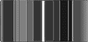
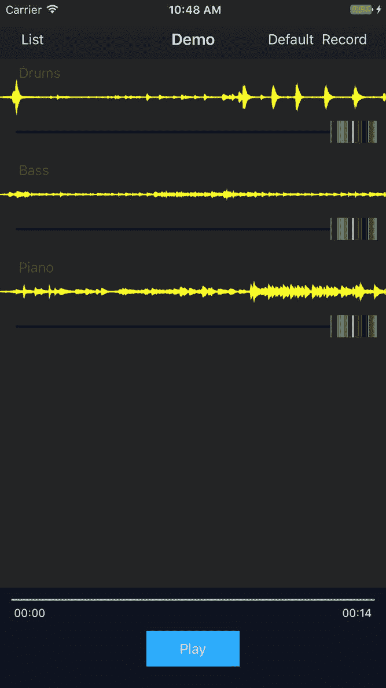
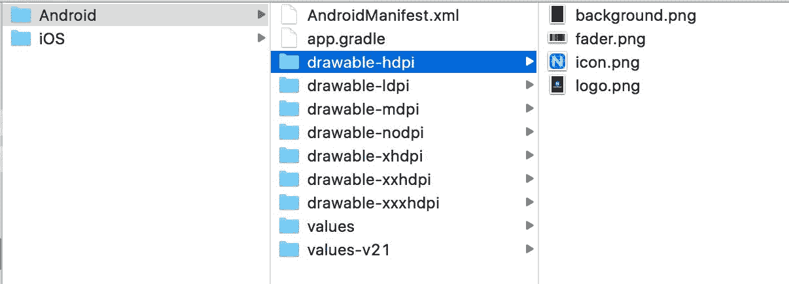
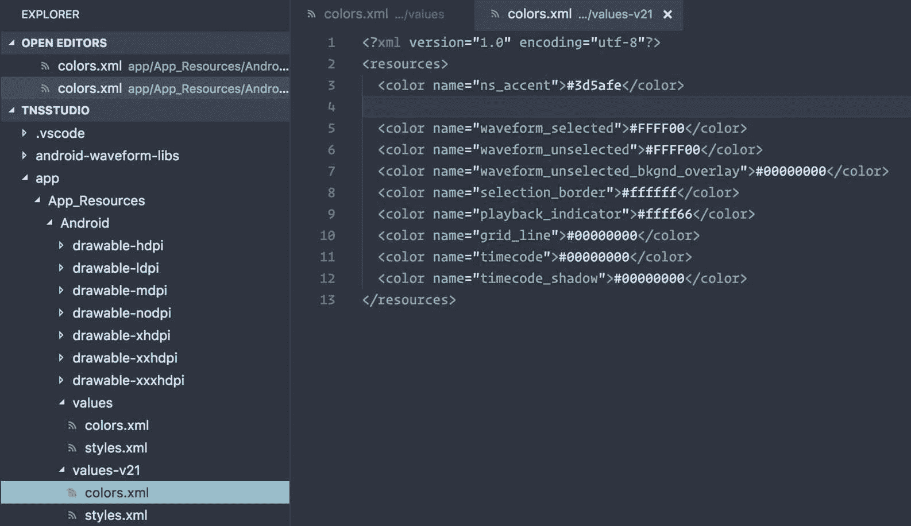
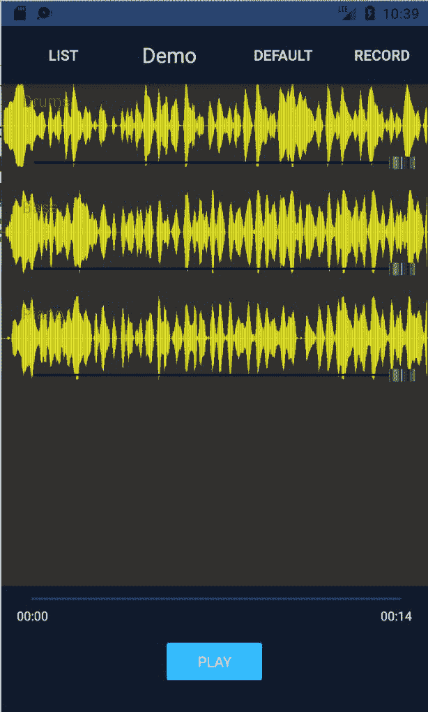

# 第九章：赋予你的视图更多力量

Angular 和 NativeScript 的结合在移动开发中非常有趣，而且功能强大。无论您需要提供服务以与移动设备的硬件功能进行交互，比如音频录制，或者通过引人入胜的视图增强您的应用的可用性，NativeScript for Angular 都提供了令人兴奋的机会。

让我们继续使用我们在前一章中开发的几个概念，为我们的曲目提供一个替代的丰富视图，同时重用我们到目前为止所涵盖的一切，以及一些新的技巧。

在本章中，我们将涵盖以下主题：

+   使用`ListView`和`templateSelector`进行多个项目行模板

+   使用`ListView`处理行模板的更改以及何时/如何刷新它们

+   使用`NativeScriptFormsModule`通过`ngModel`数据绑定

+   利用共享的单例服务在多个模块之间共享状态

+   在存储之前对数据进行序列化，并在从持久状态检索时进行水合处理

+   利用和重用 Angular 指令来丰富 NativeScript 滑块的独特特性

# 使用 NativeScript 的 ListView 进行多个项目模板

在整个第八章中，*构建音频录制器*，我们设计了一个双重用途的自定义 NativeScript 波形视图，它利用了 iOS 和 Android 的各种本机库，特别是为了丰富我们的作曲曲目列表视图。让我们继续重用我们多才多艺的波形视图来展示我们的曲目列表视图。这也将为我们提供一种显示混音滑块控件（在音频制作和声音工程中通常称为淡入淡出器）的方法，以便用户可以调整每个曲目在整体作品中的音量水平。让我们设置我们的`TrackListComponent`的`ListView`，使用户能够以两种不同的方式查看和处理他们的曲目，每种方式都有其独特的实用性。与此同时，我们还将利用这个机会最终连接我们曲目上的`mute`开关。

让我们对`app/modules/player/components/track-list/track-list.component.html`进行以下修改：

```ts
<ListView #listview [items]="tracks | orderBy: 'order'" class="list-group" 
  [itemTemplateSelector]="templateSelector">
  <ng-template let-track="item" nsTemplateKey="default">
    <GridLayout rows="auto" columns="100,*,100" class="list-group-item" 
      [class.muted]="track.mute">
      <Button text="Record" (tap)="record(track)" row="0" col="0" class="c-ruby"></Button>
      <Label [text]="track.name" row="0" col="1" class="h2"></Label>
      <Switch row="0" col="2" class="switch" [(ngModel)]="track.mute"></Switch>
    </GridLayout>
  </ng-template>

  <ng-template let-track="item" nsTemplateKey="waveform">
    <AbsoluteLayout [class.muted]="track.mute">
      <Waveform class="waveform w-full" top="0" left="0" height="80"
        [model]="track.model"
        type="file"
        plotColor="#888703"
        fill="true"
        mirror="true"
        plotType="buffer"></Waveform>

      <Label [text]="track.name" row="0" col="1" class="h3 track-name-float"
        top="5" left="20"></Label>
      <Slider slim-slider="fader.png" minValue="0" maxValue="1" 
        width="94%" top="50" left="0"
        [(ngModel)]="track.volume" class="slider fader"></Slider>
    </AbsoluteLayout>
  </ng-template>
</ListView>
```

这里发生了很多有趣的事情。首先，`[itemTemplateSelector]="templateSelector"`提供了在运行时更改我们的`ListView`项目行的能力。`templateSelector`函数的结果应该是一个字符串，与任何 ng-template 的`ngTemplateKey`属性提供的值匹配。为了使所有这些工作，我们需要几件事情，首先是具有通过`#listview`和`ViewChild`访问`ListView`的`Component`：

```ts
// angular
import { Component, Input, ViewChild, ElementRef } from '@angular/core';
import { Router } from '@angular/router';

// nativescript
import { ListView } from 'ui/list-view';

// app
import { ITrack } from '../../../shared/models';
import { AuthService, DialogService } from '../../../core/services';
import { PlayerService } from '../../services/player.service';

@Component({
 moduleId: module.id,
 selector: 'track-list',
 templateUrl: 'track-list.component.html',
})
export class TrackListComponent {

  public templateSelector: Function;
  @Input() tracks: Array<ITrack>;
  @ViewChild('listview') _listviewRef: ElementRef;
 private _listview: ListView;
 private _sub: any;

  constructor(
    private authService: AuthService,
    private dialogService: DialogService,
    private router: Router,
    private playerService: PlayerService
  ) { 
    this.templateSelector = this._templateSelector.bind(this);
  }

  ngOnInit() {
 this._sub = this.playerService.trackListViewChange$.subscribe(() => {      // since this involves our templateSelector, ensure ListView knows about it
      // refresh list
 this._listview.refresh();
 });
 }

 ngAfterViewInit() {
 this._listview = <ListView>this._listviewRef.nativeElement;
 }

 private _templateSelector(item: ITrack, index: number, items: ITrack[]) {
 return this.playerService.trackListViewType;
 }
  ...
```

我们设置了一个`ViewChild`来保留对我们的`ListView`的引用，稍后我们将使用它来调用`this._listview.refresh()`。当我们需要`ListView`在更改后更新显示时，这在 Angular 中是必需的。第一个惊喜可能是注入`PlayerService`，第二个可能是`this.templateSelector = this._templateSelector.bind(this)`。`templateSelector`绑定不是作用域绑定的，由于我们需要它从我们的`this.playerService`返回一个属性引用，我们确保它正确地绑定到`Component`的作用域，通过绑定一个`Function`引用。在这一点上，我们将使用`PlayerService`作为一个通道，以帮助从`MixerModule`中的`ActionBarComponent`传递状态。

这个例子展示了服务如何帮助在整个应用程序中传递状态。然而，通过利用`ngrx`来帮助减少交织的依赖关系并解锁具有 Redux 风格架构的纯响应式设置，这种实践可以得到极大的改进。@ngrx 增强功能将在第十章中进行介绍，*@ngrx/store + @ngrx/effects for State Management*。

我们的 View Toggle 按钮将在`ActionBar`（在`MixerModule`中），我们将希望在那里点击以切换我们的`ListView`，它位于我们的`PlayerModule`内。`PlayerService`目前是一个单例（由`CoreModule`提供），并且在整个应用程序中共享，因此它是一个完美的候选者来帮助这里。让我们首先查看`app/modules/mixer/components/action-bar/action-bar.component.ios.html`中的`ActionBarComponent`的更改：

```ts
<ActionBar [title]="title" class="action-bar">
  <ActionItem nsRouterLink="/mixer/home">
    <Button text="List" class="action-item"></Button>
  </ActionItem>
  <ActionItem (tap)="toggleList()" ios.position="right">
 <Button [text]="toggleListText" class="action-item"></Button>
 </ActionItem>
  <ActionItem (tap)="record()" ios.position="right">
    <Button text="Record" class="action-item"></Button>
  </ActionItem>
</ActionBar>
```

然后，我们将查看`app/modules/mixer/components/action-bar/action-bar.component.android.html`中的更改：

```ts
<ActionBar class="action-bar">
  <GridLayout rows="auto" columns="auto,*,auto,auto" class="action-bar">
    <Button text="List" nsRouterLink="/mixer/home" 
      class="action-item" row="0" col="0"></Button>
    <Label [text]="title" class="action-bar-title text-center" row="0" col="1"></Label>
    <Button [text]="toggleListText" (tap)="toggleList()" 
 class="action-item" row="0" col="2"></Button>
    <Button text="Record" (tap)="record()" 
      class="action-item" row="0" col="3"></Button>
  </GridLayout>
</ActionBar>
```

我们还将查看`Component`中的更改：

```ts
...
import { PlayerService } from '../../../player/services/player.service';

@Component({
  moduleId: module.id,
  selector: 'action-bar',
  templateUrl: 'action-bar.component.html'
})
export class ActionBarComponent {
  ...
  public toggleListText: string = 'Waveform';

  constructor(
    private router: RouterExtensions,
    private playerService: PlayerService
  ) { }
  ...
  public toggleList() {
    // later we can use icons, using labels for now let type = this.playerService.trackListViewType === 'default' ? 'waveform' : 'default';
    this.playerService.trackListViewType = type;
    this.toggleListText = type === 'default' ? 'Waveform' : 'Default';
 }
}
```

正如你所看到的，我们在`ActionBar`中添加了一个按钮，它将根据其状态使用标签`Waveform`或`Default`。然后，我们使用`PlayerService`来修改一个新的 setter，`**this.playerService.trackListViewType** **=** **type**`。现在让我们来看看`app/modules/player/services/player.service.ts`：

```ts
...
@Injectable()
export class PlayerService {
  ...
  // communicate state changes from ActionBar to anything else
  public trackListViewChange$: Subject<string> = new Subject(); ... public get trackListViewType() {
    return this._trackListViewType;
  }

  public set trackListViewType(value: string) {
    this._trackListViewType = value;
    this.trackListViewChange$.next(value);
  } ...
```

这完成了任务。

如前所述，我们将在下一章中通过 ngrx 改进这个设置，这是关于改进和简化我们处理应用程序状态的方式。

还有一些事情我们需要做，以确保我们所有的新添加都能正常工作。首先，`[(ngModel)]`绑定将完全无法工作，如果没有`NativeScriptFormsModule`。

如果您在组件的视图中使用`ngModel`绑定，您必须确保声明您的`Component`的模块导入了`NativeScriptFormsModule`。如果它使用`SharedModule`，请确保`SharedModule`导入和导出`NativeScriptFormsModule`。

让我们将前面提到的模块添加到我们的`SharedModule`中，这样我们所有的模块都可以在需要的地方使用`ngModel`：

```ts
...
import { NativeScriptFormsModule } from 'nativescript-angular/forms'; 
...
@NgModule({
  imports: [
    NativeScriptModule, 
    NativeScriptRouterModule,
    NativeScriptFormsModule
  ],
  ...
  exports: [
    NativeScriptModule,
    NativeScriptRouterModule,
    NativeScriptFormsModule,
    ...PIPES
  ]
})
export class SharedModule {}
```

我们现在需要每个音轨的静音和音量属性的更改来通知我们的音频播放器。这涉及轻微更改我们的`TrackModel`以适应这个新功能；为此，打开`app/modules/shared/models/track.model.ts`：

```ts
import { BehaviorSubject } from 'rxjs/BehaviorSubject';
...
export class TrackModel implements ITrack {
  public id: number;
  public filepath: string;
  public name: string;
  public order: number;
  public model: any;

  public volume$: BehaviorSubject<number>;

  private _volume: number = 1; // default full volume
  private _mute: boolean;
  private _origVolume: number; // return to after unmute

  constructor(model?: ITrack) {
    this.volume$ = new BehaviorSubject(this._volume);
    ...
  }

  public set mute(value: boolean) {
 this._mute = value;
 if (this._mute) {
 this._origVolume = this._volume;
 this.volume = 0;
 } else {
 this.volume = this._origVolume;
 }
 }

 public get mute() {
 return this._mute;
 }

 public set volume(value: number) {
 this._volume = value;
 this.volume$.next(this._volume);
 if (this._volume > 0 && this._mute) {
      // if just increasing volume from a muted state
      // ensure it's unmuted
 this._origVolume = this._volume;
 this._mute = false;
 }
 }

 public get volume() {
 return this._volume;
 }
}
```

现在我们需要修改我们的`TrackPlayerModel`，以配合这些新功能一起工作。之前，我们只保留了`trackId`；然而，有了这个新添加，保留整个`TrackModel`对象的引用会很有帮助，所以打开`app/modules/shared/models/track-player.model.ts`并进行以下更改：

```ts
...
import { Subscription } from 'rxjs/Subscription';
...
interface ITrackPlayer {
  track: TrackModel; // was trackId only
  duration: number;
  readonly player: TNSPlayer;
}
...
export class TrackPlayerModel implements ITrackPlayer {
  public track: TrackModel;
  ...
  private _sub: Subscription;
  ...
  public load(track: TrackModel, complete: Function, error: Function): Promise<number> {
    return new Promise((resolve, reject) => {
      this.track = track;

      this._player.initFromFile({
        ...
      }).then(() => {
        ...
        // if reloading track, clear subscription before subscribing again
        if (this._sub) this._sub.unsubscribe();
 this._sub = this.track.volume$.subscribe((value) => {
 if (this._player) {
 // react to track model property changes
 this._player.volume = value;
 }
 });
      }, reject);
    });
  }
  ...
  public cleanup() {
    // cleanup and dispose player
    if (this.player) this.player.dispose();
    if (this._sub) this._sub.unsubscribe(); 
  }
  ...
```

我们的音频播放器现在可以通过观察`volume$`主题可观察对象来对每个音轨通过数据绑定进行的音量更改做出反应。由于静音实质上只需要修改播放器的音量，我们确保相应地更新音量，并在打开/关闭静音时保持原始音量，因此任何自定义音量设置都将被保留。

我们对轨道的新丰富视图包括可重复使用的波形视图，但这一次使用`type="file"`，因为这将使音频文件的静态波形得以呈现，以便我们可以*看到*我们的音频。我们还提供了调整每个轨道音量（混音控制）的能力，并将标签浮动到左上角，以便用户仍然知道是什么。这一切都是通过利用`AbsoluteLayout`容器完成的，这允许我们重叠组件并手动将它们定位在彼此之上。

# 对数据进行持久化序列化，并在检索时重新注入

这一切都非常顺利，然而，我们引入了一个问题。我们的`MixerService`提供了保存所有轨道的作品的能力。然而，现在轨道包含了诸如可观察对象甚至具有 getter 和 setter 的私有引用等复杂对象。

在持久化数据时，您通常会希望使用`JSON.stringify`对对象进行序列化，以便在存储它们时可以稍后检索并将其转化为更复杂的模型。

实际上，如果您现在尝试使用`JSON.stringify`处理我们的`TrackModel`，它将失败，因为您无法对某些结构进行字符串化。因此，我们现在需要一种在存储数据之前对数据进行序列化的方法，以及一种在检索数据时重新注入数据以恢复我们更复杂模型的方法。让我们对我们的`MixerService`进行一些更改以解决这个问题。打开`app/modules/mixer/services/mixer.service.ts`并进行以下更改：

```ts
// nativescript
import { knownFolders, path } from 'file-system';
...
@Injectable()
export class MixerService {

  public list: Array<IComposition>;

  constructor(
    private databaseService: DatabaseService,
    private dialogService: DialogService
  ) {
    // restore with saved compositions or demo list
    this.list = this._hydrateList(this._savedCompositions() || this._demoComposition());
  }
  ...
  private _saveList() {
    this.databaseService.setItem(DatabaseService.KEYS.compositions, this._serializeList());
  }

  private _serializeList() {
 let serialized = [];
 for (let comp of this.list) {
 let composition: any = Object.assign({}, comp);
 composition.tracks = [];
 for (let track of comp.tracks) {
 let serializedTrack = {};
 for (let key in track) {
          // ignore observable, private properties and waveform model (redundant)
          // properties are restored upon hydration
 if (!key.includes('_') && !key.includes('$') && key != 'model') {
 serializedTrack[key] = track[key];
 }
 }
 composition.tracks.push(serializedTrack);
 }
      // serialized composition
 serialized.push(composition);
 }
 return serialized;
 }

 private _hydrateList(list: Array<IComposition>) {
 for (let c = 0; c < list.length; c++) {
 let comp = new CompositionModel(list[c]);
 for (let i = 0; i < comp.tracks.length; i++) {
 comp.tracks[i] = new TrackModel(comp.tracks[i]);
        // for waveform
 (<any>comp.tracks[i]).model = {
          // fix is only for demo tracks since they use files from app folder
 target: fixAppLocal(comp.tracks[i].filepath)
 };
 }
 // ensure list ref is updated to use hydrated model
 list[c] = comp;
 }
 return list;
 }
  ...
}

const fixAppLocal = function (filepath: string) {
 if (filepath.indexOf('~/') === 0) {    // needs to be absolute path and not ~/ app local shorthand
 return path.join(knownFolders.currentApp().path, filepath.replace('~/', ''));
 }
 return filepath;
}
```

现在，我们将确保每当我们的作品保存时，它都会被正确序列化为安全且更简化的形式，这可以通过`JSON.stringify`进行处理。然后，在从持久存储中检索数据时（在这种情况下，通过 NativeScript 的应用程序设置模块在我们的`DatabaseService`的幕后使用；这在第二章中有所涵盖，*特性模块*），我们将数据重新注入到我们的模型中，这将使用我们的可观察属性丰富数据。

# 利用 Angular 指令丰富 NativeScript 滑块的独特特性

对于每个轨道混音器（也称为我们的混音/音量控制），实际上渲染一个看起来像混音旋钮的控制旋钮会很好，以便清楚地表明这些滑块是混音旋钮，不会被误认为是该轨道的播放。我们可以创建一个用于这些滑块的图形，它将如下所示：



对于 iOS，我们还希望有一个按下/高亮状态，这样当用户按下淡入淡出时，可用性会很好：


现在我们可以创建每个文件的两个版本，并将它们放入`app/App_Resources/iOS`；原始文件将是 100x48 用于标准分辨率，然后对于 iPhone Plus 及以上，我们将有一个 150x72 的@3x 版本（基本上是标准 48 高度再加上 24）：

+   `fader-down.png`

+   `fader-down@3x.png`

+   `fader.png`

+   `fader@3x.png`

现在我们可以重用我们的`SlimSliderDirective`（目前用于自定义穿梭滑块的外观）并提供一个输入，以便我们可以提供应用资源中要用于拇指的文件的名称。

打开`app/modules/player/directives/slider.directive.ios.ts`并进行以下修改：

```ts
import { Directive, ElementRef, Input } from '@angular/core';

@Directive({
  selector: '[slim-slider]'
})
export class SlimSliderDirective {
  @Input('slim-slider') imageName: string;

  constructor(private el: ElementRef) { } 

  ngAfterViewInit() {
    let uiSlider = <UISlider>this.el.nativeElement.ios;
    if (this.imageName) {
 uiSlider.setThumbImageForState(
 UIImage.imageNamed(this.imageName), UIControlState.Normal);
      // assume highlighted state always suffixed with '-down'
      let imgParts = this.imageName.split('.');
 let downImg = `${imgParts[0]}-down.${imgParts[1]}`;
 uiSlider.setThumbImageForState(
 UIImage.imageNamed(downImg), UIControlState.Highlighted);
    } else {
      // used for shuttle control
      uiSlider.userInteractionEnabled = false;
      uiSlider.setThumbImageForState(UIImage.new(), UIControlState.Normal);
    }
  }
}

```

这使我们能够在组件本身上指定要用作`Slider`拇指的文件名：

```ts
<Slider slim-slider="fader.png" minValue="0" maxValue="1" 
  width="94%" top="50" left="0"
  [(ngModel)]="track.volume" class="slider fader"></Slider>
```

有了这个，当轨道混音视图切换打开时，我们现在可以为 iOS 定制这些整洁的淡入淡出控件：



# Android 的图形和资源处理

现在，让我们也为 Android 处理一下。我们首先将我们标准的 48 高度淡入淡出图形复制到 app/App_Resources/Android/drawable-hdpi 文件夹中。然后我们可以创建这个图形的适当分辨率，并将其复制到各种分辨率相关的文件夹中。要记住的一件事是，Android 不像 iOS 那样使用“@3x”后缀标识符，所以我们只需将所有这些命名为“fader.png”。这是我们图形在一个分辨率相关（在这种情况下是 hdpi，处理“高密度”屏幕分辨率）文件夹中的视图：



我们现在可以使用拇指图像处理自定义我们的 Android 滑块指令，打开`app/modules/player/directives/slider.directive.android.ts`：

```ts
import { Directive, ElementRef, Input } from '@angular/core';
import { fromResource } from 'image-source';
import { getNativeApplication } from 'application';

let application: android.app.Application;
let resources: android.content.res.Resources;

const getApplication = function () {
 if (!application) {
 application = (<android.app.Application>getNativeApplication());
 }
 return application;
}

const getResources = function () {
 if (!resources) {
 resources = getApplication().getResources();
 }
 return resources;
}

@Directive({
 selector: '[slim-slider]'
})
export class SlimSliderDirective {
  @Input('slim-slider') imageName: string;
 private _thumb: android.graphics.drawable.BitmapDrawable;

  constructor(private el: ElementRef) { 
    el.nativeElement[(<any>slider).colorProperty.setNative] = function (v) {
// ignore the NativeScript default color setter of this slider
 };
  }

  ngAfterViewInit() {
    let seekBar = <android.widget.SeekBar>this.el.nativeElement.android;
    if (this.imageName) {
 if (!seekBar) {
        // part of view toggle - grab on next tick
        // this helps ensure the seekBar instance can be accessed properly
        // since this may fire amidst the view toggle switching on our tracks
        setTimeout(() => {
 seekBar = <android.widget.SeekBar>this.el.nativeElement.android;
 this._addThumbImg(seekBar);
 });
 } else {
 this._addThumbImg(seekBar);
 }
    } else {
      // seekBar.setEnabled(false);
      seekBar.setOnTouchListener(new android.view.View.OnTouchListener({
        onTouch(view, event) {
          return true;
        }
      }));
      seekBar.getThumb().mutate().setAlpha(0);
    }
  }

  private _addThumbImg(seekBar: android.widget.SeekBar) {
 if (!this._thumb) {
 let imgParts = this.imageName.split('.');
 let name = imgParts[0];
 const res = getResources();
 if (res) {
 const identifier: number = res.getIdentifier(
 name, 'drawable',  getApplication().getPackageName());
 if (0 < identifier) {
          // Load BitmapDrawable with getDrawable to make use of Android internal caching
 this._thumb = <android.graphics.drawable.BitmapDrawable>res.getDrawable(identifier);
 }
 }
 }
    if (this._thumb) {
 seekBar.setThumb(this._thumb);
 seekBar.getThumb().clearColorFilter();
 if (android.os.Build.VERSION.SDK_INT >= 21) {
 (<any>seekBar).setSplitTrack(false);
 }
 }
 }
}
```

上面 Android 实现中最不寻常、也许令人惊讶的一个方面是这个：

```ts
constructor(private el: ElementRef) { 
  el.nativeElement[(<any>slider).colorProperty.setNative] = function (v) {
    // ignore the NativeScript color setter of the slider
  };
}
```

通常情况下，您可以很容易地重用和扩展 NativeScript 中的控件。然而，这是一个例外情况，其中默认的 NativeScript 滑块控件的默认设置器实际上只会在 Android 上给我们带来问题。默认的设置器将尝试将滑块的颜色设置为蓝色，并进行混合处理。当它在滑块上设置这个标志时，我们设置的任何图形形状都会被设置为全蓝色。因此，为了使我们的滑块类能够处理自定义图形，我们必须消除控件上的默认滑块颜色设置器。我们通过附加一个新的“颜色”设置器来控制这一点，这个设置器实际上什么都不做。这样，当 NativeScript 框架在初始化或重置控件时尝试设置默认颜色时，什么都不会发生，从而使我们完全控制发生的事情。作为一种预防措施，在`_addThumbImg`方法的末尾，我们还调用`seekBar.getThumb().clearColorFilter();`以确保在我们能够消除默认颜色设置之前，任何潜在的颜色过滤器都被撤消。

最后，当我们的音轨列表视图切换到混音模式时，我们可以自定义每个音轨显示的音频波形中使用的颜色。由于 Android 的波形插件利用了应用程序的颜色资源，我们可以在 app/App_Resources/Android/values/colors.xml 中添加插件文档中找到的适当命名的属性，并且相同的颜色也应该复制到 app/App_Resources/Android/values-v21/colors.xml 中：



这样，我们现在为 Android 的文件波形显示在混音模式下提供了自定义样式：



# 总结

我们希望为您提供一些额外的好东西，以配合您在第三部分学习到的丰富内容；希望您喜欢！在许多情况下，使用`ListView`的多个项目行模板可能非常方便，但希望这将为您提供工具，让您知道如何使其为您和您的应用程序工作。

数据持久性的特殊考虑因素对于任何引人入胜的应用程序都是一个重要因素，因此我们在存储数据之前查看了数据序列化以及在恢复数据时对数据进行水合处理。

最后，我们将进一步丰富我们的视图组件，使用更多的 Angular 指令优点。 随着第三部分的完成，我们现在已经完成了本书的核心能力和功能集。 但是，我们的应用程序还远未完成。 本书中介绍的开发工作流程和流程是我们为任何构建的应用程序带来的典型开发周期。 我们将在第十四章中涵盖改进我们的架构和进一步完善我们的应用程序，以准备通过 Google Play 和 App Store 进行公开发布，*使用 webpack 打包进行部署准备*。

让我们现在开始通过在第十章中集成`ngrx`来改进我们应用程序的状态处理，*@ngrx/store + @ngrx/effects 用于状态管理*。 值得一提的是，使用 Redux 风格的架构是在构建应用程序之前更好地做出的决定，就像我们在这里所做的那样。 但是，这并不一定是关键的，也不是强制性的，因此，我们希望构建应用程序时将其排除在外，以显示应用程序基本上运行良好。现在，我们将继续进行工作，以展示您可以通过它获得的各种优势。
