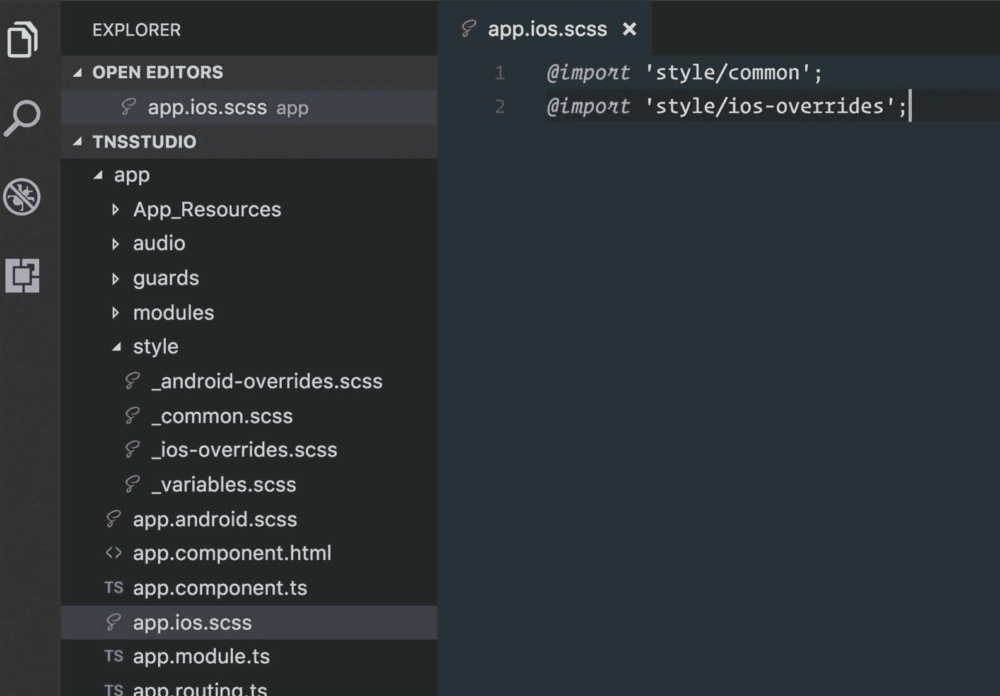
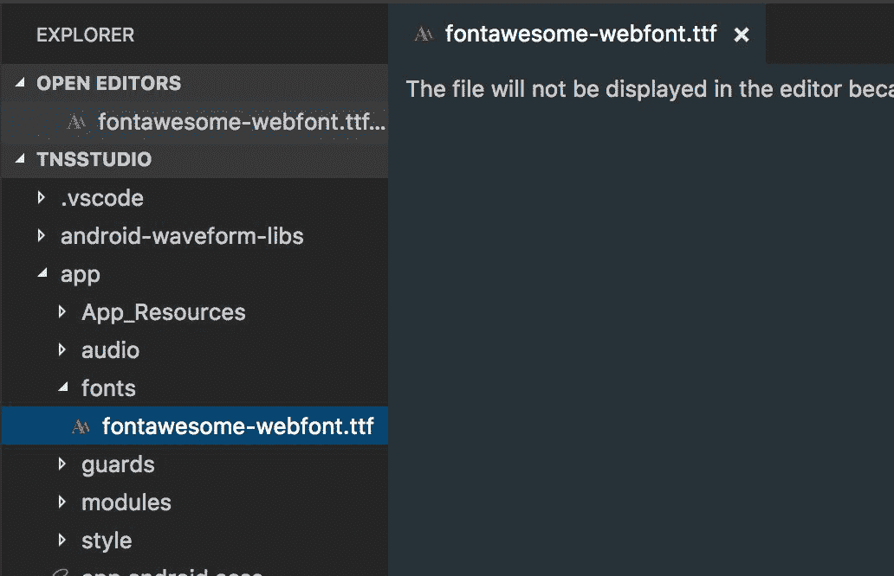
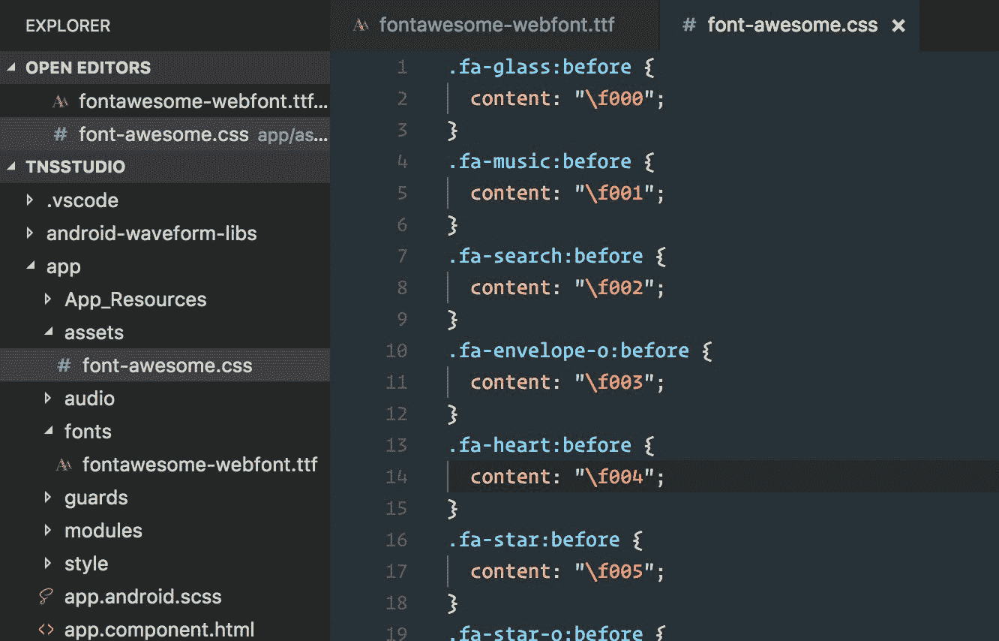
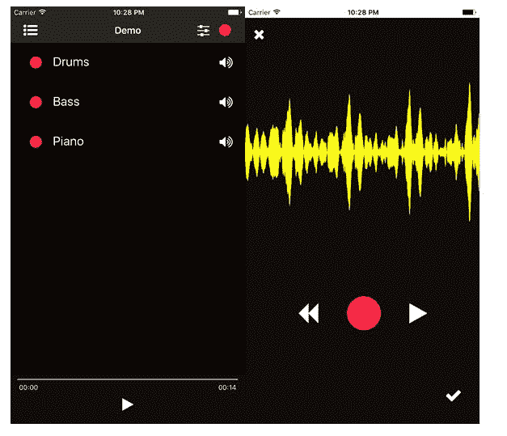

# 第十一章：用 SASS 打磨

在上一章节中涵盖了一些关于 ngrx 状态管理的底层改进之后，现在终于是时候打磨这个应用，改善其整体外观和感觉了。样式的时间完全取决于您的开发流程，通常情况下，我们喜欢边开发边打磨。在本书中，我们选择避免通过 CSS 混合打磨功能开发，以保持概念更加专注。然而，现在我们在这里，我们对为我们的应用获得漂亮外观感到非常兴奋。

由于随着样式的增长，标准 CSS 可能变得难以维护，我们将集成 SASS 来帮助。事实上，我们将利用一个由 Todd Anglin 开发的社区插件，他是帮助创建 NativeScript 品牌名称的人。

在本章中，我们将涵盖以下主题：

+   将 SASS 集成到您的应用中

+   构建核心主题的 SASS 设置的最佳实践

+   构建可扩展的样式设置，以最大化 iOS 和 Android 之间的样式重用

+   使用字体图标，如*Font Awesome*，使用 nativescript-ngx-fonticon 插件

# 用 SASS 打磨

SASS 是世界上最成熟、稳定和强大的专业级 CSS 扩展语言... Sass 是 CSS 的扩展，为基本语言增添了力量和优雅。它允许您使用变量、嵌套规则、混合、内联导入等，所有这些都具有完全兼容 CSS 的语法。SASS 有助于保持大型样式表的良好组织，并使小型样式表快速运行起来。

+   http://sass-lang.com/documentation/file.SASS_REFERENCE.html

听起来不错吧？当然。

我们首先要安装由 Todd Anglin 发布的社区插件：

```ts
npm install nativescript-dev-sass --save-dev
```

这个插件将设置一个钩子，在构建应用之前自动将您的 SASS 编译为 CSS，因此您无需担心安装任何其他构建工具。

我们现在希望以一种特定的方式组织我们的 SASS 源文件，这种方式不仅有利于 iOS 和 Android 之间的共享样式的维护，还可以轻松地允许特定于平台的调整/覆盖。默认安装的核心主题（`nativescript-theme-core`）附带了一套完整的 SASS 源文件，这些文件已经组织得很好，可以帮助您轻松地在其基础上构建自定义的 SASS。

让我们从重命名以下开始：

+   `app.ios.css`改为`app.ios.**scss**`

+   `app.android.css`改为`app.android.**scss**`

然后是`app.ios.scss`的内容：

```ts
@import 'style/common';
@import 'style/ios-overrides';
```

以及对于`app.android.scss`：

```ts
@import 'style/common';
@import 'style/android-overrides';
```

现在，让我们创建带有各种部分 SASS 导入文件的`style`文件夹，以帮助我们的设置，从变量开始：

+   `style/_variables.scss`：

```ts
// baseline theme colors
@import '~nativescript-theme-core/scss/dark';
// define our own variables or simply override those from the light set here...
```

实际上，您可以基于许多不同的皮肤/颜色来设置应用程序的样式表。查看文档中的以下部分，了解可用的选项：[`docs.nativescript.org/ui/theme#color-schemes`](http://docs.nativescript.org/ui/theme#color-schemes)。对于我们的应用程序，我们将以*dark*皮肤为基础设置颜色。

现在，创建共享的 SASS 文件，这是大部分共享样式的地方。实际上，我们将把我们在`common.css`文件中定义的所有内容放在这里（然后，删除我们以前拥有的`common.css`文件）：

+   `style/_common.scss`：

```ts
// customized variables
@import 'variables';
// theme standard rulesets
@import '~nativescript-theme-core/scss/index';
// all the styles we had created previously in common.css migrated into here:

.action-bar {
  background-color:#101B2E; // we can now convert this to a SASS variable
}

Page {
  background-color:#101B2E; // we can now convert this to a SASS variable
}

ListView { 
  separator-color: transparent; 
}

.track-name-float {
  color: RGBA(136, 135, 3, .5); // we can now convert this to a SASS variable
}

.slider.fader {
  background-color: #000; // we could actually use $black from core theme now
}

.list-group .muted {
  opacity:.2;
}

```

这使用了我们刚刚创建的变量文件，使我们能够使用核心主题的基线变量，并对颜色进行自定义调整。

现在，如果需要，创建 Android 覆盖文件：

+   `styles/_android-overrides.scss`：

```ts
@import '~nativescript-theme-core/scss/platforms/index.android';
// our custom Android overrides can go here if needed...
```

这从核心主题导入了 Android 覆盖，同时仍然允许我们应用自定义覆盖（如果需要）。

我们现在可以为 iOS 执行相同的操作：

+   `styles/_ios-overrides.scss`：

```ts
@import '~nativescript-theme-core/scss/platforms/index.ios';
// our custom iOS overrides can go here if needed...
```

最后，我们现在可以将任何特定于组件的`.css`文件转换为`**.scss**`。我们有一个组件使用其自定义的样式，`record.component.css`。只需将其重命名为`**.scss**`。NativeScript SASS 插件将自动编译它找到的任何嵌套`.scss`文件。

您可能还想做两件事：

除了在 IDE 中隐藏`.css`和`.js`文件之外，还要从 git 中忽略所有`*.css`文件。

您不希望在将来与其他开发人员发生合并冲突，因为每次构建应用程序时，您的`.css`文件都将通过 SASS 编译生成。

将以下内容添加到您的`.gitignore`文件中：

```ts
*.js
*.map
*.css
hooks
lib
node_modules
/platforms
```

然后，要在 VS Code 中隐藏`.js`和`.css`文件，我们可以这样做：

```ts
{
  "files.exclude": {
    "**/app/**/*.css": {
 "when": "$(basename).scss"
 },
 "**/app/**/*.js": {
 "when": "$(basename).ts"
 },
    "**/hooks": true,
    "**/node_modules": true,
    "platforms": true
  }
}
```

现在结构应该如下所示的屏幕截图：



# 使用 nativescript-ngx-fonticon 插件使用字体图标

确实很好将所有那些无聊的标签按钮替换为漂亮清晰的图标，所以让我们这样做。NativeScript 提供了对使用 Unicode 值在按钮、标签等文本属性上支持自定义字体图标的支持。然而，使用 Angular，我们可以利用另一个巧妙的插件，它将提供一个很好的管道，使我们可以使用字体名称以方便使用和清晰度。

安装以下插件：

```ts
npm install nativescript-ngx-fonticon --save
```

对于这个应用程序，我们将使用多功能的 font-awesome 图标，所以让我们从官方网站这里下载该软件包：[`fontawesome.io/`](http://fontawesome.io/)。

在其中，我们将找到我们需要的字体文件和 css。我们想首先将`fontawesome-webfont.ttf`文件复制到我们将在`app`文件夹中创建的`new fonts`文件夹中。当构建应用程序时，NativeScript 将在该文件夹中查找任何自定义字体文件：



我们现在还想将`css/font-awesome.css`文件复制到我们的应用程序文件夹中。我们可以将其放在文件夹的根目录或子文件夹中。我们将创建一个`assets`文件夹来存放这个以及将来可能的其他类似项目。

但是，我们需要稍微修改这个`.css`文件。`nativescript-ngx-fonticon`插件只能使用字体类名，不需要 font-awesome 提供的任何实用类。因此，我们需要修改它，删除顶部的大部分内容，使其看起来像这样：



您可以在以下视频中了解更多信息：[`www.youtube.com/watch?v=qb2sk0XXQDw`](https://www.youtube.com/watch?v=qb2sk0XXQDw)。

我们还设置了 git 来忽略以前的所有`*.css`文件；但是，我们不想忽略以下文件：

```ts
*.js
*.map
*.css
!app/assets/font-awesome.css
hooks
lib
node_modules
/platforms
```

现在，我们准备设置插件。由于这应该是我们应用程序核心设置的一部分，我们将修改`app/modules/core/core.module`以配置我们的插件：

```ts
...
import { TNSFontIconModule } from 'nativescript-ngx-fonticon';
...
@NgModule({
  imports: [
    ...MODULES,
    // font icons
    TNSFontIconModule.forRoot({
 'fa': './assets/font-awesome.css'
 }),
    ...
  ],
  ...
})
export class CoreModule {
```

由于该模块依赖于`TNSFontIconService`，让我们修改我们的根组件以注入它，确保 Angular 的 DI 为我们实例化单例以在整个应用程序中使用。

`app/app.component.ts`：

```ts
...
// libs
import { TNSFontIconService } from 'nativescript-ngx-fonticon';

@Component({
  moduleId: module.id,
  selector: 'my-app',
  templateUrl: 'app.component.html'
})
export class AppComponent {

  constructor(private fontIconService: TNSFontIconService) {
    ...
```

接下来，我们要确保`fonticon`管道对任何视图组件都是可访问的，所以让我们在`SharedModule`的`app/modules/shared/shared.module.ts`中导入和导出该模块：

```ts
...
// libs
import { TNSFontIconModule } from 'nativescript-ngx-fonticon';
...
@NgModule({
  imports: [
    NativeScriptModule, 
    NativeScriptRouterModule, 
    NativeScriptFormsModule, 
    TNSFontIconModule
  ],
  ...
  exports: [
    ...
    TNSFontIconModule, ...PIPES  ]
})
export class SharedModule {}
```

最后，我们需要一个类来指定哪些组件应该使用 font-awesome 来渲染自己。由于这个类将在 iOS/Android 上共享，所以在`app/style/_common.scss`中进行修改，如下所示：

```ts
// customized variables
@import 'variables';
// theme standard rulesets
@import '~nativescript-theme-core/scss/index';

.fa {
 font-family: 'FontAwesome', fontawesome-webfont;
 font-size: 25;
}
```

我们定义两种字体系列的原因是因为 iOS 和 Android 之间的差异。Android 使用文件名作为字体系列（在这种情况下是`fontawesome-webfont.ttf`）。而 iOS 使用实际的字体名称；示例可以在[`github.com/FortAwesome/Font-Awesome/blob/master/css/font-awesome.css#L8`](https://github.com/FortAwesome/Font-Awesome/blob/master/css/font-awesome.css#L8)找到。如果你愿意，你可以将字体文件重命名为`FontAwesome.ttf`，然后只使用`font-family: FontAwesome`。你可以在[`fluentreports.com/blog/?p=176`](http://fluentreports.com/blog/?p=176)了解更多信息。

现在，让我们尝试一下在我们的应用中渲染图标的新功能。打开`app/modules/mixer/components/mix-list.component.html`：

```ts
<ActionBar title="Compositions" class="action-bar">
  <ActionItem (tap)="add()" ios.position="right">
    <Button [text]="'fa-plus' | fonticon" class="fa action-item"></Button>
  </ActionItem>
</ActionBar>
<ListView [items]="(mixer$ | async)?.compositions | orderBy: 'order'" class="list-group">
  <ng-template let-composition="item">
    <GridLayout rows="auto" columns="100,*,auto" class="list-group-item">
      <Button [text]="'fa-pencil' | fonticon" (tap)="edit(composition)" 
        row="0" col="0" class="fa"></Button>
      <Label [text]="composition.name" (tap)="select(composition)" 
        row="0" col="1" class="h2"></Label>
      <Label [text]="composition.tracks.length" 
        row="0" col="2" class="text-right"> </Label>
    </GridLayout>
  </ng-template>
</ListView>
```

让我们也调整一下我们`ListView`的背景颜色，暂时设为黑色。我们甚至可以在`app/style/_common.scss`中使用核心主题的预定义变量来使用 SASS：

```ts
.list-group {
  background-color: $black;

  .muted {
    opacity:.2;
  }
}
```

！[](../images/00051.jpeg)我们的组合列表视图现在开始看起来相当不错。

让我们继续，在`app/modules/player/components/track-list/track-list.component.html`中为我们的曲目列表视图添加一些图标：

```ts
<ListView #listview [items]="tracks | orderBy: 'order'"   class="list-group" [itemTemplateSelector]="templateSelector">
  <ng-template let-track="item" nsTemplateKey="default">
    <GridLayout rows="auto" columns="**60**,*,**30**" 
      class="list-group-item" [class.muted]="track.mute">
      <Button **[text]="'fa-circle' | fonticon"** 
        (tap)="record(track)" row="0" col="0" **class="fa c-ruby"**></Button>
      <Label [text]="track.name" row="0" col="1" class="h2"></Label>
      <Label **[text]="(track.mute ? 'fa-volume-off' : 'fa-volume-up') | fonticon"**
        row="0" col="2" class="fa" **(tap)="track.mute=!track.mute"**></Label>
    </GridLayout>
  </ng-template>
  ...
```

我们用一个标签来替换了之前的开关，设计成可以切换两种不同的图标。我们还利用了核心主题的便利颜色类，比如 c-ruby。

我们还可以通过一些图标来改进我们的自定义`ActionBar`模板：

```ts
<ActionBar [title]="title" class="action-bar">
  <ActionItem nsRouterLink="/mixer/home">
    <Button [text]="'fa-list-ul' | fonticon" class="fa action-item"></Button>
  </ActionItem>
  <ActionItem (tap)="toggleList()" ios.position="right">
    <Button [text]="((uiState$ | async)?.trackListViewType == 'default' ? 'fa-sliders' : 'fa-list') | fonticon" class="fa action-item"></Button>
  </ActionItem>
  <ActionItem (tap)="recordAction.next()" ios.position="right">
    <Button [text]="'fa-circle' | fonticon" class="fa c-ruby action-item"></Button>
  </ActionItem>
</ActionBar>
```

现在我们可以在`app/modules/player/components/player-controls/player-controls.component.html`中对播放器控件进行样式设置：

```ts
<StackLayout row="1" col="0" class="controls">
  <shuttle-slider></shuttle-slider>
  <Button [text]="((playerState$ | async)?.player?.playing ? 'fa-pause' : 'fa-play') | fonticon" (tap)="togglePlay()" class="fa c-white t-30"></Button>
</StackLayout>
```

我们将利用核心主题中更多的辅助类。`c-white`类将我们的图标变为白色，`t-30`设置了`font-size: 30`。后者是`text-30`的缩写，另一个是`color-white`。

让我们来看一下：

！[](../images/00052.jpeg)

一些样式上的修饰确实可以展现出你的应用的个性。让我们再次在`app/modules/recorder/components/record.component.html`中使用刷子：

```ts
<ActionBar title="Record" icon="" class="action-bar">
  <NavigationButton visibility="collapsed"></NavigationButton>
  <ActionItem text="Cancel" ios.systemIcon="1" (tap)="cancel()"></ActionItem>
</ActionBar>
<FlexboxLayout class="record">
  <GridLayout rows="auto" columns="auto,*,auto" class="p-10" [visibility]="isModal ? 'visible' : 'collapsed'">
    <Button [text]="'fa-times' | fonticon" (tap)="cancel()" row="0" col="0" class="fa c-white"></Button>
  </GridLayout>
  <Waveform class="waveform"
    [model]="recorderService.model" 
    type="mic" 
    plotColor="yellow" 
    fill="false" 
    mirror="true" 
    plotType="buffer">
  </Waveform>
  <StackLayout class="p-5">
    <FlexboxLayout class="controls">
      <Button [text]="'fa-backward' | fonticon" class="fa text-center" (tap)="recorderService.rewind()" [isEnabled]="state == recordState.readyToPlay || state == recordState.playing"></Button>
      <Button [text]="recordBtn | fonticon" class="fa record-btn text-center" (tap)="recorderService.toggleRecord()" [isEnabled]="state != recordState.playing" [class.is-recording]="state == recordState.recording"></Button>
      <Button [text]="playBtn | fonticon" class="fa text-center" (tap)="recorderService.togglePlay()" [isEnabled]="state == recordState.readyToPlay || state == recordState.playing"></Button>
    </FlexboxLayout>
    <FlexboxLayout class="controls bottom" [class.recording]="state == recordState.recording">
      <Button [text]="'fa-check' | fonticon" class="fa" [class.save-ready]="state == recordState.readyToPlay" [isEnabled]="state == recordState.readyToPlay" (tap)="recorderService.save()"></Button>
    </FlexboxLayout>
  </StackLayout>
</FlexboxLayout>
```

现在我们可以调整我们的组件类来处理`recordBtn`和`playBtn`了：

```ts
...
export class RecordComponent implements OnInit, OnDestroy { 
  ...
  public recordBtn: string = 'fa-circle';
 public playBtn: string = 'fa-play';
```

然后，为了将所有内容绘制到位，我们可以将这些内容添加到我们的`app/modules/recorder/components/record.component.scss`中：

```ts
@import '../../../style/variables';

.record {
  background-color: $slate;
  flex-direction: column;
  justify-content: space-around;
  align-items: stretch;
  align-content: center;
}

.record .waveform {
  background-color: transparent;
  order: 1;
  flex-grow: 1;
}

.controls {
  width: 100%;
  height: 200;
  flex-direction: row;
  flex-wrap: nowrap;
  justify-content: center;
  align-items: center;
  align-content: center;

  .fa {
    font-size: 40;
    color: $white;

    &.record-btn {
      font-size: 70;
      color: $ruby;
      margin: 0 50 0 50;

      &.is-recording {
        color: $white;
      }
    }
  }
}

.controls.bottom {
  height: 90;
  justify-content: flex-end;
}

.controls.bottom.recording {
  background-color: #B0342D;
}

.controls.bottom .fa {
  border-radius: 60;
  font-size: 30;
  height: 62;
  width: 62;
  padding: 2;
  margin: 0 10 0 0;
}

.controls.bottom .fa.save-ready {
  background-color: #42B03D;
}

.controls .btn {
  color: #fff;
}

.controls .btn[isEnabled=false] {
  background-color: transparent;
  color: #777;
}
```

通过这种修饰，我们现在有了以下的截图：

！[](../images/00053.jpeg)

# 最后的修饰

让我们使用颜色来最终确定我们初始应用的样式。现在是改变`ActionBar`中使用的基本颜色，以提供我们想要的整体感觉的时候了。让我们从在`app/style/_variables.scss`中定义一些变量开始：

```ts
// baseline theme colors
@import '~nativescript-theme-core/scss/dark';

$slate: #150e0c;

// page
$background: $black;
// action-bar
$ab-background: $black;
```

通过这些少量的改变，我们给我们的应用赋予了不同的（客观上更时尚）氛围：



# 总结

在本章中，我们终于能够为应用的外观添加一些精美的修饰。我们成功安装了`nativescript-dev-sass`插件，它在保持清晰的样式处理方法的同时，为我们的 CSS 添加了编译步骤。了解如何最好地利用核心主题的 SASS，并进行适当的文件组织，是获得灵活基础的关键。将本章介绍的概念应用到实践中，并告诉我们它们如何帮助您实现所需的样式目标；我们很乐意听到您的见解！

我们还学习了如何使用`nativescript-ngx-fonticon`插件，在整个应用中利用字体图标。这有助于用简洁的图标视觉清理笨重的文本标签。

在下一章中，我们将看看如何对一些关键功能进行单元测试，以未来保护我们应用的代码库免受新功能集成可能引入的回归。测试来拯救！
