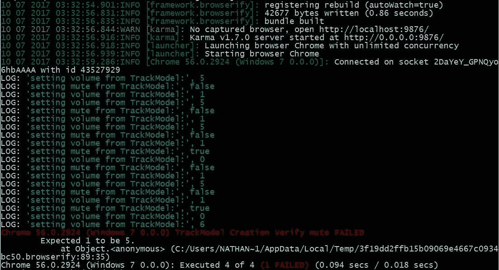
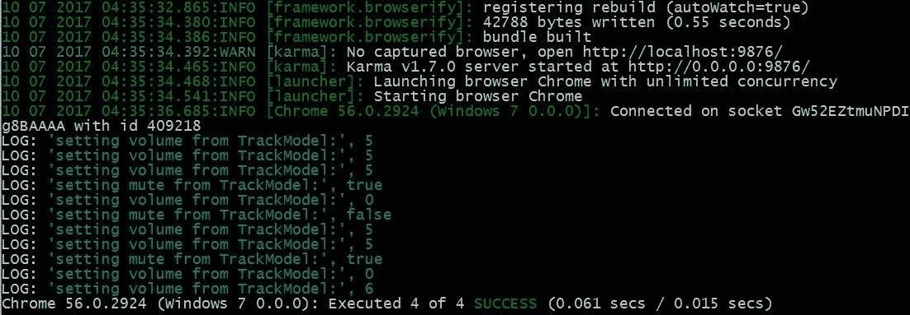
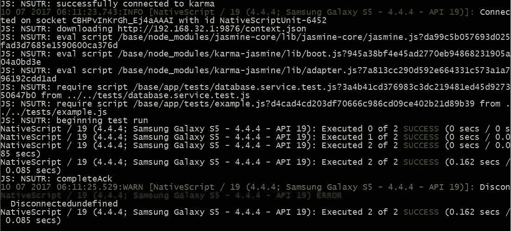

# 第十二章：单元测试

让我们从测试开始这一章；大多数人认为测试很无聊。猜猜，他们大多是对的！测试可以很有趣，因为你可以尝试并破坏你的代码，但有时也可能是乏味的工作。然而，它可以帮助你在客户之前捕捉到错误，并且作为一个奖励，它可以防止你多次出现相同的错误。你的声誉对你的客户或顾客来说值多少？一点点乏味的工作可能意味着一个三 A 级的应用和一个平庸的应用之间的差别。

在这一章中，我们将涵盖以下主题：

+   Angular 测试框架

+   NativeScript 测试框架

+   如何使用 Jasmine 编写测试

+   如何运行 Karma 测试

# 单元测试

单元测试用于测试应用程序代码功能的小部分是否正确。这也允许我们验证功能在重构代码和/或添加新功能时是否继续按预期工作。NativeScript 和 Angular 都提供单元测试框架。我们将探讨两种类型的单元测试，因为它们都有优缺点。

随时开发测试是好的。然而，最好是在项目代码开发的同时开发它们。当你的头脑还在新功能、修改和你刚刚添加的所有新代码上时，你会更加清晰。在我们的情况下，因为我们在整本书中介绍了许多新概念，我们没有遵循最佳实践，因为这样会使书变得更加复杂。因此，尽管后期添加测试是好的，但在添加新代码之前或同时添加它们被认为是最佳实践。

# Angular 测试

我们将要介绍的第一种单元测试是 Angular 单元测试。它基于 Karma（[`karma-runner.github.io/`](https://karma-runner.github.io/)）和 Jasmine（[`github.com/pivotal/jasmine`](http://github.com/pivotal/jasmine)）。Karma 是一个功能齐全的测试运行器，由 Angular 团队开发。当团队在实现 Angular 时，他们遇到了一些问题，比如如何测试 Angular，所以他们构建了 Karma。Karma 最终成为了行业标准的多用途测试运行器。Jasmine 是一个开源测试框架，实现了许多测试构造，帮助您轻松进行所有测试。它的历史比 Karma 长得多。因为在 Karma 之前很多人都在使用它，所以它成为了 Angular 社区的默认测试库。您可以自由选择其他框架，比如 Mocha、Chia，甚至您自己的自制测试框架。但是，由于几乎您在 Angular 社区看到的所有东西都是基于 Jasmine 的，我们也会使用它。

让我们为 NativeScript 中的 Angular 测试安装你需要的部分：

```ts
npm install jasmine-core karma karma-jasmine karma-chrome-launcher --save-dev
npm install @types/jasmine karma-browserify browserify watchify --save-dev
```

您还应该在全局安装 Karma，特别是在 Windows 上。但是，在其他平台上这样做也很有帮助，这样您只需输入`karma`就可以运行。为了做到这一点，请输入以下命令：

```ts
npm -g install karma
```

如果您没有全局安装 TypeScript，您无法只需输入`tsc`就进行构建，您应该全局安装它。在运行任何测试之前，您必须将您的 TypeScript 转译为 JavaScript。要全局安装 TypeScript，请输入以下命令：

```ts
npm -g install typescript
```

Karma 被设计为在浏览器中运行测试；然而，NativeScript 代码根本不在浏览器中运行。因此，我们必须以一些不同的方式来使标准的 Karma 测试系统与一些 NativeScript 应用程序代码一起运行。通常的 Angular 特定的 Karma 配置在大多数情况下都不起作用。如果您要在 Web 端进行任何 Angular 工作，您应该查看标准的 Angular 测试快速入门项目（[`github.com/angular/quickstart/`](https://github.com/angular/quickstart/)）。该项目将为在浏览器中运行的传统 Angular 应用程序设置好一切。

然而，在我们的情况下，因为我们使用的是 NativeScript Angular，我们将需要一个完全定制的`Karma.conf.js`文件。我们已经在 git 存储库中包含了自定义配置文件，或者你可以从这里输入。将这个文件保存为`Karma.ang.conf.js`。我们给出了一个不同的配置名称，因为我们稍后讨论的 NativeScript 测试将使用默认的`Karma.conf.js`名称。

```ts
module.exports = function(config) {
   config.set({
     // Enable Jasmine (Testing)
     frameworks: ['jasmine', 'browserify'],

     plugins: [
       require('karma-jasmine'),
       require('karma-chrome-launcher'),
       require('karma-browserify')
    ], 

    files: [ 'app/**/*.spec.js' ],

    preprocessors: {
       'app/**/*.js': ['browserify']
    },

    reporters: ['progress'],

    browsers: ['Chrome'], 
 });
};
```

这个配置设置了 Karma 将使用 Jasmine、Browserify 和 Chrome 来运行所有的测试。由于 Karma 和 Angular 最初是为浏览器设计的，所有的测试仍然必须在浏览器中运行。这是 Angular 测试系统在进行 NativeScript 代码时的主要缺点。它不支持任何 NativeScript 特定的代码。因此，这种类型的测试最好在数据模型文件和/或任何没有 NativeScript 特定代码的代码上进行，不幸的是，在你的一些应用程序中可能没有太多的代码。然而，如果你同时使用相同的代码库进行 NativeScript 和 Web 应用程序开发，那么你应该有很多代码可以通过标准的 Angular 测试框架运行。

对于 Angular 测试，你将创建 Jasmine 规范文件，它们都以`.spec.ts`结尾。我们必须在与你正在测试的代码相同的目录中创建这些文件。因此，让我们试着创建一个新的规范文件进行测试。由于这种类型的单元测试不允许你使用任何 NativeScript 代码，我选择了一个随机的模型文件来展示这种类型的单元测试有多容易。让我们在`app/modules/shared/models`文件夹中创建一个名为`track.model.spec.ts`的文件；这个文件将用于测试同一文件夹中的`track.model.ts`文件。这是我们的测试代码：

```ts
// This disables a issue in TypeScript 2.2+ that affects testing
// So this line is highly recommend to be added to all .spec.ts files
export = 0;

// Import our model file (This is what we are going to test)
// You can import ANY files you need
import {TrackModel} from './track.model';

// We use describe to describe what this test set is going to be
// You can have multiple describes in a testing file.
describe('app/modules/shared/models/TrackModel', () => {
  // Define whatever variables you need
  let trackModel: TrackModel;

  // This runs before each "it" function runs, so we can 
  // configure anything we need to for the actual test
  // There is an afterEach for running code after each test
  // If you need tear down code
  beforeEach( () => {
    // Create a new TrackModel class
    trackModel = new TrackModel({id: 1,
       filepath: 'Somewhere',
       name: 'in Cyberspace',
       order: 10,
       volume: 5,
       mute: false,
       model: 'My Model'});
  });

  // Lets run the first test. It makes sure our model is allocated
  // the beforeEach ran before this test, meaning it is defined.
  // This is a good test to make sure everything is working properly.
  it( "Model is defined", () => {
    expect(trackModel).toBeDefined();
  });

  // Make sure that the values we get OUT of the model actually
  // match what default values we put in to the model
  it ("Model to be configured correctly", () => {
    expect(trackModel.id).toBe(1);
    expect(trackModel.filepath).toBe('Somewhere' );
    expect(trackModel.name).toBe('in Cyberspace');
    expect(trackModel.order).toBe(10);
    expect(trackModel.model).toBe('My Model');
  });

  // Verify that the mute functionality actually works
  it ('Verify mute', () => {
    trackModel.mute = true;
    expect(trackModel.mute).toBe(true);
    expect(trackModel.volume).toBe(0);
    trackModel.mute = false;
    expect(trackModel.volume).toBe(5);
  });

  // Verify the volume functionality actually works
  it ('Verify Volume', () => {
    trackModel.mute = true;
    expect(trackModel.volume).toBe(0);
    trackModel.volume = 6;
    expect(trackModel.volume).toBe(6);
    expect(trackModel.mute).toBe(false);
  });
}); 
```

所以，让我们来分解一下。第一行修复了在浏览器中测试使用模块的 TypeScript 构建文件的问题。正如我在注释中指出的，这应该添加到所有的`spec.ts`文件中。接下来的一行是我们加载将要测试的模型；你可以在这里导入任何你需要的文件，包括 Angular 库。

记住，`.spec.js`文件只是一个普通的 TypeScript 文件；唯一的区别是它可以访问 Jasmine 全局函数，并在浏览器中运行。因此，你所有正常的 TypeScript 代码都会正常工作。

以下是我们开始实际测试框架的地方。这是一个 Jasmine 函数，用于创建一个测试。Jasmine 使用`describe`函数来开始一组测试。Describe 有两个参数：要打印的文本描述，然后是要运行的实际函数。因此，我们基本上输入我们正在测试的模型的名称，然后创建函数。在每个`describe`函数内，我们可以添加尽可能多的`it`函数。每个`it`用于一组测试。如果需要，还可以有多个`describes`。

因此，在我们的测试中，我们有四个单独的测试组；第一个只是为了验证一切是否正确。它只是确保我们的模型被正确定义。因此，我们只是使用 Jasmine 的`expect`命令来测试使用`.toBeDefined()`函数创建的有效对象。简单吧？

接下来的测试集试图确保默认值从`beforeEach`函数正确设置。正如你所看到的，我们再次使用`expect`命令和`.toBe(value)`函数。这实际上是非常推荐的；看起来设置的值应该与读取的值匹配，但你要把你的模块当作黑匣子。验证所有的输入和输出，确保它确实是以你设置的方式设置的。因此，即使我们知道我们将 ID 设置为 1，我们仍在验证当我们获取 ID 时，它仍然等于 1。

第三个测试函数开始测试静音功能，最后一个测试音量功能。请注意，*静音*和*音量*都有几种状态和/或影响多个变量。任何超出简单赋值的东西都应该通过你所知道的每一个状态进行测试，无论是有效的还是无效的，如果可能的话。在我们的情况下，我们注意到静音会影响音量，反之亦然。因此，我们验证当一个发生变化时，另一个也随之变化。这被用作合同，以确保，即使在将来这个类发生变化，它在外部仍然保持不变，或者我们的测试将会失败。在这种情况下，这更像是一个棕色盒；我们知道静音的副作用，并且我们依赖于应用中的这个副作用，因此我们将测试这个副作用，以确保它永远不会改变。

# 运行测试

现在，让我们通过输入`tsc`来创建转译后的 JS 文件，并运行以下命令来运行测试：

```ts
 karma start karma.ang.conf.js 
```

卡尔玛将找到所有的`.spec.js`文件，然后在您的 Chrome 浏览器上运行所有这些文件，测试您在每个`.spec.js`文件中定义的所有功能。

# 意外的测试失败



现在很有趣的是，我们的一个测试实际上失败了；`TrackModel Creation Verify mute FAILED`和**`Expected 1 to be 5.`**。这个失败并不是预先计划好的；实际上，这是一个真正的边缘情况，我们之所以发现它，是因为我们开始使用单元测试。如果你想快速查看代码，这里是`TrackModel.ts`代码，只显示相关的例程：

```ts
export class TrackModel implements ITrack { 
 private _volume: number = 1;
 private _mute: boolean;
 private _origVolume: number;
 constructor(model?: ITrack) {
   if (model) {
    for (let key in model) {
      this[key] = model[key];
    }
   }
 }

 public set mute(value: boolean) {
   value = typeof value === 'undefined' ? false : value;
   this._mute = value;
   if (this._mute) {
     this._origVolume = this._volume;
     this.volume = 0;
   } else {
     this.volume = this._origVolume;
   }
 }

 public set volume(value: number) {
   value = typeof value === 'undefined' ? 1 : value;
   this._volume = value;
   if (this._volume > 0 && this._mute) {
     this._origVolume = this._volume;
     this._mute = false;
   }
 }
}
```

现在，我会给你几分钟时间来查看前面的测试代码和这段代码，看看你能否发现测试失败的原因。

好的，我明白了，你回来了；你看到边缘情况在哪里了吗？如果你不能很快找到它，不要感到难过；我也花了几分钟才弄清楚为什么它失败了。

首先，看看错误消息；它说`Verify Mute FAILED`，这意味着我们的静音测试失败了。然后，我们在测试静音功能的`it`函数中放置了`Verify mute`。第二个线索是错误，`Expected 1 to be 5`。所以，我们期望某物是 5，但实际上是 1。所以，这个特定的测试和这行代码在测试中失败了：

```ts
 it ('Verify mute', () => {
     expect(trackModel.volume).toBe(5);
 });
```

# 为什么它失败了？

让我们从测试初始化`beforeEach`开始；你会看到``mute: false``。接下来，让我们看一下构造函数；它基本上执行`this.mute = false`，然后静音设置器沿着它的`else`路径运行，即`this.volume = this._origVolume`。猜猜看？`this._origVolume`还没有被设置，所以它设置`this.volume = undefined`。现在看看音量例程；新的音量是`undefined`，它被设置为`1`，这覆盖了我们原来设置的 5。所以，测试`Expected 1 to be 5.`失败了。

有趣的边缘情况；如果我们在测试属性初始化时没有将`mute`设置为`false`，这种情况就不会发生。然而，这是我们应该测试的东西，因为也许在应用程序的某个版本中，我们会存储静音值，并在启动时恢复它。

为了解决这个问题，我们应该稍微修改这个类。我们会让你做出你认为必要的更改来解决这个问题。如果你遇到困难，你可以根据`track.model.ts`文件重命名`track.model.fixed.ts`；它包含了正确的代码。

一旦你修复了它，运行相同的`tsc`，然后运行`karma start karma.ang.conf.js`命令；你应该看到一切都是成功的。

# 测试通过



正如这个例子所指出的，你的代码可能在某些情况下可以正确运行，但在其他情况下可能会失败。单元测试可以找出你可能没有立即看到的逻辑错误。这在添加新功能和/或修复错误时尤为重要。强烈建议你为两者创建新的测试，然后你将至少知道你的新代码或修改后的代码在进行任何代码更改后是否正常运行。

让我们稍微转换一下思路，看看 NativeScript 测试框架；Angular 框架非常酷，但它有一个严重的限制，就是没有 NativeScript 框架调用可用，因此它限制了很多其有用性。

# NativeScript 测试框架

好的，准备好使用 NativeScript 测试框架了。安装起来非常简单，只需输入以下命令：

```ts
tns test init
```

没有理由切换测试框架，所以在提示你选择与 NativeScript 测试框架一起使用哪个测试框架时选择`jasmine`。这将安装 NativeScript 测试系统所需的所有资源。NativeScript 的测试系统也使用 Karma，并支持几种不同的测试框架，但为了一致性，我们将继续使用 Jasmine。

还记得我之前说过 Karma 使用浏览器来进行所有测试吗？我还说过 NativeScript 代码不在浏览器中运行吗？那么，为什么 NativeScript 使用 Karma？Karma 如何运行 NativeScript 代码？这是一个很好的问题！Karma 实际上被欺骗成认为你的 NativeScript 应用程序是一个浏览器。Karma 将测试上传到浏览器（即 NativeScript 应用程序），然后运行它们。因此，实际上，你的应用程序对 Karma 来说就是一个浏览器；这是 NativeScript 团队提出的一个非常巧妙的解决方案。

现在，NativeScript 测试系统的最大优点是它实际上可以测试你的所有 NativeScript 代码。它将自动在模拟器（或真实设备）中运行你的应用程序的特殊构建，以便可以运行所有的 NativeScript 代码并正确访问设备。NativeScript 测试系统的最大缺点是它需要更多的资源，因为它必须使用模拟器（或真实设备）来运行测试。因此，运行测试可能比我们在本章前面讨论的标准单元测试要耗费更多时间。

好的，现在你已经安装好了。让我们继续。所有的 NativeScript 测试文件都将在`app/tests`文件夹中。这个文件夹是在你运行`tns test init`时创建的。如果你打开这个文件夹，你会看到`example.js`。随意删除或保留这个文件。这只是一个虚拟测试，用来展示如何使用 Jasmine 格式化你的测试。

因此，对于我们的 NativeScript 测试，我选择了一个使用 NativeScript 代码的简单服务。让我们在`app/test`文件夹中创建我们的`database.service.test.ts`文件。这个文件夹中的文件可以命名为任何东西，但为了方便查找，我们将以`.test.ts`结尾。你也可以创建子目录来组织所有的测试。在这种情况下，我们将测试`app/modules/core/services/database.service.ts`文件。

如果你看一下代码，这个特定的服务实际上使用了 NativeScript 的`AppSettings`模块来从 Android 和 iOS 的系统范围存储系统中存储和检索数据。所以，这是一个很好的测试文件。让我们创建我们的测试文件：

```ts
// Import the reflect-metadata because angular needs it, even if we don't.
// We could import the entire angular library; but for unit-testing; 
// smaller is better and faster.
import 'reflect-metadata';

// Import our DatabaseService, we need at least something to test... ;-)
import { DatabaseService } from "../modules/core/services/database.service";

// We do the exact same thing as we discussed earlier; 
// we describe what test group we are testing.
describe("database.service.test", function() {

  // So that we can easily change the Testing key in case we find out later in our app
  // we need "TestingKey" for some obscure reason.
  const TestingKey = "TestingKey";

  // As before, we define a "it" function to define a test group
  it("Test Database service class", function() {

    // We are just going to create the DatabaseService class here, 
    // no need for a beforeEach.
    const dbService = new DatabaseService();

    // Lets attempt to write some data.
    dbService.setItem(TestingKey, {key: "alpha", beta: "cygnus", delta: true});

    // Lets get that data back out...
    let valueOut = dbService.getItem(TestingKey);

    // Does it match?
    expect(valueOut).toBeDefined();
    expect(valueOut.key).toBe("alpha");
    expect(valueOut.beta).toBe("cygnus");
    expect(valueOut.delta).toBe(true);

    // Lets write some new data over the same key
    dbService.setItem(TestingKey, {key: "beta", beta: true});

    // Lets get the new data
    valueOut = dbService.getItem(TestingKey);

    // Does it match?
    expect(valueOut).toBeDefined();
    expect(valueOut.key).toBe("beta");
    expect(valueOut.beta).toBe(true);
    expect(Object.keys(valueOut).length).toBe(2);

    // Lets remove the key
    dbService.removeItem(TestingKey);

    // Lets make sure the key is gone
    valueOut = dbService.getItem(TestingKey);
    expect(valueOut).toBeFalsy();
  });
});
```

你可能已经能够很容易地阅读这个测试文件。基本上，它调用数据库服务几次，用不同的值设置相同的键。然后，它要求数据库服务返回存储的值，并验证结果是否与我们存储的相匹配。然后，我们告诉数据库服务删除我们的存储键，并验证该键是否消失，一切都很简单。这个文件中唯一不同的是`include 'reflect-metadata'`。这是因为数据库服务在其中使用了元数据，所以我们必须确保在加载数据库服务类之前加载元数据类。

# 运行测试

让我们尝试测试这个应用程序；要运行你的测试，输入以下命令：

```ts
tns test android
```

或者，你可以运行以下命令：

```ts
tns test ios
```

这将启动测试，你应该会看到类似这样的东西：



请注意，屏幕上有一个`ERROR`；这是一个虚假的错误。基本上，当应用程序完成运行其测试时，它会退出。Karma 看到应用程序意外退出并将其记录为`ERROR` Disconnected。导入信息是错误下面的一行，那里写着`Executed 2 of 2 SUCCESS`。这意味着它运行了两个不同的`described`测试（即我们的 test.ts 文件和额外的 example.js 文件）。

您可能还注意到我们的测试文件与 Angular 测试文件相同。这是因为它们都使用 Jasmine 和 Karma。因此，测试文件可以设置得几乎相同。在这种特定情况下，因为测试实际上是在您的应用程序内部运行的，任何插件、代码和模块，包括任何本地代码，都可以进行测试。这就是使 NativeScript 测试框架更加强大和有用的原因。然而，它的最大优势也是它的弱点。由于它必须在运行的 NativeScript 应用程序内部运行，因此需要更多的时间来构建、启动和运行所有测试。这就是标准的 Angular 测试框架在 NativeScript 测试框架上的优势所在。任何不使用任何 NativeScript 特定代码的内容几乎可以立即从命令行运行，开销很小。您的测试运行得越快，您就越有可能频繁地运行它们。

# 总结

在本章中，我们讨论了如何进行单元测试以及进行单元测试的两种方法的利弊。简而言之，Angular 测试适用于不调用任何 NativeScript 特定代码的通用 TypeScript 代码，并且可以快速运行您的测试。NativeScript 测试框架在 NativeScript 应用程序内部运行，并且可以完全访问您编写的任何内容以及普通 NativeScript 应用程序可以执行的任何操作。然而，它需要 NativeScript 应用程序在运行测试之前运行，因此可能需要完整的构建步骤。

现在我们已经讨论了两种类型的单元测试，请继续保持您的测试帽。在下一章中，我们将介绍如何进行端到端测试或全屏和应用程序测试，以测试您的出色应用程序。
