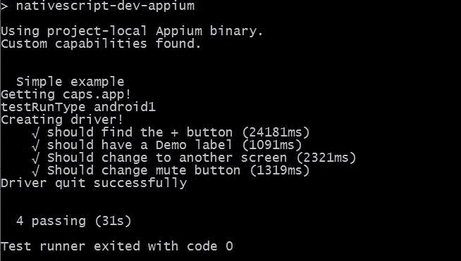

# 第十三章：使用 Appium 进行集成测试

在前一章中，我们探讨了如何进行单元测试，但单元测试并不能让你测试按钮在你的应用中是否仍然实际运行函数，或者用户向左滑动时会发生什么。为此，我们需要应用程序测试或端到端测试。好吧，让我们开始学习端到端测试；这是测试变得复杂和有趣的地方。

在本章中，我们将涵盖以下主题：

+   Appium 测试框架

+   编写 MochaJS、ChaiJS 和 ShouldJS 测试

+   如何查找并与屏幕上的元素交互

+   如何运行测试

+   Travis 和 GitHub 集成

# 集成测试

有几个完整的应用程序框架，但我们将向您展示如何使用 Appium（[`appium.io`](http://appium.io)）。Appium 是一个很棒的开源应用程序测试框架。Appium 支持 iOS 和 Android，这使它非常适合进行所有的设备测试。您想要开始创建测试，以测试应用程序中的基本流程，甚至创建更复杂的测试，以测试应用程序中的替代流程。

让我们先安装它；运行以下命令：

```ts
npm install appium wd nativescript-dev-appium --save-dev
```

上述命令安装了 Appium、Appium 通信驱动**WD**（[`admc.io/wd/`](http://admc.io/wd/)）和**NativeScript 驱动**（[`github.com/NativeScript/nativescript-dev-appium`](https://github.com/NativeScript/nativescript-dev-appium)）。WD 驱动是与 Appium 和 NativeScript 驱动进行通信的东西。`nativescript-dev-appium`是与 WD 和您的测试代码进行交互的驱动程序。实际上，NativeScript 驱动只是 WD 驱动的一个非常薄的包装器，它只是简化了一些配置，然后将 WD 驱动暴露给您的应用程序。因此，交互命令将在 WD 文档中找到。

应用程序/集成测试需要更多的工作，因为你必须以编程方式运行它，就像普通用户与你的应用程序交互一样。因此，你必须做一些事情，比如找到按钮元素，然后执行`button.tap()`。因此，你的测试可能会有点冗长，但这样可以测试任何和所有功能。不利的一面是这需要更多的时间来运行，并且在更改屏幕时需要更多的维护工作。然而，好处是当你添加代码时，它会自动验证你的应用程序在每个屏幕上是否仍然正常运行，并且你可以在多台设备和分辨率上进行测试，同样也是自动的。

安装后，你的根文件夹中将会有一个全新的`e2e-tests`文件夹。这个文件夹是你所有端到端测试文件的存放地。现在，你需要知道的一件事是，Appium NativeScript 驱动程序使用 MochaJS 测试框架（[`mochajs.org/`](https://mochajs.org/)）。Mocha 测试框架类似于我们在前一章讨论过的 Jasmine 框架。它使用相同的`describe`和`it`函数来开始测试，就像 Jasmine 一样。此外，它还使用了与 Mocha 测试框架和 WD 驱动程序紧密配合的 Chai（[`chaijs.com/`](http://chaijs.com/)）和 ShouldJS（[`github.com/shouldjs/should.js`](https://github.com/shouldjs/should.js)）测试框架。

另一件事需要注意的是，所有这些都是围绕纯 JavaScript 设计的。你可以为 Mocha、Should 和 Chai 获取类型，但对于 NativeScript Appium 驱动程序或 WD 驱动程序，类型不存在。你可以使用 TypeScript，但这有点尴尬，因为命令不仅仅是基于 WD 的命令，而是通过 mocha 链接在一起。TypeScript 很容易混淆你所在的上下文。因此，大多数 Appium 测试是用纯 JavaScript 而不是 TypeScript 创建的。但是，如果你愿意，可以自由使用 TypeScript；只需确保在运行测试之前运行`tsc`来构建`JS`文件。

# 配置

你需要做的另一个设置步骤是在项目的根文件夹中创建一个`appium.capabilities.json`文件。这基本上是一个配置文件，你可以用它来配置你需要在任何测试上运行的模拟器。该文件在 Appium 网站上有文档，但为了让你快速上手，你可以使用我们使用的简化文件，如下所示：

```ts
{
 "android44": {
   "browserName": "",
   "appium-version": "1.6.5",
   "platformName": "Android",
   "platformVersion": "4.4",
   "deviceName": "Android 44 Emulator",
   "noReset": false,
   "app": ""
 },

 "ios10phone": {
   "browserName": "",
   "appium-version": "1.6.5",
   "platformName": "iOS",
   "platformVersion": "10.0",
   "deviceName": "iPhone 6 Simulator",
   "app": ""
 }
}
```

我们已经简化了它，并删除了所有其他模拟器条目以节省空间。但是，您可以为每个模拟器条目分配一个键--您可以告诉 Appium 使用该键来运行模拟器配置。此示例文件显示了两个配置。第一个是 Android 4.4 设备，第二个是 iOS 模拟器（iPhone 6 运行 iOS 10）。您可以在此文件中拥有任意数量的配置。运行 Appium 时，您可以使用`--runType=KEY`参数告诉它要定位哪个设备。

# 创建测试

让我们开始我们的旅程，创建一个新的测试文件：`list.test.js`。此文件将测试我们的混合列表屏幕。屏幕的 HTML（`/app/modules/mixer/components/mix-list.component.html`）如下所示：

```ts
<ActionBar title="Compositions" class="action-bar">
   <ActionItem (tap)="add()" ios.position="right">
     <Button [text]="'fa-plus' | fonticon" class="fa action-item"></Button>
   </ActionItem>
</ActionBar>
<ListView [items]="(mixer$ | async)?.compositions | orderBy: 'order'" class="list-group">
 <ng-template let-composition="item">
   <GridLayout rows="auto" columns="100,*,auto" class="list-group-item">
     <Button [text]="'fa-pencil' | fonticon" (tap)="edit(composition)" row="0" col="0" class="fa"></Button>
     <Label [text]="composition.name" (tap)="select(composition)" row="0" col="1" class="h2"></Label>
     <Label [text]="composition.tracks.length" row="0" col="2" class="text-right"></Label>
   </GridLayout>
 </ng-template>
</ListView> 
```

我们在这里包含了代码，以便您可以轻松地看到我们如何使用屏幕上提供的细节进行测试。

```ts
// In JavaScript code, "use strict"; is highly recommended, 
// it enables JavaScript engine optimizations.
"use strict";

// Load the Appium driver, this driver sets up our connection to Appium 
// and the emulator or device.
const nsAppium = require("nativescript-dev-appium");
```

我们需要在 JavaScript 测试代码中包含 NativeScript Appium 驱动程序；这是用于实际通信和设置 Mocha、ShouldJS、WD、Appium 和 Chia 以正常工作的内容。仅需要以下一行代码来使用：

```ts
// Just like Jasmine, Mocha uses describe to start a testing group.
describe("Simple example", function () {

 // This is fairly important, you need to give the driver time to wait
 // so that your app has time to start up on the emulator/device.
 // This number might still be too small if you have a slow machine.
 this.timeout(100000);
```

正如源代码中的注释所提到的，非常重要的是给 Appium 和模拟器启动足够的时间。因此，我们的个人默认值是`100,000`；您可以尝试不同的数字，但这是它在宣布测试失败之前等待的最长时间。具有较大值意味着您为模拟器和 Appium 提供更多时间来实际运行。Appium 会快速提供启动输出，但当它实际上初始化测试和驱动程序时，该过程需要很长时间。一旦测试开始运行，它将非常快速：

```ts
 // This holds the driver; that will be used to communicate with Appium & Device.
 let driver;

 // This is ran once before any tests are ran. (There is also a beforeEach)
 before(function () {
    // VERY, VERY important line here; you NEED a driver to communicate to your device.
    // No driver, no tests will work.
    driver = nsAppium.createDriver();
 });
```

在运行测试之前，初始化和创建驱动程序非常重要。这个驱动程序在整个测试过程中是全局的。因此，我们将在`describe`函数中全局声明它，然后使用 Mocha 的`before`函数在运行任何测试之前初始化它。

```ts
// This is ran once at the end of all the tests. (There is also a afterEach)
after(function () {

  // Also important, the Appium system works off of promises
  // so you return the promise from the after function
  // NOTICE no ";", we are chaining to the next command.
  return driver    

    // This tells the driver to quit....
    .quit()
    // And finally after it has quit we print it finished....
    .finally(function () {
       console.log("Driver quit successfully");
    });
 });
```

我们还添加了一个 Mocha after 函数，在完成所有操作时关闭驱动程序。确保在使用驱动程序时，始终正确返回它非常重要。实际上，几乎每个测试片段都是一个 promise。如果忘记返回 promise，测试工具将会混乱，并可能按顺序运行测试，甚至在测试完成之前关闭驱动程序。因此，始终返回 promise：

```ts
// Just like jasmine, we define a test here.
it("should find the + button", function () {

  // Again, VERY important, you need to return the promise
  return driver

  // This searches for an element by the Dom path; so you can find sub items.
 .elementByXPath("//" + nsAppium.getXPathElement('Button'))
```

`it` 函数的使用方式与我们在 Jasmine 中所做的一样 - 你正在描述一个你计划运行的测试，以便在测试失败时找到它。同样，我们返回 promise 链；非常重要的是，你不要忘记这样做。driver 变量是在处理模拟器时给我们不同功能的东西。因此，功能的文档在 WD 存储库中，但我会给你一个快速概述让你开始。

`.elementByXPath` 和 `.elementById` 真的是唯一两个能够很好地正确找到 NativeScript 元素的函数。然而，还有一个 `.waitForElementByXPath` 和 `.waitForElementById`，它们都等待元素显示出来。如果你查看文档，你会发现很多 `elementByXXX` 命令，但 Appium 是为浏览器设计的，而 NativeScript 不是浏览器。这就是为什么，只有一些在 nativescript-dev-appium 驱动中被模拟的命令才能在 NativeScript DOM 中找到元素。

因此，我们的测试说通过 XPath 找到一个元素。XPath 允许你深入到你的 DOM 中并找到任何级别的组件，也可以找到其他组件的子组件。因此，如果你做类似 `/GridLayout/StackLayout/Label` 的事情，它会找到一个 `Label`，它是 `StackLayout` 的子级，而 `StackLayout` 是 `GridLayout` 的子级。使用 `*//*` 将意味着你可以在 DOM 中的任何级别找到该元素。最后，`nsAppium.getXPathElement` 是一个方法，由 Nathanael Anderson 添加到官方 NativeScript 驱动中，允许我们进行跨平台的 XPath 测试。实际上，你传递给 XPath 函数的是对象的真实本地名称。例如，Android 上的按钮是 `android.widget.Button`，或者在 iOS 上可能是 `UIAButton` 或 `XCUIElementTypeButton`。因此，因为你不想硬编码 `getByElementXPath("android.widget.Button")`，这个辅助函数将 NativeScript 的 `Button` 转换为 NativeScript 在创建按钮时实际使用的底层操作系统元素。如果将来添加一个使用 `getXPathElement` 不知道的元素的插件，你仍然可以使用这些测试的真实元素名称。

```ts
     // This element should eventually exist
     .text().should.eventually.exist.equal('\uf067');
 });
```

`.text()`是 Appium 驱动程序公开的函数，用于获取它找到的元素的文本值。`.should.eventually.exist.equal`是 Mocha 和 Should 代码。我们基本上是确保一旦找到这个项目，它实际上与 F067 的 Unicode 值匹配，在 Font-Awesome 中是加号字符（fa-plus）。一旦存在，我们就很高兴——测试要么成功，要么失败，这取决于我们是打破屏幕还是屏幕继续保持我们期望的方式。此外，在`.equal`之后，我们可以链接更多命令，比如`.tap()`，以触发按钮，如果我们想要的话。

好的，让我们看一下接下来运行的下一个测试：

```ts
it("should have a Demo label", function () {

  // Again, VERY important, you need to return the promise
  return driver

    // Find all Label elements, that has text of "Demo"
   .elementByXPath("//" + nsAppium.getXPathElement("Label") + "[@text='Demo']")

   // This item should eventually exist
   .should.eventually.exist

   // Tap it
   .tap();
});
```

这个测试搜索屏幕以显示`Demo`的`ListView`项。我们正在寻找一个包含 Demo 文本值的 NativeScript 标签（即`nsAppium.getXPathElement`）在 NativeScript DOM 中的任何位置（即`*//*`）（即`[@text='Demo']`）。这个元素应该最终存在，一旦存在，就调用`tap()`函数。现在，如果你看源代码，你会看到以下内容：

```ts
<Label [text]="composition.name" (tap)="select(composition)" row="0" col="1" class="h2"></Label>
```

所以，当`tap`被触发时，它将运行`select`函数。`select`函数最终加载`/app/modules/player/components/track-list/track-list.component.html`文件，用于在屏幕上显示该混音器项目的组成。

所有的测试都是按顺序执行的，并且应用程序的状态从一个测试保持到另一个测试。这意味着测试不像我们写单元测试时那样是独立的。

接下来我们将验证的测试是在我们点击后`Demo`标签实际上切换屏幕的下一个测试：

```ts
it("Should change to another screen", function () {

   // As usual return the promise chain...
   return driver

   // Find all Label elements, that has text of "Demo"
   .waitForElementByXPath("//" + nsAppium.getXPathElement("Label") + "[@text='Drums']")

   // This item should eventually exist
   .should.eventually.exist.text();
 });
```

所以，现在我们在一个新的屏幕上，我们将验证`ListView`是否包含一个名为`Drums`的标签。这个测试只是验证当我们在上一个测试中点击`Demo`标签时屏幕实际上是否发生了变化。我们本来可以验证文本值，但如果它存在，我们就没问题了。所以，让我们看看下一个测试：

```ts
it("Should change mute button", function () {

  // Again, returning the promise
  return driver

  // Find all Label elements that contains the FA-Volume
  .waitForElementByXPath("//" + nsAppium.getXPathElement("Label") + "[@text='\uf028']")

  // This item should eventually exist
  .should.eventually.exist

  // It exists, so tap it...
  .tap()

  // Make sure the text then becomes the muted volume symbol
  .text().should.eventually.become("\uf026");
});

// This closes the describe we opened at the top of this test set.
});
```

我们的最后一个示例测试展示了链接。我们搜索具有音量控制符号的标签。然后，一旦它存在，我们点击它。然后，我们验证文本实际上变成了关闭音量符号。`f028`是`fa-volume-up`的 Font Awesome Unicode 值，`f026`是`fa-volume-off`的 Font Awesome Unicode 值。

所以现在你有了这个非常酷的测试，你想要启动你的模拟器。模拟器应该已经在运行。你还应该确保你的设备上有最新版本的应用程序。然后，要运行测试，只需输入以下命令：

```ts
npm run appium --runType=android44
```

确保你输入你将要使用的运行类型配置，并且几分钟后你应该会看到类似这样的东西：



请记住，Appium 的端到端测试需要一段时间才能启动，所以如果它看起来冻结了一段时间，不要惊慌并退出。第一个测试可能需要 24 秒，每个额外的测试需要几秒。第一个测试包含了所有的时间。Appium 在启动驱动程序和模拟器上的应用程序时需要很长时间是正常的。这种延迟通常发生在你看到前几行文本打印出来之后，就像前面的屏幕显示的那样，所以，请耐心等待。

# 更多的 Appium 测试

我想要包括另一个测试（在这个应用程序中没有使用）我以前为一个不同的项目编写过，因为这将让你了解 Appium 有多么强大：

```ts
it("should type in an element", function (done) {
  driver
  .elementByXPath('//' + nsAppium.getXPathElement("EditText") + "[@text='Enter your name']") 
  .sendKeys('Testing')
  .text()
  .then(function (v) {
     if ('Testing' !== v) {
        done(new Error("Value in name field does not match"));
     } else {
        done();
     }
   }, done);
 });
});
```

你可能注意到的第一件事是，我没有返回 promise 链。这是因为这个例子展示了如何使用`it`的异步支持。对于异步支持，你可以使用 promise 或者让传入`it`的函数有一个`done`回调函数。当 Mocha 检测到`it`中的回调函数时，它将以异步模式运行你的`it`测试，并且不需要 promise 来让它知道可以继续进行下一个测试。有时，你可能只想保持完全控制，或者你可能正在调用需要异步回调的代码。

这个测试查找包含`输入你的名字`的`EditText`元素。然后，它使用`sendKeys`实际输入*Testing*。接下来，它要求从字段中获取`text`，并使用 promise 的`then`部分来检查该值是否与硬编码的 testing 相匹配。当所有的操作都完成时，它调用`done`函数。如果你向`done`函数传递一个`Error`对象，那么它就知道测试失败了。所以，你可以在`if`语句中看到我们传递了一个`new Error`，并且我们将`done`函数放在`then`语句的`catch`部分。

我们只是触及了 Appium、Should、Mocha 和 Chia 可以做的一小部分。您几乎可以控制应用程序的所有方面，就好像您手动执行每个步骤一样。最初，在您的开发中，手动测试速度要快得多。然而，当您开始构建端到端的测试时，每次进行更改时，您都可以检查应用程序是否仍然正常工作，而无需花费大量时间坐在多个设备前--您只需开始测试，稍后查看结果。

# 自动化测试

您应该注意的另一件事是，您使测试自动化程度越高，您就越有可能使用它并从中获益。如果您不断地手动运行测试，您很可能会感到恼火并停止运行它们。因此，在我们看来，自动化这一点至关重要。由于有许多关于这个主题的书籍，我们只会给您一些指针，让您可以进行研究，然后继续前进。

大多数源代码控制系统都允许您创建钩子。通过这些钩子，您可以创建一个提交钩子，以便在检入任何新代码时运行您的测试框架。这些钩子通常很容易创建，因为它们只是简单的脚本，每次提交时都会运行。

此外，如果您正在使用 GitHub，有一些网站（如 Travis）可以轻松地与之集成，而无需进行任何钩子更改。

# GitHub 和 Travis 集成

以下是如何与 GitHub 和 Travis 进行一些集成；这将允许我们在前一章中讨论的 NativeScript 测试框架自动在每次更改或拉取请求时运行您的测试。在 GitHub 存储库的根目录中创建一个新的`.travis.yml`文件。此文件应如下所示：

```ts
language: android

jdk: oraclejdk8

android:
 components:
 - tools
 - platform-tools
 - build-tools-25.0.2
 - android-25
 - extra-android-m2repository
 - sys-img-armeabi-v7a-android-21

before_cache:
 - rm -f $HOME/.gradle/caches/modules-2/modules-2.lock

cache:
 directories:
 - .nvm
 - $HOME/.gradle/caches/
 - $HOME/.gradle/wrapper/

install:
 - nvm install node
 - npm install -g nativescript
 - tns usage-reporting disable
 - tns error-reporting disable

before_script:
 - echo no | android create avd --force -n test -t android-21 -b armeabi-v7a
 - emulator -avd test -no-audio -no-window &
 - android-wait-for-emulator

script:
 - npm run travissetup
 - npm run travistest
```

基本上，这配置了 Travis 启动 Android 模拟器；它等待模拟器启动，然后运行`npm`命令。您可以从您的`package.json`中了解这些`npm`命令的作用。

因此，在您的根应用程序中，也就是您的应用程序的 package.json 文件中，您需要添加以下键：

```ts
"scripts": {
   "travissetup": "npm i && tns platform add android && tns build android",
   "travistest": "tns test android"
}
```

通过这两个更改，Travis 将自动测试您存储库中的每个拉取请求，这意味着您可以编写代码，Travis 将持续进行所有单元测试。

此外，您可以更改前面的 Travis 配置文件，以添加 Appium 的安装和运行，只需执行以下操作：

+   将 Appium 依赖项添加到您的主`package.json`依赖项中。

+   在项目的根目录中添加一个具有`travisAndroid`键的`appium.capabilities.json`。

+   在`package.json`文件中的`travistest`键中添加`&& npm run appium --runType=travisAndroid`。

GitHub 已经内置了与 Travis 的集成，因此很容易进行文档化并运行。如果您使用 Gitlabs，可以使用 Gitlabs CI 系统进行测试。此外，您还可以使用存储库钩子来使用许多其他可用的持续集成服务。最后，您还可以开发自己的持续集成服务。

# 摘要

在本章中，我们介绍了如何安装和运行 Appium，如何构建完整的端到端测试以及如何使用测试框架全面测试您的屏幕。此外，我们还介绍了自动运行单元测试和 Appium 的重要性，而您可以使用 Travis 和 GitHub 来实现这一点。

现在紧紧抓住——我们将快速转向并开始讨论如何部署和使用 Webpack 来优化您的发布构建。
