# 第十五章：部署到苹果应用商店

在这一章中，我们将重点讨论如何将我们的应用部署到苹果应用商店。我们将要遵循几个重要的步骤，所以请密切关注这里呈现的所有细节。

无论您是否需要使用签名证书来构建我们应用的发布目标，生成应用图标和启动画面，还是在 XCode 中为上传到应用商店归档我们的应用，我们将在本章中涵盖所有这些主题。

NativeScript 专家、Progress 的开发者倡导者 TJ VanToll 撰写了一篇关于部署步骤的优秀文章，标题为*8 Steps to Publish Your NativeScript App to the App Stores* ([`www.nativescript.org/blog/steps-to-publish-your-nativescript-app-to-the-app-stores`](https://www.nativescript.org/blog/steps-to-publish-your-nativescript-app-to-the-app-stores))。我们将从该文章中摘录内容，并在本章和下一章中尽可能扩展各个部分。

没有必要欺骗你——将 iOS 应用发布到 iOS 应用商店是您在软件开发生涯中将经历的最痛苦的过程之一。所以，如果您在这些步骤中遇到困难或困惑，只需知道不仅是您——每个人在首次发布 iOS 应用时都会感到沮丧。

本章涵盖以下主题：

+   如何创建应用 ID 和生产证书以签署您的应用发布目标

+   如何配置 NativeScript 应用程序所需的适当元数据以进行发布

+   如何处理应用图标和启动画面

+   使用 NativeScript CLI 将您的构建上传到 iTunes Connect

# 为应用商店分发做准备

要将 iOS 应用程序部署到 iOS 应用商店，您绝对必须拥有一个活跃的苹果开发者帐户。加入该计划每年需要 99 美元，并且您可以在[developer.apple.com/register](https://developer.apple.com/register)上注册。

# 应用 ID、证书和配置文件

一旦您创建了苹果开发者帐户，您将需要在苹果开发者门户上创建应用 ID、生产证书和分发配置文件。这是整个过程中最繁琐的部分，因为需要一些时间来学习这些各种文件的作用以及如何使用它们：

1.  对于我们的应用，我们将从以下内容开始创建应用 ID：

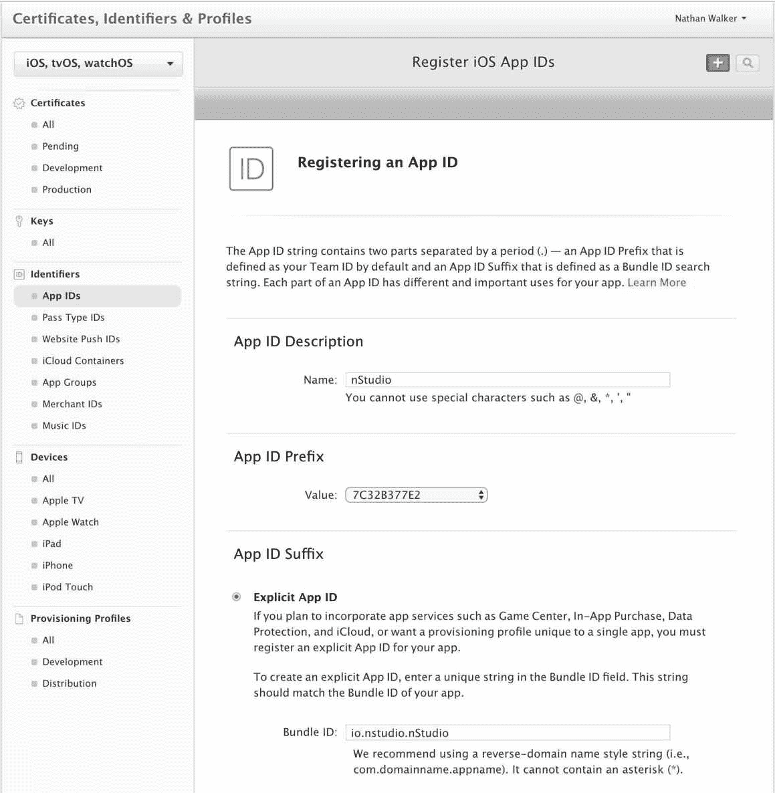

1.  一旦我们创建了这个应用 ID，我们现在可以创建一个生产证书：

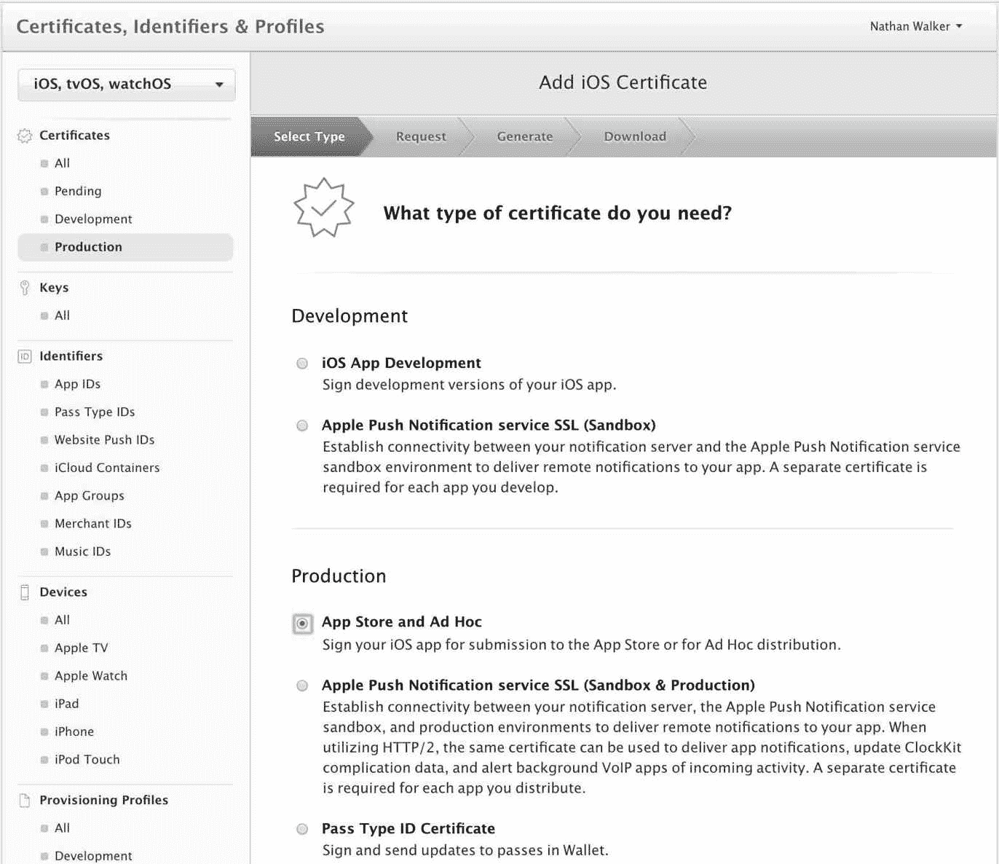

1.  选择继续。然后，下一个屏幕将提供有关如何签署您的生产证书的说明，接下来我们将详细介绍。首先，打开`/Applications/Utilities/Keychain Access.app`，然后转到左上角菜单，选择 Certificate Assistant | Request a Certificate from a Certificate Authority，使用此设置：

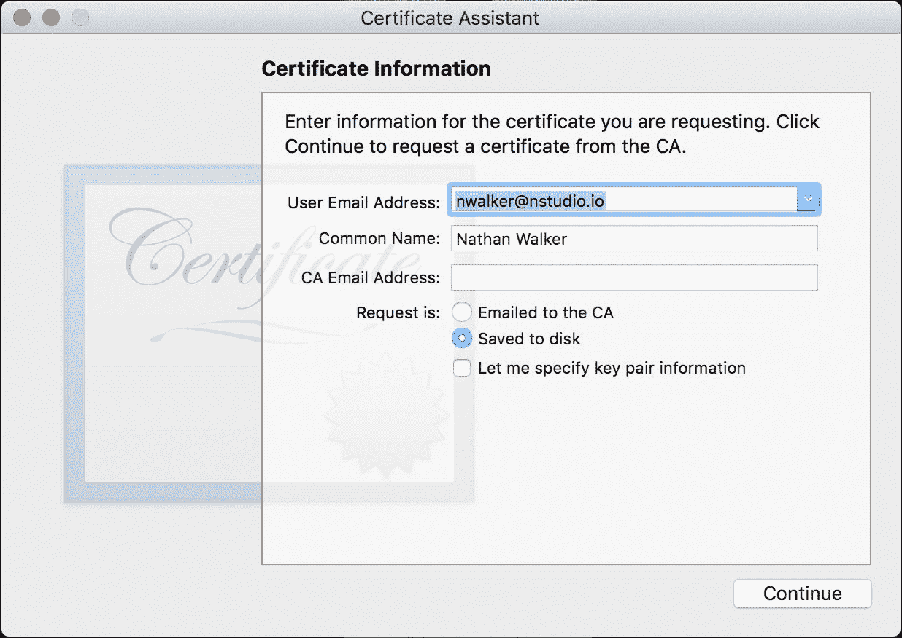

这将在您选择的任何位置保存一个签名请求文件，您将在下一步中需要它。

1.  现在，在门户网站的这一步中选择签名请求文件：

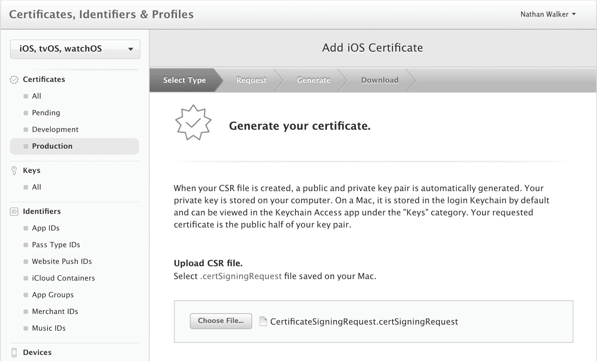

1.  在下一个屏幕上，非常重要的是下载然后双击需要安装到您的钥匙串的文件，因为它指定了：

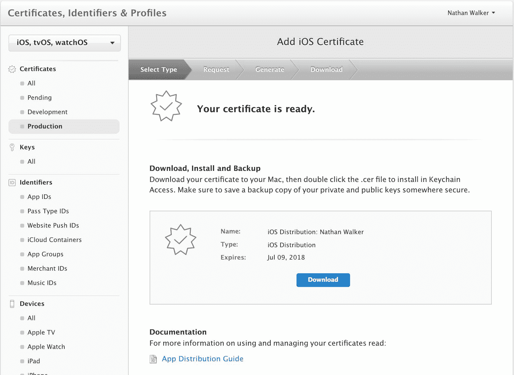

1.  双击文件安装到钥匙串时，可能会提示您提供要安装文件的钥匙串；使用*登录*钥匙串将正常工作：

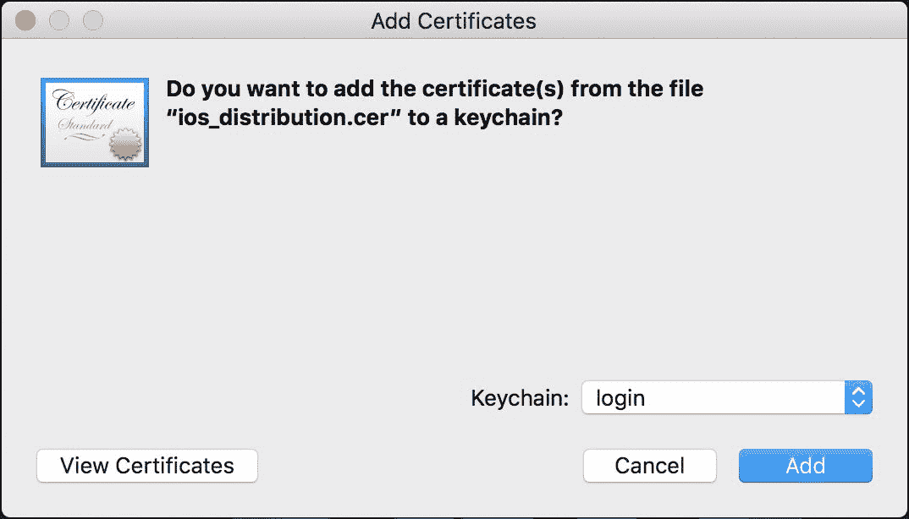

现在，在您的钥匙串访问应用程序中应该看到类似以下截图的内容：

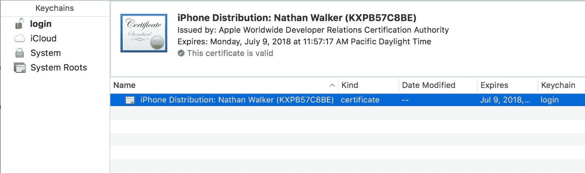

1.  现在，您可以退出钥匙串访问。

1.  接下来，我们要创建一个分发配置文件：

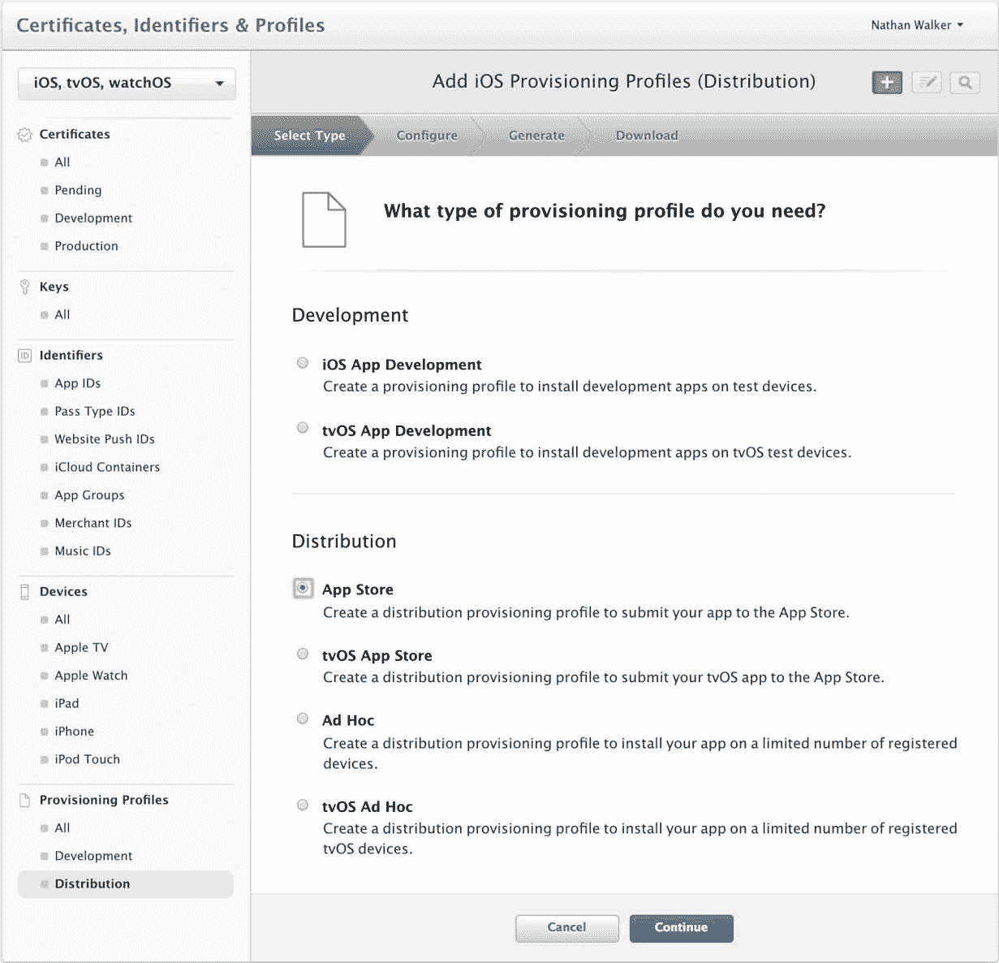

1.  在下一个屏幕上，只需确保选择您创建的应用程序 ID：

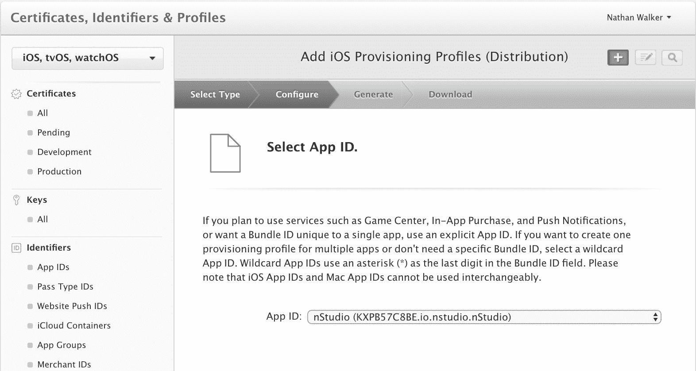

1.  然后，在下一个屏幕上，您应该能够选择您创建的分发证书：

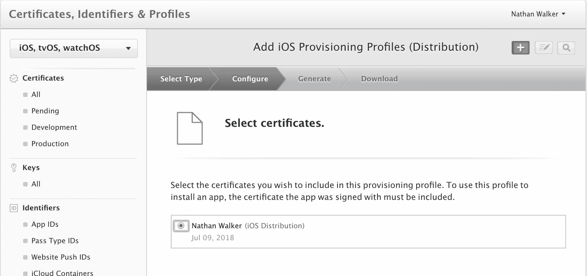

1.  然后，您将能够为配置文件命名：

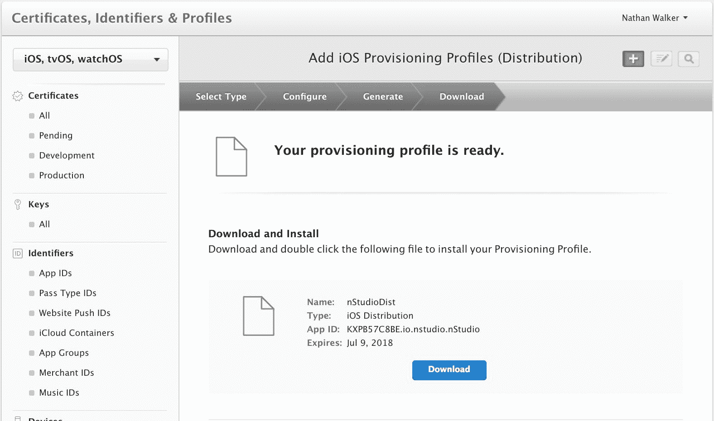

1.  您可以下载配置文件并将其放在`ios_distribution.cer`文件旁边；但是，没有必要打开该配置文件，因为 XCode 将处理其他所有内容。

# 配置应用程序元数据，如应用程序 ID 和显示名称

iOS 和 Android 应用程序有很多信息，您需要在将应用程序部署到各自的商店之前进行配置。NativeScript 为许多这些值提供了智能默认值，但在部署之前，您可能需要审查其中一些值。

# 应用程序 ID

刚刚在苹果开发者门户网站配置的应用程序 ID 是使用称为反向域名表示法的唯一标识符。我们的 NativeScript 应用程序的元数据必须匹配。我们的应用程序 ID 是`io.nstudio.nStudio`。NativeScript CLI 在创建应用程序时有一种设置应用程序 ID 的约定：

```ts
 tns create YourApp --appid com.mycompany.myappname
```

我们在创建应用程序时没有使用此选项；但是，更改我们的应用程序 ID 非常容易。

打开应用程序的根`package.json`文件，找到`nativescript`键。确保`id`属性包含您想要使用的值：

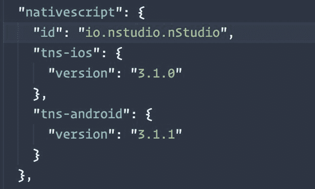

# 显示名称

您应用程序的显示名称是用户在屏幕上看到的图标旁边的名称。默认情况下，NativeScript 根据您传递给`tns create`的值设置应用程序的显示名称，这通常不是您希望用户看到的内容。例如，运行`tns create my-app`会导致一个显示名称为`myapp`的应用程序。

要在 iOS 上更改该值，首先打开您的应用程序的`app/App_Resources/iOS/Info.plist`文件。`Info.plist`文件是 iOS 的主要配置文件，在这里，您可能希望在发布应用程序之前调整一些值。对于显示名称，您需要修改`CFBundleDisplayName`值。

这是`nStudio`的值：

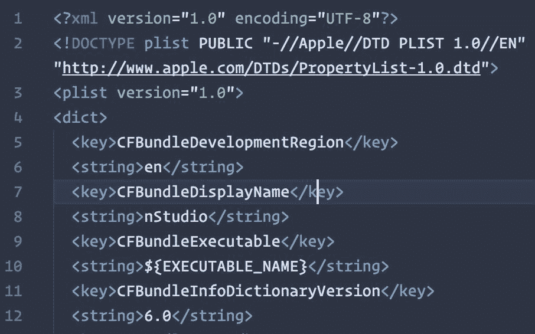尽管显示名称没有真正的字符限制，但 iOS 和 Android 都会在大约 10-12 个字符左右截断您的显示名称。

# 创建您的应用程序图标和启动画面

您的应用程序图标是用户注意到您的应用程序的第一件事。当您启动一个新的 NativeScript 应用程序时，您将获得一个占位符图标，这对于开发来说是可以的；但是，对于生产，您需要用您想要上架的图像替换占位符图标。

为了将您的生产就绪的应用程序图标文件放置到位，您需要首先创建一个代表您的应用程序的 1024 x 1024 像素的`.png`图像资产。

为了让您的生活困难，iOS 和 Android 都要求您提供各种尺寸的图标图像。不过不用担心；一旦您有了 1024 x 1024 的图像，有一些网站可以生成 Android 和 iOS 所需的各种尺寸的图像。对于 NativeScript 开发，我建议您使用 Nathanael Anderson 的 NativeScript Image Builder，该工具可在`images.nativescript.rocks`上使用。

我们将在 Photoshop 中构建我们的图标：

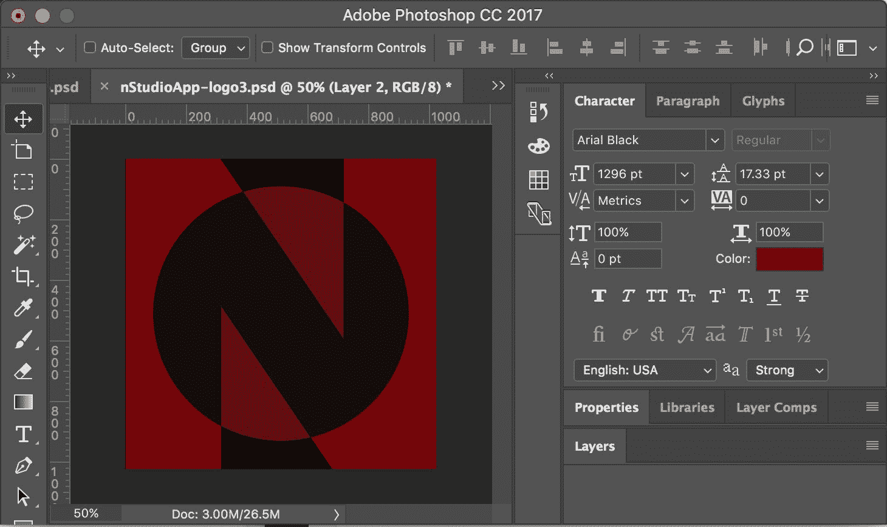

然后，我们可以将其导出为`.png`并上传到`images.nativescript.rocks`：

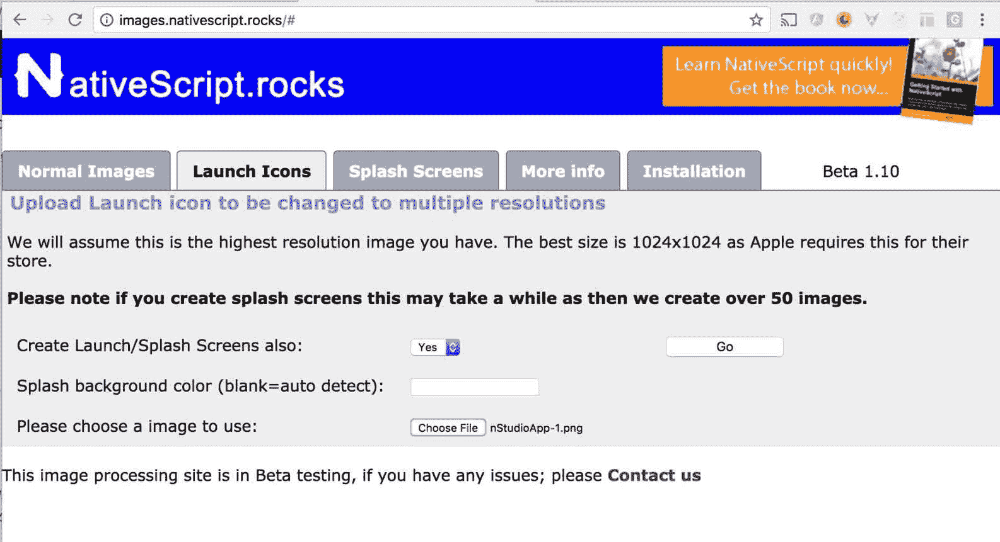

当您点击 Go 时，将下载一个 zip 文件，其中包含您的应用程序图标和启动画面。您可以将这些图像分别复制到您的`app/App_Resources`文件夹中，用于 iOS（我们将在下一章中介绍 Android）。

现在我们已经放置了我们的应用程序图标和启动画面。

# 构建发布应用程序

由于我们在前一章已经涵盖了 webpack 捆绑问题，现在我们准备使用以下命令构建最终可发布的捆绑包：

```ts
npm run build-ios-bundle -- --release --forDevice --teamId KXPB57C8BE
```

请注意，`--teamId`对您来说将是不同的。这是在前面的命令中提供的 App ID 的前缀。

当此命令完成后，您将在`platforms/ios/build/device`文件夹中获得`.ipa`文件。请记下该文件的位置，因为您将在本指南的最后一步中需要它。

哦！希望你已经一路顺利到达这一步。现在，你已经准备好进行最后一步，即 iTunes Connect。

# 上传到 iTunes Connect

您需要做的第一件事是注册您的应用程序。要做到这一点，访问[`itunesconnect.apple.com/`](https://itunesconnect.apple.com/)，点击我的应用程序，然后点击+按钮（目前位于屏幕左上角），然后选择新应用程序。在接下来的屏幕上，确保您选择了正确的 Bundle ID，SKU 可以是您想要识别您的应用程序的任何数字；我们喜欢使用当前日期：

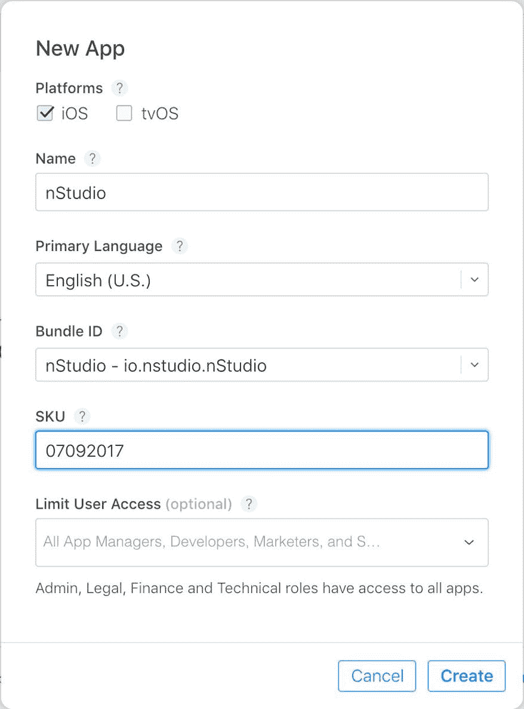

提供完这些信息后，您将被带到您的应用程序仪表板，我们需要提供有关我们的应用程序的更多元数据。大部分信息都很简单，比如描述和定价，但还有一些*有趣*的部分需要处理，比如屏幕截图。

iTunes Connect 现在要求您上传两套屏幕截图，一套用于最大的 iPhone 设备（5.5 英寸显示屏），另一套用于最大的 iPad 设备（12.9 英寸设备）。苹果仍然允许您为每个 iOS 设备尺寸提供优化的屏幕截图，但如果您只提供 5.5 英寸和 12.9 英寸的屏幕截图，苹果将自动为较小的显示设备重新调整您提供的屏幕截图。

要获得这些屏幕截图，我们可以在物理 iPhone Plus 和 iPad Pro 设备上运行应用程序，但我们发现从 iOS 模拟器获取这些屏幕截图要容易得多。

在正确的模拟设备运行时，我们可以使用模拟器的*Cmd* + *S*键盘快捷键来对应用程序进行截图，这将把适当的图像保存到我们的桌面上。

到目前为止，我们已经准备就绪。我们将使用 DaVinci 等服务（[`www.davinciapps.com`](https://www.davinciapps.com/)）来优化我们的图像文件，但当我们准备好时，我们将把我们的图像拖放到 iTunes Connect 的 App 预览和屏幕截图区域。

# 上传您的.ipa 文件

我们快要完成了！一旦所有信息都被输入到 iTunes Connect 中，最后一步就是将构建的.ipa 文件与我们刚刚输入的所有信息关联起来。

我们将使用 NativeScript CLI 来完成这个过程。

请记住，你的.ipa 文件在你的应用程序的`platforms/ios/build/device`文件夹中。

运行以下命令将你的应用程序发布到 iTunes Connect：

```ts
tns publish ios --ipa <path to your ipa file>
```

就是这样。不过，有一点重要的注意事项，无论出于什么疯狂的原因，你上传 iOS 应用程序和应用程序在 iTunes Connect 中显示之间存在着相当大的延迟。我们看到这种延迟可能短至 30 秒，长至 1 小时。一旦构建出现在那里，我们就可以点击大大的“提交审核”按钮，然后祈祷。

苹果对于审核你提交的 iOS 应用程序有着臭名昭著的不定期延迟。在撰写本书时，iOS App Store 的平均审核时间大约为 2 天。

# 总结

在本章中，我们强调了发布应用程序到苹果应用商店所必须采取的关键步骤，包括签名证书、应用程序 ID、应用图标和启动画面。这个过程一开始可能看起来很复杂，但一旦你更好地理解了各个步骤，它就会变得更清晰。

我们现在在商店中有一个待审核的应用程序，并且正在朝着让我们的应用程序在全球范围内为用户提供的目标迈进。

在下一章中，让我们通过将我们的应用程序部署到 Google Play 商店来扩大我们的受众群体。
