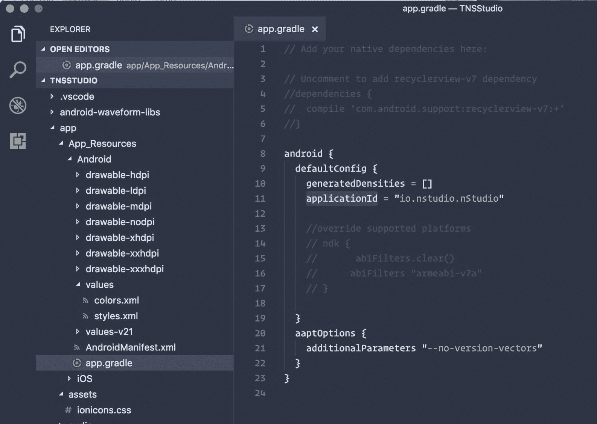
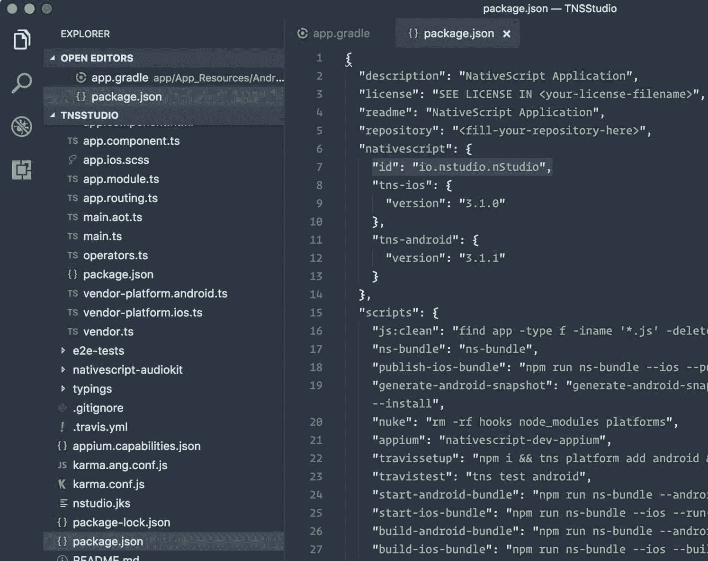
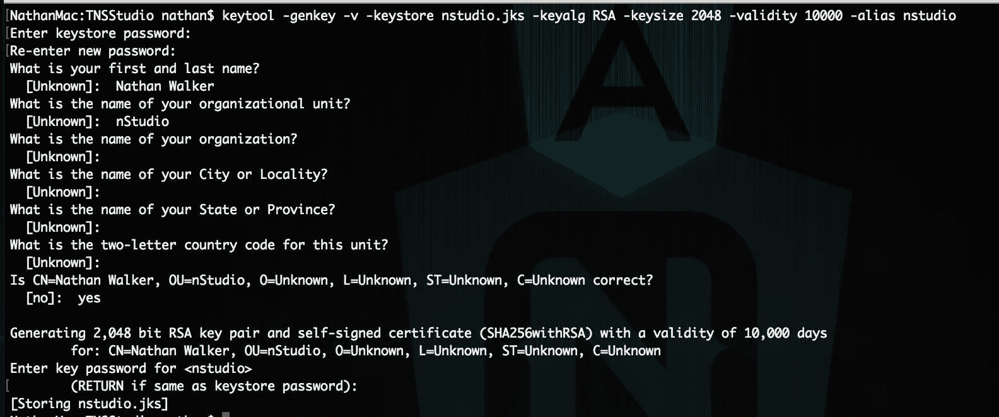
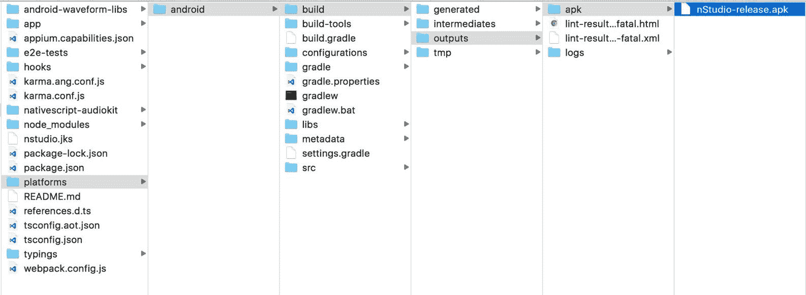
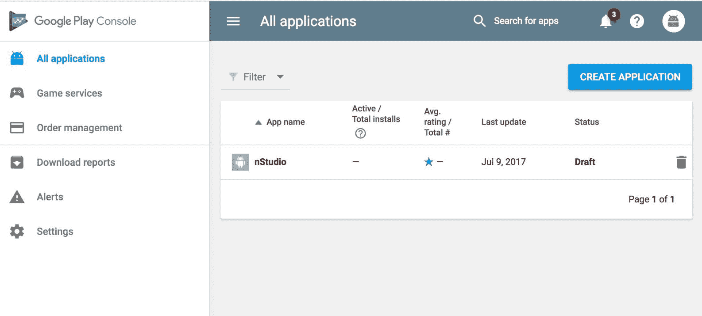
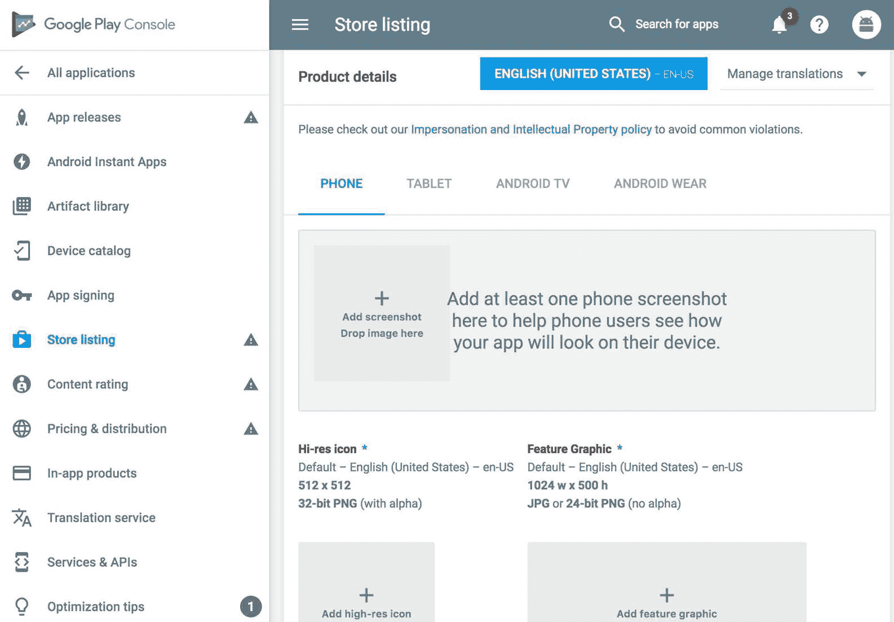
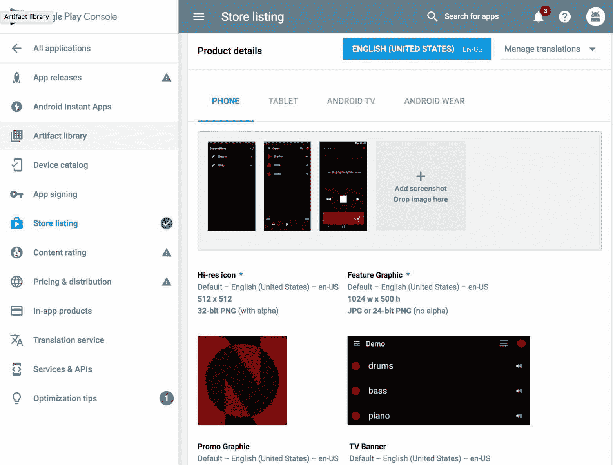
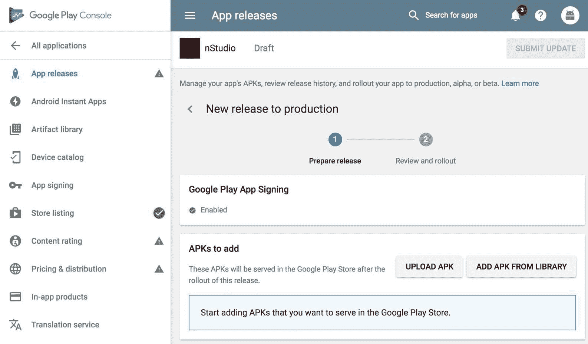
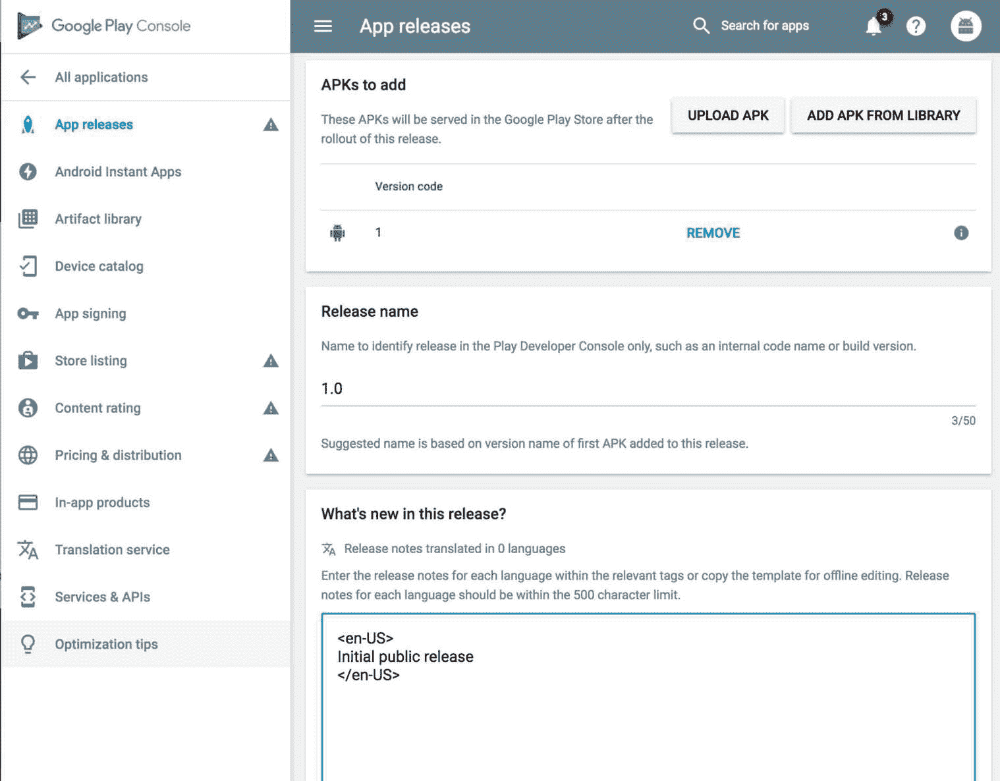

# 第十六章：部署到 Google Play

尽管与苹果应用商店相比，将应用部署到 Google Play 可能稍微简单一些，但我们仍然需要注意一些关键步骤。我们在第十四章 *使用 webpack 捆绑进行部署准备*和第十五章 *部署到苹果应用商店*中涵盖了一些准备步骤，例如使用 webpack 捆绑应用程序和准备应用程序图标和启动画面，因此我们将直接进入构建可发布的 APK。 

我们要感谢 TJ VanToll 为我们提供了一篇出色的八步文章，用于部署 NativeScript 应用（[`www.nativescript.org/blog/steps-to-publish-your-nativescript-app-to-the-app-stores`](https://www.nativescript.org/blog/steps-to-publish-your-nativescript-app-to-the-app-stores)），我们将从中插入摘录，并在可能的情况下进行扩展。

本章涵盖以下主题：

+   生成用于构建 APK 的密钥库

+   使用 NativeScript CLI 构建可发布的 APK

+   将 APK 上传到 Google Play 以供发布

# 为 Google Play 构建 APK

在您打开 Google Play 注册和发布此应用之前（这是下一步），让我们仔细检查一些事项，以确保我们的元数据是正确的。

打开`app/App_Resources/Android/app.gradle`，确保`applicationId`对于您的包名称是正确的：



此外，还要在项目根目录下打开`package.json`，并为了谨慎起见，再次检查`nativescript.id`：



现在，您需要为您的应用生成一个可执行的 Android 文件。在 Android 上，此文件具有`.apk`扩展名，您可以使用 NativeScript CLI 生成此文件。

您在 NativeScript 开发期间使用的`tns run`命令实际上为您生成了一个`.apk`文件，并将该文件安装在 Android 模拟器或设备上。但是，对于 Google Play 发布，您创建的构建还必须进行代码签名。如果您想深入了解加密细节，可以参考 Android 的文档（[`developer.android.com/studio/publish/app-signing.html`](https://developer.android.com/studio/publish/app-signing.html)）进行代码签名，但在高层次上，您需要执行以下两个操作来创建 Android 应用的发布版本：

+   创建一个`.keystore`或`.jks`（Java 密钥库）文件

+   使用`.keystore`或`.jks`文件登录到应用程序进行构建

Android 文档为你提供了一些关于如何创建密钥库文件的选项（[`developer.android.com/studio/publish/app-signing.html#release-mode`](https://developer.android.com/studio/publish/app-signing.html#release-mode)）。我们首选的方法是`keytool`命令行实用程序，它包含在 NativeScript 为你安装的 Java JDK 中，因此应该已经在你的开发机器的命令行中可用。

要使用`keytool`为我们的应用程序生成代码签名的密钥库，我们将使用以下命令：

```ts
keytool -genkey -v -keystore nstudio.jks -keyalg RSA -keysize 2048 -validity 10000 -alias nstudio
```

`keytool`实用程序会问你一些问题，其中有一些是可选的（组织名称和城市、州和国家的名称），但最重要的是密钥库和别名的密码（稍后会详细介绍）。当我们生成密钥库时，`keytool`的过程如下：



在我们继续讨论如何使用这个`.jks`文件之前，有一件重要的事情你需要知道。把这个`.jks`文件放在一个安全的地方，并且不要忘记密钥库或别名的密码。（个人而言，我喜欢使用相同的密码来简化我的生活。）Android 要求你使用完全相同的`.jks`文件来登录到应用程序的任何更新中。这意味着如果你丢失了这个`.jks`文件，或者它的密码，你将无法更新你的 Android 应用程序。你将不得不在 Google Play 中创建一个全新的条目，你现有的用户将无法升级——所以要小心不要丢失它！

哦，还有一件需要注意的事情是，大多数情况下，你会想要使用一个单一的密钥库文件来登录到你个人或公司的所有 Android 应用程序。记得你需要向 keytool 实用程序传递一个-alias 标志，以及该别名有自己的密码吗？事实证明，一个密钥库可以有多个别名，你会想为你构建的每个 Android 应用程序创建一个别名。

好的，现在你有了这个`.jks`文件，并且你已经把它存储在一个安全的地方，剩下的过程就相当容易了。

使用 webpack 构建我们的 Android 应用程序，并传递刚刚用来创建`.jks`文件的信息。例如，以下命令用于创建`nStudio`的发布构建：

```ts
npm run build-android-bundle -- --release --keyStorePath ~/path/to/nstudio.jks --keyStorePassword our-pass --keyStoreAlias nstudio --keyStoreAliasPassword our-alias-pass
```

一旦命令运行完成，您将在应用程序的`platforms/android/build/outputs/apk`文件夹中获得一个可发布的`.apk`文件；请注意该文件的位置，因为您将在下一步-在 Google Play 上部署您的应用程序时需要它：



# 上传到 Google Play

Google Play 是 Android 用户查找和安装应用的地方，而 Google Play 开发者控制台（[`play.google.com/apps/publish/`](https://play.google.com/apps/publish/)）是开发人员注册和上传应用供用户使用的地方。

您将首先按名称创建一个新应用，然后将其列出：



Android 关于上传应用程序和设置商店列表的文档非常好，因此我们不会在这里重复所有这些信息。相反，我们将提供一些提示，这些提示在将您自己的 NativeScript 应用程序上传到 Google Play 时可能会有所帮助。

在 Google Play 开发者控制台的商店列表选项卡中，您将需要提供应用程序运行时的至少两个屏幕截图，如下所示：



使用`tns run android --emulator`命令在 Android 虚拟设备（AVD）上启动您的应用。Android AVD 具有内置的方法，可以使用模拟器侧边栏中的小相机图标来截取屏幕截图。

使用此按钮来截取应用程序中最重要的屏幕的几个屏幕截图，图像文件本身将出现在您的桌面上。此外，还需要一个 1024 x 500 的特色图像文件，它将显示在您商店列表的顶部，如下图所示：



尽管在上述屏幕截图中没有显示，但我们建议您使用 DaVinci（[`www.davinciapps.com`](https://www.davinciapps.com)）等服务为您的屏幕截图增添一些特色，并将它们制作成一个小教程，展示您的应用的功能。

# APK

Google Play 开发者控制台的应用发布部分是您上传在本章前一步骤中生成的`.apk`文件的地方。

当您查看应用发布部分时，您可能会看到有关选择加入 Google Play 应用签名的提及。最好现在选择加入，而不是以后。一旦您选择加入，它将显示为已启用：



然后，您可以继续上传应用程序的 apk 文件到`platforms/android/build/outputs/apk`文件夹中。

一旦您上传了您的 APK 文件，您应该在同一页上看到它列出，您可以在那里为上传的版本输入多种语言的发布说明：



在您点击该页面上的“保存”按钮后，您可能会想返回到商店列表部分，完成填写您应用的所有信息。一旦一切就绪，您就可以提交您的应用了。Android 应用的审核通常需要几个小时，除非 Google 标记出任何问题，您的应用应该在 Google Play 上可用，大约需要半天左右。

# 总结

哇哦！我们在 Apple App Store 和 Google Play 商店中从*零到发布*构建了一个应用。这是一次充满曲折和转折的冒险。我们真诚地希望这为您深入了解了 NativeScript 和 Angular 应用开发，并为那些好奇的人解开了这个激动人心的技术堆栈的任何领域。

NativeScript 和 Angular 都有蓬勃发展的全球社区，我们鼓励您参与其中，分享您的经验，并与他人分享您和您的团队可能正在进行的所有激动人心的项目。永远不要犹豫寻求帮助，因为我们都对这两种技术的热爱和钦佩负有责任。

还有一些其他有用的资源可以查看：

+   [`forum.nativescript.org`](http://forum.nativescript.org)

+   [`nativescript.rocks`](http://nativescript.rocks)

当然还要了解文档！

[`docs.nativescript.org/angular/start/introduction.html`](http://docs.nativescript.org/angular/start/introduction.html)

干杯！
