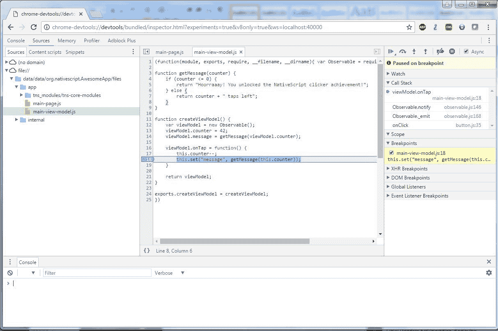
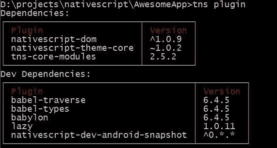
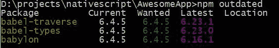
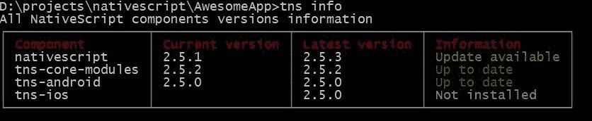
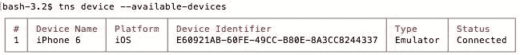

# 第六章：在 iOS 和 Android 上运行应用

有几种方法可以构建、运行和开始使用 NativeScript 应用。我们将介绍命令行工具，因为它们是目前最支持的方法，也是处理任何 NativeScript 项目的最佳方式。

为了简化我们的理解，我们将首先介绍我们将经常使用的命令，然后我们将介绍其他不那么常用的命令。所以，让我们开始，并介绍您想要了解的命令。

在本章中，我们将涵盖以下主题：

+   如何运行应用

+   如何启动调试器

+   如何构建用于部署的应用

+   如何启动测试框架

+   如何运行 NativeScript 诊断

+   所有关于 Android 密钥库的内容

# 接收命令……

我们将要介绍的第一条命令是您每次都会使用的

启动您的应用。为了使事情更简单，我将使用`<platform>`来表示 iOS、Android，或者当它最终得到支持时，Windows。

# tns run <platform>

使用`tns run <platform>`命令将自动构建您的应用并将其同步到设备和模拟器。它将完成所有繁重的工作，尝试使您的应用在设备上运行，然后启动应用。这个命令在多年中已经发生了变化，现在已经成为一个相当智能的命令，会自动做出某些选择以简化您的发展生活。这个命令的一个酷炫功能是它会将您的应用同步到所有正在运行和连接的设备。如果您连接了五台不同的设备，所有这五台设备都会接收到更改。这仅适用于每个平台，但您可以在一个命令窗口中运行`tns run ios`，在另一个命令窗口中运行`tns run android`，然后任何更改都将自动同步到连接到您的机器的所有设备。正如您可能想象的那样，这在测试和清理阶段非常有用，以确保在不同手机和平板电脑上一切看起来都很好。如果您没有将物理设备连接到您的计算机，它将自动为您启动一个模拟器。

通常情况下，由于应用已经存在于设备上，它只会快速同步已更改的文件。这是一个非常快速的过程，因为它只是将你的文件中的所有更改从你的`app`文件夹传输到所有连接的设备，然后启动应用。这个过程在大多数情况下是非常好的。然而，`tns run <平台>`并不会总是自动检测到你的`node_modules`文件夹中的任何更改，例如，当你升级插件时。如果出现这种情况，你需要取消当前正在运行的`tns run`，然后启动一个新的`tns run`。偶尔，`tns run`仍然认为它只需要同步，而实际上它应该需要重新构建应用。在这种情况下，你将想要使用方便的`--clean`选项。这在设备似乎没有检测到任何更改的时候非常重要。`tns run <平台> --clean`命令通常将强制应用重新构建；然而，如果`--clean`无法重新构建，那么请查看本章后面描述的`tns build`命令。还有一些其他命令参数使用得不多，但你可能需要它们来处理特定情况。`--justlaunch`将启动应用而不做其他任何事情；`--no-watch`将禁用实时同步，最后`--device <设备 ID>`将强制应用仅安装到特定的设备上。你可以通过运行`tns devices`来查看哪些设备可用于安装应用。

# tns debug <平台>

我们接下来要讨论的命令是`tns debug <平台>`；这将允许你使用调试工具测试你的应用。这与`tns run`命令类似；然而，它不是运行你的应用，而是调试它。调试器将使用标准的 Chrome 开发工具，这使你能够逐步执行代码：断点、调用栈和控制台日志。此命令将提供一个 URL，你可以使用它来在 Chrome 中打开。在 iOS 特定情况下，你应该运行`tns debug ios --chrome`以获取 chrome-devtools 的 URL。以下是通过 Chrome 调试器调试 Android 的示例：



一些与`tns run`相同的参数在这里也是有效的，例如`--no-watch`、`--device`和`--clean`。除了这些命令之外，还有一些其他命令可用，例如`--debug-brk`，它用于使应用在应用启动时中断，这样你就可以在启动过程继续之前轻松设置断点。`--start`和`--stop`允许你附加和从已运行的应用中分离。

不要忘记，如果你目前正在使用调试器，JavaScript 有一个酷炫的`debugger;`命令，它将强制附加的调试器中断，就像你设置了断点一样。这可以用来在代码的任何地方设置断点，如果没有附加调试器，则会被忽略。

# tns build <平台>

你需要了解的下一个命令是 `tns build <platform>`；这个命令会从头开始完全构建一个新的应用程序。现在，这个命令的主要用途是在你想要构建一个调试或发布版本的应用程序，以便将其提供给其他人进行测试或上传到某个商店时使用。然而，它也可以用来强制进行应用程序的完全清洁构建，如果你的应用程序的 `tns run` 版本处于一种奇怪的状态--这将进行完全重建。如果你不包含 `--release` 标志，构建将是默认的调试构建。

在 iOS 上，你将使用 `--for-device`，这将使应用程序为真实设备而不是模拟器进行编译。记住，你需要从苹果那里获得签名密钥才能进行适当的发布构建。

在 Android 上，当你使用 `--release` 时，你需要包含以下所有 `--key-store-*` 参数；这些参数是用于对你的 Android 应用程序进行签名所必需的：

| `--key-store-path` | 你的密钥库文件所在的位置。 |
| --- | --- |
| `--key-store-password` | 读取你的密钥库中任何数据的密码。 |
| `--key-store-alias` | 这个应用程序的别名。因此，在你的密钥库中，你可能将 `AA` 作为别名，在你的心中它等于 AwesomeApp。我更喜欢将别名设置为应用程序的完整名称，但这完全取决于你。 |
| `--key-store-alias-password` | 这是读取你刚刚设置的别名所分配的实际签名密钥所需的密码。 |

由于密钥库的处理可能会让人困惑，我们在这里将稍微偏离路径，讨论如何实际创建一个密钥库。这通常只是一件一次性的事情，你需要为每个你想要发布的 Android 应用程序执行。对于 iOS 应用程序，你不需要担心这个问题，因为苹果为你提供了签名密钥，并且完全控制它们。

# Android 密钥库

在 Android 上，你将创建自己的应用程序签名密钥。因此，这个密钥将用于你应用程序的整个生命周期--这里的整个是指你使用相同的密钥发布你应用程序的每个版本。这个密钥是将版本 1.0 链接到 v1.1 再到 v2.0 的东西。如果不使用相同的密钥，应用程序将被视为一个完全不同的应用程序。

之所以有两个密码，是因为你的密钥库实际上可以包含无限数量的密钥，因此，密钥库中的每个密钥都有自己的密码。任何有权访问这个密钥的人都可以假装成你。这对于构建服务器是有帮助的，但如果你丢失了它们，那就不是那么有帮助了。你无法在以后更改密钥，因此备份你的密钥库文件非常重要。

没有你的密钥库，你永远无法发布具有相同应用程序名称的新版本，这意味着使用旧版本的用户将看不到你有一个更新版本。因此，再次强调，备份你的密钥库文件是至关重要的。

# 创建新的密钥库

```js
keytool -genkey -v -keystore *<keystore_name>* -alias *<alias_name>* keyalg RSA -keysize 4096 -validity 10000
```

你提供一个路径，将文件保存到`keystore_name`中，对于`alias_name`，你使用实际的关键名称，我通常使用应用程序名称；所以你输入以下内容：

```js
keytool -genkey -v -keystore *android.keystore* -alias *com.mastertechapps.awesomeapp* -keyalg RSA -keysize 4096 -validity 10000
```

然后，你会看到以下内容：

```js
Enter keystore password:
 Re-enter new password:
 What is your first and last name?
   [Unknown]:  Nathanael Anderson
What is the name of your organizational unit?
   [Unknown]:  Mobile Applications
What is the name of your organization?
   [Unknown]:  Master Technology
What is the name of your City or Locality?
   [Unknown]:  Somewhere
What is the name of your State or Province?
   [Unknown]:  WorldWide
What is the two-letter country code for this unit?
   [Unknown]:  WW
Is CN=Nathanael Anderson, OU=Mobile Applications, O=Master Technology, L=Somewhere, ST=WorldWide, C=WW correct?
   [no]:  yes
Generating 4,096 bit RSA key pair and self-signed certificate (SHA256withRSA) with a validity of 10,000 days        for: CN=Nathanael Anderson, OU=Mobile Applications, O=Master Technology, L=Somewhere, ST=WorldWide, C=WW
Enter key password for <com.mastertechapps.awesomeapp>
        (RETURN if same as keystore password):
[Storing android.keystore]
```

你现在已经有了你应用程序的 keystore。

# Android Google Play 指纹

如果你使用 Google Play 服务，你可能需要提供你的 Android 应用程序密钥指纹。要获取你的密钥指纹，你可以使用以下命令：

```js
keytool -list -v -keystore *<keystore_name>* -alias *<alias_name>*  -storepass *<password>* -keypass *<password>*
```

你应该会看到类似以下的内容：

```js
Alias name: com.mastertechapps.awesomeapp
Creation date: Mar 14, 2017
Entry type: PrivateKeyEntry
Certificate chain length: 1
Certificate[1]:
Owner: CN=Nathanael Anderson, OU=Mobile Applications, O=Master Technology, L=Somewhere, ST=WorldWide, C=WW
Issuer: CN=Nathanael Anderson, OU=Mobile Applications, O=Master Technology, L=Somewhere, ST=WorldWide, C=WW

Serial number: 2f886ac2

Valid from: Sun Mar 14 14:14:14 CST 2017 until: Thu Aug 17 14:14:14 CDT 2044

Certificate fingerprints:
         MD5:  FA:9E:65:44:1A:39:D9:65:EC:2D:FB:C6:47:9F:D7:FB
         SHA1: 8E:B1:09:41:E4:17:DC:93:3D:76:91:AE:4D:9F:4C:4C:FC:D3:77:E3
         SHA256: 42:5B:E3:F8:FD:61:C8:6E:CE:14:E8:3E:C2:A2:C7:2D:89:65:96:1A:42:C0:4A:DB:63:D8:99:DB:7A:5A:EE:73
```

注意，除了确保你备份好你的 keystore 外，如果你将来要将应用程序卖给其他供应商，为每个应用程序使用单独的 keystore 会使转移过程更容易也更安全。如果你使用相同的 keystore 和/或别名，将很难区分谁得到了什么。所以，为了简单起见，我建议你为每个应用程序使用单独的 keystore 和别名。我通常将 keystore 与 app 一起保存在版本控制中。由于打开和访问别名都需要密码保护，除非你选择了糟糕的密码，否则你不会有问题。

# 回到命令行

现在我们已经偏离了处理 Android keystore 的路径，我们将更深入地探讨你偶尔会用到的一些 tns 命令。这些命令中的第一个是 tns plugin。

# tns plugin 命令

这个功能实际上非常重要，但只有在你想处理插件时才会使用。这个命令最常见的版本就是`tns plugin add <name>`。例如，如果你想安装一个名为*NativeScript-Dom*的插件，你将执行`tns plugin add nativescript-dom`，它将自动安装这个插件的相关代码以便在你的应用程序中使用。要移除这个插件，你可以输入`tns plugin remove nativescript-dom`。我们还有`tns plugin update nativescript-dom`来移除插件并下载安装插件的新版本。最后，单独运行`tns plugin`将列出你已安装的插件及其版本：



然而，说实话，如果我真的需要这个信息，我正在寻找过时的插件，所以你更好的选择是输入`npm outdated`，让`npm`为你列出过时的插件及其当前版本：



如果你有一些过时的插件，你可以使用`tns plugin update`命令来升级它们。

# tns install <dev_plugin>命令

这个功能并不常用，但在你需要的时候很有用，因为它允许你安装开发插件，例如 webpack、typescript、coffee script 或 SASS 支持。所以，如果你决定要使用*webpack*，你可以输入`tns install webpack`，它将安装 webpack 支持，以便你可以使用 webpack 来构建你的应用程序。

# tns create <project_name>命令

这个命令是我们用来创建新项目的。这将创建一个新的目录并安装构建新应用所需的所有平台无关代码。这个命令的重要参数是 `--ng`，它告诉它使用 Angular 模板（这正是我们在本书中使用的内容--如果没有 `--ng`，你将得到纯 JS 模板）和 `--appid`，它允许你设置你的完整应用名称。所以，`tns create AwesomeApp --ng --appid com.mastertechapps.awesomeapp` 将在 `AwesomeApp` 目录中创建一个新的 Angular 应用，应用 ID 为 `com.mastertechapps.awesomeapp`。

# tns info 命令

检查主 NativeScript 组件状态的另一个有用命令是 `tns info`；这个命令实际上会检查你的主 NativeScript 部件，并告诉你是否有任何内容过时：



如前例所示，NativeScript 命令行有一个更新的版本，我没有安装 `ios` 运行时。

# tns platform [add|remove|clean|upgrade] <platform> 命令

你可以使用 `tns platform` [`add`|`remove`|`clean`|`upgrade`] `<platform>` 命令来安装、删除或更新平台模块，就像插件一样。这些就是你在之前的 `tns info` 命令中看到的 `tns-android` 和 `tns-ios` 模块。应用程序实际上需要安装这些特定平台的模块。默认情况下，当你执行 `tns run` 时，如果它们缺失，它将自动安装。偶尔，如果应用程序拒绝构建，你可以使用 `tns platform clean <platform>`，它将自动卸载并重新安装平台，这将重置构建过程。

注意，当你执行 `tns platform clean/remove/update` 时，这些操作将完全删除 `platforms/<platform>` 文件夹。如果你对这个文件夹中的文件进行了任何手动更改（这不被推荐），这些更改将被删除。

# tns test <platform> 命令

`tns test <platform>` 命令允许你安装和/或启动测试框架。我们将在后面的章节中更深入地介绍测试，然而，为了完整性，我们将在本节中介绍这个命令。`tns test init` 将初始化测试系统；你将为每个应用程序做一次。它将要求你选择一个测试框架，然后安装你选择的测试框架。`tns test <platform>` 将在该特定平台上启动测试。

# tns device 命令

如果你需要特别针对设备，使用 `tns device` 命令将给你一个已安装并连接到你的计算机的设备列表。这将允许你在 `tns run/debug` 命令中使用 `--device <deviceid>` 参数：



# tns doctor 命令

`tns doctor` 命令检查您的环境是否存在常见问题。它将尝试检测是否所有内容都已正确安装和配置。它通常可以正常工作，但偶尔会失败，并指出某些东西出了问题，即使实际上一切正常。然而，它提供了非常好的第一个迹象，如果您的 `tns run/build/debug` 不再工作，可能会出什么问题。

# TNS 帮助命令

如果您完全忘记了我们在这里写的内容，您可以执行 `tns help`，这将为您提供不同命令的概述。一些参数可能没有列出，但在此阶段，它们确实存在。在新版本中，新的参数和命令可能会添加到 `tns` 中，这是了解它们的最简单方法。

如果由于某种原因，您的应用程序似乎没有正确更新，最简单的方法是从设备中卸载应用程序。然后，尝试执行 `tns build <platform>`，然后 `tns run <platform>`。如果这不能解决问题，则再次卸载应用程序，执行 `tns platform clean <platform>`，然后执行您的 `tns run`。偶尔，平台可能会进入奇怪的状态，重置它是解决问题的唯一方法。

# TNS 命令行速查表

| **命令行** | **描述** |
| --- | --- |
| `tns --version` | 这将返回 NativeScript 命令的版本。如果您正在运行较旧版本，则可以使用 npm 升级您的 NativeScript 命令，如下所示：`npm install -g nativescript`。 |
| `tns create <your project name>` | 这将创建一个全新的项目。以下是其参数：`--ng` 和 `--appid`。 |
| `tns platform add <platform>` | 这会将一个目标平台添加到您的项目中。 |
| `tns platform clean <platform>` | 此命令通常不需要，但如果您正在修改平台目录和平台，您可以删除并重新添加它。请注意，这将删除整个平台目录。因此，如果您对 Android 清单或 iOS Xcode 项目文件进行了任何特定的自定义，请在运行清理命令之前备份它们。 |
| `tns platform update <platform>` | 这实际上是一个非常重要的命令。NativeScript 仍然是一个非常活跃的项目，正在经历大量的开发。此命令将您的平台代码升级到最新版本，这通常消除了错误并添加了许多新功能。请注意，这应该与通用 JavaScript 库的升级一起进行，因为它们通常彼此同步。 |
| `tns build <platform>` | 这将使用参数 `--release`、`--for-device` 和 `--key-store-*` 为该平台构建应用程序。 |
| `tns deploy <platform>` | 这将为该平台构建和部署应用程序到物理或虚拟设备。 |
| `tns run <平台>` | 这将在物理设备或模拟器上构建、部署并启动应用程序。这是你将大多数时间用来运行应用程序和检查更改的命令。它的参数是 `--clean`、`--no-watch` 和 `--justlaunch`。 |
| `tns debug <平台>` | 这将在调试模式下构建、部署并在物理设备或模拟器上启动应用程序。这可能是第二常用的命令。它的参数是 `--clean`、`--no-watch`、`--dbg-break` 和 `--start`。 |
| `tns plugin add <插件>` | 这允许你添加第三方插件或组件。这些插件可以是完全基于 JavaScript 的代码，或者也可能包含从 Java 或 Objective-C 库编译的内容。 |
| `tns doctor` | 这允许你在 NativeScript 似乎无法正常工作时对你的环境运行诊断检查。 |
| `tns devices` | 这显示了用于与 `--device` 命令一起使用的连接设备列表。 |
| `tns install <开发插件>` | 这将安装一个开发插件（即 webpack、typescript 等）。 |
| `tns test [ init &#124; <平台> ]` | 这允许你为你的应用程序创建或运行任何测试。使用 init 将初始化应用程序的测试框架。然后，你可以输入平台来在该平台上运行测试。 |

# 摘要

现在你已经了解了命令行的强大功能，你真正需要记住的就是 `tns debug ios` 和 `tns run android`；这些将成为我们冒险中的忠实伙伴。再添加几个 `tns plugin add` 命令，然后在最终完成时使用 `tns build` 来封装应用程序，你就成功了**。**然而，不要忘记其他命令；它们都各有用途。其中一些很少使用，但有些在你需要时非常有帮助。

在第七章 *构建多轨播放器* 中，我们将开始探索如何实际访问原生平台并与插件集成。
