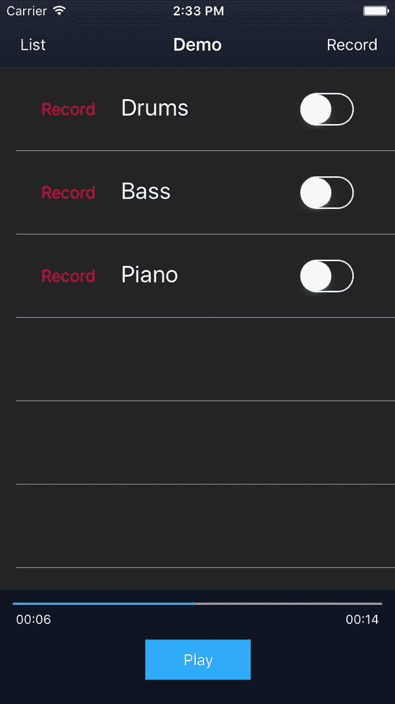
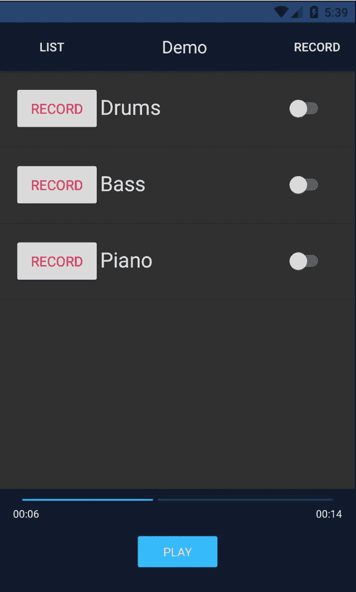

# 第七章：构建多轨播放器

我们已经到达了 NativeScript 开发的关键点：通过 TypeScript 直接访问 iOS 的 Objective-C/Swift API 和 Android 的 Java API。

这无疑是 NativeScript 最独特的特点之一，为您作为移动开发者打开了众多机会。特别是，我们的应用程序将需要利用 iOS 和 Android 上的丰富原生音频 API，以实现其核心能力，即为用户提供引人入胜的多轨录音/混音体验。

了解如何针对这些 API 进行编码对于解锁移动应用程序的全部潜力至关重要。此外，学习如何集成现有的 NativeScript 插件，这些插件可能已经在 iOS 和 Android 上提供了一致的 API，可以帮助您更快地实现目标。利用每个平台能提供的最佳性能将是我们在第三部分旅程中的重点。

在本章中，我们将涵盖以下内容：

+   集成 Nativescript-audio 插件

+   为我们的轨道播放器创建一个模型以实现未来的可扩展性

+   使用 RxJS 可观察对象进行工作

+   通过第三方库和视图绑定理解 Angular 的 NgZone

+   处理与多个音频源同步的音频播放

+   利用 Angular 的绑定以及 NativeScript 的原生事件绑定，以实现我们追求的精确可用性

+   使用 Angular 平台特定的指令为我们的播放器控件构建自定义穿梭滑块

# 通过 nativescript-audio 插件实现我们的多轨播放器

幸运的是，NativeScript 社区已经发布了一个插件，它为我们提供了一个一致的 API，可以在 iOS 和 Android 上使用，以便开始使用音频播放器。在实现功能之前，请随意浏览 [`plugins.nativescript.org`](http://plugins.nativescript.org)，*这是 NativeScript 插件的官方来源*，以确定现有的插件是否适合您的项目。

在这个案例中，位于 [`plugins.nativescript.org/plugin/nativescript-audio`](http://plugins.nativescript.org/plugin/nativescript-audio) 的 **nativescript-audio** 插件包含了我们开始集成应用程序功能播放器部分所需的内容，并且它在 iOS 和 Android 上都能工作。*它甚至提供了一个我们可能能够使用的录音器*。让我们先从安装它开始：

```js
npm install nativescript-audio --save
```

NativeScript 框架允许您与任何 npm 模块集成，从而打开了一个令人眼花缭乱的集成可能性，包括 NativeScript 特定的插件。实际上，如果您遇到 npm 模块给您带来麻烦的情况（可能是因为它依赖于在 NativeScript 环境中不兼容的 node API），甚至有一个插件可以帮助您处理这种情况，请参阅[`www.npmjs.com/package/nativescript-nodeify`](https://www.npmjs.com/package/nativescript-nodeify)。它详细描述在[`www.nativescript.org/blog/how-to-use-any-npm-module-with-nativescript`](https://www.nativescript.org/blog/how-to-use-any-npm-module-with-nativescript)。

在与 NativeScript 插件集成时，创建一个模型或 Angular 服务来围绕其集成提供隔离。

**尝试通过创建一个可重用的模型或 Angular 服务来隔离第三方插件集成点**。这不仅将为您的应用程序提供良好的未来可扩展性，而且在您需要用不同的插件替换该插件或为 iOS 或 Android 提供不同的实现时，将提供更多的灵活性。

# 为我们的多音轨播放器构建`TrackPlayerModel`

我们需要每个音轨都有自己的音频播放器实例，以及暴露一个 API 来加载音轨的音频文件。这也会提供一个很好的地方来暴露音频文件加载后的音轨时长。

由于这个模型可能会在整个应用程序中共享（预计未来还会与录音播放一起），我们将在`app/modules/shared/models/track-player.model.ts`中与我们的其他模型一起创建它：

```js
// libs
import { TNSPlayer } from 'nativescript-audio';

// app
import { ITrack } from 

'./track.model';

interface ITrackPlayer {
  trackId: number;
  duration: number;
  readonly 

player: TNSPlayer;
}

export class TrackPlayerModel implements ITrackPlayer {
  public trackId: 

number;
  public duration: number;

  private _player: TNSPlayer;

  constructor() {

this._player = new TNSPlayer();
  }

  public load(track: ITrack): Promise<number> {
    return 

new Promise((resolve, reject) => {
      this.trackId = track.id;

      this._player.initFromFile({
        audioFile: track.filepath,
        loop: false
      }).then(() => {

this._player.getAudioTrackDuration()
          .then((duration) => {
            this.duration = +duration;
            resolve();
          });
      });
    });
  }

  public get player(): 

TNSPlayer {
    return this._player;
  }
}
```

我们首先从`nativescript-audio`插件中导入甜美的 NativeScript 社区音频播放器`TNSPlayer`。然后，我们定义一个简单的接口来实现我们的模型，该接口将引用`trackId`、其`duration`以及一个用于`player`实例的`readonly`获取器。接着，我们将该接口包含在我们的实现中，它使用自身构建一个`TNSPlayer`实例。由于我们希望有一个灵活的模型，可以在任何时间加载其音轨文件，我们提供了一个接受`ITrack`的`load`方法，该方法利用了`initFromFile`方法。这反过来会异步获取音轨的总时长（以字符串形式返回，因此我们使用`+duration`），在模型中存储该数字，在解决音轨初始化完成之前。

为了保持一致性和标准，请确保也从`app/modules/shared/models/index.ts`导出这个新模型：

```js
export * from './composition.model';
export * from './track-player.model';
export * from 

'./track.model';
```

最后，我们提供了一个用于播放器实例的获取器，`PlayerService`将使用它。这使我们来到了下一步：打开`app/modules/player/services/player.service.ts`。我们将根据我们最新的发展对我们的初始实现进行一些修改；整体查看这个，我们将在之后解释：

```js
// angular
import { Injectable } from '@angular/core';

// libs
import { Subject } 

from 'rxjs/Subject';
import { Observable } from 'rxjs/Observable';

// app
import { ITrack, CompositionModel, TrackPlayerModel } from '../../shared/models';

@Injectable()
export class PlayerService {

  // observable state
  public playing$: 

Subject<boolean> = new Subject();
 public duration$: Subject<number> = new Subject

();
 public currentTime$: Observable<number>;

  // active composition
  private _composition: CompositionModel;
  // internal state 
  private _playing: 

boolean;
  // collection of track players
  private _trackPlayers: Array<TrackPlayerModel> 

= [];
  // used to report currentTime from
  private _longestTrack: 

TrackPlayerModel;

  constructor() {
    // observe currentTime changes every 1 seconds

this.currentTime$ = Observable.interval(1000)
 .map(_ => this._longestTrack ?
 this._longestTrack.player.currentTime
 : 0);
  }

  public set playing(value: boolean) 

{
 this._playing = value;
 this.playing$.next(value);
 }

  public get playing(): boolean {
 return 

this._playing;
 }

 public get composition(): CompositionModel 

{
 return this._composition;
 }

  public set 

composition(comp: CompositionModel) {
 this._composition = comp;

 // clear any previous players
 this._resetTrackPlayers();
 // setup 

player instances for each track
 let initTrackPlayer = (index: number) => {
 let track = this._composition.tracks[index];
 let trackPlayer = new 

TrackPlayerModel();
 trackPlayer.load(track).then(_ => {

 this._trackPlayers.push(trackPlayer);
 index++;
 if (index < 

this._composition.tracks.length) {
 initTrackPlayer(index);
 } 

else {
 // report total duration of composition
 this._updateTotalDuration();
 }
 });
 };
 // kick off multi-track player initialization
 initTrackPlayer

(0);
 }

 public togglePlay() {
 this.playing = 

!this.playing;
 if (this.playing) {
 this.play();
 } else {
 this.pause();
 }
 } 

  public play() {
 for (let t of this._trackPlayers) {
 t.player.play();
 }
 }

 public 

pause() {
 for (let t of this._trackPlayers) {
 t.player.pause

();
 }
 }

  ...

  private 

_updateTotalDuration() {
 // report longest track as the total duration of the mix
 let totalDuration = Math.max(
 ...this._trackPlayers.map(t => 

t.duration));
 // update trackPlayer to reflect longest track 
 for (let 

t of this._trackPlayers) {
 if (t.duration === totalDuration) {
 this._longestTrack = t;
 break;
 }
 } 
 this.duration$.next(totalDuration);
 }

 private _resetTrackPlayers() {
 for (let t of this._trackPlayers) {
 t.cleanup();
 }
 this._trackPlayers = [];
 } 
}
```

目前 `PlayerService` 的基石不仅在于管理混音中播放多个音轨的繁重工作，还在于提供一个状态，我们的视图可以观察以反映组合的状态。因此，我们有以下内容：

```js
...
// observable state
public playing$: Subject<boolean> = new Subject();
public duration$: 

Subject<number> = new Subject();
public currentTime$: Observable<number>;

// active 

composition
private _composition: CompositionModel;
// internal state 
private _playing: boolean;
// 

collection of track players
private _trackPlayers: Array<TrackPlayerModel> = [];
// used to report 

currentTime from
private _longestTrack: TrackPlayerModel;

constructor() {
  // observe currentTime 

changes every 1 seconds
  this.currentTime$ = Observable.interval(1000)
    .map(_ => this._longestTrack ?
      this._longestTrack.player.currentTime
      : 0);
  }
  ...
```

我们的视图需要知道播放状态以及 `duration` 和 `currentTime`。使用 `Subject` 对于 `playing$` 和 `duration$` 状态将工作得很好，因为它们如下：

+   它们可以直接发出值

+   它们不需要发出初始值

+   它们不需要任何可观察的组合

另一方面，`currentTime$` 将会根据一些组合来设置，因为它的值将依赖于可能随时间发展的间歇性状态（关于这一点稍后会有更多说明！）。换句话说，`playing$` 状态是我们通过用户（或基于播放器状态内部）进行的播放操作直接控制和发出的一个值，而 `duration$` 状态是我们直接发出的一个值，作为所有音轨播放器初始化并准备好的结果**。** 

`currentTime` 是播放器不会通过播放器事件自动发出的一个值，而是一个我们必须间歇性检查的值。因此，我们组合 `Observable.interval(1000)`，它将在订阅时每秒自动发出一个映射值，代表最长音轨播放实例的实际 `currentTime`。

其他 `private` 引用有助于维护服务内部状态。最有趣的是，我们将保留 `_longestTrack` 的引用，因为我们的组合的总时长将始终基于最长音轨，因此也将用于跟踪 `currentTime`。

这种设置将提供我们视图所需的基本要素，以实现适当的用户交互。

*RxJS 默认不包含任何操作符。因此，如果你现在运行 `Observable.interval(1000)` 和 `.map`，它们将使你的应用崩溃！*

当你开始更多地使用 RxJS 时，创建一个 `operators.ts` 文件并将所有 RxJS 操作符导入其中是个好主意。然后，在根 `AppComponent` 中导入该文件，这样你就不需要在代码库的各个地方散布那些操作符导入。

创建 `app/operators.ts` 并包含以下内容：

```js
import 'rxjs/add/operator/map';
import 'rxjs/add/observable/interval';
```

然后，打开 `app/app.component.ts` 并在第一行导入该文件：

```js
import './operators';
...
```

现在，我们可以自由地在代码的任何地方使用 map、interval 以及我们需要的任何其他 `rxjs` 操作符，前提是我们将它们导入到那个单一文件中。

我们服务的下一部分相当直观：

```js
public set playing(value: boolean) {
  this._playing = value;
  this.playing$.next(value);
}

public get playing(): boolean {
  return this._playing;
}

public get composition(): CompositionModel 

{
  return this._composition;
}
```

我们的 `playing` 设置器确保内部状态 `_playing` 被更新，以及 `playing$` 主题的值被发出，以便任何需要对此状态变化做出反应的订阅者。为了保险起见，还添加了一些方便的获取器。我们组合的下一个设置器变得相当有趣，因为这是我们与新的 `TrackPlayerModel` 交互的地方：

```js
public set composition(comp: CompositionModel) {
  this._composition = comp;

  // clear any previous 

players
  this._resetTrackPlayers();
  // setup player instances for each track
  let initTrackPlayer = 

(index: number) => {
    let track = this._composition.tracks[index];
    let trackPlayer = new 

TrackPlayerModel();
    trackPlayer.load(track).then(_ => {

      this._trackPlayers.push

(trackPlayer);
      index++;
      if (index < this._composition.tracks.length) {

initTrackPlayer(index);
      } else {
        // report total duration of composition

this._updateTotalDuration();
      }
    });
  };
  // kick off multi-track player initialization

 initTrackPlayer(0);
}
...
private _resetTrackPlayers() {
  for (let t of this._trackPlayers) {

 t.cleanup();
  }
  this._trackPlayers = [];
}
```

每当我们设置活动作品时，我们首先确保我们的服务内部`_trackPlayers`引用被正确清理和清除，使用`this._resetTrackPlayers()`。然后我们设置一个本地方法`initTrackPlayer`，它可以被迭代调用，考虑到每个播放器的`load`方法具有异步特性，以确保每个轨道的播放器正确加载音频文件，包括其时长。每次成功加载后，我们将它添加到我们的`_trackPlayers`集合中，迭代并继续，直到所有音频文件都加载完成。完成后，我们调用`this._updateTotalDuration()`来确定我们轨道作品的最终时长：

```js
private _updateTotalDuration() {
  // report longest track as the total duration of the mix
  let 

totalDuration = Math.max(
    ...this._trackPlayers.map(t => t.duration));
  // update trackPlayer to reflect 

longest track 
  for (let t of this._trackPlayers) {
    if (t.duration === totalDuration) {

this._longestTrack = t;
      break;
    }
  }
  this.duration$.next(totalDuration);
}
```

由于应该始终使用最长时长的轨道来确定整个作品的持续时间，我们使用`Math.max`来确定最长时长，然后存储对轨道的引用。因为可能有多个轨道具有相同的时长，所以使用哪个轨道并不重要，只要有一个匹配最长时长即可。这个`_longestTrack`将作为我们的*节奏设定者*，因为它将用于确定整个作品的`currentTime`。最后，我们通过`duration$`主题将最长时长作为`totalDuration`发射给任何订阅的观察者。

接下来的几个方法提供了我们作品整体播放控制的基础：

```js
public togglePlay() {
  this.playing = !this.playing;
  if (this.playing) {
    this.play();
  } 

else {
    this.pause();
  }
}

public play() {
  for (let t of this._trackPlayers) {

 t.player.play();
  }
}

public pause() {
  for (let t of this._trackPlayers) {

t.player.pause();
  }
}
```

我们 UI 中的主要播放按钮将使用`togglePlay`方法来控制播放，因此也用于切换内部状态以及激活所有轨道播放器的播放或暂停方法。

# 让音乐播放！

为了尝试所有这些，让我们添加来自由杰出的*Jesper Buhl Trio*创作的爵士曲目*What Is This Thing Called Love*的三个样本音频文件。这些曲目已经由鼓、贝斯和钢琴分开。我们可以将这些`.mp3`文件添加到`app/audio`文件夹中。

让我们修改`MixerService`中我们的演示作品的轨道，以提供对这些新真实音频文件的引用。打开`app/modules/mixer/services/mixer.service.ts`并进行以下修改：

```js
private _demoComposition(): Array<IComposition> {
  // starter composition for user to demo on first 

launch
  return [
    {
      id: 1,
      name: 'Demo',
      created: Date.now(),

order: 0,
      tracks: [
 {
 id: 1,
 name: 'Drums',
 order: 0,
 filepath: 

'~/audio/drums.mp3'
 },
 {
 id: 2,
 name: 'Bass',
 order: 1,
 filepath: '~/audio/bass.mp3'
 },
 {
 id: 3,
 name: 'Piano',
 order: 

2,
 filepath: '~/audio/piano.mp3'
 }
 ]
    }
  ];
}
```

现在让我们向我们的播放器控制输入一个输入，这将选择我们的选定作品。打开`app/modules/mixer/components/mixer.component.html`，并进行以下高亮显示的修改：

```js
<action-bar [title]="composition.name"></action-bar>
<GridLayout rows="*, auto" columns="*" 

class="page">
  <track-list [tracks]="composition.tracks" row="0" col="0"> 
  </track-list>

<player-controls [composition]="composition"
    row="1" col="0"></player-controls>
</GridLayout>
```

然后，在`PlayerControlsComponent`的`app/modules/player/components/player- controls/player-controls.component.ts`中，我们现在可以通过其各种可观察对象观察`PlayerService`的状态：

```js
// angular
import { Component, Input } from '@angular/core';

// libs
import { Subscription } from 'rxjs/Subscription';

// app
import { ITrack, 

CompositionModel } from '../../../shared/models';
import { PlayerService } from '../../services';

@Component({
  moduleId: module.id,
  selector: 'player-controls',
  templateUrl: 'player-

controls.component.html'
})
export class PlayerControlsComponent {

  @Input() composition: 

CompositionModel;

  // ui state
  public playStatus: string = 'Play';
  public duration: 

number = 0;
  public currentTime: number = 0;

  // manage subscriptions
  private _subPlaying: 

Subscription;
 private _subDuration: Subscription;
 private _subCurrentTime: 

Subscription;

  constructor(
    private playerService: PlayerService
  ) { }

public togglePlay() {
 this.playerService.togglePlay();
 } 

  ngOnInit() {
    // init audio player for composition

this.playerService.composition = this.composition;
    // react to play state

this._subPlaying = this.playerService.playing$
 .subscribe((playing: boolean) => 

{
        // update button state
 this._updateStatus(playing); 
        // 

update slider state
 if (playing) {
 this._subCurrentTime = 

this.playerService
 .currentTime$
 .subscribe

((currentTime: number) => {
 this.currentTime = currentTime;
 });
 } else if (this._subCurrentTime) {
 this._subCurrentTime.unsubscribe();
 }
 });
    // 

update duration state for slider
    this._subDuration = this.playerService.duration$
 .subscribe((duration: number) => {
 this.duration = duration;
 });
  }

  ngOnDestroy() {
    // cleanup

if (this._subPlaying)
 this._subPlaying.unsubscribe(); 
 if 

(this._subDuration)
 this._subDuration.unsubscribe(); 
 if 

(this._subCurrentTime)
 this._subCurrentTime.unsubscribe();
  } 

  private _updateStatus(playing: boolean) {
 this.playStatus = 

playing ? 'Stop' : 'Play';
 }
}
```

`PlayerControlComponent` 的基石现在是其通过 `ngOnInit` 中的 `this.playerService.composition = this.composition` 来设置活动组合的能力，这时组合输入已经就绪，以及订阅 `PlayerService` 提供的各种状态来更新我们的 UI。这里最有趣的是 `playing$` 订阅，它根据是否播放来管理 `currentTime$` 订阅。如果你还记得，我们的 `currentTime$` 可观察者是从 `Observable.interval(1000)` 开始的，这意味着每秒会发出最长轨道的 `currentTime`，这里再次列出以供参考：

```js
this.currentTime$ = Observable.interval(1000)
  .map(_ => this._longestTrack ?

this._longestTrack.player.currentTime
    : 0);
```

我们只想在播放参与时更新 `Slider` 的 `currentTime`；因此，当 `playing$` 主题发出 `true` 时，这将允许我们的组件每秒接收播放器的 `currentTime`。当 `playing$` 发出 `false` 时，我们取消订阅，不再接收 `currentTime` 更新。非常好。

我们还订阅了我们的 `duration$` 主题来更新滑块的 `maxValue`。最后，我们确保通过它们在 `ngOnDestroy` 中的 `Subscription` 引用清理所有订阅。

让我们看看 `PlayerControlsComponent` 的视图绑定，它在 `app/modules/player/components/player-controls/player-controls.component.html`：

```js
<GridLayout rows="100" columns="100,*"
  row="1" col="0" class="p-x-10">
  <Button [text]

="playStatus" (tap)="togglePlay()"
    row="0" col="0" class="btn btn-primary w-

100"></Button>
  <Slider [maxValue]="duration" [value]="currentTime" 
    minValue="0" row="0" col="1" class="slider">  
  </Slider>
</GridLayout>
```

如果你运行应用程序，你现在可以选中演示组合，并在 iOS 和 Android 上播放音乐。

*音乐动听！这真是太棒了。事实上，它简直太棒了！！*

在这个阶段，你可能注意到或希望以下几件事情：

+   在选择播放按钮后，它正确地变为停止，但当播放到达末尾时，它不会返回到原始的播放文本。

+   `Slider` 也应该返回到位置 0 以重置播放。

+   iOS 上的总 `duration` 和 `currentTime` 使用秒；然而，Android 使用毫秒。

+   在 iOS 上，如果你在组合的演示轨道播放期间多次选择播放/暂停，你可能会注意到所有轨道上非常微妙的播放同步问题。

+   需要当前时间和持续时间标签。

+   **播放寻找** 很好，能够将滑块穿梭以控制播放位置。

# 完善实现

我们在模型和服务中缺少一些重要的部分来真正完善我们的实现。让我们从处理轨道播放实例的完成和错误条件开始。打开 `TrackPlayerModel` 在 `app/modules/shared/models/track-player.model.ts`，并添加以下内容：

```js
... export interface IPlayerError {
 trackId: number;
 error: any;
}

export class TrackPlayerModel implements ITrackPlayer {

  ...
  private _completeHandler: (number) => void;
 private _errorHandler: 

(IPlayerError) => void;

  ...

  public load(
    track: ITrack, 

complete: (number) => void, 
 error: (IPlayerError) => void
  ): 

Promise<number> {
    return new Promise((resolve, reject) => {
      ...

this._completeHandler = complete;
 this._errorHandler = error;

this._player.initFromFile({
        audioFile: track.filepath,
        loop: false,

completeCallback: this._trackComplete.bind(this),
 errorCallback: 

this._trackError.bind(this) ... private _trackComplete(args: any) {
    // TODO: 

works well for multi-tracks with same length
    // may need to change in future with varied lengths

this.player.seekTo(0);
    console.log('trackComplete:', this.trackId);
    if (this._completeHandler)

this._completeHandler(this.trackId); 
  }

  private _trackError(args: any) {
    let error = 

args.error;
    console.log('trackError:', error);
    if (this._errorHandler)
      this._errorHandler({ 

trackId: this.trackId, error }); 
 }
```

我们首先使用 `IPlayerError` 定义每个轨道错误的形状。然后，我们定义通过 `load` 参数捕获的 `_completeHandler` 和 `_errorHandler` 函数的引用，现在这些函数需要完整的和错误回调。我们在将模型内部的 `this._trackComplete` 和 `this._trackError`（使用 `.bind(this)` 语法确保函数作用域锁定到自身）分配给 `TNSPlayer` 的 `completeCallback` 和 `errorCallback` 之前分配这些。 

`completeCallback`和`errorCallback`将在区域外触发。这就是为什么我们在本章后面注入`NgZone`并使用`ngZone.run()`。我们可以通过创建一个使用`zonedCallback`函数的回调来避免这种情况。它将确保回调将在创建回调的同一区域中执行。例如：

```js
this._player.initFromFile({
  audioFile: track.filepath,
  loop: false,
  completeCallback: 

zonedCallback(this._trackComplete.bind(this)),
  errorCallback: 

zonedCallback(this._trackError.bind(this))
  ...
```

这使我们能够在分发这些条件之前内部处理每个条件。

其中一个内部条件是在音频播放完成后将每个音频播放器重置为零，所以我们只需调用`TNSPlayer`的`seekTo`方法来重置它。我们标记为*待办事项*，因为尽管当所有轨道长度相同（如我们的演示轨道）时这效果很好，但在我们开始录制不同长度的多轨时，这可能会在未来变得可能有问题。想象一下，在一个作品中我们有两个轨道：轨道 1 时长 1 分钟，轨道 2 时长 30 秒。如果我们播放作品到 45 秒并按暂停，轨道 2 已经调用了其完成处理程序并重置回 0。然后我们按播放来继续。轨道 1 从 45 秒开始继续，但轨道 2 回到了 0。*我们将在到达那里时解决它，所以不要担心！* 到目前为止，我们正在完善第一阶段实现。

最后，我们调用分配的`completeHandler`来通知调用者哪个`trackId`已经完成。对于`trackError`，我们简单地调用传递`trackId`和`error`。

现在，让我们回到`PlayerService`并连接这个功能。打开`app/modules/player/services/player.service.ts`并做出以下修改：

```js
// app
import { ITrack, CompositionModel, TrackPlayerModel, IPlayerError } from 

'../../shared/models';

@Injectable()
export class PlayerService {

  // observable state
  ...
  public complete$: Subject<number> = new Subject();
  ... public set 

composition(comp: CompositionModel) {...let initTrackPlayer = (index: 

number) => {...trackPlayer.load(
        track,

   this._trackComplete.bind(this),
        this._trackError.bind(this)

  ...

 private _trackComplete(trackId: number) {
    console.log('track complete:', trackId);
    this.playing = 

false;
    this.complete$.next(trackId);
  }

  private _trackError(playerError: IPlayerError) {

  console.log(`trackId ${playerError.trackId} error:`,
      playerError.error);
  }
  ...
```

我们添加了另一个主题，`complete$`，以便视图组件可以在轨道播放完成时订阅。此外，我们还添加了两个回调处理程序，`_trackComplete`和`_trackError`，我们将它们传递给`TrackPlayerModel`的`load`方法。

然而，如果我们尝试在任何视图组件中由于`complete$`订阅触发而更新视图绑定，你会注意到一些令人困惑的事情。**视图不会更新！**

每次你与第三方库集成时，请注意来自库的回调处理程序，你可能打算更新视图绑定。在需要的地方注入 NgZone 并使用`this.ngZone.run(() => ...`包裹。

提供回调的第三方库可能经常需要通过 Angular 的 NgZone 运行。如果你想了解更多关于区域的信息，Thoughttram 的伟大团队发布了一篇很好的文章，可以在[`blog.thoughtram.io/angular/2016/02/01/zones-in-angular-2.html`](https://blog.thoughtram.io/angular/2016/02/01/zones-in-angular-2.html)找到。

第三方库`nativescript-audio`与 iOS 和 Android 的原生音频播放器集成，并提供你可以连接起来处理完成和错误条件的回调。这些回调在原生音频播放器的上下文中异步执行，并且由于它们不是在用户事件（如点击、网络请求的结果或`setTimeout`定时器）的上下文中处理的，因此如果我们希望它们导致视图绑定的更新，我们需要确保结果和随后的代码执行在 Angular 的 NgZone 中进行。

由于我们希望`complete$`主题导致视图绑定更新（特别是重置我们的滑块），我们将注入 NgZone 并包装我们的回调处理。回到`app/modules/player/services/player.service.ts`，让我们进行以下调整：

```js
// angular
import { Injectable, NgZone } from '@angular/core';

@Injectable()

export class PlayerService {

  ...
  constructor(private ngZone: NgZone) {}

...
  private _trackComplete(trackId: number) {
    console.log('track complete:', trackId);

this.ngZone.run(() => {
      this.playing = false;
      this.complete$.next(trackId);

   });
  }
  ...
```

现在，当使用这个新的`complete$`主题来响应我们的服务状态时，我们将非常明确。让我们调整`PlayerControlsComponent`在`app/modules/player/components/player-controls/player-controls.component.ts`中的设置，以观察`complete$`主题来重置我们的`currentTime`绑定：

```js
export class PlayerControlsComponent {

  ...
  private _subComplete: Subscription;
  ...
  ngOnInit() {
    ...
    // completion should reset currentTime
    this._subComplete 

= this.playerService.complete$.subscribe(_ => {
 this.currentTime = 0;
 });
  }
  ngOnDestroy() {
    ...
    if (this._subComplete) this._subComplete.unsubscribe(); 
  }
  ...
```

iOS 音频播放器报告`duration`和`currentTime`为秒，而 Android 报告为毫秒。我们需要标准化这一点！

让我们在`PlayerService`中添加一个方法来标准化时间，这样我们就可以依赖提供秒数时间的两个平台：

```js
...
// nativescript
import { isIOS } from 'platform';
...

@Injectable()
export class PlayerService {

 constructor() {
   // observe currentTime changes 

every 1 seconds
   this.currentTime$ = Observable.interval(1000)
     .map(_ => this._longestTrack ?

  this._standardizeTime(
 this._longestTrack.player.currentTime)

: 0;
     );
 }
 ...
 private _updateTotalDuration() {
   ...
   // iOS: reports 

duration in seconds
 // Android: reports duration in milliseconds
 // 

standardize to seconds
   totalDuration = this._standardizeTime(totalDuration);

console.log('totalDuration of mix:', totalDuration);
   this.duration$.next(totalDuration);
 }
 ...

private _standardizeTime(time: number) {
 return isIOS ? time : time * .001;
 }
 ...
```

我们可以利用 NativeScript 的`platform`模块提供的`isIOS`布尔值，有条件地调整我们的时间，将 Android 的毫秒转换为秒。

使用 NativeScript 的`platform`模块中的`isIOS`和/或`isAndroid`布尔值是在代码库中需要时进行平台调整的非常有效的方法。

**那么，iOS 上多个音轨的微妙播放同步问题怎么办呢？**

在 iOS 上，如果你在 14 秒的播放时间内多次选择播放/暂停，你可能会注意到所有音轨上都非常微妙的播放同步问题。我们可以推测这可能在 Android 的某个时刻也会发生。

# 通过直接从 nativescript-audio 插件调用底层 iOS AVAudioPlayer 实例的本地 API 来利用 NativeScript 的优势。

让我们在播放/暂停逻辑中插入一些安全措施，以帮助确保我们的音轨尽可能同步到我们的编程能力。`nativescript-audio`插件提供了一个仅适用于 iOS 的方法，称为`playAtTime`。它与特殊的`deviceCurrentTime`属性协同工作，正如 Apple 在其针对此目的的文档中所描述的，可以在[`developer.apple.com/reference/avfoundation/avaudioplayer/1387462-devicecurrenttime?language=objc`](https://developer.apple.com/reference/avfoundation/avaudioplayer/1387462-devicecurrenttime?language=objc)找到。

由于`deviceCurrentTime`属性没有被 nativescript-audio 插件暴露，我们可以通过`ios`获取器直接访问原生属性。让我们调整`PlayerService`的`play`方法来使用它：

```js
public play() {
  // for iOS playback sync
 let shortStartDelay = .01;
 let 

now = 0;

 for (let i = 0; i < this._trackPlayers.length; i++) {
 let track = this._trackPlayers[i];
 if (isIOS) {
 if (i == 0) now = 

track.player.ios.deviceCurrentTime;
 (<any>track.player).playAtTime

(now + shortStartDelay);
 } else {
 track.player.play

();
 }
 } 
}
```

由于`track.player`是我们的`TNSPlayer`实例，我们可以通过其**ios**获取器直接访问底层原生平台播放器实例（对于 iOS，它是`AVAudioPlayer`），以直接访问`deviceCurrentTime`。为了保险起见，我们提供了一个非常短的开始延迟，将其添加到第一首轨道的`deviceCurrentTime`中，并使用它来精确地同时启动所有轨道，这效果非常好！由于`playAtTime`没有通过 TypeScript 定义与 nativescript-audio 插件一起发布，我们在调用方法之前简单地将播放器实例（`<any>track.player`）进行类型转换，以满足 tsc 编译器。由于 Android 没有等效功能，我们将仅使用标准媒体播放器的播放方法，这对于 Android 来说效果很好。

现在让我们用类似的安全措施调整我们的暂停方法：

```js
public pause() {
  let currentTime = 0;

 for (let i = 0; i < 

this._trackPlayers.length; i++) {
 let track = this._trackPlayers[i];
 if 

(i == 0) currentTime = track.player.currentTime;
    track.player.pause();
    // ensure tracks pause 

and remain paused at the same time
    track.player.seekTo(currentTime);
  }
}
```

通过使用第一首轨道的`currentTime`作为**速度设置器**，我们在我们的混音中暂停每首轨道，并通过在暂停后立即跳转到相同的`currentTime`来确保它们保持完全相同的时间。这有助于确保当我们恢复播放时，它们都从相同的时间点开始。让我们在下一节中构建自定义穿梭滑块时使用所有这些功能。

# 创建自定义 ShuttleSliderComponent

如果没有来回穿梭混音的能力，我们就无法拥有多轨录音室体验！让我们加大力度，增强`Slider`的功能，通过结合 NativeScript 和 Angular 为我们提供的所有最佳选项。在这个过程中，我们的播放器控件将开始变得非常有用。

从高层次开始，打开`app/modules/player/components/player-controls/player-controls.component.html`并将其替换为以下内容：

```js
<StackLayout row="1" col="0" class="controls">
  <shuttle-slider [currentTime]

="currentTime" 
 [duration]="duration"></shuttle-slider>
  <Button 

[text]="playStatus" (tap)="togglePlay()"
    class="btn btn-primary w-100"></Button>
</StackLayout>
```

我们正在用`StackLayout`替换`GridLayout`，以改变我们的播放器控件布局。让我们使用一个全宽的滑块堆叠在我们的播放/暂停按钮上方。我们追求的效果类似于 iPhone 上的 Apple Music 应用，其中滑块是全宽的，下面显示了当前时间和持续时间。现在，让我们构建我们的自定义`shuttle-slider`组件，并创建`app/modules/player/components/player-controls/shuttle-slider.component.html`，内容如下：

```js
<GridLayout #sliderArea rows="auto, auto" columns="auto,*,auto" 
  class="slider-area">
  <Slider 

#slider slim-slider minValue="0" [maxValue]="duration"
      colSpan="3" class="slider"></Slider>

<Label #currentTimeDisplay text="00:00" class="h4 m-x-5" row="1" col="0">
  </Label>
  <Label 

[text]="durationDisplay" class="h4 text-right m-x-5"
    row="1" col="2"></Label>
</GridLayout>
```

这里将会变得非常有趣。我们将结合有用的 Angular 绑定，例如这些绑定：`[maxValue]="duration"` 和 `[text]="durationDisplay"`。然而，对于我们的其他可用性连接，我们希望有更多精细粒度和手动控制。例如，我们的包含 `GridLayout` 通过 `#sliderArea` 将是用户能够触摸以穿梭前后而不是 `Slider` 组件本身的区域，我们将完全禁用用户与 `Slider` 本身的交互（因此，您看到了 `slim-slider` 指令属性）。滑块将仅用于其时间的视觉表示。

我们将这样做的原因是我们希望这种交互启动几个程序性操作：

+   在穿梭时暂停播放（如果正在播放）

+   在前后移动时更新当前时间显示标签

+   以受控方式启动轨道播放器实例的 `seekTo` 命令；因此，减少多余的寻求命令

+   如果在尝试穿梭之前正在播放，则在不再穿梭时恢复播放

如果我们使用带有 Angular 绑定到 `currentTime` 的 `Slider`，并通过 `currentTime$` 可观察对象来控制它，而这个可观察对象又是由我们与它的交互以及我们轨道播放器的状态来控制的，那么这些元素之间的耦合将过于紧密，无法实现我们需要的精细粒度控制。

我们即将要做的事情的美丽之处，作为如何灵活地将 Angular 与 NativeScript 结合的典范证明。让我们从 `app/modules/player/components/player-controls/shuttle-slider.component.ts` 中的交互编程开始；以下是我们将完全展示的完整设置，我们将在稍后分解：

```js
// angular
import { Component, Input, ViewChild, ElementRef } from '@angular/core';

// 

nativescript
import { GestureTypes } from 'ui/gestures';
import { View } from 'ui/core/view';
import { Label 

} from 'ui/label';
import { Slider } from 'ui/slider';
import { Observable } from 'data/observable';
import 

{ isIOS, screen } from 'platform';

// app
import { PlayerService } from '../../services';

@Component({
  moduleId: module.id,
  selector: 'shuttle-slider',
  templateUrl: 'shuttle-

slider.component.html',
  styles: [`
    .slider-area {
      margin: 10 10 0 10;
    }

.slider {
      padding:0;
      margin:0 0 5 0;
      height:5;
    }
  `]
})
export 

class ShuttleSliderComponent {

  @Input() currentTime: number; 
  @Input() duration: number; 

 @ViewChild('sliderArea') sliderArea: ElementRef;
  @ViewChild('slider') slider: ElementRef;

@ViewChild('currentTimeDisplay') currentTimeDisplay: ElementRef;

  public durationDisplay: string;

  private _sliderArea: View;
  private _currentTimeDisplay: Label;
  private _slider: Slider;
  private 

_screenWidth: number;
  private _seekDelay: number;

  constructor(private playerService: PlayerService) { 

}

  ngOnChanges() {
    if (typeof this.currentTime == 'number')   {
      this._updateSlider

(this.currentTime);
    }
    if (this.duration) {
      this.durationDisplay = 

this._timeDisplay(this.duration);
    }
  }

  ngAfterViewInit() {
    this._screenWidth = 

screen.mainScreen.widthDIPs;
    this._sliderArea = <View>this.sliderArea

.nativeElement;
    this._slider = <Slider>this.slider.nativeElement;
    this._currentTimeDisplay = 

<Label>this.currentTimeDisplay
                                 .nativeElement;

this._setupEventHandlers();
  }

  private _updateSlider(time: number) {
    if (this._slider) 

this._slider.value = time;
    if (this._currentTimeDisplay)
      this._currentTimeDisplay
        .text = 

this._timeDisplay(time);
  }

  private _setupEventHandlers() {
    this._sliderArea.on

(GestureTypes.touch, (args: any) => {
      this.playerService.seeking = true;
      let x = args.getX();

      if (x >= 0) {
        let percent = x / this._screenWidth;
        if (percent > .5) {

        percent += .05;
        }
        let seekTo = this.duration * percent;
        this._updateSlider

(seekTo);

        if (this._seekDelay) clearTimeout(this._seekDelay);
        this._seekDelay = setTimeout

(() => {
          // android requires milliseconds
          this.playerService
            .seekTo

(isIOS ? seekTo : (seekTo*1000));
        }, 600);
      }
    });
  }

  private 

_timeDisplay(seconds: number): string {
    let hr: any = Math.floor(seconds / 3600);
    let min: any = 

Math.floor((seconds - (hr * 3600))/60);
    let sec: any = Math.floor(seconds - (hr * 3600) 

- (min * 60));
    if (min < 10) { 
      min = '0' + min; 
    }
    if (sec < 10){ 

sec = '0' + sec;
    }
    return min + ':' + sec;
  }
}
```

对于一个相当小的组件占用空间，这里正在进行着许多精彩的事情！让我们来分解一下。

让我们来看看那些属性装饰器，从 `@Input` 开始：

```js
@Input() currentTime: number; 
@Input() duration: number; 

// allows these property bindings to flow into our view:
<shuttle-slider 
 [currentTime]

="currentTime" 
  [duration]="duration">
</shuttle-slider>
```

然后，我们有我们的 `@ViewChild` 引用：

```js
@ViewChild('sliderArea') sliderArea: ElementRef;
@ViewChild('slider') 

slider: ElementRef;
@ViewChild('currentTimeDisplay') currentTimeDisplay: ElementRef;

private _sliderArea: StackLayout;
private _currentTimeDisplay: Label;
private _slider: Slider;// provides us with references to these view components<StackLayout 

#sliderArea class="slider-area">
  <Slider #slider slim-slider

minValue="0 [maxValue]="duration" class="slider">
  </Slider>
  <GridLayout rows="auto" 

columns="auto,*,auto"
    class="m-x-5">
    <Label #currentTimeDisplay text="00:00" 

class="h4"
      row="0" col="0"></Label>
    <Label [text]="durationDisplay" class="h4 text-right" 

      row="0" col="2"></Label>
  </GridLayout>
</StackLayout>
```

我们可以在我们的组件中访问这些 `ElementRef` 实例以编程方式与之交互；然而，不是立即。由于 `ElementRef` 是视图组件的代理包装器，其底层的 `nativeElement`（我们的实际 NativeScript 组件）只有在 Angular 的组件生命周期钩子 `ngAfterViewInit` 触发后才能访问。

在这里了解 Angular 的组件生命周期钩子：

[`angular.io/docs/ts/latest/guide/lifecycle-hooks.html.`](https://angular.io/docs/ts/latest/guide/lifecycle-hooks.html)

因此，我们在这里为我们的实际 NativeScript 组件分配私有引用：

```js
ngAfterViewInit() {
  *this._screenWidth = screen.mainScreen.widthDIPs;*
  this._sliderArea = 

<StackLayout>this.sliderArea
 .nativeElement;
 this._slider = <Slider>this.slider.nativeElement;
 this._currentTimeDisplay = 

<Label>this.currentTimeDisplay
 .nativeElement;
  *this._setupEventHandlers();*
}
```

我们还利用这个机会，通过 `platform` 模块中的 `screen` 工具使用 **密度无关像素**（**dip**）单位来引用整个屏幕宽度。这将允许我们使用用户在 `sliderArea` StackLayout 上的手指位置进行一些计算，以调整 `Slider` 的实际值。然后我们调用设置我们基本事件处理程序。

使用我们的 `_sliderArea` 引用到的包含 StackLayout，我们添加一个 `touch` 触摸监听器来捕获用户对滑动区域的任何触摸操作：

```js
private _setupEventHandlers() {
  this._sliderArea.on(GestureTypes.touch, (args: any) => {

*this.playerService.seeking = true; // TODO*

    let x = args.getX();
    if (x >= 0) {

  // x percentage of screen left to right
      let percent = x / this._screenWidth;
      if (percent > .5) 

{
        percent += .05; // non-precise adjustment
      }
      let seekTo = this.duration * percent;
      this._updateSlider(seekTo);

      if (this._seekDelay) clearTimeout(this._seekDelay);

this._seekDelay = setTimeout(() => {
        // android requires milliseconds

this.playerService.seekTo(
          isIOS ? seekTo : (seekTo*1000));
      }, 600);
    }
  });
}
```

这允许我们通过 `args.getX()` 获取他们手指的 `X` 位置。我们使用这个值除以用户设备屏幕宽度来确定从左到右的百分比。由于我们的计算并不完全精确，当用户通过 50% 标记时，我们会进行微调。这种可用性目前适用于我们的用例，但我们将保留以后改进的选项；然而，现在这完全没问题。

然后，我们将持续时间乘以这个百分比来获取我们的 `seekTo` 标记，以更新 `Slider` 的值，以便使用手动精度获取即时的 UI 更新：

```js
private _updateSlider(time: number) {
  if (this._slider) this._slider.value = time;
  if 

(this._currentTimeDisplay)
    this._currentTimeDisplay.text = this._timeDisplay(time);
}
```

在这里，我们实际上是在直接使用 NativeScript 组件，而不涉及 Angular 的绑定或 NgZone。在需要精细粒度和性能控制 UI 的情况下，这可以非常方便。由于我们希望 `Slider` 轨道随着用户的指尖立即移动，以及时间显示标签以标准音乐时间码格式化以表示他们交互时的实时时间，我们直接在适当的时间设置它们的值。

然后我们使用搜索延迟超时以确保我们不会向多轨播放器发出额外的搜索命令。用户的每次移动都会进一步延迟实际发出搜索命令，直到他们将其放置在想要的位置。我们还使用我们的 `isIOS` 布尔值根据每个平台音频播放器的需要适当地转换时间（iOS 为秒，Android 为毫秒）。

最有趣的可能就是我们的 `ngOnChanges` 生命周期钩子：

```js
ngOnChanges() {
  if (typeof this.currentTime == 'number') {
    this._updateSlider(this.currentTime);

 }
  if (this.duration) {
    this.durationDisplay = this._timeDisplay(this.duration);
  }
}
```

当 Angular 检测到组件（或指令）的 ***输入属性*** 发生变化时，它会调用其 `ngOnChanges()` 方法。

这是一种让 `ShuttleSliderComponent` 对其 `Input` 属性变化、`currentTime` 和 `duration` 做出反应的绝佳方式。在这里，我们只是在它有效数字触发时，通过 `this._updateSlider(this.currentTime)` 手动更新我们的滑块和当前时间显示标签。最后，我们还确保更新我们的持续时间显示标签。此方法将在 PlayerService 的 `currentTime$` 可观察对象在存在活动订阅的情况下每秒触发时调用。**太棒了**！哦，别忘了将 `ShuttleSliderComponent` 添加到 `COMPONENTS` 数组中，以便与模块一起包含。

现在，我们需要实际实现这一点：

```js
*this.playerService.seeking = true; // TODO*
```

我们将使用一些更巧妙的可观察操作技巧来处理我们的搜索状态。让我们打开 `app/modules/player/services/player.service.ts` 中的 PlayerService 并添加以下内容：

```js
...
export class PlayerService {

  ...
  // internal state 
  private _playing: boolean;
  private _seeking: boolean;
 private _seekPaused: boolean;
 private _seekTimeout: number;
  ...
  constructor(private ngZone: NgZone) {
    this.currentTime$ = 

Observable.interval(1000)
      .switchMap(_ => {
        if (this._seeking) 

{
 return Observable.never();
 } else if 

(this._longestTrack) {
          return Observable.of(
            this._standardizeTime(

this._longestTrack.player.currentTime));
        } else {
          return Observable.of(0);
        }

   });
  }
  ...
  public set seeking(value: boolean) {
 this._seeking = 

value;
 if (this._playing && !this._seekPaused) {
 // pause 

while seeking
 this._seekPaused = true;
 this.pause();
 }
 if (this._seekTimeout) clearTimeout(this._seekTimeout);
 this._seekTimeout = setTimeout(() => {
 this._seeking = false;
 if 

(this._seekPaused) {
 // resume play
 this._seekPaused = 

false;
 this.play();
 }
 }, 

1000);
 }

  public seekTo(time: number) {
 for 

(let track of this._trackPlayers) {
 track.player.seekTo(time);
 } 
 }
  ...
```

我们正在引入三个新的可观察操作符 `switchMap`、`never` 和 `of`，我们需要确保它们也被导入到我们的 `app/operators.ts` 文件中：

```js
import 'rxjs/add/operator/map';
import 'rxjs/add/operator/switchMap';
import 

'rxjs/add/observable/interval';
import 'rxjs/add/observable/never';
import 

'rxjs/add/observable/of';
```

`switchMap`允许我们的可观察对象根据几个条件切换流，帮助我们管理是否需要`currentTime`发出更新。显然，在搜索时，我们不需要对`currentTime`的变化做出反应。因此，当`this._seeking`为真时，我们将我们的可观察对象流切换到`Observable.never()`，确保观察者永远不会被调用。

在我们的`seeking`setter 中，我们调整内部状态引用（`this._seeking`），如果它当前是`this._playing`并且尚未因为搜索而被暂停（因此，`!this._seekPaused`），我们立即暂停播放（仅一次）。然后，如果搜索开始时正在播放，我们设置另一个超时，在`seekTo`从组件触发后额外延迟 400 毫秒恢复播放（因此，对`this._seekPaused`的检查）。

这样，用户可以自由地用手指在我们的穿梭滑块上滑动，他们想滑多远就滑多远，想滑多快就滑多快。他们将在实时中看到`Slider`轨道的 UI 更新以及当前时间显示标签；在此期间，我们避免发送不必要的`seekTo`命令到我们的多轨播放器，直到它们停下来，从而提供真正出色的用户体验。

# 为 iOS 和 Android 原生 API 修改创建 SlimSliderDirective

我们仍然需要为`Slider`上的`slim-slider`属性创建一个指令：

```js
<Slider #slider slim-slider minValue="0" [maxValue]="duration" 

class="slider"></Slider>
```

我们将创建特定于平台的指令，因为我们将在 iOS 和 Android 上调用滑块的真正原生 API 来禁用用户交互并隐藏滑块，以实现无缝的外观。

对于 iOS，创建`app/modules/player/directives/slider.directive.ios.ts`，内容如下：

```js
import { Directive, ElementRef } from '@angular/core';

@Directive({
 selector: '[slim-

slider]'
})
export class SlimSliderDirective {

  constructor(private el: ElementRef) { } 

ngOnInit() {
    let uiSlider = <UISlider>this.el.nativeElement.ios;
    uiSlider.userInteractionEnabled = 

false;
    uiSlider.setThumbImageForState(
      UIImage.new(), UIControlState.Normal);
  }
}
```

我们通过`Slider`组件本身的`ios`getter 访问底层的原生 iOS `UISlider`实例。我们使用 Apple 的 API 参考文档([`developer.apple.com/reference/uikit/uislider`](https://developer.apple.com/reference/uikit/uislider))来定位适当的 API，通过`userInteractionEnabled`标志禁用交互，并通过将空白设置为滑块来隐藏滑块。完美。

对于 Android，创建`app/modules/player/directives/slider.directive.android.ts`，内容如下：

```js
import { Directive, ElementRef } from '@angular/core';

@Directive({
  selector: '[slim-

slider]'
})
export class SlimSliderDirective {

  constructor(private el: ElementRef) { } 

ngOnInit() {
    let seekBar = <android.widget.SeekBar>this.el
                  .nativeElement.android;
    seekBar.setOnTouchListener(
      new android.view.View.OnTouchListener({
        onTouch(view, event) {
          return true;
        }
      })
    );
    seekBar.getThumb().mutate().setAlpha(0);

}
}
```

我们通过`Slider`组件上的`android`getter 访问原生`android.widget.SeekBar`实例。我们使用 Android 的 API 参考文档([`developer.android.com/reference/android/widget/SeekBar.html`](https://developer.android.com/reference/android/widget/SeekBar.html))来定位 SeekBar 的 API，通过重写`OnTouchListener`来禁用用户交互，并通过将 Drawable alpha 设置为 0 来隐藏滑块。

现在，创建`app/modules/player/directives/slider.directive.d.ts`：

```js
export declare class SlimSliderDirective { }
```

这将允许我们导入并使用我们的`SlimSlider`类作为标准的 ES6 模块；创建`app/modules/player/directives/index.ts`：

```js
import { SlimSliderDirective } from './slider.directive';

export const DIRECTIVES: any[] = [

SlimSliderDirective
];
```

在运行时，NativeScript 只会将适当的平台特定文件构建到目标平台中，完全排除不适用代码。这是在代码库中创建平台特定功能的一种非常强大的方式。

最后，让我们确保我们的指令已声明在`PlayerModule`中，位于`app/modules/player/player.module.ts`，以下是一些更改：

```js
...
import { DIRECTIVES } from './directives';
...

@NgModule({
  ...
  declarations: [
    ...COMPONENTS,
    ...DIRECTIVES
  ],
  ...
})
export class PlayerModule { }
```

我们现在应该在 iOS 上看到这一点，我们的播放暂停在 6 秒处：



对于 Android，情况如下：



你现在可以观察到以下情况：

+   所有三个轨道以完美的混音一起播放

+   不论是否正在播放，都可以通过滑块切换播放

+   播放/暂停切换

+   当播放结束时，我们的控件会正确重置

并且这一切在 iOS 和 Android 上都能正常工作。毫无疑问，这是一项了不起的成就。

# 摘要

现在，我们已经完全沉浸在 NativeScript 的丰富世界中，因为我们已经介绍了插件集成以及 iOS 和 Android 上对原生 API 的直接访问。更不用说，我们还有一个非常棒的具有完整播放控制的多人轨播放器，包括在混音中切换！

包括其 RxJS 可观察性基础在内的 Angular 的激动人心的组合，现在开始真正闪耀，我们能够在需要的地方利用视图绑定，并使用强大的可观察性组合对服务事件流做出反应，同时仍然保留手动以细粒度控制我们的 UI 的能力。无论是我们的视图需要 Angular 指令来丰富其功能，还是通过原始 NativeScript 功能的手动触摸手势控制，我们现在都可以轻松掌握。

事实上，我们一直在构建一个完全本地的 iOS 和 Android 应用程序，这确实令人震惊。

在下一章中，我们将继续深入挖掘原生 API 和插件，随着我们将录音功能引入我们的应用程序，以满足多轨录音室移动应用程序的核心需求。
